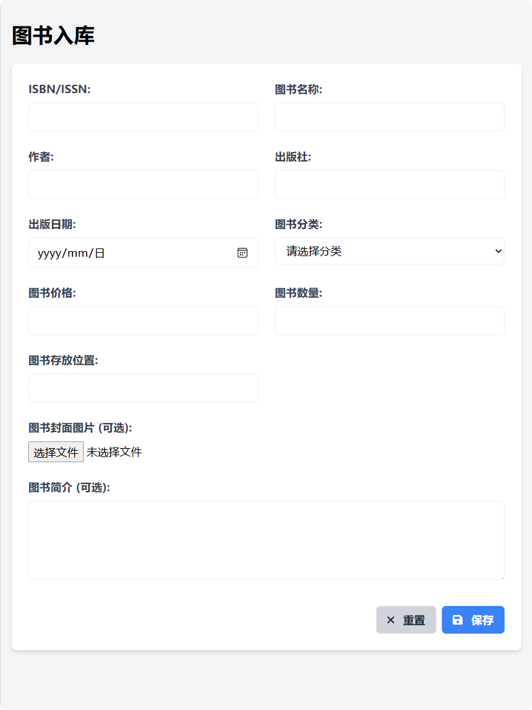

# AI与原型设计

随着多模态大模型的不断发展，使用AI深度参与原型设计已经成为一个切实可行的方案，本文将从生成界面原型的几种方法、如何保持风格一致性、如何生成前端讲解文案等三个大的方面进行讲解。

## AI生成原型方法

这里总的说来就是3种方法，也就是文生原型、截图生原型、手绘生原型

### 文生原型

说实话文生原型并不是很推荐，通过语言的方式很难精准描述界面，当然我们的界面也不是一挥而就的，一般开始于客户或者同事对界面的文字描述，我们可以先通过他们的描述，生成一个粗浅的界面原型，然后再逐步迭代完善。

AI通过粗浅的文字生成一个界面原型的能力是很强的，因为这种模型的精度要求不是很高，也可能很快在迭代中淘汰，所以即使性能很差的模型（比如gpt-4o-mini）也可以完成。

比如这里我们从需求文档中截取一段界面描述，交给AI处理

```markdown
系统显示图书入库界面，包含以下信息录入字段：

*   图书ISBN/ISSN
*   图书名称
*   作者
*   出版社
*   出版日期
*   图书分类
*   图书价格
*   图书数量
*   图书存放位置
*   图书封面图片（可选）
*   图书简介（可选）
```

可以看到效果还不错，基于此原型我们可以进一步和客户、同事沟通，产生更为精准的界面原型



### 截图生原型

截图生原型应该是主流的AI生原型的方式，当我们去做一个产品时，往往会借鉴一些成熟产品，获取他们的截图，交给AI去处理，随着现在多模态大模型的能力越来越强，这成为一个非常靠谱的选择，可以先看看效果。

参考的产品截图


这是一个相当复杂的管理端界面，需要大模型具备顶级的图片理解能力。使用如下提示词

```markdown
您是一位熟练的开发人员，精通HTML、JavaScript、CSS和TailwindCSS。请根据以下要求创建一个网页：使用Font Awesome图标，确保页面设计美观且响应式，包含必要的HTML结构和样式。
```

我使用的是**gemini-2.0-pro-exp-02-05**，来看看生成效果


美中不足的是图片占位符没有处理。在后续的过程中我也优化了相关提示词，具体可以看后文的实践。

### 手绘生原型

现实工作中，可能还存在广泛存在的一种情况，也就是在讨论过程中通过手绘的方式描述界面。这种情况比通过文字描述的方式要好很多，通过多模态大模型的应用，也可以得到不错的效果。

这里我用draw.io绘制了一个简单的图片


还是使用**gemini-2.0-pro-exp-02-05**和刚才的题词，我个人觉得是高度还原了设计稿。


## 保持风格一致性

介绍完以上3种方式，大家可能有了新的疑问，这些都是针对一些单独的界面，如果我们要做一系列的原型设计，如何保证这一系列原型设计的一致性呢？

### 案例介绍

这里我们来做一个小的案例的实践，由于是个体育迷，这里这个案例复刻了我天天使用的一款小程序“直播吧”

我们选取了以下几个界面：

#### 首页页面


#### 视频页面


#### 数据页面


#### 详情页面


### 案例实践

#### 确立风格

首先，我们通过生成首页来起步，也通过首页来确定整体的风格，通过之前的介绍，发现之前的提示词也存在一些问题，这里做了完善

```markdown
您是一位熟练的开发人员，精通HTML、JavaScript、CSS和TailwindCSS。请根据以下要求创建一个网页：使用Font Awesome图标和fakeimg或者Lorem Picsum处理图片占位，确保页面设计美观且响应式，包含必要的HTML结构和样式。
Font Awesome使用cloudflare提供的CDN服务，而不要使用kit.fontawesome.com提供的CDN服务
```

* 一个是说明了使用Font Awesome图标和fakeimg或者Lorem Picsum处理图片占位，这样让界面更具表现力
* 另外针对一些模型，比如gpt-4o，喜欢使用一些已经失效的Font Awesome CDN链接，做了一些提示词处理

来看看首页的生成效果，虽然页面很简单，但是复刻的还是不错


那么如何获取统一的模板，来保持风格一致性呢，这个也不需要我们动手，在本次对话后面追加以下内容，我这里用的是**gemini-2.0-flash-thinking-exp-01-21**，当然大家使用大热的**DeepSeek**也可以获得很好的效果。

```markdown
根据HTML提炼出界面模板，也就是相同的HTML文档结构、头部导航栏、底部导航栏，预留出主要内容区域
```


这样我们就得到了界面模板，可以看到AI很贴心的在主要内容区域区域做了注释，提示后来者**在这里添加你的主要内容**

```html
<!DOCTYPE html>
<html lang="zh-CN">
<head>
    <meta charset="UTF-8">
    <meta name="viewport" content="width=device-width, initial-scale=1.0">
    <title>直播吧 (示例)</title>
    <!-- Tailwind CSS CDN -->
    <script src="https://cdn.tailwindcss.com"></script>
    <!-- Font Awesome CDN (Cloudflare) -->
    <link rel="stylesheet" href="https://cdnjs.cloudflare.com/ajax/libs/font-awesome/6.5.1/css/all.min.css" integrity="sha512-DTOQO9RWCH3ppGqcWaEA1BIZOC6xxalwEsw9c2QQeAIftl+Vegovlnee1c9QX4TctnWMn13TZye+giMm8e2LwA==" crossorigin="anonymous" referrerpolicy="no-referrer" />
</head>
<body class="bg-gray-50 font-sans">
    <!-- 头部导航栏 -->
    <header class="bg-blue-500 text-white py-2 sticky top-0 z-10">
        <div class="container mx-auto px-4 flex items-center justify-between">
            <div class="font-bold text-xl">直播吧</div>
            <nav class="hidden sm:flex space-x-4">
                <a href="#" class="hover:text-blue-100">重要</a>
                <a href="#" class="hover:text-blue-100">全部</a>
                <a href="#" class="hover:text-blue-100">完赛</a>
                <a href="#" class="hover:text-blue-100">足球</a>
                <a href="#" class="hover:text-blue-100">NBA</a>
                <a href="#" class="hover:text-blue-100">电竞</a>
                <a href="#" class="hover:text-blue-100"><i class="fa-solid fa-ellipsis-h"></i></a>
            </nav>
            <div class="flex items-center space-x-4">
                <span class="sm:hidden"><i class="fa-solid fa-bars"></i></span> <!-- 汉堡菜单图标，小屏幕显示 -->
                <i class="fa-solid fa-star"></i>
                <i class="fa-solid fa-circle-user"></i>
            </div>
        </div>
    </header>

    <!-- 主要内容区域 -->
    <main class="container mx-auto px-4 py-4">
        <!-- 在这里添加你的主要内容 -->
        <div>
            <p>这里是主要内容区域，你可以在这里添加各种卡片、新闻、比赛信息等内容。</p>
            <p>请替换这段示例文字，开始构建你的页面内容。</p>
        </div>
    </main>

    <!-- 底部导航栏 -->
    <footer class="bg-white border-t border-gray-200 fixed bottom-0 left-0 right-0 z-10">
        <div class="container mx-auto px-4 py-2 flex justify-around items-center">
            <a href="#" class="text-gray-600 hover:text-blue-500 flex flex-col items-center">
                <i class="fa-solid fa-house"></i>
                <span class="text-xs">首页</span>
            </a>
            <a href="#" class="text-gray-600 hover:text-blue-500 flex flex-col items-center">
                <i class="fa-solid fa-video"></i>
                <span class="text-xs">视频</span>
            </a>
            <a href="#" class="text-gray-600 hover:text-blue-500 flex flex-col items-center">
                <i class="fa-regular fa-newspaper"></i>
                <span class="text-xs">新闻</span>
            </a>
            <a href="#" class="text-gray-600 hover:text-blue-500 flex flex-col items-center">
                <i class="fa-solid fa-list-ul"></i>
                <span class="text-xs">数据</span>
            </a>
            <a href="#" class="text-gray-600 hover:text-blue-500 flex flex-col items-center">
                <i class="fa-solid fa-user"></i>
                <span class="text-xs">我的</span>
            </a>
        </div>
    </footer>

</body>
</html>

```

#### 完成设计

有了界面模板，我们通过刚才的方式就可以陆续生成剩余的界面，大家也可以把这个提示词另存为一个助手，方便后续的操作。

````markdown
参考以下模板完成界面复制，头部导航栏和底部导航栏可以根据实际情况做适当修改，比如正在选中的图标等
```html
刚才得到的界面模板，内容略……
```
````


来看看效果，首先是视频列表界面


然后是数据界面，这个有点美中不足，因为我gemini-2.0-pro-exp-02-05的免费额度用完了，用的gemini-2.0-flash-exp，这里大家可以看到头部导航栏有所失误，内容还原的也有所缺失。这个大家自己手动改一下即可。


最后来看看赛事详情页面，这个不需要加载首页模板，因为他的头部导航栏和底部导航栏和首页都不一致


#### 总结

可以看到，我们基本只需要修改一些细节，就可以在保持风格一致性的基础上，完成整体UI的设计，当然和经典的界面原型设计工具比较，就是页面之间的跳转关系，还需要自己去实现。

另外，现在国产模型能力也非常厉害了，这是用Doubao-1.5-vision-pro-32k复刻的网红热帖中Claude生成的界面，感觉差距也不大。

网红热帖中Claude生成的效果如下


Doubao-1.5-vision-pro-32k复刻的


## 前端讲解文案

光有设计好的原型还不够，可能我们还需要做一个讲解稿，最好是做成视频的格式，方便用户深度理解。有了AI，这部分工作也省了，我们来看看如何操作。

```
这是我们制作的一款体育赛事直播软件的界面原型，请根据界面原型，写一段详细讲解每个界面功能的讲稿，要求讲解详细，文字过渡自然连贯
```


拿到这段讲稿，我们就可以制作PPT或者视频了，这里我通过自己开发的软件，结合GPT-SoVITS配音，做成了一段小视频


如上图，我们把每一段文字通过GPT-SoVITS生成了一段音频，然后指定一张界面截图作为配图，每张配图的播放时间由对应得音频的播放时长决定，最终通过ffmpeg生成视频。

实际是利用了ffmpeg的以下指令

```sh
# 根据 audio_list.txt 合并音频文件为 output.wav
ffmpeg -f concat -safe 0 -i audio_list.txt -c copy output.wav
# 根据 image_list.txt 合并图片为视频文件 output.mp4
ffmpeg -f concat -safe 0 -i image_list.txt -c:v libx264 -vf scale=-1:720 -pix_fmt yuv420p output.mp4
# 合并 output.mp4 和 output.wav
ffmpeg -i output.mp4 -i output.wav -c:v copy -c:a aac -map 0:v -map 1:a -shortest final_output.mp4
```


## 拓展阅读

* [一个提示词 claude 生成一个 app 的 ui/ux](https://ew6rccvpnmz.feishu.cn/wiki/ILO2waqXLi1EvqkuKHvcceMOnVd?fromScene=spaceOverview)

  * 和 pixso、figma 设计软件协作

    
