# AI与开发

## AI 模型选择

> 以下模型均指使用API调用，而不是官网界面调用，以下功能和免费策略基于本文编写时的版本和厂商活动

| 种类     | 特点                                                         | 适合场合                               |
| -------- | ------------------------------------------------------------ | -------------------------------------- |
| OpenAI   | 业界领先，没法直接访问，gpt-4o-mini价格便宜，编程使用足够了，支持多模态；text-embedding-ada-002支持embedding。 | 各种场合，全能                         |
| Gemini   | 谷歌出品，没法直接访问，编程使用足够了，支持多模态，但是每天有免费API额度 | 各种场合，全能                         |
| Claude   | 太贵了，没用过，据说全能                                     | 各种场合，全能                         |
| Moonshot | 编程使用足够了，支持多模态，注册赠送token，支持OpenAI兼容调用，支持function_call，支持缓存但使用麻烦 | OpenAI下位替代品                       |
| DeepSeek | 编程使用足够了，但是不支持多模态，注册赠送token（一月过期 ），支持OpenAI兼容调用，支持function_call，开源模型，国外很多产品使用它做测试，兼容性比较好，支持缓存命中（自动），缓存命中后价格极低，无并发限制 | 结合AI编程工具使用，做Cursor的下位替代 |
| Wenxin   | 部分低端API免费，高端比较贵，不支持多模态，注册赠送token     | 略                                     |
| QWen     | 比较贵，不支持多模态，注册有活动时赠送token，开源模型，国外很多产品使用它做测试，兼容性比较好 | 略                                     |

总结

* OpenAI：还是最好备用一个，个人觉得gpt-4o-mini便宜又好用，所有主流功能都支持
* Gemini：顶级模型每天都能白嫖API（当然活动可能随时结束），只要你能访问Google
* Claude：没用过
* Moonshot：用不了OpenAI可以备一个，除了不支持embedding以外，主流功能都支持
* DeepSeek：Cline + DeepSeek便宜又好用，不比Cursor差（主要是穷……）
* Wenxin、QWen等：如果免费的话可以用用

## AI编程环境

### 云端环境

云端环境，无需安装，即开即用：[豆包 MarsCode - 工作台](https://www.marscode.cn/dashboard)

可以直接导入Git仓库


### 使用TONGYI Lingma辅助编程

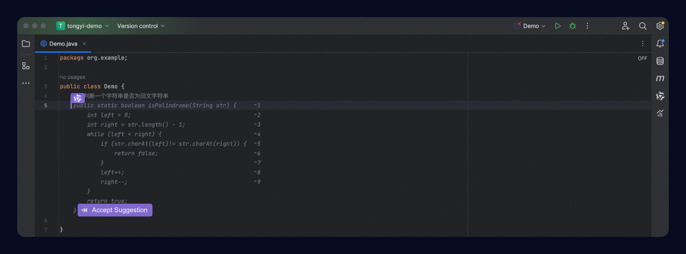

## 生成代码

### AI对话

比如我想生成一个脚本，把我Markdown所用到的图片压缩一下，可以这样写题词：

```
用Python的tkinter实现
选取一个文件目录，遍历里面全部图片文件，如果图片的宽度超过1080像素，保持宽高比例将该图片压缩为宽度为1080像素
处理图片的过程另起线程以保证界面的响应
用进度条展示处理进度，在界面上输出被压缩图片的名称
全部完成后通过对话框提示完成
```

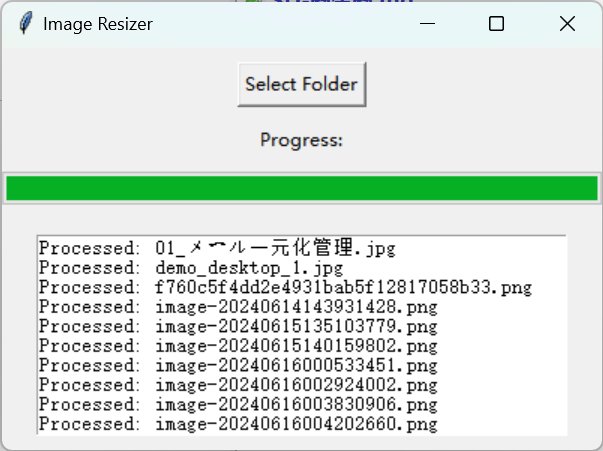

中间也会遇到一些波折，比如第一次生成的时候会提示`AttributeError: module 'PIL.Image' has no attribute 'ANTIALIAS'`

这个我们也知道，一般是因为版本不兼容造成的（而且一般是使用了低版本的代码），我们把错误反馈给他，并告知他我们所使用的版本，一般会得到正确的答复

> :robot: 在较新的Pillow版本中，`Image.ANTIALIAS`已被替换为`Image.LANCZOS`。我们可以更新代码以使用新的常量来避免这个错误。

### Cline

Cline (prev. Claude Dev) 可以逐步处理复杂的软件开发任务。借助允许他读写文件、从头开始创建整个项目以及执行终端命令（在您授予权限后）的工具，他可以为我们提供超越简单代码完成或技术支持的帮助。

* 跟踪当前任务循环的总Tokens和 API 使用成本
* 在精美语法高亮预览中查看编辑差异或新文件
* 将命令执行输出流到聊天中，这样你就不必自己打开终端
* 在使用工具或向 API 发送信息之前显示权限按钮（即“批准 CLI 命令”）
* 设置在提示继续执行之前允许执行任务的最大 API 请求数
* 查看 API 请求的 JSON 并跟踪单个 API 请求的成本

```
生成一个折线图，后台用SpringBoot提供数据接口，前台用fetch+Echart实现
```

> 可以根据你的要求自动创建项目和文件列表，配置文件，根据终端反馈的错误给出解决方案，我用的是gpt-4o-mini，感觉也基本够用，当然比AI对话生成代码可能要贵一些。比如完成本任务，共耗费`Tokens:↑206,407 ↓3,634`，按照当前的gpt-4o-mini价格算约`US$0.033`，当然，如果机器性能不错，可以使用Ollama。
>
> 如下图，可以给你自动创建每一个文件（需要你确认保存），根据终端的反馈给出下一步的命令（需要你确认执行）

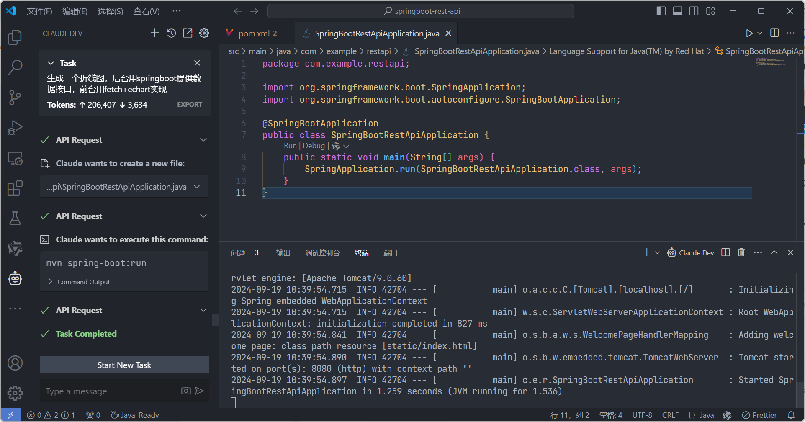

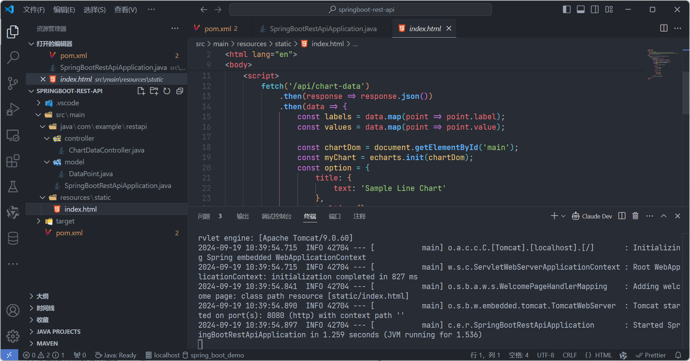

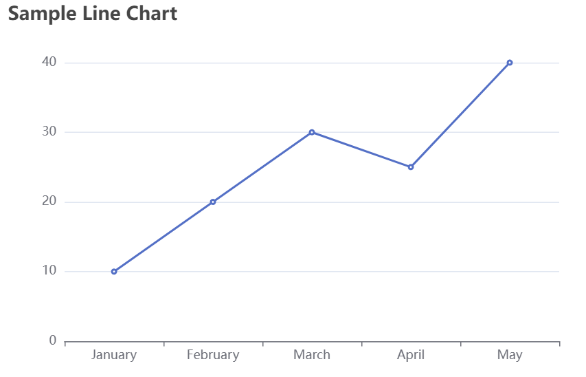

国内环境可以考虑使用 ==**DeepSeek**==，Cline专门针对其做了测试，价格非常便宜。配置如下，完成相同的任务只花了￥4分钱，同时DeepSeek也是开源模型，如果机器性能不错，可以使用Ollama来跑

* **API Provider**：OpenAl Compatible
* **Base URL**：https://api.deepseek.com
* **API Key**：自行申请
* **Model ID**：deepseek-coder

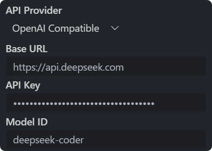

## 界面原型

### 文生图

比如使用AI生成界面原型

**题词**

```
首页由四个部分组成，请用 HTML 实现。
整个页面使用 Bootstrap 生成，相关外部资源引用 CDN 资源，并适配手机屏幕。
内容中可以使用图标，例如 Font Awesome。
最上方是广告轮播图，你可以用简单的 SVG 模拟图片。
广告下方是通告部分，它是一个 Tab 组件，可以切换“通告列表”和“已完成通告列表”。
通告列表中，每一项左侧是通告的图片，右侧是通告的标题、发布时间和概要。
通告下方是一个发布通告的按钮。
页面最下方是固定在底部的主要菜单，共四个菜单项：首页、发现、个人，目前选中“首页”。
```

**生成的HTML**

```html
<!DOCTYPE html>
<html lang="en">
<head>
    <meta charset="UTF-8">
    <meta name="viewport" content="width=device-width, initial-scale=1.0">
    <title>首页</title>
    <link rel="stylesheet" href="https://cdn.jsdelivr.net/npm/bootstrap@4.6.2/dist/css/bootstrap.min.css">
    <link rel="stylesheet" href="https://cdnjs.cloudflare.com/ajax/libs/font-awesome/6.4.2/css/all.min.css">
    <style>
        /* 自定义样式 */
        .carousel-item svg {
            width: 100%;
            height: 200px;
        }

        .nav-tabs .nav-link.active {
            background-color: #007bff;
            color: #fff;
        }

        .notice-item {
            display: flex;
            align-items: center;
            padding: 10px;
            border-bottom: 1px solid #eee;
        }

        .notice-item img {
            width: 80px;
            height: 80px;
            margin-right: 10px;
        }

        .fixed-bottom {
            position: fixed;
            bottom: 0;
            left: 0;
            width: 100%;
        }
    </style>
</head>
<body>

    <!-- 广告走马灯 -->
    <div id="carousel" class="carousel slide" data-ride="carousel">
        <div class="carousel-inner">
            <div class="carousel-item active">
                <svg viewBox="0 0 300 100">
                    <rect width="300" height="100" fill="#f00" />
                    <text x="50%" y="50%" dominant-baseline="middle" text-anchor="middle" fill="#fff" font-size="30">广告 1</text>
                </svg>
            </div>
            <div class="carousel-item">
                <svg viewBox="0 0 300 100">
                    <rect width="300" height="100" fill="#0f0" />
                    <text x="50%" y="50%" dominant-baseline="middle" text-anchor="middle" fill="#fff" font-size="30">广告 2</text>
                </svg>
            </div>
        </div>
    </div>

    <!-- 通告部分 -->
    <div class="container mt-3">
        <ul class="nav nav-tabs" id="noticeTab" role="tablist">
            <li class="nav-item">
                <a class="nav-link active" id="notice-list-tab" data-toggle="tab" href="#notice-list" role="tab" aria-controls="notice-list" aria-selected="true">
                    <i class="fas fa-bullhorn"></i> 通告列表
                </a>
            </li>
            <li class="nav-item">
                <a class="nav-link" id="finished-notice-list-tab" data-toggle="tab" href="#finished-notice-list" role="tab" aria-controls="finished-notice-list" aria-selected="false">
                    <i class="fas fa-check-circle"></i> 已完成通告列表
                </a>
            </li>
        </ul>
        <div class="tab-content" id="noticeTabContent">
            <div class="tab-pane fade show active" id="notice-list" role="tabpanel" aria-labelledby="notice-list-tab">
                <div class="notice-item">
                    
                    <div>
                        <h5><i class="fas fa-newspaper"></i> 通告标题 1</h5>
                        <p><i class="fas fa-clock"></i> 发布时间：2023-12-28</p>
                        <p><i class="fas fa-info-circle"></i> 概要：这是一条通告的概要信息...</p>
                    </div>
                </div>
                <div class="notice-item">
                    
                    <div>
                        <h5><i class="fas fa-newspaper"></i> 通告标题 2</h5>
                        <p><i class="fas fa-clock"></i> 发布时间：2023-12-27</p>
                        <p><i class="fas fa-info-circle"></i> 概要：这是一条通告的概要信息...</p>
                    </div>
                </div>
            </div>
            <div class="tab-pane fade" id="finished-notice-list" role="tabpanel" aria-labelledby="finished-notice-list-tab">
                <p>暂无已完成通告</p>
            </div>
        </div>
        <button class="btn btn-primary btn-block mt-3">
            <i class="fas fa-plus-circle"></i> 发布通告
        </button>
    </div>

    <!-- 主菜单 -->
    <nav class="navbar navbar-light bg-light fixed-bottom">
        <ul class="nav nav-pills nav-justified w-100">
            <li class="nav-item">
                <a class="nav-link active" href="#">
                    <i class="fas fa-home"></i> 首页
                </a>
            </li>
            <li class="nav-item">
                <a class="nav-link" href="#">
                    <i class="fas fa-compass"></i> 发现
                </a>
            </li>
            <li class="nav-item">
                <a class="nav-link" href="#">
                    <i class="fas fa-user"></i> 个人
                </a>
            </li>
        </ul>
    </nav>

    <script src="https://cdn.jsdelivr.net/npm/jquery@3.5.1/dist/jquery.slim.min.js"></script>
    <script src="https://cdn.jsdelivr.net/npm/popper.js@1.16.1/dist/umd/popper.min.js"></script>
    <script src="https://cdn.jsdelivr.net/npm/bootstrap@4.6.2/dist/js/bootstrap.min.js"></script>
</body>
</html>
```

**界面展示**

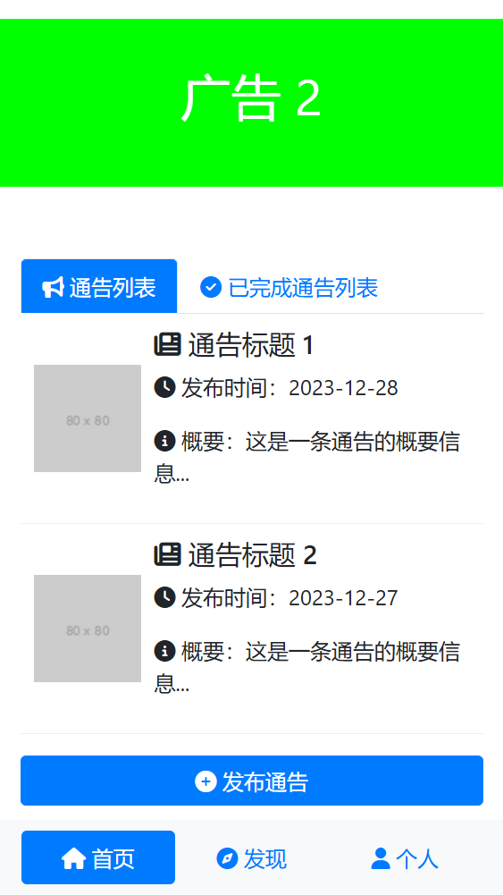

### 图生图

**上传图片至AI**，我这里用的是chatgpt4o

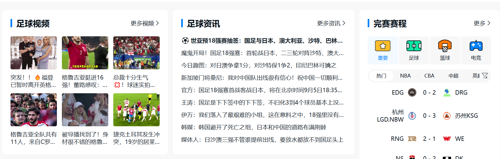

**题词**

```
能用Bootstrap复制该页面吗
```

**生成的HTML**

```html
<!DOCTYPE html>
<html lang="en">
<head>
    <meta charset="UTF-8">
    <meta name="viewport" content="width=device-width, initial-scale=1.0">
    <title>Bootstrap Layout</title>
    <link href="https://stackpath.bootstrapcdn.com/bootstrap/4.5.2/css/bootstrap.min.css" rel="stylesheet">
</head>
<body>
    <div class="container mt-4">
        <!-- Navigation bar -->
        <nav class="navbar navbar-expand-lg navbar-light bg-light">
            <a class="navbar-brand" href="#">Logo</a>
            <button class="navbar-toggler" type="button" data-toggle="collapse" data-target="#navbarNav" aria-controls="navbarNav" aria-expanded="false" aria-label="Toggle navigation">
                <span class="navbar-toggler-icon"></span>
            </button>
            <div class="collapse navbar-collapse" id="navbarNav">
                <ul class="navbar-nav">
                    <li class="nav-item active">
                        <a class="nav-link" href="#">Home</a>
                    </li>
                    <li class="nav-item">
                        <a class="nav-link" href="#">Videos</a>
                    </li>
                    <li class="nav-item">
                        <a class="nav-link" href="#">News</a>
                    </li>
                    <li class="nav-item">
                        <a class="nav-link" href="#">Schedule</a>
                    </li>
                </ul>
            </div>
        </nav>
        
        <!-- Main content -->
        <div class="row mt-4">
            <!-- Videos Section -->
            <div class="col-md-4">
                <h5>足球视频</h5>
                <div class="card mb-3">
                    
                    <div class="card-body">
                        <p class="card-text">突发！！福登已暂时离开英格...</p>
                    </div>
                </div>
                <div class="card mb-3">
                    
                    <div class="card-body">
                        <p class="card-text">格鲁吉亚挺进16强！...</p>
                    </div>
                </div>
                <!-- More cards as needed -->
            </div>
            
            <!-- News Section -->
            <div class="col-md-4">
                <h5>足球资讯</h5>
                <ul class="list-group">
                    <li class="list-group-item">
                        <h6>世亚预18强赛抽签：国足与日本、澳大利亚、沙特、巴林...</h6>
                        <p>魔鬼开局！国足18强赛：首轮战日本，二三轮对阵沙特...</p>
                    </li>
                    <li class="list-group-item">
                        <h6>今日趣图：对日澳争拿1分...</h6>
                        <p>对沙特保1争2，印尼巴林可摘之...</p>
                    </li>
                    <!-- More list items as needed -->
                </ul>
            </div>
            
            <!-- Schedule Section -->
            <div class="col-md-4">
                <h5>完赛赛程</h5>
                <div class="d-flex justify-content-between">
                    <div class="p-2"><a href="#" class="btn btn-primary">重要</a></div>
                    <div class="p-2"><a href="#" class="btn btn-secondary">足球</a></div>
                    <div class="p-2"><a href="#" class="btn btn-secondary">篮球</a></div>
                    <div class="p-2"><a href="#" class="btn btn-secondary">电竞</a></div>
                </div>
                <ul class="list-group mt-3">
                    <li class="list-group-item">EDG 0 - 2 DRG</li>
                    <li class="list-group-item">杭州LGD.NBW 0 - 3 苏州KSG</li>
                    <li class="list-group-item">RNG 2 - 1 WE</li>
                    <!-- More list items as needed -->
                </ul>
            </div>
        </div>
    </div>

    <script src="https://code.jquery.com/jquery-3.5.1.slim.min.js"></script>
    <script src="https://cdn.jsdelivr.net/npm/@popperjs/core@2.5.4/dist/umd/popper.min.js"></script>
    <script src="https://stackpath.bootstrapcdn.com/bootstrap/4.5.2/js/bootstrap.min.js"></script>
</body>
</html>
```

**界面展示**

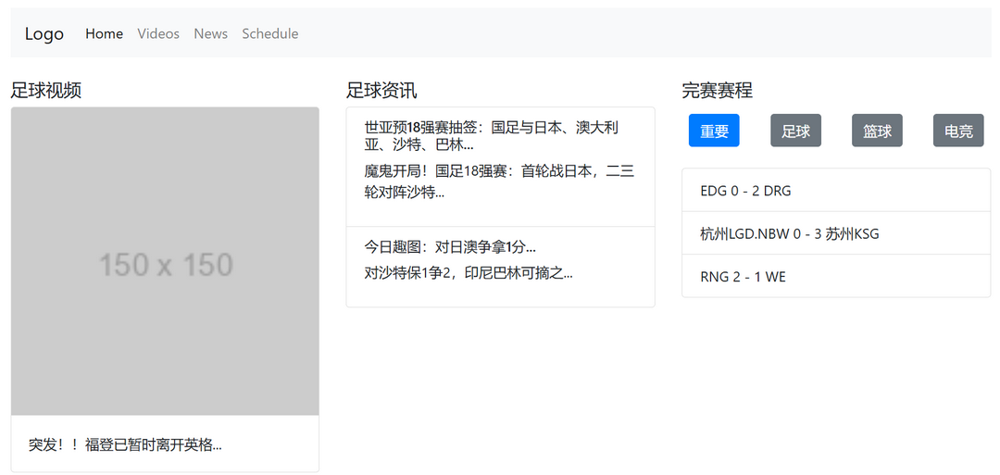

### 手绘

手绘界面，这里专门找了一个字迹潦草，拍摄角度也不佳的。

| 手绘原型                                                     | HTML原型                                                     | Python界面                                                   |
| ------------------------------------------------------------ | ------------------------------------------------------------ | ------------------------------------------------------------ |
| 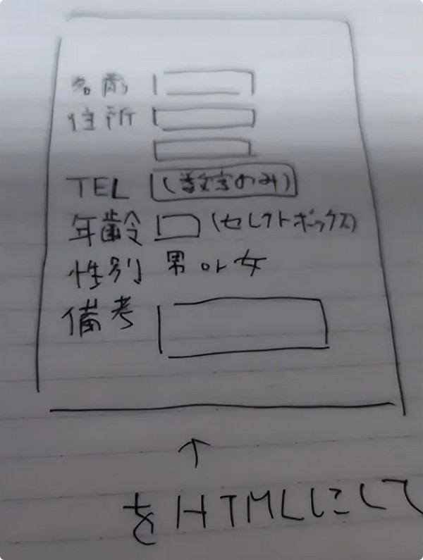 | 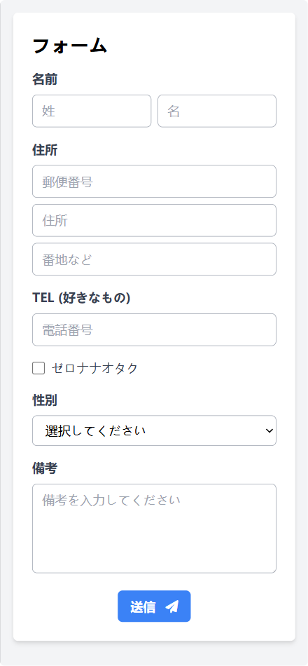 | 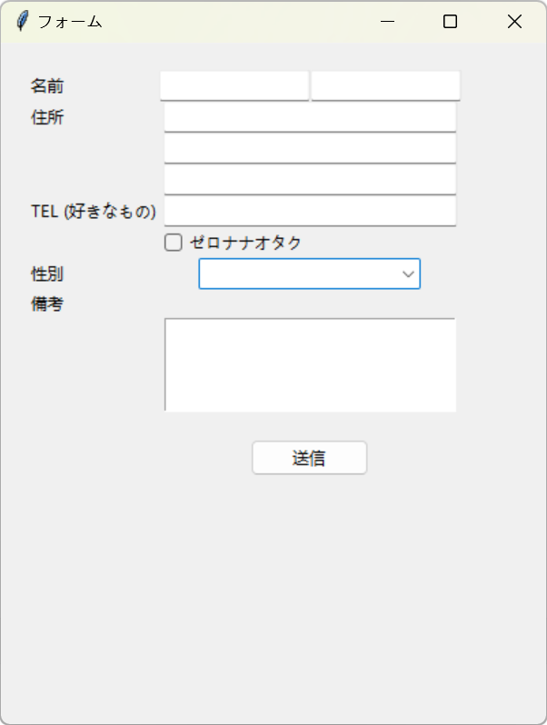 |

### AI生图

通过AI生成界面所需图片，如下图，右边的图即使用DALL-E文生图生成，如果要生成更符合需求的图片需要学习Stable Diffusion

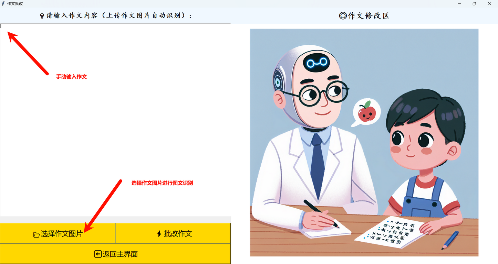

## 软件设计

### 根据用户提供文档总结需求

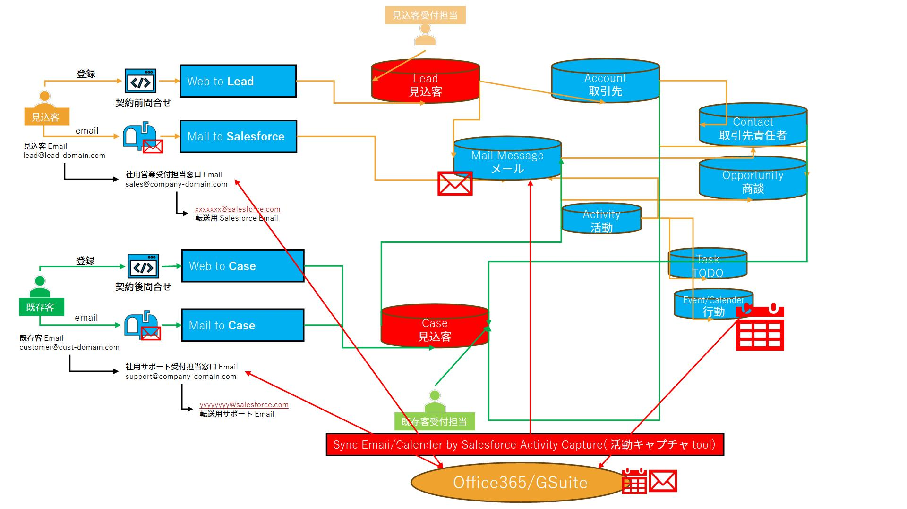

使用Google (gemini-pro)

> 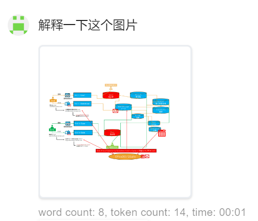

gemini给出的总结

> 这张图片展示的是一个以 Salesforce 为核心的客户关系管理 (CRM) 系统的运作流程图，它涵盖了潜在客户和现有客户的两种主要业务流程。
>
> **流程一：潜在客户管理 (Lead Management)**
>
> 1. **信息收集:** 潜在客户通过网站表单 (Web to Lead) 或邮件 (Mail to Salesforce) 提交信息。
> 2. **Salesforce 处理:** Salesforce 将收集到的信息创建为“潜在客户” (Lead) 记录。
> 3. **邮件交互:** 系统自动使用预设的销售邮箱 ([xxxxx@salesforce.com](mailto:xxxxx@salesforce.com)) 与潜在客户进行邮件沟通 (Mail Message)。
> 4. **后续跟进:** 销售人员可以根据“潜在客户”记录创建“活动” (Activity) 进行跟进，例如电话、会议等。
> 5. **转化商机:** 一旦潜在客户表现出购买意向，销售人员可以将其转化为“商机” (Opportunity)，并关联相应的“客户” (Account) 和“联系人” (Contact) 信息。
>
> **流程二：客户服务 (Case Management)**
>
> 1. **问题反馈:** 现有客户通过网站表单 (Web to Case) 或邮件 (Mail to Case) 提交问题或服务请求。
> 2. **Salesforce 处理:** Salesforce 将收集到的信息创建为“客户案例” (Case) 记录。
> 3. **邮件交互:** 系统自动使用预设的客服邮箱 ([yyyyy@salesforce.com](mailto:yyyyy@salesforce.com)) 与客户进行邮件沟通。
> 4. **后续跟进:** 客服人员可以根据“客户案例”记录创建“活动” (Activity) 进行跟进，例如解决方案、进度更新等。
> 5. **任务分配:** 客服人员可以根据需要创建“待办事项” (Task) 并分配给相关人员。
>
> **其他关键信息:**
>
> - **邮件和日历同步:** Salesforce 可以与 Office 365 或 G Suite 同步邮件和日历信息，方便销售和客服人员统一管理客户沟通和日程安排。
> - **活动捕捉:** Salesforce 可以自动捕捉与客户相关的邮件和活动，并将其记录在相应的“潜在客户”、“客户案例”或“联系人”记录中，确保信息完整性。
>
> **总结:**
>
> 这张流程图清晰地展示了 Salesforce CRM 系统如何帮助企业管理潜在客户、处理客户服务请求以及跟踪客户互动，从而提高销售效率和客户满意度。

### 生成PRD

```
根据解释总结成PRD，使用Mermaid绘制必要的流程图
```

gemini给出的PRD

````markdown
## Salesforce CRM 系统对接方案 PRD

**1.  目标**

* 通过与 Salesforce CRM 系统对接，实现以下目标：
    * 自动化潜在客户信息收集和跟进流程，提高销售效率。
    * 规范化客户服务流程，提升客户满意度。
    * 实现邮件、日历和客户信息的统一管理，提高团队协作效率。

**2. 用户角色**

* 销售人员
* 客服人员
* 管理员

**3. 功能需求**

**3.1 潜在客户管理**

* **流程图:**

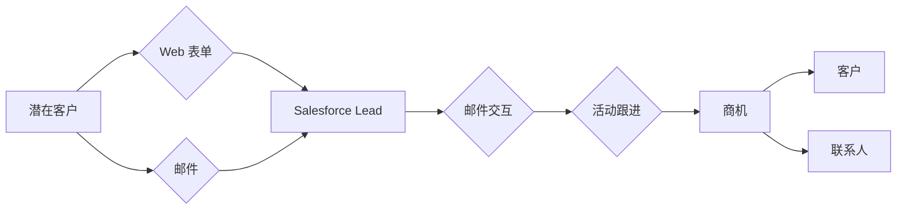
```mermaid
graph LR
    A[潜在客户] --> B{Web 表单}
    A --> C{邮件}
    B --> D[Salesforce Lead]
    C --> D
    D --> E{邮件交互}
    E --> F{活动跟进}
    F --> G[商机]
    G --> H[客户]
    G --> I[联系人]
```

* **功能描述:**
    * 潜在客户通过网站表单或邮件提交信息。
    * 系统自动将信息录入 Salesforce，创建“潜在客户”记录。
    * 系统自动使用预设的销售邮箱与潜在客户进行邮件沟通。
    * 销售人员可以创建“活动”记录，跟踪跟进情况。
    * 将有购买意向的“潜在客户”转化为“商机”，并关联“客户”和“联系人”信息。

**3.2 客户服务**

* **流程图:**

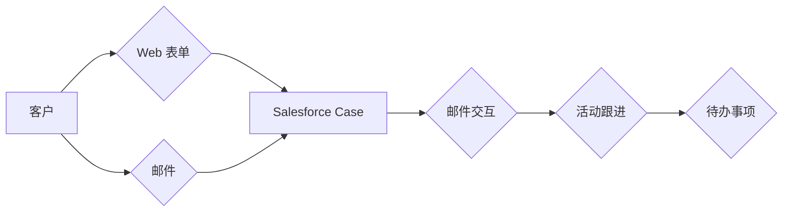
```mermaid
graph LR
    A[客户] --> B{Web 表单}
    A --> C{邮件}
    B --> D[Salesforce Case]
    C --> D
    D --> E{邮件交互}
    E --> F{活动跟进}
    F --> G{待办事项}
```

* **功能描述:**
    * 客户通过网站表单或邮件提交问题或服务请求。
    * 系统自动将信息录入 Salesforce，创建“客户案例”记录。
    * 系统自动使用预设的客服邮箱与客户进行邮件沟通。
    * 客服人员可以创建“活动”记录，跟踪处理进度。
    * 客服人员可以创建“待办事项”，并分配给相关人员。

**3.3 邮件和日历同步**

* 将 Salesforce 与 Office 365 或 G Suite 进行同步，实现：
    * 邮件同步：在 Salesforce 中查看和管理与客户相关的邮件。
    * 日历同步：在 Salesforce 中查看和管理与客户相关的日程安排。

**3.4 活动捕捉**

* 自动捕捉与客户相关的邮件和活动，并将其记录在相应的 Salesforce 记录中，例如“潜在客户”、“客户案例”或“联系人”。

**4.  非功能需求**

* 系统稳定性
* 数据安全性
* 易用性

**5.  验收标准**

* 所有功能需求均已实现并通过测试。
* 系统性能满足要求。
* 系统安全性符合规范。
* 提供完整的用户操作文档。 
````

### 理解+生成UML

活动图非常实用，在需求分析阶段，产品经理用来描述业务流程。在概要设计和详细设计阶段，需要参考活动图来进行下一步的设计。

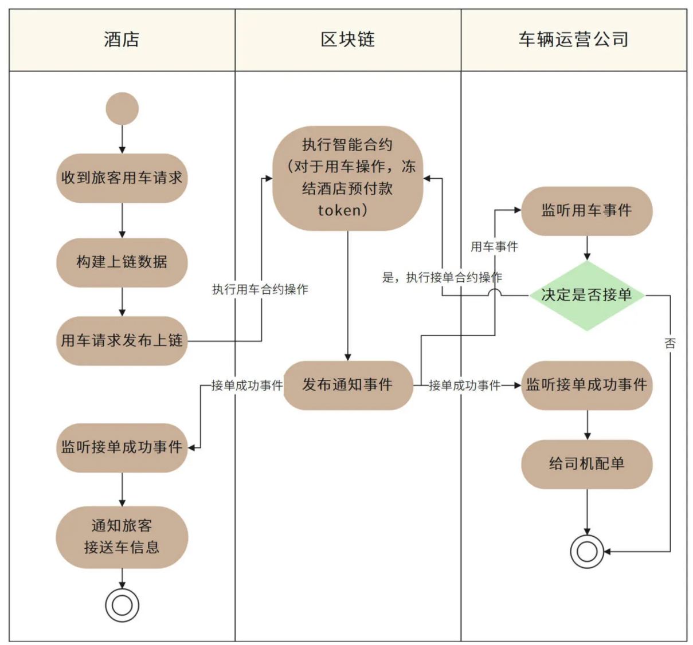

使用Google (gemini-pro)，gemini给出的总结

> 这张图片展示的是酒店、区块链和车辆运营公司之间，利用区块链技术实现酒店叫车的流程图。
>
> **流程说明：**
>
> 1. **酒店端:**
>    - 接收顾客叫车需求。
>    - 将订单信息上链，即记录到区块链上。
>    - 用车请求发布上链，公开征集车辆运营公司接单。
>    - 监听接单成功事件，等待车辆运营公司接单。
>    - 通知旅客接车信息，将接单车辆信息告知顾客。
>
> 2. **区块链:**
>    - 执行智能合约，验证用车事件，冻结酒店预付款（token）。
>    - 发布通知到车辆运营公司，告知有新的用车请求。
>    - 接收车辆运营公司的接单成功事件。
>    - 将接单成功事件传递给酒店。
>
> 3. **车辆运营公司:**
>    - 监听用车事件，接收来自区块链的用车请求信息。
>    - 决定是否接单。
>    - 如果接单，则监听接单成功事件，确认接单成功。
>    - 公司司机配单，指派司机接送顾客。
>
> **流程特点：**
>
> * **去中心化:** 区块链作为中介平台，连接酒店和车辆运营公司，无需中心化平台调度。
> * **透明可信:** 所有交易信息记录在区块链上，公开透明，不可篡改。
> * **安全可靠:** 智能合约自动执行，确保交易安全可靠。
> * **提高效率:** 自动化流程，减少人工干预，提高叫车效率。
>
> **总结:**
>
> 这张流程图展示了区块链技术在酒店叫车场景中的应用，通过去中心化、透明可信、安全可靠等特点，优化了传统叫车流程，提高了效率和用户体验。

让gemini用Mermaid重绘成`sequenceDiagram`

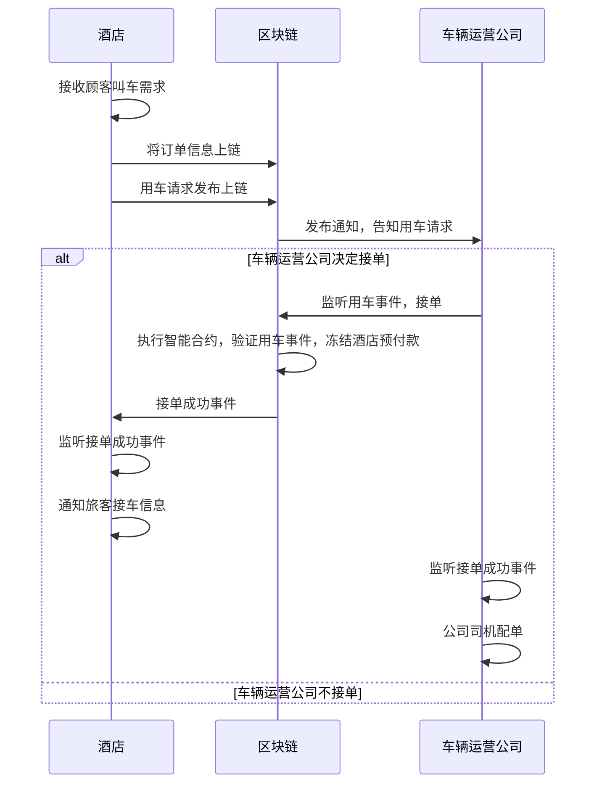
```mermaid
sequenceDiagram
    participant 酒店
    participant 区块链
    participant 车辆运营公司

    酒店->>酒店: 接收顾客叫车需求
    酒店->>区块链: 将订单信息上链
    酒店->>区块链: 用车请求发布上链
    区块链->>车辆运营公司: 发布通知，告知用车请求
    alt 车辆运营公司决定接单
        车辆运营公司->>区块链: 监听用车事件，接单
        区块链->>区块链: 执行智能合约，验证用车事件，冻结酒店预付款
        区块链->>酒店: 接单成功事件
        酒店->>酒店: 监听接单成功事件
        酒店->>酒店: 通知旅客接车信息
        车辆运营公司->>车辆运营公司: 监听接单成功事件
        车辆运营公司->>车辆运营公司: 公司司机配单
    else 车辆运营公司不接单
    end

```

根据这个需求设计一下类图，这个类图你可以提示它完善，比如添加“司机”、“车辆”的类等等……

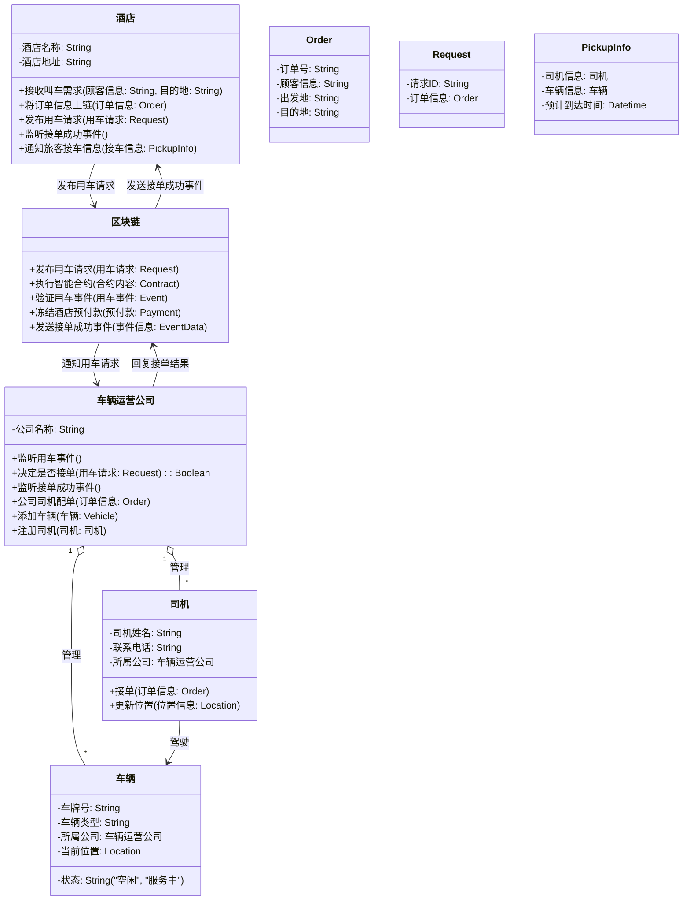
```mermaid
classDiagram
    class 酒店{
        -酒店名称: String
        -酒店地址: String
        +接收叫车需求(顾客信息: String, 目的地: String)
        +将订单信息上链(订单信息: Order)
        +发布用车请求(用车请求: Request)
        +监听接单成功事件()
        +通知旅客接车信息(接车信息: PickupInfo)
    }

    class 区块链{
        +发布用车请求(用车请求: Request)
        +执行智能合约(合约内容: Contract)
        +验证用车事件(用车事件: Event)
        +冻结酒店预付款(预付款: Payment)
        +发送接单成功事件(事件信息: EventData)
    }

    class 车辆运营公司{
        -公司名称: String
        +监听用车事件()
        +决定是否接单(用车请求: Request) : Boolean
        +监听接单成功事件()
        +公司司机配单(订单信息: Order)
        +添加车辆(车辆: Vehicle)
        +注册司机(司机: 司机)
    }

    class 司机 {
        -司机姓名: String
        -联系电话: String
        -所属公司: 车辆运营公司
        +接单(订单信息: Order)
        +更新位置(位置信息: Location)
    }

    class 车辆 {
        -车牌号: String
        -车辆类型: String
        -所属公司: 车辆运营公司
        -当前位置: Location
        -状态: String ("空闲", "服务中")
    }

    class Order {
        -订单号: String
        -顾客信息: String
        -出发地: String
        -目的地: String
    }

    class Request {
        -请求ID: String
        -订单信息: Order
    }

    class PickupInfo {
        -司机信息: 司机
        -车辆信息: 车辆
        -预计到达时间: Datetime
    }

    酒店 --> 区块链 : 发布用车请求
    区块链 --> 车辆运营公司 : 通知用车请求
    车辆运营公司 --> 区块链 : 回复接单结果
    区块链 --> 酒店 : 发送接单成功事件
    车辆运营公司 "1" o-- "*" 司机 : 管理
    车辆运营公司 "1" o-- "*" 车辆 : 管理
    司机 --> 车辆 : 驾驶
    

```

使用`draw.io`进行深度加工

* `菜单`→`➕`→`高级`→`Mermaid`

* 选择这种手绘的样式


效果如下

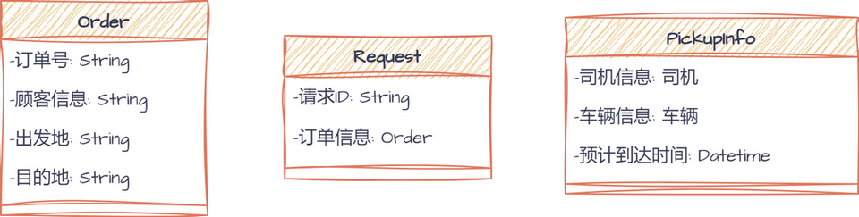

### 软件详细设计

> 以下除题词外均由AI生成

####  功能分解

```
📝设计一个图书管理系统，他有哪些子功能，用Mermaid绘制mindmap
同时生成每个子功能的简要功能解释
```

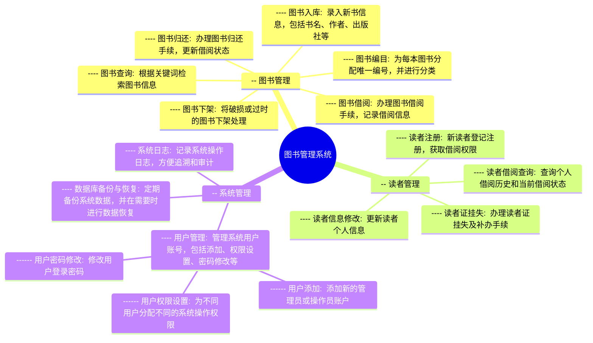
```mermaid
mindmap
  root((图书管理系统))
      -- 图书管理
        ---- 图书入库:  录入新书信息，包括书名、作者、出版社等
        ---- 图书编目:  为每本图书分配唯一编号，并进行分类
        ---- 图书查询:  根据关键词检索图书信息
        ---- 图书借阅:  办理图书借阅手续，记录借阅信息
        ---- 图书归还:  办理图书归还手续，更新借阅状态
        ---- 图书下架:  将破损或过时的图书下架处理
      -- 读者管理
        ---- 读者注册:  新读者登记注册，获取借阅权限
        ---- 读者信息修改:  更新读者个人信息
        ---- 读者借阅查询:  查询个人借阅历史和当前借阅状态
        ---- 读者证挂失:  办理读者证挂失及补办手续
      -- 系统管理
        ---- 用户管理:  管理系统用户账号，包括添加、权限设置、密码修改等
          ------ 用户添加:  添加新的管理员或操作员账户
          ------ 用户权限设置:  为不同用户分配不同的系统操作权限
          ------ 用户密码修改:  修改用户登录密码
        ---- 系统日志:  记录系统操作日志，方便追溯和审计
        ---- 数据库备份与恢复:  定期备份系统数据，并在需要时进行数据恢复
```

####  数据库设计

```
📝设计sqlite数据库结构，并使用mermaid绘制er关系图
```

以下是图书管理系统 SQLite 数据库结构设计，包含创建表的 SQL 语句：

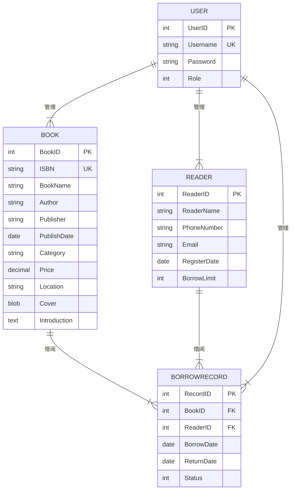
```mermaid
erDiagram
    BOOK ||--|{ BORROWRECORD : "借阅"
    READER ||--|{ BORROWRECORD : "借阅"
    USER ||--|{ BOOK : "管理"
    USER ||--|{ READER : "管理"
    USER ||--|{ BORROWRECORD : "管理"

    BOOK {
        int BookID PK
        string ISBN UK
        string BookName
        string Author
        string Publisher
        date PublishDate
        string Category
        decimal Price
        string Location
        blob Cover
        text Introduction
    }

    READER {
        int ReaderID PK
        string ReaderName
        string PhoneNumber
        string Email
        date RegisterDate
        int BorrowLimit
    }

    BORROWRECORD {
        int RecordID PK
        int BookID FK
        int ReaderID FK
        date BorrowDate
        date ReturnDate
        int Status
    }

    USER {
        int UserID PK
        string Username UK
        string Password
        int Role
    }

```

**关系说明：**

- **图书 - 借阅记录 (1:N)：** 一本书可以被多个读者借阅，产生多条借阅记录。
- **读者 - 借阅记录 (1:N)：** 一个读者可以借阅多本书，产生多条借阅记录。
- **用户 - 图书 (1:N)：** 管理员可以管理多本书籍信息。
- **用户 - 读者 (1:N)：** 管理员可以管理多个读者信息。
- **用户 - 借阅记录 (1:N)：** 管理员可以管理多条借阅记录。

```sql
-- 图书表
CREATE TABLE Book (
    BookID INTEGER PRIMARY KEY AUTOINCREMENT, -- 图书ID，主键，自增
    ISBN TEXT UNIQUE NOT NULL, -- ISBN，唯一，非空
    BookName TEXT NOT NULL, -- 书名，非空
    Author TEXT NOT NULL, -- 作者，非空
    Publisher TEXT NOT NULL, -- 出版社，非空
    PublishDate DATE, -- 出版日期
    Category TEXT, -- 图书分类
    Price REAL, -- 价格
    Location TEXT, -- 存放位置
    Cover BLOB, -- 封面图片，二进制数据
    Introduction TEXT -- 内容简介
);

-- 读者表
CREATE TABLE Reader (
    ReaderID INTEGER PRIMARY KEY AUTOINCREMENT, -- 读者ID，主键，自增
    ReaderName TEXT NOT NULL, -- 读者姓名，非空
    PhoneNumber TEXT, -- 联系电话
    Email TEXT, -- 电子邮箱
    RegisterDate DATE DEFAULT (date('now')), -- 注册日期，默认为当前日期
    BorrowLimit INTEGER DEFAULT 3 -- 借阅上限，默认为3本
);

-- 借阅记录表
CREATE TABLE BorrowRecord (
    RecordID INTEGER PRIMARY KEY AUTOINCREMENT, -- 借阅记录ID，主键，自增
    BookID INTEGER NOT NULL, -- 图书ID，外键关联图书表
    ReaderID INTEGER NOT NULL, -- 读者ID，外键关联读者表
    BorrowDate DATE DEFAULT (date('now')), -- 借阅日期，默认为当前日期
    ReturnDate DATE, -- 归还日期
    Status INTEGER DEFAULT 0, -- 借阅状态，0: 未归还，1: 已归还，2: 逾期
    FOREIGN KEY (BookID) REFERENCES Book(BookID),
    FOREIGN KEY (ReaderID) REFERENCES Reader(ReaderID)
);

-- 用户表
CREATE TABLE User (
    UserID INTEGER PRIMARY KEY AUTOINCREMENT, -- 用户ID，主键，自增
    Username TEXT UNIQUE NOT NULL, -- 用户名，唯一，非空
    Password TEXT NOT NULL, -- 密码，非空
    Role INTEGER DEFAULT 0 -- 角色，0: 管理员，1: 普通用户
);
```

**表结构说明：**

**1. 图书表 (Book):**

*   `BookID`: 图书的唯一标识符，主键，自动递增。
*   `ISBN`: 国际标准书号，用于唯一标识一本书，非空且唯一。
*   `BookName`: 书名，非空。
*   `Author`: 作者，非空。
*   `Publisher`: 出版社，非空。
*   `PublishDate`: 出版日期。
*   `Category`: 图书分类，例如：文学、科技、艺术等。
*   `Price`: 图书价格。
*   `Location`: 图书存放位置，例如：图书馆的具体书架号。
*   `Cover`: 图书封面图片，以二进制数据存储。
*   `Introduction`: 图书内容简介。

**2. 读者表 (Reader):**

*   `ReaderID`: 读者的唯一标识符，主键，自动递增。
*   `ReaderName`: 读者姓名，非空。
*   `PhoneNumber`: 读者联系电话。
*   `Email`: 读者电子邮箱地址。
*   `RegisterDate`: 读者注册日期，默认为当前日期。
*   `BorrowLimit`: 读者可借阅图书的最大数量，默认为 3 本。

**3. 借阅记录表 (BorrowRecord):**

*   `RecordID`: 借阅记录的唯一标识符，主键，自动递增。
*   `BookID`: 借阅图书的 ID，外键关联到图书表 (Book)。
*   `ReaderID`: 借阅者的 ID，外键关联到读者表 (Reader)。
*   `BorrowDate`: 借阅日期，默认为当前日期。
*   `ReturnDate`: 归还日期，初始值为 NULL，归还时更新。
*   `Status`: 借阅状态，0 表示未归还，1 表示已归还，2 表示逾期。

**4. 用户表 (User):**

*   `UserID`: 用户的唯一标识符，主键，自动递增。
*   `Username`: 用户名，用于登录系统，非空且唯一。
*   `Password`: 用户密码，非空。
*   `Role`: 用户角色，0 表示管理员，拥有所有权限，1 表示普通用户，权限受限。

**关系：**

*   图书表和读者表之间是多对多关系，通过借阅记录表关联。
*   每条借阅记录关联一本图书和一个读者。

**其他说明：**

*   可以根据实际需求添加或修改字段。
*   可以使用 SQLiteStudio 等工具创建和管理数据库。
*   在应用程序中，可以使用 SQL 语句或 ORM 框架来操作数据库。

## 数据库

### 使用RAG辅助数据库编程

图中的“记忆胶囊”即RAG技术，将项目数据库信息本地矢量化存储，在AI的辅助下对数据库进行自然语言查询分析

```
找出本月已经取消的所有订单
```

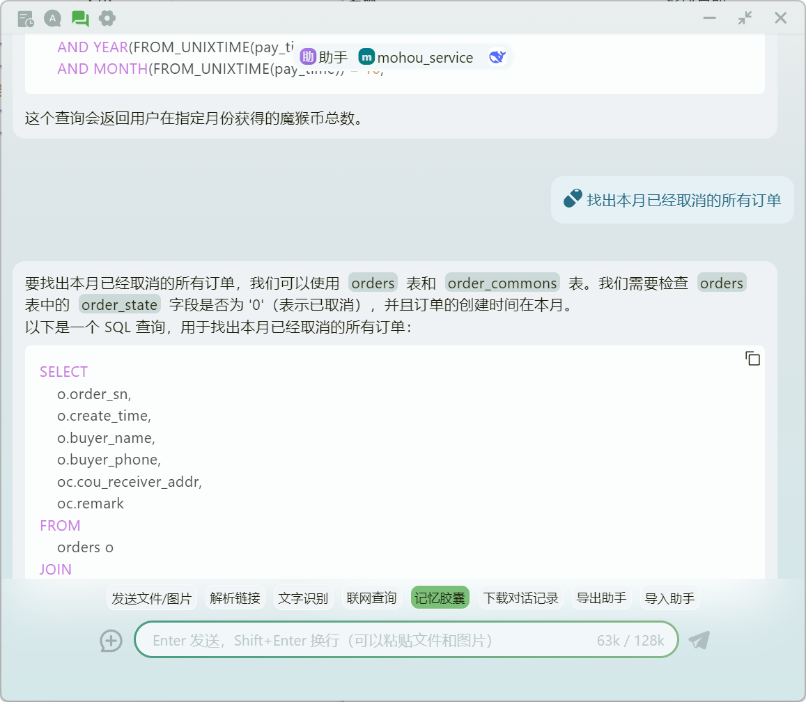

### 自然语言写SQL

````markdown
需统计的数据库表结构如下
```sql
CREATE TABLE IF NOT EXISTS `click` (
  `click_id` int(11) NOT NULL,
  `ad_id` int(11) NOT NULL COMMENT '广告ID',
  `app_id` int(11) NOT NULL COMMENT '广告位ID',
  `check_uuid` varchar(200) COLLATE utf8mb4_bin NOT NULL DEFAULT '' COMMENT '用户唯一ID',
  `create_dateline` int(11) NOT NULL DEFAULT '0' COMMENT '时间戳',
  `create_date` date NOT NULL DEFAULT '2000-01-01' COMMENT '日期',
  `create_h` smallint(6) NOT NULL DEFAULT '0' COMMENT '小时',
  `flag` smallint(6) NOT NULL DEFAULT '0',
  `province` varchar(50) COLLATE utf8mb4_bin NOT NULL DEFAULT '0' COMMENT '省份',
  `city` varchar(50) COLLATE utf8mb4_bin NOT NULL DEFAULT '0' COMMENT '城市',
  `isp` varchar(50) COLLATE utf8mb4_bin NOT NULL DEFAULT '0' COMMENT '运营商',
  `browser` varchar(50) COLLATE utf8mb4_bin NOT NULL DEFAULT '0' COMMENT '终端浏览器',
  `remote_addr` varchar(50) COLLATE utf8mb4_bin NOT NULL DEFAULT '0' COMMENT 'IP地址',
  `http_user_agent` text COLLATE utf8mb4_bin NOT NULL COMMENT 'UA',
  `click_price` decimal(5,2) NOT NULL DEFAULT '0.00' COMMENT '点击单价',
  PRIMARY KEY (`click_id`) USING BTREE
) ENGINE=InnoDB DEFAULT CHARSET=utf8mb4 COLLATE=utf8mb4_bin;

CREATE TABLE IF NOT EXISTS `province` (
  `province_name` varchar(50) NOT NULL COMMENT '省份',
  `region_name` varchar(50) DEFAULT NULL COMMENT '大区',
  PRIMARY KEY (`province_name`)
) ENGINE=InnoDB DEFAULT CHARSET=utf8;
```
请问如何统计各个大区的点击数，请给出SQL语句
````

 🤖**AI回答**

```sql
SELECT 
    p.region_name, 
    COUNT(c.click_id) AS click_count
FROM 
    click c
LEFT JOIN 
    province p ON c.province = p.province_name
GROUP BY 
    p.region_name;
```

这条语句在我机器上运行需要4.6秒，于是我提问

```markdown
这条语句运行的很慢，请问如何优化
```

 🤖**AI回答**

```sql
-- 为 click 表的 province 列创建索引
ALTER TABLE click ADD INDEX idx_province (province);

-- 为 province 表的 province_name 列创建索引（如果它还不是主键）
ALTER TABLE province ADD INDEX idx_province_name (province_name); 
```

再次查询变成3.2秒，当然为什么优化效果不明显，这是数据区分度较低的原因，这个就说来话长了……

### 自然语言数据可视化

````markdown
我有一个SQL
```sql
SELECT province, SUM(click_price), COUNT(*), SUM(click_price) / COUNT(*)
FROM click
GROUP BY province
```
使用Flask pymysql echarts生成一个前后端分离的可视化应用
````

> :smile: 这题连AI中最笨的**文心一言3.5**都能答对……，当然用更好的AI可以帮你答的更加完美，比如考量了使用什么图形显示什么数据


### Chat-based SQL Client and Editor

使用VSCode，安装TONGYI Lingma + MySQL插件

* [TONGYI Lingma - Visual Studio Marketplace](https://marketplace.visualstudio.com/items?itemName=Alibaba-Cloud.tongyi-lingma)

* [MySQL - Visual Studio Marketplace](https://marketplace.visualstudio.com/items?itemName=cweijan.vscode-mysql-client2)

如上，将数据库结构放到插件新建的`xxxxx.sql`文件中，用于上下文参考，然后使用自然语言编写SQL，例如：

```sql
-- 查找华南大区每个城市的点击数量，平均点击单价
```

点击TONGYI Lingma生成的SQL前面的RUN，和数据库进行实时交互

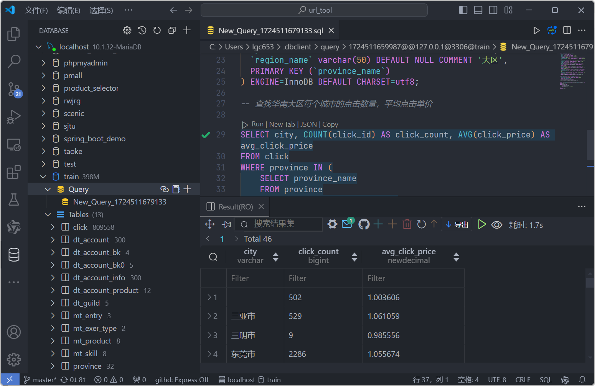

## 项目管理

### 使用AI监控项目进度

通过调用GIT命令 + 调用AI接口对项目情况和进度进行监控，将每日监控情况存储到数据库

```sh
📝 仓库 https://xxx.com/*******/******* 开始评估
仓库 ta******* 已更新
 ✅ 克隆或更新成功
 ✅ 信息获取成功
    📅 最新更新时间: 2024-07-03 11:42:13 +08:00
    📝 更新内容: Merge branch 'main' of https://xxx.com/*******/*******  
    👤 bj******* 提交次数: 14
    👤 Zh******* 提交次数: 20
    👤 ic******* 提交次数: 3
    👤 yw******* 提交次数: 2
    👤 Ca******* 提交次数: 5
    👥 提交总数: 44
    --------------------
    用户名: bj*******
    用户角色: 项目发起人，负责项目的整体规划和管理，提交了大量关于游戏特色、市场调研、文档更新等方面的内容。
    理由: 虽然提交次数较多，但主要集中在文档更新和游戏特色调整，对项目整体推动 贡献较大的是其他成员。
    --------------------
    --------------------
    用户名: Zh*******
    用户角色: 项目经理，负责项目任务分配、需求分析、文档更新等工作，提交次数较多且涵盖了项目的多个关键方面。
    是否为 MVP: 🏆
    理由: Zh*******在项目中承担了项目经理的重要角色，提交次数多且涵盖了项目的多个关键方面，对项目的推动起到了关键作用。
    --------------------
    --------------------
    用户名: ic*******
    用户角色: 团队成员，提交次数较少，贡献主要集中在文档合并方面。
    理由: 贡献较少，主要集中在文档合并，对项目整体推动影响有限。
    --------------------
    --------------------
    用户名: yw*******
    用户角色: 团队成员，提交次数较少，主要贡献是创建个人信息文档和部分文档更新 。
    理由: 贡献较少，提交次数较少，对项目整体推动影响有限。
    --------------------
    --------------------
    用户名: Ca*******
    用户角色: 团队成员，提交次数较少，贡献主要集中在文档更新方面。
    理由: 贡献较少，提交次数较少，对项目整体推动影响有限。
    --------------------
 ✅ 总结和评估成功
    📒 仓库总结: 该 README.md 文件详细介绍了一个名为 ta******* 的游戏项目，包括游戏简介、菜单页面设计、方块类型、道具汇总、玩家行为、游戏对象测试、不同类型的 坦克、关卡模式、商店设计、游戏总体体验和开发流程等内容。其中涵盖了游戏的各个方 面，包括玩法、角色、道具、关卡设计等。同时给出了开发流程和小组成员信息。整体内容比较详细，但有些部分需要进一步补充细节。
    ⭐ 仓库评分: 7
```

### 任务看板

根据以下Sprint 1 任务表格绘制任务墙和燃尽图：

**Sprint 1 任务管理表**

| 任务编号 | 任务描述         | 负责人 | 预计工时 | 实际工时 | 状态   | 备注         |
| -------- | ---------------- | ------ | -------- | -------- | ------ | ------------ |
| S1-01    | 数据库设计       | 张三   | 8 小时   | 8 小时   | 已完成 |              |
| S1-02    | 数据库搭建       | 张三   | 4 小时   | 4 小时   | 已完成 | 预计今天完成 |
| S1-03    | 用户认证模块开发 | 李四   | 16 小时  |          | 未开始 |              |
| S1-04    | 用户授权模块开发 | 李四   | 8 小时   |          | 未开始 |              |
| S1-05    | 设备添加功能开发 | 王五   | 12 小时  |          | 未开始 |              |
| S1-06    | 设备管理功能开发 | 王五   | 8 小时   |          | 未开始 |              |
| S1-07    | 灯光控制接口开发 | 赵六   | 8 小时   |          | 未开始 |              |
| S1-08    | 温度控制接口开发 | 赵六   | 8 小时   |          | 未开始 |              |

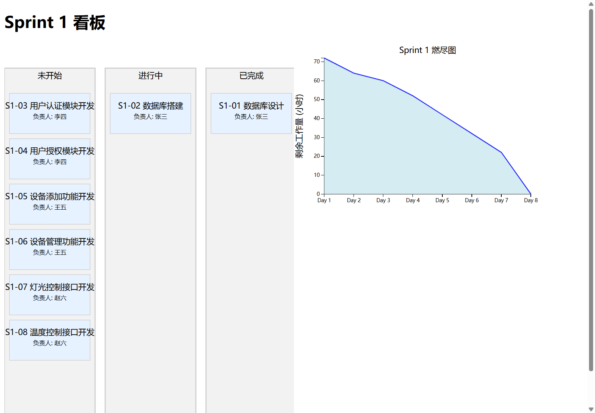

## 其它

### 文案分析

选择作文图片进行识别，并调用AI批改，这个例子可以进行作文（公文）自动化处理，比如自动识别分析归档等

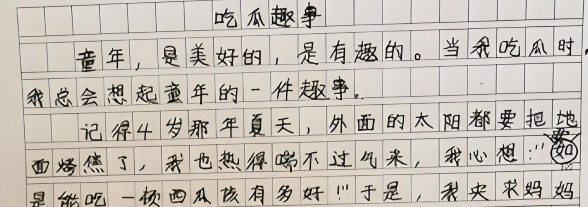

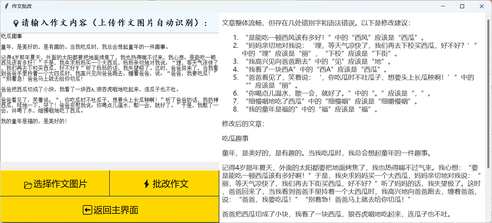

### 视频内容分析

比如我们看到一个英文的广告《Write Like A Winner | Write Your Best Work With Grammarly》，想了解他的内容。我们可以用工具把他下载下来

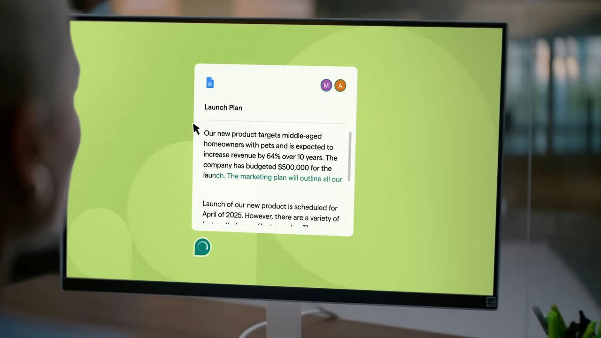

然后交给faster-whisper作为ASR引擎，由于后面要使用ChatGPT，所以这里不做翻译。

```sh
你是一个好用的视频总结助手。根据以下输入的文本文件，用中文详细总结其内容。
```

> :robot:**ChatGPT的回答：**
>
> 这个视频总结了一个团队在第三季度规划中的工作情况。Adams 是项目领导，她感到压力很大，因为截止日期迫在眉睫。在项目进行过程中，Adams 使用了 Grammarly 这样的工具来帮助自己更清晰地表达，从而变得更加自信和专业。在项目进行过程中，CEO 对她施加了压力，但她处理得当，展现出超级明星的风采。整个视频展现了团队合作、领导能力和个人成长的过程。

### 笔记插图

基于 AI 的可视化叙事工具 [Napkin.ai](https://www.napkin.ai/)，它能将枯燥的文字和数字转化为生动形象的图形和图表，非常适合用于教学和商务演示。

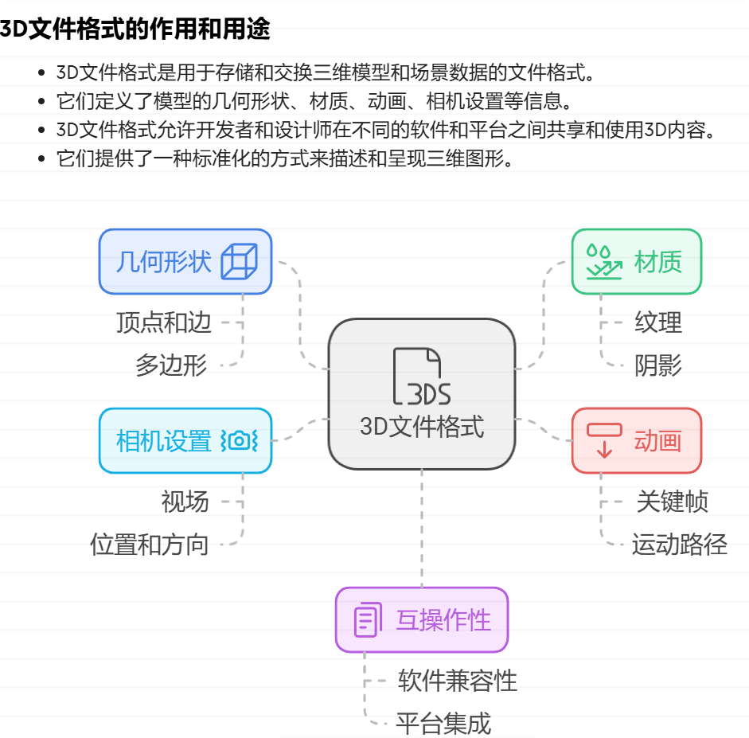

导出为各种格式，比如png或者svg

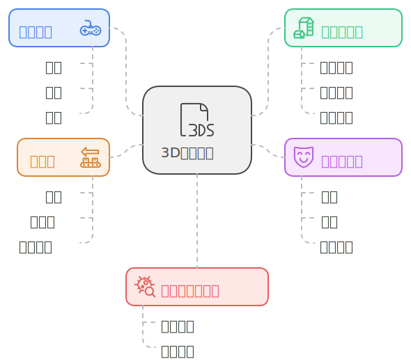

## local LLMs

* [LM Studio - Discover, download, and run local LLMs](https://lmstudio.ai/)：用户友好的工具，适合非技术人员或希望快速上手的大语言模型应用。最易用

* [Ollama](https://ollama.com/)：比较像Docker，很多LLM的客户端和应用都对他支持很好。
* [ggerganov/llama.cpp: LLM inference in C/C++ (github.com)](https://github.com/ggerganov/llama.cpp)：是一个开源的C/C++项目，用起来比较复杂，但是是很多local LLMs的基石。

> 新手优先推荐使用LM Studio
>
> 个人选择Ollama，易用性较强，兼容性强，客户端支持优秀

### LM Studio

LM Studio的使用没啥好说的，提供更广泛的功能集，包括发现、下载和运行本地 LLM，以及应用内聊天界面以及与 OpenAI 兼容的本地服务器接口。去Hugging Face或者modelscope下载GGUF模型即可，当然可能会需要llama-gguf-split合并GGUF，但是目前对多模态模型好像支持不是很好。

### Ollama

和使用Docker一样使用，使用第三方UI的话很方便，也支持多模态模型，但是目前Windows版本只能安装在系统盘且占空间较大

```sh
Large language model runner

Usage:
  ollama [flags]
  ollama [command]

Available Commands:
  serve       Start ollama
  create      Create a model from a Modelfile
  show        Show information for a model
  run         Run a model
  pull        Pull a model from a registry
  push        Push a model to a registry
  list        List models
  cp          Copy a model
  rm          Remove a model
  help        Help about any command

Flags:
  -h, --help      help for ollama
  -v, --version   Show version information

Use "ollama [command] --help" for more information about a command.
```

在命令行中执行 ollama list 可以看到我们现在本地存在的模型，并可以使用 run 命令将其启动。

Run 一个不存在的模型时，会先进行下载，然后再启动。

```sh
ollama run qwen:14b
>>> 你好
你好！很高兴为你服务。有什么可以帮到你的吗？

>>> Send a message (/? for help)
```

###  llama.cpp

#### 下载

[Releases · ggerganov/llama.cpp (github.com)](https://github.com/ggerganov/llama.cpp/releases)

#### 模型

```sh
# Qwen2.5-7B-Instruct-GGUF
modelscope download --model=qwen/Qwen2.5-7B-Instruct-GGUF --include "qwen2.5-7b-instruct-q5_k_m*.gguf"
llama-gguf-split --merge qwen2.5-7b-instruct-q5_k_m-00001-of-00002.gguf qwen2.5-7b-instruct-q5_k_m.gguf
# Qwen2.5-Coder-7B-Instruct-GGUF
modelscope download --model=qwen/Qwen2.5-Coder-7B-Instruct-GGUF --include "qwen2.5-coder-7b-instruct-q5_k_m*.gguf" --local_dir .
llama-gguf-split --merge qwen2.5-coder-7b-instruct-q5_k_m-00001-of-00002.gguf qwen2.5-coder-7b-instruct-q5_k_m.gguf
# MiniCPM-V-2_6-gguf
modelscope download --model=OpenBMB/MiniCPM-V-2_6-gguf --include "ggml-model-Q4_K_M.gguf"
modelscope download --model=OpenBMB/MiniCPM-V-2_6-gguf --include "mmproj-model-f16.gguf"
```

#### 运行

```sh
# Qwen2.5-7B-Instruct-GGUF
llama-server -m E:\Dev\modelscope\hub\qwen\Qwen2___5-7B-Instruct-GGUF\qwen2.5-7b-instruct-q5_k_m.gguf --port 8080 -c 4096
# Qwen2.5-Coder-7B-Instruct-GGUF
llama-server -m E:\Dev\modelscope\hub\qwen\Qwen2___5-Coder-7B-Instruct-GGUF\qwen2.5-coder-7b-instruct-q5_k_m.gguf --port 8080 -c 4096
# MiniCPM-V-2_6-gguf
llama-minicpmv-cli -m E:\Dev\modelscope\hub\OpenBMB\MiniCPM-V-2_6-gguf\ggml-model-Q4_K_M.gguf --mmproj E:\Dev\modelscope\hub\OpenBMB\MiniCPM-V-2_6-gguf\mmproj-model-f16.gguf -c 4096 --image "C:\Dev\archives\url_tool\data\01_メール一元化管理.jpg" -p "图片说明了什么？"
```

在Windows终端中使用`llama-minicpmv-cli`时，要做如下设定，否则命令行中的中文题词会无法识别


## Fine-tuning

* https://github.com/Kiln-AI/Kiln
