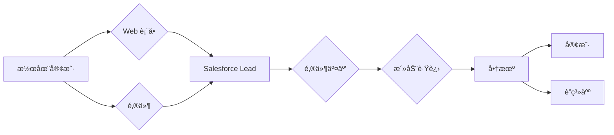
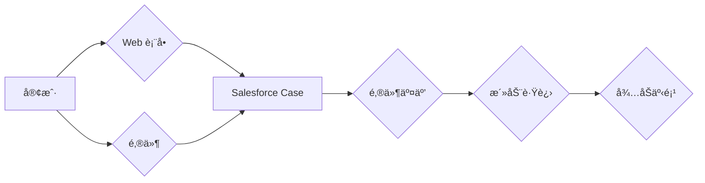
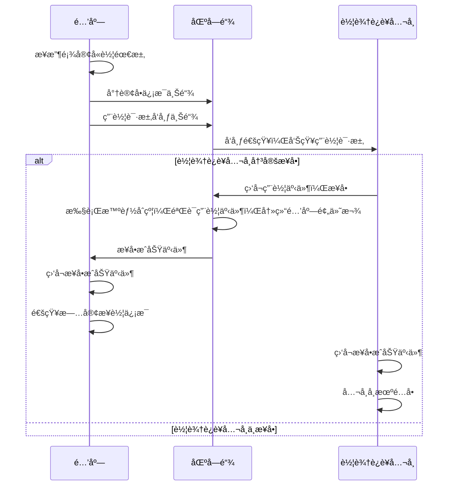
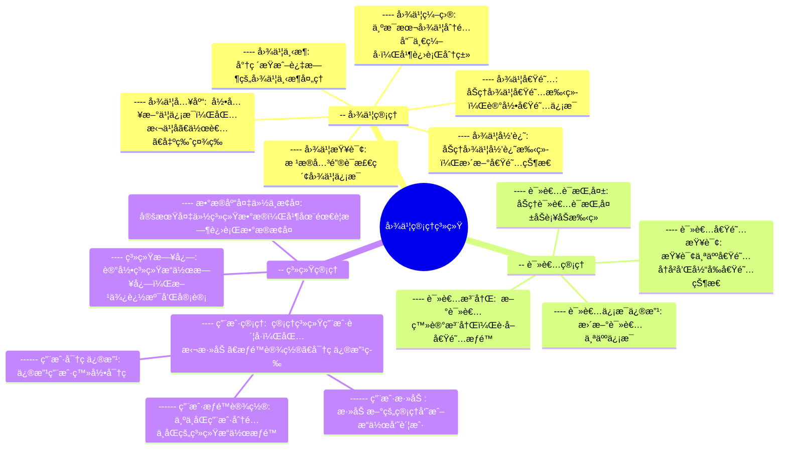
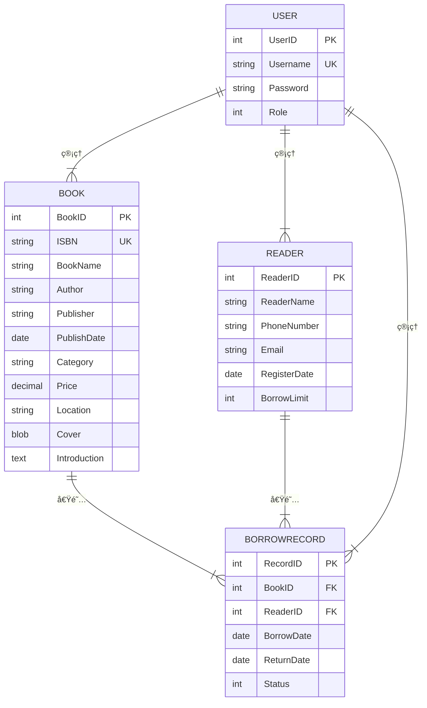

# AIä¸å¼€å‘

## AI 模å‹é€‰æ‹©

> 以下模å‹å‡æŒ‡ä½¿ç”¨API调用，而ä¸æ˜¯å®˜ç½‘ç•Œé¢è°ƒç”¨ï¼Œä»¥ä¸‹åŠŸèƒ½å’Œå…费策略基äºæœ¬æ–‡ç¼–写时的版本和å‚商活动

| ç§ç±»     | 特点                                                         | 适åˆåœºåˆ                               |
| -------- | ------------------------------------------------------------ | -------------------------------------- |
| OpenAI   | 业界领先，没法直æ¥è®¿é—®ï¼Œgpt-4o-mini价格便宜，编程使用足够了，支æŒå¤šæ¨¡æ€ï¼›text-embedding-ada-002支æŒembedding。 | å„ç§åœºåˆï¼Œå…¨èƒ½                         |
| Gemini   | 谷歌出å“，没法直æ¥è®¿é—®ï¼Œç¼–程使用足够了，支æŒå¤šæ¨¡æ€ï¼Œä½†æ˜¯æ¯å¤©æœ‰å…è´¹APIé¢åº¦ | å„ç§åœºåˆï¼Œå…¨èƒ½                         |
| Claude   | 太贵了，没用过，æ®è¯´å…¨èƒ½                                     | å„ç§åœºåˆï¼Œå…¨èƒ½                         |
| Moonshot | 编程使用足够了，支æŒå¤šæ¨¡æ€ï¼Œæ³¨å†Œèµ é€token，支æŒOpenAI兼容调用，支æŒfunction_call，支æŒç¼“存但使用麻烦 | OpenAI下ä½æ›¿ä»£å“                       |
| DeepSeek | 编程使用足够了，但是ä¸æ”¯æŒå¤šæ¨¡æ€ï¼Œæ³¨å†Œèµ é€token（一月过期 ），支æŒOpenAI兼容调用，支æŒfunction_call，开æºæ¨¡å‹ï¼Œå›½å¤–很多产å“使用它åšæµ‹è¯•ï¼Œå…¼å®¹æ€§æ¯”较好，支æŒç¼“存命中（自动），缓存命中åä»·æ ¼æä½ï¼Œæ— å¹¶å‘é™åˆ¶ | 结åˆAI编程工具使用，åšCursor的下ä½æ›¿ä»£ |
| Wenxin   | 部分ä½ç«¯APIå…费，高端比较贵，ä¸æ”¯æŒå¤šæ¨¡æ€ï¼Œæ³¨å†Œèµ é€token     | ç•¥                                     |
| QWen     | 比较贵，ä¸æ”¯æŒå¤šæ¨¡æ€ï¼Œæ³¨å†Œæœ‰æ´»åŠ¨æ—¶èµ é€token，开æºæ¨¡å‹ï¼Œå›½å¤–很多产å“使用它åšæµ‹è¯•ï¼Œå…¼å®¹æ€§æ¯”较好 | ç•¥                                     |

总结

* OpenAI：还是最好备用一个，个人觉得gpt-4o-mini便宜åˆå¥½ç”¨ï¼Œæ‰€æœ‰ä¸»æµåŠŸèƒ½éƒ½æ”¯æŒ
* Gemini：顶级模å‹æ¯å¤©éƒ½èƒ½ç™½å«–API（当然活动å¯èƒ½éšæ—¶ç»“æŸï¼‰ï¼Œåªè¦ä½ èƒ½è®¿é—®Google
* Claude：没用过
* Moonshot：用ä¸äº†OpenAIå¯ä»¥å¤‡ä¸€ä¸ªï¼Œé™¤äº†ä¸æ”¯æŒembedding以外，主æµåŠŸèƒ½éƒ½æ”¯æŒ
* DeepSeek：Cline + DeepSeek便宜åˆå¥½ç”¨ï¼Œä¸æ¯”Cursor差（主è¦æ˜¯ç©·â€¦â€¦ï¼‰
* Wenxinã€QWen等：如æœå…费的è¯å¯ä»¥ç”¨ç”¨

## AI编程ç¯å¢ƒ

### 云端ç¯å¢ƒ

云端ç¯å¢ƒï¼Œæ— éœ€å®‰è£…，å³å¼€å³ç”¨ï¼š[豆包 MarsCode - 工作å°](https://www.marscode.cn/dashboard)

å¯ä»¥ç›´æ¥å¯¼å…¥Git仓库


### 使用TONGYI Lingma辅助编程


## 生æˆä»£ç 

### AI对è¯

比如我想生æˆä¸€ä¸ªè„šæœ¬ï¼ŒæŠŠæˆ‘Markdown所用到的图片å‹ç¼©ä¸€ä¸‹ï¼Œå¯ä»¥è¿™æ ·å†™é¢˜è¯ï¼š

```
用Pythonçš„tkinterå®ç°
选å–一个文件目录，éå†é‡Œé¢å…¨éƒ¨å›¾ç‰‡æ–‡ä»¶ï¼Œå¦‚æœå›¾ç‰‡çš„宽度超过1080åƒç´ ï¼Œä¿æŒå®½é«˜æ¯”例将该图片å‹ç¼©ä¸ºå®½åº¦ä¸º1080åƒç´ 
处ç†å›¾ç‰‡çš„过程å¦èµ·çº¿ç¨‹ä»¥ä¿è¯ç•Œé¢çš„å“应
用进度æ¡å±•ç¤ºå¤„ç†è¿›åº¦ï¼Œåœ¨ç•Œé¢ä¸Šè¾“出被å‹ç¼©å›¾ç‰‡çš„å称
全部完æˆå通过对è¯æ¡†æ示完æˆ
```


中间也会é‡åˆ°ä¸€äº›æ³¢æŠ˜ï¼Œæ¯”如第一次生æˆçš„时候会æ示`AttributeError: module 'PIL.Image' has no attribute 'ANTIALIAS'`

这个我们也知é“，一般是因为版本ä¸å…¼å®¹é€ æˆçš„（而且一般是使用了ä½ç‰ˆæœ¬çš„代ç ï¼‰ï¼Œæˆ‘们把错误å馈给他，并告知他我们所使用的版本，一般会得到正确的答å¤

> :robot: 在较新的Pillow版本中，`Image.ANTIALIAS`已被替æ¢ä¸º`Image.LANCZOS`。我们å¯ä»¥æ›´æ–°ä»£ç ä»¥ä½¿ç”¨æ–°çš„常é‡æ¥é¿å…这个错误。

### Cline

Cline (prev. Claude Dev) å¯ä»¥é€æ­¥å¤„ç†å¤æ‚的软件开å‘任务。借助å…许他读写文件ã€ä»å¤´å¼€å§‹åˆ›å»ºæ•´ä¸ªé¡¹ç›®ä»¥åŠæ‰§è¡Œç»ˆç«¯å‘½ä»¤ï¼ˆåœ¨æ‚¨æˆäºˆæƒé™å）的工具，他å¯ä»¥ä¸ºæˆ‘们æ供超越简å•ä»£ç å®Œæˆæˆ–技术支æŒçš„帮助。

* 跟踪当å‰ä»»åŠ¡å¾ªç¯çš„总Tokenså’Œ API 使用æˆæœ¬
* 在精ç¾è¯­æ³•é«˜äº®é¢„览中查看编辑差异或新文件
* 将命令执行输出æµåˆ°èŠå¤©ä¸­ï¼Œè¿™æ ·ä½ å°±ä¸å¿…自己打开终端
* åœ¨ä½¿ç”¨å·¥å…·æˆ–å‘ API å‘é€ä¿¡æ¯ä¹‹å‰æ˜¾ç¤ºæƒé™æŒ‰é’®ï¼ˆå³â€œæ‰¹å‡† CLI 命令â€ï¼‰
* 设置在æ示继续执行之å‰å…许执行任务的最大 API 请求数
* 查看 API 请求的 JSON 并跟踪å•ä¸ª API 请求的æˆæœ¬

```
生æˆä¸€ä¸ªæŠ˜çº¿å›¾ï¼Œåå°ç”¨SpringBootæ供数æ®æ¥å£ï¼Œå‰å°ç”¨fetch+Echartå®ç°
```

> å¯ä»¥æ ¹æ®ä½ çš„è¦æ±‚自动创建项目和文件列表，é…置文件，根æ®ç»ˆç«¯å馈的错误给出解决方案，我用的是gpt-4o-mini，感觉也基本够用，当然比AI对è¯ç”Ÿæˆä»£ç å¯èƒ½è¦è´µä¸€äº›ã€‚比如完æˆæœ¬ä»»åŠ¡ï¼Œå…±è€—è´¹`Tokens:↑206,407 ↓3,634`，按照当å‰çš„gpt-4o-mini价格算约`US$0.033`，当然，如æœæœºå™¨æ€§èƒ½ä¸é”™ï¼Œå¯ä»¥ä½¿ç”¨Ollama。
>
> 如下图，å¯ä»¥ç»™ä½ è‡ªåŠ¨åˆ›å»ºæ¯ä¸€ä¸ªæ–‡ä»¶ï¼ˆéœ€è¦ä½ ç¡®è®¤ä¿å­˜ï¼‰ï¼Œæ ¹æ®ç»ˆç«¯çš„å馈给出下一步的命令（需è¦ä½ ç¡®è®¤æ‰§è¡Œï¼‰


国内ç¯å¢ƒå¯ä»¥è€ƒè™‘使用 ==**DeepSeek**==，Cline专门针对其åšäº†æµ‹è¯•ï¼Œä»·æ ¼é常便宜。é…置如下，完æˆç›¸åŒçš„任务åªèŠ±äº†ï¿¥4分钱，åŒæ—¶DeepSeek也是开æºæ¨¡å‹ï¼Œå¦‚æœæœºå™¨æ€§èƒ½ä¸é”™ï¼Œå¯ä»¥ä½¿ç”¨Ollamaæ¥è·‘

* **API Provider**：OpenAl Compatible
* **Base URL**：https://api.deepseek.com
* **API Key**：自行申请
* **Model ID**：deepseek-coder


## ç•Œé¢åŸå‹

### 文生图

比如使用AI生æˆç•Œé¢åŸå‹

**题è¯**

```
首页由四个部分组æˆï¼Œè¯·ç”¨ HTML å®ç°ã€‚
整个页é¢ä½¿ç”¨ Bootstrap 生æˆï¼Œç›¸å…³å¤–部资æºå¼•ç”¨ CDN 资æºï¼Œå¹¶é€‚é…手机å±å¹•ã€‚
内容中å¯ä»¥ä½¿ç”¨å›¾æ ‡ï¼Œä¾‹å¦‚ Font Awesome。
最上方是广告轮播图，你å¯ä»¥ç”¨ç®€å•çš„ SVG 模拟图片。
广告下方是通告部分，它是一个 Tab 组件，å¯ä»¥åˆ‡æ¢â€œé€šå‘Šåˆ—表â€å’Œâ€œå·²å®Œæˆé€šå‘Šåˆ—表â€ã€‚
通告列表中，æ¯ä¸€é¡¹å·¦ä¾§æ˜¯é€šå‘Šçš„图片，å³ä¾§æ˜¯é€šå‘Šçš„标题ã€å‘布时间和概è¦ã€‚
通告下方是一个å‘布通告的按钮。
页é¢æœ€ä¸‹æ–¹æ˜¯å›ºå®šåœ¨åº•éƒ¨çš„主è¦èœå•ï¼Œå…±å››ä¸ªèœå•é¡¹ï¼šé¦–页ã€å‘ç°ã€ä¸ªäººï¼Œç›®å‰é€‰ä¸­â€œé¦–页â€ã€‚
```

**生æˆçš„HTML**

```html
<!DOCTYPE html>
<html lang="en">
<head>
    <meta charset="UTF-8">
    <meta name="viewport" content="width=device-width, initial-scale=1.0">
    <title>首页</title>
    <link rel="stylesheet" href="https://cdn.jsdelivr.net/npm/bootstrap@4.6.2/dist/css/bootstrap.min.css">
    <link rel="stylesheet" href="https://cdnjs.cloudflare.com/ajax/libs/font-awesome/6.4.2/css/all.min.css">
    <style>
        /* è‡ªå®šä¹‰æ ·å¼ */
        .carousel-item svg {
            width: 100%;
            height: 200px;
        }

        .nav-tabs .nav-link.active {
            background-color: #007bff;
            color: #fff;
        }

        .notice-item {
            display: flex;
            align-items: center;
            padding: 10px;
            border-bottom: 1px solid #eee;
        }

        .notice-item img {
            width: 80px;
            height: 80px;
            margin-right: 10px;
        }

        .fixed-bottom {
            position: fixed;
            bottom: 0;
            left: 0;
            width: 100%;
        }
    </style>
</head>
<body>

    <!-- å¹¿å‘Šèµ°é©¬ç¯ -->
    <div id="carousel" class="carousel slide" data-ride="carousel">
        <div class="carousel-inner">
            <div class="carousel-item active">
                <svg viewBox="0 0 300 100">
                    <rect width="300" height="100" fill="#f00" />
                    <text x="50%" y="50%" dominant-baseline="middle" text-anchor="middle" fill="#fff" font-size="30">广告 1</text>
                </svg>
            </div>
            <div class="carousel-item">
                <svg viewBox="0 0 300 100">
                    <rect width="300" height="100" fill="#0f0" />
                    <text x="50%" y="50%" dominant-baseline="middle" text-anchor="middle" fill="#fff" font-size="30">广告 2</text>
                </svg>
            </div>
        </div>
    </div>

    <!-- 通告部分 -->
    <div class="container mt-3">
        <ul class="nav nav-tabs" id="noticeTab" role="tablist">
            <li class="nav-item">
                <a class="nav-link active" id="notice-list-tab" data-toggle="tab" href="#notice-list" role="tab" aria-controls="notice-list" aria-selected="true">
                    <i class="fas fa-bullhorn"></i> 通告列表
                </a>
            </li>
            <li class="nav-item">
                <a class="nav-link" id="finished-notice-list-tab" data-toggle="tab" href="#finished-notice-list" role="tab" aria-controls="finished-notice-list" aria-selected="false">
                    <i class="fas fa-check-circle"></i> 已完æˆé€šå‘Šåˆ—表
                </a>
            </li>
        </ul>
        <div class="tab-content" id="noticeTabContent">
            <div class="tab-pane fade show active" id="notice-list" role="tabpanel" aria-labelledby="notice-list-tab">
                <div class="notice-item">
                    
                    <div>
                        <h5><i class="fas fa-newspaper"></i> 通告标题 1</h5>
                        <p><i class="fas fa-clock"></i> å‘布时间：2023-12-28</p>
                        <p><i class="fas fa-info-circle"></i> 概è¦ï¼šè¿™æ˜¯ä¸€æ¡é€šå‘Šçš„概è¦ä¿¡æ¯...</p>
                    </div>
                </div>
                <div class="notice-item">
                    
                    <div>
                        <h5><i class="fas fa-newspaper"></i> 通告标题 2</h5>
                        <p><i class="fas fa-clock"></i> å‘布时间：2023-12-27</p>
                        <p><i class="fas fa-info-circle"></i> 概è¦ï¼šè¿™æ˜¯ä¸€æ¡é€šå‘Šçš„概è¦ä¿¡æ¯...</p>
                    </div>
                </div>
            </div>
            <div class="tab-pane fade" id="finished-notice-list" role="tabpanel" aria-labelledby="finished-notice-list-tab">
                <p>暂无已完æˆé€šå‘Š</p>
            </div>
        </div>
        <button class="btn btn-primary btn-block mt-3">
            <i class="fas fa-plus-circle"></i> å‘布通告
        </button>
    </div>

    <!-- 主èœå• -->
    <nav class="navbar navbar-light bg-light fixed-bottom">
        <ul class="nav nav-pills nav-justified w-100">
            <li class="nav-item">
                <a class="nav-link active" href="#">
                    <i class="fas fa-home"></i> 首页
                </a>
            </li>
            <li class="nav-item">
                <a class="nav-link" href="#">
                    <i class="fas fa-compass"></i> å‘ç°
                </a>
            </li>
            <li class="nav-item">
                <a class="nav-link" href="#">
                    <i class="fas fa-user"></i> 个人
                </a>
            </li>
        </ul>
    </nav>

    <script src="https://cdn.jsdelivr.net/npm/jquery@3.5.1/dist/jquery.slim.min.js"></script>
    <script src="https://cdn.jsdelivr.net/npm/popper.js@1.16.1/dist/umd/popper.min.js"></script>
    <script src="https://cdn.jsdelivr.net/npm/bootstrap@4.6.2/dist/js/bootstrap.min.js"></script>
</body>
</html>
```

**ç•Œé¢å±•ç¤º**


### 图生图

**上传图片至AI**，我这里用的是chatgpt4o


**题è¯**

```
能用Bootstrapå¤åˆ¶è¯¥é¡µé¢å—
```

**生æˆçš„HTML**

```html
<!DOCTYPE html>
<html lang="en">
<head>
    <meta charset="UTF-8">
    <meta name="viewport" content="width=device-width, initial-scale=1.0">
    <title>Bootstrap Layout</title>
    <link href="https://stackpath.bootstrapcdn.com/bootstrap/4.5.2/css/bootstrap.min.css" rel="stylesheet">
</head>
<body>
    <div class="container mt-4">
        <!-- Navigation bar -->
        <nav class="navbar navbar-expand-lg navbar-light bg-light">
            <a class="navbar-brand" href="#">Logo</a>
            <button class="navbar-toggler" type="button" data-toggle="collapse" data-target="#navbarNav" aria-controls="navbarNav" aria-expanded="false" aria-label="Toggle navigation">
                <span class="navbar-toggler-icon"></span>
            </button>
            <div class="collapse navbar-collapse" id="navbarNav">
                <ul class="navbar-nav">
                    <li class="nav-item active">
                        <a class="nav-link" href="#">Home</a>
                    </li>
                    <li class="nav-item">
                        <a class="nav-link" href="#">Videos</a>
                    </li>
                    <li class="nav-item">
                        <a class="nav-link" href="#">News</a>
                    </li>
                    <li class="nav-item">
                        <a class="nav-link" href="#">Schedule</a>
                    </li>
                </ul>
            </div>
        </nav>
        
        <!-- Main content -->
        <div class="row mt-4">
            <!-- Videos Section -->
            <div class="col-md-4">
                <h5>足çƒè§†é¢‘</h5>
                <div class="card mb-3">
                    
                    <div class="card-body">
                        <p class="card-text">çªå‘ï¼ï¼ç¦ç™»å·²æš‚时离开英格...</p>
                    </div>
                </div>
                <div class="card mb-3">
                    
                    <div class="card-body">
                        <p class="card-text">æ ¼é²å‰äºšæŒºè¿›16强ï¼...</p>
                    </div>
                </div>
                <!-- More cards as needed -->
            </div>
            
            <!-- News Section -->
            <div class="col-md-4">
                <h5>足çƒèµ„讯</h5>
                <ul class="list-group">
                    <li class="list-group-item">
                        <h6>世亚预18强赛抽签：国足ä¸æ—¥æœ¬ã€æ¾³å¤§åˆ©äºšã€æ²™ç‰¹ã€å·´æ—...</h6>
                        <p>魔鬼开局ï¼å›½è¶³18强赛：首轮战日本，二三轮对阵沙特...</p>
                    </li>
                    <li class="list-group-item">
                        <h6>今日趣图：对日澳争拿1分...</h6>
                        <p>对沙特ä¿1争2，å°å°¼å·´æ—å¯æ‘˜ä¹‹...</p>
                    </li>
                    <!-- More list items as needed -->
                </ul>
            </div>
            
            <!-- Schedule Section -->
            <div class="col-md-4">
                <h5>完赛赛程</h5>
                <div class="d-flex justify-content-between">
                    <div class="p-2"><a href="#" class="btn btn-primary">é‡è¦</a></div>
                    <div class="p-2"><a href="#" class="btn btn-secondary">足çƒ</a></div>
                    <div class="p-2"><a href="#" class="btn btn-secondary">篮çƒ</a></div>
                    <div class="p-2"><a href="#" class="btn btn-secondary">电ç«</a></div>
                </div>
                <ul class="list-group mt-3">
                    <li class="list-group-item">EDG 0 - 2 DRG</li>
                    <li class="list-group-item">æ­å·LGD.NBW 0 - 3 è‹å·KSG</li>
                    <li class="list-group-item">RNG 2 - 1 WE</li>
                    <!-- More list items as needed -->
                </ul>
            </div>
        </div>
    </div>

    <script src="https://code.jquery.com/jquery-3.5.1.slim.min.js"></script>
    <script src="https://cdn.jsdelivr.net/npm/@popperjs/core@2.5.4/dist/umd/popper.min.js"></script>
    <script src="https://stackpath.bootstrapcdn.com/bootstrap/4.5.2/js/bootstrap.min.js"></script>
</body>
</html>
```

**ç•Œé¢å±•ç¤º**


### 手绘

手绘界é¢ï¼Œè¿™é‡Œä¸“门找了一个字迹潦è‰ï¼Œæ‹æ‘„角度也ä¸ä½³çš„。

| 手绘åŸå‹                                                     | HTMLåŸå‹                                                     | Pythonç•Œé¢                                                   |
| ------------------------------------------------------------ | ------------------------------------------------------------ | ------------------------------------------------------------ |
|  |  |  |

### AI生图

通过AI生æˆç•Œé¢æ‰€éœ€å›¾ç‰‡ï¼Œå¦‚下图，å³è¾¹çš„图å³ä½¿ç”¨DALL-E文生图生æˆï¼Œå¦‚æœè¦ç”Ÿæˆæ›´ç¬¦åˆéœ€æ±‚的图片需è¦å­¦ä¹ Stable Diffusion


## 软件设计

### æ ¹æ®ç”¨æˆ·æ供文档总结需求


使用Google (gemini-pro)

> 

gemini给出的总结

> 这张图片展示的是一个以 Salesforce ä¸ºæ ¸å¿ƒçš„å®¢æˆ·å…³ç³»ç®¡ç† (CRM) 系统的è¿ä½œæµç¨‹å›¾ï¼Œå®ƒæ¶µç›–了潜在客户和ç°æœ‰å®¢æˆ·çš„两ç§ä¸»è¦ä¸šåŠ¡æµç¨‹ã€‚
>
> **æµç¨‹ä¸€ï¼šæ½œåœ¨å®¢æˆ·ç®¡ç† (Lead Management)**
>
> 1. **ä¿¡æ¯æ”¶é›†:** æ½œåœ¨å®¢æˆ·é€šè¿‡ç½‘ç«™è¡¨å• (Web to Lead) 或邮件 (Mail to Salesforce) æ交信æ¯ã€‚
> 2. **Salesforce 处ç†:** Salesforce 将收集到的信æ¯åˆ›å»ºä¸ºâ€œæ½œåœ¨å®¢æˆ·â€ (Lead) 记录。
> 3. **邮件交互:** 系统自动使用预设的销售邮箱 ([xxxxx@salesforce.com](mailto:xxxxx@salesforce.com)) ä¸æ½œåœ¨å®¢æˆ·è¿›è¡Œé‚®ä»¶æ²Ÿé€š (Mail Message)。
> 4. **åç»­è·Ÿè¿›:** 销售人员å¯ä»¥æ ¹æ®â€œæ½œåœ¨å®¢æˆ·â€è®°å½•åˆ›å»ºâ€œæ´»åŠ¨â€ (Activity) 进行跟进，例如电è¯ã€ä¼šè®®ç­‰ã€‚
> 5. **转化商机:** 一旦潜在客户表ç°å‡ºè´­ä¹°æ„å‘，销售人员å¯ä»¥å°†å…¶è½¬åŒ–为“商机†(Opportunity)，并关è”相应的“客户†(Account) 和“è”系人†(Contact) ä¿¡æ¯ã€‚
>
> **æµç¨‹äºŒï¼šå®¢æˆ·æœåŠ¡ (Case Management)**
>
> 1. **问题å馈:** ç°æœ‰å®¢æˆ·é€šè¿‡ç½‘ç«™è¡¨å• (Web to Case) 或邮件 (Mail to Case) æ交问题或æœåŠ¡è¯·æ±‚。
> 2. **Salesforce 处ç†:** Salesforce 将收集到的信æ¯åˆ›å»ºä¸ºâ€œå®¢æˆ·æ¡ˆä¾‹â€ (Case) 记录。
> 3. **邮件交互:** 系统自动使用预设的客æœé‚®ç®± ([yyyyy@salesforce.com](mailto:yyyyy@salesforce.com)) ä¸å®¢æˆ·è¿›è¡Œé‚®ä»¶æ²Ÿé€šã€‚
> 4. **åç»­è·Ÿè¿›:** 客æœäººå‘˜å¯ä»¥æ ¹æ®â€œå®¢æˆ·æ¡ˆä¾‹â€è®°å½•åˆ›å»ºâ€œæ´»åŠ¨â€ (Activity) 进行跟进，例如解决方案ã€è¿›åº¦æ›´æ–°ç­‰ã€‚
> 5. **任务分é…:** 客æœäººå‘˜å¯ä»¥æ ¹æ®éœ€è¦åˆ›å»ºâ€œå¾…åŠäº‹é¡¹â€ (Task) 并分é…给相关人员。
>
> **其他关键信æ¯:**
>
> - **邮件和日å†åŒæ­¥:** Salesforce å¯ä»¥ä¸ Office 365 或 G Suite åŒæ­¥é‚®ä»¶å’Œæ—¥å†ä¿¡æ¯ï¼Œæ–¹ä¾¿é”€å”®å’Œå®¢æœäººå‘˜ç»Ÿä¸€ç®¡ç†å®¢æˆ·æ²Ÿé€šå’Œæ—¥ç¨‹å®‰æ’。
> - **活动æ•æ‰:** Salesforce å¯ä»¥è‡ªåŠ¨æ•æ‰ä¸å®¢æˆ·ç›¸å…³çš„邮件和活动，并将其记录在相应的“潜在客户â€ã€â€œå®¢æˆ·æ¡ˆä¾‹â€æˆ–“è”系人â€è®°å½•ä¸­ï¼Œç¡®ä¿ä¿¡æ¯å®Œæ•´æ€§ã€‚
>
> **总结:**
>
> 这张æµç¨‹å›¾æ¸…晰地展示了 Salesforce CRM 系统如何帮助ä¼ä¸šç®¡ç†æ½œåœ¨å®¢æˆ·ã€å¤„ç†å®¢æˆ·æœåŠ¡è¯·æ±‚以åŠè·Ÿè¸ªå®¢æˆ·äº’动，ä»è€Œæ高销售效ç‡å’Œå®¢æˆ·æ»¡æ„度。

### 生æˆPRD

```
æ ¹æ®è§£é‡Šæ€»ç»“æˆPRD，使用Mermaid绘制必è¦çš„æµç¨‹å›¾
```

gemini给出的PRD

````markdown
## Salesforce CRM 系统对æ¥æ–¹æ¡ˆ PRD

**1.  目标**

* é€šè¿‡ä¸ Salesforce CRM 系统对æ¥ï¼Œå®ç°ä»¥ä¸‹ç›®æ ‡ï¼š
    * 自动化潜在客户信æ¯æ”¶é›†å’Œè·Ÿè¿›æµç¨‹ï¼Œæ高销售效ç‡ã€‚
    * 规范化客户æœåŠ¡æµç¨‹ï¼Œæå‡å®¢æˆ·æ»¡æ„度。
    * å®ç°é‚®ä»¶ã€æ—¥å†å’Œå®¢æˆ·ä¿¡æ¯çš„统一管ç†ï¼Œæ高团队å作效ç‡ã€‚

**2. 用户角色**

* 销售人员
* 客æœäººå‘˜
* 管ç†å‘˜

**3. 功能需求**

**3.1 潜在客户管ç†**

* **æµç¨‹å›¾:**



* **功能æè¿°:**
    * 潜在客户通过网站表å•æˆ–邮件æ交信æ¯ã€‚
    * 系统自动将信æ¯å½•å…¥ Salesforce，创建“潜在客户â€è®°å½•ã€‚
    * 系统自动使用预设的销售邮箱ä¸æ½œåœ¨å®¢æˆ·è¿›è¡Œé‚®ä»¶æ²Ÿé€šã€‚
    * 销售人员å¯ä»¥åˆ›å»ºâ€œæ´»åŠ¨â€è®°å½•ï¼Œè·Ÿè¸ªè·Ÿè¿›æƒ…况。
    * 将有购买æ„å‘的“潜在客户â€è½¬åŒ–为“商机â€ï¼Œå¹¶å…³è”“客户â€å’Œâ€œè”系人â€ä¿¡æ¯ã€‚

**3.2 客户æœåŠ¡**

* **æµç¨‹å›¾:**



* **功能æè¿°:**
    * 客户通过网站表å•æˆ–邮件æ交问题或æœåŠ¡è¯·æ±‚。
    * 系统自动将信æ¯å½•å…¥ Salesforce，创建“客户案例â€è®°å½•ã€‚
    * 系统自动使用预设的客æœé‚®ç®±ä¸å®¢æˆ·è¿›è¡Œé‚®ä»¶æ²Ÿé€šã€‚
    * 客æœäººå‘˜å¯ä»¥åˆ›å»ºâ€œæ´»åŠ¨â€è®°å½•ï¼Œè·Ÿè¸ªå¤„ç†è¿›åº¦ã€‚
    * 客æœäººå‘˜å¯ä»¥åˆ›å»ºâ€œå¾…åŠäº‹é¡¹â€ï¼Œå¹¶åˆ†é…给相关人员。

**3.3 邮件和日å†åŒæ­¥**

* å°† Salesforce ä¸ Office 365 或 G Suite 进行åŒæ­¥ï¼Œå®ç°ï¼š
    * 邮件åŒæ­¥ï¼šåœ¨ Salesforce 中查看和管ç†ä¸å®¢æˆ·ç›¸å…³çš„邮件。
    * æ—¥å†åŒæ­¥ï¼šåœ¨ Salesforce 中查看和管ç†ä¸å®¢æˆ·ç›¸å…³çš„日程安æ’。

**3.4 活动æ•æ‰**

* 自动æ•æ‰ä¸å®¢æˆ·ç›¸å…³çš„邮件和活动，并将其记录在相应的 Salesforce 记录中，例如“潜在客户â€ã€â€œå®¢æˆ·æ¡ˆä¾‹â€æˆ–“è”系人â€ã€‚

**4.  é功能需求**

* 系统稳定性
* æ•°æ®å®‰å…¨æ€§
* 易用性

**5.  验收标准**

* 所有功能需求å‡å·²å®ç°å¹¶é€šè¿‡æµ‹è¯•ã€‚
* 系统性能满足è¦æ±‚。
* 系统安全性符åˆè§„范。
* æ供完整的用户æ“作文档。 
````

### ç†è§£+生æˆUML

活动图é常å®ç”¨ï¼Œåœ¨éœ€æ±‚分æ阶段，产å“ç»ç†ç”¨æ¥æ述业务æµç¨‹ã€‚在概è¦è®¾è®¡å’Œè¯¦ç»†è®¾è®¡é˜¶æ®µï¼Œéœ€è¦å‚考活动图æ¥è¿›è¡Œä¸‹ä¸€æ­¥çš„设计。


使用Google (gemini-pro)，gemini给出的总结

> 这张图片展示的是酒店ã€åŒºå—链和车辆è¿è¥å…¬å¸ä¹‹é—´ï¼Œåˆ©ç”¨åŒºå—链技术å®ç°é…’店å«è½¦çš„æµç¨‹å›¾ã€‚
>
> **æµç¨‹è¯´æ˜ï¼š**
>
> 1. **酒店端:**
>    - æ¥æ”¶é¡¾å®¢å«è½¦éœ€æ±‚。
>    - 将订å•ä¿¡æ¯ä¸Šé“¾ï¼Œå³è®°å½•åˆ°åŒºå—链上。
>    - 用车请求å‘布上链，公开å¾é›†è½¦è¾†è¿è¥å…¬å¸æ¥å•ã€‚
>    - 监å¬æ¥å•æˆåŠŸäº‹ä»¶ï¼Œç­‰å¾…车辆è¿è¥å…¬å¸æ¥å•ã€‚
>    - 通知旅客æ¥è½¦ä¿¡æ¯ï¼Œå°†æ¥å•è½¦è¾†ä¿¡æ¯å‘ŠçŸ¥é¡¾å®¢ã€‚
>
> 2. **区å—链:**
>    - 执行智能åˆçº¦ï¼ŒéªŒè¯ç”¨è½¦äº‹ä»¶ï¼Œå†»ç»“酒店预付款（token）。
>    - å‘布通知到车辆è¿è¥å…¬å¸ï¼Œå‘ŠçŸ¥æœ‰æ–°çš„用车请求。
>    - æ¥æ”¶è½¦è¾†è¿è¥å…¬å¸çš„æ¥å•æˆåŠŸäº‹ä»¶ã€‚
>    - å°†æ¥å•æˆåŠŸäº‹ä»¶ä¼ é€’给酒店。
>
> 3. **车辆è¿è¥å…¬å¸:**
>    - 监å¬ç”¨è½¦äº‹ä»¶ï¼Œæ¥æ”¶æ¥è‡ªåŒºå—链的用车请求信æ¯ã€‚
>    - 决定是å¦æ¥å•ã€‚
>    - 如æœæ¥å•ï¼Œåˆ™ç›‘å¬æ¥å•æˆåŠŸäº‹ä»¶ï¼Œç¡®è®¤æ¥å•æˆåŠŸã€‚
>    - å…¬å¸å¸æœºé…å•ï¼ŒæŒ‡æ´¾å¸æœºæ¥é€é¡¾å®¢ã€‚
>
> **æµç¨‹ç‰¹ç‚¹ï¼š**
>
> * **å»ä¸­å¿ƒåŒ–:** 区å—链作为中介平å°ï¼Œè¿æ¥é…’店和车辆è¿è¥å…¬å¸ï¼Œæ— éœ€ä¸­å¿ƒåŒ–å¹³å°è°ƒåº¦ã€‚
> * **é€æ˜å¯ä¿¡:** 所有交易信æ¯è®°å½•åœ¨åŒºå—链上，公开é€æ˜ï¼Œä¸å¯ç¯¡æ”¹ã€‚
> * **安全å¯é :** 智能åˆçº¦è‡ªåŠ¨æ‰§è¡Œï¼Œç¡®ä¿äº¤æ˜“安全å¯é ã€‚
> * **æ高效ç‡:** 自动化æµç¨‹ï¼Œå‡å°‘人工干预，æ高å«è½¦æ•ˆç‡ã€‚
>
> **总结:**
>
> 这张æµç¨‹å›¾å±•ç¤ºäº†åŒºå—链技术在酒店å«è½¦åœºæ™¯ä¸­çš„应用，通过å»ä¸­å¿ƒåŒ–ã€é€æ˜å¯ä¿¡ã€å®‰å…¨å¯é ç­‰ç‰¹ç‚¹ï¼Œä¼˜åŒ–了传统å«è½¦æµç¨‹ï¼Œæ高了效ç‡å’Œç”¨æˆ·ä½“验。

让gemini用Mermaidé‡ç»˜æˆ`sequenceDiagram`



æ ¹æ®è¿™ä¸ªéœ€æ±‚设计一下类图，这个类图你å¯ä»¥æ示它完善，比如添加“å¸æœºâ€ã€â€œè½¦è¾†â€çš„类等等……

```mermaid
classDiagram
    class 酒店{
        -酒店å称: String
        -酒店地å€: String
        +æ¥æ”¶å«è½¦éœ€æ±‚(顾客信æ¯: String, 目的地: String)
        +将订å•ä¿¡æ¯ä¸Šé“¾(订å•ä¿¡æ¯: Order)
        +å‘布用车请求(用车请求: Request)
        +监å¬æ¥å•æˆåŠŸäº‹ä»¶()
        +通知旅客æ¥è½¦ä¿¡æ¯(æ¥è½¦ä¿¡æ¯: PickupInfo)
    }

    class 区å—链{
        +å‘布用车请求(用车请求: Request)
        +执行智能åˆçº¦(åˆçº¦å†…容: Contract)
        +验è¯ç”¨è½¦äº‹ä»¶(用车事件: Event)
        +冻结酒店预付款(预付款: Payment)
        +å‘é€æ¥å•æˆåŠŸäº‹ä»¶(事件信æ¯: EventData)
    }

    class 车辆è¿è¥å…¬å¸{
        -å…¬å¸å称: String
        +监å¬ç”¨è½¦äº‹ä»¶()
        +决定是å¦æ¥å•(用车请求: Request) : Boolean
        +监å¬æ¥å•æˆåŠŸäº‹ä»¶()
        +å…¬å¸å¸æœºé…å•(订å•ä¿¡æ¯: Order)
        +添加车辆(车辆: Vehicle)
        +注册å¸æœº(å¸æœº: å¸æœº)
    }

    class å¸æœº {
        -å¸æœºå§“å: String
        -è”系电è¯: String
        -所å±å…¬å¸: 车辆è¿è¥å…¬å¸
        +æ¥å•(订å•ä¿¡æ¯: Order)
        +æ›´æ–°ä½ç½®(ä½ç½®ä¿¡æ¯: Location)
    }

    class 车辆 {
        -车牌å·: String
        -车辆类å‹: String
        -所å±å…¬å¸: 车辆è¿è¥å…¬å¸
        -当å‰ä½ç½®: Location
        -状æ€: String ("空闲", "æœåŠ¡ä¸­")
    }

    class Order {
        -订å•å·: String
        -顾客信æ¯: String
        -出å‘地: String
        -目的地: String
    }

    class Request {
        -请求ID: String
        -订å•ä¿¡æ¯: Order
    }

    class PickupInfo {
        -å¸æœºä¿¡æ¯: å¸æœº
        -车辆信æ¯: 车辆
        -预计到达时间: Datetime
    }

    酒店 --> 区å—链 : å‘布用车请求
    区å—链 --> 车辆è¿è¥å…¬å¸ : 通知用车请求
    车辆è¿è¥å…¬å¸ --> 区å—链 : å›å¤æ¥å•ç»“æœ
    区å—链 --> 酒店 : å‘é€æ¥å•æˆåŠŸäº‹ä»¶
    车辆è¿è¥å…¬å¸ "1" o-- "*" å¸æœº : 管ç†
    车辆è¿è¥å…¬å¸ "1" o-- "*" 车辆 : 管ç†
    å¸æœº --> 车辆 : 驾驶
    

```

使用`draw.io`进行深度加工

* `èœå•`→`â•`→`高级`→`Mermaid`

* 选择这ç§æ‰‹ç»˜çš„æ ·å¼


效æœå¦‚下


### 软件详细设计

> 以下除题è¯å¤–å‡ç”±AI生æˆ

####  功能分解

```
ğŸ“设计一个图书管ç†ç³»ç»Ÿï¼Œä»–有哪些å­åŠŸèƒ½ï¼Œç”¨Mermaid绘制mindmap
åŒæ—¶ç”Ÿæˆæ¯ä¸ªå­åŠŸèƒ½çš„简è¦åŠŸèƒ½è§£é‡Š
```



####  æ•°æ®åº“设计

```
ğŸ“设计sqliteæ•°æ®åº“结æ„，并使用mermaid绘制er关系图
```

以下是图书管ç†ç³»ç»Ÿ SQLite æ•°æ®åº“结æ„设计，包å«åˆ›å»ºè¡¨çš„ SQL 语å¥ï¼š



**关系说æ˜ï¼š**

- **图书 - 借阅记录 (1:N)：** 一本书å¯ä»¥è¢«å¤šä¸ªè¯»è€…借阅，产生多æ¡å€Ÿé˜…记录。
- **读者 - 借阅记录 (1:N)：** 一个读者å¯ä»¥å€Ÿé˜…多本书，产生多æ¡å€Ÿé˜…记录。
- **用户 - 图书 (1:N)：** 管ç†å‘˜å¯ä»¥ç®¡ç†å¤šæœ¬ä¹¦ç±ä¿¡æ¯ã€‚
- **用户 - 读者 (1:N)：** 管ç†å‘˜å¯ä»¥ç®¡ç†å¤šä¸ªè¯»è€…ä¿¡æ¯ã€‚
- **用户 - 借阅记录 (1:N)：** 管ç†å‘˜å¯ä»¥ç®¡ç†å¤šæ¡å€Ÿé˜…记录。

```sql
-- 图书表
CREATE TABLE Book (
    BookID INTEGER PRIMARY KEY AUTOINCREMENT, -- 图书ID，主键，自å¢
    ISBN TEXT UNIQUE NOT NULL, -- ISBN，唯一，é空
    BookName TEXT NOT NULL, -- 书å，é空
    Author TEXT NOT NULL, -- 作者，é空
    Publisher TEXT NOT NULL, -- 出版社，é空
    PublishDate DATE, -- 出版日期
    Category TEXT, -- 图书分类
    Price REAL, -- ä»·æ ¼
    Location TEXT, -- 存放ä½ç½®
    Cover BLOB, -- å°é¢å›¾ç‰‡ï¼ŒäºŒè¿›åˆ¶æ•°æ®
    Introduction TEXT -- 内容简介
);

-- 读者表
CREATE TABLE Reader (
    ReaderID INTEGER PRIMARY KEY AUTOINCREMENT, -- 读者ID，主键，自å¢
    ReaderName TEXT NOT NULL, -- 读者姓å，é空
    PhoneNumber TEXT, -- è”系电è¯
    Email TEXT, -- 电å­é‚®ç®±
    RegisterDate DATE DEFAULT (date('now')), -- 注册日期，默认为当å‰æ—¥æœŸ
    BorrowLimit INTEGER DEFAULT 3 -- 借阅上é™ï¼Œé»˜è®¤ä¸º3本
);

-- 借阅记录表
CREATE TABLE BorrowRecord (
    RecordID INTEGER PRIMARY KEY AUTOINCREMENT, -- 借阅记录ID，主键，自å¢
    BookID INTEGER NOT NULL, -- 图书ID，外键关è”图书表
    ReaderID INTEGER NOT NULL, -- 读者ID，外键关è”读者表
    BorrowDate DATE DEFAULT (date('now')), -- 借阅日期，默认为当å‰æ—¥æœŸ
    ReturnDate DATE, -- 归还日期
    Status INTEGER DEFAULT 0, -- 借阅状æ€ï¼Œ0: 未归还，1: 已归还，2: 逾期
    FOREIGN KEY (BookID) REFERENCES Book(BookID),
    FOREIGN KEY (ReaderID) REFERENCES Reader(ReaderID)
);

-- 用户表
CREATE TABLE User (
    UserID INTEGER PRIMARY KEY AUTOINCREMENT, -- 用户ID，主键，自å¢
    Username TEXT UNIQUE NOT NULL, -- 用户å，唯一，é空
    Password TEXT NOT NULL, -- 密ç ï¼Œé空
    Role INTEGER DEFAULT 0 -- 角色，0: 管ç†å‘˜ï¼Œ1: 普通用户
);
```

**表结æ„说æ˜ï¼š**

**1. 图书表 (Book):**

*   `BookID`: 图书的唯一标识符，主键，自动递å¢ã€‚
*   `ISBN`: 国际标准书å·ï¼Œç”¨äºå”¯ä¸€æ ‡è¯†ä¸€æœ¬ä¹¦ï¼Œé空且唯一。
*   `BookName`: 书å，é空。
*   `Author`: 作者，é空。
*   `Publisher`: 出版社，é空。
*   `PublishDate`: 出版日期。
*   `Category`: 图书分类，例如：文学ã€ç§‘技ã€è‰ºæœ¯ç­‰ã€‚
*   `Price`: 图书价格。
*   `Location`: 图书存放ä½ç½®ï¼Œä¾‹å¦‚：图书馆的具体书æ¶å·ã€‚
*   `Cover`: 图书å°é¢å›¾ç‰‡ï¼Œä»¥äºŒè¿›åˆ¶æ•°æ®å­˜å‚¨ã€‚
*   `Introduction`: 图书内容简介。

**2. 读者表 (Reader):**

*   `ReaderID`: 读者的唯一标识符，主键，自动递å¢ã€‚
*   `ReaderName`: 读者姓å，é空。
*   `PhoneNumber`: 读者è”系电è¯ã€‚
*   `Email`: 读者电å­é‚®ç®±åœ°å€ã€‚
*   `RegisterDate`: 读者注册日期，默认为当å‰æ—¥æœŸã€‚
*   `BorrowLimit`: 读者å¯å€Ÿé˜…图书的最大数é‡ï¼Œé»˜è®¤ä¸º 3 本。

**3. 借阅记录表 (BorrowRecord):**

*   `RecordID`: 借阅记录的唯一标识符，主键，自动递å¢ã€‚
*   `BookID`: 借阅图书的 ID，外键关è”到图书表 (Book)。
*   `ReaderID`: 借阅者的 ID，外键关è”到读者表 (Reader)。
*   `BorrowDate`: 借阅日期，默认为当å‰æ—¥æœŸã€‚
*   `ReturnDate`: 归还日期，åˆå§‹å€¼ä¸º NULL，归还时更新。
*   `Status`: 借阅状æ€ï¼Œ0 表示未归还，1 表示已归还，2 表示逾期。

**4. 用户表 (User):**

*   `UserID`: 用户的唯一标识符，主键，自动递å¢ã€‚
*   `Username`: 用户å，用äºç™»å½•ç³»ç»Ÿï¼Œé空且唯一。
*   `Password`: 用户密ç ï¼Œé空。
*   `Role`: 用户角色，0 表示管ç†å‘˜ï¼Œæ‹¥æœ‰æ‰€æœ‰æƒé™ï¼Œ1 表示普通用户，æƒé™å—é™ã€‚

**关系：**

*   图书表和读者表之间是多对多关系，通过借阅记录表关è”。
*   æ¯æ¡å€Ÿé˜…记录关è”一本图书和一个读者。

**其他说æ˜ï¼š**

*   å¯ä»¥æ ¹æ®å®é™…需求添加或修改字段。
*   å¯ä»¥ä½¿ç”¨ SQLiteStudio 等工具创建和管ç†æ•°æ®åº“。
*   在应用程åºä¸­ï¼Œå¯ä»¥ä½¿ç”¨ SQL 语å¥æˆ– ORM 框æ¶æ¥æ“作数æ®åº“。

## æ•°æ®åº“

### 使用RAG辅助数æ®åº“编程

图中的“记忆胶囊â€å³RAG技术，将项目数æ®åº“ä¿¡æ¯æœ¬åœ°çŸ¢é‡åŒ–存储，在AI的辅助下对数æ®åº“进行自然语言查询分æ

```
找出本月已ç»å–消的所有订å•
```


### 自然语言写SQL

````markdown
需统计的数æ®åº“表结æ„如下
```sql
CREATE TABLE IF NOT EXISTS `click` (
  `click_id` int(11) NOT NULL,
  `ad_id` int(11) NOT NULL COMMENT '广告ID',
  `app_id` int(11) NOT NULL COMMENT '广告ä½ID',
  `check_uuid` varchar(200) COLLATE utf8mb4_bin NOT NULL DEFAULT '' COMMENT '用户唯一ID',
  `create_dateline` int(11) NOT NULL DEFAULT '0' COMMENT '时间戳',
  `create_date` date NOT NULL DEFAULT '2000-01-01' COMMENT '日期',
  `create_h` smallint(6) NOT NULL DEFAULT '0' COMMENT 'å°æ—¶',
  `flag` smallint(6) NOT NULL DEFAULT '0',
  `province` varchar(50) COLLATE utf8mb4_bin NOT NULL DEFAULT '0' COMMENT 'çœä»½',
  `city` varchar(50) COLLATE utf8mb4_bin NOT NULL DEFAULT '0' COMMENT 'åŸå¸‚',
  `isp` varchar(50) COLLATE utf8mb4_bin NOT NULL DEFAULT '0' COMMENT 'è¿è¥å•†',
  `browser` varchar(50) COLLATE utf8mb4_bin NOT NULL DEFAULT '0' COMMENT '终端æµè§ˆå™¨',
  `remote_addr` varchar(50) COLLATE utf8mb4_bin NOT NULL DEFAULT '0' COMMENT 'IP地å€',
  `http_user_agent` text COLLATE utf8mb4_bin NOT NULL COMMENT 'UA',
  `click_price` decimal(5,2) NOT NULL DEFAULT '0.00' COMMENT '点击å•ä»·',
  PRIMARY KEY (`click_id`) USING BTREE
) ENGINE=InnoDB DEFAULT CHARSET=utf8mb4 COLLATE=utf8mb4_bin;

CREATE TABLE IF NOT EXISTS `province` (
  `province_name` varchar(50) NOT NULL COMMENT 'çœä»½',
  `region_name` varchar(50) DEFAULT NULL COMMENT '大区',
  PRIMARY KEY (`province_name`)
) ENGINE=InnoDB DEFAULT CHARSET=utf8;
```
请问如何统计å„个大区的点击数，请给出SQL语å¥
````

 🤖**AIå›ç­”**

```sql
SELECT 
    p.region_name, 
    COUNT(c.click_id) AS click_count
FROM 
    click c
LEFT JOIN 
    province p ON c.province = p.province_name
GROUP BY 
    p.region_name;
```

è¿™æ¡è¯­å¥åœ¨æˆ‘机器上è¿è¡Œéœ€è¦4.6秒，äºæ˜¯æˆ‘æé—®

```markdown
è¿™æ¡è¯­å¥è¿è¡Œçš„很慢，请问如何优化
```

 🤖**AIå›ç­”**

```sql
-- 为 click 表的 province 列创建索引
ALTER TABLE click ADD INDEX idx_province (province);

-- 为 province 表的 province_name 列创建索引（如æœå®ƒè¿˜ä¸æ˜¯ä¸»é”®ï¼‰
ALTER TABLE province ADD INDEX idx_province_name (province_name); 
```

å†æ¬¡æŸ¥è¯¢å˜æˆ3.2秒，当然为什么优化效æœä¸æ˜æ˜¾ï¼Œè¿™æ˜¯æ•°æ®åŒºåˆ†åº¦è¾ƒä½çš„åŸå› ï¼Œè¿™ä¸ªå°±è¯´æ¥è¯é•¿äº†â€¦â€¦

### 自然语言数æ®å¯è§†åŒ–

````markdown
我有一个SQL
```sql
SELECT province, SUM(click_price), COUNT(*), SUM(click_price) / COUNT(*)
FROM click
GROUP BY province
```
使用Flask pymysql echarts生æˆä¸€ä¸ªå‰å端分离的å¯è§†åŒ–应用
````

> :smile: 这题è¿AI中最笨的**文心一言3.5**都能答对……，当然用更好的AIå¯ä»¥å¸®ä½ ç­”的更加完ç¾ï¼Œæ¯”如考é‡äº†ä½¿ç”¨ä»€ä¹ˆå›¾å½¢æ˜¾ç¤ºä»€ä¹ˆæ•°æ®


### Chat-based SQL Client and Editor

使用VSCode，安装TONGYI Lingma + MySQLæ’件

* [TONGYI Lingma - Visual Studio Marketplace](https://marketplace.visualstudio.com/items?itemName=Alibaba-Cloud.tongyi-lingma)

* [MySQL - Visual Studio Marketplace](https://marketplace.visualstudio.com/items?itemName=cweijan.vscode-mysql-client2)

如上，将数æ®åº“结æ„放到æ’件新建的`xxxxx.sql`文件中，用äºä¸Šä¸‹æ–‡å‚考，然å使用自然语言编写SQL，例如：

```sql
-- 查找åå—大区æ¯ä¸ªåŸå¸‚的点击数é‡ï¼Œå¹³å‡ç‚¹å‡»å•ä»·
```

点击TONGYI Lingma生æˆçš„SQLå‰é¢çš„RUN，和数æ®åº“进行å®æ—¶äº¤äº’


## 项目管ç†

### 使用AI监æ§é¡¹ç›®è¿›åº¦

通过调用GIT命令 + 调用AIæ¥å£å¯¹é¡¹ç›®æƒ…况和进度进行监æ§ï¼Œå°†æ¯æ—¥ç›‘æ§æƒ…况存储到数æ®åº“

```sh
📠仓库 https://xxx.com/*******/******* 开始评估
仓库 ta******* 已更新
 ✅ 克隆或更新æˆåŠŸ
 ✅ ä¿¡æ¯è·å–æˆåŠŸ
    📅 最新更新时间: 2024-07-03 11:42:13 +08:00
    📠更新内容: Merge branch 'main' of https://xxx.com/*******/*******  
    👤 bj******* æ交次数: 14
    👤 Zh******* æ交次数: 20
    👤 ic******* æ交次数: 3
    👤 yw******* æ交次数: 2
    👤 Ca******* æ交次数: 5
    👥 æ交总数: 44
    --------------------
    用户å: bj*******
    用户角色: 项目å‘起人，负责项目的整体规划和管ç†ï¼Œæ交了大é‡å…³äºæ¸¸æˆç‰¹è‰²ã€å¸‚场调研ã€æ–‡æ¡£æ›´æ–°ç­‰æ–¹é¢çš„内容。
    ç†ç”±: 虽然æ交次数较多，但主è¦é›†ä¸­åœ¨æ–‡æ¡£æ›´æ–°å’Œæ¸¸æˆç‰¹è‰²è°ƒæ•´ï¼Œå¯¹é¡¹ç›®æ•´ä½“æ¨åŠ¨ 贡献较大的是其他æˆå‘˜ã€‚
    --------------------
    --------------------
    用户å: Zh*******
    用户角色: 项目ç»ç†ï¼Œè´Ÿè´£é¡¹ç›®ä»»åŠ¡åˆ†é…ã€éœ€æ±‚分æã€æ–‡æ¡£æ›´æ–°ç­‰å·¥ä½œï¼Œæ交次数较多且涵盖了项目的多个关键方é¢ã€‚
    是å¦ä¸º MVP: ğŸ†
    ç†ç”±: Zh*******在项目中承担了项目ç»ç†çš„é‡è¦è§’色，æ交次数多且涵盖了项目的多个关键方é¢ï¼Œå¯¹é¡¹ç›®çš„æ¨åŠ¨èµ·åˆ°äº†å…³é”®ä½œç”¨ã€‚
    --------------------
    --------------------
    用户å: ic*******
    用户角色: 团队æˆå‘˜ï¼Œæ交次数较少，贡献主è¦é›†ä¸­åœ¨æ–‡æ¡£åˆå¹¶æ–¹é¢ã€‚
    ç†ç”±: 贡献较少，主è¦é›†ä¸­åœ¨æ–‡æ¡£åˆå¹¶ï¼Œå¯¹é¡¹ç›®æ•´ä½“æ¨åŠ¨å½±å“有é™ã€‚
    --------------------
    --------------------
    用户å: yw*******
    用户角色: 团队æˆå‘˜ï¼Œæ交次数较少，主è¦è´¡çŒ®æ˜¯åˆ›å»ºä¸ªäººä¿¡æ¯æ–‡æ¡£å’Œéƒ¨åˆ†æ–‡æ¡£æ›´æ–° 。
    ç†ç”±: 贡献较少，æ交次数较少，对项目整体æ¨åŠ¨å½±å“有é™ã€‚
    --------------------
    --------------------
    用户å: Ca*******
    用户角色: 团队æˆå‘˜ï¼Œæ交次数较少，贡献主è¦é›†ä¸­åœ¨æ–‡æ¡£æ›´æ–°æ–¹é¢ã€‚
    ç†ç”±: 贡献较少，æ交次数较少，对项目整体æ¨åŠ¨å½±å“有é™ã€‚
    --------------------
 ✅ 总结和评估æˆåŠŸ
    📒 仓库总结: 该 README.md 文件详细介ç»äº†ä¸€ä¸ªå为 ta******* 的游æˆé¡¹ç›®ï¼ŒåŒ…括游æˆç®€ä»‹ã€èœå•é¡µé¢è®¾è®¡ã€æ–¹å—ç±»å‹ã€é“具汇总ã€ç©å®¶è¡Œä¸ºã€æ¸¸æˆå¯¹è±¡æµ‹è¯•ã€ä¸åŒç±»å‹çš„ å¦å…‹ã€å…³å¡æ¨¡å¼ã€å•†åº—设计ã€æ¸¸æˆæ€»ä½“体验和开å‘æµç¨‹ç­‰å†…容。其中涵盖了游æˆçš„å„个方 é¢ï¼ŒåŒ…括ç©æ³•ã€è§’色ã€é“å…·ã€å…³å¡è®¾è®¡ç­‰ã€‚åŒæ—¶ç»™å‡ºäº†å¼€å‘æµç¨‹å’Œå°ç»„æˆå‘˜ä¿¡æ¯ã€‚整体内容比较详细，但有些部分需è¦è¿›ä¸€æ­¥è¡¥å……细节。
    ⭠仓库评分: 7
```

### 任务看æ¿

æ ¹æ®ä»¥ä¸‹Sprint 1 任务表格绘制任务墙和燃尽图：

**Sprint 1 任务管ç†è¡¨**

| ä»»åŠ¡ç¼–å· | 任务æè¿°         | 负责人 | 预计工时 | å®é™…工时 | çŠ¶æ€   | 备注         |
| -------- | ---------------- | ------ | -------- | -------- | ------ | ------------ |
| S1-01    | æ•°æ®åº“设计       | 张三   | 8 å°æ—¶   | 8 å°æ—¶   | å·²å®Œæˆ |              |
| S1-02    | æ•°æ®åº“æ­å»º       | 张三   | 4 å°æ—¶   | 4 å°æ—¶   | å·²å®Œæˆ | é¢„è®¡ä»Šå¤©å®Œæˆ |
| S1-03    | 用户认è¯æ¨¡å—å¼€å‘ | æå››   | 16 å°æ—¶  |          | 未开始 |              |
| S1-04    | 用户æˆæƒæ¨¡å—å¼€å‘ | æå››   | 8 å°æ—¶   |          | 未开始 |              |
| S1-05    | è®¾å¤‡æ·»åŠ åŠŸèƒ½å¼€å‘ | ç‹äº”   | 12 å°æ—¶  |          | 未开始 |              |
| S1-06    | 设备管ç†åŠŸèƒ½å¼€å‘ | ç‹äº”   | 8 å°æ—¶   |          | 未开始 |              |
| S1-07    | ç¯å…‰æ§åˆ¶æ¥å£å¼€å‘ | 赵六   | 8 å°æ—¶   |          | 未开始 |              |
| S1-08    | 温度æ§åˆ¶æ¥å£å¼€å‘ | 赵六   | 8 å°æ—¶   |          | 未开始 |              |


## 其它

### 文案分æ

选择作文图片进行识别，并调用AI批改，这个例å­å¯ä»¥è¿›è¡Œä½œæ–‡ï¼ˆå…¬æ–‡ï¼‰è‡ªåŠ¨åŒ–处ç†ï¼Œæ¯”如自动识别分æ归档等


### 视频内容分æ

比如我们看到一个英文的广告《Write Like A Winner | Write Your Best Work With Grammarly》，想了解他的内容。我们å¯ä»¥ç”¨å·¥å…·æŠŠä»–下载下æ¥


然å交给faster-whisper作为ASR引æ“，由äºåé¢è¦ä½¿ç”¨ChatGPT，所以这里ä¸åšç¿»è¯‘。

```sh
你是一个好用的视频总结助手。根æ®ä»¥ä¸‹è¾“入的文本文件，用中文详细总结其内容。
```

> :robot:**ChatGPTçš„å›ç­”：**
>
> 这个视频总结了一个团队在第三季度规划中的工作情况。Adams 是项目领导，她感到å‹åŠ›å¾ˆå¤§ï¼Œå› ä¸ºæˆªæ­¢æ—¥æœŸè¿«åœ¨çœ‰ç«ã€‚在项目进行过程中，Adams 使用了 Grammarly 这样的工具æ¥å¸®åŠ©è‡ªå·±æ›´æ¸…晰地表达，ä»è€Œå˜å¾—更加自信和专业。在项目进行过程中，CEO 对她施加了å‹åŠ›ï¼Œä½†å¥¹å¤„ç†å¾—当，展ç°å‡ºè¶…级æ˜æ˜Ÿçš„é£é‡‡ã€‚整个视频展ç°äº†å›¢é˜Ÿåˆä½œã€é¢†å¯¼èƒ½åŠ›å’Œä¸ªäººæˆé•¿çš„过程。

### 笔记æ’图

åŸºäº AI çš„å¯è§†åŒ–å™äº‹å·¥å…· [Napkin.ai](https://www.napkin.ai/)，它能将æ¯ç‡¥çš„文字和数字转化为生动形象的图形和图表，é常适åˆç”¨äºæ•™å­¦å’Œå•†åŠ¡æ¼”示。


导出为å„ç§æ ¼å¼ï¼Œæ¯”如png或者svg


## local LLMs

* [LM Studio - Discover, download, and run local LLMs](https://lmstudio.ai/)：用户å‹å¥½çš„工具，适åˆé技术人员或希望快速上手的大语言模å‹åº”用。最易用

* [Ollama](https://ollama.com/)：比较åƒDocker，很多LLM的客户端和应用都对他支æŒå¾ˆå¥½ã€‚
* [ggerganov/llama.cpp: LLM inference in C/C++ (github.com)](https://github.com/ggerganov/llama.cpp)：是一个开æºçš„C/C++项目，用起æ¥æ¯”较å¤æ‚，但是是很多local LLMs的基石。

> 新手优先æ¨è使用LM Studio
>
> 个人选择Ollama，易用性较强，兼容性强，客户端支æŒä¼˜ç§€

### LM Studio

LM Studio的使用没啥好说的，æ供更广泛的功能集，包括å‘ç°ã€ä¸‹è½½å’Œè¿è¡Œæœ¬åœ° LLM，以åŠåº”用内èŠå¤©ç•Œé¢ä»¥åŠä¸ OpenAI 兼容的本地æœåŠ¡å™¨æ¥å£ã€‚å»Hugging Face或者modelscope下载GGUF模å‹å³å¯ï¼Œå½“然å¯èƒ½ä¼šéœ€è¦llama-gguf-splitåˆå¹¶GGUF，但是目å‰å¯¹å¤šæ¨¡æ€æ¨¡å‹å¥½åƒæ”¯æŒä¸æ˜¯å¾ˆå¥½ã€‚

### Ollama

和使用Docker一样使用，使用第三方UIçš„è¯å¾ˆæ–¹ä¾¿ï¼Œä¹Ÿæ”¯æŒå¤šæ¨¡æ€æ¨¡å‹ï¼Œä½†æ˜¯ç›®å‰Windows版本åªèƒ½å®‰è£…在系统盘且å ç©ºé—´è¾ƒå¤§

```sh
Large language model runner

Usage:
  ollama [flags]
  ollama [command]

Available Commands:
  serve       Start ollama
  create      Create a model from a Modelfile
  show        Show information for a model
  run         Run a model
  pull        Pull a model from a registry
  push        Push a model to a registry
  list        List models
  cp          Copy a model
  rm          Remove a model
  help        Help about any command

Flags:
  -h, --help      help for ollama
  -v, --version   Show version information

Use "ollama [command] --help" for more information about a command.
```

在命令行中执行 ollama list å¯ä»¥çœ‹åˆ°æˆ‘们ç°åœ¨æœ¬åœ°å­˜åœ¨çš„模å‹ï¼Œå¹¶å¯ä»¥ä½¿ç”¨ run 命令将其å¯åŠ¨ã€‚

Run 一个ä¸å­˜åœ¨çš„模å‹æ—¶ï¼Œä¼šå…ˆè¿›è¡Œä¸‹è½½ï¼Œç„¶åå†å¯åŠ¨ã€‚

```sh
ollama run qwen:14b
>>> 你好
你好ï¼å¾ˆé«˜å…´ä¸ºä½ æœåŠ¡ã€‚有什么å¯ä»¥å¸®åˆ°ä½ çš„å—？

>>> Send a message (/? for help)
```

###  llama.cpp

#### 下载

[Releases · ggerganov/llama.cpp (github.com)](https://github.com/ggerganov/llama.cpp/releases)

#### 模å‹

```sh
# Qwen2.5-7B-Instruct-GGUF
modelscope download --model=qwen/Qwen2.5-7B-Instruct-GGUF --include "qwen2.5-7b-instruct-q5_k_m*.gguf"
llama-gguf-split --merge qwen2.5-7b-instruct-q5_k_m-00001-of-00002.gguf qwen2.5-7b-instruct-q5_k_m.gguf
# Qwen2.5-Coder-7B-Instruct-GGUF
modelscope download --model=qwen/Qwen2.5-Coder-7B-Instruct-GGUF --include "qwen2.5-coder-7b-instruct-q5_k_m*.gguf" --local_dir .
llama-gguf-split --merge qwen2.5-coder-7b-instruct-q5_k_m-00001-of-00002.gguf qwen2.5-coder-7b-instruct-q5_k_m.gguf
# MiniCPM-V-2_6-gguf
modelscope download --model=OpenBMB/MiniCPM-V-2_6-gguf --include "ggml-model-Q4_K_M.gguf"
modelscope download --model=OpenBMB/MiniCPM-V-2_6-gguf --include "mmproj-model-f16.gguf"
```

#### è¿è¡Œ

```sh
# Qwen2.5-7B-Instruct-GGUF
llama-server -m E:\Dev\modelscope\hub\qwen\Qwen2___5-7B-Instruct-GGUF\qwen2.5-7b-instruct-q5_k_m.gguf --port 8080 -c 4096
# Qwen2.5-Coder-7B-Instruct-GGUF
llama-server -m E:\Dev\modelscope\hub\qwen\Qwen2___5-Coder-7B-Instruct-GGUF\qwen2.5-coder-7b-instruct-q5_k_m.gguf --port 8080 -c 4096
# MiniCPM-V-2_6-gguf
llama-minicpmv-cli -m E:\Dev\modelscope\hub\OpenBMB\MiniCPM-V-2_6-gguf\ggml-model-Q4_K_M.gguf --mmproj E:\Dev\modelscope\hub\OpenBMB\MiniCPM-V-2_6-gguf\mmproj-model-f16.gguf -c 4096 --image "C:\Dev\archives\url_tool\data\01_メール一元化管ç†.jpg" -p "图片说æ˜äº†ä»€ä¹ˆï¼Ÿ"
```

在Windows终端中使用`llama-minicpmv-cli`时，è¦åšå¦‚下设定，å¦åˆ™å‘½ä»¤è¡Œä¸­çš„中文题è¯ä¼šæ— æ³•è¯†åˆ«


## Fine-tuning

* https://github.com/Kiln-AI/Kiln
