# AI与软件设计

10分钟用AI完成软件详细设计

> 你用AI写需求，他用AI写代码，我用AI做项目评审，大家都有光明的未来……

## 需求分析

```
设计一个图书管理系统，他有哪些子功能，用Mermaid绘制mindmap
同时生成每个子功能的简要功能解释
```

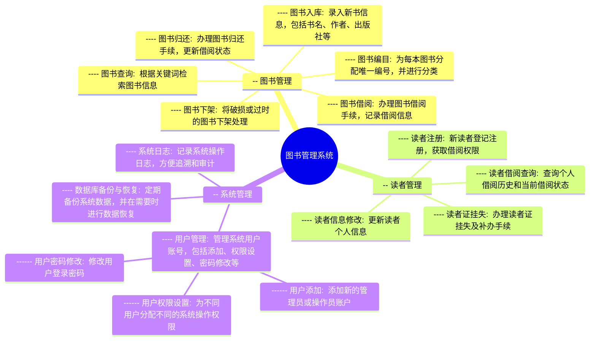

如果有客户提供的图表，文档也可以反向解析：例如（随便在网上找的……）

```sh
解析一下该图片
```

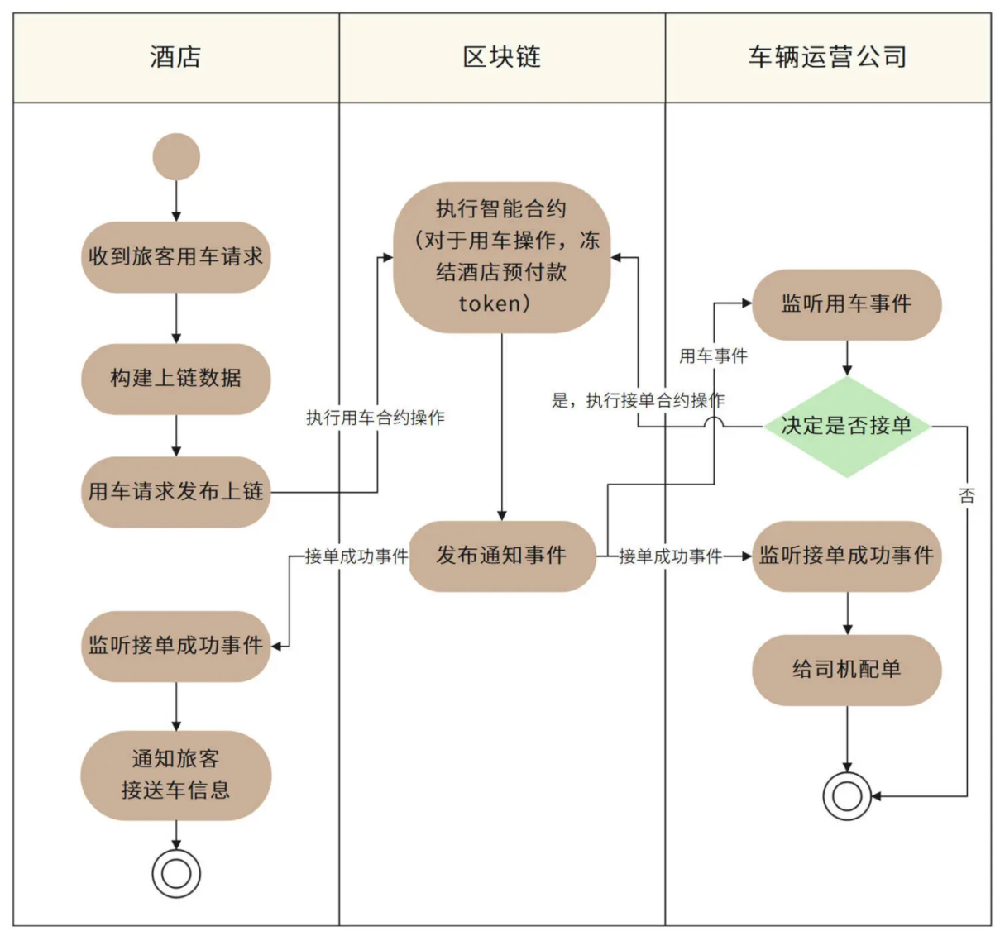

```markdown
这张图片展示的是酒店、区块链和车辆运营公司之间，利用区块链技术实现酒店叫车的流程图。

**流程说明：**

1. **酒店端:**
   - 接收顾客叫车需求。
   - 将订单信息上链，即记录到区块链上。
   - 用车请求发布上链，公开征集车辆运营公司接单。
   - 监听接单成功事件，等待车辆运营公司接单。
   - 通知旅客接车信息，将接单车辆信息告知顾客。

2. **区块链:**
   - 执行智能合约，验证用车事件，冻结酒店预付款（token）。
   - 发布通知到车辆运营公司，告知有新的用车请求。
   - 接收车辆运营公司的接单成功事件。
   - 将接单成功事件传递给酒店。

3. **车辆运营公司:**
   - 监听用车事件，接收来自区块链的用车请求信息。
   - 决定是否接单。
   - 如果接单，则监听接单成功事件，确认接单成功。
   - 公司司机配单，指派司机接送顾客。

**流程特点：**

* **去中心化:** 区块链作为中介平台，连接酒店和车辆运营公司，无需中心化平台调度。
* **透明可信:** 所有交易信息记录在区块链上，公开透明，不可篡改。
* **安全可靠:** 智能合约自动执行，确保交易安全可靠。
* **提高效率:** 自动化流程，减少人工干预，提高叫车效率。

**总结:**

这张流程图展示了区块链技术在酒店叫车场景中的应用，通过去中心化、透明可信、安全可靠等特点，优化了传统叫车流程，提高了效率和用户体验。
```

## 用例图

```
使用plantuml绘制用例图
```

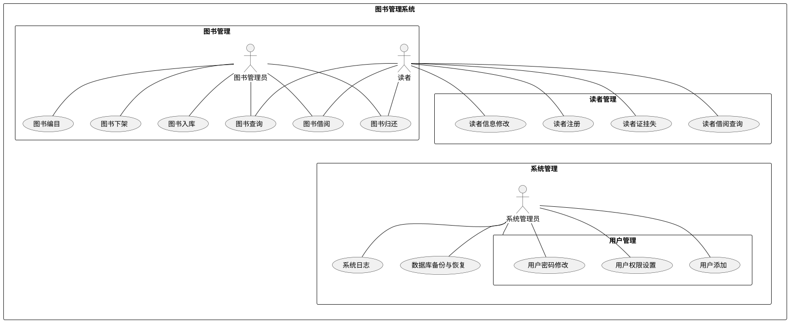

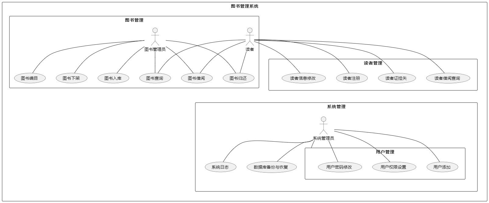

## PRD

```
详细描述图书入库的需求，生成PRD，使用Mermaid绘制时序图
```

### 图书入库需求 PRD

**1.  功能名称：** 图书入库

**2.  功能描述：** 图书管理员通过系统录入新书信息，实现图书的入库管理。

**3.  用户角色：** 图书管理员

**4.  业务流程：**

1.  图书管理员点击“图书入库”功能按钮。
2.  系统显示图书入库界面，包含以下信息录入字段：
    *   图书ISBN/ISSN
    *   图书名称
    *   作者
    *   出版社
    *   出版日期
    *   图书分类
    *   图书价格
    *   图书数量
    *   图书存放位置
    *   图书封面图片（可选）
    *   图书简介（可选）
3.  图书管理员录入图书信息，点击“保存”按钮。
4.  系统校验图书信息，若信息完整且符合规范，则将图书信息保存至数据库，并生成唯一的图书编号；若信息不完整或不符合规范，则提示错误信息。
5.  系统提示图书入库成功，并显示新入库图书的信息。

**5.  界面原型：**  (可根据实际情况设计界面原型图)

**6.  数据需求：**

*   图书表：
    *   图书编号（主键，自动生成）
    *   图书ISBN/ISSN
    *   图书名称
    *   作者
    *   出版社
    *   出版日期
    *   图书分类
    *   图书价格
    *   图书数量
    *   图书存放位置
    *   图书封面图片URL
    *   图书简介

**7.  非功能需求：**

*   系统需对图书信息进行校验，例如图书ISBN/ISSN的格式、图书名称不能为空等。
*   系统需保证图书编号的唯一性。
*   系统需记录图书入库操作日志，包括操作时间、操作人、操作内容等。

**8.  其他说明：**  (可根据实际情况添加其他说明)

### 时序图 (Mermaid)

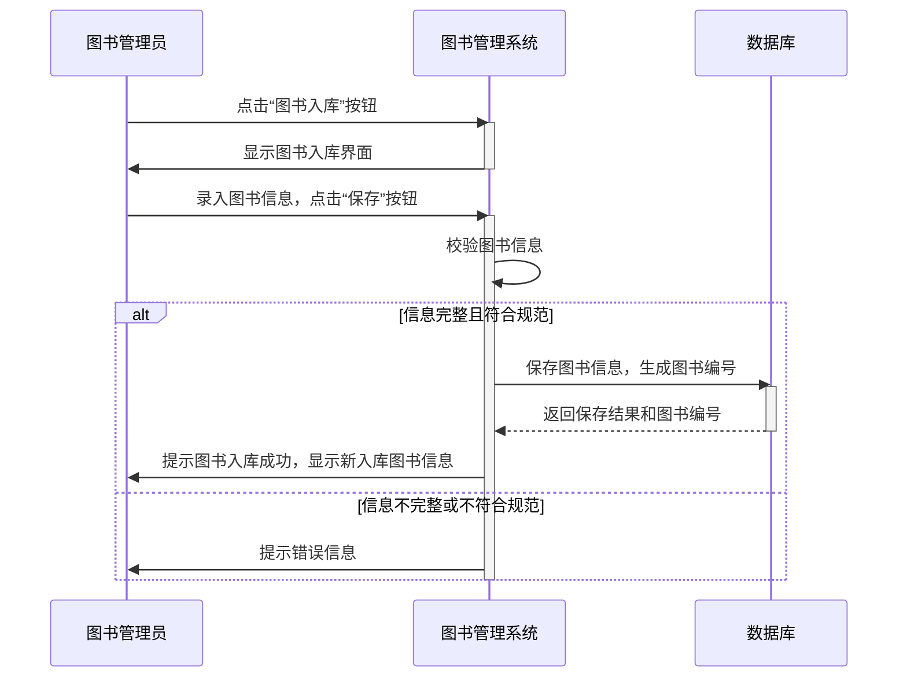

### 界面原型

```
图书入库的界面原型用HTML、JavaScript、CSS和TailwindCSS实现一下，使用Font Awesome图标，确保页面设计美观且响应式，包含必要的HTML结构和样式。
```

```html
<!DOCTYPE html>
<html lang="en">
<head>
    <meta charset="UTF-8">
    <meta name="viewport" content="width=device-width, initial-scale=1.0">
    <title>图书入库</title>
    <link rel="stylesheet" href="https://cdnjs.cloudflare.com/ajax/libs/font-awesome/6.2.0/css/all.min.css">
    <script src="https://cdn.tailwindcss.com"></script>
</head>
<body class="bg-gray-100">

    <div class="container mx-auto px-4 py-8">
        <h1 class="text-3xl font-bold mb-6">图书入库</h1>

        <form class="bg-white rounded-lg shadow-md p-6">
            <div class="grid grid-cols-1 md:grid-cols-2 gap-6">
                <div>
                    <label for="isbn" class="block text-gray-700 font-bold mb-2">ISBN/ISSN:</label>
                    <input type="text" id="isbn" name="isbn" class="w-full px-3 py-2 border rounded-md focus:outline-none focus:ring focus:ring-blue-300">
                </div>
                <div>
                    <label for="title" class="block text-gray-700 font-bold mb-2">图书名称:</label>
                    <input type="text" id="title" name="title" class="w-full px-3 py-2 border rounded-md focus:outline-none focus:ring focus:ring-blue-300" required>
                </div>
                <div>
                    <label for="author" class="block text-gray-700 font-bold mb-2">作者:</label>
                    <input type="text" id="author" name="author" class="w-full px-3 py-2 border rounded-md focus:outline-none focus:ring focus:ring-blue-300" required>
                </div>
                <div>
                    <label for="publisher" class="block text-gray-700 font-bold mb-2">出版社:</label>
                    <input type="text" id="publisher" name="publisher" class="w-full px-3 py-2 border rounded-md focus:outline-none focus:ring focus:ring-blue-300" required>
                </div>
                <div>
                    <label for="publicationDate" class="block text-gray-700 font-bold mb-2">出版日期:</label>
                    <input type="date" id="publicationDate" name="publicationDate" class="w-full px-3 py-2 border rounded-md focus:outline-none focus:ring focus:ring-blue-300" required>
                </div>
                <div>
                    <label for="category" class="block text-gray-700 font-bold mb-2">图书分类:</label>
                    <select id="category" name="category" class="w-full px-3 py-2 border rounded-md focus:outline-none focus:ring focus:ring-blue-300" required>
                        <option value="">请选择分类</option>
                        <option value="文学">文学</option>
                        <option value="科技">科技</option>
                        <option value="历史">历史</option>
                        </select>
                </div>
                <div>
                    <label for="price" class="block text-gray-700 font-bold mb-2">图书价格:</label>
                    <input type="number" id="price" name="price" class="w-full px-3 py-2 border rounded-md focus:outline-none focus:ring focus:ring-blue-300" required>
                </div>
                <div>
                    <label for="quantity" class="block text-gray-700 font-bold mb-2">图书数量:</label>
                    <input type="number" id="quantity" name="quantity" class="w-full px-3 py-2 border rounded-md focus:outline-none focus:ring focus:ring-blue-300" required>
                </div>
                <div>
                    <label for="location" class="block text-gray-700 font-bold mb-2">图书存放位置:</label>
                    <input type="text" id="location" name="location" class="w-full px-3 py-2 border rounded-md focus:outline-none focus:ring focus:ring-blue-300" required>
                </div>
            </div>

            <div class="mt-6">
                <label for="coverImage" class="block text-gray-700 font-bold mb-2">图书封面图片 (可选):</label>
                <input type="file" id="coverImage" name="coverImage" class="w-full">
            </div>

            <div class="mt-6">
                <label for="description" class="block text-gray-700 font-bold mb-2">图书简介 (可选):</label>
                <textarea id="description" name="description" rows="4" class="w-full px-3 py-2 border rounded-md focus:outline-none focus:ring focus:ring-blue-300"></textarea>
            </div>

            <div class="flex justify-end mt-8">
                <button type="reset" class="bg-gray-300 hover:bg-gray-400 text-gray-800 font-bold py-2 px-4 rounded-md mr-2">
                    <i class="fas fa-times mr-2"></i> 重置
                </button>
                <button type="submit" class="bg-blue-500 hover:bg-blue-700 text-white font-bold py-2 px-4 rounded-md">
                    <i class="fas fa-save mr-2"></i> 保存
                </button>
            </div>
        </form>
    </div>

</body>
</html>
```

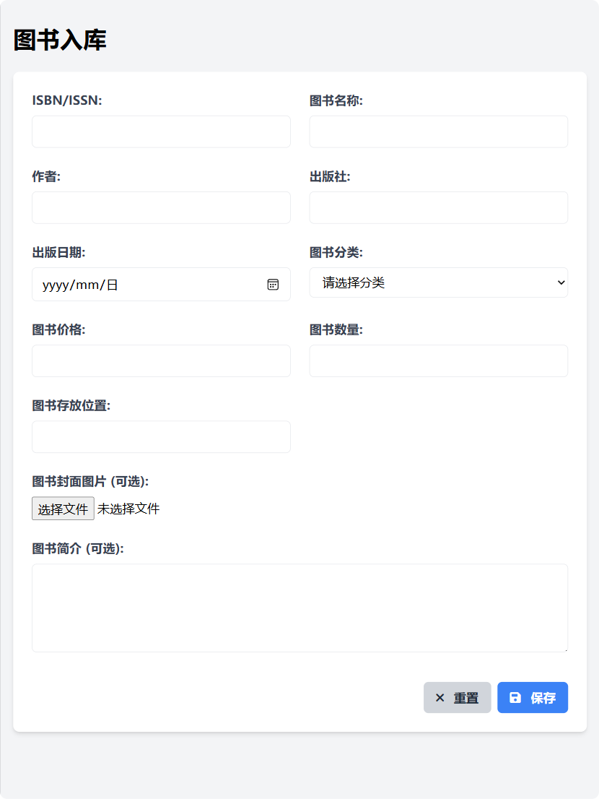

## 系统架构

### 生成系统架构图

```
采用技术：spring boot + vue3前后端分离架构, sqlite数据库存储。请绘制系统架构图
```

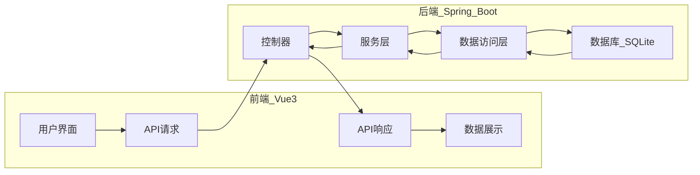

**系统架构图说明:**

*   **前端 (Vue3):** 负责用户界面展示和用户交互，通过 API 与后端进行通信。
*   **后端 (Spring Boot):** 负责处理业务逻辑、数据访问和 API 接口。
*   **数据库 (SQLite):** 存储图书、读者、用户等数据。

**技术选型:**

*   **前端:** Vue3 + JavaScript/TypeScript
*   **后端:** Spring Boot + Java
*   **数据库:** SQLite
*   **API:** RESTful API

**架构特点:**

*   **前后端分离:** 前后端独立开发、部署和维护，提高开发效率和可维护性。
*   **RESTful API:** 使用标准化的 API 接口，方便前后端通信和系统集成。
*   **轻量级数据库:** SQLite 作为轻量级数据库，易于部署和管理，适合小型图书管理系统。

**其他:**

*   可以根据实际需求选择合适的部署方式，例如云服务器、本地服务器等。
*   可以考虑使用缓存、消息队列等技术来提高系统性能和可扩展性。

### 图表美化

大家可能觉得这样的系统架构图太难看，这里有两个办法

#### 使用draw.io进行深度加工

* `菜单`→`➕`→`高级`→`Mermaid`

* 选择这种手绘的样式

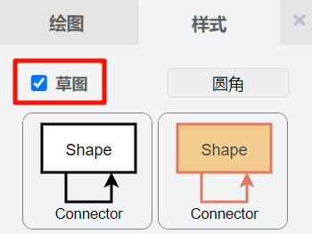

简单加工一下，效果如下：

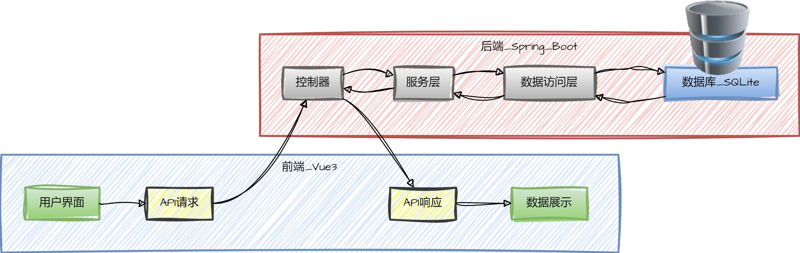

#### Napkin.ai

基于 AI 的可视化叙事工具 [Napkin.ai](https://www.napkin.ai/)，它能将枯燥的文字和数字转化为生动形象的图形和图表，非常适合用于教学和商务演示。

根据你输入的文字，能够生成各种样式的图形

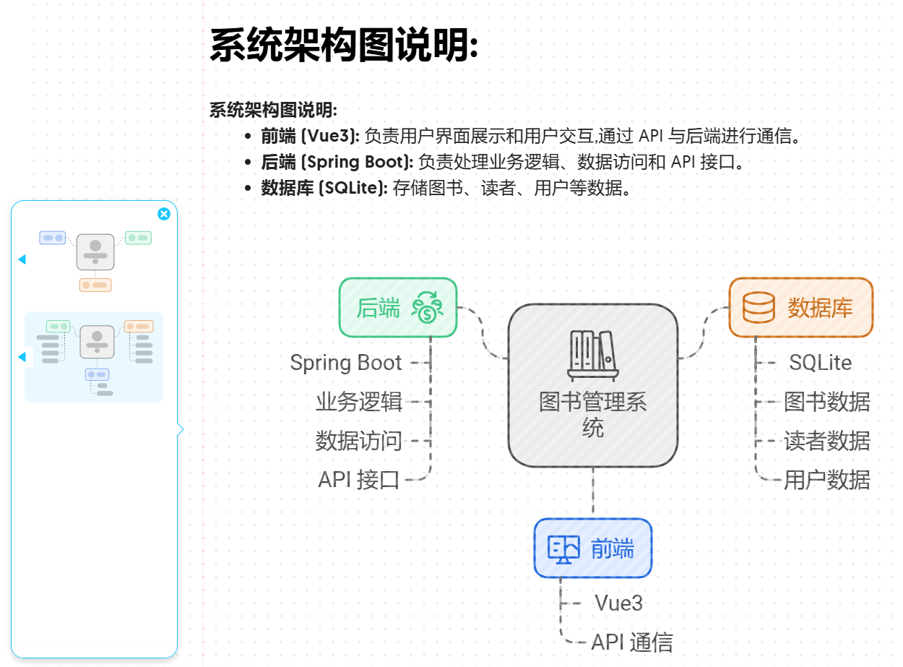

支持导出为各种格式，比如png或者svg

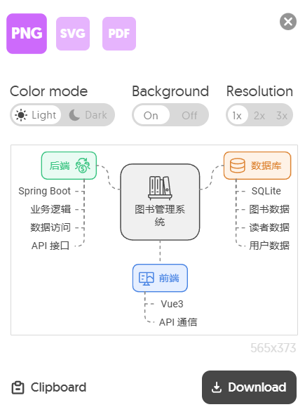

## 数据库设计

```
设计sqlite数据库结构，并使用mermaid绘制er关系图
```

以下是图书管理系统 SQLite 数据库结构设计，包含创建表的 SQL 语句：

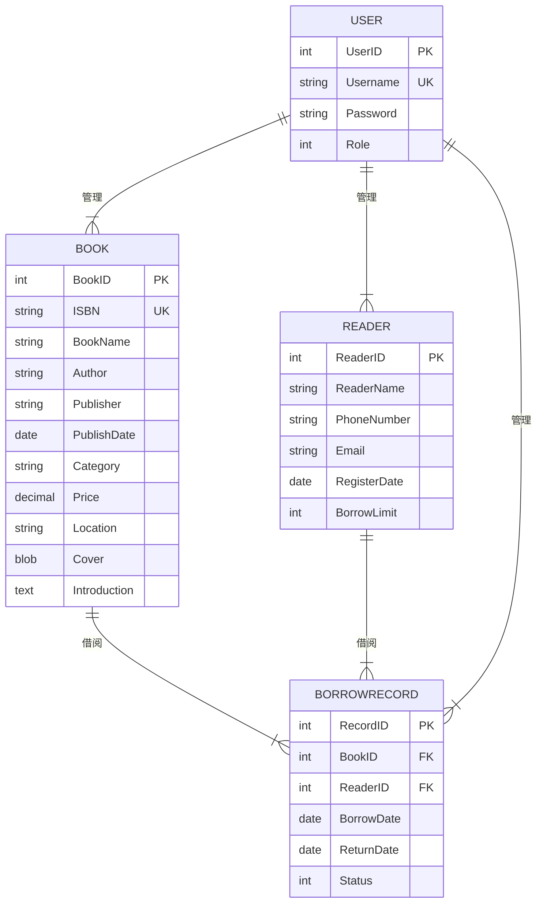

**关系说明：**

- **图书 - 借阅记录 (1:N)：** 一本书可以被多个读者借阅，产生多条借阅记录。
- **读者 - 借阅记录 (1:N)：** 一个读者可以借阅多本书，产生多条借阅记录。
- **用户 - 图书 (1:N)：** 管理员可以管理多本书籍信息。
- **用户 - 读者 (1:N)：** 管理员可以管理多个读者信息。
- **用户 - 借阅记录 (1:N)：** 管理员可以管理多条借阅记录。

```sql
-- 图书表
CREATE TABLE Book (
    BookID INTEGER PRIMARY KEY AUTOINCREMENT, -- 图书ID，主键，自增
    ISBN TEXT UNIQUE NOT NULL, -- ISBN，唯一，非空
    BookName TEXT NOT NULL, -- 书名，非空
    Author TEXT NOT NULL, -- 作者，非空
    Publisher TEXT NOT NULL, -- 出版社，非空
    PublishDate DATE, -- 出版日期
    Category TEXT, -- 图书分类
    Price REAL, -- 价格
    Location TEXT, -- 存放位置
    Cover BLOB, -- 封面图片，二进制数据
    Introduction TEXT -- 内容简介
);

-- 读者表
CREATE TABLE Reader (
    ReaderID INTEGER PRIMARY KEY AUTOINCREMENT, -- 读者ID，主键，自增
    ReaderName TEXT NOT NULL, -- 读者姓名，非空
    PhoneNumber TEXT, -- 联系电话
    Email TEXT, -- 电子邮箱
    RegisterDate DATE DEFAULT (date('now')), -- 注册日期，默认为当前日期
    BorrowLimit INTEGER DEFAULT 3 -- 借阅上限，默认为3本
);

-- 借阅记录表
CREATE TABLE BorrowRecord (
    RecordID INTEGER PRIMARY KEY AUTOINCREMENT, -- 借阅记录ID，主键，自增
    BookID INTEGER NOT NULL, -- 图书ID，外键关联图书表
    ReaderID INTEGER NOT NULL, -- 读者ID，外键关联读者表
    BorrowDate DATE DEFAULT (date('now')), -- 借阅日期，默认为当前日期
    ReturnDate DATE, -- 归还日期
    Status INTEGER DEFAULT 0, -- 借阅状态，0: 未归还，1: 已归还，2: 逾期
    FOREIGN KEY (BookID) REFERENCES Book(BookID),
    FOREIGN KEY (ReaderID) REFERENCES Reader(ReaderID)
);

-- 用户表
CREATE TABLE User (
    UserID INTEGER PRIMARY KEY AUTOINCREMENT, -- 用户ID，主键，自增
    Username TEXT UNIQUE NOT NULL, -- 用户名，唯一，非空
    Password TEXT NOT NULL, -- 密码，非空
    Role INTEGER DEFAULT 0 -- 角色，0: 管理员，1: 普通用户
);
```

**表结构说明：**

**1. 图书表 (Book):**

*   `BookID`: 图书的唯一标识符，主键，自动递增。
*   `ISBN`: 国际标准书号，用于唯一标识一本书，非空且唯一。
*   `BookName`: 书名，非空。
*   `Author`: 作者，非空。
*   `Publisher`: 出版社，非空。
*   `PublishDate`: 出版日期。
*   `Category`: 图书分类，例如：文学、科技、艺术等。
*   `Price`: 图书价格。
*   `Location`: 图书存放位置，例如：图书馆的具体书架号。
*   `Cover`: 图书封面图片，以二进制数据存储。
*   `Introduction`: 图书内容简介。

**2. 读者表 (Reader):**

*   `ReaderID`: 读者的唯一标识符，主键，自动递增。
*   `ReaderName`: 读者姓名，非空。
*   `PhoneNumber`: 读者联系电话。
*   `Email`: 读者电子邮箱地址。
*   `RegisterDate`: 读者注册日期，默认为当前日期。
*   `BorrowLimit`: 读者可借阅图书的最大数量，默认为 3 本。

**3. 借阅记录表 (BorrowRecord):**

*   `RecordID`: 借阅记录的唯一标识符，主键，自动递增。
*   `BookID`: 借阅图书的 ID，外键关联到图书表 (Book)。
*   `ReaderID`: 借阅者的 ID，外键关联到读者表 (Reader)。
*   `BorrowDate`: 借阅日期，默认为当前日期。
*   `ReturnDate`: 归还日期，初始值为 NULL，归还时更新。
*   `Status`: 借阅状态，0 表示未归还，1 表示已归还，2 表示逾期。

**4. 用户表 (User):**

*   `UserID`: 用户的唯一标识符，主键，自动递增。
*   `Username`: 用户名，用于登录系统，非空且唯一。
*   `Password`: 用户密码，非空。
*   `Role`: 用户角色，0 表示管理员，拥有所有权限，1 表示普通用户，权限受限。

**关系：**

*   图书表和读者表之间是多对多关系，通过借阅记录表关联。
*   每条借阅记录关联一本图书和一个读者。

**其他说明：**

*   可以根据实际需求添加或修改字段。
*   可以使用 SQLiteStudio 等工具创建和管理数据库。
*   在应用程序中，可以使用 SQL 语句或 ORM 框架来操作数据库。

## 项目计划

```
本项目共计16天的开发周期，使用mermaid绘制甘特图
```

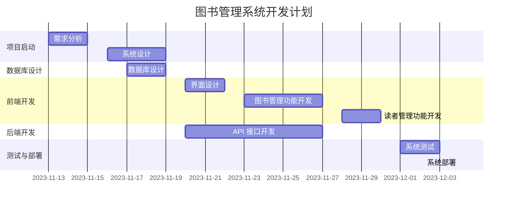

