# AI鸡娃

## 前言

虽然自己小时候接受的是快乐教育，年轻时也对传统教育模式嗤之以鼻，但是年过中年，自己也成为了鸡娃爱好者中的一员，这里就给大家评测一下使用AI来鸡娃的真实体验

首先给出我自己的结论

* **学语文**：能够满足低端的学习要求，比如找错别字、报听写、查找素材、或者帮你写一篇能及格的作文，但是AI是没有灵魂的……
* **学数学**：高速发展中，AI从一题都做不对已经逐步进步到能做对一部分奥数题了，但是对我来说最大的困境是，我不知道他到底是做对了还是做错了，看他的推理都是蛮有道理（虽然它也许在一本正经的胡说八道）
* **学英语**：不用说了，这效果杠杠的。只要你想得到，从初级到特级，各种使用场景都很牛逼。

## 学语文

这是我和小孩联合开发的学习语文工具，给他们语文老师评测过，老师很善良的说很有用，当然我了解她的善意。

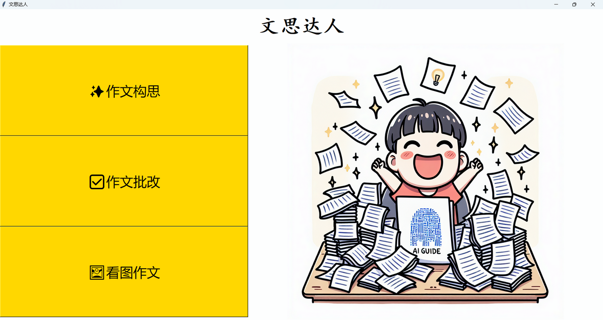

### 作文构思

根据用户输入的参数，生成符合要求的思路或范文供参考。

这个我想大家在小孩写不出作文时应该都尝试用过，应给也对AI的想象力和创造力有所了解，也许偶尔会有你喜欢的思路

### 作文批改

提交作文照片，识别其中的文字并找出错别字和语法错误。

这个其实利用了OCR或者多模态大模型进行识别，实际使用多模态大模型效果会好很多，然后找出错字和病句出来，这个功能说实话还有点用，很低级的错字病句还是能找出来，但是乱改的问题也很严重。

### 看图作文

提交一个事物的图片，理解图片内容并按用户的要求写出小的段落。

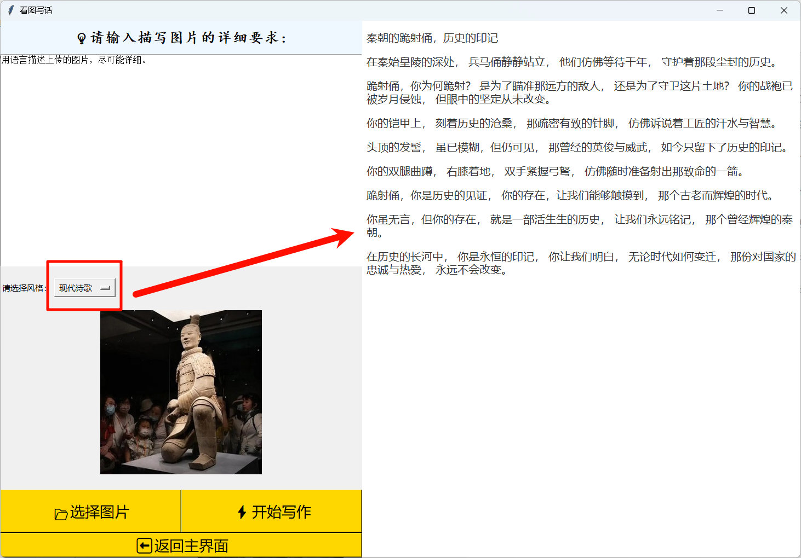

这个利用了多模态大模型的图片理解技术，其实这个功能还是有一点的作用，很多情况下小孩写作文并不是完全没有思路，只不过是对一些场景缺乏描写经验和描写技巧，我个人觉得这个有可能会应用到高端一点的语文学习场景。

## 学数学

这是各家AI巨头群雄逐鹿的场景，OpenAI的o1模型，阿里的qwq，大家都以更高的目标而不断追逐，但是要说实用性来说，可能还是没有作业帮、猿辅导的会员强，但是我还是坚信这些推理模型是更好的未来。我这里用Google的gemini、阿里的qwq、qwen2.5-math来做做实验。

### 奥数题

由于很多数学题是使用的图片PDF，可能我们还需要一个多模态大模型进行辅助

这里我用的是我小孩的奥数题，gemini进行的多模态识别。

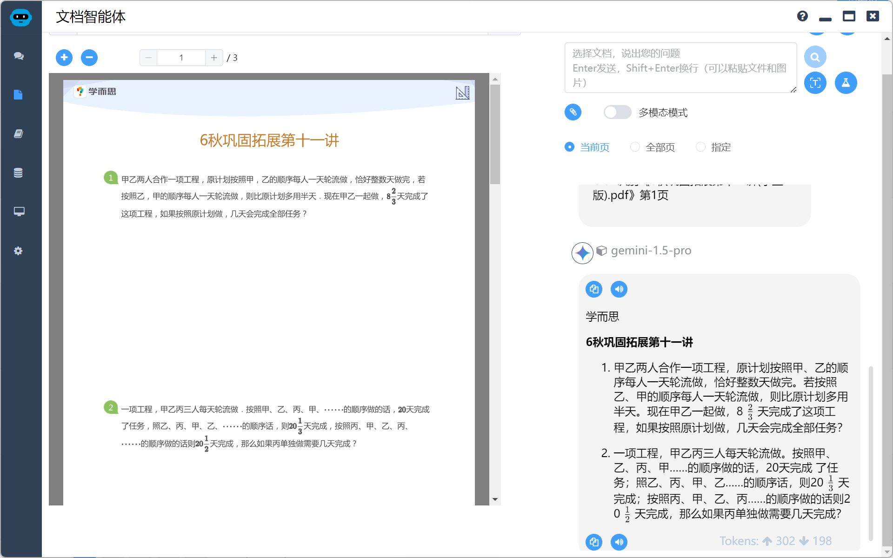

我们来看看第一题，别小看它喔，好多大模型这题都会折戟沉沙

首先是gemini，我的好搭档，写代码能力很强，看看做奥数呢

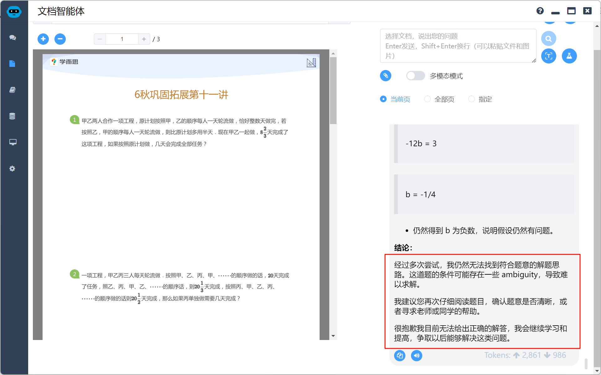

**这题做的gemini跪地求饶**……，这题的答案我在作业帮上查了一下，好像是17，大家有兴趣可以试试看。但是我们还是可以看出大厂的风范，不会就是不会，不会经过严谨的推理给你一个自信满满的错误答案，当然gemini大部分时候也和大家一样……

来看看阿里的qwq，花了半分钟做对了，当然由于大模型的随机性，他也不是每次都能做对。

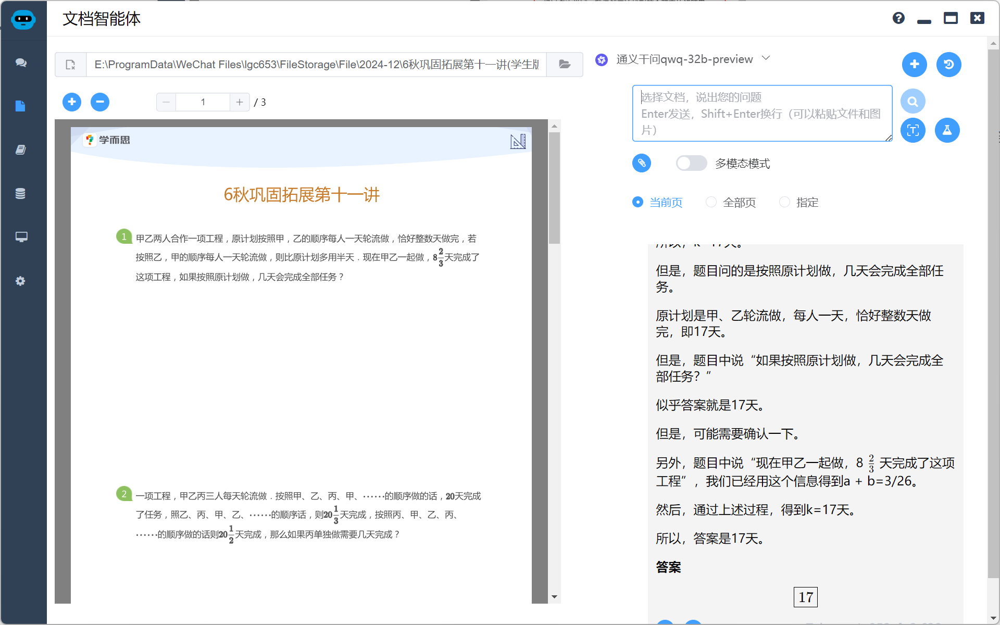

再来看看qwen2.5-math，公式推演画面更漂亮，但是可惜没有做对

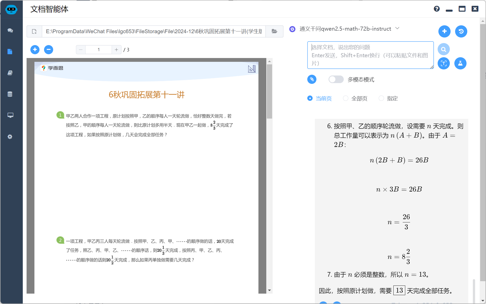

那么怎么判断AI做对没有呢？如果大家数学还不错可以根据AI的推理自行判断

如果您和我一样，看所有推理都是正确的，那么可以用作业帮或者猿辅导看看答案是否匹配，这样可以省一个看视频辅导的会员收费项目。如果您不差钱……，那就随意了。

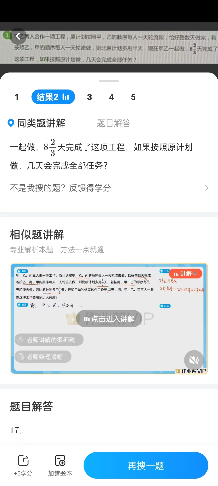

### 日常刷题

除了要学这些拔尖题，日常训练也少不了，根据课本资料要AI出点基本功的训练题不在话下，来看看效果如何，通过多模态技术，我们可以让AI自动理解知识点，出题并批改。

如下图，理解知识点

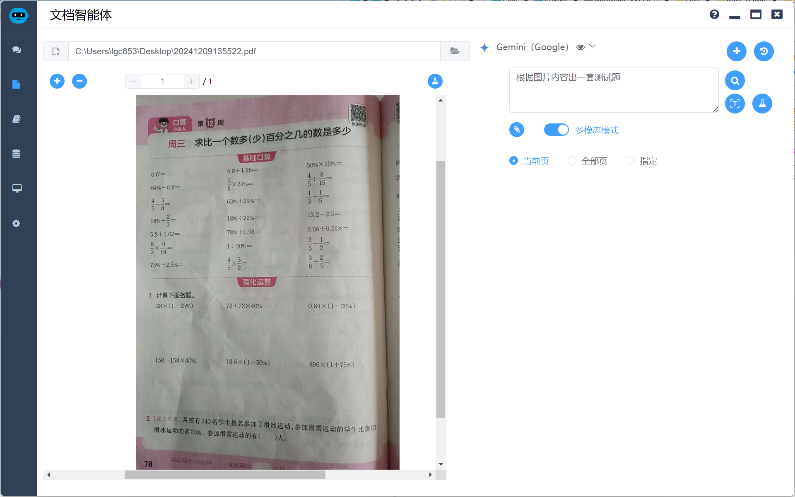

如下图，根据知识点自动出题，当然你可以指定题目类型和题数

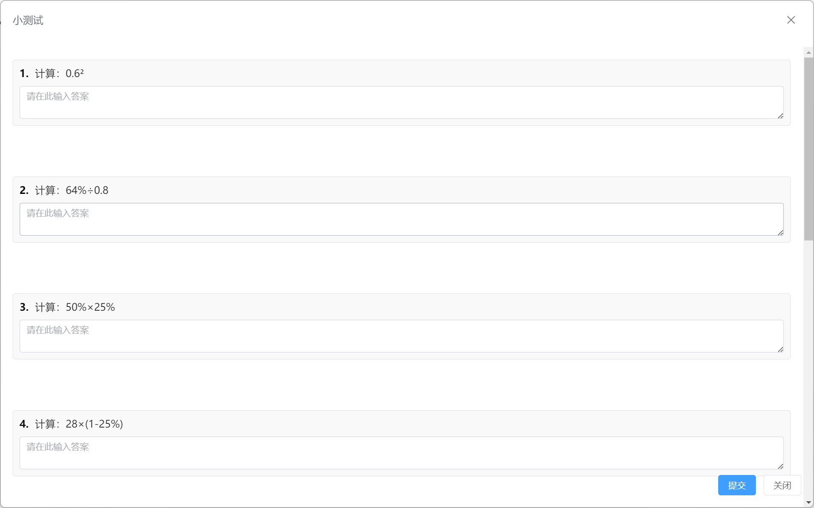

看看我的口算水平怎么样，居然只得了50分，被小孩嘲笑了……

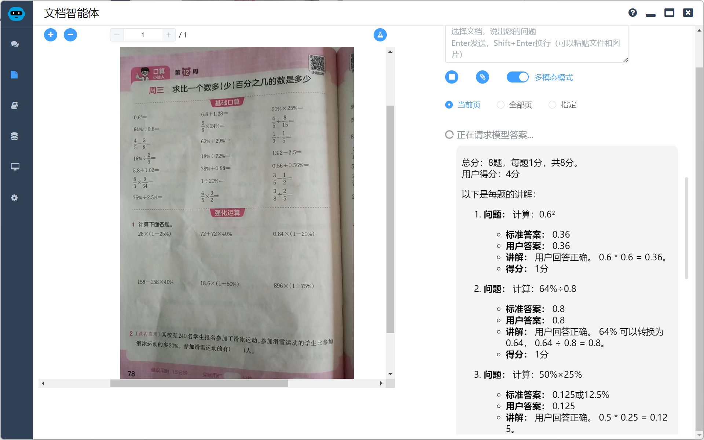

## 学英语

学英语其实没有啥诀窍，无外乎多读、多听、多背，记得我当初为了学英语，把知名游戏《文明2》的英文版玩了个滚瓜烂熟，经常一屁股坐下去就是一整天，我可真是刻苦啊。

用AI学英语大家估计也知道，听说读写样样精通，只有你想不到，没有它做不到，至于刷题，参考上面的数学刷题思路，我就不复述了。我们来看看以下的应用。

### 阅读理解

根据小孩下周的重点词汇，生成一篇阅读理解

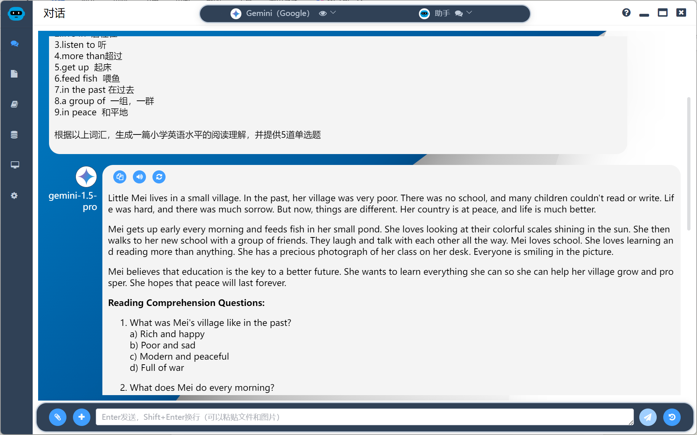

光读不行，再来练练听力，把刚才的阅读理解使用AI的语音合成功能，生成音频

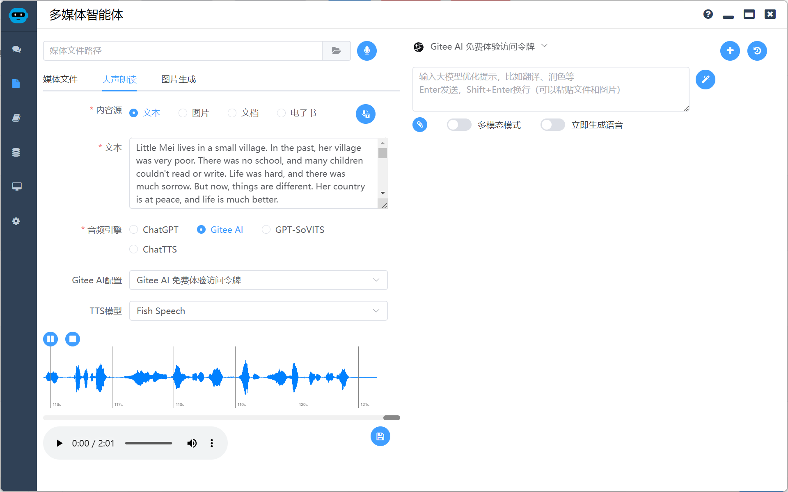

### 拓展阅读

拓展阅读也非常重要，使用AI的语音识别技术可以大大提升阅读量。这里可以先盲听，然后通过ASR技术语音识别后生成字幕进行比对。

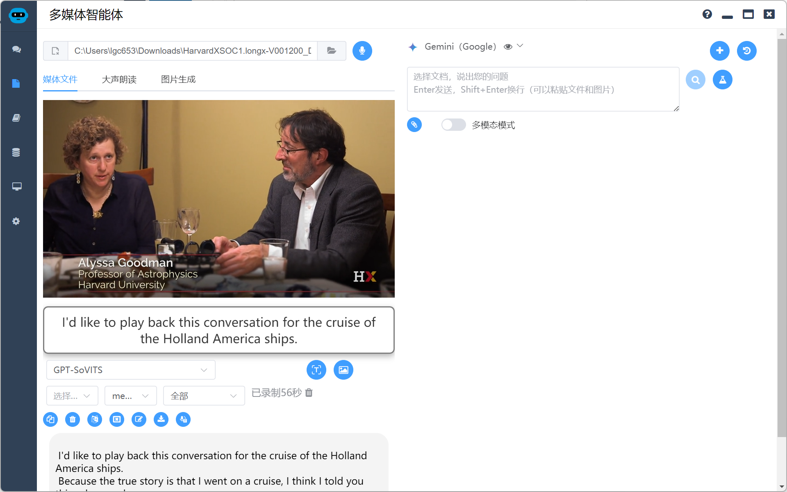

还可以通过AI生成测试题，实时考察一下是不是真的听懂了。我这里在题词里面要求生成5道单选题

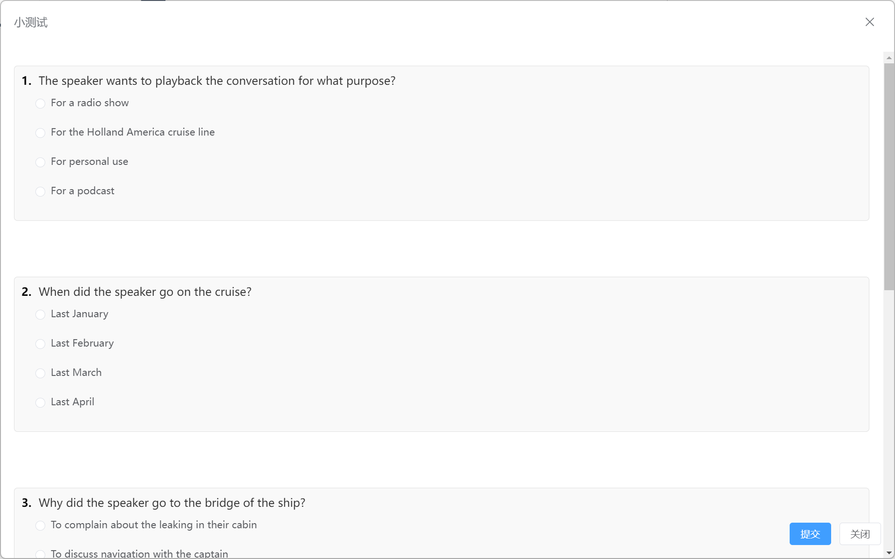

太惭愧了，只做对了一题，还是把机会留给我小孩吧，转身发现他已经溜了.

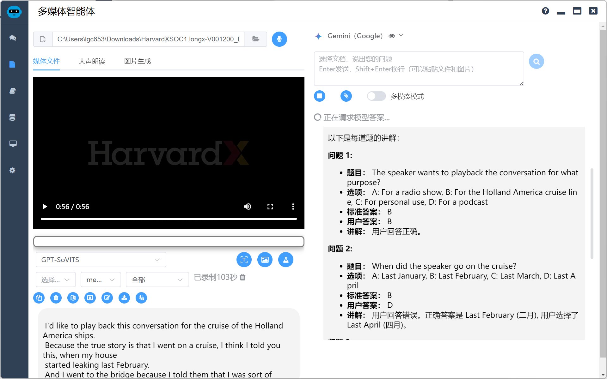

### 说英语

说英语我想是大家的老大难问题，现在市面上有很多AI对话APP，做的都很不错，我们来看看简单版本，这里采用了麦克风录音，然后把音频流提供给AI使用ASR技术语音识别，看看AI能不能听懂我说什么？

先让AI生成一篇自我介绍。

```
Hi everyone! My name is Alex. I'm seven years old. I like blue, and my favorite animal is a dolphin. In school, I like to read. I'm excited to be here and learn with all of you!
```

不好意思，dolphin忘记怎么读了，AI你真坏，喜欢个猫和狗不行吗？

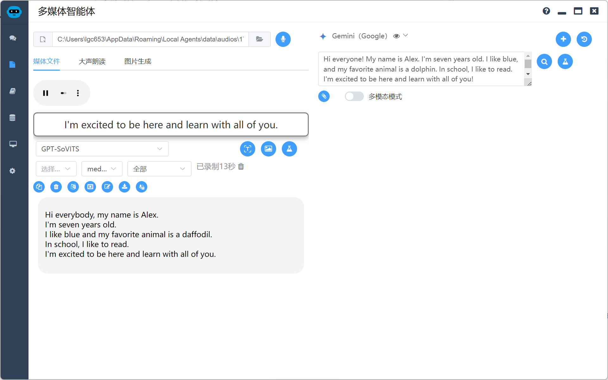

## 总结

总结了怎么多花式鸡娃的办法，其实心里还是希望小孩没有那么累，希望未来AI的发展能够给他们更加光明的前程和快乐的生活。