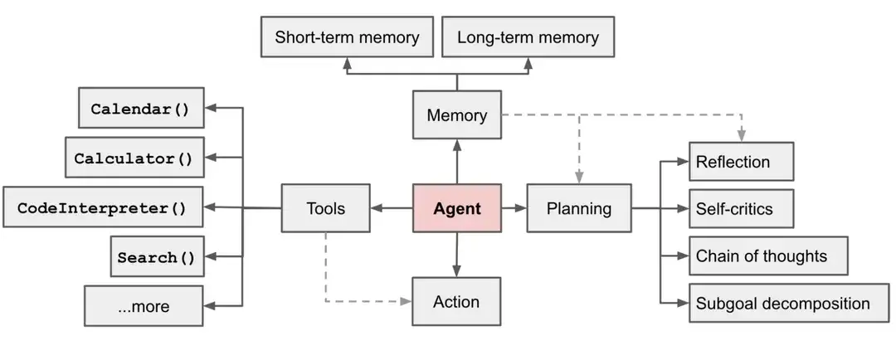
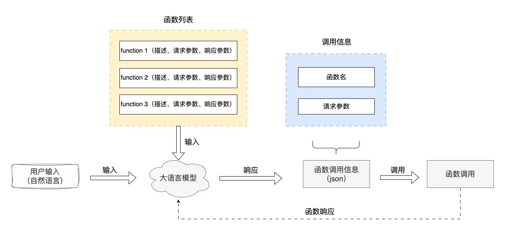
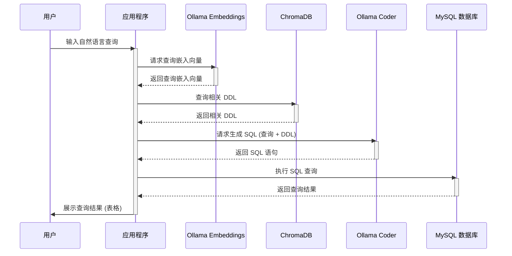

# Agent

## 大语言模型 vs 人类

大语言模型很强大，就像人类的大脑一样拥有思考的能力。如果人类只有大脑，没有四肢，没有工具，是没办法与世界互动的。如果我们能给大模型配备上四肢和工具呢？大模型是不是就会打破次元壁，从数字世界走向现实世界，与现实世界实现梦幻联动呢？

LLM 可以接受输入，可以分析&推理、可以输出文字\代码\媒体。然而，其无法像人类一样，拥有**规划**思考能力、运用各种**工具**与物理世界互动，以及拥有人类的**记忆**能力。

- **LLM**：接受输入、思考、输出
- **人类**：**LLM**（接受输入、思考、输出）+ **记忆** + **工具** + **规划**

如果我们给 LLM 配备上：与物理世界互动的工具、记忆能力、规划思考能力。LLM 是否就可以像人类一样，能够自主思考并规划完成任务的过程，能检索记忆，能使用各种工具提高效率，最终完成某个任务。

## 智能体是什么

智能体的英文是 Agent，AI 业界对智能体提出了各种定义。个人理解，智能体是一种通用问题解决器。从软件工程的角度看来，智能体是一种基于大语言模型的，具备规划思考能力、记忆能力、使用工具函数的能力，能自主完成给定任务的计算机程序。



在基于 LLM 的智能体中，LLM 的充当着智能体的“大脑”的角色，同时还有 3 个关键部分：

- **规划（Planning）** : 智能体会把大型任务**分解为子任务**，并规划执行任务的流程；智能体会对任务执行的过程进行**思考和反思**，从而决定是继续执行任务，或判断任务完结并终止运行。
- **记忆（Memory）**: 短期记忆，是指在执行任务的过程中的上下文，会在子任务的执行过程产生和暂存，在任务完结后被清空。长期记忆是长时间保留的信息，一般是指外部知识库，通常用向量数据库来存储和检索。
- **工具使用（Tool use）** 为智能体配备工具 API，比如：计算器、搜索工具、代码执行器、数据库查询工具等。有了这些工具 API，智能体就可以是物理世界交互，解决实际的问题。

### 规划（Planing）

规划，可以为理解观察和思考。如果用人类来类比，当我们接到一个任务，我们的思维模式可能会像下面这样:

- 我们首先会思考怎么完成这个任务。
- 然后我们会审视手头上所拥有的工具，以及如何使用这些工具高效地达成目的。
- 我们会把任务拆分成子任务（就像我们会使用 TAPD 做任务拆分）。
- 在执行任务的时候，我们会对执行过程进行反思和完善，吸取教训以完善未来的步骤
- 执行过程中思考任务何时可以终止

这是人类的**规划**能力，我们希望智能体也拥有这样的思维模式，因此可以通过 LLM 提示工程，为智能体赋予这样的思维模式。在智能体中，最重要的是让 LLM 具备这以下两个能力：

* **子任务分解**：通过 LLM 使得智能体可以把大型任务分解为更小的、更可控的子任务，从而能够有效完成复杂的任务。

* **反思和完善**：智能体在执行任务过程中，通过 LLM 对完成的子任务进行反思，从错误中吸取教训，并完善未来的步骤，提高任务完成的质量。同时反思任务是否已经完成，并终止任务。

### 记忆（Memory）

记忆是什么？当我们在思考这个问题，其实人类的大脑已经在使用记忆。记忆是大脑存储、保留和回忆信息的能力。记忆可以分为不同的类型：

1. 短期记忆（或工作记忆）：这是一种持续时间较短的记忆，能够暂时存储和处理有限数量的信息。例如，记住一个电话号码直到拨打完毕。
2. 长期记忆：这是一种持续时间较长的记忆，可以存储大量信息，从几分钟到一生。长期记忆可以进一步分为显性记忆和隐性记忆。显性记忆，可以有意识地回忆和表达的信息，显性记忆又可以分为情景记忆（个人经历的具体事件）和[语义记忆](https://zhida.zhihu.com/search?content_id=243176245&content_type=Article&match_order=1&q=语义记忆&zhida_source=entity)（一般知识和概念）。隐性记忆，这种记忆通常是无意识的，涉及技能和习惯，如骑自行车或打字。

仿照人类的记忆机制，**智能体实现了两种记忆机制**:

- **短期记忆**：在当前任务执行过程中所产生的信息，比如某个工具或某个子任务执行的结果，会写入短期记忆中。记忆在当前任务过程中产生和暂存，在任务完结后被清空。
- **长期记忆**：长期记忆是长时间保留的信息。一般是指外部知识库，通常用向量数据库来存储和检索。

### 工具使用（Tool use）

LLM 是数字世界中的程序，想要与现实世界互动、获取未知的知识，或是计算某个复杂的公式等，都离不开不工具。所以我们需要为智能体配备各种工具以及赋予它使用工具的能力。

工具是什么？它可以是锤子、螺丝刀，也可以是函数（function）、软件开发工具包（sdk）。工具是人类智慧的具象化，扩展我们的能力，提升工作效率。在智能体中，工具就是函数（Function），工具使用就是调用函数（Call Function）。

在 LLM 中实现函数调用，使用到 LLM 的这个能力:

#### Function Calling

Function Calling 是**一种实现大型语言模型连接外部工具的机制**。通过 API 调用 LLM 时，调用方可以描述函数，包括函数的功能描述、请求参数说明、响应参数说明，让 LLM 根据用户的输入，合适地选择调用哪个函数，同时理解用户的自然语言，并转换为调用函数的请求参数（通过 JSON 格式返回）。调用方使用 LLM 返回的函数名称和参数，调用函数并得到响应。最后，如果需求，把函数的响应传给 LLM，让 LLM 组织成自然语言回复用户。



## 使用自然语言进行图片物体检测

### 项目概述

一般检测图片上的物体我们会选用OpenCV、YOLO之类解决方案，但是他们都需要在本机安装很多东西，这里讲解如何使用AI API检测图片上的物体，这样基本可以0配置就实现该功能。另外，利用了大模型的特性，我们可以追加自然语言对识别结果进行限定。

Google Geimini 1.5 Pro多模态功能，不仅能检测图片上的物体，还能输出物体的边框坐标，这样理论上来说你可以在输入的图片上画上框和标注目标内容，很实用的功能。

注意提示词里面要限制输出的格式是JSON这样的方便解析的格式，例如：

```
检测图片上的物体，将边界框作为 JSON 数组返回，数组的名称为对象名称及其边界框 [ymin, xmin, ymax, xmax]。例如 'name_1': [ymin, xmin, ymax, xmax]，只返回JSON格式，一定不要使用Markdown格式
```

可以直接调用Google Geimini 1.5 Pro的API实现，输入如上的题词，会得到这样的结果，然后自己在图片上画框即可

```json
{'tiger': [0.12, 50, 0.88, 783], 'man': [170, 675, 825, 894]}
```


> 有网友已经做了开源项目：[AlexZhangji/bonding_w_geimini: experiments with different llms (github.com)](https://github.com/AlexZhangji/bonding_w_geimini)，上传图片就可以显示检测结果，但是需要自备 Gemini 的 Api Key。
>
> 本文只是对该项目做了简化，以及题词的优化。

### Agent分析

> 项目不算是一个完整的 Agent，但它包含了构建一个 Agent 的一些关键要素。Agent 通常被定义为能够感知环境、做出决策并采取行动以实现特定目标的实体。它具有自主性、目标导向性和适应性等特点。
>
> 这段代码可以被视为一个感知-行动循环的简单实现：
>
> * **感知**: 通过 Google Gemini API 对图像进行物体检测，获取边界框信息，相当于智能体对环境的感知。
> * **信息处理**: 代码将 Google Gemini API 返回的文本信息解析为边界框坐标，相当于智能体对信息的处理。
> * **决策**: 代码没有明确的决策过程，只是简单地将所有检测到的物体都绘制出来。
> * **行动**: 在图像上绘制边界框，相当于智能体对环境做出的行动。

### 代码实现

* 自备 Gemini 的 Api Key。
* 网络要能访问 Gemini 

这里我们可以对检测物体追加自然语言的要求，比如：**`“仅识别图中的大型车辆”`**


代码运行后可以看到大模型准确的识别了我们的意图

如果没有追加限定条件会返回

```json
{'car_1': [573, 64, 791, 253], 'car_2': [605, 233, 722, 322], 'car_3': [622, 307, 696, 368], 'truck_1': [506, 368, 714, 554], 'truck_2': [523, 453, 728, 567], 'car_4': [622, 351, 685, 401]}
```

追加限定条件**`“仅识别图中的大型车辆”`**会返回

```json
{'Truck_1': [515, 371, 732, 467], 'Truck_2': [531, 460, 725, 566]}
```


安装依赖

```sh
pip install Pillow google-generativeai
```

配置文件`config/gemini.config.json`

```json
{
    "api_key": ""
}
```

源代码

```python
import json
from PIL import Image, ImageDraw, ImageFont
import google.generativeai as genai
import random
import os
from google.api_core.exceptions import GoogleAPIError


def resize_image(image, max_size=800):
    """
    调整图像大小，保持纵横比。如果任何一个维度超过 max_size，则将其缩小。
    """
    width, height = image.size
    if width > height:
        if width > max_size:
            height = int((height * max_size) / width)
            width = max_size
    else:
        if height > max_size:
            width = int((width * max_size) / height)
            height = max_size
    return image.resize((width, height))


def generate_random_color():
    """
    生成十六进制格式的随机颜色。
    """
    return "#{:06x}".format(random.randint(0, 0xFFFFFF))


def get_font(size=20):
    """
    获取用于绘制文本的字体对象。尝试加载 NotoSansCJK-Regular.ttc。
    如果不可用，则回退到默认字体。
    """
    font_files = ["NotoSansCJK-Regular.ttc"]

    for font_file in font_files:
        if os.path.exists(font_file):
            try:
                return ImageFont.truetype(font_file, size)
            except IOError:
                continue

    return ImageFont.load_default()


def draw_text_with_outline(draw, text, position, font, text_color, outline_color):
    """
    在图像上绘制带有轮廓的文本。
    """
    x, y = position
    # 绘制轮廓
    draw.text((x - 1, y - 1), text, font=font, fill=outline_color)
    draw.text((x + 1, y - 1), text, font=font, fill=outline_color)
    draw.text((x - 1, y + 1), text, font=font, fill=outline_color)
    draw.text((x + 1, y + 1), text, font=font, fill=outline_color)
    # 绘制文本
    draw.text(position, text, font=font, fill=text_color)


def draw_bounding_boxes(image, bboxes):
    """
    使用 bboxes 字典中提供的坐标在图像上绘制边界框。
    """
    draw = ImageDraw.Draw(image)
    width, height = image.size

    font = get_font(20)

    for label, bbox in bboxes.items():
        color = generate_random_color()
        ymin, xmin, ymax, xmax = [
            coord / 1000 * dim
            for coord, dim in zip(bbox, [height, width, height, width])
        ]

        draw.rectangle([xmin, ymin, xmax, ymax], outline=color, width=3)

        # 计算标签所需的区域并添加填充
        label_bbox = font.getbbox(label)
        label_width = label_bbox[2] - label_bbox[0] + 10  # 添加填充
        label_height = label_bbox[3] - label_bbox[1] + 10  # 添加填充

        if xmax - xmin < label_width:
            xmax = xmin + label_width
        if ymax - ymin < label_height:
            ymax = ymin + label_height

        draw.rectangle(
            [xmin, ymin, xmin + label_width, ymin + label_height], fill=color
        )
        draw_text_with_outline(
            draw,
            label,
            (xmin + 5, ymin + 5),
            font,
            text_color="white",
            outline_color="black",
        )  # 为白色文本添加黑色轮廓
    return image


def extract_bounding_boxes(text):
    """
    从给定的文本中提取边界框，该文本应为 JSON 格式。
    """
    try:
        bboxes = json.loads(text)
        return bboxes
    except json.JSONDecodeError:
        import re

        pattern = r'"([^"]+)":\s*\[(\d+),\s*(\d+),\s*(\d+),\s*(\d+)\]'
        matches = re.findall(pattern, text)
        return {label: list(map(int, coords)) for label, *coords in matches}


def main():
    api_key = ""
    with open("./config/gemini.config.json", "r") as f:
        config = json.load(f)
        api_key = config.get("api_key")
    # 定义发送给 Google Gemini 的提示，要求其检测图像中的物体并以 JSON 格式返回边界框。
    prompt = "检测图片上的物体，将边界框作为 JSON 数组返回，数组的名称为对象名称及其边界框 [ymin, xmin, ymax, xmax]。例如 'name_1': [ymin, xmin, ymax, xmax]，只返回JSON格式，一定不要使用Markdown格式。"
    # 追加自然语言要求
    prompt += "\n仅识别图中的大型车辆"

    # 打开要进行物体检测的图像。
    original_image = Image.open("./data/物体检测2.jpg")

    # 调整图像大小以加快处理速度。
    resized_image = resize_image(original_image)
    # 配置 Google Gemini API 密钥。
    genai.configure(api_key=api_key)
    # 选择要使用的 Google Gemini 模型。
    model = genai.GenerativeModel("gemini-1.5-pro-exp-0827")

    try:
        # 将提示和调整大小后的图像发送到 Google Gemini API。
        response = model.generate_content([prompt, resized_image])
    except GoogleAPIError:
        return

    # 从 Google Gemini API 的响应中提取边界框。
    bboxes = extract_bounding_boxes(response.text)
    print(bboxes)
    # 如果检测到任何边界框，则在图像上绘制它们并显示图像。
    if bboxes:
        image_with_boxes = draw_bounding_boxes(resized_image.copy(), bboxes)
        image_with_boxes.show()


if __name__ == "__main__":
    main()

```

## 使用AI评估GIT项目

### 项目概述

这段代码的核心功能就是利用 AI (ChatGPT) 来分析处理非结构化的 Git Log 信息。

具体来说，它做了以下几件事：

1. **提取 Git Log：**  通过 `git log` 命令获取项目的提交历史记录，包括提交者、提交时间、提交信息等。
2. **调用 ChatGPT API：** 将提取的 Git Log 发送给 ChatGPT API，并要求它完成以下任务：
   * **分析贡献：**  根据提交历史，判断每个贡献者在项目中扮演的角色和贡献程度。
   * **评选 MVP：**  根据贡献分析，评选出最有价值的贡献者 (MVP)，并给出选择理由。
3. **格式化输出：**  将 ChatGPT 返回的分析结果解析成结构化的 JSON 格式，方便后续使用和展示。

总而言之，这段代码巧妙地利用了 AI 的自然语言处理能力，将原本难以处理的非结构化 Git Log 信息转化为可理解、可分析的结构化数据，为项目管理和决策提供了 valuable insights. 

### Agent分析

> 这是一个简单的 Agent，但它是一个基于规则的 Agent，而不是一个完全自主的智能体。

这段代码在一定程度上应用了 Planning、Memory 和 Tool use，但都比较初级，可以看作是智能体雏形的体现。

#### Planning (规划)

* **子任务分解:** 代码将评估 Git 项目的任务分解成多个子任务，例如克隆/更新仓库、获取仓库信息、调用 ChatGPT API、格式化输出等。每个子任务都有明确的目标和执行步骤。
* **执行顺序:** 代码按照预先定义的顺序执行子任务，例如先克隆仓库，再获取信息，最后调用 API。
* **终止条件:** 代码在完成所有子任务后终止，或者在遇到错误时提前终止。

#### Memory (记忆)

* **存储信息:** 代码将 Git 仓库的信息（例如提交历史、README 内容）存储在内存中，方便后续使用。
* **读取信息:** 代码在需要时读取存储的信息，例如在调用 ChatGPT API 时，会读取 README 内容作为输入。

#### Tool Use (工具使用)

* **调用外部工具:** 代码调用了 `git` 命令和 ChatGPT API，利用外部工具完成特定任务，比如当项目近期更新会发送邮件通知管理员。
* **数据交互:** 代码与外部工具进行数据交互，例如将 Git Log 信息发送给 ChatGPT API，接收 API 返回的结果。

### 代码实现

> **为何JSON输出如此重要？**对于程序员来说，结构化数据的准确输出具有不可或缺的重要性。与人类自然语言交流不同，计算机与计算机之间的通讯需要标准化的格式来保证信息的完整与可读性。JSON（Java Object Notation）作为一种轻量级的数据交换格式，以其简单明了的结构广泛应用于API和客户端-服务器通讯中。

> OpenAI重磅更新：GPT-4o实现100%准确的JSON输出 —— 由于本文的方法也能稳定输出JSON，故此使用该解决方案实现。
>
> [Introducing Structured Outputs in the API | OpenAI](https://openai.com/index/introducing-structured-outputs-in-the-api/) 

```sh
📝 仓库 https://xxx.com/*******/******* 开始评估
仓库 ta******* 已更新
 ✅ 克隆或更新成功
 ✅ 信息获取成功
    📅 最新更新时间: 2024-07-03 11:42:13 +08:00
    📝 更新内容: Merge branch 'main' of https://xxx.com/*******/*******  
    👤 bj******* 提交次数: 14
    👤 Zh******* 提交次数: 20
    👤 ic******* 提交次数: 3
    👤 yw******* 提交次数: 2
    👤 Ca******* 提交次数: 5
    👥 提交总数: 44
    --------------------
    用户名: bj*******
    用户角色: 项目发起人，负责项目的整体规划和管理，提交了大量关于游戏特色、市场调研、文档更新等方面的内容。
    理由: 虽然提交次数较多，但主要集中在文档更新和游戏特色调整，对项目整体推动 贡献较大的是其他成员。
    --------------------
    --------------------
    用户名: Zh*******
    用户角色: 项目经理，负责项目任务分配、需求分析、文档更新等工作，提交次数较多且涵盖了项目的多个关键方面。
    是否为 MVP: 🏆
    理由: Zh*******在项目中承担了项目经理的重要角色，提交次数多且涵盖了项目的多个关键方面，对项目的推动起到了关键作用。
    --------------------
    --------------------
    用户名: ic*******
    用户角色: 团队成员，提交次数较少，贡献主要集中在文档合并方面。
    理由: 贡献较少，主要集中在文档合并，对项目整体推动影响有限。
    --------------------
    --------------------
    用户名: yw*******
    用户角色: 团队成员，提交次数较少，主要贡献是创建个人信息文档和部分文档更新 。
    理由: 贡献较少，提交次数较少，对项目整体推动影响有限。
    --------------------
    --------------------
    用户名: Ca*******
    用户角色: 团队成员，提交次数较少，贡献主要集中在文档更新方面。
    理由: 贡献较少，提交次数较少，对项目整体推动影响有限。
    --------------------
 ✅ 总结和评估成功
    📒 仓库总结: 该 README.md 文件详细介绍了一个名为 ta******* 的游戏项目，包括游戏简介、菜单页面设计、方块类型、道具汇总、玩家行为、游戏对象测试、不同类型的 坦克、关卡模式、商店设计、游戏总体体验和开发流程等内容。其中涵盖了游戏的各个方 面，包括玩法、角色、道具、关卡设计等。同时给出了开发流程和小组成员信息。整体内容比较详细，但有些部分需要进一步补充细节。
    ⭐ 仓库评分: 7
```

配置文件

```json
{
  "chatgpt": {
    "domain": "",
    "apiKey": ""
  },
  "email": {
    "host": "smtp.163.com",
    "port": 465,
    "secure": true,
    "user": "",
    "pass": "",
    "from": "",
    "test": ""
  }
}
```

源代码

```python
import os
import json
import subprocess
import re
import requests
from datetime import datetime, timedelta
import smtplib
from email.mime.text import MIMEText

# --- 配置 ---
# --- 读取配置文件 ---
config_path = os.path.join(os.path.dirname(__file__), "env.json")
with open(config_path, "r", encoding="utf-8") as f:
    config = json.load(f)

chatgpt_config = config["chatgpt"]
mail_config = config["email"]

# --- 函数定义 ---


def get_repo_urls():
    """读取 README.md 文件并提取 GitHub/Gitee 仓库地址"""
    with open("README.md", "r", encoding="utf-8") as f:
        readme_content = f.read()

    repo_urls = re.findall(
        r"(https://(?:gitee\.com|github\.com)/[^)\s]+)", readme_content
    )
    return repo_urls


def clone_or_update_repo(repo_url):
    """克隆或更新仓库"""
    repo_name = repo_url.split("/")[-1].replace(".git", "")
    repo_path = os.path.join(os.path.dirname(__file__), "repositories", repo_name)

    try:
        if os.path.exists(repo_path):
            subprocess.run(["git", "pull"], cwd=repo_path, check=True)
            print(f"✅ 仓库 {repo_name} 已更新")
        else:
            subprocess.run(
                ["git", "clone", repo_url],
                cwd=os.path.join(os.path.dirname(__file__), "repositories"),
                check=True,
            )
            print(f"✅ 仓库 {repo_name} 已克隆")
        return True
    except subprocess.CalledProcessError as e:
        print(f"❗ 仓库 {repo_name} 操作失败:", e)
        return False


def get_repo_info(repo_url):
    """获取仓库信息"""
    repo_name = repo_url.split("/")[-1].replace(".git", "")
    repo_path = os.path.join(os.path.dirname(__file__), "repositories", repo_name)

    # 获取最新更新时间和更新内容
    git_log_output = subprocess.run(
        ["git", "log", "-1", "--pretty=format:%ci||%s"],
        cwd=repo_path,
        check=True,
        text=True,
        capture_output=True,
        encoding="utf-8",  # 指定编码为 utf-8
    )
    latest_update_time, update_content = git_log_output.stdout.strip().split("||")

    # 读取 README.md 文件内容
    readme_file = next(
        (
            f
            for f in ["README.md", "readme.md"]
            if os.path.exists(os.path.join(repo_path, f))
        ),
        "",
    )
    readme_content = (
        open(os.path.join(repo_path, readme_file), "r", encoding="utf-8").read()
        if readme_file
        else ""
    )

    # 获取项目文件树
    file_tree = get_project_file_tree(repo_path)
    if file_tree:
        print(" 📦 项目包含 DevOps 标识文件\n    " + "\n    ".join(file_tree))
        file_tree_content = "\n\n## 项目文件树\n\n" + "\n\t\t".join(file_tree)
    else:
        file_tree_content = ""

    project_content = f"{readme_content}{file_tree_content}"

    total_commits, authors = get_commit_author_info(repo_path)

    return latest_update_time, update_content, project_content, total_commits, authors


def get_chatgpt_evaluation(project_content):
    """调用 ChatGPT API 对项目相关信息进行总结和评估"""
    if not project_content:
        return {"summary": "README.md 为空，无法进行总结和评估", "rating": 0}

    try:
        response = requests.post(
            f"{chatgpt_config['domain']}/v1/chat/completions",
            json={
                "model": "gpt-4o-mini",
                "messages": [
                    {
                        "role": "system",
                        "content": '你是资深软件工程师，请对以下 README.md 文件进行总结和评估，并给出 1-10 分的评分（1 分最低，10 分最高）：请使用中文，返回格式是JSON，格式是{"summary":"xxxx", "evaluation":"5"}，一定不要使用Markdown格式',
                    },
                    {"role": "user", "content": project_content},
                ],
                "temperature": 0.2,
            },
            headers={
                "Content-Type": "application/json",
                "Authorization": f"Bearer {chatgpt_config['apiKey']}",
            },
        )

        content = response.json()["choices"][0]["message"]["content"].strip()
        content_dict = json.loads(content)
        summary = content_dict["summary"]
        rating = int(content_dict["evaluation"])

        return {"summary": summary, "rating": rating}
    except Exception as e:
        print("❗ 调用 ChatGPT API 失败:", e)
        return {"summary": "❗ 无法获取总结", "rating": None}


def get_chatgpt_mvp(git_log):
    """调用 ChatGPT API 评选 MVP"""
    try:
        response = requests.post(
            f"{chatgpt_config['domain']}/v1/chat/completions",
            json={
                "model": "gpt-4o-mini",
                "messages": [
                    {
                        "role": "system",
                        "content": '你是一位经验丰富的项目经理，负责评估团队成员的贡献。请根据以下 git log 信息，分析每个团队成员在项目中担任的角色，并评选出本次项目的 MVP (最有价值成员)，并给出选择该成员的理由。请使用中文，返回格式是JSON，格式是{"user1":{"userRole":"xxxx", "mvp":true, "reason":"xxxx"},"user2":{"userRole":"xxxx", "mvp":false, "reason":"xxxx"}}，一定不要使用Markdown格式',
                    },
                    {"role": "user", "content": git_log},
                ],
                "temperature": 0.5,
            },
            headers={
                "Content-Type": "application/json",
                "Authorization": f"Bearer {chatgpt_config['apiKey']}",
            },
        )

        content = response.json()["choices"][0]["message"]["content"].strip()
        return json.loads(content)
    except Exception as e:
        print("❗ 调用 ChatGPT API 失败:", e)
        return {"mvp": "❗ 无法获取 MVP", "reason": "❗ 调用 ChatGPT API 失败"}


def get_commit_author_info(repo_path):
    """获取仓库提交者信息"""
    log_output = subprocess.run(
        ["git", "log", "--pretty=format:%an||%s||%cI"],
        cwd=repo_path,
        check=True,
        text=True,
        capture_output=True,
        encoding="utf-8",  # 指定编码为 utf-8
    ).stdout
    commits = [line.split("||") for line in log_output.strip().split("\n")]
    author_counts = {}
    total_commits = 0

    for author, message, date in commits:
        if author:
            if author not in author_counts:
                author_counts[author] = {"commits": 0, "history": []}
            author_counts[author]["commits"] += 1
            author_counts[author]["history"].append({"message": message, "date": date})
            total_commits += 1

    return total_commits, author_counts


def get_project_file_tree(repo_path):
    """获取项目文件树"""
    file_tree = (
        subprocess.run(
            ["git", "ls-tree", "-r", "--name-only", "HEAD"],
            cwd=repo_path,
            check=True,
            text=True,
            capture_output=True,
            encoding="utf-8",  # 指定编码为 utf-8
        )
        .stdout.strip()
        .split("\n")
    )
    devops_files = ["Dockerfile", "Jenkinsfile", "docker-compose.yml"]
    if any(file in file_tree for file in devops_files):
        return [file for file in file_tree if file in devops_files]
    else:
        return []


def send_notify_email(mail):
    """发送通知邮件"""
    try:
        msg = MIMEText(
            f'更新时间: {mail["latestUpdateTime"]}，更新内容: {mail["updateContent"]}',
            "plain",
            "utf-8",
        )
        msg["Subject"] = f'🔥项目[{mail["url"]}]已经更新'
        msg["From"] = mail_config["from"]
        msg["To"] = mail_config["test"]

        with smtplib.SMTP_SSL(mail_config["host"], mail_config["port"]) if mail_config[
            "secure"
        ] else smtplib.SMTP(mail_config["host"], mail_config["port"]) as server:
            server.login(mail_config["user"], mail_config["pass"])
            server.sendmail(mail_config["from"], [mail_config["test"]], msg.as_string())

        print(f'📨 邮件通知成功 {datetime.now().strftime("%Y-%m-%d %H:%M:%S")}')
    except Exception as e:
        print("❗ 邮件通知失败:", e)


def main():
    # 1. 获取仓库地址列表
    repo_urls = get_repo_urls()

    # 2. 创建 repositories 目录
    repos_path = os.path.join(os.getcwd(), "repositories")
    if not os.path.exists(repos_path):
        os.mkdir(repos_path)

    # 3. 遍历仓库地址列表
    results = []
    for repo_url in repo_urls:
        # results中已经处理过的repoUrl不再处理
        if any(result["repoUrl"] == repo_url for result in results):
            continue
        # repoUrl中包括gitee.com/lgc653/的不处理
        if "gitee.com/lgc653/" in repo_url:
            continue

        print(f"📝 仓库 {repo_url} 开始评估")

        # 3.1 克隆或更新仓库
        if not clone_or_update_repo(repo_url):
            continue

        # 3.2 获取仓库信息
        latest_update_time, update_content, project_content, total_commits, authors = (
            get_repo_info(repo_url)
        )
        git_log = json.dumps(authors, indent=2)
        latest_update_time_dt = datetime.strptime(
            latest_update_time, "%Y-%m-%d %H:%M:%S %z"
        )

        print(" ✅ 信息获取成功")
        print(
            f'    📅 最新更新时间: {latest_update_time_dt.strftime("%Y-%m-%d %H:%M:%S %z")}'
        )
        print(f"    📝 更新内容: {update_content}")

        # 遍历 authors，显示每个提交者的提交次数
        for author, details in authors.items():
            print(f'    👤 {author} 提交次数: {details["commits"]}')
        print(f"    👥 提交总数: {total_commits}")

        # 调用 getChatgptMvp 函数评选 MVP
        users = get_chatgpt_mvp(git_log)
        for user_name, user in users.items():
            print("    --------------------")
            print(f"    用户名: {user_name}")
            print("    --------------------")
            print(f'    用户角色: {user["userRole"]}')
            if user.get("mvp"):
                print(f'    MVP: {"🏆" if user["mvp"] else ""}')
            print(f'    理由: {user["reason"]}')

        # 如果内容在1小时内更新过，重点提醒
        one_hour_ago = datetime.now().astimezone() - timedelta(hours=1)
        if latest_update_time_dt > one_hour_ago:
            print(" ⏰ 仓库更新时间在 1 小时内，请关注更新情况")
            # 邮件配置中 host 或者 user 如果为空，不发送邮件
            if not mail_config["host"] or not mail_config["user"]:
                print(" ❗ 邮件通知未配置，请配置邮件服务后重试")
            else:
                send_notify_email(
                    {
                        "url": repo_url,
                        "latestUpdateTime": latest_update_time_dt.strftime(
                            "%Y-%m-%d %H:%M:%S %z"
                        ),
                        "updateContent": update_content,
                    }
                )

        # 3.3 调用 ChatGPT API 进行总结和评估
        evaluation = get_chatgpt_evaluation(project_content)
        summary = evaluation["summary"]
        rating = evaluation["rating"]

        print(" ✅ 总结和评估成功")
        print(f"    📒 仓库总结: {summary}")
        print(f"    ⭐ 仓库评分: {rating}")

        # 3.4 将结果添加到数组中
        results.append(
            {
                "repoUrl": repo_url,
                "latestUpdateTime": latest_update_time,
                "updateContent": update_content,
                "summary": summary,
                "rating": rating,
            }
        )

    # 4. 打印 JSON 结果
    print(json.dumps(results, indent=2, ensure_ascii=False))


if __name__ == "__main__":
    main()

```

## 使用自然语言写SQL

### 项目概述

这段代码的核心功能是构建一个基于 AI 的数据库查询助手，它能够理解自然语言的用户查询，并自动生成相应的 SQL 语句进行查询。

具体来说，它做了以下几件事：

1. **提取数据库结构定义 (DDL)：** 从目标 MySQL 数据库中提取所有表的 DDL 语句，作为数据库结构的知识库。
2. **利用向量数据库 (ChromaDB) 存储 DDL 信息：** 使用 Ollama 模型将 DDL 语句转换为嵌入向量，并存储到 ChromaDB 中，以便进行语义搜索。
3. **接收用户自然语言查询：** 接收用户以自然语言形式提出的数据库查询请求。
4. **语义搜索相关 DDL：** 使用 Ollama 模型将用户查询转换为嵌入向量，并在 ChromaDB 中搜索语义最相关的 DDL 语句。
5. **利用大语言模型 (Ollama) 生成 SQL：** 将用户查询和相关的 DDL 语句作为上下文信息，发送给 Ollama 模型，请求其生成能够满足用户查询需求的 SQL 语句。
6. **执行 SQL 并展示结果：**  执行生成的 SQL 语句，并将查询结果以表格形式展示给用户。

总而言之，这段代码结合了向量数据库和大型语言模型的优势，实现了基于自然语言的数据库查询功能。它能够降低用户使用数据库的门槛，提高数据查询的效率，为数据分析和决策提供便捷的工具。 



### 技术选型

* **Embedding Models**：Ollama + bge-large-zh:v1.5
* **Vector Databases**：chromadb 
* **Generation Models**： Ollama + deepseek-coder-v2

> 这样的选择主要是因为安装的软件较少，对机器配置要求低，完全免费。只需安装`chromadb + Ollama`即可。我机器是4G的3050也能勉强运行。

### 代码实现

#### 安装依赖

```sh
pip install mysql-connector-python
pip install tabulate
pip install ollama chromadb
```

* mysql-connector-python用于
  * 获取表的DDL
  * 执行SQL
* tabulate用于把SQL结果显示
* ollama用于运行本地模型（Embedding Models和Generation Models）
* chromadb用于Vector Databases

#### 数据库定义

> 这里是一个大家最讨厌的广告展示点击系统

本次测试的题目是**`“请问如何统计各个大区的点击数，请给出SQL语句”`**，根据下面的DDL可以看出，实际只和`province`和`click`表相关

* click中有省份的信息
* province中有省份和大区的关系

比如**province**表

| province_name | region_name |
| ------------- | ----------- |
| 上海          | 华东地区    |
| 北京          | 华北地区    |
| ……            | ……          |

比如**click**表

| click_id  | province | click_price | 其它列 |
| --------- | -------- | ----------- | ------ |
| 129070334 | 浙江     | 1.18        | ……     |
| 129070335 | 北京     | 1.53        |        |
| ……        | ……       | ……          | ……     |

具体定义如下，还有一些乱七八糟的表略过……

> 当然数据库的DDL的注释质量越高，我们得到的效果就越好

```sql
CREATE TABLE `ad_provider` (
  `id` int(20) NOT NULL COMMENT 'ID索引',
  `provider_name` varchar(255) NOT NULL COMMENT '广告提供商名称',
  `call_url` varchar(255) NOT NULL COMMENT '广告API地址',
  PRIMARY KEY (`id`)
) ENGINE=InnoDB DEFAULT CHARSET=utf8 COMMENT='广告提供商'

CREATE TABLE `app` (
  `id` int(20) NOT NULL COMMENT 'ID索引',
  `app_name` varchar(255) DEFAULT NULL COMMENT '应用名称',
  `app_key` varchar(255) DEFAULT NULL COMMENT '应用KEY',
  PRIMARY KEY (`id`)
) ENGINE=InnoDB DEFAULT CHARSET=utf8 COMMENT='应用'

CREATE TABLE `weight` (
  `id` int(20) NOT NULL COMMENT 'ID索引',
  `app_id` int(20) DEFAULT NULL COMMENT '应用编号',
  `ad_provider_id` int(255) DEFAULT NULL COMMENT '广告提供商编号',
  `ad_weight` int(4) DEFAULT NULL COMMENT '广告权重',
  `ad_type` int(4) DEFAULT NULL COMMENT '广告类别（横幅，开屏，视频）',
  PRIMARY KEY (`id`)
) ENGINE=InnoDB DEFAULT CHARSET=utf8 COMMENT='分配权重'

CREATE TABLE `click` (
  `click_id` int(11) NOT NULL,
  `ad_id` int(11) NOT NULL COMMENT '广告ID',
  `app_id` int(11) NOT NULL COMMENT '广告位ID',
  `check_uuid` varchar(200) COLLATE utf8mb4_bin NOT NULL DEFAULT '' COMMENT '用户唯一ID',
  `create_dateline` int(11) NOT NULL DEFAULT '0' COMMENT '时间戳',
  `create_date` date NOT NULL DEFAULT '2000-01-01' COMMENT '日期',
  `create_h` smallint(6) NOT NULL DEFAULT '0' COMMENT '小时',
  `flag` smallint(6) NOT NULL DEFAULT '0',
  `province` varchar(50) COLLATE utf8mb4_bin NOT NULL DEFAULT '0' COMMENT '省份',
  `city` varchar(50) COLLATE utf8mb4_bin NOT NULL DEFAULT '0' COMMENT '城市',
  `isp` varchar(50) COLLATE utf8mb4_bin NOT NULL DEFAULT '0' COMMENT '运营商',
  `browser` varchar(50) COLLATE utf8mb4_bin NOT NULL DEFAULT '0' COMMENT '终端浏览器',
  `remote_addr` varchar(50) COLLATE utf8mb4_bin NOT NULL DEFAULT '0' COMMENT 'IP地址',
  `http_user_agent` text COLLATE utf8mb4_bin NOT NULL COMMENT 'UA',
  `click_price` decimal(5,2) NOT NULL DEFAULT '0.00' COMMENT '点击单价',
  PRIMARY KEY (`click_id`) USING BTREE
) ENGINE=InnoDB DEFAULT CHARSET=utf8mb4 COLLATE=utf8mb4_bin

CREATE TABLE `province` (
  `province_name` varchar(50) NOT NULL COMMENT '省份',
  `region_name` varchar(50) DEFAULT NULL COMMENT '大区',
  PRIMARY KEY (`province_name`) USING BTREE
) ENGINE=InnoDB DEFAULT CHARSET=utf8

# 还有一些乱七八糟的表略过，比如广告表
```

#### 源代码

```python
import chromadb
import mysql.connector
import ollama
import re
from tabulate import tabulate

# 初始化 ChromaDB 客户端
client = chromadb.Client()

# 定义 ChromaDB 集合名称
collection_name = "train_tables"


def get_table_ddl(host, user, password, database, table_name):
    """
    获取MySQL数据库表的DDL语句。

    Args:
      host: 数据库主机地址。
      user: 数据库用户名。
      password: 数据库密码。
      database: 数据库名称。
      table_name: 表名。

    Returns:
      表的DDL语句，字符串类型。
    """

    try:
        mydb = mysql.connector.connect(
            host=host, user=user, password=password, database=database
        )

        mycursor = mydb.cursor()

        mycursor.execute(f"SHOW CREATE TABLE {table_name}")

        result = mycursor.fetchone()

        ddl = result[1]

        return ddl

    except mysql.connector.Error as err:
        print(f"Error: {err}")
        return None

    finally:
        if mydb.is_connected():
            mycursor.close()
            mydb.close()


def get_all_tables_ddl(host, user, password, database):
    """
    获取MySQL数据库中所有表的DDL语句。

    Args:
      host: 数据库主机地址。
      user: 数据库用户名。
      password: 数据库密码。
      database: 数据库名称。

    Returns:
      一个字典，键为表名，值为表的DDL语句。
    """

    try:
        mydb = mysql.connector.connect(
            host=host, user=user, password=password, database=database
        )

        mycursor = mydb.cursor()

        mycursor.execute("SHOW TABLES")

        tables = mycursor.fetchall()

        ddl_dict = {}

        for table in tables:
            table_name = table[0]
            ddl = get_table_ddl(
                host, user, password, database, table_name
            )  # 调用之前定义的函数
            ddl_dict[table_name] = ddl

        return ddl_dict

    except mysql.connector.Error as err:
        print(f"Error: {err}")
        return None

    finally:
        if mydb.is_connected():
            mycursor.close()
            mydb.close()


def extract_sql_from_markdown(markdown_text):
    """
    从Markdown文本中提取SQL语句。

    Args:
      markdown_text: Markdown文本字符串。

    Returns:
      SQL语句字符串，如果未找到则返回None。
    """
    pattern = r"```sql\n(.*?)\n```"  # 匹配以```sql开头和结尾的代码块
    match = re.search(pattern, markdown_text, re.DOTALL)
    if match:
        return match.group(1).strip()
    else:
        return None


def execute_sql_and_display_table(host, user, password, database, sql_statement):
    """执行SQL语句并以表格形式显示结果"""
    try:
        mydb = mysql.connector.connect(
            host=host, user=user, password=password, database=database
        )

        mycursor = mydb.cursor()
        mycursor.execute(sql_statement)
        results = mycursor.fetchall()

        # 获取列名
        column_names = [i[0] for i in mycursor.description]

        # 使用tabulate库格式化输出表格
        table = tabulate(results, headers=column_names, tablefmt="grid")
        print(table)

    except mysql.connector.Error as err:
        print(f"Error: {err}")

    finally:
        if mydb.is_connected():
            mycursor.close()
            mydb.close()


def embed_and_upsert_document(collection, document_id, document_content):
    """
    计算文档的嵌入向量并将其添加到 ChromaDB 集合中。

    Args:
      collection: ChromaDB 集合对象。
      document_id: 文档的唯一标识符。
      document_content: 文档内容。
    """
    # 使用 Ollama 模型计算嵌入向量
    response = ollama.embeddings(
        model="dztech/bge-large-zh:v1.5", prompt=document_content
    )
    embedding = response["embedding"]

    # 将文档及其嵌入向量添加到 ChromaDB 集合
    collection.upsert(
        ids=document_id, embeddings=[embedding], documents=[document_content]
    )
    print(f"Document {document_id} added to ChromaDB.")


def query_chromadb(collection, query_text, n_results=5):
    """
    查询 ChromaDB 集合并返回最相关的文档。

    Args:
      collection: ChromaDB 集合对象。
      query_text: 查询文本。
      n_results: 返回结果的数量。

    Returns:
      ChromaDB 查询结果，包含相关文档及其 ID。
    """
    # 使用 Ollama 模型计算查询文本的嵌入向量
    response = ollama.embeddings(prompt=query_text, model="dztech/bge-large-zh:v1.5")

    # 查询 ChromaDB 集合
    results = collection.query(
        query_embeddings=[response["embedding"]], n_results=n_results
    )
    return results


# 使用示例：
host = "localhost"
user = "root"
password = ""
database = "train"

if __name__ == "__main__":
    # 获取或创建 ChromaDB 集合
    collection = client.get_or_create_collection(name=collection_name)

    # 获取所有表的 DDL 语句
    ddl_dict = get_all_tables_ddl(host, user, password, database)

    # 将 DDL 语句嵌入并添加到 ChromaDB 集合
    if ddl_dict:
        for table_name, ddl in ddl_dict.items():
            print(f"Table: {table_name}")
            print(ddl)
            print("-" * 20)
            embed_and_upsert_document(collection, table_name, ddl)

    print("All done!")

    # 从请求中获取提示
    prompt = "请问如何统计各个大区的点击数，请给出SQL语句"

    # 查询 ChromaDB
    results = query_chromadb(collection, prompt)
    print(results)

    # 获取查询结果中的文档
    if results["documents"]:
        data = "\n\n\n\n\n".join(results["documents"][0])
        output = ollama.generate(
            model="deepseek-coder-v2",
            prompt=f"根据这些数据库结构定义：{data}。回答这个问题：{prompt}",
        )
        sql_statement = extract_sql_from_markdown(output["response"])
        if sql_statement:
            print(sql_statement)
            # 执行 SQL
            execute_sql_and_display_table(host, user, password, database, sql_statement)

    else:
        print("No results found.")
```

#### 执行效果

##### 各个大区的点击数

题目是**`“请问如何统计各个大区的点击数，请给出SQL语句”`**

AI生成的SQL

```sql
SELECT 
    p.region_name,
    COUNT(c.click_id) AS click_count
FROM
    province p
JOIN
    click c ON p.province_name = c.province
WHERE
    p.region_name IS NOT NULL
GROUP BY
    p.region_name;
```

输出的表格

```sh
+---------------+---------------+
| region_name   |   click_count |
+===============+===============+
| 东北地区      |         39404 |
+---------------+---------------+
| 华东地区      |        289745 |
+---------------+---------------+
| 华中地区      |         67297 |
+---------------+---------------+
| 华北地区      |        123153 |
+---------------+---------------+
| 华南地区      |        290853 |
+---------------+---------------+
| 西北地区      |          8130 |
+---------------+---------------+
| 西南地区      |         26264 |
+---------------+---------------+
```

##### 大区的点击数及平均点击单价

再换一个题目**`“请问如何统计各个大区的点击数及平均点击单价，请给出SQL语句”`**

AI生成的SQL

```sql
SELECT 
    p.region_name AS region,
    COUNT(c.click_id) AS click_count,
    AVG(c.click_price) AS avg_click_price
FROM
    click c
JOIN
    province p ON c.province = p.province_name
GROUP BY
    p.region_name;
```

输出的表格

```sh
+----------+---------------+-------------------+
| region   |   click_count |   avg_click_price |
+==========+===============+===================+
|          |          2479 |           1.05679 |
+----------+---------------+-------------------+
| 东北地区 |         39404 |           1.05224 |
+----------+---------------+-------------------+
| 华东地区 |        289745 |           1.04953 |
+----------+---------------+-------------------+
| 华中地区 |         67297 |           1.04822 |
+----------+---------------+-------------------+
| 华北地区 |        123153 |           1.05077 |
+----------+---------------+-------------------+
| 华南地区 |        290853 |           1.05135 |
+----------+---------------+-------------------+
| 西北地区 |          8130 |           1.04146 |
+----------+---------------+-------------------+
| 西南地区 |         26264 |           1.04751 |
+----------+---------------+-------------------+
```

##### APP的点击单价

再换一个题目**`“请问如何统计哪个APP的点击单价最高，请给出SQL语句”`**

AI生成的SQL

```sql
SELECT app.app_name, AVG(click.click_price) AS avg_click_price
FROM click
JOIN app ON click.app_id = app.id
GROUP BY click.app_id
ORDER BY avg_click_price DESC
LIMIT 1;
```

输出的表格

```sh
+------------------------+-------------------+
| app_name               |   avg_click_price |
+========================+===================+
| 安卓APP-开屏位-ZX-CS01 |           1.04937 |
+------------------------+-------------------+
```

