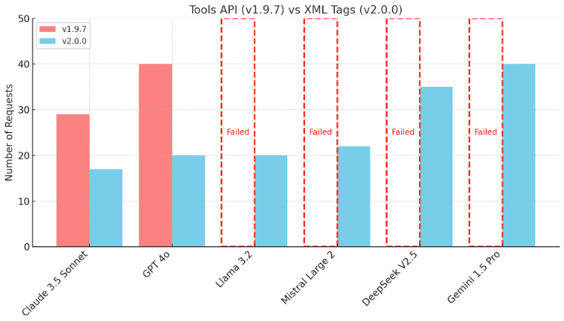
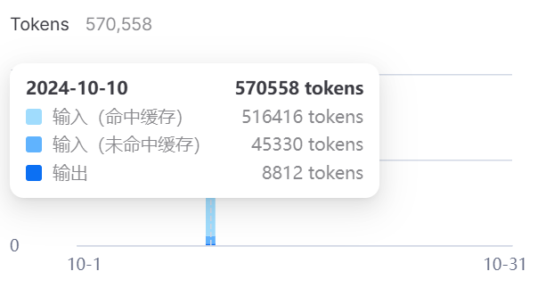
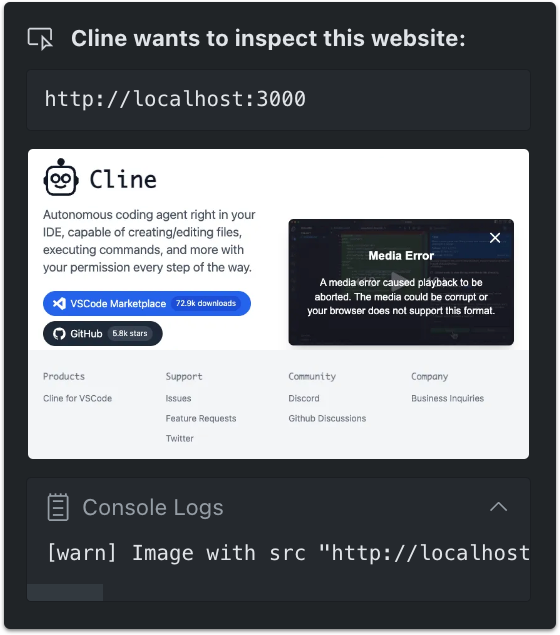
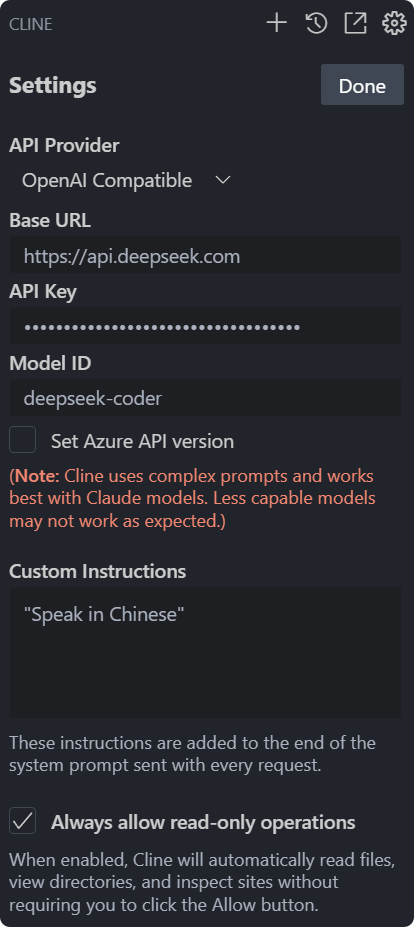
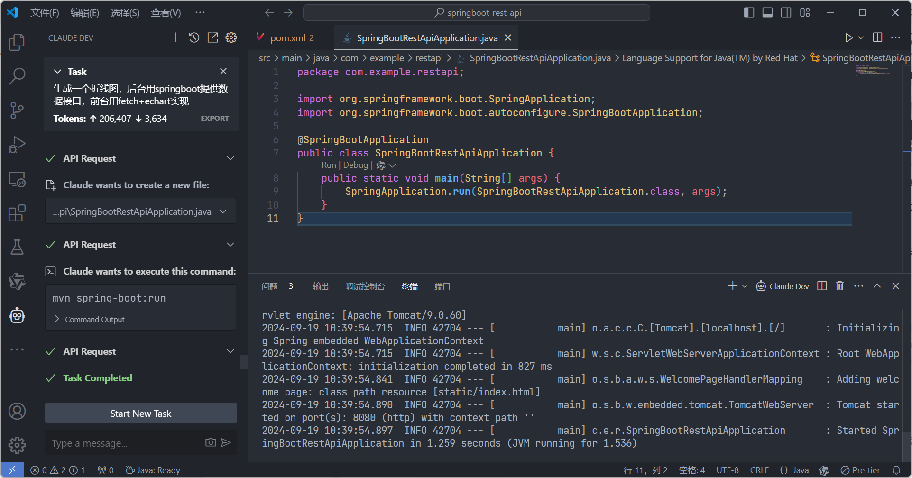
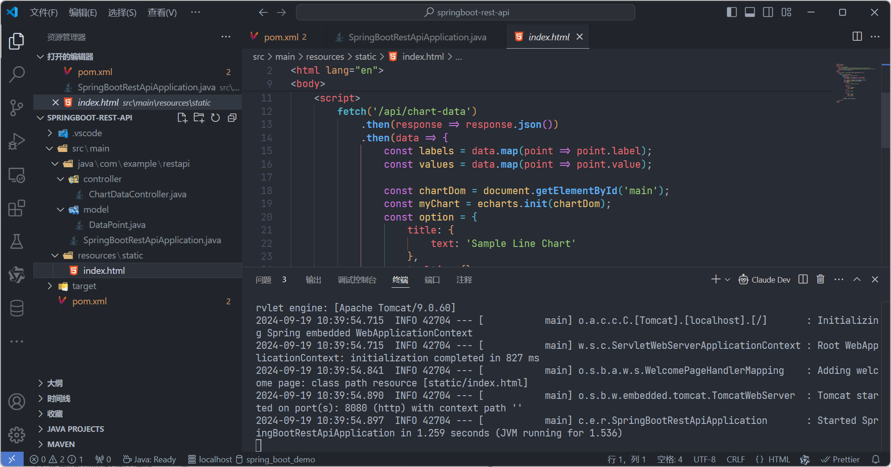
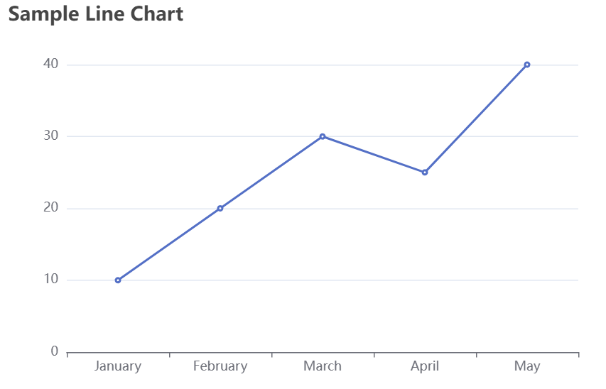
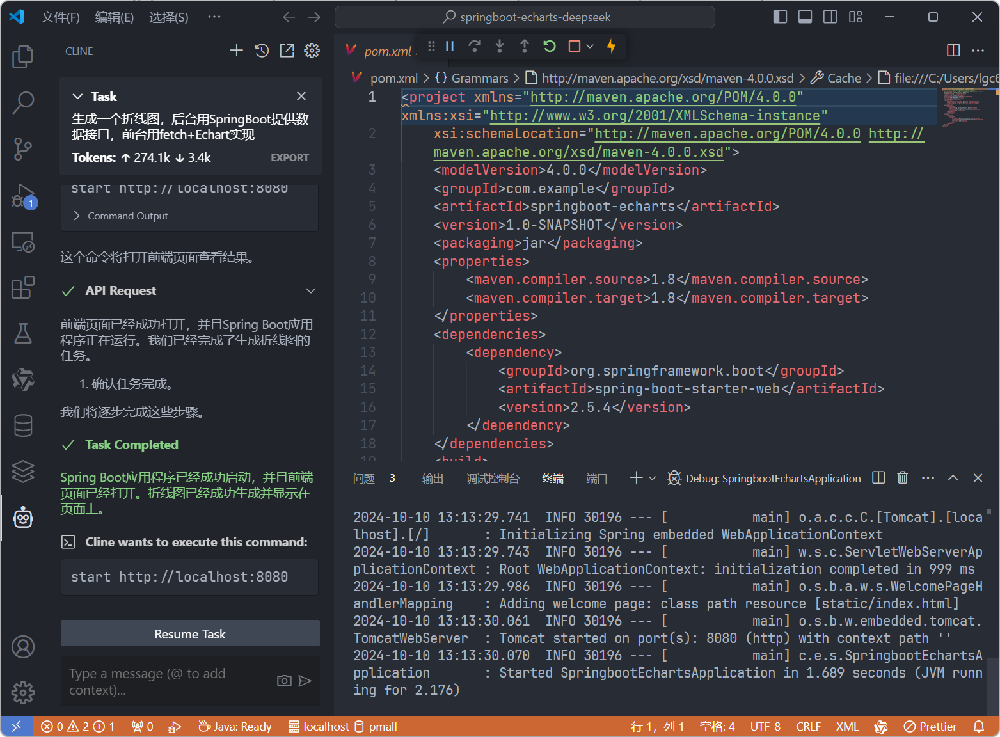
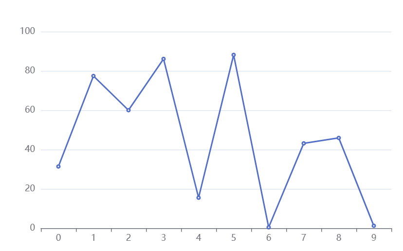
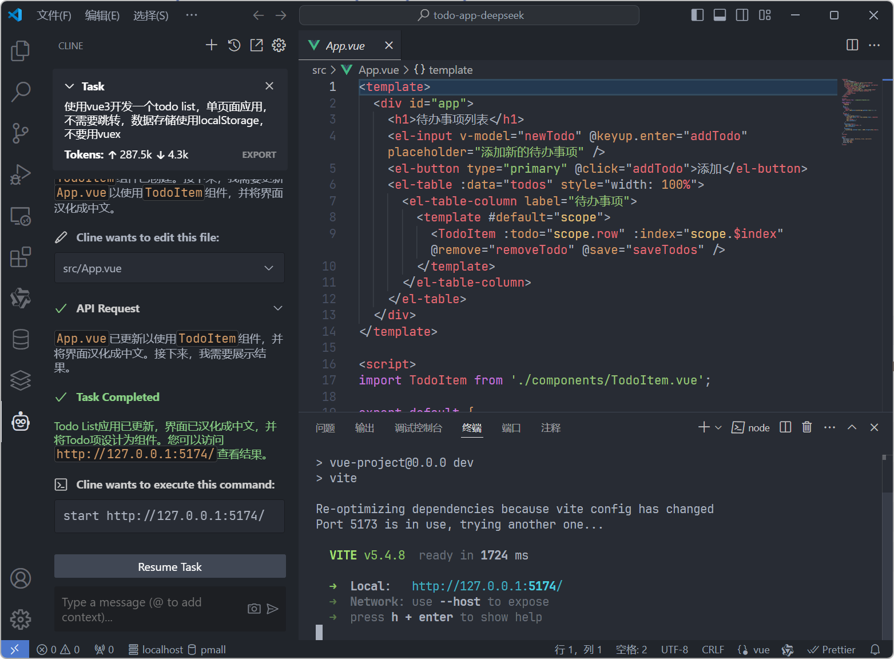

# Cline + DeepSeek：好用便宜的AI程序员搭配

## Cline简介

Cline （原Claude Dev）一个可以使用你的命令行界面和编辑器的人工智能助手。

Cline 可以作为VSCode插件安装，搭建开发环境更加简便，下载地址：[Cline (prev. Claude Dev) - Visual Studio Marketplace](https://marketplace.visualstudio.com/items?itemName=saoudrizwan.claude-dev)，Cline 用来学习一门新语言或者新框架是非常有用的，他能快速帮你搭建起一个可用的demo，自动识别搭建过程中出现的错误并进行改进。

Cline 支持大量主流的大模型，由于支持OpenAI compatible API和Ollama，也就是说你基本可以使用绝大部分大模型帮助你完成任务，Cline 更推荐Claude 3.5 Sonnet，但是新版本也使用了customized XML tags，使得其它大模型的兼容性变得更好。我也试用了一下，原来仅仅使用`claude-3-5-sonnet`和`gpt-4o-mini`时效果比较好，升级到Cline v2.0.0后，使用DeepSeek也能有很好的效果。



比较来说[DeepSeek](https://platform.deepseek.com/)就比gpt-4o-mini和claude-3-5-sonnet便宜不少。尤其是使用了**缓存命中**后仅需0.1元/百万tokens，另外DeepSeek API **不限制用户并发量**，这个在AI编程中也很重要，因为类似Cline的工具会频繁请求API。



由于 VSCode v1.93 中新的 shell 集成更新，Cline 现在可以直接在你的终端中执行命令并接收输出。这样他可以帮助你执行各种命名（需要你确认），也可以获取命令执行后出现的错误，给你解决方案，这个功能在使用过程中感觉非常成熟，这对很对对环境搭建比较困惑的新手有很大帮助。当然有时候你如果能告诉他一些环境设定可能会使用的更加顺滑，比如我使用power shell作为终端，使用pnpm v8等等……

Cline 也支持一些多模态技术（取决你使用的模型，比如DeepSeek就不行），Cline 可以使用无头浏览器检查任何网站，例如 localhost，从而允许他捕获屏幕截图和控制台日志。这使他能够自主修复视觉错误和运行时问题，而无需您手动操作和复制粘贴错误日志。



当然个人使用过程中感觉这个功能还有很长的路要走。

## Cline配置

基本只需要配置很少得选项就能够运行

国内环境可以考虑使用 ==**DeepSeek**==，Cline专门针对其做了测试，价格非常便宜。配置如下，同时DeepSeek也是开源模型，如果机器性能不错，可以使用Ollama来跑

* **API Provider**：OpenAl Compatible
* **Base URL**：`https://api.deepseek.com`
* **API Key**：自行申请
* **Model ID**：deepseek-coder

**Custom Instructions**：这里可以追加一些prompts，比如我这里要求使用中文。

**Always allow read-only operations**：由于Cline需要频繁读取项目目录和文件，这些不勾选本选项时都要你授权，勾选后它就可以自己读取再进行下一步了，**强烈推荐勾选**



> 由于Cline要读取终端的内容，所以VSCode的终端不要安装Oh My Posh之类的美化软件（会加入很多字符造成误判）

## Cline实战

### SpringBoot + Echart

```
生成一个折线图，后台用SpringBoot提供数据接口，前台用fetch+Echart实现
```

可以根据你的要求自动创建项目和文件列表，配置文件，根据终端反馈的错误给出解决方案，我用的是gpt-4o-mini，感觉也基本够用，当然比AI对话生成代码可能要贵一些。比如完成本任务，共耗费`Tokens:↑206,407 ↓3,634`，按照当前的gpt-4o-mini价格算约`US$0.033`

如下图，可以给你自动创建每一个文件（需要你确认保存），根据终端的反馈给出下一步的命令（需要你确认执行）








改用DeepSeek，可以看到使用Tokens差不多，但是由于DeepSeek输入Tokens大量命中缓存，实际用了￥0.04元





实际使用过程中，无论是使用gpt-4o-mini还是DeepSeek，使用过程中都很顺滑，成本上DeepSeek更有优势一些。

### vue3

再来看看vue3的经典案例任务管理，这里只用DeepSeek做了测试，因为比较便宜，最终花了￥0.07元

```
使用vue3开发一个todo list，单页面应用，不需要跳转，数据存储使用localStorage，不要用vuex
```

初期由于Cline不知道终端类型，创建项目目录时反复尝试了几次（自动识别错误后分析重试），可以在题词中一开始告知使用的是power shell作为终端会更加顺利

中间追加了几次题词

```sh
追加checkbox表示完成状态
```

```sh
引入element plus美化界面
```

```sh
给完成追加中划线效果
```

```sh
界面汉化成中文，todoitem设计为组件
```




整个过程也很顺滑，没有进行任何手动干预。