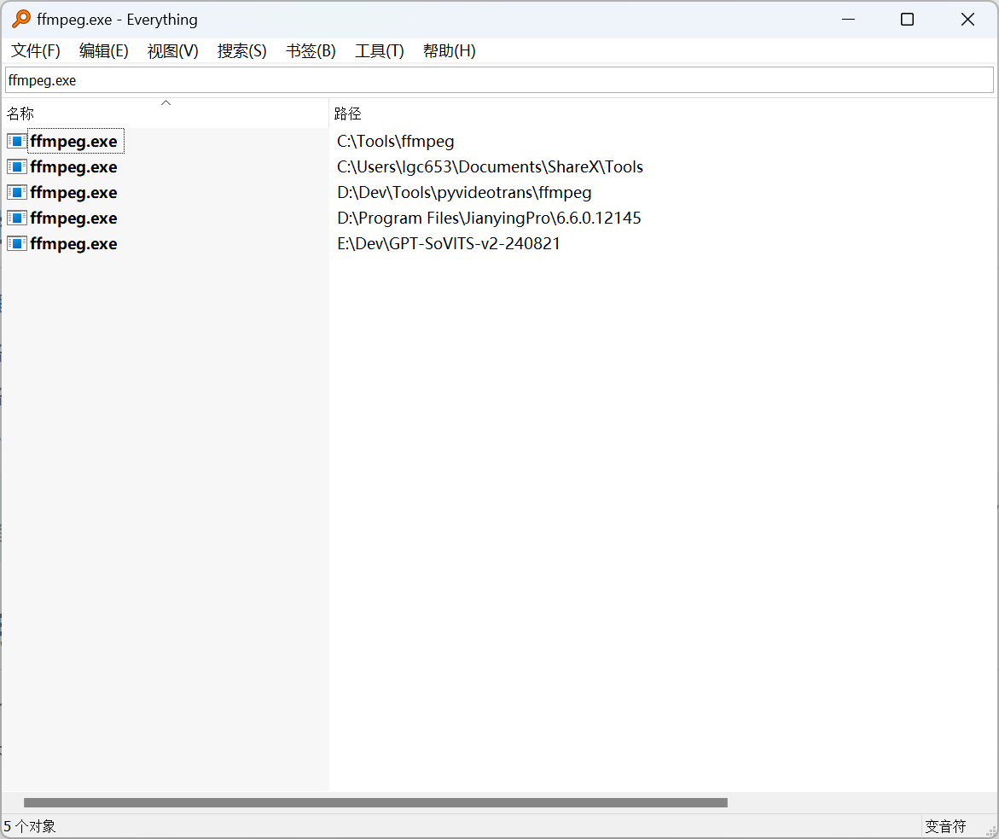
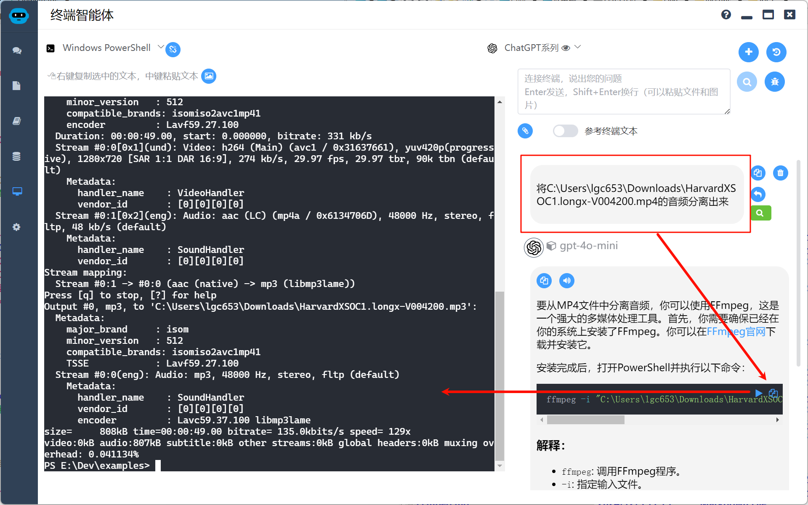
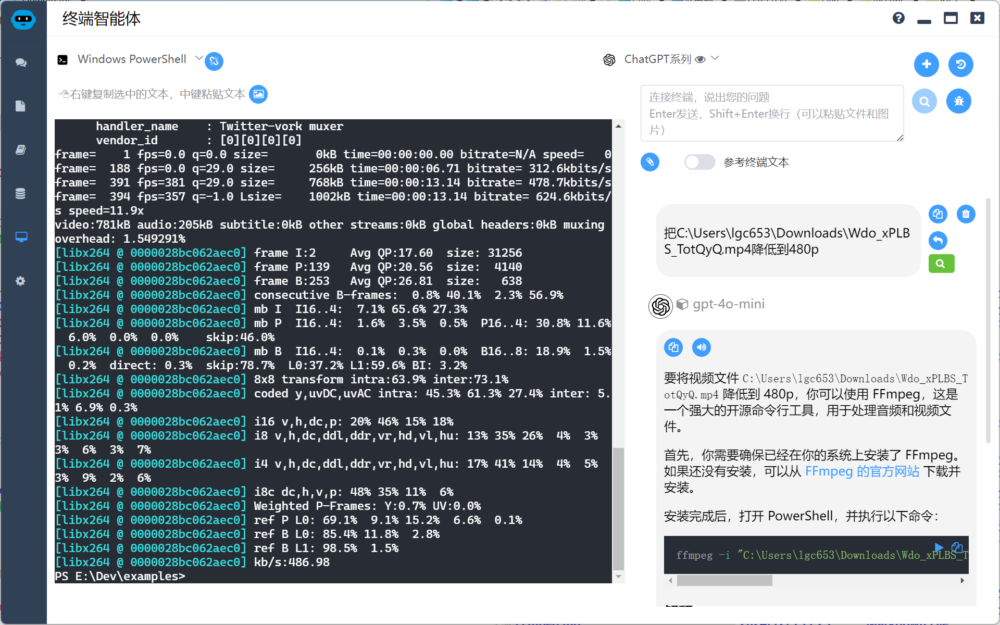
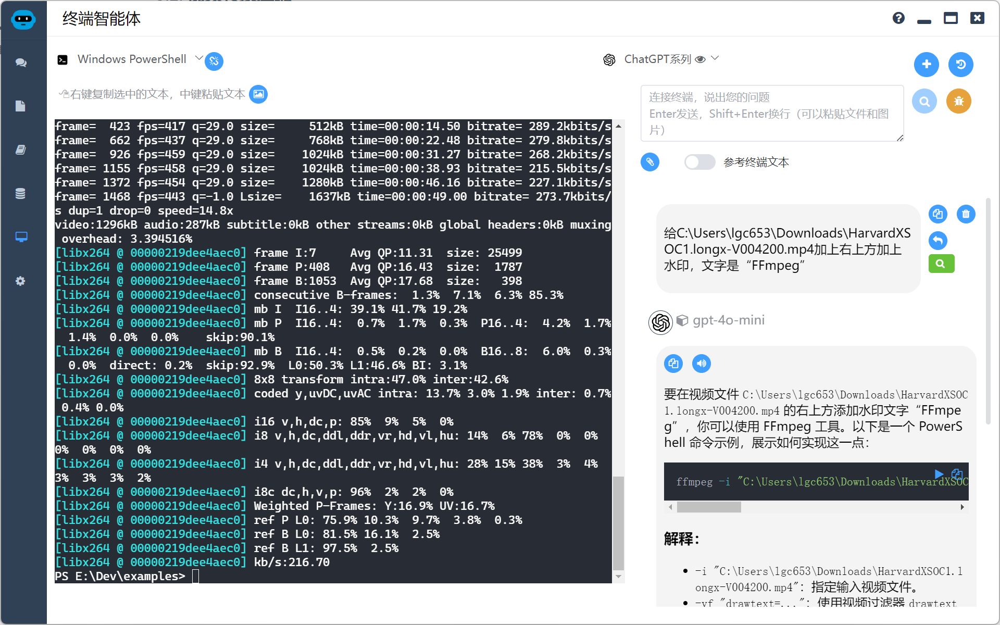
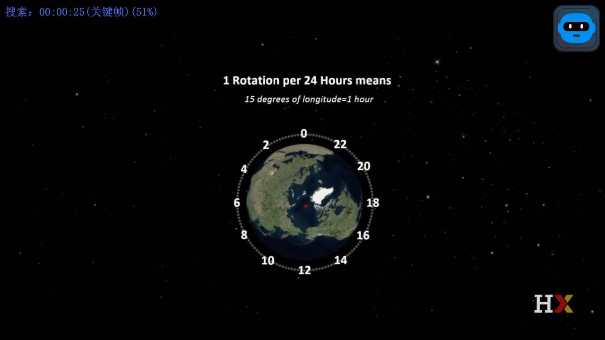
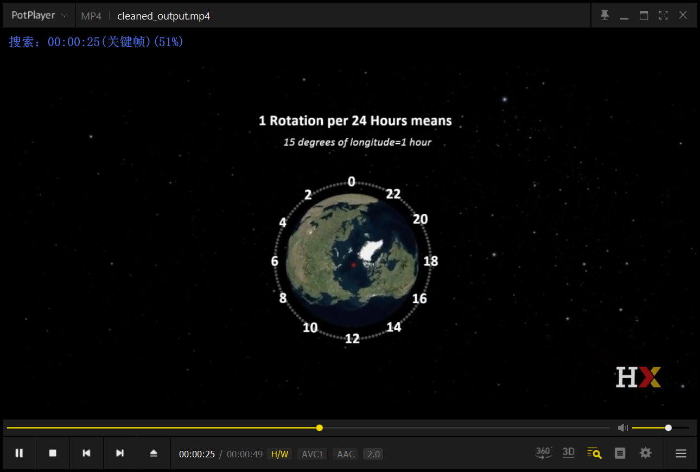
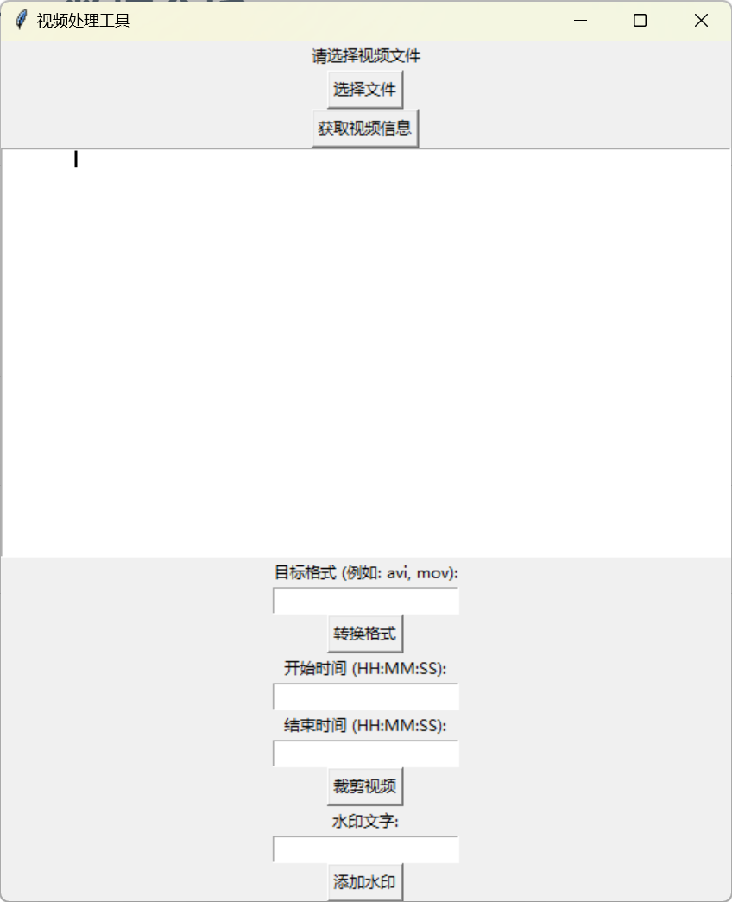

# 自然语言进行音视频处理

## 概述

音视频处理是大家日常离不开的操作，一般大家有好几种解决方案

* 使用各种专业的剪辑工具 —— 这个有一定学习门槛，打开软件可能都需要几十秒
* 使用各种音视频处理工具 —— 这个用一会儿他就要你充会员了
* FFmpeg —— 上面这些工具底层都离不开FFmpeg，我们用FFmpeg更加直接快速，但是FFmpeg命令太难记

> 这时候，AI就能来大显身手了，所以简而言之，就是把AI和FFmpeg命令结合起来使用，起到我下命令它执行的奇妙效果，可能比自己用图形化界面还爽，因为使用界面即使你是VIP，你还要找到这个功能在哪里

## 前期准备

FFmpeg 这个当然少不了，推荐大家去官网下载：[Download FFmpeg](https://ffmpeg.org/download.html)

不过大家不要慌着去下载，可以在你本机搜索一下，十之八九你机器上已经有了

> 看下图，我说的没错吧



第二步当然是把ffmpeg加入path，这个对于码农来说很简单了，如果你不会，可以问问AI

## 开始实践

这里我把终端和AI整合在一起，方便大家操作，来看看几个常见的操作

### 分离音视频

随着AI技术的发展，要理解一个视频的内容，一个捷径是进行语音识别，这个时候我们就需要将音视频进行分离，来看看这个怎么来实现，有了AI，我们就不用去查询命令和帮助了

我们只需要下指令：`将C:\Users\lgc653\Downloads\HarvardXSOC1.longx-V004200.mp4的音频分离出来`



> 这种下命令的感觉是不是很爽，速度也很快，你打开一个视频剪辑工具的时间它早就处理完了

### 视频转换压缩

视频要转换成各种格式和分辨率，这可是很多工具的VIP功能，是要花小钱钱的，我们现在只要下命令就行了

我们只需要下指令：`把C:\Users\lgc653\Downloads\Wdo_xPLBS_TotQyQ.mp4降低到480p`



这就搞定了

### 加水印

加水印是一个常见操作了，我们来看看AI做这个怎么样

我们只需要下指令：`给C:\Users\lgc653\Downloads\HarvardXSOC1.longx-V004200.mp4加上右上方加上水印，文字是“FFmpeg”`



看看效果，果然实现了

> 但是要添加中文水印，就比较纠结了，主要要和本地字体结合，AI就容易犯错了


我们就不折腾AI添加中文水印了，再添加一个图片的水印看看效果，这个应该是比较主流的需求

给出指令`给C:\Users\lgc653\Downloads\HarvardXSOC1.longx-V004200.mp4加上右上方加上图片水印，水印图片是C:\Users\lgc653\Downloads\icon.png`


水印太大了，喧宾夺主，直接指示他`把尺寸换成100*100`



> 😄喜不喜欢这种指挥别人干活的感觉

### 疑难问题

ffmpeg还能删除视频中重复的画面，你还不知道把，常见的收费工具也没提供这个功能，我们来做个实验看看

指使AI来做这个：`把C:\Users\lgc653\Downloads\HarvardXSOC1.longx-V004200.mp4随机创建一些重复帧`

AI给出的指令如下，这个命令会在视频的末尾添加5秒的重复帧。

```sh
ffmpeg -i C:\Users\lgc653\Downloads\HarvardXSOC1.longx-V004200.mp4 -vf "tpad=stop_mode=clone:stop_duration=5" -c:a copy C:\Users\lgc653\Downloads\output.mp4
```

很快就完成了，生成了一个`output.mp4`文件，可以看到视频从49秒变成了53秒

> 下面开始删除重复帧了……怎么有点监守自盗的意思😄

指使AI来做这个：`从C:\Users\lgc653\Downloads\output.mp4删除重复的画面`

可以看到生成了cleaned_output.mp4，视频又变回了49秒



## AI编码

当然你非要做个小应用，这个也是小case，以下程序完全使用自然语言指使AI生成，本人未做任何修改



```python
import tkinter as tk
from tkinter import filedialog
import subprocess

def choose_video():
    """打开文件选择对话框，选择 MP4 视频文件"""
    global video_path
    video_path = filedialog.askopenfilename(
        initialdir="/",
        title="选择视频文件",
        filetypes=(("MP4 files", "*.mp4"), ("all files", "*.*")),
    )
    if video_path:
        video_label.config(text=video_path)

def get_video_info():
    """使用 FFprobe 获取视频信息"""
    if not video_path:
        return
    command = [
        "ffprobe",
        "-v",
        "quiet",
        "-show_format",
        "-show_streams",
        video_path,
    ]
    output = subprocess.check_output(command).decode("utf-8")
    info_text.delete("1.0", tk.END)
    info_text.insert(tk.END, output)

def convert_format():
    """将视频转换为指定格式"""
    if not video_path:
        return
    new_format = format_entry.get()
    if not new_format:
        return
    output_path = video_path.replace(".mp4", f".{new_format.lower()}")
    command = [
        "ffmpeg",
        "-i",
        video_path,
        "-c:v",
        "copy",
        "-c:a",
        "copy",
        output_path,
    ]
    subprocess.call(command)

def trim_video():
    """裁剪视频的指定时间段"""
    if not video_path:
        return
    start_time = start_entry.get()
    end_time = end_entry.get()
    if not start_time or not end_time:
        return
    output_path = video_path.replace(".mp4", "_trimmed.mp4")
    command = [
        "ffmpeg",
        "-i",
        video_path,
        "-ss",
        start_time,
        "-to",
        end_time,
        "-c",
        "copy",
        output_path,
    ]
    subprocess.call(command)

def add_watermark():
    """为视频添加文字水印"""
    if not video_path:
        return
    text = watermark_entry.get()
    if not text:
        return
    output_path = video_path.replace(".mp4", "_watermarked.mp4")
    command = [
        "ffmpeg",
        "-i",
        video_path,
        "-vf",
        f"drawtext=text='{text}':fontcolor=white:fontsize=24:box=1:boxcolor=black@0.5:boxborderw=5:x=(w-text_w)/2:y=(h-text_h)/2",
        output_path,
    ]
    subprocess.call(command)

# 创建主窗口
root = tk.Tk()
root.title("视频处理工具")

# 选择视频文件
video_label = tk.Label(root, text="请选择视频文件")
video_label.pack()

choose_button = tk.Button(root, text="选择文件", command=choose_video)
choose_button.pack()

# 显示视频信息
info_button = tk.Button(root, text="获取视频信息", command=get_video_info)
info_button.pack()

info_text = tk.Text(root)
info_text.pack()

# 转换格式
format_label = tk.Label(root, text="目标格式 (例如: avi, mov):")
format_label.pack()

format_entry = tk.Entry(root)
format_entry.pack()

convert_button = tk.Button(root, text="转换格式", command=convert_format)
convert_button.pack()

# 裁剪视频
start_label = tk.Label(root, text="开始时间 (HH:MM:SS):")
start_label.pack()

start_entry = tk.Entry(root)
start_entry.pack()

end_label = tk.Label(root, text="结束时间 (HH:MM:SS):")
end_label.pack()

end_entry = tk.Entry(root)
end_entry.pack()

trim_button = tk.Button(root, text="裁剪视频", command=trim_video)
trim_button.pack()

# 添加水印
watermark_label = tk.Label(root, text="水印文字:")
watermark_label.pack()

watermark_entry = tk.Entry(root)
watermark_entry.pack()

watermark_button = tk.Button(root, text="添加水印", command=add_watermark)
watermark_button.pack()

root.mainloop()
```

## 总结

* 使用自然语言进行音视频处理非常靠谱
* 只要ffmpeg能做到，你就能做到，再也不用等待打开大型软件，再也不用充VIP了

