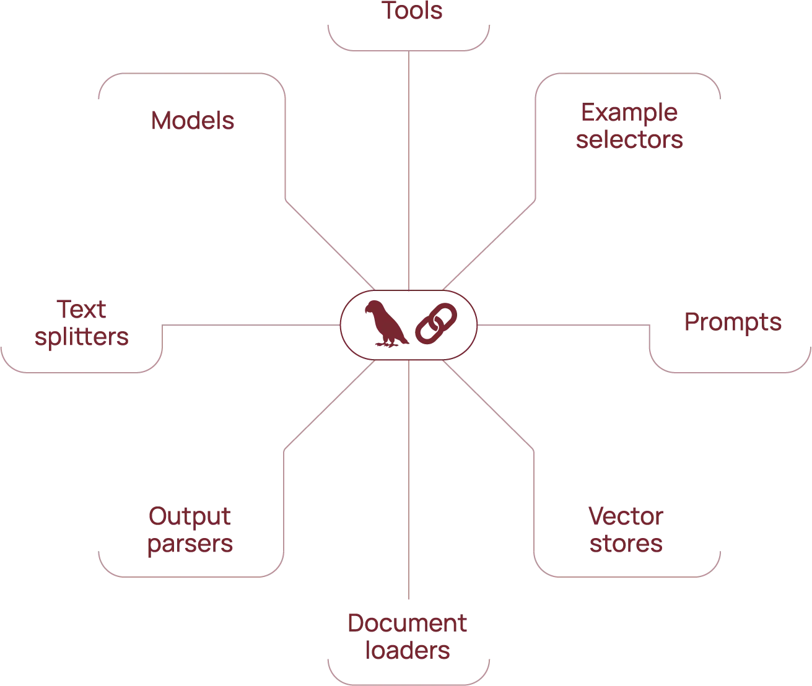

# LangChain

LangChain 是一个开源的基于 LLM 的上层应用开发框架，LangChain 提供了一系列的工具和接口，让开发者可以轻松地构建和部署基于 LLM 的应用 。LangChain 围绕将不同组件“链接”在一起的核心概念构建，简化了与 GPT-3.5、GPT-4 等 LLM 合作的过程，使得我们可以轻松创建定制的高级用例

目前， LangChain 支持 Python 和 JavaScript 两种语言。如果大家想体验 LangChain ，建议使用 Python 语言，简单，易上手。

LangChain 的官网是 [LangChain](https://www.langchain.com/)，在这上面可以找到所有的使用案例和教程信息。

## 基本概念

LangChain 的八个核心模块：

* **Models (模型)**: 用于访问和管理各种 LLM，例如 GPT-3。
* **Prompts (提示)**: 用于构建和管理发送给 LLM 的提示，以引导其生成所需输出。
* **Example selectors (示例选择器)**: 用于选择和准备用于微调 LLM 或构建提示的示例数据。
* **Tools (工具)**: 用于与外部 API 和数据源交互，例如搜索引擎、数据库等。
* **Text splitters (文本拆分器)**: 用于将长文本拆分为 LLM 可以处理的较小块。
* **Output parsers (输出解析器)**: 用于将 LLM 的原始输出解析为结构化数据或所需格式。
* **Vector stores (向量存储)**: 用于存储和检索文本嵌入，以便进行语义搜索和相似性比较。
* **Document loaders (文档加载器)**: 用于从各种来源加载和预处理文档，例如文本文件、网页等。



## 核心组件

使用 LangChain，软件团队可以通过以下模块构建上下文感知语言模型系统。 

### LLM 接口

LangChain 提供 API，开发人员可以利用这些接口通过其代码连接和查询 LLM。开发人员可以利用 LangChain，通过进行简单的 API 调用，与 GPT、Bard 和 PaLM 等公共模型和专有模型交互，无需编写复杂代码。

### 提示模板

**提示模板**是预构建结构，开发人员使用该结构来一致且精确地编排 AI 模型的查询格式。开发人员可以为聊天机器人应用程序、小样本学习创建提示模板，也可以向语言模型提供特定指令。此外，他们还可以在不同的应用程序和语言模型中重复使用这些模板。 

### 代理

开发人员使用 LangChain 提供的工具和库来为复杂的应用程序编写和自定义现有的链。**代理**是一种特殊的链，提示语言模型决定响应查询的最佳顺序。使用代理时，开发人员会提供用户输入、可用工具和可能的中间步骤，以实现预期的结果。然后，语言模型会返回应用程序可以采取的可行操作顺序。 

### 检索模块

LangChain 支持使用大量工具来构建 RAG 系统，从而转换、存储、搜索和检索信息，优化语言模型响应。开发人员可以使用单词嵌入创建信息的语义表示，并将其存储在本地或云向量数据库中。 

### 内存

一些对话语言模型应用程序使用从过去的交互中召回的信息来完善其响应。LangChain 让开发人员可以在其系统中包含内存功能。它支持：

- 简单的内存系统，可召回最近的对话。 
- 复杂的内存结构，可分析历史消息以返回最相关的结果。 

### 回调

回调是开发人员在其应用程序中使用的代码，用于记录、监控和流式传输 LangChain 操作中的特定事件。例如，开发人员可以跟踪链首次被调用的时间以及在回调中遇到的错误。 

## LangChain实践

### 安装配置

```sh
pip install langchain
```

建立配置文件**config\gpt.config.json**

```json
{
    "base_url": "",
    "api_key": ""
}
```

### 问答系统 

首先，让我们学习如何单独使用语言模型。LangChain 支持许多不同的语言模型，这里使用openai兼容API

```sh
pip install -qU langchain-openai
```

代码展示了如何使用 LangChain 和 OpenAI 的 API 构建一个简单的对话机器人。它使用系统消息设定机器人的角色，并使用用户消息与用户进行交互。

**主要步骤:**

1. **加载配置:** 从 `config/gpt.config.json` 文件中读取 OpenAI 的 API 密钥和基础 URL。
2. **初始化 LLM:** 使用 `ChatOpenAI` 类初始化 OpenAI 的大语言模型。
3. **创建消息列表:** 创建一个包含系统消息和用户消息的消息列表。系统消息用于设定机器人的角色和行为，用户消息是用户输入的文本。
4. **调用 LLM:** 使用 `invoke` 方法调用 LLM，并将消息列表作为输入。
5. **打印响应:** 打印 LLM 生成的响应。

```python
import json
from langchain_openai import ChatOpenAI
from langchain_core.messages import HumanMessage, SystemMessage

# 尝试打开配置文件并读取配置信息
try:
    with open("./config/gpt.config.json", "r") as f:
        config = json.load(f)
    base_url = config.get("base_url")
    api_key = config.get("api_key")
except FileNotFoundError:
    print("错误：config.json 文件未找到。")
    exit()
except json.JSONDecodeError:
    print("错误：config.json 文件格式错误。")
    exit()

# 初始化 OpenAI 的大语言模型 (LLM)
# 使用 gpt-4o-mini 模型
model = ChatOpenAI(
    openai_api_base=base_url,
    openai_api_key=api_key,
    model="gpt-4o-mini",
)

# 创建消息列表，包含系统消息和用户消息
# 系统消息用于设定机器人的角色和行为
# 用户消息是用户输入的文本
messages = [
    SystemMessage(content="你是一个工作和学习中的助理。"),
    HumanMessage(content="你能告诉我更多关于机器学习的信息吗？"),
]

# 使用 invoke 方法调用 LLM，并将消息列表作为输入
# invoke 方法返回 LLM 生成的响应
result = model.invoke(messages)

# 打印 LLM 生成的响应
print(result)
```

这段代码创建了一个简单的问答系统，它使用 OpenAI 的 LLM 来生成对用户输入的响应。

```
content='当然可以！机器学习（Machine Learning，ML）是人工智能（AI）的一个子领域，涉及到从数据中学习和改进的算法和模型。它的核心目标是让计算机系统能够自动从经验中学习，而无需明确编程。\n\n### 机器学习的基本类型\n\n1. **监督学习（Supervised Learning）**：\n   - 在这种学习模式中，模型通过使用带标签的数据进行训练。每个输入数据都有对应的输出（标签）。模型学习如何从输入预测输出。\n   - 常见算法：线性回归、逻辑回归、支持向量机（SVM）、决策树、随机森林、神 经网络等。\n   - 应用：分类、回归问题，例如垃圾邮件检测、房价预测等。\n\n2. **无监督学习（Unsupervised Learning）**：\n   - 模型在没有标签的数据上进行 训练。目标是发现数据的结构或模式。\n   - 常见算法：K均值聚类、层次聚类、主成分分析（PCA）、自编码器等。\n   - 应用：客户细分、数据降维、异常检测等。\n\n3. **半监督学习（Semi-Supervised Learning）**：\n   - 结合了监督学习和无监督学习，使用少量标记数据和大量未标记数据进行训练。\n   - 应用：当标记数据稀 缺但未标记数据丰富时，常用于图像分类和文本分类。\n\n4. **强化学习（Reinforcement Learning）**：\n   - 在这种学习模式中，代理通过与环境交互来学习。代理 根据采取的行动获得奖励或惩罚，从而优化决策过程。\n   - 应用：游戏AI、机器人控制、自主驾驶等。\n\n### 机器学习的基本步骤\n\n1. **数据收集**：获取与问题 相关的数据。\n2. **数据预处理**：清洗数据，处理缺失值、异常值等。\n3. **特征选择与提取**：选择或提取对模型预测最有用的特征。\n4. **模型选择**：选择合适的机器学习算法。\n5. **模型训练**：使用训练数据训练模型。\n6. **模型评估**：通过交叉验证、准确率、F1评分等评估模型性能。\n7. **模型优化**：调整参数和特征以提高模型性能。\n8. **模型部署**：将训练好的模型应用于实际问题中。\n\n### 应用领域\n\n机器学习在各个领域都有广泛的应用，包括但不限于：\n\n- **金融**：信用评分、欺诈检测、算法交易。\n- **医疗**：疾病预测、医学影像分析、个性化医疗。\n- **零售**：推荐系统、库存管理、顾客行为分析。\n- **交通**：路线优 化、交通预测、自动驾驶车辆。\n- **自然语言处理**：机器翻译、语音识别、情感分析。\n\n如果你有具体的方面想要深入了解，欢迎告诉我！' additional_kwargs={'refusal': None} response_metadata={'token_usage': {'completion_tokens': 660, 'prompt_tokens': 32, 'total_tokens': 692, 'completion_tokens_details': {'audio_tokens': None, 'reasoning_tokens': 0}, 'prompt_tokens_details': None}, 'model_name': 'gpt-4o-mini-2024-07-18', 'system_fingerprint': 'fp_e2bde53e6e', 'finish_reason': 'stop', 'logprobs': None} id='run-6dee5ce1-7374-49ab-99b3-8ab54f8ed390-0' usage_metadata={'input_tokens': 32, 'output_tokens': 660, 'total_tokens': 692, 'input_token_details': {}, 'output_token_details': {'reasoning': 0}}
```

### RAG知识库

使用 LangChain 和 OpenAI 的 API 构建一个简单的文档问答系统。它使用文本嵌入技术将文档转换为向量表示，并使用向量数据库进行相似度搜索。

这里使用openai兼容API，使用text-embedding-ada-002作为Text Embedding模型，使用chroma作为vectorstore，安装依赖

```sh
pip install langchain langchain-chroma langchain-openai
```

**主要步骤:**

1. **加载配置:** 从 `config/gpt.config.json` 文件中读取 OpenAI 的 API 密钥和基础 URL。
2. **初始化 LLM:** 使用 `ChatOpenAI` 类初始化 OpenAI 的大语言模型。
3. **加载文档:** 使用 `TextLoader` 类加载文档，并使用 `RecursiveCharacterTextSplitter` 类将文档分割成多个文本块。
4. **创建向量数据库:** 使用 `OpenAIEmbeddings` 类将文本块转换为向量表示，并使用 `Chroma` 类将向量存储在向量数据库中。
5. **搜索相似文本:** 使用 `similarity_search_with_score` 方法在向量数据库中搜索与查询最相似的文本块。

编写资料：**data\咖啡知识问答手册.md**

```markdown
## 咖啡知识问答手册

这份手册旨在为构建基于检索增强生成 (RAG) 的咖啡知识问答系统提供内容素材。 

**目录**

* [咖啡豆种类](#咖啡豆种类)
* [咖啡烘焙](#咖啡烘焙)
* [咖啡冲泡](#咖啡冲泡)
* [咖啡文化](#咖啡文化)
* [咖啡与健康](#咖啡与健康)

---

### 咖啡豆种类

**1. 阿拉比卡 (Arabica)**

* **产地：**  埃塞俄比亚
* **风味：**  香气浓郁，酸度较高，口感顺滑，带有花香、果香、焦糖等风味。
* **特点：**  品质较高，产量占全球咖啡总产量的 60% 以上。

**2. 罗布斯塔 (Robusta)**

* **产地：**  非洲西部和中部
* **风味：**  苦味较重，酸度较低，口感浓烈，带有泥土和坚果的味道。
* **特点：**  咖啡因含量高，抗病虫害能力强，价格相对便宜。

**3.  利比里卡 (Liberica)**

* **产地：**  利比里亚
* **风味：**  烟熏味、木质香气，口感浓烈。
* **特点：**  产量稀少，价格昂贵，较为罕见。

**4.  埃塞尔萨 (Excelsa)**

* **产地：**  东南亚
* **风味：**  果香浓郁，带有淡淡的焦糖和黑胡椒味。
* **特点：**  通常与其他咖啡豆混合使用，以增加风味复杂度。

---

### 咖啡烘焙

**1. 浅度烘焙**

* **颜色：**  浅棕色
* **风味：**  保留较多咖啡豆的原始风味，酸度较高，苦味较低。
* **特点：**  适合喜欢清爽口感和明亮酸度的咖啡爱好者。

**2. 中度烘焙**

* **颜色：**  中等棕色
* **风味：**  酸度和苦味较为平衡，香气更加浓郁。
* **特点：**  最常见的烘焙程度，适合大多数人的口味。

**3. 深度烘焙**

* **颜色：**  深棕色至黑色
* **风味：**  苦味浓郁，带有焦糖、巧克力等烘焙香气。
* **特点：**  适合喜欢浓郁口感和强烈苦味的咖啡爱好者。

---

### 咖啡冲泡

**1. 滴滤式咖啡**

* **工具：**  滴滤咖啡壶、滤纸
* **特点：**  操作简单，适合日常饮用。

**2. 法压壶**

* **工具：**  法压壶
* **特点：**  能够保留咖啡油脂，口感更加浓郁。

**3. 摩卡壶**

* **工具：**  摩卡壶
* **特点：**  能够制作出浓缩咖啡，适合制作意式咖啡。

**4. 手冲咖啡**

* **工具：**  手冲壶、滤杯、滤纸
* **特点：**  能够精确控制水流和时间，制作出个性化的咖啡。

---

### 咖啡文化

* **咖啡起源：**  咖啡起源于埃塞俄比亚，传说中由一位牧羊人发现。
* **咖啡传播：**  咖啡通过贸易和文化交流传播到世界各地。
* **咖啡馆文化：**  咖啡馆是人们社交、休闲、工作的场所。
* **咖啡礼仪：**  不同国家和地区有不同的咖啡礼仪。

---

### 咖啡与健康

* **咖啡因：**  咖啡因是一种兴奋剂，可以提高 alertness 和注意力。
* **抗氧化剂：**  咖啡中含有抗氧化剂，可以预防慢性疾病。
* **潜在风险：**  过量饮用咖啡可能会导致焦虑、失眠等问题。

---

**免责声明：** 

本手册仅供参考，具体信息请以专业资料为准。
```

编写代码

```python
import json
from langchain_openai import ChatOpenAI
from langchain_chroma import Chroma
from langchain_openai import OpenAIEmbeddings
from langchain_community.document_loaders import TextLoader
from langchain_text_splitters import RecursiveCharacterTextSplitter

# 尝试打开配置文件并读取配置信息
try:
    with open("./config/gpt.config.json", "r") as f:
        config = json.load(f)
    base_url = config.get("base_url")
    api_key = config.get("api_key")
except FileNotFoundError:
    print("错误：config.json 文件未找到。")
    exit()
except json.JSONDecodeError:
    print("错误：config.json 文件格式错误。")
    exit()

# 初始化 OpenAI 的大语言模型 (LLM)
# 使用 gpt-4o-mini 模型，并将 temperature 设置为 0 以获得更确定的输出
llm = ChatOpenAI(
    openai_api_base=base_url, openai_api_key=api_key, model="gpt-4o-mini", temperature=0
)

# 使用 TextLoader 加载文档，可以根据需要替换为其他格式的文档
# 这里加载的是名为 "咖啡知识问答手册.md" 的 Markdown 文件
loader = TextLoader("./data/咖啡知识问答手册.md", encoding="utf-8")
documents = loader.load()

# 使用 RecursiveCharacterTextSplitter 将文档分割成多个文本块
# 这里将每个文本块的大小设置为 200 个字符，并设置重叠度为 0
text_splitter = RecursiveCharacterTextSplitter.from_language(
    language="markdown", chunk_size=200, chunk_overlap=0
)
texts = text_splitter.create_documents([documents[0].page_content])

# 使用 OpenAIEmbeddings 将文本块转换为向量表示
# 并使用 Chroma 将向量存储在向量数据库中
vectorstore = Chroma.from_documents(
    texts,
    OpenAIEmbeddings(
        openai_api_base=base_url, openai_api_key=api_key, model="text-embedding-ada-002"
    ),
)

# 使用 similarity_search_with_score 方法在向量数据库中搜索与查询最相似的文本块
# 这里搜索与 "咖啡的种类" 最相似的 3 个文本块
result = vectorstore.similarity_search_with_score("咖啡的种类", k=3)

# 打印搜索结果
print(result)
```

从获取资料，分割数据，到查询相似性的全过程，得到相似性检索结果如下

```
[(Document(metadata={}, page_content='### 咖啡豆种类\n\n**1. 阿拉比卡 (Arabica)**\n\n* **产地：**  埃塞俄比亚\n* **风味：**  香气浓郁，酸度较高，口感顺滑，带有花香、果香、焦糖等风味。\n* **特点：**  品质较高，产量占全球咖啡总产量的 60% 以上。\n\n**2. 罗布斯塔 (Robusta)**'), 0.23466432094573975), (Document(metadata={}, page_content='### 咖啡烘焙\n\n**1. 浅度烘焙**\n\n* **颜色：**  浅棕色\n* **风味：**  保留较多咖啡豆的原始风味，酸度较高，苦味较低。\n* **特点：**  适合喜欢清爽口感和明亮酸度的咖啡爱好者。\n\n**2. 中度烘焙**\n\n* **颜色：**  中等棕色\n* **风味：**  酸度和苦味较为平衡，香气更加浓郁。\n* **特点：**  最常见的烘焙程度，适合大多数人的口味。'), 0.2807896137237549), (Document(metadata={}, page_content='### 咖啡冲泡\n\n**1. 滴滤式咖啡**\n\n* **工具：**  滴滤咖啡壶、滤纸\n* **特点：**  操作简单，适合日常饮用。\n\n**2. 法压壶**\n\n* **工具：**  法压壶\n* **特点：**  能够保留咖啡油脂，口感更加浓郁。\n\n**3. 摩卡壶**\n\n* **工具：**  摩卡壶\n* **特点：**  能够制作出浓缩咖啡，适合制作意式咖啡。\n\n**4. 手冲咖啡**'), 0.28470578789711)] 
```

> 后续就是结合**问答系统**进行问答了，比如题词可以用下面的示例，其中`{context}`是上面的相似性检索结果，我们可以在结果中通过score等参数进行筛选。
>
> ```markdown
> 你的任务是根据下述给定的已知信息回答用户问题。确保你的回复完全依据下述已知信息。不要编造答案。请用中文回答用户问题。
> 已知信息:{context}
> ```

可以看到使用`RecursiveCharacterTextSplitter`自动拆解并不是特别理想，最理想的情况还是专业人员编写并拆解，我这里尝试了用AI拆解，效果也还可以

````markdown
```markdown
markdown内容略……
```
将上文理解后拆解成如下格式供RAG系统使用
```python
from langchain_core.documents import Document

documents = [
    Document(
        page_content="Dogs are great companions, known for their loyalty and friendliness.",
        metadata={"source": "mammal-pets-doc"},
    ),
    Document(
        page_content="Cats are independent pets that often enjoy their own space.",
        metadata={"source": "mammal-pets-doc"},
    ),
]
```
````

得到结果

```python
from langchain_core.documents import Document

documents = [
    Document(
        page_content="**阿拉比卡 (Arabica)**\n* **产地：**  埃塞俄比亚\n* **风味：**  香气浓郁，酸度较高，口感顺滑，带有花香、果香、焦糖等风味。\n* **特点：**  品质较高，产量占全球咖啡总产量的 60% 以上。",
        metadata={"source": "咖啡豆种类"},
    ),
    Document(
        page_content="**罗布斯塔 (Robusta)**\n* **产地：**  非洲西部和中部\n* **风味：**  苦味较重，酸度较低，口感浓烈，带有泥土和坚果的味道。\n* **特点：**  咖啡因含量高，抗病虫害能力强，价格相对便宜。",
        metadata={"source": "咖啡豆种类"},
    ),
    Document(
        page_content="**利比里卡 (Liberica)**\n* **产地：**  利比里亚\n* **风味：**  烟熏味、木质香气，口感浓烈。\n* **特点：**  产量稀少，价格昂贵，较为罕见。",
        metadata={"source": "咖啡豆种类"},
    ),
    Document(
        page_content="**埃塞尔萨 (Excelsa)**\n* **产地：**  东南亚\n* **风味：**  果香浓郁，带有淡淡的焦糖和黑胡椒味。\n* **特点：**  通常与其他咖啡豆混合使用，以增加风味复杂度。",
        metadata={"source": "咖啡豆种类"},
    ),
    Document(
        page_content="**浅度烘焙**\n* **颜色：**  浅棕色\n* **风味：**  保留较多咖啡豆的原始风味，酸度较高，苦味较低。\n* **特点：**  适合喜欢清爽口感和明亮酸度的咖啡爱好者。",
        metadata={"source": "咖啡烘焙"},
    ),
    Document(
        page_content="**中度烘焙**\n* **颜色：**  中等棕色\n* **风味：**  酸度和苦味较为平衡，香气更加浓郁。\n* **特点：**  最常见的烘焙程度，适合大多数人的口味。",
        metadata={"source": "咖啡烘焙"},
    ),
    Document(
        page_content="**深度烘焙**\n* **颜色：**  深棕色至黑色\n* **风味：**  苦味浓郁，带有焦糖、巧克力等烘焙香气。\n* **特点：**  适合喜欢浓郁口感和强烈苦味的咖啡爱好者。",
        metadata={"source": "咖啡烘焙"},
    ),
    Document(
        page_content="**滴滤式咖啡**\n* **工具：**  滴滤咖啡壶、滤纸\n* **特点：**  操作简单，适合日常饮用。",
        metadata={"source": "咖啡冲泡"},
    ),
    Document(
        page_content="**法压壶**\n* **工具：**  法压壶\n* **特点：**  能够保留咖啡油脂，口感更加浓郁。",
        metadata={"source": "咖啡冲泡"},
    ),
    Document(
        page_content="**摩卡壶**\n* **工具：**  摩卡壶\n* **特点：**  能够制作出浓缩咖啡，适合制作意式咖啡。",
        metadata={"source": "咖啡冲泡"},
    ),
    Document(
        page_content="**手冲咖啡**\n* **工具：**  手冲壶、滤杯、滤纸\n* **特点：**  能够精确控制水流和时间，制作出个性化的咖啡。",
        metadata={"source": "咖啡冲泡"},
    ),
    Document(
        page_content="* **咖啡起源：**  咖啡起源于埃塞俄比亚，传说中由一位牧羊人发现。\n* **咖啡传播：**  咖啡通过贸易和文化交流传播到世界各地。\n* **咖啡馆文化：**  咖啡馆是人们社交、休闲、工作的场所。\n* **咖啡礼仪：**  不同国家和地区有不同的咖啡礼仪。",
        metadata={"source": "咖啡文化"},
    ),
    Document(
        page_content="* **咖啡因：**  咖啡因是一种兴奋剂，可以提高 alertness 和注意力。\n* **抗氧化剂：**  咖啡中含有抗氧化剂，可以预防慢性疾病。\n* **潜在风险：**  过量饮用咖啡可能会导致焦虑、失眠等问题。",
        metadata={"source": "咖啡与健康"},
    ),
]
```

修改一下代码，把之前的texts换成documents

```python
from langchain_chroma import Chroma
from langchain_openai import OpenAIEmbeddings

vectorstore = Chroma.from_documents(
    documents,
    embedding=OpenAIEmbeddings(),
)
```

当然，还可以用使用OpenAI的`function_call`可以保证返回格式是JSON，便于解析和后续处理，可以参考 [Python与API](..\Python\Python与API.md#使用 Python 调用 API) 一文的资料