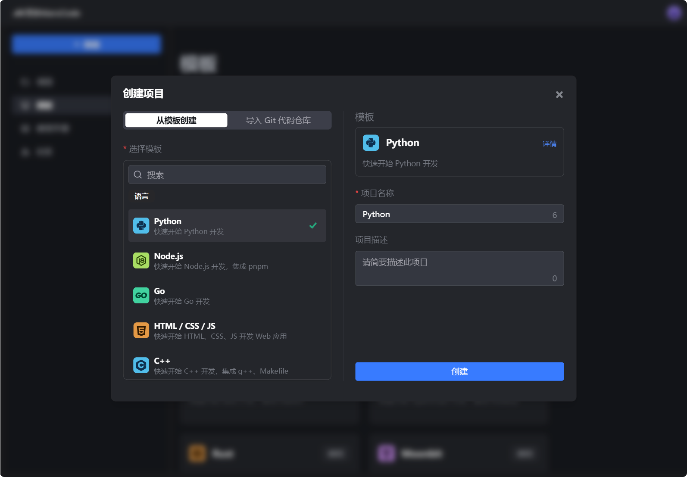
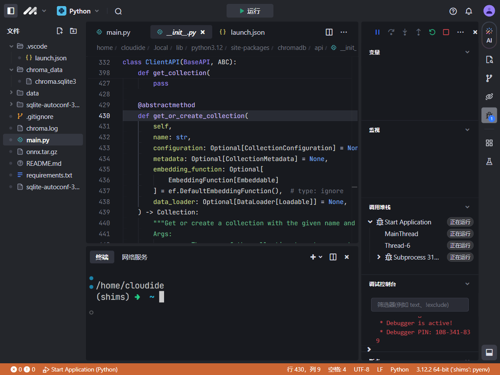
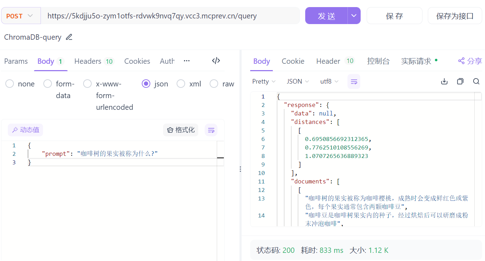

# MarsCode IDE 云开发RAG REST API

## 项目简介

之前给大家讲解了[chromadb + Ollama 快速实现RAG应用chromadb + Ollama 快速实现RAG应用](https://juejin.cn/post/7424431087894380584)，这个方案的特点就是安装的东西少，这次我们尝试一下使用MarsCode IDE的云环境来开发一个RAG API，实现了基础的2个功能

* 文本（例如文档、查询、代码等）转换为向量
* 文本相似度计算和检索

通过这个实践，也证明了MarsCode IDE有一定可玩性，能够在云开发、部署一个具备可用性的RAG REST API。

小的实验性项目，手边也没有服务器，使用MarsCode IDE开发，相当于附送了一台低配置的服务器，可以快速开发完成后提供给别人测试……

> 本实践流程完全依赖浏览器环境

## 创建项目

支持从模版创建一个Python项目



## 终端交互

由于每个项目都开辟了一个容器，根据你选择的编程语言，内置了一些开发环境，我们现在开始安装包，我们就不奢望在上面运行ollama了，打算使用chromadb内置的嵌入模型。

```sh
pip install chromadb
pip install flask
```

## 编写代码

> 注意需要创建对应的目录，比如我这里需要创建data目录存储chromadb_data，在MarsCode IDE中直接创建即可

```python
from flask import Flask, request, jsonify
import chromadb

app = Flask(__name__)

# 初始化 ChromaDB 客户端和集合
client = chromadb.PersistentClient(path="./data/chromadb_data")
collection = client.get_or_create_collection(name="docs")


@app.route("/add_document", methods=["POST"])
def add_document():
    # 从请求中获取文档
    data = request.json
    documents = data.get("documents", [])

    # 将每个文档存储在向量嵌入数据库中
    for i, d in enumerate(documents):
        collection.upsert(documents=d, ids=[str(i)])

    return jsonify({"message": "Documents added successfully!"}), 201


@app.route("/query", methods=["POST"])
def query():
    # 从请求中获取提示
    data = request.json
    prompt = data.get("prompt", "")

    # 查询 ChromaDB
    results = collection.query(
        query_texts=[prompt],
        n_results=3,
    )

    # 获取查询结果中的第一个文档
    if results["documents"]:
        return jsonify({"response": results}), 200
    else:
        return jsonify({"message": "No documents found."}), 404


if __name__ == "__main__":
    app.run(debug=True)
```

这就大工搞成了，马上就能迎来愉快的摸鱼时间。很不幸……

运行时会提示（当然随着MarsCode IDE版本不断升级，可能就不会报这个问题了）

> RuntimeError: Your system has an unsupported version of sqlite3. Chroma                     requires sqlite3 >= 3.35.0.

## 解决问题

我们使用MarsCode IDE的终端升级sqlite3

```sh
wget https://www.sqlite.org/2024/sqlite-autoconf-3460100.tar.gz
tar -xvf sqlite-autoconf-3460100.tar.gz
cd sqlite-autoconf-3460100.tar.gz
./configure --enable-all
make
sudo make install
./sqlite3 --version                                            
3.46.1 2024-08-13 09:16:08 c9c2ab54ba1f5f46360f1b4f35d849cd3f080e6fc2b6c60e91b16c63f69a1e33 (64-bit)
```

但是测试还是显示老版本

```
python -c "import sqlite3; print(sqlite3.sqlite_version)"

3.34.1
```

修改启动指令，其实也就是在最开始加了`export LD_LIBRARY_PATH=/usr/local/lib;`

```sh
# 原来的指令
COMMAND="export PYTHONPATH="/cloudide/workspace/.cloudide/extensions/ms-python.debugpy-2024.0.0-linux-x64/bundled/libs:$PYTHONPATH"; python3 main.py" marscode-dev
# 修改为
COMMAND="export LD_LIBRARY_PATH=/usr/local/lib; export PYTHONPATH="/cloudide/workspace/.cloudide/extensions/ms-python.debugpy-2024.0.0-linux-x64/bundled/libs:$PYTHONPATH"; python3 main.py" marscode-dev
```

如果不想修改启动指令，想点击IDE的运行或者调试也能运行成功的话，可以修改MarsCode IDE的`.vscode/launch.json`，在 launch.json 文件中，每个调试配置 (configuration) 都有一个 env 属性，你可以用它来设置环境变量。

```json
{
    // Use IntelliSense to learn about possible attributes.
    // Hover to view descriptions of existing attributes.
    // For more information, visit: https://go.microsoft.com/fwlink/?linkid=830387
    "version": "0.2.0",
    "configurations": [
        {
            "name": "Start Application",
            "type": "debugpy",
            "request": "launch",
            "program": "main.py",
            "console": "internalConsole",
            "justMyCode": true,
            "env": {
                "LD_LIBRARY_PATH": "/usr/local/lib"
            }
        }
    ]
}
```



## 运行成功

运行成功，但是首次运行需要下载all-MiniLM-L6-v2很慢，耐心等待或者采用以下方案

```sh
# 直接下载拷贝到目标目录，当然也很慢
mkdir -p ~/.cache/chroma/onnx_models/all-MiniLM-L6-v2 && \
wget -O ~/.cache/chroma/onnx_models/all-MiniLM-L6-v2/onnx.tar.gz https://chroma-onnx-models.s3.amazonaws.com/all-MiniLM-L6-v2/onnx.tar.gz && \
tar -xzf ~/.cache/chroma/onnx_models/all-MiniLM-L6-v2/onnx.tar.gz -C ~/.cache/chroma/onnx_models/all-MiniLM-L6-v2/
```

终于成功了……



