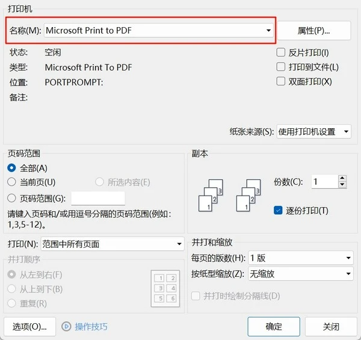
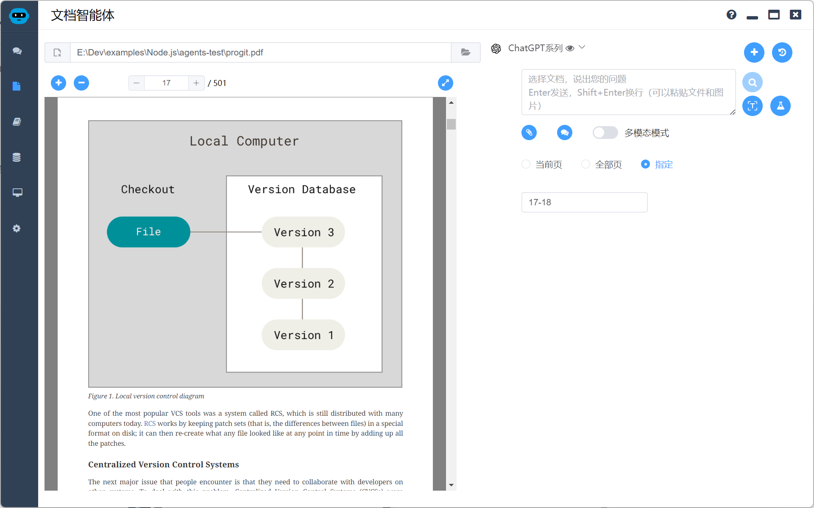
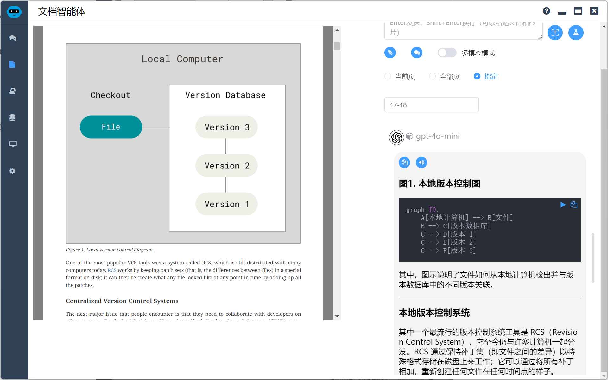
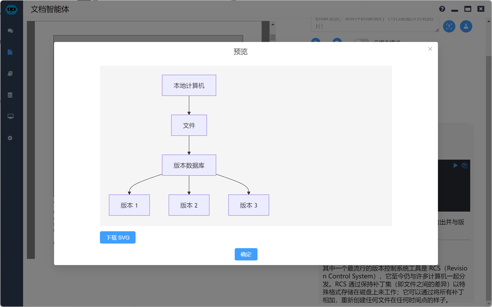

# 使用多模态大模型转换office文档

## 背景介绍

随着大模型的技术的不断发展，如何将各种office文档转换为markdown成为了一个刚需，包括微软在内的不少公司都给出了解决方案，但是都需要经过繁琐的步骤再本地或云端进行部署，有的对本地还有一定算力要求。

现在各家的多模态大模型都在不断降价，1块钱都能处理几百张图片，不少提供商还每日提供免费额度，所以使用多模态大模型转换office文档成为一个廉价而简单的解决方案。

## 技术方案

这里介绍的是使用nodejs的方案

* 使用各种工具将office文档转为PDF（Windows下使用虚拟打印机即可，无需任何费用）
* 使用pdfjs获取PDF每页截图和文字信息
* 使用sharp压缩图片
* 将PDF每页截图和文字信息组合起来提交给多模态大模型
* 使用提示词输出为markdown文档

这个方案也有很多缺点，比如文档中的图片无法处理，复杂的表格无法百分百还原，当然也有一些补救措施，比如文档中的图表可以尝试用mermaid进行还原。当然，我们将office文档转为markdown文档的主要目的还是获取文字信息。所以虽然有遗憾，但是也能满足绝大部分的需求。

## 详细实现

### office文档转为PDF

这个我们如果没有大规模转换需求，直接使用虚拟打印机即可，效果和兼容性非常好，超过所有其他方案。



如果有大规模转换需求，可以考虑使用LibreOffice的命令行模式，例如：

```sh
soffice --headless --convert-to pdf <word_document.docx> --outdir <output_directory>
```

这个方案兼容性稍差，但是也能满足绝大部分需求。

### 使用pdfjs获取PDF信息

PDF.js 是一个基于 JavaScript 的开源 PDF 渲染器，由 Mozilla 开发和维护。提供了从解析到渲染PDF的成套方案，久经考验，兼容性强，如果使用nodejs，这是首选方案。

> 感谢大模型技术，以下代码都是AI生成的，省去了我查询帮助文档的时间。都非常准确好用。

获取某一页的图片截图

```javascript
async function capturePage(pageNumber, scale = 2) {
  const pdfDoc = await pdfjsLib.getDocument(state.filePath).promise
  const page = await pdfDoc.getPage(pageNumber)
  const viewport = page.getViewport({ scale: scale })

  // 创建临时 canvas
  const tempCanvas = document.createElement('canvas')
  const tempContext = tempCanvas.getContext('2d')
  tempCanvas.width = viewport.width
  tempCanvas.height = viewport.height

  // 渲染 PDF 页面到临时 canvas
  await page.render({
    canvasContext: tempContext,
    viewport: viewport
  }).promise

  // 将 canvas 转换为 DataURL
  const dataUrl = tempCanvas.toDataURL('image/webp')
  // 移除临时 canvas
  tempCanvas.remove()
  // 返回 DataURL
  return { type: 'image/webp', data: dataUrl }
}
```

获取某一页的文本信息，含换行信息

```javascript
async function getPageTextContent(pageNumber) {
  const pdfDoc = await pdfjsLib.getDocument(state.filePath).promise
  const page = await pdfDoc.getPage(pageNumber)
  const textContent = await page.getTextContent()
  const items = textContent.items

  let lastY = null
  let text = ''

  for (const item of items) {
    const transform = item.transform
    const y = transform[5] // 获取垂直位置

    if (lastY !== null && Math.abs(y - lastY) > item.height * 0.5) { // 判断是否换行
      text += '\n'
    }

    text += item.str + ' '
    lastY = y
  }

  return text
}
```

### 压缩图片

适当压缩图片，能够为我们省钱，也可以节约图片传输的时间。用nodejs当然首选Sharp ，Sharp 是一个高性能的 Node.js 图像处理库，它基于 libvips 库构建。它可以用来进行各种图像操作。这里我压缩为最大宽度为1024的webp。

> 当然，下面的代码也是AI写的

```javascript
compressImage = async(base64Image, options) => {
  const maxWidth = options.maxSize || 1024 // 设置最大宽度为 1024
  const compressToWebP = options.compressToWebP || false
  const quality = options.quality || 80

  const base64Data = base64Image.split(',')[1]
  const imageBuffer = Buffer.from(base64Data, 'base64')

  try {
    let sharpInstance = sharp(imageBuffer).resize({ width: maxWidth, fit: 'inside', withoutEnlargement: true }) // 使用 maxWidth 限制宽度
    if (compressToWebP) {
      sharpInstance = sharpInstance.webp({ quality })
    } else {
      sharpInstance = sharpInstance.jpeg({ quality })
    }

    const compressedImageBuffer = await sharpInstance.toBuffer()
    const metadata = await sharp(compressedImageBuffer).metadata() // 获取压缩后的元数据
    const mimeType = compressToWebP ? 'image/webp' : 'image/jpeg'
    const compressedBase64 = `data:${mimeType};base64,${compressedImageBuffer.toString('base64')}`

    return {
      base64: compressedBase64,
      width: metadata.width,
      height: metadata.height
    }
  } catch (error) {
    console.error('Error compressing image:', error)
    throw error
  }
}
```

### 提交大模型

这个很简单，遵循各家多模态大模型的接口规范即可，我这里就不详细描述了。

其实不用选择很厉害的大模型，我日常用gpt-4o-mini（便宜）或者gemini-1.5-pro（免费），国内目前很多多模态大模型效果也很好且也在做推广活动，大家也可以试试。

```javascript
const axios = require('axios');
const FormData = require('form-data'); // 用于处理表单数据，包括文件上传

async function imageRecognition(imagePath) {
  const OPENAI_API_KEY = process.env.OPENAI_API_KEY; // 从环境变量中获取 OpenAI API 密钥
  const OPENAI_API_BASE = "https://api.openai.com/v1/chat/completions"; // OpenAI API 地址

  if (!OPENAI_API_KEY) {
    throw new Error("OpenAI API key not found. Please set the OPENAI_API_KEY environment variable.");
  }

  try {
    const formData = new FormData();
    formData.append('model', 'gpt-4o-mini'); // 指定多模态模型
    formData.append('max_tokens', 50); // 设置最大回复token数，根据需要调整

    const messages = [
      {
        role: 'user',
        content: [
          { type: 'text', text: '描述一下这张图片的内容。' }, //  请求模型描述图片
          {
            type: 'image_url',
            image_url: {
              url: `data:image/jpeg;base64,${Buffer.from(require('fs').readFileSync(imagePath)).toString('base64')}`, // 将图片转换为base64编码
            },
          },
        ],
      },
    ];

    formData.append('messages', JSON.stringify(messages));

    const response = await axios.post(OPENAI_API_BASE, formData, {
      headers: {
        ...formData.getHeaders(), // 获取 FormData 的 headers
        Authorization: `Bearer ${OPENAI_API_KEY}`, // 设置 Authorization header
      },
    });

    console.log(JSON.stringify(response.data, null, 2)); // 打印完整的响应数据

    // 提取描述文本
    const description = response.data.choices[0].message.content;
    return description;

  } catch (error) {
    console.error('OpenAI API request failed:', error);
    if (error.response) {
      console.error('Response status:', error.response.status);
      console.error('Response data:', error.response.data);
    }
    throw error;
  }
}


// 使用示例：
const imagePath = 'path/to/your/image.jpg'; // 替换为你的图片路径

imageRecognition(imagePath)
  .then(description => {
    console.log('图片描述:', description);
  })
  .catch(error => {
    // 处理错误
  });
```

### 提示词

我一般用如下提示词，供大家参考

```
请根据用户提供的图片进行OCR识别，尽可能的还原用户提供的内容，包括标题、文字、表格、公式等。如果您在原始内容中发现任何不清楚的格式，请自行判断添加适当的格式以提高可读性和结构。如果表格跨越多页，请将内容合并为一个连贯的表格。不要在转录中包含分页符或页码信息。
```

也可以追加一些特点的提示词

```
如果页面中有流程图和图表，尽可能使用mermaid进行还原
```

或者指定翻译成中文

## 产品实现

根据以上的技术研究，开发了一个产品，日常用它转换文档效果很满意，有兴趣的朋友可以下载使用：[Local Agents | 本地智能体集合](https://agents.uue.cn/)

指定截取17-18页的图片



我使用的是gpt-4o-mini，效果已经非常好了，除了默认提示词，我追加了如下提示词进行补充

```
如果页面中有流程图和图表，尽可能使用mermaid进行还原，同时请翻译成中文
```



使用mermaid的流程图虽然无法完全还原，但是至少意思是清楚的。

