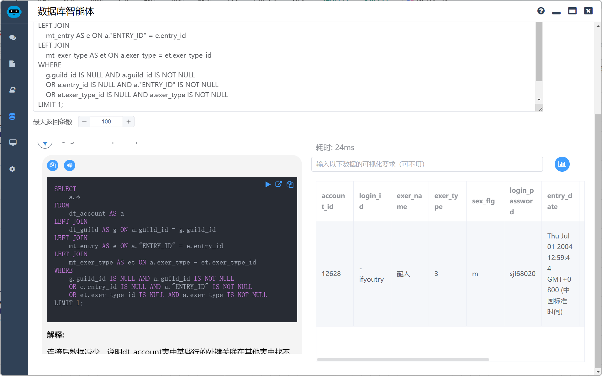

# NL2SQL擂台赛

## 评测简介

NL2SQL核心功能是构建一个基于 AI 的数据库查询助手，它能够理解自然语言的用户查询，并自动生成相应的 SQL 语句进行查询。

个人觉得目前大模型完成NL2SQL的能力都还是蛮强的，甚至用我本地的3050乞丐卡驱动ollama + deepseek-coder-v2就可以干的不错了。这里做一个实验，比较一下各家大模型的NL2SQL能力。

主要原理是：

* 提取数据库结构定义 (DDL)
* 利用向量数据库 (lancedb)和SQLite存储 DDL 信息，并建立混合索引（向量化+全文索引）
* 接收用户以自然语言形式提出的数据库查询请求。
* 通过之前建立的混合索引查询相关的DDL
* 将用户查询和相关的 DDL 语句作为上下文信息，发送给大模型，请求其生成能够满足用户查询需求的 SQL 语句。
*  执行生成的 SQL 语句，并将查询结果以表格形式展示给用户。
* 还可以通过大模型生成数据可视化和优化建议。


## 评测数据简介

这是一个很老的卡牌对战游戏。数据库使用的是PostgreSQL 

* **dt_account**：用户表
* **dt_account_info**：用户的详细信息
* **dt_account_product**：用户的道具
* **dt_guild**：用户所属社团
* **mt_entry**：招募用户的入口
* **mt_exer_type**：用户类型
* **mt_product**：道具
* **mt_skill**：道具的技能


## 评测题目

这里选5道有特色的题目来测试一下，涉及到PostgreSQL的专有函数和数据库常用的JOIN和GROUP BY。

### 数据类型与函数

> ❓题目：显示dt_account的last_login_date是exer_type个月（exer_type作为参数）内的account_id，last_login_date。

这道题要考研大模型对PostgreSQL的时间类型的了解程度

答案是：

```sql
SELECT account_id, to_char(last_login_date, 'YYYY/MM/DD HH24:MI:SS')
FROM dt_account
WHERE last_login_date >= now( ) - CAST( exer_type || ' months' AS INTERVAL ) 
AND last_login_date <= now( ) 
```

> ❓题目：
>
> 选出dt_account中所有login_id含有‘-’字符的数据，将‘-’后面的字符显示出来。
> 注意‘-’字符不一定在第一位，例如339-339，但是一个login_id中只有一个‘-’字符。
> 例如：`-carbon` 显示 为 `carbon` ， `zero-3719` 显示 为 `3719`

这道题要考研大模型对PostgreSQL的字符串函数的了解程度

答案是：

```sql
SELECT substring( login_id FROM position( '-' IN login_id ) +1 FOR char_length( login_id ) - position( '-' IN login_id ) ) 
FROM dt_account
WHERE position( '-' IN login_id ) >0 
```

### 连接与聚合

> ❓题目：
>
> 显示mt_product的所有数据，他关联mt_skill的两个字段skill_id_0,skill_id_1用对应的skill_name表示出来

这题看似简单，但是有一个坑，就是mt_skill需要连接两次，我们需要用别名来应对

答案是：

```sql
SELECT * 
FROM mt_product
LEFT JOIN mt_skill mt_skill0 ON mt_product.skill_id_0 = mt_skill0.skill_id
LEFT JOIN mt_skill mt_skill1 ON mt_product.skill_id_1 = mt_skill1.skill_id
```

> ❓题目：
>
> 计算每一个会员（dt_account)所拥有的商品(mt_product)的总价值(product_price * product_count)。

这题虽然不难，但是是JOIN和GROUP BY的组合应用，也是现实工作中常见的业务统计问题。

```sql
SELECT * 
FROM dt_account
LEFT JOIN (
  SELECT account_id, sum( product_price * dt_account_product.product_count ) 
  FROM dt_account_product
  INNER JOIN mt_product ON dt_account_product.product_id = mt_product.product_id
  GROUP BY dt_account_product.account_id
)dt_account_product_price ON dt_account.account_id = dt_account_product_price.account_id
```

> ❓题目：
>
> 将dt_account与dt_guild、mt_entry和mt_exer_type进行连接后。只能得到299条数据。而dt_account表中一共有300条数据。为什么？找到这条数据。

这题是道应用题，看看大模型解决疑难问题的实战能力

```sql
SELECT * 
FROM dt_account
LEFT JOIN (
  SELECT dt_account.account_id 
  FROM dt_account
  INNER JOIN mt_exer_type ON mt_exer_type.exer_type_id = dt_account.exer_type
  LEFT JOIN dt_guild ON dt_guild.guild_id = dt_account.guild_id
  LEFT JOIN mt_entry ON mt_entry.entry_id = dt_account."ENTRY_ID"
)dt_account_join ON dt_account.account_id = dt_account_join.account_id
WHERE dt_account_join.account_id IS NULL 
```

也可以

```sql
SELECT * 
FROM dt_account
WHERE account_id 
NOT IN (
  SELECT dt_account.account_id
  FROM dt_account
  INNER JOIN mt_exer_type ON mt_exer_type.exer_type_id = dt_account.exer_type
  LEFT JOIN dt_guild ON dt_guild.guild_id = dt_account.guild_id
  LEFT JOIN mt_entry ON mt_entry.entry_id = dt_account."ENTRY_ID"
)
```

## 评测环境

基于开篇介绍的思路，我自己开发了一套软件，叫做Local Agents，里面提供了NL2SQL功能，大家有兴趣可以去[数据库智能体 | Local Agents](https://agents.uue.cn/guide/database-agent.html)详细了解。

这个项目自己用了一段时间，感觉效果还不错（是不是有点王婆卖瓜😄），这里就通过这个软件来评测一下当前各家的大模型的NL2SQL的能力


## 参赛选手

参赛选手基本囊括了国内外主流模型，没选gpt-4o是因为gpt-4o-mini就是我日常的主力模型，我觉得在NL2SQL这件事上gpt-4o-mini已经不错了，至于网传很神的claude 3.5，我没key就没有测试。

* gemini-1.5-pro：免费而强大，我日常的主力模型，没免费额度时换gpt-4o-mini
* gpt-4o-mini：便宜好用，我日常的主力模型
* ERNIE-4.0-8K：国产巨头
* qwen-turbo：国产巨头
* hunyuan-turbo-latest：国产巨头
* moonshot-v1-8k：国产新锐
* deepseek-chat：国产新锐

## 评测

> 首先大家也知道，大模型回答问题有一定随机性，所以我们评测时，如果在3次内，大模型根据SQL查询的反馈信息（比如报错信息）或者追加题词能够最终回答正确就算OK

大家如果想自己试试看，可以去[https://github.com/lgc653/courses](https://github.com/lgc653/courses)的database目录下载原始数据自行验证

### 问题一

这题主要考察时间类型

首先是用我最喜欢的gemini-1.5-pro，轻松搞定（这题由于原始数据日期很老，所以应该检索结果是空），但是有些模型对PostgreSQL的时间类型不是很熟悉，反复调校也无法成功。


我就不每个截图了，直接给出结果

| 模型                 | 结果                               |
| -------------------- | ---------------------------------- |
| gemini-1.5-pro       | 1次成功                            |
| gpt-4o-mini          | 2次成功，根据反馈的SQL错误自行修正 |
| qwen-turbo           | 1次成功                            |
| hunyuan-turbo-latest | 1次成功                            |
| ERNIE-4.0-8K         | 失败                               |
| moonshot-v1-8k       | 失败                               |
| deepseek-chat        | 1次成功                            |

### 问题二

这题考察的是字符串函数，这个各家都比较厉害，相反我最喜欢的Google gemini翻车了，不过他知错能改，提醒了一次搞定了


| 模型                 | 结果                                       |
| -------------------- | ------------------------------------------ |
| gemini-1.5-pro       | 2次成功（第一次带了“-”，经过题词提醒修正） |
| gpt-4o-mini          | 1次成功                                    |
| qwen-turbo           | 1次成功                                    |
| hunyuan-turbo-latest | 1次成功，答案思路还和我的一模一样          |
| ERNIE-4.0-8K         | 1次成功                                    |
| moonshot-v1-8k       | 1次成功，还比较了字符串处理前后的数据      |
| deepseek-chat        | 1次成功                                    |

### 问题三

这个如果是人第一次写可能会踩重复join一个表的坑，但是大模型没一个踩坑的，都是一次性成功


| 模型                 | 结果    |
| -------------------- | ------- |
| gemini-1.5-pro       | 1次成功 |
| gpt-4o-mini          | 1次成功 |
| qwen-turbo           | 1次成功 |
| hunyuan-turbo-latest | 1次成功 |
| ERNIE-4.0-8K         | 1次成功 |
| moonshot-v1-8k       | 1次成功 |
| deepseek-chat        | 1次成功 |

### 问题四

这个是现实工作中常见的统计分析问题，大家也都一次成功了，说明这种统计分析都是各家的强项。

可以看到文心一言做的很对，就是思考过程太啰嗦了（这都是消耗的小钱钱……）


| 模型                 | 结果    |
| -------------------- | ------- |
| gemini-1.5-pro       | 1次成功 |
| gpt-4o-mini          | 1次成功 |
| qwen-turbo           | 1次成功 |
| hunyuan-turbo-latest | 1次成功 |
| ERNIE-4.0-8K         | 1次成功 |
| moonshot-v1-8k       | 1次成功 |
| deepseek-chat        | 1次成功 |

### 问题五

这个我是想一次性给我找出这个因为数据不匹配导致问题的数据。

各家模型基本都是思路正确，但是都是教你多步完成查询后自己去比较，只有Google更换题词后直接命中了异常的数据



| 模型                 | 结果                                 |
| -------------------- | ------------------------------------ |
| gemini-1.5-pro       | 经过多次尝试，更换了题词后成功       |
| gpt-4o-mini          | 思路正确，但需要人多次查询后自行比较 |
| qwen-turbo           | 思路正确，但需要人多次查询后自行比较 |
| hunyuan-turbo-latest | 思路正确，但需要人多次查询后自行比较 |
| ERNIE-4.0-8K         | 思路正确，但需要人多次查询后自行比较 |
| moonshot-v1-8k       | 思路正确，但需要人多次查询后自行比较 |
| deepseek-chat        | 思路正确，但需要人多次查询后自行比较 |

## 总结

NL2SQL其实还是比较靠谱的，但是有以下几点需要注意：

* 数据库的DDL命名的规范和注释完整度直接影响效果

* 使用自然语句也要有一定规范，比如我同事喜欢称呼account表为顾客，我们实际注释写的是用户，导致效果不佳，统一称谓习惯后取得了很好的效果

* 需要使用偏门的函数可能效果不佳

* 因为数据异常导致的问题，想要大模型一次性找到原因很难

  