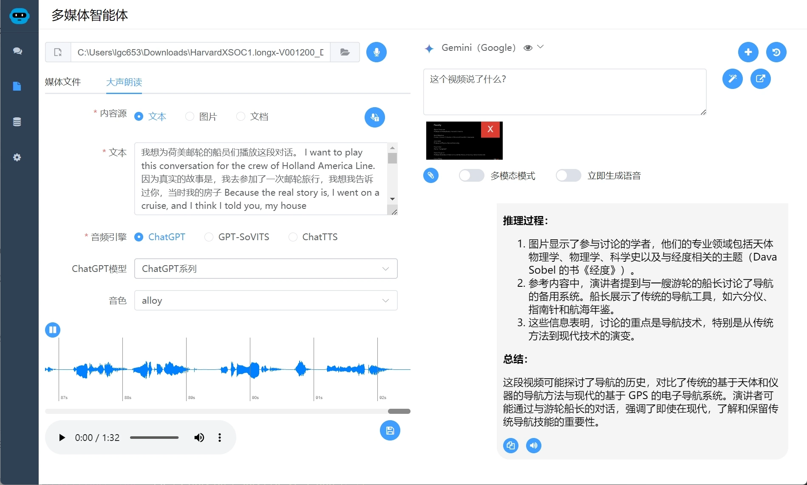
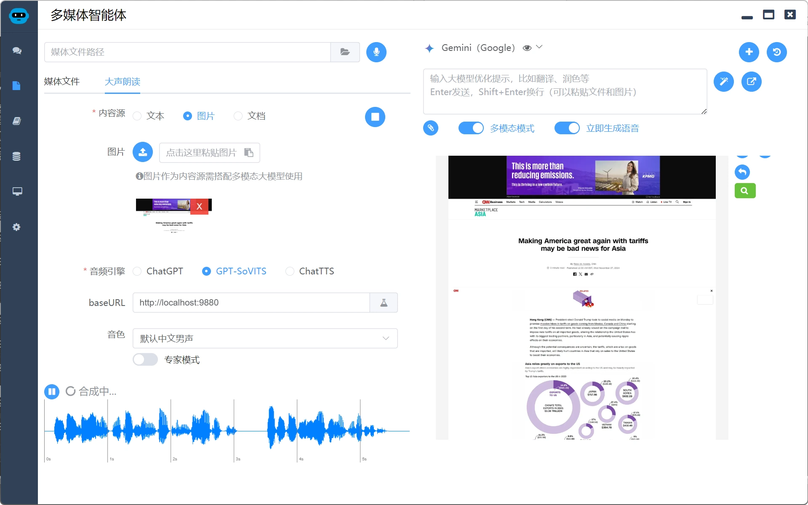
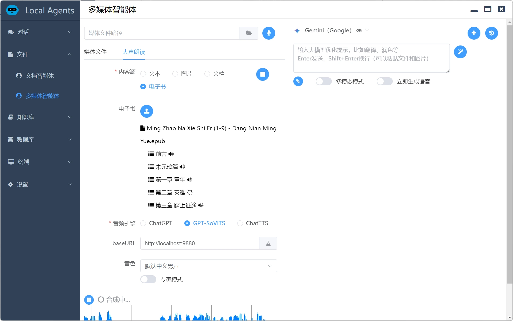

# NotebookLM

## 背景介绍

**NotebookLM原本在AI笔记方面比较平淡，在今年10月推出AI播客功能后大火，用它可以对论文、书籍、故事等转化成AI短音频。**

AI大佬Andrej Karpathy曾称赞NotebookLM“点亮了LLM的新交互范式”。

> 在很多网友看来，**“NotebookLM是一款非常适合学习的AI应用。”**

说白了不就是文档理解+语音合成吗？这有何难。这里实现一个低配版的。

## 技术分析

### 笔记理解

这里首先是笔记的理解，这个比较简单了，首先是文本类型的笔记，是各家大模型的长处，至于各种文档的解析，这里大家可以使用`@langchain/community`，他封装了各种常见文档的解析，如果你不愿意安装它，也可以自行安装各个子解析器，`@langchain/community`其实也就是这些子解析器的封装。

* **docx**：mammoth
* **epub**：epub2
* **pdf**：pdf-parse
* **pptx**：officeparser
* **srt**：srt-parser-2
* **markdown**：markdown-it

至于图片笔记，推荐使用多模态模型进行理解，而不是传统的OCR技术，因为多模态模型可以理解语义（文档的重点）、表格、公式。

而音频、视频笔记，推荐使用ASR（Automatic Speech Recognition）技术进行语音识别，如果不了解可以看我讲解的AI做视频理解的文章

### 内容重写

这个没有任何技术难度了，写好题词，交给大模型去处理，不过题词要注意，语音合成，除了多音字等老大难问题（这个也很难解决），还有一个难点是数字的读法，这个可以在重写时交给大模型解决，这里提供一个题词，大家可以在此基础上优化，也欢迎大家给出自己的优化方案

```
请根据用户要求重新优化内容。
如果目标文字是中文，请遵循以下原则：
把文中的数字按中文习惯替换成中文，包括但不限于日期、时间、数字单位等。例如“2024年”替换为“二零二四年”，“15.7万人”替换为“十五点七万人”；
尽可能把文中不适合TTS识别的符号跟据语义替换为中文，例如“-”替换为“减”，但是不要强行替换；
直接返回优化后的内容，不要任何解释，不要使用Markdown格式。
```

### 语音合成

这里有3个方案

* 一个是**ChatGPT**，这个最简单，自己调用ChatGPT的generate_voice接口即可，但是费用不是很便宜，1千字费用在1毛钱左右，这个没有什么难点和要点
* 另一个方案是**GPT-SoVITS**：[可以去bilibili听听效果](https://www.bilibili.com/video/BV12g4y1m7Uw/)。由于GPT-SoVITS提供了整合包，所以配置过程也很方便。对机器配置要求非常低（我的3050流畅运行），支持自动分句和stream调用，是我个人最推荐的。如果你喜欢折腾，他也支持克隆语音等让你折腾的功能。唯一麻烦的是要提供一个初始的语音样本。
* 最后一个方案是**ChatTTS** ：[可以去chattts.com听听效果](https://chattts.com/)。个人觉得不错，爱折腾的人的选择，其实如果你是技术控的话应该很简单。对机器配置要求高一些，不支持自动分句和stream，这些都需要你自己的处理。优势是语音自然，更有播客的效果。

当然现在语音合成方案百花齐放，比如原来一直可以白嫖的edge的TTS服务（现在被微软针对了），阿里等巨头也在这块陆续发力，大家可以持续关注。

### 多人配音

这个其实也不难，只不过把之前的3样技术组合起来做的更细致一些，这个我个人就没有尝试了，给大家推荐一款做的不错的工具：[视频翻译软件pyVideoTrans-开源免费的视频翻译配音软件](https://pyvideotrans.com/)，也是我学语音技术的启蒙，在此感谢一下作者大佬。

## 代码实现

代码实现其实没有什么难点

对于使用ChatGPT来说，就是自己调用API，也没有什么参数可以调整

对于使用GPT-SoVITS来说，也是调用API，不过其API很丝滑，可以方便的提供类似听书一样的功能

对于使用ChatTTS来说，分句这些都要你自己来说，相对难度大一些，但是分句这些也不是很难，无外乎遇到标点就断句

### baseClient

```javascript
class BaseClient {
  constructor(options) {
    this.options = options
    this.audioContext = new (window.AudioContext || window.webkitAudioContext)()
    this.isPlaying = false
    this.isPaused = false
    this.bufferQueue = []
    this.audioChunks = []
    this.currentSource = null // 用于存储当前播放的音频源
  }

  getFetchParams(inputText) {
    throw new Error('Method not implemented')
  }

  // 播放队列中的下一个音频
  playNextAudio() {
    if (this.bufferQueue.length === 0 || this.isPaused) return // 检查 isPaused 变量
    const audioBuffer = this.bufferQueue.shift()
    const source = this.audioContext.createBufferSource()
    this.currentSource = source // 保存当前音频源
    source.buffer = audioBuffer
    source.connect(this.audioContext.destination)

    source.onended = () => {
      this.isPlaying = false
      this.currentSource = null // 清空当前音频源
      this.playNextAudio()
    }

    source.start()
    this.isPlaying = true
  }

  async speech(inputText, onMessage, onComplete, onError, timeout = 60000 * 5) {
    this.isPlaying = false
    this.isPaused = false
    this.bufferQueue = []
    this.audioChunks = []
    this.currentSource = null // 初始化
    const { url, query, headers } = this.getFetchParams(inputText)
    this.abortController = new AbortController()
    const signal = this.abortController.signal

    const timeoutId = setTimeout(() => {
      this.abort()
    }, timeout)

    fetch(url, {
      method: 'POST',
      headers: headers,
      body: JSON.stringify(query),
      signal
    })
      .then(response => {
        clearTimeout(timeoutId)
        if (!response.ok) {
          return response.text().then(errorText => {
            throw new Error(`Error: ${response.status} - ${errorText}`)
          })
        }
        const reader = response.body.getReader()
        const readStream = () => {
          reader.read().then(({ done, value }) => {
            if (done) {
              if (onComplete) {
                // 把音频数据保存到文件
                window.electron.ipcRenderer.send('save-audio', this.audioChunks.map(chunk => Array.from(chunk)), this.options.format)
                window.electron.ipcRenderer.once('save-audio-return', (event, res) => {
                  onComplete(res)
                })
              }
              return
            }
            this.audioChunks.push(Array.from(value))
            this.audioContext.decodeAudioData(
              value.buffer,
              (audioBuffer) => {
                this.bufferQueue.push(audioBuffer)
                if (!this.isPlaying) {
                  this.playNextAudio()
                }
                onMessage(audioBuffer)
              },
              (error) => {
                console.error('Error decoding audio data:', error)
              }
            )

            readStream()
          })
        }

        readStream()
      })
      .catch(error => {
        if (error.name === 'AbortError') {
          onError(new Error('Request timed out or aborted'))
        } else {
          onError(error)
        }
      })
  }

  // 暂停播放
  pause() {
    if (this.isPlaying && this.currentSource) {
      this.currentSource.stop()
      this.isPlaying = false
      this.isPaused = true // 设置 isPaused 为 true
    }
  }

  // 继续播放
  resume() {
    if (!this.isPlaying && this.bufferQueue.length > 0) {
      this.isPaused = false // 设置 isPaused 为 false
      this.playNextAudio()
    }
  }

  abort() {
    try {
      if (this.abortController) {
        this.abortController.abort()
        this.abortController = null
      }
      // 终止播放
      if (this.isPlaying && this.currentSource) {
        this.currentSource.stop()
        this.isPlaying = false
        this.currentSource = null
      }

      // 清空变量
      this.bufferQueue = []
      this.audioChunks = []
      this.isPaused = false // 重置 isPaused
    } catch (error) {
      console.error('Error aborting stream:', error)
    }
  }
}

export default BaseClient

```

### gptSovitsClient

```javascript
import { franc } from 'franc'
import BaseClient from './baseClient'
class GPTSovitsClient extends BaseClient {
  getFetchParams(inputText) {
    const langMap = {
      'eng': 'en',
      'cmn': 'zh',
      'jpn': 'ja',
      'kor': 'ko'
    }
    const textLang = langMap[franc(inputText)] || 'zh'
    const url = `${this.options.baseURL}/tts`
    const query = {
      text: inputText,
      text_lang: textLang,
      ref_audio_path: this.options.refAudio,
      prompt_lang: this.options.refAudioLang,
      prompt_text: this.options.refAudioText,
      text_split_method: 'cut5',
      batch_size: 1,
      media_type: this.options.format,
      speed_factor: this.options.speedFactor,
      streaming_mode: true
    }
    const headers = { 'Content-Type': 'application/json' }
    return { url, query, headers }
  }
}

export default GPTSovitsClient

```

### openAIClient

```javascript
import BaseClient from './baseClient'
class OpenAIClient extends BaseClient {
  getFetchParams(inputText) {
    const url = this.options.baseURL + '/audio/speech'
    const query = {
      model: 'tts-1',
      input: inputText,
      voice: this.options.voice || 'alloy',
      response_format: this.options.format,
      speed: 1
    }
    const headers = {
      Authorization: `Bearer ${this.options.apiKey}`,
      'Content-Type': 'application/json'
    }
    return { url, query, headers }
  }
}

export default OpenAIClient
```

ChatTTS的实现比较啰嗦，就暂时不展示了

## 效果展示

把语音识别翻译后的文本内容转为播客



太长不想看，长图片一键转换成播客。



现在微信读书不能听本地书了，这里自己实现的epub的听书功能。



