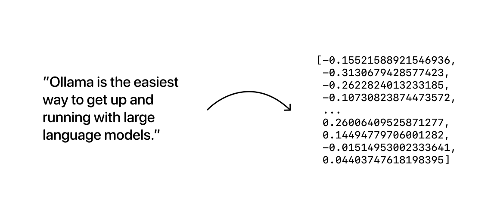
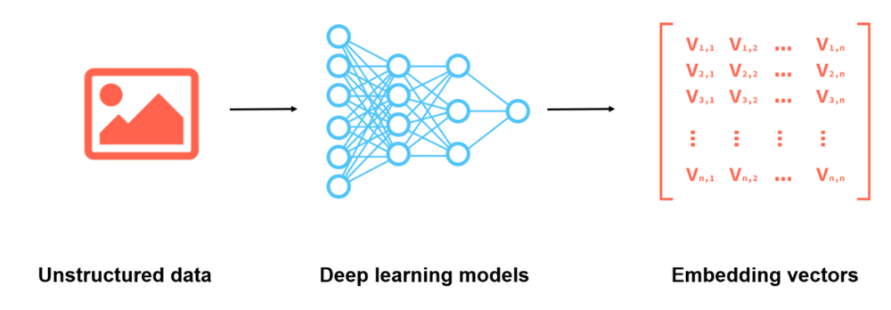
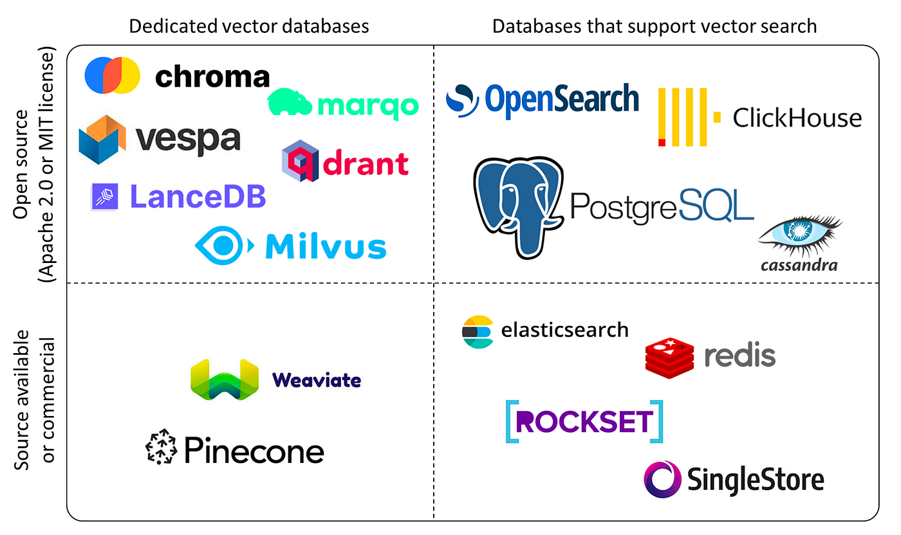
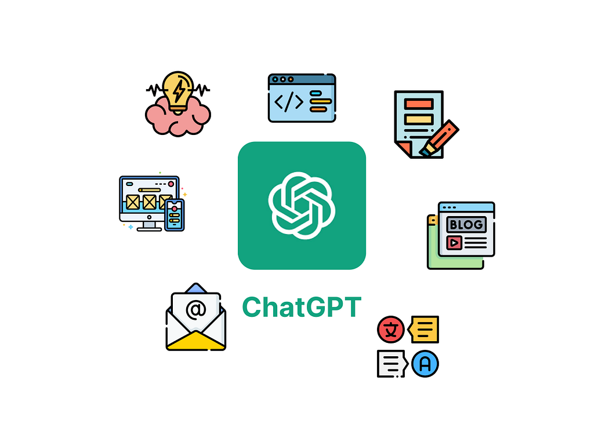
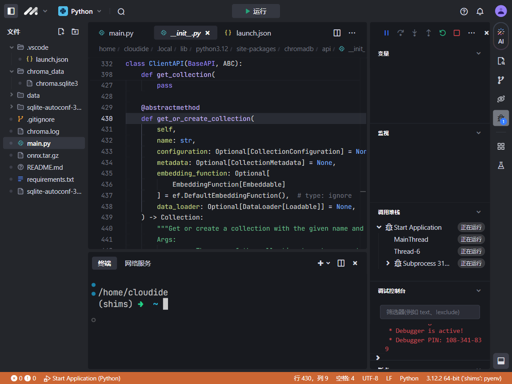
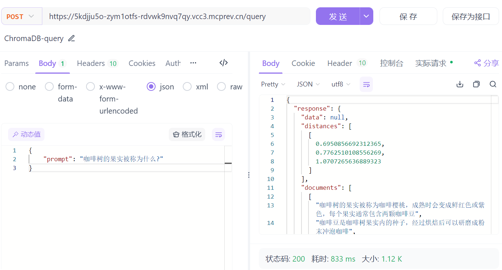

# RAG

## RAG简介

**RAG** (Retrieval Augmented Generation) 是一种将**信息检索**与**文本生成**相结合的技术，它正在成为工作和学习中的强大助理。


**工作原理：**

1. **检索 (Retrieval):** 当你提出一个问题或请求时，RAG 首先会从大量的外部知识库（例如维基百科、公司文档、代码库等）中检索相关的文档或片段。
2. **增强 (Augmentation):** 检索到的信息会被用来增强语言模型的上下文，使其能够更好地理解你的需求。
3. **生成 (Generation):** 最后，语言模型利用检索到的信息和自身的知识，生成更准确、更全面的答案、总结、翻译、代码等。

**优势：**

* **更准确的答案:** RAG 可以访问外部知识库，从而提供比仅依赖自身参数的语言模型更准确、更可靠的答案。
* **更全面的信息:** RAG 可以整合多个来源的信息，提供更全面的视角和更深入的理解。
* **更强的适应性:** RAG 可以根据不同的任务和领域选择不同的知识库，从而更好地适应各种应用场景。
* **减少幻觉:** 通过 grounding 生成的文本到检索到的信息，RAG 可以减少语言模型产生幻觉（即编造事实）的可能性。

**应用场景：**

* **问答系统:**  提供更准确、更全面的答案，例如客服机器人、知识库搜索。
* **文本摘要:**  生成更准确、更简洁的摘要，例如新闻摘要、论文摘要。
* **代码生成:**  根据自然语言描述生成代码，例如代码补全、代码生成工具。
* **翻译:**  提供更准确、更流畅的翻译，例如机器翻译系统。
* **教育:**  提供个性化的学习资源和辅导，例如智能辅导系统、学习助手。

## RAG 应用流程

完整的 RAG 应用流程主要包含两个阶段：

### 数据准备阶段


1. **数据提取:** 从各种数据源（例如网页、文档、数据库等）提取需要用于 RAG 系统的文本数据。
2. **分块:** 将提取的文本数据分割成更小的块（例如段落、句子等），以便于后续的向量化和检索。
3. **向量化:** 使用嵌入模型将每个文本块转换为向量表示，捕捉其语义信息。
4. **数据入库:** 将文本块的向量表示存储到向量数据库中，以便于快速检索。

### 检索生成阶段


1. **问题向量化:** 将用户提出的问题转换为向量表示。
2. **根据问题查询匹配数据:** 使用问题向量在向量数据库中进行相似性搜索，找到与问题最相关的文本块。
3. **获取索引数据:** 获取与问题相关的文本块的索引信息，例如文本块的来源、位置等。
4. **将数据注入 Prompt:** 将检索到的相关文本块作为上下文信息，注入到 Prompt 中，提供给 LLM。
5. **LLM 生成答案:** LLM 根据 Prompt 中的问题和上下文信息，生成最终的答案。

## RAG 系统核心技术

### 嵌入模型 (Embedding Models)

嵌入模型是通过训练生成向量嵌入，这是一长串数字数组，代表文本序列的关联关系。



除了文本，类似图片之类的非结构化数据也能通过模型向量化，比如我们常见的人脸识别系统。



* **作用:**  将文本（例如文档、查询、代码等）转换为稠密的向量表示，称为嵌入向量。这些向量捕捉了文本的语义信息，使得语义相似的文本在向量空间中彼此靠近。
* **工作原理:** 嵌入模型通常基于深度学习技术，例如神经网络。它们通过学习大量的文本数据，将每个单词或短语映射到一个固定维度的向量空间中。在这个空间中，语义相似的单词或短语的向量距离会更近。
* **在 RAG 中的应用:**
    * 将文档和查询转换为嵌入向量，以便于后续的相似度计算和检索。

### 向量数据库 (Vector Databases)



* **作用:** 专门用于存储和检索高维向量，例如文本嵌入向量。它们能够高效地执行相似性搜索，即找到与给定查询向量最相似的向量。
* **工作原理:** 向量数据库使用 specialized 的索引结构和算法来存储和检索向量。这些索引结构能够快速地找到与查询向量距离最近的向量，从而实现高效的相似性搜索。
* **在 RAG 中的应用:**
    * 存储文档的嵌入向量，以便于快速检索。
    * 根据查询向量，快速检索与之最相似的文档向量，从而找到相关文档。

### 生成模型 (Generation Models)




* **作用:**  根据输入的文本或信息，生成新的文本内容，例如答案、摘要、翻译、代码等。
* **工作原理:** 生成模型通常基于深度学习技术，例如循环神经网络 (RNN) 或 Transformer。它们通过学习大量的文本数据，掌握语言的语法和语义规则，从而能够生成流畅、连贯的文本。
* **在 RAG 中的应用:**
    * 根据检索到的相关文档和查询，生成最终的答案或文本内容。

### 其他技术

#### 文本预处理 (Text Preprocessing)

* **作用:**  对文本进行清洗、分词、去除停用词等操作，以便于后续的嵌入和检索。
* **常见操作:**
    * **分词 (Tokenization):** 将文本分割成单词或子词单元。
    * **去除停用词 (Stop Word Removal):** 去除一些常见的、对语义贡献较小的词语，例如 "the", "a", "is" 等。
    * **词干提取 (Stemming) / 词形还原 (Lemmatization):** 将单词的不同形态转换为其基本形式，例如 "running" -> "run"。
    * **大小写转换 (Lowercasing):** 将所有字母转换为小写。
* **在 RAG 中的应用:**
    * 对文档和查询进行预处理，提高嵌入和检索的效率和准确性。

#### 相似度度量 (Similarity Metrics)

* **作用:**  用于计算查询向量和文档向量之间的相似度，从而判断文档与查询的相关程度。
* **常见度量方法:**
    * **余弦相似度 (Cosine Similarity):**  计算两个向量之间夹角的余弦值，值越大表示相似度越高。
    * **点积 (Dot Product):**  计算两个向量的点积，值越大表示相似度越高。
    * **欧氏距离 (Euclidean Distance):**  计算两个向量之间的欧氏距离，值越小表示相似度越高。
* **在 RAG 中的应用:**
    * 用于检索与查询最相关的文档。

#### 重排序 (Reranking)

* **作用:**  对检索到的文档进行重新排序，以进一步提高检索结果的准确性。
* **常见方法:**
    * **交叉编码器 (Cross-Encoder):**  将查询和文档一起输入到一个编码器模型中，计算它们之间的相关性得分，用于排序。
* **在 RAG 中的应用:**
    * 对初始检索结果进行精细化排序，将最相关的文档排在前面。

### 技术选型

下面我们通过两个例子来讲解RAG应用的开发，我们选择：

* **Embedding Models**：chromadb 内置的 all-MiniLM-L6-v2 或者 Ollama + mxbai-embed-large
* **Vector Databases**：chromadb 
* **Generation Models**： Ollama + qwen2.5:7b

> 这样的选择主要是因为安装的软件较少，对机器配置要求低。极简模式仅需安装`chromadb`（使用API和生成模型对话），至多也只需安装`chromadb + Ollama`即可。

## chromadb + Ollama 实现RAG应用

Chroma的目标是帮助用户更加便捷地构建大模型应用，更加轻松的将知识（knowledge）、事实（facts）和技能（skills）等我们现实世界中的文档整合进大模型中。

Chroma提供的工具：

- 存储文档数据和它们的元数据：store embeddings and their metadata
- 嵌入：embed documents and queries
- 搜索： search embeddings

[🧪 Usage Guide | Chroma Docs (trychroma.com)](https://docs.trychroma.com/guides)

Chroma目前提供了Python和Javascript的SDK，建议使用Python开发。

### 安装环境

Ollama安装很简单，官网[Ollama](https://ollama.com/)下载后直接安装就行了。

> 当然我们也可以直接选取其它大模型的API，而不使用Ollama.

```sh
# 如不使用ollama可以只安装chromadb
pip install ollama chromadb
```

chromadb内置了all-MiniLM-L6-v2作为嵌入模型，首次运行会下载。默认存放在`C:\Users\{用户名}\.cache\chroma\onnx_models\`

### 开发过程

#### 生成embeddings

```python
import ollama
import chromadb

# 文档定义
documents = [
    "咖啡树是一种茜草科的常绿灌木或小乔木，原产于非洲的埃塞俄比亚和苏丹",
    "咖啡树的果实被称为咖啡樱桃，成熟时会变成鲜红色或紫色，每个果实通常包含两颗咖啡豆",
    "咖啡豆是咖啡树果实内的种子，经过烘焙后可以研磨成粉末冲泡咖啡",
    "阿拉比卡咖啡和罗布斯塔咖啡是两种主要的咖啡品种，阿拉比卡咖啡口感更佳，而罗布斯塔咖啡咖啡因含量更高",
    "咖啡种植需要温暖的气候和充足的降雨，咖啡树通常生长在海拔1000米到2000米的山区",
    "咖啡是世界上最受欢迎的饮料之一，具有提神醒脑的作用，并且富含抗氧化剂",
]

client = chromadb.Client()
collection = client.create_collection(name="docs")

# 将每个文档存储在向量嵌入数据库中
for i, d in enumerate(documents):
    collection.upsert(documents=d, ids=[str(i)])
```

在添加documents的时候，我们也可以补充metadatas为后续提供更多可用数据。例如：

```python
collection.add(
    embeddings=[[1.1, 2.3, 3.2], [4.5, 6.9, 4.4], [1.1, 2.3, 3.2], ...],
    metadatas=[{"chapter": "3", "verse": "16"}, {"chapter": "3", "verse": "5"}, {"chapter": "29", "verse": "11"}, ...],
    ids=["id1", "id2", "id3", ...]
)
```

#### 检索prompt的相关信息

```python
# 一个示例提示
prompt = "咖啡树的果实被称为什么？"

results = collection.query(
    query_texts=[prompt],
    n_results=3,
)
print(results)
```

这里返回的results格式是：

```json
{'ids': [['1', '2', '5']], 'distances': [[0.7086873054504395, 0.7665070295333862, 1.0334540605545044]], 'metadatas': [[None, None, None]], 'embeddings': None, 'documents': [['咖啡树的果实被称为咖啡樱桃，成熟时会变成鲜红色或紫色，每个果实通常包含两颗咖啡豆', '咖啡豆是咖啡树果实内的种子，经过烘焙后可以 研磨成粉末冲泡咖啡', '咖啡是世界上最受欢迎的饮料之一，具有提神醒脑的作用，并且富含抗氧化剂']], 'uris': None, 'data': None, 'included': ['metadatas', 'documents', 'distances']}
```

其中distances是近似度，我们可以根据这个来判断相关性，在 ChromaDB 中，**distances 值越小**，代表相似度越高。

> 现实使用过程中相似性查询不是特别准确，我们一般会和全文索引结果结合起来一起评估。

#### AI对话

把检索出来的相关性数据作为prompt的一部分提供给AI进行对话，输出数据，我这里用的是`qwen2.5:7b`，当然，这里不一定使用ollama，你可以使用其它任意大模型API

```python
data = results["documents"][0][0]
# 这里不一定使用ollama，你可以使用其它任意大模型API，替换以下代码即可
output = ollama.generate(
    model="qwen2.5:7b",
    prompt=f"根据这段文字：{data}。回答这个问题：{prompt}",
)

print(output["response"])
```

得到的返回内容

```sh
咖啡树的果实被称为咖啡樱桃。
```

#### 封装成REST API

chromadb默认内存存储，这里把它改成持久化存储

```sh
# 初始化 ChromaDB 客户端和集合
client = chromadb.PersistentClient(path="./data/chromadb_data")
collection = client.get_or_create_collection(name="docs")
```

使用Flask封装

```python
from flask import Flask, request, jsonify
import ollama
import chromadb

app = Flask(__name__)

# 初始化 ChromaDB 客户端和集合
client = chromadb.PersistentClient(path="./data/chromadb_data")
collection = client.get_or_create_collection(name="docs")


@app.route("/add_document", methods=["POST"])
def add_document():
    # 从请求中获取文档
    data = request.json
    documents = data.get("documents", [])

    # 将每个文档存储在向量嵌入数据库中
    for i, d in enumerate(documents):
        collection.upsert(documents=d, ids=[str(i)])

    return jsonify({"message": "Documents added successfully!"}), 201


@app.route("/query", methods=["POST"])
def query():
    # 从请求中获取提示
    data = request.json
    prompt = data.get("prompt", "")

    # 查询 ChromaDB
    results = collection.query(
        query_texts=[prompt],
        n_results=3,
    )

    # 获取查询结果中的第一个文档
    if results["documents"]:
        data = results["documents"][0][0]
        output = ollama.generate(
            model="qwen2.5:7b",
            prompt=f"根据这段文字：{data}。回答这个问题：{prompt}",
        )
        return jsonify({"response": output["response"]}), 200
    else:
        return jsonify({"message": "No documents found."}), 404


if __name__ == "__main__":
    app.run(debug=True)
```

使用curl测试add_document

```sh
curl -X POST http://127.0.0.1:5000/add_document \
-H "Content-Type: application/json;" \
-d '{
    "documents": [
        "咖啡树是一种茜草科的常绿灌木或小乔木，原产于非洲的埃塞俄比亚和苏丹",
        "咖啡树的果实被称为咖啡樱桃，成熟时会变成鲜红色或紫色，每个果实通常包含两颗咖啡豆",
        "咖啡豆是咖啡树果实内的种子，经过烘焙后可以研磨成粉末冲泡咖啡",
        "阿拉比卡咖啡和罗布斯塔咖啡是两种主要的咖啡品种，阿拉比卡咖啡口感更佳，而罗布斯塔咖啡咖啡因含量更高",
        "咖啡种植需要温暖的气候和充足的降雨，咖啡树通常生长在海拔1000米到2000米的山区",
        "咖啡是世界上最受欢迎的饮料之一，具有提神醒脑的作用，并且富含抗氧化剂"
    ]
}'
```

获得响应

```json
{
  "message": "Documents added successfully!"
}
```

使用curl测试query

```sh
curl -X POST http://127.0.0.1:5000/query \
-H "Content-Type: application/json" \
-d '{
    "prompt": "咖啡树的果实被称为什么？"
}'
```

获得响应

```json
{
  "response": "咖啡树的果实被称为咖啡樱桃。"
}
```

> 当然，我们可以吧query中的AI对话去掉，仅返回相似性的检索结果，这样将更加灵活

### MarsCode IDE

我们也可以在MarsCode IDE中运行，这里我只使用了chromadb。

代码修改了一下，`/query`直接返回向量结果，没有结合大模型

> 注意需要创建对应的目录，比如我这里需要创建data目录存储chromadb_data

```python
from flask import Flask, request, jsonify
import ollama
import chromadb

app = Flask(__name__)

# 初始化 ChromaDB 客户端和集合
client = chromadb.PersistentClient(path="./data/chromadb_data")
collection = client.get_or_create_collection(name="docs")


@app.route("/add_document", methods=["POST"])
def add_document():
    # 从请求中获取文档
    data = request.json
    documents = data.get("documents", [])

    # 将每个文档存储在向量嵌入数据库中
    for i, d in enumerate(documents):
        collection.upsert(documents=d, ids=[str(i)])

    return jsonify({"message": "Documents added successfully!"}), 201


@app.route("/query", methods=["POST"])
def query():
    # 从请求中获取提示
    data = request.json
    prompt = data.get("prompt", "")

    # 查询 ChromaDB
    results = collection.query(
        query_texts=[prompt],
        n_results=3,
    )

    # 获取查询结果中的第一个文档
    if results["documents"]:
        return jsonify({"response": results}), 200
    else:
        return jsonify({"message": "No documents found."}), 404


if __name__ == "__main__":
    app.run(debug=True)
```

运行时会提示（当然随着MarsCode IDE版本不断升级，可能就不会报这个问题了）

> RuntimeError: Your system has an unsupported version of sqlite3. Chroma                     requires sqlite3 >= 3.35.0.

我们升级sqlite3

```sh
wget https://www.sqlite.org/2024/sqlite-autoconf-3460100.tar.gz
tar -xvf sqlite-autoconf-3460100.tar.gz
cd sqlite-autoconf-3460100.tar.gz
./configure --enable-all
make
sudo make install
./sqlite3 --version                                            
3.46.1 2024-08-13 09:16:08 c9c2ab54ba1f5f46360f1b4f35d849cd3f080e6fc2b6c60e91b16c63f69a1e33 (64-bit)
```

但是测试还是显示老版本

```
python -c "import sqlite3; print(sqlite3.sqlite_version)"

3.34.1
```

修改启动指令，其实也就是在最开始加了`export LD_LIBRARY_PATH=/usr/local/lib;`

```sh
# 原来的指令
COMMAND="export PYTHONPATH="/cloudide/workspace/.cloudide/extensions/ms-python.debugpy-2024.0.0-linux-x64/bundled/libs:$PYTHONPATH"; python3 main.py" marscode-dev
# 修改为
COMMAND="export LD_LIBRARY_PATH=/usr/local/lib; export PYTHONPATH="/cloudide/workspace/.cloudide/extensions/ms-python.debugpy-2024.0.0-linux-x64/bundled/libs:$PYTHONPATH"; python3 main.py" marscode-dev
```

如果不想修改启动指令，想点击IDE的运行或者调试也能运行成功的话，可以修改`.vscode/launch.json`，在 launch.json 文件中，每个调试配置 (configuration) 都有一个 env 属性，你可以用它来设置环境变量。

```json
{
    // Use IntelliSense to learn about possible attributes.
    // Hover to view descriptions of existing attributes.
    // For more information, visit: https://go.microsoft.com/fwlink/?linkid=830387
    "version": "0.2.0",
    "configurations": [
        {
            "name": "Start Application",
            "type": "debugpy",
            "request": "launch",
            "program": "main.py",
            "console": "internalConsole",
            "justMyCode": true,
            "env": {
                "LD_LIBRARY_PATH": "/usr/local/lib"
            }
        }
    ]
}
```



运行成功，但是首次运行需要下载all-MiniLM-L6-v2很慢，耐心等待或者采用以下方案

```sh
# 直接下载拷贝到目标目录，当然也很慢
mkdir -p ~/.cache/chroma/onnx_models/all-MiniLM-L6-v2 && \
wget -O ~/.cache/chroma/onnx_models/all-MiniLM-L6-v2/onnx.tar.gz https://chroma-onnx-models.s3.amazonaws.com/all-MiniLM-L6-v2/onnx.tar.gz && \
tar -xzf ~/.cache/chroma/onnx_models/all-MiniLM-L6-v2/onnx.tar.gz -C ~/.cache/chroma/onnx_models/all-MiniLM-L6-v2/
```

终于成功了……



## chromadb + Ollama + 嵌入模型实现RAG应用

all-MiniLM-L6-v2模型非常小，而Ollama支持embedding models嵌入模型，可以有更多选择。

Ollama的嵌入模型有三种：mxbai-embed-large、nomic-embed-text 、all-minilm。具体可以查看：[Embedding models · Ollama Blog](https://ollama.com/blog/embedding-models)

> 注意如果上面使用的all-MiniLM-L6-v2时创建的collection，这里使用mxbai-embed-large会不兼容，提示：`chromadb.errors.InvalidDimensionException: Embedding dimension 1024 does not match collection dimensionality 384`，重建collection即可

### 安装环境

ollama安装很简单，官网[Ollama](https://ollama.com/)下载后直接安装就行了。安装完成后下载mxbai-embed-large

```sh
ollama pull mxbai-embed-large
```

先用REST API测试一下

```sh
curl http://localhost:11434/api/embeddings -d '{
  "model": "mxbai-embed-large",
  "prompt": "Ollama支持embedding models嵌入模型，从而支持RAG（retrieval augmented generation）应用，结合文本提示词，检索到文档或相关数据。嵌入模型是通过训练生成向量嵌入，这是一长串数字数组，代表文本序列的关联关系。"
}'
```

```json
{"embedding":[-0.10860875248908997,0.3863958716392517,0.11467033624649048,'略……']}
```

mxbai-embed-large并没有专门针对中文语料进行训练，我们还可以选择一些其它的基于中文语料训练的模型（虽然不是官方发布的），对中文的效果比mxbai-embed-large要好，个人测试感觉`bge-large-zh:v1.5`效果好一些（基于文本向量检索比较难说）。

```sh
# BGE Embedding
ollama pull dztech/bge-large-zh:v1.5 
# Moka-AI Massive Mixed Embedding
ollama pull milkey/m3e
```

### 开发过程

#### 生成embeddings

首先安装相关的包

```
pip install ollama chromadb
```

创建文件：example.py：这里是使用`ollama+mxbai-embed-large`把`documents`生成向量嵌入并写入向量库`chromadb`

> 这里和直接使用chromadb不同，我们是通过mxbai-embed-large进行向量化后，把向量化结果直接写入chromadb

```py
import ollama
import chromadb

documents = [
    "咖啡树是一种茜草科的常绿灌木或小乔木，原产于非洲的埃塞俄比亚和苏丹",
    "咖啡树的果实被称为咖啡樱桃，成熟时会变成鲜红色或紫色，每个果实通常包含两颗咖啡豆",
    "咖啡豆是咖啡树果实内的种子，经过烘焙后可以研磨成粉末冲泡咖啡",
    "阿拉比卡咖啡和罗布斯塔咖啡是两种主要的咖啡品种，阿拉比卡咖啡口感更佳，而罗布斯塔咖啡咖啡因含量更高",
    "咖啡种植需要温暖的气候和充足的降雨，咖啡树通常生长在海拔1000米到2000米的山区",
    "咖啡是世界上最受欢迎的饮料之一，具有提神醒脑的作用，并且富含抗氧化剂",
]

client = chromadb.Client()
collection = client.create_collection(name="docs")

# 将每个文档存储在向量嵌入数据库中
for i, d in enumerate(documents):
    response = ollama.embeddings(model="mxbai-embed-large", prompt=d)
    embedding = response["embedding"]
    collection.add(ids=[str(i)], embeddings=[embedding], documents=[d])
```

#### 检索prompt的相关信息

根据用户输入的prompt，将其向量化，然后在chromadb中查找相关性

> 这里和直接使用chromadb不同，我们是把prompt通过mxbai-embed-large进行向量化后再到chromadb查询

```python
# 一个示例提示
prompt = "咖啡树的果实被称为什么？"

# 为提示生成一个嵌入并检索最相关的文档。
response = ollama.embeddings(prompt=prompt, model="mxbai-embed-large")
results = collection.query(query_embeddings=[response["embedding"]], n_results=3)
print(results)
```

这里返回的results格式是：

```json
{'ids': [['1', '2', '3']], 'distances': [[309.55010986328125, 331.3553466796875, 337.376953125]], 'metadatas': [[None, None, None]], 'embeddings': None, 'documents': [['咖啡树的果实被称为咖啡樱桃，成熟时会变成鲜红色或紫色，每个果实通常包含两颗咖啡豆', '咖啡豆是咖啡树果实内的种子，经过烘焙后可以研磨成 粉末冲泡咖啡', '阿拉比卡咖啡和罗布斯塔咖啡是两种主要的咖啡品种，阿拉比卡咖啡口感更佳，而罗布斯塔咖啡咖啡因含量更高']], 'uris': None, 'data': None, 'included': ['metadatas', 'documents', 'distances']}
```

#### AI对话

把检索出来的相关性数据作为prompt的一部分提供给AI进行对话，输出数据，我这里用的是`qwen2.5:7b`，当然，这里不一定使用ollama，你可以使用其它任意大模型接口

```python
# 拼接所有相关性数据 
data = "\n".join(results["documents"][0])
# 这里不一定使用ollama，你可以使用其它任意大模型API，替换以下代码即可
output = ollama.generate(
    model="qwen2.5:7b",
    prompt=f"根据这段文字：{data}。回答这个问题：{prompt}",
)

print(output["response"])
```

得到的返回内容

```
咖啡树的果实被称为咖啡樱桃。
```

> 当然还有解决方案是用SentenceTransformers或者LangChain，对于做一个demo来说个人觉得比较繁琐或者臃肿，如果要做的更加专业，可能需要他们的帮助。

## 其它参考

当然，这个只是一个简单的例子，可能不是很专业，如果一个文件的文本内容很大，无法适应许多模型的上下文窗口，也不利于检索和存储。因此，通常我们会将文本内容分割成更小的块，这将帮助我们在运行时只检索文档中最相关的部分。

具体可以参考：[使用 Easysearch 打造企业内部知识问答系统_easysearch_极限实验室_InfoQ写作社区](https://xie.infoq.cn/article/93cc077765af3d785485a9070)