# 使用RAG学习HarmonyOS

## 背景介绍

随着微信HarmonyOS版本的发布，HarmonyOS已经构筑了自己的基本版图，未来在信创领域也将大有所为，而目前熟悉HarmonyOS的开发者还比较少，网上相关的资料也比较落后，导致搜索引擎和AI大模型的检索、对话质量都不高。

那么遇到了疑难问题，我们除了查询API文档，是否还有更加便捷一些的办法呢，这里我使用了RAG技术，根据网络公开分享的HarmonyOS文档以及[OpenHarmony](https://gitee.com/openharmony)代码仓库制作了HarmonyOS的资料库。

为了应对向量检索命中率并不优秀的弱点，这里加入了全文索引和一些自定义的RANK规则组成混合索引，实际应用中效果还是非常不错。在日常开发和学习HarmonyOS时都有不错的效果。

## 技术方案

现在的RAG技术大多基于云平台，部署比较麻烦，运行也比较消耗资源，我这里采用的轻量级的方案：

* 界面使用electron开发，所有技术栈基于nodejs，最终成品一键安装。
* 基于本地文件目录做索引，方便快捷，文件管理轻松自如
* 使用langchain做document_loaders，并自己根据不同文件类型开发了分块函数
* 使用lancedb做本地向量库，无需任何第三方依赖
* 使用transformers.js做embedding，当然也支持调用大模型的embedding API
* 使用sqlite3做全文索引
* 使用jieba进行分词，根据词性和权重进行关键词过滤重排
* 使用大模型API进行对话

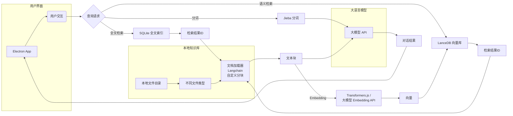

实际使用过程中，这套方案部署简单（一键本地安装），查询质量也并不比大型RAG系统差，当然主要是以下几个原因

* 向量查询+全文索引能够起到很好的组合作用，通过配置参数可以让两者起到很好的互补，比如使用“**全文索引+jieba分词的词性或权重过滤+选用AND还是OR的逻辑**”的简单配置，可以大幅提升知识库命中率
* 自定义的rerank规则，虽然不及现在的rerank模型先进，但是简单有效
* 根据不同文件类型的特点，自定义了分块函数，比如markdown优先按照标题分割，然后再进一步分块，这样比无脑按token大小分块更加能保持上下文的完整性

## 产品实现

### 新建知识库

我这里自己做了一个示例，大家可以下载看看效果。

下载地址：https://pan.baidu.com/s/1bZ4sCG21yZJEz2JqIES7YQ?pwd=aw8w ，下载`HarmonyOS应用开发者基础认证.zip`后解压到硬盘任意目录，

左侧主菜单选择`知识库` ➔ `知识库设置`，新建时目录选择刚才的`HarmonyOS应用开发者基础认证.zip`解压目录

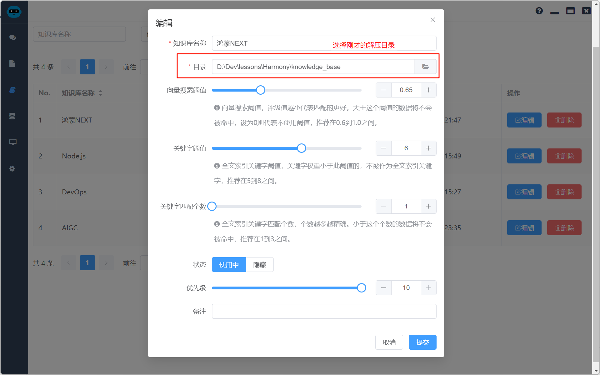

可以在编辑知识库参数时输入**Custom instructions**，我使用的是：

```markdown
你是一个基于HarmonyOS开发文档知识库的工作和学习助理。请根据以下规则回答问题：

1.  **优先文档：** 如果能从HarmonyOS开发文档中直接找到确切的答案，请列出相关文档的文件名（无需链接）及相关段落。
2.  **常识辅助：** 如果无法从文档中直接找到确切答案，请结合你已掌握的常识进行回答。
```

### 验证索引

索引已经建好，执行`验证索引`操作验证一下，在列表中找到刚才新建的知识库，点击`索引`按钮。

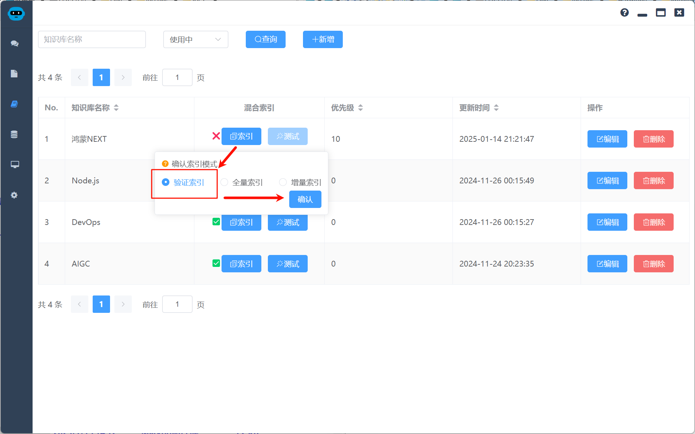

验证完成后`索引`按钮前的图标变成✅即可

### 知识库应用

#### 知识库问答

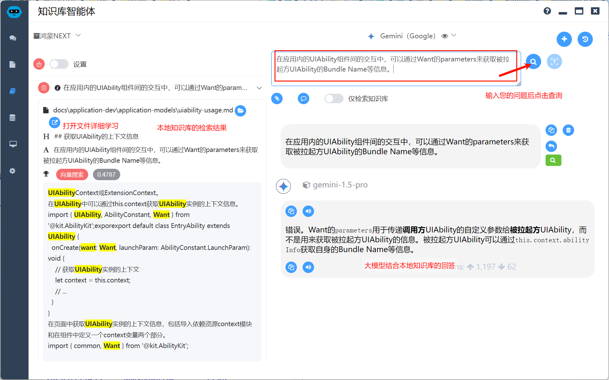

如果对大模型的回答有疑虑，可以点击左侧图标打开文件进行详细学习和进一步的AI问答

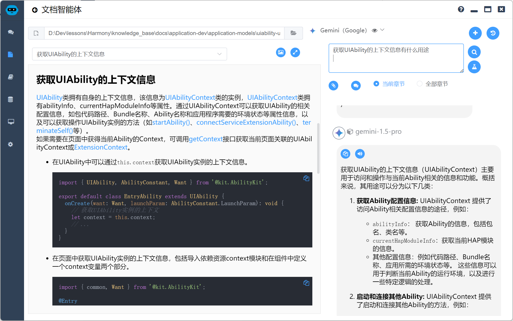

#### 图片识别

网络中获取的一些资料不是文本格式，不利于搜索问答，例如

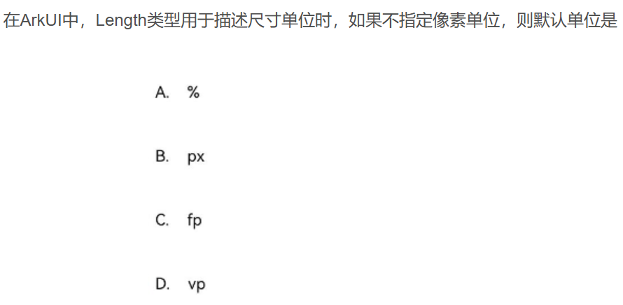

通过图片识别功能（需模型支持多模态功能）来识别题目后进行问答

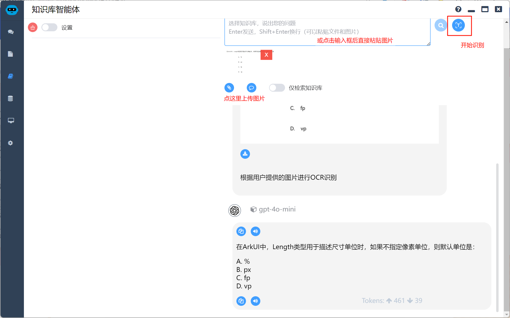

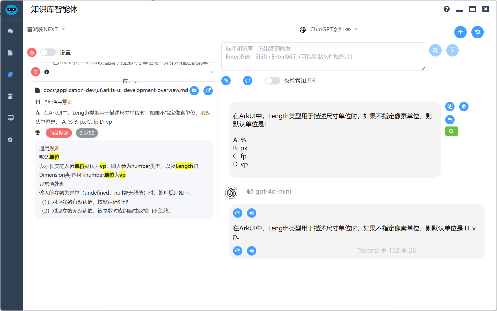

#### HTTP服务器模式

一台机器知识库开启HTTP服务器，同局域网中所有设备均可访问，轻松将本地资料库分享给大家

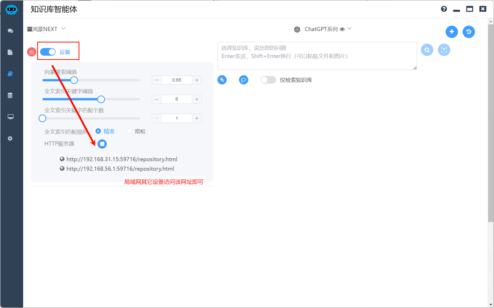

> 使用HTTP服务器时，如您的模型需要借助特定软件上网才能访问，请使用特定软件的**Tun模式**

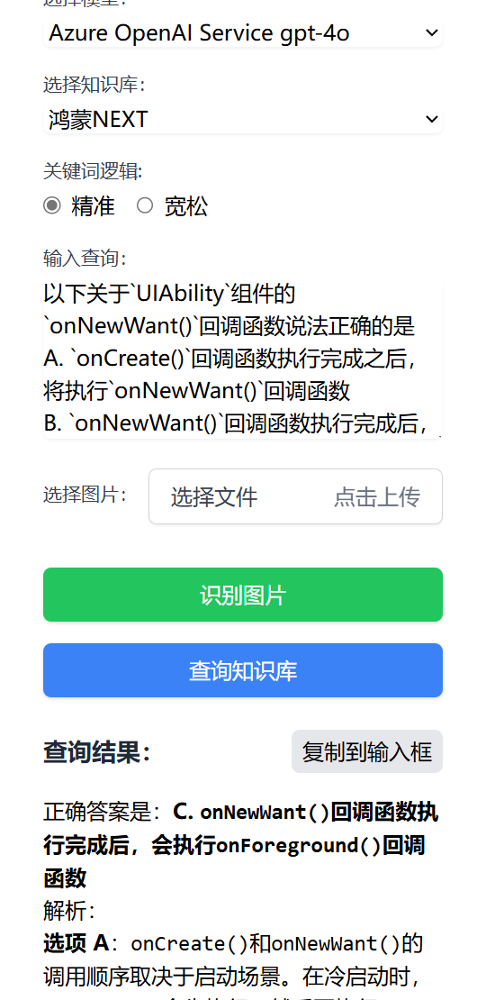

#### 其它设置

* **向量搜索阈值**：评级值越小代表匹配的更好。大于这个阈值的数据将不会被命中，设为0则代表不使用阈值，推荐在0.6到1.0之间。
* **全文索引关键字阈值**： 全文索引关键字阈值，关键字权重小于此阈值的，不被作为全文索引关键字，推荐在5到8之间。
* **全文索引关键字匹配个数**：全文索引关键字匹配个数，个数越多越精确。小于这个个数的数据将不会被命中，推荐在1到3之间。

> 以上参数设置为推荐即可，一般不需要改变
>
> 比较重要的**全文索引匹配规则**
>
> * **精准**：适合判断题、单选题
> * **宽松**：适合多选题、简答题

### 扩展知识库

如果下载的知识库不能让你满意，可以自行扩展知识库，知识库支持pdf、docx、doc、pptx、ppt、epub、md、markdown、srt、txt、html等多种文件格式进行索引。

拷贝对应文件到文件夹，点击`索引`按钮，选择`全量索引`或`增量索引`即可

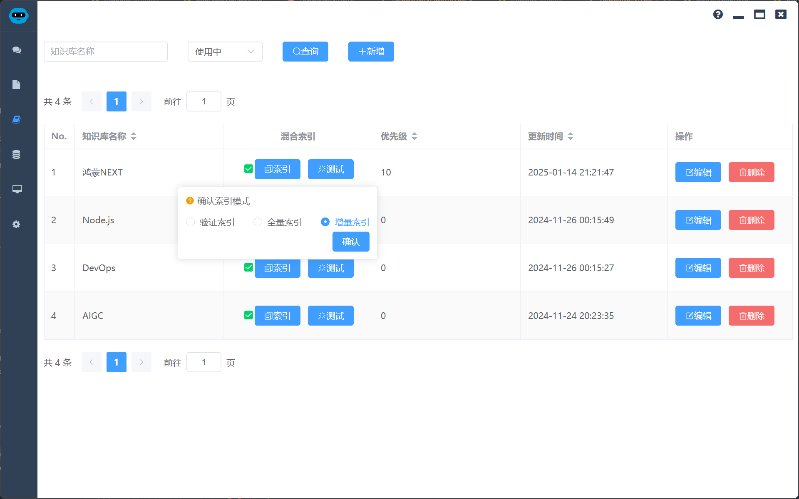

索引生成完毕可以将您的文件夹拷贝分享给其它人

## 相关下载

### Local Agents

- 主页：https://agents.uue.cn/
- 下载链接：https://pan.baidu.com/s/1U3L9vrgRtU1aUwFj6MNYBA?pwd=xyza
- github下载链接：https://github.com/lgc653/local-agents/releases

### HarmonyOS知识库

该知识库为《HarmonyOS应用开发者基础认证》构建，内容来源于网络公开分享的HarmonyOS文档、题目以及[OpenHarmony](https://gitee.com/openharmony)代码仓库。

* 下载地址：https://pan.baidu.com/s/1bZ4sCG21yZJEz2JqIES7YQ?pwd=aw8w

下载`HarmonyOS应用开发者基础认证.zip`后解压到硬盘任意目录

### 配置模型

需要配合大模型使用，需要申请大模型apiKey

- **OpenAI**: [https://platform.openai.com](https://platform.openai.com/)
- **Gemini**: https://aistudio.google.com/app/apikey
- **Kimi (Moonshot AI)**: [https://platform.moonshot.cn](https://platform.moonshot.cn/)
- **DeepSeek**: [https://platform.deepseek.com](https://platform.deepseek.com/)
- **文心一言**: [https://cloud.baidu.com](https://cloud.baidu.com/)
- **通义干问**: [https://bailian.console.aliyun.com](https://bailian.console.aliyun.com/)
- **混元**: https://cloud.tencent.com/product/hunyuan
- **火山引擎**: [https://www.volcengine.com](https://www.volcengine.com/)
- **星火**: https://xinghuo.xfyun.cn/sparkapi
- **智谱清言**: [https://open.bigmodel.cn](https://open.bigmodel.cn/)
- **Gitee AI**: [https://ai.gitee.com](https://ai.gitee.com/)
