# ControlNet

## ControlNet是什么

> **AI绘画最终要实现的目标——让出的图与我们脑海里想象的画面一致**

但目前现状是`随机性太强`，很多时候能不能出来一个好看的画面，只能通过大量的「抽卡」实现，以数量去对冲概率。这种情况下，如果能用好控制出图的三个最关键因素，能让「出图与我们想象的画面一致」概率更高

1. **提示词**：提示词的作用是奠定整个图的大致画面
2. **模型**：Checkpoint、Lora的作用是让图片主体符合我们的需求
3. **ControlNet**：ControNet的作用是精细化控制整体图片的元素 —— 主体、背景、风格、形式等

> **ControlNet就是你提供一张图片，然后选择一种采集方式，去生成一张新的图片**
>
> * 可以选择采集图片中人物的骨架，从而在新的图片中生成出一样姿势的人
> * 可以选择采集图片中画面的线稿，从而在新的图片中生成一样线稿的画面
> * 可以选择采集图片中已有的风格，从而在新的图片中生成一样风格的画面
> * 可以选择采集图片中人物的面部特征，从而在新的图片中生成一样面部特征的人物
> * 目前有15种，还在陆续增加中……
> * 也可以把以上这些采集组合起来运用

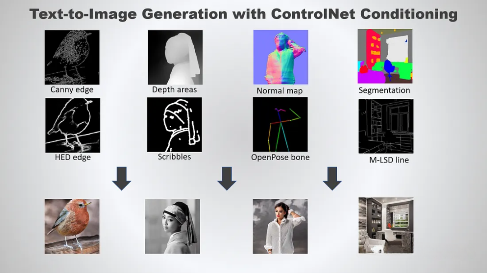

我们可以看到**ComfyUI**的工作流中，提示词不再直接关联到**KSampler**，而是通过2个**ControlNet**节点分别处理后在传给**KSampler**

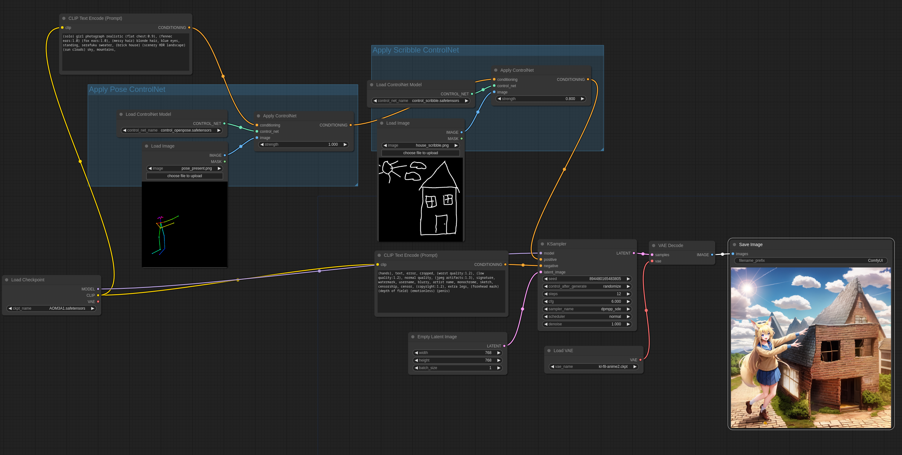

## ControlNet究竟能干什么

* 能控制生成的人物的姿势、表情，甚至是每一根手指的骨骼
* 线稿上色
* 恢复画质
* 动漫变真人 & 真人变动漫 & 切换不同风格
* 换脸
* 精准重绘（比如精准换装、换模特）
* 添加特效，比如燃烧、冰冻，夜色
* ……

## ControlNet安装与使用

一般我们通过整合包安装的Stable Diffusion都已经装了有ControlNet这个插件，没有这个插件的Stable Diffusion就是玩具，实在没有可以用传统的插件安装方法进行安装。

[lllyasviel/ControlNet-v1-1-nightly: Nightly release of ControlNet 1.1 (github.com)](https://github.com/lllyasviel/ControlNet-v1-1-nightly)

使用ControlNet需要安装大量形形色色的模型，主要分两种

### Preprocessor

预处理器是将参考图片处理成ControlNet能理解的格式，比如下图，选用OpenPose类的预处理器openpose_full，可以将参考左侧图片中人物解析成右侧的骨架、表情、手部，有了右侧的openpose信息，ControlNet就能生成和该骨架信息一致的图片。

> 整合包一般带来一些Preprocessor，更多的需要我们去下载
>
> 从[lllyasviel (Lvmin Zhang) (huggingface.co)](https://huggingface.co/lllyasviel)下载这些模型后放到以下目录：`SD文件 > extensions > sd-webui-controlnet > annotator`

> OpenPose人体姿态识别项目是美国卡耐基梅隆大学(CMU)基于卷积神经网络和监督学习并**以caffe为框架**开发的开源库。可以实现**人体动作、面部表情、手指运动**等姿态估计。

* 我们首先上传参考图像
* 然后可以点击中间的💥图标进行预览（需点击`Allow Preview`）
* 右侧就能出现Preview
* 如果不满意可以点击`Edit`进行编辑

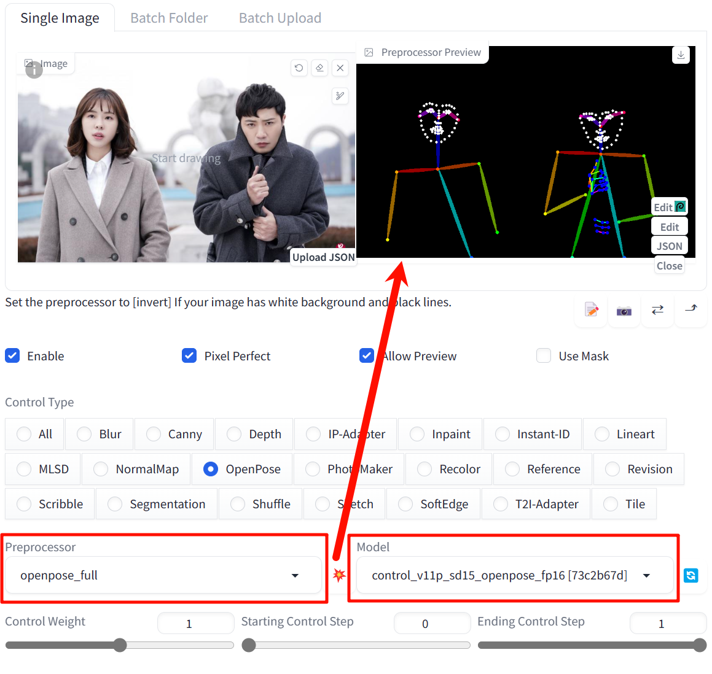

点击生成就能生成姿态、表情、手部姿势一模一样的图片


如果我们已经有了一张非常满意的openpose信息图片，那么我们就不需要设置Preprocessor，直接上传openpose信息图片即可

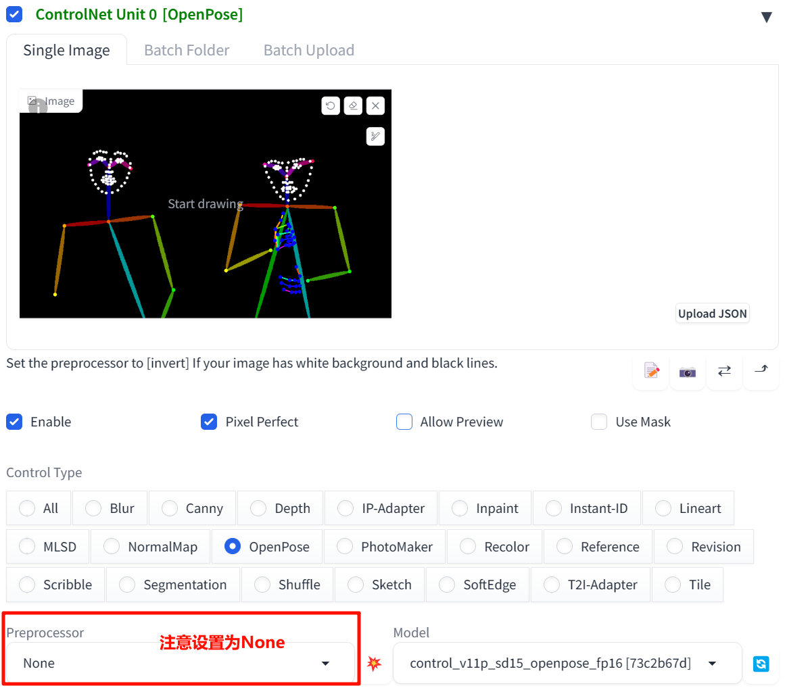

### Model

ControlNet是根据openpose信息图片、线稿图片、景深图片等参考信息，精细化控制整体图片的模型，目前ControlNet 1.1有14个，还在陆续增加中。

```
control_v11p_sd15_canny
control_v11p_sd15_mlsd
control_v11f1p_sd15_depth
control_v11p_sd15_normalbae
control_v11p_sd15_seg
control_v11p_sd15_inpaint
control_v11p_sd15_lineart
control_v11p_sd15s2_lineart_anime
control_v11p_sd15_openpose
control_v11p_sd15_scribble
control_v11p_sd15_softedge
control_v11e_sd15_shuffle
control_v11e_sd15_ip2p
control_v11f1e_sd15_tile
```

比如上图中的control_v11p_sd15_openpose_fp16就是精准控制图片姿态的大模型。

> 从[lllyasviel (Lvmin Zhang) (huggingface.co)](https://huggingface.co/lllyasviel)下载这些模型后放到以下目录：`SD文件 > models > ControlNet`

从ControlNet 1.1开始，开始使用标准ControlNet命名规则（SCNNRs）来命名所有模型。当然随着陆续加入的一些第三方模型，比如Recolor、PhotoMaker并未遵循该规则

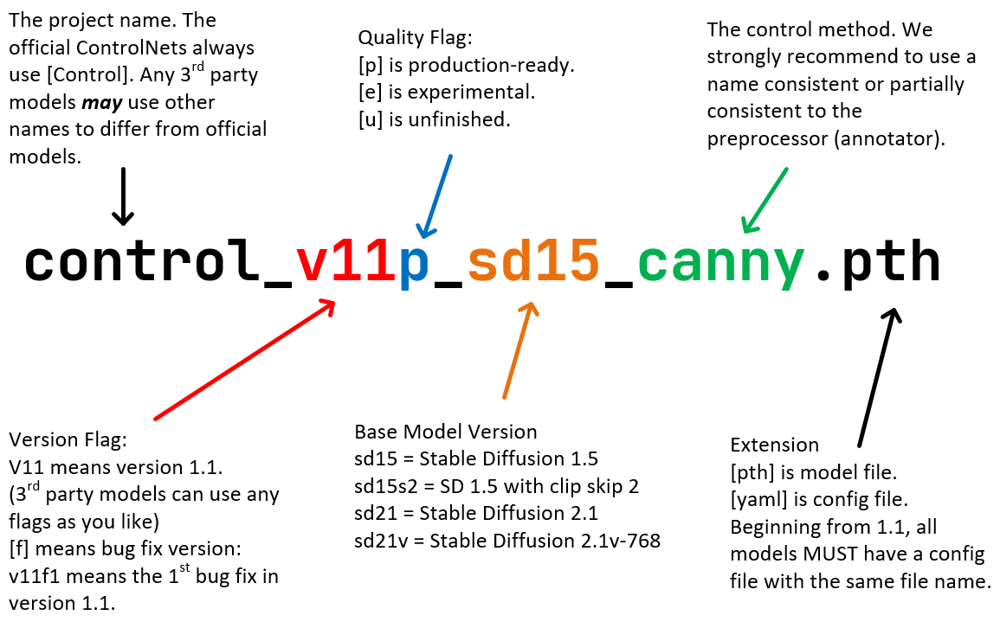

### 相关参数

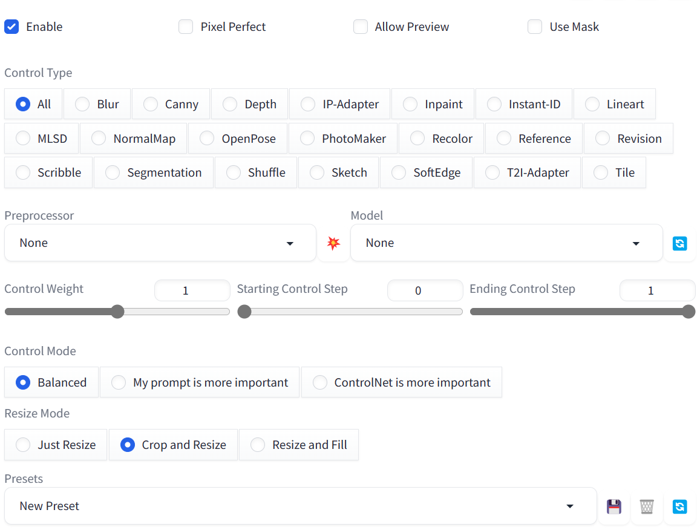

* **启用：**是否启用当前 ControNet 功能，如果你要启用多个 ControlNet ，你就多个 ControNet 都勾选启用。
* **低显存模式：**如果你的显卡低于 6G ，建议勾选该选项，原因你懂的。
* **完美像素模式：**让 ControlNet 自适应预处理器分辨率，勾选以后，「Preprocessor Resolution」选项会消失。

* **允许预览：**预览预处理处理的效果。

* **控制类型：**相当于选择预处理器和模型的快捷目录，点击需要的控制类型，会自动加载对应的预处理器和模型。

* **预处理：**预处理器下拉菜单，和模型搭配使用。

* **模型：**模型下拉菜单，也就是我们下载的各种模型，每个模型都有不同的功能。

* **控制权重**：ControlNet 输出的权重大小，控制模型对生成图片的影响的程度。权重越大，影响越大。
* **控制模式：**主要有三种模式：均衡、更偏向提示词、更偏向 ControlNet 
* **引导时机**：控制模型介入的时间。
* **引导终止时机**：控制模型终止的时间。

> 引导时机与CLIP很相似，因为图片是一张纸叠加生成的，引导介入就是从第几张图开始插入ControlNet。从开始插入就是0，中间就是0.5，同理最后则用1 表示。终止时机也是这个道理。之前介绍过图片发散与收敛。这里的插入如果是一个收敛采样器则中间插入基本没有影响效果。所以插入的时机一般选择0到1。
>
> 比如我们制作艺术二维码时
>
> 
>
> * 引导介入时机：0.2（插件起作用的时间，使二维码不会显得突兀）
> * 引导终止时机：0.8
>
> 还有制作光影效果时，也要注意设置这2个选项

## 官方模型介绍

### 线条约束

线条约束涉及到lineart、canny、softedge、scribble、mlsd五种模型

它们都是用来提取画面的线稿，再用线稿生成新的照片

1. 想最大程度还原照片：canny
2. 只想控制构图，给SD更多可以变化的地方：softedge
3. 真人、素描等照片：lineart
4. 建筑物装修：mlsd
5. 充分发挥想象力：scribble

#### canny

Canny 硬边缘，它的使用范围很广，被作者誉为最重要的（也许是最常用的）ControlNet 之一，该模型源自图像处理领域的边缘检测算法，可以识别并提取图像中的边缘特征并输送到新的图像中。

Canny 中只包含了 canny（硬边缘检测）这一种预处理器。下图中我们可以看到，canny 可以准确提取出画面中元素边缘的线稿，即使配合不同的主模型进行绘图都可以精准还原画面中的内容布局。

在选择预处理器时，我们可以看到除了 canny（硬边缘检测）还有 invert（白底黑线反色）的预处理器选项，我们通过 Canny 等线稿类的预处理器提取得到的预览图都是黑底白线，但大部分的传统线稿都是白底黑线，使用该预处理器我们不需要通过其他软件转换就可以直接得到传统线稿。

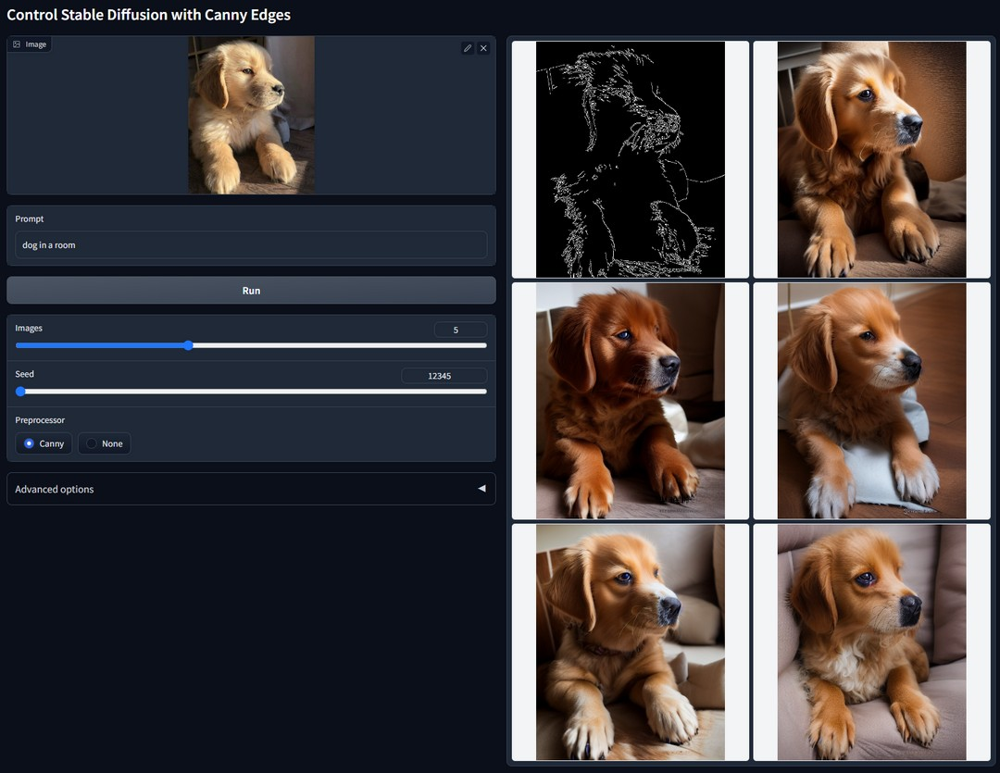

有些预处理器在选择后，下方会多出用于调节特征提取效果的特定参数，比如当我们选择 canny（硬边缘检测）时，下方会增加 Canny low threshold 低阈值和 Canny high threshold 高阈值 2 项参数。

先给大家解释下关于 canny 阈值参数的控制原理，以便你更好的理解其使用方法。在使用 canny 进行预处理时，提取的图像像素边缘线会被 2 个阈值参数划分为强边缘、弱边缘和非边缘 3 类，

* 其中强边缘会直接保留
* 非边缘的线稿会被忽略
* 处于中间弱边缘范围的线稿则会进行计算筛选。

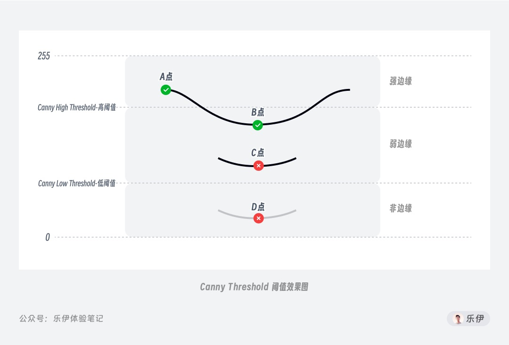

总结来看，Canny 高低阈值参数作用是控制预处理时提取线稿的复杂程度，两者的数值范围都限制在 1～255 之间。

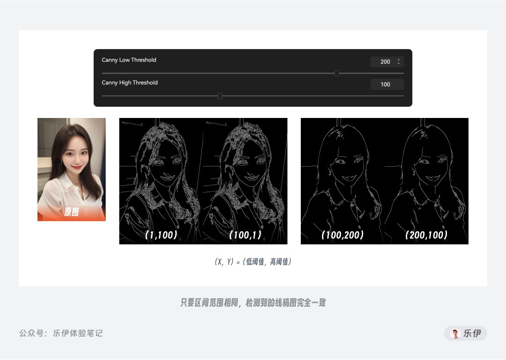

不同密度的预处理线稿图对绘图结果的影响很大，密度过高会导致绘图结果中出现分割零碎的斑块，但如果密度太低又会造成控图效果不够准确，因此我们需要调节阈值参数来达到比较合适的线稿控制范围。

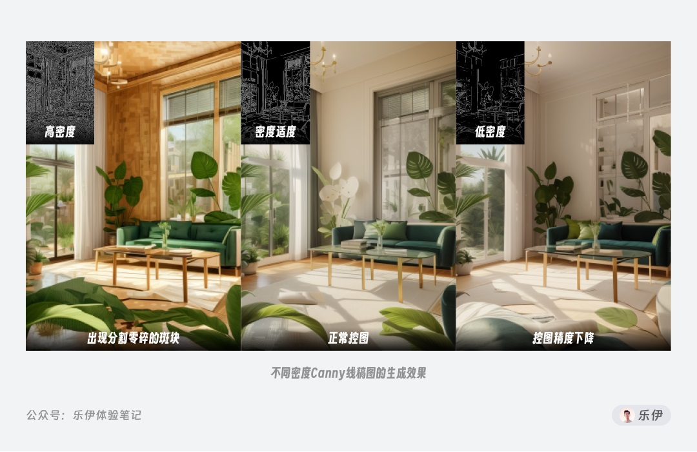

#### lineart

lineart是一个专门提取线稿的模型，可以针对不同类型的图片进行不同的处理，我们可以用它针对不同类型的照片提取线稿

> 在 ControlNet 插件中，将 lineart 和 lineart_anime2 种控图模型都放在「Lineart（线稿）」控制类型下，分别用于写实类和动漫类图像绘制，配套的预处理器也有 5 个之多，其中带有 anime 字段的预处理器用于动漫类图像特征提取，其他的则是用于写实图像。

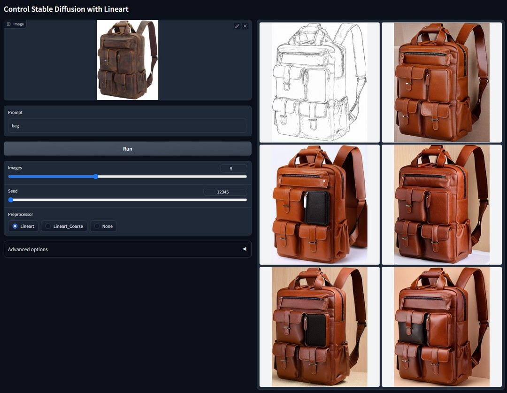

点开预处理器里面的各种模型可以识别不同图片的线稿

* 动漫：lineart_anime 或 lineart_anime_denoise
* 素描：lineart_coarse
* 写实：lineart_realistic
* 标准：lineart_standard

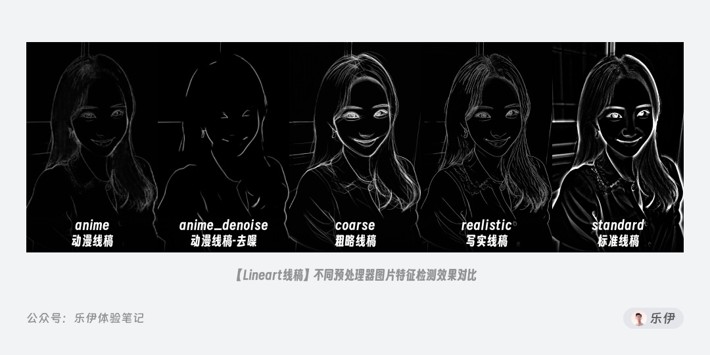

**我们可以提取动漫的线稿，再重新上色**

首先处理动漫照片记得要换二次元的大模型，然后关键词可以写一些质量词，然后描述一下照片里面有什么东西。另外需要注意的是，图片的分辨率大小要设置的和原先的比例一样不然照片会自动裁剪放大

**也可以将真人照片转换为二次元**

一定要先换成合适的大模型，另外因为真人照片换成二次元在五官比例上会不太匹配，这时候我们就要适当把controlnet的权重降低

> 我们可以看到，Canny 提取后的线稿类似电脑绘制的硬直线，粗细统一都是 1px 大小，而 Lineart 则是有的明显笔触痕迹线稿，更像是现实的手绘稿，可以明显观察到不同边缘下的粗细过渡。
>
> 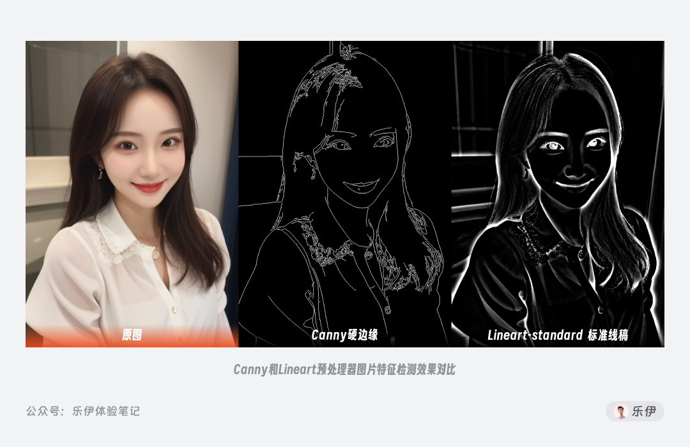

#### softedge

softedge只能识别图片大概的轮廓细节，线条比较柔和且过渡自然，这样给SD发挥的空间就比较大

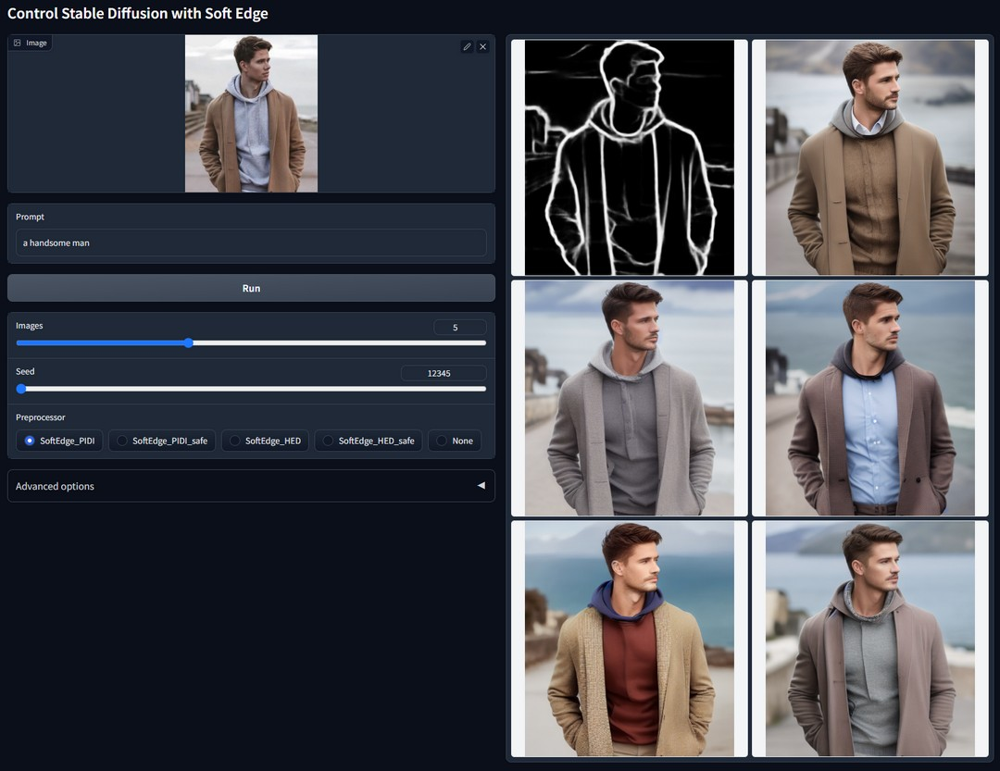

在 SoftEdge 中提供了 4 种不同的预处理器，分别是 HED、HEDSafe、PiDiNet 和 PiDiNetSafe。

在官方介绍的性能对比中，模型稳定性排名为 `PiDiNetSafe > HEDSafe > PiDiNet > HED`，而最高结果质量排名 `HED > PiDiNet > HEDSafe > PiDiNetSafe`，综合考虑后 PiDiNet 被设置为默认预处理器，可以保证在大多数情况下都能表现良好。在下图中我们可以看到 4 种预处理器的实际检测图对比。

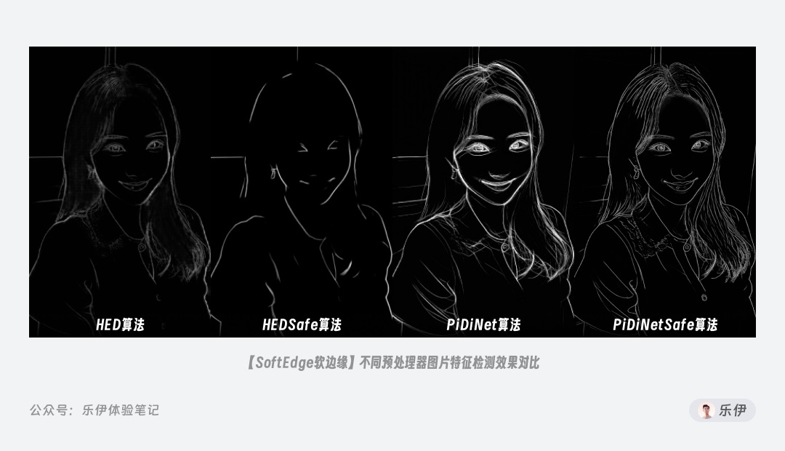

#### scribble

涂鸦得到的东西最为抽象，生成的图片自由度也最大

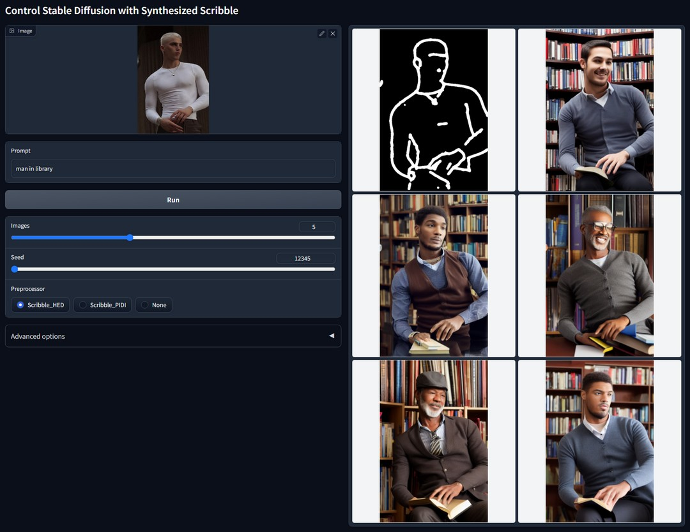

Scribble 中也提供了 3 种不同的预处理器可供选择，分别是 HED、PiDiNet 和 XDoG。通过下图我们可以看到不同 Scribble 预处理器的图像效果，由于 HED 和 PiDiNet 是神经网络算法，而 XDoG 是经典算法，因此前两者检测得到的轮廓线更粗，更符合涂鸦的手绘效果。

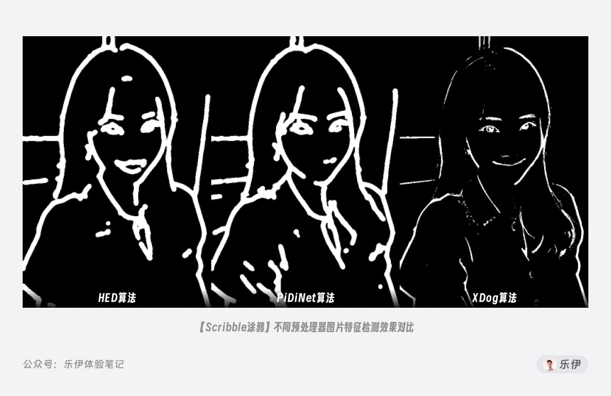

#### mlsd

MLSD 直线。MLSD 提取的都是画面中的直线边缘，在下图中可以看到 mlsd（M-LSD 直线线条检测）预处理后只会保留画面中的直线特征，而忽略曲线特征。

看看预处理出来的图，都只有直线，圆灯这些有弧度的线条都会被忽略掉，因此 MLSD 多用于提取物体的线型几何边界，最典型的就是几何建筑、室内设计、路桥设计等领域。

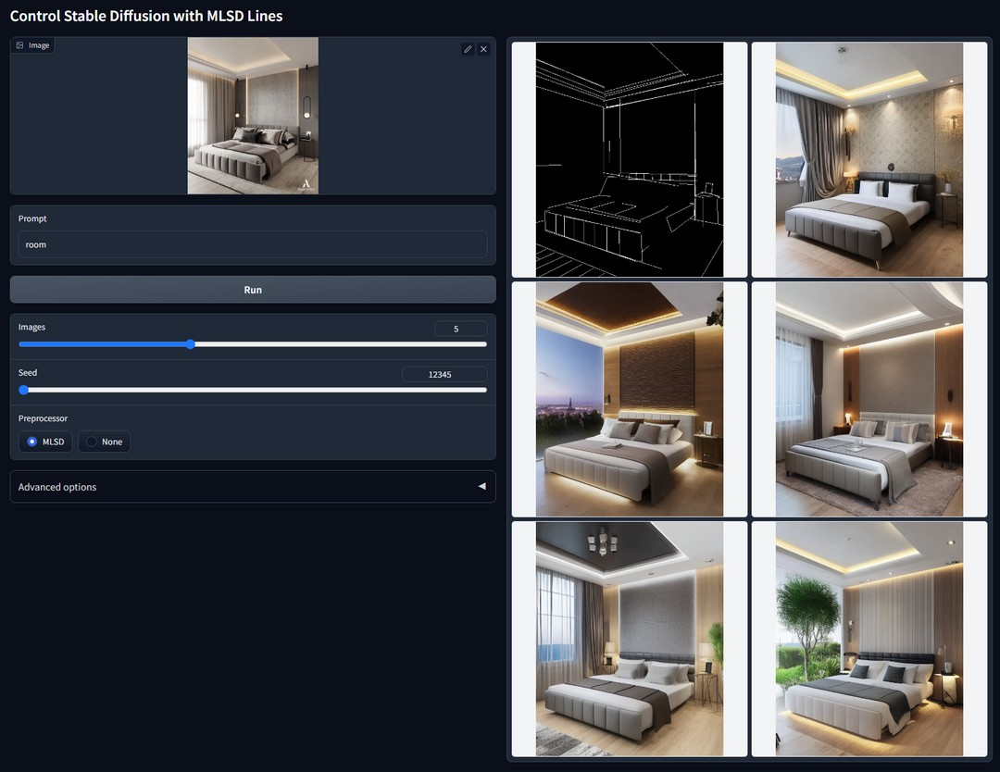

MLSD 预处理器同样也有自己的定制参数，分别是 MLSD Value Threshold 强度阈值和 MLSD Distance Threshold 长度阈值。MLSD 阈值控制的是 2 个不同方向的参数：强度和长度，它们的数值范围都是 0～20 之间。

Value 强度阈值用于筛选线稿的直线强度，简单来说就是过滤掉其他没那么直的线条，只保留最直的线条。通过下面的图我们可以看到随着 Value 阈值的增大，被过滤掉的线条也就越多，最终图像中的线稿逐渐减少。

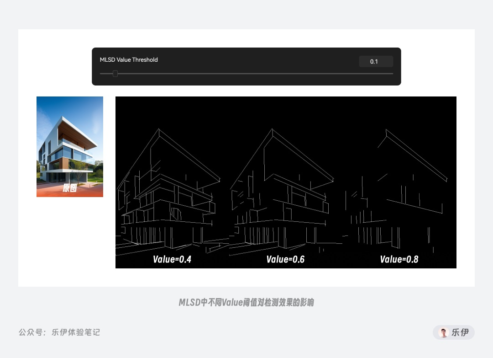

Distance 长度阈值则用于筛选线条的长度，即过短的直线会被筛选掉。在画面中有些被识别到的短直线不仅对内容布局和分析没有太大帮助，还可能对最终画面造成干扰，通过长度阈值可以有效过滤掉它们。不过该参数对线稿密度的影响没有那么明显，在下图中可以看到在极值情况下会有少部分线条被过滤掉。

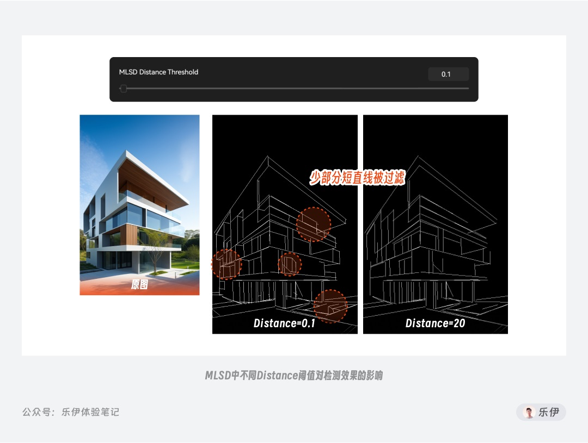

### 人体姿势约束

#### openpose

识别人体姿势openpose有五个预处理器

* **openpose_full**：身体 + 手指 + 表情
* **openpose_hand**：身体 + 手指
* **openpose_faceonly**：表情
* **openpose_face**：身体 + 表情
* **openpose**：身体

当然现在也有新的技术加入，比如识别动物的**animal_openpose**

我们有这些使用规则

* 在日常使用中，如果原图的手指骨骼比较清晰，可以用识别到手指的预处理器。

* 如果识别出来的手指线条比较乱，自己调整也没调整好，那就只识别身体姿势，不然生成出来的照片手指反而更乱了。

* 控制表情的最好用在生成近景特写图片，这样识别出来的才比较准确


### 景深约束

#### depth

depth，能够很好的复刻房子线条，而且物品的距离镜头的前后顺序比较清晰，或者如下图两手交叉，就可使用depth确保两手交叉的覆盖顺序。

> 深度图也被称为距离影像，可以将从图像采集器到场景中各点的距离（深度）作为像素值的图像，它可以直接体现画面中物体的三维深度关系。学习过三维动画知识的朋友应该听说过深度图，该类图像中只有黑白两种颜色，距离镜头越近则颜色越浅（白色），距离镜头越近则颜色越深（黑色）。
>
> 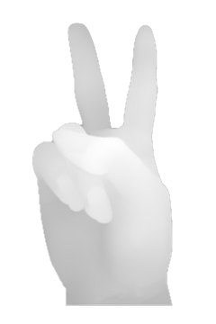

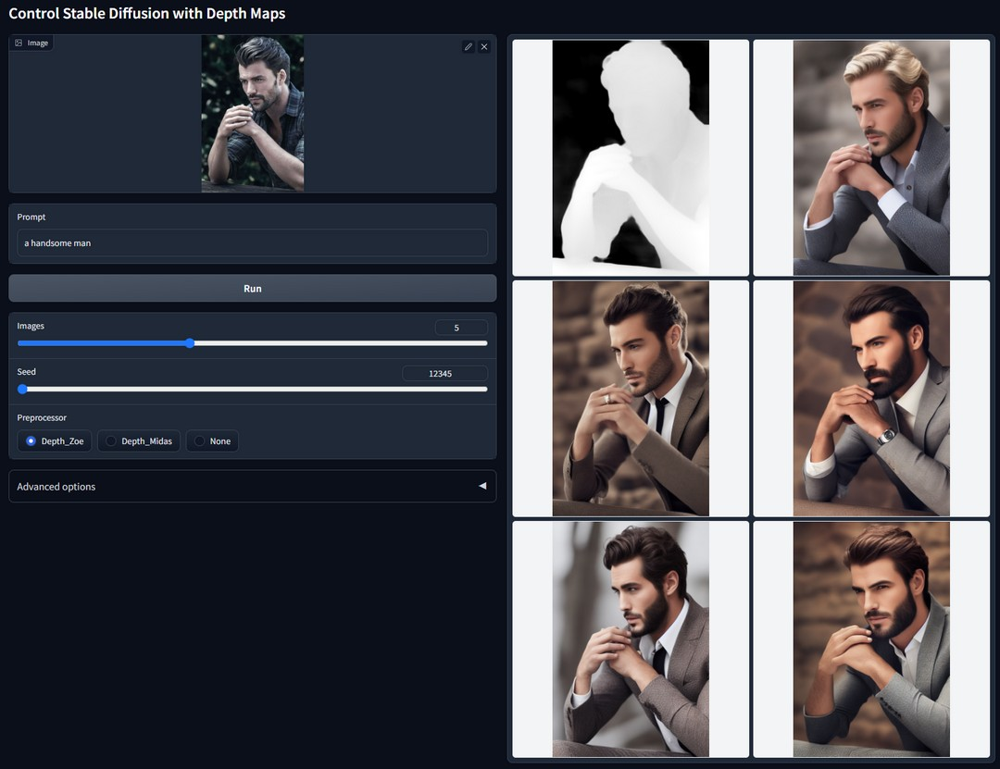

Depth 的预处理器有四种：LeReS、LeReS++、MiDaS、ZoE，下图中我们可以看到这四种预处理器的检测效果。

对比来看，LeReS 和 LeReS++的深度图细节提取的层次比较丰富，其中 LeReS++会更胜一筹。而 MiDaS 和 ZoE 更适合处理复杂场景，其中 ZoE 的参数量是最大的，所以处理速度比较慢，实际效果上更倾向于强化前后景深对比。

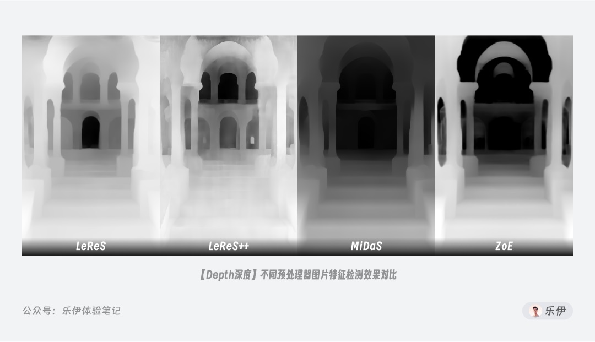

#### normal

另一种可以体现景深关系的图像叫 NormalMap 法线贴图，ControlNet 的 NormalMap 模型就是根据画面中的光影信息，从而模拟出物体表面的凹凸细节，实现准确还原画面内容布局，因此 NormalMap 多用于体现物体表面更加真实的光影细节。

> 法线，它是垂直与平面的一条向量，因此储存了该平面方向和角度等信息。我们通过在物体凹凸表面的每个点上均绘制法线，再将其储存到 RGB 的颜色通道中，其中 R 红色、G 绿色、B 蓝色分别对应了三维场景中 XYX 空间坐标系，这样就能实现通过颜色来反映物体表面的光影效果，而由此得到的纹理图我们将其称为**法线贴图**，又称**凹凸贴图 (Bump Map)**。由于法线贴图可以实现在不改变物体真实结构的基础上也能反映光影分布的效果，被广泛应用在 CG 动画渲染和游戏制作等领域。
>
> 如下图：在法线贴图中定义了螺钉、凹槽和划痕
>
> 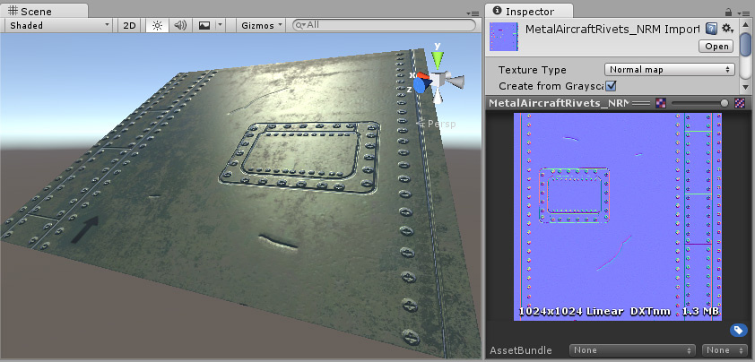

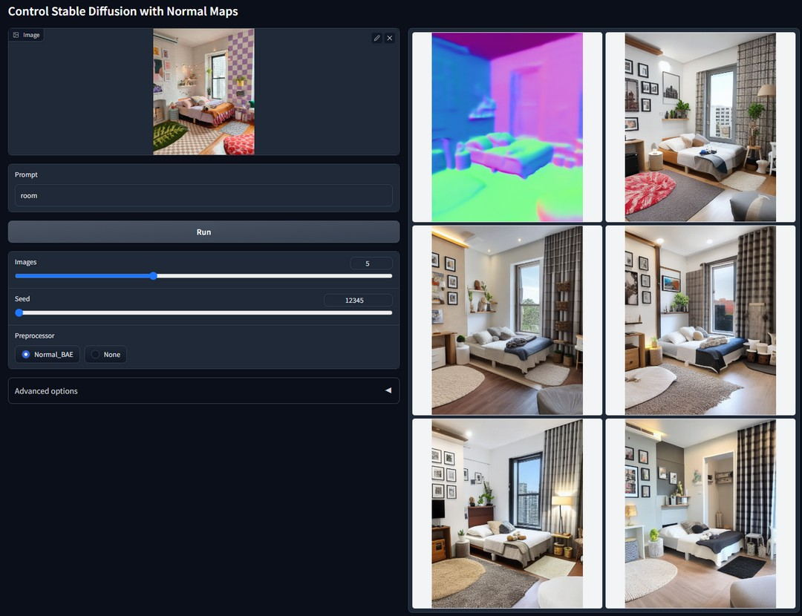

NormalMap 有 Bae 和 Midas2 种预处理器，MiDaS 是早期 v1.0 版本使用的预处理器，官方已表示不再进行维护，平时大家使用默认新的 Bae 预处理器即可，下图是 2 种预处理器的提取结果。

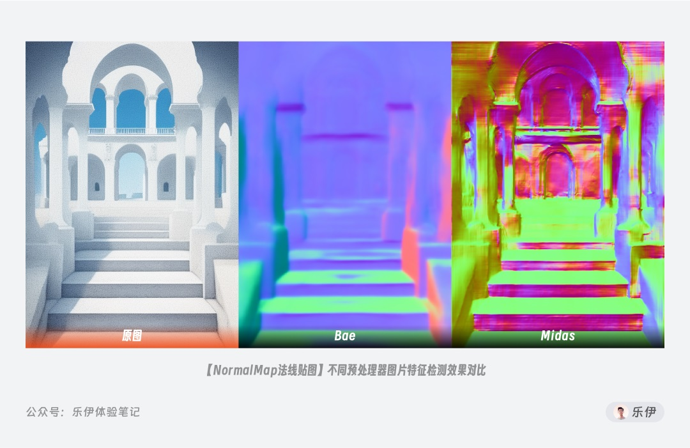

当我们选择 MiDaS 预处理器时，下方会多出 Background Threshold 背景阈值的参数项，它的数值范围在 0～1 之间。通过设置背景阈值参数可以过滤掉画面中距离镜头较远的元素，让画面着重体现关键主题。下图中可以看到，随着背景阈值数值增大，前景人物的细节体现保持不变，但背景内容逐渐被过滤掉。

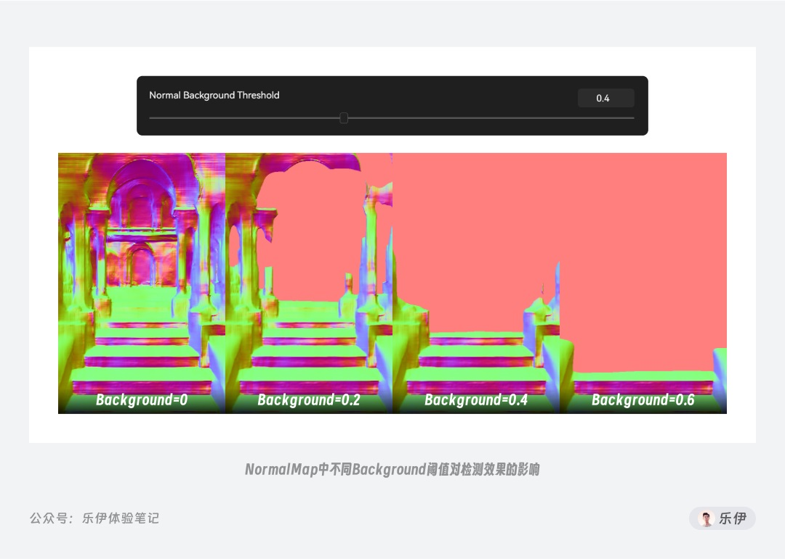

### 物品种类约束

#### seg

Segmentation 的完整名称是 Semantic Segmentation 语义分割，它识别图片不一样的东西，就用不同的颜色表示

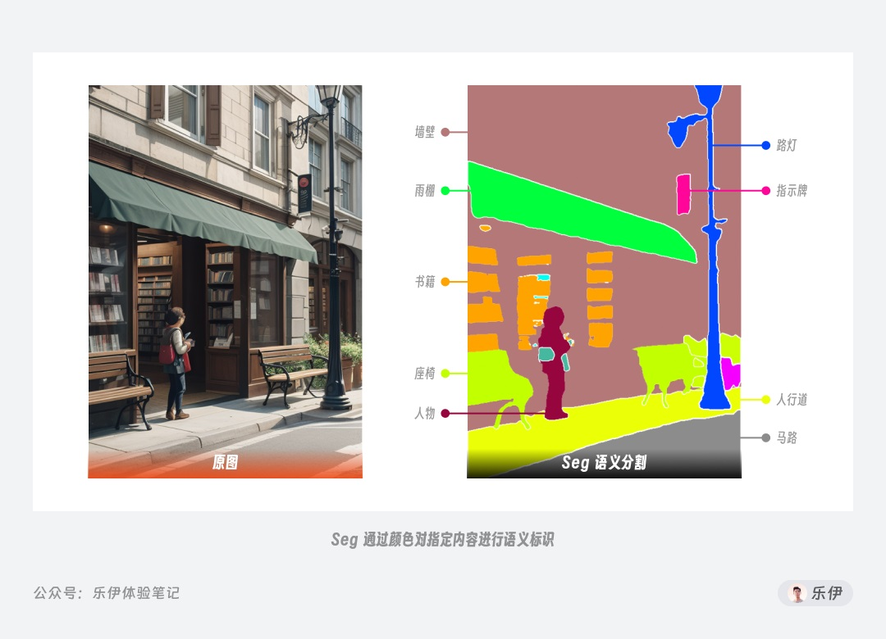

可以把seg色块图下载下来，自己到ps或者其他修图软件改照片物体的颜色。这样SD就会根据颜色生成出来特定的某样东西，下面有一个文档可以看到不同的颜色代表什么物品

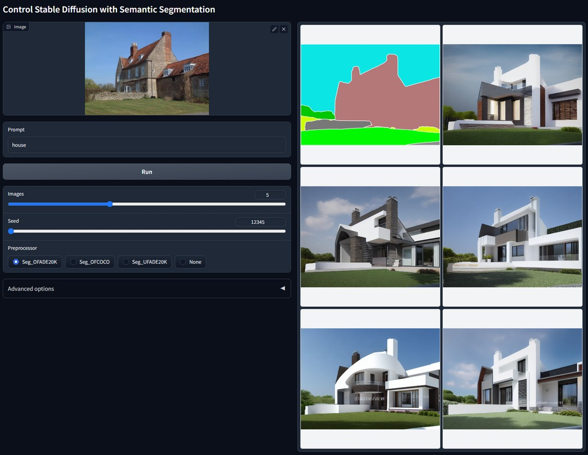

Seg 也提供了三种预处理器可供选择：OneFormer ADE20k、OneFormer COCO、UniFormer ADE20k。尾缀 ADE20k 和 COCO 代表模型训练时使用的 2 种图片数据库，而前缀 OneFormer 和 UniFormer 表示的是算法。

其中 UniFormer 是旧算法，但由于实际表现还不错依旧被作者作为备选项保留下来，新算法 OneFormer 经过作者团队的训练可以很好的适配各种生产环境，元素间依赖关系被很好的优化，平时使用时建议大家使用默认的 OneFormer ADE20k 即可。

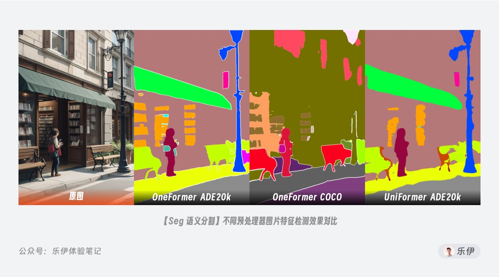

| 编号 | RGB颜色值       | 16进制颜色码 | 类别（中文）                                                 | 类别（英文）                                                 |
| ---- | --------------- | ------------ | ------------------------------------------------------------ | ------------------------------------------------------------ |
| 1    | (120, 120, 120) | #787878      | 墙                                                           | wall                                                         |
| 2    | (180, 120, 120) | #B47878      | 建筑；大厦                                                   | building; edifice                                            |
| 3    | (6, 230, 230)   | #06E6E6      | 天空                                                         | sky                                                          |
| 4    | (80, 50, 50)    | #503232      | 地板；地面                                                   | floor; flooring                                              |
| 5    | (4, 200, 3)     | #04C803      | 树                                                           | tree                                                         |
| 6    | (120, 120, 80)  | #787850      | 天花板                                                       | ceiling                                                      |
| 7    | (140, 140, 140) | #8C8C8C      | 道路；路线                                                   | road; route                                                  |
| 8    | (204, 5, 255)   | #CC05FF      | 床                                                           | bed                                                          |
| 9    | (230, 230, 230) | #E6E6E6      | 窗玻璃；窗户                                                 | windowpane; window                                           |
| 10   | (4, 250, 7)     | #04FA07      | 草                                                           | grass                                                        |
| 11   | (224, 5, 255)   | #E005FF      | 橱柜                                                         | cabinet                                                      |
| 12   | (235, 255, 7)   | #EBFF07      | 人行道                                                       | sidewalk; pavement                                           |
| 13   | (150, 5, 61)    | #96053D      | 人；个体；某人；凡人；灵魂                                   | person; individual; someone; somebody; mortal; soul          |
| 14   | (120, 120, 70)  | #787846      | 地球；土地                                                   | earth; ground                                                |
| 15   | (8, 255, 51)    | #08FF33      | 门；双开门                                                   | door; double door                                            |
| 16   | (255, 6, 82)    | #FF0652      | 桌子                                                         | table                                                        |
| 17   | (143, 255, 140) | #8FFF8C      | 山；峰                                                       | mountain; mount                                              |
| 18   | (204, 255, 4)   | #CCFF04      | 植物；植被；植物界                                           | plant; flora; plant life                                     |
| 19   | (255, 51, 7)    | #FF3307      | 窗帘；帘子；帷幕                                             | curtain; drape; drapery; mantle; pall                        |
| 20   | (204, 70, 3)    | #CC4603      | 椅子                                                         | chair                                                        |
| 21   | (0, 102, 200)   | #0066C8      | 汽车；机器；轿车                                             | car; auto; automobile; machine; motorcar                     |
| 22   | (61, 230, 250)  | #3DE6FA      | 水                                                           | water                                                        |
| 23   | (255, 6, 51)    | #FF0633      | 绘画；图片                                                   | painting; picture                                            |
| 24   | (11, 102, 255)  | #0B66FF      | 沙发；长沙发；躺椅                                           | sofa; couch; lounge                                          |
| 25   | (255, 7, 71)    | #FF0747      | 书架                                                         | shelf                                                        |
| 26   | (255, 9, 224)   | #FF09E0      | 房子                                                         | house                                                        |
| 27   | (9, 7, 230)     | #0907E6      | 海                                                           | sea                                                          |
| 28   | (220, 220, 220) | #DCDCDC      | 镜子                                                         | mirror                                                       |
| 29   | (255, 9, 92)    | #FF095C      | 地毯                                                         | rug; carpet; carpeting                                       |
| 30   | (112, 9, 255)   | #7009FF      | 田野                                                         | field                                                        |
| 31   | (8, 255, 214)   | #08FFD6      | 扶手椅                                                       | armchair                                                     |
| 32   | (7, 255, 224)   | #07FFE0      | 座位                                                         | seat                                                         |
| 33   | (255, 184, 6)   | #FFB806      | 栅栏；围栏                                                   | fence; fencing                                               |
| 34   | (10, 255, 71)   | #0AFF47      | 书桌                                                         | desk                                                         |
| 35   | (255, 41, 10)   | #FF290A      | 岩石；石头                                                   | rock; stone                                                  |
| 36   | (7, 255, 255)   | #07FFFF      | 衣柜；壁橱；储藏柜                                           | wardrobe; closet; press                                      |
| 37   | (224, 255, 8)   | #E0FF08      | 台灯                                                         | lamp                                                         |
| 38   | (102, 8, 255)   | #6608FF      | 浴缸；沐浴缸；浴盆                                           | bathtub; bathing tub; bath; tub                              |
| 39   | (255, 61, 6)    | #FF3D06      | 栏杆；扶手                                                   | railing; rail                                                |
| 40   | (255, 194, 7)   | #FFC207      | 靠垫                                                         | cushion                                                      |
| 41   | (255, 122, 8)   | #FF7A08      | 基座；底座；支架                                             | base; pedestal; stand                                        |
| 42   | (0, 255, 20)    | #00FF14      | 盒子                                                         | box                                                          |
| 43   | (255, 8, 41)    | #FF0829      | 柱子；支柱                                                   | column; pillar                                               |
| 44   | (255, 5, 153)   | #FF0599      | 招牌；标志                                                   | signboard; sign                                              |
| 45   | (6, 51, 255)    | #0633FF      | 抽屉柜；抽屉；梳妆台；梳妆柜                                 | chest of drawers; chest; bureau; dresser                     |
| 46   | (235, 12, 255)  | #EB0CFF      | 柜台                                                         | counter                                                      |
| 47   | (160, 150, 20)  | #A09614      | 沙滩；沙子                                                   | sand                                                         |
| 48   | (0, 163, 255)   | #00A3FF      | 水槽                                                         | sink                                                         |
| 49   | (140, 140, 140) | #8C8C8C      | 摩天大楼                                                     | skyscraper                                                   |
| 50   | (0250, 10, 15)  | #FA0A0F      | 壁炉；炉床；明火炉                                           | fireplace; hearth; open fireplace                            |
| 51   | (20, 255, 0)    | #14FF00      | 冰箱；冰柜                                                   | refrigerator; icebox                                         |
| 52   | (31, 255, 0)    | #1FFF00      | 看台；有盖看台                                               | grandstand; covered stand                                    |
| 53   | (255, 31, 0)    | #FF1F00      | 小路                                                         | path                                                         |
| 54   | (255, 224, 0)   | #FFE000      | 楼梯；台阶                                                   | stairs; steps                                                |
| 55   | (153, 255, 0)   | #99FF00      | 跑道                                                         | runway                                                       |
| 56   | (0, 0, 255)     | #0000FF      | 展示柜；橱窗；展示架                                         | case; display case; showcase; vitrine                        |
| 57   | (255, 71, 0)    | #FF4700      | 台球桌；斯诺克桌                                             | pool table; billiard table; snooker table                    |
| 58   | (0, 235, 255)   | #00EBFF      | 枕头                                                         | pillow                                                       |
| 59   | (0, 173, 255)   | #00ADFF      | 纱门；纱窗                                                   | screen door; screen                                          |
| 60   | (31, 0, 255)    | #1F00FF      | 楼梯；楼梯                                                   | stairway; staircase                                          |
| 61   | (11, 200, 200)  | #0BC8C8      | 河流                                                         | river                                                        |
| 62   | (255 ,82, 0)    | #FF5200      | 桥                                                           | bridge; span                                                 |
| 63   | (0, 255, 245)   | #00FFF5      | 书架                                                         | bookcase                                                     |
| 64   | (0, 61, 255)    | #003DFF      | 百叶窗；屏风                                                 | blind; screen                                                |
| 65   | (0, 255, 112)   | #00FF70      | 咖啡桌；鸡尾酒桌                                             | coffee table; cocktail table                                 |
| 66   | (0, 255, 133)   | #00FF85      | 厕所；茅房；坑位；便池；小便池；马桶                         | toilet; can; commode; crapper; pot; potty; stool; throne     |
| 67   | (255, 0, 0)     | #FF0000      | 花                                                           | flower                                                       |
| 68   | (255, 163, 0)   | #FFA300      | 书                                                           | book                                                         |
| 69   | (255, 102, 0)   | #FF6600      | 山丘                                                         | hill                                                         |
| 70   | (194, 255, 0)   | #C2FF00      | 长凳                                                         | bench                                                        |
| 71   | (0, 143, 255)   | #008FFF      | 台面                                                         | countertop                                                   |
| 72   | (51, 255, 0)    | #33FF00      | 炉灶；厨房炉灶；烹饪炉灶                                     | stove; kitchen stove; range; kitchen range; cooking stove    |
| 73   | (0, 82, 255)    | #0052FF      | 棕榈树                                                       | palm; palm tree                                              |
| 74   | (0, 255, 41)    | #00FF29      | 厨房中间的工作台                                             | kitchen island                                               |
| 75   | (0, 255, 173)   | #00FFAD      | 计算机；计算设备；数据处理器；电子计算机；信息处理系统       | computer; computing machine; computing device; data processor; electronic computer; information processing system |
| 76   | (10, 0, 255)    | #0A00FF      | 转椅                                                         | swivel chair                                                 |
| 77   | (173, 255, 0)   | #ADFF00      | 船                                                           | boat                                                         |
| 78   | (0, 255, 153)   | #00FF99      | 闩                                                           | bar                                                          |
| 79   | (255, 92, 0)    | #FF5C00      | 街机                                                         | arcade machine                                               |
| 80   | (255, 0, 255)   | #FF00FF      | 简陋的小屋；小屋；小笼棚；简陋的棚屋                         | hovel; hut; hutch; shack; shanty                             |
| 81   | (255, 0, 245)   | #FF00F5      | 公共汽车；汽车客车；长途大巴；旅游大巴；双层巴士；公共小巴；摩托巴士；豪华大巴；公共汽车；载客车辆 | bus; autobus; coach; charabanc; double-decker; jitney; motorbus; motorcoach; omnibus; passenger vehicle |
| 82   | (255, 0, 102)   | #FF0066      | 毛巾                                                         | towel                                                        |
| 83   | (255, 173, 0)   | #FFAD00      | 灯；光源                                                     | light; light source                                          |
| 84   | (255, 0, 20)    | #FF0014      | 卡车；货车                                                   | truck; motortruck                                            |
| 85   | (255, 184, 184) | #FFB8B8      | 塔                                                           | tower                                                        |
| 86   | (0, 31, 255)    | #001FFF      | 枝形吊灯；吊灯                                               | chandelier; pendant; pendent                                 |
| 87   | (0, 255, 61)    | #00FF3D      | 遮阳篷；阳光遮盖物；遮阳百叶窗                               | awning; sunshade; sunblind                                   |
| 88   | (0, 71, 255)    | #0047FF      | 路灯；街灯                                                   | streetlight; street lamp                                     |
| 89   | (255, 0, 204)   | #FF00CC      | 展台；小隔间；小亭子；货摊                                   | booth; cubicle; stall; kiosk                                 |
| 90   | (0, 255, 194)   | #00FFC2      | 电视接收器；电视；电视机                                     | television receiver; television; television set; tv; tv set; idiot box; boob tube; telly; goggle box |
| 91   | (0, 255, 82)    | #00FF52      | 飞机；航空器；飞行器                                         | airplane; aeroplane; plane                                   |
| 92   | (0, 10, 255)    | #000AFF      | 泥地赛道                                                     | dirt track                                                   |
| 93   | (0, 112, 255)   | #0070FF      | 服装；穿着的服装；服饰                                       | apparel; wearing apparel; dress; clothes                     |
| 94   | (51, 0, 255)    | #3300FF      | 柱子                                                         | pole                                                         |
| 95   | (0, 194, 255)   | #00C2FF      | 土地；地面；土壤                                             | land; ground; soil                                           |
| 96   | (0, 122, 255)   | #007AFF      | 楼梯扶手；栏杆；栏杆；扶手                                   | bannister; banister; balustrade; balusters; handrail         |
| 97   | (0, 255, 163)   | #00FFA3      | 自动扶梯                                                     | escalator; moving staircase; moving stairway                 |
| 98   | (255, 153, 0)   | #FF9900      | 脚凳；小凳子；蒲团；抱枕                                     | ottoman; pouf; pouffe; puff; hassock                         |
| 99   | (0, 255, 10)    | #00FF0A      | 瓶子                                                         | bottle                                                       |
| 100  | (255, 112, 0)   | #FF7000      | 自助餐柜台；柜台；餐具柜                                     | buffet; counter; sideboard                                   |
| 101  | (143, 255, 0)   | #8FFF00      | 海报；张贴；广告牌；通知；账单；卡片                         | poster; posting; placard; notice; bill; card                 |
| 102  | (82, 0, 255)    | #5200FF      | 舞台                                                         | stage                                                        |
| 103  | (163, 255, 0)   | #A3FF00      | 货车；面包车                                                 | van                                                          |
| 104  | (255, 235, 0)   | #FFEB00      | 船；轮船                                                     | ship                                                         |
| 105  | (8, 184, 170)   | #08B8AA      | 喷泉                                                         | fountain                                                     |
| 106  | (133, 0, 255)   | #8500FF      | 传送带；输送带；输送机                                       | conveyer belt; conveyor belt; conveyer; conveyor; transporter |
| 107  | (0, 255, 92)    | #00FF5C      | 天篷；顶棚                                                   | canopy                                                       |
| 108  | (184, 0, 255)   | #B800FF      | 洗衣机；自动洗衣机                                           | washer; automatic washer; washing machine                    |
| 109  | (255, 0, 31)    | #FF001F      | 玩具                                                         | plaything; toy                                               |
| 110  | (0, 184, 255)   | #00B8FF      | 游泳池；游泳浴池；游泳馆                                     | swimming pool; swimming bath; natatorium                     |
| 111  | (0, 214, 255)   | #00D6FF      | 凳子                                                         | stool                                                        |
| 112  | (255, 0, 112)   | #FF0070      | 桶；木桶                                                     | barrel; cask                                                 |
| 113  | (92, 255, 0)    | #5CFF00      | 篮子；提篮                                                   | basket; handbasket                                           |
| 114  | (0, 224, 255)   | #00E0FF      | 瀑布                                                         | waterfall; falls                                             |
| 115  | (112, 224, 255) | #70E0FF      | 帐篷；可折叠的住所                                           | tent; collapsible shelter                                    |
| 116  | (70, 184, 160)  | #46B8A0      | 袋子                                                         | bag                                                          |
| 117  | (163, 0, 255)   | #A300FF      | 迷你摩托车；摩托车                                           | minibike; motorbike                                          |
| 118  | (153, 0, 255)   | #9900FF      | 摇篮                                                         | cradle                                                       |
| 119  | (71, 255, 0)    | #47FF00      | 烤箱                                                         | oven                                                         |
| 120  | (255, 0, 163)   | #FF00A3      | 球                                                           | ball                                                         |
| 121  | (255, 204, 0)   | #FFCC00      | 食物；实体食品                                               | food; solid food                                             |
| 122  | (255, 0, 143)   | #FF008F      | 阶梯；楼梯                                                   | step; stair                                                  |
| 123  | (0, 255, 235)   | #00FFEB      | 水箱；储水池                                                 | tank; storage tank                                           |
| 124  | (133, 255, 0)   | #85FF00      | 商标；品牌名称；品牌                                         | trade name; brand name; brand; marque                        |
| 125  | (255, 0, 235)   | #FF00EB      | 微波炉；微波炉炉                                             | microwave; microwave oven                                    |
| 126  | (245, 0, 255)   | #F500FF      | 锅；花盆                                                     | pot; flowerpot                                               |
| 127  | (255, 0, 122)   | #FF007A      | 动物；有生命的生物；野兽；畜生；生物                         | animal; animate being; beast; brute; creature; fauna         |
| 128  | (255, 245, 0)   | #FFF500      | 自行车                                                       | bicycle; bike; wheel; cycle                                  |
| 129  | (10, 190, 212)  | #0ABED4      | 湖                                                           | lake                                                         |
| 130  | (214, 255, 0)   | #D6FF00      | 洗碗机；洗碗机                                               | dishwasher; dish washer; dishwashing machine                 |
| 131  | (0, 204, 255)   | #00CCFF      | 屏幕；银幕；投影屏幕                                         | screen; silver screen; projection screen                     |
| 132  | (20, 0, 255)    | #1400FF      | 毛毯；盖子                                                   | blanket; cover                                               |
| 133  | (255, 255, 0)   | #FFFF00      | 雕塑                                                         | sculpture                                                    |
| 134  | (0, 153, 255)   | #0099FF      | 抽油烟机；排气罩                                             | hood; exhaust hood                                           |
| 135  | (0, 41, 255)    | #0029FF      | 壁灯                                                         | sconce                                                       |
| 136  | (0, 255, 204)   | #00FFCC      | 花瓶                                                         | vase                                                         |
| 137  | (41, 0, 255)    | #2900FF      | 交通信号灯；交通信号；红绿灯                                 | traffic light; traffic signal; stoplight                     |
| 138  | (41, 255, 0)    | #29FF00      | 托盘                                                         | tray                                                         |
| 139  | (173, 0, 255)   | #AD00FF      | 垃圾桶；烟灰缸                                               | ashcan; trash can; garbage can; wastebin; ash bin; ash-bin; ashbin; dustbin; trash barrel; trash bin |
| 140  | (0, 245, 255)   | #00F5FF      | 风扇                                                         | fan                                                          |
| 141  | (71, 0, 255)    | #4700FF      | 码头；栈桥；船坞                                             | pier; wharf; wharfage; dock                                  |
| 142  | (122, 0, 255)   | #7A00FF      | CRT屏幕                                                      | crt screen                                                   |
| 143  | (0, 255, 184)   | #00FFB8      | 盘子                                                         | plate                                                        |
| 144  | (0, 92, 255)    | #005CFF      | 监视器；监测设备                                             | monitor; monitoring device                                   |
| 145  | (184, 255, 0)   | #B8FF00      | 公告栏；布告板                                               | bulletin board; notice board                                 |
| 146  | (0, 133, 255)   | #0085FF      | 淋浴                                                         | shower                                                       |
| 147  | (255, 214, 0)   | #FFD600      | 散热器                                                       | radiator                                                     |
| 148  | (25, 194, 194)  | #19C2C2      | 玻璃杯                                                       | glass; drinking glass                                        |
| 149  | (102, 255, 0)   | #66FF00      | 时钟                                                         | clock                                                        |
| 150  | (92, 0, 255)    | #5C00FF      | 旗帜                                                         | flag                                                         |

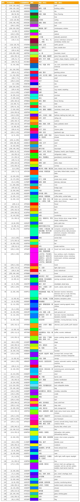

看到这里建筑物装修已经有4种模型可以处理了

1. 只还原整体的结构：mlsd
2. 还原物品的先后关系：depth
3. 比较好的还原原图有的物品，想自己后期编辑色块，改变室内装修结构seg
4. 原图的明暗关系：normal

> depth和seg除了用在建筑上，还可以用在人物照片

### 风格约束

shuffle，reference。还有第三方的、t2ia、IP-Adapter

#### shuffle

随机洗牌是非常特殊的控图类型，它的功能相当于将参考图的所有信息特征随机打乱再进行重组，生成的图像在结构、内容等方面和原图都可能不同，但在风格上你依旧能看到一丝关联。

> 不同于其他预处理器，Shuffle 在提取信息特征时完全随机，因此会收到种子值的影响，当种子值不同时预处理后的图像也会是千奇百怪。

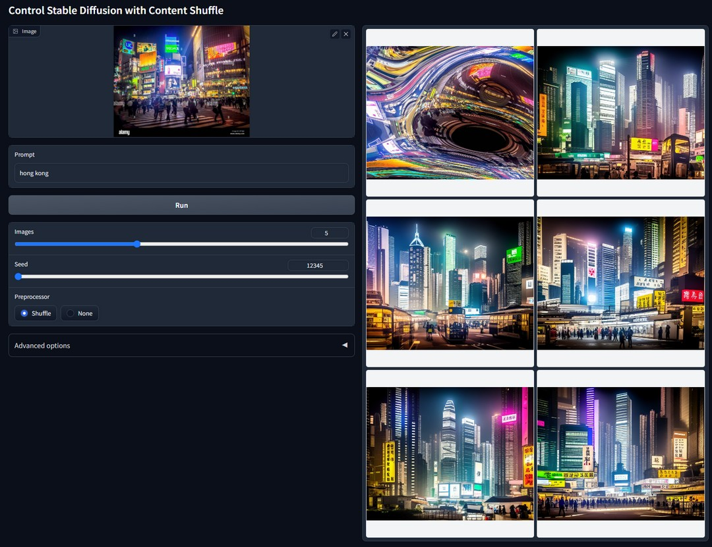

#### reference

reference只有Preprocessor没有Model，官方文档说

> 现在我们有一个 reference-only预处理，它不需要任何控制模型即可实现直接使用一张图片作为参考来引导扩散。

**预处理器：**

* reference_adain：仅参考输入图，自适应实例规范
* reference_adain+attn：仅参考输入图，自适应实例规范+Attention链接
* reference_only：仅参考输入图，今天主要讲这个预处理器。

专有选项：Style Fidelity(仅用于均衡模式)：风格保真度

> :warning:**reference_adain**
>
> 它可能用于在进行参考图像处理时，利用 AdaIN (Adaptive Instance Normalization) 机制，实现风格迁移网络(Style Transfer)等类似任务。 AdaIN 是一种用于图像样式迁移的方法，它通过将内容图像的条件概率分布与样式图像的边缘概率分布相匹配，实现将样式图像的风格应用于内容图像。这种机制可以帮助模型更好地实现图像样式的迁移和转换。

> :warning:**reference_adain+attn**
>
> ControlNet中Reference模型的Reference_adain+attn预处理器是一种高级的预处理器，用于在基于图像的生成模型（如DALL-E等）中实现精细的图像控制。它通过将输入图像的参考部分进行高级特征转换，来生成具有参考特征的新图像。这种预处理器能帮助模型在风格迁移、跨域生成等任务中取得更好的效果

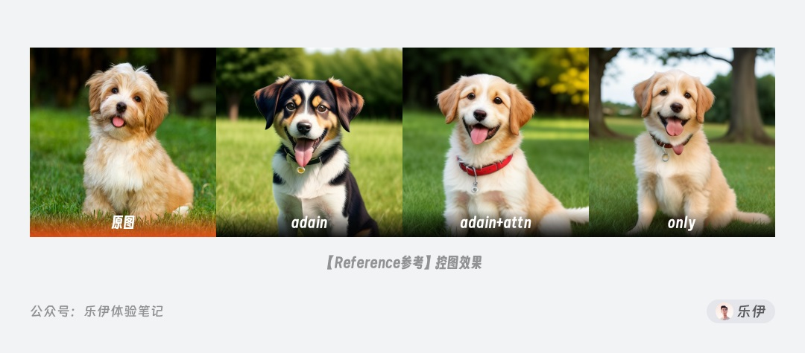

Reference 启用后下方会出现 Style Fidelity 风格保真度的参数项，数值越大则画面的稳定性越强，原图的风格保留痕迹会越明显。

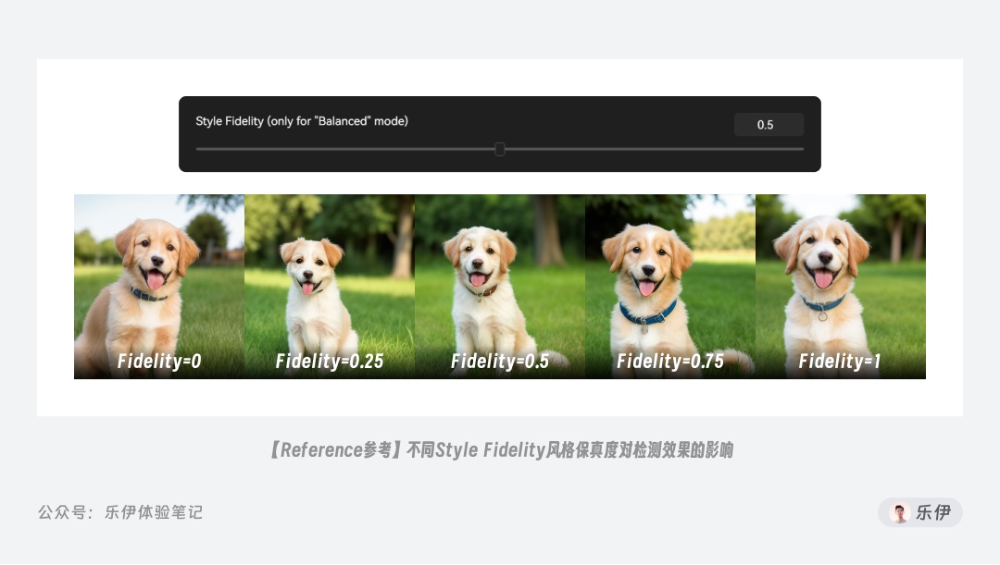

### 其它

#### ip2p

给照片加特效，比如让房子变成冬天、让房子着火

InstructP2P 的全称为 Instruct Pix2Pix 指导图生图，使用的是 Instruct Pix2Pix 数据集训练的 ControlNet。它的功能可以说和图生图基本一样，会直接参考原图的信息特征进行重绘，因此并不需要单独的预处理器即可直接使用。

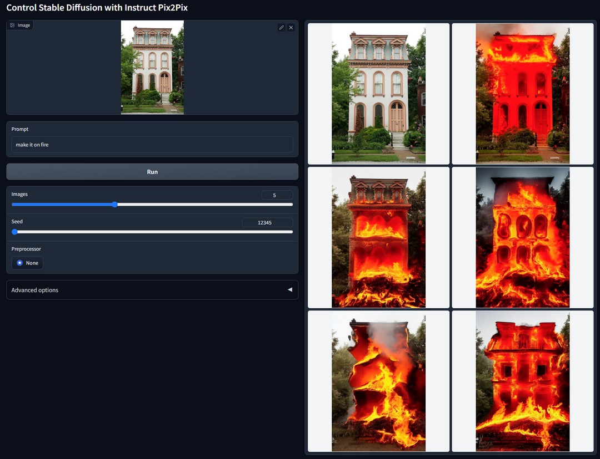

#### tile

tile主要用于恢复画质，也可以将粗略的涂鸦细化

在恢复画质时因为tile模型的工作原理是先忽略掉照片的一些细节，再加上一些细节，这些SD自己加上去的细节可能会导致生成出来的照片不像原图

>  SD 使用过程中，绘制超分辨率的高清大图一直是大家的追求，但限于显卡高昂的价格和算力瓶颈，通过 WebUI 直出图的方式始终难以达到满意的目标。后来聪明的开发者想到 Tile 分块绘制的处理方法，原理就是将超大尺寸的图像切割为显卡可以支持的小尺寸图片进行挨个绘制，再将其拼接成完整的大图，虽然绘图时间被拉长，但极大的提升了显卡性能的上限，真正意义上实现了小内存显卡绘制高清大图的操作。

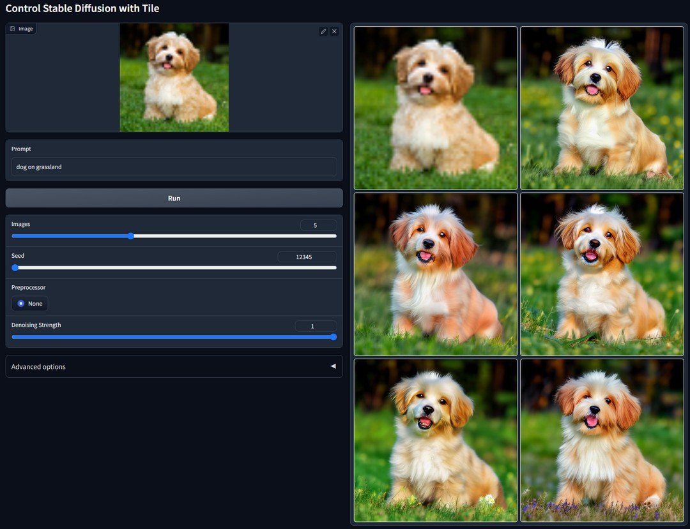

Tile 中同样提供了 3 种预处理器：colorfix、colorfix+sharp、resample，分别表示固定颜色、固定颜色+锐化、重新采样。下图中可以看到三种预处理器的绘图效果，相较之下默认的 resample 在绘制时会提供更多发挥空间，内容上和原图差异会更大。

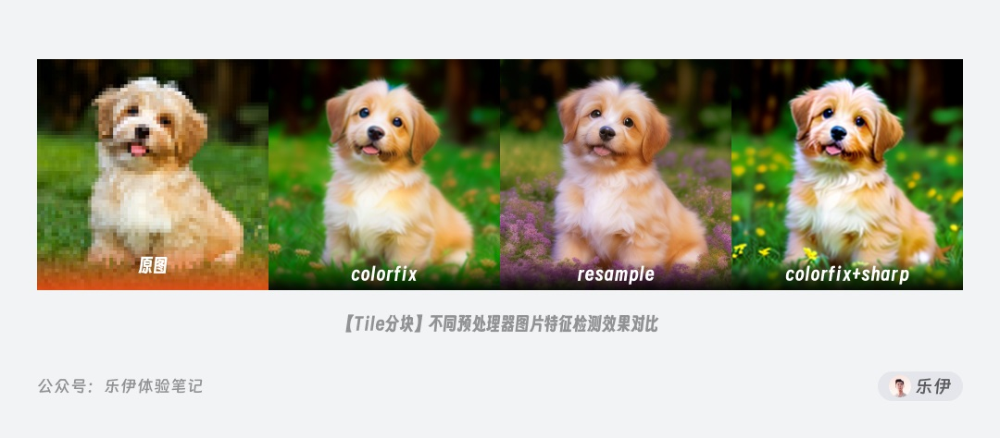

#### inpaint

和图生图里的局部重绘差不多，但是inpaint可以将重绘的地方跟原图融合的更好一点（其实都差不多）

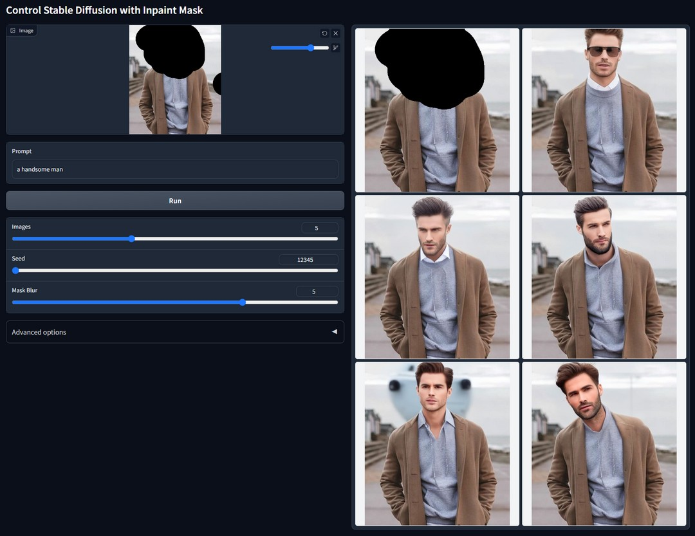

局部重绘这里提供了 3 种预处理器，Global_Harmonious、only 和 only+lama，通过下图案例整体来看出图效果上差异不大，但在环境融合效果上 Global_Harmonious 处理效果最佳，only 次之，only+lama 是清理。

## 第三方模型介绍

### Recolor

Recolor 也是近期刚更新的一种 ControlNet 类型，它的效果是给图片填充颜色，非常适合修复一些黑白老旧照片。但 Recolor 无法保证颜色准确出现特定位置上，可能会出现相互污染的情况，因此实际使用时还需配合如打断等提示词语法进行调整。

**实现老照片上色**

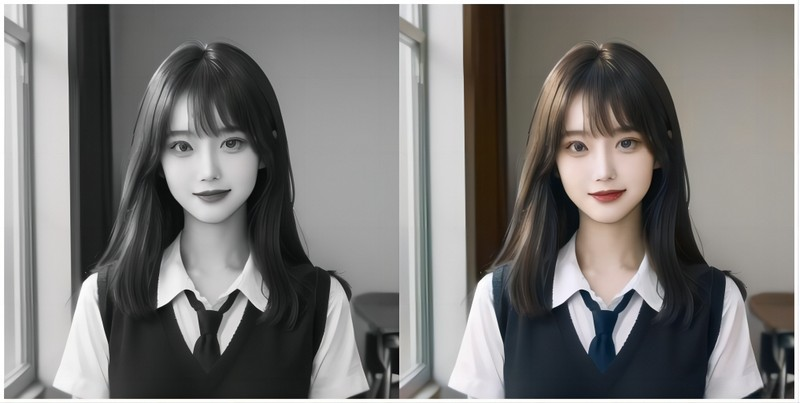

**实现头发、衣服换色**

如果只是改变头发的颜色，我们可以简单描述头发颜色的提示词即可。

例如：

```
(red hair:1.3) 
(green hair:1.3) 
(purple hair:1.3) 
(colorful hair:1.3) 
```

| red hair                                                     | colorful hair                                                | green hair                                                   |
| ------------------------------------------------------------ | ------------------------------------------------------------ | ------------------------------------------------------------ |
|  |  |  |

Recolor 需配合模型ioclab_sd15_recolor使用，这里也提供了 intensity 和 luminance2 种预处理器，通常推荐使用 luminance，预处理的效果会更好。

Recolor 的参数 Gamma Correction 伽马修正用于调整预处理时检测的图像亮度，下图中可以看到随着数值增大，预处理后的图像会越暗。

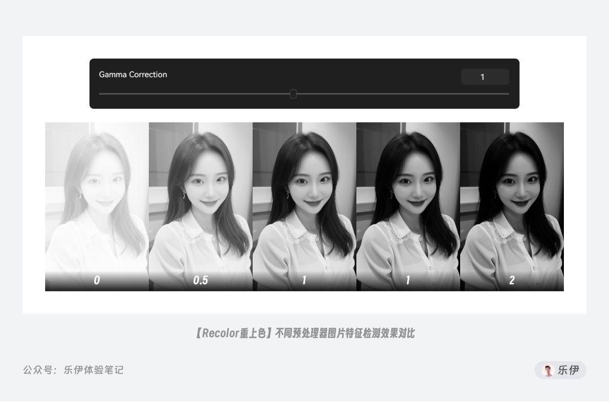

### T2I-Adapter

T2I-Adapter 由腾讯 ARC 实验室和北大视觉信息智能学习实验室联合研发的一款小型模型，它的作用是为各类文生图模型提供额外的控制引导，同时又不会影响原有模型的拓展和生成能力。名称中 T2I 指的是的 text-to-image，即我们常说的文生图，而 Adapter 是适配器的意思。

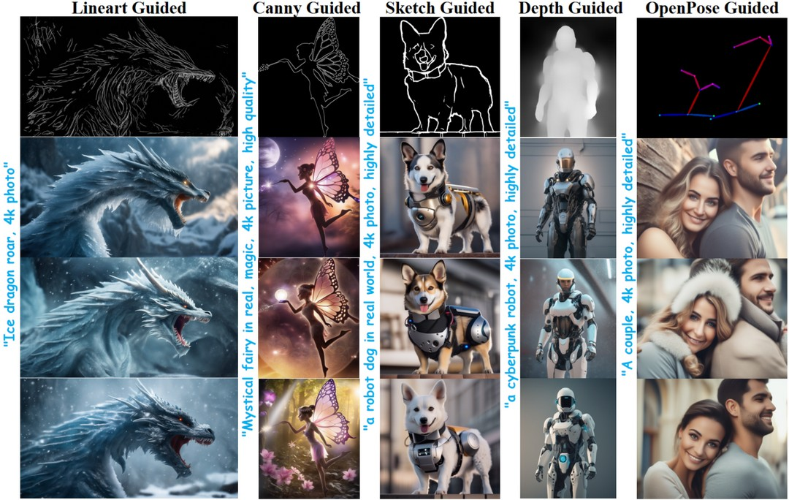

> T2I-Adapter 被集成在 ControlNet 中作为某一控制类型的选项，但实际上它提供了 Lineart、Depth、Sketch、Segmentation、Openpose 等多个类型的控图模型来使用。

T2I-Adapter 的特点是体积小，参数级只有 77M，但对图像的控制效果已经很好，且就在 9 月 8 日，它们针对 SDXL 训练的控图模型刚刚发布，是目前最推荐用于 SDXL 的 ControlNet 模型，但需要注意的是 SDXL 类模型对硬件要求较高，官方建议至少需要 15GB 的显卡内存，想体验的小伙伴可在下面地址中自行下载安装到本地。

T2I-Adapter 控图模型代码仓库地址： [https://huggingface.co/TencentARC/T2I-Adapter/tree/main/models](https://link.uisdc.com/?redirect=https%3A%2F%2Fhuggingface.co%2FTencentARC%2FT2I-Adapter%2Ftree%2Fmain%2Fmodels)

### IP-Adapter

#### IP-Adapter基础版

IP-Adapter 是腾讯的另一个实验室 Tencent AI Lab 研发的控图模型。名称中的 IP 指的是 Image Prompt 图像提示，它和 T2I-Adapter 一样是一款小型模型，但是主要用来提升文生图模型的图像提示能力。IP-Adapter 自 9 月 8 日发布后收到广泛好评，因为它在使用图生图作为参考时，对画面内容的还原十分惊艳。

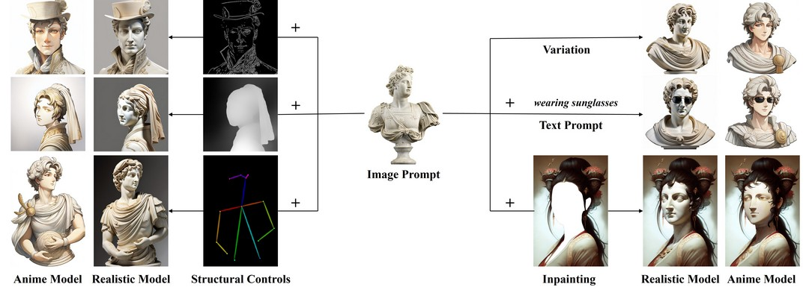

IP-Adapter 的参数级比 T2I-Adapter 更小，只有 22MB。IP-Adapter 也发布了针对 SDXL_1.0 的控图模型，感兴趣的小伙伴可以通过下方的链接下载尝试。

IP-Adapter 控图模型代码仓库地址： [https://huggingface.co/h94/IP-Adapter](https://link.uisdc.com/?redirect=https%3A%2F%2Fhuggingface.co%2Fh94%2FIP-Adapter)

#### IP-Adapter  FaceID

其中IP-Adapter  FaceID是我觉得使用最简单，效果最好的的换脸工具：[h94/IP-Adapter-FaceID · Hugging Face](https://huggingface.co/h94/IP-Adapter-FaceID)，比较

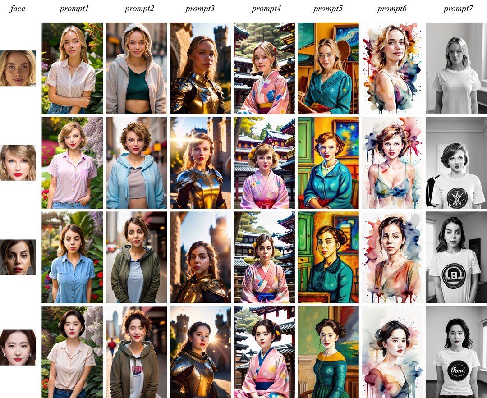

不过安装IP-Adapter  FaceID有点复杂

* 首先要去[h94/IP-Adapter-FaceID · Hugging Face](https://huggingface.co/h94/IP-Adapter-FaceID)下载 IP Adapter 需要的 Face ID 模型和 Lora
* Lora 文件特别用于提升面部 ID 的一致性，对于提高换脸效果的自然度非常关键。
* 下载完成以后，模型文件放在 `stable-diffusion-webui\extensions\sd-webui-controlnet\models`文件夹。
* Lora文件放在 `stable-diffusion-webui\models\Lora`文件夹。

* 安装 InsightFace + onnxruntime

#### InsightFace安装

> 安装 InsightFace 是 stable-diffusion-webui 使用中最难以安装的模块之一，但是大部分的换脸软件基本都用到了他。

GitHub 上有个 Issue (https://github.com/cubiq/ComfyUI_IPAdapter_plus/issues/162)专门讨论这个问题。用户`MMoneer`给出了如下解决方案：

1. 下载预编译的 Insightface 软件包：https://github.com/Gourieff/Assets/tree/main/Insightface
   1. 如果Python版本为3.10，那么下载地址是：(https://github.com/Gourieff/Assets/raw/main/Insightface/insightface-0.7.3-cp310-cp310-win_amd64.whl)。
   2. Python 3.11版本的下载地址是：https://github.com/Gourieff/Assets/raw/main/Insightface/insightface-0.7.3-cp311-cp311-win_amd64.whl。
2. 下载后将其放入 stable-diffusion-webui 的根文件夹（”webui-user.bat “文件所在文件夹）
3. 在 WebUI的根目录分别运行`CMD`和`.\venv\Scripts\activate`。
4. 升级一下Pip：`python -m pip install -U pip`。
5. 取决于你的Python版本，运行下面两个代码的其中一个：`pip install insightface-0.7.3-cp310-cp310-win_amd64.whl` (对于3.10) 或者 `pip install insightface-0.7.3-cp311-cp311-win_amd64.whl` (对于3.11)。
6. 或者你也可以用绝对路径调用`d:\Dev\sd-webui-aki-v4.8\python\python.exe -m pip install insightface-0.7.3-cp311-cp311-win_amd64.whl`

> 现在很多整合包已经报insightface预置了，就不需要以上步骤了

### InstantID 

 小红书 InstantX 团队发布了一款最新的换脸技术 InstantID，个人感觉技术上比IP-Adapter  FaceID有差距。就不详细介绍了

主页：[InstantX/InstantID · Hugging Face](https://huggingface.co/InstantX/InstantID)

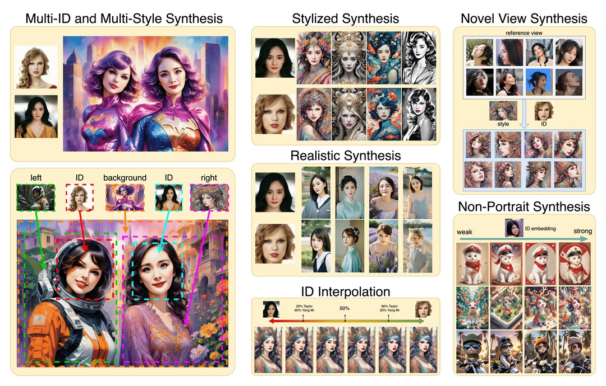

## 参考文档

* [[万字干货！一口气掌握14种 ControlNet 官方控图模型的使用方法！ - 优设网 - 学设计上优设 (uisdc.com)](https://www.uisdc.com/stable-diffusion-guide-6)](https://zhuanlan.zhihu.com/p/658675851)
* [史上最全的controlNet实操指南 - 知乎 (zhihu.com)](https://zhuanlan.zhihu.com/p/657101708)
* [【全网最详细】ComfyUI下，Insightface安装指南-聚梦小课堂_insightface如何安装-CSDN博客](https://blog.csdn.net/JuMengXiaoKeTang/article/details/136823285)