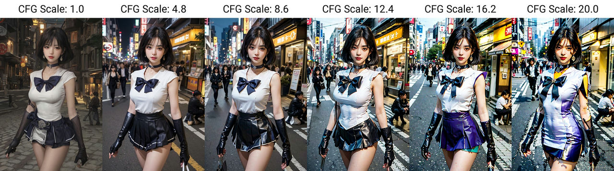

# Stable Diffusion - Prompt与参数设置

## Prompt 提示词

Stable Diffusion生图模型的精髓在于 Prompt 提示词，如何写好 Prompt 将直接影响图像的生成质量。

**1. 正向提示词**

```
(masterpiece:1.2), best quality, masterpiece, original, extremely detailed wallpaper, perfect lighting,(extremely detailed CG:1.2)
```

**2. 反向提示词**

```
NSFW, (worst quality:2), (low quality:2), (normal quality:2), normal quality, ((monochrome)), skin spots, skin blemishes, age spot, (ugly:1.331), (duplicate:1.331), (morbid:1.21), (mutilated:1.21),  mutated hands, (poorly drawn hands:1.5), blurry, (bad anatomy:1.21), (bad proportions:1.331), extra limbs, (disfigured:1.331), (missing arms:1.331), (extra legs:1.331), (fused fingers:1.61051), (too many fingers:1.61051), (unclear eyes:1.331), lowers, bad hands, missing fingers, extra digit,bad hands, missing fingers, (((extra arms and legs))),
```

### 提示词结构化

Prompt 提示词可以分为 4 段式结构：画质画风 + 画面主体 + 画面细节 + 风格参考

1. 画面画风：主要是大模型或 LoRA 模型的 Tag、正向画质词、画作类型等
2. 画面主体：画面核心内容、主体人/事/物/景、主体特征/动作等
3. 画面细节：场景细节、人物细节、环境灯光、画面构图等
4. 风格参考：艺术风格、渲染器、Embedding Tag 等

### 提示词语法

1. **提示词排序**：越前面的词汇越受 AI 重视，重要事物的提示词放前面
2. **增强/减弱**：`(提示词:权重数值)`，默认 1，大于 1 加强，低于 1 减弱。如 `(doctor:1.3)`
3. **混合**：`提示词 | 提示词`，实现多个要素混合，如 `[red|blue] hair` 红蓝色头发混合
4. **+ 和 AND**：用于连接短提示词，AND 两端要加空格
5. **分步渲染**：`[提示词 A:提示词 B:数值]`，先按提示词 A 生成，在设定的数值后朝提示词 B 变化。如· 前 30 步画狗后面的画猫，`[dog:cat:0.9]` 前面 90%画狗后面 10%画猫
6. **正向提示词**：masterpiece, best quality 等画质词，用于提升画面质量
7. **反向提示词**：nsfw, bad hands, missing fingers……, 用于不想在画面中出现的内容
8. **Emoji**：支持 emoji，如 形容表情， 修饰手

### 常用提示词

人物及主题特征

| 分类     | 英文                      | 中文                      |
| -------- | ------------------------- | ------------------------- |
| 服饰穿搭 | white dress               | 白色连衣裙                |
| 发型发色 | beautiful hair, long hair | 漂亮的头发，长发           |
| 五官特点 | smail eyes, big mouth     | 明亮的眼睛，大嘴巴         |
| 面部表情 | smiling                   | 微笑                      |
| 肢体动作 | waving the hand           | 挥手                      |

场景特征

| 分类       | 英文                 | 中文         |
| ---------- | -------------------- | ----------- |
| 室内、室外 | Indoor, Outdoor      | 室内、室外   |
| 大场景     | forest, city, street | 森林、城市、街道 |
| 小细节     | tree, white flower   | 树木、白花   |

环境光照

| 分类      | 英文                  | 中文         |
| ---------- | --------------------- | ----------- |
| 黑夜、白天 | Night, Day            | 夜晚、白天  |
| 特定时段   | morning, sunrise      | 早晨、日出  |
| 光环境     | sunlight, bright, dark| 阳光、明亮、黑暗 |
| 天空       | blue sky, starry sky  | 蓝天、星空  |


画幅视角

| 分类     | 英文                                       | 中文               |
| -------- | ------------------------------------------ | ------------------ |
| 距离     | close-up, distant                          | 近景、远景        |
| 人物比例 | full body, upper body                      | 全身、上身        |
| 观察角度 | from above, view of back, character center | 从上方、背影、主体中心 |
| 镜头类型 | wide angle, sorry A7                       | 广角、A7抱歉      |


画质提示词

| 分类       | 英文                          | 中文            |
| ---------- | ----------------------------- | --------------- |
| 一般高画质 | best quality, highly detailed | 最佳质量、高度详细 |
| 特定分辨率 | 4K, 8K                        | 4K、8K         |


画风提示词

| 分类     | 英文                                   | 中文               |
| -------- | -------------------------------------- | ------------------ |
| 插画风格 | illustration, painting, paintbrush     | 插画、绘画、毛笔   |
| 二次元   | anime, comic, game CG                  | 动漫、漫画、游戏CG |
| 写实风格 | photorealistic, realistic, photograph | 照片写实、逼真、照片 |

#### 正向画质

| 英文            | 中文       |
| --------------- | ---------- |
| masterpiece     | 杰作       |
| best quality    | 最佳质量   |
| highly detailed | 高度详细   |
| professional    | 专业       |
| beautiful       | 美丽       |
| HDR             | 高动态范围 |
| UHD             | 超高清     |
| 4K              | 4K         |
| 8K              | 8K         |
| vivid colors    | 生动色彩   |

#### 细节修饰

| 英文                  | 中文       |
| --------------------- | ---------- |
| sharp focus           | 锐利对焦   |
| smooth                | 光滑       |
| sharp                 | 锐利       |
| matte                 | 磨砂       |
| ultrawide shot        | 超广角拍摄 |
| low angle             | 低角度     |
| high low              | 高低混合   |
| up close portraits of | 近距离肖像 |
| upscaled              | 放大处理   |
| wallpaper             | 壁纸       |
| cinematic             | 电影般的   |
| bokeh                 | 背景虚化   |

#### 环境灯光

| 英文                     | 中文           |
| ------------------------ | -------------- |
| dreamatic lighting       | 梦幻灯光       |
| ambient lighting         | 环境照明       |
| light effect             | 光效           |
| uplight                  | 向上照明       |
| volumetric lighting      | 体积照明       |
| mood lighting            | 情绪照明       |
| bright                   | 明亮           |
| soft lights              | 柔和光线       |
| soft illumination        | 柔和照明       |
| rays of shimmering light | 闪闪发光的光线 |
| studio lighting          | 工作室照明     |

#### 风格渲染

| 英文                   | 中文                    |
| ---------------------- | ----------------------- |
| portraits              | 肖像                    |
| landscape              | 风景                    |
| anime                  | 动漫                    |
| sci-fi                 | 科幻                    |
| photography            | 摄影                    |
| illustration           | 插画                    |
| concept art            | 概念艺术                |
| realism                | 现实主义                |
| watercolor painting    | 水彩画                  |
| cyberpunk              | 赛博朋克                |
| wash painting          | 水墨画                  |
| simple doodle          | 简笔画                  |
| trending on ArtStation | 在ArtStation上流行      |
| Blender                | Blender（软件名）       |
| Cinema4D               | Cinema4D（软件名）      |
| Maya                   | Maya（软件名）          |
| V-Ray                  | V-Ray（软件名）         |
| Unreal Engine          | 虚幻引擎                |
| ZBrush                 | ZBrush（软件名）        |
| Octane Render          | Octane Render（软件名） |

### ChatGPT 辅助生成提示词

我们也可以借助 ChatGPT 帮我们生成提示词参考。

我们可以通过类似Chatbox的工具设定一个搭档，人物设定如下：


```
StableDiffusion是一款利用深度学习的文生图模型，支持通过使用提示词来产生新的图像，描述要包含或省略的元素。
我在这里引入StableDiffusion算法中的Prompt概念，又被称为提示符。
下面的prompt是用来指导AI绘画模型创作图像的。它们包含了图像的各种细节，如人物的外观、背景、颜色和光线效果，以及图像的主题和风格。这些prompt的格式经常包含括号内的加权数字，用于指定某些细节的重要性或强调。例如，"(masterpiece:1.5)"表示作品质量是非常重要的，多个括号也有类似作用。此外，如果使用中括号，如"{blue hair:white hair:0.3}"，这代表将蓝发和白发加以融合，蓝发占比为0.3。
以下是用prompt帮助AI模型生成图像的例子：masterpiece,(bestquality),highlydetailed,ultra-detailed,cold,solo,(1girl),(detailedeyes),(shinegoldeneyes),(longliverhair),expressionless,(long sleeves),(puffy sleeves),(white wings),shinehalo,(heavymetal:1.2),(metaljewelry),cross-lacedfootwear (chain),(Whitedoves:1.2)

仿照例子，给出一套详细描述以下内容的prompt。直接开始给出prompt不需要用自然语言描述：
```

使用的效果


生成的

```
olive skin, sitting in a boat on the ocean, wearing a hat, in a white dress with side slit, bronze sculpture in the distance, aestheticism style
```

默认画的没有青铜雕像，自己修改一下权重

```
olive skin, sitting in a boat on the ocean, wearing a hat, in a white dress with side slit, (bronze sculpture in the distance:1.1), aestheticism style
```


### Prompt 扩展

prompt-all-in-one 是一种非常实用的技术，它可以极大地提高 WebUI 的交互性和易用性。

插件网址： https://github.com/Physton/sd-webui-prompt-all-in-one

#### 特性

Prompt-all-in-one 插件功能主要包括自动中文转英文、一键转英文、快速修改权重、收藏常用提示词等。

- `直观的输入界面` 提供更直观、强大的输入界面功能，提示词双语对照显示，一目了然。
- `自动翻译` 自动翻译提示词/反向提示词，支持多种语言。
- `几十种翻译服务` 几十个在线翻译，还有离线翻译模型。
- `多国语言` 支持世界上大部分国家语言的翻译，你可以使用任何语言输入提示词。
- `历史记录` 当提示词/反向提示词发生变化时，自动记录。
- `收藏夹` 一键收藏、批量收藏你喜欢的提示词/反向提示词。
- `快速调整` 拖拽调整提示词位置，一键增减提示词权重，一键删除、一键禁用、一键翻译、一键收藏等等。
- `批量操作` 框选多个提示词/反向提示词，一键删除、一键翻译、一键收藏等等。
- `ChatGPT` 通过ChatGPT智能生成提示词。
- `提示词黑名单` 设置黑名单，自动过滤提示词。
- `一键添加提示词` 几千个提示词，点击即可使用。
- `关键词高亮` Lora、LyCORIS、Textual Inversion 高亮和检测。
- `关键词自定义颜色` 不同种类的关键词，可以自定义显示不同的颜色。
- `自定义主题` 自定义主题，自定义扩展风格。

#### 使用帮助

[sd-webui-prompt-all-in-one/README_CN.MD at main · Physton/sd-webui-prompt-all-in-one (github.com)](https://github.com/Physton/sd-webui-prompt-all-in-one/blob/main/README_CN.MD)

### 图像反推

图像反推 (Interrogate) 功能，是指根据给定的图像生成一个或多个文本提示，这些提示可以描述图像的内容、风格、细节等方面。这个功能可以帮助用户快速找到合适的文本提示，从而生成自己想要的图像变体。图像反推功能，使用了 CLIP (BLIP) 和 DeepBooru 两种提示词反推算法，分别使用视觉和语言的联合表示和基于标签的图像检索。

建议结合使用，即：

- CLIP：类似图像的描述 (Caption)；
- DeepBooru：类似图像的分类；

> CLIP下载的模型比较多，DeepBooru相对下载的东西少一些


例如，效果如下：

BLIP：

> a woman sitting on a boat in the ocean wearing a hat and a white dress with a slit down the side,olive skin,aestheticism,Daphne Fedarb,a bronze sculpture,

DeepBooru，阈值不同，类别的数量有所差异：

`score threshold:` 0.35

> 1girl, bare legs, bare shoulders, barefoot, beach, blonde hair, blue sky, boat, day, dress, full body, hat, horizon, lips, long hair, looking at viewer, ocean, outdoors, pier, pool, poolside, railing, realistic, red lips, sitting, sky, sleeveless, sleeveless dress, smile, solo, stairs, sun hat, water, watercraft, white dress

`score threshold`: 0.5

> 1girl, barefoot, boat, day, dress, full body, hat, horizon, long hair, ocean, pier, pool, poolside, railing, realistic, sitting, solo, sun hat, water, watercraft, white dress

修改反推设置的建议：

- `num_beams`: 增加到 2 。
- `score threshold`: 降低至 0.35，一般而言，分类准确率 0.35 已经足够，影响 DeepBooru 的输出。

即：


## 参数设置

### Clip skip

> CLIP是OpenAI开发的一个模型，对图像和文本数据进行训练，理解图像内容与自然语言描述之间的关联。CLIP被用于确保输出图像与用户提供的文本描述相匹配。
>
> CLIP模型具有由层组成的结构，每一层比上一层更具体。例如，如果第一层是“人”，则第二层可能是：“男性”和“女性”；然后，如果您沿着“男性”的路径走，第三层可能是：男人、男孩、小伙子、父亲、爷爷等。

可以将CLIP skip想象成“`您希望文本模型有多精确`”的设置。如果您有关于一个年轻男子站在田野上的详细提示，那么在较低的clip阶段中，您会得到“一个站立的男人的图片”，然后更深入的是“站立的年轻男人”，“站在森林中的年轻男人”等等。 


### CFG Scale

在图像生成过程中，CFG Scale 参数是一个关键因素，它控制着文本提示对生成图像的影响程度。

简而言之CFG Scale ：

- 参数越大，生成的图像与文本提示的相关性越高，但可能会失真。
- 数值越小，相关性则越低，越有可能偏离提示或输入图像，但质量越好。

在实际应用中，将其设置在 7 到 11 之间往往能获得最佳的低噪效果。



> * **Clip skip**：可以理解成精确度（精确到那一层，类似于小数点后第几位）
>
> * **CFG Scale**：可以理解成准确度

### Sampling

在 Stable Diffusion 模型中，采样方法（Sampling Methods）是指在生成图像时用于从模型的概率分布中抽取样本的算法。这些方法对于生成图像的质量、多样性和速度都有重要影响。

采样迭代步数是决定图像细节和质量的关键。每一步迭代都是基于前一步的图像进行细化，理论上步数越多，图像越精细。但是，过多的步数会导致资源消耗增加和生成速度变慢，而且在达到一定步数后，图像质量的提升会逐渐减少。通常，20到30步是一个平衡点，既能保证图像质量又不会过度消耗资源。


那么每个方法对应的产出效果大致是怎么样的呢？下面是reddit 社区2个大佬做出来的对比效果图。


* **Euler、DDIM、PLMS、LMS Karras和Heun**：它们代表传统采样器，使用常微分方程求解器或原始的扩散求解器。DDIM在大约与Euler相同的步骤数下收敛，但变化更多。这是因为它在采样步骤中注入随机噪声。PLMS表现不佳。LMS Karras似乎难以收敛。Heun收敛速度更快，但由于是二阶方法，速度慢了两倍。

* **DPM fast、DPM adaptive、DPM2和DPM2 Karras**：DPM fast收敛性不佳。DPM adaptive表现出色，因为它使用自己的自适应采样步骤。它可能非常慢。DPM2和DPM2 Karras的表现优于Euler，但同样以速度慢两倍为代价。

* **DPM++ SDE和DPM++ SDE Karras**：与传统采样器有相同缺点，但质量测试中表现最佳。随着步骤数的变化，图像会显著波动。
* **DPM++ 2M和DPM++ 2M Karras**：DPM++ 2M和DPM++ 2M Karras表现良好，步骤数足够高时收敛得更快。

* **UniPC**：UniPC比Euler稍微慢一点，但还不错。
* **DIMM**：DDIM在最少的8步内就能产生该组中最高质量的图像。

### Denoising strength

* 降噪强度决定在采样步骤之前向图像添加多少噪声。
* 降噪强度的取值范围为0到1。0表示输入图像中不添加噪声。1表示输入图像完全被噪声替换。
* 降噪强度可以理解为保留原始图像和创建全新图像之间的平衡。降噪强度越高，图像变化越大。


### Seed

种子值控制了图像生成的随机性。通过固定种子值，可以重现特定的图像结果，这对于复现喜欢的图像或进行微调非常有用。

### Width、Height

生成图像的尺寸，数值越大越消耗显存，最佳范围在512-768像素。

### Hi-Res Fix

高清修复，也称为超分辨率，是在图像生成后提升其分辨率和细节的一种技术。通过这种方法，即使是从较低分辨率的图像开始，也可以生成看起来更清晰、更精细的结果。这对于需要放大细节或改善图像质量的场景特别有用。 

### Tiling

平铺功能用于生成重复的图案或纹理。这在创建壁纸、纹理或其他需要连续重复图案的场景中非常有用。尽管不是每个项目都需要这个功能，但它在特定情况下可以创造出独特的视觉效果。

### Face Restoration

面部修复是一个专门用于改善人物面部绘制效果的功能，特别适用于需要高度写实的人像图像。当启用此功能时，模型会尝试修正人脸的扭曲和错误，但对于多样化的二次元动漫风格，效果可能并不显著。因此，根据你的具体需求来决定是否启用此功能。

## 脚本

这里介绍3款文生图就能用的通用脚本，其它脚本当讲到图生图时再讲解

### 提示词矩阵

比如你想试几个提示词对画面的影响，就可以用这个脚本`Prompt matrix`


使用方法是：每个提示词之间用竖线分隔，就会生成对比图。比如说，我给提示词中加入`Mountain`、`blue hair`进行对比，实际出图就是这样的：

> ```
> masterpiece, best quality,t-shirt, 1girl, |Mountain|blue hair, 
> ```

这样很直观的进行对比，一眼就决定要用哪个提示词了，不用再删删减减 重复生成四次，再把四幅图放一起进行对比，太费时间了。这个功能就好用的很。


* “把可变部分呢放在提示词文本的开头”，由于在Stable-Diffusion中提示词越靠前权重越高，所以勾选后提示词“`1 cute girl|pink hair|black shirt|black glasses`”，组合后就会是：“`pink hair, 1 cute girl`”,“`black shirt, 1 cute girl`”以此类推。
* “为每张图片使用不同随机种子”，为会每张生成图片添加一个随机种子
* “选择提示词”，提示词矩阵功能即可以给正面提示词使用，也可以给负面提示词使用，使用方法都是一样的。
* “选择分割符”，最终组合提示词时，使用的分隔符，选择逗号即可
* 宫格图边框（像素）就是让最终出图的图片中间保留一点空隙，这个功能效果看个人喜欢，如果喜欢最终出图有空间，适当的增加一点边框像素即可。

合理运用提示词矩阵功能，可以帮助我们快速验证各种关键词和大模型，提升我们整体的出图效率。

### 从文本框或文件载入提示词

这个脚本就是从文本中指定各种参数用于生成图片，这样就可以进行批量处理

#### 语法

参数前面加`--`，多个参数之间用空格分开，以换行进行区分生成多少张图片，如果参数对应的值为文本则需要添加双引号，为数字则不需要

`Prompts from file or textbox`


```
--prompt "city" 
--prompt "snow mountain"
--prompt "steppe"
--prompt "steppe" --sampler_name "DPM++ SDE Karras" --seed 2740754650
```

> 这会生成四张图片，分别是：
>
> * 城市
> * 雪山 
> * 大草原
> * 大草原，指定采样方法为：DPM++ SDE Karras ，随机种子是：2740754650
>
> 

#### 常用参数

* “sd_model”：模型名称
* “outpath_samples”：样本输出路径
* “outpath_grids”：网格输出路径
* “prompt_for_display”：用于展示的提示词
* “prompt”：正向提示词
* “negative_prompt”：负面提示词
* “styles”：提示词模板（你自己设置的提示词模板）
* “seed”：随机种子
* “subseed_strength”：次级种子强度
* “subseed”：次级种子
* “seed_resize_from_h”：次级种子高度
* “seed_resize_from_w”：次级种子宽度
* “sampler_index”：采样器索引
* “sampler_name”：采样器名称
* “batch_size”：生成批次
* “n_iter”：每批数量
* “steps”：采样迭代步数
* “cfg_scale”：提词相关性
* “width”：宽度
* “height”：高度
* “restore_faces”：面部修复
* “tiling”：平铺
* “do_not_save_samples”：不保存样本
* “do_not_save_grid”：不保存网格

### XYZ图表

**我们想进行不同的模型在不同的迭代步数下的表现情况**

`X/Y/Z plot`


* X轴选中迭代步数，填写`10,15,20`

* Y轴选中模型名，选择`majicmixRealistic_v7、realisticVisionV51_v51VAE`

正向提示词

```
masterpiece, best quality,t-shirt, 1girl, 
```

这样就会形成一个`3 * 2`的矩阵供我们进行比较


