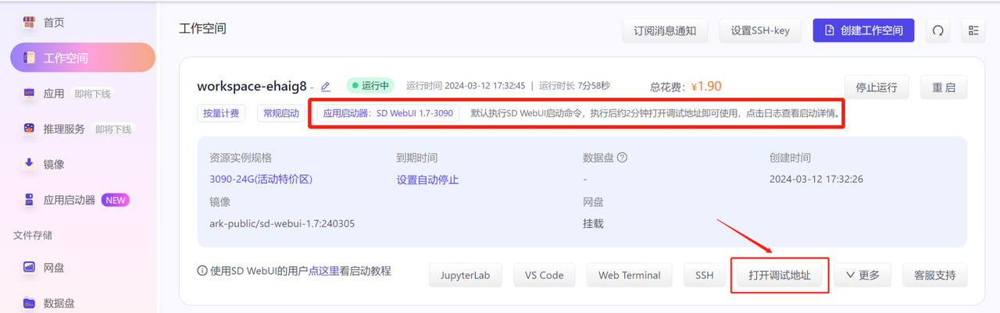
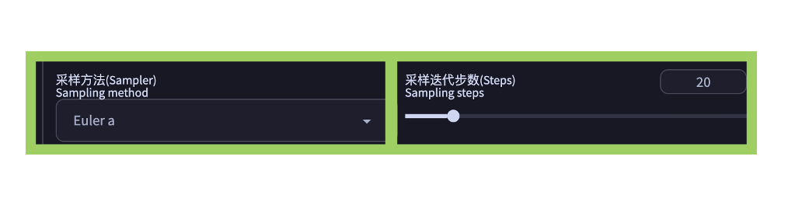

# SD-WebUI

Stable Diffusion WebUI 是 Stable Diffusion 的浏览器界面，Stable Diffusion 是一个可以从文本提示生成图像的 AI 模型，或者使用文本提示修改现有图像。

Stable Diffusion Web UI 是探索 Stable Diffusion 可能性并仅通过几次点击创建惊人图像的好方法。

* [AUTOMATIC1111/stable-diffusion-webui: Stable Diffusion web UI (github.com)](https://github.com/AUTOMATIC1111/stable-diffusion-webui)

## SD-WebUI本机部署

SD-WebUI本机部署并不难，网上也有一键包，但是机器配置要求比较高

### 硬件配置

* **显卡**：SD绘画产出一张满意的图像需要不断反复调试，显卡性能的好坏直接影响出图的效率，出图效率不高将会导致耗费大量的时间在漫长的等待中。这里推荐英伟达**RTX3060TI（显存推荐8G以上）**或同等性能以上显卡。显卡最低配置也要达到GTX1060（显存4G）。
* **内存**：8G或以上
* **CPU**：无硬性要求
* **SSD/机械硬盘**：100~150GB左右，SD在部署完成后约占用10.7G左右磁盘空间，后续随着各种大模型、LORA、ControlNet等文件及插件功能的下载及使用将会极大占用系统磁盘空间。这里推荐将SD部署在SSD（固态硬盘）中，有利于提高读取大模型文件速度。

* **操作系统**：win10/win11

### 软件环境

* git
* Python
* 安装CUDA
* PyTorch (基于CUDA版本)

> * CUDA是由NVIDIA开发的一种并行计算平台和应用程序编程接口（API）。它的主要目标不仅仅是用于图形渲染，也是利用NVIDIA的GPU（图形处理单元）来加速通用计算任务。
> * PyTorch是一个Facebook开源的Python机器学习库，基于Torch，用于自然语言处理等应用程序。

```sh
PS C:\Users\lgc653> nvidia-smi   
Tue Apr 30 16:12:06 2024       
+-----------------------------------------------------------------------------------------+
| NVIDIA-SMI 551.76                 Driver Version: 551.76         CUDA Version: 12.4     |
|-----------------------------------------+------------------------+----------------------+
| GPU  Name                     TCC/WDDM  | Bus-Id          Disp.A | Volatile Uncorr. ECC |
| Fan  Temp   Perf          Pwr:Usage/Cap |           Memory-Usage | GPU-Util  Compute M. |
|                                         |                        |               MIG M. |
|=========================================+========================+======================|
|   0  NVIDIA GeForce RTX 3050 ...  WDDM  |   00000000:01:00.0  On |                  N/A |
| N/A   35C    P5             12W /   60W |    1923MiB /   4096MiB |     10%      Default |
|                                         |                        |                  N/A |
+-----------------------------------------+------------------------+----------------------+
```

根据`CUDA Version`选择PyTorch版本


```sh
pip3 install torch torchvision torchaudio --index-url https://download.pytorch.org/whl/cu121
git clone https://github.com/AUTOMATIC1111/stable-diffusion-webui.git
cd stable-diffusion-webui
webui.bat
```

> * 有的时候可能由于网络问题导致 pip 安装文件下载失败
> * 其他库的安装完毕会去下在 SD 的模型，好几个G，如果网速比较慢的话需要耐心等待

> **CUDA Toolkit**是否可用可以安装完torch可以检测一下，如果都是`True`代表OK
>
> 使用你刚才安装torch的python环境，例如：`d:\Dev\webui_forge\system\python\python.exe`
>
> ```python
> import torch
> print(torch.cuda.is_available()) # cuda是否可用
> print(torch.version.cuda) # 查看pytorch 对应的cuda版本
> torch.cuda.device_count() # 返回gpu数量
> torch.cuda.current_device()  # 返回当前设备索引
> torch.cuda.get_device_name(0) # 返回gpu名字，设备索引默认从0开始；
> from torch.backends import cudnn
> print(cudnn.is_available()) # cudnn是否可用
> print(cudnn.version())  # 查看pytorch 对应的cudnn版本
> ```

### 绘世-启动器

绘世-启动器，原名SD-WebUI启动器，是一款由bilibiliB站大佬`@秋葉aaaki`制作并免费发布的StableDiffusionWebUI启动器电脑桌面版！无须安装部署，开箱即用，傻瓜式操作！低配电脑也可使用，显卡性能低也能用，自带防爆显存功能，一键启动/修复/更新/模型下载/模型训练/模型管理全支持。

整合包支持SDXL，预装多种必须模型。无需安装git、python、cuda等任何内容，无需任何配置解压即用

> SD-WebUl启动器发布地址：https://www.bilibili.com/video/BV1ne4y1V7QU

### Stable Diffusion WebUI Forge

Stable Diffusion WebUI Forge是Stable Diffusion WebUI的优化版本，和原版WebUI的功能基本保持一致，但是大幅简化了开发流程，优化了资源管理，并加快了推理速度。 

> forge的开发者Lvmin Zhang，是苏州大学本科毕业，现在斯坦福读博。还是ControlNet、LayerDiffuse的作者。

* [lllyasviel/stable-diffusion-webui-forge (github.com)](https://github.com/lllyasviel/stable-diffusion-webui-forge)

* [>>> Click Here to Download One-Click Package<<<](https://github.com/lllyasviel/stable-diffusion-webui-forge/releases/download/latest/webui_forge_cu121_torch21.7z)

Stable Diffusion WebUI Forge提供`One-Click Package`，下载下来啥都不用配置（先用`update.bat`升级一下，否则不支持LayerDiffuse等插件），直接运行就行了。

> 我的`NVIDIA GeForce RTX 3050 4G`做个图速度还蛮快。基本10-15秒内出图，做蒙版图生图比SD-WebUI快很多。做图像切分等操作时基本没有爆过显存。如果你只需要主流的功能可以选择Forge

### 共享SD-WebUI和WebUI Forge

可以把目录建立软连接，这样模型这些只用存一份即可

```bat
mklink /D d:\Dev\webui_forge\webui\models\Stable-diffusion d:\Dev\sd-webui-aki-v4.8\models\Stable-diffusion
mklink /D d:\Dev\webui_forge\webui\models\ControlNet d:\Dev\sd-webui-aki-v4.8\models\ControlNet
mklink /D d:\Dev\webui_forge\webui\models\ControlNetPreprocessor d:\Dev\sd-webui-aki-v4.8\extensions\sd-webui-controlnet\annotator\downloads
mklink /D d:\Dev\webui_forge\webui\models\VAE\ d:\Dev\sd-webui-aki-v4.8\models\VAE
mklink /D D:\Dev\webui_forge\webui\embeddings d:\Dev\sd-webui-aki-v4.8\embeddings
mklink /D D:\Dev\webui_forge\webui\models\hypernetworks d:\Dev\sd-webui-aki-v4.8\models\hypernetworks
mklink /D D:\Dev\webui_forge\webui\models\Lora d:\Dev\sd-webui-aki-v4.8\models\Lora
# 以下为插件
mklink /D d:\Dev\webui_forge\webui\models\insightface\ d:\Dev\sd-webui-aki-v4.8\models\insightface\
mklink /D d:\Dev\webui_forge\webui\extensions\sd-webui-animatediff\model d:\Dev\sd-webui-aki-v4.8\extensions\sd-webui-animatediff\model
mklink /D d:\Dev\webui_forge\webui\extensions\sd-webui-inpaint-anything\models D:\Dev\sd-webui-aki-v4.8\extensions\sd-webui-segment-anything\models\sam
mklink /D  D:\Dev\webui_forge\webui\models\torch_deepdanbooru\  d:\Dev\sd-webui-aki-v4.8\models\torch_deepdanbooru\
```

### ComfyUI

ComfyUI是一个**用于稳定扩散模型的图形用户界面和后台工具**。


**ComfyUI 是一个基于节点流程的 Stable Diffusion 操作界面，优化了内存管理和出图速度，提供了更高的可配置性和灵活性**。以下是 ComfyUI 和 Diffusion 相关的一些详细点：

- **内存管理与出图速度**：ComfyUI 相较于其他 WebUI，有更好的内存管理功能，可以在使用较少内存的情况下生成质量更高的图像，并且提高了出图速度。
- **工作流定制与复现性**：ComfyUI 实现了精准的工作流定制以及完善的可复现性。用户可以通过调整不同的模块连接来达到期望的出图效果，这提高了使用的复杂度但同时也提升了控制的精确度。
- **操作界面与流程展示**：ComfyUI 以工作流的形式展现基于 stable diffusion 模型的文生图和图生图的过程，采用拖拽式操作链接各个节点，例如 base model、vae、controlnet 等，使得整个生成过程更加清晰和易于理解。
- **模型支持与体验提升**：ComfyUI 还支持最新的图像生成模型 SDXL，该模型专为更逼真的输出定制，提供改进的脸部生成、清晰的文字生成以及多种图像风格等特性，通过较短的提示词创建美观的艺术作品。

> ComfyUI基于工作流模式，对最新的技术很快就有插件支持，比如*BrushNet*等

ComfyUI提供`One-Click Package`，下载下来啥都不用配置：[Direct link to download](https://github.com/comfyanonymous/ComfyUI/releases/download/latest/ComfyUI_windows_portable_nvidia_cu121_or_cpu.7z)

### 共享ComfyUI和WebUI Forge

可以把目录建立软连接，这样模型这些只用存一份即可

```bat
mklink /D d:\Dev\ComfyUI\ComfyUI\models\checkpoints d:\Dev\sd-webui-aki-v4.8\models\Stable-diffusion
mklink /D d:\Dev\ComfyUI\ComfyUI\models\controlnet d:\Dev\sd-webui-aki-v4.8\models\ControlNet
mklink /D d:\Dev\ComfyUI\ComfyUI\models\vae d:\Dev\sd-webui-aki-v4.8\models\VAE
mklink /D d:\Dev\ComfyUI\ComfyUI\models\embeddings d:\Dev\sd-webui-aki-v4.8\embeddings
mklink /D d:\Dev\ComfyUI\ComfyUI\models\hypernetworks d:\Dev\sd-webui-aki-v4.8\models\hypernetworks
mklink /D d:\Dev\ComfyUI\ComfyUI\models\loras d:\Dev\sd-webui-aki-v4.8\models\Lora
# 以下为插件
# ComfyUI IPAdapter plus
mklink D:\Dev\ComfyUI\ComfyUI\models\clip_vision\CLIP-ViT-H-14-laion2B-s32B-b79K.safetensors D:\Dev\sd-webui-aki-v4.8\extensions\sd-webui-controlnet\annotator\downloads\CLIP-ViT-H-14.safetensors

mklink /D D:\Dev\ComfyUI\ComfyUI\models\insightface d:\Dev\sd-webui-aki-v4.8\models\insightface\

# LayerDiffuse
mklink /D d:\Dev\ComfyUI\ComfyUI\models\layer_model d:\Dev\webui_forge\webui\models\layer_model\
# IC-Light
mklink /D d:\Dev\ComfyUI\ComfyUI\models\unet d:\Dev\webui_forge\webui\models\unet\
```

### 总结

* **SD-WebUI**：最经典，兼容性最好，网上资料也最多，但是一些新技术支持较慢，性能相对较差。
* **Stable Diffusion WebUI Forge**：性能非常好，入门显卡也能较快出图，作者自己开发的新技术支持较快，经典插件基本都支持。
* **ComfyUI**：理解Stable Diffusion原理后使用更好，能够保存工作流，适合于已经形成流程的工作。各种新技术都有人做成插件。

## SD-WebUI云部署

* [揽睿星舟-一站式AI服务平台和AI应用生态 (lanrui-ai.com)](https://www.lanrui-ai.com/)

* [Cephalon Cloud 端脑云 - AIGC 应用平台](https://cephalon.cloud/#/aigc)

* [OneThingAI算力云 - 热门GPU算力租赁服务平台](https://onethingai.com/)

> * 揽睿星舟这个是一键式部署，比较简单，性价比过得去
>
> * 使用阿里云、腾讯云的GPU机型要有比较好的活动性价比超高，但是需要一定动手能力
>   * [Serverless 应用中心 部署 Stable Diffusion AI 绘画应用（自定义模型版）-最佳实践-文档中心-腾讯云 (tencent.com)](https://cloud.tencent.com/document/product/1154/95431)
>   * [部署Stable Diffusion WebUI_人工智能平台 PAI(PAI)-阿里云帮助中心 (aliyun.com)](https://help.aliyun.com/zh/pai/use-cases/manually-deploy-the-stable-diffusion-webui-service)

目前平台已经提供了SD WebUI/Fooocus/ComfyUI启动器，都支持一键启动快速部署。

### 视频教程

- 免费兑换2小时教程： https://www.bilibili.com/video/BV1hJ4m1j7oQ
- 极速启动一个SD教程：https://www.bilibili.com/video/BV1Tr421x7We
- 极速上传模型/loRA教程：https://www.bilibili.com/video/BV1ki42127fe

### 创建应用

下面以SD WebUI启动器举例（首次创建需要进行部署）

1. 进入「应用启动器」页面，选择「SD WebUI启动器」，点击「部署」按钮；


1. 点击「立即创建」，会进入「工作空间」页面；


### 打开SD WebUI界面

创建成功后，请耐心等待无需其他任何操作，等待「打开调试地址」按钮可点击后，点击该按钮就可以进入webui界面使用。




### 停止计费

如果使用完想要关闭，请点击实例右上角「停止运行」按钮，实例状态变成已停止后将不再计费。

**更多充值计费详情，请仔细查看[【充值和计费】](https://doc-rde.lanrui-ai.com/docs/yong-hu-shou-ce/chong-zhi-he-ji-fei/)文档。**


如需再次使用，可点击实例右上角「启动」按钮。


### 插件&模型&图片目录

- SD WebUI目录查看和上传步骤，请参照文档:[SD WebUI插件&模型&图片目录](https://doc-rde.lanrui-ai.com/docs/yong-hu-shou-ce/ying-yong-zhuan-qu/sd-zhuan-qu/webui-mu-lu)
- Fooocus目录查看和上传步骤，请参照文档:[Fooocus模型&图片目录](https://doc-rde.lanrui-ai.com/docs/yong-hu-shou-ce/ying-yong-zhuan-qu/fooocus专区/fooocus/#安装模型位置)
- ComfyUI目录查看和上传步骤，请参照文档:[comfyui插件&模型&图片目录](https://doc-rde.lanrui-ai.com/docs/yong-hu-shou-ce/ying-yong-zhuan-qu/comfyui-jiao-cheng/comfyui/#如何安装额外模型)

## 主界面

### 主界面区域划分

主界面一般包括7大区域，从上往下依次为（见上图）：

1. 快捷设置区域（红色）
2. 主功能菜单区域（橙色）
3. “提示词”区域（蓝色）
4. 参数设置区域（绿色）
5. 附加功能区域（黄色）
6. 图片生成区域（紫色）
7. 页尾版本信息区域（青色）

从上倒下依次用对应的彩色框划定了出来


### 快捷设置区域


- 该区域主要提供针对Stable Diffusion Web UI软件使用界面的快捷设置。用户可以将Setting之中提供的若干项快捷设置勾选出来，显示在这个区域，以方便在使用软件过程中快速切换设置 ；
- Setting（在主功能菜单区域）之中的快捷设置选项很多，大家可以根据自己日常经常用到的需求，自行选择。一般常用的有：sd_model_checkpoint、sd_vae、CLIP_stop_at_last_layers；

具体设置方法如下：

#### 设置步骤一

打开主菜单中的Settings（设置），左侧菜单选取最下方的Show all pages（显示所有页面），右侧会把所有的设置页的信息都集中罗列出来，所以页面很长。此时用网页搜索方式查找到“Quicksettings list”（快捷设置列表）；

#### 设置步骤二

找到Quicksettings list设置项后，在下拉菜单中选择自己需要的若干项。大多数熟练使用者都会选择以下三项，新手可以先照此设置：
sd_model_checkpoint、sd_vae、CLIP_stop_at_last_layers

- sd_model_checkpoint，为安装时就默认有的选项，是文生图所需要的大模型的选取菜单，方便在生成图像时切换不同的模型；
- VAE（Variational autoencoder），中文名叫“变分自编码器”，简单可以理解为是一种画面饱和度的滤镜与画面微调功能。有些大模型是需要用到VAE来调整的，有些则不需要。所以在快捷设置中我们要显示这个选择菜单，方便在更换模型时VAE也对应地更换；
- CLIP_stop_at_last_layers，简写为Clip skip（Clip跳过层）。指的是控制图像生成过程中CLIP模型的使用层数。 可通过滑块取值从1-12。由于 CLIP是通过计算文本和图像之间的相关性来实现的，因此如果跳过太多的步骤，文本对生成图像的匹配准确度会逐渐降低。一般我们默认都是用1或2。

这里我建议大家增加两项：samples_save、live_previews_enable

- samples_save（ Always save all generated images ），勾选则意味着每次AI生成的图像都自动保存，取消勾选则是不自动保存，需要手动去保存；
- live_previews_enable（ Show live previews of the created image），此项为默认开启的，但是系统提示不建议开启。因为此项开启后会在AI生图过程中显示生成的中间环节，这会影响GPU的使用效率。

#### 设置步骤三

最后，在以上都设置好后回到页面上端，点击Apply settins（保存设置）按钮，然后再点击右侧的Reload UI（重启WebUI）进行软件重启。重启后，你会发现你的WebUI最上端多了这些快捷设置项。

### 主功能菜单区域


- 该区域罗列出了Stable Diffusion WebUI 软件里的若干主功能项，以标签方式展现；
- 默认打开软件后显示为第一项——tex2img（文生图），文生图也是我们用到的最多最主要的功能；
- 其他还有img2img（图生图）、Extras（附加功能）、PNG info（图片信息）、Checkpoint Merger模型合并、Train训练、Settings（设置）、Extensions（扩展）；
- 大家会发现我的截图里还多出了许多项目，这些项目都是我后期安装的插件。我们以后会详细介绍每一个菜单和每一个目前最流行的主要插件的安装和功能。

### “提示词”区域


该区域是Stable Diffusion WebUI 的重点频繁使用区域，其中有四个小区域：

* 正向提示词区
* 反向提示词区
* 生成按钮
* “提示词”功能按钮区
* styles（提示词预设加载）区
* 未在此标注的功能区域，这些区域是额外安装的辅助提示词的插件

#### 正向提示词区：


- 我们之前介绍过，“提示词”`Prompt`分正向提示词与反向提示词。该区域就是专门填写正向提示词的输入区域；
- `Embedding`与`LoRA`模型也是直接通过文本的方式输入到此区域。稍后在讲到`Embedding`与`LoRA`模型时，我们会详细讲解；
- 从网络上尤其是C站上直接拷贝来的提示词组合，其中含有正向与反向提示词、还有参数数值的许多文本信息。统一将这些文本复制到这里（正向提示词输入区域），然后点击右侧的小箭头“`↙`”自动把正反提示词与参数分配给不同的区域。

#### 反向提示词区


- 专门输入反向提示词的区域；
- 该区域也可以输入反向提示词的 Embedding；

#### 生成按钮


- 无论是在txt2img（文生图）还是在img2img（图生图）、Extras（附加功能）、PNG info（图片信息）等其他功能标签里，点击此Generate（生成）按钮就意味着让AI开始作图了。
- 点击后，该按钮会切换为interrupt（终止）和skip（跳过）两个小按钮，可以让你终止或跳过AI生图的进程。
- 右键点击此Generate（生成）按钮，会出现Generate forever的选项，这个会让AI一直生成下去，直到你停止它为止，这对于大批量生成图片后进行筛选有一定帮助。

#### 提示词”功能按钮区

> 注：以WebUI 2.0版本为主，如今WebUI已经升级为for SDXL版本，此处略有不同


- 左数第一个，斜向左下的小箭头“↙”按钮，可以将网上拷贝过来的正反提示词与参数混合在一起的文本进行分离，并分配给WebUI的不同输入与参数区域；
- 第二个，垃圾桶图标的按钮，清空正向与反向提示词输入框中的所有内容，但是不会将参数设置区域内的参数复位；
- 第三个，这个图标的图形表达不是很清晰（似乎是一个黑色的山丘上升起了一个太阳），但它的功能是很重要的，就是点击后显示 LoRA、Embedding、LyCORIS 等模型，方便选取。再点击一次该图标，取消显示；
- 第四个，手写板小图标，是一个读取按styles的按钮。点击后，它将下方 styles（提示词预设加载）区里选择好的styles 内的所有文本展开并填入正向或反向提示词区域用的；
- 第五个，一个很古典造型的磁盘图标，是存储按钮，这个按钮是用来存储正向与反向提示词输入框里的文字，将他们简化为一个简单名称存储下来，存到 styles 里（通常是在styles.csv这个表格文件里），方便日后调用。

#### styles（提示词预设加载）区


- 通过之前读取按钮和存储按钮的介绍我们可以了解到， styles区域实际上是对一系列“提示词”的集合存储，通常用一个简单的名字来命名这个集合，方便日后索引和调用。通过这个便利功能，日后就不用每次在提示词输入框里，再手动地输入很多标准套路的参数类的提示词了。
- 这个styles在Stable diffusion webui的本地文件夹下，通常是在styles.csv这个表格文件里存储。你可以手动在表里增删改“提示词”内容；
- styles.csv 文件里是可以区分正向和反向提示词的。大家可以用Excel打开这个文件看看。

### 参数设置区域

参数设置区域里包括一些基础的AI生图参数（文生图与图生图的这个区域大体一样，略有少数不同）：


Tex2img文生图的参数设置区域：

- Sampling method 采样方法(Sampler)
- Sampling steps 采样迭代步数(Steps)
- Restore faces 面部修复
- Tiling 平铺/分块
- Hires. Fix 高清修复
- Width 宽度/Height 高度
- Batch count 生成批次
- Batch size 每批数量
- CFG Scale 提示词相关性
- Seed 随机种子
- Script 脚本

#### Sampling method 采样方法(Sampler)（或成为采样器）


目前这个版本罗列了20种采样方法, Euler a, Euler, LMS, Heun, DPM2, DPM2 a, DPM++ 2S a, DPM++ 2M, DPM++ SDE, DPM fast, DPM adaptive, LMS Karras, DPM2 Karras, DPM2 a Karras, DPM++ 2S a Karras, DPM++ 2M Karras, DPM++ SDE Karras, DDIM, PLMS, UniPC

对于采样方法Sampling method ，我们需要了解一些内容。首先，Stable Diffusion 中的所有采样器都是出Stability AI 公司的首席研究员@RiversHaveWings （ Katherine Crowson） 之手。不同的采样方法都有比较学术的解释，例如：Euler a采样器使用了祖先采样（Ancestral sampling）的Euler方法，有Karras后缀的采样器都是基于Karras论文中提到的运用了相关Karras的noise schedule的方法等等。这些采样器背后都有十分生涩难懂的学术原理。我们需要了解的是哪种采样器适合哪类图形哪种艺术风格，以及他们各自的优缺点。

DDIM(Denoising Diffusion Implicit Models) 和 PLMS（Pseudo Numerical Methods for Diffusion Models on Manifolds） 是sd的原始采样器。

- Euler a ：算是比较通用的采样方法，但会偏向于适合插画类图像，环境光效质感较弱，对于Prompt提示词的利用率仅次与DPM2和DPM2 a，有时会产生异想天开的构图效果；
- Euler：也适合插画类图像，画面整体较柔和，环境细节与渲染好，背景则模糊较深远；
- Heun：出图平均质量比Euler和Euler a高，在采样步数较高的设置下出图表现较好，因而出图速度较慢；
- DDIM ：是SD的资格最老的原始采样方式，它甚至和PLMS构成了SD源头的一部分。它适合宽幅画面，也是在采样步数较高的设置下出图表现较好，因此速度偏低，环境光线与水汽效果好，写实质感不佳。在负面提示词不充分情况下，往往发挥很随意；
- DPM2 ：该采样方法对Prompt提示词的利用率可达80%以上，所以，如果你是Prompt比较熟练，期望用Prompt控制画面上的更多细节，可以多采用这个方法；
- DPM2 a：几乎与DPM2相同，对人物特写有一定帮助；
- PLMS ：也是SD的老资格原始采样方式，单次出图质量仅次于Heun；
- LMS ：饱和度与对比度偏低，比较适合动画的风格；
- LMS Karras：很适合油画风格，所以写实类不佳；
- DPM fast：是早起开发者的一种测试方法，不适合设计师出图；
- DPM++ 2M：和Euler a 一样，比较通用，在低采样步数（低于 20）时就可以产生优质的画面。

> 目前好用的有 Euler a（更细腻），和 DDIM（适合局部重绘），新手推荐使用 Euler a。Euler a 富有创造力，不同步数可以产出不同的图片。调太高步数 (>30) 效果不会更好。DDIM 收敛快，但效率相对较低，因为需要很多 step 才能获得好的结果，适合在局部重绘时候使用。

#### Sampling steps 采样迭代步数(Steps)


简单来说采样迭代步数（Steps）就是希望出图时，采样器来计算多少步数来出图，但并非步数越多越好，不同出图效果、模型选择在使用采样迭代步数上都需要有相应的调整，多数情况迭代步数20-30步就可以了。

更多的迭代步数到底好不好？更多的迭代步数可能会有更好的生成效果，更多细节和锐化，但是会导致生成时间变长。而在实际应用中，30 步和 50 步之间的差异几乎无法区分。太多的迭代步数也可能适得其反，几乎不会有提高。

#### Sampling method 采样方法(Sampler)与 Sampling steps 采样迭代步数(Steps)之间的关系



- Euler A 是兼顾速度和质量的最优之选；
- DPM2 A 在核理分配步数的情况下也能产生高质量作品；
- DDIM 和 Euler 则在运气较好的情况下尤其以细腻的画风见长；
- DPM Solver 系列算法可以相对低步数即达到同等甚至更高出图质量的新型高阶算法；
- 当你审美疲劳时，更换采样方法也许可以带来耳目一新的感觉。但不推荐 LMS、DPM fast、LMS Karras和 PLMS 这四个，它们的生成质量在大多数情况下相较于其它算法而言不佳；
- DPM A 和 Euler A 都是非线性迭代方法，并不会因为迭代步数增加而使得生成图像无休止地变得更优秀，在大于一定的迭代步数之后反而质量会快速下滑；
- DDIM 和 Euler 等线性迭代方法则恰恰相反，质量往往依托于迭代的次数。但也存在边际效应的问题，当迭代步数过大时，再增加迭代次数也不会让画面产生显著变化；
- 实际使用时需要根据画布大小和目标是否复杂来综合考虑。在512 * 512 的小尺寸标准画且无强烈细节要求的简单画面中，使用 Euler A / DDIM 等推荐迭代步数载 30 到 40 之间，而使用 DPM2 A 等需要高步数的算法时则推荐迭代步数翻倍。而使用 DPM Solver 系列则推荐 20 到 30 。

####  Restore faces面部修复


由于目前AI生图领域对人的脸部和手部仍然无法做到很好的控制，经常导致脸崩和手崩的情况发生。现实世界中，人类对脸部的微妙细节和变化十分敏感。除了哭、笑等大幅度的表情特征外，神经网络尚无法完全捕到如此细腻的变化，导致AI生成的人脸不自然或扭曲的结果……所以，需要让AI专门针对脸部进行二次再生成，即修复。但是此功能对脸部占画面比例较小的图来说，基本无效。

> 对于脸部占比小的图如果进行脸部修复的话，目前最好的办法是用到了Face Editor等插件，我们稍后会详细介绍。


#### Tiling 平铺/分块


这个功能一般不会用到，但是个别设计领域会有用，比如需要做到四方连续的花纹图案时，这个功能勾选后会产生可以无限连续拼图的花纹图案。我们的窗帘花纹即使如此。

#### Hires. Fix 高清修复


由于目前stable diffusion V1-V1.5版本均是在512*512的原始训练素材基础上训练的，所以在用AI生图时，最好设置要生成的图片尺寸为512*512或512*768。但是，这样的图片分辨率对于专业设计师来说远远不够，我们有时需要1024以上的大图，此时就需要对图像进行二次生成式放大了。

> 注意：不是简单放大，而是通过神经网络对图像在更高尺寸上再生成。此时，高清修复便是经常用到的一个功能了，但勾选它会耗费额外的GPU计算资源和时间。另外放大后的图与原图细节会有略微不同。


在点击了高清修复后，UI界面会额外延展出一些参数设置：

- **Upscaler 放大算法（16种）**
  Latent 潜变量、Latent (antialiased) 潜变量（抗锯齿）、Latent (bicubic) 潜变量（双三次插值） 、Latent (bicubic antialiased) 潜变量（双三次插值并抗锯齿）、Latent (nearest) 潜在（最邻近）、 Latent (nearest-exact) 潜在（最邻近-整数）、Lanczos 、Nearest 最邻近（整数缩放）、4x-UltraSharp、 ESRGAN_4 x、LDSR、 R-ESRGAN 4 x+、R-ESRGAN 4 x+ Anime6B 、ScuNET、ScuNET PSNR、SwinlR 4 x SwinlR_4 x。

  每种放大算法各有各的特点，在结合重绘幅度的情况下会对原图有一定的变形，尤其是脸部。如果要保持细微处不变建议使用Extras中的放大算法来放大图片，这样可以进行精准控制。但如果是第一次生成图片，则需要在此处进行。我们将在下面对比这16种放大算法。

  目前Upscaler （放大算法 ）的下拉菜单中，总共默认安装有16种放大算法，每一种放大算法都有各自适合的图像类型，有的对二次元类图片效果好，有的对真实场景真人照片类放大效果好。这些放大算法与tex2img（文生图)中Hires. fix(高清修复)所附带的放大算法中除了前6个Latent潜变量算法以外，后面12个都是一致的：

  - Latent： Latent系列采样方法，是一种基于 VAE 模型的图像增强算法，通过将原始图像编码成变量，并对其进行随机采样和重构，从而增强图像的质量、对比度和清晰度。
  - Lanczos：用于超分图像的传统算法。它根据每个像素点周围像素的远近关系不同赋予不同的权重，近的权重高，远的权重低，然后在放大的图像上进行补间。放大后的图像仍旧模糊 。
  - Nearest：是一种基于图像插值的算法，与Lanczos同属于传统算法，放大后图像仍旧模糊。
  - BSRGAN：比Nearest略好。
  - ESRGAN_4x (Real ESRGAN) ：Enhanced Super-Resolution Generative Adversarial Networks （增强型超分生成对抗网络）的缩写，4x是适合放大4倍的意思，属于人工智能类型的算法。实测确实增加了很多看上去很真实的纹理，但是有时又会把一张图片弄得全是锯齿或怪异的纹理。适合真实照片质感图像，较符合人体皮肤的质感，面部轮廓，对毛孔处理较细致。不适合放大AI生成的图像，不具备去噪点功能。
  - R-ESRGAN 4x+：R是Real-Time的意思，+代表可放大4倍以上，可对图像去模糊降噪，有涂抹感，导致有偏硬的色块感。不适合放大AI生成的图像。
  - R-ESRGAN 4x+ Anime6B：Anime是二次元的意思，6B指的是在60亿参数的动漫数据集上训练的结果，其中包含了大量不同风格、不同质量的动漫图像。在动漫图像增强领域具有较高的准确性和效果，并且适用于不同类型的动漫图像处理。另外，Real-ESRGAN 系列是由腾讯 ARC 实验室研发的，值得鼓励！
  - 4x-UltraSharp：基于ESRGAN做了优化模型。UltraSharp顾名思义，会让图片变得平滑、锐利，适合修复表面纹理有问题的图片，很适合匹配真人质感模型使用。
  - LDSR：Latent Diffusion Super Resolution（潜在扩散超分辨率模型）的缩写。是耗时最长的，但同时也是效果最好的，尤其是对照片来说最好。
  - ScuNET：在Lanczos基础之上具备去噪点的功能，对人体肌肤有一定磨皮效果，如果你单纯只是想去噪点的话，用这个算法很适合。
  - ScuNET PSNR：与SCuNET相比，在真人质感领域几乎没有区别，适合动漫。
  - SwinIR_4x：使用了Swin Transformer的思想，属于对抗网络的新型算法，适合绘画类图片的放大，输出区域不稳定，有些区域模糊，有些区域又能放大细节。不适合放大AI生成的图像。

以上罗列的这些算法，由于SD-WebUI的版本不同可能会有部分算法不一致的情况。

另外，网上还有更多的放大算法可供下载，可以去这个链接地址：[https://upscale.wiki/wiki/Model_Database](https://link.zhihu.com/?target=https%3A//upscale.wiki/wiki/Model_Database)

国外有一个热心的播主总结了300多种放大算法的优劣，生成了对比图：[https://phhofm.github.io/upscale/introduction.html](https://link.zhihu.com/?target=https%3A//phhofm.github.io/upscale/introduction.html)

做一个表格总结一下（✓代表适合、✕代表不适合、●代表未经针对训练但可能会适合）：


- **Hires steps 高清修复采样次数**
  采样次数越高，修复的细节越多，但耗费的资源与时间也越多。
- **Denoising strength 重绘幅度**
  重绘幅度高代表对原始素材进行二次修复时的变动幅度。数值越大，AI的创意就越多，同时也会使生成的图像越偏离原始图像。
- **Upscale by 放大倍率**
  直接按照二维尺寸的倍率进行调节。
- **Resize width to 将宽度调整到**
  **Resize height to 将高度调整到**
  宽度和高度直接调整到具体的像素值。

#### Width 宽度/Height 高度

设置你要生成出的图像的长宽像素数值（建议`512*512`或`512*768`）


#### Batch count 生成批次

每点一次生成按钮生成批次的数量，即生成几批次图片（对于VRAM使用效率没有影响），比如设置为4，就相当于重复了4次生成（可以理解为单线程做4次）；

#### Batch size 每批数量

每批次生成图片的数量（以很高的VRAM使用效率为代价以提高生成数量），比如设置为4，就相当于一张4倍幅面的大图里分4个区域生成4张小图（可以理解为4个线程同时做）；

如果要生成多个图时，Batch count（生成批次）与Batch size（每批数量）这两者建议选前者。前者耗时比后者少一些。显卡性能好的，可以选后者，否则生成进程会因显卡吃不消而崩溃终止。

#### CFG Scale 提示词相关性


CFG Scale 提示词相关性是经常会用到的概念，它代表着要生成出的图像与你输入的“提示词”之间的语义关联程度。数值越大关联程度越高。对于512的小图片CFG数值超过10可能会导致过度拟合而产生图片崩坏问题。所以一般建议设置在5-9之间。大图片推荐10左右。

#### Seed 随机种子

Seed种子概念也是经常用到的。如果你已经生成出一张接近满意的图片时，还需要生成更多类似这样构图及构图元素的图片，只是需要细节上有一些变化，以增加更多选择时，就可以用到Seed的这个概念。把之前那张接近满意的图片的Seed值拷贝到这里，则让AI继续生成类似的图片。如果不希望延续，则设为-1，即不使用Seed（点击骰子 ️按钮即可设置为-1，点击绿色环保小按钮♻️则从当前图生成区域刚刚生成的图片中提取Seed值到此）。

Extra 为差异随机种子，勾选后，会增加另一个种子“Variation seed差异随机种子”，此时填入这第二个种子，则意味着让AI在两个种子之间进行平衡。Variation strength差异强度滑块越靠左接近0则越倾向于第一个Seed，越靠右接近1则越倾向于第二个Seed。

> 随机种子(seed)的用途就是固定生成图片过程中所产生的随机数，从而在下次生成图片时最大限度地进行还原。当然即使我们使用了随机种子也不能做到100%地还原，最多算是一种参考。因为随机种子虽然固定了随机数，但是AI算法本身就有随机性，就算使用了随机种子还是会因为随机性带来生成图片的偏差，所以随机种子只能最大限度的降低随机性。

#### Script 脚本


Script脚本中有若干过往用户开发的功能脚本，有些被固化在了默认安装中。可以到 SD-WebUI 的官方github上去下载额外的脚本（[https://github.com/AUTOMATIC1111/stable-diffusion-webui/wiki/Custom-Scripts](https://link.zhihu.com/?target=https%3A//github.com/AUTOMATIC1111/stable-diffusion-webui/wiki/Custom-Scripts)）。这其中有两个脚本是我们以后会经常用到的：

**一个是Prompt matrix（提示词矩阵）**

Prompt matrix 可以让AI按照不同的提示词生成图片矩阵。如果我们有一大堆提示词要输入，但是你想要了解或者不确定其中几个提示词的组合效果，那么你需要多次生成，效率低也不方便。而启用了这个脚本后，可以使用“ | ”语法分割提示词，这样会组成多个提示词组合让你一次性地看到矩阵效果，让你一目了然。

举例：

```text
1girl, | yellow dress, | long dress,
```


**另一个是x/y/z plot（x/y/z 图表）**

无论是初学者还是有一定经验的用户很多时候也不能确定各个参数到底取哪个值是最符合需求的，这往往需要很多参数之间的平衡。 x/y/z plot脚本可以让我们创建一个最多三维的参数矩阵图表，让我们清晰地了解参数见的匹配关系。

举例：X type：steps 。X values：8,12,16,20,25 。Y type：Clip Skip 。 Y values：1,2,3

```text
1girl, yellow dress, 
```


### 附加功能区域


附加功能区是插件的聚集地之一。在这里有一个SD中最著名的插件，也是我们以后使用频率最多的功能——ControlNet。

ControlNet可以让我们很好地对Stable Diffusion进行精准控制，尤其是人物的姿态，场景的深度等等。可以说，是ControlNet让SD进入到了CG的专业应用领域。

此处，还有许多其他著名的插件，比如Adetailer、FaceEditor、Composable LoRA 等等 。

之后我们会对这些进行详细讲解和实战案例展示。

### 图片生成区域

图片生成区域是我们最终的作品呈现的区域


- 我们可以通过这个区域下方的文件夹按钮直接打开已经生成的图片所存储在的硬盘空间中的位置；
- 可以选择存储生成区域的图片到指定的硬盘空间中；
- 或压缩文件然后下载到硬盘里；
- 也可以把刚刚生成好的图片发送到图生图标签下、或局部重绘功能区（在图生图标签下的一个子功能区）、附加功能区（Extras）；
- 在图片生成区域最下方是本次生成的图片的所有信息，包括“提示词”、 Steps，Sampler, CFG scale, Seed, Size，用到的大模型，Clip skip 等等。我们在网上的AI图库中看到各式各样的图，这些图片往往附带一系列的参数供我们研究，其实就是这个区域里的信息。

### 页尾版本信息区域


- 该区域可以看到Stable Diffusion 的版本号，还有各种运行环境的软件版本；
- 你可以点击上面的API、Gitub、Gradio在网络上的有关WebUI的详细介绍；
- 可以点击查看启动信息startup profile；
- 点击Reload UI 可以重启WebUI。

## 安装插件

点击Extensions选项卡，来到本界面

* Installed：已经安装的
* Available：可用的
* Install from URL：直接从URL安装


### 通过内置列表查询安装

从https://raw.githubusercontent.com/AUTOMATIC1111/stable-diffusion-webui-extensions/master/index.json读取列表，然后安装。

> * 注意看看`stars`，几百以上的都是比较靠谱的
> * 注意`Hide extensions with tags`，有的版本默认选中了`localization`，导致你找不到中文插件


### 从网址安装

如果一个插件你知道他的URL，但是他还没出现在内置列表中，可以直接输入URL进行安装


### 重启UI

安装完插件需要重启UI，按钮旁边的`Check for updates`可以检查插件的最新版本


### 找到插件

插件安装完，出现的地方不同，需要看每个插件的说明

* 比如stable-diffusion-webui-rembg会出现在webui的`Extras子选项卡`中
* 而Inpaint Anything则出现在`主选项卡列表`中

### 插件共享模型

很多插件都会用到同一款大模型，比如Inpaint Anything和Segment Anything都会用到sam大模型，而这2款插件是不同人开发，对大模型的存储地址没有做很好的规划。这里我们可以共享模型节约存储空间。

```bat
mklink /D D:\Dev\sd-webui-aki-v4.8\extensions\sd-webui-inpaint-anything\models\ D:\Dev\sd-webui-aki-v4.8\extensions\sd-webui-segment-anything\models\sam\
```

### 插件推荐

| 名称                                      | 简介                             | 推荐指数 | 易上手程度 | 使用频率 | 备注               |
| ----------------------------------------- | -------------------------------- | -------- | ---------- | -------- | ------------------ |
| controlnet                                | 精细控制，基本被内置在各个版本中 | ☆☆☆☆☆    | ☆☆☆        | ☆☆☆☆☆    | 再难也要学         |
| stable-diffusion-webui-localization-zh_CN | 中文界面                         | ☆☆☆☆☆    | ☆☆☆☆☆      | ☆☆☆☆☆    |                    |
| stable-diffusion-webui-rembg              | 抠图，制作蒙版                   | ☆☆☆☆☆    | ☆☆☆☆☆      | ☆☆☆      |                    |
| sd-webui-prompt-all-in-one                | 提示词                           | ☆☆☆☆☆    | ☆☆☆☆☆      | ☆☆☆☆☆    |                    |
| adetailer                                 | 人脸及手部修复插件               | ☆☆☆☆☆    | ☆☆☆☆☆      | ☆☆☆☆     | 修脸比修手靠谱     |
| sd-webui-inpaint-anything                 | 制作蒙版，局部重绘               | ☆☆☆☆☆    | ☆☆☆☆       | ☆☆       |                    |
| sd-webui-segment-anything                 | 识别分割图片中的物体，制作蒙版   | ☆☆☆☆     | ☆☆         | ☆☆       |                    |
| ultimate-upscale-for-automatic1111        | 图片放大                         | ☆☆☆☆☆    | ☆☆☆☆☆      | ☆☆☆☆     |                    |
| sd-webui-openpose-editor                  | 姿态编辑                         | ☆☆☆☆☆    | ☆☆☆☆       | ☆☆       |                    |
| sd-webui-cleaner                          | 清除马赛克，水印                 | ☆☆☆☆☆    | ☆☆☆☆☆      | ☆☆☆      |                    |
| sd-forge-layerdiffuse                     | 直接生成透明、半透明图片         | ☆☆☆☆☆    | ☆☆☆☆☆      | ☆☆☆      | Forge，ComfyUI才有 |
| sd-webui-animatediff                      | 生成动画                         | ☆☆☆      | ☆☆☆☆       | ☆        | 只能玩玩           |
| sd-webui-infinite-image-browsing          | 检索自己生成的各种图片           | ☆☆☆☆☆    | ☆☆☆☆☆      | ☆☆☆☆☆    |                    |

