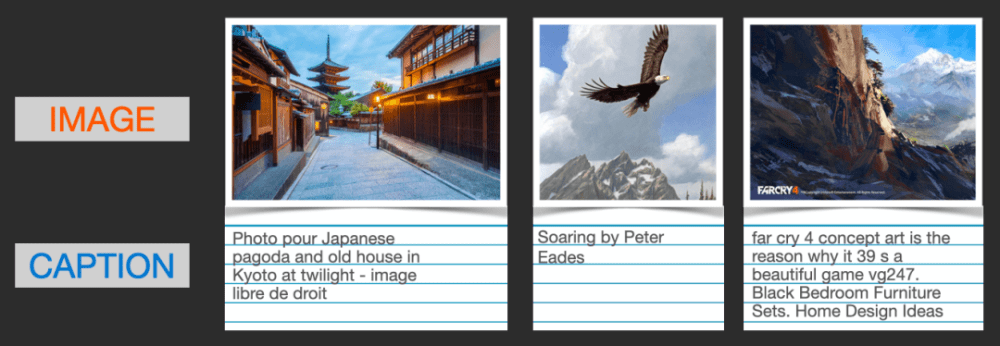

# Stable Diffusion原理

Stable Diffusion，是一个 2022 年发布的文本到图像潜在扩散模型，由 CompVis、Stability AI 和 LAION 的研究人员创建的。

## 核心原理

Stable Diffusion 是一种基于扩散模型的图像生成技术，其核心原理可以概括为：

* **初始化阶段**：模型生成一个随机的噪声图像，这个图像由多个高斯分布的随机像素组成，每个像素的值在0到1之间。
* **扩散阶段**：模型逐步将噪声图像转换为更接近目标图像的形状和结构。这个过程通过减小像素之间的差异来实现，使得图像从粗糙到细腻，从随机到有序。这个过程会反复进行多次，每次迭代都会使图像更加接近目标。
* **去噪阶段**：模型去除图像中的噪声，使得生成的图像更加清晰和自然。这个阶段主要是通过对图像进行滤波和优化来完成的。

> 整个绘画的过程就是 AI 用一组随机噪声（DNA）来预测基于它们能画出一个什么样的图像，即从一堆凌乱的随机数中画出图像。

## 工作流程

SD模型的工作流程分为以下几个关键步骤：

* **提示词（Prompt）输入**：文本信息转换成语义向量传输给文本编码器（Text Encode）；
* **潜在空间压缩**： 使用变分自编码器（VAE）将高维度的图像数据压缩到一个低维度的潜在空间；
* **正向扩散**： 在潜在空间中，模型通过逐步添加噪声来“扩散”图像，最终将图像转化为完全随机的噪声分布。这个过程模拟了物理中的扩散现象，使得图像的特征逐渐消失；
* **噪声预测器**： 在训练阶段，模型学习如何预测在潜在空间中添加的噪声。这是一个U-Net结构的神经网络，它通过学习如何从噪声图像中恢复出原始图像来训练；
* **反向扩散**： 在生成阶段，模型使用噪声预测器来估计潜在空间中图像的噪声，并逐步去除这些噪声，从而从噪声中恢复出清晰的图像；
* **条件生成**： Stable Diffusion通过提示词来引导图像的生成。提示词首先被分词并转换为嵌入向量，然后这些向量被输入到噪声预测器中，以指导生成过程，确保生成的图像与提示词相匹配；
* **VAE解码**： 最后，潜在空间中的图像通过VAE的解码器转换回原始的像素空间，生成最终的图像。

### 文生图（txt2img）

文生图任务是指将一段文本输入到SD模型中，经过一定的迭代次数，SD模型输出一张符合输入文本描述的图片。

* **步骤一**： 使用CLIP Text Encoder模型将输入的人类文本信息进行编码，输出特征矩阵；
* **步骤二**： 输入文本信息，再用random函数生成一个高斯噪声矩阵 作为Latent Feature的“替代” 输入到SD模型的 “图像优化模块” 中；
* **步骤三**： 将图像优化模块进行优化迭代后的Latent Feature输入到 图像解码器 （VAE Decoder） 中，将Latent Feature重建成像素级图。

### 图生图（img2img）

图生图任务在输入本文的基础上，再输入一张图片，SD模型将根据文本的提示，将输入图片进行重绘以更加符合文本的描述。

* **步骤一**： 在输入文本信息进行编码的同时，将原图片通过图像编码器（VAE Encoder） 生成Latent Feature（隐空间特征）作为输入；
* **步骤二**： 将上述信息输入到SD模型的 “图像优化模块” 中；
* **步骤三**： 将图像优化模块进行优化迭代后的Latent Feature输入到 图像解码器 （VAE Decoder） 中，将Latent Feature重建成像素级图。

### 总结

> 总结：不管是文生图还是图生图，核心模型都是图像优化模块，图像优化模块的输入都是文字+图片，输出都是一张经过优化后的图片。
>
> 只不过文生图任务中图像优化模块的输入是一张随机生成的噪声图。模型对文字的编码采用CLIP Text Encoder模型，对于图生图任务中图片的编码采用VAE Encoder。

图像优化模块 是由一个U-Net网络和一个Schedule算法共同组成

* U-Net网络负责预测噪声，不断优化生成过程，在预测噪声的同时不断注入文本语义信息；
* schedule算法对每次U-Net预测的噪声进行优化处理（动态调整预测的噪声，控制U-Net预测噪声的强度），从而统筹生成过程的进度；
* 在SD中，U-Net的迭代优化步数大概是50或者100次，在这个过程中Latent Feature的质量不断的变好（纯噪声减少，图像语义信息增加，文本语义信息增加）

## 组成部分

Stable Diffusion 主要有三个组成部分，每一个部分都有自己的神经网络。

### ClipText

**CLIP 用于文字编码器：**以文字作为输出的语义信息组成一个矩阵，CLIP 训练 AI 同时进行自然语言理解和计算机视觉分析。CLIP 可以决定图像和文字提示的对应程度，比如逐步把建筑的图像和 “建筑” 这个词完全匹配起来，而其能力训练是通过全球 40 多亿张带文字描述的图片实现的

### UNet + Scheduler

**UNET 及调度程序：**这就是大名鼎鼎的扩散模型主程序（来自 CompVis 和 Runway 团队于 2021 年 12 月提出的 “潜在扩散模型”（LDM / Latent Diffusion Model）），用于对噪声进行预测实现反向去噪的过程，进而实现图片在信息空间中的生成。如图片所示，染料扩散的过程就像从图片逐渐变成噪点的过程，而当研究人员对图片增加随机噪点让 AI 反向学习整体过程，而后就拥有了一套从信息空间噪点图反向生成图片的模型。

用通俗的例子解释，如果在清水里随机滴入一些染料，随着时间推移会得到如下图一样绚丽的形状。那么有没有一种方法，能够根据某一个特定时间特定的状态，反向推出初始的染料用量、顺序、滴入水缸的初始状态等信息呢？显然，如果不借用 AI 的方式几乎无法实现。

### Autoencoder Decoder

**信息空间到真实图片空间的解码器：**即把信息空间中的矩阵信息转换为肉眼可见的 RGB 图片。想象一下我们与人交流的过程，听到的声音信号转换为大脑能理解的文字信号存储在脑中，这个过程称之为编码。如果尝试把文字信号通过某种语言表达出来，这个过程可以称为解码 —— 这里的表达方式可以是任意的语言，每种语言对应不同的解码器，解码只是一种表达方式，本质还是基于人类脑海中对于某件事情的描述与理解。

### 总结

Stable Diffusion 三个组成部分各自用到了不同的模型：

* **FrozenCLIP**：是一个tokenizer和transformer，负责将prompt编码为context。
* **UNet生成模型**：主要负责去噪和重采样。
* **AutoEncoderKL模型**：负责图像的编解码，其中在训练过程中用到encode部分，在推理阶段用到decode部分。

正是有了这几个关键技术步骤的串联，Stable Diffusion 成功创建了一个无所不能的 AI 作图机器人，不仅能理解语义，将其转化为信息空间的信息流，还能够在信息空间中通过模拟降噪创作，通过解码器还原成肉眼可见的图片，这一充满科幻色彩的过程放在 AI 不存在的世界来看，堪称神迹。

## 概念详解

### Tensor

张量（Tensor）是一种常见的数据类型，它是一个多维数组。张量可以在GPU上运行，这使得它们在深度学习中非常有用。

在计算机中，不同类型的数据都有自己特定的存储方式和编码方式。下面简单介绍一下常见数据类型在计算机中的存储方式和张量中的表示方式：

* **字符串文字**：字符串文字在计算机中是由一系列字符组成的，每个字符占用一个字节或多个字节。在PyTorch中，字符串文字可以被表示为一个1维的张量，其中每个元素都代表一个字符的编码。
* **图片**：图片在计算机中通常以像素矩阵的形式存储，每个像素的颜色值可以使用不同的编码方式进行表示，如RGB、灰度、CMYK等。在PyTorch中，图片可以被表示为一个4维的张量，其中第0维表示批次数，第1维表示通道数，第2维表示高度，第3维表示宽度。例如，一个形状为(1, 3, 224, 224)的张量可以表示一张RGB格式的224x224的图片。
* **视频**：视频是由一系列帧组成的，每一帧都可以看作是一张图片。在计算机中，视频通常以帧序列的形式存储。在PyTorch中，视频可以被表示为一个5维的张量，其中第0维表示批次数，第1维表示帧数，第2维表示通道数，第3维表示高度，第4维表示宽度。例如，一个形状为(1, 16, 3, 224, 224)的张量可以表示一段16帧的RGB格式的224x224的视频。
* **声音**：声音是一种连续的信号，可以使用不同的采样率和编码方式进行表示。在PyTorch中，声音可以被表示为一个1维的张量，其中每个元素都代表一个采样点的值。需要注意的是，声音信号的采样率和位深度决定了张量的大小和数据类型。

### Vector

向量（Vector）是一种特殊的张量，它是一个有序的一维数组，包含一系列数值。在机器学习和深度学习中，向量通常用来表示特征、权重、偏置等。向量可以进行加法、减法、点积等操作，是许多算法和模型的基础。

前文所说的特征矩阵是一个包含多个特征向量的矩阵。在机器学习和数据分析中，特征矩阵是一个二维数组，其中每一行代表一个样本，每一列代表一个特征。因此，特征矩阵中的每个元素都是一个特征值，而每行则代表一个样本的特征向量。

### Latent Space

Stable Diffusion是一种在潜在空间扩散（latent diffusion）的模型。它不是在高维图像空间中操作，而是首先将图像压缩到潜空间（latent space）中。然后，通过在潜空间中应用扩散过程来生成新的图像。

Stable Diffusion中的潜空间（Latent Space）是一个高度抽象且通常较低维度的空间，用于表示数据的一些内在特性。在这个空间中，数据被压缩并转化为一种更易于处理的格式，从而简化了复杂数据的处理和分析过程。

在Stable Diffusion模型中，潜空间的作用和意义主要体现在以下几个方面：

1. **数据压缩与降维**：通过将高维图像数据压缩到潜空间中，模型能够更有效地处理和分析图像。这种压缩不仅减少了数据的复杂性，还降低了内存消耗和计算的复杂度。例如，一个`512x512`像素的图像在潜空间中可能会被压缩成更小的维度，如`(4,64,64)`，从而极大地减少了数据体积和内存占用。
2. **图像生成与扩散过程**：Stable Diffusion模型通过在潜空间中应用扩散过程来生成新的图像。这个过程从随机高斯噪声开始，经过训练逐步去除噪声，直到输出符合文本描述的逼真图像。潜空间为这一过程提供了一个有效的操作平台，使得图像的生成更加高效和可控。
3. **提升模型性能**：通过在潜空间中进行操作，Stable Diffusion能够更快速地生成高质量图像，同时降低了对计算资源的需求。这使得模型在实际应用中更加实用和高效。

总的来说，潜空间在Stable Diffusion模型中发挥着关键的作用，它不仅提高了图像处理的效率，还为高质量的图像生成提供了可能。通过利用潜空间的优势，Stable Diffusion模型在图像生成领域取得了显著的进步。

### 高斯噪声矩阵

高斯噪声矩阵是指一个矩阵，其中的元素是服从高斯分布（也称为正态分布）的随机数。高斯噪声矩阵通常用于模拟真实世界中的随机噪声，或者在某些算法和模型中引入随机性。

高斯分布是一种连续概率分布，其形状呈钟形曲线，均值为 μ，标准差为 σ。在高斯噪声矩阵中，每个元素都是从高斯分布中独立地生成的随机数，可以通过调整均值和标准差来控制噪声的强度和分布特性。

在实际应用中，高斯噪声矩阵经常用于图像处理、信号处理、通信系统等领域。例如，在图像处理中，可以将高斯噪声矩阵加到图像中，以模拟图像中的噪声，或者用于测试图像处理算法的鲁棒性。在机器学习中，有时也会在训练数据中添加高斯噪声，以增加数据的多样性和鲁棒性。

总之，高斯噪声矩阵是一个矩阵，其中的元素是从高斯分布中生成的随机数，用于模拟随机噪声或引入随机性。这种矩阵在模拟和研究中起着重要作用，可以帮助我们更好地理解和处理具有随机性的数据和现象。

### 正向扩散

正向扩散（forward diffusion），也就是加噪过程，最后就快变成了个纯噪声

每一个时刻都要添加高斯噪声，后一时刻都是由前一刻是增加噪声得到

### 反向扩散

反向扩散（reverse diffusion），根据一个噪声图像一步步得到原图，其中Unet负责把噪声预测出来

### 采样

> 整个去噪点的过程我们称之为采样

文生图就是直接初始化一个噪声，进行采样

图生图则是在你原有的基础上加噪声，噪声权重自己控制，即webui界面里面的重绘幅度（Denoising strength）

迭代次数就是我们webui界面的采样步数（Sampling steps）

随机种子seed就是我们初始随机得到的一个噪声图，所以如果想要复刻得到一样的图，seed要保持一致

### 训练 CLIP

Stable Diffusion所使用的是openAi的clip的预训练模型，就是别人训练好的拿来用就行，那clip是怎么训练出来的呢？他是怎么把图片和文字信息对应呢？

CLIP需要的数据为图像及其标题，CLIP是图像编码器和文本编码器的组合，使用两个编码器对数据分别进行编码。然后使用余弦距离比较结果嵌入，刚开始训练时，即使文本描述与图像是相匹配的，它们之间的相似性肯定也是很低的。

随着模型的不断更新，在后续阶段，编码器对图像和文本编码得到的嵌入会逐渐相似。在整个数据集中重复该过程，并使用大batch size的编码器，最终能够生成一个嵌入向量，其中狗的图像和句子「一条狗的图片」之间是相似的。

根据提示文本，计算相似度，找到概率最高的即可

## 参考文档

* [The Illustrated Stable Diffusion – Jay Alammar – Visualizing machine learning one concept at a time. (jalammar.github.io)](https://jalammar.github.io/illustrated-stable-diffusion/)
* [【stable diffusion原理解读通俗易懂，史诗级万字爆肝长文，喂到你嘴里】_stable diffusion cross-attention-CSDN博客](https://blog.csdn.net/weixin_62403633/article/details/131022283)
* [Stable Diffusion（SD）核心基础知识——（文生图、图生图）_sd模型-CSDN博客](https://blog.csdn.net/weixin_47748259/article/details/135502977)