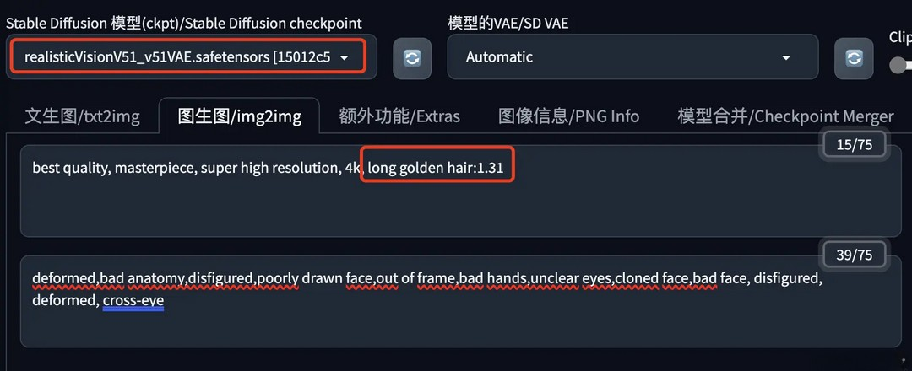

# Stable Diffusion图生图

我们了解了Stable Diffusion的Prompt与参数设置以及模型相关的知识，基本文生图的功能就能使用的差不多了，但是文生图的随机性比较大，很多时候我们还是需要图生图功能。

## 简介

### 参考图

我们都知道，模型在运算时是根据我们提供的提示内容来确定绘图方向，如果没有提示信息，模型只能根据此前的学习经验来自行发挥。在之前的文生图，我们介绍了如何通过提示词来控制图像内容，但想要实现准确的出图效果，只靠简短的提示词是很难满足实际需求的。


> 一个在农村的爷爷接到城里的孙子电话说过年要回来，想要的礼物是“佩奇”，这个时候手机信号不好，电话挂断了。爷爷开始思考并在村里“寻找佩奇”……

AI 绘画的随机性导致我们使用大段的提示词来精确描述我们想要的画面内容，但毕竟文字能承载的信息量有限，即使我们写了一大段咒语，模型也未必能准确理解，不排除有时候还会出现前后语义冲突的情况。

其实这个过程就像甲方给我们明确设计方向，除了重复沟通想要的画面内容外，有没有什么比口述更高效的沟通方式呢？这个时候，有经验的甲方会先去找几张目标风格的竞品图，让我们直接按照参考图的感觉走。


### 图像重绘

Stable Diffusion 的图生图不仅仅是喂图功能，它的真正价值在于提供了丰富的操作工具将图像可控性提升到了新的层次。

在 Stable Diffusion 中，我们可以通过蒙版和局部重绘等功能来控制只对图像特定部分的区域进行重绘，并设置各类参数来控制重绘的效果。此外通过选择不同的绘图模型和调整图像尺寸，我们也能甚至还能实现画风转换、图像无损放大等更多玩法。相较于其他 AI 绘画工具，Stable Diffusion 中的图生图并非单纯的喂参考图，而是可以在现有图片的基础上通过人工干预来实现更加稳定可控的图像重绘。


## 详解

在 WebUI 的功能导航栏中选择图生图模块，我们可以看到它的页面布局和文生图基本类似，同样有提示词输入框、操作按钮和参数设置项，不同的是这里多了提示词反推、支持上传图片的二级功能模块和对应的参数设置项。

### 图生图

在Stable Diffusion 大模型这里选择一个模型


在“图生图”这里上传一张人物肖像照，并编写对应的提示词和反向提示词。这里提示词是可选的，但是不填写可能会导致生成的图片效果质量不佳。

提示词：

```
best quality, masterpiece, super high resolution, 4k, adult women, asia, full body:1.4, long black hair, looking at viewer, beautiful detailed eyes, small breasts, white t-shirt:1.6, white pants:1.6, wide shot:1.3, strolling, beach:1.3, tree, beautiful detailed sky, blue sky
```

反向提示词：

```
deformed,bad anatomy,disfigured,poorly drawn face,out of frame,bad hands,unclear eyes,cloned face,bad face, disfigured, deformed, cross-eye
```


设置 Stable Diffusino的相关参数


* 缩放模式：因为参考图片和新生成的图片尺寸可能不一致，所以我们需要选择生成新图片时怎么处理参考图片。

  这里有四种模式：拉伸、裁剪、填充和直接缩放，如果没有特殊需求，大家应该都不会喜欢拉伸和直接缩放的效果，它们的效果如下图所示：

  

  当然如果参考图片和新生成图片的尺寸是一样的（==强烈推荐==），这个【缩放模式】怎么设置都没有问题。

* 采样器、采样步数：大部分采样器的效果差别不是很大，一般 Euler a 和20步采样就够了，其它的可以试试DPM+系列。后边会有文章专门讲采样器。
* 生成图片的尺寸：一般保持和原图一样，也可以更改，更改时需要考虑【缩放模式】的影响。
* 生成次数和每次数量：默认都是1，也就是只生成一次且每次只生成一张图片。增加【生成次数】会明显增加生成时间，增加【每次数量】会明显增大显存使用。
* 提示词引导系数：默认为7，值越大生成图片越贴近提示词的描述，值越小AI自我发挥的越多，常见的设置是 5-12。
* 重绘强度：新生成的图片会多大程度上改变参考图片，值越大新图片自由发挥的越多，越不像参考图片。这里我们不想让人物的二次元照片与原图相差太大，所以值设置的比较小。相同的值在不同的模型或者图片上的效果都可能是不同的，所以实际处理图片时还需根据效果进行调整。

然后我们就可以生成图片了，下边是我使用不同的重绘幅度做的图：


### 涂鸦绘制

涂鸦绘制就是在原图上画一个代表某种事物的形状，然后让Stable Diffusion结合我们的提示词在图片中生成对应的元素。下面这个例子是给女孩添加一副天使的翅膀。

选择合适的大模型，提示词中声明你想要在画面中出现的元素。


在下面的 Generation 选项卡中选择“涂鸦绘制”，上传一张要涂鸦的图片，然后使用画笔工具在图片上画出你想要的形状，这里可以选择我们想要的颜色。天使的翅膀我想是白色的，但不应该是纯白，所以我这里选择一个有点灰的白色。


Stable Diffusion 的参数没什么好说的，注意缩放模式和图片尺寸的搭配，重绘强度建议从0.5开始，然后根据实际出图效果调整


然后就可以生成图片了，看下边的效果。


可以看到，翅膀是画出来了，不过画面上的其它部分也产生了一些变化，涂鸦绘制是整张图片的重绘，某些场景下这不够完美，解决这个问题需要使用下文介绍的涂鸦蒙版。

### 局部绘制

局部绘制是只更改原图片的部分区域，具体方式是使用画笔涂抹盖住一些部分，然后我们可以选择只重新绘制盖住的部分，或者只重新绘制没有盖住的部分。在 Stable Diffusion 中盖住的部分称为蒙版内容。

这里以把姑娘的头发颜色修改成金色为例。

基础模型选择一个匹配照片风格的；为了修改颜色，我们需要在提示词中着重描述重绘需求。提示词可以只描述要重绘的部分，也可以是一个完整的图片描述，重绘幅度较大时建议只描述要重绘的部分，否则重绘的部分可能与原图衔接不好。



在 Generation 选项卡中点击“局部绘制”，上传一张图片后，使用画笔工具涂抹要重绘的部分。


其它 Stable Diffusion 参数如下


* 蒙版模糊度：设置重绘部分与原图的衔接处的模糊度，起到渐变的作用，让衔接看起来比较自然。衔接不好时可以调大一点看看。
* 蒙版模式：绘制蒙版内容，也就是绘制被蒙住的内容；绘制非蒙版内容，也就是绘制没有蒙住的部分。怎么选择？我的经验是哪个涂抹的少选择哪个，给自己减少一些工作。比如这里要重绘头发，头发的区域相比整个图片要小很多，我们就涂抹头发，这里选择绘制蒙版内容；如果头发的区域很大，我们就可以涂抹其它区域，然后这里选择绘制非蒙版内容。
* 绘制区域：选择全图时Stable Diffusion会先重绘整张图片，最后出图时再替换到原图中；仅蒙版时，Stable Diffusion只绘制需要重绘的部分。个人感觉出图效果没有太大差别，有兴趣的可以多试试对比下。
* 仅蒙版绘制参考半径：绘制区域仅蒙版时，绘制区域向外拓展的数量，单位是像素。使用这个参数可以解决蒙版边缘不好涂抹的问题，效果类似我们手动涂抹时向外多涂抹一点，让新生成的部分与原图衔接的更好。
* 图片尺寸：根据需要设置，注意选择合适的缩放模式。我这里只改颜色，所以和原图保持一致。
* 重绘强度：多大程度上改变原图的内容。因为改头发颜色还是相对困难的，所以我这里火力全开，设置为最大的1。默认是0.75，需要根据实际出图效果调整设置。

局部重绘的效果


可以看到头发已经变成金色的了，但是头发的外形也发生了一些变化，这说明 Stable Diffusion是重新绘制，而不是简单的上色；而且只有蒙版蒙住的部分重新绘制了，其它部分都没什么变化。

这个技术用途比较大，比如给模特换衣服，当然如果要换指定的衣服还得结合其它技术才行。

### 局部绘制（涂鸦蒙版）

上面我们介绍了涂鸦绘制，但是涂鸦绘制会重绘整张图片，涂鸦蒙版可以解决这个问题。

还是以给人物加上天使的翅膀为例。

选择匹配画面风格的大模型，填写想要绘制的画面内容，上传图片，选择合适的颜色，在图片上画出想要的形状。


Stable Diffusion 的参数中多了一个蒙版透明度，值越大绘制的内容越透明；另外这里的重绘强度我们可以选择的高一点，因为重绘只针对图片的部分画面，我们不需要担心其它部分会被改变的太多。


看一下效果


给姑娘头上戴上一朵小黄花。


给姑娘剪个头发


### 局部绘制（上传蒙版）

上面我们演示了涂鸦蒙版的效果，但是这种手绘的蒙版还有个问题：不够精准，绘制起来也比较麻烦。

上传蒙版可以解决这个问题，我们可以使用别的工具来制作一个精准的模版，然后上传到局部绘制，再进行重绘。

还是以本文的姑娘照片为例，我们将使用上传蒙版分别重绘人物和背景。

选择匹配画面风格的大模型，在提示词中编写想要重绘的内容。


提示词1（绘制蒙版内容，亚洲姑娘换成金发碧眼的美国姑娘）：

```
best quality, masterpiece, super high resolution, 4k, 1girl, american, full body:1.4, long golden hair, looking at viewer, beautiful detailed eyes, brown t-shirt:1.31, blue jeans:1.31
```

提示词2（绘制非蒙版内容，背景换成战火纷飞的街道）：

```
best quality, masterpiece, super high resolution, 4k, 1girl standing in the middle of war-torn streets
```

反向提示词：

```
deformed,bad anatomy,disfigured,poorly drawn face,out of frame,bad hands,bad fingers,unclear eyes,cloned face,bad face, disfigured, deformed, cross-eye， EasyNegative
```

在“局部绘制（上传蒙版）”中分别上传原图和蒙版图。

蒙版图可以使用以下插件制作：

* stable-diffusion-webui-rembg —— 最简单直接
* sd-webui-inpaint-anything —— 个人觉得最好用
* sd-webui-segment-anything —— 功能最强


Stable Diffusion 参数设置。注意我们这里要使用两种蒙版模式分别绘制。


然后就可以生成图片了，效果图如下


### 批量处理

“批量处理”可以完成一组图片的“图生图”处理。

我们首先还得选择一个大模型，编写相关的提示词（不过这个提示词也可以不填，具体原因后边的内容会有说明）。


再往下看，“批量处理”有一组特别的参数，如下图所示


* 输入目录：原图所在的目录，必须设置。
* 输出目录：新生成图片的存放目录，必须设置。
* 批量绘制遮罩图片目录：如果需要根据蒙版进行局部绘制，这里制定蒙版图片所在的目录，蒙版图片的文件名需要和“输入目录”中的文件名一一对应。
* Controlnet输入目录：如果使用Controlnet，这里需要指定Controlnet中使用的参考图片。留空则使用“输入目录”中的文件。
* PNG info：提取一组图片中的信息作为批量“图生图”时每张图片的参数。比如我们提前生成好了一组图片，现在想把它们转换为另外的风格，通过启用这个参数，就可以在生成新图片时使用原图片的生成信息，以最大化保留原图中的各种元素。启用这个参数，需要勾选上“Append png info to prompts”，它还有几个子参数：
  * “PNG info directory”设置用来提取生成参数的图片目录，其中的图片文件名需要和“输入目录”中的文件名一一对应，默认为“输入目录”；
  * “Parameters to Take from png info” 为想要使用的图片生成参数，按照自己的需要勾选就可以了，注意如果勾选了提示词，它会被追加到“图生图”的提示词中。如果我们想完全使用这些图片的提示词，可以把页面上方“图生图”的提示词和反向提示词留空。

再往下，是 Stable Diffusion 的一些标准参数。注意如果勾选了“Append png info to prompts”，生成图片时下图红框中的参数会被替换掉。


批量生成后，我们可以在输出目录找到新生成的图片，图片处理效果上面都演示过了，这里就不展示了。

### 总结

通过以上演示，我们可以看到，图生图能够参考原图，再依据我们的指令生成新图。在这个重绘的过程中，我们可以使用涂鸦、蒙版等来影响出图的效果，这是一种精准控制的能力，不过这还不够，如果需要更多的精准控制，我们需要使用ControlNet

## 蒙版

顾名思义，蒙版，或遮片，其基本作用在于遮挡。也即通过蒙版的遮挡，其目标对象的某一部分被隐藏，另一部分被显示，以此实现不同图层之间的混合，达到图象合成的目的。


> 在Stable Diffusion中，蒙版的==白色区域==是默认重绘的区域，如果只想改变背景的话，可以切换到“重绘非蒙版区域”。

那么如何制作精确的蒙版呢，除了传统使用PS的方式，Stable Diffusion WebUI 提供了很多插件可以用于制作蒙版，这里主要介绍3种

### stable-diffusion-webui-rembg

stable-diffusion-webui-rembg 是基于 Stable Diffusion 的前端界面，采用 ReMBG（Real-time Multi-person Background Matting）算法，该算法能够智能地识别和分离图片中的主体与背景，生成高质量的抠图效果。它的目标是让用户无需专业的图形设计知识或复杂的软件操作，即可快速得到干净、透明背景的图像。

我们进入Extras → Remove background


* 下拉框中的isnet-general-use代表使用哪种大模型进行抠图，第一次使用需要下载大模型，这些大模型都是几百兆，可以都试试，isnet-general-use、u2net效果都不错。模型下载地址：[danielgatis/rembg: Rembg is a tool to remove images background (github.com)](https://github.com/danielgatis/rembg)
  * u2ne：用于一般用例的预训练模型。
  * u2netp：u2net模型的轻量级版本。
  * u2net_human_seg：用于人体分割的预训练模型。
  * u2net_cloth_seg：用于从人像中解析衣物的预训练模型。在此，服装被解析为上半身、下半身和全身3个类别。
  * silueta：与u2net相同，但大小缩减为43Mb。
  * isnet-general-use：用于一般用例的新预训练模型。
  * isnet-anime：针对动漫角色的高准确度分割模型。
  * sam：用于任何用例的预训练模型。
* `Return mask`如果勾选代表返回蒙版

去除背景


返回蒙版


### sd-webui-inpaint-anything

Inpaint Anything 的核心思想在于充分利用不同模型的优势，构建一个功能强大且易于使用的图像修复系统。通过整合各种模型，用户可以轻松地进行图像编辑，不受图像原始内容或尺寸的限制。

#### 主要功能

1. **移除一切（Remove Anything）：** 用户只需简单点击想要移除的物体，Inpaint Anything 将快速且无痕地移除该物体，实现高效的编辑功能。
2. **填补一切（Fill Anything）：** 用户可以通过文本提示告知 Inpaint Anything 想要在物体内填充的内容，系统会自动利用 [AI](https://www.jiaogeai.com/sitetag/ai)GC 模型生成相应的内容，实现随心所欲的内容创作。
3. **替换一切（Replace Anything）：** 用户可通过点击选择需要保留的物体，并指定想要替换的背景内容，Inpaint Anything 将快速实现物体背景的替换，实现生动的环境转换。

#### 工作原理

Inpaint Anything 综合运用了 SAM、图像修补模型（如 LaMa）和 AIGC 模型（如 Stable Diffusion）等视觉基础模型。SAM 用于生成高质量的对象分割区域，LaMa 能够在高分辨率图像中移除任何元素，而 Stable Diffusion 则能够将文本转换为图像。通过这些模型的协同作用，Inpaint Anything 实现了移除、填补和替换等功能。


#### 使用流程


> 如果选了sam_vit_l或sam_vit_h模型非常耗时，且容易爆显存，耐心观察和等待

sam分析完成后，图片被分成不同色块，用鼠标把想制作成蒙版的色块划上（`只要点到或者划过即可，不用涂满`）。点击“`Create Mask`”


> Invert mask代表制作黑白翻转的蒙版，比如你选定的人，通过这个功能可以选中人以外的部分制作蒙版


可以看到我们划过的衣服部分都被选中了，这时可以用`Trim mask by sketch`、`Add mask by sketch`功能配合涂鸦继续细化蒙版

`Expand mask region`：使用此按钮可略微扩展遮罩区域，以实现更广泛的覆盖范围。这样可以重绘时非蒙版区域和蒙版重绘区域衔接不会太突兀。

这时我们可以进行Inpainting、Cleaner、ControlNet Inpaint，这些功能和主界面的功能基本是重叠的，选项没有主界面丰富，还需要重新下载模型，所以我们一遍直接用`Mask only`功能`Get mask`获取蒙版，然后`Send to img2img inpaint`即可，使用主界面的功能配置项更加丰富。


#### 修改蒙版

有时候，某些细节问题，蒙版生成的不是很完美，我们用PS稍微修改一下即可，也不用执着于AI，比如下图基于人台生成的蒙版，使用segment怎么都处理不完美（显示出人台的轮廓）


这个用PS或者Cleaner工具很容易处理


### sd-webui-segment-anything

绝大部分情况Inpaint Anything都能很好的制作蒙版，但是遇到有些细节特别丰富的服装等情况，segment十分缓慢，解析的也过于琐碎。我们可以使用sd-webui-segment-anything

这个扩展同时使用Segment Anything和GroundingDINO两种技术，以增强语义分割、自动化图像抠图的能力。

#### 使用标记点

来到segment anything界面，选择任一SAM 模型，上传需要处理的模特人台图，鼠标左键黑色表示需要保留的部分，手表右键红色表示需要去除的部分，再次点击表示取消选择。

> 比如我们只想要衣服部分：
>
> * 就把脸、脖子、头发点上红点
> * 衣服部分点上黑点
>
> 使用这种办法不用像Inpaint Anything一样进行长时间的segment在勾选想要的范围


点击preview segmentation即可预览分隔结果，可以看到3号结果还是比较符合我们需求的，把蒙版和抠图照片下载下来备用


Choose your favorite mask选择2，勾选Copy to Inpaint Upload & img2img ControlNet Inpainting，点击Switch to InpaintUpload即可把模特人台图和蒙版找上传到图生图局部重绘（上传蒙版）

> 但是因为这个插件存在一些bug，在图生图局部重绘（上传蒙版）界面并不能看到对应的照片，但是其实在后台已经有了，不放心的可以把之前下载的模特人台图和模特蒙版照片手动上传

#### 使用语义

如果打标记点达不到我们想要的效果，我们可以尝试使用GroundingDINO，他可以通过语义帮我们分界面模型，比如我们输入`cloth`，没有进行任何标记（已经`移除所有标记点`），这时候点击preview segmentation即可预览分隔结果，可以看到效果非常不错。

> 要启用GroundingDINO在设置中修改“启用本地 Groundingdino 以绕过 C++ 问题”
>
> 
>
> 当然也要下载GroundingDINO 模型


如果语义分析不是太准确，我们可以勾选`我想预览 GroundingDINO 的结果并选择我想要的箱体。`，这是出现2个箱体，我们选择衣服所在的0箱体即可。


## 脚本

之前介绍了几款通用的的脚本，这里介绍几款图生图才提供的脚本

### Outpainting mk2

打开WebUI的图生图界面，上传需要修改的图片。


提示词使用描述整张图片的提示词。

脚本选择“Outpainting mk2”，调整拓展的像素数和方向。


> 推荐设置：采样迭代步数：80-100，采样器：Euler a，重绘幅度：0.8
>
> 提示词：
>
> ```
> city masterpiece,best quality,t-shirt,1girl,
> ```

点击开始生成按钮


可以看到左侧拓展的路面衔接的还是有点问题，一遍情况下大自然的场景扩图做的还不错，设计到人体和硬朗的线条就会比较差一些。

> 最好不要4个方向一起扩，一般这样做的效果都不会很好，可以先扩一边，然后发回给图生图，再扩另外一边

#### 优化方法1

我们可以把成品发送到图生图

* 把seed继承下来
* 然后将重绘幅度(Denoising)设为0.3左右（基本参照原图）再次重绘一次。

可以看见左侧拓展的路面衔接处变得自然了一点，当然画面细节也有了一些变化。如果想保证画面的主体人物细节不变，那就要给人物加上蒙版再重绘


#### 优化方法2

将扩展后的图片发送到图生图的局部重绘界面

* 使用画笔涂抹扩展的像素不满意的地方（尽量涂大点）
* 蒙版模式选择“重绘蒙版内容”，
* 宽度和高度设置为扩展后图片的宽度和高度，其他参数根据自己喜好设置。
* 重绘幅度(Denoising)根据实际情况修改，我一般设置0.5（基本遵照原图但有明显变化）

如下图，我对左下角的衔接不是很满意，把这个区域涂白


点击开始生成按钮，可以看见左侧拓展的路面衔接处变得自然了，主体人物也没有变化，所以第二种方法更好一些


我们也可以给图片加上一些再创作，比如提示词变为

```
city masterpiece,best quality,t-shirt,1girl,(1 green mailbox:1.3),
```

在左侧加上了一个邮箱


### Poor man's outpainting

打开WebUI的图生图界面，上传需要修改的图片。

提示词使用描述整张图片的提示词。

脚本选择“Poor man's outpainting”，调整拓展的像素数和方向。


点击开始生成按钮


可以看见完全不行……，不过补充自然风光还可以。


### Outpainting总结

总的来说Outpainting：

* 扩充自然风景等线条柔和的是最靠谱的
* 如果线条分明的背景就有一定违和了
* 如果要补充人的下半身，一般来说需要补充的部分有手部，那就非常难了（如果像上图要补半个手部，那基本是mission impossible），补腿的话要看运气（要多抽奖几次）
* 一般扩的比较完美的是这种背景简单的

| 原图                                          | Outpainting                                   |
| --------------------------------------------- | --------------------------------------------- |
|  |  |

当然右侧还是有点颜色过渡问题，可以加蒙版重绘一下，发送到局部重绘（上传蒙版）


重绘幅度(Denoising)选0.3-0.5，看看效果


### SD upscale

根据指定的放大倍数，将图生图的图像拆解成若干小块按照固定逻辑重绘，再合并成一张大图，可以实现在低显存的条件下生成大尺寸的图片


* 选择”脚本“选项的SD放大脚本
* 重绘幅度的推荐为 0.2左右（基本不改变）
* 缩放系数：相当于放大倍数，设置为2的意思是放大为原来的两倍
* 放大算法：我们还是默认选择R-ESRGAN 4x+ 的，二次元的选择R-ESRGAN4x+ Anime6B
* 图块重叠的像素：维持默认的64像素不变，是为了避免图片分块重画拼合的割裂的感觉（如下图），64是一个缓冲带的作用，为了分块画的画，画的更好，如果你觉得图片还是拼接的生硬，你可以把重叠像素改成128

>  注意：这时候要手动更改图片的尺寸，本身你的尺寸是`600*600`这时候要加上图块重叠像素，你要改成`664*664`（同理，重叠像素是128的话图片尺寸就要改成`728*728`）

| 编号 | 名称                  | 用法和介绍                                                   |
| ---- | --------------------- | ------------------------------------------------------------ |
| 1    | Latent                | 是一种基于 VAE 模型的图像增强算法,通过将原始图像编码成潜在向量,并对其进行随机采样和重构,从而增强图像的质量、对比度和清晰度。一般情况下，这个算法就能得到不错的效果，和4x-UltraSharp、R-ESRGAN等相比，显存消耗比较小，但效果不是最优。 |
| 2    | Lanczos               | 将对称矩阵通过正交相似变换变成对称三对角矩阵的算法           |
| 3    | ESRGAN                | 增强超分生成对抗网络，是对SRGAN关键部分网络结构、对抗损失、感知损失的增强。从这里开始就不是单纯的图像算法，进入人工智能的领域了。实测确实增加了很多看上去很真实的纹理，但是有时又会把一张图片弄得全是锯齿或怪异的纹理。可能对待处理的图片类型有要求。 |
| 4    | 4x-UltraSharp         | 基于ESRGAN做了优化模型，更适合常见的图片格式。真人模型最佳选择 |
| 5    | ESRGAN 4x             | 完全使用纯合成数据去尽量贴近真实数据，然后去对现实生活中数据进行超分的一个方法。 |
| 6    | R-ESRGAN 4x+          | 基于Real ESRGAN的优化模型，针对照片效果不错。 &nbsp;         |
| 7    | R-ESRGAN 4x+ Anime6B  | 基于Real ESRGAN的优化模型，二次元最佳，如果你的模型是动漫类的，该选项是最佳选择。 |
| 8    | R-ESRGAN General 4xV3 | 基于Real ESRGAN的优化模型，体积小，计算快，效果差。          |
| 9    | SwinIR_4x             | 使用Swin Transformer思想，采用一个长距离连接,将低频信息直接传输给重建模块,可以帮助深度特征提取模块专注于高频信息,稳定训练。 |
| 10   | LDSR                  | Latent Diffusion Super Resolution（潜在扩散超分辨率模型）    |


## 参考文档

* [Stable Diffusion教程：图生图_stable diffusion 图生图-CSDN博客](https://blog.csdn.net/Everly_/article/details/136811192)
