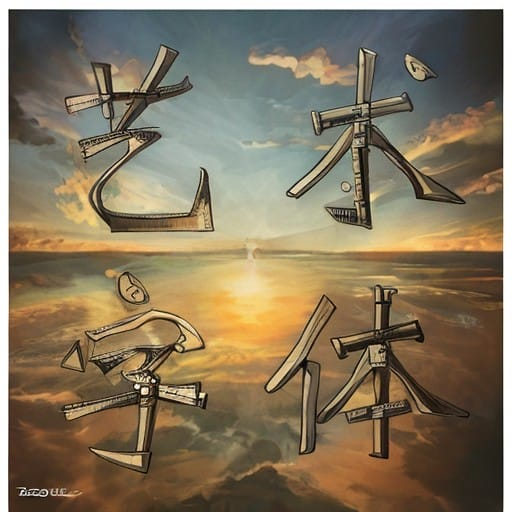
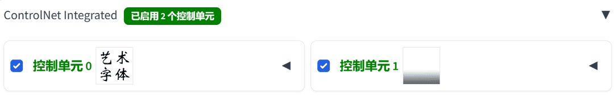

# Stable Diffusion - 案例

随着各种新技术层出不穷，Stable Diffusion由于其开放性变得越来越有实际应用价值。这里将给大家讲解一些现实中具有很强实用价值的案例。

## AI工具

各大网站、手机目前都提供了不少AI图像工具，比如`百度AI图片助手`，一次性提供如下7工具：

* **AI去水印**：一键去除图片水印 → LaMa
* **画质修复**：模糊图片1秒变超清 → SD upscale
* **涂抹消除**：对图片进行局部修改 → LaMa
* **局部替换**：对图片进行局部修改 → inpaint
* **AI重绘**：重新塑造图片细节 → 低重绘幅度图生图
* **AI相似图**：产出相同风格系列图 → reference
* **AI扩图**：原图自动外拓补全 → Outpainting

看到上面的列表，我们也知道百度AI图片助手十之八九就是使用Stable Diffusion做的微创新，因为这些功能在Stable Diffusion中都能轻松实现，而且Stable Diffusion中可配置的参数和可操作性更强。

比如AI去水印功能，如果水印很小，百度AI去水印可能就检测不到水印的位置，无法完成工作，在Stable Diffusion中我们可以自由涂抹要消除水印的地方，完成操作。

下面我们就讲一下如何使用Stable Diffusion实现以上的功能

### AI去水印 + 涂抹消除

AI去水印可以用所有带`LaMa`关键字的插件来实现，做的比较好的有[[novitalabs/sd-webui-cleaner: An extension for stable-diffusion-webui to remove any object. (github.com)](https://github.com/novitalabs/sd-webui-cleaner)](https://github.com/novitalabs/sd-webui-cleaner)，安装成功后他会在主菜单生成一个专有的标签`cleaner`，使用非常的简单，把要消除的东西用笔刷涂白，然后点击“`Clean Up`”按钮即可，我们可以看到这么大一条鲸鱼都给去除了，就别说水印了

> 当然水印下的内容非常细节，比如水印下有密密麻麻的文字，可能效果不会非常好，或者水印下本身是圆角的按钮，Clean Up变成了方角的按钮。
>
> 消除马赛克的效果也非常一遍……


直接使用ControlNet的inpaint功能，也带有LaMa的功能，使用的预处理器是：`inpaint_only+lama`

> 1. 图生图 → 局部重绘
> 2. 涂抹要消除的物体
> 3. 设置ControlNet，预处理器`inpaint_only+lama`
> 4. 生成即可

### 画质修复

之前已经讲过，使用SD upscale即可。当然如果画质非常模糊，那么可能需要先低重绘幅度图生图后再SD upscale，下面我们讲解修复老照片案例时会着重讲解


* 如果显存不够，还可以选用[Coyote-A/ultimate-upscale-for-automatic1111 (github.com)](https://github.com/Coyote-A/ultimate-upscale-for-automatic1111)
* 如果由于面部不清晰，面部修复后崩了，可以使用[Bing-su/adetailer: Auto detecting, masking and inpainting with detection model. (github.com)](https://github.com/Bing-su/adetailer)进行面部细节修复，adetailer号称还能修复手部，不过效果有限。

### 局部替换 + AI重绘

这个直接使用图生图的相关功能就可以实现了，就不再赘述了，当然如果我们需要做的非常细节，可以参考后面的AI模特案例

### AI相似图

使用ControlNet的reference或者IP-Adapter即可，当然这个是否能生成你想要的图要一点运气，可能需要使用多重ControlNet控制才能得到想要的效果

### AI扩图

Outpainting mk2或者Poor man's outpainting，实际使用ControlNet的inpaint功能也可以扩图（改大图片面积即可），


一般我们使用默认扩图效果可能不会特别完美，可以结合重绘等技巧进行优化

### AI抠图

AI一键抠图，这个功能非常实用，我们可以使用插件[AUTOMATIC1111/stable-diffusion-webui-rembg: Removes backgrounds from pictures. Extension for webui. (github.com)](https://github.com/AUTOMATIC1111/stable-diffusion-webui-rembg)

其使用的核心技术被广泛应用于各大网站、APP的AI抠图功能，非常之靠谱。还免费赠送蒙版制作功能。


### AI蒙版

这个我们之前详细介绍过：

* stable-diffusion-webui-rembg：使用最简单，但是只能扣除背景
* sd-webui-inpaint-anything：使用SAM为基础制作蒙版，功能强大好用
* sd-webui-segment-anything：同时使用Segment Anything和GroundingDINO两种技术，以增强语义分割、自动化图像抠图的能力，功能非常强大

> 当然AI毕竟是AI，图片分割也有不完美的时候，我们也不用一根筋，有些小细节用PS修一下即可

## 案例实战

上面讲解的是通过一个插件或者操作就能完成的AI功能，下面讲解的是如何综合运用几款插件来完成相关的任务，我们将逐个讲解如下几个案例：

* 转二次元
* 平面设计
* 修复老照片
* 室内装饰效果图
* AI模特

## 转二次元

把真实照片转而二次元，在Stable Diffusion非常容易实现，我们只需下载一个二次元的checkpoint大模型，我这里用的是anything-v5。

选择图生图，图片最好用rembg或者cleaner把不需要的部分去除掉，避免生成的线稿过于复杂，背景喧宾夺主


设置ControlNet，至于是用Canny、Lineart、SoftEdge可以根据实际需要进行比较，我这里选用的是lineart_realistic


开始生成即可


我们还可以利用这个生成的图片转Q版之类的效果，先把觉得满意的生成图片发送到图生图中去

去C站下载一个关键字是`Chibi`的**LORA**或者**Hypernetwork**，我用的是[Waven Chibi Style](https://civitai.com/models/4379?modelVersionId=5255)。

> Chibi是日本动漫中的一种风格，通常指的是一种卡通形象，具有压缩和夸张的特点，通常有大头、小身体、简化的特征，给人一种可爱、幽默的感觉。

提示词

```
<hypernet:LamapanamaWavenChibi_wavenchibiV10b:0.6>,1girl,
```

根据作者的提示设置

> A little tip, use '**turn pale**' in negative and **clip skip 2**.

然后再把`重绘幅度(Denoising)`调高一些

这时候我们点击生成的话，会得到完全不搭界的图案，比如


这时候可以选择一个Scribble的ControlNet垫图


再来看看效果，当然我们也可以用IP-Adapter或者Reference来垫图

| Scribble                                                  | IP-Adapter                                               | Reference                                                 |
| --------------------------------------------------------- | -------------------------------------------------------- | --------------------------------------------------------- |
|  |  |  |

## 平面设计

### LOGO

首先需要准备一张具有黑色填充的Logo图片，并确保其背景为白色。

> 注意背景要是白色，不能是透明色


“**启用**”ControlNet，并勾选“**完美像素模式**”，然后上传刚刚准备好的Logo图片。设置预处理器选择“**invert**”，然后模型选择“**control_v11f1p_sd15_depth**”

ControlNet设置好之后，选择一个大模型，然后输入正向提示词和反向提示词。`goldentech,<lora:GoldenTech:1>`

这里大模型我选择了一个写实模型“**realisticVisionV51**”，然后用了一个黄金Lora“**Golden Tech - World Morph**”。

设置生成参数，`尺寸建议跟logo图片保持统一比例`，其他的可以根据自己的需求调整。

设置好以上参数之后，点击“生成”即可。

| LOGO1                                                     | LOGO2 black_background                                    |
| --------------------------------------------------------- | --------------------------------------------------------- |
|  |  |
|                                                           |                                                           |
|                                                           |                                                           |

### 透明背景的LOGO

上面的图片，即使我们想扣除背景，也很难去除的完美，这里我们可以使用一个插件LayerDiffuse，但是这个插件目前只支持webui_forge和ComfyUI。

> 张吕敏和他的团队，包括Maneesh Agrawala，开发了名为Layer Diffuse的技术，这项技术能生成高清晰度的透明PNG格式素材，并能够将图像的前景和背景分别导出。

我们准备一张高清放大的LOGO

> LayerDiffuse的当前版本有些bug，比如长，宽不是8的倍数会报错。


勾选上LayerDiffuse即可


再次生成，得到了包含透明效果的LOGO，我们就可以使用PS大法和各种背景相融合了

| 透明背景LOGO1                                             | 透明背景LOGO2                                           |
| --------------------------------------------------------- | ------------------------------------------------------- |
|  |  |

即使现在AI还是要给你生成一些半透明效果，再用rembg就能得到很好的效果，比如


### 艺术字

艺术字的思路和上面基本是一样的，首先在PS里面选定一个字体做一个模板，黑字白底


“**启用**”ControlNet，并勾选“**完美像素模式**”，然后上传刚刚准备好的字体图片。设置预处理器选择“**invert**”，然后模型选择“**control_v11f1p_sd15_depth**”

提示词，可以根据自己喜好更换

```
high definition,shoot,overlook,
```

| 示例1                                                     | 示例2                                                     |
| --------------------------------------------------------- | --------------------------------------------------------- |
|  |  |

再加一个ControlNet控制单元，还是预处理器选择“**invert**”，然后模型选择“**control_v11f1p_sd15_depth**”，参考图使用下面的这个




点击看看效果，背景上出现了明显的上下分界线

| 示例1                                                     | 示例2                                                    |
| --------------------------------------------------------- | -------------------------------------------------------- |
|  |  |

### 海报

根据上面的经验，我们把实景照片和艺术字做个简单的拼接，然后选一个大模型或者lora，就能做出风格迥异的海报来

设置2个ControlNet


| 线稿                                                         | invert + depth                                               |
| ------------------------------------------------------------ | ------------------------------------------------------------ |
|  |  |

看看效果，效果主要看你选的大模型和lora了，我这里就是随便选的，当然我们也可以选择**软边缘**或者**涂鸦**可以变化的更大一些

| 线稿风格1                                                 | 线稿风格2                                                 | 软边缘风格1                                               | 涂鸦风格1                                                |
| --------------------------------------------------------- | --------------------------------------------------------- | --------------------------------------------------------- | -------------------------------------------------------- |
|  |  |  |  |

## 修复老照片

修复老照片涉及到3个问题

* 老照片大多分辨率较低，我们需要将其高清化
* 老照片有一些是黑白照，我们需要重新上色
* 有些老照片细节有问题，比如面部已经失真，需要细化

那么我们需要一下插件和内置功能来帮助我们完成各种任务

* **SD upscale**：如果原图画质较好，有色彩且细节丰富，仅仅是分辨率较低。我们直接用SD upscale放大即可
* **低重绘幅度图生图**：如果原图画质一般，我们可以用低重绘幅度图生图先重绘一次，提升画质
* **ControlNet Recolor**：如果原图是黑白，可以使用ControlNet的Recolor组件进行上色
* **adetailer**：如果原图关键信息受损，比如脸部，可以使用adetailer重绘
* **inpaint**：其它细节不满意，可以用inpaint针对性处理

仅用SD upscale能够达到目标的案例我们就不讲解了，我们来看看下面这2个案例：

### 案例1

本图片由于画质很差，仅用SD upscale修复效果不佳


我们先使用`低重绘幅度图生图`把图片重绘一次，Denoising strength 0.3-0.5左右，修复细节


得到下图


然后进行上色，Recolor是随机上色的，可控性较差。可以多生成几次，比如把Batch size加高点，一次多生成几个


当然也可以选择`以提示词为主`，比如我们指定穿蓝色婚纱

```
Indoor,bright,masterpiece,best quality,highly detailed,(blue wedding dress:1.3),
```


最后使用SD upscale放大即可，效果还是不错的，和本人也比较像，图片比较大，这里就不展示了。

### 案例2

这张图就更差了，画质非常差，面部都不清晰甚至有瑕疵，这是我们就需要在案例1的流程中加入adetailer来帮助我们修复面部特征


经过adetailer修复面部后的图片


然后上色放大，当然看起来没有那么好，至少比起原图来说是要强不少。


### ADetailer

#### 下载和安装

下载方式有两种，一种是在“**扩展-从网站安装**”输入[http://github.com/Bing-su/adetailer.git](https://link.zhihu.com/?target=http%3A//github.com/Bing-su/adetailer.git)就可以安装了，如果不行的话就自行下载压缩包解压放到SD的extensions目录下。

安装完之后一定**要重启SD进程**！仅仅应用更改并重启前端是不够的。之后我们可以看到文生图的左下方多了一个ADetailer选项：

#### 基础使用

ADetailer有两种模式，一种是文生图，另一种是图生图。无论哪种模式都是对SD生成图片进行重绘。

* 我们勾选“启用After Detailer”。
* 选择模型，支持的模型如下：

| 模型                  | 适用对象      |
| --------------------- | ------------- |
| face_yolov8n.pt       | 2D / 真实人脸 |
| face_yolov8s.pt       | 2D / 真实人脸 |
| hand_yolov8n.pt       | 2D / 真实人手 |
| person_yolov8n-seg.pt | 2D / 真实全身 |
| person_yolov8s-seg.pt | 2D/真实全身   |
| mediapipe_face_full   | 真实人脸      |
| mediapipe_face_short  | 真实人脸      |
| mediapipe_face_mesh   | 真实人脸      |

* 正向和反向提示词设置，和SD的提示词设置方法一样就可以了。当然你也可以加入一些描述，比如面部的表情。

上面便是基本设置，到这里你就可以点击生成按钮了。当然为了获得更好的效果，我们必须了解其它重要的参数。

> ADetailer画脸还是比较靠谱的，因为现在人脸识别技术很成熟，他能精准获取面部所在的位置并重绘，所以基本不用做什么设置就可以用。画手就不太行了，因为首先检测到手都比较困难
>
> 

#### 参数设置

#### 检测

用于检测模型的调参，一般而言保持默认就好


#### 蒙版

用于蒙版的调参，由于ADetailer支持人脸识别，一般而言保持默认就好。


#### 重绘

这里的重绘和图生图重绘是一一对应的。我们主要关注：

- **重绘去噪强度**：即重绘幅度。适当增大，能够获得更好的效果，0.6左右是极限。
- **重绘蒙版边缘模糊度**：蒙版模糊实际上是"蒙版的边缘过渡"，蒙版模糊的强度实际上并没有变化，随着数值的加大边缘的过渡效果越明显。

（不同数值下的蒙版模糊，从左到右依次为0, 4, 8, 16, 32）


#### controlnet

controlnet用于控制生成画面内容，目前支持**inpaint, scribble, lineart, openpose, tile**等多种controlnet模型。


## AI模特

AI模特是Stable Diffusion很重要的应用，使用局部重绘换衣服有随机性，使用lora训练衣服既耗时，衣服细节也不能完全还原。这里讲的是基于人台进行精准换衣。当然和影棚+模特的模式效果上还是有一些差距。

> **人台**
>
> 人台是一种用于服装设计和制作过程中的工具，它通常被用作模特的替代品，以帮助设计师和裁缝更好地理解服装的轮廓和设计。人台可以按照性别分为男性和女性，以及根据不同的用途，如立裁人台等。此外，人台还可以是二手的模特道具，用于各种场合的服装展示或作为装饰摆件。
>
> 
>
> 这个一般卖服装的都有，价格也比较便宜

使用全身人台制作流程会非常简单，使用半身人台会稍微麻烦点

### 全身人台

#### 全身人台数据

这里我们首先是一个全身人台，全身人台的好处是使用ControlNet的openpose可以很快获取人物姿态


#### 制作蒙版

接下来我们由于要使用图生图的`局部重绘（上传蒙版）`功能，这里我们需要制作蒙版，由于服装比较简洁，我们使用sd-webui-inpaint-anything可以非常好的制作出来，这里由于要重绘的是衣服以外的部分，我选择了颜色翻转，当然不选也没关系，到时候选绘制蒙版以外的部分就行了。


生成蒙版并微调


得到最终的蒙版


制作蒙版时有时候不那么完美，就用PS修一下

| AI生成                                                       | PS修复                                                       |
| ------------------------------------------------------------ | ------------------------------------------------------------ |
|  |  |


#### 局部重绘（上传蒙版）

使用图生图的`局部重绘（上传蒙版）`功能，上传人台和蒙版


设置好参数


添加好提示词，重绘幅度(Denoising)升高一些：0.6+

```
1girl,black hair,blurry background,day,depth of field,field,forest,grass,long hair,looking at viewer,nature,outdoors,path,road,socks,standing,tree,white footwear,
```

这时候生成的话，可能结果会很不满意


#### ControlNet

我们需要添加ControlNet的openpose进行形态控制，如果需要还可以添加ControlNet的线条约束就行更加细节的控制，但是具体使用lineart、canny、softedge要看衣服的外部线条。

如果衣服和人物形态涉及到景深，我们还要添加depth来进行控制。

我们这里加入了2个控制单元，分别是openpose和canny


> 这里有个技巧，我们由于只要控制衣服的线条，所以我们上传的参考图可以是蒙版。这样就可以过滤掉其它的次要线条


#### 出图效果

如果发现脸部有点问题，我们可以让ADetailer来帮忙

看看出图效果

| AI模特1                                | AI模特2                                |
| -------------------------------------- | -------------------------------------- |
|  |  |

我们可以把大模型和提示词换一下

| AI模特3                                | AI模特4                                |
| -------------------------------------- | -------------------------------------- |
|  |  |

### 半身人台

如果我们没有全身人台，只有半身人台，这时候基本流程和上面一样，就是使用openpose有所区别

#### 半身人台数据

这个半身人台最大的问题是没有头，使用openpose预处理器不能准确的获取到人体形态


#### 制作蒙版


#### 局部重绘（上传蒙版）

> 注意这里我们使用的是衣服部分是蒙版，所以要选重绘蒙版外


#### ControlNet

这里最大的问题是使用openpose无法获取人物姿态，原因是人台没有头，我们用PS给加一个


这样可以正确识别了


这款服装用软边缘控制效果比较好


#### 出图效果

| AI模特1                                          | AI模特2                                          |
| ------------------------------------------------ | ------------------------------------------------ |
|  |  |

更换一下题词

| AI模特3                                          | AI模特4                                          |
| ------------------------------------------------ | ------------------------------------------------ |
|  |  |

### 后续操作

如果我们对模特的细节不满意，我们可以通过局部重绘来解决，比如我们要扩图，或者换脸

#### 使用Outpainting扩图

扩充出了长筒靴，上部有些衔接问题，可以通过之前讲的办法局部重绘一下


#### 使用IP-Adapter  FaceID换脸

选择局部重绘，将面部涂白


通过ControlNet的IP-Adapter  FaceID进行设置


> 注意要在提示词里面加入配套的lora：`<lora:ip-adapter-faceid-plusv2_sd15_lora:0.6>`

看看效果


我们可以用同样的办法给之前的全身人台换脸，这个换脸幅度就有点大了，可以看出IP-Adapter  FaceID相当靠谱

| 换脸前                               | 换脸后                                                 |
| ------------------------------------ | ------------------------------------------------------ |
|  |  |

