# Stable Diffusion模型

在 AIGC 领域，研发人员为了让机器表现出智能，使用机器学习的方式让计算机从数据中汲取知识，并按照人类所期望的方向执行各种任务。对于 AI 绘画而言，我们通过对算法程序进行训练，让机器来学习各类图片的信息特征，而在训练后沉淀下来的文件包，我们就将它称之为模型。用一句话来总结，模型就是经过训练学习后得到的程序文件。

和我们此前使用的资料数据库完全不同，模型中储存的不是一张张可视的原始图片，而是将图像特征解析后的代码，因此模型更像是一个储存了图片信息的超级大脑，它会根据我们所提供的提示内容进行预测，自动提取对应的碎片信息进行重组，最后输出成一张图片。

## 官方模型

如今市面上有如此多丰富的绘图模型，为什么 Stable Diffusion 官方模型还会被大家津津乐道？当然除了它本身能力强大外，更重要的是从零训练出这样一款完整架构模型的成本非常高。

根据官方统计，Stable Diffusion v1-5 版本模型的训练使用了 256 个 40G 的 A100 GPU（专用于深度学习的显卡，对标 3090 以上算力），合计耗时 15 万个 GPU 小时（约 17 年），总成本达到了 60 万美元。除此之外，为了验证模型的出图效果，伴随着上万名测试人员每天 170 万张的出图测试，没有海量的资源投入就不可能得到如今的 Stable Diffusion。这样一款模型能被免费开源，不得不说极大地推进了 AI 绘画技术的发展。

按理说这么大成本训练出来的模型，绘图效果应该非常强大吧？但实际体验过的朋友都知道，对比开源社区里百花齐放的绘图模型，官方模型的出图效果绝对算不上出众，甚至可以说有点拉垮，这是为什么呢？

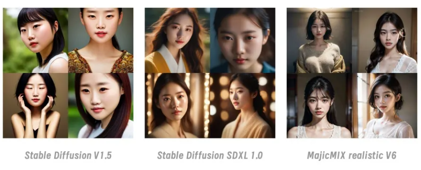

> 可以看出来StableDiffusionV1.5的亚裔女性都有点眯眯眼

用更通俗的话来说，官方大模型像是一本包罗万象的百科全书，虽然集合了 AI 绘图所需的基础信息，但是无法满足对细节和特定内容的绘图需求，所以想由此直接晋升为专业的绘图工具还是有些困难。

Stable Diffusion 官方模型的真正价值在于降低了模型训练的门槛，因为在现有大模型基础上训练新模型的成本要低得多。对众多炼丹爱好者来说，只需在官方模型基础上加上少量的文本图像数据，并配合微调模型的训练方法，就能得到应用于特定领域的定制模型。一方面训练成本大大降低，只需在本地用一张民用级显卡训练几小时就能获得稳定出图的定制化模型，另一方面，针对特定方向训练模型的理解和绘图能力更强，实际的出图效果反而有了极大的提升。

## 常见模型解析

了解了官方模型的价值，下面我们再来正式介绍下平时使用的几种模型。根据模型训练方法和难度的差异，我们可以将这些模型简单划分为 2 类：

* 一种是主模型Checkpoint
* 另一种则是用于微调主模型的扩展模型。
  * Embedding
  * LoRA
  * Hypernetwork

主模型指的是包含了 TextEncoder（文本编码器）、U-net（神经网络）和 VAE（图像编码器）的标准模型 Checkpoint，它是在官方模型的基础上通过全面微调得到的。但这样全面微调的训练方式对普通用户来说还是比较困难，不仅耗时耗力，对硬件要求也很高，因此大家开始将目光逐渐转向训练一些扩展模型，比如 Embedding、LoRA 和 Hypernetwork，通过它们配合合适的主模型同样可以实现不错的控图效果。

> 我们可以将主模型理解为一本面向特定科目的教材，而扩展模型则是针对教材内容进行补充的辅导资料或习题册。

| 模型名称      | 训练方法          | 常见大小 | 使用方法                                       | 特点                                                         |
| ------------- | ----------------- | -------- | ---------------------------------------------- | ------------------------------------------------------------ |
| Checkpoint    | Dreambooth        | 2GB+     | WebUI顶部设置栏直接切换                        | 最重要的主模型，效果最好，常用于控制画风，但文件体积较大，不够灵活 |
| Embedding     | Textual Inversion | 几KB     | 提示词框中输入触发关键词                       | 适合控制人物角色，但控图能力有限，常用于负面提示词           |
| LoRA          | LoRA              | 几百兆   | 提示词框中输入`<lora:filename:multiplier>`     | 目前最热门的扩展模型体积小且控图效果好，常用于固定角色特征   |
| HyperNetworks | HyperNetworks     | 几十兆   | 提示词框中输入`<hypernet:filename:multiplier>` | 类似低配版的LoRA模型，因训练难度较高已逐渐被淘汰，多用于控制画风，目前基本都升级为LoRA |
| VAE           |                   | 几百兆   | WebUI顶部设置栏直接切换                        | 作为外置模型来弥补主模型的VAE功能，多用于辅助出灰图的主模型，可以理解成滤镜，大部分已经被整合进Checkpoint |

Stable Diffusion 模型的文件后缀包括了`*.ckpt、*.pt、*.pth、*.safetensors` 等各种类型

在 Stable Diffusion 中并没有基于模型类型设置对应的文件后缀。比如`*.ckpt`后缀的文件既可能是 Checkpoint 模型、也可能是 LoRA 模型或者 VAE 模型。

而不同文件后缀的区别在于：`*.ckpt、*.pt、*.pth` 等后缀名表示的是基于 pytorch 深度学习框架构建的模型，因为模型保存和加载底层用到的是 Pickle 技术，所以存在可被用于攻击的程序漏洞，因此这几款模型后缀的文件中可能会潜藏着病毒代码。

为了解决安全问题，`*.safetensors` 后缀名的模型文件逐渐普及开来，这类模型的加载速度更快也更安全，这一点在 safe 后缀名上也能看出来。

但我们需要知道的是，这几种后缀名的模型差异仅限于保存数据的形式，内部数据实际上是没有太大区别的，因此不同模型间也可以通过工具进行格式转换。

平时我们使用时尽量选择`*.safetensors` 后缀的模型。

### Checkpoint

先来看看第一种模型：Checkpoint 模型，又称 Ckpt 模型或大模型。Checkpoint 翻译为中文叫检查点，之所以叫这个名字，是因为模型训练到关键位置时会进行存档，有点类似我们玩游戏时的保存进度，方便后面进行调用和回滚，比如官方的 v1.5 模型就是从 v1.2 的基础上调整得到的。

Checkpoint 模型的常见训练方法叫 Dreambooth，该技术原本由谷歌团队基于自家的 Imagen 模型开发，后来经过适配被引入 Stable Diffusion 模型中，并逐渐被广泛应用。

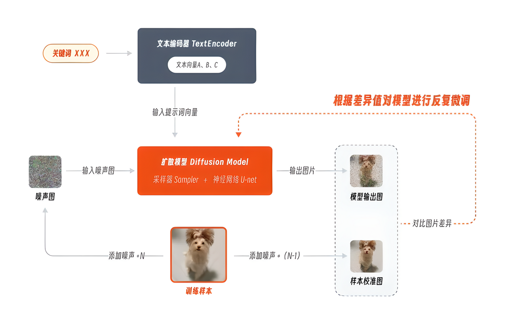

Dreambooth 训练模型是通过微调整个网络参数来得到一个完整的新模型。因此 Ckpt 模型可以很好的学习一个新概念，无论是用来训练人物、画风效果都很好。但缺点是训练起来成本较高，正常来说从官方模型通过 Dreambooth 训练出一款 Ckpt 模型，预计需要上万张图片，并且模型的文件包都比较大（至少都是在 GB 级别），常见的模型大小有 2G、4G、7G 等，使用起来不够灵活。

> 需要注意的是：并非模型体积越大，其绘图质量就越好。如果作者没有对模型进行优化处理，融合后的模型中会夹杂着大量的垃圾数据，这些数据除了占用宝贵的硬盘空间外没有任何作用。

使用 Checkpoint 模型的方法也很简单，我们下载好模型文件后，将其存放到 Stable Diffusion 安装目录下`\models\Stable-diffusion` 文件夹中。如果你是在 WebUI 打开的情况下添加的新模型，需要点击右侧的刷新按钮进行加载，这样就能选择新置入的模型了。

### Embeddings

虽然 Ckpt 模型包含的数据信息量很多，但动辄几 GB 的文件包使用起来实在不够轻便。比如有的时候我们只想训练一款能体现人物特征的模型来使用，如果每次都将整个神经网络的参数进行一次完整的微调未免有太过兴师动众，而这个时候就需要 Embeddings 闪亮登场了。

Embeddings 又被称作嵌入式向量，在之前初识篇的文章里我给大家介绍了 Stable Diffusion 模型包含文本编码器、扩散模型和图像编码器 3 个部分，其中文本编码器 TextEncoder 的作用是将提示词转换成电脑可以识别的文本向量，而 Embedding 模型的原理就是通过训练将包含特定风格特征的信息映射在其中，这样后续在输入对应关键词时，模型就会自动启用这部分文本向量来进行绘制。

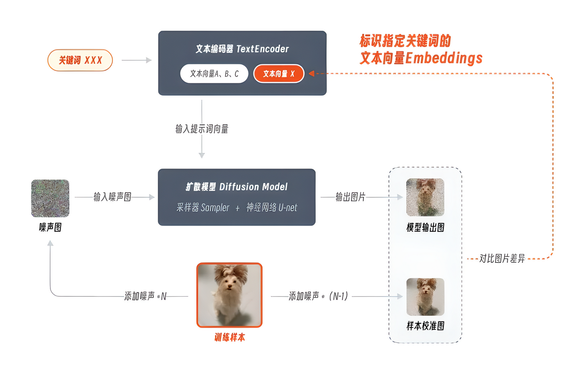

训练 Embeddings 模型的过程，由于是针对提示文本部分进行操作，所以该训练方法叫做 Textual Inversion 文本倒置，平时在社区中提到 Embeddings 和 Textual Inversion 时，指的都是同一种模型。

如果你此前下载过 Embeddings 模型包，会惊讶的发现它们普遍都非常非常小，有的可能只有几十 KB 大小。为什么模型之间会有如此大的体积差距呢？

> 类比来看，Ckpt 像是一本厚厚的字典，里面收录了图片中大量元素的特征信息，而 Embeddings 就像是一张便利贴，它本身并没有存储很多信息，而是将所需的元素信息提取出来进行标注。

在这个基础上，我们也能将 Embeddings 模型简单理解为封装好的提示词文件，通过将特定目标的描述信息整合在 Embeddings 中，后续我们只需一小段代码即可调用，效果要比手动输入要方便快捷上许多。像我们平时头疼的避免错误画手、脸部变形等信息都可以通过调用 Embeddings 模型来解决，比如最出名的 EasyNegative 模型。

以守望先锋里人气角色 D.VA 为例。对于该角色我们都有统一的外貌共识，比如蓝色紧身衣、棕色头发、脸上的花纹等，这些信息如果单纯通过提示词描述往往很难表达准确，而有了 Embedding 就轻松多了。可以看到调用了 D.VA 的 Embedding 模型后，即使是不同画风的主模型也都能实现比较准确的角色形象还原。

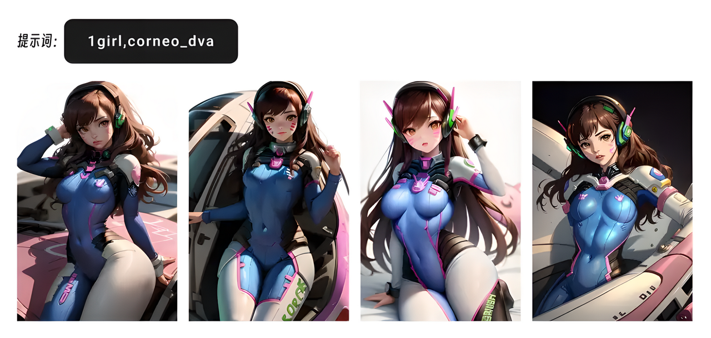

当然，Embedding 也有自己的局限性。由于没有改变主模型的权重参数，因此它很难教会主模型绘制没有见过的图像内容，也很难改变图像的整体风格，因此通常用来固定人物角色或画面内容的特征。使用方法也很简单，只需将下载好的模型放置到 Stable Diffusion 安装目录下`\embeddings` 文件夹中，使用时点击对应的模型卡片，对应的关键词就会被添加到提示词输入框中，这时再点击生成按钮便会自动启用模型的控图效果了。

### LoRA

虽然 Embeddings 模型非常轻量，但大部分情况下都只能在主模型原有能力上进行修正，有没有一种模型既能保持轻便又能存储一定的图片信息呢？这就不得不提我们大名鼎鼎的 LoRA 模型了。

LoRA 是 `Low-Rank Adaptation Models` 的缩写，意思是低秩适应模型。LoRA 原本并非用于 AI 绘画领域，它是微软的研究人员为了解决大语言模型微调而开发的一项技术，因此像 GPT3.5 包含了 1750 亿量级的参数，如果每次训练都全部微调一遍体量太大，而有了 lora 就可以将训练参数插入到模型的神经网络中去，而不用全面微调。通过这样即插即用又不破坏原有模型的方法，可以极大的降低模型的训练参数，模型的训练效率也会被显著提升。

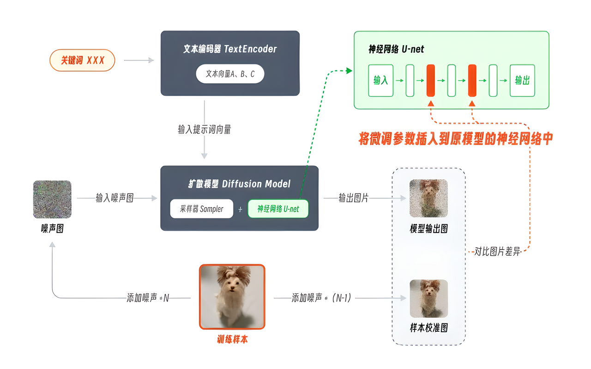

相较于 Dreambooth 全面微调模型的方法，LoRA 的训练参数可以减少上千倍，对硬件性能的要求也会急剧下降。

> 如果说 Embeddings 像一张标注的便利贴，那 LoRA 就像是额外收录的夹页，在这个夹页中记录了更全面图片特征信息。

由于需要微调的参数量大大降低，LoRA 模型的文件大小通常在几百 MB，比 Embeddings 丰富了许多，但又没有 Ckpt 那么臃肿。模型体积小、训练难度低、控图效果好，多方优点加持下 LoRA 收揽了大批创作者的芳心，在开源社区中有大量专门针对 LoRA 模型设计的插件，可以说是目前最热门的模型之一。

那 LoRA 模型具体有哪些应用场景呢？总结成一句话就是固定目标的特征形象，这里的目标既可以是人也可以是物，可固定的特征信息就更加保罗万象了，从动作、年龄、表情、着装，到材质、视角、画风等都能复刻。因此 LoRA 模型在动漫角色还原、画风渲染、场景设计等方面都有广泛应用。

安装 LoRA 模型的方法和前面大同小异，将模型保存在`\models\Lora` 文件夹即可，在实际使用时，我们只需选中希望使用的 LoRA 模型，在提示词中就会自动加上对应的提示词组。

> 需要注意的是，有些 LoRA 模型的作者会在训练时加上一些强化认知的触发词，我们在下载模型时可以在右侧看到 `trigger word`，非常建议大家在使用 LoRA 模型时加上这些触发词，可以进一步强化 LoRA 模型的效果。但触发词不是随便添加的，每一个触发词可能都代表着一类细化的风格。当然有的模型详情中没有触发词，这个时候我们直接调用即可，模型会自动触发控图效果。

### Hypernetwork

接着，我们再来了解下 Hypernetwork 模型 。它的原理是在扩散模型之外新建一个神经网络来调整模型参数，而这个神经网络也被称为超网络。

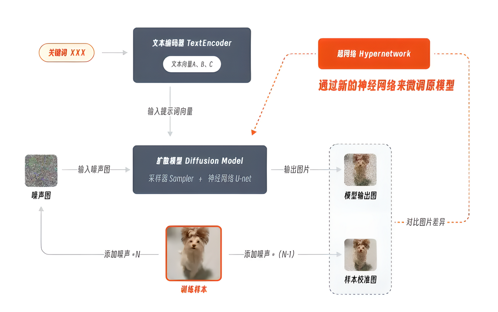

因为 Hypernetwork 训练过程中同样没有对原模型进行全面微调，因此模型尺寸通常也在几十到几百 MB 不等。它的实际效果，我们可以将其简单理解为低配版的 LoRA，虽然超网络这名字听起来很厉害，但其实这款模型如今的风评并不出众，在国内已逐渐被 lora 所取代。因为它的训练难度很大且应用范围较窄，目前大多用于控制图像画风。所以除非是有特定的画风要求，否则还是建议大家优先选择 LoRA 模型来使用。

Hypernetwork 的安装地址是`\models\hypernetworks`，使用流程与 LoRA 基本相同。

### VAE

最后就是 VAE 模型了，它的工作原理是将潜空间的图像信息还原为正常图片。作为 ckpt 模型的一部分，VAE 模型并不像前面几种模型用于控制图像内容，而是对主模型的图像修复。

我们在使用网络上分享的 ckpt 模型绘图时，有时候会发现图像的饱和度很低，呈现出灰色质感，但是加上 VAE 模型后图像色彩就得到了修正。因此很多人便以为 VAE 是一种调色滤镜模型，可以增强图像的显示效果，但其实这样的理解并不准确。

导致图像发灰的真正原因是主模型本身的 VAE 文件损坏，因此从潜空间恢复成正常图片时会存在图像信息缺失的问题，加上现在社区中很多模型都是从其他热门模型融合而来，如果初始模型的 VAE 文件有问题，就会导致融合后模型都出现图像发灰的情况，最典型的就是融合模型 Anything4.5。

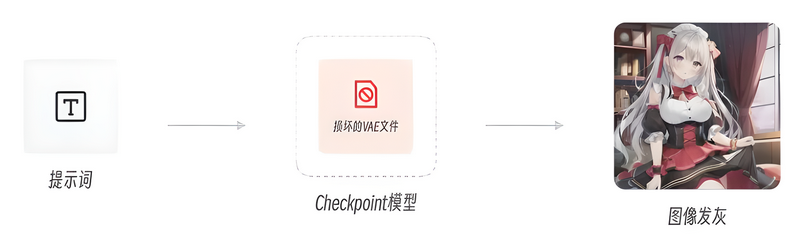

这种情况下一般都需要修复 VAE 才能使主模型恢复正常，但修复模型是个技术活，如果将所有模型都修复一遍未免成本过高，因此在 WebUI 中提供了外置 VAE 的选项，只要在绘图时选择正常的 VAE 模型，在图像生成过程中就会忽略主模型里内置损坏的 VAE 而使用外置模型，而这才是图像色彩被修正的真正原因。

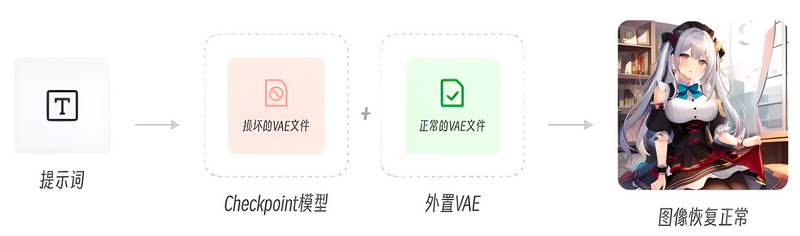

好在社区中目前大部分新训练的 ckpt 模型中 VAE 都比较正常，而对于有问题的模型，作者一般在介绍页中会附上他们推荐的 VAE 模型，当然也有一些可以通用的 VAE，比如秋叶整合包里内置的「kl-f8-anime2」。

VAE 模型的放置位置是在`\models\VAE`，因为是辅助 Checkpoint 大模型来使用，所以可以将大模型对应的 VAE 修改为同样的名字，然后在选项里勾选自动，这样在切换 Checkpoint 模型时 VAE 就会自动跟随变换了。

## 模型的功能类型

介绍了不同模型的特点和差异后，我们再回过头来看看目前社区模型的功能类型，从控图方向大致可以分为三类：固定对象特征、固定图像风格和概念艺术表达

### 固定对象特征

这里的对象既可以指人，也可以指物。以人物角色为例，模型在训练时只需学习人物的大致特征，比如外貌、服饰、发型、表情等，这些特征相对来说比较明确，比如金克丝标志性的蓝色麻花辫和萝莉身材、甘雨的兽角和蓝色头发等。因此，训练特定对象的模型训练起来相对更加简单。

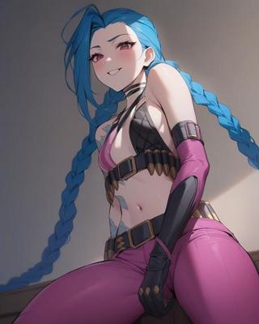

### 固定图像风格

相较于明确的对象，图像画风包含更多的信息。最常见的如摄影风格、二次元卡通风格、2.5D 风格等，这些绘图风格除了主体内容，还包括颜色、线条、光影、笔触等多方面的环境信息，且不同特征信息之间相互关联，共同组合成最终的图片。因此模型需要学习的内容更多也更加复杂。

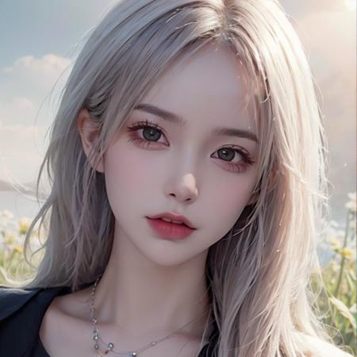

### 概念艺术表达

概念艺术指的是将某一类比较抽象的事物通过具象化的表现手法进行展示，最典型的就是一直很火的赛伯朋克。这类艺术作品充斥着霓虹灯、机械科技、黑客等特征元素，但又没有具体的画风限制，既可以是二次元的卡通动漫风格，也可以是真实的人物场景。对于这类没有具体的对象特征，但又能被划分为同类型的艺术概念，模型在学习和理解上又上升了一层难度，目前在开源社区中可以完美表达这类概念模型比较少见，且基本都是 Ckpt 和 LoRA 模型。

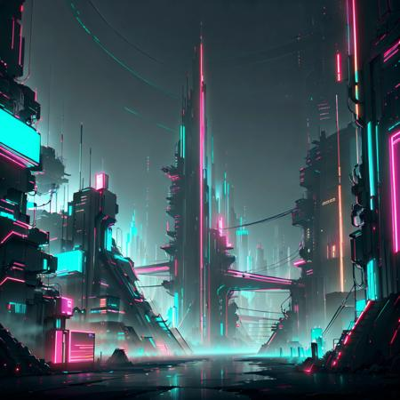

## 模型推荐

Civitai，或称C站，是一个为Stable Diffusion AI艺术模型设计的新兴网站。网站链接为：https://civitai.com/。致力于为用户提供AI艺术资源的分享与发现。

C站的主要功能在于帮助用户轻松地探索与运用各类AI艺术模型。用户可以上传和分享自己用数据训练的AI自定义模型，也可以浏览和下载其他用户创建的模型。配合AI艺术软件，这些模型可用于生成个性化和独特的艺术作品。

其它站点基本都是C站的搬运工，比如[LiblibAI·哩布哩布AI - 中国领先的AI创作平台](https://www.liblib.art/)，当然现在也逐渐开始有原创的内容。

### Checkpoint

> * Base Model：基于哪个基础模型

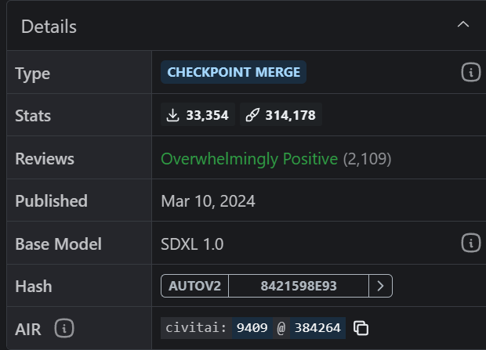

#### 人物插画风

[UnstableInkDream - 7.5balance | Stable Diffusion Checkpoint | Civitai](https://civitai.com/models/1540/unstableinkdream?modelVersionId=40626)

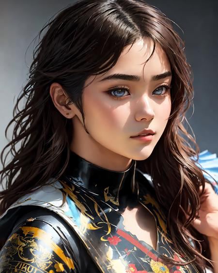

* 使用场景：画人物
* 建议搭配参数： 采样器：DPM++ 2M Karras；步数：20
* 提示词示例：`((masterpiece)),((nsanely detailed)), ((intricate)),((high quality)) a little girl character, pop-art illustration style, simple,cute, 5 years old girl, full color, blue dress, blue shoes, long brown hair, blue hat, no outline, 3d`

> 这个模型默认颜色一直是灰蒙蒙的效果。需要下载一个VAE,然后在设置里面勾选上即可，类似的问题都可以用下面的VAE解决：
>
> [stabilityai/sd-vae-ft-mse-original at main (huggingface.co)](https://huggingface.co/stabilityai/sd-vae-ft-mse-original/tree/main)

#### 二次元

[万象熔炉 | Anything XL - XL | Stable Diffusion Checkpoint | Civitai](https://civitai.com/models/9409/or-anything-v5)

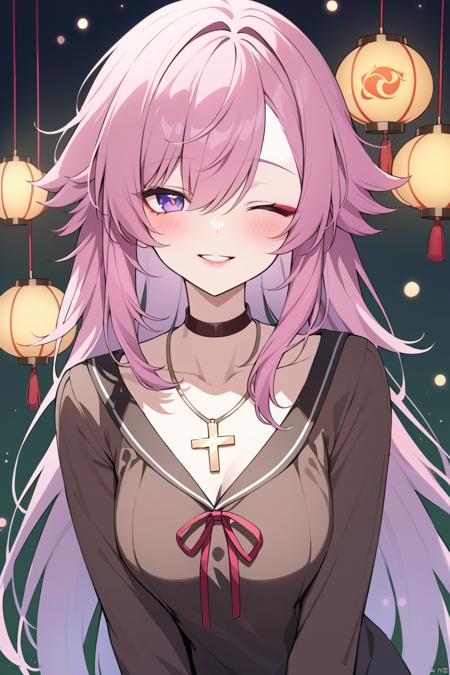

* 使用场景：画二次元萌妹
* 建议搭配参数： 采样器：DPM++ 2M Karras；步数：20
* 提示词示例：`((masterpiece)),((nsanely detailed)), ((intricate)),((high quality)) a little girl character, pop-art illustration style, simple,cute, 5 years old stading girl, full color, red dress, red shoes, long brown hair, red hat, no outline, 3d`

#### 超真实风格

[Deliberate for Invoke - v0.8 | Stable Diffusion Checkpoint | Civitai](https://civitai.com/models/5585/deliberate-for-invoke)

* 使用场景：使用较多，默认真实风格，且搭配很多lora效果都不错
* 建议搭配参数：DPM++ SDE Karras + step20
* 提示词示例：`((masterpiece)),((nsanely detailed)), ((HD Quality)),((exquisite face)) background: The background is a construction site, ((skyscrapers under construction)), feeling in 1990s shenzhen china. character：There is only one asian female agent，clear face，20-year-old,smile,must appear item：(an ice cream cone)`

#### 动画

[ReV Animated - v1.2.2-EOL | Stable Diffusion Checkpoint | Civitai](https://civitai.com/models/7371?modelVersionId=46846)

* 使用场景：搭配泡泡玛特lora效果非常棒
* 建议搭配参数：采样器：Euler a + step 28
* 提示词示例：`(masterpiece),(best quality),(ultra-detailed), (full body:1.2), wide angle,1girl,cute, smile, open mouth, flower, outdoors, running on the grass, blurry, brown hair, blush stickers, long sleeves, bangs, black hair, pink flower, (beautiful detailed face), (beautiful detailed eyes),music, beret, blush, short hair, surrounded by balloons, blue sky and white clouds, lora:blindbox_v1_mix:1`

#### 悬疑风/风景/插画

[Illuminati Diffusion v1.1 - v1.1 | Stable Diffusion Checkpoint | Civitai](https://civitai.com/models/11193/illuminati-diffusion-v11)

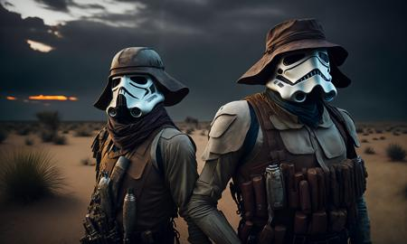

* 使用场景：这个模型一开始是想用来做悬疑小说的封面的，后来发现画简笔画、插画居然也都还行！
* 建议搭配参数：采样器DPM++ 2M Karras +step 20
* 提示词示例：`gray sky,white clouds,fantasstyle,fantasy,mountains,castle,canyons,fantasy,magic,4k`

* 简笔头像提示词示例：`(races of monotony Line drawing),(flat illustration),minimalism,headshot, line art.`
  `A cute cartoon girl with short hair,stick figure,headshot,bold line illustration,((in the style of Black line drawn drawing)),((traces of monotony line drawing)), clean blue background`
* 插画提示词示例：`((masterpiece)),((nsanely detailed)), ((HD Quality)),((best quality))kawaii girl sitting on a watermelon, in the style of nature painter, ai yazawa, xiaofei yue, storybook illustrations, detailed botanical illustrations, lively tableaus`

#### 国风

[国风3 GuoFeng3 - v3.3 | Stable Diffusion Checkpoint | Civitai](https://civitai.com/models/10415?modelVersionId=36644)

* 使用场景：国风
* 建议搭配参数：采样器Euler a+step30
* 提示词示例：`best quality, masterpiece, highres, 1girl,blush,(seductive smile:0.8),star-shaped pupils,china hanfu,hair ornament,necklace, jewelry,Beautiful face,upon_body, tyndall effect,photorealistic, dark studio, rim lighting, two tone lighting,(high detailed skin:1.2), 8k uhd, dslr, soft lighting, high quality, volumetric lighting, candid, Photograph, high resolution, 4k, 8k, Bokeh`

### LoRA

> * Base Model：基于哪个基础模型
> * Trigger Words：触发LoRA的关键字
> * 另外要注意详细介绍中的作者建议，比如`Weight 1.0 will perform better.`

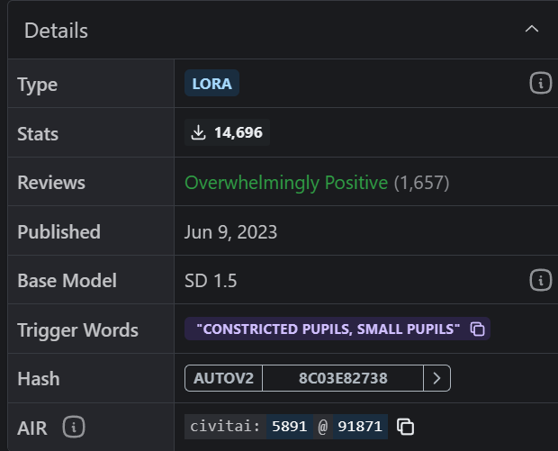

#### 插画

[Adventurers 2.0 - V1 LoRA | Stable Diffusion LyCORIS | Civitai](https://civitai.com/models/14792?modelVersionId=17424)

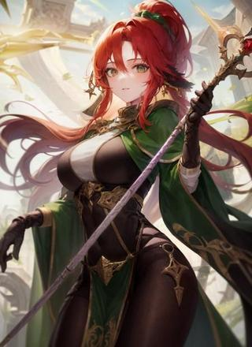

#### 表情lora

[Crazy Expressions - Constricted Pupils V3 | Stable Diffusion LoRA | Civitai](https://civitai.com/models/5891/crazy-expressions)

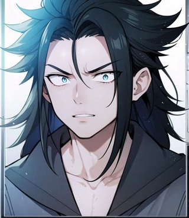

#### 水墨风

[墨心 MoXin - 墨心 MoXin 1.0 | Stable Diffusion LoRA | Civitai](https://civitai.com/models/12597?modelVersionId=14856)

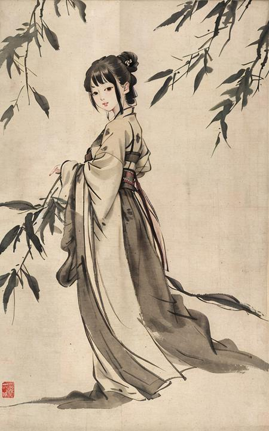

* 建议搭配写实类风格Checkpoint使用

#### 小人书·连环画

[小人书·连环画 xiaorenshu - v2.0 | Stable Diffusion LoRA | Civitai](https://civitai.com/models/18323?modelVersionId=25661)

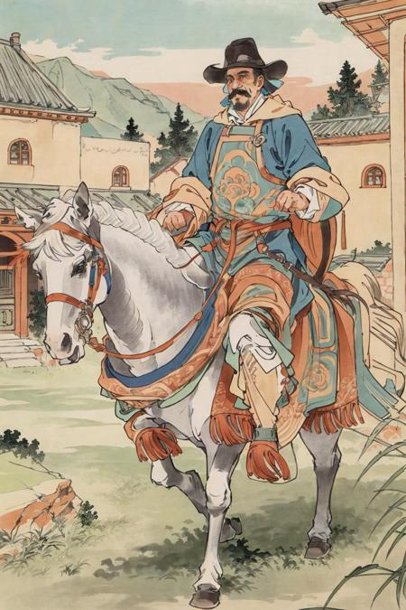

* 建议搭配写实类风格Checkpoint使用

#### 二次元漫画风

[[LoCon/LoRA\] Airconditioner/空调 Style - LoRa Version | Stable Diffusion LoRA | Civitai](https://civitai.com/models/22607?modelVersionId=27334)

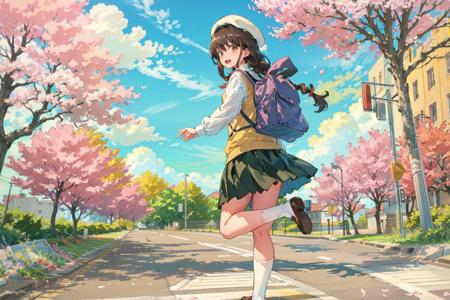

#### 城市景色

[Samuri Jack s05 Landscape Style - v1 | Stable Diffusion LoRA | Civitai](https://civitai.com/models/14914?modelVersionId=17569)

#### 线条

[Ligne Claire - Alpha | Stable Diffusion LoRA | Civitai](https://civitai.com/models/19932?modelVersionId=23670)

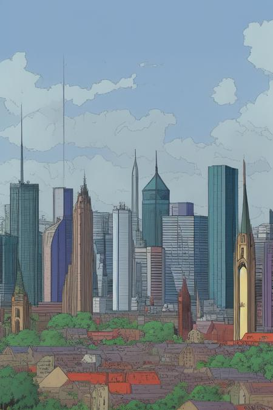

#### 科幻

[LOGH-FPA Fleet Style - V4 | Stable Diffusion LoRA | Civitai](https://civitai.com/models/30480?modelVersionId=39888)

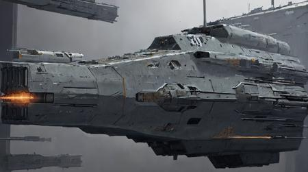

#### 室内设计

[XSarchitectural-InteriorDesign-ForXSLora - V11 | Stable Diffusion Checkpoint | Civitai](https://civitai.com/models/28112?modelVersionId=50722)

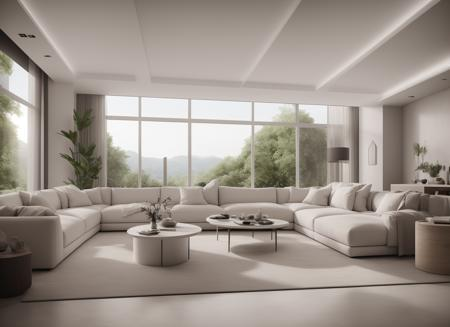

#### 亚洲男生

[AsianMale - v1.0 | Stable Diffusion LoRA | Civitai](https://civitai.com/models/13220?modelVersionId=15581)

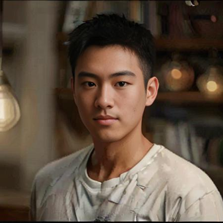

#### 多角度角色设计

[CharTurnerBeta - Lora (EXPERIMENTAL) - CharTurnBetaLora | Stable Diffusion LoRA | Civitai](https://civitai.com/models/7252/charturnerbeta-lora-experimental)

### 艺术风格

#### 梵高风格

雨林，星空

* 基础模型：deliberate
* 提示词：`((high quality, masterpiece:1.4)), side view, oil painting style, ((oil painting)), art like (Vincent Willem van Gogh style), European Landscape Oil Painting，Rainforest, lush trees, dense vegetation, vibrant, with sunlight shining through the leaves and moist air.Starry sky, starry dots, aurora, golden ratio`
* 核心关键词：
  * `art like (Vincent Willem van Gogh style)`
  * `oil painting style`

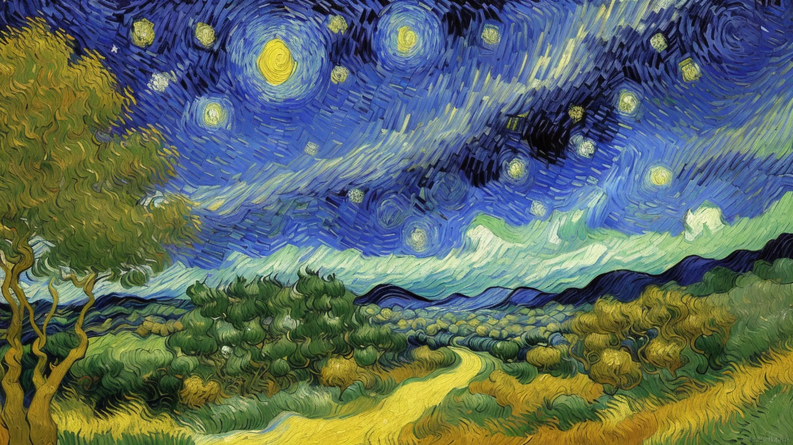

#### 水彩渲染风格

花园场景

* 基础模型：dreamshaperXL
* 提示词：`((high quality, masterpiece:1.4))，Watercolor halo style, gradient transparency, display of color mixing techniques,Natural, Beautiful Garden, Blooming Flowers, Green Leaves, Vibrant, Sunshine, Delicate, Peaceful`
* 核心关键词：`Watercolor halo style`

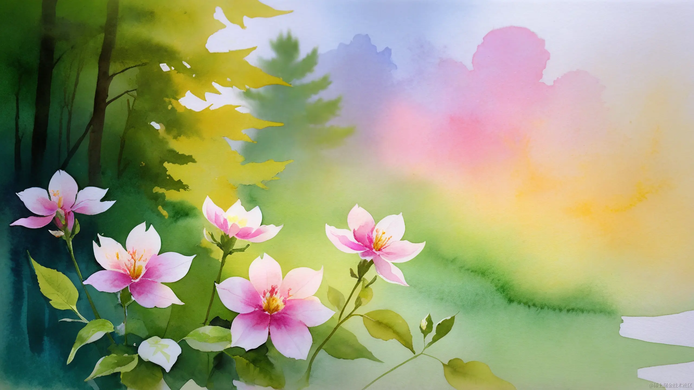

#### 水墨渲染风格

花园场景

* 基础模型：landscape
* lora：水墨类
* 提示词：`((high quality, masterpiece:1.4))，Artwork in traditional Chinese ink and wash style, emphasizing the use of shading and gradation with ((white and black ink)), (((white background, scenery, ink))),Natural, Beautiful Garden, Blooming Flowers, Green Leaves, Vibrant, Sunshine, Delicate, peaceful <lora:shuimobysimV3:0.4 >`
* 核心关键词：
  * `Artwork in traditional Chinese ink and wash style`
  * `emphasizing the use of shading and gradation with ((white and black ink))`
  * `(((white background, scenery, ink)))`

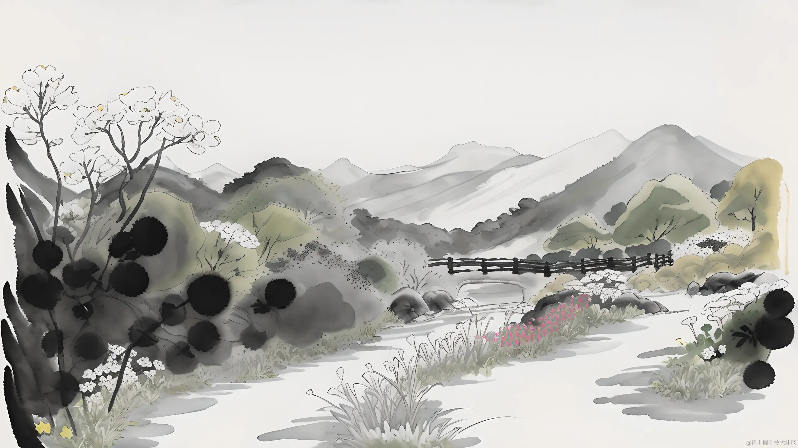

#### 浮世绘风格

海洋场景

* 基础模型：landscape
* 提示词： `((high quality, masterpiece: 1.4)), Ukiyo-e style art, traditional style, retro color, old style, (retro), simple and lively, ink strokes, traditional art, watercolor effect, characterized by flat colors and bold outlines, magnificent waves, vibrant sunlight, textured water spray and foam`
* 核心关键词：` Ukiyo-e style art`

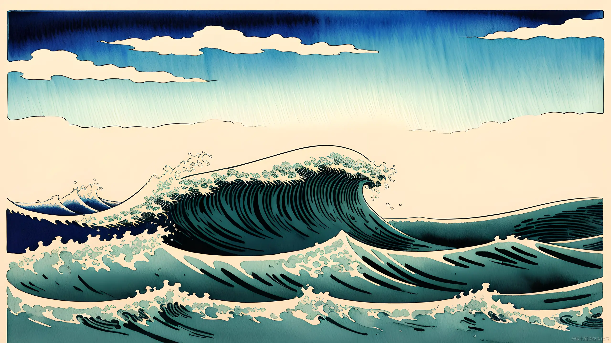

#### 抽象艺术风格

沙漠

* 基础模型：chahua
* lora：涂鸦类
* 提示词：`(High quality, masterpiece: 1.4), (Abstract Art Style), Abstract Drawing Art Style with Large Color Blocks, Minimalism, Abstract Expressionism, Blank Space in the Picture, Golden desert, blue sky and white clouds, distant view Exciting and joyful atmosphere,<lora: TUYA5:0.5>`
* 核心关键词：` Abstract Art Style`

#### 风景摄影风格

山峰，雪山场景

* 基础模型：landscape
* 提示词：`((high quality, masterpiece:1.4))，4k, HD quality，Realistic photography, ray tracing, depth of field, natural lighting, Snow scenery and blue sky in the Himalayas， A joyful atmosphere`
* 核心关键词：` Realistic photography`

#### 莫奈印象

花园场景

* 基础模型：dreamshaperXL
* lora：ClaudeMonet
* 提示词：`((high quality, masterpiece:1.4))，Artwork in the style of Claude Monet, capturing the essay of impressionism with light brushwork and a focus on the effects of light and color, natural, garden scenery, blooming flowers, green leaves, vibrant, sunny, delicate, and peaceful< lora:ClaudeMonet:0.7>`
* 核心关键词：` Artwork in the style of Claude Monet`

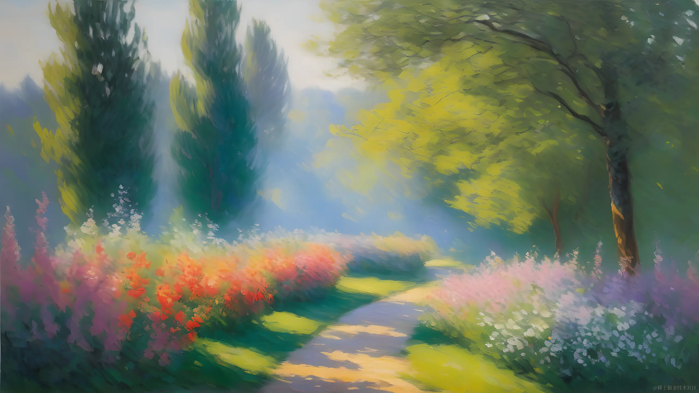

#### 工笔画

花园场景

* 基础模型：dreamshaperXL
* lora：工笔画类
* 提示词：`((high quality, masterpiece:1.4))，Artwork in meticulous brushwork style, showcasing detailed and precise strokes typical of traditional Chinese fine-line painting，Natural, Beautiful Garden, Blooming Flowers, Green Leaves, Vibrant, Sunshine, Delicate, peaceful < lora:xdgb:1>`
* 核心关键词：
  * ` Artwork in meticulous brushwork style`
  * `showcasing detailed and precise strokes typical of traditional Chinese fine-line painting`

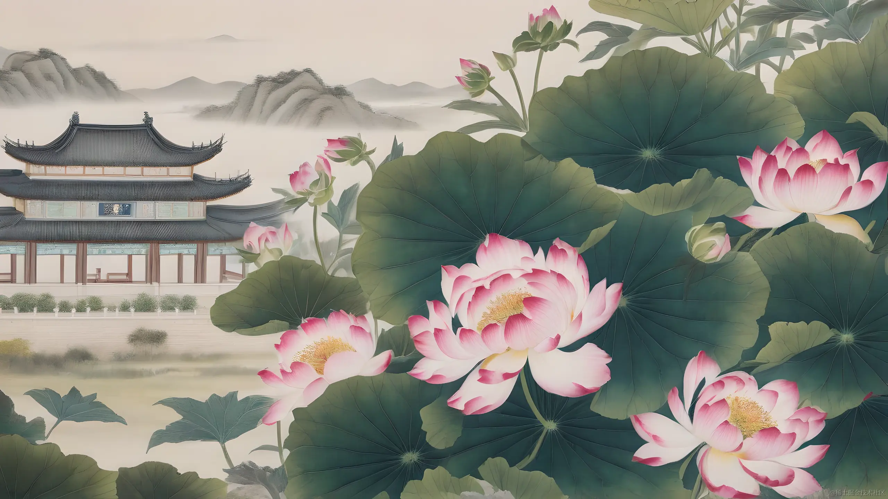

#### 钢笔水彩

海洋场景

* 基础模型：landscape
* lora：钢笔淡彩
* 提示词：`(High quality, masterpiece: 1.4), Artwork in pen and watercolor style, artistic conception, exquisite lines, dynamic texture, transparent watercolor, rich layering, texture and depth,In the misty morning of the ocean, the distant sailboat, the soft dawn light, and the smooth water surface with faint ripples，An ambiguous atmosphere< lora:gangbidancai:0.5>`
* 核心关键词：`Artwork in pen and watercolor style`

#### 波普艺术

花园场景

* 基础模型：dreamshaperXL
* lora：pop_art
* 提示词：`((high quality, masterpiece:1.4))，Artwork in pop art style, featuring bold colors, commercial imagery, and iconic subjects characteristic of the pop art movement,Natural, Beautiful Garden, Blooming Flowers,Vibrant, Sunshine, Delicate, peaceful，close-up shots，roses< lora:pop_art_v2:1>`
* 核心关键词：`Artwork in pop art style`

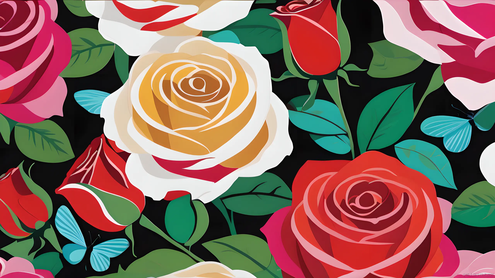

## SDXL

7 月 26 日，Stability AI 官网宣布开源了迄今为止最强的绘图模型—Stable Diffusion XL 1.0，很多人都在惊叹Midjourney的免费版平替要来了，为什么这款新模型会引起如此多热议，相较于之前版本又有哪些区别呢？

自去年 8 月 Stable Diffusion V1 发布至今，Stability 已陆续推出过 V1.X、V2.X、XL 0.9 等多个版本，但除了一开始开源的初代版本外，后续版本似乎都没有像 XL 1.0 这样引起如此多热议，XL0.9 也只是支持在 ComfyUI 上使用，而 XL 1.0 算是真正意义上大多数用户可以体验的全新旗舰版模型。完整的 Stable DiffusionXL 1.0 包含 2 个部分：Base 版基础模型和 Refiner 版精修模型。前者用于绘制图像，后者用于对图像进行优化，添加更多细节。

### 迄今为止最大的开源绘图模型

Stable DiffusionXL 1.0 是目前世界上最大参数级的开放绘图模型，基础版模型使用了 35 亿级参数，而精修版模型使用了 66 亿级参数，要知道清华的 LLM—ChatGLM也才6亿的参数量。巨量级参数带来的是出图兼容性大幅提升，Stable DiffusionXL 1.0几乎可以支持任意风格的模型绘制，并且图像精细度和画面表现力也都得到了显著提升。

如今的 Stable DiffusionXL 甚至可以支持生成清晰的文本，这是目前市面上绝大多数绘图模型都无法做到的。此外，对人体结构的理解也被加强，像之前一直被诟病的手脚错误等问题都得到了显著改善。

### 原生出图的分辨率超级加倍

在之前版本的 Stable Diffusion 模型中，由于是采用 512 或 768 尺寸的图片进行训练，因此当初始图像超过这个尺寸就会出现多人多头的情况，但小尺寸图像又无法体现画面中的细节内容，因此此前的做法都是先生成小图，再通过高清修复等方式绘制大图。

但 XL1.0 采用了 1024 x1024 分辨率的图片进行训练，这就保证了日后我们以同样尺寸绘制图像时再也不用担心多人多头的问题，可以直接绘制各种精美的大尺寸图片（如果显卡算力跟得上的话～）。并且通过 Refiner 精修模型的二次优化，原生图像表现力也得到了显著提升。

### 更加智能的提示词识别

此前我们在绘制图像时通常需要添加“masterpiece”等限定词来提升画面表现力，而如今 XL1.0 只需短短几个词便能生成非常精美的图片。

更重要的是，新版 XL 对自然语言的识别能力大大增强。此前我们都是通过词组方式来填写提示词，对于图像中需要突出展示的内容我们也是手动添加括号来增强对应关键词的权重。而日后我们可能更多情况下都会使用自然语言，也就是连贯的句子来描述图像信息，Stable Diffusion 会自动识别关键内容给予呈现。简单来说，我们编写咒语的门槛会大大降低，只需简单的自然语言描述就能获得目标图像。

### 超丰富的艺术风格支持

旧版模型的默认绘图风格更倾向于真系系的照片摄影，而在最新的 Stable Diffusion XL1.0 中提供了更加丰富的艺术风格选项，可以通过提示词在十余种不同风格间自由切换，包括动漫、数字插画、胶片摄影、3D 建模、折纸艺术、2.5D 等距风、像素画等超多选项。

## 功能性AI大模型

Stable Diffusion使用时，我们经常会使用一些插件和辅助工具，用来制作蒙版、换脸、局部清理等等，这时候也需要使用一些AI大模型，这些大模型不是直接用来绘图，主要是起到分析图像等功能，

这类模型一般在[Hugging Face – The AI community building the future.](https://huggingface.co/)下载，huggingface可以理解为对于AI开发者的GitHub，提供了模型、数据集（文本|图像|音频|视频）、类库（比如transformers|peft|accelerate）、教程等。

* 大部分插件会自动去huggingface下载需要的模型
* 有时候也需要我们自己去huggingface下载

> 如下图`Inpaint Anything`插件需要我们点击按钮后，再去huggingface下载选定的模型

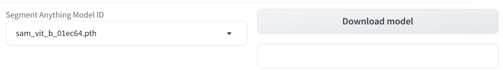

### SAM

[facebook/sam-vit-base · Hugging Face](https://huggingface.co/facebook/sam-vit-base)

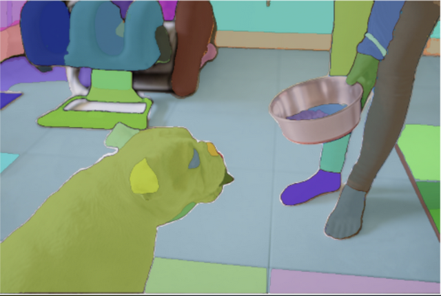

Meta公司发布的名为“Segment Anything Model”（SAM）的通用AI大模型，号称可以“零样本分割一切”。也就是说，SAM能从照片或视频图像中对任意对象实现一键分割，并且能够零样本迁移到其他任务中。

当我们需要制作蒙版的时候，首先需要将图片分割开（比如面部，衣服，四肢），然后选定需要制作蒙版的子块，这里就需要用到SAM

### LaMa

[advimman/lama: 🦙 LaMa Image Inpainting, Resolution-robust Large Mask Inpainting with Fourier Convolutions, WACV 2022 (github.com)](https://github.com/advimman/lama)

遇到去水印、去马赛克等问题，就需要LaMa AI大模型。

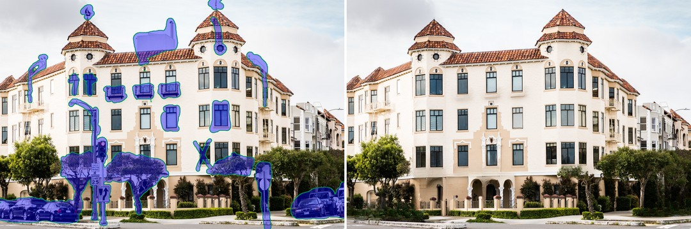

SAM和LaMa的协作案例

###  ControlNet

[lllyasviel (Lvmin Zhang) (huggingface.co)](https://huggingface.co/lllyasviel)

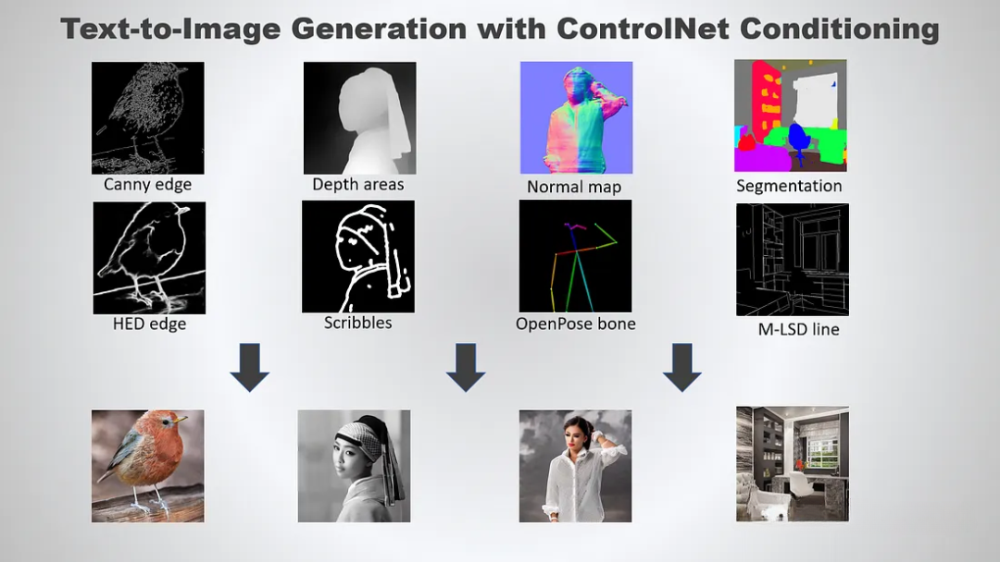

ControlNet能够对AI绘画进行精准控制，是Stable Diffusion从玩具到生产力的核心插件，也是大神Lvmin Zhang的作品，使用ControlNet会用到形形色色的大模型，都可以在Lvmin Zhang的huggingface下载到。

### IP-Adapter

[h94 (xiaohu) (huggingface.co)](https://huggingface.co/h94)

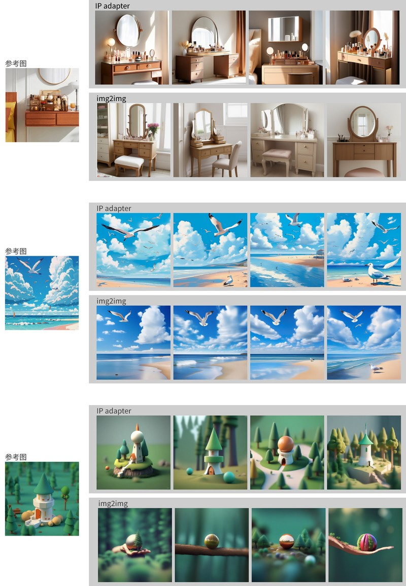

不用训练lora，一张图就能实现风格迁移，还支持多图多特征提取，同时强大的拓展能力还可接入动态prompt矩阵、controlnet等等，这就是IP-Adapter，一种全新的“垫图”方式，让你的AIGC之旅更加高效轻松。

其中IP-Adapter-FaceID是换脸神器，是个人觉得是使用最简单且效果很好的换脸工具

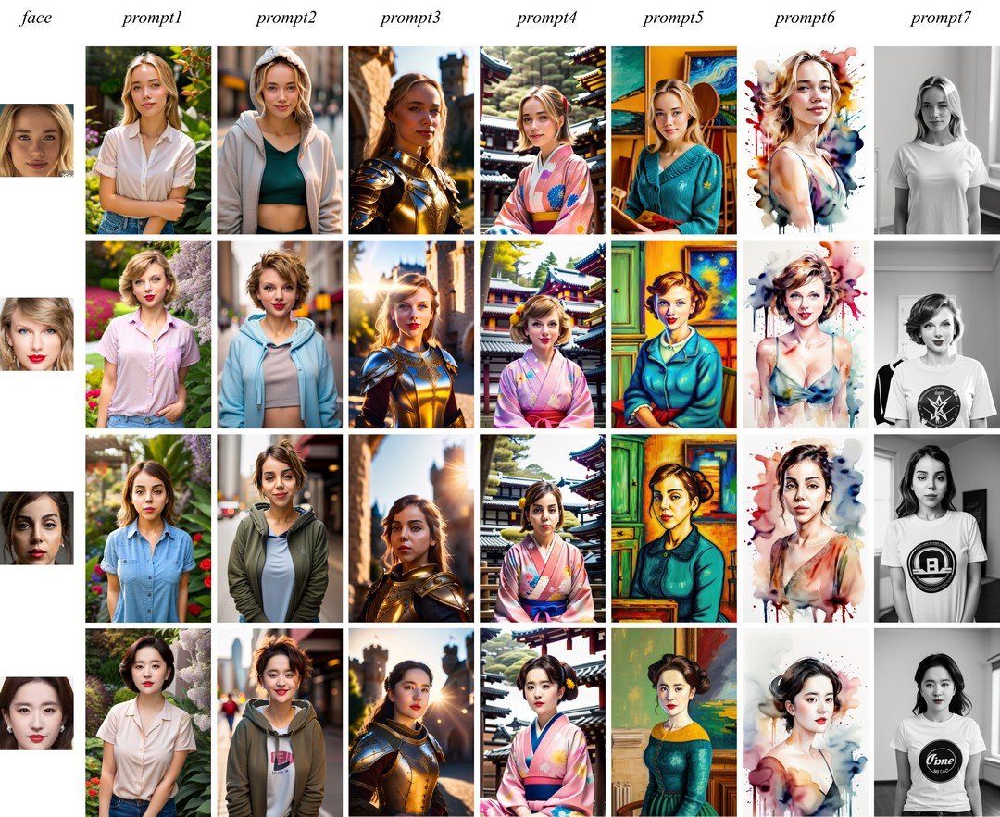

### CLIP

[laion (LAION eV) (huggingface.co)](https://huggingface.co/laion)

CLIP可以计算图像和文本的表示形式，以衡量它们的**相似**程度。我们在使用IP-Adapter类似垫图插件时离不开它。

IP-Adapter使用从OpenCLIP模型中提取的图像块嵌入作为条件来生成图像。这样使得生成的图像和原图像有了关联性和相似性。

## 参考文档

* [Stable Diffusion 模型解析！带你一次看懂5种常用模型（上）- 优设9图 - 设计知识短内容 (uisdc.com)](https://www.uisdc.com/group/529382.html)
* [Stable Diffusion 模型解析，9张图带你掌握功能划分（下）- 优设9图 - 设计知识短内容 (uisdc.com)](https://www.uisdc.com/group/529979.html)
* [Stable Diffusion入门使用技巧及个人实例分享--大模型及lora篇（1） - 掘金 (juejin.cn)](https://juejin.cn/post/7236634070474522680)
* [Stable Diffusion生成十大艺术风格大片欣赏（7）（附提示词） - 掘金 (juejin.cn)](https://juejin.cn/post/7339731268148248614)