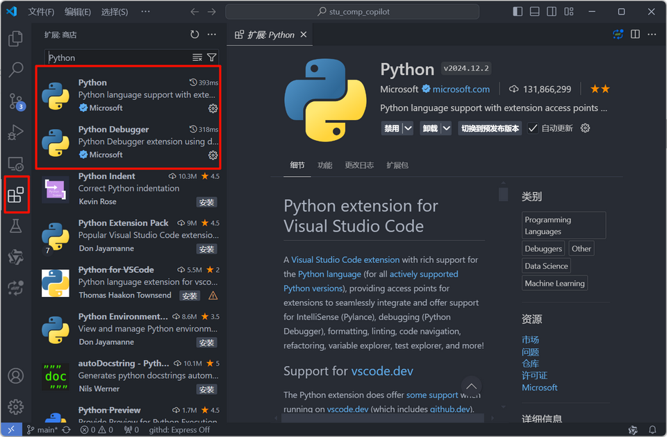
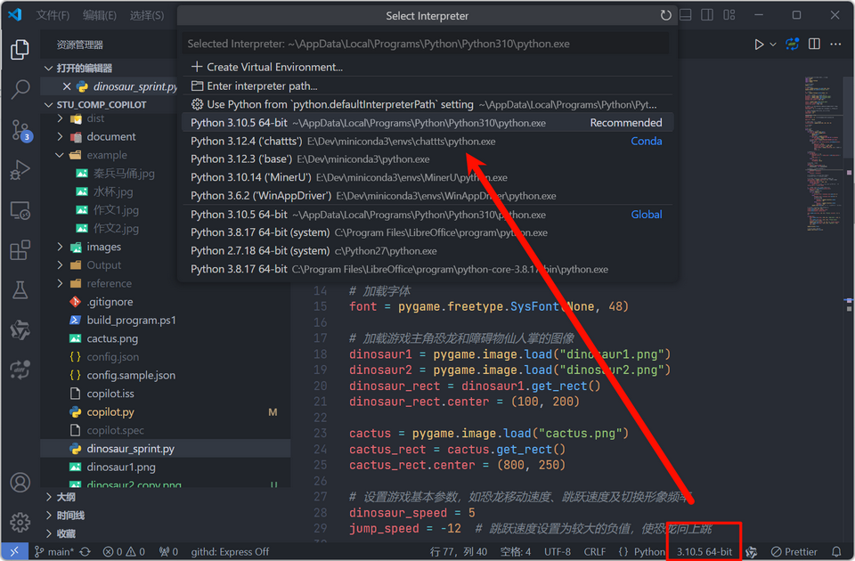
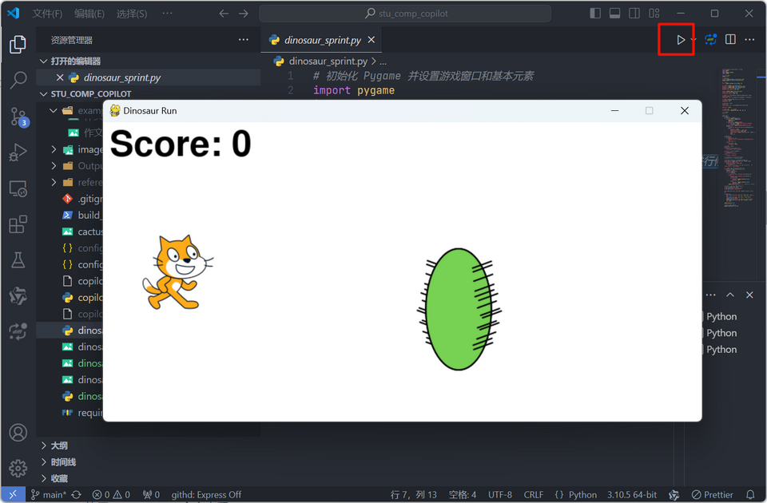
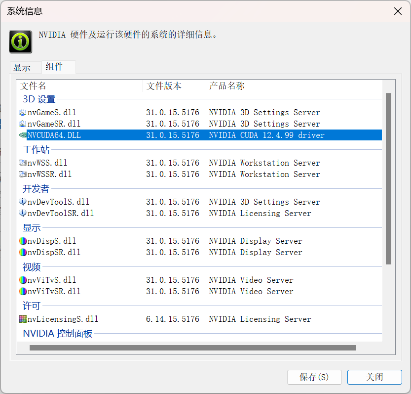
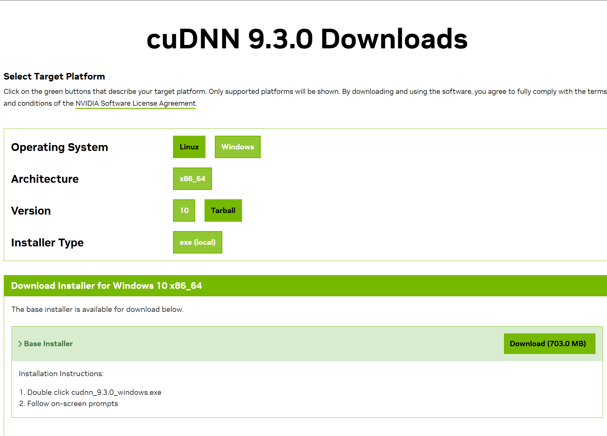
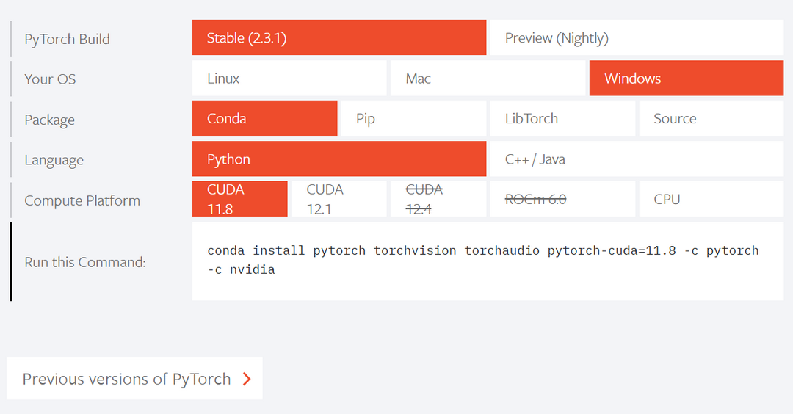
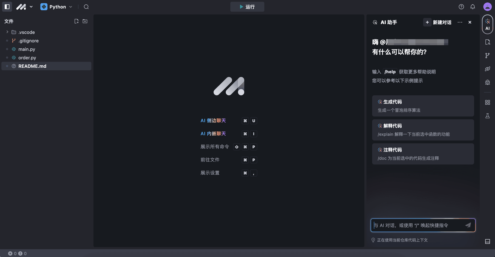

# 开发环境配置

AIGC技术层出不穷，很多技术还没有及时封装成可执行的应用，这时候我们需要配置开发环境，绝大部分AIGC开发环境基于`Python + PyTorch`，这里以此举例。

## 基础软件

* **Git**：Git是一个开源的分布式版本控制系统，可以有效、高速地处理从很小到非常大的项目版本管理。
* **Python**：Python是最受欢迎的程序设计语言之一。
* **Miniconda3 或者 Anaconda **：通过安装 Miniconda3，用户可以方便地创建自己的 Python 开发环境，而无需一次性安装大量不必要的软件包。同时，通过 Conda 包管理器，用户可以轻松地安装、更新和管理 Python 包及其依赖项。
* **VSCode**：免费、功能强大、插件丰富的IDE，对Python及虚拟环境支持良好。
* **CUDA + CUDNN**：NVIDIA的开发工具包
* **Python + PyTorch**：AIGC开发的黄金搭档

## 基础软件安装

### Git

1. **下载Git安装程序**：访问Git官网（https://git-scm.com/），选择适合您操作系统的版本进行下载。对于Windows用户，建议下载“Git for Windows Setup.exe”。
2. **运行安装程序**：下载完成后，双击运行安装程序。

### Python

1. **下载安装程序:** 
   - 访问 Python 官方网站 (https://www.python.org/downloads/)。
   - 点击 "Download Python" 按钮，选择最新的 Python 3 版本 (Python 3.10+)。
   - 根据你的系统选择 32 位或 64 位的安装程序 (通常选择 64 位)。

2. **运行安装程序:**
   - 双击下载的安装程序。
   - 勾选 "Add Python 3.x to PATH" (这会将 Python 添加到系统环境变量，方便你在命令行中直接运行 Python)。
   - 选择 "Install Now" 进行默认安装，或选择 "Customize installation" 进行自定义安装。

3. **验证安装:**
   - 打开命令提示符 (CMD)。
   - 输入 `python --version` 或 `python3 --version`，然后按回车键。
   - 如果显示 Python 版本号，则说明安装成功。

### Miniconda3 

1. **下载Miniconda3 安装程序**：访问Miniconda3 官网（[Miniconda — Anaconda documentation](https://docs.anaconda.com/miniconda/)），选择适合您操作系统的版本进行下载。
2. **运行安装程序**：下载完成后，双击运行安装程序。
3. 建议在 "Advanced Options" 中勾选 "Add Miniconda3 to PATH environment variable"，这样你就可以在命令行中直接使用 conda 命令。
4. 开始菜单中运行`Anaconda Prompt (miniconda3)`或者`Anaconda Powershell Prompt (miniconda3)`

```sh
# 创建虚拟环境
conda create -n chattts
# 激活虚拟环境
conda activate chattts
# 安装指定版本的python
conda create -n myenv python=3.10
```

一系列的环境变量被配置（安装程序自动配置，可以检查一下）

```sh
CONDA_DEFAULT_ENV=base
CONDA_EXE=E:\Dev\miniconda3\Scripts\conda.exe
CONDA_PREFIX=E:\Dev\miniconda3
CONDA_PROMPT_MODIFIER=(base)
CONDA_PYTHON_EXE=E:\Dev\miniconda3\python.exe
CONDA_SHLVL=1
Path=E:\Dev\miniconda3;E:\Dev\miniconda3\Library\mingw-w64\bin;E:\Dev\miniconda3\Library\usr\bin;E:\Dev\miniconda3\Library\bin;E:\Dev\miniconda3\Scripts;E:\Dev\miniconda3\bin;E:\Dev\miniconda3\condabin;
```

当然你也可以用绝对路径调用

```sh
E:\Dev\miniconda3\envs\chattts\python -V
E:\Dev\miniconda3\envs\chattts\python -m pip list
```

### VS Code

**1. 安装 VS Code**

* 访问 VS Code 官网：[https://code.visualstudio.com/](https://code.visualstudio.com/)
* 下载适合你操作系统的版本并安装。

**2. 安装 Python 解释器**

> :warning:之前安装了Miniconda3，本步骤可以跳过，因为Miniconda3自带Python，当然再装一个也没问题，VS Code可以自动识别并提供选择

* 如果你还没有安装 Python，请访问 Python 官网：[https://www.python.org/](https://www.python.org/)
* 下载适合你操作系统的版本并安装。
* 安装过程中，建议勾选 "Add Python to PATH" 选项，方便在终端直接使用 `python` 命令。

**3. 安装 VS Code Python 扩展**

* 打开 VS Code。
* 点击左侧边栏的扩展图标（四个方块）。
* 在搜索框中输入 "Python"。
* 找到由 Microsoft 发布的 "Python" 扩展并安装。



**4. 配置 Python 环境**

* 打开一个 Python 文件（.py）。
* VS Code 会自动检测到 Python 解释器，并在右下角显示当前环境。
* 点击右下角的 Python 版本，可以选择其他已安装的 Python 环境。
* 你也可以手动指定 Python 解释器路径：
    * 打开 VS Code 设置（`Ctrl+,` 或 `Cmd+,`）。
    * 搜索 "python.defaultInterpreterPath"。
    * 将其设置为你的 Python 解释器路径。



**5. 开始编写 Python 代码**

* 创建一个新的 Python 文件（.py）。
* 输入以下代码：

```python
print("Hello, world!")
```

* 使用快捷键 `Ctrl+F5` 或 `Cmd+F5` 运行代码（也可以如下图点击右上角的`运行`图标）。
* 你将在终端窗口看到输出结果 "Hello, world!"。



### CUDA + CUDNN

> :warning:==**本安装为可选安装**==，项目也可以使用CPU执行，如果要追求更好的执行性能可以参考本文档安装**CUDA + CUDNN**

1. **CUDA** 包含驱动和工具包：
    * **驱动程序**: 这是基础，让操作系统和程序可以与 NVIDIA GPU 硬件交互。
    * **工具包**:  包含构建和运行 CUDA 程序所需的工具、库和头文件。这其中包括 CUDA 库 (cuBLAS, cuFFT 等) 和编译器 (nvcc)。

2. **cuDNN** 是独立于 CUDA 驱动程序的软件包：
    * 它提供了针对深度神经网络的 **GPU 加速原语库**，并非 CUDA 驱动程序的一部分。
    * cuDNN 需要 CUDA 工具包才能正常工作，因为它依赖于 CUDA 库和运行时环境。

**总结:**

* 运行 CUDA 程序，你需要安装 **CUDA 驱动程序和工具包**。
* 运行依赖 cuDNN 的程序 (例如深度学习框架)，你需要 **同时安装 CUDA 驱动程序、工具包以及 cuDNN**。

#### CUDA

首先需要安装NVIDIA显卡驱动，然后使用`nvidia-smi`命令查看

```sh
PS C:\Users\lgc653> nvidia-smi
Mon Jun 24 10:24:48 2024       
+-----------------------------------------------------------------------------------------+
| NVIDIA-SMI 551.76                 Driver Version: 551.76         CUDA Version: 12.4     |
|-----------------------------------------+------------------------+----------------------+
| GPU  Name                     TCC/WDDM  | Bus-Id          Disp.A | Volatile Uncorr. ECC |
| Fan  Temp   Perf          Pwr:Usage/Cap |           Memory-Usage | GPU-Util  Compute M. |
|                                         |                        |               MIG M. |
|=========================================+========================+======================|
|   0  NVIDIA GeForce RTX 3050 ...  WDDM  |   00000000:01:00.0  On |                  N/A |
| N/A   39C    P5              7W /   60W |    1119MiB /   4096MiB |     17%      Default |
|                                         |                        |                  N/A |
+-----------------------------------------+------------------------+----------------------+
```

或者首先右键点击右下角的`NVIDIA`设置，点击NVIDIA控制面板，依次点击：帮助-系统信息-组件



可以看到我最高能安装12.4的，在这里，进入cuda下载界面`https://developer.nvidia.com/cuda-toolkit-archive`下载对应版本（一般可以向下兼容）

安装过程中，首先选择解压的临时目录，然后开始安装。

> 有可能遇到安装失败的情况，绝大部分是因为`nsight compute`安装失败，我们可以选择自定义安装，把`nsight compute`的勾选去掉（先不安装）。然后我们找到刚刚CUDA解压的临时目录的文件夹，发现里面有一个nsight compute的文件夹，里面有一个安装程序（先拷贝出来，否则CUDA安装完该目录会被删除），等CUDA安装成功后直接安装到默认的文件夹就行。

CUDA就此安装完毕。

#### CUDNN

这里直接进去cudnn网站：https://developer.nvidia.com/cudnn

登录一下账户，没有的注册一下就行，选择最新版的cudnn就行，下载，得到一个安装包。解压，发现里面有三个文件夹，分别是bin、include、lib文件夹，分别复制三个文件夹的内容到CUDA的对应文件夹中。



#### 配置CUDA的环境变量

一系列的环境变量被配置（安装程序自动配置，可以检查一下）

```sh
CUDA_PATH=E:\Dev\NVIDIA GPU Computing Toolkit\CUDA\v12.5
CUDA_PATH_V12_5=E:\Dev\NVIDIA GPU Computing Toolkit\CUDA\v12.5
Path=E:\Dev\NVIDIA GPU Computing Toolkit\CUDA\v12.5\bin;E:\Dev\NVIDIA GPU Computing Toolkit\CUDA\v12.5\libnvvp;
```

### Python + PyTorch

访问[PyTorch](https://pytorch.org/)官网，根据选择获取安装命令

> 如机器不支持CUDA，可以Compute Platform选择CPU
>
> ```sh
> conda install pytorch torchvision torchaudio cpuonly -c pytorch
> ```

安装和自己机器cuda版本匹配的pytorch（非常重要），`nvcc -V`查询，可向下兼容

> CUDA有两种API，分别是运行时API和驱动API，即所谓的Runtime API与Driver API，`nvidia-smi`的结果除了有GPU驱动版本型号，还有CUDA Driver API的版本号，这里是12.4，而`nvcc`的结果是对应CUDA Runtime API



可以获得命令

```sh
conda install pytorch torchvision torchaudio pytorch-cuda=12.1 -c pytorch -c nvidia
```

- **conda install**: 使用 conda 包管理器安装软件包的命令。
- **pytorch torchvision torchaudio**: 要安装的软件包名称，分别是 PyTorch 核心库、计算机视觉库和音频处理库。
- **pytorch-cuda=12.1**: 指定安装 PyTorch 的 CUDA 版本为 12.1。CUDA 是 NVIDIA 的并行计算平台，用于加速 GPU 上的计算任务。
- **-c pytorch -c nvidia**: 指定安装源。`-c` 是 `--channel` 的缩写，表示从指定的 conda 频道安装软件包。这里指定了两个频道：`pytorch` 和 `nvidia`，它们分别包含 PyTorch 和 NVIDIA 相关的软件包。

检测是否安装成功，首先切换到你安装`pytorch`的环境

```python
import torch
from torch.backends import cudnn

print(torch.cuda.is_available())  # cuda是否可用
print(torch.version.cuda)  # 查看pytorch 对应的cuda版本
torch.cuda.device_count()  # 返回gpu数量
torch.cuda.current_device()  # 返回当前设备索引
torch.cuda.get_device_name(0)  # 返回gpu名字，设备索引默认从0开始；
print(cudnn.is_available())  # cudnn是否可用
print(cudnn.version())  # 查看pytorch 对应的cudnn版本
```

### 其它环境变量

由于AIGC经常需要下载大模型，一般默认会下载在用户目录中，会导致系统盘硬盘吃紧。预先做一些配置

```sh
# pytorch 
TORCH_HOME=E:\Dev\torch\
# huggingface
HF_HOME=E:\Dev\huggingface\
# modelscope
MODELSCOPE_CACHE=E:\Dev\modelscope\
```

## 云端环境

云端环境，无需安装，即开即用：[豆包 MarsCode - 工作台](https://www.marscode.cn/dashboard)



## AIGC应用安装及使用

一般需要安装的应用都有详细的说明，我们来看几个例子，分别是写作本文时非常新的几个应用，涉及到音频、图像、文本处理等多个领域。

* **ChatTTS**：配音
* **IC-Light**：图片打光
* **marker**：PDF转Markdown

### ChatTTS

ChatTTS 是一款专门为对话场景（例如 LLM 助手）设计的文本转语音模型。

打开`Anaconda Prompt (miniconda3)`

**安装**

```sh
git clone https://github.com/2noise/ChatTTS
cd ChatTTS
conda create -n chattts
conda activate chattts
# 注意仔细看看requirements.txt里面软件的版本，避免冲突
pip install -r requirements.txt
```

**运行**

```sh
# 命令行
python examples/cmd/run.py
# 或者
E:\Dev\miniconda3\envs\chattts\python examples/cmd/run.py
# webui
python examples/web/webui.py
# 或者
E:\Dev\miniconda3\envs\chattts\python examples/web/webui.py
```

### IC-Light

IC-Light is a project to manipulate the illumination of images.


打开`Anaconda Prompt (miniconda3)`

**安装**

```sh
git clone https://github.com/lllyasviel/IC-Light.git
cd IC-Light
# 也可以利用刚才的chattts，直接conda activate chattts
conda create -n iclight python=3.10
conda activate iclight
# 如果用chattts这个就可以不装了
pip install torch torchvision --index-url https://download.pytorch.org/whl/cu121
pip install -r requirements.txt
```

> 如果复用chattts的环境要注意几点
>
> * pytorch不用重复安装
> * requirements.txt中的`transformers==4.36.2`需要修改或者删除，因为chattts中是`transformers>=4.41.1`
> * requirements.txt中的`gradio==3.41.2`也会导致不兼容，chattts中是`gradio`（ 当前最新的是gradio-4.x.x，且4.x版本和3.x版本相互不兼容，一般大版本的相互不兼容很难解决，最好还是create一个专用的）

**运行**

```sh
conda activate chattts
cd D:\Dev\projects\IC-Light\ && d:
python gradio_demo.py
```

### marker

Marker converts PDF to markdown quickly and accurately.

打开`Anaconda Prompt (miniconda3)`

```sh
# 直接利用chattts环境
conda activate chattts
pip install marker-pdf
```

使用

```sh
marker_single C:\Users\lgc653\Downloads\marker-pdf\202406.pdf C:\Users\lgc653\Downloads\marker-pdf\ --batch_multiplier 2 --max_pages 10
```

