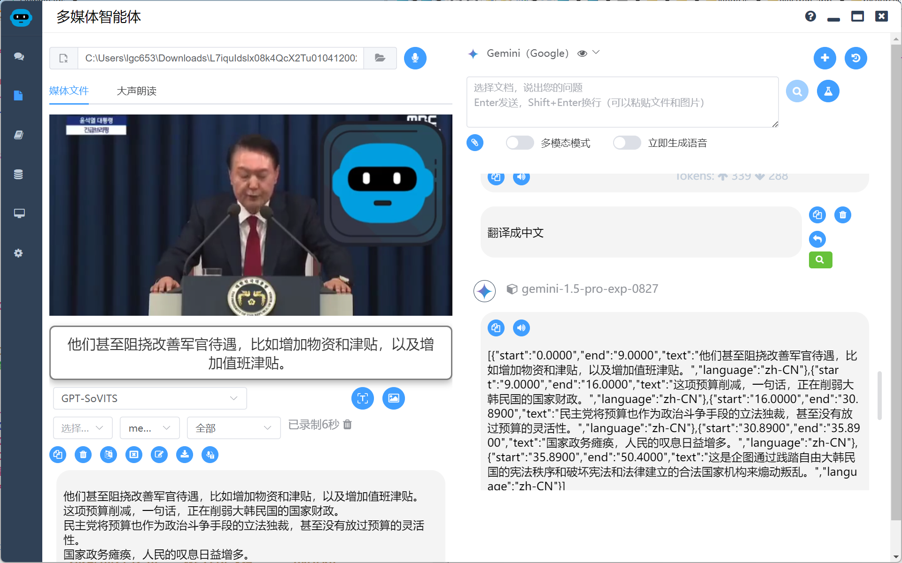

# 视频理解

## 背景介绍

韩国总统尹卡卡突然讲话，国内社交媒体的一群大佬也蒙了圈，这要是米国大统领突然发表讲话，凭借大家不俗的英语能力，快速拿到第一手消息不在话下，但是面对小语种，大多数人就无能为力了。等到有权威媒体报道，才知道尹卡卡冲冠一怒为红颜，为了老婆要和对手殊死一搏。


这里就要谈到AI的视频理解能力了，现在大品牌的AI都支持视频理解能力，不过相对成本比较高，主要是捕捉视频帧，然后批量提交给多模态模型理解，我这里介绍的方法是通过ASR（Automatic Speech Recognition）技术加上关键帧图片的的组合的方案，这个模式针对小视频比起直接视频理解没有太大优势，针对较大的视频成本优势就比较大了。

当然大品牌的AI可能也采用类似的技术，比如ChatGPT的ASR1分钟的语音识别费用在4分钱左右，但是由于ASR在本地部署并不需要特别好的配置就能取得顶级的效果，所以还是可以便宜不少。

## 技术概述

拆解一下流程

* 使用ffmpeg将视频做语音和视频分离，如果背景音比较强烈可能还要用uvr5之类的工具获取更加干净的人声（当然你声音效果过于嘈杂也别做效果太好的指望）
* 使用ASR技术将语言转成文本，这里推荐转成包含时间戳的文本，这样可以直接制作成字幕，这里有2种解决方案：
  * 使用ChatGPT whisper或类似产品的API
  * 基于fasterwhisper等开源模型自己搭建转换系统
* 将文本使用大模型进行转换、翻译等一系列操作。
* 制作成srt或者vtt等字幕文件或其它产品形态。


## 技术详解

### 下载视频

首先我们要能下载到视频，这个大家就各显神通了，相信大家都有技术储备

### 获取音频

如果没有视频，可以采用监听麦克风听录的办法，我使用的时候如下代码

```js

function recordAudioFromMic() {
  return new Promise((resolve, reject) => {
    // 获取用户的音频输入
    navigator.mediaDevices.getUserMedia({ audio: true })
      .then(function(stream) {
        // 创建一个MediaRecorder实例
        mediaRecorderMic = new MediaRecorder(stream)

        // 监听dataavailable事件，收集音频数据
        mediaRecorderMic.ondataavailable = async function(event) {
          micAudioChunks.push(event.data)
          const blob = new Blob(micAudioChunks, { type: 'audio/webm' })
          const arrayBuffer = await blob.arrayBuffer()
          const audioBuffer = await audioContext.decodeAudioData(arrayBuffer)
          micAudioBuffers.value = [audioBuffer]
        }

        // 监听停止事件，处理录制完成的数据
        mediaRecorderMic.onstop = async function() {
          const buffers = await Promise.all(micAudioChunks.map(blob => blob.arrayBuffer()))
          window.electron.ipcRenderer.send('save-audio', buffers, 'webm')
          window.electron.ipcRenderer.once('save-audio-return', (event, res) => {
            if (res.code === 200) {
              state.mediaInputFile = res.filePath
              initMediaConfig()
            } else {
              ElMessage.error(res.message)
            }
          })
          // 清理状态
          micAudioBuffers.value.splice(0)
          micAudioChunks = []
          mediaRecorderMic = null
        }

        // 开始录制
        mediaRecorderMic.start(ondataInterval * 1000)
        micAudioBuffers.value.splice(0)
        console.log('录音开始')
      })
      .catch(function(err) {
        reject('获取麦克风权限失败: ' + err)
      })
  })
}
```

如果有，我们通过ffmpeg就可以分离音频，我们可以叫AI教教我们

```sh
将 C:\Users\lgc653\Downloads\HarvardXSOC1.longx-V004200.mp4 的音频分离出来
```

AI告诉我们

```sh
ffmpeg -i "C:\Users\lgc653\Downloads\HarvardXSOC1.longx-V004200.mp4" -q:a 0 -map a "C:\Users\lgc653\Downloads\HarvardXSOC1_audio.mp3"
```

让AI帮我们封装成一个函数

```javascript
async convertMediaToAudio(input, tempDir, ffmpegDir, startTime, endTime) {
  let filePath = path.join(tempDir, 'temp' + path.extname(input))
  if (
    input.endsWith('.mp3') ||
    input.endsWith('.wav') ||
    input.endsWith('.acc') ||
    input.endsWith('.ogg') ||
    input.endsWith('.webm')
  ) {
    // 直接复制音频文件
    fs.copyFileSync(input, filePath)
  } else {
    // 将视频转换为音频
    const ffmpeg = path.join(ffmpegDir, 'ffmpeg.exe')
    const audioPath = path.join(tempDir, 'temp.wav')
    const util = require('util')
    const execAsync = util.promisify(exec)
    try {
      let command = `${ffmpeg} -i "${input}" -vn -ac 1 -ar 16000 "${audioPath}"`
      // 如果 time 设定了值，则截取 time 之间的音频
      if (startTime !== null && endTime !== null) {
        console.log(`Start time: ${startTime}, End time: ${endTime}`)
        command = `${ffmpeg} -ss ${startTime} -to ${endTime} -i "${input}" -vn -ac 1 -ar 16000 "${audioPath}"`
      }
      await execAsync(command)
      filePath = audioPath // 更新 filePath 为转换后的音频路径
    } catch (error) {
      console.error(`Error converting video to audio: ${error}`)
      throw new Error('视频转音频失败')
    }
  }
  return filePath
}
```

### 语音转文本

这里用两种方案都可以，偶尔用用直接上API，长期使用建议自己搭建

#### ChatGpt whisper

> ChatGpt的方案需要注意的是**response_format**参数，建议使用verbose_json，这样可以获得带有每句话start、end时间戳的json，可以精准制作字幕

```js
async handleAsr(modelOptions) {
  const data = new FormData()
  data.append('file', fs.createReadStream(this.filePath))
  data.append('model', 'whisper-1')
  data.append('prompt', '')
  data.append('response_format', 'verbose_json')
  data.append('temperature', '0')
  data.append('language', this.lang === 'auto' ? '' : this.lang)

  const configRequest = {
    method: 'post',
    url: `${modelOptions.baseURL}/audio/transcriptions`,
    headers: {
      'Authorization': `Bearer ${modelOptions.apiKey}`,
      ...data.getHeaders()
    },
    data: data
  }

  try {
    const response = await axios(configRequest)
    const resultData = response.data.segments.map(segment => ({
      text: segment.text,
      start: segment.start,
      end: segment.end,
      language: response.data.language
    }))
    this.event.sender.send('asr-return', { code: 200, data: resultData })
    await this.removeTempFiles()
  } catch (err) {
    console.error('Failed to read ASR result:', err.data)
    this.sendError(err.message)
    await this.removeTempFiles()
  }
}
```

#### 基于fasterwhisper自建

这个网上流程比较多了，我就不详细讲了，这里给出代码，只要机器不是太差，识别效果是非常优秀的，同样也支持start、end的时间戳

```python
import os
import traceback

os.environ["HF_ENDPOINT"] = "https://hf-mirror.com"
os.environ["KMP_DUPLICATE_LIB_OK"] = "TRUE"

import torch
from faster_whisper import WhisperModel
from fastapi import FastAPI, File, UploadFile, Form


app = FastAPI()

# 模型缓存
model_cache = {}


def load_model(model_size, language, precision):
    if "-local" in model_size:
        model_size = model_size[:-6]
        model_path = f"tools/asr/models/faster-whisper-{model_size}"
    else:
        model_path = model_size

    device = "cuda" if torch.cuda.is_available() else "cpu"
    model = WhisperModel(model_path, device=device, compute_type=precision)
    print(f"已加载模型: {model_size}, 语言: {language}, 精度: {precision}")
    return model


def execute_asr(input_file, model_size, language, precision):
    # 检查模型是否已缓存
    cache_key = (model_size, language, precision)
    if cache_key in model_cache:
        model = model_cache[cache_key]
    else:
        model = load_model(model_size, language, precision)
        model_cache[cache_key] = model

    output = []

    try:
        result = model.transcribe(
            audio=input_file,
            beam_size=5,
            vad_filter=True,
            vad_parameters=dict(min_silence_duration_ms=700),
            language=language if language != "auto" else None,
        )

        if result is None:
            raise ValueError("Whisper 模型转录失败")  # 抛出异常

        segments, info = result  # 解包结果

        for segment in segments:
            segment_dict = {
                "start": segment.start,
                "end": segment.end,
                "text": segment.text,
                "language": info.language,
            }
            output.append(segment_dict)
    except Exception:
        print(traceback.format_exc())
        return None, None  # 返回 None 表示错误

    return output


@app.post("/asr/")
async def asr_api(
    audio_file: UploadFile = File(...),
    model_size: str = Form("large-v3"),
    language: str = Form("auto"),
    precision: str = Form("float16"),
):
    """语音识别 API 接口"""
    try:
        temp_file_path = audio_file.filename
        with open(temp_file_path, "wb") as f:
            f.write(audio_file.file.read())

        output_json = execute_asr(
            input_file=temp_file_path,
            model_size=model_size,
            language=language,
            precision=precision,
        )

        # 删除临时文件
        os.remove(temp_file_path)

        return {"result": output_json}

    except Exception as e:
        return {"error": str(e)}


if __name__ == "__main__":
    import uvicorn

    uvicorn.run(app, host="0.0.0.0", port=9889)
```

#### 返回的json格式

统一成如下格式

```json
[{"start": "0.0000", "end": "9.0000", "text": "……", "language": "en"}]
```

### 大模型文本处理

这个大家应该都会吧，就是把之前生成的文本发送给大模型，如果你想做的更好些，可以截取几个关键帧的图片一起提交给大模型，因为通过声音文本大模型没办法确认讲话者是谁，场景在哪里。

难点就是在要求大模型返回json时，可能会有2种选择，一种是**Function calling**，另外一种是自己解析，这些都大同小异，大家要是不会可以看我之前写的

* 使用自然语言进行图片物体检测
* 摸鱼大师使用AI评估GIT项目

### 生成字幕文件

根据之前的json转换为字幕文件

```js
function jsonToSrt(jsonData) {
  let srt = ''

  jsonData.forEach((item, index) => {
    // 生成索引
    srt += `${index + 1}\n`

    // 转换时间格式为 SRT 所需格式
    const startTime = new Date(item.start * 1000).toISOString().substr(11, 8) + ',' + String(item.start % 1).slice(2, 5).padEnd(3, '0')
    const endTime = new Date(item.end * 1000).toISOString().substr(11, 8) + ',' + String(item.end % 1).slice(2, 5).padEnd(3, '0')

    // 添加时间戳
    srt += `${startTime} --> ${endTime}\n`

    // 添加文本内容
    srt += `${item.text}\n\n`
  })

  return srt.trim() // 去掉最后的换行符
}

function jsonToVtt(jsonData) {
  let vtt = 'WEBVTT\n\n'

  jsonData.forEach((item, index) => {
    // 转换时间格式为 VTT 所需格式
    const startTime = new Date(item.start * 1000).toISOString().substr(11, 12)
    const endTime = new Date(item.end * 1000).toISOString().substr(11, 12)

    // 添加时间戳和文本内容
    vtt += `${startTime} --> ${endTime}\n`
    vtt += `${item.text}\n\n`
  })

  return vtt.trim()
}
```

## 产品实现

根据以上的技术流程，大家可以看看效果

转换为字幕



结合字幕和截取的图片进行视频理解（认出了是韩国政要，但是没有认出是尹卡卡）


