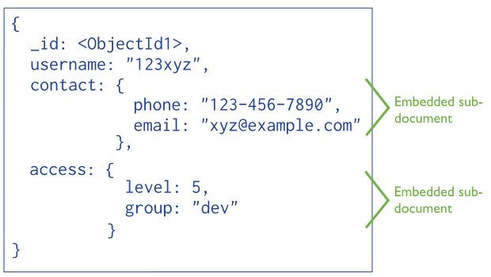

# 数据库建模

使用数据库时，通常是为了支撑一个应用或一个业务场景，第一步需要做的就是要对数据库的表结构进行设计。一个完善的设计方案包括：表名、列名、数据类型、备注信息、字符编码、主键设计、表间关系、其他约束条件等。其中的难点在于如何使用数据表以及表间关系来描述出相应的功能场景，能够应对以后的各种查询需要，这对刚接触数据库的使用者来说是有些困难的，但是只要认真思考，按照步骤来操作相信最后的结果不会差。

## 什么是数据库建模

数据库建模简单理解指的就是设计数据库的过程，根据一个应用的描述，去构建出最优的数据库模式（考虑数据的冗余，数据查询效率等因素），一般数据库建模可以被划分为六个阶段。

### 需求分析阶段

需求分析阶段是最为重要的一个阶段，如果前期的需求分析的不明确，很可能导致数据库扩展性差，甚至于无法支撑对应的功能逻辑。通常会在这一阶段花费比较多的时间，最后产出**需求文档**作为成果物。

### 概念结构设计阶段

概念设计阶段是以数据库的角度去解读需求的第一步，也是很关键的步骤，需要形成一个通用的（与具体DBMS无关）的概念模型，比较直观的可以用**E-R图**表示。

### 逻辑结构设计阶段

在逻辑结构设计阶段需要对概念结构适当的具体化，将实体-关系的描述转换为某个DBMS的数据模型。可以进一步描述出**表名、列名、数据类型（不需要太具体）、表间关系**。

### 物理结构设计阶段

物理结构的设计，要具体到某一个数据库软件、版本、表结构、主外键等，至此也就完成了数据库设计阶段，可以直接据此生成**完整的SQL语句**。

### 数据库实施阶段

数据库实施阶段指的是按照已有的设计方案，在一个具体的数据库中进行实施：建库、建表、插入测试数据等。

### 数据库运行和维护

数据库运行和维护阶段是一个长期的过程，随着应用的使用，可能会产生一些变化，如：添加数据维度，数据长度不足，约束关系收紧等，这个时候我们要针对实际情况来对数据库的结构来进行修改。

## 数据库模型的分类

基于数据库建模的各个阶段，可以把建立出来的模型根据特点归为以下几类。

###  概念模型（CDM）

概念模型主要是基于客观世界实际存在的事物或场景进行的描述，不涉及到具体的DBMS和实现步骤。表示概念模型最常用的形式是使用E-R（实体-关系）图，包含以下三个要素：

- 实体：矩形
- 属性：椭圆
- 关系：菱形
  - 一对一：根据一个实例，只能找到一个对应实例（如：`一个学生 -> 一个班级`）
  - 一对多：根据一个实例，能够找到多个对应实例（如：`一个班级 -> 多个学生`）
  - 多对多：根据一个实例，能够找到多个对应实例，反过来亦然（如：`一个学生 -> 选多门课，一门课 -> 被多人选`）

> :fire:敲黑板：由于在数据库中直接表示两个多对多实体的关系会产生数据冗余，所以一般会有中间表的存在。

###  逻辑模型（LDM）

逻辑模型指的是数据的逻辑结构，目的在于根据概念模型（CDM）进一步分解和细化，可以窥见到表结构的雏形与表间关系（数据实例）。如果存在多对多关系，也必须在这一阶段细化出中间表，在描述表间关系时，根据实际数据的可能情况可以划分为如下情况：

- 刻画一对一
  - 0或1个：找不到或只能找到一个
  - 唯一：有且只能找到一个
- 刻画一对多
  - 0或多个：找不到或能找到多个
  - 1或多个：能找到一个或多个
  - 多个：一定存在多个

> :fire:敲黑板：以上只是根据业务分析和数据的预期情况确定出的表间关系，用于展现整体业务情况。

### 物理模型（PDM）

物理模型是对真实数据库的描述，要根据具体的数据库生成具体的表、字段、数据类型、数据长度、主键、外键、索引、约束条件等。

> :zap:敲黑板：可以直接使用Navicat或PowerDesigner工具根据生成的物理模型导出对应的SQL或直接实施到数据库。

## UML与数据库设计

类之间的关系如下图所示：


UML与数据库设计主要讨论的内容：


依赖关系强调的是类操作间的使用关系，类图到表结构的映射中并不涉及这种关系，所以只需讨论泛化关系、关联关系到表的映身规范。

###  　泛化关系的映射

#### 将父类和子类均映射为表

* 优点：表结构的更改非常方便
* 缺点：表的数量较多，相关的数据分散在不同的表中，数据读写时间较长，报表的生成较为困难。

#### 只将子表映射为表

* 优点：表的数量较少，相关的数据集中在一个表中，数据的读写较为方便。
* 缺点：表结构的修改较为困难，因为修改父类后，要同时修改子类对应的表。

#### 只将父类映射为表

* 优点：表的数量少，数据读写方便
* 缺点：耦合性强，需要增加一列，以表示类的角色，浪费存储空间较多。

> 综合：以上三种方法各有所长，在实际应用中，根据具体情况选用。
>
> 一般情况下，建议选用第二种方式，即只将子类映射为表，各表包含子类自身的属性和继承自父类的属性。

###  　关联关系的映射

关联关系分为一对一关联、一对多关联和多对多关联。

#### 一对一关联映射

将相关的两个类分别映射成两张表，并将任意一张表的主键放入另一张表作为外键。

#### 一对多关联映射

将关联的两个类映射为两张表，并将“一”表的主键放在“多”表中作为外键。

#### 多对多关联映射

* 为相关联的两个类分别建立两张表
* 再建一个关联表。这个关联表的属性由两部分组成：前两个表的主键，关联本身的属性。　　　

> **综合：**关联关系要为每一个类生成一个数据库表。
>
> 关系映射：
>
> 1. 一对一、一对多的关系映射为数据库表的主外键关联（一方的主键加入另一方成为外键）
> 2. 多多的关系映射：产生第三张表，将两个多方的主键加入其中成为外键，两个外键的组合成为主键。

### 多表设计中的三种实体关系

#### 一对多

一个部门可以对应多个员工,一个员工只能属于一个部门

一个客户可以对应多个订单,一个订单只能属于一个客户

- 一对多关系建表原则：
- 需要在多的一方添加一个字段，作为外键指向一的一方主键


#### 多对多

一个学生可以选择多门课程,一个课程可以被多个学生所选择的!

- 多对多关系建表原则:
- 需要创建第三张表，第三张表中需要两个字段，这两个字段分别作为外键指向多对多双方的主键


#### 一对一

一个用户表只能对应一个用户详细信息表，一个用户详细信息表也只能对应一个用户表

一对一的关系式比较少用

- 公司表:地址是公司的表的字段.
- 一对一的关系的建表原则:
- 两表主键直接对应或唯一外键对应:

> 在数据库中常用的有如下场景：
>
> * 用户表读取非常频繁，只保存最主要的经常会读取的信息，比如登录名，密码
> * 用户信息表和用户1:1对应，其中很多信息数据读取没有用户表频繁，但是可能会被时常更新
> * 由于两者都以userId为主键，所以在已知userId的情况下获取开销均很低，
> * 通过这种设计可以把读写分离

### 数据库三范式 

利用数据库三范式检查表，从而考察类图的分析是否合理，消除冗余数据。检查数据是否能够反映用例视图的需要；进一步与用户再次确认数据的使用。

#### 第一范式(确保每列保持原子性)

第一范式是最基本的范式。如果数据库表中的所有字段值都是不可分解的原子值，就说明该数据库表满足了第一范式。

第一范式的合理遵循需要根据系统的实际需求来定。比如某些数据库系统中需要用到“地址”这个属性，本来直接将“地址”属性设计成一个数据库表的字段就行。但是如果系统经常会访问“地址”属性中的“城市”部分，那么就非要将“地址”这个属性重新拆分为省份、城市、详细地址等多个部分进行存储，这样在对地址中某一部分操作的时候将非常方便。这样设计才算满足了数据库的第一范式，如下表所示。


上表所示的用户信息遵循了第一范式的要求，这样在对用户使用城市进行分类的时候就非常方便，也提高了数据库的性能。

#### 第二范式(确保表中的每列都和主键相关)

第二范式在第一范式的基础之上更进一层。第二范式需要确保数据库表中的每一列都和主键相关，而不能只与主键的某一部分相关（主要针对联合主键而言）。也就是说在一个数据库表中，一个表中只能保存一种数据，不可以把多种数据保存在同一张数据库表中。

比如要设计一个订单信息表，因为订单中可能会有多种商品，所以要将订单编号和商品编号作为数据库表的联合主键，如下表所示。

**订单信息表**


这样就产生一个问题：这个表中是以订单编号和商品编号作为联合主键。这样在该表中商品名称、单位、商品价格等信息不与该表的主键相关，而仅仅是与商品编号相关。所以在这里违反了第二范式的设计原则。

而如果把这个订单信息表进行拆分，把商品信息分离到另一个表中，把订单项目表也分离到另一个表中，就非常完美了。如下所示。


这样设计，在很大程度上减小了数据库的冗余。如果要获取订单的商品信息，使用商品编号到商品信息表中查询即可。

#### 第三范式(确保每列都和主键列直接相关,而不是间接相关)

第三范式需要确保数据表中的每一列数据都和主键直接相关，而不能间接相关。

比如在设计一个订单数据表的时候，可以将客户编号作为一个外键和订单表建立相应的关系。而不可以在订单表中添加关于客户其它信息（比如姓名、所属公司等）的字段。如下面这两个表所示的设计就是一个满足第三范式的数据库表。


这样在查询订单信息的时候，就可以使用客户编号来引用客户信息表中的记录，也不必在订单信息表中多次输入客户信息的内容，减小了数据冗余。

## 数据类型和字段属性

- 数据类型

- - 数值类型

  - - 整数型
    - 浮点型
    - 定点型

  - 日期时间类型

  - 字符串类型

  - 补充：

    - 显示宽度与zerofll
    - 记录长度

- 字段属性

- - 空\不为空值：NULL、NOT NULL
  - 主键：primary key
  - 唯一键：unique key
  - 自增长：auto_increment
  - 默认值：default
  - 字段描述：comment
  - 补充：
    - 复合键

### 数值类型

*  整数
   *  默认是有符号，如果需要使用无符号的数据类型要在后面加"UNSIGNED"
*  小数类型
   *  浮点类型注重点应该是它的精度。
   *  DECIMAL是不会损失精度的。可以理解成使用“字符串”存储
   *  直接不带括号的数据类型float、double、decimal代表没有小数部分

> 例如，一个定义为 `FLOAT(7,4)` 的列在显示时将显示为 `-999.9999` 。 MySQL 在存储值时执行舍入，因此如果将 `999.00009` 插入`FLOAT(7,4)` 列，则近似结果为 `999.0001`

> `DECIMAL`、`NUMERIC`，在保持精确精度很重要的场景中，可以使用这些类型，例如货币数据。
>
> 固定精度的意思就是，10 个 `0.0000001` 相加，得到的结果一定是 `0.000001`，而不是 `0.0000009` 或 `0.0000011`。
>
> 因为 `NUMERIC` 的底层实现采用的是 `DECIMAL` ，所以，`NUMERIC` 应该算是 `DECIMAL` 的同义词了。

> 存储货币时还可以使用整数型，表示多少分，做微信开发时，微信支付的金额就是用的一个整数来表示分

### 时间日期类型

* Datetime:时间日期，格式是YYYY-MM-DD HH:II:SS,表示的范围是从1000到9999年（有些版本已经允许0-9999？不确定）；
* Timestamp:格式是YYYY-MM-DD HH:II:SS，`表示的范围从1970-01-01 00:00:00到2038-01-19 03:14:07` 【一旦该行记录被修改，那么timestamp会修改成当前时间。】

#### TIMESTAMP和DATETIME的相同点

两者都可用来表示YYYY-MM-DD HH:MM:SS[.fraction]类型的日期。

#### TIMESTAMP和DATETIME的不同点

两者的存储方式不一样

* 对于TIMESTAMP，它把客户端插入的时间从当前时区转化为UTC（世界标准时间）进行存储。查询时，将其又转化为客户端当前时区进行返回。
* 而对于DATETIME，不做任何改变，基本上是原样输入和输出。

两者所能存储的时间范围不一样

* timestamp所能存储的时间范围为：'1970-01-01 00:00:01.000000' 到 '2038-01-19 03:14:07.999999'。
* datetime所能存储的时间范围为：'1000-01-01 00:00:00.000000' 到 '9999-12-31 23:59:59.999999'。

> 总结：TIMESTAMP和DATETIME除了存储范围和存储方式不一样，没有太大区别。当然，对于跨时区的业务，TIMESTAMP更为合适。
>
> ```sql
> # 我们可以通过以下语句修改当前时区验证这一点，会发现切换时区后timestamp会变化
> set time_zone='+0:00';
> ```

自动初始化和自动更新（Automatic Initialization and Updating）

> 官档的说明：
>
> By default, the first TIMESTAMP column has both DEFAULT CURRENT_TIMESTAMP and ON UPDATE CURRENT_TIMESTAMP if neither is specified explicitly。

### 字符类型

- 使用枚举有利于统一数据，以及节省存储空间（枚举只是存储数值，系统转换成字符串）。
- varchar(L),L代表字符长度，单位为字符，最大长度为65536。在实际存储中需要1到2个字节来存储长度（1还是2由实际大小决定，216=35536,<=255的一般一个字节），在使用时根据定义的大小来分配空间，但会根据实际需要使用的缩小空间（比如规定60大小，实际只有30，那么实际空间就是31～32）。
- 当L大于255时，建议使用Text，而不是varchar。

### 字段属性

* 字段的数据默认情况下是允许为空的，比如说一条人的信息记录中可以没有邮箱（或许有些人考虑用“空字符串”来代表），我们允许可以不填入数据的字段可以设置为null；但比如说某些必填数据，我们不想填入的时候留空，可以设置这个字段为not null
* null列是可以用到索引的，不管是单列索引还是联合索引，但仅限于`is null`，`is not null`是不走索引的，参考：[https://dev.mysql.com/doc/refman/5.7/en/is-null-optimization.html](https://links.jianshu.com/go?to=https%3A%2F%2Fdev.mysql.com%2Fdoc%2Frefman%2F5.7%2Fen%2Fis-null-optimization.html)
* 不建议列上允许为空。最好限制`not null`，并设置一个默认值，比如`0`和`''`空字符串等，如果是datetime类型，可以设置成`'1970-01-01 00:00:00'`这样的特殊值。
* ENUM 定义了列中值的类型，使用字符串表示 ENUM 里的值时，实际存储在列中的数据是这些值在定义时的序数。因此，这列的数据是字节对齐的，当您进行一次排序查询时，结果是按照实际存储的序数值排序的，而不是按字符串值的字母顺序排序的。这可能不是您所希望的。

## CHINER元数建模


### 软件功能及使用

[chiner: 元数建模，一款丰富数据库生态，独立于具体数据库之外的，数据库关系模型设计平台。 (gitee.com)](https://gitee.com/robergroup/chiner)

### 使用要点

#### 数据关系的表现

数据关系的表现是数据库建模的关键，不同的建模软件绘制数据关系的推荐规则不同，例如PowerDesigner推荐是从FK画向PK，chiner是推荐从PK画向FK


### 说明和备注的分离

由于类似mysql只有一个COMMENT，对应到chiner中却有“显示名称”和“说明”两个文本字段，我们可以在COMMENT内容中用`,或者;`进行分割即可，例如：

```sql
CREATE TABLE partner(
    id INT(11) NOT NULL AUTO_INCREMENT  COMMENT 'ID索引' ,
    partner_name VARCHAR(64) NOT NULL   COMMENT '公司名称' ,
    partner_key VARCHAR(20) NOT NULL   COMMENT '合作方KEY;最末@为测试号附加' ,
    PRIMARY KEY (id)
)  COMMENT = '合作方';
```

partner_key中，第一个“;”前的内容将被作为“显示名称”，第一个“;”后的内容将被作为“说明”

### 案例分析

#### 案例介绍

> 本案例主要是介绍在业务需求不断变化的情况下，增加数据库设计的灵活性，减少相关业务代码的修改量

互联网广告平台：

* ad_provider：广告提供商，在不同终端应用中通过API展示广告
* app：应用，展示广告

#### 第一阶段

每个应用可以绑定一个广告提供商


#### 第二阶段

需求变更，每个应用可以根据广告类型的不同绑定各种广告提供商，比如（横幅广告，开屏广告，视频广告）


#### 第三阶段

需求变更，引入更多广告提供商，可以按权重来分配，例如横幅可以有两个广告提供商，各占50%，开屏有三个广告提供商，各占20%、20%、60%……


#### 第四阶段

这样设计数据库关系倒是没啥问题，但是由于设计时偷懒，直接把banner_ad_provider_id、splash_ad_provider_id、video_ad_provider_id搬到weight表，导致编码异常麻烦，并且有大量数据冗余

比如下面设定应用18

* 横幅广告提供商ID为10、8，各占%50
* 开屏广告提供商ID为7，9，11，分别占%20、%20、%60

|   id | app_id | banner_ad_provider_id | splash_ad_provider_id | video_ad_provider_id | banner_ad_weight | splash_ad_weight | video_ad_weight |
| ---: | -----: | --------------------: | --------------------: | -------------------: | ---------------: | ---------------: | --------------: |
|    1 |     18 |                    10 |                     0 |                    0 |                1 |                0 |               0 |
|    2 |     18 |                     8 |                     0 |                    0 |                1 |                0 |               0 |
|    4 |     18 |                     0 |                     7 |                    0 |                2 |                0 |               0 |
|    5 |     18 |                     0 |                     9 |                    0 |                2 |                0 |               0 |
|    6 |     18 |                     0 |                    11 |                    0 |                6 |                0 |               0 |


修改后，数据冗余消失了，编码也更轻松了，省掉了大量的广告类别判断代码（根据不同广告类别去取不同字段），拓展性也增强了，比如未来新增了其它广告类别（悬浮广告、互动广告之类的）

|   id | app_id | ad_provider_id | ad_weight | ad_type |
| ---: | -----: | -------------: | --------: | ------: |
|    1 |     18 |             10 |         1 |       1 |
|    2 |     18 |              8 |         1 |       1 |
|    4 |     18 |              7 |         2 |       2 |
|    5 |     18 |              9 |         2 |       2 |
|    6 |     18 |             11 |         6 |       2 |

为广告类别设置数据字典


#### 导出DDL

```sql
DROP TABLE IF EXISTS ad_provider;
CREATE TABLE ad_provider(
    `id` INT(20) NOT NULL  COMMENT 'ID索引' ,
    `provider_name` VARCHAR(255) NOT NULL  COMMENT '广告提供商名称' ,
    `call_url` VARCHAR(255) NOT NULL  COMMENT '广告API地址' ,
    PRIMARY KEY (id)
)  COMMENT = '广告提供商';

DROP TABLE IF EXISTS app;
CREATE TABLE app(
    `id` INT(20) NOT NULL  COMMENT 'ID索引' ,
    `app_name` VARCHAR(255)   COMMENT '应用名称' ,
    `app_key` VARCHAR(255)   COMMENT '应用KEY' ,
    PRIMARY KEY (id)
)  COMMENT = '应用';

DROP TABLE IF EXISTS weight;
CREATE TABLE weight(
    `id` INT(20) NOT NULL  COMMENT 'ID索引' ,
    `app_id` INT(20)   COMMENT '应用编号' ,
    `ad_provider_id` INT(255)   COMMENT '广告提供商编号' ,
    `ad_weight` INT(4)   COMMENT '广告权重' ,
    `ad_type` INT(4)   COMMENT '广告类别（横幅，开屏，视频）' ,
    PRIMARY KEY (id)
)  COMMENT = '分配权重';
```

> 可以通过GIT提交每次最终定稿的DDL文件，来做版本追溯，当然由于chiner的文件是json格式，也能够进行版本追溯

#### 导出文档


#### 产品不足

* PowerDesigner等商业软件支持外键约束的导入，导出；这里暂时不支持该功能
* PowerDesigner等商业软件支持内置的版本管理和变更SQL（ALTER TABLE）语句的生成
  * 版本管理可以通过GIT管理关键导出DLL来实现
  * ALTER TABLE等可以通过HeidiSQL等第三方软件来协助实现

图例：使用HeidiSQL生成ALTER TABLE语句


## 在线建模工具

* [DBER](https://dber.tech/)
* [drawDB | Online database diagram editor and SQL generator](https://www.drawdb.app/)


```sql
CREATE TABLE `ad_provider` (
	`id` INTEGER(20) NOT NULL COMMENT 'ID索引',
	`provider_name` VARCHAR(255) NOT NULL COMMENT '广告提供商名称',
	`call_url` VARCHAR(255) NOT NULL COMMENT '广告API地址',
	PRIMARY KEY(`id`)
);


CREATE TABLE `app` (
	`id` INTEGER(20) NOT NULL COMMENT 'ID索引',
	`app_name` VARCHAR(255) COMMENT '应用名称',
	`app_key` VARCHAR(255) COMMENT '应用KEY',
	PRIMARY KEY(`id`)
);


CREATE TABLE `weight` (
	`id` INTEGER(20) NOT NULL COMMENT 'ID索引',
	`app_id` INTEGER(20) COMMENT '应用编号',
	`ad_provider_id` INTEGER(255) COMMENT '广告提供商编号',
	`ad_weight` INTEGER(4) COMMENT '广告权重',
	`ad_type` INTEGER(4) COMMENT '广告类别（横幅，开屏，视频）',
	PRIMARY KEY(`id`)
);


ALTER TABLE `weight`
ADD FOREIGN KEY(`app_id`) REFERENCES `app`(`id`)
ON UPDATE NO ACTION ON DELETE NO ACTION;
ALTER TABLE `weight`
ADD FOREIGN KEY(`ad_provider_id`) REFERENCES `ad_provider`(`id`)
ON UPDATE NO ACTION ON DELETE NO ACTION;
```


## NoSQL数据模型设计

NoSQL数据模型设计和关系型数据库模型设计有很大的不同，在浏览MongDB官方文档时发现有不少篇幅介绍数据模型设计，特翻译并整理成此系列供参考学习。本系列内容主要来自[MongoDB Document - Date Models部分](https://links.jianshu.com/go?to=https%3A%2F%2Fdocs.mongodb.com%2Fmanual%2Fcore%2Fdata-models%2F)，其设计思想和方式不仅适用于MongoDB，也可应用到所有的NoSQL数据库上。

### NoSQL数据模型

NoSQL主要有两种数据模型

### 嵌入数据模型



MongoDB支持嵌套文档结构，这允许将相关数据都放入一个文档中保存。这也被称为反范式设计。

使用场景

- 1对1关系数据合并保存在一起保存。
- 1对多关系数据，多方数据以数组形式保存在1方文档或者父文档中。

一般，嵌套数据模型具有更好的读性能，并可以在一次读取中获得全部数据。同时能够保证写操作原子性。但要注意单个文档16MB大小限制。

```json
{
  "_id": 1,
  "name": "Super Widget",
  "description": "This is the most useful item in your toolbox.",
  "price": { "value": NumberDecimal("119.99"), "currency": "USD" },
  "reviews": [
    {
      "review_id": 786,
      "review_author": "Kristina",
      "review_text": "This is indeed an amazing widget.",
      "published_date": ISODate("2019-02-18")
    },
    {
      "review_id": 785,
      "review_author": "Trina",
      "review_text": "Nice product. Slow shipping.",
      "published_date": ISODate("2019-02-17")
    },
    ...
    {
      "review_id": 1,
      "review_author": "Hans",
      "review_text": "Meh, it's okay.",
      "published_date": ISODate("2017-12-06")
    }
  ]
}
```

### 范化数据模型（引用模型）


范化数据模型符合关系型数据设计的范式要求，文档中保存其它文档的引用。

使用场景

- 嵌入数据模型导致的数据重复影响超过其带来的读性能提升
- 针对复杂的多对多关系数据
- 针对大型层次化数据集

```json
{
   name: "O'Reilly Media",
   founded: 1980,
   location: "CA",

   books: [123456789, 234567890, ...]

}

{
    _id: 123456789,
    title: "MongoDB: The Definitive Guide",
    author: [ "Kristina Chodorow", "Mike Dirolf" ],
    published_date: ISODate("2010-09-24"),
    pages: 216,
    language: "English"
}

{
   _id: 234567890,
   title: "50 Tips and Tricks for MongoDB Developer",
   author: "Kristina Chodorow",
   published_date: ISODate("2011-05-06"),
   pages: 68,
   language: "English"
}
```

### 案例分析一

#### 案例介绍

> 本案例主要是使用NoSQL数据结构设计，完成复杂查询条件的数据结构设计

移动互联网广告投放平台：

* ad：广告

ad的投放条件比较复杂

* 指定广告位投放（某个APP）
* 指定运营商投放（移动）
* 指定省份、城市投放（广东省）
* 指定设备、手机品牌投放（苹果）
* 根据用户画像指定（年龄、职业、喜好）
* 不做任何限制

#### 案例详情

* 充分利用NoSQL数据结构设计灵活的方式来设计
* MongoDB中只保留当前在线的广告，保证查询的数据量足够精简

```json
{
    "_id" : ObjectId("5c99fc3f0ff8f67044000059"),
    "ad_id" : "96",
    "ad_uuid" : "a542020f606052775f2e7e33c782b9d4",
    "ad_name" : "电子发票知识付费-美食健康",
    "bind_province" : [ 
        "广东"
    ],
    "bind_isp" : [ 
        "移动", 
        "联通"
    ],
}
{
    "_id" : ObjectId("5c99fc3f0ff8f6704400005a"),
    "ad_id" : "97",
    "ad_uuid" : "57a1128d1d6f0b8bac33a5d9f6e3b7a7",
    "ad_name" : "XXX-XXX借条",
    "bind_province" : [ 
        "广东", 
        "北京"
    ],
}
```

使用MongoDB查询

```sh
db.getCollection('ad').find({"bind_province":"广东"})
# 在广东或者北京投放的
db.getCollection('ad').find({"bind_province":{$in:["广东", "北京"]}})
# 在广东和北京投放的
db.getCollection('ad').find({"bind_province":["广东", "北京"]})
db.getCollection('ad').find({"bind_province":"广东", "bind_isp":"联通"})
```

### 案例分析二

#### 案例介绍

> 本案例主要是使用大量冗余设计，在不使用专业数据仓库或者大数据平台的基础上结合NoSQL数据库实现中等规模数据的统计分析

移动互联网广告投放平台：

* ad：广告
* app：APP上的广告位
* ad_app_show：广告展示明细（使用部署在不同节点的MongoDB存储）
* result_ad_app_show：广告展示数据汇总表

#### 案例详情

* 利用MongoDB的查询多样性和高写入性能

* 各节点使用MongoDB的Map & Reduce功能将数据定时汇总，将汇总结果上传至MySQL的result_ad_app_show
* 使用MySQL的分组统计进行数据分析
* 根据需要，还可以追加基于省份、城市、设备的新维度的分析


## ORM

### ORM简介

**ORM :**对象关系映射(英语:Object Relational Mapping，简称ORM，或O/RM，或O/R mapping)，用于实现面向对象编程语言里不同类型系统的数据之间的转换。

> O(面向对象) **<----->** ORMapping **<----->** R(面向关系)

在数据库层面, 尤其是关系型数据库. 是没有对象概念的.

有的只是表格, 和数据记录


想象一下, 如果你在某个视频网站, 为某个视频写了一条评论，接下来会发生什么呢？我们要更改用户表的记录, 增加评论数。用SQL语句进行操作：

```sql
update t_user set .......
```

可是我们平时都是面向对象编程的，从逻辑上讲，我们的代码应该是这样写的：

```java
video.cmmt_cnt++;
```

**这样就够了吗? 当然不够**

**我们还需要增加评论表**


**还不止这些**

* 如果这条评论被置顶了呢
* 如果这条评论对其他人不可见呢?
* 如果这条评论@了其他人呢
* 如果这条评论被人点赞了呢

只要稍微增加一点功能, 逻辑都会变得复杂很多，一个看似简单的添加评论, 其实背后并不简单。显然操作数据库, 跟实现业务逻辑采用的思维方式是不同的。

* 一个是面向关系, 处理好每张表的变化, 以及表之间的关联
* 一个是面向对象思维, 将每一条记录看做一个对象去操作

> 在没有ORMapping之前, 程序员必须要自己搞定这二者复杂的关系转换

而有了ORMapping框架之后

程序员的代码, 大概就会变成这样

```java
video.addComment(new Comment(......));
```

这样就够了, 面向对象的代码, 将自动转换成对应的SQL语句

### ORM中的关系

常见的有hasOne、belongsTo、hasMany、belongsToMany

* user表为主表，video表为关联表；一个用户有一条video（1：1）
  * user表为主表，需要向下找关联表的字段用hasOne，`User.hasOne(Video)`
  * video表为关联表，需要向上找关联表的字段用belongsTo，`Video.belongsTo(User);`
* user表为主表，video表为关联表；一个用户有多条video（1：N）
  * user表为主表，需要向下找关联表的字段用hasMany，`User.hasMany(Video)`
  * video表为关联表，需要向上找关联表的字段用belongsTo，`Video.belongsTo(User);`

* user表为主表，video表为关联表；一个用户点赞多条video，一条video被多用户点赞（N：N）
  * 一般你会建立一个点赞表like(user_id,video_id,time)
  * user表为主表，需要向下找关联表like的字段用hasMany
  * video表为主表，需要向下找关联表like的字段用hasMany
  * like表为关联表，需要向上找关联表user、video的字段用belongsTo
  * 或者使用belongsToMany：`Video.belongsToMany(User, { through: 'Like' });`

#### hasMany

```javascript
const Player = sequelize.define('Player', { name: DataTypes.STRING });
const Team = sequelize.define('Team', { name: DataTypes.STRING });
Team.hasMany(Player);
Player.belongsTo(Team);
```

#### belongsToMany

```javascript
const Movie = sequelize.define('Movie', { name: DataTypes.STRING });
const Actor = sequelize.define('Actor', { name: DataTypes.STRING });
Movie.belongsToMany(Actor, { through: 'ActorMovies' });
Actor.belongsToMany(Movie, { through: 'ActorMovies' });
```

### ORMapping 框架示例

这里的话我们选择一个ORM（sequelize）进行介绍。运用sequelize之后数据库设计可以遵循以下流程：

1. 添加model，在model中详细定义表结构和表之间的关系
2. 使用sync生成针对不同数据库的sql，直接创建表，部分ORMapping 框架还能生成表变更的sql（自动完成）
3. 通过pdman之类的工具逆向数据库（自动完成）
4. 生成ER图和文档（自动完成）

> :zap: 使用以上设计流程，只要完成model的详细定义，后续的步骤都是自动化完成，大大提升生产力

以下是代码示例，感受一下, 有了ORMapping框架之后, 操作数据库有多简单。

映射各个表的模型如**model/User.js**

```javascript
// 要定义模型和表之间的映射，请使用define方法。 随后Sequelize将自动添加createdAt和updatedAt属性。
// 因此，您将能够知道数据库条目何时进入数据库以及最后一次更新时。
var Sequelize = require('sequelize')
var DB = require('../DB')

var User = DB.define(
    'user', //模型名
    {
        userId: {
            field: 'user_id',
            primaryKey: true,
            type: Sequelize.BIGINT,
            allowNull: false,
		    comment: '用户编号'
        },
        userName: {
            field: 'user_name',
            type: Sequelize.STRING,
            allowNull: false,
		    comment: '用户名'
        }
    },
    {
        // 如果为 true 则表的名称和 model 相同，即 user
        // 为 false MySQL创建的表名称会是复数 users
        // 如果指定的表名称本就是复数形式则不变
        freezeTableName: false
    }
)
// 创建表
// User.sync() 会创建表并且返回一个Promise对象
// 如果 force = true 则会把存在的表（如果users表已存在）先销毁再创建表
// 默认情况下 forse = false
User.sync({
    force: false
})
// 添加新用户
module.exports = User
```

根目录下创建**serve.js**文件，在此文件中操作user表

```javascript
var User = require('./model/User')
//添加（创建）用户（直接添加）
function create() {
    // 添加用户（直接添加）
    User.create({
        userId: 38,
        userName: '老王2'
    })
        .then(function (user) {
            console.log('****************************')
            console.log('添加结果为：', user._options.isNewRecord)
        })
        .catch(function (err) {
            console.log('出错了：', err)
        })
}
// 添加（创建）用户 （先查询在添加）
function findOrCreate() {
    // 添加用户：此方法会先查询，如果查询到有此条数据相同的就不会新增，返回created:false，得到查询结果
    User.findOrCreate({
        where: {
            userId: 38,
            userName: '老王9'
        }
    })
        .spread((test, created) => {
            if (created == false) {
                //说明数据已存在，添加失败
                console.log('-------------数据已存在，添加失败--------------')
                var data = test.get({
                    plain: true
                })
                console.log('已存在的数据为：', data)
            } else {
                console.log('添加成功...')
            }
        })
        .catch(function (err) {
            console.log('出错了：', err)
        })
}
//查询单条数据(根据任意字段)
function find() {
    User.findOne({
        where: {
            userId: 38
        }
    }).then(function (user) {
        console.log('****************************')
        console.log('查询的数据为：', user.dataValues)
        console.log('****************************')
        console.log('user userName: ', user.userName)
        console.log('user userName: ', user.userId)
    })
}
//查询所有数据
function findAll() {
    //查询所有数据
    User.findAll().then(data => {
        // 从结果集中取出所有数据
        var users = []
        data.forEach(function (ele) {
            users.push(ele.dataValues)
        })
        console.log('所有的数据为：', users)
    })
}
//删除数据
function destroy() {
    User.destroy({
        where: {
            userId: 38
        }
    }).then(function (result) {
        //表示删除的数据的条数
        console.log('共删除数据条数为：', result)
    })
}
//修改数据
function update() {
    User.update(
        {
            userName: '张三'
        },
        {
            where: {
                userId: 36
            }
        }
    ).then(function (result) {
        console.log('共修改数据条数为：', result)
    })
}
//调用相关方法
update()
```

## AI辅助设计

> 以下除题词外均由AI生成

###  功能分解

```
📝设计一个图书管理系统，他有哪些子功能，用Mermaid绘制mindmap
同时生成每个子功能的简要功能解释
```


###  数据库设计

```
📝设计sqlite数据库结构，并使用mermaid绘制er关系图
```

以下是图书管理系统 SQLite 数据库结构设计，包含创建表的 SQL 语句：


**关系说明：**

- **图书 - 借阅记录 (1:N)：** 一本书可以被多个读者借阅，产生多条借阅记录。
- **读者 - 借阅记录 (1:N)：** 一个读者可以借阅多本书，产生多条借阅记录。
- **用户 - 图书 (1:N)：** 管理员可以管理多本书籍信息。
- **用户 - 读者 (1:N)：** 管理员可以管理多个读者信息。
- **用户 - 借阅记录 (1:N)：** 管理员可以管理多条借阅记录。

```sql
-- 图书表
CREATE TABLE Book (
    BookID INTEGER PRIMARY KEY AUTOINCREMENT, -- 图书ID，主键，自增
    ISBN TEXT UNIQUE NOT NULL, -- ISBN，唯一，非空
    BookName TEXT NOT NULL, -- 书名，非空
    Author TEXT NOT NULL, -- 作者，非空
    Publisher TEXT NOT NULL, -- 出版社，非空
    PublishDate DATE, -- 出版日期
    Category TEXT, -- 图书分类
    Price REAL, -- 价格
    Location TEXT, -- 存放位置
    Cover BLOB, -- 封面图片，二进制数据
    Introduction TEXT -- 内容简介
);

-- 读者表
CREATE TABLE Reader (
    ReaderID INTEGER PRIMARY KEY AUTOINCREMENT, -- 读者ID，主键，自增
    ReaderName TEXT NOT NULL, -- 读者姓名，非空
    PhoneNumber TEXT, -- 联系电话
    Email TEXT, -- 电子邮箱
    RegisterDate DATE DEFAULT (date('now')), -- 注册日期，默认为当前日期
    BorrowLimit INTEGER DEFAULT 3 -- 借阅上限，默认为3本
);

-- 借阅记录表
CREATE TABLE BorrowRecord (
    RecordID INTEGER PRIMARY KEY AUTOINCREMENT, -- 借阅记录ID，主键，自增
    BookID INTEGER NOT NULL, -- 图书ID，外键关联图书表
    ReaderID INTEGER NOT NULL, -- 读者ID，外键关联读者表
    BorrowDate DATE DEFAULT (date('now')), -- 借阅日期，默认为当前日期
    ReturnDate DATE, -- 归还日期
    Status INTEGER DEFAULT 0, -- 借阅状态，0: 未归还，1: 已归还，2: 逾期
    FOREIGN KEY (BookID) REFERENCES Book(BookID),
    FOREIGN KEY (ReaderID) REFERENCES Reader(ReaderID)
);

-- 用户表
CREATE TABLE User (
    UserID INTEGER PRIMARY KEY AUTOINCREMENT, -- 用户ID，主键，自增
    Username TEXT UNIQUE NOT NULL, -- 用户名，唯一，非空
    Password TEXT NOT NULL, -- 密码，非空
    Role INTEGER DEFAULT 0 -- 角色，0: 管理员，1: 普通用户
);
```

**表结构说明：**

**1. 图书表 (Book):**

*   `BookID`: 图书的唯一标识符，主键，自动递增。
*   `ISBN`: 国际标准书号，用于唯一标识一本书，非空且唯一。
*   `BookName`: 书名，非空。
*   `Author`: 作者，非空。
*   `Publisher`: 出版社，非空。
*   `PublishDate`: 出版日期。
*   `Category`: 图书分类，例如：文学、科技、艺术等。
*   `Price`: 图书价格。
*   `Location`: 图书存放位置，例如：图书馆的具体书架号。
*   `Cover`: 图书封面图片，以二进制数据存储。
*   `Introduction`: 图书内容简介。

**2. 读者表 (Reader):**

*   `ReaderID`: 读者的唯一标识符，主键，自动递增。
*   `ReaderName`: 读者姓名，非空。
*   `PhoneNumber`: 读者联系电话。
*   `Email`: 读者电子邮箱地址。
*   `RegisterDate`: 读者注册日期，默认为当前日期。
*   `BorrowLimit`: 读者可借阅图书的最大数量，默认为 3 本。

**3. 借阅记录表 (BorrowRecord):**

*   `RecordID`: 借阅记录的唯一标识符，主键，自动递增。
*   `BookID`: 借阅图书的 ID，外键关联到图书表 (Book)。
*   `ReaderID`: 借阅者的 ID，外键关联到读者表 (Reader)。
*   `BorrowDate`: 借阅日期，默认为当前日期。
*   `ReturnDate`: 归还日期，初始值为 NULL，归还时更新。
*   `Status`: 借阅状态，0 表示未归还，1 表示已归还，2 表示逾期。

**4. 用户表 (User):**

*   `UserID`: 用户的唯一标识符，主键，自动递增。
*   `Username`: 用户名，用于登录系统，非空且唯一。
*   `Password`: 用户密码，非空。
*   `Role`: 用户角色，0 表示管理员，拥有所有权限，1 表示普通用户，权限受限。

**关系：**

*   图书表和读者表之间是多对多关系，通过借阅记录表关联。
*   每条借阅记录关联一本图书和一个读者。

**其他说明：**

*   可以根据实际需求添加或修改字段。
*   可以使用 SQLiteStudio 等工具创建和管理数据库。
*   在应用程序中，可以使用 SQL 语句或 ORM 框架来操作数据库。
