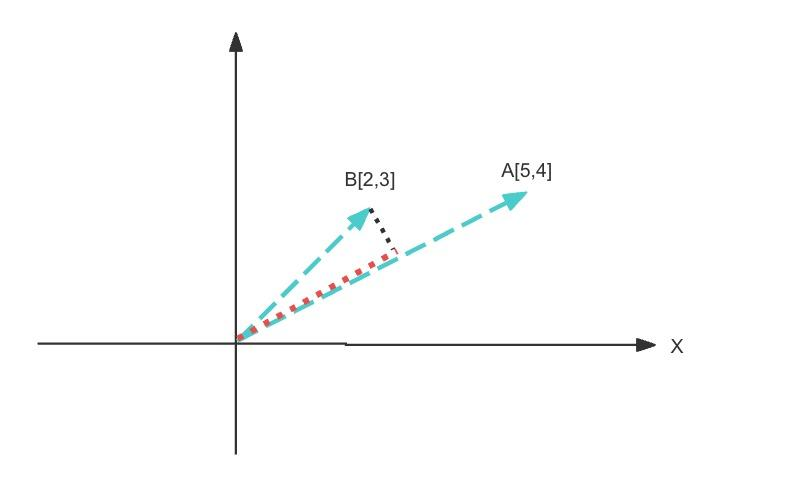
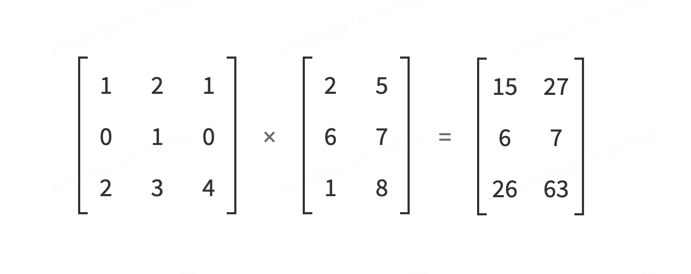
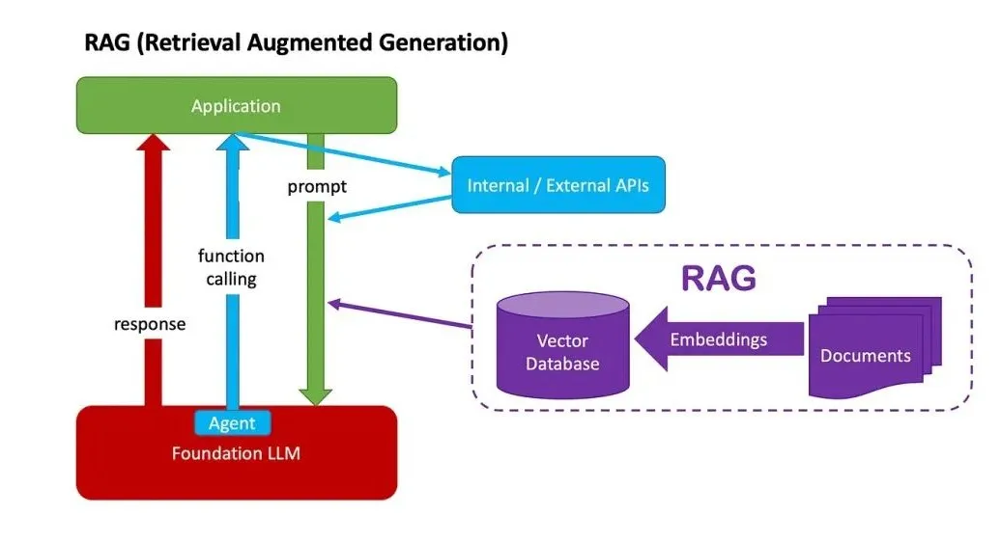
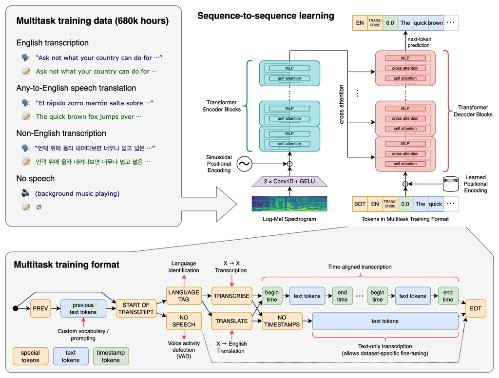

# LLM

## 前言

为什么我们使用chatgpt问一个问题，回答时，他是一个字或者一个词一个词的蹦出来，感觉是有个人在输入，**显得很高级**。

其实这这一个词一个词蹦不是为了高级感，而是他的实现原理决定的，下面我们看下为什么是一个一个蹦出来的


## 大模型的本质

特斯拉前AI总监Andrej Karpathy将大语言模型简单的描述为: 大模型的本质就是两个文件：

* 一个是参数文件
* 一个是包含运行这些参数的代码文件

参数文件是组成整个神经网络的**权重**，代码文件是用来运行这个神经网络的代码，可以是C或者其他任何编程语言写的，当然目前主要都是Python。


那么接下来的问题就是：参数从哪里来？这就引到了模型训练。

> 本质上来说，**大模型训练就是对互联网数据进行有损压缩**（大约10TB文本），需要一个巨大的GPU集群来完成。

以700亿参数的Llama 2（Facebook开源的羊驼大模型）为例，就需要6000块GPU，然后花上12天得到一个大约140GB的“压缩文件”，整个过程耗费大约200万美元。

而有了“压缩文件”，模型就等于靠这些数据对世界形成了理解。


## 大模型是如何工作的

> 简单来说，大模型的工作原理就是依靠这些压缩数据的神经网络对所给序列中的下一个单词进行**预测**。

比如我们问将“**中 华 人民** ”输入进去后，请大模型补充完整，可以想象是分散在整个网络中的十亿、上百亿参数依靠神经元相互连接，顺着这种连接就找到了下一个连接的词，然后给出概率，比如“**共和国（97%）**”，就形成了“**中华人民共和国**”的完整句子。然后继续将“**中华人民共和国**”作为输入，继续依靠神经元相互连接，顺着这种连接就找到了下一个连接的词，然后给出概率，比如“**中华人民共和国 成立于1949年（98%）**”


根据维基百科我们可以看到**中华人民共和国**出现了571次,概率非常大，实际上大模型就是对给出序列的下一个词的概率预测


这就是为什么我们刚才讲大语言模型都是一个词一个词的蹦了,你可以理解**大模型就是一个很牛逼的成语接龙大师**

那么大模型又是如何训练,并预测下一个词的呢？

## 神经网络

历史上，科学家一直希望模拟人的大脑，造出可以思考的机器。人为什么能够思考？科学家发现，原因在于人体的神经网络。


* 外部刺激通过神经末梢，转化为电信号，转导到神经细胞（又叫神经元）。
* 无数神经元构成神经中枢。
* 神经中枢综合各种信号，做出判断。
* 人体根据神经中枢的指令，对外部刺激做出反应。

### 感知器

最简单的神经网络**“感知器”**，早在1957年就被发明并使用了。直到今天还在用


上图的圆圈就代表一个感知器。它接受多个输入（x1，x2，x3...），产生一个输出（output），好比神经末梢感受各种外部环境的变化，最后产生电信号。

为了简化模型，我们约定每种输入只有两种可能：1 或 0。

* 如果所有输入都是1，表示各种条件都成立，输出就是1；
* 如果所有输入都是0，表示条件都不成立，输出就是0。

下面来看一个例子。最近刚上映一部好莱坞大片，张三拿不定主意。周末要不要去看电影.

决定他要不要去看电影有三个因素(特征)。

* **天气**：周末是否晴天？
* **价格**：票价是否可承受？
* **女朋友**：能否找到女朋友一起去？

这就构成一个感知器。上面三个因素就是外部输入，最后的决定就是感知器的输出。如果三个因素都是 Yes（使用`1`表示），输出就是1（去看电影）；如果都是 No（使用`0`表示），输出就是0（不去看电影）。

### 权重和阈值

那么：如果某些因素成立，另一些因素不成立，输出是什么？比如，周末是好天气，票价也不贵，但是张三找不到女朋友，他还会不会去看电影呢？

现实中，各种因素很少具有同等重要性：某些因素是决定性因素，另一些因素是次要因素。因此，可以给这些因素指定权重（weight），代表它们不同的重要性。

* **天气**：权重为8
* **价格**：权重为4
* **女朋友**：权重为4

上面的权重表示，天气是决定性因素，女朋友和价格都是次要因素。

* 如果三个因素都为1，它们乘以权重的总和就是 8 + 4 + 4 = 16。
* 如果天气和价格因素为1，女朋友因素为0，总和就变为 8 + 0 + 4 = 12。

这时，还需要指定一个阈值（threshold）。如果总和大于阈值，感知器输出1，否则输出0。假定阈值为8，那么 12 > 8，小明决定去看电影。阈值的高低代表了意愿的强烈，阈值越低就表示越想去，越高就越不想去。


这就是一个包含了输入层、隐藏层、输出层、权重的一个非常简单的神经网络例子。当然实际场景会比这个更复杂。对于神经网络小白来说，已有了一个感性的认识。

> 上面图中的**连接是神经元中最重要的东西**。每一个连接上都有一个权重。

上面我们自定义了几个因素的权重

* **天气**：权重为8
* **价格**：权重为4
* **女朋友**：权重为4

但是实际情况，这个权重我们只是初始化了一个值，通过大量的数据进行训练，然后不断的调整得到的权重值。例如随机利用1万人的习惯数据，他们是否都是天气好的时候去看电影，没女朋友的时候不去看电影等等。这个权重值就是经过训练不断更新得到的。这样就可以预测张三会不会去看电影

这就是一个简单的神经网络，**一个神经网络的训练过程就是让权重的值调整到最佳，以使得整个网络的预测效果最好**。最终的训练结果可能是“女朋友”这个权重占98，其他都是次要的


### 玩一玩神经网络

上面我们讲的都是一些简单的例子，下面我们看一个简单神经网络在线演示和实验的平台

**TenforFlow Playground** 又名 TensorFlow 游乐场，是一个用来图形化教学的简单神经网络在线演示和实验的平台，非常强大且极其易用。如果您已经有一部分神经网络知识，使用此工具，可以快速体验一个算法工程师的调参工作。

* 在线体验地址: [http://playground.tensorflow.org/](https://link.zhihu.com/?target=http%3A//playground.tensorflow.org/)
* 开源github地址:[https://github.com/tensorflow/playground](https://link.zhihu.com/?target=https%3A//github.com/tensorflow/playground)

下图可简单理解为，正在训练1万人，以天气、价格、女朋友这三个特征进行训练，判断什么情况下会人们会去看电影、什么情况下不会去看电影。


下面列了理解该页面的一些解释。

1. **运行控制区**：这里主要对算法执行进行控制，可以启动、暂停和重置
2. **迭代次数展示区**：这里展示当前算法执行到了哪一次迭代
3. **超参数选择区**：这里可以调整算法的一些超参数，不同的超参能解决不同的算法问题，得到不同的效果
4. **数据集调整区**：数据集定义了我们要解决怎样的问题，数据集是机器学习最为重要的一环，
5. **特征向量选择**：从数据集中抓取出的可以用来被训练的特征值
6. **神经网络区域**：算法工程师构建的用于数据拟合的网络
7. **预测结果区**：展示此算法的预测结果

**一些名词解释**

* **参数**：通常是指网络中可以通过训练数据自动学习和调整的那些数值，例如权重（weights）和偏置（biases）。这些参数是模型在学习过程中不断调整的，以便更好地预测或分类数据。
* **超参数**：则是指那些控制训练过程本身的参数。不同于模型参数，超参数通常是在训练开始之前设置的，并且在训练过程中保持不变。换句话说，超参数是用来定义模型结构（例如有多少层、每层有多少个神经元）和控制训练过程（例如学习速率、训练轮数）的高级设置。
* **线性**：指的是一种直接比例关系，即输出直接随输入按固定比例变化。用通俗的话说，就像你加速汽车，速度的增加与你踩油门的力度成正比。比如，假设你的工资是按小时计算的，这时候工资（输出）和工作时间（输入）之间就是线性关系。
* **非线性**：则是指输出和输入之间的关系不是直接比例的，即输出不会直接随输入按固定比例变化。通俗来说，就像你对一只橡皮筋施力，开始时很容易拉长，但越往后拉越难，力的增加和橡皮筋的伸长之间就是非线性关系。在现实生活中，很多复杂的现象（如天气变化）都是非线性的。
* **激活函数**：在神经网络中用来引入非线性因素，使得网络能够学习和模拟复杂的输入与输出之间的关系。简单来说，激活函数就像是决定神经元是否应该被激活（即对信息做出反应）的开关。例如，ReLU（Rectified Linear Unit，修正线性单元）激活函数是一种常用的激活函数，它的作用是：如果输入是正数就原样输出，如果是负数就输出0。这样的非线性特性让神经网络能够处理更加复杂和抽象的任务，比如图像识别和语言处理。
* **学习率**：是在训练神经网络时用来控制模型学习进度的一个参数。简单讲就是每次给权重添加多少值,如果加的越多,容易学习过头,如果加的太低,学习次数就会变多
* **正则化**：是一种用于避免模型过拟合的技术，可以理解为给模型训练加上一种约束或者惩罚。
* **正则率**：（通常用λ表示）则是控制正则化强度的参数。正则率的值越大，对模型复杂度的惩罚就越重，模型就越倾向于更加简单，但过高的正则率可能导致模型过于简单，无法捕捉数据的关键特征，即欠拟合。因此，选择合适的正则率是保持模型泛化能力和拟合能力之间平衡的关键。

> **特别注意：不是学习的越精准、越没瑕疵越好，过度拟合或导致误判**


> **神经网络的学习过程本质上就是在学习数据的分布**

## Transformer架构

**目前绝大多数的开源大模型都是基于Transformer架构的**。Transformer架构自2017年由Vaswani等人在论文《Attention is All You Need》中提出以来，迅速成为自然语言处理（NLP）领域的主流架构，广泛应用于各种任务，如机器翻译、文本生成、问答系统等等。

Transformer模型的核心创新是**自注意力机制**（Self-Attention Mechanism），这使得模型能够在处理序列数据时，有效地捕捉序列内各元素之间的关系，无论它们在序列中的位置如何远近。

### 向量、矩阵

讲Transformer之前,先回忆一下高中知识：向量、矩阵


向量相加得到另一个向量，可以理解为两条向量一共走了多少路径,的直线距离


向量相乘，可以看成向量B在向量A的垂线上的正射投影和向量A的长度的乘积



矩阵其实就是多维向量组，如图就是3个向量组成的1个矩阵


矩阵相乘



有以上几张图的基本理解就完全足够理解下面我们即将要讲的大模型核心架构Transformer了。

### Transformer架构图

下图就是一个Transformer的架构图，现在让我们看Transformer时如何实现训练的


从下往上大致分为这样一个流程

1. 样本文字转数字向量
2. 增加位置信息
3. 自身的语义关系学习
4. 数字缩放(归一化)
5. 输出概率
6. 对应的文字。

下面让我们逐一的来看每一层都做了什么。

### 训练文字的token化与嵌入向量


对输入的文本进行token的数字转换，每个字对应一个从编码库中标记出来的一个token向量。得到一个4行x64列的这么一个矩阵，每一行代表了1个token（1个token其实就是一个向量，chatgpt按token收费，其中的token就是这个意思），每列代表了这个token在不同语义下的1个数字。

是如何标记的呢,实际上是通过一张超级大的编码字典表中查找到的。目前常用的是openai开源的向量查找表库`tiktoken`：[https://github.com/openai/tikto](https://link.zhihu.com/?target=https%3A//github.com/openai/tiktoken)


为什么有多列呢？因为每个字可能存在多种意思，例如“思”字，你是什么意思？我没什么意思，就是意思意思，每个思字是不同含义的。

* **输入**：样本训练文本。
* **输出**：token化的词嵌入向量矩阵。

### 位置信息编码

经过token化和嵌入向量得到的数据矩阵还不能给模型训练.

例如，张麻子正在打李麻子，这句话中，通过token化嵌入向量后，不明确“麻子”这个词指代的是哪个麻子，所以需要进行位置编码，需要让我们在训练的过程中即知道token、又知道语义，还需知道位置，怎么引入位置呢？


当添加位置信息编码时，不可能像咱们现在这样，每个位置的编码是整数顺序大小的，我们这里只有“中华人民”四个字，所以是1、2、3、4的位置编码，如果我们有1万字，位置编码就会很大，导致向量比较分散，如何解决呢？

sin，cos正好可以拿来做位置编码，因为正弦、余弦的值永远都在-1~1之间

* 奇数位置：sin(f(x))
* 偶数位置：cos(f(x))


token矩阵与位置编码矩阵相加，得到的矩阵就可以丢给模型去训练了

* **输入**：词嵌入向量矩阵。
* **输出**：通过增加位置编码后，得到可训练的带位置信息的向量矩阵。

### 自注意力机制

**自注意力机制是Transformer架构的核心**，自注意力层让模型能够在处理一个单词时考虑到句子中的其他单词。这使得模型能够捕捉单词之间的关系，比如代词和它所指代的名词。


**例子**：在处理句子“**汉字的序顺并不定一影阅响读**”时，自注意力层会帮助模型理解“序”和“顺”的关系。

想象一下，你正在一个聚会上，周围有很多人在聊天。你的大脑会自动地选择性地听某些人的话，这取决于你认为谁的话对当前的对话最重要或最有趣。也就是说，即便所有的声音都进入了你的耳朵，你的大脑还是会“关注”某些特定的声音或信息。这个过程，就有点像自注意力机制在做的事情。

在自然语言处理（NLP）中，当我们给模型输入一个句子，比如：“我爱吃苹果”，模型的目标可能是理解这个句子的意思，或者翻译成另一种语言。自注意力机制允许模型在处理每个词（比如“苹果”）时，不仅考虑这个词本身，还要考虑它与句子中其他词的关系。模型会“关注”句子中的每个词，然后根据这些词之间的关系来决定哪些词是更重要的。

**自注意力机制会为句子中的每个词生成一个“权重”，这个权重反映了当前处理的词对句子中其他词的关注程度**。比如，在处理“苹果”这个词时，模型可能会给“吃”这个词分配更高的权重，因为这两个词之间有直接的关系。通过这种方式，模型就可以更好地理解每个词在句子中的作用，进而更好地理解整个句子的意思。

回到前面的句子“汉字的序顺并不定一影阅响读”，看下图，“顺”字跟句子中其他字之间都会生成一个关系权重，经过大量的训练，“顺”字对“序”字的权重最大。


> 简单来说，自注意力就是模型在处理信息时，能够“自己决定”去关注哪些相关的信息，这样做可以帮助模型更好地理解和处理数据。

如何实现的呢？自注意力机制的核心思想是让每个输入元素（如一个词）能够关注到其他输入元素，从而捕捉到序列中的全局依赖关系。**矩阵乘法**在自注意力机制中起到了关键作用，使用矩阵相乘，找到位置相似的向量，即最终得到比较合理的权重值


矩阵相乘后，值越大说明词与词之间的关注度越高

大致的训练过程是这样的：“顺”字对“序”字的关注度，是在训练的过程中不断的调整向量坐标（权重），以达到最佳效果


自注意力层实际上做了两件事

* 首先是计算词与词之间的关注度权重
* 同时加权求和后输出新的矩阵（预测出的词的得分矩阵）

**计算词与词之间的关注度权重（Attention Scores）**：自注意力机制首先会计算序列中每个词对于其他所有词的关注度权重。这个过程通常涉及将输入序列的每个元素（例如，每个词）转换成三个向量：查询（Query）、键（Key）和值（Value），通过计算查询向量与键向量之间的相似度（通常是点积或某种归一化形式的点积），来得出这些权重。这些权重表明了序列中每个元素对其他元素的重要性程度。

**加权求和后输出新的矩阵**：一旦计算出关注度权重，自注意力机制会使用这些权重对值（Value）向量进行加权求和，以生成每个位置新的表示。这个过程实质上是根据每个元素对序列中其他元素的关注度，重新组合了原始信息。这样，输出的新矩阵中的每个元素都融合了整个序列的信息，反映了序列内部的复杂依赖关系。

* **输入**：一个表示序列的矩阵 ( X )。
* **线性变换**：生成查询（Q）、键（K）、和值（V）矩阵。
* **注意力计算**：并计算词之间的关注度权重。
* **输出**：通过注意力权重对值矩阵 ( V ) 进行加权求和，得到自注意力机制的输出矩阵。

###  归一化注意力分数

归一化是一种将数据按照一定规则缩放到一个特定范围（通常是0到1之间或者是-1到1之间）的过程。这个过程可以帮助我们在处理数据时，减少数据之间因为量纲（单位大小）不同带来的影响，使得数据之间的比较或者计算更加公平和合理。同时提高训练速度和稳定性。

归一化后的注意力分数可以被解释为概率，表示一个词关注另一个词的程度。

**神经网络的学习过程本质上是在学习数据的分布**，如果没有进行归一化的处理，那么每一批次的训练数据的分布是不一样的，

* 从大的方向上来看，神经网络则需要在这多个分布当中找到平衡点
* 从小的方向上来看 ，由于每层的网络输入数据分布在不断地变化 ，那么会**导致每层网络都在找平衡点，显然网络就变得难以收敛**。

下图中，我们可以看到数据归一化后的效果。 原始值（蓝色）现在以零（红色）为中心。 这确保了所有特征值现在都处于相同的比例。


**例子说明归一化:**

再举个简单的例子,假设一个班级里有5个学生参加了一次考试，分数分别是

* 学生A=90分
* 学生B=80分
* 学生C=70分
* 学生D=60分
* 学生E=50分

这个分数比较大,对于如果我们想将这些分数归一化到0到1之间，我们可以将每个学生的分数减去最低分50分，然后再除以最高分和最低分的差值，即40分（90-50）。这样，90分就变成了1（(90-50)/40），50分就变成了0（(50-50)/40），其他分数也会相应转换到0到1之间的某个值。这个过程就是归一化。通过归一化，我们可以更直观地看出每个学生的成绩在班级中的相对位置。

###  前馈神经网络

通过以上步骤，输出的内容基本都是向量矩阵，都是线性的，并且每个词都是独立处理的，单词之间没有信息的交换，然而前馈神经网络可以访问之前由头注意力复制的任何信息。前馈层由神经元组成，这些神经元是可以计算其输入加权和的数学函数。前馈层之所以强大，是因为它有大量的连接。

例如，GPT-3 的前馈层要大得多：输出层有 12288 个神经元（对应模型的 12288 维词向量），隐藏层有 49152 个神经元。

* 自注意力机制：在这一步，每个词会观察周围的词，以找出与自己相关的上下文信息。
* 前馈神经网络：在这一步，每个词会根据自己收集到的上下文信息，进行信息的整合和处理。


> 在数学和物理学中，**非线性是指任何不遵循加法原理（输出不是输入的直接倍数）或者乘法原理（系统的响应不是输入的简单线性组合）的现象**。

### 训练与推理

以上训练过程实际上就是我们文章开头提到的“**大模型训练就是对互联网数据进行有损压缩**”的有损压缩的过程。

* **训练**：是指使用大量的数据对模型进行学习和优化的过程。在这个过程中，模型学习数据中的模式、特征、规律等，调整自身的参数以尽可能准确地对各种输入做出预测或输出。
* **推理**：则是在训练完成后，将新的数据输入到已训练好的模型中，让模型基于其学到的知识和模式进行计算、分析并给出相应的输出或预测结果。可以说训练是让模型具备能力，而推理是运用这种能力来处理具体的任务和问题。

其实上面我们只讲了大模型训练的过程，没有讲推理的过程，推理的过程跟训练的过程大致相同，相差就是训练的过程是沉淀结果，推理是直接计算完成之后输出，并沉淀结果。

我们网上经常看到的Transformer架构图如下，左边是输入，右边是输出，可以看出输入、输出的中间部分基本是相同的。我们可以简单理解左边部分时**训练**的过程、右边部分时**推理**的过程。


## Transformer可视化

* 在线地址：https://poloclub.github.io/transformer-explainer/
* 源码：https://github.com/poloclub/transformer-explainer
* 论文：https://arxiv.org/pdf/2408.04619

* 使用说明：[又有人将Transformer可视化了，可交互、有源码 (qq.com)](https://mp.weixin.qq.com/s/va7LIax09eRiCRqPVD9Qqg)


## LLM四阶段技术

**在探讨大模型（LLM）的四阶段技术时，我们可以从**Prompt Engineering（提示工程）、AI Agent（人工智能代理）、Fine-tuning（微调）以及Pre-training（预训练）这四个关键阶段来详细阐述，这四个阶段技术层层递进。

### Prompt Engineering

#### 简介

什么是Prompt Engineering？Prompt Engineering，即提示工程，是指设计和优化输入给大型语言模型（LLM）的文本提示（Prompt）的过程。这些提示旨在引导LLM生成符合期望的、高质量的输出。


Prompt Engineering的核心要素在于通过明确的指示、相关的上下文、具体的例子以及准确的输入来精心设计提示，从而引导大语言模型生成符合预期的高质量输出。


#### 为什么需要Prompt Engineering？

为什么需要Prompt Engineering？通过不断优化prompt，我们可以建立更加清晰、有效的沟通渠道，充分发挥LLM在语言理解和生成方面的优势。 提升沟通技巧，挖掘LLM潜力。

大语言模型（LLM）本身已具备极高的性能与复杂性，但还有很大潜力需要挖掘。Prompt如同钥匙一般，能够精确引导模型生成特定需求的输出。

#### Prompt Engineering实践


* [ChatGPT提示工程｜AI大神吴恩达教你写提示词(含全部翻译稿和视频，建议收藏！） - 知乎 (zhihu.com)](https://zhuanlan.zhihu.com/p/626290417)

### AI Agent

#### 简介

什么是AI Agent？大模型Agent是一种构建于大型语言模型（LLM）之上的智能体，它具备环境感知能力、自主理解、决策制定及执行行动的能力。

Agent是能够模拟独立思考过程，灵活调用各类工具，逐步达成预设目标。在技术架构上，Agent从面向过程的架构转变为面向目标的架构，旨在通过感知、思考与行动的紧密结合，完成复杂任务。


#### Function Calling

Agent关键技术-Function Calling：Function Calling在智能助手和自动化流程中的应用场景中，LLM通过调用外部API或预设函数来集成多样化服务与复杂操作，以满足用户请求并自动化执行流程。


* 在构建智能助手时，LLM可能需要根据用户的请求调用外部服务（如天气查询API、数据库查询等），并将结果整合到其响应中。
* 在自动化流程中，LLM可以通过调用预设的函数来执行一系列复杂的操作，如数据处理、文件生成等。

#### RAG

Agent关键技术-RAG：通过引入RAG，LLM Agent能够在需要时查询外部知识库，如专业数据库、学术论文、行业报告等，从而增强其知识广度和深度。



#### 为什么需要AI Agent

为什么需要AI Agent？AI Agent作为LLM能力的整合者与定制化服务提供者，通过NLP和HCI技术增强交互体验，使用户能够轻松享受LLM带来的智能服务。

1. 整合LLM能力：AI Agent作为平台，能够无缝整合LLM的文本生成、理解、推理等能力。通过Agent，用户可以直接与LLM进行交互，而无需深入了解LLM的复杂性和技术细节。
2. 定制化服务：AI Agent可以根据不同用户的需求和场景，定制化地利用LLM的能力。例如，在客户服务领域，Agent可以根据用户的查询和问题，利用LLM生成准确的回答和解决方案；在个性化推荐系统中，Agent可以分析用户的偏好和行为，利用LLM生成定制化的推荐内容。
3. 增强交互体验：AI Agent通过自然语言处理（NLP）和人机交互（HCI）技术，能够提供更自然、流畅的交互体验。用户可以通过自然语言与Agent进行对话，而Agent则能够理解和回应用户的意图和需求，从而增强用户的满意度和忠诚度。

#### AI Agent实践

吴恩达老师开源了一套 AI Agent 翻译工作流 Translation Agent。

工作流主要分三个步骤：

1. 通过指定大语言模型（LLM）进行语言之间的翻译；
2. 对翻译结果进行反思，并提出改进建议；
3. 再根据这些建议进行优化翻译。

另外，这也是高度可控的翻译工作流，你只需通过修改提示词，就可以指定语气（正式或非正式）、地区等，还可以提供专业术语表来确保术语翻译的一致性。

GitHub：[andrewyng/translation-agent (github.com)](https://github.com/andrewyng/translation-agent)


### Fine-tuning

#### 简介

什么是Fine-tuning？Fine-Tuning是指使用特定领域的数据集对预训练的大型语言模型进行进一步训练的过程。通过微调，模型可以学习到特定领域的知识和模式，从而在相关任务上表现更好。


在预训练模型的基础上，针对特定任务或数据领域，通过在新任务的小规模标注数据集上进一步训练和调整模型的部分或全部参数，使模型能够更好地适应新任务，提高在新任务上的性能。

#### 为什么需要Fine-tuning？

为什么需要Fine-tuning？尽管预训练模型已经在大规模数据集上学到了丰富的通用特征和先验知识，但这些特征和知识可能并不完全适用于特定的目标任务。

微调通过在新任务的少量标注数据上进一步训练预训练模型，使模型能够学习到与目标任务相关的特定特征和规律，从而更好地适应新任务。

#### Fine-tuning实践

如下图：Stable Diffusion的原神lora

[[Realistic&Anime\] Genshin Impact AI Cosplayers collection || [Realistic&Anime]原神AI Coser合集 - Eula 优菈 | Stable Diffusion LoRA | Civitai](https://civitai.com/models/272731?modelVersionId=360380)


### Pre-training

#### 简介

什么是Pre-training？预训练是语言模型学习的初始阶段。在预训练期间，模型会接触大量未标记的文本数据，例如书籍、文章和网站。目标是捕获文本语料库中存在的底层模式、结构和语义知识。


预训练利用大量无标签或弱标签的数据，通过某种算法模型进行训练，得到一个初步具备通用知识或能力的模型。 

* 无监督学习：预训练通常是一个无监督学习过程，模型在没有明确指导或标签的情况下从未标记的文本数据中学习。 
* 屏蔽语言建模：模型经过训练可以预测句子中缺失或屏蔽的单词、学习上下文关系并捕获语言模式。 
* Transformer 架构：预训练通常采用基于 Transformer 的架构，该架构擅长捕获远程依赖关系和上下文信息。

#### 为什么需要Pre-training 

为什么需要Pre-training ：预训练是为了让模型在见到特定任务数据之前，先通过学习大量通用数据来捕获广泛有用的特征，从而提升模型在目标任务上的表现和泛化能力。

预训练技术通过从大规模未标记数据中学习通用特征和先验知识，减少对标记数据的依赖，加速并优化在有限数据集上的模型训练。

#### Pre-training实践

使用大规模文本数据集（如Wikipedia、Common Crawl等）来训练语言模型（如GPT、BERT等）

[[1810.04805\] BERT: Pre-training of Deep Bidirectional Transformers for Language Understanding (arxiv.org)](https://arxiv.org/abs/1810.04805)

## 大模型库

在近年来，随着深度学习技术的迅猛发展，许多知名的大模型在各个领域取得了显著的成果。以下是一些在语音识别、自然语言处理、计算机视觉等领域的知名大模型的介绍：

### 自然语言处理

#### GPT-4
- **简介**：GPT-4 是 OpenAI 开发的最新一代生成预训练变换器模型，具有更大的参数规模和更强的语言理解与生成能力。
- **优势**：
  - **生成能力**：能够生成高质量、连贯的文本，适用于对话、写作、翻译等多种任务。
  - **多模态能力**：支持文本和图像的输入，能够处理更复杂的多模态任务。
  - **灵活性**：可以通过少量示例进行微调，适应特定的应用场景。

#### BERT
- **简介**：BERT（Bidirectional Encoder Representations from Transformers）是由 Google 提出的预训练语言模型，采用双向 Transformer 架构。
- **优势**：
  - **上下文理解**：通过双向编码，能够更好地捕捉上下文信息，提升了自然语言理解的准确性。
  - **广泛应用**：在问答、情感分析、命名实体识别等多种任务中表现优异，成为许多后续模型的基础。

#### T5 (Text-to-Text Transfer Transformer)
- **简介**：T5 是 Google 提出的一个统一的文本到文本模型，所有任务都被视为文本到文本的转换。
- **优势**：
  - **统一框架**：能够处理多种 NLP 任务（如翻译、摘要、问答等），具有灵活性和可扩展性。
  - **高性能**：在多个基准测试中表现出色，适用于各种自然语言处理任务。

#### 总结

这三个模型在自然语言处理领域具有重要的影响力和应用价值。GPT-4 以其强大的生成能力和多模态支持而脱颖而出，BERT 则在理解任务中设定了新的标准，而 T5 的统一框架则为多任务学习提供了新的思路。这些模型推动了 NLP 技术的进步，并在实际应用中展现了巨大的潜力。

### 物体检测与计算机视觉

#### CLIP

> CLIP: Connecting text and images

CLIP（Contrastive Language-Image Pre-training）是由 OpenAI 开发的一种多模态模型，旨在理解图像和文本之间的关系。CLIP 通过对大量图像和文本对进行对比学习，能够在没有明确标签的情况下进行图像分类、检索和生成任务。该模型的核心思想是通过将图像和文本映射到同一特征空间，使得相似的图像和文本在空间中靠近，从而实现跨模态的理解。CLIP 在多种视觉任务中表现出色，尤其是在处理复杂场景和长尾分布时。


#### YOLO

YOLO（You Only Look Once）是一种实时物体检测系统，能够在单个前向传播中同时预测多个边界框和类概率。YOLO 的设计理念是将物体检测问题转化为回归问题，通过一个神经网络直接从图像像素到边界框坐标和类别概率的映射。YOLO 的速度和准确性使其在实时物体检测应用中非常受欢迎，广泛应用于安全监控、自动驾驶和机器人等领域。YOLO 的多个版本（如 YOLOv3、YOLOv4、YOLOv5、YOLOv6）不断改进，提升了模型的性能。


#### SAM

SAM（Segment Anything Model）是 Meta AI 开发的一种图像分割模型，旨在进行高效的图像分割。SAM 通过大规模的多样化数据集进行训练，能够处理各种图像分割任务，包括实例分割和语义分割。该模型的设计目标是提供一种通用的分割工具，能够在不同的应用场景中快速适应，具有较高的准确性和鲁棒性。SAM 在图像分析、计算机视觉和增强现实等领域具有广泛的应用潜力。


#### LAMA

LAMA（Language-Aware Masking）是一种结合语言信息的图像分割模型，能够根据文本描述进行图像分割。LAMA 的设计理念是将语言理解与视觉任务相结合，使得模型能够根据用户提供的文本提示生成相应的图像分割结果。该模型在多模态学习中具有重要意义，推动了图像和文本结合的研究。LAMA 在需要图像和文本结合的任务中表现出色，适用于图像编辑、内容生成等应用场景。


#### U²-Net

U²-Net 是一种强大的图像分割模型，结合了双重 U-Net 结构和多尺度特征融合，能够高效地进行前景提取和背景去除。它在图像处理、视频编辑和其他相关领域具有广泛的应用潜力。


### 语音识别与处理

#### OpenAI Whisper



- **简介**：Whisper 是 OpenAI 开发的自动语音识别（ASR）系统，支持多种语言和方言的语音转文本任务。
- **优势**：
  - **多语言支持**：能够处理多种语言和方言，适用于全球用户。
  - **鲁棒性**：在嘈杂环境中表现良好，具有高准确率，适合于各种应用场景。

#### Faster-Whisper
- **简介**：Faster-Whisper 是对 OpenAI Whisper 的一种优化版本，旨在提高语音识别的速度和效率。
- **优势**：
  - **实时性能**：通过优化算法和模型结构，Faster-Whisper 能够实现更快的语音识别速度，适合实时应用。
  - **高准确性**：在保持高识别准确率的同时，提升了处理速度，适用于需要快速响应的场景。

#### ChatTTS
- **简介**：ChatTTS 是一种基于对话生成的文本到语音（TTS）模型，旨在生成自然流畅的语音，特别是在对话场景中。
- **特点**：
  - **对话优化**：ChatTTS 通过对话上下文生成语音，能够更好地理解和表达对话中的情感和语气。
  - **自然性**：该模型致力于生成高质量、自然的语音，适用于虚拟助手、聊天机器人等应用。
  - **多样性**：能够根据不同的输入文本生成多样化的语音输出，增强用户体验。


#### GPT-SoVITS


- **简介**：GPT-SoVITS 是结合了 GPT（生成预训练变换器）和 SoVITS（基于声码器的文本到语音模型）的系统，旨在生成高质量的语音合成。
- **特点**：
  - **多模态能力**：结合了 GPT 的文本生成能力和 SoVITS 的高质量语音合成，能够生成与文本内容高度一致的语音。
  - **个性化**：GPT-SoVITS 可以根据用户的需求和偏好进行个性化的语音合成，适用于多种应用场景，如游戏、动画配音等。
  - **高保真度**：利用 SoVITS 的声码器技术，生成的语音具有高保真度和自然性，适合于需要高质量语音的应用。


### 图像生成

#### DALL-E

DALL-E 是 OpenAI 开发的一种图像生成模型，能够根据文本描述生成高质量的图像。DALL-E 结合了 Transformer 架构和图像生成技术，能够理解复杂的文本提示并生成相应的图像。该模型在创意设计、广告、插图等领域具有广泛的应用潜力，展示了文本到图像生成的强大能力。


#### Stable Diffusion

Stable Diffusion 是一种基于扩散模型的图像生成技术，能够生成高质量的图像。该模型通过逐步去噪的过程，从随机噪声中生成图像。Stable Diffusion 在生成图像时能够根据文本提示进行控制，适用于多种风格和主题的图像生成。由于其高效性和灵活性，Stable Diffusion 在艺术创作、游戏开发和虚拟现实等领域得到了广泛应用。


### 大模型未来发展

### 长token（Long Tokens）
长token是指在处理文本时，模型能够理解和生成的较长的词或短语。传统的语言模型通常使用较短的token（如单词或子词），而长token的引入旨在提高模型对上下文的理解能力。长token可以帮助模型更好地捕捉句子结构和语义信息，尤其是在处理复杂的句子或段落时。


### RAG（Retrieval-Augmented Generation）
RAG是一种结合了检索和生成的模型架构。它通过将信息检索与文本生成相结合，来提高生成文本的质量和准确性。RAG模型通常包括两个主要组件：
- **检索器**：从一个大型知识库中检索相关的信息或文档。
- **生成器**：基于检索到的信息生成最终的文本输出。

这种方法特别适合需要大量背景知识的任务，如问答系统和对话生成，能够有效地提高模型的知识覆盖率和生成的相关性。


### 多模态（Multimodal）
多模态指的是结合多种类型的数据（如文本、图像、音频等）进行处理和生成的能力。多模态模型能够在不同类型的数据之间建立联系，提升理解和生成的能力。

接受文本、音频、图像和视频的任意组合作为输入，并生成文本、音频和图像的任意组合输出


## LLM实战视频内容分析

* **ffmpeg**：分离音视频

* **openai-whisper/faster-whisper**：音频识别

* **AI**：翻译音频识别的文字（也可以进行内容总结）

* 当然还可以通过ffmpeg制作视频中文字幕或者使用ChatTTS进行中文配音，供大家去探索……

比如我们看到一个英文的广告《Write Like A Winner | Write Your Best Work With Grammarly》，想了解他的内容。

好的，下面是完整的案例，包括音频提取、音频识别、生成 SRT 文件，以及使用 OpenAI 的 ChatGPT 进行翻译和总结的部分。我们将整合所有步骤并提供完整的代码示例。


### 环境安装

首先，确保你已经安装了以下依赖：

1. **FFmpeg**: 用于音频提取。你可以从 [FFmpeg 官网](https://ffmpeg.org/download.html) 下载并安装。
2. **Python**: 确保你已经安装了 Python 3.x。
3. **Python 库**: 使用以下命令安装所需的 Python 库：

```bash
# 创建虚拟环境（可选）
conda create -n video_analysis
conda activate video_analysis
# 安装库
pip install torch torchvision torchaudio
pip install openai-whisper
pip install requests
```

### 步骤 1: 提取音频

使用 `ffmpeg` 从视频文件中提取音频。以下是一个 Python 函数，用于提取音频：

```python
import subprocess
import os

def extract_audio(video_file, audio_file):
    # 如果文件已存在，先删除它
    if os.path.exists(audio_file):
        os.remove(audio_file)

    command = [
        'ffmpeg',
        '-i', video_file,
        '-q:a', '0',  # 质量参数
        '-map', 'a',  # 只提取音频
        audio_file
    ]
    subprocess.run(command, check=True)
```

> 注意，目标音频文件可能存在，可以检测一下是否存在，如果存在则删除。

### 步骤 2: 音频转录并生成 SRT 文件

使用 `openai-whisper` 进行音频识别，并将结果保存为 SRT 文件。以下是相关代码：

```python
import whisper

def transcribe_audio_to_srt(audio_file, srt_file):
    model = whisper.load_model("base")  # 选择模型大小
    result = model.transcribe(audio_file)

    with open(srt_file, 'w', encoding='utf-8') as f:
        for i, segment in enumerate(result['segments']):
            start_time = segment['start']
            end_time = segment['end']
            text = segment['text'].strip()

            start_time_srt = format_srt_time(start_time)
            end_time_srt = format_srt_time(end_time)

            f.write(f"{i + 1}\n")
            f.write(f"{start_time_srt} --> {end_time_srt}\n")
            f.write(f"{text}\n\n")

def format_srt_time(seconds):
    """将秒转换为 SRT 时间格式"""
    hours = int(seconds // 3600)
    minutes = int((seconds % 3600) // 60)
    seconds = seconds % 60
    milliseconds = int((seconds - int(seconds)) * 1000)
    return f"{hours:02}:{minutes:02}:{int(seconds):02},{milliseconds:03}"
```

> 执行该操作时，会默认下载该模型文件`C:\Users\用户\.cache\whisper\base.pt`（约150兆，需要外网环境，不能下载的可以从其他途径获取该文件然后拷贝到本机对应位置即可），下载文件大小由`model = whisper.load_model("base")`这句话决定
>
> OpenAI Whisper 提供了多个模型选项，用户可以根据需求选择不同的模型。以下是 Whisper 模型的主要选项及其大致大小：
>
> 1. **tiny**:
>    - **大小**: 约 75 MB
>    - **特点**: 速度快，适合实时应用，但准确性相对较低。
>
> 2. **base**:
>    - **大小**: 约 150 MB
>    - **特点**: 较小的模型，速度和准确性之间有较好的平衡。
>
> 3. **small**:
>    - **大小**: 约 300 MB
>    - **特点**: 提供更好的准确性，适合大多数用途。
>
> 4. **medium**:
>    - **大小**: 约 1.2 GB
>    - **特点**: 更高的准确性，适合需要更精确转录的场景。
>
> 5. **large**:
>    - **大小**: 约 2.9 GB
>    - **特点**: 提供最佳的准确性，适合高要求的转录任务，但速度较慢。
>
> 选择模型的建议
>
> - **实时应用**: 如果需要快速处理，选择 `tiny` 或 `base` 模型。
> - **一般用途**: `small` 模型通常是一个不错的选择，提供良好的准确性和速度。
> - **高准确性需求**: 如果对转录的准确性有较高要求，建议使用 `medium` 或 `large` 模型。
>

### 步骤 3: 翻译和总结

使用 OpenAI 的 API 进行翻译和总结。确保你有一个有效的 API 密钥。

```python
def load_config(config_path):
    """加载配置文件"""
    try:
        with open(config_path, "r") as f:
            config = json.load(f)
        return config.get("base_url"), config.get("api_key")
    except FileNotFoundError:
        print("错误：config.json 文件未找到。")
        exit()
    except json.JSONDecodeError:
        print("错误：config.json 文件格式错误。")
        exit()


def translate_and_summarize(text, config_path):
    """翻译并总结文本"""
    base_url, api_key = load_config(config_path)

    # 构建完整的 API URL
    url = f"{base_url}/chat/completions"
    headers = {"Authorization": f"Bearer {api_key}", "Content-Type": "application/json"}

    # 翻译并总结
    text_data = {
        "model": "gpt-4o-mini",
        "messages": [
            {
                "role": "user",
                "content": f"你是一个好用的视频总结助手。根据以下输入的SRT文本文件，用中文详细总结其内容。: {text}",
            }
        ],
    }
    summary_response = requests.post(url, headers=headers, data=json.dumps(text_data))
    summary_text = ""
    if summary_response.status_code == 200:
        result = summary_response.json()
        summary_text = result["choices"][0]["message"]["content"]
    else:
        print(f"请求失败：{summary_response.status_code}")
    return summary_text
```

### 步骤 4: 整合所有步骤

将所有步骤整合到一个主函数中：

```python
def main(video_file, audio_file, srt_file, config_path):
    # Step 1: Extract audio from video
    extract_audio(video_file, audio_file)

    # Step 2: Transcribe audio and generate SRT
    transcribe_audio_to_srt(audio_file, srt_file)

    # Step 3: Read transcribed text for translation and summarization
    with open(srt_file, "r", encoding="utf-8") as f:
        srt_content = f.read()

    # Translate and summarize
    summary_text = translate_and_summarize(srt_content, config_path)

    # Output results
    print("Summary Text:", summary_text)

def main(video_file, audio_file, srt_file, config_path):
    # Step 1: Extract audio from video
    extract_audio(video_file, audio_file)

    # Step 2: Transcribe audio and generate SRT
    transcribe_audio_to_srt(audio_file, srt_file)

    # Step 3: Read transcribed text for translation and summarization
    with open(srt_file, "r", encoding="utf-8") as f:
        srt_content = f.read()

    # Translate and summarize
    summary_text = translate_and_summarize(srt_content, config_path)

    # Output results
    print("Summary Text:", summary_text)


if __name__ == "__main__":
    video_file = "./data/Write Like A Winner ｜ Write Your Best Work With Grammarly [udaihhReGAA].mp4"  # 替换为你的视频文件路径
    audio_file = "output_audio.m4a"  # 输出音频文件名
    srt_file = "output_subtitles.srt"  # 输出 SRT 文件名
    config_path = "./config/gpt.config.json"  # 替换为你的 config 文件路径

    main(video_file, audio_file, srt_file, config_path)
```

> 在使用 OpenAI Whisper 进行音频转录时，选择音频格式（如 WAV、M4A 或 MP3）会影响转录的质量和处理效率。
>
> M4A 也是一个不错的选择，能够在保持良好音质的同时减少文件大小。

### 使用方法

config\gpt.config.json

```json
{
    "base_url": "https://xxxx.com/v1",
    "api_key": ""
}
```

整合版源代码

```python
import subprocess
import whisper
import requests
import json
import os

def extract_audio(video_file, audio_file):
    """
    从视频文件中提取音频并保存为指定的音频文件。
    
    参数:
    video_file: 视频文件的路径
    audio_file: 输出音频文件的路径
    """
    # 如果输出音频文件已存在，先删除它
    if os.path.exists(audio_file):
        os.remove(audio_file)

    # 使用 ffmpeg 提取音频
    command = [
        "ffmpeg",
        "-i",
        video_file,
        "-q:a",
        "0",  # 设置音频质量
        "-map",
        "a",  # 只提取音频流
        audio_file,
    ]
    subprocess.run(command, check=True)  # 执行命令并检查是否成功

def transcribe_audio_to_srt(audio_file, srt_file):
    """
    将音频文件转录为 SRT 字幕文件。
    
    参数:
    audio_file: 输入音频文件的路径
    srt_file: 输出 SRT 文件的路径
    """
    model = whisper.load_model("base")  # 加载 Whisper 模型
    result = model.transcribe(audio_file)  # 转录音频

    # 将转录结果写入 SRT 文件
    with open(srt_file, "w", encoding="utf-8") as f:
        for i, segment in enumerate(result["segments"]):
            start_time = segment["start"]
            end_time = segment["end"]
            text = segment["text"].strip()

            # 格式化时间为 SRT 格式
            start_time_srt = format_srt_time(start_time)
            end_time_srt = format_srt_time(end_time)

            # 写入 SRT 文件
            f.write(f"{i + 1}\n")
            f.write(f"{start_time_srt} --> {end_time_srt}\n")
            f.write(f"{text}\n\n")

def format_srt_time(seconds):
    """
    将秒数转换为 SRT 时间格式。
    
    参数:
    seconds: 秒数
    返回值:
    格式化后的时间字符串
    """
    hours = int(seconds // 3600)
    minutes = int((seconds % 3600) // 60)
    seconds = seconds % 60
    milliseconds = int((seconds - int(seconds)) * 1000)
    return f"{hours:02}:{minutes:02}:{int(seconds):02},{milliseconds:03}"

def load_config(config_path):
    """
    加载配置文件以获取 API 基础 URL 和密钥。
    
    参数:
    config_path: 配置文件的路径
    返回值:
    base_url: API 基础 URL
    api_key: API 密钥
    """
    try:
        with open(config_path, "r") as f:
            config = json.load(f)
        return config.get("base_url"), config.get("api_key")
    except FileNotFoundError:
        print("错误：config.json 文件未找到。")
        exit()
    except json.JSONDecodeError:
        print("错误：config.json 文件格式错误。")
        exit()

def translate_and_summarize(text, config_path):
    """
    翻译并总结输入的文本。
    
    参数:
    text: 输入的文本
    config_path: 配置文件的路径
    返回值:
    summary_text: 总结后的文本
    """
    base_url, api_key = load_config(config_path)  # 加载配置

    # 构建 API 请求 URL
    url = f"{base_url}/chat/completions"
    headers = {"Authorization": f"Bearer {api_key}", "Content-Type": "application/json"}

    # 构建请求数据
    text_data = {
        "model": "gpt-4o-mini",
        "messages": [
            {
                "role": "user",
                "content": f"你是一个好用的视频总结助手。根据以下输入的SRT文本文件，用中文详细总结其内容。: {text}",
            }
        ],
    }
    
    # 发送请求并获取总结
    summary_response = requests.post(url, headers=headers, data=json.dumps(text_data))
    summary_text = ""
    if summary_response.status_code == 200:
        result = summary_response.json()
        summary_text = result["choices"][0]["message"]["content"]
    else:
        print(f"请求失败：{summary_response.status_code}")
    return summary_text

def main(video_file, audio_file, srt_file, config_path):
    """
    主函数，执行整个流程：提取音频、转录、翻译和总结。
    
    参数:
    video_file: 视频文件的路径
    audio_file: 输出音频文件的路径
    srt_file: 输出 SRT 文件的路径
    config_path: 配置文件的路径
    """
    # Step 1: 从视频中提取音频
    extract_audio(video_file, audio_file)

    # Step 2: 转录音频并生成 SRT 文件
    transcribe_audio_to_srt(audio_file, srt_file)

    # Step 3: 读取转录文本以进行翻译和总结
    with open(srt_file, "r", encoding="utf-8") as f:
        srt_content = f.read()

    # 翻译并总结文本
    summary_text = translate_and_summarize(srt_content, config_path)

    # 输出总结结果
    print("Summary Text:", summary_text)

if __name__ == "__main__":
    # 设置输入输出文件路径
    video_file = "./data/Write Like A Winner ｜ Write Your Best Work With Grammarly [udaihhReGAA].mp4"  # 替换为你的视频文件路径
    audio_file = "output_audio.m4a"  # 输出音频文件名
    srt_file = "output_subtitles.srt"  # 输出 SRT 文件名
    config_path = "./config/gpt.config.json"  # 替换为你的 config 文件路径

    # 执行主函数
    main(video_file, audio_file, srt_file, config_path)

```

1. 将上述代码保存为一个 Python 文件，例如 `video_to_srt_with_translation.py`。
2. 确保你已将 `video_file` 变量替换为你的视频文件的实际路径，并将 `api_key` 替换为你的 OpenAI API 密钥。
3. 在终端或命令行中运行以下命令：

```bash
python video_to_srt_with_translation.py
```

### 结果

运行该脚本后，程序将提取视频中的音频，转录音频为 SRT 格式的字幕文件，并使用 OpenAI 的 API 进行翻译和总结，最后在控制台输出翻译和总结的结果。

> Summary Text: 这段对话描述了一个人在使用Grammarly这个AI写作助手的过程，主要聚焦在她如何处理待办的项目和应对压力。以下是内容的详细总
> 结：
>
> 1. **场景设定**：对话的背景是一个第三季度的规划会议，参与者之间讨论了名为Adam的团队成员当前的工作状态。她看起来很疲惫，并且面临着紧 迫的截止日期。
>
> 2. **使用Grammarly**：在面对挑战时，Adam通过Grammarly寻求帮助，Grammarly作为一个写作助手能够帮助她提升文档的表达和清晰度。
>
> 3. **写作过程**：对话中提到Adam请求Grammarly为文档撰写摘要，并成功地将内容缩减，同时保持了自身的声音和自信，给人以信任感。
>
> 4. **压力管理**：正当工作进行时，Adam收到了CEO的消息，这让她面临更大的压力，但她依然使用Grammarly保持对任务的把控，并且变得更加自信 。
>
> 5. **出色表现**：对话者们称赞Adam的表现，认为她在工作中的表现相当出色，是“最有价值球员”（MVP）。她快速地提高了文档的整理和表达能力，甚至将内容缩减了一半。
>
> 6. **最终成果**：最后，Adam将修改后的文档发送出去，象征性地说这是个“达阵”（touchdown），说明她成功完成了任务。
>
> 7. **推广Grammarly**：结束时，鼓励观众免费下载Grammarly这个写作助手，强调其对提高写作效率的帮助。
>
> 总体而言，这段对话轻松幽默，展现了一名职场女性如何利用现代科技工具克服工作压力和挑战，同时强调了团队合作和AI技术在提升工作效率中的重要性。

### 注意事项

- 确保你的环境中已正确安装 `ffmpeg`，并且可以在命令行中访问。
- 根据需要调整 Whisper 模型的大小（例如，使用 "small" 或 "large" 模型），以获得更好的识别效果，但会增加计算资源的需求。
- 如果你使用的是 GPU，请确保 PyTorch 安装时选择了合适的 CUDA 版本。
- 请遵循 OpenAI 的使用条款，确保合理使用 API。

这样，你就完成了从视频到 SRT 字幕的完整流程，并且包含了翻译和总结的功能！

## 参考

* [无任何数学公式理解大模型基本原理 - 知乎 (zhihu.com)](https://zhuanlan.zhihu.com/p/705310212)