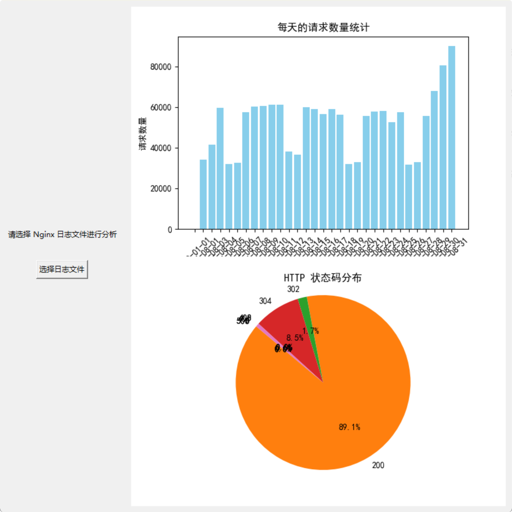

# Matplotlib 

## 引言

Matplotlib是一个广泛使用的Python绘图库，旨在为数据可视化提供灵活和强大的工具。自2003年首次发布以来，Matplotlib已经成为Python数据科学和机器学习领域的标准可视化库之一。它支持多种图形类型，包括折线图、散点图、条形图、直方图、饼图等，能够满足不同用户的需求。

Matplotlib的设计理念是简洁而强大，用户可以通过简单的命令生成高质量的图形，同时也允许高级用户进行复杂的自定义。无论是进行科学研究、数据分析，还是创建商业报告，Matplotlib都能帮助用户有效地展示数据背后的信息和趋势。

此外，Matplotlib与其他科学计算库（如NumPy和Pandas）紧密集成，使得数据处理和可视化的流程更加顺畅。随着数据科学的快速发展，掌握Matplotlib的使用将为数据分析师、科学家和工程师提供重要的技能，帮助他们更好地理解和传达数据。

在接下来的部分中，我们将深入探讨Matplotlib的安装、基本用法、自定义图形以及与其他库的结合等内容，帮助读者全面掌握这一强大的数据可视化工具。

以下是关于Matplotlib安装与配置部分的内容：

## 安装与配置

在开始使用Matplotlib之前，首先需要在你的计算机上安装该库。以下是几种常见的安装方法，以及如何配置环境以便顺利使用Matplotlib。

### 安装方法

1. **使用pip安装**
   - 如果你已经安装了Python，可以使用pip命令来安装Matplotlib。在命令行或终端中输入以下命令：
     ```bash
     pip install matplotlib
     ```

2. **使用conda安装**
   - 如果你使用Anaconda作为Python的发行版，可以通过conda命令安装Matplotlib。在Anaconda Prompt中输入：
     ```bash
     conda install matplotlib
     ```

3. **从源代码安装**
   - 你也可以从Matplotlib的[官方网站](https://matplotlib.org/)下载源代码并进行手动安装。这通常适用于需要自定义构建或开发Matplotlib的人。

### 配置环境

1. **使用Jupyter Notebook**
   - Jupyter Notebook是一个非常流行的交互式计算环境，适合进行数据分析和可视化。在Jupyter Notebook中，使用Matplotlib非常简单。确保安装了Jupyter Notebook后，可以通过以下命令启动：
     ```bash
     jupyter notebook
     ```
   - 在Notebook中使用Matplotlib时，建议在代码单元的开头添加以下魔法命令，以便在Notebook中直接显示图形：
     ```python
     %matplotlib inline
     ```

2. **使用IDE（如PyCharm、VS Code等）**
   - 如果你在集成开发环境（IDE）中工作，确保你的IDE已正确配置Python解释器，并且已安装Matplotlib。大多数IDE都支持直接在代码中运行Matplotlib绘图命令，并在输出窗口中显示图形。

3. **配置图形后端**
   - Matplotlib支持多种图形后端，用户可以根据需要选择合适的后端。常见的后端包括：
     - `Agg`: 用于生成图像文件（如PNG），不显示图形窗口。
     - `TkAgg`: 默认后端，适用于大多数操作系统，支持交互式图形。
     - `Qt5Agg`: 适用于使用Qt库的应用程序。
   - 可以通过以下代码设置后端：
     ```python
     import matplotlib
     matplotlib.use('TkAgg')  # 或其他后端
     ```

### 验证安装

安装完成后，可以通过以下简单代码验证Matplotlib是否正确安装：
```python
import matplotlib.pyplot as plt

# 创建一个简单的折线图
plt.plot([1, 2, 3, 4], [1, 4, 2, 3])
plt.title('简单折线图')
plt.xlabel('X轴')
plt.ylabel('Y轴')
plt.show()
```
如果运行上述代码后能够成功显示图形，则说明Matplotlib已正确安装并配置。

通过以上步骤，你就可以顺利地安装和配置Matplotlib，准备进行数据可视化工作。如果在安装过程中遇到问题，可以参考官方文档或社区支持获取帮助。

## 基础概念

在使用Matplotlib进行数据可视化之前，了解一些基本概念是非常重要的。这些概念将帮助你更好地理解如何创建和自定义图形。

### Figure与Axes的概念

1. **Figure**
   - Figure是Matplotlib中最顶层的容器，代表整个图形窗口或图像。每个Figure可以包含多个Axes（坐标轴），以及其他元素如标题、图例等。
   - 通过`plt.figure()`可以创建一个新的Figure对象。

2. **Axes**
   - Axes是Figure中的一个子区域，实际用于绘制数据的区域。每个Axes可以有自己的坐标轴、标题和图例。
   - 通过`plt.subplot()`或`plt.add_subplot()`可以在Figure中创建一个或多个Axes。

### 绘图的基本流程

在Matplotlib中，绘图的基本流程通常包括以下几个步骤：

1. **导入库**
   - 首先需要导入Matplotlib库，通常使用`pyplot`模块：
     ```python
     import matplotlib.pyplot as plt
     ```

2. **创建Figure和Axes**
   - 创建一个Figure对象，并在其中添加Axes：
     ```python
     fig, ax = plt.subplots()  # 创建一个Figure和一个Axes
     ```

3. **绘制数据**
   - 使用各种绘图函数（如`plot()`、`scatter()`、`bar()`等）在Axes上绘制数据：
     ```python
     ax.plot(x_data, y_data)  # 在Axes上绘制折线图
     ```

4. **自定义图形**
   - 设置标题、坐标轴标签、图例等：
     ```python
     ax.set_title('图形标题')
     ax.set_xlabel('X轴标签')
     ax.set_ylabel('Y轴标签')
     ```

5. **显示图形**
   - 使用`plt.show()`显示图形：
     ```python
     plt.show()
     ```

### 示例代码

以下是一个简单的示例，演示了上述基本流程：
```python
import matplotlib.pyplot as plt

# 创建数据
x = [1, 2, 3, 4]
y = [1, 4, 2, 3]

# 创建Figure和Axes
fig, ax = plt.subplots()

# 绘制折线图
ax.plot(x, y)

# 设置标题和坐标轴标签
ax.set_title('简单折线图')
ax.set_xlabel('X轴')
ax.set_ylabel('Y轴')

# 显示图形
plt.show()
```

### 总结

理解Figure和Axes的概念，以及绘图的基本流程，是使用Matplotlib进行数据可视化的基础。掌握这些基本概念后，你将能够创建和自定义各种类型的图形，为数据分析和展示提供有力支持。在接下来的部分中，我们将深入探讨Matplotlib的各种基本绘图类型。

## 基本绘图

Matplotlib提供了多种绘图类型，能够满足不同的数据可视化需求。在这一部分，我们将介绍几种常见的基本绘图类型及其用法。

### 折线图（Line Plot）

折线图是最常用的图形之一，适用于显示数据随时间或其他变量变化的趋势。

```python
import matplotlib.pyplot as plt

# 创建数据
x = [1, 2, 3, 4]
y = [1, 4, 2, 3]

# 绘制折线图
plt.plot(x, y, marker='o')  # marker参数用于标记数据点
plt.title('折线图示例')
plt.xlabel('X轴')
plt.ylabel('Y轴')
plt.grid()  # 添加网格
plt.show()
```

### 散点图（Scatter Plot）

散点图用于显示两个变量之间的关系，适合用于探索数据的分布和相关性。

```python
import matplotlib.pyplot as plt

# 创建数据
x = [1, 2, 3, 4, 5]
y = [2, 3, 5, 7, 11]

# 绘制散点图
plt.scatter(x, y, color='red', marker='x')  # color和marker参数可自定义样式
plt.title('散点图示例')
plt.xlabel('X轴')
plt.ylabel('Y轴')
plt.grid()
plt.show()
```

### 条形图（Bar Chart）

条形图用于比较不同类别的数据，适合展示离散数据的大小。

```python
import matplotlib.pyplot as plt

# 创建数据
categories = ['A', 'B', 'C', 'D']
values = [3, 7, 5, 2]

# 绘制条形图
plt.bar(categories, values, color='skyblue')
plt.title('条形图示例')
plt.xlabel('类别')
plt.ylabel('值')
plt.show()
```

### 直方图（Histogram）

直方图用于显示数据的分布情况，适合用于连续数据的频率分布。

```python
import matplotlib.pyplot as plt
import numpy as np

# 创建随机数据
data = np.random.randn(1000)

# 绘制直方图
plt.hist(data, bins=30, color='lightgreen', edgecolor='black')  # bins参数控制条形的数量
plt.title('直方图示例')
plt.xlabel('值')
plt.ylabel('频率')
plt.show()
```

### 饼图（Pie Chart）

饼图用于显示各部分占整体的比例，适合用于展示分类数据的组成。

```python
import matplotlib.pyplot as plt

# 创建数据
sizes = [15, 30, 45, 10]
labels = ['A', 'B', 'C', 'D']
colors = ['gold', 'lightcoral', 'lightskyblue', 'lightgreen']

# 绘制饼图
plt.pie(sizes, labels=labels, colors=colors, autopct='%1.1f%%', startangle=140)
plt.title('饼图示例')
plt.axis('equal')  # 确保饼图为圆形
plt.show()
```

### 总结

以上介绍了Matplotlib中几种基本的绘图类型，包括折线图、散点图、条形图、直方图和饼图。每种图形都有其特定的用途和适用场景，选择合适的图形能够更有效地传达数据背后的信息。在接下来的部分中，我们将探讨如何自定义图形，以增强可视化效果。

## 自定义图形

Matplotlib提供了丰富的自定义选项，允许用户根据需求调整图形的外观和细节。以下是一些常见的自定义方法，包括设置标题、标签、图例、坐标轴、线条样式等。

### 设置标题、标签和图例

1. **设置标题**
   - 使用`set_title()`方法或`plt.title()`函数设置图形的标题。
   ```python
   plt.title('图形标题')
   ```

2. **设置坐标轴标签**
   - 使用`set_xlabel()`和`set_ylabel()`方法或`plt.xlabel()`和`plt.ylabel()`函数设置坐标轴的标签。
   ```python
   plt.xlabel('X轴标签')
   plt.ylabel('Y轴标签')
   ```

3. **添加图例**
   - 使用`plt.legend()`函数添加图例，通常在绘制多条曲线时使用，以便区分不同的数据系列。
   ```python
   plt.plot(x1, y1, label='数据系列1')
   plt.plot(x2, y2, label='数据系列2')
   plt.legend()
   ```

### 调整坐标轴

1. **设置坐标轴范围**
   - 使用`set_xlim()`和`set_ylim()`方法或`plt.xlim()`和`plt.ylim()`函数设置坐标轴的范围。
   ```python
   plt.xlim(0, 10)  # 设置X轴范围
   plt.ylim(0, 100)  # 设置Y轴范围
   ```

2. **设置坐标轴刻度**
   - 使用`set_xticks()`和`set_yticks()`方法设置坐标轴的刻度。
   ```python
   ax.set_xticks([0, 2, 4, 6, 8, 10])  # 设置X轴刻度
   ax.set_yticks([0, 20, 40, 60, 80, 100])  # 设置Y轴刻度
   ```

3. **设置坐标轴刻度标签**
   - 使用`set_xticklabels()`和`set_yticklabels()`方法设置坐标轴刻度的标签。
   ```python
   ax.set_xticklabels(['零', '二', '四', '六', '八', '十'])
   ```

### 更改线条样式与颜色

1. **设置线条样式**
   - 在绘图时，可以通过`linestyle`参数设置线条样式，例如实线、虚线等。
   ```python
   plt.plot(x, y, linestyle='--')  # 虚线
   ```

2. **设置线条颜色**
   - 可以通过`color`参数设置线条颜色。
   ```python
   plt.plot(x, y, color='red')  # 红色线条
   ```

3. **设置线条宽度**
   - 使用`linewidth`参数设置线条的宽度。
   ```python
   plt.plot(x, y, linewidth=2)  # 宽度为2的线条
   ```

### 添加注释与文本

- 使用`annotate()`方法在图中添加注释，帮助解释数据点或突出重要信息。
```python
plt.annotate('重要点', xy=(x_point, y_point), xytext=(x_text, y_text),
             arrowprops=dict(facecolor='black', shrink=0.05))
```

- 使用`text()`方法在指定位置添加文本。
```python
plt.text(x_position, y_position, '文本内容', fontsize=12)
```

### 示例代码

以下是一个综合示例，展示了如何自定义图形的各个方面：
```python
import matplotlib.pyplot as plt

# 创建数据
x = [1, 2, 3, 4]
y = [1, 4, 2, 3]

# 创建图形和坐标轴
fig, ax = plt.subplots()

# 绘制折线图
ax.plot(x, y, color='blue', linestyle='-', linewidth=2, marker='o', label='数据系列')

# 设置标题和坐标轴标签
ax.set_title('自定义折线图')
ax.set_xlabel('X轴标签')
ax.set_ylabel('Y轴标签')

# 设置坐标轴范围
ax.set_xlim(0, 5)
ax.set_ylim(0, 5)

# 添加网格
ax.grid(True)

# 添加图例
ax.legend()

# 添加注释
ax.annotate('最高点', xy=(2, 4), xytext=(3, 4),
            arrowprops=dict(facecolor='black', shrink=0.05))

# 显示图形
plt.show()
```

### 总结

通过以上方法，用户可以灵活地自定义Matplotlib绘制的图形，以满足特定的可视化需求。自定义图形不仅可以提高图形的可读性，还能增强数据的表达效果。在接下来的部分中，我们将探讨高级绘图技术，包括子图和多图绘制等内容。

## 高级绘图

在Matplotlib中，除了基本绘图功能外，还有许多高级绘图技术，可以帮助用户创建更复杂和专业的可视化效果。以下是一些常见的高级绘图技术，包括子图、多图绘制、3D绘图和热图。

### 子图（Subplots）

子图允许在同一个Figure中绘制多个图形，这对于比较不同数据集或展示不同视角非常有用。

1. **使用`plt.subplot()`**
   - `plt.subplot(nrows, ncols, index)`函数创建一个nrows行ncols列的子图，并在指定的index位置绘制图形。
   ```python
   import matplotlib.pyplot as plt
   
   x = [1, 2, 3, 4]
   y1 = [1, 4, 2, 3]
   y2 = [2, 3, 5, 7]
   
   plt.subplot(2, 1, 1)  # 2行1列的第1个子图
   plt.plot(x, y1, label='数据系列1')
   plt.title('子图1')
   plt.legend()
   
   plt.subplot(2, 1, 2)  # 2行1列的第2个子图
   plt.plot(x, y2, label='数据系列2', color='orange')
   plt.title('子图2')
   plt.legend()
   
   plt.tight_layout()  # 自动调整子图间距
   plt.show()
   ```

2. **使用`plt.subplots()`**
   - `plt.subplots(nrows, ncols)`函数创建一个Figure和多个Axes对象，返回值为Figure和Axes的元组。
   ```python
   fig, axs = plt.subplots(2, 2)  # 2行2列的子图
   axs[0, 0].plot(x, y1)
   axs[0, 0].set_title('子图1')
   axs[0, 1].plot(x, y2, color='orange')
   axs[0, 1].set_title('子图2')
   axs[1, 0].bar(x, [3, 7, 5, 2])
   axs[1, 0].set_title('子图3')
   axs[1, 1].hist([1, 2, 1, 3, 2, 4, 3, 5], bins=5)
   axs[1, 1].set_title('子图4')
   
   plt.tight_layout()
   plt.show()
   ```

### 多图绘制（Figure with Multiple Axes）

在同一个Figure中绘制多个Axes，可以使用`add_axes()`方法在Figure中添加自定义位置的Axes。

```python
fig = plt.figure()

# 创建主图
ax1 = fig.add_axes([0, 0, 0.8, 0.8])  # [左, 下, 宽, 高]
ax1.plot(x, y1, label='主图')
ax1.set_title('主图')

# 创建嵌套图
ax2 = fig.add_axes([0.5, 0.5, 0.4, 0.4])  # 嵌套在主图中的小图
ax2.plot(x, y2, color='orange', label='嵌套图')
ax2.set_title('嵌套图')

plt.show()
```

### 3D绘图

Matplotlib支持3D绘图，可以使用`mpl_toolkits.mplot3d`模块创建三维图形。

```python
from mpl_toolkits.mplot3d import Axes3D
import numpy as np
import matplotlib.pyplot as plt

fig = plt.figure()
ax = fig.add_subplot(111, projection='3d')

# 创建数据
x = np.random.rand(100)
y = np.random.rand(100)
z = np.random.rand(100)

# 绘制3D散点图
ax.scatter(x, y, z, c='r', marker='o')
ax.set_title('3D散点图')
ax.set_xlabel('X轴')
ax.set_ylabel('Y轴')
ax.set_zlabel('Z轴')

plt.show()
```

### 热图（Heatmap）

热图用于显示矩阵数据的可视化，通常用于展示数据的强度或频率。

```python
import seaborn as sns
import numpy as np
import matplotlib.pyplot as plt

# 创建随机数据
data = np.random.rand(10, 12)

# 绘制热图
sns.heatmap(data, cmap='YlGnBu', annot=True)  # annot=True显示数值
plt.title('热图示例')
plt.show()
```

### 总结

通过使用子图、多图绘制、3D绘图和热图等高级绘图技术，用户可以创建更加复杂和专业的可视化效果。这些技术可以帮助用户更好地展示数据，揭示数据之间的关系和模式。在接下来的部分中，我们将探讨如何保存与导出图形，以便在报告或演示中使用。

## 保存与导出图形

在完成数据可视化后，通常需要将图形保存为文件，以便在报告、演示或其他文档中使用。Matplotlib提供了多种方法来保存和导出图形，支持多种文件格式。

### 保存图形为文件

使用`savefig()`函数可以将当前的Figure保存为文件。以下是一些常见的文件格式及其用法：

1. **PNG格式**
   - PNG是一种常用的无损压缩图像格式，适合保存高质量的图形。
   ```python
   plt.savefig('figure.png')  # 保存为PNG格式
   ```

2. **PDF格式**
   - PDF格式适合用于打印和文档中，能够保持图形的矢量质量。
   ```python
   plt.savefig('figure.pdf')  # 保存为PDF格式
   ```

3. **SVG格式**
   
   - SVG是一种矢量图形格式，适合在网页中使用。
   ```python
   plt.savefig('figure.svg')  # 保存为SVG格式
   ```
   
4. **其他格式**
   - Matplotlib还支持其他格式，如JPEG、EPS等。
   ```python
   plt.savefig('figure.jpg')  # 保存为JPEG格式
   plt.savefig('figure.eps')  # 保存为EPS格式
   ```

### 调整保存参数

在使用`savefig()`时，可以传递一些参数来调整保存的效果：

1. **设置分辨率**
   - 使用`dpi`参数设置图形的分辨率（每英寸点数），默认值为100。
   ```python
   plt.savefig('figure.png', dpi=300)  # 保存为300 DPI的PNG图形
   ```

2. **设置图形边距**
   - 使用`bbox_inches`参数设置图形的边距，`tight`可以去掉多余的边距。
   ```python
   plt.savefig('figure.png', bbox_inches='tight')  # 去掉多余的边距
   ```

3. **设置透明背景**
   - 使用`transparent`参数设置图形的背景为透明。
   ```python
   plt.savefig('figure.png', transparent=True)  # 保存为透明背景的PNG图形
   ```

### 示例代码

以下是一个完整的示例，展示如何创建一个图形并将其保存为不同格式的文件：
```python
import matplotlib.pyplot as plt
import numpy as np

# 创建数据
x = np.linspace(0, 10, 100)
y = np.sin(x)

# 绘制图形
plt.plot(x, y)
plt.title('正弦波')
plt.xlabel('X轴')
plt.ylabel('Y轴')

# 保存图形为不同格式
plt.savefig('sine_wave.png', dpi=300, bbox_inches='tight')  # 保存为PNG
plt.savefig('sine_wave.pdf')  # 保存为PDF
plt.savefig('sine_wave.svg')  # 保存为SVG

# 显示图形
plt.show()
```

### 总结

通过使用`savefig()`函数，用户可以轻松地将Matplotlib绘制的图形保存为多种格式，以便在报告、演示或其他文档中使用。调整保存参数可以进一步优化图形的质量和外观。在接下来的部分中，我们将探讨如何与其他库结合使用Matplotlib，以增强数据可视化的效果。

## 数据可视化技巧

在使用Matplotlib进行数据可视化时，掌握一些技巧可以帮助你更有效地展示数据，提升图形的可读性和美观性。以下是一些常用的数据可视化技巧：

### 使用颜色映射（Colormaps）

颜色映射可以帮助用户更好地理解数据的分布和强度。Matplotlib提供了多种内置的颜色映射（colormaps），可以在绘制图形时使用。

1. **选择合适的颜色映射**
   - 对于连续数据，可以使用渐变色图，如`viridis`、`plasma`、`inferno`等。
   - 对于离散数据，可以使用分类色图，如`Set1`、`Paired`等。
   ```python
   import matplotlib.pyplot as plt
   import numpy as np
   
   data = np.random.rand(10, 10)
   plt.imshow(data, cmap='viridis')  # 使用viridis颜色映射
   plt.colorbar()  # 添加颜色条
   plt.title('颜色映射示例')
   plt.show()
   ```

### 数据标记与样式

在绘图时，可以通过标记和样式来增强数据的可视化效果，使得不同的数据系列更加明显。

1. **使用不同的标记和线条样式**
   - 可以通过`marker`参数设置点的样式，通过`linestyle`参数设置线条的样式。
   ```python
   plt.plot(x, y1, marker='o', linestyle='-', label='数据系列1')
   plt.plot(x, y2, marker='s', linestyle='--', label='数据系列2')
   ```

2. **调整线条宽度和颜色**
   - 使用`linewidth`和`color`参数来调整线条的宽度和颜色。
   ```python
   plt.plot(x, y, linewidth=2, color='red')
   ```

### 动态更新图形（Animation）

Matplotlib支持动画，可以通过`FuncAnimation`类创建动态更新的图形，适合展示数据随时间变化的趋势。

```python
import numpy as np
import matplotlib.pyplot as plt
from matplotlib.animation import FuncAnimation

# 创建数据
x = np.linspace(0, 2 * np.pi, 100)
y = np.sin(x)

fig, ax = plt.subplots()
line, = ax.plot(x, y)

def update(frame):
    line.set_ydata(np.sin(x + frame / 10))  # 更新Y数据
    return line,

ani = FuncAnimation(fig, update, frames=100, interval=50)
plt.show()
```

### 添加注释与文本

在图形中添加注释和文本可以帮助解释数据点或突出重要信息。

1. **使用`annotate()`方法**
   - 可以在图形中添加箭头和文本注释。
   ```python
   plt.annotate('最高点', xy=(x_point, y_point), xytext=(x_text, y_text),
                arrowprops=dict(facecolor='black', shrink=0.05))
   ```

2. **使用`text()`方法**
   - 在指定位置添加文本。
   ```python
   plt.text(x_position, y_position, '文本内容', fontsize=12)
   ```

### 使用网格和背景

添加网格和调整背景可以提高图形的可读性。

1. **添加网格**
   - 使用`plt.grid()`函数添加网格，可以通过参数设置网格的样式。
   ```python
   plt.grid(True, linestyle='--', alpha=0.5)  # 添加虚线网格
   ```

2. **设置背景颜色**
   - 可以通过`set_facecolor()`方法设置Axes的背景颜色。
   ```python
   ax.set_facecolor('lightgrey')  # 设置背景颜色
   ```

### 总结

通过使用颜色映射、数据标记、动态更新、注释、网格和背景等技巧，用户可以创建更加美观和易于理解的图形。这些技巧不仅可以提升数据的可视化效果，还能帮助观众更好地理解数据背后的信息。在接下来的部分中，我们将探讨如何与其他库结合使用Matplotlib，以增强数据可视化的效果。

## 案例：使用 NumPy 和 Matplotlib 分析 Nginx 日志数据

### 场景

使用 Tkinter 制作一个简单的图形用户界面（GUI），以选择 Nginx 日志文件并进行数据分析和可视化。我们将实现以下功能：

1. **请求数量统计:** 统计每天的请求总数。
2. **状态码分布:** 分析不同 HTTP 状态码的出现频率。

### 日志数据示例

以下是 Nginx 日志的示例格式：

```
199.72.81.55 - - [01/Jul/1995:00:00:01 -0400] "GET /history/apollo/ HTTP/1.0" 200 6245
```

每一行日志包含以下字段：

1. **`remote_addr`:** 客户端的 IP 地址。
2. **`time_local`:** 记录请求的时间，格式为 `[日/月/年:时:分:秒 时区]`。
3. **`request`:** 客户端发起的 HTTP 请求信息，包括请求方法、资源路径和协议版本。
4. **`status`:** 服务器返回的 HTTP 状态码。
5. **`body_bytes_sent`:** 服务器发送给客户端的响应体字节数。

### 数据准备

数据下载链接：https://pan.baidu.com/s/1ybfJWcVhDrDe_1LBcw8UPw?pwd=maoh

假设我们已经将 Nginx 日志文件 "access_log_Aug95" 下载到本地。

### 代码实现

以下是使用 NumPy 和 Matplotlib 进行日志分析的完整代码：

```python
import re
from datetime import datetime
import numpy as np
import matplotlib.pyplot as plt
from matplotlib.backends.backend_tkagg import FigureCanvasTkAgg
from tkinter import Tk, Button, Label, filedialog, Frame

# 设置中文字体
plt.rcParams['font.sans-serif'] = ['SimHei']  # 使用黑体
plt.rcParams['axes.unicode_minus'] = False  # 解决负号显示问题

def analyze_logs(file_path):
    # 读取日志文件
    with open(file_path, "r", encoding="utf-8", errors="ignore") as f:
        logs = f.readlines()

    # 1. 数据预处理
    log_dtype = np.dtype(
        [
            ("remote_addr", "U20"),  # 远程IP地址
            ("time_local", "datetime64[s]"),  # 请求时间
            ("request", "U100"),  # 请求路径
            ("status", "i4"),  # HTTP状态码
            ("body_bytes_sent", "i4"),  # 发送字节数
        ]
    )
    parsed_logs = np.zeros(len(logs), dtype=log_dtype)

    # 正则表达式匹配日志行
    log_pattern = re.compile(
        r'(?P<remote_addr>\S+) - - \[(?P<time_local>[^\]]+)\] "(?P<request>[^"]+)" (?P<status>\d{3}) (?P<body_bytes_sent>-|\d+)'
    )

    # 解析日志文件，提取关键信息
    for i, log in enumerate(logs):
        match = log_pattern.match(log)

        if match:
            remote_addr = match.group("remote_addr")
            time_local_str = match.group("time_local")
            request = match.group("request")
            status = int(match.group("status"))
            body_bytes_sent = match.group("body_bytes_sent")
            body_bytes_sent = int(body_bytes_sent) if body_bytes_sent != "-" else 0

            # 去掉时区部分
            time_local_str = time_local_str[:-6]  # 去掉最后的时区信息（例如 -0400）

            # 解析日期和时间
            dt_object = datetime.strptime(time_local_str, "%d/%b/%Y:%H:%M:%S")

            parsed_logs[i] = (
                remote_addr,  # 远程IP地址
                np.datetime64(dt_object),  # 请求时间
                request,  # 请求路径
                status,  # HTTP状态码
                body_bytes_sent,  # 发送字节数
            )

    # 2. 请求数量统计
    dates = np.array(parsed_logs["time_local"].astype("datetime64[D]"))
    unique_dates, counts = np.unique(dates, return_counts=True)

    # 3. 状态码分布
    unique_status, status_counts = np.unique(parsed_logs["status"], return_counts=True)

    # 清空之前的图表
    for widget in frame_plot.winfo_children():
        widget.destroy()

    # 可视化请求数量统计
    fig1, ax1 = plt.subplots(figsize=(6, 4))
    ax1.bar(unique_dates.astype(str), counts, color='skyblue')
    ax1.set_xlabel('日期')
    ax1.set_ylabel('请求数量')
    ax1.set_title('每天的请求数量统计')
    ax1.tick_params(axis='x', rotation=45)

    # 将图表添加到 Tkinter 窗口
    canvas1 = FigureCanvasTkAgg(fig1, master=frame_plot)
    canvas1.draw()
    canvas1.get_tk_widget().pack()

    # 可视化状态码分布
    fig2, ax2 = plt.subplots(figsize=(6, 4))
    ax2.pie(status_counts, labels=unique_status, autopct='%1.1f%%', startangle=140)
    ax2.axis('equal')  # 使饼图为圆形
    ax2.set_title('HTTP 状态码分布')

    # 将图表添加到 Tkinter 窗口
    canvas2 = FigureCanvasTkAgg(fig2, master=frame_plot)
    canvas2.draw()
    canvas2.get_tk_widget().pack()

def select_file():
    file_path = filedialog.askopenfilename(filetypes=[("Log Files", "*.log"), ("All Files", "*.*")])
    if file_path:
        analyze_logs(file_path)

# 创建 Tkinter 窗口
root = Tk()
root.title("Nginx 日志分析工具")

# 创建主框架
frame_main = Frame(root)
frame_main.pack(side='left', padx=10, pady=10)

# 创建按钮和标签
label = Label(frame_main, text="请选择 Nginx 日志文件进行分析")
label.pack(pady=10)

button = Button(frame_main, text="选择日志文件", command=select_file)
button.pack(pady=20)

# 创建图表框架
frame_plot = Frame(root)
frame_plot.pack(side='right', padx=10, pady=10)

# 运行 Tkinter 主循环
root.mainloop()
```



### 练习

可以尝试可视化以下统计：

* **找出访问频率最高的 10 个资源路径。**

### 总结

通过本案例，我们展示了如何使用 NumPy 和 Matplotlib 来分析 Nginx 日志数据，提取关键信息并进行统计分析和可视化。这样的分析可以帮助我们快速识别访问频率最高的资源路径，为网站优化和流量分析提供有价值的信息。

