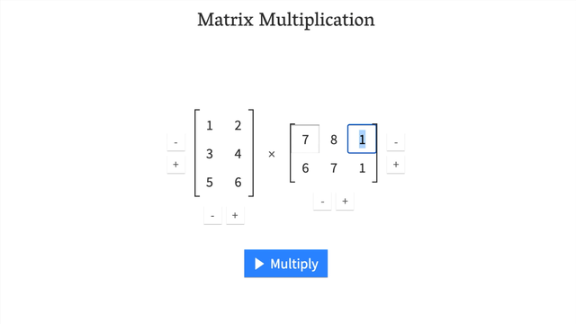

# PyTorch基础入门

## 简介

PyTorch是torch的python版本，是由Facebook开源的神经网络框架，专门针对 GPU 加速的深度神经网络（DNN）编程。Torch 是一个经典的对多维矩阵数据进行操作的张量（`tensor`） 库，在机器学习和其他数学密集型应用有广泛应用。与Tensorflow的静态计算图不同，PyTorch 的计算图是动态的，可以根据计算需要实时改变计算图。但由于Torch语言采用 Lua，导致在国内一直很小众，并逐渐被支持 Python 的 Tensorflow 抢走用户。作为经典机器学习库 Torch 的端口，PyTorch 为 Python 语言使用者提供了舒适的写代码选择。

> PyTorch非常的简洁，非常符合Python的风格。

## 安装

首先确保你已经安装了GPU环境，即Anaconda、CUDA和CUDNN。详细配置参考：[开发环境配置.md](..\AIGC\开发环境配置.md)

随后进入官网[PyTorch](https://pytorch.org/)，官网会自动显示符合你电脑配置的Pytorch版本，复制指令到conda环境中运行即可 


测试是否安装成功 

```python
import torch
print(torch.__version__) # pytorch版本
print(torch.version.cuda) # cuda版本
print(torch.cuda.is_available()) # 查看cuda是否可用
```

## Tensor

Tensor张量是Pytorch里最基本的数据结构。直观上来讲，它是一个多维矩阵，支持GPU加速，其基本数据类型如下

| 数据类型       | CPU tensor         | GPU tensor              |
| -------------- | ------------------ | ----------------------- |
| 8位无符号整型  | torch.ByteTensor   | torch.cuda.ByteTensor   |
| 8位有符号整型  | torch.CharTensor   | torch.cuda.CharTensor   |
| 16位有符号整型 | torch.ShortTensor  | torch.cuda.ShortTensor  |
| 32位有符号整型 | torch.IntTensor    | torch.cuda.IntTensor    |
| 64位有符号整型 | torch.LongTensor   | torch.cuda.LonfTensor   |
| 32位浮点型     | torch.FloatTensor  | torch.cuda.FloatTensor  |
| 64位浮点型     | torch.DoubleTensor | torch.cuda.DoubleTensor |
| 布尔类型       | torch.BoolTensor   | torch.cuda.BoolTensor   |

### Tensor简介

>  张量是现代机器学习和深度学习的核心数据结构，可以理解为多维数组的扩展。它们的作用是以数字方式表示数据。

#### 重要属性

**1. 维度 (Dimension)**

* 也称为阶 (order) 或轴 (axis) 的数量。
* 标量、向量、矩阵可以分别视为 0 维、1 维和 2 维张量。
* 例如，一个表示彩色图像的张量可以有 3 个维度：(高度, 宽度, 颜色通道)。

**2. 形状 (Shape)**

* 描述每个维度的大小，用一个整数元组表示。
* 例如，上述彩色图像的形状可以是 (128, 128, 3)，表示高度和宽度都是 128 像素，有 3 个颜色通道 (RGB)。

**3. 数据类型 (Data Type)**

*  张量中每个元素的数据类型，例如：
    * `float32`, `float64`: 用于表示浮点数。
    * `int32`, `int64`: 用于表示整数。
    * `bool`: 用于表示布尔值。
*  选择合适的数据类型可以节省内存和提高计算效率。

**4. 设备 (Device)**

*  张量可以存储在不同的设备上，例如 CPU 或 GPU。
*  在进行深度学习训练时，通常会将张量存储在 GPU 上以加快计算速度。

> **注意：**当你在 PyTorch 中遇到问题时，通常都与上述三个属性之一有关。
>
> **“我的张量是什么形状？它们是什么数据类型？它们存储在哪里？”** 

#### 表示数据

##### 销售数据

例如可以用张量表示一家牛排和杏仁酱商店的销售数据。


```python
sales = torch.tensor([[3, 6, 9], [2, 4, 5]])
```

这个张量有两个维度。

* 第一个维度 (大小为 2) 代表商品种类：牛排和杏仁酱。
* 第二个维度 (大小为 3) 代表星期：星期一、星期二、星期三。

通过访问张量中的特定元素，你可以轻松地获取任何一天任何一种商品的销售数据。 例如：

* `sales[0, 1]` 表示牛排在星期二的销量，也就是 6。
* `sales[1, 0]` 表示杏仁酱在星期一的销量，也就是 2。

```python
import torch

sales = torch.tensor([[3, 6, 9], [2, 4, 5]])

# 获取张量的纬度、形状、数据类型和设备
print("张量的维度:", sales.ndim)
print("张量的形状:", sales.shape)
print("张量的数据类型:", sales.dtype)
print("张量的设备:", sales.device)

for i, dim_size in enumerate(sales.shape):
    print(f"第 {i+1} 个维度的大小: {dim_size}")

print("牛排在星期二的销量:", sales[0, 1].item())
print("杏仁酱在星期一的销量:", sales[1, 0].item())
print("所有商品的销量:", sales.view(-1))
```

**💻 输出**

```sh
张量的维度: 2
张量的形状: torch.Size([2, 3])
张量的数据类型: torch.int64
张量的设备: cpu
第 1 个维度的大小: 2
第 2 个维度的大小: 3
牛排在星期二的销量: 6
杏仁酱在星期一的销量: 2
所有商品的销量: tensor([3, 6, 9, 2, 4, 5])
```

##### 图像

对于一个 2x2 大小的灰度图片，我们可以用 `shape` 为 `[1, 2, 2]` 的张量来表示。 其中：

* **第一个维度 (大小为 1):**  代表颜色通道，因为是灰度图像，所以只有一个通道。
* **第二个维度 (大小为 2):**  代表图像的高度 (行数)。
* **第三个维度 (大小为 2):**  代表图像的宽度 (列数)。

> 灰度图像: 每个像素点只有一个通道，其值代表该像素的灰度级，范围通常是 0 到 255。

那么可以用以下张量表示:

```python
import torch

image_tensor = torch.tensor([[[128, 200], [255, 50]]])

print("形状: ", image_tensor.shape)

print("位于 (0, 0) 位置的灰度值", image_tensor[0, 0, 0])
print("位于 (0, 1) 位置的灰度值", image_tensor[0, 0, 1])
print("位于 (1, 0) 位置的灰度值", image_tensor[0, 1, 0])
print("位于 (1, 1) 位置的灰度值", image_tensor[0, 1, 1])
```

**💻 输出**

```sh
形状:  torch.Size([1, 2, 2])
位于 (0, 0) 位置的灰度值 tensor(128)
位于 (0, 1) 位置的灰度值 tensor(200)
位于 (1, 0) 位置的灰度值 tensor(255)
位于 (1, 1) 位置的灰度值 tensor(50)
```

又例如，可以将彩色图像 （RGB 格式）表示为`shape`为 `[3, 224, 224]` 的张量，这意味着 `[colour_channels, height, width]`，因为图像有 3 个颜色通道（红、绿、蓝），高度为 224 像素，宽度为 224 像素。

用张量术语（用于描述张量的语言）来说，该张量将具有三个维度，分别对应于`colour_channels`，`height` 和`width`


#### 标量、向量、矩阵和张量之间的关系

| 名字     | 定义                                                       | 维度数量                                       | 说明                                                         |
| :------- | :--------------------------------------------------------- | :--------------------------------------------- | ------------------------------------------------------------ |
| **标量** | 单个数字                                                   | 0                                              | 最基本的数据类型，只有一个数值，没有方向，维度为 0。例如：温度、质量。 |
| **向量** | 带方向的数字（例如，带风向的风速），但也可以有许多其他数字 | 1                                              | 可以看作带方向的标量，具有一维数组的结构，维度为 1。例如：速度、力。 |
| **矩阵** | 二维数字数组                                               | 2                                              | 二维数组，维度为 2。例如：表格数据。                         |
| **张量** | N 维数字数组                                               | 可以是任何数字，0 维张量是标量，1 维张量是向量 | 最广义的概念，可以表示任意维度的数据，维度可以是 0、1、2 或更高。标量、向量、矩阵都可以看作是张量的特殊情况。 |


### Tensor创建


#### torch.Tensor() && torch.Tensor([])

二者的主要区别在于创建的对象的size和value不同

```python
import torch

print(torch.Tensor(2, 3))
print(torch.Tensor([2, 3]))
```

**💻 输出**

```sh
# torch.Tensor()
tensor([[2.6484e-23, 1.8189e-42, 0.0000e+00],
        [0.0000e+00, 0.0000e+00, 0.0000e+00]])
# torch.Tensor([])
tensor([2., 3.])
```

#### torch.randn && torch.randperm

生成的数据类型为浮点型，与`numpy.randn`生成随机数的方法类似，生成的浮点数的取值满足均值为0，方差为1的正态分布

`torch.randpern(n)`为创建一个n个整数，随机排列的Tensor

```python
import torch

print(torch.randn(2, 3))
print(torch.randperm([2, 3]))
```

**💻 输出**

```sh
# torch.randn
tensor([[ 1.5187,  0.0893, -1.5625],
        [-0.0972,  1.0379,  0.9264]])
# torch.randperm     
tensor([2, 1, 6, 5, 0, 7, 3, 4, 9, 8])
```

#### torch.range(begin，end，step)

生成一个一维的Tensor，三个参数分别的起始位置，终止位置和步长

```python
import torch

print(torch.range(1, 10, 2))
```

**💻 输出**

```sh
tensor([1., 3., 5., 7., 9.])
```

#### 指定numpy

很多时候我们需要创建指定的Tensor，而numpy就是一个很好的方式

```python
import numpy as np
import torch

print(torch.tensor(np.arange(15).reshape(3, 5)))
```

**💻 输出**

```sh
tensor([[ 0,  1,  2,  3,  4],
        [ 5,  6,  7,  8,  9],
        [10, 11, 12, 13, 14]], dtype=torch.int32)
```

### Tensor运算


| 函数                          | 作用                                                         |
| ----------------------------- | ------------------------------------------------------------ |
| `torch.abs(A)`                | 绝对值                                                       |
| `torch.add(A，B)`             | 相加，A和B既可以是Tensor也可以是标量                         |
| `torch.clamp(A，max，min)`    | 裁剪，A中的数据若小于min或大于max，则变成min或max，即保证范围在[min，max] |
| `torch.div(A，B)`             | 相除，A%B，A和B既可以是Tensor也可以是标量                    |
| `torch.mul(A，B)`             | 点乘，A*B，A和B既可以是Tensor也可以是标量                    |
| `torch.pow(A,n)`              | 求幂，A的n次方                                               |
| `torch.mm(A,B.T)`             | 矩阵叉乘，注意与torch.mul之间的区别                          |
| `torch.mv(A,B)`               | 矩阵与向量相乘，A是矩阵，B是向量，这里的B需不需要转置都是可以的 |
| `A.item()`                    | 将Tensor转化为基本数据类型，注意Tensor中只有一个元素的时候才可以使用，一般用于在Tensor中取出数值 |
| `A.numpy()`                   | 将Tensor转化为Numpy类型                                      |
| `A.size()`                    | 查看尺寸                                                     |
| `A.shape`                     | 查看形状                                                     |
| `A.dtype`                     | 查看数据类型                                                 |
| `A.view()`                    | 重构张量尺寸，类似于Numpy中的reshape                         |
| `A.transpose(0，1)`           | 行列交换                                                     |
| `A[1:]`<br/>`A[-1，-1]=100`   | 切面，类似Numpy中的切面                                      |
| `A.zero_()`                   | 归零化                                                       |
| `torch.stack((A，B)，sim=-1)` | 拼接，升维                                                   |
| `torch.diag(A)`               | 取A对角线元素形成一个一维向量                                |
| `torch.diag_embed(A)`         | 将一维向量放到对角线中，其余数值为0的Tensor                  |

####  A.add() && A.add_()

> 所有的带`_`符号的函数都会对原数据进行修改

```python
import torch

zeros = torch.zeros(size=(3, 4))
zeros.zero_()
print(zeros)
zeros.add(1)
print(zeros)
zeros.add_(1)
print(zeros)
```

**💻 输出**

```sh
# zeros.zero_()
tensor([[0., 0., 0., 0.],
        [0., 0., 0., 0.],
        [0., 0., 0., 0.]])
# zeros.add(1)
tensor([[0., 0., 0., 0.],
        [0., 0., 0., 0.],
        [0., 0., 0., 0.]])
# zeros.add_(1)
tensor([[1., 1., 1., 1.],
        [1., 1., 1., 1.],
        [1., 1., 1., 1.]])
```

#### torch.stack

stack为拼接函数，函数的第一个参数为需要拼接的Tensor，第二个参数为细分到哪个维度

```python
import torch

A = torch.IntTensor([[1, 2, 3], [4, 5, 6]])
B = torch.IntTensor([[7, 8, 9], [10, 11, 12]])
C1 = torch.stack((A, B), dim=0)  # or C1=torch.stack((A,B))
C2 = torch.stack((A, B), dim=1)
C3 = torch.stack((A, B), dim=2)
C4 = torch.stack((A, B), dim=-1)
print(C1, C2, C3, C4)
```

**💻 输出**

```sh
tensor([[[ 1,  2,  3],
         [ 4,  5,  6]],

        [[ 7,  8,  9],
         [10, 11, 12]]], dtype=torch.int32) tensor([[[ 1,  2,  3],
         [ 7,  8,  9]],

        [[ 4,  5,  6],
         [10, 11, 12]]], dtype=torch.int32) tensor([[[ 1,  7],
         [ 2,  8],
         [ 3,  9]],

        [[ 4, 10],
         [ 5, 11],
         [ 6, 12]]], dtype=torch.int32) tensor([[[ 1,  7],
         [ 2,  8],
         [ 3,  9]],

        [[ 4, 10],
         [ 5, 11],
         [ 6, 12]]], dtype=torch.int32)
```

> 这段代码演示了 PyTorch 中 `torch.stack` 函数的用法，它用于沿着新的维度拼接多个张量。`dim` 参数指定了新维度的位置。
>
> 你的解释总体上是正确的，但为了更清晰易懂，我将用更规范的语言重新解释一遍：
>
> **1. `dim=0`**
>
> ```python
> C1 = torch.stack((A, B), dim=0)
> ```
>
> - 在维度 0（最外层维度）上拼接 A 和 B。
> - 结果 `C1` 的形状为 `(2, 2, 3)`，其中第一个维度的大小为 2，表示拼接了两个张量。
> - 可以理解为将 A 和 B 叠放在一起，形成一个新的维度：
>     ```python
>     C1 = [
>         A,  # 形状 (2, 3)
>         B   # 形状 (2, 3)
>     ]
>     ```
>
> **2. `dim=1`**
>
> ```python
> C2 = torch.stack((A, B), dim=1)
> ```
>
> - 在维度 1（第二个维度）上拼接 A 和 B。
> - 结果 `C2` 的形状为 `(2, 2, 3)`。
> - 可以理解为将 A 和 B 中对应行的元素拼接在一起：
>     ```python
>     C2 = [
>         [A[0], B[0]],  # A 的第一行和 B 的第一行拼接
>         [A[1], B[1]]   # A 的第二行和 B 的第二行拼接
>     ]
>     ```
>
> **3. `dim=2`**
>
> ```python
> C3 = torch.stack((A, B), dim=2)
> ```
>
> - 在维度 2（第三个维度）上拼接 A 和 B。
> - 结果 `C3` 的形状为 `(2, 3, 2)`。
> - 可以理解为将 A 和 B 中对应位置的元素拼接在一起：
>     ```python
>     C3 = [
>         [[A[0][0], B[0][0]], [A[0][1], B[0][1]], [A[0][2], B[0][2]]],  # A 的第一行与 B 的第一行对应元素拼接
>         [[A[1][0], B[1][0]], [A[1][1], B[1][1]], [A[1][2], B[1][2]]]  # A 的第二行与 B 的第二行对应元素拼接
>     ]
>     ```
>
> **4. `dim=-1`**
>
> ```python
> C4 = torch.stack((A, B), dim=-1)
> ```
>
> - `dim=-1` 等价于 `dim=2`，表示在最后一个维度上拼接。
> - 结果 `C4` 与 `C3` 相同。
>
>
> 总而言之，`torch.stack` 函数提供了一种灵活的方式来拼接多个张量，`dim` 参数控制着新维度的插入位置。理解不同 `dim` 值对应的拼接方式对于正确使用该函数至关重要。

### 常见的错误

#### 形状错误

于深度学习的大部分工作是矩阵的乘法和运算，而矩阵对于可以组合的形状和大小有严格的规则，因此你在深度学习中会遇到的最常见的错误之一是形状不匹配。

```python
# 形状必须正确
tensor_A = torch.tensor([[1, 2],
                         [3, 4],
                         [5, 6]], dtype=torch.float32)

tensor_B = torch.tensor([[7, 10],
                         [8, 11], 
                         [9, 12]], dtype=torch.float32)

torch.matmul(tensor_A, tensor_B) # (这将报错)
```

**💻 输出**

```
RuntimeError: mat1 and mat2 shapes cannot be multiplied (3x2 and 3x2)
```

我们可以通过使 `tensor_A` 和 `tensor_B` 的内部维度匹配来进行矩阵乘法。

其中一种方法是使用转置（交换给定张量的维度）。

你可以在 PyTorch 中使用以下任一方法执行转置：

* `torch.transpose(input, dim0, dim1)` - 其中 `input` 是要转置的张量，`dim0` 和 `dim1` 是要交换的维度。
* `tensor.T` - 其中 `tensor` 是要转置的张量。

让我们试试后者。

```python
# 查看 tensor_A 和 tensor_B
print(tensor_A)
print(tensor_B)
```

**💻 输出**

```sh
tensor([[1., 2.],
        [3., 4.],
        [5., 6.]])
tensor([[ 7., 10.],
        [ 8., 11.],
        [ 9., 12.]])
```

```python
# 查看 tensor_A 和 tensor_B.T
print(tensor_A)
print(tensor_B.T)
```

**💻 输出**

```sh
tensor([[1., 2.],
        [3., 4.],
        [5., 6.]])
tensor([[ 7.,  8.,  9.],
        [10., 11., 12.]])
```

```python
# 当 tensor_B 被转置时，操作可以正常进行
print(f"原始形状: tensor_A = {tensor_A.shape}, tensor_B = {tensor_B.shape}\n")
print(f"新形状: tensor_A = {tensor_A.shape} (与上面相同), tensor_B.T = {tensor_B.T.shape}\n")
print(f"相乘: {tensor_A.shape} * {tensor_B.T.shape} <- 内部维度匹配\n")
print("输出:\n")
# 也可以使用torch.mm()，它是torch.matmul()的缩写
output = torch.matmul(tensor_A, tensor_B.T) # torch.mm 是 matmul 的缩写
print(output) 
print(f"\n输出形状: {output.shape}")
```

**💻 输出**

```sh
原始形状: tensor_A = torch.Size([3, 2]), tensor_B = torch.Size([3, 2])

新形状: tensor_A = torch.Size([3, 2]) (same as above), tensor_B.T = torch.Size([2, 3])

相乘: torch.Size([3, 2]) * torch.Size([2, 3]) <- inner dimensions match

输出:

tensor([[ 27.,  30.,  33.],
        [ 61.,  68.,  75.],
        [ 95., 106., 117.]])

输出形状: torch.Size([3, 3])
```

如果没有转置，矩阵乘法的规则就不能满足，我们会得到像上面那样的错误。

http://matrixmultiplication.xyz/ 是一个很好的网站，可以交互式地可视化矩阵乘法。它可以帮助你直观地理解矩阵乘法的过程，以及维度匹配的重要性。



> **注意：**像这样的矩阵乘法也被称为两个矩阵的**点积**。神经网络充满了矩阵乘法和点积。

#### 数据类型和设备错误

除了形状问题（张量形状不匹配）之外，你在 PyTorch 中会遇到的另外两个最常见的问题是数据类型和设备问题。

* 例如，一个张量是 `torch.float32`，而另一个是 `torch.float16`（PyTorch 通常喜欢张量格式相同）。
* 或者，你的一个张量在 CPU 上，而另一个在 GPU 上（PyTorch 喜欢在同一设备上进行张量之间的计算）。

## CUDA

CUDA是一种操作GPU的软件架构，Pytorch配合GPU环境这样模型的训练速度会非常的快

```python
import torch

# 测试GPU环境是否可使用
print(torch.__version__)  # pytorch版本
print(torch.version.cuda)  # cuda版本
print(torch.cuda.is_available())  # 查看cuda是否可用

# 使用GPU or CPU
device = torch.device("cuda" if torch.cuda.is_available() else "cpu")

A = torch.tensor([1, 2])
B = torch.tensor([3, 4])
# 判断某个对象是在什么环境中运行的
print(A.device)

# 将对象的环境设置为device环境
A = A.to(device)

# 将对象环境设置为COU
A.cpu().device

# 若一个没有环境的对象与另外一个有环境A对象进行交流,则环境全变成环境A
A + B.to(device)

# cuda环境下tensor不能直接转化为numpy类型,必须要先转化到cpu环境中
A.cpu().numpy()

# 创建CUDA型的tensor
A = torch.tensor([1, 2], device="cuda:0")
print(A.device)
```

**💻 输出**

```sh
2.3.1
12.1
True
cpu
cuda:0
```

## 其他技巧

### 自动微分

神经网络依赖反向传播求梯度来更新网络的参数，求梯度是个非常复杂的过程，在Pytorch中，提供了两种求梯度的方式，一个是backward，将求得的结果保存在自变量的grad属性中，另外一种方式是torch.autograd.grad

#### backward求导

使用backward进行求导。这里主要介绍了求导的两种对象，标量Tensor和非标量Tensor的求导。两者的主要区别是非标量Tensor求导的主要区别是加了一个gradient的Tensor，其尺寸与自变量X的尺寸一致。在求完导后，需要与gradient进行点积，所以只是一般的求导的话，设置的参数全部为1。最后还有一种使用标量的求导方式解决非标量求导，了解了解就好了。

```python
import torch

# 标量Tensor求导
# 求 f(x) = a*x**2 + b*x + c 的导数
x = torch.tensor(-2.0, requires_grad=True)
a = torch.tensor(1.0)
b = torch.tensor(2.0)
c = torch.tensor(3.0)
y = a * torch.pow(x, 2) + b * x + c
y.backward()  # backward求得的梯度会存储在自变量x的grad属性中
dy_dx = x.grad
print(dy_dx)


# 非标量Tensor求导
# 求 f(x) = a*x**2 + b*x + c 的导数
x = torch.tensor([[-2.0, -1.0], [0.0, 1.0]], requires_grad=True)
a = torch.tensor(1.0)
b = torch.tensor(2.0)
c = torch.tensor(3.0)
gradient = torch.tensor([[1.0, 1.0], [1.0, 1.0]])
y = a * torch.pow(x, 2) + b * x + c
y.backward(gradient=gradient)
dy_dx = x.grad
print(dy_dx)


# 使用标量求导方式解决非标量求导
# 求 f(x) = a*x**2 + b*x + c 的导数
x = torch.tensor([[-2.0, -1.0], [0.0, 1.0]], requires_grad=True)
a = torch.tensor(1.0)
b = torch.tensor(2.0)
c = torch.tensor(3.0)
gradient = torch.tensor([[1.0, 1.0], [1.0, 1.0]])
y = a * torch.pow(x, 2) + b * x + c
z = torch.sum(y * gradient)
z.backward()
dy_dx = x.grad
print(dy_dx)
```

**💻 输出**

```sh
tensor(-2.)
tensor([[-2.,  0.],
        [ 2.,  4.]])
tensor([[-2.,  0.],
        [ 2.,  4.]])
```

#### autograd.grad求导

```python
import torch

# 单个自变量求导
# 求 f(x) = a*x**4 + b*x + c 的导数
x = torch.tensor(1.0, requires_grad=True)
a = torch.tensor(1.0)
b = torch.tensor(2.0)
c = torch.tensor(3.0)
y = a * torch.pow(x, 4) + b * x + c
# create_graph设置为True,允许创建更高阶级的导数
# 求一阶导
dy_dx = torch.autograd.grad(y, x, create_graph=True)[0]
# 求二阶导
dy2_dx2 = torch.autograd.grad(dy_dx, x, create_graph=True)[0]
# 求三阶导
dy3_dx3 = torch.autograd.grad(dy2_dx2, x)[0]
print(dy_dx.data, dy2_dx2.data, dy3_dx3)


# 多个自变量求偏导
x1 = torch.tensor(1.0, requires_grad=True)
x2 = torch.tensor(2.0, requires_grad=True)
y1 = x1 * x2
y2 = x1 + x2
# 只有一个因变量,正常求偏导
dy1_dx1, dy1_dx2 = torch.autograd.grad(outputs=y1, inputs=[x1, x2], retain_graph=True)
print(dy1_dx1, dy1_dx2)
# 若有多个因变量，则对于每个因变量,会将求偏导的结果加起来
dy1_dx, dy2_dx = torch.autograd.grad(outputs=[y1, y2], inputs=[x1, x2])
dy1_dx, dy2_dx
print(dy1_dx, dy2_dx)
```

**💻 输出**

```sh
tensor(6.) tensor(12.) tensor(24.)
tensor(2.) tensor(1.)
tensor(3.) tensor(2.)
```

#### 求最小值

使用自动微分机制配套使用SGD随机梯度下降来求最小值

```python
import torch

# f(x) = a*x**2 + b*x + c的最小值
x = torch.tensor(0.0, requires_grad=True)  # x需要被求导
a = torch.tensor(1.0)
b = torch.tensor(-2.0)
c = torch.tensor(1.0)
optimizer = torch.optim.SGD(params=[x], lr=0.01)  # SGD为随机梯度下降
print(optimizer)


def f(x):
    result = a * torch.pow(x, 2) + b * x + c
    return result


for i in range(500):
    optimizer.zero_grad()  # 将模型的参数初始化为0
    y = f(x)
    y.backward()  # 反向传播计算梯度
    optimizer.step()  # 更新所有的参数

print("y=", y.data, ";", "x=", x.data)
```

**💻 输出**

```sh
SGD (
Parameter Group 0
    dampening: 0
    differentiable: False
    foreach: None
    fused: None
    lr: 0.01
    maximize: False
    momentum: 0
    nesterov: False
    weight_decay: 0
)
y= tensor(0.) ; x= tensor(1.0000)
```

### Pytorch层次结构

Pytorch中一共有5个不同的层次结构，分别为硬件层、内核层、低阶API、中阶API和高阶API（torchkeras）

| 硬件层  | 底层的计算资源包括CPU和GPU                                   |
| ------- | ------------------------------------------------------------ |
| 内核层  | 使用C++来实现                                                |
| 低阶API | Python实现的操作符，提供了封装C++内核的低级API指令，主要包括各种张量操作算 子、自动微分、变量管理. 如torch.tensor,torch.cat,torch.autograd.grad,nn.Module.&nbsp; |
| 中阶API | Python实现的模型组件，对低级API进行了函数封装，主要包括各种模型层，损失函数，优化器，数据管道等等。 如 torch.nn.Linear,torch.nn.BCE,torch.optim.Adam,torch.utils.data.DataLoader.&nbsp; |
| 高阶API | Python实现的模型接口。Pytorch没有官方的高阶API。为了便于训练模型，我们仿照 keras中的模型接口，使用了不到300行代码，封装了Pytorch的高阶模型接口 torchkeras.Model |

## 数据

Pytorch主要通过`Dataset`和`DataLoader`进行构建数据管道

### Dataset and DataLoader

| 类型       | 说明                                                         |
| ---------- | ------------------------------------------------------------ |
| Dataset    | 一个数据集抽象类，所有自定义的Dataset都需要继承它，并且重写__getitem__()或__get_sample__()这个类方法 |
| DataLoader | 一个可迭代的数据装载器。在训练的时候，每一个for循环迭代，就从DataLoader中获取一个batch_sieze大小的数据。 |

### 数据读取与预处理

DataLoader的参数如下

```python
DataLoader(
    dataset,
    batch_size=1,
    shuffle=False,
    sampler=None,
    batch_sampler=None,
    num_workers=0,
    collate_fn=None,
    pin_memory=False,
    drop_last=False,
    timeout=0,
    worker_init_fn=None,
    multiprocessing_context=None,
)
```

在实践中，主要修改的参数以下标为粗体

| 参数              | 说明                                                         |
| ----------------- | ------------------------------------------------------------ |
| **`dataset`**     | 数据集，决定数据从哪里读取，以及如何读取                     |
| **`batch_size`**  | 批次大小，默认为1                                            |
| **`shuffle`**     | 每个epoch是否乱序                                            |
| sampler           | 样本采样函数，一般无需设置                                   |
| batch_sampler     | 批次采样函数，一般无需设置                                   |
| **`num_workers`** | 使用多进程读取数据，设置的进程数                             |
| collate_fn        | 整理一个批次数据的函数                                       |
| pin_memory        | 是否设置为锁业内存。默认为False，锁业内存不会使用虚拟内存(硬盘)，从锁 业内存拷贝到GPU上速度会更快 |
| **`drop_last`**   | 是否丢弃最后一个样本数量不足batch_size批次数据               |
| timeout           | 加载一个数据批次的最长等待时间，一般无需设置                 |
| worker_init_fn    | 每个worker中dataset的初始化函数，常用于 IterableDataset。一般不使用 |

顺带介绍一下Epoch、Iteration、Batchsize之间的关系

| 类型      | 说明                                           |
| --------- | ---------------------------------------------- |
| Epoch     | 所有的样本数据都输入到模型中，称为一个epoch    |
| Iteration | 一个Batch的样本输入到模型中，称为一个Iteration |
| Batchsize | 一个批次的大小，一个Epoch=Batchsize*Iteration  |

先看数据读取的主要流程


1. 从DataLoader开始

2. 进入DataLoaderIter，判断单线程还是多线程

3. 进入Sampler进行采样，获得一批一批的索引，这些索引告诉我们需要读取哪些数据、

4. 进入DatasetFetcher，依据索引读取数据

5. Dataset告诉我们数据的地址

6. 自定义的Dataset中会重写__getietm__方法，针对不同的数据来进行定制化的数据读取

7. 到这里就获取的数据的Text和Label

8. 进入collate_fn将之前获取的个体数据进行组合成batch

9. 一个一个batch组成Batch Data

再来看一个具体的代码

```python
import torch
from torch.utils.data import DataLoader
from torch.utils.data.dataset import TensorDataset

if __name__ == "__main__":
    # 自构建数据集
    dataset = TensorDataset(torch.arange(1, 40))
    dl = DataLoader(dataset, batch_size=10, shuffle=True, num_workers=1, drop_last=True)
    # 数据输出
    for batch in dl:
        print(batch)
```

> 在Windows上运行一定要添加 `if __name__ == '__main__':` 保护
>
> DataLoader 可以利用多进程 (num_workers > 0) 来加速数据加载。Windows 使用 "spawn" 机制，它会为每个工作进程创建一个全新的 Python 解释器。这意味着每个工作进程都需要重新导入你的脚本，并可能重新执行代码，这就会导致冲突和错误。
>
> 添加 `if __name__ == '__main__':` 保护，它确保创建新进程的代码只在脚本直接运行时执行，而不是在它被作为模块导入时执行。

**💻 输出**

```sh
[tensor([19, 32, 23, 34, 15,  7, 31, 17,  5, 18])]
[tensor([36, 26, 13, 28,  6, 29, 10, 38, 27, 39])]
[tensor([ 9, 35,  2, 33,  3, 11,  8, 14,  1, 20])]
```

因为自定义的数据集只有39条，最后一个batch的数据量小于10，被舍弃掉了

##  Pytorch工具

基于Pytorch已经产生了一些封装完备的工具，而缺点也很明显，数据处理不是很灵活，对于初学者来说，多写代码比较踏实，因此作者不太推荐使用这些方法

| 工具        | 说明         |
| ----------- | ------------ |
| torchvision | 图像视频处理 |
| torchaudio  | 音频处理     |
| torchtext   | 自然语言处理 |

## torch.nn

torch.nn是神经网络工具箱，该工具箱建立于Autograd(主要有自动求导和梯度反向传播功能)，提供了网络搭建的模组，优化器等一系列功能。

### 神经网络层级

想象一下，你要训练一个模型来识别照片中的不同品种的狗🐶。

**1. 卷积层 (Convolutional Layer):** 就像你的眼睛👀，负责提取图像的特征。

* **类比:** 想象你观察一只狗，你会注意到它的毛发颜色、耳朵形状、尾巴长度等特征。卷积层就像许多个小放大镜🔍，每个放大镜关注图像的不同部分，提取像边缘、纹理、形状等基本特征。

**2. 池化层 (Pooling Layer):** 就像你的短期记忆🧠，负责简化信息，保留关键特征。

* **类比:** 当你观察完狗之后，你不会记住它身上的每一根毛发，而是记住一些关键特征，比如“毛茸茸的”、“长耳朵”。池化层的作用就是压缩信息，保留最重要的特征，减少计算量，并提高模型的鲁棒性。

**3. 全连接层 (Fully Connected Layer):** 就像你的大脑🧠，负责综合所有信息，做出最终判断。

* **类比:** 当你综合了所有观察到的特征后，你的大脑会根据这些信息判断这只狗是什么品种。全连接层将前面提取的特征连接起来，并根据学习到的权重，对图像进行分类，最终输出“金毛寻回犬”或“德国牧羊犬”等结果。

> **总结:**
>
> * **卷积层:** 提取特征 (像眼睛)
> * **池化层:** 简化信息 (像短期记忆)
> * **全连接层:** 综合判断 (像大脑)

当然，除了卷积层、池化层和全连接层，神经网络中还有其他重要的层级，让我们也用类比的方式来理解它们：

**1. 激活函数层 (Activation Function Layer):**  就像神经元的兴奋程度 ️，决定信息是否传递。

* **类比:**  想象你看到一只非常可爱的狗狗 ，你会感到兴奋 ，并把这种兴奋传递给朋友。激活函数就像一个开关，它根据输入的信息强度决定是否激活神经元，并将信息传递给下一层。常见的激活函数有ReLU (像一个单向阀，只允许正值通过) 和Sigmoid (像一个平滑的开关，将信息压缩到0到1之间)。

**2. 归一化层 (Normalization Layer):** 就像整理信息的助手 ，使数据更易于学习。

* **类比:**  想象你要比较两只狗的大小，如果一只用厘米 测量，另一只用英寸 测量，就很难比较。归一化层的作用就是将数据统一到相同的尺度，例如将所有数据缩放到0到1之间，这样模型就能更容易地学习数据的特征。

**3. Dropout层:** 就像模拟考试中的随机缺席学生 ，防止模型过度依赖某些特征。

* **类比:**  如果每次考试都有一部分学生随机缺席，那么每个学生就都需要更加努力学习，才能在考试中取得好成绩。Dropout层会在训练过程中随机“丢弃”一些神经元，迫使模型学习更鲁棒的特征，防止过拟合。

> **总结:**
>
> * **激活函数层:**  控制信息传递 (像神经元的兴奋程度)
> * **归一化层:**  统一数据尺度 (像整理信息的助手)
> * **Dropout层:**  防止过拟合 (像模拟考试中的随机缺席)

###  优化和微调神经网络

优化和微调神经网络就像训练一只聪明的狗狗，需要关注不同的方面。我们通常会在以下层级进行优化和微调：

**1. 全连接层 (Fully Connected Layers):** 

* **作用:**  这是模型进行最终决策的地方，就像狗狗的大脑 ，需要根据特征做出判断。
* **优化/微调:**  
  * **调整神经元数量:**  更多神经元可能增加模型的学习能力，但也可能导致过拟合。
  * **修改激活函数:**  不同的激活函数适合不同的任务，例如ReLU适合图像识别，Sigmoid适合二分类问题。

**2. 卷积层和池化层 (Convolutional & Pooling Layers):**

* **作用:**  这是模型提取特征的地方，就像狗狗的眼睛 和短期记忆 ，需要捕捉和记忆关键信息。
* **优化/微调:**  
  * **调整卷积核大小和数量:**  更大的卷积核可以捕捉更复杂的特征，但计算量也更大。
  * **修改池化类型和步长:**  不同的池化方式(最大池化、平均池化)和步长会影响信息的压缩程度。
  * **使用预训练模型:**  利用在大型数据集上训练好的模型，可以快速提升模型性能，尤其是在数据量较小的情况下。

**3. 其他层级:**

* **学习率 (Learning Rate):**  控制模型学习的速度，就像训练狗狗时的奖励机制，过快或过慢都会影响学习效果。
* **正则化 (Regularization):**  防止模型过拟合，就像训练狗狗时要避免过度溺爱，否则它可能只会在你面前表现良好。
* **优化器 (Optimizer):**  选择合适的优化算法，例如Adam、SGD等，可以帮助模型更快更好地找到最优解。

**微调策略:**

* **冻结部分层级:**  对于预训练模型，可以冻结前面几层(卷积层和池化层)，只训练后面的全连接层，这样可以节省训练时间，并利用预训练模型提取的特征。
* **逐步解冻:**  随着训练的进行，可以逐步解冻更多层级，进行更精细的调整。

> **总结:**
>
> 优化和微调神经网络需要根据具体任务、数据集和模型结构进行调整。通过调整不同的层级和参数，可以找到最适合当前任务的模型结构和参数配置，就像训练狗狗一样，需要耐心和技巧才能培养出最棒的伙伴！ 

让我们用一个图像分类的例子来说明微调：

**任务：** 假设我们要训练一个模型来识别不同品种的猫🐱，但我们只有少量的数据集。

**步骤：**

1. **选择预训练模型：**  我们可以选择一个已经在大型图像数据集（例如ImageNet）上训练好的模型，例如ResNet50。这个模型已经学习了丰富的图像特征，可以作为我们任务的良好起点。

2. **冻结部分层级：**  我们将冻结ResNet50的大部分层级，例如卷积层和池化层，只保留最后的全连接层进行训练。这是因为前面的层级已经学习了通用的图像特征，而最后的全连接层负责根据这些特征进行分类。

3. **替换输出层：**  由于ImageNet数据集包含1000个类别，而我们的任务只有几个猫的品种，因此我们需要将ResNet50最后的全连接层替换为一个新的全连接层，其输出神经元数量与猫的品种数量相匹配。

4. **微调训练：**  使用我们自己的猫🐱数据集，对模型进行训练。由于大部分层级被冻结，我们只需要训练最后的全连接层和一些解冻的层级，这将大大减少训练时间和所需的计算资源。

**代码示例 (PyTorch):**

```python
import torchvision.models as models
from torch import nn

# 加载预训练的ResNet50模型
model = models.resnet50(pretrained=True)

# 冻结所有层级
for param in model.parameters():
    param.requires_grad = False

# 替换最后的全连接层
num_classes = 5  # 假设有5个猫的品种
model.fc = nn.Linear(model.fc.in_features, num_classes)

# 解冻部分层级 (可选)
for param in model.layer4.parameters():
    param.requires_grad = True

# 定义优化器和损失函数
optimizer = torch.optim.Adam(model.parameters(), lr=0.001)
criterion = nn.CrossEntropyLoss()

# 训练模型
# ...
```

> **总结：**
>
> 通过微调预训练模型，我们可以利用其学习到的通用特征，快速构建针对特定任务的模型，即使在数据量有限的情况下也能取得不错的效果。

### 搭建神经网络模型流程

搭建一个神经网络模型整个流程是怎么样的呢？

1. 数据读取
2. 定义模型
3. 定义损失函数和优化器
4. 模型训练
5. 获取训练结果

### 糖尿病预测

我们拿一个最简单的FNN网络来对经典数据集diabetes糖尿病数据集来进行分类预测，模型性能指标直接采用Loss。

> 糖尿病数据集由768个数据点组成，各有9个特征。输出表格的列表字段；9个特征（怀孕次数，血糖，血压，皮脂厚度，胰岛素，BMI身体质量指数，糖尿病遗传函数，年龄，结果）。在768个数据点中，500个被标记为0，268个标记为1。将要预测的特征，0意味着未患糖尿病，1意味着患有糖尿病。
> | Pregnancies | Glucose | BloodPressure | SkinThickness | Insulin | BMI  | DiabetesPedigreeFunction | Age  | Outcome |
> | ----------- | ------- | ------------- | ------------- | ------- | ---- | ------------------------ | ---- | ------- |
> | 6           | 148     | 72            | 35            | 0       | 33.6 | 0.627                    | 50   | 1       |
> | 1           | 85      | 66            | 29            | 0       | 26.6 | 0.351                    | 31   | 0       |
> | 8           | 183     | 64            | 0             | 0       | 23.3 | 0.672                    | 32   | 1       |
> | 1           | 89      | 66            | 23            | 94      | 28.1 | 0.167                    | 21   | 0       |
> | 0           | 137     | 40            | 35            | 168     | 43.1 | 2.288                    | 33   | 1       |
> | 5           | 116     | 74            | 0             | 0       | 25.6 | 0.201                    | 30   | 0       |
> | 3           | 78      | 50            | 32            | 88      | 31   | 0.248                    | 26   | 1       |

**为什么使用 FNN？**

* FNN (Feedforward Neural Network) 是一种简单的神经网络结构，适合处理结构化数据，例如表格数据。
* 尿病数据集包含 8 个特征，属于结构化数据，因此使用 FNN 比较合适。

**定义模型**

* 模型使用了 4 层全连接层 (Linear)，每层之间使用 Sigmoid 激活函数。
* 隐藏层的节点数逐渐减少，形成一个漏斗形的结构，可以提取数据的高级特征。
* 输出层使用 Sigmoid 激活函数，将输出值映射到 0 到 1 之间，表示预测的概率。

```python
import numpy as np
import torch
import matplotlib.pyplot as plt
from torch.utils.data import Dataset, DataLoader

# 1. 数据准备
class DiabetesDateset(Dataset):
    """
    自定义糖尿病数据集类，继承自 torch.utils.data.Dataset
    """
    def __init__(self, filepath):
        """
        初始化数据集

        Args:
            filepath (str): 数据集文件路径
        """
        # 加载数据
        xy = np.loadtxt(filepath, delimiter=",", dtype=np.float32, encoding="utf-8", skiprows=1)
        # 数据集大小
        self.len = xy.shape[0]
        # 特征数据
        self.x_data = torch.from_numpy(xy[:, :-1])
        # 标签数据
        self.y_data = torch.from_numpy(xy[:, [-1]])

    def __getitem__(self, index):
        """
        根据索引获取数据

        Args:
            index (int): 数据索引

        Returns:
            tuple: 特征数据, 标签数据
        """
        return self.x_data[index], self.y_data[index]

    def __len__(self):
        """
        获取数据集大小

        Returns:
            int: 数据集大小
        """
        return self.len


# 实例化数据集
dataset = DiabetesDateset("./data/diabetes.csv")
# 创建数据加载器
train_loader = DataLoader(
    dataset=dataset,  # 使用的数据集
    batch_size=32,  # 每个批次的大小
    shuffle=True,  # 是否打乱数据
    num_workers=2,  # 加载数据的线程数
    drop_last=True  # 是否丢弃最后一个不完整的批次
)

# 2. 模型定义
class FNNModel(torch.nn.Module):
    """
    定义前馈神经网络模型
    """
    def __init__(self):
        super(FNNModel, self).__init__()
        # 定义线性层
        self.linear1 = torch.nn.Linear(8, 6)  # 输入层 8 个特征，输出 6 个特征
        self.linear2 = torch.nn.Linear(6, 4)  # 隐藏层，输入 6 个特征，输出 4 个特征
        self.linear3 = torch.nn.Linear(4, 2)  # 隐藏层，输入 4 个特征，输出 2 个特征
        self.linear4 = torch.nn.Linear(2, 1)  # 输出层，输入 2 个特征，输出 1 个特征
        # 定义激活函数
        self.sigmoid = torch.nn.Sigmoid()

    def forward(self, x):
        """
        定义前向传播过程

        Args:
            x (tensor): 输入数据

        Returns:
            tensor: 模型预测结果
        """
        x = self.sigmoid(self.linear1(x))
        x = self.sigmoid(self.linear2(x))
        x = self.sigmoid(self.linear3(x))
        x = self.sigmoid(self.linear4(x))
        return x


# 实例化模型
model = FNNModel()
# 将模型移动到 GPU
device = torch.device("cuda:0" if torch.cuda.is_available() else "cpu")
model.to(device)

# 3. 定义损失函数和优化器
criterion = torch.nn.BCELoss(reduction="mean")  # 使用二元交叉熵损失函数
optimizer = torch.optim.SGD(model.parameters(), lr=0.01)  # 使用随机梯度下降优化器

# 4. 训练模型
epoch_list = []
loss_list = []

if __name__ == "__main__":
    for epoch in range(100):  # 训练 100 个 epoch
        loss_one_epoch = 0
        for i, data in enumerate(train_loader, 0):  # 遍历训练集
            inputs, labels = data
            inputs, labels = inputs.to(device), labels.to(device)  # 将数据移动到 GPU
            y_pred = model(inputs)  # 模型预测
            loss = criterion(y_pred, labels)  # 计算损失
            loss_one_epoch += loss.item()  # 累加损失

            optimizer.zero_grad()  # 清零梯度
            loss.backward()  # 反向传播
            optimizer.step()  # 更新参数
        loss_list.append(loss_one_epoch / 23)  # 记录每个 epoch 的平均损失
        epoch_list.append(epoch)
        print("Epoch[{}/{}],loss:{:.6f}".format(epoch + 1, 100, loss_one_epoch / 23))

    # 5. 绘制损失曲线
    plt.plot(epoch_list, loss_list)
    plt.xlabel("epoch")
    plt.ylabel("loss")
    plt.show()
```

这段代码使用 PyTorch 构建了一个简单的前馈神经网络 (FNN) 来预测糖尿病。

**1. 数据准备:**

- **DiabetesDateset 类:** 自定义数据集类，用于加载和处理糖尿病数据。
    - `__init__`：从 CSV 文件加载数据，跳过第一行标题行，并将数据转换为 PyTorch 张量。
    - `__getitem__`：根据索引返回对应的输入特征和标签。
    - `__len__`：返回数据集的大小。
- **DataLoader:** 创建数据加载器，用于迭代训练数据。
    - `batch_size=32`：每个批次包含 32 个样本。
    - `shuffle=True`：每个 epoch 之前打乱数据顺序。
    - `num_workers=2`：使用 2 个工作进程加载数据，加速训练。
    - `drop_last=True`：如果最后一个批次的数据量不足 `batch_size`，则丢弃该批次。

**2. 模型定义:**

- **FNNModel 类:** 定义了一个四层全连接神经网络。
    - `__init__`：初始化网络层，包括四个线性层和一个 Sigmoid 激活函数。
    - `forward`：定义前向传播过程，数据依次经过线性层和 Sigmoid 激活函数。

**3. 损失函数和优化器:**

- **criterion:** 使用二元交叉熵损失函数 (BCELoss) 计算预测值和真实标签之间的差异。
- **optimizer:** 使用随机梯度下降 (SGD) 优化器更新模型参数。

**4. 训练过程:**

- 迭代训练 100 个 epoch。
- 每个 epoch 中，遍历训练数据，计算损失函数，进行反向传播，更新模型参数。
- 记录每个 epoch 的平均损失值。

**5. 绘制损失函数曲线:**

- 使用 Matplotlib 绘制损失函数曲线，横轴为 epoch，纵轴为损失值。


**损失函数曲线解释:**

- 横轴表示 epoch，表示训练过程中遍历完整数据集的次数。
- 纵轴表示损失值，表示模型预测值与真实标签之间的差异。
- 理想情况下，随着训练的进行，损失值应该逐渐下降，最终趋于稳定。

### 模型调优

> **模型调优**是指在机器学习模型训练过程中，通过调整模型的超参数（Hyperparameter）来提高模型性能的过程。
>
> **超参数**是控制模型结构和训练过程的参数，与模型参数（Model Parameter，例如神经网络中的权重和偏置）不同，超参数是在训练之前设置的，不会在训练过程中被学习算法更新。

以上代码定义的糖尿病预测模型有以下特点：

* **特征提取**： 每个 Linear 层后都跟着一个非线性激活函数（这里是 Sigmoid），这样的组合可以学习到数据中越来越复杂的非线性关系。4 层 Linear 层能够提供足够的深度来学习糖尿病数据中的潜在模式。
* **逐步降维**： 从 8 维输入特征逐步降维到 1 维输出，可以看作是逐步提取关键信息的过程。每一层都起到信息过滤和抽象的作用，最终得到对预测结果最有用的特征表示。

以上模型为例，我们可以通过以下几个方面进行模型调优：

**1. 调整网络结构：**

* **层数：**  
    * 初始模型：4 层 Linear 层
    * 调整：尝试 3 层、2 层甚至 1 层 Linear 层，观察模型在验证集上的性能变化。
* **每层神经元数量：** 
    * 初始模型：(8, 6, 4, 2, 1)
    * 调整：尝试不同的隐藏层神经元数量，例如 (16, 8, 4, 1)、(4, 4, 4, 1) 等等，甚至可以尝试使用相同的隐藏层大小，例如 (8, 8, 8, 1)。

**2. 调整激活函数：**

* **初始模型：** Sigmoid
* **调整：**  尝试使用其他激活函数，例如 ReLU、Tanh 等，比较它们对模型性能的影响。

**3. 调整优化器：**

* **初始模型：** SGD 
* **调整：** 尝试使用其他优化器，例如 Adam、RMSprop 等，观察它们对模型收敛速度和性能的影响。

**4. 调整学习率：**

* **初始模型：** 0.01
* **调整：** 尝试不同的学习率，例如 0.1、0.001 等，找到一个合适的学习率，既能保证模型收敛，又能达到较快的收敛速度。

**5. 添加正则化方法：**

* **初始模型：** 无
* **调整：**  为了防止过拟合，可以尝试添加 Dropout 层，或者在损失函数中添加 L1、L2 正则化项。

**模型调优的过程通常是一个迭代的过程：**

1. 选择一组初始超参数。
2. 训练模型并评估其在验证集上的性能。
3. 根据评估结果调整超参数。
4. 重复步骤 2-3，直到找到一组能够使模型性能达到最优的超参数。

**一些常用的模型调优技巧：**

* **网格搜索 (Grid Search)：**  对每个超参数设定一组候选值，然后穷举所有可能的组合，找到性能最好的组合。
* **随机搜索 (Random Search)：**  在超参数空间中随机采样，评估每个样本的性能，最终选择性能最好的样本。
* **贝叶斯优化 (Bayesian Optimization)：**  利用先验知识和历史评估结果，构建一个概率模型来预测不同超参数组合的性能，并选择最有可能提升性能的组合进行评估。

> **总结：**
>
> 模型调优是机器学习中非常重要的一环，通过不断地尝试和调整，才能找到最适合特定任务的模型结构和超参数，从而最大限度地发挥模型的性能。 

