# Python与API

## 什么是 API？

API (Application Programming Interface) 就像一座桥梁，连接不同的软件系统，让它们可以互相交流和共享数据。想象一下，你正在使用手机上的天气应用，这个应用本身并不具备预测天气的能力，而是通过调用气象局提供的 API 获取天气数据，并将结果展示给你。

**RESTful API** 是一种基于 HTTP 协议的 API 设计风格，它利用 HTTP 的各种方法（GET、POST、PUT、DELETE 等）来实现对资源的操作。RESTful API 具有简单易用、轻量级、可缓存等优点，因此在 Web 应用开发中得到广泛应用。

## RESTful API 简介

### 什么是 RESTful API

RESTful API（Representational State Transfer API）是一种基于 REST 架构风格的应用程序编程接口。它通过 HTTP 协议进行通信，允许不同系统之间以标准化的方式交换数据。RESTful API 通常用于 Web 服务，支持多种数据格式，如 JSON 和 XML。


### REST 的基本原则

REST 的设计理念基于以下几个基本原则：

- **无状态性（Stateless）**：每个请求都包含了处理该请求所需的所有信息，服务器不存储客户端的状态。这样可以提高可伸缩性和可靠性。
  
- **客户端-服务器架构（Client-Server）**：客户端和服务器之间的分离使得两者可以独立发展。客户端负责用户界面和用户体验，而服务器则处理数据存储和业务逻辑。

- **统一接口（Uniform Interface）**：通过统一的接口简化系统的架构，使得不同的客户端可以以相同的方式与服务器进行交互。RESTful API 通常使用标准的 HTTP 方法（如 GET、POST、PUT、DELETE）来执行操作。

- **资源导向（Resource-Oriented）**：在 REST 中，所有的内容都被视为资源，每个资源都有一个唯一的 URI（统一资源标识符）。客户端通过 URI 访问和操作这些资源。

- **可缓存性（Cacheable）**：响应可以被缓存，以提高性能和减少服务器负担。服务器可以指示响应是否可缓存及其缓存的有效期。

### HTTP 方法

RESTful API 使用 HTTP 方法来定义对资源的操作：

- **GET**：获取资源。
- **POST**：创建新资源。
- **PUT**：更新现有资源。
- **DELETE**：删除资源。

```sh
GET   /device-management/devices : Get all devices
POST   /device-management/devices : Create a new device
GET   /device-management/devices/{id} : Get the device information identified by "id"
PUT   /device-management/devices/{id} : Update the device information identified by "id"
DELETE  /device-management/devices/{id} : Delete device by "id"
```

### 数据格式

RESTful API 通常支持多种数据格式，最常见的是 JSON（JavaScript Object Notation）和 XML（eXtensible Markup Language）。JSON 由于其轻量级和易于解析的特性，已成为 RESTful API 的首选格式。

### 版本控制

为了保证 API 的向后兼容性，通常会在 API 的 URL 中包含版本号。例如：`/api/v1/users`。这样可以在不影响现有用户的情况下，推出新的功能和改进。

### 安全性

RESTful API 需要考虑安全性，常用的安全措施包括：

- **身份验证**：使用 OAuth、JWT（JSON Web Token）等机制进行用户身份验证。
- **加密**：通过 HTTPS 加密数据传输，保护数据的安全性。

### 总结

RESTful API 是一种灵活、高效的 Web 服务设计风格，广泛应用于现代应用程序的开发中。通过遵循 REST 的原则和最佳实践，开发者可以创建可扩展、易于维护和高效的 API，为客户端提供良好的用户体验。

## Apifox管理调试 API

### 简介

**Apifox** 是一款功能强大的 API 管理工具，它可以帮助你轻松地：

* **调试 API：** 发送请求、查看响应、分析数据，Apifox 提供了友好的界面和丰富的功能，让你可以方便地调试 API。
* **生成 API 文档：**  自动生成清晰易懂的 API 文档，方便团队协作和沟通。
* **Mock 数据：**  在开发过程中模拟 API 返回数据，提高开发效率。

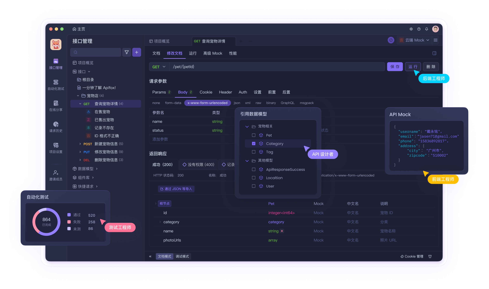

**下载地址**：[Apifox - API 文档、调试、Mock、测试一体化协作平台。拥有接口文档管理、接口调试、Mock、自动化测试等功能，接口开发、测试、联调效率，提升 10 倍。最好用的接口文档管理工具，接口自动化测试工具。](https://apifox.com/)

### 调试ChatGPT

### 添加API

首先，你需要在 Apifox 中添加 ChatGPT 的 API。在 Apifox 中创建一个新的项目，然后添加一个新的 API，填写 API 的相关信息，例如：

* **请求方法:** POST
* **请求 URL:** https://api.openai.com/v1/chat/completions （我使用的是国内的兼容服务提供商）
* **请求头:**
  * Authorization: Bearer ==YOUR_API_KEY==  (将 YOUR_API_KEY 替换为你的 ChatGPT API 密钥)
  * Content-Type: application/json
* **请求体:**

```json
{
    "model": "gpt-4o-mini",
    "messages": [
        {
            "role": "user",
            "content": "请将这句话翻译成英文：今天天气真好"
        }
    ],
    "temperature": 0.7
}
```

配置参数

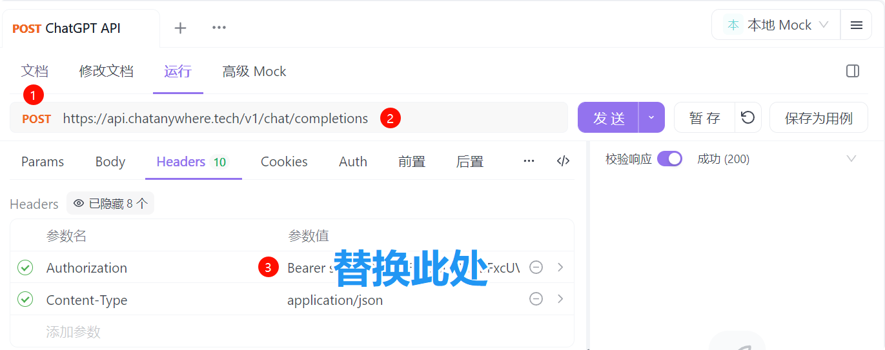


调用ChatGPT API进行翻译

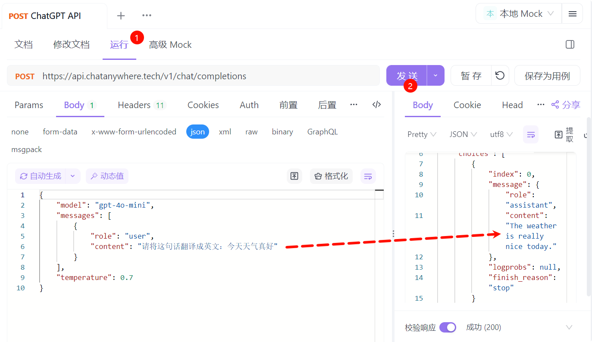

### 使用帮助

Apifox 是集 API 文档、API 调试、API Mock、API 自动化测试多项实用功能为一体的 API 管理平台，定位为 `Postman + Swagger + Mock + JMeter`。学一样相当于学习了API的管理、调试、文档、测试等多项技术，其帮助图文并茂，配有操作视频，推荐大家学习。

* [Apifox 快速入门 | Apifox 帮助文档](https://apifox.com/help/)

## 使用REST Client管理调试 API

REST Client 允许你直接在 Visual Studio Code 中发送 HTTP 请求并查看响应。它无需借助单独的工具来测试 REST API，使 API 测试变得便捷高效。 

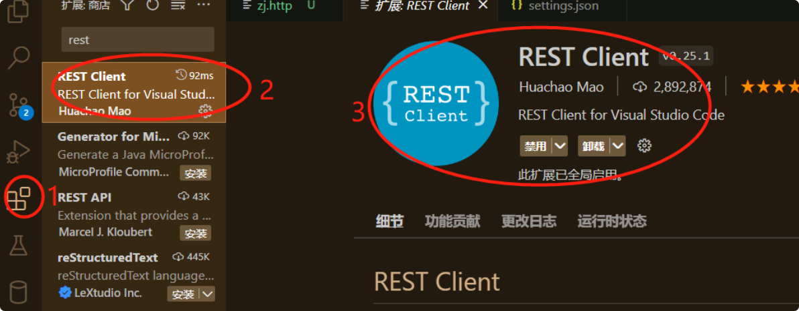

在 VS Code 中创建一个新的文件，例如 chatgpt.http

在 chatgpt.http 文件中，编写以下代码来发送请求到 ChatGPT API：

```http
### 发送消息
@chatgpt_api = https://api.openai.com/v1/chat/completions

POST {{chatgpt_api}} HTTP/1.1
Authorization: Bearer <YOUR_API_KEY>
Content-Type: application/json

{
    "model": "gpt-4o-mini",
    "messages": [
        {
            "role": "user",
            "content": "请将这句话翻译成英文：今天天气真好"
        }
    ],
    "temperature": 0.7
}

```

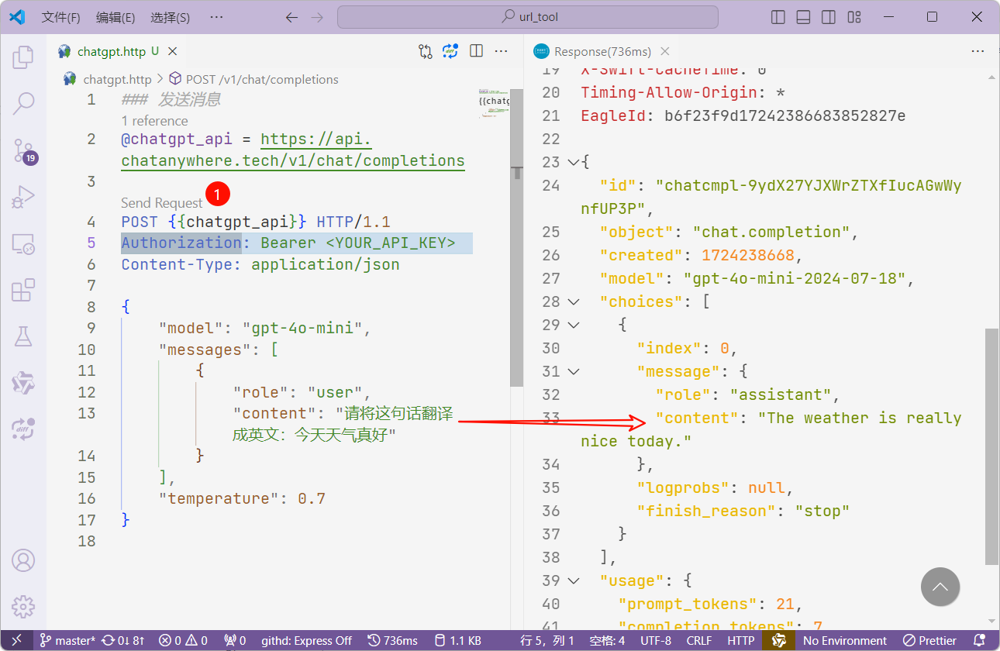

## 使用 Python 调用 API

### 文本交互

Python 提供了强大的库来调用 API，例如 `requests` 库。下面我们以调用 ChatGPT 的 API 进行翻译为例。

> **如果没有 ChatGPT 的 api_key，可以用Kimi API替代**
>
> Kimi API 兼容了 OpenAI 的接口规范，这意味着如果你的应用和服务基于 openai 的模型进行开发，那么只需要将 `base_url` 和 `api_key` 替换成 Kimi 大模型的配置，即可无缝将你的应用和服务迁移至使用 Kimi 大模型，代码示例如下：
>
> ```python
> from openai import OpenAI
>  
> client = OpenAI(
>     api_key="MOONSHOT_API_KEY", # <--在这里将 MOONSHOT_API_KEY 替换为你从 Kimi 开放平台申请的 API Key
>     base_url="https://api.moonshot.cn/v1", # <-- 将 base_url 从 https://api.openai.com/v1 替换为 https://api.moonshot.cn/v1
> )
> ```

**config/gpt.config.json**

```json
{
    "base_url": "",
    "api_key": ""
}
```

核心代码

```python
import requests
import json

try:
    with open("./config/gpt.config.json", "r") as f:
        config = json.load(f)
    base_url = config.get("base_url")
    api_key = config.get("api_key")
except FileNotFoundError:
    print("错误：config.json 文件未找到。")
    exit()
except json.JSONDecodeError:
    print("错误：config.json 文件格式错误。")
    exit()

# 构建完整的 API URL
url = f"{base_url}/chat/completions"

headers = {"Authorization": f"Bearer {api_key}", "Content-Type": "application/json"}

data = {
    "model": "gpt-4o-mini",
    "messages": [
        {"role": "user", "content": "你好，请将这句话翻译成英文：今天天气真好"}
    ],
    "temperature": 0.7,
}

response = requests.post(url, headers=headers, data=json.dumps(data))

if response.status_code == 200:
    result = response.json()
    translation = result["choices"][0]["message"]["content"]
    print(f"翻译结果：{translation}")
else:
    print(f"请求失败：{response.status_code}")
```

这段代码首先定义了 API 的 URL、请求头和请求体。然后，使用 `requests.post()` 方法发送 POST 请求。最后，根据响应状态码判断请求是否成功，并解析响应数据。

### 图片理解

下面是一个基于 `gpt-4o-mini` 模型的图片理解的例子。假设我们要发送一张图片并请求模型对其进行描述或理解。

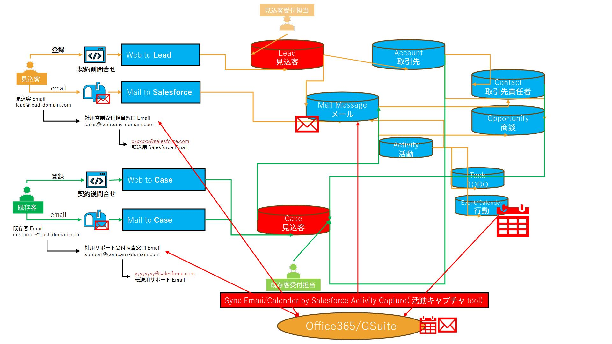

```python
import requests
import json
import base64
import os


def image_to_base64(image_path):
    # 以二进制模式打开图像文件
    with open(image_path, "rb") as image_file:
        # 读取图像文件内容
        image_data = image_file.read()
        # 将图像数据编码为Base64
        base64_encoded_data = base64.b64encode(image_data)
        # 将字节数据转换为字符串
        base64_string = base64_encoded_data.decode("utf-8")

        # 根据文件扩展名判断MIME类型
        _, file_extension = os.path.splitext(image_path)
        if file_extension.lower() == ".jpg" or file_extension.lower() == ".jpeg":
            mime_type = "image/jpeg"
        elif file_extension.lower() == ".png":
            mime_type = "image/png"
        elif file_extension.lower() == ".gif":
            mime_type = "image/gif"
        else:
            mime_type = "application/octet-stream"  # 默认类型

        # 生成完整的data URL
        data_url = f"data:{mime_type};base64,{base64_string}"
        return data_url


try:
    with open("./config/gpt.config.json", "r") as f:
        config = json.load(f)
    base_url = config.get("base_url")
    api_key = config.get("api_key")
except FileNotFoundError:
    print("错误：config.json 文件未找到。")
    exit()
except json.JSONDecodeError:
    print("错误：config.json 文件格式错误。")
    exit()

# 构建完整的 API URL
url = f"{base_url}/chat/completions"

headers = {"Authorization": f"Bearer {api_key}", "Content-Type": "application/json"}

img = image_to_base64("./data/01_メール一元化管理.jpg")

data = {
    "model": "gpt-4o-mini",
    "messages": [
        {
            "role": "user",
            "content": [
                {
                    "type": "image_url",
                    "image_url": {"url": img},
                },
                {"type": "text", "text": "\n\n依据上述信息回答问题："},
                {"type": "text", "text": "跟我解释一下这个图片"},
            ],
        }
    ],
    "temperature": 0.7,
}

response = requests.post(url, headers=headers, data=json.dumps(data))

if response.status_code == 200:
    result = response.json()
    translation = result["choices"][0]["message"]["content"]
    print(f"图片理解结果：{translation}")
else:
    print(f"请求失败：{response.status_code}")
```

> 图片理解结果：这张图展示了一个基于Salesforce的客户关系管理（CRM）系统的工作流程。主要内容包括：
>
> 1. **Web to Lead**：潜在客户通过注册表单提交信息，系统将其转化为“Lead”（潜在客户）。
> 2. **Mail to Salesforce**：通过电子邮件提交的潜在客户信息被转发到Salesforce。
> 3. **Web to Case**：现有客户通过注册表单提交支持请求，系统将其转化为“Case”（案件）。
> 4. **Mail to Case**：通过电子邮件提交的支持请求被转发到Salesforce，将其转化为“Case”。
> 5. **邮件处理**：所有邮件信息通过“Mail Message”进行处理，与其他对象（如Lead、Case等）关联。
> 6. **活动管理**：系统中有“Activity”（活动）、“Task”（任务）和“Event/Calendar”（事件/日历）等模块，用于管理与客户的互动。
> 7. **集成Office 365/G Suite**：系统与Office 365或G Suite同步邮件和日历信息，通过“Salesforce Activity Capture”工具进行整合。
>
> 整体上，这个流程旨在通过Salesforce高效管理客户信息和支持请求，提升客户服务质量。

使用`function_call`

> 使用`function_call`可以保证返回格式是JSON，格式是`{"brief":"概要"}`

```python
import requests
import json
import base64
import os


def image_to_base64(image_path):
    # 以二进制模式打开图像文件
    with open(image_path, "rb") as image_file:
        # 读取图像文件内容
        image_data = image_file.read()
        # 将图像数据编码为Base64
        base64_encoded_data = base64.b64encode(image_data)
        # 将字节数据转换为字符串
        base64_string = base64_encoded_data.decode("utf-8")

        # 根据文件扩展名判断MIME类型
        _, file_extension = os.path.splitext(image_path)
        if file_extension.lower() == ".jpg" or file_extension.lower() == ".jpeg":
            mime_type = "image/jpeg"
        elif file_extension.lower() == ".png":
            mime_type = "image/png"
        elif file_extension.lower() == ".gif":
            mime_type = "image/gif"
        else:
            mime_type = "application/octet-stream"  # 默认类型

        # 生成完整的data URL
        data_url = f"data:{mime_type};base64,{base64_string}"
        return data_url


try:
    with open("./config/gpt.config.json", "r") as f:
        config = json.load(f)
    base_url = config.get("base_url")
    api_key = config.get("api_key")
except FileNotFoundError:
    print("错误：config.json 文件未找到。")
    exit()
except json.JSONDecodeError:
    print("错误：config.json 文件格式错误。")
    exit()

# 构建完整的 API URL
url = f"{base_url}/chat/completions"

headers = {"Authorization": f"Bearer {api_key}", "Content-Type": "application/json"}

img = image_to_base64("./data/01_メール一元化管理.jpg")

functions = [
    {
        "name": "get_image_brief",
        "description": "根据提供的图像 URL 返回图像的概要信息。",
        "parameters": {
            "type": "object",
            "properties": {
                "brief": {"type": "string", "description": "图像的概要信息"}
            },
            "required": ["brief"],
        },
    }
]

data = {
    "model": "gpt-4o-mini",
    "messages": [
        {
            "role": "user",
            "content": [
                {
                    "type": "image_url",
                    "image_url": {"url": img},
                },
                {"type": "text", "text": "\n\n依据上述信息回答问题："},
                {"type": "text", "text": "跟我解释一下这个图片"},
            ],
        }
    ],
    "temperature": 0.7,
    "functions": functions,  # 添加函数定义
    "function_call": {"name": "get_image_brief"},
}

response = requests.post(url, headers=headers, data=json.dumps(data))
if response.status_code == 200:
    result = response.json()
    # 假设返回的 JSON 格式为 {"brief": "概要"}
    brief = (
        result.get("choices")[0].get("message").get("function_call").get("arguments")
    )
    print(f"图片理解结果：{brief}")
else:
    print(f"请求失败：{response.status_code}")

```

> 保证返回格式是JSON
>
> ```json
> {"brief":"这张图展示了一个Salesforce系统的工作流程。主要包含了‘Web to Lead’和‘Web to Case’的流程，分别用于潜在客户和已有客户的管理。图中
> 展示了如何通过电子邮件与Salesforce系统进行交互，包括如何将邮件转发到Salesforce的特定邮箱，以及如何在系统中创建对应的记录。图中还提到了与Office365和G Suite的集成，用于同步邮件和日历活动。整体上，图表展示了如何高效管理客户信息和销售活动的流程。"}
> ```

## 使用 Python 调用文心一言

### 千帆大模型平台

在千帆大模型平台申请API权限，由于千帆大模型平台有赠送的代金券，相当于可以免费试用，当然也可以选择其他大家熟悉的AI平台

#### 创建应用

您可以在应用接入模块直接“创建应用”，支持您选择预置服务和已发布的服务。

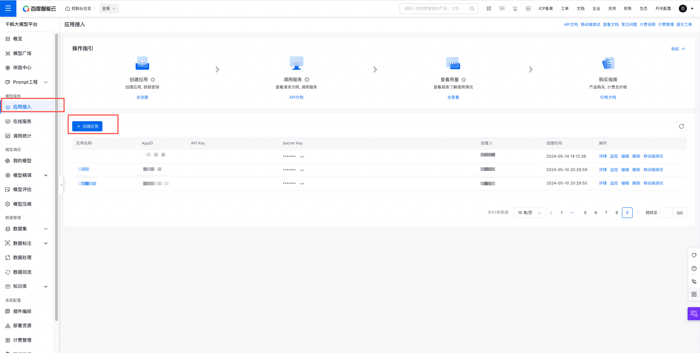

#### 基本信息

填写应用名称和应用描述。

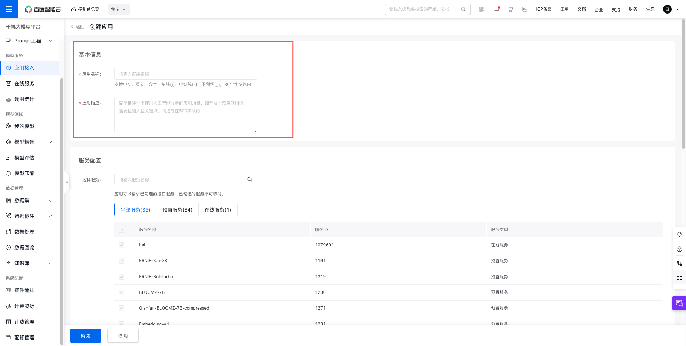

#### 服务配置

选择您需要开通服务的应用，支持选择预置服务、在线服务和插件服务。

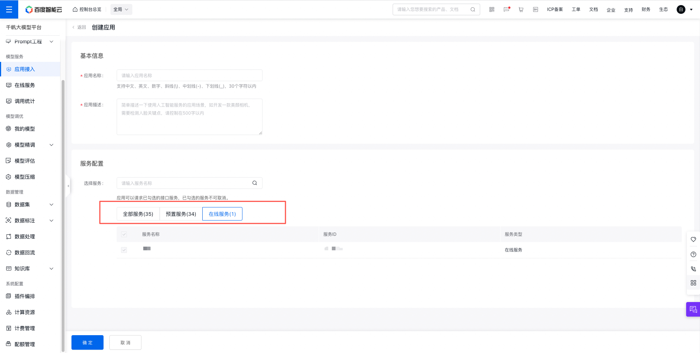

应用接入默认选择接入所有服务，如您想启/停某项服务，可以跳转至[预置服务列表](https://console.bce.baidu.com/qianfan/ais/console/onlineService?tab=preset)或者[计费管理](https://console.bce.baidu.com/qianfan/chargemanage/list)中启/停付费。

#### 列表查看及操作

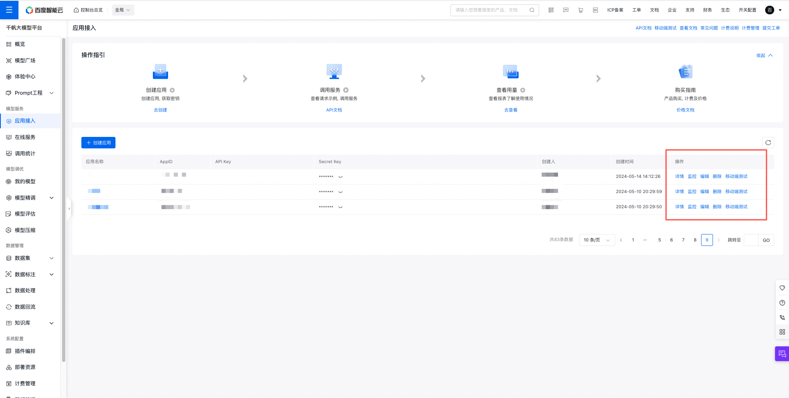

#### 详情

点击应用名称，或操作列的“详情”按钮。可进入应用详情页，可在此查看应用生成的AK/SK，查看定制服务列表，同时可在服务配置模块查看创建应用时所选择的服务和类型。

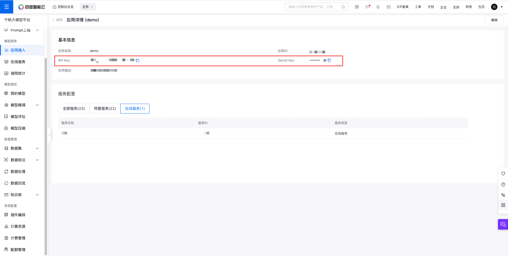

AK/SK是您调用应用的重要凭证，请您妥善保管，切勿轻易泄露!

> 切勿将您的AK/SK以及生成的Access token与其他人共享或硬编码到APP及终端，为保护您的资源安全，平台可能会针对恶意滥用token的行为进行禁用操作。

### 接口分析

#### 获取 Access Token 接口

**接口地址:**  https://aip.baidubce.com/oauth/2.0/token

**请求方式:** POST

**请求参数:**

| 参数名        | 类型   | 必填 | 描述                                   |
| ------------- | ------ | ---- | -------------------------------------- |
| grant_type    | string | 是   | 授权类型，固定值：`client_credentials` |
| client_id     | string | 是   | 你的 API Key                           |
| client_secret | string | 是   | 你的 Secret Key                        |

**响应参数:**

| 参数名         | 类型   | 描述                            |
| -------------- | ------ | ------------------------------- |
| access_token   | string | 访问令牌，用于调用其他 API      |
| expires_in     | int    | access_token 的有效期，单位：秒 |
| scope          | string | access_token 权限范围           |
| session_key    | string | 用户身份标识                    |
| refresh_token  | string | 用于刷新 access_token           |
| session_secret | string | 用户身份密钥                    |

**示例:**

```sh
curl -X POST -d 'grant_type=client_credentials&client_id={YOUR_API_KEY}&client_secret={YOUR_SECRET_KEY}' https://aip.baidubce.com/oauth/2.0/token
```

#### 文心 AI 接口

> 需要在URL中追加 `access_token=${accessToken}` ，即使用第一个接口获取到的 Access Token。

**接口地址:**  https://aip.baidubce.com/rpc/2.0/ai_custom/v1/wenxinworkshop/chat/completions

**请求方式:** POST

**请求头:**

| Header       | 值               |
| ------------ | ---------------- |
| Content-Type | application/json |

**请求参数:**

```json
{
  "messages": [
    {
      "role": "user",
      "content": "要翻译或处理的文本内容"
    }
  ],
  "response_format": "text", // 响应格式，可选值为 "text" 或 "json"
  "temperature": 0.8, // 模型输出的随机性，值越高随机性越大，范围通常在 0 到 1 之间
  "system": "系统指令，例如“请翻译以下英语为中文”", 
  "stream": false // 是否使用流式响应，如果为 true，则 API 会逐块返回结果，否则一次性返回完整结果
}
```

**响应参数:**

```json
{
  "id": "响应ID",
  "object": "chat.completion",
  "created": 时间戳,
  "result": "处理后的文本结果",
  "is_truncated": false, // 是否被截断
  "need_clear_history": false, // 是否需要清除历史记录
  "finish_reason": "normal", // 完成原因
  "usage": {
    "prompt_tokens": 17, // 提示词使用的 token 数量
    "completion_tokens": 7, // 完成内容使用的 token 数量
    "total_tokens": 24 // 总共使用的 token 数量
  }
}
```

### Python 示例代码

为了使用百度AI的文心一言（Wenxin Yiyan）服务，您需要先通过OAuth 2.0接口获取Access Token，然后使用这个Token去调用文心一言的API。以下是一个简化的步骤和Python示例代码，展示如何完成这个过程。

* 步骤 1: 获取 Access Token

首先，您需要向百度AI的OAuth 2.0接口发送请求以获取Access Token。这通常涉及到使用您的API Key（Client ID）和Secret Key（Client Secret）进行身份验证。

* 步骤 2: 调用文心一言API

一旦您获得了Access Token，就可以使用它来调用文心一言的API了。

**config/baidubce.config.json**

```json
{
    "qianfan": {
        "client_id": "",
        "client_secret": ""
    },
    "ocr": {
        "client_id": "",
        "client_secret": ""
    }
}
```

```python
import requests
import json

client_id = ""
client_secret = ""
try:
    with open("./config/baidubce.config.json", "r") as f:
        config = json.load(f)
    client_id = config.get("qianfan", {}).get("client_id")
    client_secret = config.get("qianfan", {}).get("client_secret")
except FileNotFoundError:
    print("错误：config.json 文件未找到。")
    exit()
except json.JSONDecodeError:
    print("错误：config.json 文件格式错误。")
    exit()

# 获取Access Token的URL
token_url = "https://aip.baidubce.com/oauth/2.0/token?grant_type=client_credentials&client_id={}&client_secret={}".format(
    client_id, client_secret
)

# 发送请求获取Access Token
response = requests.get(token_url)
if response.status_code == 200:
    token_info = response.json()
    access_token = token_info.get("access_token")
    if access_token:
        # 文心一言API的URL
        wenxin_url = (
            "https://aip.baidubce.com/rpc/2.0/ai_custom/v1/wenxinworkshop/chat/completions?access_token="
            + access_token
        )

        # 构建请求头
        headers = {"Content-Type": "application/json"}

        # 构建请求体
        data = {
            "model": "ERNIE-Speed-8K",
            "messages": [
                {
                    "role": "user",
                    "content": "今天天气真好",
                }
            ],
            "response_format": "text",
            "temperature": 0.8,
            "system": "请将这句话翻译成英文",
            "stream": False,
        }

        # 发送请求到文心一言API
        wenxin_response = requests.post(
            wenxin_url, headers=headers, data=json.dumps(data)
        )

        if wenxin_response.status_code == 200:
            wenxin_result = wenxin_response.json()
            # 注意：这里的结果结构可能因API版本而异，请根据实际情况调整
            response_text = wenxin_result.get("result", {})
            print("文心一言响应:", response_text)
        else:
            print(
                "调用文心一言API失败:",
                wenxin_response.status_code,
                wenxin_response.text,
            )
    else:
        print("Access Token 获取失败")
else:
    print("获取Access Token失败:", response.status_code, response.text)

```

```sh
文心一言响应: The weather is really nice today
```

### OCR示例

比如我们要实现OCR功能，我们可以调用如下接口

* https://aip.baidubce.com/rest/2.0/ocr/v1/webimage

该接口需要另外创建应用，获取AK和SK（过程同上，不再赘述）：https://console.bce.baidu.com/ai/#/ai/ocr/overview/index


```python
import base64
import requests
import json

client_id = ""
client_secret = ""
try:
    with open("./config/baidubce.config.json", "r") as f:
        config = json.load(f)
    client_id = config.get("ocr", {}).get("client_id")
    client_secret = config.get("ocr", {}).get("client_secret")
except FileNotFoundError:
    print("错误：config.json 文件未找到。")
    exit()
except json.JSONDecodeError:
    print("错误：config.json 文件格式错误。")
    exit()

# 获取Access Token的URL
token_url = "https://aip.baidubce.com/oauth/2.0/token?grant_type=client_credentials&client_id={}&client_secret={}".format(
    client_id, client_secret
)

# 发送请求获取Access Token
response = requests.get(token_url)
if response.status_code == 200:
    token_info = response.json()
    access_token = token_info.get("access_token")
    if access_token:
        wenxin_url = "https://aip.baidubce.com/rest/2.0/ocr/v1/webimage"
        f = open("./data/作文1.jpg", "rb")
        img = base64.b64encode(f.read())

        data = {"image": img}
        # 获取访问令牌
        wenxin_url = wenxin_url + "?access_token=" + access_token
        headers = {"content-type": "application/x-www-form-urlencoded"}

        # 发送请求到文心一言API
        wenxin_response = requests.post(wenxin_url, headers=headers, data=data)

        if wenxin_response.status_code == 200:
            wenxin_result = wenxin_response.json()
            # 注意：这里的结果结构可能因API版本而异，请根据实际情况调整
            words_result = wenxin_result.get("words_result", [])
            for i in words_result:
                print(i["words"])
        else:
            print(
                "调用文心一言API失败:",
                wenxin_response.status_code,
                wenxin_response.text,
            )
    else:
        print("Access Token 获取失败")
else:
    print("获取Access Token失败:", response.status_code, response.text)
```

```tex
我眼中的自己
我眼中的自己是怎么样的？是可爱的？是
害羞的？是活泼的？是温柔的？还是…都不是
我的性格是一个多面体，无时无刻都在变
化，没有知道我现在的性格。在陌生的环境里
我总是表现出乖乖女的样子，每次妈妈带我出
去时，我都一改平时“大大咧咧的个性，总是安
安静静的，从不断举动，看到叔叔阿姨都积
极地打招呼，表现得特别有礼貌。
我特别尊敬师长，别看我在同学面前嘻嘻
哈哈”，没个正行，但一碰见老师，我会礼貌的
向老师问候，并认真完成老师交代的事情，所
以我自认为我在老师眼里是一个礼貌上进的好
学生。
我还特别胆小和敏感，和别的女生一样
看了悲剧就会鼻子酸酸的；看了鬼片就吓得
躲进被子里不敢出来。
我还是一个爱幻想的人。我幻想着我能有
一只“神笔”；幻想着我能长着一双翅膀；幻想
着死去的人能活起来：还幻想着每次想象的
★稿纸笺(20×20)=400
第页
```

## 使用AI评估GIT项目

这段代码的核心功能就是利用 AI (ChatGPT) 来分析处理非结构化的 Git Log 信息。

具体来说，它做了以下几件事：

1. **提取 Git Log：**  通过 `git log` 命令获取项目的提交历史记录，包括提交者、提交时间、提交信息等。
2. **调用 ChatGPT API：** 将提取的 Git Log 发送给 ChatGPT API，并要求它完成以下任务：
    * **分析贡献：**  根据提交历史，判断每个贡献者在项目中扮演的角色和贡献程度。
    * **评选 MVP：**  根据贡献分析，评选出最有价值的贡献者 (MVP)，并给出选择理由。
3. **格式化输出：**  将 ChatGPT 返回的分析结果解析成结构化的 JSON 格式，方便后续使用和展示。

总而言之，这段代码巧妙地利用了 AI 的自然语言处理能力，将原本难以处理的非结构化 Git Log 信息转化为可理解、可分析的结构化数据，为项目管理和决策提供了 valuable insights. 

> **为何JSON输出如此重要？**对于程序员来说，结构化数据的准确输出具有不可或缺的重要性。与人类自然语言交流不同，计算机与计算机之间的通讯需要标准化的格式来保证信息的完整与可读性。JSON（Java Object Notation）作为一种轻量级的数据交换格式，以其简单明了的结构广泛应用于API和客户端-服务器通讯中。

> OpenAI重磅更新：GPT-4o实现100%准确的JSON输出 —— 由于本文的方法也能稳定输出JSON，故此使用该解决方案实现。
>
> [Introducing Structured Outputs in the API | OpenAI](https://openai.com/index/introducing-structured-outputs-in-the-api/) 

```sh
📝 仓库 https://xxx.com/*******/******* 开始评估
仓库 ta******* 已更新
 ✅ 克隆或更新成功
 ✅ 信息获取成功
    📅 最新更新时间: 2024-07-03 11:42:13 +08:00
    📝 更新内容: Merge branch 'main' of https://xxx.com/*******/*******  
    👤 bj******* 提交次数: 14
    👤 Zh******* 提交次数: 20
    👤 ic******* 提交次数: 3
    👤 yw******* 提交次数: 2
    👤 Ca******* 提交次数: 5
    👥 提交总数: 44
    --------------------
    用户名: bj*******
    用户角色: 项目发起人，负责项目的整体规划和管理，提交了大量关于游戏特色、市场调研、文档更新等方面的内容。
    理由: 虽然提交次数较多，但主要集中在文档更新和游戏特色调整，对项目整体推动 贡献较大的是其他成员。
    --------------------
    --------------------
    用户名: Zh*******
    用户角色: 项目经理，负责项目任务分配、需求分析、文档更新等工作，提交次数较多且涵盖了项目的多个关键方面。
    是否为 MVP: 🏆
    理由: Zh*******在项目中承担了项目经理的重要角色，提交次数多且涵盖了项目的多个关键方面，对项目的推动起到了关键作用。
    --------------------
    --------------------
    用户名: ic*******
    用户角色: 团队成员，提交次数较少，贡献主要集中在文档合并方面。
    理由: 贡献较少，主要集中在文档合并，对项目整体推动影响有限。
    --------------------
    --------------------
    用户名: yw*******
    用户角色: 团队成员，提交次数较少，主要贡献是创建个人信息文档和部分文档更新 。
    理由: 贡献较少，提交次数较少，对项目整体推动影响有限。
    --------------------
    --------------------
    用户名: Ca*******
    用户角色: 团队成员，提交次数较少，贡献主要集中在文档更新方面。
    理由: 贡献较少，提交次数较少，对项目整体推动影响有限。
    --------------------
 ✅ 总结和评估成功
    📒 仓库总结: 该 README.md 文件详细介绍了一个名为 ta******* 的游戏项目，包括游戏简介、菜单页面设计、方块类型、道具汇总、玩家行为、游戏对象测试、不同类型的 坦克、关卡模式、商店设计、游戏总体体验和开发流程等内容。其中涵盖了游戏的各个方 面，包括玩法、角色、道具、关卡设计等。同时给出了开发流程和小组成员信息。整体内容比较详细，但有些部分需要进一步补充细节。
    ⭐ 仓库评分: 7
```

配置文件

```json
{
  "chatgpt": {
    "domain": "",
    "apiKey": ""
  },
  "email": {
    "host": "smtp.163.com",
    "port": 465,
    "secure": true,
    "user": "",
    "pass": "",
    "from": "",
    "test": ""
  }
}
```

源代码

```python
import os
import json
import subprocess
import re
import requests
from datetime import datetime, timedelta
import smtplib
from email.mime.text import MIMEText

# --- 配置 ---
# --- 读取配置文件 ---
config_path = os.path.join(os.path.dirname(__file__), "env.json")
with open(config_path, "r", encoding="utf-8") as f:
    config = json.load(f)

chatgpt_config = config["chatgpt"]
mail_config = config["email"]

# --- 函数定义 ---


def get_repo_urls():
    """读取 README.md 文件并提取 GitHub/Gitee 仓库地址"""
    with open("README.md", "r", encoding="utf-8") as f:
        readme_content = f.read()

    repo_urls = re.findall(
        r"(https://(?:gitee\.com|github\.com)/[^)\s]+)", readme_content
    )
    return repo_urls


def clone_or_update_repo(repo_url):
    """克隆或更新仓库"""
    repo_name = repo_url.split("/")[-1].replace(".git", "")
    repo_path = os.path.join(os.path.dirname(__file__), "repositories", repo_name)

    try:
        if os.path.exists(repo_path):
            subprocess.run(["git", "pull"], cwd=repo_path, check=True)
            print(f"✅ 仓库 {repo_name} 已更新")
        else:
            subprocess.run(
                ["git", "clone", repo_url],
                cwd=os.path.join(os.path.dirname(__file__), "repositories"),
                check=True,
            )
            print(f"✅ 仓库 {repo_name} 已克隆")
        return True
    except subprocess.CalledProcessError as e:
        print(f"❗ 仓库 {repo_name} 操作失败:", e)
        return False


def get_repo_info(repo_url):
    """获取仓库信息"""
    repo_name = repo_url.split("/")[-1].replace(".git", "")
    repo_path = os.path.join(os.path.dirname(__file__), "repositories", repo_name)

    # 获取最新更新时间和更新内容
    git_log_output = subprocess.run(
        ["git", "log", "-1", "--pretty=format:%ci||%s"],
        cwd=repo_path,
        check=True,
        text=True,
        capture_output=True,
        encoding="utf-8",  # 指定编码为 utf-8
    )
    latest_update_time, update_content = git_log_output.stdout.strip().split("||")

    # 读取 README.md 文件内容
    readme_file = next(
        (
            f
            for f in ["README.md", "readme.md"]
            if os.path.exists(os.path.join(repo_path, f))
        ),
        "",
    )
    readme_content = (
        open(os.path.join(repo_path, readme_file), "r", encoding="utf-8").read()
        if readme_file
        else ""
    )

    # 获取项目文件树
    file_tree = get_project_file_tree(repo_path)
    if file_tree:
        print(" 📦 项目包含 DevOps 标识文件\n    " + "\n    ".join(file_tree))
        file_tree_content = "\n\n## 项目文件树\n\n" + "\n\t\t".join(file_tree)
    else:
        file_tree_content = ""

    project_content = f"{readme_content}{file_tree_content}"

    total_commits, authors = get_commit_author_info(repo_path)

    return latest_update_time, update_content, project_content, total_commits, authors


def get_chatgpt_evaluation(project_content):
    """调用 ChatGPT API 对项目相关信息进行总结和评估"""
    if not project_content:
        return {"summary": "README.md 为空，无法进行总结和评估", "rating": 0}

    try:
        response = requests.post(
            f"{chatgpt_config['domain']}/v1/chat/completions",
            json={
                "model": "gpt-4o-mini",
                "messages": [
                    {
                        "role": "system",
                        "content": '你是资深软件工程师，请对以下 README.md 文件进行总结和评估，并给出 1-10 分的评分（1 分最低，10 分最高）：请使用中文，返回格式是JSON，格式是{"summary":"xxxx", "evaluation":"5"}，一定不要使用Markdown格式',
                    },
                    {"role": "user", "content": project_content},
                ],
                "temperature": 0.2,
            },
            headers={
                "Content-Type": "application/json",
                "Authorization": f"Bearer {chatgpt_config['apiKey']}",
            },
        )

        content = response.json()["choices"][0]["message"]["content"].strip()
        content_dict = json.loads(content)
        summary = content_dict["summary"]
        rating = int(content_dict["evaluation"])

        return {"summary": summary, "rating": rating}
    except Exception as e:
        print("❗ 调用 ChatGPT API 失败:", e)
        return {"summary": "❗ 无法获取总结", "rating": None}


def get_chatgpt_mvp(git_log):
    """调用 ChatGPT API 评选 MVP"""
    try:
        response = requests.post(
            f"{chatgpt_config['domain']}/v1/chat/completions",
            json={
                "model": "gpt-4o-mini",
                "messages": [
                    {
                        "role": "system",
                        "content": '你是一位经验丰富的项目经理，负责评估团队成员的贡献。请根据以下 git log 信息，分析每个团队成员在项目中担任的角色，并评选出本次项目的 MVP (最有价值成员)，并给出选择该成员的理由。请使用中文，返回格式是JSON，格式是{"user1":{"userRole":"xxxx", "mvp":true, "reason":"xxxx"},"user2":{"userRole":"xxxx", "mvp":false, "reason":"xxxx"}}，一定不要使用Markdown格式',
                    },
                    {"role": "user", "content": git_log},
                ],
                "temperature": 0.5,
            },
            headers={
                "Content-Type": "application/json",
                "Authorization": f"Bearer {chatgpt_config['apiKey']}",
            },
        )

        content = response.json()["choices"][0]["message"]["content"].strip()
        return json.loads(content)
    except Exception as e:
        print("❗ 调用 ChatGPT API 失败:", e)
        return {"mvp": "❗ 无法获取 MVP", "reason": "❗ 调用 ChatGPT API 失败"}


def get_commit_author_info(repo_path):
    """获取仓库提交者信息"""
    log_output = subprocess.run(
        ["git", "log", "--pretty=format:%an||%s||%cI"],
        cwd=repo_path,
        check=True,
        text=True,
        capture_output=True,
        encoding="utf-8",  # 指定编码为 utf-8
    ).stdout
    commits = [line.split("||") for line in log_output.strip().split("\n")]
    author_counts = {}
    total_commits = 0

    for author, message, date in commits:
        if author:
            if author not in author_counts:
                author_counts[author] = {"commits": 0, "history": []}
            author_counts[author]["commits"] += 1
            author_counts[author]["history"].append({"message": message, "date": date})
            total_commits += 1

    return total_commits, author_counts


def get_project_file_tree(repo_path):
    """获取项目文件树"""
    file_tree = (
        subprocess.run(
            ["git", "ls-tree", "-r", "--name-only", "HEAD"],
            cwd=repo_path,
            check=True,
            text=True,
            capture_output=True,
            encoding="utf-8",  # 指定编码为 utf-8
        )
        .stdout.strip()
        .split("\n")
    )
    devops_files = ["Dockerfile", "Jenkinsfile", "docker-compose.yml"]
    if any(file in file_tree for file in devops_files):
        return [file for file in file_tree if file in devops_files]
    else:
        return []


def send_notify_email(mail):
    """发送通知邮件"""
    try:
        msg = MIMEText(
            f'更新时间: {mail["latestUpdateTime"]}，更新内容: {mail["updateContent"]}',
            "plain",
            "utf-8",
        )
        msg["Subject"] = f'🔥项目[{mail["url"]}]已经更新'
        msg["From"] = mail_config["from"]
        msg["To"] = mail_config["test"]

        with smtplib.SMTP_SSL(mail_config["host"], mail_config["port"]) if mail_config[
            "secure"
        ] else smtplib.SMTP(mail_config["host"], mail_config["port"]) as server:
            server.login(mail_config["user"], mail_config["pass"])
            server.sendmail(mail_config["from"], [mail_config["test"]], msg.as_string())

        print(f'📨 邮件通知成功 {datetime.now().strftime("%Y-%m-%d %H:%M:%S")}')
    except Exception as e:
        print("❗ 邮件通知失败:", e)


def main():
    # 1. 获取仓库地址列表
    repo_urls = get_repo_urls()

    # 2. 创建 repositories 目录
    repos_path = os.path.join(os.getcwd(), "repositories")
    if not os.path.exists(repos_path):
        os.mkdir(repos_path)

    # 3. 遍历仓库地址列表
    results = []
    for repo_url in repo_urls:
        # results中已经处理过的repoUrl不再处理
        if any(result["repoUrl"] == repo_url for result in results):
            continue
        # repoUrl中包括gitee.com/lgc653/的不处理
        if "gitee.com/lgc653/" in repo_url:
            continue

        print(f"📝 仓库 {repo_url} 开始评估")

        # 3.1 克隆或更新仓库
        if not clone_or_update_repo(repo_url):
            continue

        # 3.2 获取仓库信息
        latest_update_time, update_content, project_content, total_commits, authors = (
            get_repo_info(repo_url)
        )
        git_log = json.dumps(authors, indent=2)
        latest_update_time_dt = datetime.strptime(
            latest_update_time, "%Y-%m-%d %H:%M:%S %z"
        )

        print(" ✅ 信息获取成功")
        print(
            f'    📅 最新更新时间: {latest_update_time_dt.strftime("%Y-%m-%d %H:%M:%S %z")}'
        )
        print(f"    📝 更新内容: {update_content}")

        # 遍历 authors，显示每个提交者的提交次数
        for author, details in authors.items():
            print(f'    👤 {author} 提交次数: {details["commits"]}')
        print(f"    👥 提交总数: {total_commits}")

        # 调用 getChatgptMvp 函数评选 MVP
        users = get_chatgpt_mvp(git_log)
        for user_name, user in users.items():
            print("    --------------------")
            print(f"    用户名: {user_name}")
            print("    --------------------")
            print(f'    用户角色: {user["userRole"]}')
            if user.get("mvp"):
                print(f'    MVP: {"🏆" if user["mvp"] else ""}')
            print(f'    理由: {user["reason"]}')

        # 如果内容在1小时内更新过，重点提醒
        one_hour_ago = datetime.now().astimezone() - timedelta(hours=1)
        if latest_update_time_dt > one_hour_ago:
            print(" ⏰ 仓库更新时间在 1 小时内，请关注更新情况")
            # 邮件配置中 host 或者 user 如果为空，不发送邮件
            if not mail_config["host"] or not mail_config["user"]:
                print(" ❗ 邮件通知未配置，请配置邮件服务后重试")
            else:
                send_notify_email(
                    {
                        "url": repo_url,
                        "latestUpdateTime": latest_update_time_dt.strftime(
                            "%Y-%m-%d %H:%M:%S %z"
                        ),
                        "updateContent": update_content,
                    }
                )

        # 3.3 调用 ChatGPT API 进行总结和评估
        evaluation = get_chatgpt_evaluation(project_content)
        summary = evaluation["summary"]
        rating = evaluation["rating"]

        print(" ✅ 总结和评估成功")
        print(f"    📒 仓库总结: {summary}")
        print(f"    ⭐ 仓库评分: {rating}")

        # 3.4 将结果添加到数组中
        results.append(
            {
                "repoUrl": repo_url,
                "latestUpdateTime": latest_update_time,
                "updateContent": update_content,
                "summary": summary,
                "rating": rating,
            }
        )

    # 4. 打印 JSON 结果
    print(json.dumps(results, indent=2, ensure_ascii=False))


if __name__ == "__main__":
    main()

```

## 使用AI检测图片上的物体

Google Geimini 1.5 Pro 的多模态功能，不仅能检测图片上的物体，还能输出物体的边框坐标，这样理论上来说你可以在输入的图片上画上框和标注目标内容，很实用的功能。

由于是多模态大语言模型，你还可以在检测对象时加上限定条件，比如只输出动物。

注意提示词里面要限制输出的格式是JSON这样的方便解析的格式，例如：

```
Return bounding boxes as JSON arrays as name of object and its bounding boxes [ymin, xmin, ymax, xmax]. like 'name_1':  [ymin, xmin, ymax, xmax]
```

可以直接调用Google Geimini 1.5 Pro的API实现，输入如上的题词，会得到这样的结果，然后自己在图片上画框即可

```json
{
  'giraffe': [42,458,973,652],
  'elephant': [289,148,966,665],
  'zebra': [670,590,966,744],
  'lion': [685,0,966,296],
  'rhino': [529,620,848,971],
  'cheetah': [776,710,975,890],
  'bird': [166,403,225,479]
}

```


> 有网友已经做了开源项目：[AlexZhangji/bonding_w_geimini: experiments with different llms (github.com)](https://github.com/AlexZhangji/bonding_w_geimini)，上传图片就可以显示检测结果，但是需要自备 Gemini 的 Api Key。

## 使用 Flask 开发 API

###  准备工作

在开始使用 Flask 构建 API 之前，让我们先了解一些基础知识。

#### 什么是 API？

API，即应用程序编程接口，它就像一位“中间人”，允许不同的应用程序相互通信和交换数据。想象一下，你正在使用手机应用预订外卖。当你点击“下单”按钮时，应用程序会通过 API 将你的订单信息发送给餐厅的系统。餐厅系统处理订单后，再通过 API 将确认信息返回给你的应用程序。

#### 为什么选择 Flask？

Flask 是一个轻量级的 Python Web 框架，以其简洁、灵活和易用性而闻名。它非常适合构建小型到中型的 Web 应用程序和 API。Flask 提供了构建 API 所需的核心功能，例如路由、请求处理和响应生成，同时允许你自由选择其他库和工具来扩展功能。

#### 你需要什么？

在开始之前，请确保你已经安装了以下工具：

* **Python:**  Flask 是一个 Python 框架，因此你需要先安装 Python 环境。
* **Flask:**  你可以使用 pip 命令轻松安装 Flask： `pip install Flask`
* **代码编辑器:**  选择你喜欢的代码编辑器，例如 VS Code、Sublime Text 或 Atom。


准备好这些工具后，你就可以开始使用 Flask 构建你的第一个 API 了！ 

###  创建 Flask 应用

现在我们已经准备好工具，可以开始创建 Flask 应用了。

####  搭建

首先，我们需要导入 Flask 库并创建一个 Flask 应用实例。这就像创建一个舞台，我们将在上面编写 API 的代码。

```python
from flask import Flask

app = Flask(__name__)
```

在这段代码中：

* `from flask import Flask`  导入了 Flask 类，它是创建 Flask 应用的基础。
* `app = Flask(__name__)`  创建了一个 Flask 应用实例，并将其赋值给变量 `app`。 `__name__`  参数告诉 Flask 应用的根目录在哪里，以便它能够找到所需的资源。

####  Hello, World!

为了验证我们的 Flask 应用是否正常工作，让我们添加一个简单的路由和视图函数，用于显示 "Hello, World!"。

```python
@app.route('/')
def hello():
    return "Hello, World!"
```

* `@app.route('/')`  是一个装饰器，它将 `hello()` 函数绑定到根路由 (`/`)。这意味着当访问应用的根 URL 时，将执行 `hello()` 函数。
* `def hello():`  定义了一个名为 `hello()` 的视图函数，它返回一个简单的字符串 "Hello, World!"。

####  启动

现在，将代码保存为 `app.py` 文件，并在终端中运行以下命令启动 Flask 开发服务器：

```bash
flask run
```

如果一切顺利，你将在终端中看到类似以下内容的输出：

```
 * Serving Flask app 'app'
 * Running on http://127.0.0.1:5000/ (Press CTRL+C to quit)
```

现在，打开你的浏览器并访问  `http://127.0.0.1:5000/`，你应该会看到页面上显示 "Hello, World!"。

###  定义路由和视图函数

在这一部分，我们将深入了解如何定义路由和视图函数，以便处理不同的 API 请求。

####  路由的概念

路由是将特定的 URL 映射到相应的处理函数的机制。在 Flask 中，我们使用 `@app.route()` 装饰器来定义路由。每当用户访问特定的 URL 时，Flask 会调用与该 URL 关联的视图函数。

####  创建基本路由

让我们创建一个新的路由，用于获取任务列表。首先，我们需要定义一些示例数据。我们将使用一个简单的 Python 列表来存储任务信息：

```python
tasks = [
    {
        'id': 1,
        'title': '学习 Flask',
        'done': False
    },
    {
        'id': 2,
        'title': '开发 API',
        'done': True
    }
]
```

接下来，我们将创建一个新的路由 `/tasks`，并将其与一个视图函数 `get_tasks()` 关联：

```python
@app.route('/tasks', methods=['GET'])
def get_tasks():
    return jsonify({'tasks': tasks})
```

在这段代码中：

* `@app.route('/tasks', methods=['GET'])`  定义了一个新的路由 `/tasks`，并指定它只接受 GET 请求。
* `def get_tasks():`  定义了一个名为 `get_tasks()` 的视图函数，它返回存储在 `tasks` 列表中的任务数据。
* `jsonify({'tasks': tasks})`  将任务列表转换为 JSON 格式的响应。

####  处理不同的 HTTP 请求方法

除了 GET 请求，Flask 还支持其他 HTTP 请求方法，如 POST、PUT 和 DELETE。我们可以通过在路由装饰器中指定 `methods` 参数来处理这些请求。例如，假设我们想要添加一个新的任务，我们可以创建一个 POST 路由：

```python
@app.route('/tasks', methods=['POST'])
def add_task():
    # 这里可以添加处理逻辑
    return jsonify({'message': '任务已添加'}), 201
```

在这个例子中，我们定义了一个新的路由 `/tasks`，并指定它接受 POST 请求。视图函数 `add_task()` 将处理添加任务的逻辑，并返回一个确认消息。

####  测试路由

保存你的代码并重新启动 Flask 应用。你可以使用浏览器或 Postman 等工具来测试新的 API 路由。访问 `http://127.0.0.1:5000/tasks`，你应该会看到以 JSON 格式返回的任务列表。

###  处理数据和响应

在这一部分，我们将学习如何处理数据并生成适当的响应，以便与客户端进行有效的交互。

####  数据存储

在我们的示例中，任务数据存储在一个简单的 Python 列表中。每个任务都是一个字典，包含 `id`、`title` 和 `done` 字段。虽然这种方式适合小型应用，但在实际项目中，通常会使用数据库来存储和管理数据。

为了简化示例，我们将继续使用列表来演示如何处理数据。我们可以通过定义一些函数来添加、更新和删除任务。

####  返回 JSON 响应

Flask 提供了 `jsonify()` 函数，可以将 Python 数据结构转换为 JSON 格式的响应。我们已经在 `get_tasks()` 函数中使用了它。现在，让我们扩展我们的 API，添加一个功能来添加新任务。

首先，我们需要在 `add_task()` 函数中处理 POST 请求的数据。我们可以使用 `request` 对象来获取请求体中的 JSON 数据：

```python
from flask import request

@app.route('/tasks', methods=['POST'])
def add_task():
    task_data = request.get_json()  # 获取请求体中的 JSON 数据
    new_task = {
        'id': len(tasks) + 1,
        'title': task_data['title'],
        'done': False
    }
    tasks.append(new_task)  # 将新任务添加到列表中
    return jsonify(new_task), 201  # 返回新任务和 201 状态码
```

在这个例子中：

* `task_data = request.get_json()`  从请求体中获取 JSON 数据，并将其解析为 Python 字典。
* 我们创建了一个新的任务字典 `new_task`，并将其添加到 `tasks` 列表中。
* 最后，使用 `jsonify(new_task)` 返回新创建的任务，并附加 HTTP 状态码 201，表示资源已成功创建。

####  错误处理

在处理数据时，确保 API 的健壮性非常重要。我们可以添加一些基本的错误处理，以确保请求数据的有效性。例如，在添加任务时，我们可以检查请求体是否包含 `title` 字段：

```python
@app.route('/tasks', methods=['POST'])
def add_task():
    task_data = request.get_json()
    if not task_data or 'title' not in task_data:
        return jsonify({'error': '请求体中缺少 title 字段'}), 400  # 返回 400 错误
    # 处理添加任务的逻辑...
```

在这个修改后的版本中，如果请求体缺少 `title` 字段，API 将返回一个 400 错误和相应的错误消息。

####  测试数据处理

保存代码并重新启动 Flask 应用。使用 Postman 或其他工具发送一个 POST 请求到 `http://127.0.0.1:5000/tasks`，请求体中包含一个 JSON 对象，例如：

```json
{
    "title": "新的任务"
}
```

你应该会看到返回的新任务对象和状态码 201。

###  运行和测试 API

在这一部分，我们将学习如何运行 Flask 应用并测试我们构建的 API，以确保其正常工作。

####  启动 Flask 开发服务器

在完成代码编写后，我们需要启动 Flask 开发服务器。确保你在包含 `app.py` 文件的目录中，然后在终端中运行以下命令：

```bash
flask run
```

如果你已经设置了环境变量 `FLASK_APP`，Flask 将自动找到并运行你的应用。如果没有设置，可以使用以下命令：

```bash
export FLASK_APP=app.py  # 在 Linux 或 macOS 上
set FLASK_APP=app.py     # 在 Windows 上
flask run
```

成功启动后，你应该会看到类似以下的输出：

```
 * Serving Flask app 'app'
 * Running on http://127.0.0.1:5000/ (Press CTRL+C to quit)
```

####  测试 GET 请求

打开你的浏览器或使用 API 测试工具（如 Postman）访问 `http://127.0.0.1:5000/tasks`。你应该能看到以 JSON 格式返回的任务列表。

####  测试 POST 请求

接下来，我们将测试添加新任务的功能。使用 Postman 或其他工具，发送一个 POST 请求到 `http://127.0.0.1:5000/tasks`，并在请求体中包含以下 JSON 数据：

```json
{
    "title": "新的任务"
}
```

确保请求的 Content-Type 设置为 `application/json`。发送请求后，你应该会收到一个包含新任务的 JSON 响应，以及状态码 201。

####  测试错误处理

为了验证错误处理是否正常工作，可以尝试发送一个缺少 `title` 字段的 POST 请求。发送一个空的 JSON 对象 `{}`，你应该会收到一个 400 错误和相应的错误消息，提示请求体中缺少 `title` 字段。

####  使用其他 HTTP 方法

除了 GET 和 POST 请求，你还可以扩展 API 来处理其他 HTTP 方法，例如 PUT 和 DELETE。为了测试这些功能，你可以添加相应的路由和视图函数，并使用 Postman 发送相应的请求。

例如，假设你想要实现更新和删除任务的功能，可以添加如下路由：

```python
@app.route('/tasks/<int:task_id>', methods=['PUT'])
def update_task(task_id):
    # 更新任务的逻辑
    pass

@app.route('/tasks/<int:task_id>', methods=['DELETE'])
def delete_task(task_id):
    # 删除任务的逻辑
    pass
```

在这些函数中，你可以根据 `task_id` 查找并更新或删除特定的任务。

