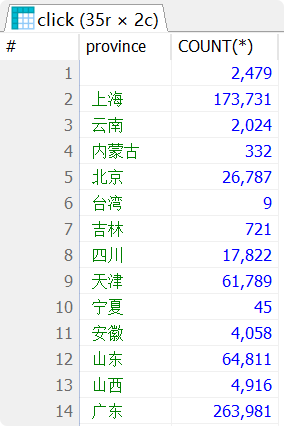
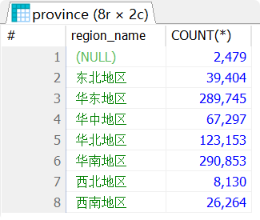
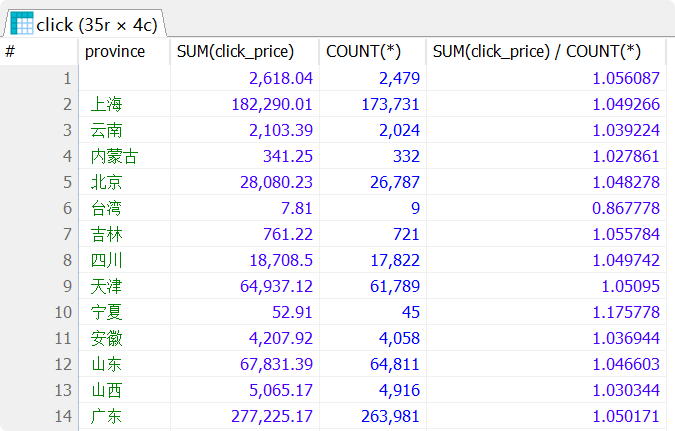
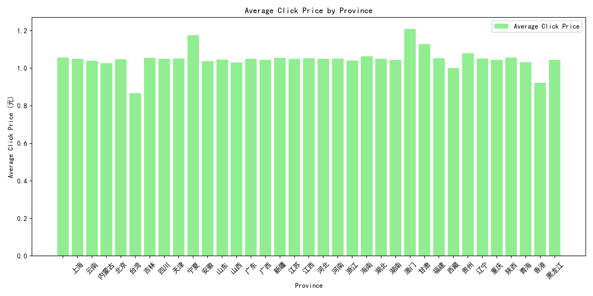

# Python与数据库

## 相关工具

### 安装MySQL

* [MySQL新手指南：从下载、安装、验证详细图文教程分享，入门最佳选项！_Next_mysql_数据库 (sohu.com)](https://www.sohu.com/a/780035343_121897407)

### 数据库管理工具

个人推荐**HeidiSQL**，小巧免费功能全

* [HeidiSQL - MariaDB/MySQL, MSSQL, PostgreSQL, SQLite and Interbase/Firebird made easy](https://www.heidisql.com/) 

### 数据库建模

个人推荐**PDManer**，开源免费，文档专业，国产旗舰，本软件用于数据库设计，为可选安装

* https://www.pdmaas.cn/

## Python3 SQLite数据库

SQLite3 可使用 sqlite3 模块与 Python 进行集成。sqlite3 模块是由 Gerhard Haring 编写的。它提供了一个与 PEP 249 描述的 DB-API 2.0 规范兼容的 SQL 接口。您不需要单独安装该模块，因为 Python 2.5.x 以上版本默认自带了该模块。

### 连接数据库

下面的 Python 代码显示了如何连接到一个现有的数据库。如果数据库不存在，那么它就会被创建，最后将返回一个数据库对象。

```python
#!/usr/bin/python

import sqlite3

conn = sqlite3.connect('test.db')

print("Opened database successfully")
```

在这里，您也可以把数据库名称复制为特定的名称 **:memory:**，这样就会在 RAM 中创建一个数据库。现在，让我们来运行上面的程序，在当前目录中创建我们的数据库 **test.db**。您可以根据需要改变路径。保存上面代码到 sqlite.py 文件中，并按如下所示执行。如果数据库成功创建，那么会显示下面所示的消息：

```sh
# 如果Linux下命令行执行需要以下操作，使用Windows中的IDE直接执行即可
$chmod +x sqlite.py
$./sqlite.py
Open database successfully
```

### 创建表

下面的 Python 代码段将用于在先前创建的数据库中创建一个表：

```python
#!/usr/bin/python

import sqlite3

conn = sqlite3.connect('test.db')
print("Opened database successfully")
c = conn.cursor()
c.execute('''CREATE TABLE COMPANY
       (ID INT PRIMARY KEY     NOT NULL,
       NAME           TEXT    NOT NULL,
       AGE            INT     NOT NULL,
       ADDRESS        CHAR(50),
       SALARY         REAL);''')
print("Table created successfully")
conn.commit()
conn.close()
```

上述程序执行时，它会在 **test.db** 中创建 COMPANY 表，并显示下面所示的消息：

```sh
Opened database successfully
Table created successfully
```

### INSERT 操作

下面的 Python 程序显示了如何在上面创建的 COMPANY 表中创建记录：

```python
#!/usr/bin/python

import sqlite3

conn = sqlite3.connect('test.db')
c = conn.cursor()
print("Opened database successfully")

c.execute("INSERT INTO COMPANY (ID,NAME,AGE,ADDRESS,SALARY) \
      VALUES (1, 'Paul', 32, 'California', 20000.00 )")

c.execute("INSERT INTO COMPANY (ID,NAME,AGE,ADDRESS,SALARY) \
      VALUES (2, 'Allen', 25, 'Texas', 15000.00 )")

c.execute("INSERT INTO COMPANY (ID,NAME,AGE,ADDRESS,SALARY) \
      VALUES (3, 'Teddy', 23, 'Norway', 20000.00 )")

c.execute("INSERT INTO COMPANY (ID,NAME,AGE,ADDRESS,SALARY) \
      VALUES (4, 'Mark', 25, 'Rich-Mond ', 65000.00 )")

conn.commit()
print("Records created successfully")
conn.close()
```

上述程序执行时，它会在 COMPANY 表中创建给定记录，并会显示以下两行：

```sh
Opened database successfully
Records created successfully
```

### SELECT 操作

下面的 Python 程序显示了如何从前面创建的 COMPANY 表中获取并显示记录：

```python
#!/usr/bin/python

import sqlite3

conn = sqlite3.connect('test.db')
c = conn.cursor()
print("Opened database successfully")

cursor = c.execute("SELECT id, name, address, salary  from COMPANY")
for row in cursor:
    print("ID = ", row[0])
    print("NAME = ", row[1])
    print("ADDRESS = ", row[2])
    print("SALARY = ", row[3], "\n")

print("Operation done successfully")
conn.close()
```

上述程序执行时，它会产生以下结果：

```sh
Opened database successfully
ID =  1
NAME =  Paul
ADDRESS =  California
SALARY =  20000.0

ID =  2
NAME =  Allen
ADDRESS =  Texas
SALARY =  15000.0

ID =  3
NAME =  Teddy
ADDRESS =  Norway
SALARY =  20000.0

ID =  4
NAME =  Mark
ADDRESS =  Rich-Mond
SALARY =  65000.0

Operation done successfully
```

### UPDATE 操作

下面的 Python 代码显示了如何使用 UPDATE 语句来更新任何记录，然后从 COMPANY 表中获取并显示更新的记录：

```python
#!/usr/bin/python

import sqlite3

conn = sqlite3.connect('test.db')
c = conn.cursor()
print("Opened database successfully")

c.execute("UPDATE COMPANY SET salary = 20000.0 WHERE id = 1;")
conn.commit()
print("Total number of rows updated :", conn.total_changes)

cursor = c.execute("SELECT id, name, address, salary  from COMPANY")
for row in cursor:
    print("ID = ", row[0])
    print("NAME = ", row[1])
    print("ADDRESS = ", row[2])
    print("SALARY = ", row[3], "\n")

print("Operation done successfully")
conn.close()
```

上述程序执行时，它会产生以下结果：

```sh
Opened database successfully
Total number of rows updated : 1
ID =  1
NAME =  Paul
ADDRESS =  California
SALARY =  25000.0

ID =  2
NAME =  Allen
ADDRESS =  Texas
SALARY =  15000.0

ID =  3
NAME =  Teddy
ADDRESS =  Norway
SALARY =  20000.0

ID =  4
NAME =  Mark
ADDRESS =  Rich-Mond
SALARY =  65000.0

Operation done successfully
```

### DELETE 操作

下面的 Python 代码显示了如何使用 DELETE 语句删除任何记录，然后从 COMPANY 表中获取并显示剩余的记录：

```python
#!/usr/bin/python

import sqlite3

conn = sqlite3.connect('test.db')
c = conn.cursor()
print("Opened database successfully")

c.execute("DELETE from COMPANY where ID=2;")
conn.commit()
print("Total number of rows deleted :", conn.total_changes)

cursor = conn.execute("SELECT id, name, address, salary  from COMPANY")
for row in cursor:
    print("ID = ", row[0])
    print("NAME = ", row[1])
    print("ADDRESS = ", row[2])
    print("SALARY = ", row[3], "\n")

print("Operation done successfully")
conn.close()
```

上述程序执行时，它会产生以下结果：

```sh
Opened database successfully
Total number of rows deleted : 1
ID =  1
NAME =  Paul
ADDRESS =  California
SALARY =  20000.0

ID =  3
NAME =  Teddy
ADDRESS =  Norway
SALARY =  20000.0

ID =  4
NAME =  Mark
ADDRESS =  Rich-Mond
SALARY =  65000.0

Operation done successfully
```

### SQLite案例

```python
import sqlite3

# 打开数据库连接
db = sqlite3.connect('test.db')

# 使用 cursor() 方法创建一个游标对象 cursor
cursor = db.cursor()

# 使用 execute() 方法执行 SQL，如果表存在则删除
cursor.execute("DROP TABLE IF EXISTS wallpaper")
# 使用预处理语句创建表
sql = """CREATE TABLE `wallpaper` (
  `id` int(11) PRIMARY KEY NOT NULL,
  `title` varchar(200) NOT NULL,
  `url` varchar(200) NOT NULL,
  `copyright` varchar(200) NOT NULL
)"""
cursor.execute(sql)

# SQL 插入语句
sql = """INSERT INTO wallpaper(id,title,
         url, copyright)
         VALUES (1,'瓜纳华托，墨西哥', '/th?id=OHR.CityofGuanajuato_ZH-CN7559565626_UHD.jpg&rf=LaDigue_UHD.jpg&pid=hp&w=2880&h=1620&rs=1&c=4','AI NISHINO/Alamy')"""

cursor.execute(sql)
db.commit()

# 关闭数据库连接
db.close()
```

## Python3 MySQL 数据库

### 什么是 PyMySQL？

PyMySQL 是在 Python3.x 版本中用于连接 MySQL 服务器的一个库，Python2中则使用mysqldb。

PyMySQL 遵循 Python 数据库 API v2.0 规范，并包含了 pure-Python MySQL 客户端库。

### PyMySQL 安装

在使用 PyMySQL 之前，我们需要确保 PyMySQL 已安装。

PyMySQL 下载地址：https://github.com/PyMySQL/PyMySQL。

如果还未安装，我们可以使用以下命令安装最新版的 PyMySQL：

```sh
$ pip3 install PyMySQL
```

如果你的系统不支持 pip 命令，可以使用以下方式安装：

1、使用 git 命令下载安装包安装(你也可以手动下载)：

```sh
$ git clone https://github.com/PyMySQL/PyMySQL
$ cd PyMySQL/
$ python3 setup.py install
```

2、如果需要制定版本号，可以使用 curl 命令来安装：

```sh
$ # X.X 为 PyMySQL 的版本号
$ curl -L https://github.com/PyMySQL/PyMySQL/tarball/pymysql-X.X | tar xz
$ cd PyMySQL*
$ python3 setup.py install
$ # 现在你可以删除 PyMySQL* 目录
```

**注意：**请确保您有root权限来安装上述模块。

> 安装的过程中可能会出现"ImportError: No module named setuptools"的错误提示，意思是你没有安装setuptools，你可以访问https://pypi.python.org/pypi/setuptools 找到各个系统的安装方法。
>
> Linux 系统安装实例：
>
> ```sh
> $ wget https://bootstrap.pypa.io/ez_setup.py
> $ python3 ez_setup.py
> ```

### 数据库连接

连接数据库前，请先确认以下事项：

- 您已经创建了数据库 TESTDB。
- 连接数据库TESTDB使用的用户名为 "testuser" ，密码为 "test123",你可以可以自己设定或者直接使用root用户名及其密码，Mysql数据库用户授权请使用Grant命令。
- 在你的机子上已经安装了 Python MySQLdb 模块。

以下实例链接 Mysql 的 TESTDB 数据库：

实例(Python 3.0+)

```python
#!/usr/bin/python3
 
import pymysql
 
# 打开数据库连接
db = pymysql.connect("localhost","testuser","test123","TESTDB" )
 
# 使用 cursor() 方法创建一个游标对象 cursor
cursor = db.cursor()
 
# 使用 execute()  方法执行 SQL 查询 
cursor.execute("SELECT VERSION()")
 
# 使用 fetchone() 方法获取单条数据.
data = cursor.fetchone()
 
print ("Database version : %s " % data)
 
# 关闭数据库连接
db.close()
```

执行以上脚本输出结果如下：

```sh
Database version : 5.5.20-log
```

### 创建数据库表

如果数据库连接存在我们可以使用execute()方法来为数据库创建表，如下所示创建表EMPLOYEE：

```python
#!/usr/bin/python3
 
import pymysql
 
# 打开数据库连接
db = pymysql.connect("localhost","testuser","test123","TESTDB" )
 
# 使用 cursor() 方法创建一个游标对象 cursor
cursor = db.cursor()
 
# 使用 execute() 方法执行 SQL，如果表存在则删除
cursor.execute("DROP TABLE IF EXISTS EMPLOYEE")
 
# 使用预处理语句创建表
sql = """CREATE TABLE EMPLOYEE (
         FIRST_NAME  CHAR(20) NOT NULL,
         LAST_NAME  CHAR(20),
         AGE INT,  
         SEX CHAR(1),
         INCOME FLOAT )"""
 
cursor.execute(sql)
 
# 关闭数据库连接
db.close()
```

### 数据库插入操作

以下实例使用执行 SQL INSERT 语句向表 EMPLOYEE 插入记录：

```python
#!/usr/bin/python3
 
import pymysql
 
# 打开数据库连接
db = pymysql.connect("localhost","testuser","test123","TESTDB" )
 
# 使用cursor()方法获取操作游标 
cursor = db.cursor()
 
# SQL 插入语句
sql = """INSERT INTO EMPLOYEE(FIRST_NAME,
         LAST_NAME, AGE, SEX, INCOME)
         VALUES ('Mac', 'Mohan', 20, 'M', 2000)"""
try:
   # 执行sql语句
   cursor.execute(sql)
   # 提交到数据库执行
   db.commit()
except:
   # 如果发生错误则回滚
   db.rollback()
 
# 关闭数据库连接
db.close()
```

以上例子也可以写成如下形式：

```python
#!/usr/bin/python3
 
import pymysql
 
# 打开数据库连接
db = pymysql.connect("localhost","testuser","test123","TESTDB" )
 
# 使用cursor()方法获取操作游标 
cursor = db.cursor()
 
# SQL 插入语句
sql = "INSERT INTO EMPLOYEE(FIRST_NAME, \
       LAST_NAME, AGE, SEX, INCOME) \
       VALUES ('%s', '%s',  %s,  '%s',  %s)" % \
       ('Mac', 'Mohan', 20, 'M', 2000)
try:
   # 执行sql语句
   cursor.execute(sql)
   # 执行sql语句
   db.commit()
except:
   # 发生错误时回滚
   db.rollback()
 
# 关闭数据库连接
db.close()
```

以下代码使用变量向SQL语句中传递参数:

```tex
..................................
user_id = "test123"
password = "password"

con.execute('insert into Login values( %s,  %s)' % \
             (user_id, password))
..................................
```

### 数据库查询操作

Python查询Mysql使用 fetchone() 方法获取单条数据, 使用fetchall() 方法获取多条数据。

- **fetchone():** 该方法获取下一个查询结果集。结果集是一个对象
- **fetchall():** 接收全部的返回结果行.
- **rowcount:** 这是一个只读属性，并返回执行execute()方法后影响的行数。

实例：查询EMPLOYEE表中salary（工资）字段大于1000的所有数据：

```python
#!/usr/bin/python3
 
import pymysql
 
# 打开数据库连接
db = pymysql.connect("localhost","testuser","test123","TESTDB" )
 
# 使用cursor()方法获取操作游标 
cursor = db.cursor()
 
# SQL 查询语句
sql = "SELECT * FROM EMPLOYEE \
       WHERE INCOME > %s" % (1000)
try:
   # 执行SQL语句
   cursor.execute(sql)
   # 获取所有记录列表
   results = cursor.fetchall()
   for row in results:
      fname = row[0]
      lname = row[1]
      age = row[2]
      sex = row[3]
      income = row[4]
       # 打印结果
      print ("fname=%s,lname=%s,age=%s,sex=%s,income=%s" % \
             (fname, lname, age, sex, income ))
except:
   print ("Error: unable to fetch data")
 
# 关闭数据库连接
db.close()
```

以上脚本执行结果如下：

```sh
fname=Mac, lname=Mohan, age=20, sex=M, income=2000
```

### 数据库更新操作

更新操作用于更新数据表的的数据，以下实例将 TESTDB 表中 SEX 为 'M' 的 AGE 字段递增 1：

```python
#!/usr/bin/python3
 
import pymysql
 
# 打开数据库连接
db = pymysql.connect("localhost","testuser","test123","TESTDB" )
 
# 使用cursor()方法获取操作游标 
cursor = db.cursor()
 
# SQL 更新语句
sql = "UPDATE EMPLOYEE SET AGE = AGE + 1 WHERE SEX = '%c'" % ('M')
try:
   # 执行SQL语句
   cursor.execute(sql)
   # 提交到数据库执行
   db.commit()
except:
   # 发生错误时回滚
   db.rollback()
 
# 关闭数据库连接
db.close()
```

### 删除操作

删除操作用于删除数据表中的数据，以下实例演示了删除数据表 EMPLOYEE 中 AGE 大于 20 的所有数据：

```python
#!/usr/bin/python3
 
import pymysql
 
# 打开数据库连接
db = pymysql.connect("localhost","testuser","test123","TESTDB" )
 
# 使用cursor()方法获取操作游标 
cursor = db.cursor()
 
# SQL 删除语句
sql = "DELETE FROM EMPLOYEE WHERE AGE > %s" % (20)
try:
   # 执行SQL语句
   cursor.execute(sql)
   # 提交修改
   db.commit()
except:
   # 发生错误时回滚
   db.rollback()
 
# 关闭连接
db.close()
```

### 执行事务

事务机制可以确保数据一致性。

事务应该具有4个属性：原子性、一致性、隔离性、持久性。这四个属性通常称为ACID特性。

- 原子性（atomicity）。一个事务是一个不可分割的工作单位，事务中包括的诸操作要么都做，要么都不做。
- 一致性（consistency）。事务必须是使数据库从一个一致性状态变到另一个一致性状态。一致性与原子性是密切相关的。
- 隔离性（isolation）。一个事务的执行不能被其他事务干扰。即一个事务内部的操作及使用的数据对并发的其他事务是隔离的，并发执行的各个事务之间不能互相干扰。
- 持久性（durability）。持续性也称永久性（permanence），指一个事务一旦提交，它对数据库中数据的改变就应该是永久性的。接下来的其他操作或故障不应该对其有任何影响。

Python DB API 2.0 的事务提供了两个方法 commit 或 rollback。

```python
# SQL删除记录语句
sql = "DELETE FROM EMPLOYEE WHERE AGE > %s" % (20)
try:
   # 执行SQL语句
   cursor.execute(sql)
   # 向数据库提交
   db.commit()
except:
   # 发生错误时回滚
   db.rollback()
```

对于支持事务的数据库， 在Python数据库编程中，当游标建立之时，就自动开始了一个隐形的数据库事务。

commit()方法游标的所有更新操作，rollback（）方法回滚当前游标的所有操作。每一个方法都开始了一个新的事务。

### 错误处理

DB API中定义了一些数据库操作的错误及异常，下表列出了这些错误和异常:

| 异常              | 描述                                                         |
| :---------------- | :----------------------------------------------------------- |
| Warning           | 当有严重警告时触发，例如插入数据是被截断等等。必须是 StandardError 的子类。 |
| Error             | 警告以外所有其他错误类。必须是 StandardError 的子类。        |
| InterfaceError    | 当有数据库接口模块本身的错误（而不是数据库的错误）发生时触发。 必须是Error的子类。 |
| DatabaseError     | 和数据库有关的错误发生时触发。 必须是Error的子类。           |
| DataError         | 当有数据处理时的错误发生时触发，例如：除零错误，数据超范围等等。 必须是DatabaseError的子类。 |
| OperationalError  | 指非用户控制的，而是操作数据库时发生的错误。例如：连接意外断开、 数据库名未找到、事务处理失败、内存分配错误等等操作数据库是发生的错误。 必须是DatabaseError的子类。 |
| IntegrityError    | 完整性相关的错误，例如外键检查失败等。必须是DatabaseError子类。 |
| InternalError     | 数据库的内部错误，例如游标（cursor）失效了、事务同步失败等等。 必须是DatabaseError子类。 |
| ProgrammingError  | 程序错误，例如数据表（table）没找到或已存在、SQL语句语法错误、 参数数量错误等等。必须是DatabaseError的子类。 |
| NotSupportedError | 不支持错误，指使用了数据库不支持的函数或API等。例如在连接对象上 使用.rollback()函数，然而数据库并不支持事务或者事务已关闭。 必须是DatabaseError的子类。 |

### MySql案例

创建数据库

```sh
mysql -uroot -pxxxxx -e "create database TESTDB default character set utf8mb4 collate utf8mb4_unicode_ci;"
```

代码，创建wallpaper并写入捕捉的数据

```python
import pymysql

# 打开数据库连接
db = pymysql.connect(
    host="localhost",
    port=3306,
    user='root',
    password='',
    database='score',
    charset='utf8mb4')

# 使用 cursor() 方法创建一个游标对象 cursor
cursor = db.cursor()

# 使用 execute()  方法执行 SQL 查询
cursor.execute("SELECT VERSION()")

# 使用 fetchone() 方法获取单条数据.
data = cursor.fetchone()

print("Database version : %s " % data)

# 使用 execute() 方法执行 SQL，如果表存在则删除
cursor.execute("DROP TABLE IF EXISTS wallpaper")
# 使用预处理语句创建表
sql = """CREATE TABLE `wallpaper` (
  `id` int(11) NOT NULL,
  `title` varchar(200) NOT NULL,
  `url` varchar(200) NOT NULL,
  `copyright` varchar(200) NOT NULL
) ENGINE=InnoDB DEFAULT CHARSET=utf8;"""
cursor.execute(sql)

sql = """ALTER TABLE `wallpaper`
  ADD PRIMARY KEY (`id`),
  ADD UNIQUE KEY `url` (`url`);"""
cursor.execute(sql)

sql = """ALTER TABLE `wallpaper`
  MODIFY `id` int(11) NOT NULL AUTO_INCREMENT;"""
cursor.execute(sql)

# SQL 插入语句
sql = """INSERT INTO wallpaper(title,
         url, copyright)
         VALUES ('瓜纳华托，墨西哥 (© AI NISHINO/Alamy)', '/th?id=OHR.CityofGuanajuato_ZH-CN7559565626_UHD.jpg&rf=LaDigue_UHD.jpg&pid=hp&w=2880&h=1620&rs=1&c=4','瓜纳华托，墨西哥 (© AI NISHINO/Alamy)')"""
try:
    # 执行sql语句
    cursor.execute(sql)
    # 提交到数据库执行
    db.commit()
except:
    # 如果发生错误则回滚
    db.rollback()

# 关闭数据库连接
db.close()
```

## ORM

ORM就是对象映射关系程序，简单来说就是类似于python这种面向对象的模式来处理数据库操作，它可以将我们平常所使用的SQL语句，转换成可以使用对象模型进行操作的模块，而不是直接使用SQL语句。

### 安装sqlalchemy

```sh
pip install sqlalchemy
```

[SQLAlchemy Documentation — SQLAlchemy 1.4 Documentation](https://docs.sqlalchemy.org/en/14/#)

### DBSession.py

```python
#!/usr/bin/env python
# -*- coding: utf-8 -*-
# 导入:
from sqlalchemy import create_engine, Column, Integer, String, Text
from sqlalchemy.orm import sessionmaker
from sqlalchemy.ext.declarative import declarative_base

# 创建对象的基类:
Base = declarative_base()

# 定义对象:


class Wallpaper(Base):
    # 表的名字:
    __tablename__ = 'wallpaper'

    # 表的结构:
    id = Column(Integer, primary_key=True)
    title = Column(String(200))
    url = Column(String(200))
    copyright = Column(String(200))


# 初始化数据库连接:
# engine = create_engine('mysql+pymysql://root:@localhost:3306/testdb')
engine = create_engine('sqlite:///./test.db', echo=True)
# 创建表结构
Base.metadata.create_all(engine)
# 创建DBSession类型:
DBSession = sessionmaker(bind=engine)
```

### orm.py

```python
from DBSession import DBSession, Wallpaper
import requests
import json

session = DBSession()
# 查找
wallpapers = session.query(Wallpaper).filter(Wallpaper.id == 1).all()
for row in wallpapers:
    print(row.title)
    print(row.url)

# 修改
wallpaper = session.query(Wallpaper).filter(Wallpaper.id == 1).first()
if (wallpaper):
    wallpaper.title = "瓜纳华托，墨西哥 (© AI NISHINO/Alamy)"
    session.commit()

# 新增
sr = requests.get(
    'https://cn.bing.com/HPImageArchive.aspx?idx=0&n=1&format=js')
obj = json.loads(sr.text)
images = obj['images']
new_wallpaper_id = 0
for image in images:
    new_wallpaper = Wallpaper(
        title=image["title"], url=image["url"], copyright=image["copyright"])
    session.add(new_wallpaper)
    session.commit()
    new_wallpaper_id = new_wallpaper.id

# 删除
if new_wallpaper_id > 0:
    wallpaper = session.query(Wallpaper).filter(
        Wallpaper.id == new_wallpaper_id).first()
    session.delete(wallpaper)
    session.commit()

session.close()
```

## 数据库实战

### 数据准备

```sql
CREATE TABLE `click` (
	`click_id` INT(11) NOT NULL,
	`ad_id` INT(11) NOT NULL COMMENT '广告ID',
	`app_id` INT(11) NOT NULL COMMENT '广告位ID',
	`check_uuid` VARCHAR(200) NOT NULL DEFAULT '' COMMENT '用户唯一ID' COLLATE 'utf8mb4_bin',
	`create_dateline` INT(11) NOT NULL DEFAULT '0' COMMENT '时间戳',
	`create_date` DATE NOT NULL DEFAULT '2000-01-01' COMMENT '日期',
	`create_h` SMALLINT(6) NOT NULL DEFAULT '0' COMMENT '小时',
	`flag` SMALLINT(6) NOT NULL DEFAULT '0',
	`province` VARCHAR(50) NOT NULL DEFAULT '0' COMMENT '省份' COLLATE 'utf8mb4_bin',
	`city` VARCHAR(50) NOT NULL DEFAULT '0' COMMENT '城市' COLLATE 'utf8mb4_bin',
	`isp` VARCHAR(50) NOT NULL DEFAULT '0' COMMENT '运营商' COLLATE 'utf8mb4_bin',
	`browser` VARCHAR(50) NOT NULL DEFAULT '0' COMMENT '终端浏览器' COLLATE 'utf8mb4_bin',
	`remote_addr` VARCHAR(50) NOT NULL DEFAULT '0' COMMENT 'IP地址' COLLATE 'utf8mb4_bin',
	`http_user_agent` TEXT NOT NULL COMMENT 'UA' COLLATE 'utf8mb4_bin',
	PRIMARY KEY (`click_id`) USING BTREE
)
COLLATE='utf8mb4_bin'
ENGINE=InnoDB
;
```

导入数据

```
129070334	297	206	f42bdc6f-a99c-4e0a-ae9a-9f982c32bb7f	1553443201	2019-03-25	0	1	浙江	杭州市	阿里云		47.97.192.46	Mozilla/5.0 (X11; Ubuntu; Linux x86_64; rv:36.0) Gecko/20100101 Firefox/36.0
129070335	125	135	ba95e65317d9d93ea48e30519a72b958	1553443202	2019-03-25	0	1	北京	北京市	移动	weixin	223.104.3.197	Mozilla/5.0 (iPhone; CPU iPhone OS 9_3_2 like Mac OS X) AppleWebKit/601.1.46 (KHTML, like Gecko) Mobile/13F69 MicroMessenger/6.7.4(0x1607042c) NetType/4G Language/zh_CN
129070336	131	131	e0f9ed6783d0e870f7254a19b1875f48	1553443204	2019-03-25	0	1	广东	深圳市	阿里巴巴	Alipay	110.75.242.193	Mozilla/5.0 (Linux; U; Android 9; zh-CN; EVR-AL00 Build/HUAWEIEVR-AL00) AppleWebKit/537.36 (KHTML, like Gecko) Version/4.0 Chrome/57.0.2987.108 UCBrowser/11.8.8.968 UWS/2.13.2.57 Mobile Safari/537.36 UCBS/2.13.2.57_190121174255 NebulaSDK/1.8.100112 Nebula AlipayDefined(nt:4G,ws:360|0|3.0) AliApp(AP/10.1.59.231) AlipayClient/10.1.59.231 Language/zh-Hans useStatusBar/true isConcaveScreen/true
129070337	131	131	c4fe4db96f57ab7fb37632d7a93d1c82	1553443208	2019-03-25	0	1	广东	深圳市	阿里巴巴	Alipay	110.75.242.152	Mozilla/5.0 (iPhone; CPU iPhone OS 12_1_4 like Mac OS X) AppleWebKit/605.1.15 (KHTML, like Gecko) Mobile/16D57 NebulaSDK/1.8.100112 Nebula PSDType(1) AlipayDefined(nt:4G,ws:375|603|2.0) AliApp(AP/10.1.58.6100) AlipayClient/10.1.58.6100 Alipay Language/zh-Hans
129070338	131	131	bc646d8f21817a127e4ba2fcec2d99e2	1553443252	2019-03-25	0	1	广东	深圳市	阿里巴巴	Alipay	110.75.248.224	Mozilla/5.0 (iPhone; CPU iPhone OS 12_1_4 like Mac OS X) AppleWebKit/605.1.15 (KHTML, like Gecko) Mobile/16D57 NebulaSDK/1.8.100112 Nebula PSDType(1) AlipayDefined(nt:4G,ws:375|748|3.0) AliApp(AP/10.1.58.6100) AlipayClient/10.1.58.6100 Alipay Language/zh-Hans
```

```sql
SET GLOBAL local_infile = 1;

LOAD DATA LOW_PRIORITY LOCAL INFILE 'C:\\Users\\lgc653\\Desktop\\click.tsv' IGNORE INTO TABLE click CHARACTER SET utf8  FIELDS TERMINATED BY '	' OPTIONALLY ENCLOSED BY '"' ESCAPED BY '"' LINES TERMINATED BY '\n' (click_id,ad_id,app_id,check_uuid,create_dateline,create_date,create_h,flag,province,city,isp,browser,remote_addr,http_user_agent);
```

### 统计练习1

```sql
# 查询每个省的点击次数
SELECT province, COUNT(*)
FROM click
GROUP BY province
```



### 统计练习2

创建省份表，描述省份和大区之间的关系

```tex
北京	华北地区
天津	华北地区
河北	华北地区
山西	华北地区
```

```sql
-- 创建省份表
CREATE TABLE `province` (
	`province_name` VARCHAR(50) NOT NULL COMMENT '省份' COLLATE 'utf8_general_ci',
	`region_name` VARCHAR(50) NULL DEFAULT NULL COMMENT '大区' COLLATE 'utf8_general_ci',
	PRIMARY KEY (`province_name`) USING BTREE
)
COLLATE='utf8_general_ci'
ENGINE=InnoDB
;
-- 导入省份数据
LOAD DATA LOW_PRIORITY LOCAL INFILE 'C:\\Users\\lgc653\\Desktop\\province.tsv' REPLACE INTO TABLE `province` CHARACTER SET utf8 FIELDS TERMINATED BY '	' OPTIONALLY ENCLOSED BY '"' ESCAPED BY '"' LINES TERMINATED BY '\n' (`province_name`, `region_name`);
```

举例

```sql
# 统计各个大区的点击数
SELECT region_name, COUNT(*)
FROM click
INNER JOIN province on province.province_name =  click.province
GROUP BY region_name
```




### 统计练习3

首先，我们需要在 click 表中添加一个新的字段 click_price，它的类型可以是 DECIMAL，以便存储小数值（例如 0.1 到 2.0 元之间的价格）。

```sql
-- 添加点击单价字段
ALTER TABLE `click`
ADD COLUMN `click_price` DECIMAL(5, 2) NOT NULL DEFAULT '0.00' COMMENT '点击单价';

-- 随机赋值点击单价
UPDATE `click`
SET `click_price` = ROUND((RAND() * (2.00 - 0.10) + 0.10), 2);
```

举例

```sql
# 统计每个省份的平均点击单价
SELECT province, SUM(click_price), COUNT(*), SUM(click_price) / COUNT(*)
FROM click
GROUP BY province
```



### 使用 Pandas 和 Matplotlib 可视化数据

要使用 Pandas 和 Matplotlib 可视化 MySQL 查询的结果，您可以按照以下步骤进行操作：

1. **连接到 MySQL 数据库并执行查询**。
2. **将查询结果加载到 Pandas DataFrame**。
3. **使用 Matplotlib 可视化数据**。

```python
import pandas as pd
import matplotlib.pyplot as plt
import pymysql

# 连接到 MySQL 数据库
db_connection = pymysql.connect(
    host='localhost',        # 替换为您的数据库主机
    user='root',    # 替换为您的数据库用户名
    password='', # 替换为您的数据库密码
    database='train'  # 替换为您的数据库名称
)

# 执行 SQL 查询
query = """
SELECT province, SUM(click_price) AS total_click_price, COUNT(*) AS click_count, SUM(click_price) / COUNT(*) AS avg_click_price
FROM click
GROUP BY province
"""

# 将查询结果加载到 Pandas DataFrame
df = pd.read_sql(query, db_connection)

# 关闭数据库连接
db_connection.close()

# 打印 DataFrame 以检查数据
print(df)

# 设置中文字体
plt.rcParams['font.sans-serif'] = ['SimHei']  # 使用黑体
plt.rcParams['axes.unicode_minus'] = False  # 解决负号显示问题
# 可视化数据
plt.figure(figsize=(12, 6))

# 绘制每个省份的总点击单价
plt.bar(df['province'], df['total_click_price'], color='skyblue', label='Total Click Price')
plt.xlabel('Province')
plt.ylabel('Total Click Price (元)')
plt.title('Total Click Price by Province')
plt.xticks(rotation=45)
plt.legend()
plt.tight_layout()
plt.show()

# 绘制每个省份的平均点击单价
plt.figure(figsize=(12, 6))
plt.bar(df['province'], df['avg_click_price'], color='lightgreen', label='Average Click Price')
plt.xlabel('Province')
plt.ylabel('Average Click Price (元)')
plt.title('Average Click Price by Province')
plt.xticks(rotation=45)
plt.legend()
plt.tight_layout()
plt.show()
```




### 使用 Flask 和 ECharts 可视化数据

使用 Flask 和 ECharts 可视化数据的步骤如下：

1. **设置 Flask 应用**：创建一个简单的 Flask 应用来处理请求。
2. **连接到 MySQL 数据库**：使用 `PyMySQL` 连接到数据库并获取数据。
3. **将数据传递到前端**：将查询结果传递到前端模板。
4. **使用 ECharts 在前端可视化数据**：在 HTML 模板中使用 ECharts 绘制图表。

以下是一个完整的示例代码：

#### 安装所需库

确保安装 Flask 和 PyMySQL：

```bash
pip install Flask pymysql
```

#### 创建 Flask 应用

创建一个名为 `app.py` 的文件，并添加以下代码：

```python
from flask import Flask, render_template
import pymysql
import json

app = Flask(__name__)

# 数据库连接配置
db_config = {
    'host': 'localhost',        # 替换为您的数据库主机
    'user': 'root',    # 替换为您的数据库用户名
    'password': '', # 替换为您的数据库密码
    'database': 'train'  # 替换为您的数据库名称
}

@app.route('/')
def index():
    # 连接到 MySQL 数据库
    connection = pymysql.connect(**db_config)
    
    # 执行 SQL 查询
    query = """
    SELECT province, SUM(click_price) AS total_click_price, COUNT(*) AS click_count, SUM(click_price) / COUNT(*) AS avg_click_price
    FROM click
    GROUP BY province
    """
    
    with connection.cursor() as cursor:
        cursor.execute(query)
        result = cursor.fetchall()
    
    # 关闭数据库连接
    connection.close()

    # 将数据转换为 JSON 格式
    provinces = [row[0] for row in result]
    total_click_prices = [row[1] for row in result]
    avg_click_prices = [row[3] for row in result]

    return render_template('index.html', provinces=json.dumps(provinces), total_click_prices=json.dumps(total_click_prices), avg_click_prices=json.dumps(avg_click_prices))

if __name__ == '__main__':
    app.run(debug=True)
```

#### 创建 HTML 模板

在项目目录中创建一个名为 `templates` 的文件夹，并在其中创建一个名为 `index.html` 的文件，添加以下代码：

```html
<!DOCTYPE html>
<html lang="en">
<head>
    <meta charset="UTF-8">
    <meta name="viewport" content="width=device-width, initial-scale=1.0">
    <title>Click Data Visualization</title>
    <script src="https://cdn.jsdelivr.net/npm/echarts/dist/echarts.min.js"></script>
    <style>
        #totalClickPriceChart, #avgClickPriceChart {
            width: 100%;
            height: 400px;
        }
    </style>
</head>
<body>
    <h1>Total Click Price by Province</h1>
    <div id="totalClickPriceChart"></div>
    
    <h1>Average Click Price by Province</h1>
    <div id="avgClickPriceChart"></div>

    <script>
        // 获取数据
        var provinces = {{ provinces | safe }};
        var totalClickPrices = {{ total_click_prices | safe }};
        var avgClickPrices = {{ avg_click_prices | safe }};

        // 绘制总点击单价图表
        var totalClickPriceChart = echarts.init(document.getElementById('totalClickPriceChart'));
        totalClickPriceChart.setOption({
            title: {
                text: 'Total Click Price by Province'
            },
            tooltip: {},
            xAxis: {
                data: provinces
            },
            yAxis: {},
            series: [{
                name: 'Total Click Price',
                type: 'bar',
                data: totalClickPrices
            }]
        });

        // 绘制平均点击单价图表
        var avgClickPriceChart = echarts.init(document.getElementById('avgClickPriceChart'));
        avgClickPriceChart.setOption({
            title: {
                text: 'Average Click Price by Province'
            },
            tooltip: {},
            xAxis: {
                data: provinces
            },
            yAxis: {},
            series: [{
                name: 'Average Click Price',
                type: 'bar',
                data: avgClickPrices
            }]
        });
    </script>
</body>
</html>
```

#### 运行 Flask 应用

在终端中运行 Flask 应用：

```bash
python app.py
```

#### 访问应用

打开浏览器并访问 `http://127.0.0.1:5000/`，您将看到两个柱状图，分别展示每个省份的总点击单价和平均点击单价。


#### 说明
- **Flask**：用于创建 Web 应用并处理请求。
- **PyMySQL**：用于连接到 MySQL 数据库并执行查询。
- **ECharts**：用于在前端可视化数据。
- **JSON**：用于在 Flask 和前端之间传递数据。

确保在运行代码之前替换数据库连接配置为您的实际信息。

### 前后端分离

#### app.py

```py
from flask import Flask, jsonify, render_template
import pymysql

app = Flask(__name__)

# 数据库连接配置
db_config = {
    "host": "localhost",  # 替换为您的数据库主机
    "user": "root",  # 替换为您的数据库用户名
    "password": "",  # 替换为您的数据库密码
    "database": "train",  # 替换为您的数据库名称
}


@app.route("/")
def index():
    return render_template("index.html")


@app.route("/api/click-data", methods=["GET"])
def get_click_data():
    # 连接到 MySQL 数据库
    connection = pymysql.connect(**db_config)

    # 执行 SQL 查询
    query = """
    SELECT province, SUM(click_price) AS total_click_price, COUNT(*) AS click_count, SUM(click_price) / COUNT(*) AS avg_click_price
    FROM click
    GROUP BY province
    """

    with connection.cursor() as cursor:
        cursor.execute(query)
        result = cursor.fetchall()

    # 关闭数据库连接
    connection.close()

    # 将数据转换为 JSON 格式
    data = []
    for row in result:
        data.append(
            {
                "province": row[0],
                "total_click_price": float(row[1]),
                "avg_click_price": float(row[3]),
            }
        )

    return jsonify(data)


if __name__ == "__main__":
    app.run(debug=True)

```

#### templates\index.html

```html
<!DOCTYPE html>
<html lang="en">
<head>
    <meta charset="UTF-8">
    <meta name="viewport" content="width=device-width, initial-scale=1.0">
    <title>Click Data Visualization</title>
    <script src="https://cdn.jsdelivr.net/npm/echarts/dist/echarts.min.js"></script>
    <style>
        #totalClickPriceChart, #avgClickPriceChart {
            width: 100%;
            height: 400px;
        }
    </style>
</head>
<body>
    <h1>Total Click Price by Province (Pie Chart)</h1>
    <div id="totalClickPriceChart"></div>
    
    <h1>Average Click Price by Province</h1>
    <div id="avgClickPriceChart"></div>

    <script>
        // 请求数据
        fetch('/api/click-data')
            .then(response => response.json())
            .then(data => {
                const provinces = data.map(item => item.province);
                const totalClickPrices = data.map(item => item.total_click_price);
                const avgClickPrices = data.map(item => item.avg_click_price);

                // 绘制总点击单价普通饼图
                const totalClickPriceChart = echarts.init(document.getElementById('totalClickPriceChart'));
                totalClickPriceChart.setOption({
                    title: {
                        text: 'Total Click Price by Province',
                        subtext: 'Pie Chart',
                        left: 'center'
                    },
                    tooltip: {
                        trigger: 'item'
                    },
                    legend: {
                        orient: 'vertical',
                        left: 'left'
                    },
                    series: [{
                        type: 'pie',
                        radius: '50%',
                        data: provinces.map((province, index) => ({
                            name: province,
                            value: totalClickPrices[index]
                        })),
                        emphasis: {
                            itemStyle: {
                                shadowBlur: 10,
                                shadowOffsetX: 0,
                                shadowColor: 'rgba(0, 0, 0, 0.5)'
                            }
                        }
                    }]
                });

                // 绘制平均点击单价图表
                const avgClickPriceChart = echarts.init(document.getElementById('avgClickPriceChart'));
                avgClickPriceChart.setOption({
                    title: {
                        text: 'Average Click Price by Province'
                    },
                    tooltip: {},
                    xAxis: {
                        data: provinces
                    },
                    yAxis: {},
                    series: [{
                        name: 'Average Click Price',
                        type: 'bar',
                        data: avgClickPrices
                    }]
                });
            })
            .catch(error => console.error('Error fetching data:', error));
    </script>
</body>
</html>
```


### AI

#### 自然语言写SQL

````markdown
需统计的数据库表结构如下
```sql
CREATE TABLE IF NOT EXISTS `click` (
  `click_id` int(11) NOT NULL,
  `ad_id` int(11) NOT NULL COMMENT '广告ID',
  `app_id` int(11) NOT NULL COMMENT '广告位ID',
  `check_uuid` varchar(200) COLLATE utf8mb4_bin NOT NULL DEFAULT '' COMMENT '用户唯一ID',
  `create_dateline` int(11) NOT NULL DEFAULT '0' COMMENT '时间戳',
  `create_date` date NOT NULL DEFAULT '2000-01-01' COMMENT '日期',
  `create_h` smallint(6) NOT NULL DEFAULT '0' COMMENT '小时',
  `flag` smallint(6) NOT NULL DEFAULT '0',
  `province` varchar(50) COLLATE utf8mb4_bin NOT NULL DEFAULT '0' COMMENT '省份',
  `city` varchar(50) COLLATE utf8mb4_bin NOT NULL DEFAULT '0' COMMENT '城市',
  `isp` varchar(50) COLLATE utf8mb4_bin NOT NULL DEFAULT '0' COMMENT '运营商',
  `browser` varchar(50) COLLATE utf8mb4_bin NOT NULL DEFAULT '0' COMMENT '终端浏览器',
  `remote_addr` varchar(50) COLLATE utf8mb4_bin NOT NULL DEFAULT '0' COMMENT 'IP地址',
  `http_user_agent` text COLLATE utf8mb4_bin NOT NULL COMMENT 'UA',
  `click_price` decimal(5,2) NOT NULL DEFAULT '0.00' COMMENT '点击单价',
  PRIMARY KEY (`click_id`) USING BTREE
) ENGINE=InnoDB DEFAULT CHARSET=utf8mb4 COLLATE=utf8mb4_bin;

CREATE TABLE IF NOT EXISTS `province` (
  `province_name` varchar(50) NOT NULL COMMENT '省份',
  `region_name` varchar(50) DEFAULT NULL COMMENT '大区',
  PRIMARY KEY (`province_name`)
) ENGINE=InnoDB DEFAULT CHARSET=utf8;
```
请问如何统计各个大区的点击数，请给出SQL语句
````

 🤖**AI回答**

```sql
SELECT 
    p.region_name, 
    COUNT(c.click_id) AS click_count
FROM 
    click c
LEFT JOIN 
    province p ON c.province = p.province_name
GROUP BY 
    p.region_name;
```

这条语句在我机器上运行需要4.6秒，于是我提问

```markdown
这条语句运行的很慢，请问如何优化
```

 🤖**AI回答**

```sql
-- 为 click 表的 province 列创建索引
ALTER TABLE click ADD INDEX idx_province (province);

-- 为 province 表的 province_name 列创建索引（如果它还不是主键）
ALTER TABLE province ADD INDEX idx_province_name (province_name); 
```

再次查询变成3.2秒，当然为什么优化效果不明显，这是数据区分度较低的原因，这个就说来话长了……

#### 自然语言数据可视化

````markdown
我有一个SQL
```sql
SELECT province, SUM(click_price), COUNT(*), SUM(click_price) / COUNT(*)
FROM click
GROUP BY province
```
使用Flask pymysql echarts生成一个前后端分离的可视化应用
````

> :smile: 这题连AI中最笨的**文心一言3.5**都能答对……，当然用更好的AI可以帮你答的更加完美，比如考量了使用什么图形显示什么数据

#### Chat-based SQL Client and Editor

使用VSCode，安装TONGYI Lingma + MySQL插件

* [TONGYI Lingma - Visual Studio Marketplace](https://marketplace.visualstudio.com/items?itemName=Alibaba-Cloud.tongyi-lingma)

* [MySQL - Visual Studio Marketplace](https://marketplace.visualstudio.com/items?itemName=cweijan.vscode-mysql-client2)

如上，将数据库结构放到插件新建的`xxxxx.sql`文件中，用于上下文参考，然后使用自然语言编写SQL，例如：

```sql
-- 查找华南大区每个城市的点击数量，平均点击单价
```

点击TONGYI Lingma生成的SQL前面的RUN，和数据库进行实时交互


## 综合案例

建表

```sql
CREATE TABLE `score` (
	`stu_no` INT(11) NOT NULL DEFAULT '0' COMMENT '学号',
	`stu_name` VARCHAR(50) NULL DEFAULT NULL COMMENT '姓名' COLLATE 'utf8mb4_bin',
	`score_1` SMALLINT(6) NULL DEFAULT NULL COMMENT '语文分',
	`score_2` SMALLINT(6) NULL DEFAULT NULL COMMENT '数学分',
	`score_3` SMALLINT(6) NULL DEFAULT NULL COMMENT '英语分',
	`score_4` SMALLINT(6) NULL DEFAULT NULL COMMENT '选修1',
	`score_5` SMALLINT(6) NULL DEFAULT NULL COMMENT '选修2',
	`score_6` SMALLINT(6) NULL DEFAULT NULL COMMENT '选修3',
	PRIMARY KEY (`stu_no`) USING BTREE
)
COMMENT='分数表'
COLLATE='utf8mb4_bin'
ENGINE=InnoDB
;
```

DBSession和Score

```python
#!/usr/bin/env python
# -*- coding: utf-8 -*-
# 导入:
from sqlalchemy import create_engine, Column, Integer, String, Text
from sqlalchemy.orm import sessionmaker
from sqlalchemy.ext.declarative import declarative_base

# 创建对象的基类:
Base = declarative_base()

# 定义对象:


class Score(Base):
    # 表的名字:
    __tablename__ = 'score'

    # 表的结构:
    stu_no = Column(Integer, primary_key=True)
    stu_name = Column(String(200))
    score_1 = Column(Integer)
    score_2 = Column(Integer)
    score_3 = Column(Integer)


# 初始化数据库连接:
engine = create_engine('mysql+pymysql://root:@localhost:3306/actor')
# engine = create_engine('sqlite:///./test.db', echo=True)
# 创建表结构
Base.metadata.create_all(engine)
# 创建DBSession类型:
DBSession = sessionmaker(bind=engine)
```

Flask

```python
from DBSession import DBSession, Score
from flask import Flask
from flask import request
from werkzeug.utils import secure_filename
from sqlalchemy import asc, desc

app = Flask(__name__)
session = DBSession()


@app.route("/scores", methods=["GET"])
def scores():
    # 构造查询
    query = session.query(Score)
    if request.args.get("stu_no"):
        query = query.filter(Score.stu_no == request.args["stu_no"])
    if request.args.get("stu_name"):
        query = query.filter(Score.stu_name.like("%" + request.args["stu_name"] + "%"))
    # 每页条数
    page_size = 10
    if request.args.get("page_size"):
        page_size = int(request.args["page_size"])
    # 页
    page_no = 1
    if request.args.get("page_no"):
        page_no = int(request.args["page_no"])
    # 构造排序
    if (
        request.args.get("order_by")
        and request.args.get("order_dir")
        and request.args.get("order_dir") == "desc"
    ):
        query = query.order_by(desc(request.args["order_by"]))
    elif request.args.get("order_by"):
        query = query.order_by(asc(request.args["order_by"]))
    # 分页
    scores = query.limit(page_size).offset((page_no - 1) * page_size).all()
    # 带参数打印SQL
    print(query.statement.compile(compile_kwargs={"literal_binds": True}))
    list = []
    for score in scores:
        list.append({"stu_no": score.stu_no, "stu_name": score.stu_name})
    return list


@app.route("/scores/<course_name>", methods=["GET"])
def scores_sort(course_name):
    query = session.query(Score).order_by(desc(course_name))
    scores = query.limit(10).all()
    list = []
    for score in scores:
        list.append(
            {
                "stu_no": score.stu_no,
                "stu_name": score.stu_name,
                course_name: getattr(score, "score_1"),
            }
        )
    return list
    return {"code": 200, "list": list}


@app.route("/scores", methods=["POST"])
def scores_add():
    stu = session.query(Score).filter(Score.stu_no == request.form["stu_no"]).first()
    if stu:
        print("用户ID已经存在")
    else:
        new_score = Score(
            stu_no=request.form["stu_no"],
            stu_name=request.form["stu_name"],
            score_1=request.form["score_1"],
            score_2=request.form["score_2"],
            score_3=request.form["score_3"],
        )
        session.add(new_score)
        session.commit()
    return {"code": 200}


@app.route("/scores/import", methods=["POST"])
def scores_import():
    session.execute("TRUNCATE `score`")
    file = request.files["the_file"]
    filename = f"./static/{secure_filename(file.filename)}"
    file.save(filename)
    f2 = open(filename, "r", encoding="utf-8")
    stu_no = 0
    for line in f2:
        stu_no = stu_no + 1
        cols = line.replace("\n", "").split(",")
        new_score = Score(
            stu_no=stu_no,
            stu_name=cols[0],
            score_1=cols[1],
            score_2=cols[2],
            score_3=cols[3],
        )
        session.add(new_score)
        session.commit()
    return {"code": 200}


@app.route("/scores/<int:stu_no>", methods=["PUT"])
def scores_upd(stu_no):
    stu = session.query(Score).filter(Score.stu_no == stu_no).first()
    if stu:
        stu.stu_name = request.form["stu_name"]
        stu.score_1 = request.form["score_1"]
        stu.score_2 = request.form["score_2"]
        stu.score_3 = request.form["score_3"]
        session.commit()
        return {"code": 200}
    else:
        return {"code": 404, "message": "你查找的用户不存在"}, 404


@app.route("/scores/<int:stu_no>", methods=["DELETE"])
def scores_del(stu_no):
    stu = session.query(Score).filter(Score.stu_no == stu_no).first()
    if stu:
        session.delete(stu)
        session.commit()
        return {"code": 200}
    else:
        return {"code": 404, "message": "你查找的用户不存在"}, 404


if __name__ == "__main__":
    app.run(host="0.0.0.0", port=5000, debug=True)
```

> ApiFox测试用例见：\examples\apifox\

api.rest

> @BASE_URL如果定义为localhost或者127.0.0.1会卡死，换成IP（例如：192.168.10.51）
>
>  * Serving Flask app 'demo'
>  * Debug mode: on
> WARNING: This is a development server. Do not use it in a production deployment. Use a production WSGI server instead.
>  * Running on all addresses (0.0.0.0)
>  * Running on http://127.0.0.1:5000
>  * Running on http://192.168.10.51:5000

```http
@BASE_URL = http://192.168.10.51:5000

### 获取所有学生成绩
GET {{BASE_URL}}/scores

### 根据学号查询学生成绩
GET {{BASE_URL}}/scores?stu_no=1

### 根据姓名模糊查询学生成绩
GET {{BASE_URL}}/scores?stu_name=张

### 分页查询学生成绩
GET {{BASE_URL}}/scores?page_size=10&page_no=2

### 排序查询学生成绩
GET {{BASE_URL}}/scores?order_by=score_1&order_dir=desc

### 根据课程名称排序查询学生成绩
GET {{BASE_URL}}/scores/score_2

### 添加学生成绩
POST {{BASE_URL}}/scores
Content-Type: application/x-www-form-urlencoded

stu_no=10&stu_name=测试&score_1=80&score_2=90&score_3=70

### 导入学生成绩
POST {{BASE_URL}}/scores/import
Content-Type: multipart/form-data; boundary=----WebKitFormBoundary7MA4YWxkTrZu0gW

------WebKitFormBoundary7MA4YWxkTrZu0gW
Content-Disposition: form-data; name="the_file"; filename="scores.csv"
Content-Type: text/csv

张三,80,90,70
李四,70,80,90
王五,90,70,80
------WebKitFormBoundary7MA4YWxkTrZu0gW--

### 修改学生成绩
PUT {{BASE_URL}}/scores/1
Content-Type: application/x-www-form-urlencoded

stu_name=测试&score_1=85&score_2=95&score_3=75

### 删除学生成绩
DELETE {{BASE_URL}}/scores/1

```

## 综合案例多表

![score-ER[ER]-20221020192142](Python与数据库.assets/score-ER[ER]-20221020192142.png)

```sql
DROP TABLE IF EXISTS score;
CREATE TABLE score(
    score_id INT NOT NULL AUTO_INCREMENT  COMMENT '成绩ID' ,
    stu_no INT(11)   DEFAULT 0 COMMENT '学号' ,
    course_id SMALLINT(6)    COMMENT '课程编号' ,
    score SMALLINT(6)    COMMENT '分数' ,
    PRIMARY KEY (score_id)
)  COMMENT = '分数表';

DROP TABLE IF EXISTS stu;
CREATE TABLE stu(
    stu_no INT NOT NULL   COMMENT '学号' ,
    stu_name VARCHAR(255)    COMMENT '学生姓名' ,
    PRIMARY KEY (stu_no)
)  COMMENT = '学生表';

DROP TABLE IF EXISTS course;
CREATE TABLE course(
    course_id INT NOT NULL AUTO_INCREMENT  COMMENT '课程ID' ,
    course_name VARCHAR(255)    COMMENT '课程名' ,
    PRIMARY KEY (course_id)
)  COMMENT = '课程表';
```

DBSession和Score、stu、course

```python
#!/usr/bin/env python
# -*- coding: utf-8 -*-
# 导入:
import os
from sqlalchemy import create_engine, Column, Integer, String, Text
from sqlalchemy.orm import sessionmaker
from sqlalchemy.ext.declarative import declarative_base

# 创建对象的基类:
Base = declarative_base()

# 定义对象:


class Score(Base):
    # 表的名字:
    __tablename__ = 'score'

    # 表的结构:
    score_id = Column(Integer, primary_key=True, autoincrement=True)
    stu_no = Column(Integer)
    course_id = Column(Integer)
    score = Column(Integer)


class Course(Base):
    # 表的名字:
    __tablename__ = 'course'

    # 表的结构:
    course_id = Column(Integer, primary_key=True, autoincrement=True)
    course_name = Column(String(200))


class Stu(Base):
    # 表的名字:
    __tablename__ = 'stu'

    # 表的结构:
    stu_no = Column(Integer, primary_key=True)
    stu_name = Column(String(200))


# 初始化数据库连接:
DB_HOST = os.getenv('DB_HOST')
DB_PASSWORD = os.getenv('DB_PASSWORD')
if DB_HOST is None:
    DB_HOST = 'localhost:3306'
if DB_PASSWORD is None:
    DB_PASSWORD = ''
print(f'mysql+pymysql://root:{DB_PASSWORD}@{DB_HOST}/score')
engine = create_engine(f'mysql+pymysql://root:{DB_PASSWORD}@{DB_HOST}/score')
# engine = create_engine('sqlite:///./test.db', echo=True)
# 创建表结构
Base.metadata.create_all(engine)
# 创建DBSession类型:
DBSession = sessionmaker(bind=engine)
```

Flask

```python
from DBSession import DBSession, Score, Stu, Course
from flask import Flask
from flask import request
from werkzeug.utils import secure_filename
from sqlalchemy import asc, desc

app = Flask(__name__)
session = DBSession()


@app.route("/scores", methods=['GET'])
def scores():
    # 构造查询
    query = session.query(Score, Stu.stu_name, Course.course_name).join(
        Stu, Stu.stu_no == Score.stu_no).join(
            Course, Course.course_id == Score.course_id)
    if (request.args.get('stu_no')):
        query = query.filter(Score.stu_no == request.args['stu_no'])
    if (request.args.get('stu_name')):
        query = query.filter(
            Stu.stu_name.like('%' + request.args['stu_name'] + '%'))
    # 每页条数
    page_size = 10
    if (request.args.get('page_size')):
        page_size = int(request.args['page_size'])
    # 页
    page_no = 1
    if (request.args.get('page_no')):
        page_no = int(request.args['page_no'])
    # 构造排序
    if (request.args.get('order_by') and request.args.get('order_dir')
            and request.args.get('order_dir') == 'desc'):
        query = query.order_by(desc(request.args['order_by']))
    elif request.args.get('order_by'):
        query = query.order_by(asc(request.args['order_by']))
    # 分页
    scores = query.limit(page_size).offset((page_no - 1) * page_size).all()
    # 带参数打印SQL
    print(query.statement.compile(compile_kwargs={"literal_binds": True}))
    list = []
    for item in scores:
        list.append({
            "stu_no": item.Score.stu_no,
            "stu_name": item.stu_name,
            "course_name": item.course_name,
            "score": item.Score.score
        })
    return list

if __name__ == "__main__":
    app.run(host='0.0.0.0', port=5000, debug=True)
```

