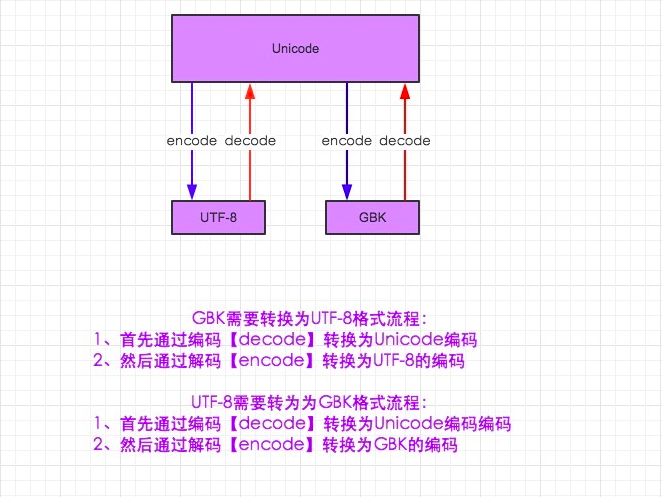

# Python与文件系统

## 文本文件

`Txt`文本文件是一种常见且基础的文件类型，我们开发运维可能经常和它打交道。

Python自带有最基础的文件读写、修改、删除等操作的函数。这些函数和方法常见的对象是txt文本文件。

下面我们将介绍Python对txt文档的一些基本操作。

### open() 打开文本文档

`open()`方法的3种模式：

```python
f = open("TEST.txt") ##默认模式是r，只读
## 只读模式，默认模式
f = open("TEST.txt", mode="r")
## 写模式，若文件已存在，则会覆盖
f = open("TEST.txt", mode="w")
## 追加模式，写到文件末尾
f = open("TEST.txt", mode="a")
```

### 基于 open() 新建一个txt文档

```python
f1= open("reports.txt", mode="w")
```

通过上面这个步骤，新建了一个名为“report.txt”的新的空白文档。

### write() 写入内容

接下来，往里面写入内容

```python
f1.write("张三\n") ## “\n”表示换行符
f1.write("李四\n")
f1.write("王五\n")
f1.close()  ##保存并关闭
```

> 记得用 `close()` 保存并关闭

### read()读取文档中的内容

```python
f1 = open("reports.txt")
f1.read()
```

### 追加模式

```python
f1 = open("reports.txt", mode="a")
f1.write("赵六\n") ##自动加到文档的尾部
f1.close() ##保存关闭之后，才会看到效果
```

### 逐行遍历一个文本文档

csv文件

```csv
张三,99,80,89
李四,79,60,83
王五,90,82,79
赵六,87,75,65
```

tsv文件

```tsv
张三	99	80	89
李四	79	60	83
王五	90	82	79
赵六	87	75	65
```

打开文件并全部读出

```python
f2 = open("reports.txt")
f2.read()
```

用 `for` 进行逐行的遍历

```python
f2 = open("reports.txt")
for line in f2:
    print(line)
```

使用`split()`分割

```python
# -*- coding: utf-8 -*-
f2 = open(r"D:\Python\Excel\reports.txt")
for line in f2:
    cols = line.split(',')
    for col in cols:
        print(col)
```

乱码，解决方案

```python
# -*- coding: utf-8 -*-
f2 = open(r"D:\Python\Excel\reports.txt", 'r', encoding="UTF-8")
for line in f2:
    cols = line.split(',')
    for col in cols:
        print(col)
```

如果源文件为GBK，怎么办？

首先先将reports.txt内容另存为GBK为测试做准备。

```python
# -*- coding: utf-8 -*-
f2 = open(r"D:\Python\Excel\reports.txt", 'r', encoding="GBK")
for line in f2:
    cols = line.split(',')
    for col in cols:
        print(col)
```

将GBK文件另存为UTF8

```python
f1 = open(r"D:\Python\Excel\reports.txt", 'r', encoding="GBK")
contents = f1.read()
f2 = open(r"D:\Python\Excel\reports-utf-8.txt", mode="w", encoding="UTF-8")
f2.write(contents)
f1.close()
f2.close()
```

> 我们可以观察到reports-utf-8.txt比reports.txt大了一些

UTF8内容另存为GBK

```python
f1 = open("reports.txt", mode="w", encoding="GBK")
f1.write("赵六\n")
f1.close()
```

### 练习1

* 根据学生列表，随机生成语数外三门课的成绩（百分制），保存成csv文件
* 读取刚刚生成的csv文件，生成报表，包括以下信息：
  * 每门课的最高分，最低分，平均分，优秀率（>=80分），及格率（>=60分 ）
  * 每门课的排行榜

排行榜提示（使用二维列表的第N个元素进行排序）

```python
# 获取第二个元素
list1 = [[1, 2],[3, 4],[4, 1],[1, 3]]
def takeSecond(ele):
    return ele[0]
list1.sort(key=takeSecond)
print('排序1：', list1)
```

输出结果：

```sh
排序1： [[4, 1], [2, 2], [1, 3], [3, 4]]
```

### 练习2

要从名为 `access_log_Aug95` 的文件中随机提取 20000 条数据并将其另存为 `access_log_Aug95.log`，可以使用 Python 的 `random` 模块和文件操作功能。以下是一个完整的示例代码，展示了如何实现这一过程。

#### 实现步骤

1. **读取原始日志文件**：打开并读取 `access_log_Aug95` 文件。
2. **随机选择 5000 条数据**：使用 `random.sample()` 方法从文件中随机选择 5000 条数据。
3. **写入新文件**：将选中的数据写入新的文件 `access_log_Aug95.log`。

#### 示例代码

```python
import random

# 定义文件名
input_file = "./data/access_log_Aug95"
output_file = "./data/access_log_Aug95.log"

# 1. 读取原始日志文件
with open(input_file, "r", encoding="utf-8", errors="ignore") as f:
    lines = f.readlines()

# 2. 随机选择 5000 条数据
# 确保不超过文件行数
num_samples = min(5000, len(lines))
random_lines = random.sample(lines, num_samples)

# 3. 写入新文件
with open(output_file, "w") as f:
    f.writelines(random_lines)

print(f"随机选择了 {num_samples} 条数据，并保存到 {output_file}。")
```

#### 代码说明

1. **读取原始日志文件**：使用 `open()` 函数以读取模式打开 `access_log_Aug95` 文件，并使用 `readlines()` 方法将所有行读取到一个列表中。
2. **随机选择数据**：使用 `random.sample()` 方法从读取的行中随机选择 5000 条数据。为了避免在文件行数少于 5000 时出现错误，使用 `min()` 函数确保选择的数量不超过文件的总行数。
3. **写入新文件**：使用 `open()` 函数以写入模式打开 `access_log_Aug95.log` 文件，并使用 `writelines()` 方法将选中的行写入新文件。
4. **输出结果**：打印一条消息，确认随机选择的行数和保存的文件名。

#### 注意事项

- 确保 `access_log_Aug95` 文件在当前工作目录中，或者提供正确的文件路径。
- 如果文件非常大，使用 `readlines()` 可能会消耗大量内存。在这种情况下，可以考虑逐行读取文件并使用其他方法来随机选择行。
- 如果你希望每次运行时都能得到不同的随机结果，可以在代码中设置随机种子（例如 `random.seed()`），但通常不需要。

## 字符编码的转换

> 在python 2中默认编码是 ASCII，而在python 3中默认编码是 unicode
>
> utf-8是可变长字符编码,它是unicode的优化，所有的英文字符依然按ASCII形式存储，所有的中文字符统一是3个字节
>
> unicode包含了所有国家的字符编码，不同字符编码之间的转换都需要经过unicode的过程
>
> python本身的默认编码是utf-8

py2中的编码和转码的过程，如图




### py2字符编码的转换

```python
# -*- coding:utf-8 -*-

s = "我是学员"
# utf-8解码成unicode编码
s_to_unicode = s.decode("utf-8")
print("--------s_to_unicode-----")
print(s_to_unicode)
# 然后unicode再编码成gbk
s_to_gbk = s_to_unicode.encode("gbk")
print("-----s_to_gbk------")
print(s_to_gbk)
# gbk解码成unicode再编码成utf-8
gbk_to_utf8 = s_to_gbk.decode("gbk").encode("utf-8")
print("------gbk_to_utf8-----")
print(gbk_to_utf8)
```

输出

```sh
--------s_to_unicode-----
我是学员
-----s_to_gbk------
我是学员
------gbk_to_utf8-----
鎴戞槸瀛﹀憳
```

> 以上这种情况适合字符是非unicode编码

字符编码已经是unicode情况下，代码如下：

```python
# -*- coding:utf-8 -*-

# u代码字符编码是unicode
s = u'你好'
# 已经是unicode，所以这边直接是编码成gbk
s_to_gbk = s.encode("gbk")
print("----s_to_gbk----")
print(s_to_gbk)
# 这边再解码成unicode然后再编码成utf-8
gbk_to_utf8 = s_to_gbk.decode("gbk").encode("utf-8")
print("-----gbk_to_utf8---")
print(gbk_to_utf8)
```

输出

```sh
----s_to_gbk----
你好
-----gbk_to_utf8---
浣犲ソ
```

> 注：在python2中，在文件的开头指定字符编码，是要告诉解释器我现在的字符编码使用的是utf-8，那我在打印的中文时候，那么在utf-8中包含中文字符，那么可以打印出来。那么如果你不制定字符编码，默认使用系统编码，如果你的系统编码是ASCII，那么就会报错，因为ASCII不能存中文字符。

### py3的字符编码转换

python 3的编码，默认是unicode，所以字符编码之间的转换不需要decode过程，直接encode即可，代码如下：

```python
#! /usr/bin/env python
# 无需声明字符编码，当然你声明也不会报错
 
s = '你好'
# 字符串s已经是unicode编码，无需decode,直接encode
s_to_gbk = s.encode("gbk")
print("----s_to_gbk----")
print(s_to_gbk)
# 这边还是一样，gbk需要先解码成unicode，再编码成utf-8
gbk_to_utf8 = s_to_gbk.decode("gbk").encode("utf-8")
print("-----gbk_to_utf8---")
print(gbk_to_utf8)
# 解码成unicode字符编码
utf8_decode = gbk_to_utf8.decode("utf-8")
print("-------utf8_decode----")
print(utf8_decode)
```

输出

```sh
----s_to_gbk----
b'\xc4\xe3\xba\xc3'
-----gbk_to_utf8---
b'\xe4\xbd\xa0\xe5\xa5\xbd'
-------utf8_decode----
你好
```

在python 3中encode编码的同时会把string变成bytes类型，decode解码的同时会把bytes类型变成string类型，所以你就不难看出encode后的把它变成了一个bytes类型的数据。

还有需要特别注意的是：不管是否在python 3的文件开头申明字符编码，只能表示，这个python文件是这个字符编码，文件中的字符串还是unicode

### chardet

想知道python 的某个bytes类型是通过什么类型编码，可以先安装chardet 。

```sh
pip install chardet
```

```python
import chardet

str = "python编码"
# 转为utf-8 类型的bytes 字符串
str_utf8 = str.encode("utf-8")
print("转码结果：" + repr(str_utf8))
print(type(str_utf8))
print(chardet.detect(str_utf8))
print("解码结果：" + str_utf8.decode("utf-8"))
```

转码结果

```sh
转码结果：b'python\xe7\xbc\x96\xe7\xa0\x81'
<class 'bytes'>
{'encoding': 'utf-8', 'confidence': 0.7525, 'language': ''}
解码结果：python编码
```

判断中文

```python
import chardet

print(chardet.detect('因为计算机只能处理数字，如果要处理文本，就必须先把文本转换为数字才能处理。'.encode('GBK')))
```

判断结果

```sh
{'encoding': 'GB2312', 'confidence': 0.99, 'language': 'Chinese'}
```

判断文本文件的编码

```python
import chardet

f1 = open(r"C:\Users\lgc653\reports.txt", 'r')
contents = f1.read()
print(chardet.detect(contents.encode()))
```

### 总结

* unicode能识别所有字符编码的字符串
* 在python 2中，字符编码之间的转化需要通过unicode才能转换，所以打印时，可以是使用unicode，也可以使用对应的字符编码(文件开头指定编码)，打印字符或者字符串，因为py2中没有对字符和字节做明显区分，所以才混导致这样的结果。
* 在python 3中，只有通过Unicode去识别字符的，如果转成编码成对应编码格式了，就直接变成对应编码的bytes类型的字节码，也就是二进制，需要识别，必须解码成Unicode才能识别

## os模块

OS其实就是Operator System的缩写，即操作系统。对于文件系统的访问，Python一般都是通过OS模块来实现的。我们所知道常用的操作系统就有Windows、Mac OS、Linux等，这些操作系统底层对于文件系统的访问工作原理是不一样的，如果要针对不同的操作系统来考虑使用哪些文件系统模块时非常麻烦的，当程序运行环境一旦改变，就要相应的去修改大量的代码。

但是，Python作为跨平台语言，其同样的源代码在不同的操作系统下不需要修改就可以同样实现，有了OS模块，就不需要关心什么操作系统下使用什么模块，OS模块会帮你选择正确的模块并调用。

### 函数与定义

首先先给出一些常用的函数使用方法

* getcwd()：返回当前工作目录
* chdir(path)：改变工作目录
* listdir(path = '.')：列举指定目录中的文件名（ '.'表示当前目录， '..'表示上一级目录）
* mkdir(path)：创建单层目录，如该目录已存在则抛出异常
* makedirs(path)：递归创建多层目录，如果该目录已存在则抛出异常
* remove(path)：删除文件
* rmdir(path)：删除单层目录，如果该目录非空则抛出异常
* removedirs(path)：递归删除目录，从子目录到父目录逐层尝试删除，遇到目录非空则抛出异常
* rename(old, new)：将文件old重命名为new
* system(command)：运行系统的shell命令

以下是支持路径操作中常用到的一些定义，支持所有平台

* os.curdir：指代当前目录
* os.pardir：指代上一级目录
* os.sep：输出操作系统特定的路径分隔符（在Windows下为`\\`，在Linux下为`/`）
* os.linesep：当前平台使用的行终止符（在Windows下为`\r\n`，在Linux下为`\n`）
* os.name：指代当前使用的操作系统（包括posix、nt、mac、os2、ce、java）

### 遍历目录

#### os模块的walk函数

```python
os.walk(top, topdown=True, onerror=None, followlinks=False)
```

返回

- dirpath：要列出指定目录的路径
- dirnames：目录下的所有文件夹
- filenames：目录下的所有文件

参数一：top – 根目录下的每一个文件夹(包含它自己), 产生3-元组 (dirpath, dirnames, filenames)【文件夹路径, 文件夹名字, 文件名】。

参数二：topdown –可选，为True或者没有指定, 一个目录的的3-元组将比它的任何子文件夹的3-元组先产生 (目录自上而下)。如果topdown为 False, 一个目录的3-元组将比它的任何子文件夹的3-元组后产生 (目录自下而上)。

参数三：onerror – 可选，是一个函数; 它调用时有一个参数, 一个OSError实例。报告这错误后，继续walk,或者抛出exception终止walk。

参数四：followlinks – 设置为 true，则通过软链接访问目录。

```python
# coding:utf-8
import os


def getallfiles(path):
    allfile = []
    for dirpath, dirnames, filenames in os.walk(path):
        for dir in dirnames:
            allfile.append(os.path.join(dirpath, dir))
        for name in filenames:
            allfile.append(os.path.join(dirpath, name))
    return allfile


if __name__ == '__main__':
    path = "C:\\Users\\lgc653\\Documents\\3D Objects"
    allfile = getallfiles(path)
    for file in allfile:
        print(file)
```

#### 利用递归

```python
# coding:utf-8
import os

allfile = []


def getallfile(path):
    allfilelist = os.listdir(path)
    for file in allfilelist:
        filepath = os.path.join(path, file)
        # 判断是不是文件夹
        if os.path.isdir(filepath):
            getallfile(filepath)
        allfile.append(filepath)
    return allfile


if __name__ == '__main__':

    path = "C:\\Users\\lgc653\\Documents\\3D Objects"
    allfiles = getallfile(path)

    for item in allfiles:
        print(item)

```

### system(command)

举例，利用7z获取压缩文件内部文件列表

```sh
file = "C:\\Users\\lgc653\\Downloads\\4fJ78KYZokkUwGJ3vyaHgVJx.zip"
os.system("\"c:\\Program Files\\7-Zip\\7z.exe\" l %s" % file)
```

得到结果

```sh
7-Zip 22.01 (x64) : Copyright (c) 1999-2022 Igor Pavlov : 2022-07-15

Scanning the drive for archives:
1 file, 9004969 bytes (8794 KiB)

Listing archive: C:\Users\lgc653\Downloads\4fJ78KYZokkUwGJ3vyaHgVJx.zip

--
Path = C:\Users\lgc653\Downloads\4fJ78KYZokkUwGJ3vyaHgVJx.zip
Type = zip
Physical Size = 9004969

   Date      Time    Attr         Size   Compressed  Name
------------------- ----- ------------ ------------  ------------------------
2017-04-03 23:35:55 ....A       241834       216035  更多图纸（机械狗社区）.jpg
2014-05-25 15:37:40 D....            0            0  旋转抓取机构
2014-04-20 21:02:46 ....A       181097       165565  旋转抓取机构\103063-p009_any.prt.1
2014-04-20 21:02:46 ....A        79256        65144  旋转抓取机构\103063-p049_any.prt.1
2014-04-20 21:02:46 ....A       404815       374251  旋转抓取机构\103063-p054_any.prt.1
2014-04-20 21:02:46 ....A        66688        50635  旋转抓取机构\103063-p055_any.prt.1
2014-04-20 21:02:46 ....A       135993       120657  旋转抓取机构\103063-p071_any.prt.1
2014-04-20 21:03:00 ....A        48627        31599  旋转抓取机构\103063-p082.asm.1
2014-04-20 21:02:58 ....A       135487        95322  旋转抓取机构\103063-p082_any.asm.1
2014-04-20 21:02:48 ....A       140875       124565  旋转抓取机构\103063-p083_any.prt.1
2014-04-20 21:02:48 ....A       160311       144228  旋转抓取机构\103063-p084_any.prt.1
2014-04-20 21:02:48 ....A       106831        92486  旋转抓取机构\103063-p085_any.prt.1

略…… 
```

但是这个输出结果不可控，当我们要获取输出结果进一步操作时，需要用subprocess

```python
import subprocess

file = "C:\\Users\\lgc653\\Downloads\\4fJ78KYZokkUwGJ3vyaHgVJx.zip"
ret = subprocess.run("\"c:\\Program Files\\7-Zip\\7z.exe\" l %s" % file, shell=True, stdout=subprocess.PIPE, stderr=subprocess.PIPE)
print(ret.stdout.decode('gbk'))
print(ret.stderr.decode('gbk'))
```

这样我们就可以判断ret.stdout的内容了，这时候我们就需要正则表达式来帮助我们

首先我们要让格式更容易分析

```sh
"c:\Program Files\7-Zip\7z.exe" l  "C:\Users\lgc653\Downloads\4fJ78KYZokkUwGJ3vyaHgVJx.zip" -ba -slt
```

### 练习题

#### 查找某目录下的相同文件

> 提示：文件名，文件大小相同都不能确定文件是一样的，但是文件的md5值可以，那么如何获取

```sh
## linux 
md5sum logos.zip
# 显示
dffcdd2472a531bc887ffd825954a032  logos.zip
## windows
certutil -hashfile C:\Users\lgc653\Desktop\logos.zip MD5
# 显示
MD5 的 C:\Users\lgc653\Desktop\logos.zip 哈希:
dffcdd2472a531bc887ffd825954a032
CertUtil: -hashfile 命令成功完成。
```

#### 查找某目录下面的压缩文件中包含哪些csv文件

* 遍历目录下面的所有压缩文件
* 通过7z（注意不支持rar，7za才支持rar，linux下面要特别编译）的命令在不解压的情况下面获得哪些压缩文件包含csv文件
* 解压这些文件，将csv文件拷贝到某个指定目录，准备解析

#### 查找某目录下面的视频文件，生成其缩略图和预览片段（10秒）

* 遍历目录下面的所有MP4文件
* 通过神器ffmpeg实现以上功能

```sh
C:\Tools\ffmpeg\ffmpeg.exe -i "C:\Users\lgc653\Documents\3D Objects\gltf\backgroud.mp4" -ss 10 -f image2 -frames:v 1 sample.png
C:\Tools\ffmpeg\ffmpeg.exe -i "C:\Users\lgc653\Documents\3D Objects\gltf\backgroud.mp4" -vframes 30 -y -f gif sample.gif
C:\Tools\ffmpeg\ffmpeg.exe -i "C:\Users\lgc653\Documents\3D Objects\gltf\backgroud.mp4" -ss 00:08 -to 00:18 -c:v libx264 -crf 30 sample.mp4
```

> 视频截图，随机截某一时刻，但视频可能很短，可能会超出范围，如何解决
