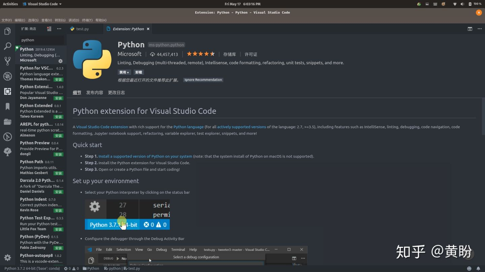
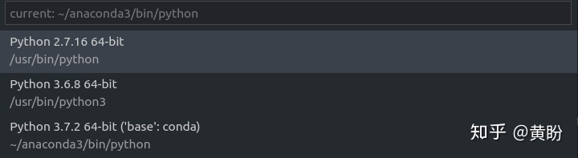

# Python基础

Python 是一种解释型、面向对象、动态数据类型的高级程序设计语言。Python 由 Guido van Rossum 于 1989 年底发明，第一个公开发行版发行于 1991 年。像 Perl 语言一样, Python 源代码同样遵循 GPL(GNU General Public License) 协议。

**官方宣布，2020 年 1 月 1 日， 停止 Python 2 的更新。**

**Python 2.7 被确定为最后一个 Python 2.x 版本。**

## Python的安装

Windows下载安装包安装，Linux大多内置2.x版本

### Window 平台安装 Python:

以下为在 Window 平台上安装 Python 的简单步骤：

- 打开 WEB 浏览器访问https://www.python.org/downloads/windows/

  

- 在下载列表中选择Window平台安装包，包格式为：*python-XYZ.msi* 文件 ， XYZ 为你要安装的版本号。

- 要使用安装程序 *python-XYZ.msi*, Windows 系统必须支持 Microsoft Installer 2.0 搭配使用。只要保存安装文件到本地计算机，然后运行它，看看你的机器支持 MSI。Windows XP 和更高版本已经有 MSI，很多老机器也可以安装 MSI。

  

  

- 下载后，双击下载包，进入 Python 安装向导，安装非常简单，你只需要使用默认的设置一直点击"下一步"直到安装完成即可。

### MAC 平台安装 Python:

MAC 系统一般都自带有 Python2.x版本 的环境，你也可以在链接 https://www.python.org/downloads/mac-osx/ 上下载最新版安装。

## 环境变量配置

程序和可执行文件可以在许多目录，而这些路径很可能不在操作系统提供可执行文件的搜索路径中。

path(路径)存储在环境变量中，这是由操作系统维护的一个命名的字符串。这些变量包含可用的命令行解释器和其他程序的信息。

Unix或Windows中路径变量为PATH（UNIX区分大小写，Windows不区分大小写）。

在Mac OS中，安装程序过程中改变了python的安装路径。如果你需要在其他目录引用Python，你必须在path中添加Python目录。

### 在 Unix/Linux 设置环境变量

- 在 csh shell输入

  ```sh
  setenv PATH "$PATH:/usr/local/bin/python"
  ```

- 在 bash shell (Linux)输入

  ```sh
  export PATH="$PATH:/usr/local/bin/python" 
  ```

- 在 sh 或者 ksh shell:

  ```sh
  PATH="$PATH:/usr/local/bin/python" 
  ```

**注意:** /usr/local/bin/python 是 Python 的安装目录。

### 在 Windows 设置环境变量

在环境变量中添加Python目录：

**在命令提示框中(cmd) :** 输入

```sh
path=%path%;C:\Python 
```

**注意:** C:\Python 是Python的安装目录。

也可以通过以下方式设置：

- 右键点击"计算机"，然后点击"属性"
- 然后点击"高级系统设置"
- 选择"系统变量"窗口下面的"Path",双击即可！
- 然后在"Path"行，添加python安装路径即可(我的D:\Python32)，所以在后面，添加该路径即可。 **ps：记住，路径直接用分号"；"隔开！**
- 最后设置成功以后，在cmd命令行，输入命令"python"，就可以有相关显示。


常见安装目录

* c:\Python27\
* c:\Python27\Scripts\
* C:\Users\lgc653\AppData\Local\Programs\Python\Python37\
* C:\Users\lgc653\AppData\Local\Programs\Python\Python37\Scripts\

## Python 环境变量

下面几个重要的环境变量，它应用于Python：

| 变量名        | 描述                                                         |
| :------------ | :----------------------------------------------------------- |
| PYTHONPATH    | PYTHONPATH是Python搜索路径，默认我们import的模块都会从PYTHONPATH里面寻找。 |
| PYTHONSTARTUP | Python启动后，先寻找PYTHONSTARTUP环境变量，然后执行此变量指定的文件中的代码。 |
| PYTHONCASEOK  | 加入PYTHONCASEOK的环境变量, 就会使python导入模块的时候不区分大小写. |
| PYTHONHOME    | 另一种模块搜索路径。它通常内嵌于的PYTHONSTARTUP或PYTHONPATH目录中，使得两个模块库更容易切换。 |

## 运行Python

有三种方式可以运行Python：

### 1、交互式解释器：

你可以通过命令行窗口进入 Python，并在交互式解释器中开始编写 Python 代码。

你可以在 Unix、DOS 或任何其他提供了命令行或者 shell 的系统进行 Python 编码工作。

```sh
$ python # Unix/Linux
```

或者

```sh
C:>python # Windows/DOS
```

以下为Python命令行参数：

| 选项   | 描述                                                   |
| :----- | :----------------------------------------------------- |
| -d     | 在解析时显示调试信息                                   |
| -O     | 生成优化代码 ( .pyo 文件 )                             |
| -S     | 启动时不引入查找Python路径的位置                       |
| -V     | 输出Python版本号                                       |
| -X     | 从 1.6版本之后基于内建的异常（仅仅用于字符串）已过时。 |
| -c cmd | 执行 Python 脚本，并将运行结果作为 cmd 字符串。        |
| file   | 在给定的python文件执行python脚本。                     |

### 2、命令行脚本

在你的应用程序中通过引入解释器可以在命令行中执行Python脚本，如下所示：

```sh
$ python script.py # Unix/Linux
```

或者

```sh
C:>python script.py # Windows/DOS
```

**注意：**在执行脚本时，请检查脚本是否有可执行权限。

### 3、集成开发环境（IDE：Integrated Development Environment）

https://code.visualstudio.com/docs/python/python-tutorial


## 执行Python程序

对于大多数程序语言，第一个入门编程代码便是 "Hello World！"，以下代码为使用 Python 输出 "Hello World！"：

```python
#!/usr/bin/python
 
print("Hello, World!")
```

实例(Python 3.0+)

```python
#!/usr/bin/python3
 
print("Hello, World!")
```

## Python2.x与3.x版本区别

Python的3.0版本，常被称为Python 3000，或简称Py3k。相对于Python的早期版本，这是一个较大的升级。

为了不带入过多的累赘，Python 3.0在设计的时候没有考虑向下相容。

许多针对早期Python版本设计的程式都无法在Python 3.0上正常执行。

为了照顾现有程式，Python 2.6作为一个过渡版本，基本使用了Python 2.x的语法和库，同时考虑了向Python 3.0的迁移，允许使用部分Python 3.0的语法与函数。

新的Python程式建议使用Python 3.0版本的语法。

除非执行环境无法安装Python 3.0或者程式本身使用了不支援Python 3.0的第三方库。目前不支援Python 3.0的第三方库有Twisted, py2exe, PIL等。

大多数第三方库都正在努力地相容Python 3.0版本。即使无法立即使用Python 3.0，也建议编写相容Python 3.0版本的程式，然后使用Python 2.6, Python 2.7来执行。

Python 3.0的变化主要在以下几个方面:

### print 函数

print语句没有了，取而代之的是print()函数。 Python 2.6与Python 2.7部分地支持这种形式的print语法。在Python 2.6与Python 2.7里面，以下三种形式是等价的：

```python
print "fish"
print ("fish") #注意print后面有个空格
print("fish") #print()不能带有任何其它参数
```

然而，Python 2.6实际已经支持新的print()语法：

```python
from __future__ import print_function
print("fish", "panda", sep=', ')
```

### Unicode

Python 2 有 ASCII str() 类型，unicode() 是单独的，不是 byte 类型。

现在， 在 Python 3，我们最终有了 Unicode (utf-8) 字符串，以及一个字节类：byte 和 bytearrays。

由于 Python3.X 源码文件默认使用utf-8编码，这就使得以下代码是合法的：

```python
>>> 中国 = 'china' 
>>>print(中国) 
china
```

Python 2.x

```python
>>> str = "我爱北京天安门"
>>> str
'\xe6\x88\x91\xe7\x88\xb1\xe5\x8c\x97\xe4\xba\xac\xe5\xa4\xa9\xe5\xae\x89\xe9\x97\xa8'
>>> str = u"我爱北京天安门"
>>> str
u'\u6211\u7231\u5317\u4eac\u5929\u5b89\u95e8'
```

Python 3.x

```python
>>> str = "我爱北京天安门"
>>> str
'我爱北京天安门'
```

### 除法运算

Python中的除法较其它语言显得非常高端，有套很复杂的规则。Python中的除法有两个运算符，`/`和`//`

首先来说/除法:

在python 2.x中`/`除法就跟我们熟悉的大多数语言，比如Java啊C啊差不多，整数相除的结果是一个整数，把小数部分完全忽略掉，浮点数除法会保留小数点的部分得到一个浮点数的结果。

在python 3.x中`/`除法不再这么做了，对于整数之间的相除，结果也会是浮点数。

Python 2.x:

```python
>>> 1 / 2
0
>>> 1.0 / 2.0
0.5
```

Python 3.x:

```python
>>> 1/2
0.5
```

而对于`//`除法，这种除法叫做floor除法，会对除法的结果自动进行一个floor操作，在python 2.x和python 3.x中是一致的。

python 2.x:

```python
>>> -1 // 2
-1
```

python 3.x:

```python
>>> -1 // 2
-1
```

注意的是并不是舍弃小数部分，而是执行 floor 操作，如果要截取整数部分，那么需要使用 math 模块的 trunc 函数

python 3.x:

```python
>>> import math
>>> math.trunc(1 / 2)
0
>>> math.trunc(-1 / 2)
0
```

### 异常

在 Python 3 中处理异常也轻微的改变了，在 Python 3 中我们现在使用 as 作为关键词。

捕获异常的语法由 **except exc, var** 改为 **except exc as var**。

使用语法except (exc1, exc2) as var可以同时捕获多种类别的异常。 Python 2.6已经支持这两种语法。

- 在2.x时代，所有类型的对象都是可以被直接抛出的，在3.x时代，只有继承自BaseException的对象才可以被抛出。
- 2.x raise语句使用逗号将抛出对象类型和参数分开，3.x取消了这种奇葩的写法，直接调用构造函数抛出对象即可。

在2.x时代，异常在代码中除了表示程序错误，还经常做一些普通控制结构应该做的事情，在3.x中可以看出，设计者让异常变的更加专一，只有在错误发生的情况才能去用异常捕获语句来处理。

### xrange

在 Python 2 中 xrange() 创建迭代对象的用法是非常流行的。比如： for 循环或者是列表/集合/字典推导式。

这个表现十分像生成器（比如。"惰性求值"）。但是这个 xrange-iterable 是无穷的，意味着你可以无限遍历。

由于它的惰性求值，如果你不得仅仅不遍历它一次，xrange() 函数 比 range() 更快（比如 for 循环）。尽管如此，对比迭代一次，不建议你重复迭代多次，因为生成器每次都从头开始。

在 Python 3 中，range() 是像 xrange() 那样实现以至于一个专门的 xrange() 函数都不再存在（在 Python 3 中 xrange() 会抛出命名异常）。

```python
import timeit

n = 10000
def test_range(n):
    return for i in range(n):
        pass

def test_xrange(n):
    for i in xrange(n):
        pass   
```

Python 2

```python
print 'Python', python_version()

print '\ntiming range()' 
%timeit test_range(n)

print '\n\ntiming xrange()' 
%timeit test_xrange(n)

Python 2.7.6

timing range()
1000 loops, best of 3: 433 µs per loop


timing xrange()
1000 loops, best of 3: 350 µs per loop
```

Python 3

```python
print('Python', python_version())

print('\ntiming range()')
%timeit test_range(n)

Python 3.4.1

timing range()
1000 loops, best of 3: 520 µs per loop
print(xrange(10))
---------------------------------------------------------------------------
NameError                                 Traceback (most recent call last)
<ipython-input-5-5d8f9b79ea70> in <module>()
----> 1 print(xrange(10))

NameError: name 'xrange' is not defined
```

### 八进制字面量表示

八进制数必须写成0o777，原来的形式0777不能用了；二进制必须写成0b111。

新增了一个bin()函数用于将一个整数转换成二进制字串。 Python 2.6已经支持这两种语法。

在Python 3.x中，表示八进制字面量的方式只有一种，就是0o1000。

python 2.x

```python
>>> 0o1000
512
>>> 01000
512
```

python 3.x

```python
>>> 01000
  File "<stdin>", line 1
    01000
        ^
SyntaxError: invalid token
>>> 0o1000
512
```

### 不等运算符

Python 2.x中不等于有两种写法 != 和 <>

Python 3.x中去掉了<>, 只有!=一种写法，还好，我从来没有使用<>的习惯


### 去掉了repr表达式``

Python 2.x 中反引号``相当于repr函数的作用

Python 3.x 中去掉了``这种写法，只允许使用repr函数，这样做的目的是为了使代码看上去更清晰么？不过我感觉用repr的机会很少，一般只在debug的时候才用，多数时候还是用str函数来用字符串描述对象。

```python
def sendMail(from_: str, to: str, title: str, body: str) -> bool:
    pass
```

### 多个模块被改名（根据PEP8）

| 旧的名字     | 新的名字     |
| :----------- | :----------- |
| _winreg      | winreg       |
| ConfigParser | configparser |
| copy_reg     | copyreg      |
| Queue        | queue        |
| SocketServer | socketserver |
| repr         | reprlib      |

StringIO模块现在被合并到新的io模组内。 new, md5, gopherlib等模块被删除。 Python 2.6已经支援新的io模组。

httplib, BaseHTTPServer, CGIHTTPServer, SimpleHTTPServer, Cookie, cookielib被合并到http包内。

取消了exec语句，只剩下exec()函数。 Python 2.6已经支援exec()函数。


### 数据类型

1）Py3.X去除了long类型，现在只有一种整型——int，但它的行为就像2.X版本的long

2）新增了bytes类型，对应于2.X版本的八位串，定义一个bytes字面量的方法如下：

```python
>>> b = b'china' 
>>> type(b) 
<type 'bytes'> 
```

str 对象和 bytes 对象可以使用 .encode() (**str -> bytes**) 或 .decode() (**bytes -> str**)方法相互转化。

```python
>>> s = b.decode() 
>>> s 
'china' 
>>> b1 = s.encode() 
>>> b1 
b'china' 
```

3）dict的.keys()、.items 和.values()方法返回迭代器，而之前的iterkeys()等函数都被废弃。同时去掉的还有 dict.has_key()，用 in替代它吧 。

## VSCode

## 安装配置 Python 插件

### 安装 Python 插件

在 VSCode 中搜索扩展 Python，如下图：



安装完成后需要重新加载 VSCode 使插件生效。

### 配置 Python 环境

在 VSCode 中点击状态栏左下角的 Python 图标：


然后选择 Python 解释器：




### 错误提示和格式化

Python 默认的语法提示工具是 PyLint，也可以选择其他的 linter 工具，比如 flake8。flake8 是 Python 官方发布的一款静态代码检查工具，如果想使用它的话首先在 Anaconda 的命令行工具中用 `pip install flake8` 安装；另外，在保存代码的时候 VSCode 可以自动进行 code formatting ，这个功能默认是关闭的且工具是 autopep8 , 如果想使用 yafp，则继续在命令行工具中用命令 `pip install yapf` 安装。 安装好这两个工具之后在 VSCode 的配置文件中进行设置：

```text
"python.linting.enabled": true
"python.linting.flake8Enabled": true,
"python.formatting.provider": "yapf"
```

## pip

pip 是一个 Python 包安装与管理工具。

从PyPI安装软件包：

```sh
$ pip install SomePackage
[...]
Successfully installed SomePackage
```

安装已经从PyPI下载或从其他地方获得的软件包：

```sh
pip install paddlepaddle -i https://mirrors.aliyun.com/pypi/simple/
pip install paddlepaddle -i http://pypi.douban.com/simple --trusted-host pypi.douban.com
C:\Users\lgc653\AppData\Local\Programs\Python\Python37\python.exe -m pip install paddlepaddle -i https://mirror.baidu.com/pypi/simple
pip install pip-20.2.3-py2.py3-none-any.whl
pip install -r requirements.txt
```

requirements.txt内容格式为：

```
APScheduler==2.1.2
Django==1.5.4
MySQL-Connector-Python==2.0.1
MySQL-python==1.2.3
PIL==1.1.7
South==1.0.2
django-grappelli==2.6.3
django-pagination==1.0.7
```

### 卸载包

```sh
pip uninstall <包名>
pip uninstall -r requirements.txt
```

### 升级包

```sh
pip install -U <包名>
pip install <包名> --upgrade
```

### 升级pip

```sh
pip install -U pip
```

### 显示包所在的目录

```sh
pip show -f <包名>
```

### 搜索包

```sh
pip search <搜索关键字>
```

### 查询可升级的包

```sh
pip list -o
```

### 下载包而不安装

```sh
pip install <包名> -d <目录>
pip install -d <目录> -r requirements.txt
```

### 打包

```sh
pip wheel <包名>
```

### 更换国内pypi镜像

#### 国内pypi镜像

- V2EX：[pypi.v2ex.com/simple](http://pypi.v2ex.com/simple)
- 豆瓣：http://pypi.douban.com/simple
- 中国科学技术大学：http://pypi.mirrors.ustc.edu.cn/simple/

#### 指定单次安装源

```sh
pip install <包名> -i http://pypi.v2ex.com/simple
```

#### 指定全局安装源

在unix和macos，配置文件为：$HOME/.pip/pip.conf
在windows上，配置文件为：%HOME%\pip\pip.ini

```
[global]
timeout = 6000
	index-url = http://pypi.douban.com/simple
```

#### 检测包是否安装

```python
import importlib
import subprocess

def install_if_not_exists(package):
    try:
        importlib.import_module(package)
    except ImportError:
        subprocess.check_call(["pip", "install", package])


# 检查并安装selenium和pandas
install_if_not_exists("selenium")
install_if_not_exists("pandas")
```

## [python常用包收集](https://www.cnblogs.com/maplered/p/7843232.html)

### Web框架:

* Tornado：访问：http://www.tornadoweb.org/en/stable/
* Flask：访问：http://flask.pocoo.org/
* Web.py：访问：http://webpy.org/
* django：https://www.djangoproject.com/
* cherrypy：http://cherrypy.org/
* jinjs：http://docs.jinkan.org/docs/jinja2/

### GUI 图形界面

* Tkinter：https://wiki.python.org/moin/TkInter/
* wxPython：https://www.wxpython.org/
* PyGTK：http://www.pygtk.org/
* PyQt：https://sourceforge.net/projects/pyqt/
* PySide：http://wiki.qt.io/Category:LanguageBindings::PySide

### 科学计算

* numpy：http://www.numpy.org/
* Matplotlib：http://matplotlib.org/
* SciPy：https://www.scipy.org/
* pandas： http://pandas.pydata.org/
* blaze： http://blaze.readthedocs.io/en/latest/index.html

### 密码学

* cryptography：https://pypi.python.org/pypi/cryptography/
* hashids：http://www.oschina.net/p/hashids
* Paramiko：http://www.paramiko.org/
* Passlib：https://pythonhosted.org/passlib/
* PyCrypto：https://pypi.python.org/pypi/pycrypto
* PyNacl：http://pynacl.readthedocs.io/en/latest/

### 爬虫相关

* scrapy：https://scrapy.org/
* pyspider： https://github.com/binux/pyspider
* portia：https://github.com/scrapinghub/portia
* html2text：https://github.com/Alir3z4/html2text
* BeautifulSoup：https://www.crummy.com/software/BeautifulSoup/
* lxml：http://lxml.de/
* selenium：http://docs.seleniumhq.org/
* mechanize：https://pypi.python.org/pypi/mechanize
* PyQuery：https://pypi.python.org/pypi/pyquery/
* creepy：https://pypi.python.org/pypi/creepy
* gevent：一个高并发的网络性能库，访问：http://www.gevent.org/
* requests：最好用的http工具，访问：http://www.python-requests.org/

### 图像处理

* bigmoyan：http://scikit-image.org/
* Python Imaging Library(PIL)：http://www.pythonware.com/products/pil/
* pillow： http://pillow.readthedocs.io/en/latest/

### 自然语言处理

* nltk： http://www.nltk.org/
* snownlp： https://github.com/isnowfy/snownlp
* Pattern：https://github.com/clips/pattern
* TextBlob：http://textblob.readthedocs.io/en/dev/
* Polyglot：https://pypi.python.org/pypi/polyglot
* jieba： https://github.com/fxsjy/jieba

### 压缩

* zipfile：内置模块，用于创建和解压缩 ZIP 文件。  [zipfile 文档](https://docs.python.org/3/library/zipfile.html)
  
* tarfile：内置模块，用于处理 tar 文件（.tar、.tar.gz、.tar.bz2 等）。  [tarfile 文档](https://docs.python.org/3/library/tarfile.html)
  
* gzip：内置模块，用于处理 Gzip 格式的压缩文件。  [gzip 文档](https://docs.python.org/3/library/gzip.html)
  
* shutil：内置模块，提供高层次的文件操作，包括压缩和解压缩。  [shutil 文档](https://docs.python.org/3/library/shutil.html)
  
* pyzipper：一个用于处理 ZIP 文件的库，支持加密和解密。  [pyzipper GitHub](https://github.com/srusskih/pyzipper)
  
* rarfile：用于处理 RAR 文件的库。  [rarfile GitHub](https://github.com/miurahr/rarfile)

### 数据库驱动

* mysql-python： https://sourceforge.net/projects/mysql-python/
* PyMySQL：https://github.com/PyMySQL/PyMySQL
* PyMongo：https://docs.mongodb.com/ecosystem/drivers/python/
* pymongo：MongoDB库，访问：https://pypi.python.org/pypi/pymongo/
* redis：Redis库，访问：https://pypi.python.org/pypi/redis/
* cxOracle：Oracle库，访问：https://pypi.python.org/pypi/cx_Oracle
* SQLAlchemy：SQL工具包及对象关系映射（ORM）工具，访问：http://www.sqlalchemy.org/
* peewee：SQL工具包及对象关系映射（ORM）工具，访问：https://pypi.python.org/pypi/peewee
* torndb：Tornado原装DB，访问：https://github.com/bdarnell/torndb

### Web工具

* pycurl：URL处理工具
* smtplib： 发送电邮

### 代码实例zipfile

zipfile 是 Python 的内置模块，因此不需要通过 pip 安装。它随 Python 的标准库一起提供，可以直接导入并使用它，而无需额外的安装步骤。

> zipfile 模块不支持对 ZIP 压缩文件进行加密。

```python
import zipfile

# 创建一个 ZIP 文件
with zipfile.ZipFile('example.zip', 'w') as zipf:
    zipf.write('file1.txt')
    zipf.write('file2.txt')

# 解压缩 ZIP 文件
with zipfile.ZipFile('example.zip', 'r') as zipf:
    zipf.extractall('extracted_files')
```

### 代码实例Matplotlib

Matplotlib是python数据可视化工具包。是python最著名的绘图库，它提供了一整套和matlab相似的命令API，十分适合交互式地进行制图。而且也可以方便地将它作为绘图控件，嵌入GUI应用程序中。Matplotlib可以配合ipython shell使用，提供不亚于Matlab的绘图体验，总之用过了都说好。

在IPython控制台使用Matplotlib，可以使用ipython--matplotlib命令来启动IPython控制台程序；如果要在IPython notebook里使用Matplotlib，则在notebook的开始位置插入%matplotlib inline魔术命令即可。

IPython为Matplotlib专门提供了特殊的交互模式。IPython的Matplotlib模式有两个优点，一是提供了非阻塞的画图操作，二是不需要显示地调用show（）方法来显示画出来的图片。

安装包

```sh
pip3 install matplotlib requests -i https://mirrors.aliyun.com/pypi/simple/
```

> :zap:注意使用 Anaconda安装时，没有pip3这个命令

代码

```python
import matplotlib; matplotlib.use('TkAgg')
import matplotlib.pyplot as plt
import numpy as np

x = np.linspace(0, 20, 100)  # Create a list of evenly-spaced numbers over the range
plt.plot(x, np.sin(x))       # Plot the sine of each x point
plt.show()                   # Display the plot
```

> :warning: 注意千万不要用matplotlib.py命名文件名，这样python解释器会以为matplotlib.py是包的代码

### 代码实例Requests

`Requests`建立在`urllib3`基础上。它让 Web 请求变得非常简单。相比`urllib3`来说，很多人更喜欢这个包。而且使用它的最终用户可能也比`urllib3`更多。后者更偏底层，并且考虑到它对内部的控制级别，它一般是作为其他项目的依赖项。

下面这个例子说明 requests 用起来有多简单：

安装包

```sh
pip3 install requests -i https://mirrors.aliyun.com/pypi/simple/
```

代码

```sh
import requests
sr = requests.get('https://api.github.com/user', auth=('lgc653', 'pass'))
for attr in dir(sr):
    print(attr+":"+str(getattr(sr, attr)))
print(sr.text)
```

获得结果

```json
{"message":"Requires authentication","documentation_url":"https://docs.github.com/rest/reference/users#get-the-authenticated-user"}
```

### Python中JSON

JSON (JavaScript Object Notation) 是一种轻量级的数据交换格式。Python3 中可以使用 json 模块来对 JSON 数据进行编解码，它主要提供了四个方法： `dumps`、`dump`、`loads`、`load`。

#### dump和dumps

`dump`和`dumps`对`python`对象进行序列化。将一个`Python`对象进行`JSON`格式的编码。

##### dump函数：

```python
json.dump(obj, fp, *, skipkeys=False, ensure_ascii=True, check_circular=True, allow_nan=True, cls=None, indent=None, separators=None, default=None, sort_keys=False, **kw)
```

`obj`: 表示是要序列化的对象。

`fp`: 文件描述符，将序列化的str保存到文件中。json模块总是生成str对象，而不是字节对象；因此，fp.write（）必须支持str输入。

`skipkeys`: 默认为`False`,如果skipkeys`True`,（默认值：False），则将跳过不是基本类型（str，int，float，bool，None）的dict键，不会引发`TypeError`。

`ensure_ascii`: 默认值为`True`,能将所有传入的非ASCII字符转义输出。如果`ensure_ascii`为`False`，则这些字符将按原样输出。

`check_circular`:默认值为`True`,如果`check_circular`为`False`，则将跳过对容器类型的循环引用检查，循环引用将导致`OverflowError`。

`allow_nan`: 默认值为`True`,如果`allow_nan`为`False`，则严格遵守JSON规范,序列化超出范围的浮点值（nan，inf，-inf）会引发`ValueError`。 如果`allow_nan`为`True`,则将使用它们的`JavaScript`等效项（NaN，Infinity，-Infinity）。

`indent`: 设置缩进格式，默认值为`None`,选择的是最紧凑的表示。如果`indent`是非负整数或字符串，那么JSON数组元素和对象成员将使用该缩进级别进行输入；`indent`为0,负数或“”仅插入换行符；`indent`使用正整数缩进多个空格；如果`indent`是一个字符串（例如“\t”），则该字符串用于缩进每个级别。

`separators`: 去除分隔符后面的空格，默认值为`None`,如果指定，则分隔符应为（item_separator，key_separator）元组。如果缩进为`None`，则默认为（’，’，’：’）;要获得最紧凑的JSON表示，可以指定（’，’，’:’）以消除空格。

`default`: 默认值为`None`,如果指定，则`default`应该是为无法以其他方式序列化的对象调用的函数。它应返回对象的JSON可编码版本或引发`TypeError`。如果未指定，则引发`TypeError`。

`sort_keys`: 默认值为`False`,如果`sort_keys`为`True`，则字典的输出将按键值排序。

##### dumps函数：

```python
json.dumps(obj, *, skipkeys=False, ensure_ascii=True, check_circular=True, allow_nan=True, cls=None, indent=None, separators=None, default=None, sort_keys=False, **kw)
```

`dumps`函数不需要传文件描述符，其他的参数和`dump`函数的一样。

#### load和loads

`load`和`loads`反序列化方法,将`json`格式数据解码为`python`对象。

##### load函数：

```pyhon
json.load(fp, *, cls=None, object_hook=None, parse_float=None, parse_int=None, parse_constant=None, object_pairs_hook=None, **kw)
```

`fp`: 文件描述符，将fp（.read（）支持包含JSON文档的文本文件或二进制文件）反序列化为Python对象。

`object_hook`: 默认值为`None`,`object_hook`是一个可选函数，此功能可用于实现自定义解码器。指定一个函数，该函数负责把反序列化后的基本类型对象转换成自定义类型的对象。

`parse_float`: 默认值为`None`,如果指定了`parse_float`，用来对`JSON` float字符串进行解码,这可用于为`JSON`浮点数使用另一种数据类型或解析器。

`parse_int`: 默认值为`None`,如果指定了`parse_int`，用来对`JSON` int字符串进行解码,这可以用于为JSON整数使用另一种数据类型或解析器。

`parse_constant`:默认值为`None`,如果指定了`parse_constant`,对`-Infinity`,`Infinity`,`NaN`字符串进行调用。如果遇到了无效的`JSON`符号，会引发异常。

如果进行反序列化（解码）的数据不是一个有效的`JSON`文档，将会引发 `JSONDecodeError`异常。

##### loads函数：

```python
json.loads(s, *, encoding=None, cls=None, object_hook=None, parse_float=None, parse_int=None, parse_constant=None, object_pairs_hook=None, **kw)
```

`s`: 将s（包含JSON文档的str，bytes或bytearray实例）反序列化为Python对象。
`encoding`: 指定一个编码的格式。
`loads`也不需要文件描述符，其他参数的含义和`load`函数的一致。

#### 格式转化表

`JSON`中的数据格式和`Python`中的数据格式转化关系如下：

| JSON          | Python |
| ------------- | ------ |
| object        | dict   |
| array         | list   |
| string        | str    |
| number (int)  | int    |
| number (real) | float  |
| true          | True   |
| false         | False  |
| null          | None   |

#### 实例

```python
import requests
import json
sr = requests.get('https://api.github.com/user', auth=('lgc653', 'pass'))
obj = json.loads(sr.text)
# 转换的结果是dict
print(obj['message'])
print(obj['documentation_url'])
```

辅助知识点

* json
* xml
* Web Service

## Python教程

* https://www.liaoxuefeng.com/wiki/1016959663602400
* https://www.runoob.com/python3/python3-tutorial.html
* [3.10.7 Documentation (python.org)](https://docs.python.org/zh-cn/3/)