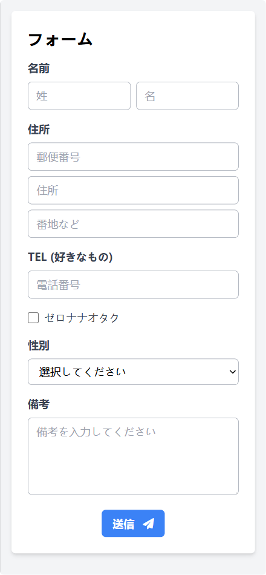
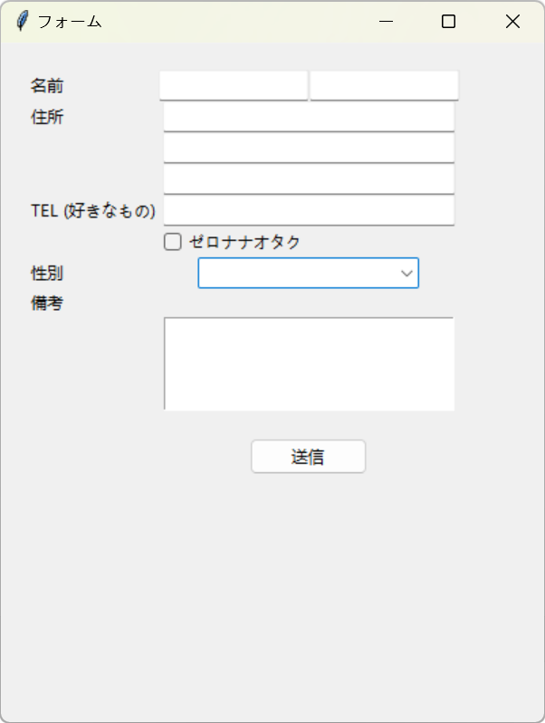

# Tkinter

## Tkinter 简介

Tkinter 是 Python 的标准 GUI（图形用户界面）工具包。它提供了一组用于创建桌面应用程序的工具和组件，让你可以用 Python 语言轻松构建图形界面。

**Tkinter 的优势：**

* **简单易学：** Tkinter 的语法简洁易懂，即使是初学者也能快速上手。
* **跨平台：** Tkinter 可以在 Windows、macOS 和 Linux 等多个操作系统上运行，无需修改代码。
* **内置于 Python：** Tkinter 是 Python 标准库的一部分，无需额外安装即可使用。
* **丰富的组件库：** Tkinter 提供了各种常用的 GUI 组件，例如按钮、文本框、标签、菜单等，可以满足大部分应用程序的需求。

**Tkinter 的不足：**

* **界面相对简单：** 与其他 GUI 工具包相比，Tkinter 的界面可能显得较为简单，缺乏一些高级的视觉效果。
* **大型应用程序开发难度较大：** 对于大型应用程序，使用 Tkinter 开发可能会比较复杂，需要更精细的代码组织和架构设计。

总而言之，Tkinter 是一个简单易学、功能强大的 GUI 工具包，非常适合用于创建小型到中型的桌面应用程序。对于初学者来说，Tkinter 是一个很好的入门选择；对于有经验的开发者，Tkinter 也是一个快速构建原型和工具的理想选择。

## Tkinter 基础

Tkinter 基础涵盖了构建简单图形界面的核心概念和组件。让我们逐步了解：

### 窗口和组件

*   **创建主窗口：** 一切从创建主窗口开始，它是 Tkinter 应用程序的根容器。

    ```python
    import tkinter as tk

    root = tk.Tk()  # 创建主窗口对象
    root.mainloop()  # 进入事件循环，保持窗口显示
    ```

*   **设置窗口属性：** 可以自定义窗口标题、大小和位置。

    ```python
    root.title("我的第一个 Tkinter 窗口")
    root.geometry("400x300")  # 设置窗口大小
    root.resizable(False, False)  # 禁止调整窗口大小
    ```

*   **添加组件 (Widgets)：** 组件是构成用户界面的基本元素，例如按钮、文本框等。

    ```python
    label = tk.Label(root, text="Hello, Tkinter!")  # 创建标签组件
    label.pack()  # 将组件放置到窗口中
    ```

*   **组件属性和方法：** 每个组件都有一系列属性（例如文本内容、颜色）和方法（例如获取用户输入、更改显示状态）。

### 布局管理

布局管理器决定了组件在窗口中的排列方式。Tkinter 提供三种主要布局管理器：

*   **pack：**  最简单的布局管理器，根据添加顺序依次放置组件。
*   **grid：**  使用网格系统精确定位组件，适合创建结构化的界面。
*   **place：**  允许通过绝对坐标或相对位置放置组件，提供最大程度的自由度。

这里分别用 pack, grid 和 place 三种布局管理器创建一个简单的窗口，包含三个按钮：

```python
import tkinter as tk

# 创建主窗口
root = tk.Tk()
root.title("布局管理示例")

# --- pack 布局 ---
label_pack = tk.Label(root, text="pack 布局", bg="lightblue")
label_pack.pack(fill="x")

button1 = tk.Button(root, text="按钮 1")
button1.pack()

button2 = tk.Button(root, text="按钮 2")
button2.pack()

# --- grid 布局 ---
# 创建一个 Frame 作为 grid 布局的容器
grid_frame = tk.Frame(root)
grid_frame.pack()  # 将 Frame 放置到主窗口

label_grid = tk.Label(grid_frame, text="grid 布局", bg="lightgreen")
label_grid.grid(row=0, column=0, columnspan=2, sticky="ew")

button3 = tk.Button(grid_frame, text="按钮 3")
button3.grid(row=1, column=0)

button4 = tk.Button(grid_frame, text="按钮 4")
button4.grid(row=1, column=1)

# --- place 布局 ---
label_place = tk.Label(root, text="place 布局", bg="lightyellow")
label_place.place(x=20, y=100)

button5 = tk.Button(root, text="按钮 5")
button5.place(x=20, y=130)

button6 = tk.Button(root, text="按钮 6")
button6.place(relx=0.5, rely=0.7, anchor="center")  # 相对位置

root.mainloop()
```

**解释：**

* **pack 布局：** 
    * 组件按添加顺序依次放置。
    * `fill="x"`  使标签填充整个水平空间。
* **grid 布局：**
    * 组件放置在网格单元格中。
    * `row` 和 `column` 指定行和列。
    * `columnspan`  使标签跨越两列。
    * `sticky="ew"`  使标签在水平方向上拉伸。
* **place 布局：**
    * 使用绝对坐标 (`x`, `y`) 或相对位置 (`relx`, `rely`)。
    * `anchor`  指定组件的锚点位置。

### 事件处理

事件处理机制使用户界面能够响应用户的操作，例如点击按钮、输入文本等。

*   **绑定事件：**  将特定事件（例如按钮点击）与回调函数关联起来。

    ```python
    def button_clicked():
        print("按钮被点击了！")

    button = tk.Button(root, text="点击我", command=button_clicked)
    button.pack()
    ```

*   **回调函数：** 当绑定的事件发生时，Tkinter 会自动调用相应的回调函数。

## 常用 Tkinter 组件

Tkinter 提供了丰富的组件 (Widgets) 来构建图形界面。以下是一些常用的 Tkinter 组件：

### 输入组件

*   **`tk.Entry` (单行文本输入框):** 允许用户输入单行文本。

    ```python
    entry = tk.Entry(root)
    entry.pack()
    ```

*   **`tk.Text` (多行文本输入框):** 允许用户输入多行文本，支持富文本格式。

    ```python
    text = tk.Text(root)
    text.pack()
    ```

*   **`tk.Button` (按钮):**  当用户点击按钮时触发事件。

    ```python
    button = tk.Button(root, text="点击", command=button_clicked)
    button.pack()
    ```

*   **`tk.Radiobutton` (单选按钮):**  允许用户从一组选项中选择一个。

    ```python
    var = tk.StringVar(value="1")
    radio1 = tk.Radiobutton(root, text="选项 1", variable=var, value="1")
    radio2 = tk.Radiobutton(root, text="选项 2", variable=var, value="2")
    radio1.pack()
    radio2.pack()
    ```

*   **`tk.Checkbutton` (复选框):**  允许用户选择一个或多个选项。

    ```python
    var1 = tk.BooleanVar()
    var2 = tk.BooleanVar()
    check1 = tk.Checkbutton(root, text="选项 A", variable=var1)
    check2 = tk.Checkbutton(root, text="选项 B", variable=var2)
    check1.pack()
    check2.pack()
    ```

*   **`tk.Listbox` (列表框):**  显示一个选项列表，允许用户选择一个或多个选项。

    ```python
    listbox = tk.Listbox(root)
    listbox.insert(1, "选项 1")
    listbox.insert(2, "选项 2")
    listbox.pack()
    ```

### 输出组件

*   **`tk.Label` (标签):**  用于显示文本或图像。

    ```python
    label = tk.Label(root, text="Hello, Tkinter!")
    label.pack()
    ```

*   **`tk.Message` (消息框):**  用于显示多行文本，可以自动换行。

    ```python
    message = tk.Message(root, text="这是一条消息。")
    message.pack()
    ```

*   **`tk.Canvas` (画布):**  提供一个绘图区域，可以绘制图形、图像等。

    ```python
    canvas = tk.Canvas(root, width=200, height=100)
    canvas.pack()
    ```

### 其他组件

*   **`tk.Menu` (菜单):**  创建菜单栏、下拉菜单和弹出菜单。
*   **`tk.Scrollbar` (滚动条):**  为其他组件提供滚动功能。
*   **`tk.Frame` (框架):**  用于组织和分组其他组件。
*   **`tk.Toplevel` (顶级窗口):**  创建独立于主窗口的窗口。

**使用组件：**

1.  **创建组件对象：**  使用组件类创建组件对象，并将其关联到父组件。
2.  **设置组件属性：**  使用关键字参数设置组件的初始属性，例如文本内容、颜色等。
3.  **使用布局管理器放置组件：**  使用 `pack`、`grid` 或 `place` 方法将组件放置到父组件中。
4.  **绑定事件处理函数：**  使用 `bind` 方法将事件与回调函数关联起来，以便响应用户的操作。

这只是一些常用的 Tkinter 组件，还有很多其他组件可供选择。你可以查阅 Tkinter 官方文档或其他教程，了解更多关于 Tkinter 组件的信息。

## Tkinter 进阶

掌握了 Tkinter 的基础知识后，你可以进一步学习更高级的技巧，创建功能更丰富、界面更美观的应用程序。

### 图形绘制

*   **使用 Canvas 绘制：**  `tk.Canvas` 组件提供了丰富的绘图方法，可以绘制线条、矩形、椭圆、多边形、弧形等各种图形。

    ```python
    canvas = tk.Canvas(root, width=200, height=100)
    canvas.pack()

    canvas.create_line(10, 10, 190, 90)  # 绘制线条
    canvas.create_rectangle(50, 20, 150, 80, fill="blue")  # 绘制矩形
    ```

*   **颜色、填充和轮廓：**  可以使用 `fill` 参数设置图形的填充颜色，使用 `outline` 参数设置图形的轮廓颜色和宽度。

*   **处理 Canvas 事件：**  可以为 Canvas 组件绑定鼠标事件，例如点击、拖动等，实现更复杂的交互功能。

### 图像处理

*   **加载和显示图像：**  可以使用 `PIL` (Pillow) 库加载图像，并使用 `Canvas` 的 `create_image` 方法显示图像。

    ```python
    from PIL import Image, ImageTk

    image = Image.open("image.png")
    photo = ImageTk.PhotoImage(image)

    canvas = tk.Canvas(root)
    canvas.create_image(100, 50, image=photo)
    canvas.pack()
    ```

*   **图像操作：**  可以使用 `PIL` 库对图像进行缩放、旋转、裁剪等操作，然后在 Tkinter 中显示处理后的图像。

### 自定义组件

*   **继承现有组件：**  可以通过继承现有的 Tkinter 组件类，创建自定义的组件，添加新的属性、方法或修改默认行为。

    ```python
    class MyButton(tk.Button):
        def __init__(self, master=None, **kwargs):
            super().__init__(master, **kwargs)
            self.config(bg="red")  # 设置默认背景颜色为红色
    ```

*   **组合多个组件：**  可以将多个 Tkinter 组件组合在一起，创建一个更复杂的自定义组件。

### 与其他库结合

*   **Matplotlib：**  可以使用 `matplotlib` 库创建图表，并将其嵌入到 Tkinter 应用程序中。

*   **其他库：**  Tkinter 可以与其他 Python 库结合使用，例如数据库连接库、网络编程库等，扩展应用程序的功能。

### 其他进阶技巧

*   **主题和样式：**  可以使用 `ttk` 模块 (Tk themed widgets) 创建更现代化的界面外观。
*   **多线程：**  可以使用多线程避免 GUI 界面卡顿，提高应用程序的响应速度。
*   **打包发布：**  可以使用 `pyinstaller`、`cx_freeze` 等工具将 Tkinter 应用程序打包成可执行文件，方便分发。

## AI

手绘界面，这里专门找了一个字迹潦草，拍摄角度也不佳的。


上传图片并撰写题词

```
您是一位熟练的开发人员，精通HTML、JavaScript、CSS和TailwindCSS。请根据以下要求创建一个网页：使用Font Awesome图标，确保页面设计美观且响应式，包含必要的HTML结构和样式。
```



> 有些小缺憾，`年龄`哪里由于文字太潦草了，所以没有做正确，可以对话告知AI再修正一下

```
能用python的Tkinter实现吗
```



> 可见Tkinter的表现力和HTML还是有相当的差距，但是快速构建一个可用的界面完全没有问题

## Tkinter 视频处理工具

这是一个使用 Tkinter 和 FFmpeg 创建的简单视频处理工具，可以让你选择一个 MP4 视频文件，并执行以下操作：

* **提取视频信息：**  显示视频的格式、分辨率、时长等信息。
* **转换为其他格式：**  将视频转换为 AVI、MOV 等其他格式。
* **裁剪视频：**  裁剪视频的指定时间段。
* **添加水印：**  为视频添加文字水印。

**代码示例：**

```python
import tkinter as tk
from tkinter import filedialog
import subprocess

def choose_video():
    """打开文件选择对话框，选择 MP4 视频文件"""
    global video_path
    video_path = filedialog.askopenfilename(
        initialdir="/",
        title="选择视频文件",
        filetypes=(("MP4 files", "*.mp4"), ("all files", "*.*")),
    )
    if video_path:
        video_label.config(text=video_path)

def get_video_info():
    """使用 FFprobe 获取视频信息"""
    if not video_path:
        return
    command = [
        "ffprobe",
        "-v",
        "quiet",
        "-show_format",
        "-show_streams",
        video_path,
    ]
    output = subprocess.check_output(command).decode("utf-8")
    info_text.delete("1.0", tk.END)
    info_text.insert(tk.END, output)

def convert_format():
    """将视频转换为指定格式"""
    if not video_path:
        return
    new_format = format_entry.get()
    if not new_format:
        return
    output_path = video_path.replace(".mp4", f".{new_format.lower()}")
    command = [
        "ffmpeg",
        "-i",
        video_path,
        "-c:v",
        "copy",
        "-c:a",
        "copy",
        output_path,
    ]
    subprocess.call(command)

def trim_video():
    """裁剪视频的指定时间段"""
    if not video_path:
        return
    start_time = start_entry.get()
    end_time = end_entry.get()
    if not start_time or not end_time:
        return
    output_path = video_path.replace(".mp4", "_trimmed.mp4")
    command = [
        "ffmpeg",
        "-i",
        video_path,
        "-ss",
        start_time,
        "-to",
        end_time,
        "-c",
        "copy",
        output_path,
    ]
    subprocess.call(command)

def add_watermark():
    """为视频添加文字水印"""
    if not video_path:
        return
    text = watermark_entry.get()
    if not text:
        return
    output_path = video_path.replace(".mp4", "_watermarked.mp4")
    command = [
        "ffmpeg",
        "-i",
        video_path,
        "-vf",
        f"drawtext=text='{text}':fontcolor=white:fontsize=24:box=1:boxcolor=black@0.5:boxborderw=5:x=(w-text_w)/2:y=(h-text_h)/2",
        output_path,
    ]
    subprocess.call(command)

# 创建主窗口
root = tk.Tk()
root.title("视频处理工具")

# 选择视频文件
video_label = tk.Label(root, text="请选择视频文件")
video_label.pack()

choose_button = tk.Button(root, text="选择文件", command=choose_video)
choose_button.pack()

# 显示视频信息
info_button = tk.Button(root, text="获取视频信息", command=get_video_info)
info_button.pack()

info_text = tk.Text(root)
info_text.pack()

# 转换格式
format_label = tk.Label(root, text="目标格式 (例如: avi, mov):")
format_label.pack()

format_entry = tk.Entry(root)
format_entry.pack()

convert_button = tk.Button(root, text="转换格式", command=convert_format)
convert_button.pack()

# 裁剪视频
start_label = tk.Label(root, text="开始时间 (HH:MM:SS):")
start_label.pack()

start_entry = tk.Entry(root)
start_entry.pack()

end_label = tk.Label(root, text="结束时间 (HH:MM:SS):")
end_label.pack()

end_entry = tk.Entry(root)
end_entry.pack()

trim_button = tk.Button(root, text="裁剪视频", command=trim_video)
trim_button.pack()

# 添加水印
watermark_label = tk.Label(root, text="水印文字:")
watermark_label.pack()

watermark_entry = tk.Entry(root)
watermark_entry.pack()

watermark_button = tk.Button(root, text="添加水印", command=add_watermark)
watermark_button.pack()

root.mainloop()
```

**使用方法：**

1.  **安装 FFmpeg：**  确保你的系统上已经安装了 FFmpeg，并将其添加到环境变量中。
2.  **运行代码：**  将代码保存为 Python 文件 (例如 `video_tool.py`)，并运行它。
3.  **选择视频文件：**  点击 "选择文件" 按钮，选择一个 MP4 视频文件。
4.  **执行操作：**  点击相应的按钮执行你想要的操作。
