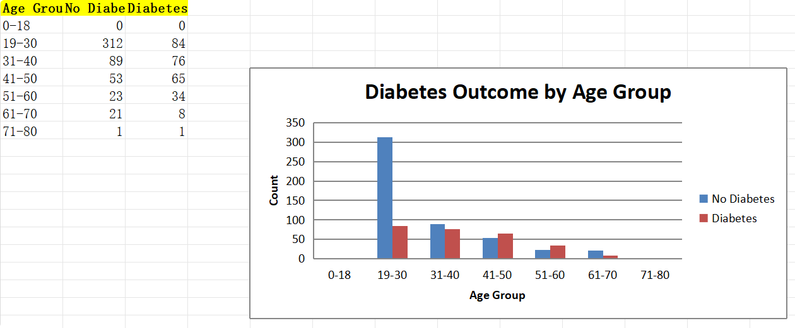

# openpyxl

## 简介

`openpyxl` 是一个功能强大的 Python 库，专门用于读取和写入 Excel 文件，特别是 .xlsx 格式。它允许用户以编程方式创建、修改和提取 Excel 工作簿中的数据，广泛应用于数据分析、自动化报告生成和数据处理等领域。

与其他 Excel 处理库相比，`openpyxl` 提供了丰富的功能，包括对单元格样式的自定义、图表的创建、数据验证和条件格式等。它支持复杂的 Excel 功能，如公式计算和图表生成，使得用户能够高效地处理和展示数据。

使用 `openpyxl`，用户可以轻松地实现 Excel 文件的自动化操作，减少手动操作的时间和错误，提高工作效率。该库适合于数据科学家、分析师和任何需要与 Excel 文件交互的开发者。

## 基本概念

在使用 `openpyxl` 进行 Excel 文件操作时，理解一些基本概念是非常重要的。这些概念包括工作簿、工作表和单元格，它们构成了 Excel 文件的基础结构。

### 工作簿（Workbook）
工作簿是一个 Excel 文件的整体，它可以包含多个工作表。每个工作簿可以通过 `openpyxl.Workbook()` 创建，或者通过 `openpyxl.load_workbook()` 打开已有的文件。工作簿是操作 Excel 文件的最高层级。

### 工作表（Worksheet）
工作表是工作簿中的一个单独页面，类似于 Excel 中的一个标签页。每个工作表可以包含数据、公式和图表。可以通过工作簿的 `active` 属性获取当前活动的工作表，或者通过名称或索引选择特定的工作表。工作表是组织和管理数据的基本单位。

### 单元格（Cell）
单元格是工作表中的最小数据单元，每个单元格都有一个唯一的地址（例如 A1、B2）。单元格可以存储不同类型的数据，包括文本、数字、日期和公式。通过访问工作表的单元格，可以读取或写入数据。

### 其他相关概念
- **行和列**：工作表由行和列组成，行用数字表示（1, 2, 3...），列用字母表示（A, B, C...）。
- **范围（Range）**：一组连续的单元格，例如 A1:B2 表示从 A1 到 B2 的区域。
- **样式（Style）**：单元格的外观设置，包括字体、颜色、边框等。

理解这些基本概念将帮助用户更有效地使用 `openpyxl` 进行 Excel 文件的操作和管理。

## 创建和保存工作簿

使用 `openpyxl` 创建和保存工作簿是处理 Excel 文件的基本操作。以下是如何进行这些操作的详细步骤。

### 创建新的工作簿

要创建一个新的工作簿，可以使用 `openpyxl.Workbook()` 类。以下是一个简单的示例：

```python
from openpyxl import Workbook

# 创建一个新的工作簿
workbook = Workbook()

# 选择活动工作表
sheet = workbook.active

# 在单元格中写入数据
sheet['A1'] = 'Hello'
sheet['B1'] = 'World'
```

### 添加工作表

在工作簿中可以添加多个工作表。使用 `create_sheet()` 方法可以创建新的工作表，并可以指定名称和位置：

```python
# 添加新的工作表
new_sheet = workbook.create_sheet(title='MySheet', index=1)
new_sheet['A1'] = 'This is a new sheet'
```

### 保存工作簿

创建或修改工作簿后，需要将其保存到文件中。使用 `save()` 方法可以将工作簿保存为指定的文件名：

```python
# 保存工作簿
workbook.save('my_workbook.xlsx')
```

### 完整示例

以下是一个完整的示例，展示了如何创建工作簿、添加数据和保存文件：

```python
from openpyxl import Workbook

# 创建一个新的工作簿
workbook = Workbook()

# 选择活动工作表
sheet = workbook.active
sheet.title = 'DataSheet'

# 在单元格中写入数据
sheet['A1'] = 'Name'
sheet['B1'] = 'Age'
sheet['A2'] = 'Alice'
sheet['B2'] = 30
sheet['A3'] = 'Bob'
sheet['B3'] = 25

# 添加新的工作表
new_sheet = workbook.create_sheet(title='Summary')
new_sheet['A1'] = 'Summary Data'

# 保存工作簿
workbook.save('my_workbook.xlsx')
```

### 注意事项

- 在保存工作簿时，如果指定的文件名已经存在，`openpyxl` 会覆盖该文件。
- 确保在保存之前完成所有数据的写入和样式的设置，以避免数据丢失。

通过以上步骤，用户可以轻松地创建和保存 Excel 工作簿，进行数据的组织和管理。

## 读取工作簿

使用 `openpyxl` 读取 Excel 工作簿是获取和处理数据的基本操作。以下是如何打开已有工作簿、选择工作表以及读取单元格数据的详细步骤。

### 打开已有的工作簿

要读取一个已存在的 Excel 文件，可以使用 `openpyxl.load_workbook()` 函数。以下是一个示例：

```python
from openpyxl import load_workbook

# 打开已有的工作簿
workbook = load_workbook('my_workbook.xlsx')
```

### 选择工作表

打开工作簿后，可以选择要操作的工作表。可以通过工作表的名称或索引来选择工作表：

```python
# 选择活动工作表
sheet = workbook.active

# 或者通过名称选择工作表
# sheet = workbook['DataSheet']

# 或者通过索引选择工作表（索引从0开始）
# sheet = workbook.worksheets[0]
```

### 读取单元格数据

一旦选择了工作表，就可以读取单元格中的数据。可以通过单元格的地址（例如 A1、B2）来获取数据：

```python
# 读取单元格数据
value_a1 = sheet['A1'].value
value_b1 = sheet['B1'].value

print(f"A1: {value_a1}, B1: {value_b1}")
```

### 读取整个行或列

可以使用 `iter_rows()` 和 `iter_cols()` 方法来遍历整个行或列，获取多个单元格的数据：

```python
# 读取整行
for row in sheet.iter_rows(min_row=2, max_row=sheet.max_row, values_only=True):
    print(row)

# 读取整列
for column in sheet.iter_cols(min_col=1, max_col=2, min_row=2, values_only=True):
    print(column)
```

### 完整示例

以下是一个完整的示例，展示了如何打开工作簿、选择工作表并读取数据：

```python
from openpyxl import load_workbook

# 打开已有的工作簿
workbook = load_workbook('my_workbook.xlsx')

# 选择工作表
sheet = workbook['DataSheet']

# 读取单元格数据
name = sheet['A2'].value
age = sheet['B2'].value

print(f"Name: {name}, Age: {age}")

# 读取整行数据
print("All data in the sheet:")
for row in sheet.iter_rows(min_row=2, max_row=sheet.max_row, values_only=True):
    print(row)
```

### 注意事项

- 确保文件路径正确，以避免文件未找到的错误。
- 使用 `values_only=True` 参数可以直接获取单元格的值，而不是单元格对象。
- 读取数据时，可以根据需要指定行和列的范围，以提高效率。

通过以上步骤，用户可以轻松地读取 Excel 工作簿中的数据，进行分析和处理。

## 写入数据

使用 `openpyxl` 向 Excel 工作簿写入数据是处理和更新数据的基本操作。以下是如何向单元格写入数据、批量写入数据以及使用公式的详细步骤。

### 向单元格写入数据

要向特定单元格写入数据，可以直接通过单元格的地址进行赋值。以下是一个简单的示例：

```python
from openpyxl import Workbook

# 创建一个新的工作簿
workbook = Workbook()
sheet = workbook.active

# 向单元格写入数据
sheet['A1'] = 'Name'
sheet['B1'] = 'Age'
sheet['A2'] = 'Alice'
sheet['B2'] = 30
```

### 批量写入数据

如果需要向多个单元格写入数据，可以使用 `append()` 方法或循环来批量写入。以下是两种方法的示例：

#### 使用 `append()` 方法

`append()` 方法可以将一行数据添加到工作表的末尾：

```python
# 使用 append() 方法批量写入数据
data = [
    ['Name', 'Age'],
    ['Alice', 30],
    ['Bob', 25],
    ['Charlie', 35]
]

for row in data:
    sheet.append(row)
```

#### 使用循环写入数据

可以使用嵌套循环向指定范围的单元格写入数据：

```python
# 使用循环写入数据
for i in range(2, 5):
    sheet[f'A{i}'] = f'Person {i-1}'
    sheet[f'B{i}'] = (i - 1) * 10
```

### 使用公式

`openpyxl` 还支持在单元格中写入公式。公式以字符串的形式写入，Excel 会在打开文件时计算公式的值：

```python
# 写入公式
sheet['C1'] = 'Score'
sheet['C2'] = '=B2 + 10'  # B2 的值加 10
sheet['C3'] = '=B3 + 10'  # B3 的值加 10
```

### 完整示例

以下是一个完整的示例，展示了如何创建工作簿、写入数据和公式：

```python
from openpyxl import Workbook

# 创建一个新的工作簿
workbook = Workbook()
sheet = workbook.active

# 写入表头
sheet['A1'] = 'Name'
sheet['B1'] = 'Age'
sheet['C1'] = 'Score'

# 批量写入数据
data = [
    ['Alice', 30],
    ['Bob', 25],
    ['Charlie', 35]
]

for row in data:
    sheet.append(row)

# 写入公式
for i in range(2, 5):
    sheet[f'C{i}'] = f'=B{i} + 10'  # 计算 Score

# 保存工作簿
workbook.save('my_data.xlsx')
```

### 注意事项

- 在写入数据之前，确保工作表已经被正确选择。
- 写入公式时，确保公式的语法正确，以避免计算错误。
- 在保存工作簿之前，完成所有数据的写入和样式的设置，以确保数据完整性。

通过以上步骤，用户可以轻松地向 Excel 工作簿写入数据和公式，进行数据的更新和管理。

## 单元格样式

使用 `openpyxl` 可以对 Excel 工作簿中的单元格进行样式设置，以提高数据的可读性和美观性。以下是如何设置单元格样式的详细步骤，包括字体、填充、边框和对齐方式。

### 设置字体样式

可以通过 `Font` 类设置单元格的字体样式，包括字体名称、大小、颜色、加粗、斜体等：

```python
from openpyxl import Workbook
from openpyxl.styles import Font

# 创建一个新的工作簿
workbook = Workbook()
sheet = workbook.active

# 设置字体样式
bold_font = Font(bold=True)
italic_font = Font(italic=True, color='FF0000')  # 红色斜体

sheet['A1'] = 'Name'
sheet['A1'].font = bold_font  # 加粗
sheet['B1'] = 'Age'
sheet['B1'].font = italic_font  # 红色斜体
```

### 设置单元格填充

可以通过 `PatternFill` 类设置单元格的背景颜色：

```python
from openpyxl.styles import PatternFill

# 设置单元格填充
fill = PatternFill(start_color='FFFF00', end_color='FFFF00', fill_type='solid')  # 黄色填充

sheet['A1'].fill = fill  # 为 A1 单元格设置填充
```

### 设置边框

可以通过 `Border` 类设置单元格的边框样式，包括边框的颜色和样式：

```python
from openpyxl.styles import Border, Side

# 设置边框样式
thin_border = Border(left=Side(style='thin'), 
                     right=Side(style='thin'), 
                     top=Side(style='thin'), 
                     bottom=Side(style='thin'))

sheet['A1'].border = thin_border  # 为 A1 单元格设置边框
```

### 设置对齐方式

可以通过 `Alignment` 类设置单元格的对齐方式，包括水平和垂直对齐：

```python
from openpyxl.styles import Alignment

# 设置对齐方式
centered_alignment = Alignment(horizontal='center', vertical='center')

sheet['A1'].alignment = centered_alignment  # 为 A1 单元格设置居中对齐
```

### 完整示例

以下是一个完整的示例，展示了如何设置单元格样式：

```python
from openpyxl import Workbook
from openpyxl.styles import Font, PatternFill, Border, Side, Alignment

# 创建一个新的工作簿
workbook = Workbook()
sheet = workbook.active

# 设置表头
sheet['A1'] = 'Name'
sheet['B1'] = 'Age'

# 设置字体样式
header_font = Font(bold=True, color='FFFFFF')  # 白色加粗字体
sheet['A1'].font = header_font
sheet['B1'].font = header_font

# 设置单元格填充
header_fill = PatternFill(start_color='0000FF', end_color='0000FF', fill_type='solid')  # 蓝色填充
sheet['A1'].fill = header_fill
sheet['B1'].fill = header_fill

# 设置边框样式
thin_border = Border(left=Side(style='thin'), 
                     right=Side(style='thin'), 
                     top=Side(style='thin'), 
                     bottom=Side(style='thin'))

sheet['A1'].border = thin_border
sheet['B1'].border = thin_border

# 设置对齐方式
centered_alignment = Alignment(horizontal='center', vertical='center')
sheet['A1'].alignment = centered_alignment
sheet['B1'].alignment = centered_alignment

# 写入数据
data = [
    ['Alice', 30],
    ['Bob', 25],
    ['Charlie', 35]
]

for row in data:
    sheet.append(row)

# 保存工作簿
workbook.save('styled_data.xlsx')
```

### 注意事项

- 在设置样式时，确保样式对象在使用前已被正确创建。
- 样式设置会影响到单元格的外观，但不会影响单元格中的数据。
- 可以根据需要组合多种样式，以实现更复杂的格式设置。

通过以上步骤，用户可以灵活地设置 Excel 工作簿中单元格的样式，提高数据的可读性和视觉效果。

## 数据验证和条件格式

在使用 `openpyxl` 时，可以为 Excel 工作簿中的单元格添加数据验证和条件格式，以确保数据的有效性和动态显示数据的状态。以下是如何实现这些功能的详细步骤。

### 数据验证

数据验证用于限制用户在单元格中输入的数据类型或范围。可以使用 `DataValidation` 类来创建数据验证规则。

#### 示例：创建下拉列表

以下示例展示了如何在单元格中创建一个下拉列表，用户只能从列表中选择值：

```python
from openpyxl import Workbook
from openpyxl.worksheet.datavalidation import DataValidation

# 创建一个新的工作簿
workbook = Workbook()
sheet = workbook.active

# 创建数据验证规则（下拉列表）
dv = DataValidation(type="list", formula1='"Option1,Option2,Option3"', showDropDown=True)

# 将数据验证应用于单元格
sheet['A1'].data_validation = dv

# 设置单元格值
sheet['A1'] = 'Option1'

# 保存工作簿
workbook.save('data_validation.xlsx')
```

### 条件格式

条件格式用于根据单元格的值动态更改单元格的样式。可以使用 `ConditionalFormatting` 类来设置条件格式。

#### 示例：根据值设置单元格颜色

以下示例展示了如何根据单元格的值设置背景颜色：

```python
from openpyxl import Workbook
from openpyxl.styles import PatternFill
from openpyxl.formatting.rule import CellIsRule

# 创建一个新的工作簿
workbook = Workbook()
sheet = workbook.active

# 写入数据
data = [10, 20, 30, 40, 50]
for i, value in enumerate(data, start=1):
    sheet[f'A{i}'] = value

# 创建条件格式规则（大于30的单元格填充为红色）
red_fill = PatternFill(start_color='FF0000', end_color='FF0000', fill_type='solid')
rule = CellIsRule(operator='greaterThan', formula=['30'], fill=red_fill)

# 应用条件格式
sheet.conditional_formatting.add('A1:A5', rule)

# 保存工作簿
workbook.save('conditional_formatting.xlsx')
```

### 完整示例

以下是一个完整的示例，展示了如何同时使用数据验证和条件格式：

```python
from openpyxl import Workbook
from openpyxl.worksheet.datavalidation import DataValidation
from openpyxl.styles import PatternFill
from openpyxl.formatting.rule import CellIsRule

# 创建一个新的工作簿
workbook = Workbook()
sheet = workbook.active

# 创建数据验证规则（下拉列表）
dv = DataValidation(type="list", formula1='"Option1,Option2,Option3"', showDropDown=True)
sheet['A1'].data_validation = dv

# 写入数据
data = [10, 25, 35, 45, 55]
for i, value in enumerate(data, start=2):
    sheet[f'A{i}'] = value

# 创建条件格式规则（大于30的单元格填充为红色）
red_fill = PatternFill(start_color='FF0000', end_color='FF0000', fill_type='solid')
rule = CellIsRule(operator='greaterThan', formula=['30'], fill=red_fill)

# 应用条件格式
sheet.conditional_formatting.add('A2:A6', rule)

# 保存工作簿
workbook.save('data_validation_and_conditional_formatting.xlsx')
```

### 注意事项

- 数据验证可以限制用户输入，确保数据的有效性，但不能防止用户通过其他方式（如直接修改文件）更改数据。
- 条件格式是动态的，单元格的样式会根据其值的变化而自动更新。
- 在设置条件格式时，可以使用多种条件（如大于、小于、等于等）来满足不同的需求。

通过以上步骤，用户可以有效地使用数据验证和条件格式来管理和展示 Excel 工作簿中的数据。

## 图表

使用 `openpyxl` 可以在 Excel 工作簿中创建和操作图表，以便更直观地展示数据。以下是如何创建图表的详细步骤，包括常见图表类型的示例。

### 创建图表

在 `openpyxl` 中，可以使用 `Chart` 类及其子类来创建不同类型的图表。以下是一些常见图表类型的示例。

### 示例：创建柱状图

以下示例展示了如何创建一个简单的柱状图：

```python
from openpyxl import Workbook
from openpyxl.chart import BarChart, Reference

# 创建一个新的工作簿
workbook = Workbook()
sheet = workbook.active

# 写入数据
data = [
    ['Name', 'Score'],
    ['Alice', 90],
    ['Bob', 80],
    ['Charlie', 85],
    ['David', 95]
]

for row in data:
    sheet.append(row)

# 创建柱状图
chart = BarChart()
chart.title = "Scores by Name"
chart.x_axis.title = "Name"
chart.y_axis.title = "Score"

# 定义数据范围
data_ref = Reference(sheet, min_col=2, min_row=1, max_col=2, max_row=5)
categories_ref = Reference(sheet, min_col=1, min_row=2, max_row=5)

# 将数据和类别添加到图表
chart.add_data(data_ref, titles_from_data=True)
chart.set_categories(categories_ref)

# 将图表添加到工作表
sheet.add_chart(chart, "E5")  # 在 E5 位置插入图表

# 保存工作簿
workbook.save('bar_chart.xlsx')
```

### 示例：创建折线图

以下示例展示了如何创建一个简单的折线图：

```python
from openpyxl import Workbook
from openpyxl.chart import LineChart, Reference

# 创建一个新的工作簿
workbook = Workbook()
sheet = workbook.active

# 写入数据
data = [
    ['Month', 'Sales'],
    ['January', 100],
    ['February', 120],
    ['March', 150],
    ['April', 170]
]

for row in data:
    sheet.append(row)

# 创建折线图
line_chart = LineChart()
line_chart.title = "Monthly Sales"
line_chart.x_axis.title = "Month"
line_chart.y_axis.title = "Sales"

# 定义数据范围
data_ref = Reference(sheet, min_col=2, min_row=1, max_col=2, max_row=5)
categories_ref = Reference(sheet, min_col=1, min_row=2, max_row=5)

# 将数据和类别添加到图表
line_chart.add_data(data_ref, titles_from_data=True)
line_chart.set_categories(categories_ref)

# 将图表添加到工作表
sheet.add_chart(line_chart, "E5")  # 在 E5 位置插入图表

# 保存工作簿
workbook.save('line_chart.xlsx')
```

### 示例：创建饼图

以下示例展示了如何创建一个简单的饼图：

```python
from openpyxl import Workbook
from openpyxl.chart import PieChart, Reference

# 创建一个新的工作簿
workbook = Workbook()
sheet = workbook.active

# 写入数据
data = [
    ['Category', 'Value'],
    ['A', 30],
    ['B', 20],
    ['C', 50]
]

for row in data:
    sheet.append(row)

# 创建饼图
pie_chart = PieChart()
pie_chart.title = "Category Distribution"

# 定义数据范围
data_ref = Reference(sheet, min_col=2, min_row=1, max_row=4)
categories_ref = Reference(sheet, min_col=1, min_row=2, max_row=4)

# 将数据和类别添加到图表
pie_chart.add_data(data_ref, titles_from_data=True)
pie_chart.set_categories(categories_ref)

# 将图表添加到工作表
sheet.add_chart(pie_chart, "E5")  # 在 E5 位置插入图表

# 保存工作簿
workbook.save('pie_chart.xlsx')
```

### 注意事项

- 在创建图表之前，确保数据已经写入工作表，并且数据范围正确。
- 可以使用不同类型的图表（如柱状图、折线图、饼图等）来展示数据，选择合适的图表类型以便更好地传达信息。
- 图表的样式和格式可以通过图表对象的属性进行进一步的定制。

通过以上步骤，用户可以轻松地在 Excel 工作簿中创建和操作图表，以便更直观地展示和分析数据。

## 处理图片

使用 `openpyxl` 可以在 Excel 工作簿中插入和处理图片。这使得用户能够在报告或数据分析中添加视觉元素，以增强可读性和吸引力。以下是如何在 Excel 中插入、调整和删除图片的详细步骤。

### 插入图片

要在 Excel 工作簿中插入图片，可以使用 `Image` 类。以下是一个简单的示例，展示了如何插入图片：

```python
from openpyxl import Workbook
from openpyxl.drawing.image import Image

# 创建一个新的工作簿
workbook = Workbook()
sheet = workbook.active

# 插入图片
img = Image('path_to_your_image.png')  # 替换为你的图片路径
sheet.add_image(img, 'A1')  # 在 A1 单元格插入图片

# 保存工作簿
workbook.save('inserted_image.xlsx')
```

### 调整图片大小和位置

在插入图片后，可以调整其大小和位置。可以通过设置图片的宽度和高度来调整大小，使用 `anchor` 属性来设置图片的位置。

```python
# 调整图片大小
img.width = 300  # 设置宽度为 300 像素
img.height = 200  # 设置高度为 200 像素

# 重新插入调整大小后的图片
sheet.add_image(img, 'B2')  # 在 B2 单元格插入调整后的图片
```

### 删除图片

如果需要删除已经插入的图片，可以使用 `remove()` 方法。以下是删除图片的示例：

```python
# 删除图片
if 'image_id' in sheet._images:
    sheet._images.remove('image_id')  # 使用图片的 ID 删除
```

### 完整示例

以下是一个完整的示例，展示了如何插入、调整和删除图片：

```python
from openpyxl import Workbook
from openpyxl.drawing.image import Image

# 创建一个新的工作簿
workbook = Workbook()
sheet = workbook.active

# 插入图片
img = Image('path_to_your_image.png')  # 替换为你的图片路径
sheet.add_image(img, 'A1')  # 在 A1 单元格插入图片

# 调整图片大小
img.width = 300  # 设置宽度为 300 像素
img.height = 200  # 设置高度为 200 像素

# 重新插入调整大小后的图片
sheet.add_image(img, 'B2')  # 在 B2 单元格插入调整后的图片

# 保存工作簿
workbook.save('image_handling.xlsx')

# 删除图片（示例，需根据实际情况使用）
# if img in sheet._images:
#     sheet._images.remove(img)  # 删除图片
```

### 注意事项

- 确保插入的图片路径正确，并且文件格式支持（如 PNG、JPEG）。
- 图片的大小可以根据需要进行调整，但过大的图片可能会影响 Excel 文件的性能。
- 删除图片时，确保使用正确的图片引用。

通过以上步骤，用户可以轻松地在 Excel 工作簿中插入、调整和删除图片，以增强数据的可视化效果。

## 处理公式

在使用 `openpyxl` 时，可以在 Excel 工作簿中读取和写入公式。公式可以用于执行计算、分析数据等。以下是如何处理公式的详细步骤，包括写入公式、读取公式及其计算结果。

### 写入公式

要在单元格中写入公式，可以直接将公式作为字符串赋值给单元格。公式的格式与 Excel 中使用的格式相同，以等号 `=` 开头。

#### 示例：写入简单公式

```python
from openpyxl import Workbook

# 创建一个新的工作簿
workbook = Workbook()
sheet = workbook.active

# 写入数据
sheet['A1'] = 10
sheet['A2'] = 20

# 写入公式
sheet['A3'] = '=A1 + A2'  # A3 = A1 + A2

# 保存工作簿
workbook.save('formulas.xlsx')
```

### 读取公式

可以通过访问单元格的 `value` 属性来读取公式。如果单元格中包含公式，`value` 属性将返回公式字符串。

#### 示例：读取公式

```python
from openpyxl import load_workbook

# 打开已有的工作簿
workbook = load_workbook('formulas.xlsx')
sheet = workbook.active

# 读取公式
formula = sheet['A3'].value
print(f"The formula in A3 is: {formula}")  # 输出: The formula in A3 is: =A1 + A2
```

### 读取公式计算结果

`openpyxl` 不会自动计算公式的结果。要获取公式的计算结果，您需要在 Excel 中打开文件，Excel 会自动计算公式并显示结果。`openpyxl` 只能读取公式，而不能计算其结果。

如果需要在代码中计算公式，可以使用 Python 的计算功能，手动实现公式的逻辑。

#### 示例：手动计算公式

```python
# 手动计算公式结果
a1_value = sheet['A1'].value
a2_value = sheet['A2'].value
result = a1_value + a2_value
print(f"The result of A1 + A2 is: {result}")  # 输出: The result of A1 + A2 is: 30
```

### 完整示例

以下是一个完整的示例，展示了如何写入公式、读取公式及其计算结果：

```python
from openpyxl import Workbook, load_workbook

# 创建一个新的工作簿
workbook = Workbook()
sheet = workbook.active

# 写入数据
sheet['A1'] = 10
sheet['A2'] = 20

# 写入公式
sheet['A3'] = '=A1 + A2'  # A3 = A1 + A2

# 保存工作簿
workbook.save('formulas.xlsx')

# 打开已有的工作簿
workbook = load_workbook('formulas.xlsx')
sheet = workbook.active

# 读取公式
formula = sheet['A3'].value
print(f"The formula in A3 is: {formula}")  # 输出: The formula in A3 is: =A1 + A2

# 手动计算公式结果
a1_value = sheet['A1'].value
a2_value = sheet['A2'].value
result = a1_value + a2_value
print(f"The result of A1 + A2 is: {result}")  # 输出: The result of A1 + A2 is: 30
```

### 注意事项

- 在写入公式时，确保公式的语法正确，以避免 Excel 报错。
- `openpyxl` 不会计算公式的值，必须在 Excel 中打开文件以查看计算结果。
- 如果需要在代码中进行复杂的计算，建议使用 Python 的计算功能，而不是依赖 Excel 的公式。

通过以上步骤，用户可以轻松地在 Excel 工作簿中处理公式，实现数据的计算和分析。

## 其他功能

除了基本的读写操作，`openpyxl` 还提供了一些其他功能，使得用户能够更灵活地处理 Excel 文件。以下是一些常用的附加功能，包括合并和拆分单元格、添加超链接、处理多种数据类型等。

### 合并和拆分单元格

#### 合并单元格

可以使用 `merge_cells()` 方法合并多个单元格。合并后，只有左上角的单元格会保留数据，其余单元格将被清空。

```python
from openpyxl import Workbook

# 创建一个新的工作簿
workbook = Workbook()
sheet = workbook.active

# 合并单元格
sheet.merge_cells('A1:B1')  # 合并 A1 和 B1
sheet['A1'] = 'Merged Cell'  # 在合并后的单元格中写入数据

# 保存工作簿
workbook.save('merged_cells.xlsx')
```

#### 拆分单元格

`openpyxl` 允许拆分已合并的单元格。可以使用 `unmerge_cells()` 方法来拆分单元格。

```python
# 拆分单元格
sheet.unmerge_cells('A1:B1')  # 拆分 A1 和 B1

# 保存工作簿
workbook.save('unmerged_cells.xlsx')
```

### 添加超链接

可以使用 `Hyperlink` 类为单元格添加超链接，链接到外部网站或工作簿中的其他位置。

```python
from openpyxl import Workbook
from openpyxl.worksheet.hyperlink import Hyperlink

# 创建一个新的工作簿
workbook = Workbook()
sheet = workbook.active

# 添加超链接
sheet['A1'] = 'Open Google'
sheet['A1'].hyperlink = 'https://www.google.com'  # 设置超链接
sheet['A1'].style = 'Hyperlink'  # 设置样式为超链接

# 保存工作簿
workbook.save('hyperlink.xlsx')
```

### 处理多种数据类型

`openpyxl` 支持多种数据类型，包括字符串、数字、日期和时间等。可以使用 `datetime` 模块来处理日期和时间。

#### 示例：写入日期和时间

```python
from openpyxl import Workbook
from datetime import datetime

# 创建一个新的工作簿
workbook = Workbook()
sheet = workbook.active

# 写入日期和时间
sheet['A1'] = 'Date'
sheet['A2'] = datetime(2023, 10, 1)  # 写入日期
sheet['B1'] = 'Time'
sheet['B2'] = datetime.now().time()  # 写入当前时间

# 保存工作簿
workbook.save('date_time.xlsx')
```

### 读取单元格的格式和属性

可以访问单元格的格式和属性，例如字体、填充、边框等，以便进行更复杂的样式处理。

```python
from openpyxl import load_workbook

# 打开已有的工作簿
workbook = load_workbook('styled_data.xlsx')
sheet = workbook.active

# 读取单元格的样式
font = sheet['A1'].font
fill = sheet['A1'].fill

print(f"Font Name: {font.name}, Font Size: {font.size}, Fill Color: {fill.start_color}")
```

### 完整示例

以下是一个完整的示例，展示了如何使用合并单元格、添加超链接和处理日期时间等功能：

```python
from openpyxl import Workbook
from openpyxl.worksheet.hyperlink import Hyperlink
from datetime import datetime

# 创建一个新的工作簿
workbook = Workbook()
sheet = workbook.active

# 合并单元格
sheet.merge_cells('A1:B1')
sheet['A1'] = 'Merged Cell'

# 添加超链接
sheet['A2'] = 'Open Google'
sheet['A2'].hyperlink = 'https://www.google.com'
sheet['A2'].style = 'Hyperlink'

# 写入日期和时间
sheet['A3'] = 'Date'
sheet['B3'] = datetime(2023, 10, 1)
sheet['A4'] = 'Current Time'
sheet['B4'] = datetime.now().time()

# 保存工作簿
workbook.save('other_features.xlsx')
```

### 注意事项

- 在合并和拆分单元格时，注意数据的保留和清空。
- 添加超链接时，确保链接的格式正确，以便在打开 Excel 文件时能够正常访问。
- 处理日期和时间时，确保使用 `datetime` 模块，以便正确格式化和存储数据。

通过以上步骤，用户可以充分利用 `openpyxl` 提供的其他功能，以便更灵活地处理 Excel 文件。

## 性能优化

在使用 `openpyxl` 处理大型 Excel 文件时，性能可能成为一个重要的考虑因素。以下是一些优化技巧，可以帮助提高处理速度和减少内存使用。

### 1. 使用 `write_only` 模式

当只需要写入数据而不需要读取时，可以使用 `write_only` 模式创建工作簿。这种模式在写入大量数据时非常高效，因为它不会保留单元格的格式和公式。

```python
from openpyxl import Workbook

# 创建一个新的工作簿，使用 write_only 模式
workbook = Workbook(write_only=True)
sheet = workbook.create_sheet()

# 批量写入数据
for i in range(1000000):
    sheet.append([i, i * 2, i * 3])

# 保存工作簿
workbook.save('large_file.xlsx')
```

### 2. 使用 `read_only` 模式

当只需要读取数据而不需要修改时，可以使用 `read_only` 模式打开工作簿。这种模式可以减少内存使用，适合处理大型文件。

```python
from openpyxl import load_workbook

# 以只读模式打开工作簿
workbook = load_workbook('large_file.xlsx', read_only=True)
sheet = workbook.active

# 读取数据
for row in sheet.iter_rows(values_only=True):
    print(row)
```

### 3. 批量写入数据

在写入数据时，尽量使用批量写入的方法，例如 `append()` 方法或使用 `iter_rows()` 和 `iter_cols()` 方法。这比逐个单元格写入要高效得多。

```python
# 使用 append() 方法批量写入数据
data = [(i, i * 2, i * 3) for i in range(1000000)]
for row in data:
    sheet.append(row)
```

### 4. 减少格式设置

在处理大量数据时，尽量减少单元格的格式设置。每次设置样式都会增加处理时间和内存使用。可以在完成数据写入后，统一进行样式设置。

### 5. 避免频繁的读写操作

如果需要频繁读取和写入数据，尽量将数据存储在内存中，完成所有操作后再一次性写入文件。这可以减少文件 I/O 操作的次数，从而提高性能。

### 6. 使用生成器

在处理大型数据集时，使用生成器可以有效减少内存使用。生成器在需要时生成数据，而不是一次性将所有数据加载到内存中。

```python
def generate_data():
    for i in range(1000000):
        yield (i, i * 2, i * 3)

# 使用生成器写入数据
for row in generate_data():
    sheet.append(row)
```

### 7. 关闭工作簿

在完成所有操作后，确保关闭工作簿，以释放系统资源。

```python
workbook.close()
```

### 完整示例

以下是一个完整的示例，展示了如何使用 `write_only` 模式批量写入数据，并在读取时使用 `read_only` 模式：

```python
from openpyxl import Workbook, load_workbook

# 使用 write_only 模式创建工作簿
workbook = Workbook(write_only=True)
sheet = workbook.create_sheet()

# 批量写入数据
for i in range(1000000):
    sheet.append([i, i * 2, i * 3])

# 保存工作簿
workbook.save('optimized_large_file.xlsx')

# 使用 read_only 模式打开工作簿
workbook = load_workbook('optimized_large_file.xlsx', read_only=True)
sheet = workbook.active

# 读取数据
for row in sheet.iter_rows(values_only=True):
    print(row)

# 关闭工作簿
workbook.close()
```

### 注意事项

- 在处理大型 Excel 文件时，始终考虑内存和性能的平衡。
- 使用 `write_only` 和 `read_only` 模式可以显著提高性能，但会限制某些功能（如读取公式和样式）。
- 在进行性能优化时，测试不同的方法，以找到最适合特定用例的解决方案。

通过以上步骤，用户可以有效地优化 `openpyxl` 的性能，处理大型 Excel 文件时提高效率。

## 完整案例：分析年龄段与糖尿病结果的关系并生成 Excel 报告

在这个案例中，我们将使用 `pandas` 和 `openpyxl` 库来分析 `diabetes.csv` 数据集，统计不同年龄段与糖尿病结果（`Outcome`）之间的关系，并将结果导出到 Excel 文件中，包含相应的图表。以下是整个过程的详细描述。

### 准备工作

确保你已经安装了所需的 Python 库。如果尚未安装，可以使用以下命令安装：

```bash
pip install pandas openpyxl
```

确保 `diabetes.csv` 文件在当前工作目录中，或者提供正确的文件路径。该文件应包含以下数据格式：

数据下载链接：https://pan.baidu.com/s/1ybfJWcVhDrDe_1LBcw8UPw?pwd=maoh

```
Pregnancies,Glucose,BloodPressure,SkinThickness,Insulin,BMI,DiabetesPedigreeFunction,Age,Outcome
6,148,72,35,0,33.6,0.627,50,1
1,85,66,29,0,26.6,0.351,31,0
...
```

| 列名                     | 说明                                       |
| ------------------------ | ------------------------------------------ |
| Pregnancies              | 怀孕次数                                   |
| Glucose                  | 葡萄糖测试值                               |
| BloodPressure            | 血压                                       |
| SkinThickness            | 皮肤厚度                                   |
| Insulin                  | 胰岛素                                     |
| BMI                      | 身体质量指数                               |
| DiabetesPedigreeFunction | 糖尿病遗传函数                             |
| Age                      | 年龄                                       |
| Outcome                  | 糖尿病标签，1表示有糖尿病，0表示没有糖尿病 |

### 读取数据

使用 `pandas` 读取 CSV 文件，并将数据加载到 DataFrame 中。

### 数据处理

将年龄分为不同的年龄段，并计算每个年龄段中糖尿病结果的数量。

### 创建 Excel 文件

使用 `openpyxl` 创建一个新的 Excel 工作簿，并将统计结果写入工作表。

### 生成图表

创建柱状图以可视化不同年龄段与糖尿病结果之间的关系。

### 保存 Excel 文件

将最终的 Excel 文件保存为 `diabetes_age_group_analysis.xlsx`。

### 实现代码

以下是完整的代码实现：

```python
import pandas as pd
from openpyxl import Workbook
from openpyxl.styles import Font, PatternFill
from openpyxl.chart import BarChart, Reference

# 1. 读取 CSV 文件
data = pd.read_csv("./data/diabetes.csv")

# 2. 将年龄分为不同的年龄段
bins = [0, 18, 30, 40, 50, 60, 70, 80]  # 定义年龄段
labels = ["0-18", "19-30", "31-40", "41-50", "51-60", "61-70", "71-80"]
data["AgeGroup"] = pd.cut(data["Age"], bins=bins, labels=labels, right=False)

# 3. 统计每个年龄段中 Outcome 的数量
age_outcome_counts = data.groupby(["AgeGroup", "Outcome"]).size().unstack(fill_value=0)

# 4. 创建 Excel 文件
workbook = Workbook()
sheet = workbook.active
sheet.title = "Diabetes Age Group Analysis"

# 5. 写入年龄段与 Outcome 的统计数据
sheet.append(["Age Group", "No Diabetes", "Diabetes"])  # 表头
for age_group, counts in age_outcome_counts.iterrows():
    sheet.append([age_group, counts[0], counts[1]])

# 6. 格式化 Excel 文件
for cell in sheet[1]:
    cell.fill = PatternFill(start_color="FFFF00", end_color="FFFF00", fill_type="solid")
    cell.font = Font(bold=True)

# 7. 生成图表
chart = BarChart()
chart.title = "Diabetes Outcome by Age Group"
chart.x_axis.title = "Age Group"
chart.y_axis.title = "Count"

# 定义数据范围
data_ref = Reference(
    sheet, min_col=2, min_row=1, max_row=len(age_outcome_counts) + 1, max_col=3
)
categories_ref = Reference(
    sheet, min_col=1, min_row=2, max_row=len(age_outcome_counts) + 1
)

# 将数据和类别添加到图表
chart.add_data(data_ref, titles_from_data=True)
chart.set_categories(categories_ref)

# 将图表添加到工作表
sheet.add_chart(chart, "E5")  # 在 E5 位置插入图表

# 8. 保存 Excel 文件
workbook.save("diabetes_age_group_analysis.xlsx")
```

### 代码说明

1. **读取 CSV 文件**：使用 `pandas` 的 `read_csv` 方法读取 `diabetes.csv` 文件，加载数据到 DataFrame。
2. **将年龄分为不同的年龄段**：使用 `pd.cut()` 方法将 `Age` 列分为多个年龄段，并创建一个新的列 `AgeGroup`。
3. **统计每个年龄段中 `Outcome` 的数量**：使用 `groupby()` 和 `size()` 方法统计每个年龄段中 `Outcome` 的数量，并使用 `unstack()` 方法将结果转换为适合图表的数据格式。
4. **创建 Excel 文件**：使用 `openpyxl` 创建一个新的工作簿，并设置工作表标题。
5. **写入统计数据**：将年龄段与糖尿病结果的统计数据写入 Excel 文件。
6. **格式化 Excel 文件**：设置表头的样式（如背景颜色和字体加粗）。
7. **生成图表**：创建柱状图以可视化年龄段与糖尿病结果之间的关系。
8. **保存 Excel 文件**：将最终的 Excel 文件保存为 `diabetes_age_group_analysis.xlsx`。

### 结果

运行上述代码后，将生成一个名为 `diabetes_age_group_analysis.xlsx` 的 Excel 文件，其中包含年龄段与糖尿病结果的统计数据和相应的柱状图。这将帮助用户直观地理解不同年龄段与糖尿病结果之间的关系。

