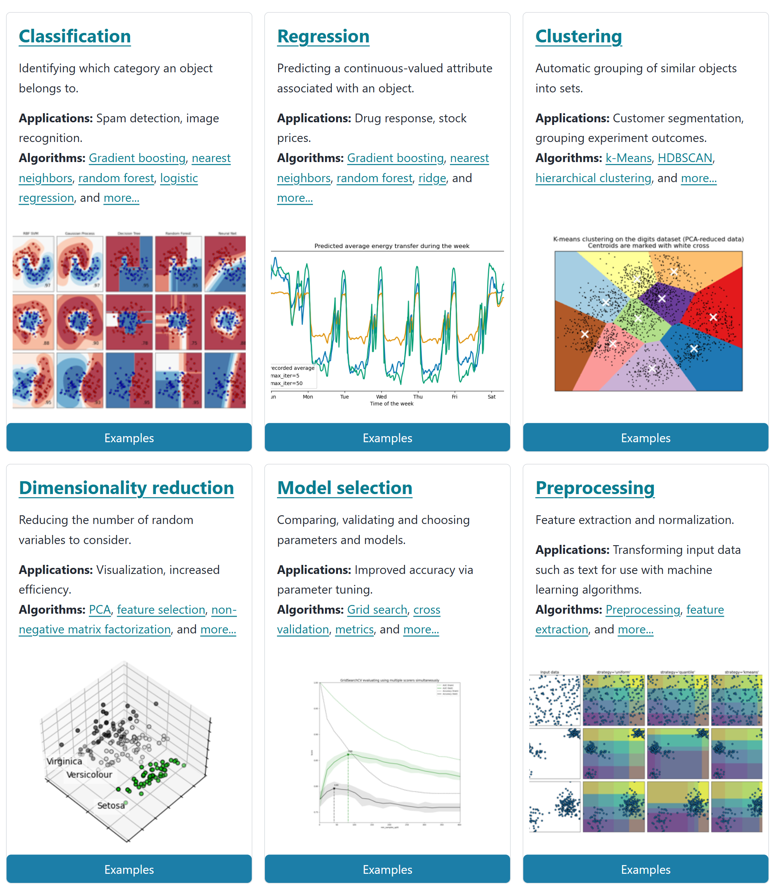
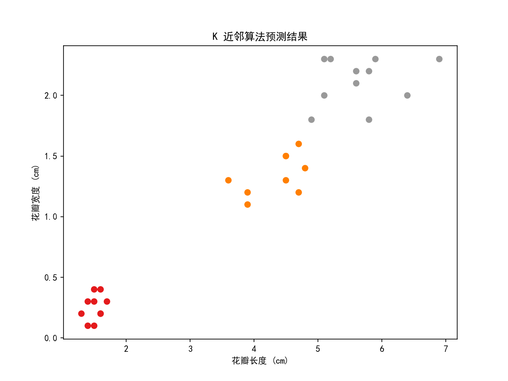
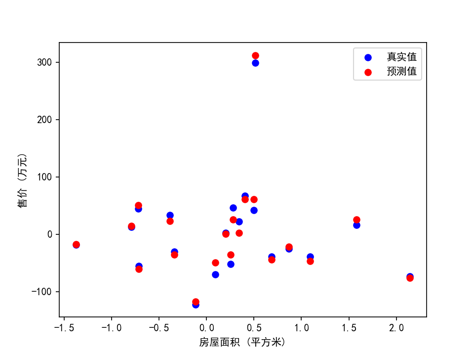
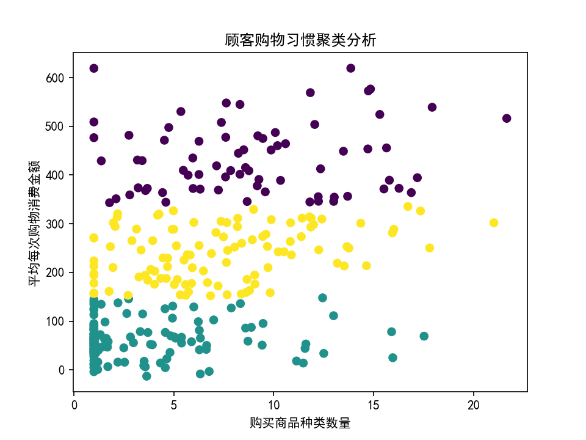
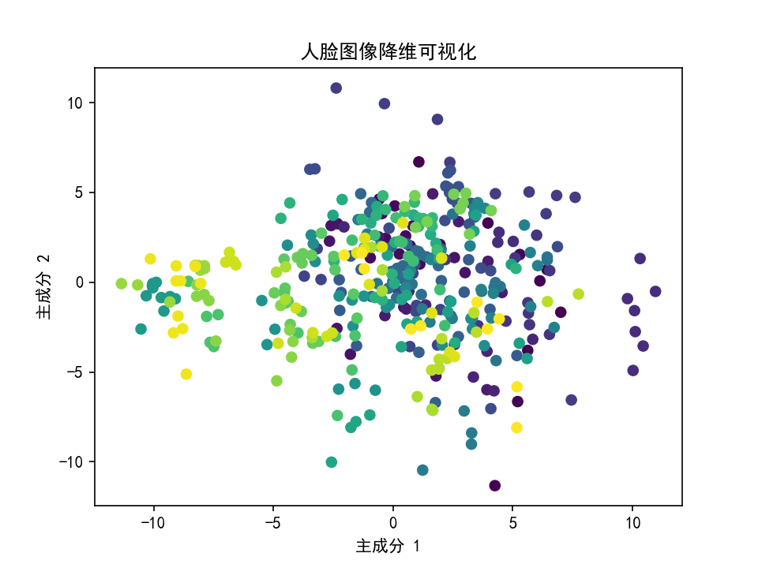

# scikit-learn

## Scikit-learn的发展历程及定义

Scikit-learn的发展始于2007年，由David Cournapeau在Google Summer of Code项目中启动。项目后续得到了许多开发者的贡献，包括INRIA（法国国家信息与自动化研究所），Waikato大学和其他机构。

项目之所以取名为Scikit-Learn，也是因为该算法库是基于SciPy来进行的构建，而Scikit则是SciPy Kit（SciPy衍生的工具套件）的简称

Scikit-learn是目前机器学习领域最完整、同时也是最具影响力的算法库。它基于Numpy, Scipy和matplotlib，包含了大量的机器学习算法实现，包括分类、回归、聚类和降维等，还包含了诸多模型评估及选择的方法。Scikit-learn的API设计的非常清晰，易于使用和理解，适合于新手入门，同时也满足了专业人士在实际问题解决中的需求。

## 算法包、算法库及算法框架

* **算法包**：包含预先编写的，针对特定问题或一系列相关问题的算法实现。算法包可以用于执行特定的任务或操作，例如数值分析、机器学习、图像处理等。使用者可以直接调用这些算法，而不需要自己从零开始编写。如**表格数据分析包Pandas**
* **算法库**：算法库和算法包非常相似，通常可以互换使用。它也是包含了预先编写的，用于解决特定问题的一系列算法的集合，主要指代封装程度更高、对机器学习这一大类算法功能实现更加完整、甚至是定义了一类数据结构的代码模块，如**科学计算库NumPy**
* **算法框架**：算法框架则是一个更大的概念，它提供了一个用于开发、构建和实现算法的系统，通常包含了一套标准的编程接口（API）、工具、库和规范。它的主要目的是简化和标准化开发过程，使得开发者可以更专注于实现特定的功能或算法，而不需要处理大量的基础设施问题。如**机器学习算法库Scikit-Learn**

通俗的理解一下：用一个餐厅的比喻来理解这三个概念：

- **算法包（Algorithm Package）**：就像餐厅菜单上的某个具体的菜品。每个菜品都有特定的制作方法，各种食材以特定的方式搭配，制作出特定的菜。比如你想吃鱼香肉丝，你可以直接点这道菜，而不需要告诉厨师应该怎么做。
- **算法库（Algorithm Library）**：就像整个餐厅的菜单。菜单包含了很多菜品，不论你想吃主食、汤还是甜点，你都可以在菜单上找到。你只需要从菜单中选择你想要的菜，而不需要知道具体的做法。
- **算法框架（Algorithm Framework）**：就像整个餐厅的运营模式。这不仅仅包括菜单，还有餐厅的装修风格，服务员的服务态度，烹饪食物的方式，以及提供食物的时间等等。它提供了一种方便的方式，使得你可以在一个地方享受到完整的用餐体验，而不仅仅是食物本身。

所以在编程中，直接使用算法包来解决特定的问题，使用算法库可以解决一系列的问题，而使用算法框架则可以帮助我们更好地组织和构建代码，更有效地解决问题。

## Scikit-learn官网

对于大多数流行的开源项目，官网都是学习的绝佳资源。而对于Scikit-Learn来说尤其是如此。哪怕是顶级开源项目盛行的当下，Scikit-Learn官网在相关内容介绍的详细和完整程度上，都是业内首屈一指的。无论是Scikit-Learn的安装、更新，还是具体算法的使用方法，甚至包括算法核心原理的论文出处以及算法使用的案例，在Scikit-Learn官网上都有详细的介绍。其官网地址：

[Scikit-Learn官网](https://link.zhihu.com/?target=https%3A//scikit-learn.org/stable/)，主要功能介绍如下：

### Scikit-learn六大模块



1. **分类**：识别某个对象属于哪个类别
   1. 算法: KNN, 随机森林 逻辑回归 朴素贝叶斯 GBDT XGboost LightGBM
   2. 应用: 垃圾邮件检测，图像识别
2. **回归**：预测与对象相关联的连续值属性
   1. 算法: 线性回归 Lasso回归 决策树回归 随机森林回归 XGboost回归
   2. 应用: 房价预测，时间序列预测
3. **聚类**：将相似对象自动分组
   1. 算法: k-Means, spectral clustering, mean-shift，基于层次聚类 基于密度聚类
   2. 应用: 客户细分；将数据分成相似的组。
4. **降维**：减少要考虑的随机变量的数量，
   1. 算法: 因子分析 PCA ICA LDA, 属性降维
   2. 应用: 可视化；减少数据的特征维度，以简化问题并提高计算效率
5. **模型选择**：比较，验证，选择参数和模型
   1. 模型: Metrics Scoring模型得分 Grid search 网格搜索 Cross Validation 交叉验证 Hyper-Parameters 超参数选择 Validation curves 模型验证曲线
   2. 目标: **通过参数调整提高精度**
6. **数据预处理**：特征选择,特征提取和归一化
   1. 算法: Standardization标准化 Scaling Features归一化 Non-linear transformation非线性转化Gaussian distribution高斯分布转化 Normalization正则化 Encoding categorical features类别性编码处理
   2. 应用: **把输入数据转换为机器学习算法可用的数据**

### User Guide

在最上方的User Guide一栏进入sklearn所有内容的合集页面，其中包含了sklearn的所有内容按照使用顺序进行的排序。如果点击左上方的Other versions，则可以下载sklearn所有版本的User Guide的PDF版本。

### API

如果想根据评估器或实用函数的名字去查找相关API说明文档，则可以点击最上方的API一栏进入到根据二极模块首字母排序的API查询文档中。其中二级模块指的是类似包含线性回归的linear_model模块或者包含MSE的metrics模块。

## 安装与设置

### Python环境的安装与配置

详细配置参考：[开发环境配置.md](..\AIGC\开发环境配置.md)

### Scikit-learn的安装

在完成Python环境的安装和配置后，可以进行Scikit-learn的安装，在官网上对应的位置如下：

```sh
# 可以创建虚拟环境，也可以直接安装，我是直接安装的
conda create -n sklearn
conda activate sklearn
pip install -U scikit-learn
```

### 模块、类

#### 数据模块（Data Modules）：

1. sklearn.datasets：包含示例数据集，如Iris、Digits等。
2. sklearn.datasets.fetch_openml：用于从OpenML获取数据集。
3. sklearn.datasets.fetch_lfw_people：用于获取LFW人脸数据集。

#### 数据处理模块（Data Preprocessing）

1. sklearn.preprocessing：提供特征缩放、标准化、编码、缺失值处理等功能。
2. sklearn.impute：用于填充缺失数据的模块。
3. sklearn.feature_selection：包括特征选择方法，帮助选择最重要的特征。
4. sklearn.decomposition：包含降维方法，如主成分分析（PCA）和因子分析。
5. sklearn.model_selection.train_test_split：用于将数据集分割为训练集和测试集。

#### 回归模块（Regression）

1. sklearn.linear_model：包含线性回归、岭回归、Lasso回归等线性模型。
2. sklearn.svm：支持向量机（SVM）用于回归任务。
3. sklearn.neighbors：k-近邻（KNN）回归方法。

#### 分类模块（Classification）

1. sklearn.linear_model：逻辑回归、线性判别分析等用于分类的线性模型。
2. sklearn.svm：支持向量机（SVM）用于分类任务。
3. sklearn.neighbors：k-近邻（KNN）分类方法。
4. sklearn.tree：决策树分类器。
5. sklearn.ensemble：随机森林、AdaBoost、梯度提升等集成学习方法。

#### 聚类模块（Clustering）

1. sklearn.cluster：包括K均值、DBSCAN、层次聚类等聚类算法。
2. sklearn.cluster.KMeans：K均值聚类
3. sklearn.cluster.AgglomerativeClustering：层次聚类
4. sklearn.cluster.DBSCAN：基于密度的聚类方法，可以识别具有相似密度的数据点
5. sklearn.cluster.SpectralClustering：谱聚类，数据之间的相似度矩阵

#### 降维模块（Dimensionality Reduction）

1. sklearn.decomposition：主成分分析（PCA）、独立成分分析（ICA）等降维方法。
2. sklearn.decomposition.PCA：主成分分析是一种线性降维方法
3. sklearn.decomposition.FastICA：独立成分，从混合信号中分离出原始信号**。**

#### 模型评估模块（Model Evaluation）

1. sklearn.metrics：包括各种模型评估指标，如准确率、F1分数、ROC曲线等。
2. sklearn.model_selection：提供交叉验证、参数搜索和数据集分割的工具。

#### 模型保存模块（Model Saving）

1. sklearn.externals.joblib：用于模型保存和加载的工具。

#### 其他，集成学习模块

1. sklearn.ensemble: 这个模块包括集成学习方法，如随机森林、梯度提升、AdaBoost等。

### 常见函数

1. fit(): 用于训练机器学习模型。
2. predict(): 用于进行预测。
3. transform(): 对数据进行变换，如特征工程。
4. score(): 评估模型性能。
5. GridSearchCV(): 用于网格搜索交叉验证以调优模型参数。
6. cross_val_score(): 执行交叉验证并返回评分。
7. train_test_split(): 将数据集分割为训练集和测试集。
8. confusion_matrix(): 计算混淆矩阵，用于分类问题的性能评估。

### 常见术语与含义

| 符号    | 含义       |
| ------- | ---------- |
| X_train | 训练数据   |
| X_test  | 测试数据   |
| y_train | 训练集标签 |
| y_test  | 测试集标签 |
| X       | 完整数据   |
| y       | 数据标签   |
| y_pred  | 预测标签   |

## Scikit-learn的快速入门

### 流程

1. **问题定义**
   1. 明确定义所要解决的问题
   2. 需求分析，业务理解，梳理问题并定义，让需求方确认
2. **数据准备**
   1. 获取数据：模块数据，自制数据，公开数据
   2. 分析数据：描述性统计，统计特征
   3. 分析数据：数据可视化
   4. 数据清洗：缺失，重复，异常
   5. 特征处理：特征缩放、特征选择、归一化，标准化
   6. 数据拆分：数据拆分为训练集，验证集，测试集
3. **模型搭建和训练**
   1. 根据任务类型选择合适的模型
4. **模型评估和优化**
   1. 分类
   2. 回归
5. **模型保存和应用**
   1. 模型保存：`joblib.dump(model,'train_model.m')`
   2. 模型应用：`model = joblib.load('train_model.m')`

### 数据集的导入和处理

Scikit-learn提供了非常多的内置数据集，并且还提供了一些创建数据集的方法，这些数据集常用于演示各种机器学习算法的使用方法。这些数据集分为两种类型：小规模的玩具数据集（Toy Datasets）和大规模的真实世界数据集（Real-World Datasets）。

以下是几个常见的玩具数据集：

1. **Iris（鸢尾花）**：一个分类问题的数据集，包含了三种鸢尾花的四个特征，目标是根据这些特征预测鸢尾花的种类。
2. **Digits（手写数字）**：一个多分类问题的数据集，包含了手写数字的8x8像素图像，目标是识别这些图像对应的数字。
3. **Boston House Prices（波士顿房价）**：这是一个回归问题的数据集，包含了波士顿各个区域的房价和其他13个特征，目标是预测房价。
4. **Breast Cancer（乳腺癌）**：这是一个二分类问题的数据集，包含了乳腺肿瘤的30个特征，目标是预测肿瘤是良性还是恶性。

sklearn中的数据集相关功能都在datasets模块下，可以通过API文档中的datasets模块所包含的内容对所有的数据集和创建数据集的方法进行概览。

比如：[load_iris — scikit-learn 1.5.1 documentation](https://scikit-learn.org/stable/modules/generated/sklearn.datasets.load_iris.html#sklearn.datasets.load_iris)，这就是上面提到的鸢尾花数据集

要在Scikit-learn中加载这些数据集，可以使用`sklearn.datasets`模块中的相关函数，例如：

```python
from sklearn.datasets import load_iris

iris = load_iris()
```

这个函数会返回一个`Bunch`对象，包含了数据、目标和其他信息。例如，`iris.data`是一个包含了特征的二维数组，`iris.target`是一个包含了目标的一维数组。

| 名称          | 描述                                         |
| :------------ | :------------------------------------------- |
| data          | 数据集特征矩阵                               |
| target        | 数据集标签数组                               |
| feature_names | 各列名称                                     |
| target_names  | 各类别名称                                   |
| frame         | 当生成对象是DataFrame时，返回完整的DataFrame |

对应的可以使用如下代码查看

```python
import pandas as pd
from sklearn.datasets import load_iris

iris = load_iris()
# 数据集包含四个特征
print("Features: ", iris.feature_names)
# 数据集有三种分类标签
print("Labels: ", iris.target_names)

# 将数据转换为DataFrame以便于查看
iris_df = pd.DataFrame(iris.data, columns=iris.feature_names)

# 添加分类标签到DataFrame
iris_df["label"] = iris.target

# 显示数据的前五行
print(iris_df.head())

```

**💻 输出**

```sh
Features:  ['sepal length (cm)', 'sepal width (cm)', 'petal length (cm)', 'petal width (cm)']
Labels:  ['setosa' 'versicolor' 'virginica']
   sepal length (cm)  sepal width (cm)  petal length (cm)  petal width (cm)  label
0                5.1               3.5                1.4               0.2      0
1                4.9               3.0                1.4               0.2      0
2                4.7               3.2                1.3               0.2      0
3                4.6               3.1                1.5               0.2      0
4                5.0               3.6                1.4               0.2      0
```

Scikit-learn也提供了一些真实世界的数据集，但由于规模较大，通常需要下载。这些数据集可以用于更复杂的任务和算法的测试。例如，`fetch_20newsgroups`函数可以下载20 Newsgroups文本数据集，用于文本分类等任务。

### 数据集切分

在Scikit-learn中，通常将原始数据集切分为训练集和测试集，这样做可以评估模型在未见过的数据上的性能。数据集切分的目的是为了更好的进行模型性能评估，而更好的进行模型性能评估则是为了更好的进行模型挑选，Scikit-learn提供了`train_test_split`函数来帮助完成这一任务，train_test_split在model_selection模块下。[train_test_split — scikit-learn 1.5.1 documentation](https://scikit-learn.org/stable/modules/generated/sklearn.model_selection.train_test_split.html#sklearn.model_selection.train_test_split)

可以这样调用并使用它：

```python
from sklearn.model_selection import train_test_split
 
# 假设X是特征，y是目标
X_train, X_test, y_train, y_test = train_test_split(X, y, test_size=0.2, random_state=42)
```

`train_test_split`函数的主要参数有：

- `X, y`：需要被切分的数据。
- `test_size`：代表测试集的比例。在上面的例子中，我们将20%的数据用作测试集。
- `random_state`：随机种子，可以确保每次运行代码时数据的切分方式相同。

**这里面有两个参数需要关注一下**：

- 随机数种子的设置，random_state取值不同，切分结果就会各有不同
- `stratify`参数是控制训练集和测试集不同类别样本所占比例的参数，若希望切分后的训练集和测试集中0、1两类的比例和原始数据相同（1:1），则可另stratify=y。

### 标准化和归一化

假设你正在分析公司员工的薪资情况，数据集中有两列信息：

* **年龄** (岁): 25, 30, 28, 35, 27
* **薪资** (千元/月): 8, 12, 10, 15, 9

**问题:** 年龄和薪资的单位和范围差异很大，直接比较分析容易造成误导。

**解决方案:**  使用数据标准化或归一化处理数据。

**1. 标准化 (Standardization)**

想象一下，我们将所有员工的年龄和薪资都画在一个坐标轴上。标准化的目标就是将这些数据点移动、缩放，使它们的分布更加集中、平均。

* **平均化:**  将所有数据点移动，使它们的平均值位于坐标轴的中心点。
* **缩放:**  将数据点之间的距离进行调整，使它们的分布更加紧凑。

经过标准化后，年龄和薪资数据都会呈现出类似钟形的分布，并且平均值都为 0，方便进行比较分析。

**2. 归一化 (Normalization)**

想象一下，我们将所有员工的年龄和薪资都压缩到 0 到 1 之间。

* **年龄:**  最年轻的员工年龄对应 0，最年长的员工年龄对应 1，其他员工的年龄按照比例进行缩放。
* **薪资:**  薪资最低的员工对应 0，薪资最高的员工对应 1，其他员工的薪资按照比例进行缩放。

经过归一化后，年龄和薪资数据都会被限制在 0 到 1 的范围内，方便进行比较分析。

> **总结:**
>
> * 标准化：像调整数据点的位置和间距，使它们更集中、平均。
> * 归一化：像将数据压缩到一个固定的范围内，方便比较。

Scikit-learn中，可以直接调用函数来使用，非常方便简单。

Scikit-learn中的预处理模块`sklearn.preprocessing`提供了许多实用的特征缩放功能，包括数据归一化（Normalization）和标准化（Standardization）。这两种技术都用于改变特征的尺度，以便在训练机器学习模型时保证它们在相同的范围内。

### 数值数据的标准化

> 此处需要注意一点：**从功能上划分，Scikit-learn中的归一化其实是分为标准化（Standardization）和归一化（Normalization）两类。Z-Score标准化和0-1标准化，都属于Standardization的范畴，Normalization则特指针对单个样本（一行数据）利用其范数进行放缩的过程。**

**数据归一化**：归一化通常意味着将数据缩放到[0, 1]的范围内，或者使得所有数据的范围都在[-1, 1]之间。可以使用Scikit-learn的`MinMaxScaler`来实现。

```python
import numpy as np
from sklearn.model_selection import train_test_split
from sklearn.preprocessing import MinMaxScaler

X = np.arange(30).reshape(5, 6)

X_train, X_test = train_test_split(X)

scaler = MinMaxScaler()
X_train_normalized = scaler.fit_transform(X_train)
X_test_normalized = scaler.transform(X_test)

print(X_test_normalized)
```

**💻 输出**

```sh
[[0.75 0.75 0.75 0.75 0.75 0.75]
 [0.5  0.5  0.5  0.5  0.5  0.5 ]]
```

这段代码首先创建了一个`MinMaxScaler`对象，然后使用`fit_transform`方法对训练数据进行拟合和转换，最后使用`transform`方法对测试数据进行转换。

**数据标准化**：标准化则是将数据缩放，使得它们的均值为0，标准差为1。这可以通过Scikit-learn的`StandardScaler`来实现。

```python
import numpy as np
from sklearn.discriminant_analysis import StandardScaler
from sklearn.model_selection import train_test_split


X = np.arange(30).reshape(5, 6)

X_train, X_test = train_test_split(X)

scaler = StandardScaler()

X_train_standardized = scaler.fit_transform(X_train)

# 利用训练集的均值和方差对测试集进行标准化处理
X_test_standardized = scaler.transform(X_test)

print(X_test_standardized)
```

**💻 输出**

```sh'
[[-2.44948974 -2.44948974 -2.44948974 -2.44948974 -2.44948974 -2.44948974]
 [-3.67423461 -3.67423461 -3.67423461 -3.67423461 -3.67423461 -3.67423461]]
```

**需要解释的一个点：为什么对训练集要使用`fit_transform`，而对测试集只使用`transform`**

这是因为：在机器学习中，训练集和测试集应当是分开处理的。具体地说，应当在训练集上训练模型，而测试集应当模拟真实世界中模型未曾见过的数据，以此来评估模型的真实性能。因此，任何形式的预处理（包括特征缩放）都应当只以训练集的数据为基准来完成。

当在训练集上调用`fit_transform`方法时，`fit`方法会计算训练集数据的均值和标准差，然后`transform`方法会使用这些计算出的参数（均值和标准差）来对训练集进行标准化。

然后，当在测试集上调用`transform`方法时，Scikit-learn会使用之前在训练集上计算得到的均值和标准差来进行标准化。这样做的原因是，假设测试集是模型未曾见过的新数据，因此，不能使用测试集数据的任何信息（包括它的均值和标准差）来影响模型。换句话说，必须假设在预处理阶段，测试集数据是不可见的。

> 总的来说，在预处理数据时，训练集应当使用`fit_transform`方法，而测试集应当只使用`transform`方法，这样可以保证不会在预处理阶段就“泄露”测试集的信息。

### 数值数据的归一化

在Scikit-learn中，`preprocessing.normalize`是另一种类型的"归一化"。

比如，你正在分析不同水果的特征：

| 水果 | 颜色(红) | 甜度 | 大小 |
| ---- | -------- | ---- | ---- |
| 苹果 | 0.8      | 0.7  | 0.5  |
| 香蕉 | 0.2      | 0.9  | 0.7  |
| 葡萄 | 0.5      | 0.6  | 0.2  |

每个水果都可以看作一个三维空间中的向量，三个维度分别是颜色、甜度和大小。

**`preprocessing.normalize` 做的事情就是把每个水果向量“拉伸”或“压缩”，使得它们的长度都变成 1。**

* **为什么要这样做呢？** 

   * 有些机器学习算法，比如计算相似度的算法，更关心数据的方向而不是大小。
   * 经过 `preprocessing.normalize` 处理后，所有数据点都被“拉”到一个单位球面上，这样就能更公平地比较它们的方向差异，而不受大小的影响。

* **如何“拉伸”或“压缩”呢？**

   * `preprocessing.normalize` 提供了两种方式：
      * **L1 范数:**  将每个向量每个维度上的值除以所有维度绝对值之和。
      * **L2 范数:** 将每个向量每个维度上的值除以所有维度平方和的平方根。

**简单来说，`preprocessing.normalize` 就是把每个数据点都“归一化”到一个单位球面上，方便比较它们的方向差异。** 

而Scikit-learn中的Normalization过程，实际上就是将每一行数据视作一个向量，然后用每一行数据去除以该行数据的L1 范数或者L2 范数。具体除以哪个范数，以preprocessing.normalize函数中输入的norm参数为准。

```python
from sklearn.preprocessing import normalize
import numpy as np

# 创建一个numpy数组
X = np.array([[1.0, -1.0, 2.0], [2.0, 0.0, 0.0], [0.0, 1.0, -1.0]])

# 对数据进行归一化处理，使用默认的L2范数
X_normalized = normalize(X, norm="l2")
print(X_normalized)
```

**💻 输出**

```sh
[[ 0.40824829 -0.40824829  0.81649658]
 [ 1.          0.          0.        ]
 [ 0.          0.70710678 -0.70710678]]
```

在上面的代码中，每一行的特征向量被归一化为单位范数（长度为1）。这就意味着每一个样本的所有特征值的平方和为1。也可以通过设置`norm`参数为`'l1'`，来进行L1范数归一化，使得每个样本的所有特征值的绝对值和为1。

### 核心对象类型：评估器（estimator）

许多功能强大的第三方库都定义了自己的核心对象类型，这些对象类型实际上都是源码中定义的特定类的实例。例如，NumPy的核心是数组（Array），Pandas的核心是DataFrame，PyTorch的核心则是张量（Tensor）。这些对象类型为数据分析和机器学习提供了强大的工具。

对于Scikit-learn来说，它的核心对象类型是评估器（Estimator）。可以将评估器看作是一种封装了各种机器学习模型的工具。在Scikit-learn中进行模型训练的过程，其核心就是围绕着这些评估器展开的。

总的来说，这些不同库的核心对象类型都为处理特定任务提供了便捷，使得可以更加专注于问题的解决，而不需要深入底层去处理复杂的细节。"

围绕评估器的使用也基本分为两步，其一是实例化该对象，其二则是围绕某数据进行模型训练。

### 高级特性-管道（Pipeline）

在Scikit-learn中，Pipeline是一种方便地将多个步骤组织在一起的工具，常常用于包含多个步骤的数据预处理和建模过程。Pipeline在确保步骤顺序执行，代码整洁，并在进行交叉验证时防止数据泄露方面有很大的优势。

Pipeline工作流程类似于生产线，每个步骤都是独立的，但所有的步骤都依次串联起来，上一步的输出作为下一步的输入。一个典型的Pipeline可能包括数据的缩放（如归一化或标准化）、特征选择、降维以及最后的模型训练等步骤。

直接来看下代码：

```python
from sklearn.pipeline import Pipeline
from sklearn.preprocessing import StandardScaler
from sklearn.linear_model import LinearRegression
from sklearn.datasets import load_diabetes
from sklearn.model_selection import train_test_split

# 加载糖尿病数据集
diabetes = load_diabetes()
X_train, X_test, y_train, y_test = train_test_split(
    diabetes.data, diabetes.target, random_state=0
)

# 创建一个Pipeline
pipe = Pipeline(
    [
        ("scaler", StandardScaler()),  # 第一步是标准化
        ("regressor", LinearRegression()),  # 第二步是线性回归
    ]
)

# 使用Pipeline进行训练
pipe.fit(X_train, y_train)

# 使用Pipeline进行预测
y_pred = pipe.predict(X_test)

print(y_pred)
```

在这个例子中，创建了一个Pipeline，它包含两个步骤：一个是`StandardScaler`，用于对数据进行标准化处理；另一个是`LinearRegression`，用于进行回归预测。然后在训练集上调用`fit`方法，Pipeline会依次对每个步骤进行训练（也就是说，它首先在数据上进行标准化，然后使用标准化的数据训练回归模型）。当在测试集上调用`predict`方法时，Pipeline会依次对每个步骤进行预测（即先进行标准化，然后使用训练好的回归模型进行预测）。

### 模型保存

模型保存（model persistence）是一种将训练好的机器学习模型保存到磁盘，然后在以后的时间点（可能是在不同的环境中）加载和使用的技术。这是非常有用的，因为通常训练一个好的模型可能需要大量的时间和计算资源。一旦模型被训练，我们可能希望在未来重新使用它，而不是每次需要时都重新训练。

在Scikit-learn中，可以使用Python的内置库`pickle`，或者`joblib`库（一种特别针对大数据的pickle）来实现模型保存和加载。

直接上代码：演示如何使用`joblib`保存和加载模型：

```python
from sklearn.ensemble import RandomForestClassifier
from sklearn.datasets import load_iris
from joblib import dump, load

# 加载iris数据集并训练一个随机森林分类器
iris = load_iris()
clf = RandomForestClassifier()
clf.fit(iris.data, iris.target)

# 将模型保存到磁盘
dump(clf, "randomforest_model.joblib")

# 在需要的时候加载模型
clf_loaded = load("randomforest_model.joblib")

# 使用加载的模型进行预测
y_pred = clf_loaded.predict(iris.data)
```

以上代码中，`dump`函数将模型保存到指定的文件中，而`load`函数则从文件中加载模型。注意，保存和加载模型的代码通常不会在同一脚本或同一会话中运行，这里只是为了演示。

如果模型包含了大量的numpy数组（例如，神经网络或随机森林等模型），使用`joblib`可能比使用`pickle`更高效。因此，Scikit-learn官方文档推荐使用`joblib`来保存和加载模型。

## Scikit-learn实战

### 识别鸢尾花：Scikit-learn K近邻分类实战

**场景：**

你是一位植物学家，想要开发一个模型来自动识别三种鸢尾花：

* **山鸢尾 (Setosa)**：花瓣小而圆，颜色通常为蓝色或紫色。
* **变色鸢尾 (Versicolor)**：花瓣较大，颜色通常为粉红色或紫色。
* **维吉尼亚鸢尾 (Virginica)**：花瓣最大，颜色通常为白色或淡紫色。

你收集了 150 朵鸢尾花的样本，并测量了它们的花瓣长度和宽度。为了方便理解，我们假设只使用这两个特征。

**目标：**

利用 Scikit-learn 构建一个 K 近邻 (KNN) 分类模型，根据花瓣长度和宽度预测鸢尾花的种类。

**步骤：**

1. **训练阶段 (Training Phase):**
   * 将 100 朵鸢尾花的样本作为训练集，告诉模型每朵花的种类（山鸢尾、变色鸢尾或维吉尼亚鸢尾）。
   * 模型会记住这些样本的特征（花瓣长度和宽度）以及对应的种类。

2. **测试阶段 (Testing Phase):**
   *  拿出剩下的 50 朵鸢尾花作为测试集，这些花模型之前没有见过。
   *  测量每朵测试花的的花瓣长度和宽度，并将这些信息输入模型。
   *  模型会根据之前学习到的知识，找到与测试花最相似的几朵训练花（这里假设 K=3，也就是找 3 个最近邻）。
   *  模型会根据这 3 个邻居的种类，通过投票的方式来预测测试花的种类。

3. **评估阶段 (Evaluation Phase):**
   * 将模型的预测结果与测试花的真实种类进行比较。
   * 通过计算**准确率 (Accuracy)** 来评估模型的性能。 
     * 准确率 = 正确预测的样本数量 / 总样本数量
     * 例如，如果模型正确预测了 45 朵测试花的种类，那么准确率就是 45/50 = 90%。

**代码示例：**

```python
import matplotlib.pyplot as plt
from sklearn.datasets import load_iris
from sklearn.model_selection import train_test_split
from sklearn.neighbors import KNeighborsClassifier
from sklearn.metrics import accuracy_score

plt.rcParams["font.sans-serif"] = ["SimHei"]  # 使用黑体显示中文
plt.rcParams["axes.unicode_minus"] = False  # 解决负号'-'显示为方块的问题

# 加载鸢尾花数据集
iris = load_iris()

# 为了方便理解，我们只使用花瓣长度和宽度作为特征
X = iris.data[:, 2:]  # 取所有样本的第3列和第4列数据
y = iris.target

# 将数据集拆分为训练集和测试集
X_train, X_test, y_train, y_test = train_test_split(
    X, y, test_size=0.2, random_state=42
)

# 创建 K 近邻分类器，设置 K=3
knn = KNeighborsClassifier(n_neighbors=3)

# 使用训练集训练模型
knn.fit(X_train, y_train)

# 使用测试集进行预测
y_pred = knn.predict(X_test)

# 评估模型性能
accuracy = accuracy_score(y_test, y_pred)
print(f"模型准确率：{accuracy:.2f}")

# 可视化预测结果
plt.figure(figsize=(8, 6))
plt.scatter(X_test[:, 0], X_test[:, 1], c=y_pred, cmap=plt.cm.Set1, marker="o", s=40)
plt.xlabel("花瓣长度 (cm)")
plt.ylabel("花瓣宽度 (cm)")
plt.title("K 近邻算法预测结果")
plt.show()
```



**可视化解释：**

* 想象一下，你把 100 朵训练花的特征画在一个二维坐标系中，横轴代表花瓣长度，纵轴代表花瓣宽度，不同种类的花用不同的颜色表示。
* 当你输入一朵测试花的特征时，模型会在这个坐标系中找到距离测试花最近的 3 个点，并根据这 3 个点的颜色来预测测试花的种类。

> **总结：**
>
> K 近邻算法是一种简单直观的分类算法，它通过找到与测试样本最相似的 K 个训练样本，并根据这些邻居的标签来进行预测。模型的性能可以通过准确率等指标来评估，准确率越高，说明模型的预测能力越强。 

### 房价预测：Scikit-learn 回归模型实战

**场景：** 

你是一位房地产经纪人，想要根据房屋面积、卧室数量、地理位置等特征，预测房屋的售价。

**数据：**

你收集了一些历史房屋销售数据，包括：

* **房屋面积 (平方米)**
* **卧室数量 (个)**
* **距离市中心距离 (公里)**
* **售价 (万元)**

**目标：**

利用 Scikit-learn 构建一个回归模型，根据房屋特征预测售价。

**代码示例：**

```python
import matplotlib.pyplot as plt
from sklearn.datasets import make_regression
from sklearn.model_selection import train_test_split
from sklearn.linear_model import LinearRegression
from sklearn.metrics import mean_squared_error

plt.rcParams["font.sans-serif"] = ["SimHei"]  # 使用黑体显示中文
plt.rcParams["axes.unicode_minus"] = False  # 解决负号'-'显示为方块的问题

# 1. 生成模拟数据
X, y = make_regression(n_samples=100, n_features=3, noise=10, random_state=42)

# 2. 拆分数据集
X_train, X_test, y_train, y_test = train_test_split(
    X, y, test_size=0.2, random_state=42
)

# 3. 创建线性回归模型
model = LinearRegression()

# 4. 训练模型
model.fit(X_train, y_train)

# 5. 预测
y_pred = model.predict(X_test)

# 6. 评估模型
mse = mean_squared_error(y_test, y_pred)
print(f"均方误差: {mse:.2f}")

# 7. 可视化预测结果 (假设只使用房屋面积作为特征)
plt.scatter(X_test[:, 0], y_test, color="blue", label="真实值")
plt.scatter(X_test[:, 0], y_pred, color="red", label="预测值")
plt.xlabel("房屋面积 (平方米)")
plt.ylabel("售价 (万元)")
plt.legend()
plt.show()
```

> 因为数据纯属模拟虚构，所以看起来可视化预测结果有问题，比如数据有负数等……



**解释：**

1. **生成模拟数据:**  我们使用 `make_regression` 函数生成模拟的房屋销售数据。
2. **拆分数据集:**  将数据分为训练集和测试集。
3. **创建线性回归模型:**  我们使用 `LinearRegression` 类创建一个线性回归模型。
4. **训练模型:**  使用训练集训练模型，找到最佳拟合数据的参数。
5. **预测:**  使用训练好的模型对测试集进行预测。
6. **评估模型:**  使用均方误差 (MSE) 来评估模型的预测精度。
7. **可视化预测结果:**  将真实值和预测值绘制在同一张图上，直观地展示模型的预测效果。

> **总结：**
>
> 这个例子展示了如何使用 Scikit-learn 构建一个简单的线性回归模型来预测房价。你可以根据实际情况修改数据和模型，例如使用更复杂的回归模型或添加更多特征，以提高预测精度. 

假如我有某市房地产销售的历史数据的 CSV 文件表格，那么我们可以用真实数据进行这个实验。

| 房屋面积（平方米） | 卧室数量 | 地理位置 | 售价（万元） |
| ------------------ | -------- | -------- | ------------ |
| 80                 | 2        | 城东     | 350          |
| 100                | 3        | 城西     | 500          |
| 60                 | 1        | 城北     | 280          |
| 120                | 4        | 城南     | 650          |
| 90                 | 2        | 城东     | 420          |
| 70                 | 2        | 城西     | 320          |
| 110                | 3        | 城北     | 550          |
| 130                | 4        | 城南     | 700          |

```python
# 加载 CSV 文件
data = pd.read_csv("房地产销售数据.csv")  # 请将文件名替换为你的文件名

# 查看数据概况
print(data.head())  # 查看前几行数据
print(data.info())  # 查看数据类型和缺失值情况
print(data.describe())  # 查看数据的统计信息

# 处理缺失值 (如果存在)
# 例如，使用均值填充：data.fillna(data.mean(), inplace=True)

# 处理异常值 (如果需要)
# 例如，删除异常值或进行转换

# 特征工程 (如果需要)
# 例如，创建新的特征或对现有特征进行转换

# 选择特征和目标变量
X = data[["房屋面积", "卧室数量", "地理位置"]]  # 请根据你的数据选择特征
y = data["售价"]

# 将分类特征转换为数值特征 (如果需要)
# 例如，使用独热编码：X = pd.get_dummies(X, columns=["地理位置"])

# 拆分数据集
X_train, X_test, y_train, y_test = train_test_split(X, y, test_size=0.2, random_state=42)
```

###  顾客购物习惯分析：Scikit-learn 聚类实战

**场景：**

你是一家超市的老板，想要了解顾客的购物习惯，以便更好地制定营销策略。你收集了顾客过去一个月的购物数据，包括他们购买的商品种类和消费金额。

**数据：**

你拥有以下数据：

* **顾客ID**
* **购买商品种类数量** (例如，一位顾客购买了 5 种不同的商品)
* **平均每次购物消费金额** (例如，一位顾客每次购物平均花费 100 元)

**目标：**

利用 Scikit-learn 中的 K-means 聚类算法对顾客进行分组，找出具有相似购物习惯的顾客群体。

**代码示例：**

```python
import matplotlib.pyplot as plt
import numpy as np
from sklearn.cluster import KMeans

plt.rcParams["font.sans-serif"] = ["SimHei"]  # 使用黑体显示中文
plt.rcParams["axes.unicode_minus"] = False  # 解决负号'-'显示为方块的问题

# 1. 生成模拟数据
np.random.seed(42)  # 设置随机种子，确保结果可复现
n_samples = 300
n_clusters = 3

# 为每个簇设置不同的中心点和标准差
centers = [(2, 50), (5, 200), (8, 400)]  # 购买种类数量，平均消费金额
std_devs = [(1, 30), (1.5, 80), (2, 100)]

X = np.concatenate(
    [
        np.random.normal(loc=center, scale=std, size=(n_samples // n_clusters, 2))
        for center, std in zip(centers, std_devs)
    ]
)

# 添加随机噪声
X += np.random.randn(n_samples, 2) * 5

# 确保购买种类数量不小于 1
X[:, 0] = np.clip(X[:, 0], 1, np.inf)

# 2. 创建 KMeans 模型
kmeans = KMeans(n_clusters=n_clusters, random_state=42)

# 3. 训练模型
kmeans.fit(X)

# 4. 获取聚类标签
labels = kmeans.labels_

# 5. 可视化聚类结果
plt.scatter(X[:, 0], X[:, 1], c=labels, cmap="viridis")
plt.xlabel("购买商品种类数量")
plt.ylabel("平均每次购物消费金额")
plt.title("顾客购物习惯聚类分析")
plt.show()

```

> 因为数据纯属模拟虚构，所以看起来可视化聚类结果比较假



**解释：**

1. **生成模拟数据:**  我们使用 `make_blobs` 函数生成模拟的顾客购物数据。
2. **创建 KMeans 模型:**  我们使用 `KMeans` 类创建一个 K-means 聚类模型，并指定要将数据分为 3 类。
3. **训练模型:**  使用顾客购物数据训练模型，模型会自动找到 3 个聚类中心。
4. **获取聚类标签:**  获取每个顾客所属的类别标签。
5. **可视化聚类结果:**  将不同类别用不同颜色绘制在散点图上，直观地展示聚类结果。

**结果分析：**

* 图表中，每个点代表一位顾客，点的颜色代表该顾客所属的类别。
* 你可以观察到，模型将顾客分成了 3 个不同的群体：
    * **高消费、多样化购物群体:**  购买商品种类多，平均每次购物消费金额高。
    * **中等消费、特定商品偏好群体:**  购买商品种类相对集中，平均每次购物消费金额中等。
    * **低消费、少量商品购买群体:**  购买商品种类少，平均每次购物消费金额低。

**营销策略:**

* 针对 **高消费、多样化购物群体**，可以推荐高利润商品、组合套餐等。
* 针对 **中等消费、特定商品偏好群体**，可以分析其商品偏好，进行精准营销。
* 针对 **低消费、少量商品购买群体**，可以推出促销活动，吸引其增加消费。

> **总结：**
>
> 这个例子展示了如何使用 Scikit-learn 中的 K-means 聚类算法对顾客进行分类，并根据聚类结果制定相应的营销策略。 

###  人脸识别：Scikit-learn 降维实战

**场景：**

你正在开发一个人脸识别系统，需要存储大量人脸图像数据。然而，每张图片都包含了大量的像素信息，直接使用这些信息进行人脸识别计算量巨大，效率低下。

**数据：**

你收集了大量人脸图像，每张图像都是一个高维向量，每个维度代表一个像素的灰度值。

**目标：**

利用 Scikit-learn 中的 PCA (主成分分析) 算法对人脸图像进行降维，提取最能代表人脸特征的主成分，从而降低数据维度，提高识别效率。

**代码示例：**

```python
import matplotlib.pyplot as plt
from sklearn.datasets import fetch_olivetti_faces
from sklearn.decomposition import PCA

plt.rcParams["font.sans-serif"] = ["SimHei"]  # 使用黑体显示中文
plt.rcParams["axes.unicode_minus"] = False  # 解决负号'-'显示为方块的问题

# 1. 加载人脸数据集
faces = fetch_olivetti_faces()
X = faces.data
y = faces.target

# 2. 创建 PCA 模型
# 假设我们想要保留 90% 的数据方差
pca = PCA(n_components=0.9)

# 3. 训练模型
pca.fit(X)

# 4. 对数据进行降维
X_reduced = pca.transform(X)

# 5. 可视化降维后的数据
# 将前两个主成分作为坐标轴，绘制散点图
plt.scatter(X_reduced[:, 0], X_reduced[:, 1], c=y, cmap="viridis")
plt.xlabel("主成分 1")
plt.ylabel("主成分 2")
plt.title("人脸图像降维可视化")
plt.show()
```



**解释：**

1. **加载人脸数据集:**  我们使用 `fetch_olivetti_faces` 函数加载 Olivetti 人脸数据集，该数据集包含 400 张人脸图像。
2. **创建 PCA 模型:**  我们使用 `PCA` 类创建一个 PCA 模型，并设置 `n_components=0.9`，这意味着我们想要保留 90% 的数据方差。
3. **训练模型:**  使用人脸图像数据训练模型，模型会自动找到最能代表人脸特征的主成分。
4. **对数据进行降维:**  使用训练好的模型对原始数据进行降维，得到一个低维表示。
5. **可视化降维后的数据:**  将降维后的数据绘制在二维平面上，观察不同人脸在低维空间中的分布情况。

**结果分析：**

* 图表中，每个点代表一张人脸图像，点的颜色代表不同的人。
* 你可以观察到，即使在降维后，属于同一个人的图像仍然聚集在一起，说明 PCA 成功提取了人脸的主要特征。

**应用：**

* 降维后的人脸数据可以用于人脸识别、表情分析等任务，能够有效降低计算复杂度，提高识别效率。
* PCA 还可以用于其他类型的高维数据的降维，例如基因表达数据、文本数据等。

> **总结：**
>
> 这个例子展示了如何使用 Scikit-learn 中的 PCA 算法对人脸图像进行降维，并通过可视化方式展示了降维效果。PCA 是一种强大的降维工具，可以帮助我们更好地理解和分析高维数据。

 ## 扩展阅读

* [Python机器学习实战：用Python构建10个有趣的应用机器学习是一门强大的工具，可以用于解决各种各样的问题。通过学 - 掘金 (juejin.cn)](https://juejin.cn/post/7315126197952086026)

  