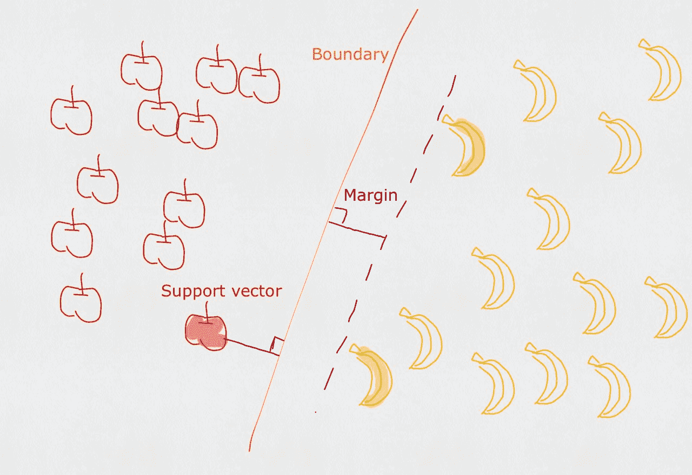
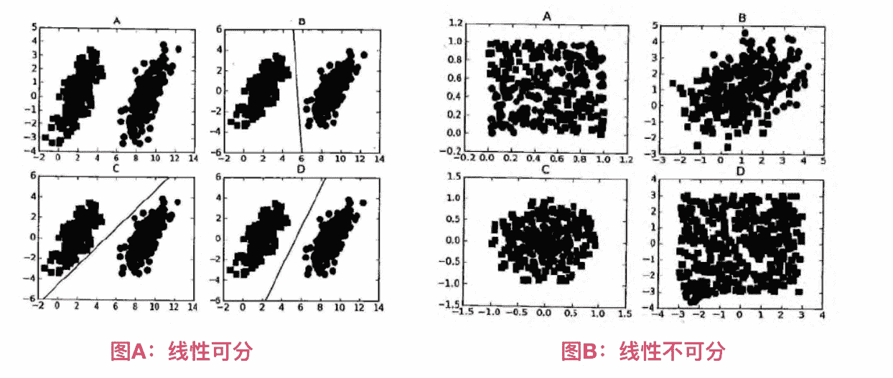
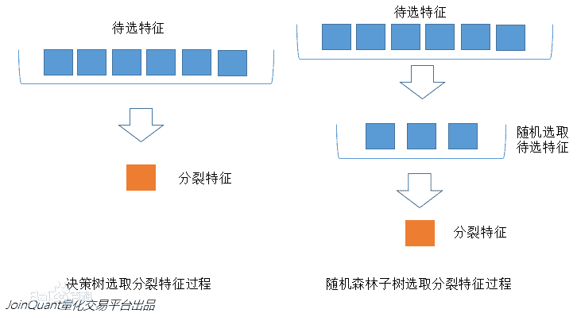
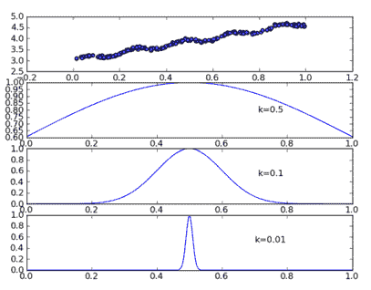

# 机器学习

## 概述

`机器学习(Machine Learning,ML)` 是使用计算机来彰显数据背后的真实含义，它为了把无序的数据转换成有用的信息。是一门多领域交叉学科，涉及概率论、统计学、逼近论、凸分析、算法复杂度理论等多门学科。专门研究计算机怎样模拟或实现人类的学习行为，以获取新的知识或技能，重新组织已有的知识结构使之不断改善自身的性能。 它是人工智能的核心，是使计算机具有智能的根本途径，其应用遍及人工智能的各个领域，它主要使用归纳、综合而不是演绎。


### AI、机器学习、深度学习的关系

简单说，人工智能范围最大，涵盖机器学习、深度学习。如果把人工智能比喻成孩子大脑，那么机器学习是让孩子去掌握认知能力的过程，而深度学习是这种过程中很有效率的一种教学体系。

> :bulb: 有人表示，人工智能是目的，是结果；深度学习、机器学习是方法，是工具。


### 机器学习

是研究计算机怎样模拟或实现人类的学习行为，以获取新的知识或技能，重新组织已有的知识结构使之不断改善自身的性能。机器学习是AI的核心，是使计算机具有智能的根本途径。

**1. 深度学习 (Deep Learning):**

* **核心:** 使用多层神经网络来学习数据中的复杂模式。
* **优势:** 能够处理高维数据（如图像，文本，音频），自动进行特征提取。
* **局限性:** 需要大量的训练数据，训练过程计算量大，可解释性较差。

**2. 强化学习 (Reinforcement Learning):**

* **核心:** 通过与环境互动来学习最佳行为策略，目标是最大化长期累积奖励。
* **优势:** 能够解决序列决策问题，在游戏，机器人控制等领域有广泛应用。
* **局限性:**  奖励函数设计困难，探索-利用困境，训练过程不稳定。

**3. 迁移学习 (Transfer Learning):**

* **核心:** 将在一个任务上训练好的模型知识迁移到另一个相关任务上，以提高学习效率。
* **优势:** 可以解决目标任务数据不足的问题，加速模型训练，提升模型性能。
* **局限性:**  需要找到合适的源任务和迁移方法，迁移效果不一定总是理想。

> **总结:**
>
> * 深度学习是基础，为强化学习和迁移学习提供强大的工具。
> * 强化学习侧重于与环境互动学习策略，迁移学习侧重于知识迁移和复用。
> * 三者可以结合使用，形成更强大的机器学习方法，解决更复杂的任务。 

#### 深度学习


以识别汽车为例：

**机器学习 (Machine Learning):**

1. **输入 (Input):** 一张汽车的图片。
2. **特征提取 (Feature Extraction):**  需要人为设计算法，从图片中提取颜色、形状、纹理等特征。例如，可以提取轮子的数量、车窗的形状等作为特征。
3. **分类 (Classification):**  使用提取的特征训练一个分类器，例如支持向量机 (SVM) 或随机森林，来区分汽车和非汽车。
4. **输出 (Output):**  分类器判断输入图片是“汽车”还是“非汽车”。

**深度学习 (Deep Learning):**

1. **输入 (Input):**  同样是一张汽车的图片。
2. **特征提取 + 分类 (Feature Extraction + Classification):**  深度学习模型，例如卷积神经网络 (CNN)，可以自动从原始图像数据中学习特征，并进行分类。隐藏神经元 (Hidden Neurons) 代表了模型学习到的不同层次的特征，从简单的边缘、纹理到复杂的形状、对象部件。
3. **输出 (Output):**  深度学习模型不仅可以判断图片是否是汽车，还可以识别更详细的信息，例如汽车的颜色、型号等。

> **总结:**
>
> * 机器学习需要人为设计特征提取算法，而深度学习可以自动学习特征。
> * 深度学习模型通常比传统机器学习模型更强大，能够学习更复杂的关系，并提供更详细的输出信息。

#### 强化学习

强化学习不同于监督学习，监督学习通过正确结果来指导学习，而强化学习通过环境提供的信号对产生的动作的好坏做一种评价，它必须要靠自身经历进行学习。学习后智能体知道在什么状态下该采取什么行为，学习从环境状态到动作的映射，该映射称为策略。


#### 迁移学习

> **迁移学习**是指**利用**数据、任务、或者模型的**相似性**，将在旧领域学习到的模型，应用到新的领域的一种学习过程。


### 研究意义

机器学习是一门人工智能的科学，该领域的主要研究对象是人工智能，特别是如何在经验学习中改善具体算法的性能。 

* “机器学习是对能通过经验自动改进的计算机算法的研究”。 

* “机器学习是用数据或以往的经验，以此优化计算机程序的性能标准。” 

一种经常引用的英文定义是：

> A computer program is said to learn from experience E with respect to some class of tasks T and performance measure P, if its performance at tasks in T, as measured by P, improves with experience E.
>
> 一个计算机程序能够针对某个任务类 T 和性能指标 P 从经验 E 中学习，是指它在任务 T 中的性能（由 P 衡量）会随着经验 E 的增加而提高。

机器学习已经有了十分广泛的应用，例如：数据挖掘、计算机视觉、自然语言处理、生物特征识别、搜索引擎、医学诊断、检测信用卡欺诈、证券市场分析、DNA序列测序、语音和手写识别、战略游戏和机器人运用。

## 场景

例如：识别动物猫
- **模式识别（官方标准）**：人们通过大量的经验，得到结论，从而判断它就是猫。
- **机器学习（数据学习）**：人们通过阅读进行学习，观察它会叫、小眼睛、两只耳朵、四条腿、一条尾巴，得到结论，从而判断它就是猫。
- **深度学习（深入数据）**：人们通过深入了解它，发现它会'喵喵'的叫、与同类的猫科动物很类似，得到结论，从而判断它就是猫。（深度学习常用领域：语音识别、图像识别）

> - 模式识别（pattern recognition）：模式识别是最古老的（作为一个术语而言，可以说是很过时的）。
>   - 我们把环境与客体统称为“模式”，识别是对模式的一种认知，是如何让一个计算机程序去做一些看起来很“智能”的事情。
>   - 通过融于智慧和直觉后，通过构建程序，识别一些事物，而不是人，例如：识别数字。
> - 机器学习（machine learning）：机器学习是最基础的（当下初创公司和研究实验室的热点领域之一）。
>   - 在90年代初，人们开始意识到一种可以更有效地构建模式识别算法的方法，那就是用数据（可以通过廉价劳动力采集获得）去替换专家（具有很多图像方面知识的人）。
>   - “机器学习”强调的是，在给计算机程序（或者机器）输入一些数据后，它必须做一些事情，那就是学习这些数据，而这个学习的步骤是明确的。
>   - 机器学习（Machine Learning）是一门专门研究计算机怎样模拟或实现人类的学习行为，以获取新的知识或技能，重新组织已有的知识结构使之不断改善自身性能的学科。
> - 深度学习（deep learning）：深度学习是非常崭新和有影响力的前沿领域，我们甚至不会去思考-后深度学习时代。
>   - 深度学习是机器学习研究中的一个新的领域，其动机在于建立、模拟人脑进行分析学习的神经网络，它模仿人脑的机制来解释数据，例如图像，声音和文本。

机器学习已应用于多个领域，远远超出大多数人的想象，横跨：计算机科学、工程技术和统计学等多个学科。

- 搜索引擎：根据你的搜索点击，优化你下次的搜索结果,是机器学习来帮助搜索引擎判断哪个结果更适合你（也判断哪个广告更适合你）。
- 垃圾邮件：会自动的过滤垃圾广告邮件到垃圾箱内。
- 超市优惠券：你会发现，你在购买小孩子尿布的时候，售货员会赠送你一张优惠券可以兑换6罐啤酒。
- 邮局邮寄：手写软件自动识别寄送贺卡的地址。
- 申请贷款：通过你最近的金融活动信息进行综合评定，决定你是否合格。

## 机器学习库

Scikit-learn 和 PyTorch 是两个广泛使用的机器学习库，但它们的侧重点和适用场景有所不同。

### 目标和用途

- **Scikit-learn**：
  - 主要用于传统的机器学习任务，如分类、回归和聚类等。
  - 提供了许多经典的机器学习算法（如决策树、随机森林、支持向量机等）和工具（如数据预处理、特征选择、模型评估等）。
  - 适合于小到中等规模的数据集，强调易用性和快速原型开发。

- **PyTorch**：
  - 主要用于深度学习任务，支持构建和训练复杂的神经网络。
  - 提供了灵活的动态计算图（Dynamic Computation Graph），使得模型的构建和调试更加直观。
  - 适合于大规模数据集和复杂模型，广泛应用于计算机视觉、自然语言处理等领域。

### 编程模型

- **Scikit-learn**：
  - 采用的是更高层次的API，用户通常只需调用现成的模型和函数，进行简单的参数设置和训练。
  - 适合快速实验和原型开发，使用起来相对简单。

- **PyTorch**：
  - 提供了更底层的控制，用户可以自定义模型结构、损失函数和优化算法。
  - 适合需要高度自定义的深度学习任务，允许用户灵活地实现复杂的模型。

### 计算图

- **Scikit-learn**：
  - 不支持计算图，所有的模型训练和预测都是基于静态的算法实现。
  - 适合于传统的机器学习方法，不需要动态计算图的特性。

- **PyTorch**：
  - 支持动态计算图，用户可以在运行时定义和修改计算图，使得调试和模型开发更加灵活。
  - 适合于需要动态调整模型结构的深度学习任务。

### 总结

- **Scikit-learn** 更加适合传统机器学习任务，强调易用性和快速开发，适合于小到中等规模的数据集。
- **PyTorch** 则更侧重于深度学习，提供了灵活的模型构建和训练机制，适合于大规模数据集和复杂模型的开发。

根据具体的项目需求和数据特性，选择合适的库可以更有效地完成任务。

##  组成


* 无监督学习

  * 聚类（clustering）：把训练集中的对象分为若干组
    * 应用实例：某电商平台希望根据用户的购买历史、浏览记录、收藏等行为数据，对用户进行分类，以便进行更精准的营销和推荐。
    * 无需预先定义用户类别，可以自动发现用户群体。
  * 簇（cluster）：每一个组叫簇

* 监督学习

  - 分类（classification）：将实例数据划分到合适的类别中，预测是离散值，比如把人分为好人和坏人之类的学习任务。
    - 应用实例：判断网站是否被黑客入侵（二分类 ），手写数字的自动识别（多分类）
    - 已经分好类，你需要学习每个类别的特点，然后把新数据放到正确的类别中

  - 回归（regression）：主要用于预测数值型数据，预测值是连续值，比如你的好人程度达到了0.9，0.6之类的。
    - 应用实例：股票价格波动的预测，房屋价格的预测等。


### 监督学习（supervised learning）

- 必须确定目标变量的值，以便机器学习算法可以发现特征和目标变量之间的关系。在监督学习中，给定一组数据，我们知道正确的输出结果应该是什么样子，并且知道在输入和输出之间有着一个特定的关系。 (包括：分类和回归)
- 样本集：训练数据 + 测试数据
  - 训练样本 = 特征(feature) + 目标变量(label：分类-离散值/回归-连续值)
  - 特征通常是训练样本集的列，它们是独立测量得到的。
  - 目标变量：目标变量是机器学习预测算法的测试结果。
    - 在分类算法中目标变量的类型通常是标称型(如：真与假)，而在回归算法中通常是连续型(如：1~100)。
- 监督学习需要注意的问题:
  - 偏置方差权衡
  - 功能的复杂性和数量的训练数据
  - 输入空间的维数
  - 噪声中的输出值
- 知识表示:
  - 可以采用规则集的形式【例如：数学成绩大于90分为优秀】
  - 可以采用概率分布的形式【例如：通过统计分布发现，90%的同学数学成绩，在70分以下，那么大于70分定为优秀】
  - 可以使用训练样本集中的一个实例【例如：通过样本集合，我们训练出一个模型实例，得出 年轻，数学成绩中高等，谈吐优雅，我们认为是优秀】

### 无监督学习（unsupervised learning）

- 在机器学习，无监督学习的问题是，在未加标签的数据中，试图找到隐藏的结构。因为提供给学习者的实例是未标记的，因此没有错误或报酬信号来评估潜在的解决方案。
- 无监督学习是密切相关的统计数据密度估计的问题。然而无监督学习还包括寻求，总结和解释数据的主要特点等诸多技术。在无监督学习使用的许多方法是基于用于处理数据的数据挖掘方法。
- 数据没有类别信息，也不会给定目标值。
- 非监督学习包括的类型:
  - 聚类：在无监督学习中，将数据集分成由类似的对象组成多个类的过程称为聚类。
  - 密度估计：通过样本分布的紧密程度，来估计与分组的相似性。
  - 此外，无监督学习还可以减少数据特征的维度，以便我们可以使用二维或三维图形更加直观地展示数据信息。

### 强化学习

这个算法可以训练程序做出某一决定。程序在某一情况下尝试所有的可能行动，记录不同行动的结果并试着找出最好的一次尝试来做决定。 属于这一类算法的有马尔可夫决策过程。

### 训练过程


### 算法汇总

**监督学习的用途:**

- k-近邻算法
- 朴素贝叶斯
- 支持向量机
- 决策树
- 线性回归
- 局部加权线性回归
- Ridge 回归
- Lasso 最小回归系数估计

**无监督学习的用途:**

- K-均值
- DBSCAN
- 最大期望算法
- Parzen窗设计 

## 使用

### 选择算法需要考虑的两个问题

1. 算法场景
   - 预测明天是否下雨，因为可以用历史的天气情况做预测，所以选择监督学习算法
   - 给一群陌生的人进行分组，但是我们并没有这些人的类别信息，所以选择无监督学习算法、通过他们身高、体重等特征进行处理。
2. 需要收集或分析的数据是什么

### 举例


###  开发流程

1. 收集数据：收集样本数据
2. 准备数据：注意数据的格式
3. 分析数据：为了确保数据集中没有垃圾数据；
   - 如果是算法可以处理的数据格式或可信任的数据源，则可以跳过该步骤；
   - 另外该步骤需要人工干预，会降低自动化系统的价值。
4. 训练算法：[机器学习算法核心]如果使用无监督学习算法，由于不存在目标变量值，则可以跳过该步骤
5. 测试算法：[机器学习算法核心]评估算法效果
6. 使用算法：将机器学习算法转为应用程序

## 机器学习算法

### 分类 (Classification)

| 算法                           | 学习方式 | 特点                                   | 案例                   |
| ------------------------------ | -------- | -------------------------------------- | ---------------------- |
| 逻辑回归 (Logistic Regression) | 监督学习 | 简单、易于实现，适用于二元分类问题     | 垃圾邮件过滤、疾病诊断 |
| 支持向量机 (SVM)               | 监督学习 | 寻找最优分类超平面，适用于高维数据     | 图像分类、文本分类     |
| 决策树 (Decision Tree)         | 监督学习 | 构建树形结构进行分类，易于理解和解释   | 信用评估、医疗诊断     |
| 随机森林 (Random Forest)       | 监督学习 | 组合多个决策树，提高泛化能力           | 图像分类、目标检测     |
| 朴素贝叶斯 (Naive Bayes)       | 监督学习 | 基于贝叶斯定理，适用于文本分类         | 垃圾邮件过滤、情感分析 |
| K近邻 (KNN)                    | 监督学习 | 根据距离度量进行分类，简单直观         | 图像识别、推荐系统     |
| 神经网络 (Neural Network)      | 监督学习 | 模拟人脑神经元结构，适用于复杂模式识别 | 图像识别、语音识别     |

### 回归 (Regression)

| 算法                                    | 学习方式 | 特点                                   | 案例                   |
| --------------------------------------- | -------- | -------------------------------------- | ---------------------- |
| 线性回归 (Linear Regression)            | 监督学习 | 简单、易于实现，适用于线性关系数据     | 房价预测、销售预测     |
| 多项式回归 (Polynomial Regression)      | 监督学习 | 适用于非线性关系数据，但容易过拟合     | 曲线拟合、趋势预测     |
| 岭回归 (Ridge Regression)               | 监督学习 | 线性回归的改进，防止过拟合             | 金融建模、信号处理     |
| 套索回归 (Lasso Regression)             | 监督学习 | 线性回归的改进，进行特征选择           | 基因分析、图像处理     |
| 支持向量回归 (SVR)                      | 监督学习 | 寻找最优拟合超平面，适用于高维数据     | 金融预测、时间序列分析 |
| 决策树回归 (Decision Tree Regression)   | 监督学习 | 构建树形结构进行回归，易于理解和解释   | 房价预测、风险评估     |
| 随机森林回归 (Random Forest Regression) | 监督学习 | 组合多个决策树，提高泛化能力           | 金融预测、环境建模     |
| 神经网络 (Neural Network)               | 监督学习 | 模拟人脑神经元结构，适用于复杂模式识别 | 时间序列预测、图像生成 |

### 聚类 (Clustering)

| 算法                               | 学习方式   | 特点                                   | 案例                   |
| ---------------------------------- | ---------- | -------------------------------------- | ---------------------- |
| K-Means                            | 无监督学习 | 简单、快速，但需要预先指定聚类数量     | 客户细分、图像分割     |
| 层次聚类 (Hierarchical Clustering) | 无监督学习 | 构建树状结构表示数据层次关系           | 文档分类、生物信息学   |
| DBSCAN                             | 无监督学习 | 可以发现任意形状的簇，对噪声数据不敏感 | 异常检测、地理信息处理 |
| 高斯混合模型 (GMM)                 | 无监督学习 | 假设数据服从多个高斯分布的混合         | 图像分割、语音识别     |

### 降维 (Dimensionality Reduction)

| 算法                                                | 学习方式   | 特点                                 | 案例                   |
| --------------------------------------------------- | ---------- | ------------------------------------ | ---------------------- |
| 主成分分析 (PCA)                                    | 无监督学习 | 寻找数据方差最大的方向，线性降维方法 | 图像压缩、特征提取     |
| 线性判别分析 (LDA)                                  | 监督学习   | 寻找最优投影方向，最大化类间距离     | 人脸识别、文本分类     |
| t-SNE (t-Distributed Stochastic Neighbor Embedding) | 无监督学习 | 非线性降维方法，适用于高维数据可视化 | 图像可视化、生物信息学 |

## 重点算法

在众多机器学习算法中，以下几个算法应用范围非常广泛：

### 术语

#### 线性关系和非线性关系

* **线性关系**：你正在以每小时 50 公里的速度开车。你行驶的距离和时间之间存在线性关系：行驶时间越长，行驶距离就越远，并且这种关系可以用一条直线表示。
* **非线性关系**：你正在学习一项新技能，例如编程。你学习的时间和你的技能水平之间可能就不是线性关系了。在开始阶段，你可能会快速进步，但随着技能的提升，你可能需要花费更多的时间才能取得同样的进步。这种关系就无法用一条直线准确表示，而需要用曲线或其他更复杂的函数来描述。

#### 拟合 (Fitting) 和 泛化 (Generalization)

**拟合 (Fitting)** 和 **泛化 (Generalization)** 是机器学习中两个非常重要的概念，它们描述了模型在训练数据和未知数据上的表现能力。

* **拟合 (Fitting)**：拟合指的是模型在训练数据集上的表现能力，也就是模型对已知数据的学习程度。

  * **过拟合 (Overfitting)**： 当模型过度地学习了训练数据中的噪声和细节时，就会出现过拟合。过拟合的模型在训练数据上表现很好，但在未知数据上表现很差，因为它学习到的并不是数据的一般规律，而是训练数据中特有的规律。

  * **欠拟合 (Underfitting)**：与过拟合相反，欠拟合指的是模型没有充分学习训练数据，导致模型在训练数据和未知数据上的表现都很差。

* **泛化 (Generalization)**： 泛化指的是模型在未知数据上的表现能力，也就是模型对未见过的数据的预测能力。

假设我们要训练一个模型来识别图片中的猫和狗。

**1. 训练数据:** 我们收集了 100 张图片，其中 50 张是猫，50 张是狗。

**2. 模型:** 我们选择了一个简单的模型，例如逻辑回归。

**3. 训练:** 我们使用训练数据来训练模型，调整模型的参数，使其能够尽可能准确地识别训练数据中的猫和狗。

**情况一：欠拟合**

* 模型过于简单，无法捕捉到猫和狗之间的区别特征。
* 训练结束后，模型在训练数据上的准确率只有 60%。
* 当我们使用新的图片来测试模型时，准确率也很低，只有 55%。
* **结论:** 模型欠拟合，拟合能力和泛化能力都很差。

**情况二：过拟合**

* 模型过于复杂，学习了训练数据中的所有细节，包括噪声。
* 训练结束后，模型在训练数据上的准确率高达 100%。
* 但是，当我们使用新的图片来测试模型时，准确率却只有 65%。
* **结论:** 模型过拟合，拟合能力强，但泛化能力弱。

**情况三：良好的拟合-泛化平衡**

* 我们选择了合适的模型复杂度，并使用了一些正则化技术。
* 训练结束后，模型在训练数据上的准确率为 85%。
* 当我们使用新的图片来测试模型时，准确率也达到了 80%。
* **结论:** 模型取得了良好的拟合-泛化平衡，既能很好地拟合训练数据，又具有一定的泛化能力。

#### 高维数据

高维数据是指具有大量特征或属性的数据。通常，当数据的特征数量超过了人们容易理解和分析的范围时，就被认为是高维数据。

* 图像和视频：每个像素都可以视为一个特征，因此图像和视频数据通常具有很高的维度。
* 生物数据：基因表达数据、蛋白质组学数据等生物数据通常包含大量的基因或蛋白质信息。

#### 初始值敏感

初始值敏感指的是某些算法的结果会受到其初始参数设置的显著影响。这意味着如果我们使用不同的初始值来运行算法，可能会得到截然不同的结果。

#### 局部最优

**局部最优**是优化问题中常见的一种情况，指的是在搜索空间中找到一个比其邻近点都优的点，但它并非全局最优解。 

想象一下你在爬山，目标是找到最高峰：

* **全局最优:**  代表着整座山的最高峰，也就是你最终的目标。
* **局部最优:**  代表着某个小山峰，你在这个山峰上，周围看起来都比这里低，但实际上还有更高的山峰存在。

许多优化算法，特别是基于梯度的算法，很容易陷入局部最优的陷阱。 这是因为这些算法通常采用迭代的方式，从一个初始点开始，沿着梯度下降的方向逐步搜索最优解。 如果搜索过程中遇到了一个局部最优点，算法可能会误认为已经找到了全局最优解，从而停止搜索。

#### 噪声

在机器学习中，**噪声 (Noise)** 指的是数据中无意义的信息或随机的波动，它会干扰模型对数据中真实模式的学习。 

可以将噪声理解为对真实信号的扭曲或干扰，它可能来自各种来源，并对模型的训练和性能产生负面影响。

**噪声的来源:**

* **数据采集过程中的错误:**  例如，传感器故障、人为错误、数据传输错误等都可能引入噪声。
* **数据本身的随机性:**  例如，抛硬币的结果、股票价格的波动等都具有一定的随机性，这也可以被视为噪声。
* **数据预处理过程中的错误:**  例如，特征缩放不当、数据清洗不彻底等都可能引入新的噪声或放大已有噪声的影响。 

#### 高斯分布

高斯分布 (Gaussian distribution)，也称为正态分布 (Normal distribution)，是概率论和统计学中最常见的一种连续概率分布。 它的形状像一个钟，因此也被称为**钟形曲线 (Bell curve)**。

我们要统计一个学校所有学生的身高。大多数学生的身高都会集中在平均身高附近，而极少数学生的身高会非常矮或非常高。如果我们将身高数据绘制成直方图，就会发现它呈现出钟形曲线，这就是高斯分布的典型特征。

### 线性回归 (Linear Regression)

- **应用范围:** 
    - 预测房价、股票价格等连续值
    - 分析销售额、网站流量等趋势
    - 建立变量之间的线性关系模型
- **优点:** 
    - 简单易懂，易于实现
    - 计算速度快，可处理大规模数据集
- **缺点:** 
    - 对于非线性关系的数据拟合效果不佳

### 逻辑回归 (Logistic Regression)

- **应用范围:**
    - 垃圾邮件分类、疾病诊断等二元分类问题
    - 信用风险评估、客户流失预测
    - 判断事件发生的概率
- **优点:**
    -  易于理解和解释模型结果
    -  训练速度快，适合处理大规模数据集
- **缺点:**
    -  对于非线性可分的数据效果不佳

### 决策树 (Decision Tree)

- **应用范围:**
    - 信用评估、医疗诊断等分类和回归问题
    - 数据挖掘、模式识别
    -  构建决策规则
- **优点:**
    -  易于理解和解释，可可视化
    -  可以处理类别型和数值型数据
- **缺点:**
    -  容易过拟合，泛化能力较差
    -  对数据的微小变化敏感

### 支持向量机 (SVM)

- **应用范围:**
    - 图像分类、文本分类等高维数据分类
    - 人脸识别、生物信息学
    -  寻找最优分类边界
- **优点:**
    -  对于高维数据和非线性可分数据效果好
    -  泛化能力强，不易过拟合
- **缺点:**
    -  训练速度慢，难以处理大规模数据集
    -  核函数选择对模型性能影响大

### K-Means 聚类

- **应用范围:**
    -  客户细分、市场分析
    -  图像分割、异常检测
    -  将数据分组
- **优点:**
    -  简单快速，易于实现
    -  可处理大规模数据集
- **缺点:**
    -  需要预先指定聚类数量
    -  对初始值敏感，容易陷入局部最优

### 主成分分析 (PCA)

- **应用范围:**
  -  特征提取、数据压缩
  -  可视化高维数据
  -  噪声去除
- **优点:**
  -  简单高效，易于实现
  -  能够捕捉数据中的主要变化方向
  -  可以处理线性相关的数据
- **缺点:**
  -  对非线性关系敏感
  -  假设数据服从高斯分布，不适用于所有情况
  -  对异常值敏感

### 神经网络 (Neural Network)

- **应用范围:**
    - 图像识别、语音识别等复杂模式识别
    - 自然语言处理、机器翻译
    -  模拟人脑神经元结构
- **优点:**
    -  可以学习复杂的非线性关系
    -  具有强大的表达能力
- **缺点:**
    -  训练过程复杂，需要大量数据
    -  模型可解释性差

以上只是一些常见的应用广泛的机器学习算法，实际应用中需要根据具体问题选择合适的算法。

## k-近邻算法

### 概述

k-近邻（kNN, k-NearestNeighbor）算法是一种基本分类与回归方法，我们这里只讨论分类问题中的 k-近邻算法。

> 一句话总结：**近朱者赤近墨者黑！**

k 近邻算法的输入为实例的特征向量，对应于特征空间的点；输出为实例的类别，可以取多类。k 近邻算法假设给定一个训练数据集，其中的实例类别已定。分类时，对新的实例，根据其 k 个最近邻的训练实例的类别，通过多数表决等方式进行预测。因此，k近邻算法不具有显式的学习过程。

k 近邻算法实际上利用训练数据集对特征向量空间进行划分，并作为其分类的“模型”。 k值的选择、距离度量以及分类决策规则是k近邻算法的三个基本要素。

### 场景

电影可以按照题材分类，那么如何区分 `动作片` 和 `爱情片` 呢？

1. 动作片：打斗次数更多
2. 爱情片：亲吻次数更多

基于电影中的亲吻、打斗出现的次数，使用 k-近邻算法构造程序，就可以自动划分电影的题材类型。

**表格 1：每部电影的打斗镜头、接吻镜头数量以及电影类型**

| 电影名称                   | 打斗镜头 | 接吻镜头 | 电影类型 |
| -------------------------- | -------- | -------- | -------- |
| California Man             | 3        | 104      | 爱情片   |
| He's Not Really into Dudes | 2        | 100      | 爱情片   |
| Beautiful Woman            | 1        | 81       | 爱情片   |
| Kevin Longblade            | 101      | 10       | 动作片   |
| Robo Slayer 3000           | 99       | 5        | 动作片   |
| Amped II                   | 98       | 2        | 动作片   |
| ?                          | 18       | 90       | 未知     |

**表格 2：已知电影与未知电影的距离**

| 电影名称                   | 与未知电影的距离 |
| -------------------------- | ---------------- |
| California Man             | 20.5             |
| He's Not Really into Dudes | 18.7             |
| Beautiful Woman            | 19.2             |
| Kevin Longblade            | 115.3            |
| Robo Slayer 3000           | 117.4            |
| Amped II                   | 118.9            |

> 现在根据上面我们得到的样本集中所有电影与未知电影（待分类电影）的距离，按照距离递增排序，可以找到 k 个距离最近的电影。 假定 k=3，则三个最靠近的电影依次是， He's Not Really into Dudes 、 Beautiful Woman 和 California Man。 knn 算法按照距离最近的三部电影的类型，决定未知电影的类型，而这三部电影全是爱情片，因此我们判定未知电影是爱情片。

### 原理

#### 工作原理

1. 假设有一个带有标签的样本数据集（训练样本集），其中包含每条数据与所属分类的对应关系。
2. 输入没有标签的新数据后，将新数据的每个特征与样本集中数据对应的特征进行比较。
   1. 计算新数据与样本数据集中每条数据的距离。
   2. 对求得的所有距离进行排序（从小到大，越小表示越相似）。
   3. 取前 k （k 一般小于等于 20 ）个样本数据对应的分类标签。
3. 求 k 个数据中出现次数最多的分类标签作为新数据的分类。

> 给定一个训练数据集，对新的输入实例，在训练数据集中找到与该实例最邻近的 k 个实例，这 k 个实例的多数属于某个类，就把该输入实例分为这个类。

#### 开发流程

1. 收集数据：任何方法
2. 准备数据：距离计算所需要的数值，最好是结构化的数据格式
3. 分析数据：任何方法
4. 训练算法：此步骤不适用于 k-近邻算法
5. 测试算法：计算错误率
6. 使用算法：输入样本数据和结构化的输出结果，然后运行 k-近邻算法判断输入数据分类属于哪个分类，最后对计算出的分类执行后续处理复制ErrorOK!

#### 算法特点

* 优点：精度高、对异常值不敏感、无数据输入假定
* 缺点：计算复杂度高、空间复杂度高
* 适用数据范围：数值型和标称型

## 决策树

### 概述

决策树（Decision Tree）算法是一种基本的分类与回归方法，是最经常使用的数据挖掘算法之一。我们这章节只讨论用于分类的决策树。

> 一句话总结：**根据一系列特征判断，像走迷宫一样找到最终答案。**

决策树模型呈树形结构，在分类问题中，表示基于特征对实例进行分类的过程。它可以认为是 if-then 规则的集合，也可以认为是定义在特征空间与类空间上的条件概率分布。

决策树学习通常包括 3 个步骤：特征选择、决策树的生成和决策树的修剪。

###  场景

一个叫做 "二十个问题" 的游戏，游戏的规则很简单：参与游戏的一方在脑海中想某个事物，其他参与者向他提问，只允许提 20 个问题，问题的答案也只能用对或错回答。问问题的人通过推断分解，逐步缩小待猜测事物的范围，最后得到游戏的答案。

好的，以下是模拟“二十个问题”游戏，并用表格形式展示决策树数据的例子：

**目标：** 猜测一种动物

| 问题                  | 答案 | 可能的动物 (缩小范围)               |
| --------------------- | ---- | ----------------------------------- |
| 1. 它是不是哺乳动物？ | 是   | 猫、狗、牛、马、狮子、老虎、大象... |
| 2. 它是不是宠物？     | 是   | 猫、狗、仓鼠、兔子...               |
| 3. 它是不是有四条腿？ | 是   | 猫、狗、仓鼠...                     |
| 4. 它是不是会喵喵叫？ | 是   | 猫                                  |

一个邮件分类系统，大致工作流程如下:


首先检测发送邮件域名地址。如果地址为 myEmployer.com, 则将其放在分类 "无聊时需要阅读的邮件"中。 如果邮件不是来自这个域名，则检测邮件内容里是否包含单词 "曲棍球" , 如果包含则将邮件归类到 "需要及时处理的朋友邮件",  如果不包含则将邮件归类到 "无需阅读的垃圾邮件" 。

> 决策树的定义:
>
> 分类决策树模型是一种描述对实例进行分类的树形结构。决策树由结点（node）和有向边（directed edge）组成。结点有两种类型：内部结点（internal node）和叶结点（leaf node）。内部结点表示一个特征或属性(features)，叶结点表示一个类(labels)。
>
> 用决策树对需要测试的实例进行分类：从根节点开始，对实例的某一特征进行测试，根据测试结果，将实例分配到其子结点；这时，每一个子结点对应着该特征的一个取值。如此递归地对实例进行测试并分配，直至达到叶结点。最后将实例分配到叶结点的类中。

### 原理

* 熵（entropy）：熵指的是体系的混乱的程度，在不同的学科中也有引申出的更为具体的定义，是各领域十分重要的参量。
* 信息论（information theory）中的熵（香农熵）：是一种信息的度量方式，表示信息的混乱程度，也就是说：信息越有序，信息熵越低。例如：火柴有序放在火柴盒里，熵值很低，相反，熵值很高。
* 信息增益（information gain）：在划分数据集前后信息发生的变化称为信息增益。

#### 工作原理

如何构造一个决策树？我们使用 `createBranch()` 方法，如下所示:

```python
def createBranch():
'''
此处运用了迭代的思想。 感兴趣可以搜索 迭代 recursion， 甚至是 dynamic programing。
'''
    #检测数据集中的所有数据的分类标签是否相同:
        If so return 类标签
        Else:
            #寻找划分数据集的最好特征（划分之后信息熵最小，也就是信息增益最大的特征）
            #划分数据集
            #创建分支节点
                for 每个划分的子集
                    #调用函数 createBranch （创建分支的函数）并增加返回结果到分支节点中
            return 分支节点
```

#### 开发流程

* 收集数据：可以使用任何方法。 
* 准备数据：树构造算法 (这里使用的是ID3算法，只适用于标称型数据，这就是为什么数值型数据必须离散化。 还有其他的树构造算法，比如CART) 
* 分析数据：可以使用任何方法，构造树完成之后，我们应该检查图形是否符合预期。 
* 训练算法：构造树的数据结构。 
* 测试算法：使用训练好的树计算错误率。 
* 使用算法：此步骤可以适用于任何监督学习任务，而使用决策树可以更好地理解数据的内在含义。

#### 算法特点

* 优点：计算复杂度不高，输出结果易于理解，数据有缺失也能跑，可以处理不相关特征。
* 缺点：容易过拟合。 
* 适用数据类型：数值型和标称型。

## 朴素贝叶斯

### 概述

贝叶斯分类是一类分类算法的总称，这类算法均以贝叶斯定理为基础，故统称为贝叶斯分类。

> 一句话总结：**根据已有经验，判断哪种可能性更大。** 

### 场景

我们用一个形象的例子来说明朴素贝叶斯在文档分类中的应用：

**场景：** 假设你开发了一个邮件系统，想要自动将垃圾邮件和正常邮件区分开来。

**数据：** 你收集了一堆邮件样本，并手动标记了哪些是垃圾邮件，哪些是正常邮件。

**特征：** 你观察到，垃圾邮件和正常邮件中经常出现一些特定的词汇，例如：

* **垃圾邮件：** "免费", "赚钱", "中奖", " Viagra", "赌博"...
* **正常邮件：** "工作", "会议", "项目", "报告", "问候"...

**朴素贝叶斯如何工作：**

1. **学习阶段：**
   - 算法会分析所有邮件样本，统计每个词汇在垃圾邮件和正常邮件中出现的频率。
   - 例如，它可能会发现 "免费" 在 80% 的垃圾邮件中出现，但在只有 5% 的正常邮件中出现。

2. **分类阶段：**
   - 当一封新邮件到来时，算法会检查邮件中出现的每个词汇。
   - 对于每个词汇，它会查找之前统计的频率信息，计算这封邮件是垃圾邮件或正常邮件的概率。
   - 例如，如果新邮件中出现了 "免费"，那么它被判定为垃圾邮件的概率就会增加。
   - 最后，算法会综合考虑所有词汇的概率，得出最终的分类结果。

> **“朴素”之处：**
>
> 朴素贝叶斯算法之所以被称为“朴素”，是因为它做了一个简化的假设：**邮件中出现的每个词汇都是独立的，它们之间没有关联性。** 
>
> 当然，这个假设在现实中并不完全成立，因为有些词汇经常一起出现。但即使做出这个简化，朴素贝叶斯算法在文档分类任务中仍然表现出色，并且计算效率很高。 

以下是模拟垃圾邮件分类场景的示例数据：

**训练数据：**

| 邮件内容                   | 类别     |
| -------------------------- | -------- |
| 免费 赚钱 中奖 机会        | 垃圾邮件 |
| 工作 会议 项目 报告        | 正常邮件 |
| 您好 感谢 咨询 请查看      | 正常邮件 |
| Viagra 免费 试用 点击 链接 | 垃圾邮件 |
| 明天 上午 十点 会议室 开会 | 正常邮件 |

**测试数据：**

| 邮件内容            |
| ------------------- |
| 免费 中奖 点击 链接 |

**特征提取：**

我们将邮件内容中的每个词语作为特征，统计它们在训练数据中出现的频率。为了简化计算，我们只考虑出现次数最多的几个词语，例如：

| 词语   | 垃圾邮件中出现次数 | 正常邮件中出现次数 |
| ------ | ------------------ | ------------------ |
| 免费   | 2                  | 0                  |
| 赚钱   | 1                  | 0                  |
| 中奖   | 2                  | 0                  |
| 机会   | 1                  | 0                  |
| 工作   | 0                  | 2                  |
| 会议   | 0                  | 3                  |
| 项目   | 0                  | 1                  |
| 报告   | 0                  | 1                  |
| 您好   | 0                  | 1                  |
| 感谢   | 0                  | 1                  |
| 咨询   | 0                  | 1                  |
| 请查看 | 0                  | 1                  |
| Viagra | 1                  | 0                  |
| 试用   | 1                  | 0                  |
| 点击   | 1                  | 0                  |
| 链接   | 2                  | 0                  |
| 明天   | 0                  | 1                  |
| 上午   | 0                  | 1                  |
| 十点   | 0                  | 1                  |
| 会议室 | 0                  | 1                  |
| 开会   | 0                  | 1                  |

**朴素贝叶斯分类：**

现在，我们使用朴素贝叶斯算法对测试数据进行分类。

1. **计算先验概率：**
   - P(垃圾邮件) = 2 / 5 = 0.4
   - P(正常邮件) = 3 / 5 = 0.6

2. **计算每个词语在垃圾邮件和正常邮件中的条件概率：**
   - 例如，P("免费" | 垃圾邮件) = (2 + 1) / (8 + 8) = 0.1875，其中分子加 1 是为了避免概率为 0，分母加 8 是因为我们考虑了 8 个不同的词语。

3. **计算测试邮件属于垃圾邮件和正常邮件的概率：**
   - P(垃圾邮件 | "免费 中奖 点击 链接") ∝ P(垃圾邮件) * P("免费" | 垃圾邮件) * P("中奖" | 垃圾邮件) * P("点击" | 垃圾邮件) * P("链接" | 垃圾邮件)
   - P(正常邮件 | "免费 中奖 点击 链接") ∝ P(正常邮件) * P("免费" | 正常邮件) * P("中奖" | 正常邮件) * P("点击" | 正常邮件) * P("链接" | 正常邮件)

4. **比较两个概率的大小：**
   - 如果 P(垃圾邮件 | "免费 中奖 点击 链接") > P(正常邮件 | "免费 中奖 点击 链接")，则将测试邮件分类为垃圾邮件。

> **注意：**
>
> * 以上只是一个简化的例子，实际应用中需要考虑更多因素，例如词语的权重、停用词的处理等。
> * 实际的数据集会比这大得多，包含更多邮件和更丰富的词汇。

### 原理

#### 贝叶斯理论

我们现在有一个数据集，它由两类数据组成，数据分布如下图所示:


我们现在用 p1(x,y) 表示数据点 (x,y) 属于类别 1（图中用圆点表示的类别）的概率，用 p2(x,y) 表示数据点 (x,y) 属于类别 2（图中三角形表示的类别）的概率，那么对于一个新数据点 (x,y)，可以用下面的规则来判断它的类别：

* 如果 p1(x,y) > p2(x,y) ，那么类别为1 
* 如果 p2(x,y) > p1(x,y) ，那么类别为2

也就是说，我们会选择高概率对应的类别。这就是贝叶斯决策理论的核心思想，即选择具有最高概率的决策。

#### 条件概率

有一个装了 7 块石头的罐子，其中 3 块是白色的，4 块是黑色的。如果从罐子中随机取出一块石头，那么是白色石头的可能性是多少？由于取石头有 7 种可能，其中 3 种为白色，所以取出白色石头的概率为 3/7 。那么取到黑色石头的概率又是多少呢？很显然，是 4/7 。我们使用 P(white) 来表示取到白色石头的概率，其概率值可以通过白色石头数目除以总的石头数目来得到。


如果这 7 块石头如下图所示，放在两个桶中，那么上述概率应该如何计算？


计算 P(white) 或者 P(black) ，如果事先我们知道石头所在桶的信息是会改变结果的。这就是所谓的条件概率（conditional probablity）。假定计算的是从 B 桶取到白色石头的概率，这个概率可以记作 P(white|bucketB) ，我们称之为“在已知石头出自 B 桶的条件下，取出白色石头的概率”。很容易得到，P(white|bucketA) 值为 2/4 ，P(white|bucketB) 的值为 1/3 。

条件概率的计算公式如下:``P(white|bucketB) = P(white and bucketB) / P(bucketB)``

首先，我们用 B 桶中白色石头的个数除以两个桶中总的石头数，得到 P(white and bucketB) = 1/7 .其次，由于 B 桶中有 3 块石头，而总石头数为 7 ，于是 P(bucketB) 就等于 3/7 。于是又 P(white|bucketB) = P(white and bucketB) / P(bucketB) = (1/7) / (3/7) = 1/3 。

另外一种有效计算条件概率的方法称为贝叶斯准则。贝叶斯准则告诉我们如何交换条件概率中的条件与结果，即如果已知 P(x|c)，要求 P(c|x)，那么可以使用下面的计算方法:
$$
p(c|x) = \frac{p(x|c)p(c)}{p(x)}
$$

#### 使用条件概率来分类

上面我们提到贝叶斯决策理论要求计算两个概率 p1(x, y) 和 p2(x, y)：

* 如果 p1(x, y) > p2(x, y), 那么属于类别 1; 
* 如果 p2(x, y) > p1(X, y), 那么属于类别 2.

这并不是贝叶斯决策理论的所有内容。使用 p1() 和 p2() 只是为了尽可能简化描述，而真正需要计算和比较的是 p(c1|x, y) 和 p(c2|x, y) 。这些符号所代表的具体意义是：

* 给定某个由 x、y 表示的数据点，那么该数据点来自类别 c1 的概率是多少？
* 数据点来自类别 c2 的概率又是多少？

注意这些概率与概率 p(x, y|c1) 并不一样，不过可以使用贝叶斯准则来交换概率中条件与结果。具体地，应用贝叶斯准则得到
$$
p(c_i | x, y) = \frac{p(x, y | c_i)p(c_i)}{p(x, y)}.
$$
使用上面这些定义，可以定义贝叶斯分类准则为：

* 如果 P(c1|x, y) > P(c2|x, y), 那么属于类别 c1; 
* 如果 P(c2|x, y) > P(c1|x, y), 那么属于类别 c2.

在文档分类中，整个文档（如一封电子邮件）是实例，而电子邮件中的某些元素则构成特征。我们可以观察文档中出现的词，并把每个词作为一个特征，而每个词的出现或者不出现作为该特征的值，这样得到的特征数目就会跟词汇表中的词的数目一样多。

我们假设特征之间 **相互独立** 。所谓 **独立(independence)** 指的是统计意义上的独立，即一个特征或者单词出现的可能性与它和其他单词相邻没有关系，比如说，“我们”中的“我”和“们”出现的概率与这两个字相邻没有任何关系。这个假设正是朴素贝叶斯分类器中 朴素(naive) 一词的含义。朴素贝叶斯分类器中的另一个假设是，**每个特征同等重要**。

> **Note:** 朴素贝叶斯分类器通常有两种实现方式：一种基于伯努利模型实现，一种基于多项式模型实现。这里采用前一种实现方式。该实现方式中并不考虑词在文档中出现的次数，只考虑出不出现，因此在这个意义上相当于假设词是等权重的。

#### 工作原理

**训练阶段:**

1. **提取所有文档中的词条并进行去重，构建词典。**
2. **获取文档的所有类别，并计算每个类别中的文档数目。**
3. **对每篇训练文档：**
   - **对每个类别：**
     - **如果词条出现在文档中：** 增加该词条在该类别下的计数值。
     - **增加该类别下所有词条的总数。**
4. **对每个类别：**
   - **对每个词条：** 将该词条的数目除以总词条数目，得到条件概率 **P(词条|类别)**。

**预测阶段:**

1. **对于新文档，对每个类别：**
   - **计算 P(类别|文档的所有词条)**，利用贝叶斯公式和朴素贝叶斯假设，将该概率转换为可计算的 **P(词条|类别) 和 P(类别)**。
2. **返回最大概率类别作为新文档的预测类别。**


**核心思想:**

朴素贝叶斯基于贝叶斯定理，并假设各个特征（词条）之间相互独立。它通过训练数据学习每个类别下各个特征出现的概率，然后利用这些概率来预测新数据的类别。 


#### 开发流程

* 收集数据：可以使用任何方法。 
* 准备数据：需要数值型或者布尔型数据。 
* 分析数据：有大量特征时，绘制特征作用不大，此时使用直方图效果更好。 
* 训练算法：计算不同的独立特征的条件概率。 
* 测试算法：计算错误率。 
* 使用算法：一个常见的朴素贝叶斯应用是文档分类。可以在任意的分类场景中使用朴素贝叶斯分类器，不一定非要是文本。

#### 算法特点

* 优点：在数据较少的情况下仍然有效，可以处理多类别问题。 
* 缺点：对于输入数据的准备方式较为敏感。 
* 适用数据类型：标称型数据。

## Logistic回归

### 概述

Logistic 回归 或者叫逻辑回归 虽然名字有回归，但是它是用来做分类的。其主要思想是：根据现有数据对分类边界线(Decision Boundary)建立回归公式，以此进行分类。

假设现在有一些数据点，我们用一条直线对这些点进行拟合（这条直线称为最佳拟合直线），这个拟合的过程就叫做回归。进而可以得到对这些点的拟合直线方程。

> 一句话总结：**温柔地将事物划分为不同的类别。** 
>
> * 它不直接给出粗暴的分类结果，而是预测样本属于某类别的概率
> * 它的决策边界是平滑的曲线，而不是生硬的直线

### 场景

**场景：** 预测用户是否会点击在线广告

**数据：** 你是一家广告公司的分析师，你拥有用户在过去浏览网页时的一些数据，包括：

* **用户特征：** 年龄、性别、所在城市、兴趣爱好等
* **网页特征：** 网页内容类别、关键词、访问时间等
* **广告特征：** 广告图片大小、文字长度、目标人群等
* **目标变量：** 用户是否点击了广告 (点击为1，未点击为0)

**目标：**  建立一个模型，根据用户的特征、网页特征和广告特征，预测用户点击特定广告的概率。

**为什么选择 Logistic 回归？**

* **目标变量是二元的：** 用户要么点击广告 (1)，要么不点击 (0)。Logistic 回归专门用于预测二元变量的概率。
* **需要概率输出：**  Logistic 回归不仅可以预测用户是否会点击，还能给出点击的概率，这对于广告投放策略非常有用。例如，可以优先向点击概率高的用户展示广告。

**Logistic 回归模型：**

Logistic 回归模型会学习一个函数，将用户、网页和广告的特征映射到 0 到 1 之间的概率值。这个函数通常使用 sigmoid 函数，它可以将任何实数映射到 0 到 1 之间。

**模型训练：**

利用已有的数据，模型会学习每个特征与用户点击行为之间的关系，并找到最佳的系数，使得模型的预测结果与实际数据尽可能接近。

**模型应用：**

训练完成后，你可以使用模型预测新用户对新广告的点击概率。例如，当用户访问某个网页时，模型会根据用户的特征、网页特征和广告特征，计算用户点击该广告的概率，并根据这个概率决定是否展示广告。

> **总结：**
>
> 在这个例子中，Logistic 回归帮助广告公司预测用户点击广告的概率，从而优化广告投放策略，提高广告效果。 

以下是模拟预测用户是否点击在线广告场景的示例数据：

| 用户ID | 年龄 | 性别 | 城市 | 兴趣爱好 | 网页类别 | 广告图片大小 | 广告文字长度 | 点击 |
| ------ | ---- | ---- | ---- | -------- | -------- | ------------ | ------------ | ---- |
| 1      | 25   | 男   | 北京 | 科技     | 科技     | 大           | 短           | 1    |
| 2      | 30   | 女   | 上海 | 时尚     | 时尚     | 小           | 长           | 0    |
| 3      | 28   | 男   | 广州 | 美食     | 美食     | 大           | 短           | 1    |
| 4      | 35   | 女   | 深圳 | 旅游     | 科技     | 小           | 长           | 0    |
| 5      | 27   | 男   | 北京 | 汽车     | 汽车     | 大           | 短           | 1    |
| 6      | 32   | 女   | 上海 | 教育     | 教育     | 小           | 长           | 1    |
| 7      | 29   | 男   | 广州 | 体育     | 体育     | 大           | 短           | 0    |
| 8      | 31   | 女   | 深圳 | 金融     | 金融     | 小           | 长           | 0    |
| 9      | 26   | 男   | 北京 | 游戏     | 游戏     | 大           | 短           | 1    |
| 10     | 33   | 女   | 上海 | 音乐     | 音乐     | 小           | 长           | 0    |

**解释：**

* **用户ID：** 每个用户的唯一标识符。
* **年龄：** 用户的年龄。
* **性别：** 用户的性别。
* **城市：** 用户所在的城市。
* **兴趣爱好：** 用户的兴趣爱好。
* **网页类别：** 用户正在浏览的网页所属的类别。
* **广告图片大小：** 广告图片的大小，分为“大”和“小”两种。
* **广告文字长度：** 广告文字的长度，分为“长”和“短”两种。
* **点击：** 用户是否点击了广告，1 代表点击，0 代表未点击。

**Logistic 回归模型可以根据这些数据，学习每个特征与用户点击行为之间的关系，并预测新用户对新广告的点击概率。** 

例如，模型可能会学习到：

* 年轻男性用户更可能点击科技和游戏类别的广告。
* 广告图片越大，用户点击的概率越高。
* 广告文字越短，用户点击的概率越高。

当然，这只是一个简化的例子，实际应用中需要考虑更多因素，例如用户特征、网页特征和广告特征之间的交互作用等。 

### 原理

#### 二值型输出分类函数

我们想要的函数应该是：能接受所有的输入然后预测出类别。例如，在两个类的情况下，上述函数输出 0 或 1。或许你之前接触过具有这种性质的函数，该函数称为 `海维塞得阶跃函数(Heaviside step function)`，或者直接称为 `单位阶跃函数`。然而，海维塞得阶跃函数的问题在于：该函数在跳跃点上从 0 瞬间跳跃到 1，这个瞬间跳跃过程有时很难处理。幸好，另一个函数也有类似的性质（可以输出 0 或者 1 的性质），且数学上更易处理，这就是 Sigmoid 函数。 Sigmoid 函数具体的计算公式如下:
$$
\sigma(z) = \frac{1}{1 + e^{-z}}
$$
下图给出了 Sigmoid 函数在不同坐标尺度下的两条曲线图。当 x 为 0 时，Sigmoid 函数值为 0.5 。随着 x 的增大，对应的 Sigmoid 值将逼近于 1 ; 而随着 x 的减小， Sigmoid 值将逼近于 0 。如果横坐标刻度足够大， Sigmoid 函数看起来很像一个阶跃函数。


因此，为了实现 Logistic 回归分类器，我们可以在每个特征上都乘以一个回归系数（如下公式所示），然后把所有结果值相加，将这个总和代入 Sigmoid 函数中，进而得到一个范围在 0~1 之间的数值。任何大于 0.5 的数据被分入 1 类，小于 0.5 即被归入 0 类。所以，Logistic 回归也是一种概率估计，比如这里Sigmoid 函数得出的值为0.5，可以理解为给定数据和参数，数据被分入 1 类的概率为0.5。

#### 基于最优化方法的回归系数确定

Sigmoid 函数的输入记为 z ，由下面公式得到:
$$
z = w_0x_0 + w_1x_1 + w_2x_2 + ... + w_nx_n 
$$
如果采用向量的写法，上述公式可以写成$z = w^Tx$，它表示将这两个数值向量对应元素相乘然后全部加起来即得到 z 值。其中的向量 x 是分类器的输入数据，向量 w 也就是我们要找到的最佳参数（系数），从而使得分类器尽可能地精确。为了寻找该最佳参数，需要用到最优化理论的一些知识。我们这里使用的是——梯度上升法（Gradient Ascent）。

#### 梯度上升法

需要一点点向量方面的数学知识

```
向量 = 值 + 方向  
梯度 = 向量
梯度 = 梯度值 + 梯度方向
```

要找到某函数的最大值，最好的方法是沿着该函数的梯度方向探寻。如果梯度记为 ▽ ，则函数 f(x, y) 的梯度由下式表示:
$$
\nabla f(x,y) = \begin{pmatrix} \frac{\partial f(x,y)}{\partial x} \\ \frac{\partial f(x,y)}{\partial y} \end{pmatrix}
$$
这个梯度意味着要沿 x 的方向移动$\frac{\partial f(x, y)}{\partial x}$，沿 y 的方向移动$\frac{\partial f(x, y)}{\partial y}$。其中，函数f(x, y) 必须要在待计算的点上有定义并且可微。下图是一个具体的例子。


上图展示的，梯度上升算法到达每个点后都会重新估计移动的方向。从 P0 开始，计算完该点的梯度，函数就根据梯度移动到下一点 P1。在 P1 点，梯度再次被重新计算，并沿着新的梯度方向移动到 P2 。如此循环迭代，直到满足停止条件。迭代过程中，梯度算子总是保证我们能选取到最佳的移动方向。

上图中的梯度上升算法沿梯度方向移动了一步。可以看到，梯度算子总是指向函数值增长最快的方向。这里所说的是移动方向，而未提到移动量的大小。该量值称为步长，记作 α 。用向量来表示的话，梯度上升算法的迭代公式如下:
$$
w := w + \alpha \nabla_w f(w)
$$


该公式将一直被迭代执行，直至达到某个停止条件为止，比如迭代次数达到某个指定值或者算法达到某个可以允许的误差范围。

介绍一下几个相关的概念:

```
例如：y = w0 + w1x1 + w2x2 + ... + wnxn
梯度：参考上图的例子，二维图像，x方向代表第一个系数，也就是 w1，y方向代表第二个系数也就是 w2，这样的向量就是梯度。
α：上面的梯度算法的迭代公式中的阿尔法，这个代表的是移动步长（step length）。移动步长会影响最终结果的拟合程度，最好的方法就是随着迭代次数更改移动步长。
步长通俗的理解，100米，如果我一步走10米，我需要走10步；如果一步走20米，我只需要走5步。这里的一步走多少米就是步长的意思。
▽f(w)：代表沿着梯度变化的方向。
```

#### 梯度下降法

有些书籍上说的是梯度下降法（Gradient Decent）

其实这个两个方法在此情况下本质上是相同的。关键在于代价函数（cost function）或者叫目标函数（objective function）。如果目标函数是损失函数，那就是最小化损失函数来求函数的最小值，就用梯度下降。 如果目标函数是似然函数（Likelihood function），就是要最大化似然函数来求函数的最大值，那就用梯度上升。在逻辑回归中， 损失函数和似然函数无非就是互为正负关系。

只需要在迭代公式中的加法变成减法。因此，对应的公式可以写成
$$
w := w - \alpha \nabla_w f(w)
$$


#### 局部最优现象 （Local Optima）


上图表示参数 θ 与误差函数 J(θ) 的关系图 (这里的误差函数是损失函数，所以我们要最小化损失函数)，红色的部分是表示 J(θ) 有着比较高的取值，我们需要的是，能够让 J(θ) 的值尽量的低。也就是深蓝色的部分。θ0，θ1 表示 θ 向量的两个维度（此处的θ0，θ1是x0和x1的系数，也对应的是上文w0和w1）。

可能梯度下降的最终点并非是全局最小点，可能是一个局部最小点，如我们上图中的右边的梯度下降曲线，描述的是最终到达一个局部最小点，这是我们重新选择了一个初始点得到的。

看来我们这个算法将会在很大的程度上被初始点的选择影响而陷入局部最小点。

#### 工作原理


1. **初始化:** 将所有回归系数初始化为 1。
2. **迭代:** 重复以下步骤 R 次：
    * **计算梯度:**  计算整个数据集上损失函数关于每个回归系数的偏导数，得到梯度向量。
    * **更新系数:**  使用“步长 x 梯度” 更新回归系数向量。
3. **返回:**  R 次迭代完成后，返回最终的回归系数向量。 

#### 开发流程

* 收集数据：采用任意方法收集数据
* 准备数据：由于需要进行距离计算，因此要求数据类型为数值型。另外，结构化数据格式则最佳。
* 分析数据：采用任意方法对数据进行分析。
* 训练算法：大部分时间将用于训练，训练的目的是为了找到最佳的分类回归系数。
* 测试算法：一旦训练步骤完成，分类将会很快。
* 使用算法：
  * 首先，我们需要输入一些数据，并将其转换成对应的结构化数值；
  * 接着，基于训练好的回归系数就可以对这些数值进行简单的回归计算，判定它们属于哪个类别；
  * 在这之后，我们就可以在输出的类别上做一些其他分析工作。

#### 算法特点

* 优点：计算代价不高，易于理解和实现。
* 缺点：容易欠拟合，分类精度可能不高。
* 适用数据类型：数值型和标称型数据。

## 支持向量机

### 概述

支持向量机(Support Vector Machines, SVM)：是一种监督学习算法。

* 支持向量(Support Vector)就是离分隔超平面最近的那些点。 
* 机(Machine)就是表示一种算法，而不是表示机器。

> 一句话总结：**在数据间划出一条最宽的“街道”，将不同类别的事物区分开来。** 

### 场景

- 要给左右两边的点进行分类
- 明显发现：选择D会比B、C分隔的效果要好很多。


**问题：** 假设你是一个水果批发商，需要将一批混在一起的苹果和橘子区分开来。 你可以根据水果的特征来进行区分，例如：

* **大小：**  苹果和橘子的大小通常有所区别。
* **颜色：**  成熟的苹果颜色偏红或绿，而橘子颜色偏橙色。

**为什么选择支持向量机？**

* **数据线性可分：**  在这个例子中，苹果和橘子可以通过大小和颜色这两个特征进行线性划分。
* **需要清晰的决策边界：**  支持向量机可以找到一个最优的决策边界，最大化两种水果之间的间隔，从而更准确地进行分类。

**示例数据：**

| 水果 | 大小 (直径，厘米) | 颜色 (红/橙) |
| ---- | ----------------- | ------------ |
| 苹果 | 8                 | 红           |
| 橘子 | 6                 | 橙           |
| 苹果 | 9                 | 绿           |
| 橘子 | 5                 | 橙           |
| 苹果 | 7                 | 红           |
| 橘子 | 4                 | 橙           |

**支持向量机如何工作：**

1. **数据映射：**  支持向量机会将每个水果的数据点 (大小，颜色) 映射到一个二维坐标系中。
2. **寻找最优超平面：**  算法会在坐标系中寻找一个最优的超平面 (在这个例子中是一条直线)，能够将苹果和橘子的数据点完全分开，并且使两个类别的数据点到超平面的距离最大化。
3. **支持向量：**  距离超平面最近的那些数据点被称为“支持向量”，它们在确定超平面的位置起着关键作用。

**分类新水果：**

当一个新的水果到来时，我们只需要将它的特征 (大小，颜色) 映射到坐标系中，然后判断它落在超平面的哪一侧，就可以预测它是苹果还是橘子了。

> **总结：**
>
> 在这个例子中，支持向量机帮助我们找到了一个最优的决策边界，可以高效地将苹果和橘子区分开来。 

### 原理

#### 工作原理



对于上述的苹果和香蕉，我们想象为2种水果类型的炸弹。（保证距离最近的炸弹，距离它们最远）

1. 寻找最大分类间距
2. 转而通过拉格朗日函数求优化的问题
3. 数据可以通过画一条直线就可以将它们完全分开，这组数据叫`线性可分(linearly separable)`数据，而这条分隔直线称为`分隔超平面(separating hyperplane)`。
4. 如果数据集上升到1024维呢？那么需要1023维来分隔数据集，也就说需要N-1维的对象来分隔，这个对象叫做`超平面(hyperlane)`，也就是分类的决策边界。



#### 寻找最大间隔

##### 为什么寻找最大间隔

简单来说，寻找最大间隔就像在数据集中找到一条最宽的“街道”，将不同类别的数据点分开。这条“街道”越宽，模型就越不容易被“路边的石头”（噪声和异常值）所影响，从而在面对新数据时表现得更好。

##### 怎么寻找最大间隔

* 点到超平面的距离
* 拉格朗日乘子法
* 松弛变量(slack variable)

#### SMO 高效优化算法

- SVM有很多种实现，最流行的一种实现是：`序列最小优化(Sequential Minimal Optimization, SMO)算法`。
- 一种称为 `核函数(kernel)` 的方式将SVM扩展到更多数据集上。

#### 开发流程

* 收集数据：可以使用任意方法。
* 准备数据：需要数值型数据。
* 分析数据：有助于可视化分隔超平面。
* 训练算法：SVM的大部分时间都源自训练，该过程主要实现两个参数的调优。
* 测试算法：十分简单的计算过程就可以实现。
* 使用算法：几乎所有分类问题都可以使用SVM，值得一提的是，SVM本身是一个二类分类器，对多类问题应用SVM需要对代码做一些修改。

#### 算法特点

* 优点：泛化（由具体的、个别的扩大为一般的，就是说：模型训练完后的新样本）错误率低，计算开销不大，结果易理解。
* 缺点：对参数调节和核函数的选择敏感，原始分类器不加修改仅适合于处理二分类问题。
* 使用数据类型：数值型和标称型数据。

## 集成方法 ensemble method

### 概述

- 概念：是对其他算法进行组合的一种形式。
- 通俗来说：当做重要决定时，大家可能都会考虑吸取多个专家而不只是一个人的意见。 机器学习处理问题时又何尝不是如此？ 这就是集成方法背后的思想。
- 集成方法:
  1. 投票选举(bagging：自举汇聚法 bootstrap aggregating)：是基于数据随机重抽样分类器构造的方法
  2. 再学习(boosting)：是基于所有分类器的加权求和的方法

> 一句话总结： **三个臭皮匠，顶个诸葛亮。** 
>
>  集成方法就像汇集多个“臭皮匠”（弱分类器），通过投票或平均等方式，最终得到比单个分类器更准确、更稳定的预测结果，就像“诸葛亮”一样聪明。 

### 场景

以下是模拟“选男友”和“追女友”场景的示例数据，分别对应 Bagging (随机森林) 和 Boosting (AdaBoost) 算法：

#### 场景一：选男友 (Bagging)

假设美女有 5 个闺蜜，每个闺蜜会根据自己的经验，对 4 个候选男友进行评分 (1-5 分，5 分最高)，最终美女会选择综合得分最高的男友。

| 候选男友 | 闺蜜 1 | 闺蜜 2 | 闺蜜 3 | 闺蜜 4 | 闺蜜 5 | 综合得分 |
| -------- | ------ | ------ | ------ | ------ | ------ | -------- |
| A        | 4      | 3      | 5      | 4      | 3      | 19       |
| B        | 3      | 4      | 4      | 3      | 4      | 18       |
| C        | 5      | 5      | 3      | 2      | 2      | 17       |
| D        | 2      | 2      | 4      | 5      | 5      | 18       |

**解释：**

* 每个闺蜜可以看作是一个“弱分类器”，她们根据自己的标准对候选男友进行评分。
* 最终的决策 (选择哪个男友) 是基于所有闺蜜评分的综合结果，这体现了 Bagging 的思想，即结合多个弱分类器的结果来提高预测准确率。

#### 场景二：追女友 (Boosting)

假设 3 个帅哥轮流追求同一位美女，每次失败后都会总结经验，帮助下一位帅哥提高成功概率。

| 帅哥   | 特征               | 是否成功 | 备注                   |
| ------ | ------------------ | -------- | ---------------------- |
| 帅哥 1 | 高大帅气           | 否       | 美女觉得他缺乏内涵     |
| 帅哥 2 | 幽默风趣           | 否       | 美女觉得他不够稳重     |
| 帅哥 3 | 成熟稳重，爱好广泛 | 是       | 综合了前两位帅哥的优点 |

**解释：**

* 每位帅哥的追求过程可以看作是一个“弱分类器”。
* 第一位帅哥失败后，将经验 (“缺乏内涵”) 传递给下一位帅哥，帮助他改进。
* 第二位帅哥失败后，也传递了经验 (“不够稳重”)。
* 最后，第三位帅哥综合了前两位帅哥的优点，成功追求到美女。
* 这个过程体现了 Boosting 的思想，即逐步调整模型，重点关注之前模型预测错误的样本，从而提高最终的预测准确率。

**注意：**

* 以上只是简化的示例数据，实际应用中，特征数量和样本数量都会更多，模型也会更加复杂。
* Bagging 和 Boosting 都是常用的集成学习方法，它们通过结合多个弱分类器的结果来提高预测准确率，但它们的工作机制有所不同。 

#### Bagging 和 Boosting 区别是什么？

**想象一下，你要组建一支乐队参加比赛，你有两种选择：**

**1. Bagging (像组建一支摇滚乐队)**

* 你招募了多名吉他手、贝斯手和鼓手，他们水平都差不多。
* 每个乐手独立练习，互不干扰。
* 表演时，所有乐手同时演奏，你将他们的声音混合在一起，形成最终的音乐。
* 即使个别乐手偶尔出错，也不会对整体效果造成太大影响，因为其他乐手可以弥补。

> **这就是 Bagging 的思想：**  **每个分类器 (乐手) 都是独立的，最终结果 (音乐) 是所有分类器结果的平均或投票。** 这种方法可以降低单个分类器出错的风险，提高整体的稳定性和准确率。

**2. Boosting (像训练一支交响乐团)**

* 你先招募一名水平一般的指挥。
* 指挥开始训练乐团，但演奏效果不佳。
* 你找出演奏最差的乐器，并重点训练他们。
* 然后，你再次评估乐团的表现，继续重点训练表现不佳的乐器。
* 通过不断调整和改进，最终乐团的演奏水平越来越高。

> **这就是 Boosting 的思想：**  **每个分类器 (乐器) 都不是独立的，而是根据前一个分类器的表现进行调整。**  算法会重点关注那些被预测错误的样本，逐步提高模型的准确率。

**总结：**

* **Bagging 就像组建一支摇滚乐队，每个乐手独立演奏，最终结果是所有声音的混合。**  优点是简单、高效、稳定性好。
* **Boosting 就像训练一支交响乐团，每个乐器都需要不断调整和改进，最终达到最佳的演奏效果。**  优点是准确率高，但容易过拟合。

**也就是说：**

1. **Bagging 使用的多个分类器类型一致，而 Boosting 中的分类器会逐步调整。**  就像摇滚乐队中的乐手类型相同，而交响乐团中的乐器需要根据演奏效果不断调整。
2. **Bagging 通过随机化数据和特征来创建不同的分类器，而 Boosting 通过调整错误分类的样本权重来训练新的分类器。**  就像摇滚乐队中的每个乐手独立练习，而交响乐团会重点训练表现不佳的乐器。
3. **Bagging 中的分类器权重相等，而 Boosting 中的分类器权重不同，代表它们在上一轮迭代中的成功程度。**  就像摇滚乐队中每个乐手的声音都同等重要，而交响乐团中表现好的乐器会有更高的权重。 

### 随机森林

#### 概述

- 随机森林指的是利用多棵树对样本进行训练并预测的一种分类器。
- 决策树相当于一个大师，通过自己在数据集中学到的知识用于新数据的分类。但是俗话说得好，一个诸葛亮，玩不过三个臭皮匠。随机森林就是希望构建多个臭皮匠，希望最终的分类效果能够超过单个大师的一种算法。

#### 原理

那随机森林具体如何构建呢？有两个方面:

1. 数据的随机性化
2. 待选特征的随机化

使得随机森林中的决策树都能够彼此不同，提升系统的多样性，从而提升分类性能。

> 数据的随机化：使得随机森林中的决策树更普遍化一点，适合更多的场景。

（有放回的准确率在：70% 以上， 无放回的准确率在：60% 以上）

1. 采取有放回的抽样方式 构造子数据集，保证不同子集之间的数量级一样（不同子集／同一子集 之间的元素可以重复） 
2. 利用子数据集来构建子决策树，将这个数据放到每个子决策树中，每个子决策树输出一个结果。 
3.  然后统计子决策树的投票结果，得到最终的分类 就是 随机森林的输出结果。 
4. 如下图，假设随机森林中有3棵子决策树，2棵子树的分类结果是A类，1棵子树的分类结果是B类，那么随机森林的分类结果就是A类。


> 待选特征的随机化

1. 子树从所有的待选特征中随机选取一定的特征。
2. 在选取的特征中选取最优的特征。

下图中，蓝色的方块代表所有可以被选择的特征，也就是目前的待选特征；黄色的方块是分裂特征。

左边是一棵决策树的特征选取过程，通过在待选特征中选取最优的分裂特征（别忘了前文提到的ID3算法，C4.5算法，CART算法等等），完成分裂。

右边是一个随机森林中的子树的特征选取过程。



#### 开发流程

* 收集数据：任何方法
* 准备数据：转换样本集
* 分析数据：任何方法
* 训练算法：通过数据随机化和特征随机化，进行多实例的分类评估
* 测试算法：计算错误率
* 使用算法：输入样本数据，然后运行 随机森林 算法判断输入数据分类属于哪个分类，最后对计算出的分类执行后续处理

####  算法特点

* 优点：几乎不需要输入准备、可实现隐式特征选择、训练速度非常快、其他模型很难超越、很难建立一个糟糕的随机森林模型、大量优秀、免费以及开源的实现。
* 缺点：劣势在于模型大小、是个很难去解释的黑盒子。
* 适用数据范围：数值型和标称型

### AdaBoost

#### 概述

能否使用弱分类器和多个实例来构建一个强分类器？ 这是一个非常有趣的理论问题。

#### 原理


#### 开发流程

* 收集数据：可以使用任意方法
* 准备数据：依赖于所使用的弱分类器类型，本章使用的是单层决策树，这种分类器可以处理任何数据类型。当然也可以使用任意分类器作为弱分类器，第2章到第6章中的任一分类器都可以充当弱分类器。作为弱分类器，简单分类器的效果更好。
* 分析数据：可以使用任意方法。
* 训练算法：AdaBoost 的大部分时间都用在训练上，分类器将多次在同一数据集上训练弱分类器。
* 测试算法：计算分类的错误率。
* 使用算法：通SVM一样，AdaBoost 预测两个类别中的一个。如果想把它应用到多个类别的场景，那么就要像多类 SVM 中的做法一样对 AdaBoost 进行修改。

#### 算法特点

* 优点：泛化（由具体的、个别的扩大为一般的）错误率低，易编码，可以应用在大部分分类器上，无参数调节。 
* 缺点：对离群点敏感。 
* 适用数据类型：数值型和标称型数据。

## 回归（Regression） 

### 概述

我们前边提到的分类的目标变量是标称型数据，而回归则是对连续型的数据做出处理，回归的目的是预测数值型数据的目标值。

### 场景

**想象一下，你想预测你朋友的体重，但你不能直接问他。** 你注意到他爱吃披萨，而且经常去健身房。所以你猜想：

* **吃的披萨越多，体重可能越重。** 
* **去健身房的次数越多，体重可能越轻。**

于是，你开始偷偷记录他每周吃多少块披萨 (比如 5 块)，以及去几次健身房 (比如 2 次)。你还偷偷了解到了一些其他朋友的体重，以及他们吃披萨和健身的习惯。

你把这些信息都记录下来，就像这样：

| 朋友 | 披萨 (块/周) | 健身房 (次/周) | 体重 (公斤) |
| ---- | ------------ | -------------- | ----------- |
| 小明 | 2            | 4              | 70          |
| 小红 | 7            | 1              | 85          |
| 小刚 | 5            | 3              | 75          |
| ...  | ...          | ...            | ...         |

你发现，**体重和披萨、健身之间似乎存在某种关系**，但这种关系不是简单的加减法，而更像是一种比例关系。

**回归分析就是帮你找到这种比例关系的工具。**  它会告诉你：

* **每多吃一块披萨，体重大约会增加多少公斤 (回归系数 1)。**
* **每多去一次健身房，体重大约会减少多少公斤 (回归系数 2)。**

找到这两个“神奇”的比例系数后，你就可以用一个简单的公式来预测任何人的体重了，就像这样：

**预测体重 = (回归系数 1 * 披萨块数) + (回归系数 2 * 健身房次数) + 常数**

这个公式就是 **回归方程**，而那些比例系数就是 **回归系数**。

**线性回归**  是最简单的一种回归分析，它假设体重和披萨、健身之间是线性关系，也就是说，每多吃一块披萨，体重增加的量是固定的，不会因为你已经吃了很多块而变得更多或更少。

当然，现实生活中体重的影响因素远不止披萨和健身，而且它们之间的关系也可能不是简单的线性关系。但线性回归提供了一个很好的起点，帮助我们理解和预测各种事物之间的关系。 

### 线性回归

我们应该怎样从一大堆数据里求出回归方程呢？ 假定输入数据存放在矩阵 x 中，而回归系数存放在向量 w 中。那么对于给定的数据 X1，预测结果将会通过$Y = \mathbf{X}_1^T \mathbf{w} $  给出。现在的问题是，手里有一些 X 和对应的 y，怎样才能找到 w 呢？一个常用的方法就是找出使误差最小的 w 。这里的误差是指预测 y 值和真实 y 值之间的差值，使用该误差的简单累加将使得正差值和负差值相互抵消，所以我们采用平方误差（实际上就是我们通常所说的最小二乘法）。

平方误差可以写做（其实我们是使用这个函数作为 loss function）:
$$
\sum_{i=1}^{m} (y_i - x_i^T w)^2
$$
用矩阵表示还可以写做$(\mathbf{y} - \mathbf{X} \mathbf{w})^T (\mathbf{y} - \mathbf{X} \mathbf{w})$。如果对 w 求导，得到$\mathbf{X}^T (\mathbf{y} - \mathbf{X} \mathbf{w})$，令其等于零，解出 w 如下：$\hat{\mathbf{w}} = (\mathbf{X}^T \mathbf{X})^{-1} \mathbf{X}^T \mathbf{y}$

> 这个公式是线性回归中用于找到最佳拟合线的核心公式，它被称为普通最小二乘法 (OLS) 的解。
>
> 简单来说，它的目标是用一条直线 (在多维空间中) 来拟合数据点，使得这条线与所有数据点的距离平方和最小。

#### 矩阵求逆

因为我们在计算回归方程的回归系数时，用到的计算公式如下
$$
\hat{\mathbf{w}} = (\mathbf{X}^T \mathbf{X})^{-1} \mathbf{X}^T \mathbf{y}
$$
需要对矩阵求逆，因此这个方程只在逆矩阵存在的时候适用，我们在程序代码中对此作出判断。 判断矩阵是否可逆的一个可选方案是:

判断矩阵的行列式是否为 0，若为 0 ，矩阵就不存在逆矩阵，不为 0 的话，矩阵才存在逆矩阵。

#### 最小二乘法

最小二乘法（又称最小平方法）是一种数学优化技术。它通过最小化误差的平方和寻找数据的最佳函数匹配。

#### 工作原理

* 读入数据，将数据特征x、特征标签y存储在矩阵x、y中
* 验证 x^Tx 矩阵是否可逆
* 使用最小二乘法求得 回归系数 w 的最佳估计

#### 开发流程

* 收集数据：采用任意方法收集数据
* 准备数据：回归需要数值型数据，标称型数据将被转换成二值型数据
* 分析数据：绘出数据的可视化二维图将有助于对数据做出理解和分析，在采用缩减法求得新回归系数之后，可以将新拟合线绘在图上作为对比
* 训练算法：找到回归系数
* 测试算法：使用 R^2 或者预测值和数据的拟合度，来分析模型的效果
* 使用算法：使用回归，可以在给定输入的时候预测出一个数值，这是对分类方法的提升，因为这样可以预测连续型数据而不仅仅是离散的类别标签

####  算法特点

* 优点：结果易于理解，计算上不复杂。
* 缺点：对非线性的数据拟合不好。

* 适用于数据类型：数值型和标称型数据。

### 局部加权线性回归

线性回归的一个问题是有可能出现欠拟合现象，因为它求的是具有最小均方差的无偏估计。显而易见，如果模型欠拟合将不能取得最好的预测效果。所以有些方法允许在估计中引入一些偏差，从而降低预测的均方误差。

一个方法是局部加权线性回归（Locally Weighted Linear Regression，LWLR）。在这个算法中，我们给预测点附近的每个点赋予一定的权重，然后与 **线性回归** 类似，在这个子集上基于最小均方误差来进行普通的回归。我们需要最小化的目标函数大致为:
$$
\sum_{i} w(y^{(i)} - \hat{y}^{(i)})^2
$$
目标函数中 w 为权重，不是回归系数。与 kNN 一样，这种算法每次预测均需要事先选取出对应的数据子集。该算法解出回归系数 w 的形式如下:
$$
\hat{\mathbf{w}} = (\mathbf{X}^T \mathbf{W} \mathbf{X})^{-1} \mathbf{X}^T \mathbf{W} \mathbf{y}
$$
其中 W 是一个矩阵，用来给每个数据点赋予权重。𝑤^ 则为回归系数。 这两个是不同的概念，请勿混用。

LWLR 使用 “核”（与支持向量机中的核类似）来对附近的点赋予更高的权重。核的类型可以自由选择，最常用的核就是高斯核，高斯核对应的权重如下:
$$
w(i) = \exp \left( \frac{(x^{(i)} - x)^2}{-2k^2} \right)
$$
这样就构建了一个只含对角元素的权重矩阵 **w**，并且点 x 与 x(i) 越近，w(i) 将会越大。上述公式中包含一个需要用户指定的参数 k ，它决定了对附近的点赋予多大的权重，这也是使用 LWLR 时唯一需要考虑的参数，下面的图给出了参数 k 与权重的关系。



上面的图是 每个点的权重图（假定我们正预测的点是 x = 0.5），最上面的图是原始数据集，第二个图显示了当 k = 0.5 时，大部分的数据都用于训练回归模型；而最下面的图显示当 k=0.01 时，仅有很少的局部点被用于训练回归模型。

####  工作原理

* 读入数据，将数据特征x、特征标签y存储在矩阵x、y中
* 利用高斯核构造一个权重矩阵 W，对预测点附近的点施加权重
* 验证 X^TWX 矩阵是否可逆
* 使用最小二乘法求得 回归系数 w 的最佳估计

## K-Means

### 概述

聚类，简单来说，就是将一个庞杂数据集中具有相似特征的数据自动归类到一起，称为一个簇，簇内的对象越相似，聚类的效果越好。

> 一句话总结：**物以类聚，人以群分。**

它是一种无监督的学习(Unsupervised Learning)方法，不需要预先标注好的训练集。

聚类与分类最大的区别就是分类的目标事先已知：

* 例如猫狗识别，你在分类之前已经预先知道要将它分为猫、狗两个种类；
* 而在你聚类之前，你对你的目标是未知的，同样以动物为例，对于一个动物集来说，你并不清楚这个数据集内部有多少种类的动物，你能做的只是利用聚类方法将它自动按照特征分为多类，然后人为给出这个聚类结果的定义（即簇识别）。例如，你将一个动物集分为了三簇（类），然后通过观察这三类动物的特征，你为每一个簇起一个名字，如大象、狗、猫等，这就是聚类的基本思想。

至于“相似”这一概念，是利用距离这个评价标准来衡量的，我们通过计算对象与对象之间的距离远近来判断它们是否属于同一类别，即是否是同一个簇。至于距离如何计算，科学家们提出了许多种距离的计算方法，其中欧式距离是最为简单和常用的，除此之外还有曼哈顿距离和余弦相似性距离等。

欧式距离，它的定义为：对于x点坐标为`(x1,x2,x3,...,xn)`和 y点坐标为`(y1,y2,y3,...,yn)`，两者的欧式距离为:
$$
d(\mathbf{x}, \mathbf{y}) = \sqrt{(x_1 - y_1)^2 + (x_2 - y_2)^2 + \dots + (x_n - y_n)^2} = \sqrt{\sum_{i=1}^{n} (x_i - y_i)^2}
$$

> 在二维平面，它就是我们初中时就学过的两点距离公式

### 场景

让我们用产品部门市场调研的例子来解释 K-Means 算法：

**假设你是一家手机公司的产品经理，正在进行市场调研，想根据用户的需求将下一代手机分成 3 个不同的产品线。** 你收集了大量用户对手机功能的偏好数据，例如：

* **屏幕尺寸偏好：**  喜欢大屏幕还是小屏幕？
* **相机像素需求：**  对像素要求高还是低？
* **电池续航期望：**  希望电池能用多久？
* **价格敏感度：**  愿意花多少钱买手机？

你希望根据这些数据，将用户分成不同的群体，每个群体代表一种典型的用户需求，从而指导你设计不同的产品线。

**K-Means 算法可以帮助你完成这项任务！**

**步骤 1：随机选择初始用户群体**

首先，你从所有用户数据中随机选择 3 个用户，作为初始的 3 个用户群体的代表。

**步骤 2：将用户划分到不同的群体**

接下来，你比较每个用户的数据与 3 个群体代表的数据，将用户划分到与他最相似的群体中。例如，如果一个用户喜欢大屏幕、高像素、长续航和高价格，就把他划分到与他偏好最接近的群体中。

**步骤 3：更新群体代表**

现在，你重新计算每个群体中所有用户数据的平均值，用这个平均值来更新群体代表的数据。例如，如果某个群体中大部分用户都喜欢大屏幕和高像素，那么这个群体的代表数据就会向“大屏幕”和“高像素”的方向偏移。

**步骤 4：重复步骤 2 和 3**

重复进行步骤 2 和 3，直到群体代表的数据不再发生明显变化，或者达到预设的迭代次数。

**最终结果：**

最终，你会得到 3 个用户群体，每个群体代表一种典型的用户需求，例如：

* **群体 1：** 追求高性能的用户，喜欢大屏幕、高像素、长续航，愿意支付高价格。
* **群体 2：** 注重性价比的用户，喜欢中等屏幕、中等像素、中等续航，价格相对敏感。
* **群体 3：**  轻度用户，喜欢小屏幕、低像素、短续航，对价格非常敏感。

根据这些用户群体，你就可以设计 3 条不同的产品线，分别满足不同用户的需求，提高产品的市场竞争力。

**在这个例子中：**

* **K 值：** 你想要划分的用户群体数量 (这里是 3)。
* **数据点：** 每个用户的手机功能偏好数据。
* **聚类中心：** 每个用户群体的代表数据。
* **目标：** 找到最佳的用户群体划分方案，使得每个群体内的用户需求尽可能相似。 

以下是用表格模拟手机用户偏好数据的例子：

| 用户ID | 屏幕尺寸偏好 (英寸) | 相机像素需求 (千万) | 电池续航期望 (小时) | 价格敏感度 (1-5，1代表最敏感) |
| ------ | ------------------- | ------------------- | ------------------- | ----------------------------- |
| 1      | 6.5                 | 50                  | 12                  | 4                             |
| 2      | 5.8                 | 12                  | 8                   | 2                             |
| 3      | 6.1                 | 48                  | 10                  | 3                             |
| 4      | 5.5                 | 8                   | 6                   | 1                             |
| 5      | 6.7                 | 64                  | 14                  | 5                             |
| 6      | 5.2                 | 16                  | 7                   | 3                             |
| 7      | 6.0                 | 32                  | 9                   | 2                             |
| 8      | 5.7                 | 12                  | 8                   | 1                             |
| 9      | 6.3                 | 50                  | 11                  | 4                             |
| 10     | 5.9                 | 20                  | 10                  | 2                             |

**K-Means 算法可以根据这些数据，将用户分成不同的群体，每个群体代表一种典型的用户需求。** 例如，根据上面的数据，K-Means 算法可能会将用户分成以下 3 个群体：

* **群体 1 (追求高性能)：** 包含用户 1、3、5、9，他们喜欢大屏幕、高像素、长续航，对价格不太敏感。
* **群体 2 (注重性价比)：** 包含用户 2、6、7、10，他们喜欢中等屏幕、中等像素、中等续航，对价格比较敏感。
* **群体 3 (轻度用户)：** 包含用户 4、8，他们喜欢小屏幕、低像素、短续航，对价格非常敏感。

### 算法

K-Means 是发现给定数据集的 K 个簇的聚类算法, 之所以称之为 `K-均值` 是因为它可以发现 K 个不同的簇, 且每个簇的中心采用簇中所含值的均值计算而成.
簇个数 K 是用户指定的, 每一个簇通过其质心（centroid）, 即簇中所有点的中心来描述.
聚类与分类算法的最大区别在于, 分类的目标类别已知, 而聚类的目标类别是未知的.

* **优点**：属于无监督学习，无须准备训练集 * 原理简单，实现起来较为容易 * 结果可解释性较好
* **缺点**：**需手动设置k值**。 在算法开始预测之前，我们需要手动设置k值，即估计数据大概的类别个数，不合理的k值会使结果缺乏解释性 * 可能收敛到局部最小值, 在大规模数据集上收敛较慢 * 对于异常点、离群点敏感

使用数据类型 ：数值型数据

### 术语

- 簇：所有数据的点集合，簇中的对象是相似的。
- 质心：簇中所有点的中心（计算所有点的均值而来）.
- SSE：Sum of Sqared Error（误差平方和）, 它被用来评估模型的好坏，SSE 值越小，表示越接近它们的质心. 聚类效果越好。由于对误差取了平方，因此更加注重那些远离中心的点（一般为边界点或离群点）。详情见kmeans的评价标准。

有关 `簇` 和 `质心` 术语更形象的介绍, 请参考下图:


### 工作流程

1. 首先, 随机确定 K 个初始点作为质心（**不必是数据中的点**）。
2. 然后将数据集中的每个点分配到一个簇中, 具体来讲, 就是为每个点找到距其最近的质心, 并将其分配该质心所对应的簇. 这一步完成之后, 每个簇的质心更新为该簇所有点的平均值. 3.重复上述过程直到数据集中的所有点都距离它所对应的质心最近时结束。

上述过程的 `伪代码` 如下:

- 创建 k 个点作为起始质心（通常是随机选择）
- 当任意一个点的簇分配结果发生改变时（不改变时算法结束）
  - 对数据集中的每个数据点
    - 对每个质心
      - 计算质心与数据点之间的距离
    - 将数据点分配到距其最近的簇
  - 对每一个簇, 计算簇中所有点的均值并将均值作为质心

### 开发流程

* 收集数据：使用任意方法
* 准备数据：需要数值型数据类计算距离, 也可以将标称型数据映射为二值型数据再用于距离计算
* 分析数据：使用任意方法
* 训练算法：不适用于无监督学习，即无监督学习不需要训练步骤
* 测试算法：应用聚类算法、观察结果.可以使用量化的误差指标如误差平方和（后面会介绍）来评价算法的结果.
* 使用算法：可以用于所希望的任何应用.通常情况下, 簇质心可以代表整个簇的数据来做出决策

### 评价标准

k-means算法因为手动选取k值和初始化随机质心的缘故，每一次的结果不会完全一样，而且由于手动选取k值，我们需要知道我们选取的k值是否合理，聚类效果好不好，那么如何来评价某一次的聚类效果呢？也许将它们画在图上直接观察是最好的办法，但现实是，我们的数据不会仅仅只有两个特征，一般来说都有十几个特征，而观察十几维的空间对我们来说是一个无法完成的任务。

因此，我们需要一个公式来帮助我们判断聚类的性能，这个公式就是**SSE** (Sum of Squared Error, 误差平方和 ），它其实就是每一个点到其簇内质心的距离的平方值的总和，这个数值对应kmeans函数中**clusterAssment**矩阵的第一列之和。 

**SSE**值越小表示数据点越接近于它们的质心，聚类效果也越好。 因为对误差取了平方，因此更加重视那些远离中心的点。一种肯定可以降低**SSE**值的方法是增加簇的个数，但这违背了聚类的目标。聚类的目标是在保持簇数目不变的情况下提高簇的质量。

## 主成分分析 (PCA)

### 概述

> 一句话总结：**化繁为简，抓住事物的主要矛盾。** 

PCA 就像从纷繁复杂的数据特征中，找到最能代表数据信息的主要成分，从而降低数据的维度，简化分析，就像抓住事物的主要矛盾一样。 

使用PCA进行降维(dimensionality reduction)后

* 数据显示更加清晰直接

- 使得数据集更容易使用
- 降低很多算法的计算开销
- 去除噪音
- 使得结果易懂

### 场景

**问题：**您是一家人力资源分析师，最近对员工进行了一项调查，以衡量他们的工作满意度。该调查包含 50 个问题，涵盖了工作与生活平衡、管理、职业发展机会和工作环境等各个方面。您获得了大量数据，但需要找到一种方法来降低数据的维度，同时保留尽可能多的信息，以了解推动员工满意度的关键因素。

**解决方案：**在这里，PCA 可以大显身手！

1. **数据：**您的数据包括每个员工对 50 个调查问题的回答。每个问题都使用 5 分制进行衡量（1 = 非常不满意，5 = 非常满意）。

2. **应用 PCA：**您可以将 PCA 应用于您的数据集。PCA 将识别数据中方差最大的线性组合（主成分）。每个主成分都是原始变量的线性组合，并且主成分彼此不相关。

3. **降维：**您可能会发现前几个主成分（例如，前 3 个或 5 个）解释了数据总方差的很大一部分。这意味着您可以仅关注这些主要成分，而不会丢失太多信息。

4. **解释：**然后，您可以检查这些主要成分，以查看它们与原始调查问题的对应关系。例如，您可能会发现：
    * **主成分 1：**与工作与生活平衡和工作压力相关的项目负荷很大。
    * **主成分 2：**与管理和职业发展机会相关的项目负荷很大。

5. **行动：**这些见解可以帮助您了解推动员工满意度的关键因素。根据结果，您可以专注于改善工作与生活平衡计划或增强管理培训。

**示例数据：**

> 离职，不是钱没给够，就是心委屈了

虽然 50 个问题的调查过于庞大，但请想象一个简化的版本，其中包含 5 个与员工满意度相关的关键问题：

| 员工   | 工作与生活平衡 | 管理 | 职业发展 | 工作环境 | 同事 |
| ------ | -------------- | ---- | -------- | -------- | ---- |
| 员工 A | 2              | 4    | 3        | 5        | 4    |
| 员工 B | 5              | 5    | 4        | 4        | 3    |
| 员工 C | 1              | 2    | 2        | 3        | 3    |
| 员工 D | 4              | 3    | 5        | 5        | 5    |
| 员工 E | 3              | 2    | 1        | 4        | 2    |

通过对该数据应用 PCA，您可以减少变量的数量（从 5 个问题到可能是 2-3 个主成分），同时仍然捕获大部分信息，从而更容易识别影响员工满意度的趋势。

**优势：**

* **简化分析：**PCA 帮助您通过减少变量的数量来处理复杂的数据集。
* **改进可视化：**使用更少的成分更容易可视化和理解数据。
* **识别隐藏模式：**PCA 可以揭示原始数据中不明显的模式和关系。

这只是一个例子，PCA 可以在许多工作场所场景中使用，例如客户细分、风险管理和欺诈检测。关键在于拥有包含相关信息的大型数据集，并且需要找到一种方法来降低数据的维度，而不会丢失太多信息。

### 原理

#### 工作原理

1. 找出第一个主成分的方向，也就是数据 `方差最大` 的方向。
2. 找出第二个主成分的方向，也就是数据 `方差次大` 的方向，并且该方向与第一个主成分方向 `正交(orthogonal 如果是二维空间就叫垂直)`。
3. 通过这种方式计算出所有的主成分方向。
4. 通过数据集的协方差矩阵及其特征值分析，我们就可以得到这些主成分的值。
5. 一旦得到了协方差矩阵的特征值和特征向量，我们就可以保留最大的 N 个特征。这些特征向量也给出了 N 个最重要特征的真实结构，我们就可以通过将数据乘上这 N 个特征向量 从而将它转换到新的空间上。

为什么正交？

1. 正交是为了数据有效性损失最小
2. 正交的一个原因是特征值的特征向量是正交的

例如下图:


#### 优缺点

* 优点：降低数据的复杂性，识别最重要的多个特征。
* 缺点：不一定需要，且可能损失有用信息。
* 适用数据类型：数值型数据。

## 参考

https://ailearning.apachecn.org/