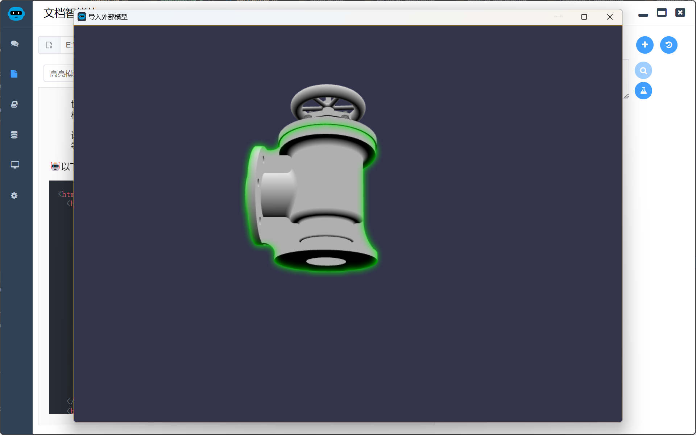
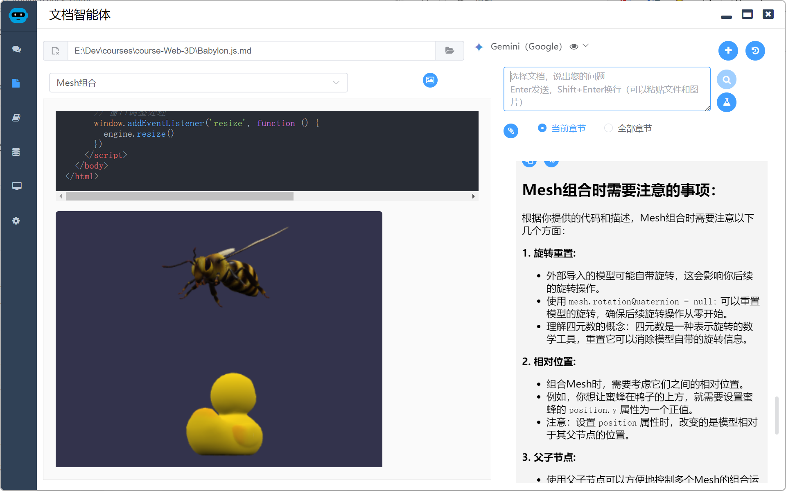
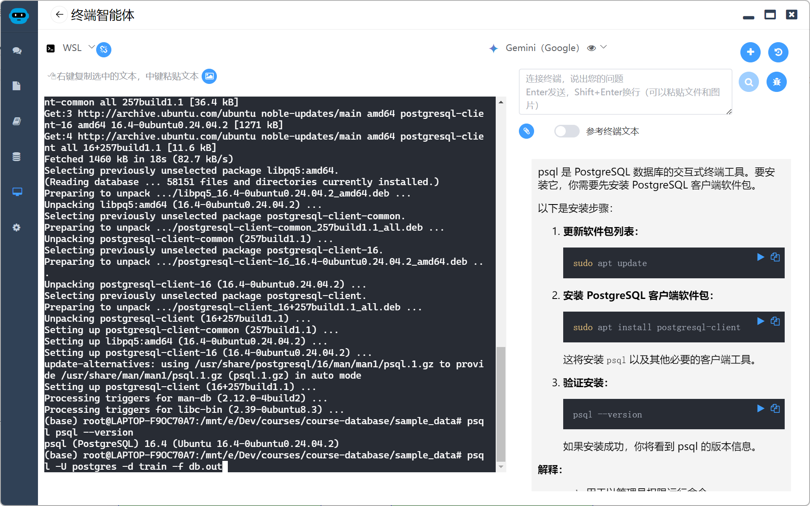
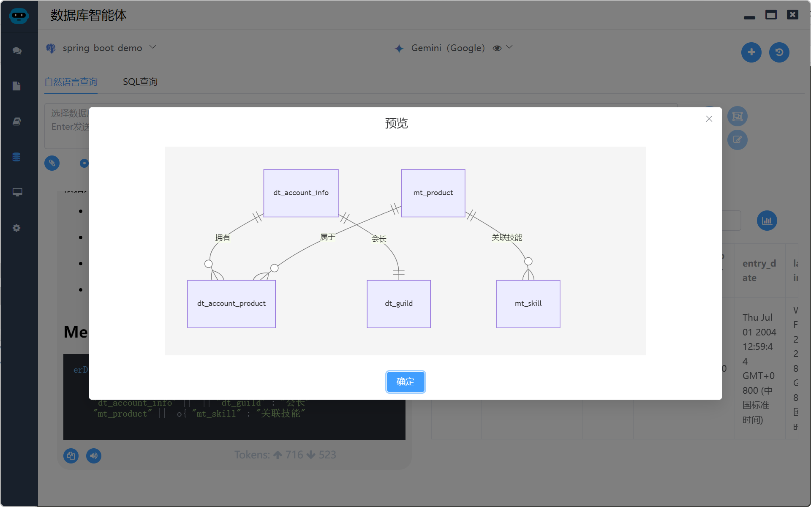
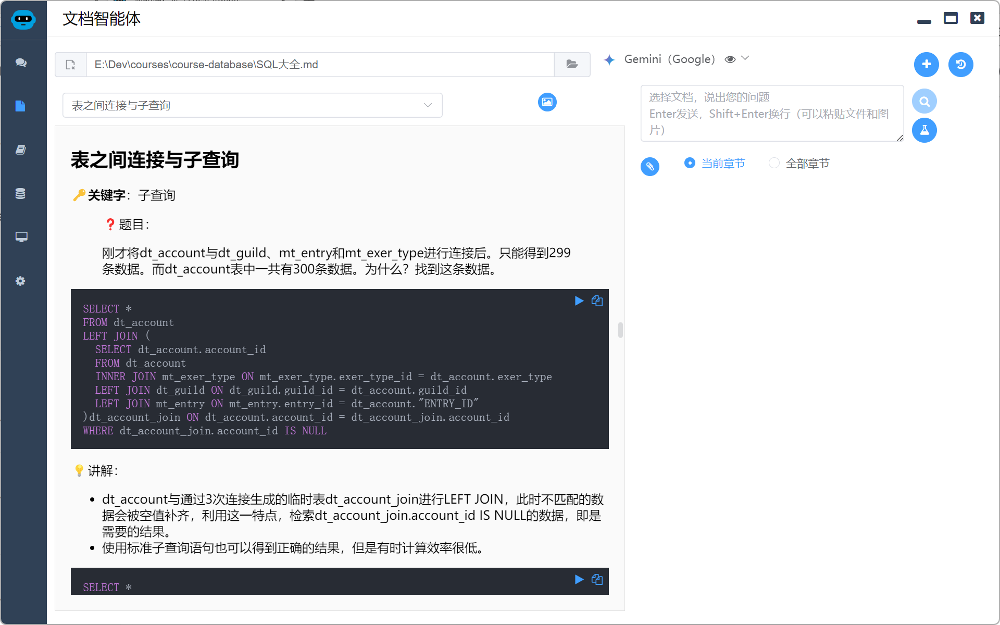

# Local Agents 课程库

Local Agents 是一套集成了多种AI功能的智能体集合，它通过AI辅助对话、文档解析、多媒体处理、知识库构建、数据库交互以及终端控制等核心功能，致力于为用户提供一个高效、便捷且成本效益高的AI辅助解决方案。

项目主页：https://agents.uue.cn

平常喜欢分享一些自己学到的知识，打算把这些课程放到这里，做成能和Local Agents各个智能体组合用的课程。

## 课程列表

### Python

* [Python数据分析](./Python/README.md) ：本课程共4个章节（已完结），讲解了使用Python数据分析，涵盖了NumPy、Pandas、Matplotlib、openpyxl、scikit-learn、PyTorch、LLM等常用技术和框架

### 全栈

*  [基于Node.js的全栈开发入门](./nodejs-fullstack/README.md) ：本课程共6个章节（已完结），讲解了如何使用Node.js进行全栈开发。

### AIGC

*  [AIGC实战](./AIGC/README.md) ：本课程现有6个章节（随着AIGC技术的发展不断更新），介绍各种AIGC技术的实战，理论实践相结合。

### 前端

#### Web 3D

* [Babylon.js](./Web-3D/Babylon.js.md)

### 数据库

* [SQL大全](./database/SQL大全.md)

### OOAD

*  [AI与软件设计](./OOAD/AI与软件设计.md)

## 课程体验

目前，课程库提供以下两门课程供大家体验：

* **Babylon.js** 
  - 深入浅出地讲解 Babylon.js 的使用方法，助你轻松构建 3D 应用程序。
  - 每章节均配备可在 Local Agents 文档智能体中运行的互动课件，边学边练，巩固知识。
  - [Babylon.js](./Web-3D/Babylon.js.md) 

* **SQL 大全**
  - 以一个小型项目为线索，采用一问一答的方式全面讲解 PostgreSQL 中各类 SQL 语句的编写技巧。
  - 每章节配备可在 Local Agents 终端和数据库智能体中运行的实战课件。
  - [SQL大全](./database/SQL大全.md) 

未来，我将持续更新课程库，涵盖更多实用技能和前沿技术，敬请期待！ 

## 课程展示

### Babylon.js 课程展示

### PostgreSQL 课程展示

在终端智能体的协助下安装PostgreSQL并导入数据

通过数据库智能体了解数据库结构

根据问题实践，找到答案

