# Babylon.js

## Babylon.js 的历史和特点

Babylon.js 是一个开源的 WebGL 游戏引擎，具有以下的历史和特点：

历史：

- Babylon.js 于2013年首次发布，由 David Catuhe 创建。
- 它最初是为了解决创建基于 Web 的游戏和交互式应用程序的需求而开发的。
- 自发布以来，Babylon.js 经过持续的发展和更新，成为一款功能强大且受欢迎的 WebGL 引擎。

特点：

1. 轻量级和快速：Babylon.js 的代码库相对较小，并且被优化以提供高性能的渲染。它使用了现代的 Web 技术和 GPU 加速，能够在现代浏览器上实现流畅的渲染效果。
2. 强大的渲染能力：Babylon.js 提供了丰富的渲染功能和效果，如阴影、反射、抗锯齿等。它支持 PBR（Physically Based Rendering）材质，使得渲染效果更加真实。
3. 物理引擎集成：Babylon.js 内置了强大的物理引擎，可以模拟物体的运动、重力、碰撞等物理行为。这使得开发者能够轻松创建具有真实物理效果的交互式场景。
4. 多平台支持：Babylon.js 可以在各种平台上运行，包括桌面浏览器、移动设备和 VR/AR 设备。它支持多种浏览器，并提供了相应的适配和兼容性。
5. 大型场景和复杂模型处理：Babylon.js 具有处理大型场景和复杂模型的能力。它支持场景分层和延迟渲染等技术，以提高性能并保持流畅的用户体验。
6. 社区和文档支持：Babylon.js 拥有活跃的社区，提供了广泛的文档、示例和教程。开发者可以从社区中获取帮助、分享经验和参与讨论。

总的来说，Babylon.js 是一个功能全面、易于学习和使用的 WebGL 引擎。它适用于创建游戏、可视化应用、AR/VR 体验等各种类型的交互式 Web 应用程序。

## Babylon官方工具简介

利用Babylon官方提供的几款工具，可以让我们用最少的代价完美复现出美术给过来的模型，整个复现过程不需要添加任何额外的兼容代码，真正做到美术和程序在画面表现上的统一。

### Sandbox（美术和程序都可以使用）

Sandbox用于预览模型，可以将3D模型直接拖到Sandbox中预览模型的效果，在程序不对模型属性做动态修改的情况下，在Sandbox中看到的效果就基本上是项目发布后的实际效果。

Sandbox支持gltf、glb、obj和babylon等格式的3D文件。

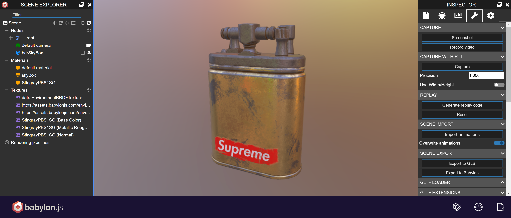

Sandbox地址：[https://sandbox.babylonjs.com](https://sandbox.babylonjs.com/)

点击Sandbox右下角的编辑按钮还可以以可视化的方式调整模型的部分属性，改变任何属性模型效果都会实时跟着变化，避免了程序“盲调”效果的时间风险，非常适合美术设计师和程序员在沟通项目效果时使用。

### Playground（主要供程序员使用）

Playground是制作或测试场景最快捷、最简单的地方，程序员可以在这里以代码方式做出一个场景，觉得满意后再将相关代码用到项目上。使用Playground可以在一个“干净”的环境中测试模型效果，同时也是学习和体验Babylon API 功能的极佳场所。而且也无需搭建和配置项目环境，打开即可直接使用Babylon的各种 API 了。

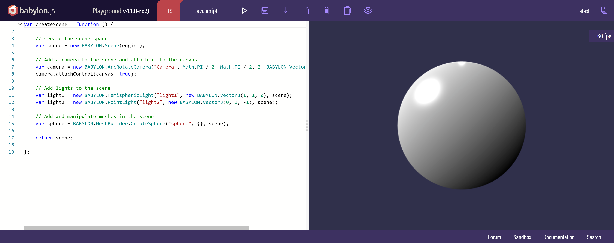

Playground地址：[https://www.babylonjs-playground.com](https://www.babylonjs-playground.com/)

在Playground中创建一个3D场景的写法是固定的，将想要测试的代码写到 createScene 包体中就行，代码片段还可以保存并分享给其他人查看和下载。

### Editor（主要供美术使用）

Editor是Babylon的模型编辑器，美术设计师可以将在别的 IDE（如 3DS Max、Maya、Sketchfab）中制作的3D模型导入Editor中继续编辑，当然也可以使用Editor从零开始制作模型。

Editor也是一个将别的模型文件转为.babylon模型文件的好工具，如果模型是由别的IDE所创作，并想将这些模型用到Babylon引擎中，强烈建议先将这些模型导入Editor，确认模型效果后再通过Editor导出模型文件给程序员使用，这样可以大大减少不同模型文件格式在Babylon引擎中的不兼容性。

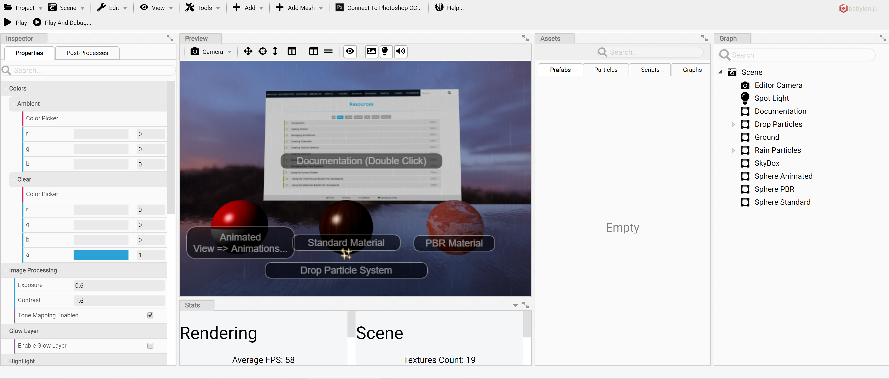

Editor 地址：http://editor.babylonjs.com/

### 主要类库

#### 核心库　　

* BabylonJS主程序脚本：https://cdn.babylonjs.com/babylon.js
* BabylonJS的未压缩版：https://cdn.babylonjs.com/babylon.max.js

#### 加载器

* 模型加载使用这个就可以满足大部分需求了：https://preview.babylonjs.com/loaders/babylonjs.loaders.min.
* 更多的模型加载器可以在这里寻找：https://github.com/BabylonJS/Babylon.js/tree/master/dist/loaders

### 其他工具类

Babylon.js 提供：Inspector、Materials、PostProcesses、GUI、Procedural Textures、Serializers 等类库，详见：https://doc.babylonjs.com/babylon101/how_to_get

## 安装和设置

### 下载和安装 Babylon.js

安装和设置 Babylon.js 可以按照以下步骤进行：

1. 下载 Babylon.js：你可以从 Babylon.js 的官方网站（https://www.babylonjs.com/）下载最新版本的 Babylon.js。下载完成后，你可以将 Babylon.js 的文件保存在你的项目目录中。

2. 创建项目文件夹：在你的项目目录中创建一个新的文件夹，用于存放你的项目文件。

3. 引入 Babylon.js：在你的 HTML 文件中，通过 `<script>` 标签引入 Babylon.js 的库文件。你可以在 `<head>` 标签中引入它，如下所示：

```html
<head>
  <script src="path/to/babylon.js"></script>
</head>
```

确保 `path/to/babylon.js` 是你实际保存 Babylon.js 文件的路径。

4. 创建画布：在你的 HTML 文件中，创建一个 `<canvas>` 元素，用于渲染 Babylon.js 的场景。给该元素一个唯一的 ID，以便后续在 JavaScript 代码中引用它。例如：

```html
<body>
  <canvas id="renderCanvas"></canvas>
</body>
```

5. 编写 JavaScript 代码：创建一个新的 JavaScript 文件，用于编写 Babylon.js 的逻辑代码。在该文件中，你可以通过获取 `<canvas>` 元素的 ID，创建渲染引擎和场景对象等。例如：

```javascript
// 获取 canvas 元素
var canvas = document.getElementById("renderCanvas");

// 创建渲染引擎
var engine = new BABYLON.Engine(canvas, true);

// 创建场景
var scene = new BABYLON.Scene(engine);

// 添加相机、光源和其他对象到场景中
// ...

// 渲染场景
engine.runRenderLoop(function() {
  scene.render();
});

// 处理窗口大小变化事件
window.addEventListener("resize", function() {
  engine.resize();
});
```

根据你的需求，你可以在 JavaScript 代码中添加相机、光源、模型、材质等其他对象，并实现交互、动画等功能。

6. 运行项目：在浏览器中打开你的 HTML 文件，你应该能够看到 Babylon.js 渲染的画面了。

以上是一个简单的 Babylon.js 安装和设置的步骤。你可以根据实际需求和项目要求，进一步配置和扩展你的 Babylon.js 应用程序。

> 以下案例均基于Babylon.js V6

[Babylon.js Sandbox - View glTF, glb, obj and babylon files (babylonjs.com)](https://sandbox.babylonjs.com/)

### 设置项目环境和开发工具

在设置 Babylon.js 项目环境和选择开发工具时，你可以考虑以下步骤和工具：

1. 选择开发工具：在 Babylon.js 的开发过程中，你可以选择使用各种开发工具来提高效率和开发体验。以下是一些常用的开发工具：

   - 代码编辑器：例如 Visual Studio Code、Sublime Text、Atom 等，它们提供了语法高亮、代码自动完成和调试功能等，使得编写代码更加便捷。

   - 浏览器开发工具：现代浏览器都提供了强大的开发者工具，如 Chrome 的开发者工具、Firefox 的开发者工具等，它们可以帮助你调试代码、监视性能和分析渲染。

   - 版本控制工具：使用版本控制工具如 Git，可以帮助你更好地管理代码和团队协作。


2. 设置项目结构：在你的项目中，你可以根据需求设置合理的项目结构，将 Babylon.js 相关的文件和资源组织起来。例如，你可以将 Babylon.js 的库文件、模型文件、纹理文件等放在相应的文件夹中，以方便管理和维护。

3. 使用模块化开发：考虑使用模块化开发的方式，将 Babylon.js 的逻辑代码分成多个模块，以提高代码的可维护性和复用性。你可以使用模块化开发工具如 Webpack、Parcel 等，来打包和管理你的 Babylon.js 代码。

4. 引入其他库或框架：在 Babylon.js 项目中，你可能需要引入其他库或框架来辅助开发。例如，你可以使用 jQuery、React、Vue.js 等来处理用户交互，或者使用其他数学库、物理引擎等来扩展 Babylon.js 的功能。

5. 了解官方文档和示例：Babylon.js 官方网站提供了丰富的文档、教程和示例，你可以参考它们来学习和了解 Babylon.js 的各种特性和用法。官方文档中还包含了一些示例代码，可以帮助你快速入门和理解 Babylon.js 的基本概念。

通过选择合适的开发工具、设置良好的项目结构和充分利用官方资源，你可以更高效地进行 Babylon.js 开发，并且有助于组织和管理你的代码。

### 配套工具

Babylon.js 提供了一些配套工具，以帮助开发者更好地使用和扩展 Babylon.js：

1. Babylon.js Playground：这是一个在线的代码编辑和运行环境，可以让你在浏览器中快速尝试和测试 Babylon.js 的功能和特性。你可以在 Playground 中编写和调试代码，并立即看到结果。Playground 还提供了许多示例和模板，帮助你学习和理解不同的 Babylon.js 功能。
2. Babylon.js Inspector：这是一个浏览器插件，可以方便地调试和分析 Babylon.js 场景和对象。它提供了一个可视化的界面，可以查看和修改场景中的对象属性、材质、光源、动画等。Inspector 还支持性能分析和渲染统计，帮助你优化和调试 Babylon.js 应用程序。
3. Babylon.js Exporters：Babylon.js 提供了多种导出工具和插件，用于将场景和模型从其他建模软件（如 Blender、3ds Max、Maya 等）导出为 Babylon.js 可以直接使用的格式。这些导出工具可以帮助你将外部资源集成到 Babylon.js 项目中，节省开发时间。
4. Babylon.js Editor：这是一个可视化的编辑器，可以帮助你创建和编辑 Babylon.js 场景。它提供了可视化的界面和工具，可以方便地添加和管理场景中的对象、光源、材质等。Editor 还支持物理引擎、动画编辑和预览等功能，简化了场景搭建和编辑的过程。
5. Babylon.js Extensions：Babylon.js 社区提供了许多扩展库和工具，用于增强和扩展 Babylon.js 的功能。这些扩展包括特效库、物理引擎、工具库等，可以帮助你实现更复杂和丰富的场景效果。

以上是一些 Babylon.js 的配套工具和资源，它们可以提供更多的功能和便利性，帮助你更高效地开发和调试 Babylon.js 应用程序。你可以根据需要选择使用这些工具，并在开发过程中充分利用它们。

## 创建场景和对象

使用Babylon.js创建场景和对象一般通过以下步骤完成

- 引入babylon.js
- 创建一个基本的渲染环境和画布
- 创建相机、光源和场景
- 添加和管理三维对象

🤖查看具体实例：

```html
<!DOCTYPE html>
<html lang="en">
  <head>
    <meta charset="UTF-8" />
    <meta http-equiv="X-UA-Compatible" content="IE=edge" />
    <meta name="viewport" content="width=device-width, initial-scale=1.0" />
    <title>创建基础的模型</title>
    <style>
      * {
        padding: 0;
        margin: 0;
        width: 100%;
        height: 100%;
        overflow: hidden;
      }

      #idcanvas {
        width: 100%;
        height: 100%;
        /* 禁用元素上的所有手势 */
        touch-action: none;
      }
    </style>
  </head>

  <body>
    <script src="https://cdn.babylonjs.com/babylon.js"></script>
    <canvas id="idcanvas"></canvas>
  </body>
  <script>
    // 1-获取canvas 的dom对象
    var canvas = document.querySelector('#idcanvas')
    // 2-实例化3d引擎
    var engine = new BABYLON.Engine(canvas, true)
    // 3-创建场景并返回场景对象
    var createScene = function () {
      // 3-1 创建场景对象---(把实例化3d引擎放入里边)
      var scene = new BABYLON.Scene(engine)
      // 3-2 创建相机(FreeCamera)，并把相机位置设置到(x:0,y:5,z:-10)  new BABYLON.Vector3(x, y, z)的对象来表示模型网格的位置、旋转以及缩放
      var camera = new BABYLON.FreeCamera('camera1', new BABYLON.Vector3(0, 5, -10), scene)
      // 3-3 :将相机朝向设置到原点
      camera.setTarget(BABYLON.Vector3.Zero())
      // 3-4:相机事件绑定到canvas对象上面
      camera.attachControl(canvas, true)
      // 3-5 ：创建灯光，灯光为止设置到 0 1 0
      var light = new BABYLON.HemisphericLight('light', new BABYLON.Vector3(0, 1, 0), scene)
      //  灯光调暗一点  0-1范围之间
      light.intensity = 0.7
      // 3-6 绘制一个球，支持六个配置项 名称, 分割段数, 直径, 放置的场景, updatable,sideOrientation
      var sphere = new BABYLON.Mesh.CreateSphere('sphere1', 16, 2, scene)
      //  调高一点
      sphere.position.y = 2
      // 3-7 创建一个自定义的地面
      var myGround = BABYLON.MeshBuilder.CreateGround('myGround', { width: 6, height: 4, subdivisions: 4 }, scene)
      // 3-8 返回场景
      return scene
    }
    // 4- 获取到创建的场景
    var scene = createScene()
    // 4-1 循环渲染，性能最大每秒60帧
    engine.runRenderLoop(function () {
      scene.render()
    })
    // 5- 浏览器大小变动时,触发引擎的重载状态
    window.addEventListener('resize', function () {
      engine.resize()
    })
  </script>
</html>
```

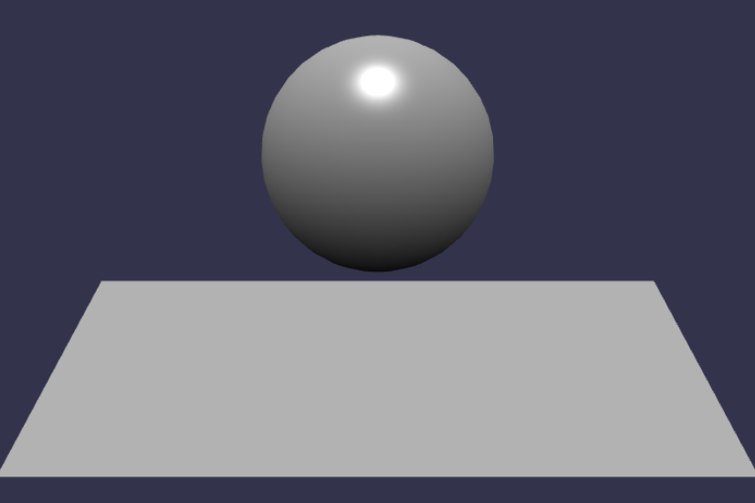

## 纹理和材质

在 Babylon.js 中，纹理和材质是实现逼真渲染的关键组成部分。纹理是一种图像或图案，可以应用到模型的表面上，而材质则定义了表面的外观和如何与光交互。

在3D模型中，`position`、`normal`和`uv`是常用的属性，用于定义模型的位置、法线和纹理坐标。

* `position`：表示模型的顶点位置。每个顶点都有一个三维坐标（x、y、z），用于确定模型的形状和位置。
* `normal`：表示模型的法线向量。法线是垂直于模型表面的向量，用于计算光照和阴影效果。每个顶点都有一个法线向量（nx、ny、nz），用于确定模型表面的朝向。
* `uv`：表示模型的纹理坐标。纹理坐标定义了在纹理图像上的位置，用于将纹理映射到模型表面。每个顶点都有一个纹理坐标（u、v），用于确定纹理的采样位置。

### 加载和应用纹理

要加载和应用纹理，可以遵循以下步骤：

1. 创建纹理对象：使用 `BABYLON.Texture` 构造函数创建一个纹理对象，指定纹理图像的路径或数据。例如：

```javascript
var texture = new BABYLON.Texture("path/to/texture.jpg", scene);
```

2. 创建材质对象：使用 `BABYLON.StandardMaterial` 或其他材质类的构造函数创建一个材质对象。例如：

```javascript
var material = new BABYLON.StandardMaterial("material", scene);
```

3. 将纹理应用到材质：将纹理对象赋值给材质的相应属性。例如，使用 `diffuseTexture` 属性将纹理应用到材质的漫反射贴图上：

```javascript
var material = new BABYLON.StandardMaterial("material", scene);
```

4. 将材质应用到模型：将材质对象赋值给模型的 `material` 属性，以将材质应用到模型的表面上。例如，将材质应用到一个球体模型：

```javascript
var sphere = BABYLON.MeshBuilder.CreateSphere("sphere", { diameter: 2 }, scene);
sphere.material = material;
```

### 自定义材质和着色器

Babylon.js 允许你自定义材质和使用自定义的着色器。你可以使用 `BABYLON.ShaderMaterial` 类创建自定义材质，并使用 GLSL 或 HLSL 着色器语言编写自定义着色器。

下面是一个简单的例子，展示如何创建一个自定义的材质，并使用自定义的顶点和片段着色器：

```javascript
var customMaterial = new BABYLON.ShaderMaterial("customMaterial", scene, {
  vertex: "custom",
  fragment: "custom",
}, {
  attributes: ["position", "normal", "uv"],
  uniforms: ["worldViewProjection", "time"],
});

customMaterial.setFloat("time", 0);

// 设置自定义的顶点和片段着色器代码
customMaterial.VertexShader = `
  precision highp float;
  attribute vec3 position;
  attribute vec3 normal;
  attribute vec2 uv;
  uniform mat4 worldViewProjection;
  varying vec2 vUV;
  void main(void) {
    gl_Position = worldViewProjection * vec4(position, 1.0);
    vUV = uv;
  }
`;

customMaterial.FragmentShader = `
  precision highp float;
  varying vec2 vUV;
  uniform float time;
  void main(void) {
    vec2 uv = vUV;
    // 自定义着色器逻辑...
    gl_FragColor = vec4(uv.x, uv.y, sin(time), 1.0);
  }
`;

// 将自定义材质应用到模型
var box = BABYLON.MeshBuilder.CreateBox("box", { size: 2 }, scene);
box.material = customMaterial;
```

在这个例子中，我们使用 `BABYLON.ShaderMaterial` 构造函数创建一个自定义的材质对象。我们指定了自定义的顶点和片段着色器代码，并将其设置为材质的属性。着色器代码可以使用 GLSL 或 HLSL 语言编写，你可以在顶点着色器中处理顶点位置和法线等信息，在片段着色器中处理光照、纹理等效果。

将自定义材质应用到物体：将自定义材质对象赋值给物体的 `material` 属性，就像内置材质一样。

### 使用材质属性和贴图

材质属性和贴图可以用于控制物体的外观和行为。以下是一些常用的材质属性和贴图的示例：

- `diffuseTexture`：漫反射纹理，用于控制物体的基本颜色。
- `opacityTexture`：透明度纹理，用于控制物体的透明度。
- `normalTexture`：法线贴图，用于模拟物体表面的凹凸效果。
- `specularTexture`：高光

### 举例

#### 材质举例

在刚才的基础实例中，我们追加如下代码

```javascript
// 在步骤3-6创建球体后，创建并设置材质
var material = new BABYLON.StandardMaterial("material", scene);
material.diffuseColor = new BABYLON.Color3(1, 0, 0); // 设置漫反射颜色为红色
sphere.material = material; // 应用材质到球上
```


#### 贴图举例

在刚才的基础实例中，我们追加如下代码给球体加上大理石效果的贴图


```javascript
var texture = new BABYLON.Texture("./marble.jpg", scene);
var material = new BABYLON.StandardMaterial("material", scene);
material.diffuseTexture = texture;
sphere.material = material; // 应用材质到球上
```

> 注意文件和图片最好是同域web路径访问，否则会blocked by CORS policy

🤖来看看例子的完整代码：

```html
<!DOCTYPE html>
<html lang="en">
  <head>
    <meta charset="UTF-8" />
    <meta http-equiv="X-UA-Compatible" content="IE=edge" />
    <meta name="viewport" content="width=device-width, initial-scale=1.0" />
    <title>创建基础的模型</title>
    <style>
      * {
        padding: 0;
        margin: 0;
        width: 100%;
        height: 100%;
        overflow: hidden;
      }

      #idcanvas {
        width: 100%;
        height: 100%;
        /* 禁用元素上的所有手势 */
        touch-action: none;
      }
    </style>
  </head>

  <body>
    <script src="https://cdn.babylonjs.com/babylon.js"></script>
    <canvas id="idcanvas"></canvas>
  </body>
  <script>
    // 1-获取canvas 的dom对象
    var canvas = document.querySelector('#idcanvas')
    // 2-实例化3d引擎
    var engine = new BABYLON.Engine(canvas, true)
    // 3-创建场景并返回场景对象
    var createScene = function () {
      // 3-1 创建场景对象---(把实例化3d引擎放入里边)
      var scene = new BABYLON.Scene(engine)
      // 3-2 创建相机(FreeCamera)，并把相机位置设置到(x:0,y:5,z:-10)  new BABYLON.Vector3(x, y, z)的对象来表示模型网格的位置、旋转以及缩放
      var camera = new BABYLON.FreeCamera('camera1', new BABYLON.Vector3(0, 5, -10), scene)
      // 3-3 :将相机朝向设置到原点
      camera.setTarget(BABYLON.Vector3.Zero())
      // 3-4:相机事件绑定到canvas对象上面
      camera.attachControl(canvas, true)
      // 3-5 ：创建灯光，灯光为止设置到 0 1 0
      var light = new BABYLON.HemisphericLight('light', new BABYLON.Vector3(0, 1, 0), scene)
      //  灯光调暗一点  0-1范围之间
      light.intensity = 0.7
      // 3-6 绘制一个球，支持六个配置项 名称, 分割段数, 直径, 放置的场景, updatable,sideOrientation
      var sphere = new BABYLON.Mesh.CreateSphere('sphere1', 16, 2, scene)
      //  调高一点
      sphere.position.y = 2
      var texture = new BABYLON.Texture("https://agents.uue.cn/courses/Web-3D/assets/marble.jpg", scene);
      var material = new BABYLON.StandardMaterial("material", scene);
      material.diffuseTexture = texture;
      sphere.material = material; // 应用材质到球上
      // 3-7 创建一个自定义的地面
      var myGround = BABYLON.MeshBuilder.CreateGround('myGround', { width: 6, height: 4, subdivisions: 4 }, scene)
      // 3-8 返回场景
      return scene
    }
    // 4- 获取到创建的场景
    var scene = createScene()
    // 4-1 循环渲染，性能最大每秒60帧
    engine.runRenderLoop(function () {
      scene.render()
    })
    // 5- 浏览器大小变动时,触发引擎的重载状态
    window.addEventListener('resize', function () {
      engine.resize()
    })
  </script>
</html>
```

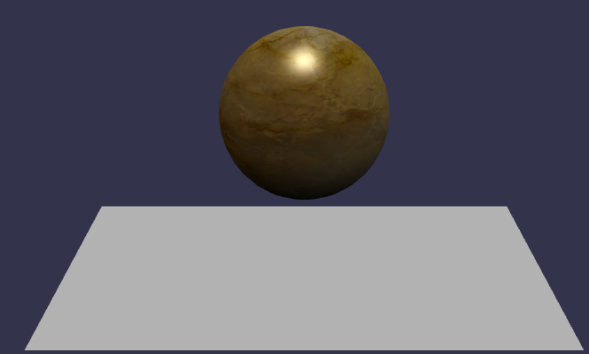

## 动画和交互

在 Babylon.js 中，你可以通过创建和管理动画来使你的场景更加生动和互动。你还可以处理用户输入和交互，以实现基本的相机和对象控制。

### 创建和管理动画

要创建动画，你需要使用 `BABYLON.Animation` 类。可以指定要动画化的属性和目标值，并设置动画的持续时间、循环次数和缓动函数等。

以下是创建和管理动画的基本步骤：

1. 创建动画对象：使用 `BABYLON.Animation` 构造函数创建动画对象。例如：

```javascript
var animation = new BABYLON.Animation(
  "animationName",
  property,
  frameRate,
  dataType,
  loopMode
);
```

这里的 `property` 是要动画化的属性，如位置、旋转等。`frameRate` 是动画帧率，`dataType` 是属性的数据类型，`loopMode` 是动画循环模式。

2. 定义动画帧：使用 `animation.setKeys()` 方法定义动画的关键帧。每个关键帧包含时间和对应的属性值。例如：

```javascript
animation.setKeys([
  { frame: 0, value: initialValue },
  { frame: 100, value: targetValue }
]);
```

这里的 `frame` 是关键帧的时间，`value` 是对应的属性值。

3. 将动画应用到目标对象：使用 `targetObject.animations.push()` 方法将动画对象添加到目标对象的动画数组中。例如：

```javascript
targetObject.animations.push(animation);
```

4. 播放动画：使用场景的 `beginAnimation()` 方法播放动画。例如：

```javascript
scene.beginAnimation(targetObject, startFrame, endFrame, loop, speed);
```

这里的 `targetObject` 是目标对象，`startFrame` 和 `endFrame` 是动画的起始和结束帧，`loop` 是动画是否循环，`speed` 是动画播放速度。

我们把刚才的代码稍作修改，制作一个大理石球体围绕Y轴360度转动的例子

```javascript
// 创建动画
var animation = new BABYLON.Animation(
  "rotationAnimation",
  "rotation.y",
  30,
  BABYLON.Animation.ANIMATIONTYPE_FLOAT,
  BABYLON.Animation.ANIMATIONLOOPMODE_CYCLE
);

// 定义动画帧
var keys = [];
keys.push({ frame: 0, value: 0 });
keys.push({ frame: 100, value: 2 * Math.PI });
animation.setKeys(keys);

// 将动画应用到球体
sphere.animations.push(animation);
scene.beginAnimation(sphere, 0, 100, true);
```

🤖来看看例子的完整代码

```html
<!DOCTYPE html>
<html lang="en">
  <head>
    <meta charset="UTF-8" />
    <meta http-equiv="X-UA-Compatible" content="IE=edge" />
    <meta name="viewport" content="width=device-width, initial-scale=1.0" />
    <title>创建基础的模型</title>
    <style>
      * {
        padding: 0;
        margin: 0;
        width: 100%;
        height: 100%;
        overflow: hidden;
      }

      #idcanvas {
        width: 100%;
        height: 100%;
        /* 禁用元素上的所有手势 */
        touch-action: none;
      }
    </style>
  </head>

  <body>
    <script src="https://cdn.babylonjs.com/babylon.js"></script>
    <canvas id="idcanvas"></canvas>
  </body>
  <script>
    // 1-获取canvas 的dom对象
    var canvas = document.querySelector('#idcanvas')
    // 2-实例化3d引擎
    var engine = new BABYLON.Engine(canvas, true)
    // 3-创建场景并返回场景对象
    var createScene = function () {
      // 3-1 创建场景对象---(把实例化3d引擎放入里边)
      var scene = new BABYLON.Scene(engine)
      // 3-2 创建相机(FreeCamera)，并把相机位置设置到(x:0,y:5,z:-10)  new BABYLON.Vector3(x, y, z)的对象来表示模型网格的位置、旋转以及缩放
      var camera = new BABYLON.FreeCamera('camera1', new BABYLON.Vector3(0, 5, -10), scene)
      // 3-3 :将相机朝向设置到原点
      camera.setTarget(BABYLON.Vector3.Zero())
      // 3-4:相机事件绑定到canvas对象上面
      camera.attachControl(canvas, true)
      // 3-5 ：创建灯光，灯光为止设置到 0 1 0
      var light = new BABYLON.HemisphericLight('light', new BABYLON.Vector3(0, 1, 0), scene)
      //  灯光调暗一点  0-1范围之间
      light.intensity = 0.7
      // 3-6 绘制一个球，支持六个配置项 名称, 分割段数, 直径, 放置的场景, updatable,sideOrientation
      var sphere = new BABYLON.Mesh.CreateSphere('sphere1', 16, 2, scene)
      //  调高一点
      sphere.position.y = 2
      var texture = new BABYLON.Texture('https://agents.uue.cn/courses/Web-3D/assets/marble.jpg', scene)
      var material = new BABYLON.StandardMaterial('material', scene)
      material.diffuseTexture = texture
      sphere.material = material // 应用材质到球上
      // 创建动画
      var animation = new BABYLON.Animation(
        'rotationAnimation',
        'rotation.y',
        30,
        BABYLON.Animation.ANIMATIONTYPE_FLOAT,
        BABYLON.Animation.ANIMATIONLOOPMODE_CYCLE
      )

      // 定义动画帧
      var keys = []
      keys.push({ frame: 0, value: 0 })
      keys.push({ frame: 100, value: 2 * Math.PI })
      animation.setKeys(keys)

      // 将动画应用到球体
      sphere.animations.push(animation)
      scene.beginAnimation(sphere, 0, 100, true)
      // 3-7 创建一个自定义的地面
      var myGround = BABYLON.MeshBuilder.CreateGround('myGround', { width: 6, height: 4, subdivisions: 4 }, scene)
      // 3-8 返回场景
      return scene
    }
    // 4- 获取到创建的场景
    var scene = createScene()
    // 4-1 循环渲染，性能最大每秒60帧
    engine.runRenderLoop(function () {
      scene.render()
    })
    // 5- 浏览器大小变动时,触发引擎的重载状态
    window.addEventListener('resize', function () {
      engine.resize()
    })
  </script>
</html>
```

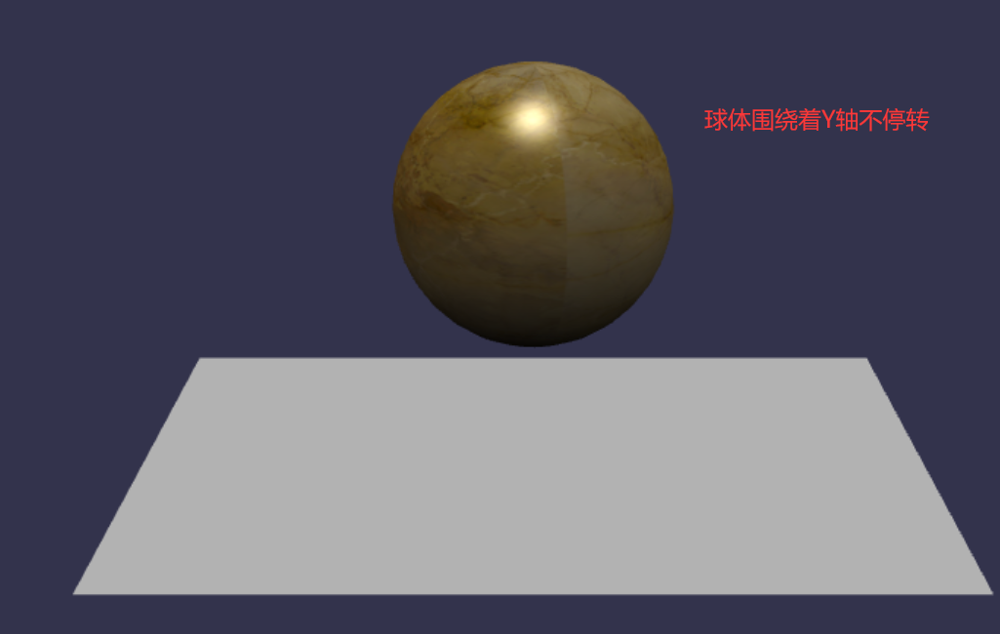

### 处理用户输入和交互

在 Babylon.js 中，你可以通过监听用户的输入事件来处理交互。以下是一些常见的用户输入事件：

- `pointerdown`：当用户点击鼠标按钮或触摸屏幕时触发。
- `pointerup`：当用户释放鼠标按钮或停止触摸屏幕时触发。
- `pointermove`：当用户移动鼠标或触摸屏幕时触发。

可以使用 `scene.onPointerDown`、`scene.onPointerUp` 和 `scene.onPointerMove` 方法来监听这些事件。例如：

```javascript
scene.onPointerDown = function (evt) {
  // 处理鼠标按下或触摸屏幕事件
};

scene.onPointerUp = function (evt) {
  // 处理鼠标释放或停止触摸屏幕事件
};

scene.onPointerMove = function (evt) {
  // 处理鼠标移动或触摸屏幕移动事件
};
```

在事件处理程序中，你可以根据事件的信息来执行相应的操作，如移动相机、选择物体等。

### 实现基本的相机和对象控制

在 Babylon.js 中，你可以通过控制相机和对象的属性来实现基本的相机和对象控制。下面是一些常用的控制方法：

#### 移动相机

可以使用相机的 `position` 属性来移动相机的位置。例如，要将相机向前移动，可以使用 `camera.position.z += 1;`。这将使相机沿着其朝向的正方向移动一个单位。

#### 旋转相机

可以使用相机的 `rotation` 属性来旋转相机的方向。例如，要使相机绕 Y 轴逆时针旋转，可以使用 `camera.rotation.y += Math.PI / 180;`。这将使相机朝向逆时针方向旋转一个度数单位。

#### 控制对象

可以使用对象的位置、旋转和缩放属性来控制对象的变换。例如，要使对象沿 X 轴移动，可以使用 `object.position.x += 1;`。要使对象绕 Y 轴旋转，可以使用 `object.rotation.y += Math.PI / 180;`。要使对象缩放，可以使用 `object.scaling.x *= 2;`。

#### 处理用户输入

通过结合相机和对象的控制以及用户输入的处理，你可以实现各种交互效果，如相机漫游、对象拖拽等。

请注意，以上只是一些基本的示例代码，实际使用中可能需要根据具体需求进行适当的修改和扩展。

#### 对象拖拽举例

要实现对象拖拽的效果，你可以使用 Babylon.js 提供的输入事件来监听鼠标或触摸屏幕的操作，并根据鼠标或触摸位置的变化来更新对象的位置。以下是一个简单的示例代码，演示如何实现对象的拖拽效果：

```javascript
// 创建场景和相机
var canvas = document.getElementById('idcanvas')
var engine = new BABYLON.Engine(canvas, true)
var scene = new BABYLON.Scene(engine)
var camera = new BABYLON.FreeCamera('camera', new BABYLON.Vector3(0, 0, -10), scene)
camera.setTarget(BABYLON.Vector3.Zero())
// 创建灯光
var light = new BABYLON.HemisphericLight('light', new BABYLON.Vector3(0, 1, 0), scene)
light.intensity = 0.7
// 创建球体
var sphere = new BABYLON.Mesh.CreateSphere('sphere1', 16, 2, scene)
var texture = new BABYLON.Texture('./marble.jpg', scene)
var material = new BABYLON.StandardMaterial('material', scene)
material.diffuseTexture = texture
sphere.material = material // 应用材质到球上

// 监听鼠标或触摸屏幕的操作
var isDragging = false
var startPoint = { x: 0, y: 0 }

scene.onPointerDown = function (evt) {
  isDragging = true
  startPoint.x = evt.clientX || evt.x
  startPoint.y = evt.clientY || evt.y
}

scene.onPointerUp = function (evt) {
  isDragging = false
}

scene.onPointerMove = function (evt) {
  if (isDragging) {
    var currentPoint = { x: evt.clientX || evt.x, y: evt.clientY || evt.y }
    var deltaX = currentPoint.x - startPoint.x
    var deltaY = currentPoint.y - startPoint.y

    // 更新盒子的位置
    sphere.position.x += deltaX / 100
    sphere.position.y -= deltaY / 100

    startPoint = currentPoint
  }
}

// 渲染场景
engine.runRenderLoop(function () {
  scene.render()
})

// 处理窗口大小变化
window.addEventListener('resize', function () {
  engine.resize()
})
```

在上述代码中，我们创建了一个球体，并监听鼠标或触摸屏幕的操作。当鼠标按下或触摸屏幕时，我们记录下起始点的位置，并将 `isDragging` 标志设置为 `true`。当鼠标移动或触摸点移动时，我们计算出当前点与起始点的差值，并将球体的位置更新为当前位置与差值的比例。最后，当鼠标释放或停止触摸屏幕时，

#### 鼠标悬停高亮

下面是一个使用 Babylon.js 的例子，当鼠标悬停在物体上时，物体会高亮显示：

```javascript
// 获取画布元素
const canvas = document.getElementById('renderCanvas');

// 创建场景
const createScene = () => {
  const scene = new BABYLON.Scene(engine);

  // 创建相机
  const camera = new BABYLON.ArcRotateCamera('camera', 0, 0, 10, BABYLON.Vector3.Zero(), scene);
  camera.setPosition(new BABYLON.Vector3(0, 0, -10));
  camera.attachControl(canvas, true);

  // 创建灯光
  const light = new BABYLON.HemisphericLight('light', new BABYLON.Vector3(0, 1, 0), scene);

  // 创建物体
  const box = BABYLON.MeshBuilder.CreateBox('box', { size: 2 }, scene);

  // 创建高亮效果
  const highlight = new BABYLON.HighlightLayer('highlight', scene);

  // 鼠标移入事件
  box.actionManager = new BABYLON.ActionManager(scene);
  box.actionManager.registerAction(new BABYLON.ExecuteCodeAction(
    BABYLON.ActionManager.OnPointerOverTrigger,
    () => {
      highlight.addMesh(box, BABYLON.Color3.Green());
    }
  ));

  // 鼠标移出事件
  box.actionManager.registerAction(new BABYLON.ExecuteCodeAction(
    BABYLON.ActionManager.OnPointerOutTrigger,
    () => {
      highlight.removeMesh(box);
    }
  ));

  return scene;
};

// 创建引擎
const engine = new BABYLON.Engine(canvas, true);

// 创建场景
const scene = createScene();

// 渲染场景
engine.runRenderLoop(() => {
  scene.render();
});

// 调整画布大小
window.addEventListener('resize', () => {
  engine.resize();
});
```

在这个例子中，我们创建了一个场景，并在场景中加入了一个立方体物体。当鼠标悬停在立方体上时，我们使用 `HighlightLayer` 创建了一个高亮效果，并将高亮效果应用到立方体上。当鼠标离开立方体时，我们移除了高亮效果。

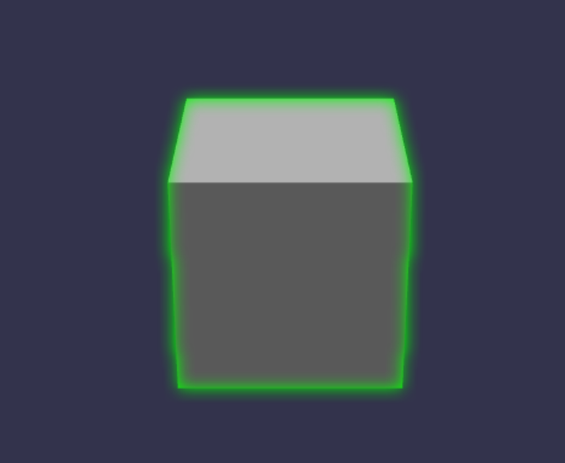


#### 高亮聚焦

这个例子创建了一个场景，其中一个球体放置在一个圆柱体上方。Babylon.js 负责渲染场景，使用高亮层来突出显示球体，并将相机聚焦在球体上。

🤖来看看例子的完整代码：

```html
<!DOCTYPE html>
<html>
<head>
    <title>Babylon.js Example</title>
    <style>
        body { margin: 0; }
        canvas { width: 100%; height: 100%; }
    </style>
</head>
<body>
    <script src="https://cdn.babylonjs.com/babylon.js"></script>
    <canvas id="renderCanvas"></canvas>
    <button id="highlightButton">Highlight Sphere and Focus</button>
    <script>
        document.addEventListener("DOMContentLoaded", function () {
            // 创建引擎
            var canvas = document.getElementById("renderCanvas");
            var engine = new BABYLON.Engine(canvas, true);

            // 创建场景
            var scene = new BABYLON.Scene(engine);

            // 创建相机
            var camera = new BABYLON.ArcRotateCamera("Camera", Math.PI / 2, Math.PI / 4, 4, BABYLON.Vector3.Zero(), scene);
            camera.attachControl(canvas, true);

            // 创建光源
            var light = new BABYLON.HemisphericLight("light", new BABYLON.Vector3(0, 1, 0), scene);

            // 创建球体
            var sphere = BABYLON.MeshBuilder.CreateSphere("sphere", { diameter: 1 }, scene);
            sphere.position.y = 1;

            // 创建圆柱体
            var cylinder = BABYLON.MeshBuilder.CreateCylinder("cylinder", { height: 1, diameter: 1 }, scene);
            cylinder.position.y = 0.5;

            // 创建高亮效果
            var highlightLayer = new BABYLON.HighlightLayer("highlightLayer", scene);

            // 点击按钮时高亮球体并聚焦
            var highlightButton = document.getElementById("highlightButton");
            highlightButton.addEventListener("click", function () {
                highlightLayer.addMesh(sphere, BABYLON.Color3.Yellow());

                var targetPosition = sphere.position.clone();
                var targetRadius = 2;
                var animationDuration = 2000; // 2秒

                var animation = new BABYLON.Animation("cameraAnimation", "radius", 60, BABYLON.Animation.ANIMATIONTYPE_FLOAT, BABYLON.Animation.ANIMATIONLOOPMODE_CONSTANT);
                var keys = [
                    { frame: 0, value: camera.radius },
                    { frame: 60, value: targetRadius }
                ];
                animation.setKeys(keys);

                var startTime = performance.now();
                scene.registerBeforeRender(function () {
                    var currentTime = performance.now();
                    var deltaTime = currentTime - startTime;
                    var normalizedTime = Math.min(deltaTime / animationDuration, 1);

                    var currentValue = animation.getKeys()[0].value;
                    var targetValue = animation.getKeys()[1].value;
                    var newValue = BABYLON.Scalar.Lerp(currentValue, targetValue, normalizedTime);
                    camera.radius = newValue;

                    if (normalizedTime === 1) {
                        scene.unregisterBeforeRender(arguments.callee);
                    }
                });

                // 开始动画
                scene.beginAnimation(camera, 0, 60, false);
            });

            // 渲染循环
            engine.runRenderLoop(function () {
                scene.render();
            });

            // 窗口大小改变时调整引擎的大小
            window.addEventListener("resize", function () {
                engine.resize();
            });
        });
    </script>
</body>
</html>
```

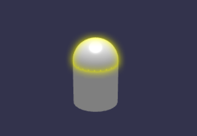

#### 高亮聚焦并显示标签

要将显示标签的div移动到高亮的Mesh旁边，需要将Mesh的世界坐标转换为屏幕坐标。Babylon.js提供了一种将3D世界坐标转换为2D屏幕坐标的方法。

* 使用了`BABYLON.Vector3.Project`方法将Mesh的世界坐标转换为屏幕坐标。

* 使用了`engine.getRenderWidth()`和`engine.getRenderHeight()`来获取渲染画布的宽度和高度，并将其传递给`BABYLON.Vector3.Project`方法。

🤖来看看例子的完整代码：

```html
<!DOCTYPE html>
<html>
<head>
    <title>Babylon.js Example</title>
    <meta charset="UTF-8">
    <style>
        body { margin: 0; }
        canvas { width: 100%; height: 100%; }
        .highlighted-div {
            position: absolute;
            top: 0;
            left: 0;
            background-color: rgba(255, 255, 255, 0.8);
            padding: 10px;
            border-radius: 5px;
        }
    </style>
</head>
<body>
    <script src="https://cdn.babylonjs.com/babylon.js"></script>
    <canvas id="renderCanvas"></canvas>
    <button id="highlightButton">Highlight Sphere and Focus</button>
    <div id="infoDiv" class="highlighted-div"></div>
    <script>
        document.addEventListener("DOMContentLoaded", function () {
            // 创建引擎
            var canvas = document.getElementById("renderCanvas");
            var engine = new BABYLON.Engine(canvas, true);

            // 创建场景
            var scene = new BABYLON.Scene(engine);

            // 创建相机
            var camera = new BABYLON.ArcRotateCamera("Camera", Math.PI / 2, Math.PI / 4, 4, BABYLON.Vector3.Zero(), scene);
            camera.attachControl(canvas, true);

            // 创建光源
            var light = new BABYLON.HemisphericLight("light", new BABYLON.Vector3(0, 1, 0), scene);

            // 创建球体
            var sphere = BABYLON.MeshBuilder.CreateSphere("sphere", { diameter: 1 }, scene);
            sphere.position.y = 1;

            // 创建圆柱体
            var cylinder = BABYLON.MeshBuilder.CreateCylinder("cylinder", { height: 1, diameter: 1 }, scene);
            cylinder.position.y = 0.5;

            // 创建高亮效果
            var highlightLayer = new BABYLON.HighlightLayer("highlightLayer", scene);

            // 点击按钮时高亮球体并聚焦
            var highlightButton = document.getElementById("highlightButton");
            highlightButton.addEventListener("click", function () {
                highlightLayer.addMesh(sphere, BABYLON.Color3.Yellow());

                var targetPosition = sphere.position.clone();
                var targetRadius = 2;
                var animationDuration = 2000; // 2秒

                var animation = new BABYLON.Animation("cameraAnimation", "radius", 60, BABYLON.Animation.ANIMATIONTYPE_FLOAT, BABYLON.Animation.ANIMATIONLOOPMODE_CONSTANT);
                var keys = [
                    { frame: 0, value: camera.radius },
                    { frame: 60, value: targetRadius }
                ];
                animation.setKeys(keys);

                var startTime = performance.now();
                scene.registerBeforeRender(function () {
                    var currentTime = performance.now();
                    var deltaTime = currentTime - startTime;
                    var normalizedTime = Math.min(deltaTime / animationDuration, 1);

                    var currentValue = animation.getKeys()[0].value;
                    var targetValue = animation.getKeys()[1].value;
                    var newValue = BABYLON.Scalar.Lerp(currentValue, targetValue, normalizedTime);
                    camera.radius = newValue;

                    if (normalizedTime === 1) {
                        scene.unregisterBeforeRender(arguments.callee);
                    }
                });

                // 开始动画
                scene.beginAnimation(camera, 0, 60, false);

                // 获取Mesh的屏幕坐标
                var meshPosition = BABYLON.Vector3.Project(
                    sphere.position,
                    BABYLON.Matrix.Identity(),
                    scene.getTransformMatrix(),
                    camera.viewport.toGlobal(engine.getRenderWidth(), engine.getRenderHeight())
                );
                console.log(sphere.position, meshPosition);
                // 移动div到屏幕坐标处
                var infoDiv = document.getElementById("infoDiv");
                infoDiv.innerHTML = "选中的Mesh名称：" + sphere.name;
                infoDiv.style.left = meshPosition.x + "px";
                infoDiv.style.top = meshPosition.y + "px";
                infoDiv.style.display = "block";
            });

            // 渲染循环
            engine.runRenderLoop(function () {
                scene.render();
            });

            // 窗口大小改变时调整引擎的大小
            window.addEventListener("resize", function () {
                engine.resize();
            });
        });
    </script>
</body>
</html>
```

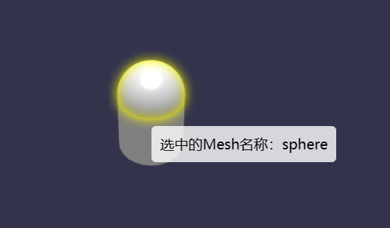

## 物理引擎和碰撞检测

物理引擎是一个用于模拟物体运动和碰撞的工具。在游戏开发和模拟仿真等领域中，物理引擎被广泛应用。Babylon.js 提供了内置的物理引擎，使你能够轻松地模拟物体的运动和实现碰撞检测与响应。

### 使用物理引擎模拟物体的运动

要在 Babylon.js 中使用物理引擎模拟物体的运动，你需要进行以下步骤：

1. 创建场景和物理引擎：使用 `BABYLON.Engine` 和 `BABYLON.PhysicsEngine` 类创建场景和物理引擎实例。例如：

```javascript
var canvas = document.getElementById("idcanvas");
var engine = new BABYLON.Engine(canvas, true);
var scene = new BABYLON.Scene(engine);
var physicsEngine = new BABYLON.PhysicsEngine(scene);
```

2. 创建物体：使用 `BABYLON.Mesh` 类创建需要模拟运动的物体。例如：

```javascript
var sphere = BABYLON.Mesh.CreateSphere("sphere", 16, 2, scene);
```

3. 添加物理属性：为物体添加物理属性，如质量、摩擦力等。例如：

```javascript
physicsEngine.addImpostor(sphere, BABYLON.PhysicsImpostor.SphereImpostor, { mass: 1, friction: 0.5, restitution: 0.5 });
```

4. 更新场景：在每一帧更新场景和物理引擎。例如：

```javascript
scene.registerBeforeRender(function () {
  physicsEngine.runOneStep();
});
```

5. 渲染场景：使用 `engine.runRenderLoop()` 方法渲染场景。例如：

```javascript
engine.runRenderLoop(function () {
  scene.render();
});
```

通过上述步骤，物体将根据物理引擎的模拟进行运动。

### 简单的碰撞检测和响应

Babylon.js 的物理引擎还提供了碰撞检测和响应的功能。你可以使用碰撞检测来判断物体是否发生碰撞，并根据需要执行相应的响应操作。

以下是一个简单的示例代码，演示如何实现简单的碰撞检测和响应：

> Babylon.js 的物理引擎可以使用 3 个物理插件-
>
> * Cannon.js
>
> * Oimo.js
> * Energy.js

#### Cannon.js

在这个示例中，我们使用了 Babylon.js v6 和 Cannon.js，在场景中创建了一个简单的物理场景。场景包括一个地面和一个球体，球体会受到重力作用而下落到地面上。

我们通过使用 `BABYLON.CannonJSPlugin` 将 Cannon.js 物理引擎集成到 Babylon.js 中。然后，我们创建了一个具有重力效果的物理场景，并应用了物理引擎到地面和球体上。

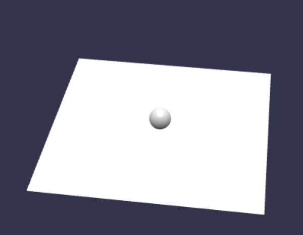

🤖来看看例子的完整代码：

```html
<!DOCTYPE html>
<html lang="en">
  <head>
    <meta charset="UTF-8" />
    <meta http-equiv="X-UA-Compatible" content="IE=edge" />
    <meta name="viewport" content="width=device-width, initial-scale=1.0" />
    <title>Babylon.js with Cannon.js Example</title>
    <style>
      #renderCanvas {
        width: 100%;
        height: 100%;
      }
    </style>
  </head>
  <body>
    <canvas id="renderCanvas"></canvas>
    <script src="https://cdn.babylonjs.com/babylon.js"></script>
    <script src="https://cdn.babylonjs.com/loaders/babylonjs.loaders.min.js"></script>
    <script src="https://cdn.jsdelivr.net/npm/cannon/build/cannon.min.js"></script>
    <script>
      const canvas = document.getElementById("renderCanvas");
      const engine = new BABYLON.Engine(canvas, true);
      const scene = new BABYLON.Scene(engine);
      const gravityVector = new BABYLON.Vector3(0, -9.81, 0);
      const physicsPlugin = new BABYLON.CannonJSPlugin();
      scene.enablePhysics(gravityVector, physicsPlugin);
      const camera = new BABYLON.ArcRotateCamera("camera", 0, 0, 10, BABYLON.Vector3.Zero(), scene);
      camera.attachControl(canvas, true);
      const light = new BABYLON.HemisphericLight("light", new BABYLON.Vector3(0, 1, 0), scene);
      const ground = BABYLON.MeshBuilder.CreateGround("ground", { width: 10, height: 10 }, scene);
      ground.physicsImpostor = new BABYLON.PhysicsImpostor(ground, BABYLON.PhysicsImpostor.BoxImpostor, { mass: 0 }, scene);
      const sphere = BABYLON.MeshBuilder.CreateSphere("sphere", { diameter: 1 }, scene);
      sphere.position.y = 5;
      sphere.physicsImpostor = new BABYLON.PhysicsImpostor(sphere, BABYLON.PhysicsImpostor.SphereImpostor, { mass: 1 }, scene);
      engine.runRenderLoop(() => {
        scene.render();
      });
      window.addEventListener("resize", () => {
        engine.resize();
      });
    </script>
  </body>
</html>
```

#### Oimo.js

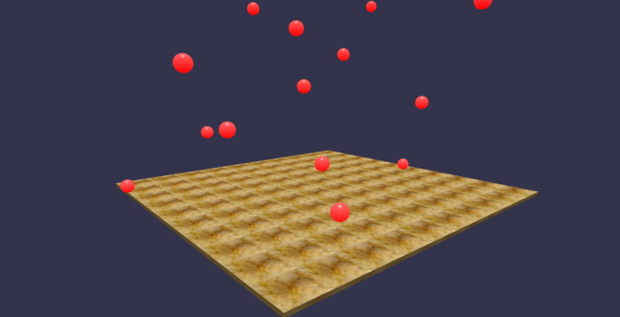

🤖来看看例子的完整代码：

```html
<!doctype html>
<html>
   <head>
      <meta charset = "utf-8">
      <title>BabylonJs-Ball/Ground Demo</title>
      <script type = "text/javascript" src="https://cdn.babylonjs.com/Oimo.js"></script>
      <script src = "https://cdn.babylonjs.com/babylon.js"></script>	
      <style>
         canvas {width: 100%; height: 100%;}
      </style>
   </head>
   <body>
      <canvas id = "renderCanvas"></canvas>
      <script type = "text/javascript">
         var canvas = document.getElementById("renderCanvas");
         var engine = new BABYLON.Engine(canvas, true);
         var v3 = BABYLON.Vector3;
         
         var createScene = function () {	
            // this creates a basic Babylon Scene object (non-mesh)
            var scene = new BABYLON.Scene(engine);
            var camera = new BABYLON.ArcRotateCamera("Camera", 0.86, 1.37, 250, BABYLON.Vector3.Zero(), scene);
            
            camera.attachControl(canvas);
            camera.maxZ = 5000;
            camera.lowerRadiusLimit = 120;
            camera.upperRadiusLimit = 430;
            camera.lowerBetaLimit =0.75;
            camera.upperBetaLimit =1.58 ;
            new BABYLON.HemisphericLight("hemi", new BABYLON.Vector3(0, 1, 0), scene);
            var randomNumber = function (min, max) {
               if (min == max) {
                  return (min);
               }
               var random = Math.random();
               return ((random * (max-min)) + min);
            };
            var mat = new BABYLON.StandardMaterial("ground", scene);
            var t = new BABYLON.Texture("./marble.jpg", scene);
            t.uScale = t.vScale = 10;
            mat.diffuseTexture = t;
            mat.specularColor = BABYLON.Color3.Black();
            
            var g = BABYLON.Mesh.CreateBox("ground", 200, scene);
            
            g.position.y =-20;
            g.position.x = 0
            g.scaling.y = 0.01;
            g.material = mat;	
            
            scene.enablePhysics(new BABYLON.Vector3(0,-10, 0), new BABYLON.OimoJSPlugin());
            
            g.physicsImpostor = new BABYLON.PhysicsImpostor(g, BABYLON.PhysicsImpostor.BoxImpostor, { 
               mass: 0, 
               restitution: 0.9 
            }, scene);
            
            var getPosition = function(y) {
               return new v3(randomNumber(-100, 100), y, randomNumber(-100, 100));
            };
            
            var allspheres = [];
            var y = 50;
            var max = 50;
            
            for (var index = 0; index < max; index++) {
               var redSphere = BABYLON.Mesh.CreateSphere("s" + index, 32, 8, scene);
               redSphere.position = getPosition(y);
               redSphere.physicsImpostor = new BABYLON.PhysicsImpostor(redSphere, BABYLON.PhysicsImpostor.SphereImpostor,{
                  mass: 1, restitution:0.9
               }, scene);
               
               redSphere.physicsImpostor.applyImpulse(new BABYLON.Vector3(1, 2,-1), new BABYLON.Vector3(1, 2, 0));
               
               var redMat = new BABYLON.StandardMaterial("ground", scene);
               redMat.diffuseColor = new BABYLON.Color3(0.4, 0.4, 0.4);
               redMat.specularColor = new BABYLON.Color3(0.4, 0.4, 0.4);
               redMat.emissiveColor = BABYLON.Color3.Red();
               redSphere.material = redMat;
               
               // push all spheres in the allspheres variable
               allspheres.push(redSphere);			
               y += 10; // increment height
            }
            scene.registerBeforeRender(function() {
               allspheres.forEach(function(obj) { 
                  // if the sphers falls down its updated again over here
                  // if object falls
                  if (obj.position.y <-100) {
                     obj.position = getPosition(200);				
                  }
               });
            })
            return scene;
         };
         var scene = createScene();
         engine.runRenderLoop(function() {
            scene.render();
         });
      </script>
   </body>
</html>
```

## 导入和导出

### 导入外部模型和场景

要导入外部模型和场景，你可以使用 Babylon.js 提供的加载器和导入功能。Babylon.js 支持多种格式的模型和场景导入，包括 glTF、OBJ、FBX 等。以下是一个示例代码，演示如何导入外部模型和场景：

> https://cdn.babylonjs.com/loaders/babylonjs.loaders.min.js这个链接会加载包含了 glTF 导入功能的 Babylon.js 加载器模块。它包含了 BABYLON.GLTFFileLoader 插件。
>
> 确保在引入 Babylon.js 的主要库文件之后，引入这个加载器模块。
>
> 然后，你可以使用 `BABYLON.SceneLoader.ImportMesh()` 方法来导入 .glb 文件，而不需要手动注册插件：

🤖来看看例子的完整代码：

```html
<html lang="en">
  <head>
    <meta charset="UTF-8" />
    <meta http-equiv="X-UA-Compatible" content="IE=edge" />
    <meta name="viewport" content="width=device-width, initial-scale=1.0" />
    <title>导入外部模型</title>
    <script src="https://cdn.babylonjs.com/babylon.js"></script>
    <script src="https://cdn.babylonjs.com/loaders/babylonjs.loaders.min.js"></script>
    <style>
      * {
        padding: 0;
        margin: 0;
        width: 100%;
        height: 100%;
        overflow: hidden;
      }

      #idcanvas {
        width: 100%;
        height: 100%;
        /* 禁用元素上的所有手势 */
        touch-action: none;
      }
    </style>
  </head>
  <body>
    <canvas id="idcanvas"></canvas>
    <script type="text/javascript">
      // 创建场景和相机
      var canvas = document.getElementById('idcanvas')
      var engine = new BABYLON.Engine(canvas, true)
      var scene = new BABYLON.Scene(engine)
      var camera = new BABYLON.FreeCamera('camera', new BABYLON.Vector3(0, 0, -10), scene)
      camera.setTarget(BABYLON.Vector3.Zero())
      camera.attachControl(canvas, true)
      var light = new BABYLON.HemisphericLight('light', new BABYLON.Vector3(0, 1, 0), scene)
      // 导入 glTF 插件
      BABYLON.SceneLoader.RegisterPlugin(new BABYLON.GLTFFileLoader())
      // 导入外部模型或场景
      BABYLON.SceneLoader.ImportMesh('', 'https://agents.uue.cn/courses/Web-3D/assets/models/', 'Duck.glb', scene, function (meshes) {
        // 在加载完成后的回调函数中进行操作
        // meshes 是包含导入的模型的数组

        // 例如，调整模型的位置、缩放或旋转等
        meshes[0].position = new BABYLON.Vector3(0, 0, 0)
        meshes[0].scaling = new BABYLON.Vector3(1, 1, 1)
      })

      // 渲染场景
      engine.runRenderLoop(function () {
        scene.render()
      })

      // 处理窗口大小变化
      window.addEventListener('resize', function () {
        engine.resize()
      })
    </script>
  </body>
</html>
```

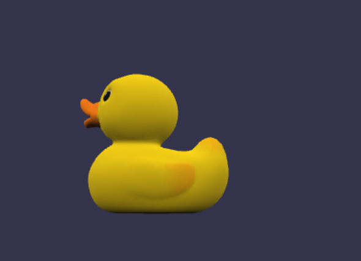

在上述代码中，我们使用 `BABYLON.SceneLoader.ImportMesh()` 方法来导入外部模型或场景。该方法接受多个参数，包括模型的文件路径、文件名以及场景对象等。在加载完成后的回调函数中，你可以对导入的模型进行操作，例如调整位置、缩放或旋转等。

请确保替换代码中的文件路径和文件名，以适应你自己的模型和场景文件。

在渲染循环中调用 `scene.render()` 方法来渲染场景。

这是一个基本的示例，用于导入外部模型和场景。具体的导入过程可能因所使用的文件格式和场景要求而有所不同。你可以查阅 Babylon.js 的官方文档，了解更多关于导入模型和场景的详细信息和支持的文件格式。

如果我们想显示多个导入的外部模型，我们只调用一次`ImportMesh`方法来导入鸭子模型，并在加载完成后的回调函数中使用`clone`方法来复制模型并在场景中显示多个鸭子。

🤖来看看例子的完整代码：

```html
<!DOCTYPE html>
<html lang="en">
<head>
    <meta charset="UTF-8">
    <meta http-equiv="X-UA-Compatible" content="IE=edge">
    <meta name="viewport" content="width=device-width, initial-scale=1.0">
    <title>导入外部模型</title>
    <script src="https://cdn.babylonjs.com/babylon.js"></script>
    <script src="https://cdn.babylonjs.com/loaders/babylonjs.loaders.min.js"></script>
    <style>
        * {
            padding: 0;
            margin: 0;
            width: 100%;
            height: 100%;
            overflow: hidden;
        }

        #idcanvas {
            width: 100%;
            height: 100%;
            /* 禁用元素上的所有手势 */
            touch-action: none;
        }
    </style>
</head>
<body>
    <canvas id="idcanvas"></canvas>
    <script type="text/javascript">
        // 创建场景和相机
        var canvas = document.getElementById('idcanvas')
        var engine = new BABYLON.Engine(canvas, true)
        var scene = new BABYLON.Scene(engine)
        var camera = new BABYLON.FreeCamera('camera', new BABYLON.Vector3(0, 0, -10), scene)
        camera.setTarget(BABYLON.Vector3.Zero())
        camera.attachControl(canvas, true)
        var light = new BABYLON.HemisphericLight('light', new BABYLON.Vector3(0, 1, 0), scene)
        // 导入 glTF 插件
        BABYLON.SceneLoader.RegisterPlugin(new BABYLON.GLTFFileLoader())

        // 导入鸭子模型
        BABYLON.SceneLoader.ImportMesh('', 'https://agents.uue.cn/courses/Web-3D/assets/models/', 'Duck.glb', scene, function (meshes) {
            // 在加载完成后的回调函数中进行操作
            // meshes 是包含导入的模型的数组

            // 循环复制并显示多个鸭子
            var duckCount = 5;
            for (var i = 0; i < duckCount; i++) {
                var clonedDuck = meshes[0].clone('clonedDuck' + i);
                clonedDuck.position = new BABYLON.Vector3(i + 2, 0, 0);
                clonedDuck.scaling = new BABYLON.Vector3(1, 1, 1);
            }
        });

        // 渲染场景
        engine.runRenderLoop(function () {
            scene.render()
        })

        // 处理窗口大小变化
        window.addEventListener('resize', function () {
            engine.resize()
        })
    </script>
</body>
</html>

```

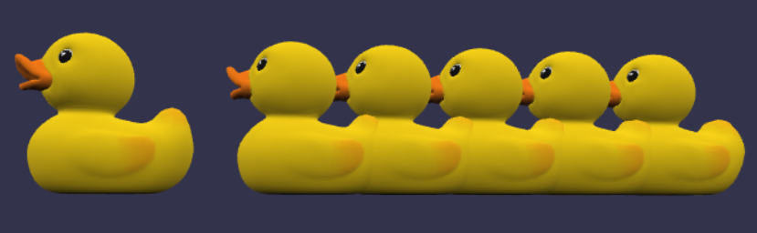

### 播放外部模型动画

要通过 Babylon.js 获取 glTF 文件中内置的动画列表，你可以使用 `BABYLON.GLTFFileLoader` 加载器和 `BABYLON.GLTFLoader` 类的方法。以下是一个示例代码，演示如何读取 glTF 文件中的动画列表：

> 为了加快模型加载，下面例子中**Bee-compressed.glb**使用了高压缩比的模型，所以没有**纹理**。

🤖来看看例子的完整代码：

```html
<html lang="en">
  <head>
    <meta charset="UTF-8" />
    <meta http-equiv="X-UA-Compatible" content="IE=edge" />
    <meta name="viewport" content="width=device-width, initial-scale=1.0" />
    <title>导入外部模型</title>
    <script src="https://cdn.babylonjs.com/babylon.js"></script>
    <script src="https://cdn.babylonjs.com/loaders/babylonjs.loaders.min.js"></script>
    <style>
      * {
        padding: 0;
        margin: 0;
        width: 100%;
        height: 100%;
        overflow: hidden;
      }

      #idcanvas {
        width: 100%;
        height: 100%;
        /* 禁用元素上的所有手势 */
        touch-action: none;
      }
    </style>
  </head>
  <body>
    <canvas id="idcanvas"></canvas>
    <script type="text/javascript">
      // 创建场景和相机
      var canvas = document.getElementById('idcanvas')
      var engine = new BABYLON.Engine(canvas, true)
      var scene = new BABYLON.Scene(engine)
      var camera = new BABYLON.FreeCamera('camera', new BABYLON.Vector3(0, 0, -10), scene)
      camera.setTarget(BABYLON.Vector3.Zero())
      camera.attachControl(canvas, true)
      var light = new BABYLON.HemisphericLight('light', new BABYLON.Vector3(0, 1, 0), scene)
      // 导入 glTF 插件
      BABYLON.SceneLoader.RegisterPlugin(new BABYLON.GLTFFileLoader())
      // 导入外部模型或场景
      BABYLON.SceneLoader.ImportMesh('', 'https://agents.uue.cn/courses/Web-3D/assets/models/', 'Bee-compressed.glb', scene, function (meshes) {
        // 在加载完成后的回调函数中进行操作
        // meshes 是包含导入的模型的数组
        meshes[0].scaling = new BABYLON.Vector3(0.1, 0.1, 0.1)
        // 获取动画组
        let animationGroups = scene.animationGroups
        // 打印动画组数量
        console.log('Animation Group Count: ', animationGroups.length)
        // 遍历动画组并打印动画名称，播放动画
        animationGroups.forEach(function (animationGroup) {
          console.log('Animation Group Name: ', animationGroup.name)
          animationGroup.play()
        })
      })

      // 渲染场景
      engine.runRenderLoop(function () {
        scene.render()
      })

      // 处理窗口大小变化
      window.addEventListener('resize', function () {
        engine.resize()
      })
    </script>
  </body>
</html>
```

在上述代码中，我们使用 `BABYLON.SceneLoader.ImportMesh()` 方法加载 glTF 文件，并在加载完成后的回调函数中进行操作。我们使用 `let animationGroups = scene.animationGroups` 方法获取动画列表。

然后，我们遍历动画列表并打印出每个动画的名称并播放。

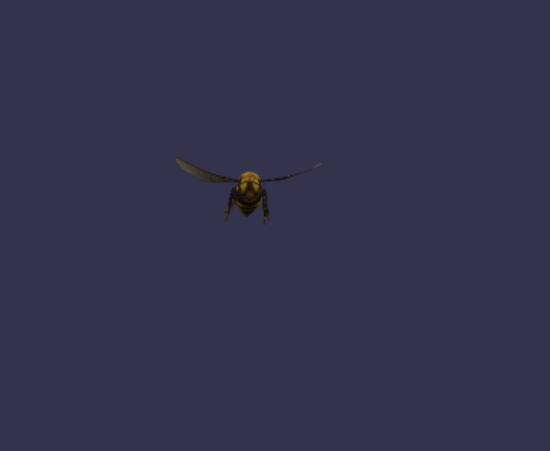

### 高亮模型中的选定mesh

如果你想要高亮模型中的选定mesh，你可以按照以下步骤进行操作：

1. 在 Babylon.js 中导入模型文件，并将其加载到场景中。可以使用 `BABYLON.SceneLoader.ImportMesh` 方法来加载模型。
2. 在合适的位置创建 `HighlightLayer` 对象，并将其添加到场景中。
3. 根据需要，创建一个 `highlightMesh` 变量来存储当前被选中的 mesh。
4. 在鼠标点击或其他事件中，获取鼠标点击的位置，并使用 `BABYLON.Scene.pick` 方法来获取被点击的 mesh。
5. 如果存在先前选中的 mesh，从 `highlightMesh` 中移除高亮效果。
6. 将新选中的 mesh 加入 `highlightMesh` 中，并使用 `highlight.addMesh` 方法来应用高亮效果。

> Babylon.js中的`BABYLON.Scene.pick`方法可以用于屏幕坐标与世界坐标之间的转换。`pick`方法可以通过提供屏幕坐标（以像素为单位）来获取场景中与该屏幕位置最近的Mesh。
>
> 以下是一个示例代码，演示了如何使用`pick`方法将屏幕坐标转换为世界坐标：
>
> ```javascript
> // 获取屏幕坐标
> var screenX = 100; // 屏幕X坐标
> var screenY = 200; // 屏幕Y坐标
> 
> // 调用pick方法将屏幕坐标转换为世界坐标
> var pickResult = scene.pick(screenX, screenY);
> 
> // 获取pick结果中的世界坐标
> var worldPosition = pickResult.pickedPoint;
> 
> console.log("屏幕坐标 (" + screenX + ", " + screenY + ") 转换为世界坐标为:", worldPosition);
> ```
>
> 在这个示例中，我们提供了屏幕坐标`screenX`和`screenY`，然后使用`pick`方法将其转换为世界坐标。`pick`方法返回一个`pickResult`对象，其中包含了与屏幕位置最近的Mesh的相关信息，例如世界坐标、法线等。
>
> 请注意，`pick`方法的返回值是一个`pickResult`对象，所以我们可以从中提取出世界坐标等信息。如果没有找到与屏幕位置最近的Mesh，`pickResult.pickedPoint`将为`null`。

🤖以下是一个示例代码：

```html
<html lang="en">
  <head>
    <meta charset="UTF-8" />
    <meta http-equiv="X-UA-Compatible" content="IE=edge" />
    <meta name="viewport" content="width=device-width, initial-scale=1.0" />
    <title>导入外部模型</title>
    <script src="https://cdn.babylonjs.com/babylon.js"></script>
    <script src="https://cdn.babylonjs.com/loaders/babylonjs.loaders.min.js"></script>
    <style>
      * {
        padding: 0;
        margin: 0;
        width: 100%;
        height: 100%;
        overflow: hidden;
      }

      #idcanvas {
        width: 100%;
        height: 100%;
      }
    </style>
  </head>
  <body>
    <canvas id="idcanvas"></canvas>
    <script type="text/javascript">
      // 获取画布元素
      const canvas = document.getElementById('idcanvas')

      // 创建场景
      const createScene = () => {
        const scene = new BABYLON.Scene(engine)

        // 创建相机
        const camera = new BABYLON.ArcRotateCamera('camera', 0, 0, 10, BABYLON.Vector3.Zero(), scene)
        camera.setPosition(new BABYLON.Vector3(0, 0, -10))
        camera.attachControl(canvas, true)

        // 创建灯光
        const light = new BABYLON.HemisphericLight('light', new BABYLON.Vector3(0, 1, 0), scene)

        // 导入模型
        BABYLON.SceneLoader.ImportMesh('', 'https://agents.uue.cn/courses/Web-3D/assets/models/', 'Feed check vavle assembly.glb', scene, meshes => {
          const model = meshes[0]

          // 创建高亮效果
          const highlight = new BABYLON.HighlightLayer('highlight', scene)

          // 用于存储当前选中的 mesh
          let highlightMesh = null

          // 鼠标点击事件
          canvas.addEventListener('pointerdown', event => {
            // 获取鼠标点击位置
            const pickResult = scene.pick(scene.pointerX, scene.pointerY)

            // 如果有先前选中的 mesh，则移除高亮效果
            if (highlightMesh) {
              highlight.removeMesh(highlightMesh)
            }

            // 将新选中的 mesh 加入 highlightMesh
            highlightMesh = pickResult.pickedMesh
            highlight.addMesh(highlightMesh, BABYLON.Color3.Green())
          })
        })

        return scene
      }

      // 创建引擎
      const engine = new BABYLON.Engine(canvas, true)

      // 创建场景
      const scene = createScene()

      // 渲染场景
      engine.runRenderLoop(() => {
        scene.render()
      })

      // 调整画布大小
      window.addEventListener('resize', () => {
        engine.resize()
      })
    </script>
  </body>
</html>
```

在这个例子中，我们假设模型文件是 `Feed check vavle assembly.SLDASM.zip.glb`，你需要将其替换为你自己的模型文件路径。然后，我们在鼠标点击事件中获取鼠标点击的位置，并使用 `pickResult.pickedMesh` 获取被点击的 mesh。如果先前已经选中了一个 mesh，则将其从 `highlightMesh` 中移除，并将新选中的 mesh 加入 `highlightMesh` 中，然后使用 `highlight.addMesh` 方法来应用高亮效果。

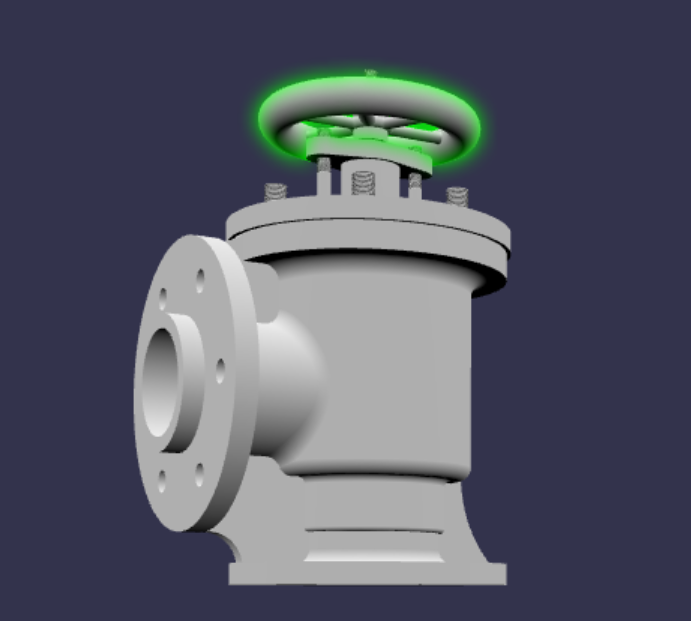

### 导出 Babylon.js 场景和对象

#### 导出为JSON 

要导出 Babylon.js 场景和对象，你可以使用 Babylon.js 提供的序列化功能。Babylon.js 提供了将场景和对象转换为 JSON 字符串的方法，从而可以将它们保存到文件或传输给其他应用程序。

以下是一个示例代码，演示如何导出 Babylon.js 场景和对象：

```javascript
// 创建场景和物体
var canvas = document.getElementById("idcanvas");
var engine = new BABYLON.Engine(canvas, true);
var scene = new BABYLON.Scene(engine);
var box = BABYLON.MeshBuilder.CreateBox("box", {}, scene);

// 将场景和对象序列化为 JSON 字符串
var serializedScene = JSON.stringify(scene.serialize());
var serializedObject = JSON.stringify(box.serialize());

// 输出 JSON 字符串
console.log("Serialized Scene: ", serializedScene);
console.log("Serialized Object: ", serializedObject);
```

在上述代码中，我们首先创建了一个场景和一个立方体对象。然后，我们使用 `scene.serialize()` 方法将场景序列化为 JSON 字符串，并使用 `box.serialize()` 方法将立方体对象序列化为 JSON 字符串。

最后，我们将序列化后的场景和对象输出到控制台，你可以选择将其保存到文件或传输给其他应用程序。

通过使用 Babylon.js 的序列化功能，你可以方便地导出场景和对象，并与其他应用程序进行交互、保存或共享。请注意，只有序列化的数据会被导出，与场景和对象相关的方法和行为不会被包含在导出的数据中。

#### 导出为其它格式

Babylon.js 不直接提供将场景和对象导出为 STL（Standard Tessellation Language）格式的功能，但你可以使用第三方库或工具来实现将 Babylon.js 场景和对象导出为 STL 文件。

一种方法是使用 `babylonjs-serializers` 库，它是 Babylon.js 官方提供的一个附加模块。这个库提供了将 Babylon.js 场景和对象导出为多种格式的功能，包括 STL。你可以通过以下代码示例来导出:

```javascript
// 导入所需的模块
import { STLExport } from 'babylonjs-serializers';

// 创建 STLExport 实例
var exporter = new STLExport();

// 导出对象为 STL 文件
exporter.exportMesh(scene.getMeshByName("meshName"), "path/to/output.stl");
```

请注意，你需要在项目中安装 `babylonjs-serializers` 库，然后使用适合你的构建工具（如Webpack）进行导入。

### 选定导入的模型并移动

这是一个导入的模型和鼠标交互的综合性例子

* 在这个示例中，我们添加了鼠标事件监听器，包括 `pointerdown`、`pointermove` 和 `pointerup`。当鼠标按下时，我们记录下初始的鼠标位置和模型的位置。在鼠标移动期间，我们计算鼠标的偏移量，并根据偏移量调整模型的位置。最后，当鼠标释放时，停止拖拽操作。
* 在这个示例中，我们在 `pointerdown` 事件中使用 `detachControl` 方法暂时解除了相机的控制绑定，然后在拖拽事件完成后使用 `attachControl` 方法重新绑定了相机控制。通过这种方式，你可以在拖拽事件期间暂时解除相机的控制绑定，以免与拖拽事件冲突。当拖拽事件完成后，再重新绑定相机控制，以继续使用相机控制功能。

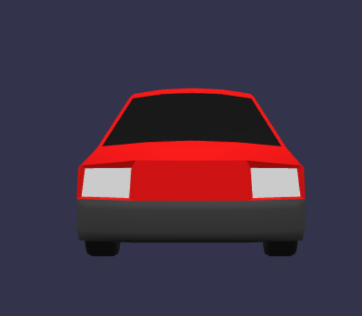

🤖来看看例子的完整代码：

```html
<!DOCTYPE html>
<html lang="en">
  <head>
    <meta charset="UTF-8" />
    <meta http-equiv="X-UA-Compatible" content="IE=edge" />
    <meta name="viewport" content="width=device-width, initial-scale=1.0" />
    <title>Move Model with Mouse Drag</title>
    <script src="https://cdn.babylonjs.com/babylon.js"></script>
    <script src="https://cdn.babylonjs.com/loaders/babylonjs.loaders.min.js"></script>
    <style>
      * {
        padding: 0;
        margin: 0;
        width: 100%;
        height: 100%;
        overflow: hidden;
      }

      #idcanvas {
        width: 100%;
        height: 100%;
        /* 禁用元素上的所有手势 */
        touch-action: none;
      }
    </style>
  </head>
  <body>
    <canvas id="idcanvas"></canvas>
    <script type="text/javascript">
      // 创建场景和相机
      var canvas = document.getElementById('idcanvas')
      var engine = new BABYLON.Engine(canvas, true)
      var scene = new BABYLON.Scene(engine)
      var camera = new BABYLON.FreeCamera('camera', new BABYLON.Vector3(0, 0, -10), scene)
      camera.setTarget(BABYLON.Vector3.Zero())
      camera.attachControl(canvas, true)
      var light = new BABYLON.HemisphericLight('light', new BABYLON.Vector3(0, 1, 0), scene)
      // 导入 glTF 插件
      BABYLON.SceneLoader.RegisterPlugin(new BABYLON.GLTFFileLoader())

      // 导入外部模型或场景
      BABYLON.SceneLoader.ImportMesh('', 'https://agents.uue.cn/courses/Web-3D/assets/models/', 'car.gltf', scene, function (meshes) {
        // 在加载完成后的回调函数中进行操作
        // meshes 是包含导入的模型的数组

        // 例如，调整模型的位置、缩放或旋转等
        meshes[0].position = new BABYLON.Vector3(0, 0, 0)
        meshes[0].scaling = new BABYLON.Vector3(1, 1, 1)

        // 鼠标拖拽事件
        var dragMesh = meshes[0]
        var isDragging = false
        var startDragPos = new BABYLON.Vector3()
        var startMeshPos = new BABYLON.Vector3()

        canvas.addEventListener('pointerdown', function (event) {
          // 暂时解除相机控制绑定
          camera.detachControl(canvas)
          isDragging = true
          startDragPos.x = event.clientX
          startDragPos.y = event.clientY
          startMeshPos.copyFrom(dragMesh.position)
          camera.attachControl(canvas, true)
        })

        canvas.addEventListener('pointermove', function (event) {
          if (isDragging) {
            var deltaX = event.clientX - startDragPos.x
            var deltaY = event.clientY - startDragPos.y
            dragMesh.position.x = startMeshPos.x + deltaX / 100
            dragMesh.position.y = startMeshPos.y - deltaY / 100
          }
        })

        canvas.addEventListener('pointerup', function () {
          isDragging = false
        })
      })

      // 渲染场景
      engine.runRenderLoop(function () {
        scene.render()
      })

      // 处理窗口大小变化
      window.addEventListener('resize', function () {
        engine.resize()
      })
    </script>
  </body>
</html>

```

## 遍历Mesh

在如下示例中，我们定义了一个 `createMeshDirectoryTree` 函数，该函数接受一个 Mesh 作为参数，并返回一个目录树对象。目录树对象具有 `name` 属性表示 Mesh 的名称，以及 `children` 属性表示子级 Mesh 的目录树。

通过递归方式，在函数中遍历 Mesh 的子级，并为每个子级创建对应的目录树对象。最后，返回根 Mesh 的目录树对象。

🤖来看看例子的完整代码：

```html
<html lang="en">
  <head>
    <meta charset="UTF-8" />
    <meta http-equiv="X-UA-Compatible" content="IE=edge" />
    <meta name="viewport" content="width=device-width, initial-scale=1.0" />
    <title>导入外部模型</title>
    <script src="https://cdn.babylonjs.com/babylon.js"></script>
    <script src="https://cdn.babylonjs.com/loaders/babylonjs.loaders.min.js"></script>
    <style>
      * {
        padding: 0;
        margin: 0;
        width: 100%;
        height: 100%;
        overflow: hidden;
      }

      #idcanvas {
        width: 100%;
        height: 100%;
      }
    </style>
  </head>
  <body>
    <canvas id="idcanvas"></canvas>
    <script type="text/javascript">
      // 获取画布元素
      const canvas = document.getElementById('idcanvas')

      // 创建场景
      const createScene = () => {
        const scene = new BABYLON.Scene(engine)

        // 创建相机
        const camera = new BABYLON.ArcRotateCamera('camera', 0, 0, 10, BABYLON.Vector3.Zero(), scene)
        camera.setPosition(new BABYLON.Vector3(0, 0, -10))
        camera.attachControl(canvas, true)

        // 创建灯光
        const light = new BABYLON.HemisphericLight('light', new BABYLON.Vector3(0, 1, 0), scene)

        // 导入模型
        BABYLON.SceneLoader.ImportMesh('', 'https://agents.uue.cn/courses/Web-3D/assets/models/', 'Feed check vavle assembly.glb', scene, meshes => {
          const model = meshes[0]

          const meshDirectoryTree = createMeshDirectoryTree(model)
          console.log(meshDirectoryTree)

          // 创建高亮效果
          const highlight = new BABYLON.HighlightLayer('highlight', scene)

          // 用于存储当前选中的 mesh
          let highlightMesh = null

          // 鼠标点击事件
          canvas.addEventListener('pointerdown', event => {
            // 获取鼠标点击位置
            const pickResult = scene.pick(scene.pointerX, scene.pointerY)

            // 如果有先前选中的 mesh，则移除高亮效果
            if (highlightMesh) {
              highlight.removeMesh(highlightMesh)
            }

            // 将新选中的 mesh 加入 highlightMesh
            highlightMesh = pickResult.pickedMesh
            highlight.addMesh(highlightMesh, BABYLON.Color3.Green())
          })
        })

        return scene
      }

      // 创建引擎
      const engine = new BABYLON.Engine(canvas, true)

      // 创建场景
      const scene = createScene()

      // 渲染场景
      engine.runRenderLoop(() => {
        scene.render()
      })

      // 调整画布大小
      window.addEventListener('resize', () => {
        engine.resize()
      })

      function createMeshDirectoryTree(mesh) {
        const directoryTree = {
          name: mesh.name,
          children: []
        }

        if (mesh.getChildMeshes) {
          const childMeshes = mesh.getChildMeshes()
          for (const childMesh of childMeshes) {
            const childDirectoryTree = createMeshDirectoryTree(childMesh)
            directoryTree.children.push(childDirectoryTree)
          }
        }

        return directoryTree
      }
    </script>
  </body>
</html>
```

> 在 Babylon.js 中，`Geometry` 对象是被 `Mesh` 对象隐式创建和使用的。Babylon.js 的 `Mesh` 对象本身就包含了几何体（Geometry）和材质（Material）的信息。
>
> 在 Three.js 中，`Geometry` 对象是独立的，用于描述和存储几何体的顶点、面和其他几何数据。而在 Babylon.js 中，几何体的信息是直接与 `Mesh` 对象关联的，而不是作为独立的 `Geometry` 对象存在。
>
> 在 Three.js 中，`Geometry` 对象的独立性带来了一些好处：
>
> 1. 可重用性：由于 `Geometry` 对象是独立的，你可以在多个 `Mesh` 对象之间共享同一个几何体。这样可以节省内存和资源，避免重复创建和存储相同的几何数据。
> 2. 灵活性：你可以对 `Geometry` 对象进行独立的操作和修改，而不会影响使用该几何体的所有 `Mesh` 对象。例如，你可以在不同的 `Mesh` 对象上应用不同的材质、变换或动画，同时共享相同的几何体。
> 3. 扩展性：通过继承 `Geometry` 对象，你可以创建自定义的几何体，并添加额外的属性和方法。这样可以满足特定的需求，实现更复杂和特殊的几何形状。
>
> 尽管独立的 `Geometry` 对象在某些情况下可能会占用更多的内存和资源，但它们提供了更多的灵活性和可扩展性。这对于复杂的场景和特殊的几何需求非常有用。
>
> 请注意，在 Three.js r125 版本之后，推荐使用 `BufferGeometry` 对象代替 `Geometry` 对象，因为 `BufferGeometry` 对象在性能上更高效。

## Mesh组合

这里分别导入蜜蜂和鸭子2个外部模型，将他们组合在一起，其中蜜蜂在鸭子的上方（相对），他们一起围着Y轴旋转，另外蜜蜂每2秒下落上升一次

> 注意外部导入的模型，要通过`bee.rotationQuaternion = null;`移除之前的四元数旋转，否则无法旋转。
>
> 在许多3D图形库和引擎中，通过四元数（Quaternion）来表示物体的旋转。四元数是一种数学工具，用于表示旋转的方向和角度。通过设置物体的 rotationQuaternion 属性，可以将其旋转到指定的角度。
>
> 在这段代码中，将 rotationQuaternion 设置为 null，意味着将物体的旋转重置为默认值，即没有任何旋转。这将移除之前设置的任何旋转效果。

🤖来看看例子的完整代码：

```html
<!DOCTYPE html>
<html lang="en">
  <head>
    <meta charset="UTF-8" />
    <meta http-equiv="X-UA-Compatible" content="IE=edge" />
    <meta name="viewport" content="width=device-width, initial-scale=1.0" />
    <title>导入Duck.glb和Bee.glb模型并旋转</title>
    <script src="https://cdn.babylonjs.com/babylon.js"></script>
    <script src="https://cdn.babylonjs.com/loaders/babylonjs.loaders.min.js"></script>
    <style>
      * {
        padding: 0;
        margin: 0;
        width: 100%;
        height: 100%;
        overflow: hidden;
      }

      #renderCanvas {
        width: 100%;
        height: 100%;
      }
    </style>
  </head>

  <body>
    <canvas id="renderCanvas"></canvas>

    <script>
      // 创建引擎
      var canvas = document.getElementById('renderCanvas')
      var engine = new BABYLON.Engine(canvas, true)

      // 创建场景
      var scene = new BABYLON.Scene(engine)

      // 创建相机
      var camera = new BABYLON.ArcRotateCamera('camera', Math.PI / 2, Math.PI / 2, 2, BABYLON.Vector3.Zero(), scene)
      camera.attachControl(canvas, true)

      // 创建灯光
      var light = new BABYLON.HemisphericLight('light', new BABYLON.Vector3(0, 1, 0), scene)

      // 加载Duck.glb模型
      BABYLON.SceneLoader.ImportMesh('', 'https://agents.uue.cn/courses/Web-3D/assets/models/', 'Duck.glb', scene, function (meshes) {
        var duck = meshes[0]
        duck.rotationQuaternion = null // 移除之前的四元数旋转
        duck.rotation.y = Math.PI / 2 // 设置初始旋转角度

        // 加载Bee.glb模型
        BABYLON.SceneLoader.ImportMesh('', 'https://agents.uue.cn/courses/Web-3D/assets/models/', 'Bee-compressed.glb', scene, function (meshes) {
          var bee = meshes[0]
          bee.rotationQuaternion = null // 移除之前的四元数旋转
          bee.position.y = 3 // 设置bee模型的相对位置
          bee.scaling = new BABYLON.Vector3(0.1, 0.1, 0.1) // 缩小10倍

          // 创建父节点
          var parentNode = new BABYLON.TransformNode('parentNode')
          duck.parent = parentNode
          bee.parent = parentNode

          // 定义动画函数
          function animateBee() {
            bee.position.y = 1 // 下落到1，position的改变是相对父节点的改变
            setTimeout(function () {
              bee.position.y = 3 // 上升到3，position的改变是相对父节点的改变
            }, 3000)
          }

          // 调用动画函数，每隔2秒执行一次
          setInterval(animateBee, 2000)

          // 渲染循环
          engine.runRenderLoop(function () {
            parentNode.rotation.y += engine.getDeltaTime() / 1000 // 每秒旋转2弧度
            scene.render()
          })
        })
      })

      // 窗口调整处理
      window.addEventListener('resize', function () {
        engine.resize()
      })
    </script>
  </body>
</html>
```

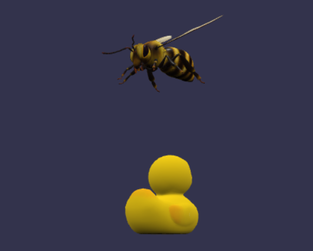

## 性能优化和调试

要优化渲染性能和帧率，你可以尝试以下几个方法：

1. 减少渲染的对象数量：只渲染当前视野内的对象，并移除不可见的对象。你可以使用视锥体剪裁或者使用 frustum culling 技术来实现。
2. 合并几何体：如果你有许多重叠的小几何体，可以将它们合并为一个大几何体，减少渲染调用的次数。
3. 使用 LOD（Level of Detail）技术：根据对象距离相机的距离，使用不同的细节级别来渲染。当对象远离相机时，使用较低的细节级别，减少细节和多边形数量。
4. 优化纹理使用：使用纹理压缩、纹理合并和纹理分辨率缩小等技术，减少纹理内存占用和加载时间。
5. 使用 GPU 实例化：如果你有大量相似的对象，可以使用 GPU 实例化技术来复用几何体和着色器，减少渲染调用的次数。
6. 使用延迟渲染：将一些开销较大的渲染操作推迟到后续帧中进行，以保持实时渲染的帧率稳定。
7. 避免每帧创建和销毁对象：如果有可能，尽量重用已有的对象，而不是每帧都新建对象或销毁对象，以减少

参考文档

* [Babylon.js大规模场景优化实战 - 知乎 (zhihu.com)](https://zhuanlan.zhihu.com/p/629581079)
