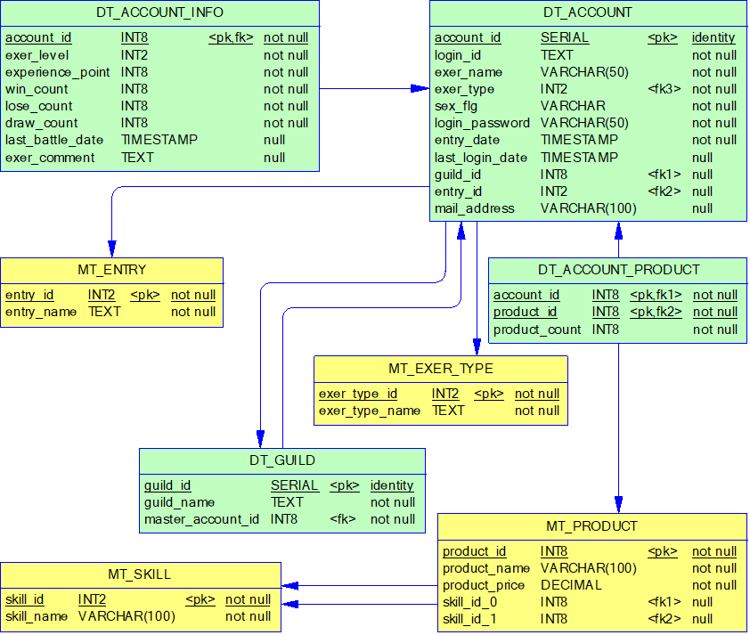

# SQL大全

## PostgreSQL 简介

PostgreSQL，也称为 Postgres，是一款功能强大的开源**对象关系型数据库管理系统 (ORDBMS)**。它以其可靠性、数据完整性和可扩展性而闻名。 

**主要特点：**

* **SQL 标准兼容性：** PostgreSQL 遵循 SQL 标准，并支持许多高级功能，例如复杂查询、外键、触发器、视图和存储过程。
* **ACID 属性：** PostgreSQL 保证数据库事务的原子性、一致性、隔离性和持久性，确保数据完整性。
* **可扩展性：** PostgreSQL 支持多种扩展，例如 PostGIS 用于地理空间数据和 JSONB 用于存储和查询 JSON 数据。
* **开源和免费：** PostgreSQL 采用自由开源许可证，可以免费使用、修改和分发。
* **跨平台：** PostgreSQL 可以在各种操作系统上运行，包括 Linux、Windows、macOS 和 Unix。
* **活跃的社区：** PostgreSQL 拥有一个庞大而活跃的社区，提供广泛的支持和资源。

> 这里结合一个小项目，讲解自己积累的各个场景的SQL写法，当然这些SQL的写法不一定是最优，仅供大家参考

## 准备工作

### PostgreSQL 交互终端

psql 是一个以终端为基础的 PostgreSQL 前端。它允许你交互地键入查询，把它们发出给 PostgreSQL，然后看看查询的结果。另外，输入可以来自一个文件。还有它提供了一些元命令和多种类 shell 地特性来实现书写脚本以及对大量任务的自动化。

导入本案例的数据，`db.out`在git仓库的`sample_data`目录中

```sh
# 导入本案例的数据
psql -U postgres -d train -f db.out
```

### 数据库结构介绍

这是一个很老的卡牌对战游戏。数据结构和测试数据为了本课程做了一些修改。

* **dt_account**：用户表
* **dt_account_info**：用户的详细信息
* **dt_account_product**：用户的道具
* **dt_guild**：用户所属社团
* **mt_entry**：招募用户的入口
* **mt_exer_type**：用户类型
* **mt_product**：道具
* **mt_skill**：道具的技能



下面我们开始逐个讲解各种SQL的写法

## 标识符和关键字

🔑**关键字**：（" ）、大小写、关键字

> ❓题目：从dt_account表中检索所有行的ENTRY_ID字段

```sql
SELECT "ENTRY_ID"
FROM dt_account
```

💡讲解：这个题目看似很简单，但是数据库定义中"ENTRY_ID"字段名是大写，所以要给它打上引号

同理下面这个例子，看似很混乱，但是是一个有效的SQL，那么其中各个select都代表什么意思呢？

```sql
SELECT "select"
FROM "select"
WHERE "select" = 'select'
```

## 分页和排序

🔑**关键字**：LIMIT和OFFSET、IS (NOT) NULL、ORDER BY

> ❓题目：从dt_account表中检索字段entry_id不为NULL的第10-15行数据，按字段login_id排升序。

```sql
SELECT * 
FROM dt_account
WHERE "ENTRY_ID" IS NOT NULL 
ORDER BY login_id
LIMIT 6 
OFFSET 9
```

💡讲解：这里有2个知识点

* IS NOT NULL 某个字段不为NULL
* 第10-15行数据：共6行数据，实际上是从第10条数据开始，忽略9行，千万不要搞错喔

## 时间/日期函数和操作符

🔑**关键字**：时间/日期函数和操作符、格式化函数、interval

> ❓题目：显示dt_account表中1个月内登录过的用户的字段account_id, last_login_date(最终登录日:last_login_date)

```sql
SELECT account_id, to_char(last_login_date, 'YYYY/MM/DD HH24:MI:SS')
FROM dt_account
WHERE last_login_date >= now( ) - INTERVAL '1 months'
AND last_login_date <= now( )
```

💡讲解：

* 格式化函数 `'YYYY/MM/DD HH24:MI:SS'`
* 当前时间减去一个月：`now( ) - INTERVAL '1 months'`

## 类型转换

🔑**关键字**：CAST、||

> ❓题目：显示dt_account的last_login_date是exer_type个月(exer_type作为参数)内的account_id,last_login_date。

```sql
SELECT account_id, to_char(last_login_date, 'YYYY/MM/DD HH24:MI:SS')
FROM dt_account
WHERE last_login_date >= now( ) - CAST( exer_type || ' months' AS INTERVAL ) 
AND last_login_date <= now( ) 
```

💡讲解：将字符串常量`exer_type || ' months'`通过函数CAST转换成INTERVAL类型的常量

## 大小写与数据比较

🔑**关键字**：lower、upper

> ❓题目：选出dt_account中mail_address = "takku@test.com"的数据

```sql
SELECT * 
FROM dt_account
WHERE lower( mail_address ) = 'takku@test.com'
```

💡讲解：先将所有数据行的mail_address字段的值转换成小写再与小写的字符串常量'takku@test.com'进行比较。

## 模式匹配

🔑**关键字**：LIKE、ILIKE、百分号（%）

> ❓题目：选出dt_account中login_id含有字母“o”的数据

```sql
SELECT * 
FROM dt_account
WHERE login_id ilike '%o%'
```

💡讲解：使用ILIKE进行大小写无关的数据匹配

## 字符串常量和逃逸字符

🔑**关键字**：缺省的逃逸字符是反斜杠

> ❓题目：
>
> 选出dt_account_info中的下列数据：exer_comment=
>
> psql to
> 'postgres'
>
> 注意：换行符为Linux换行符（\N)

```sql
SELECT * 
FROM dt_account_info
WHERE exer_comment = 'psql to\n\'postgres\''
```

💡讲解：使用反斜杠逃逸

## 字符串函数1

🔑**关键字**：replace、position

> ❓题目：
>
> 选出dt_account中所有exer_name含有‘?’的数据,其中的‘?’字符，均用 “@HG@”替换后显示出来
> 注意一个exer_name中可能含有多个‘?’
> 例如：?carbon 显示为 @HG@carbon ， 339?339 显示 为 339@HG@339

```sql
SELECT replace( exer_name, '?', '@HG@' ) 
FROM dt_account
WHERE position( '?' IN exer_name ) >0
```

💡讲解：使用position和replace函数

## 字符串函数2

🔑**关键字**：substring、position、char_length

> ❓题目：
>
> 选出dt_account中所有login_id含有‘-’字符的数据,将‘-’后面的字符显示出来。
> 注意‘-’字符不一定在第一位，例如339-339，但是一个login_id中只有一个‘-’字符。
> 例如：-carbon 显示 为 carbon ， zero-3719 显示 为 3719

```sql
SELECT substring( login_id FROM position( '-' IN login_id ) +1 FOR char_length( login_id ) - position( '-' IN login_id ) ) 
FROM dt_account
WHERE position( '-' IN login_id ) >0 
```

💡讲解：position、char_length和substring函数的混合使用

## 日期/时间输入

🔑**关键字**：YYYY/MM/DD HH24:MI:SS.MS

> ❓题目：
>
> 选出dt_account中所有last_login_date从2007-06-24日12时 到 2007-06-24日20时之间的数据

```sql
SELECT * 
FROM dt_account
WHERE last_login_date >= '2007-06-24 12:00:00'
AND last_login_date < '2007-06-24 21:00:00'
```

💡讲解：结束时间直接使用下一个时段 "< 2007-06-24 21:00:00"

## 在表之间连接

🔑**关键字**：INNER JOIN 、LEFT OUTER JOIN 

> ❓题目：
>
> 显示DT_ACCOUNT的所有数据，包括exer_type的名称、所属guild的名称、所属entry的名称
> exer_type要求进行完全匹配，不匹配的数据不进行显示。
> 没有guild和entry的用户也要求显示出来。

```sql
SELECT dt_account. * , mt_exer_type.exer_type_name, dt_guild.guild_name, mt_entry.entry_name
FROM dt_account
INNER JOIN mt_exer_type ON mt_exer_type.exer_type_id = dt_account.exer_type
LEFT JOIN dt_guild ON dt_guild.guild_id = dt_account.guild_id
LEFT JOIN mt_entry ON mt_entry.entry_id = dt_account."ENTRY_ID"
```

💡讲解：

* mt_exer_type要求完全匹配，不匹配的数据不显示，所以使用INNER JOIN。dt_guild、mt_entry不是完全匹配（dt_account表中很多数据的guild_id、entry_id为NULL），即使不匹配的数据也要求显示，所以使用LEFT JOIN。

## 条件表达式

🔑**关键字**：CASE、表和列别名

> ❓题目：
>
> 显示DT_ACCOUNT的account_id, login_id，exer_name, exer_type的名称、所属guild的名称、所属entry的名称。同时显示sex_flg为“男性”、“女性”，并将此字段命名为sex_name

```sql
SELECT dt_account.account_id, login_id, exer_name, 
CASE WHEN sex_flg = 'm'
THEN '男性'
WHEN sex_flg = 'f'
THEN '女性'
ELSE ''
END AS sex_name, mt_exer_type.exer_type_name, dt_guild.guild_name, mt_entry.entry_name
FROM dt_account
INNER JOIN mt_exer_type ON mt_exer_type.exer_type_id = dt_account.exer_type
LEFT JOIN dt_guild ON dt_guild.guild_id = dt_account.guild_id
LEFT JOIN mt_entry ON mt_entry.entry_id = dt_account."ENTRY_ID"
```

💡讲解：

* 使用CASE语句
* 为新列起一个别名

## 表别名和表之间连接

🔑**关键字**：表别名、LEFT OUTER JOIN 

> ❓题目：
>
> 显示mt_product的所有数据，他关联mt_skill的两个字段skill_id_0,skill_id_1用对应的skill_name表示出来

```sql
SELECT * 
FROM mt_product
LEFT JOIN mt_skill mt_skill0 ON mt_product.skill_id_0 = mt_skill0.skill_id
LEFT JOIN mt_skill mt_skill1 ON mt_product.skill_id_1 = mt_skill1.skill_id
```

💡讲解：

* 两次连接mt_skill，需对mt_skill起多个别名

## 表之间连接与数据匹配、计算

🔑**关键字**：表别名、LEFT OUTER JOIN、OR、SUM

> ❓题目：
>
> 含有"script"关键字的技能（mt_skill）的产品（mt_product）价值（product_price）总和是多少。

```sql
SELECT sum( product_price ) 
FROM mt_product
LEFT JOIN mt_skill mt_skill0 ON mt_product.skill_id_0 = mt_skill0.skill_id
LEFT JOIN mt_skill mt_skill1 ON mt_product.skill_id_1 = mt_skill1.skill_id
WHERE mt_skill0.skill_name ilike '%script%'
OR mt_skill1.skill_name ilike '%script%' 
```

💡讲解：

* 主表多次连接同一个参照表、需要给该参照表起多个别名
* skill_id_0、skill_id_1中任意一个满足条件，所以使用OR

## 表之间连接与GROUP BY 

🔑**关键字**：GROUP BY

> ❓题目：
>
> 计算每一个会员（dt_account)所拥有的商品(mt_product)的总价值(product_price * product_count)。

```sql
SELECT * 
FROM dt_account
LEFT JOIN (
  SELECT account_id, sum( product_price * dt_account_product.product_count ) 
  FROM dt_account_product
  INNER JOIN mt_product ON dt_account_product.product_id = mt_product.product_id
  GROUP BY dt_account_product.account_id
)dt_account_product_price ON dt_account.account_id = dt_account_product_price.account_id
```

💡讲解：

* 先对dt_account_product中每个会员的产品总价值进行合计。
* 将合计结果作为一个临时表dt_account_product_price（别名）再与用户信息表（dt_account）进行连接
* 也可以将dt_account与dt_account_product、mt_product连接后再做合计。

## 表之间连接与子查询

🔑**关键字**：子查询

> ❓题目：
>
> 刚才将dt_account与dt_guild、mt_entry和mt_exer_type进行连接后。只能得到299条数据。而dt_account表中一共有300条数据。为什么？找到这条数据。

```sql
SELECT * 
FROM dt_account
LEFT JOIN (
  SELECT dt_account.account_id 
  FROM dt_account
  INNER JOIN mt_exer_type ON mt_exer_type.exer_type_id = dt_account.exer_type
  LEFT JOIN dt_guild ON dt_guild.guild_id = dt_account.guild_id
  LEFT JOIN mt_entry ON mt_entry.entry_id = dt_account."ENTRY_ID"
)dt_account_join ON dt_account.account_id = dt_account_join.account_id
WHERE dt_account_join.account_id IS NULL 
```

💡讲解：

* dt_account与通过3次连接生成的临时表dt_account_join进行LEFT JOIN，此时不匹配的数据会被空值补齐，利用这一特点，检索dt_account_join.account_id IS NULL的数据，即是需要的结果。
* 使用标准子查询语句也可以得到正确的结果，但是有时计算效率很低。

```sql
SELECT * 
FROM dt_account
WHERE account_id 
NOT IN (
  SELECT dt_account.account_id
  FROM dt_account
  INNER JOIN mt_exer_type ON mt_exer_type.exer_type_id = dt_account.exer_type
  LEFT JOIN dt_guild ON dt_guild.guild_id = dt_account.guild_id
  LEFT JOIN mt_entry ON mt_entry.entry_id = dt_account."ENTRY_ID"
)
```

## 表之间连接与CASE运用

🔑**关键字**：CASE、LEFT JOIN 、GROUP BY

CASE 表达式并不计算任何对于判断结果并不需要的子表达式。 比如，下面是一个可以避免被零除的方法： `SELECT ... WHERE CASE WHEN x <> 0 THEN y/x > 1.5 ELSE false END`

> ❓题目：
>
> 计算每一个会员所拥有的product的总价值和dt_account_info中的experience_point的比率。其中
> sum_product_price是分子，experience_point是分母。

```sql
SELECT dt_account_info.account_id, dt_account_product_price.sum_price / ( 
CASE WHEN experience_point >0
THEN experience_point
ELSE NULL 
END ) 
FROM dt_account_info
LEFT JOIN (
  SELECT account_id, sum( product_price * dt_account_product.product_count ) AS sum_price
  FROM dt_account_product
  INNER JOIN mt_product ON dt_account_product.product_id = mt_product.product_id
  GROUP BY dt_account_product.account_id
)dt_account_product_price ON dt_account_info.account_id = dt_account_product_price.account_id
```

💡讲解：

* 使用了CASE避免被零除
* 通过连接临时表dt_account_product_price获取每个用户的产品总价值
* 通过GROUP BY进行合计

## 字串连接与逃逸字符

🔑**关键字**：||、逃逸字符

> ❓题目：
>
> 将DT_ACCOUNT的account_id和exer_name组合成一个新字段输出,形如'\account_id\'exer_name

```sql
SELECT '\'\\' || account_id || '\\\'' || exer_name
FROM dt_account
```

💡讲解：

* 逃逸字符的运用

## 字串连接与CASE的联合运用

🔑**关键字**：||、CASE、NULL

> ❓题目：
>
> 将DT_ACCOUNT的exer_name和他所属的guild_name组合成一个新字段输出。形如“ exer_name@guild_name ”。例如: alteil06@神勇ましい鉄金剛

```sql
SELECT exer_name || '@' || 
CASE WHEN guild_name IS NULL 
THEN ''
ELSE guild_name
END 
FROM dt_account
LEFT JOIN dt_guild ON dt_account.guild_id = dt_guild.guild_id
```

💡讲解：

* 使用CASE，避免了一个字符串和NULL连接 = NULL的情况发生'字符串' || NULL = NULL

## GROUP BY 和 HAVING 子句

🔑**关键字**：GROUP BY 、HAVING

> ❓题目：
>
> 降序显示每个EntrySite（mt_entry）招募的会员，人数小于10的数据不要显示

```sql
SELECT * 
FROM mt_entry
INNER JOIN (
  SELECT "ENTRY_ID", count( account_id ) AS account_count
  FROM dt_account
  GROUP BY "ENTRY_ID"
  HAVING count( account_id ) >=10
)dt_entry_group ON dt_entry_group."ENTRY_ID" = mt_entry.entry_id
ORDER BY account_count DESC 
```

💡讲解：

* 使用HAVING过滤掉人数小于10的数据，注意此处不能使用别名account_count
* 此处可以使用子查询中定义的字段别名account_count

## ORDER BY 与 LIMIT的联合运用

🔑**关键字**：GROUP BY 、LIMIT

> ❓题目：
>
> 统计哪个EntrySite招募的会员最多。只显示第一名

```sql
SELECT * 
FROM mt_entry
INNER JOIN (
  SELECT "ENTRY_ID", count( account_id ) AS account_count
  FROM dt_account
  GROUP BY "ENTRY_ID"
)dt_entry_group ON dt_entry_group. "ENTRY_ID" = mt_entry.entry_id
ORDER BY account_count DESC 
LIMIT 1 
```

💡讲解：

* 此处可以使用子查询中定义的字段别名account_count

## 日期格式化、日期函数 与 分组统计的联合运用

🔑**关键字**：GROUP BY 、'YYYY/MM/DD'

> ❓题目：
>
> 按日统计该日的注册用户数

```sql
SELECT to_char(
entry_date, 'YYYY/MM/DD'
), count( * ) 
FROM dt_account
GROUP BY to_char(
entry_date, 'YYYY/MM/DD'
)
```

💡讲解：

* 对日期格式的数据进行日期格式化后再分组

## 使用GROUP BY、HAVING查找重复数据

🔑**关键字**：GROUP BY 、HAVING

> 题目：选出dt_account中mail_address发生重复的数据（大小写无视）

```sql
SELECT * 
FROM dt_account
INNER JOIN (
  SELECT lower( mail_address ) AS mail_address, count( account_id ) AS count_account_id
  FROM dt_account
  GROUP BY lower( mail_address ) 
  HAVING count( account_id ) >1
)lower_mail_address ON lower_mail_address.mail_address = lower( dt_account.mail_address ) 
```

💡讲解：

* 选取合计数量>1的数据，也就是发生重复的数据
* 与目标表进行连接，可以找到所有符合条件的用户

## 使用DISTINCT

🔑**关键字**：DISTINCT

如果声明了 DISTINCT，那么就从结果集中删除所有重复的行（每个有重复的组都保留一行）。不要轻易使用DISTINCT，数据重复往往是因为数据关系错误造成的，DISTINCT也是最缓慢的查询之一。

> ❓题目：
>
> 查找所有有团员（dt_account.guild_id)加入的社团（dt_guild)

```sql
SELECT dt_guild. * 
FROM dt_guild
INNER JOIN (
  SELECT DISTINCT guild_id
  FROM dt_account
)distinct_guild_id ON dt_guild.guild_id = distinct_guild_id.guild_id
```

讲解：使用DISTINCT查询所有被加入的社团ID（不重复的）

```sql
SELECT dt_guild. * 
FROM dt_guild
WHERE dt_guild.guild_id
IN (
  SELECT DISTINCT guild_id
  FROM dt_account
)
```

💡讲解：同样可以使用标准子查询实现，但是效率有时不高。

## 利用子查询或外连接查找不隶属的数据

🔑**关键字**：LEFT JOIN、NOT IN、DISTINCT

> ❓题目：
>
> 查找所有没有团员（dt_account.guild_id)加入的社团（dt_guild)

```sql
SELECT dt_guild. * 
FROM dt_guild
LEFT JOIN (
  SELECT DISTINCT guild_id
  FROM dt_account
)distinct_guild_id ON dt_guild.guild_id = distinct_guild_id.guild_id
WHERE distinct_guild_id.guild_id IS NULL 
```

💡讲解：

* 使用DISTINCT查询所有被加入的社团ID（不重复的）
* 使用IS NULL进行过滤

```sql
SELECT dt_guild. * 
FROM dt_guild
WHERE dt_guild.guild_id 
NOT IN (
  SELECT DISTINCT guild_id
  FROM dt_account
  WHERE guild_id IS NOT NULL 
)
```

💡讲解：

* 同样可以使用标准子查询实现，但是效率有时不高

## 表连接匹配与WHERE的联合运用

🔑**关键字**：LEFT JOIN、!=

> ❓题目：
>
> 某些社团的master（dt_guild.guild_master_id）却不属于这个社团(dt_account.guild_id)，请查找出这些社团

```sql
SELECT dt_account.account_id, dt_account.login_id, dt_account.exer_name, dt_account.guild_id, dt_guild. * 
FROM dt_guild
LEFT JOIN dt_account ON dt_account.account_id = dt_guild.master_account_id
WHERE dt_account.guild_id != dt_guild.guild_id
```

💡讲解：

* 使用WHERE的不等过滤

## 棋盘表的制作

🔑**关键字**：SUM、GROUP BY

> ❓题目：
>
> 统计每个社团的胜、负、平次数，形成棋盘表

```sql
SELECT * 
FROM dt_guild
INNER JOIN (
  SELECT guild_id, sum( win_count ) , sum( lose_count ) , sum( draw_count ) 
  FROM dt_account
  INNER JOIN dt_account_info ON dt_account.account_id = dt_account_info.account_id
  GROUP BY guild_id
)dt_account ON dt_account.guild_id = dt_guild.guild_id
```

💡讲解：

* 纵向是每个社团的名字，横向是胜、负、平3个项目的合计。看起来像一个棋盘，可以快速定位每个社团的胜、负、平数据。称之为棋盘表

## 巧用CASE制作棋盘表

🔑**关键字**：CASE、SUM、GROUP BY

> ❓题目：
>
> 统计每个EntrySite（已知只有4种固定情况null，ID=1、2、3）各自招募了多少个某社团的会员，形成棋盘表。

```sql
SELECT * 
FROM dt_guild
INNER JOIN (
  SELECT guild_id, 
  (SUM( 
    CASE WHEN "ENTRY_ID" IS NULL 
    THEN 1 
    ELSE 0 
    END ) 
   ) AS ENTRY0, 
  (SUM( 
    CASE WHEN "ENTRY_ID" =1
    THEN 1 
    ELSE 0 
    END ) 
   ) AS ENTRY1, 
  (SUM( 
    CASE WHEN "ENTRY_ID" =2
    THEN 1 
    ELSE 0 
    END ) 
   ) AS ENTRY2, 
  (SUM( 
    CASE WHEN "ENTRY_ID" =3
    THEN 1 
    ELSE 0 
    END ) 
  ) AS ENTRY3
FROM dt_account
GROUP BY guild_id
)dt_account ON dt_account.guild_id = dt_guild.guild_id
```

💡讲解：

* 首先使用列别名技巧，将一个字段ENTRY_ID变成4个ENTRY_ID列
* 再采用了CASE和GROUP BY结合的技巧计算entry_id is null，entry_id=1、2、3的人数。

## UPDATE和表连接相结合

🔑**关键字**：UPDATE

> ❓题目：
>
> 更新几个guild和guild_master不匹配的数据，使得这几个master的guild_id变成正确的。(sql解决）

```sql
UPDATE dt_account 
SET guild_id = dt_guild.guild_id 
FROM dt_guild 
WHERE dt_account.guild_id != dt_guild.guild_id 
AND dt_account.account_id = dt_guild.master_account_id 
```

💡讲解：

* 其它数据库可以将UPDATE和JOIN联合起来使用。

## INSERT的运用

🔑**关键字**：INSERT

> ❓题目：
>
> 建立一个表DT_ACCOUNT_BK0，有以下几个字段：account_id，login_id，exer_name，mail_address，exer_length int2。其中exer_length = exer_name的字符长度。
>
> 输出所有exer_type = 2的数据至DT_ACCOUNT_BK0

```sql
CREATE TABLE DT_ACCOUNT_BK0(
account_id SERIAL NOT NULL ,
login_id TEXT NOT NULL ,
exer_name VARCHAR( 50 ) NOT NULL ,
mail_address VARCHAR( 100 ) NULL ,
exer_length INT2 NULL ,
CONSTRAINT PK_DT_ACCOUNT_BK0 PRIMARY KEY ( account_id ) 
);

INSERT INTO DT_ACCOUNT_BK0
SELECT account_id, login_id, exer_name, mail_address, char_length( exer_name ) 
FROM DT_ACCOUNT
WHERE exer_type =2;
```

💡讲解：

* 列的必须和输入表的列一致，最后通过函数char_length直接建立一个新列

## SELECT INTO的运用

🔑**关键字**：SELECT INTO

> ❓题目：
>
> 输出所有exer_type >=2的数据至表DT_ACCOUNT_BK1，并且追加一个字段backup_name = login_id || exer_name

```sql
SELECT DT_ACCOUNT. * , (login_id || exer_name) AS backup_name
INTO DT_ACCOUNT_BK1
FROM DT_ACCOUNT
WHERE exer_type >=2
```

💡讲解：

* 列的必须和输入表的列一致，最后通过函数列别名的方式直接建立一个新列

## union & union all

🔑**关键字**：union & union all

> ❓题目：
>
> 把DT_ACCOUNT_BK0 和 DT_ACCOUNT_BK1组合起来，只显示他们的exer_name

```sql
SELECT exer_name
FROM dt_account_bk0
UNION ALL 
SELECT exer_name
FROM dt_account_bk1
```

💡讲解：

* 如果不使用all关键字的话，重复的数据将只会显示一条
* 被组合的两个表必须列名一致，如果列名不一致可以使用列别名的方式进行统一。

## DELETE的运用

🔑**关键字**：DELETE FROM

> ❓题目：
>
> 把DT_ACCOUNT_BK1中与DT_ACCOUNT_BK1中account_id重复的数据删除

```sql
DELETE FROM DT_ACCOUNT_BK1 
WHERE account_id 
IN (
  SELECT account_id
  FROM DT_ACCOUNT_BK0
) 
```

💡讲解：

* 其它数据库可以将DELETE和JOIN联合起来使用。

## 复杂的组合查询

> ❓题目：
>
> 选出dt_account的信息，如果mail_address发生重复（大小写无视）只显示account_id最小的数据

笨解法

```sql
SELECT * FROM dt_account LEFT JOIN (
  SELECT dt_duplicate_all.account_id
  FROM (
    SELECT account_id
    FROM dt_account
    INNER JOIN (
      SELECT lower( mail_address ) AS mail_address, count( account_id ) AS count_account_id
      FROM dt_account
      GROUP BY lower( mail_address ) 
      HAVING count( account_id ) >1
    )lower_mail_address ON lower_mail_address.mail_address = lower( dt_account.mail_address ) 
  )dt_duplicate_all
  LEFT JOIN (
    SELECT min( account_id ) AS account_id
    FROM dt_account
    INNER JOIN (
      SELECT lower( mail_address ) AS mail_address, count( account_id ) AS count_account_id
      FROM dt_account
      GROUP BY lower( mail_address ) 
      HAVING count( account_id ) >1
    )lower_mail_address ON lower_mail_address.mail_address = lower( dt_account.mail_address ) 
    GROUP BY lower_mail_address.mail_address
  )dt_duplicate_min ON dt_duplicate_all.account_id = dt_duplicate_min.account_id  
  WHERE dt_duplicate_min.account_id IS NULL 
)dt_not_min ON dt_not_min.account_id = dt_account.account_id
WHERE dt_not_min.account_id IS NULL 
```

简易解法

```sql
SELECT * FROM dt_account INNER JOIN (SELECT min(account_id) account_id, lower(mail_address) FROM dt_account GROUP BY lower(mail_address)) dt_min ON dt_min.account_id = dt_account.account_id
```

