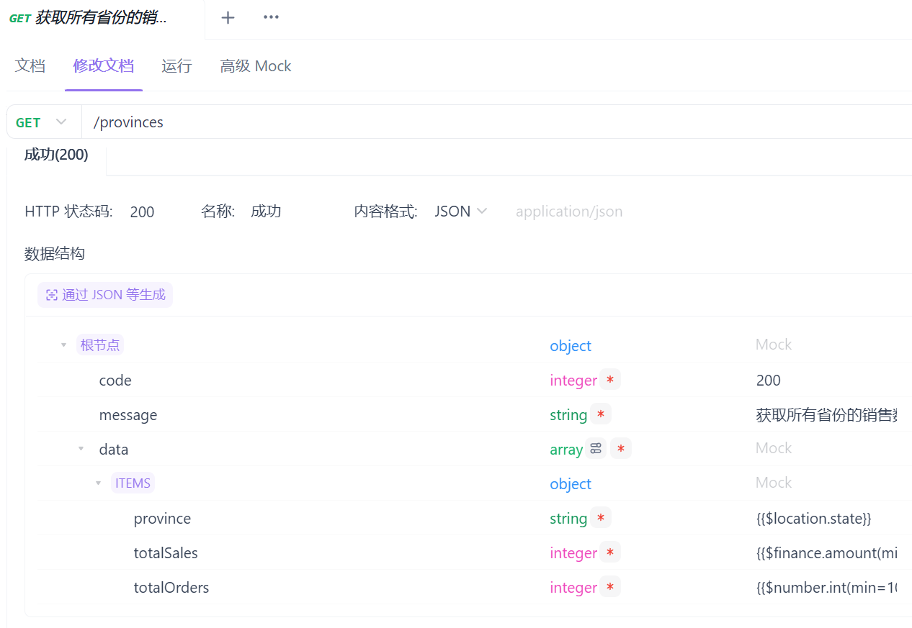
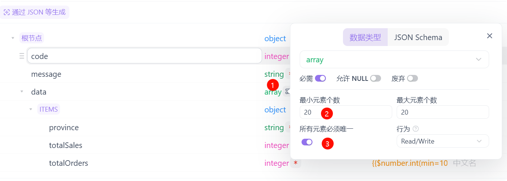
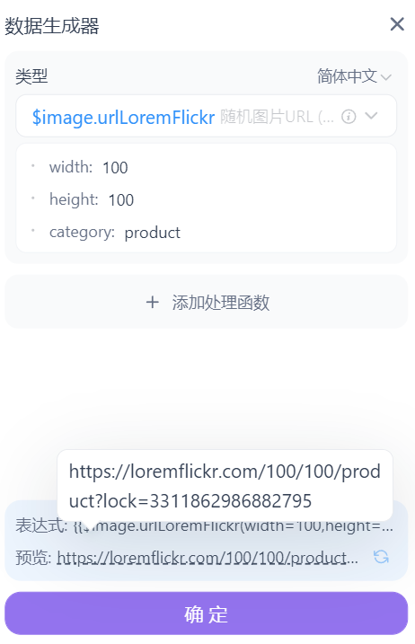
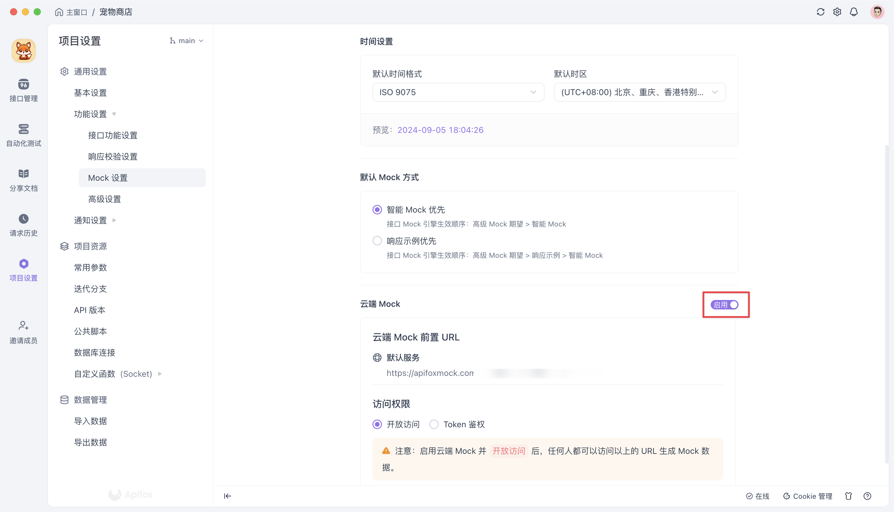

# API Mock

> **mock** 测试就是在测试过程中，对于某些不容易构造或者不容易获取的对象，用一个虚拟的对象来创建以便测试的测试方法。这个虚拟的对象就是mock对象。mock对象就是真实对象在调试期间的代替品。

## 什么是 API Mock？

  * 定义：模拟真实 API 行为的仿真程序。
  * 作用：在 API 开发过程中，用于前端开发、测试和演示等场景。

## API Mock 的优势

  * **并行开发：** 前后端可独立开发，无需等待对方完成。
  * **快速迭代：** 无需依赖真实 API 环境，加快开发速度。
  * **稳定性高：** 模拟数据可控，避免真实环境的不稳定因素影响。
  * **测试便捷：** 可模拟各种异常情况，方便进行全面测试。

## API Mock 的实现方式

  * **手动创建：** 使用代码或工具手动编写模拟数据和逻辑。
  * **基于 API 文档自动生成：** 根据 OpenAPI Specification (Swagger) 等文档自动生成 Mock Server。
  * **使用 Mock 平台：** 利用第三方平台提供的 Mock 服务。

## Mock.js

Mock.js 是一款前端开发中拦截`Ajax`请求再生成随机数据响应的工具。可以用来模拟服务器响应。优点是非常简单方便，无侵入性，基本覆盖常用的接口数据类型。详细使用可以参见[Mock文档](http://mockjs.com/examples.html)。

### 开始 & 安装

```js
npm install mockjs
```

### 使用 Mock

```js
// 使用 Mock
var Mock = require('mockjs')
var data = Mock.mock({
    // 属性 list 的值是一个数组，其中含有 1 到 10 个元素
    'list|1-10': [{
        // 属性 id 是一个自增数，起始值为 1，每次增 1
        'id|+1': 1
    }]
})
// 输出结果
console.log(JSON.stringify(data, null, 4))
```

## 使用Apifox Mock接口

[Mock 功能简介 | Apifox 帮助文档](https://apifox.com/help/api-mock/intro-to-mock)

入门知识上面的链接图文、视频并茂，我就不转载了，这里讲一个具体案例

### 接口设计

> 以下数据系Mock生成，用于模拟电商销售数据，数据之间无内在强逻辑关联

#### 获取所有省份的销售数据

```http
GET /provinces
```

https://apifoxmock.com/m1/2717-310532-default/provinces?apifoxToken=CwFn1yOwZv-T9zzDtw5B8

返回值示例

```json
{
    "code": 200,
    "message": "success",
    "data": [
        {
            "province": "广东省",
            "totalSales": 1000000,
            "totalOrders": 10000
        },
        {
            "province": "河南省",
            "totalSales": 1000000,
            "totalOrders": 10000
        }
    ]
}
```

#### 获取指定省份的销售数据

```http
GET /provinces/{provinceId}
```

https://apifoxmock.com/m1/2717-310532-default/provinces/1?apifoxToken=CwFn1yOwZv-T9zzDtw5B8

返回值示例

```json
{
    "code": 200,
    "message": "获取指定省份的销售数据成功",
    "data": {
        "categorySales": [
            {
                "category": "3C数码家电",
                "totalSales": 90,
                "totalOrders": 28
            },
            {
                "category": "母婴宠物",
                "totalSales": 51,
                "totalOrders": 31
            },
            {
                "category": "食品饮料",
                "totalSales": 86,
                "totalOrders": 88
            },
            {
                "category": "家居用品",
                "totalSales": 35,
                "totalOrders": 6
            }
        ]
    }
}
```

#### 获取指定省份和分类的销售数据

```http
GET /provinces/{provinceId}/categories/{categoryId}
```

https://apifoxmock.com/m1/2717-310532-default/provinces/1/categories/1?apifoxToken=CwFn1yOwZv-T9zzDtw5B8

返回值示例

```json
{
    "code": 200,
    "message": "获取指定省份和分类的销售数据成功",
    "data": {
        "totalSales": 95,
        "totalOrders": 18
    }
}
```

### 接口Mock

#### 获取所有省份的销售数据

打开设计好的接口，点击修改文档，可以先导入数据结构（通过JSON等生成）

```json
{
  "code": 200,
  "message": "success",
  "data": [
    {
      "province": "广东省",
      "totalSales": 1000000,
      "totalOrders": 10000
    },
    {
      "province": "河南省",
      "totalSales": 1000000,
      "totalOrders": 10000
    }
  ]
}
```

下面的数据结构就会自动生成



点击数据结构的每个属性中的Mock，依次设定，比如

* **code**：可以设置为固定值200，表示返回成功状态
* **data.province**：可以设置为`{{$location.state}}`（直接下拉框可以选择）、
* **data.totalSales**：可以设置为`{{$finance.amount(min=10000,max=100000)}}`
* **data.totalOrders**：可以设置为`{{$number.int(min=100,max=1000)}}`

需要注意的是**data**这里可以点击设定一次返回的个数等参数



#### 获取指定省份的销售数据

设计流程和上面基本一样，比较特别的是

* **data.categorySales.category**：可以设置为`{{$helpers.arrayElement(['本地生活','食品饮料','钟表配饰','服饰内衣','珠宝文玩','运动户外','家居用品','图书音像','玩具乐器','虚拟充值','生鲜','个护家清','农资绿植','美妆','二手闲置','礼品文创','鞋靴箱包','奢侈品','汽车整车','医疗健康','滋补保健','酒类'])}}`，这样可以显示的更加友好一些

如果我们仅仅需要普通的占位符图片，我们可以简单设置为：`{{$image.urlPlaceholder}}`

如果我们需要品类图片时，可以设定为：`{{$image.urlLoremFlickr(width=100,height=100,category='product')}}`



### 云端 Mock

云端 Mock 功能适用于团队内的共同协作场景。相对于本地 Mock 地址而言，云端 Mock 地址是一个固定的地址，团队内的其他成员可以通过这个地址访问到云端 Mock Server。

这对于复杂项目而言十分有用。因为该项目很有可能要求模拟出一些复杂的数据结构，并且可能有很多字段或需要遵循复杂的模式。如果让每位成员自行在本地启动 Mock Server，并且维护各自的 Mock 数据，这不仅十分繁琐而且也不利于 Mock 数据的统一管理。

云端 Mock 功能具备以下优势:

- **数据统一管理与共享**
- **一次配置，全团队可用**

[云端 Mock | Apifox 帮助文档](https://apifox.com/help/api-mock/cloud-mock)

