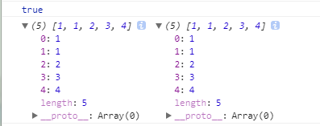
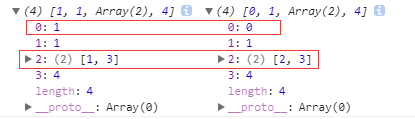
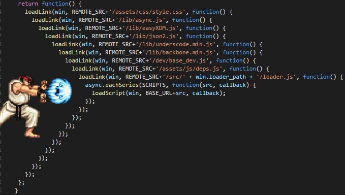

# ECMAScript 6 简介

ECMAScript 6.0（以下简称 ES6）是 JavaScript 语言的下一代标准，已经在 2015 年 6 月正式发布了。它的目标，是使得 JavaScript 语言可以用来编写复杂的大型应用程序，成为企业级开发语言。

## 课程简介

* ECMAScript 和 JavaScript 的关系
* ES6语法新特性
* ES6与模块化编程
* ES6与回调地狱

## ECMAScript 和 JavaScript 的关系

一个常见的问题是，ECMAScript 和 JavaScript 到底是什么关系

要讲清楚这个问题，需要回顾历史。1996 年 11 月，JavaScript 的创造者 Netscape 公司，决定将 JavaScript 提交给标准化组织 ECMA，希望这种语言能够成为国际标准。次年，ECMA 发布 262 号标准文件（ECMA-262）的第一版，规定了浏览器脚本语言的标准，并将这种语言称为 ECMAScript，这个版本就是 1.0 版。

:zap:该标准从一开始就是针对 JavaScript 语言制定的，但是之所以不叫 JavaScript，有两个原因。

* 一是商标，Java 是 Sun 公司的商标，根据授权协议，只有 Netscape 公司可以合法地使用 JavaScript 这个名字，且 JavaScript 本身也已经被 Netscape 公司注册为商标。
* 二是想体现这门语言的制定者是 ECMA，不是 Netscape，这样有利于保证这门语言的开放性和中立性。

> 因此，ECMAScript 和 JavaScript 的关系是，前者是后者的规格，后者是前者的一种实现（另外的 ECMAScript 方言还有 Jscript 和 ActionScript）。日常场合，这两个词是可以互换的。

## JavaScript历史


- **起源：**话说在上世纪末1995年，Netscape公司推出Navigator浏览器。Netscape非常有追求，不单单能实现静态HTML，人家还想要有动态效果，还想着能去处理表单的验证，不要老是等到后台那边才知道表单输入合不合法，特别在那个年代，一次一等就上分钟，现在我们等上个十秒都想关掉它是不是，嘴边还吐槽着什么破网站。
- **动手：**有目标就去做，Netscape公司大牛多，Brendan Eich （布兰登·艾奇）用10天就把JavaScript搞了出来，刚出来时叫LiveScript，为了蹭蹭当红明星Java热度，就改成JavaScript了，所以事实上他们两没啥关系。
- **竞争：**看到Netscape公司有了JavaScript，微软感觉不行啊，我的IE要被干掉啊，同时也感到JavaScript的前途无量，于是弄了个名为JScript的JavaScript的实现。
- **标准：** Netscape和微软竞争出现的JavaScript导致版本的不一致，随着业界的担心，JavaScript的标准化被提上议事日程。ECMA组织就去干这事，最后在弄出97年了`ECMAScript`作为标准。这里ECMAscript和JavaScript可以看做表达同一个东西
  - ES3，第三个版本，是对标准的第一次真正意义上修改
  - 2009年的ES5是当前各大流行浏览器所支持的
  - 2015年出版的ES6也流行起来。
  - 2015年后的每年也出版本，但浏览器还没能够支持。

**当程序员听客户说还在用 IE 时**（微软以制造不兼容闻名）


[微软放弃了IE,放弃了Edge,开始拥抱Chromium-虎嗅网](https://www.huxiu.com/article/275128.html) —— 微软教你2个王4个2怎么输

## Brendan Eich

1994年，网景公司(Netscape)发布了Navigator浏览器0.9版，这是世界上第一款比较成熟的网络浏览器，
轰动一时。此时，`34岁`的系统程序员Brendan Eich（布兰登·艾奇）登场了。1995年4月，网景公司录用了他。

仅仅一个月之后，1995年5月，网景公司做出决策，未来的网页脚本语言必须"看上去与Java足够相似"，但是比Java简单，使得非专业的 网页作者也能很快上手。 Brendan Eich被指定为这种"简化版Java语言"的设计师。

但是，他对`Java一点兴趣也没有`。为了应付公司安排的任务，`他只用10天时间就把Javascript设计出来了`。

由于设计时间太短，语言的一些细节考虑得不够严谨，导致后来很长一段时间，Javascript写出来的程序混乱不堪。如果Brendan Eich预见到，`未来这种语言会成为互联网第一大语言，全世界有几百万学习者`，他会不会多花一点时间呢?

总的来说，他的设计思路是这样的：

1. 借鉴C语言的基本语法;
2. 借鉴Java语言的数据类型和内存管理;
3. 借鉴Scheme语言，`将函数提升到"第一等公民"(first class)的地位`;
4. 借鉴Self语言，`使用基于原型prototype的继承机制`。

所以，Javascript语言实际上是两种语言风格的混合产物----`(简化的)函数式编程+(简化的)面向对象编程`。 这是由Brendan Eich(函数式编程)与网景公司(面向对象编程)共同决定的。

如果不是公司的决策，Brendan Eich绝不可能把Java作为Javascript设计的原型。作为设计者，他一点也不喜欢自己的这个作品：

> 与其说我爱Javascript，不如说我恨它。它是C语言和Self语言一夜情的产物。十八世纪英国文学家约翰逊博士说得好：**'它的优秀之处并非原创，它的原创之处并不优秀。**' (*the part that is good is not original, and the part that is original is not good.*)

## ECMAScript 6 入门
《ECMAScript 6 入门》是一本开源的 JavaScript 语言教程，全面介绍 ECMAScript 6 新引入的语法特性。
http://es6.ruanyifeng.com/

## ES6新特性

### 变量声明const和let

在ES6之前，我们都是用`var`关键字声明变量。无论声明在何处，都会被视为声明在**函数的最顶部**(不在函数内即在**全局作用域的最顶部**)。这就是函数**变量提升**例如:

```javascript
function aa() {
	if (flag) {
		var test = 'hello man'
	} else {
		console.log(test)
	}
}
```
以上的代码实际上是：

```javascript
function aa() {
	var test // 变量提升，函数最顶部
	if (flag) {
		test = 'hello man'
	} else {
		//此处访问 test 值为 undefined
		console.log(test)
	}
	//此处访问 test 值为 undefined
}
```

所以不用关心flag是否为 `true` or `false`。实际上，无论如何 test 都会被创建声明。

接下来ES6主角登场：
我们通常用 `let` 和 `const` 来声明，`let` 表示**变量**、`const` 表示**常量**。`let` 和 `const` 都是块级作用域。怎么理解这个块级作用域？

- 在一个函数内部
- 在一个代码块内部

> 说白了只要在**{}花括号内**的代码块即可以认为 `let` 和 `const` 的作用域。

看以下代码：

```javascript
function aa() {
	if (flag) {
		let test = 'hello man'
	} else {
		//test 在此处访问不到
		console.log(test)
	}
}
```

`let` 的作用域是在它所在当前代码块，但不会被提升到当前函数的最顶部。

再来说说 `const`
 `const` 声明的变量必须提供一个值，而且会被认为是常量，意思就是它的值被设置完成后就不能再修改了。

```javascript
const name = 'lux'
name = 'joe' // 再次赋值此时会报错
```

还有，如果 `const` 的是一个对象，对象所包含的值是可以被修改的。抽象一点儿说，就是对象所指向的地址不能改变，而变量成员是可以修改的。

```javascript
const student = { name: 'cc' }
// 没毛病
student.name = 'yy'
// 如果这样子就会报错了
student  = { name: 'yy' }
```

说说TDZ(暂时性死区)，想必你早有耳闻。

```javascript
{
    console.log(value) // 报错
    let value = 'lala'
}
```

我们都知道，JS引擎扫描代码时，如果发现变量声明，用 `var` 声明变量时会将声明提升到函数或全局作用域的顶部。但是 `let` 或者 `const`，会将声明关进一个小黑屋也是TDZ(暂时性死区)，只有执行到变量声明这句语句时，变量才会从小黑屋被放出来，才能安全使用这个变量。

```javascript
var funcs = []
for (var i = 0; i < 10; i++) {
	funcs.push(function() { console.log(i) })
}
funcs.forEach(function(func) {
	func()
})
```

这样的代码是大家很常见，很多同学一看就知道输出十次10
但是如果我们想依次输出0到9呢？
有两种解决方法，直接看一下代码：

```javascript
// ES5知识，我们可以利用“立即调用函数”解决这个问题
var funcs = []
for (var i = 0; i < 10; i++) {
	funcs.push(
		(function(value) {
			return function() {
				console.log(value)
			}
		})(i))
}
funcs.forEach(function(func) {
	func()
})
```

```javascript
// 再来看看es6怎么处理的
const funcs = []
for (let i = 0; i < 10; i++) {
	funcs.push(function() {
		console.log(i)
	})
}
funcs.forEach(func => func())
```

达到相同的效果，ES6 简洁的解决方案是不是更让你心动！！！

### 字符串

先聊聊模板字符串
ES6模板字符简直是开发者的福音啊，解决了 ES5 在字符串功能上的痛点。

第一个用途，基本的字符串格式化。将表达式嵌入字符串中进行拼接。用`${}`来界定。

```javascript
//ES5 
var name = 'lux'
console.log('hello' + name)
```

```javascript
//es6
const name = 'lux'
console.log(`hello ${name}`) //hello lux
```

第二个用途，在ES5时我们通过反斜杠`\`来做多行字符串或者字符串一行行拼接。ES6反引号`(``)`直接搞定。

```javascript
// ES5
var msg = "Hi \
man!
"
// ES6
const template = `<div>
    <span>hello world</span>
</div>`
```

对于字符串 ES6+ 当然也提供了很多厉害也很有意思的方法，说几个常用的。

```javascript
// 1.includes：判断是否包含然后直接返回布尔值
const str = 'hahay'
console.log(str.includes('y')) // true
```

```javascript
// 2.repeat: 获取字符串重复n次
const str = 'he'
console.log(str.repeat(3)) // 'hehehe'
//如果你带入小数, Math.floor(num) 来处理
// s.repeat(3.1) 或者 s.repeat(3.9) 都当做成 s.repeat(3) 来处理
```

```javascript
// 3. startsWith 和 endsWith 判断是否以 给定文本 开始或者结束
const str = 'hello world!'
console.log(str.startsWith('hello')) // true
console.log(str.endsWith('!')) // true
```

```javascript
// 4. padStart 和 padEnd 填充字符串，应用场景：时分秒
setInterval(() => {
	const now = new Date()
	const hours = now.getHours().toString()
	const minutes = now.getMinutes().toString()
	const seconds = now.getSeconds().toString()
	console.log(`${hours.padStart(2, 0)}:${minutes.padStart(2, 0)}:${seconds.padStart(2, 0)}`)
}, 1000)
```

### 函数

#### 函数默认参数

在ES5我们给函数定义参数默认值是怎么样？

```javascript
function action(num) {
	num = num || 200
	//当传入num时，num为传入的值
	//当没传入参数时，num即有了默认值200
	return num
}
```

但细心观察的同学们肯定会发现，num传入为0的时候就是false，但是我们实际的需求就是要拿到num = 0，此时num = 200 明显与我们的实际想要的效果明显不一样

ES6为参数提供了默认值。在定义函数时便初始化了这个参数，以便在参数没有被传递进去时使用。

```javascript
function action(num = 200) {
	console.log(num)
}
action(0) // 0
action() //200
action(300) //300
```

#### 箭头函数

ES6很有意思的一部分就是函数的快捷写法。也就是箭头函数。

箭头函数最直观的三个特点。

- 不需要 `function` 关键字来创建函数
- 省略 `return` 关键字
- 继承当前上下文的 `this` 关键字

```javascript
//例如：
[1, 2, 3].map(x => x + 1)
//等同于：
[1, 2, 3].map((function(x) {
	return x + 1
}).bind(this))
```

#### 简写

当你的函数**有且仅有**一个参数的时候，是可以省略掉括号的。当你函数返回**有且仅有**一个表达式的时候可以省略{} 和 return；例如:

```javascript
var people = name => 'hello' + name
//参数name就没有括号
```

作为参考

```javascript
var people = (name, age) => {
	const fullName = 'hello' + name
	return fullName
}
//如果缺少()或者{}就会报错
```

如果箭头函数的代码块部分多于一条语句，就要使用大括号将它们括起来，并且使用`return`语句返回。

```javascript
var sum = (num1, num2) => { return num1 + num2; }
```

由于大括号被解释为代码块，所以如果箭头函数直接返回一个对象，必须在对象外面加上括号。

```javascript
var getTempItem = id => ({ id: id, name: "Temp" });
```

> :zap: 请注意，当箭头函数中表达式部分为语句块的时候，箭头函数并不会自动地返回一个值，需要手动加上return 语句。 
> 当使用箭头函数来创建一个对象的时候的时候，要用括号将对象括起来： 
>
> 很不幸，空对象和空的语句块`{}`看起来是一样的。ES6规定，紧跟箭头函数中箭头符号后面的`{`会被解析成语句块的开始， 而不是一个空对象。

```javascript
var calculate = function(x, y, z) {
	if (typeof x != 'number') {
		x = 0
	}
	if (typeof y != 'number') {
		y = 6
	}
	var dwt = x % y
	var result
	if (dwt == z) {
		result = true
	}
	if (dwt != z) {
		result = false
	}
	return result
}
```

使用ES6重构代码

```javascript
// 请使用ES6重构以下代码
const calculate = (x, y, z) => {
	x = typeof x !== 'number' ? 0 : x
	y = typeof y !== 'number' ? 6 : y
	return x % y === z
}
```

### 拓展的对象功能

对象初始化简写

ES5我们对于对象都是以**键值对**的形式书写，是有可能出现键值对重名的。例如：

```javascript
function people(name, age) {
	return {
		name: name,
		age: age
	};
}
```

键值对重名，ES6可以简写如下：

```javascript
function people(name, age) {
	return {
		name,
		age
	};
}
```

ES6 同样改进了为对象字面量方法赋值的语法。ES5为对象添加方法：

```javascript
const people = {
	name: 'lux',
	getName: function() {
		console.log(this.name)
	}
}
```

ES6通过省略冒号与 `function` 关键字，将这个语法变得更简洁

```javascript
const people = {
	name: 'lux',
	getName() {
		console.log(this.name)
	}
}
```

ES6 对象提供了 `Object.assign()`这个方法来实现`浅复制`。
 `Object.assign()` 可以把任意多个源对象自身可枚举的属性拷贝给目标对象，然后返回目标对象。第一参数即为目标对象。在实际项目中，我们为了不改变源对象。一般会把目标对象传为{}

```javascript
const objA = {
	name: 'cc',
	age: 18
}
const objB = {
	address: 'beijing'
}
const objC = {} // 这个为目标对象
const obj = Object.assign(objC, objA, objB)
// 我们将 objA objB objC obj 分别输出看看
console.log(objA) // { name: 'cc', age: 18 }
console.log(objB) // { address: 'beijing' }
console.log(objC) // { name: 'cc', age: 18, address: 'beijing' }
console.log(obj) // { name: 'cc', age: 18, address: 'beijing' }
// 是的，目标对象ObjC的值被改变了。
// so，如果objC也是你的一个源对象的话。请在objC前面填在一个目标对象{}
Object.assign({}, objC, objA, objB)
```

### 解构

数组和对象是JS中最常用也是最重要表示形式。为了简化提取信息，ES6新增了**解构**，这是将一个数据结构分解为更小的部分的过程

ES5我们提取对象中的信息形式如下：

```javascript
const people = {
	name: 'lux',
	age: 20
}
const name = people.name
const age = people.age
console.log(name + ' --- ' + age)
```

是不是觉得很熟悉，没错，在ES6之前我们就是这样获取对象信息的，一个一个获取。现在，解构能让我们从对象或者数组里取出数据存为变量，例如

```javascript
//对象
const people = {
	name: 'lux',
	age: 20
}
const {
	name,
	age
} = people
console.log(`${name} --- ${age}`)
//数组
const color = ['red', 'blue']
const [first, second] = color
console.log(first) //'red'
console.log(second) //'blue'
```

可以看看下面的ES6重构代码

```javascript
// 请使用 ES6 重构一下代码
// 第一题
var jsonParse = require('body-parser').jsonParse
// 第二题
var body = request.body
var username = body.username
var password = body.password
// 1.
import {
	jsonParse
} from 'body-parser'
// 2. 
const {
	body,
	body: {
		username,
		password
	}
} = request
```

### Spread Operator 展开运算符

ES6中另外一个好玩的特性就是Spread Operator 也是三个点儿`...`接下来就展示一下它的用途。

组装对象或者数组

```javascript
//数组
const color = ['red', 'yellow']
const colorful = [...color, 'green', 'pink']
console.log(colorful) //[red, yellow, green, pink]
//对象
const alp = {
	fist: 'a',
	second: 'b'
}
const alphabets = { ...alp,
	third: 'c'
}
console.log(alphabets) //{ "fist": "a", "second": "b", "third": "c"}
```

有时候我们想获取数组或者对象除了前几项或者除了某几项的其他项

```javascript
//数组
const number = [1, 2, 3, 4, 5]
const [first, ...rest] = number
console.log(rest) //2,3,4,5
//对象
const user = {
	username: 'lux',
	gender: 'female',
	age: 19,
	address: 'peking'
}
const {
	username,
	...restUser
} = user
console.log(restUser) //{"address": "peking", "age": 19, "gender": "female"}
```

对于 Object 而言，还可以用于组合成新的 Object 。(ES2017 stage-2 proposal) 当然如果有重复的属性名，右边覆盖左边

```javascript
 const first = {
 	a: 1,
 	b: 2,
 	c: 6,
 }
 const second = {
 	c: 3,
 	d: 4
 }
 const total = { ...first,
 	...second
 }
 console.log(total) // { a: 1, b: 2, c: 3, d: 4 }
```

## 深拷贝与浅拷贝

如何区分深拷贝与浅拷贝，简单点来说，就是假设B复制了A，当修改A时，看B是否会发生变化，如果B也跟着变了，说明这是浅拷贝，拿人手短，如果B没变，那就是深拷贝，自食其力。 

```javascript
let a=[0,1,2,3,4],
	b=a;
console.log(a===b);
a[0]=1;
console.log(a,b);
```




> 嗯？明明b复制了a，为啥修改数组a，数组b也跟着变了，这就是浅拷贝

**我们怎么去实现深拷贝呢，这里可以递归递归去复制所有层级属性。**

这么我们封装一个深拷贝的函数(PS：只是一个基本实现的展示，并非最佳实践)

```javascript
function deepClone(obj){
    let objClone = Array.isArray(obj)?[]:{};
    if(obj && typeof obj==="object"){
        for(key in obj){
            if(obj.hasOwnProperty(key)){
                //判断ojb子元素是否为对象，如果是，递归复制
                if(obj[key]&&typeof obj[key] ==="object"){
                    objClone[key] = deepClone(obj[key]);
                }else{
                    //如果不是，简单复制
                    objClone[key] = obj[key];
                }
            }
        }
    }
    return objClone;
}    
let a=[1,2,3,4],
    b=deepClone(a);
a[0]=2;
console.log(a,b);
```

可以看到


跟之前想象的一样，现在b脱离了a的控制，不再受a影响了。

**除了递归，我们还可以借用JSON对象的parse和stringify**

```javascript
function deepClone(obj){
    let _obj = JSON.stringify(obj),
        objClone = JSON.parse(_obj);
    return objClone
}    
let a=[0,1,[2,3],4],
	b=deepClone(a);
a[0]=1;
a[2][0]=1;
console.log(a,b);
```



> 1. 对于字符串类型，浅复制是对值的复制
> 2. 对于对象来说，**浅复制是对对象地址的复制**，并没有开辟新的栈，也就是复制的结果是两个对象指向同一个地址，修改其中一个对象的属性，则另一个对象的属性也会改变
> 3. **而深复制则是开辟新的栈**，两个对象对应两个不同的地址，修改一个对象的属性，不会改变另一个对象的属性

## 回调

### Promise

   > 在promise之前代码过多的回调或者嵌套，可读性差、耦合度高、扩展性低。通过Promise机制，扁平化的代码机构，大大提高了代码可读性；用同步编程的方式来编写异步代码，保存线性的代码逻辑，极大的降低了代码耦合性而提高了程序的可扩展性。
   >
   > **回调地狱**
   >
   > * 文本文件读取关键字
   > * 数据库中查询关键字数量
   > * 调用接口（用count做参数）
   >
   > ```javascript
   > fs.readFile('./sample.txt', 'utf-8', (err, content) => {
   >     let keyword = content.substring(0, 5);
   >     db.find(`select * from sample where kw = ${keyword}`, (err, res) => {
   >         get(`/sampleget?count=${res.length}`, data => {
   >            console.log(data);
   >         });
   >     });
   > });
   > ```
   >
   > 

Promise说白了就是用同步的方式去写异步代码。成功`resolve`，异常`reject` 

   ```javascript
function takeLongTime(n) {
    return new Promise(resolve => {
        setTimeout(() => resolve(n + 200), n);
    });
}

function step1(n) {
    console.log(`step1 with ${n}`);
    return takeLongTime(n);
}

function step2(n) {
    console.log(`step2 with ${n}`);
    return takeLongTime(n);
}

function step3(n) {
    console.log(`step3 with ${n}`);
    return takeLongTime(n);
}

// Promise方式
function doIt() {
    console.time("doIt");
    const time1 = 300;
    step1(time1)
        .then(time2 => step2(time2))
        .then(time3 => step3(time3))
        .then(result => {
            console.log(`result is ${result}`);
            console.timeEnd("doIt");
        });
}
doIt();
// 发起异步请求
fetch('/api/todos')
    .then(res => res.json())
    .then(data => ({data}))
    .catch(err => ({err}));
   ```

定义Promise方法举例：callLoginApi

```javascript
callLoginApi(dataLogin) {
  return new Promise((resolve, reject) =>
    request.post(
      {
        url: domain + 'api/users/login',
        form: dataLogin
      },
      (err, response, body) => {
        if (err) {
          reject(err)
        } else {
          resolve(JSON.parse(body))
        }
      }
    )
  )
}
```

### async/await

> async/await是ES7的语法

JavaScript 中的 async/await 是 [AsyncFunction 特性](https://developer.mozilla.org/docs/Web/JavaScript/Reference/Global_Objects/AsyncFunction) 中的关键字。

#### async

async起什么作用，这个问题的关键在于，async函数是怎么处理它的返回值的！

```javascript
async function testAsync() {
    return "hello async";
}

const result = testAsync();
console.log(result);
```

看到输出就恍然大悟了——输出的是一个 Promise 对象。

```sh
c:\var\test> node --harmony_async_await .
Promise { 'hello async' }
```

既然`async`返回的是一个`Promise` 对象，那么`Promise` 的所有用法他都可以用

#### await

`await`即等待，用于等待一个`Promise`对象。它只能在异步函数 `async function`中使用，否则会报错
 它的返回值不是`Promise`对象而是`Promise`对象处理之后的结果。

`await`表达式会暂停当前 `async function`的执行，等待`Promise` 处理完成。

若 `Promise` 正常处理`(fulfilled)`，其回调的`resolve`函数参数作为 `await` 表达式的值，继续执行 `async function`，若 `Promise` 处理异常`(rejected)`，`await` 表达式会把 `Promise` 的异常原因抛出。

如果 `await` 操作符后的表达式的值不是一个 `Promise`，那么该值将被转换为一个已正常处理的 `Promise`。

与Promise对比

```javascript
function takeLongTime(n) {
    return new Promise(resolve => {
        setTimeout(() => resolve(n + 200), n);
    });
}

function step1(n) {
    console.log(`step1 with ${n}`);
    return takeLongTime(n);
}

function step2(n) {
    console.log(`step2 with ${n}`);
    return takeLongTime(n);
}

function step3(n) {
    console.log(`step3 with ${n}`);
    return takeLongTime(n);
}

// Promise方式
function doIt() {
    console.time("doIt");
    const time1 = 300;
    step1(time1)
        .then(time2 => step2(time2))
        .then(time3 => step3(time3))
        .then(result => {
            console.log(`result is ${result}`);
            console.timeEnd("doIt");
        });
}

doIt();

// async await方式
async function doIt() {
    console.time("doIt");
    const time1 = 300;
    const time2 = await step1(time1);
    const time3 = await step2(time2);
    const result = await step3(time3);
    console.log(`result is ${result}`);
    console.timeEnd("doIt");
}
doIt();
```

### Promise.all

`Promise.all()` 会等待所有传入的 `Promise` 都完成（无论成功或失败），然后返回一个新的 `Promise`，该 `Promise` 的结果是所有输入 `Promise` 的结果集合。

- **成功**：如果所有 `Promise` 都成功，`Promise.all()` 返回的 `Promise` 状态为 **fulfilled**，返回值是一个包含每个 `Promise` 结果的数组。
- **失败**：如果其中任何一个 `Promise` 失败（**rejected**），`Promise.all()` 会立即返回一个 **rejected** 的新 `Promise`，并以第一个失败的 `Promise` 的原因作为返回值，其他 `Promise` 的状态将不再被考虑。

Promise.all 的优势：

* **提高效率**： 可以并行处理多个异步操作，不需要等待一个操作完成后再进行下一个。
* **代码简洁**： 相比于使用嵌套的回调函数，Promise.all 可以使代码更易读和维护。

以一个需求为例：获取给定目录下的全部文件，返回所有文件的路径数组。

#### 方案一

```js
import path from 'node:path'
import fs from 'node:fs/promises'
import { existsSync } from 'node:fs'

async function findFiles(root) {
    if (!existsSync(root)) return
    
    const rootStat = await fs.stat(root)
    if (rootStat.isFile()) return [root]

    const result = []
    const find = async (dir) => {
        const files = await fs.readdir(dir)
        for (let file of files) {
            file = path.resolve(dir, file)
            const stat = await fs.stat(file)
            if (stat.isFile()) {
                result.push(file)
            } else if (stat.isDirectory()) {
                await find(file)
            }
        }
    }
    await find(root)
    return result
}
```

我们递归查询子目录的过程是不需要等待上一个结果的，但是第 20 行代码 `await find(file)`，只有查询完一个子目录之后才会查询下一个，显然让并发的异步，变成了顺序的“同步”执行。

那我们去掉 20 行的 `await` 是不是就可以了，当然不行，这样的话 `await find(root)` 在没有完全遍历目录之前就会立刻返回，我们无法拿到正确的结果。

#### 方案二

```js
import path from 'node:path'
import fs from 'node:fs/promises'
import { existsSync } from 'node:fs'

async function findFiles(root) {
    if (!existsSync(root)) return
    
    const rootStat = await fs.stat(root)
    if (rootStat.isFile()) return [root]

    const result = []
    const find = async (dir) => {
        const task = (await fs.readdir(dir)).map(async (file) => {
            file = path.resolve(dir, file)
            const stat = await fs.stat(file)
            if (stat.isFile()) {
                result.push(file)
            } else if (stat.isDirectory()) {
                await find(file)
            }
        })
        return Promise.all(task)
    }
    await find(root)
    return result
}
```

我们把每个子目录内容的查询作为独立的任务，扔给 `Promise.all` 执行，就是这个简单的改动，性能得到了质的提升

### Promise.race()

`Promise.race()` 的行为则不同，它只关心哪一个 `Promise` 首先完成（无论是成功还是失败），然后立即返回该 `Promise` 的结果，忽略其他未完成的 `Promise`。

- **成功或失败**：无论是成功（**fulfilled**）还是失败（**rejected**），`Promise.race()` 都会返回第一个完成的 `Promise`，其他 `Promise` 的状态将被忽略。

`Promise.race()` 常用于希望某个操作在一组异步任务中率先完成时即可继续后续操作的场景，比如请求超时处理，或者希望第一个响应的任务即被处理的情况。

我们可以使用 `Promise.race()` 来在网络请求超时时返回错误，而不是无限等待。

一个完整的例子，从S3中获取文件，`getPromise`和`timeoutPromise`使用`Promise.race`处理

```js
const getFileByCompany = async(companyUuid, key, timeout = 30000) => {
  const bucketName = `${companyUuid}`
  let ret = ''
  let id = null
  try {
    const getPromise = s3Client.send(new GetObjectCommand({ Bucket: bucketName, Key: key }))
    const timeoutPromise = new Promise((resolve, reject) => {
      id = setTimeout(() => {
        clearTimeout(id)
        reject(new Error('Request timed out'))
      }, timeout)
    })
    const data = await Promise.race([getPromise, timeoutPromise])
    if (id) {
      clearTimeout(id)
    }
    const stream = data.Body
    ret = await new Promise((resolve, reject) => {
      const chunks = []
      stream.on('data', chunk => chunks.push(chunk))
      stream.on('end', () => resolve(Buffer.concat(chunks).toString('utf8')))
      stream.on('error', error => reject(error))
    })
  } catch (err) {
    if (id) {
      clearTimeout(id)
    }
    console.error('Error', err)
    ret = null
  }

  return ret
}
```

## 模块化

### 模块的规范

因为有了模块，我们就可以更方便地使用别人的代码，想要什么功能，就加载什么模块。

目前，通行的Javascript模块规范共有两种：[CommonJS](http://wiki.commonjs.org/wiki/Modules/1.1)和[AMD](https://github.com/amdjs/amdjs-api/wiki/AMD)。

#### CommonJS

2009年，美国程序员Ryan Dahl创造了[node.js](http://nodejs.org/)项目，将javascript语言用于服务器端编程。node.js的模块系统，就是参照[CommonJS](http://wiki.commonjs.org/wiki/Modules/1.1)规范实现的。在CommonJS中，有一个全局性方法require()，用于加载模块。假定有一个数学模块math.js，就可以像下面这样加载。

```javascript
var math = require('math');
math.add(2,3);
```

#### 浏览器环境

有了服务器端模块以后，很自然地，大家就想要客户端模块。而且最好两者能够兼容，一个模块不用修改，在服务器和浏览器都可以运行。

但是，由于一个重大的局限，使得CommonJS规范不适用于浏览器环境。还是上一节的代码，如果在浏览器中运行，会有一个很大的问题，你能看出来吗？

```javascript
var math = require('math');
math.add(2, 3);
```

第二行math.add(2, 3)，在第一行require('math')之后运行，因此必须等math.js加载完成。也就是说，如果加载时间很长，整个应用就会停在那里等。

这对服务器端不是一个问题，因为所有的模块都存放在本地硬盘，可以同步加载完成，等待时间就是硬盘的读取时间。但是，对于浏览器，这却是一个大问题，因为模块都放在服务器端，等待时间取决于网速的快慢，可能要等很长时间，浏览器处于"假死"状态。

因此，浏览器端的模块，不能采用"同步加载"（synchronous），只能采用"异步加载"（asynchronous）。这就是AMD规范诞生的背景。

#### AMD

[AMD](https://github.com/amdjs/amdjs-api/wiki/AMD)是"Asynchronous Module Definition"的缩写，意思就是"异步模块定义"。它采用异步方式加载模块，模块的加载不影响它后面语句的运行。所有依赖这个模块的语句，都定义在一个回调函数中，等到加载完成之后，这个回调函数才会运行。

AMD也采用require()语句加载模块，但是不同于CommonJS，它要求两个参数：

```javascript
require([module], callback);
```

第一个参数[module]，是一个数组，里面的成员就是要加载的模块；第二个参数callback，则是加载成功之后的回调函数。如果将前面的代码改写成AMD形式，就是下面这样：

```javascript
require(['math'], function (math) {
    math.add(2, 3);
});
```

math.add()与math模块加载不是同步的，浏览器不会发生假死。所以很显然，AMD比较适合浏览器环境。

### import 和 export

node编程中最重要的思想就是模块化，`import`和`require`都是被模块化所使用。

#### 遵循规范

- `require` 是 AMD规范引入方式
- `import`是es6的一个语法标准，如果要兼容浏览器的话必须转化成es5的语法

#### 调用时间

- require是运行时调用，所以require理论上可以运用在代码的任何地方
- import是编译时调用，所以必须放在文件开头

#### 本质

- require是赋值过程，其实require的结果就是对象、数字、字符串、函数等，再把require的结果赋值给某个变量
- import是解构过程，但是目前所有的引擎都还没有实现import，我们在node中使用babel支持ES6，也仅仅是将ES6转码为ES5再执行，import语法会被转码为require

#### 举例

import导入模块、export导出模块

```javascript
//全部导入
import people from './example'
//有一种特殊情况，即允许你将整个模块当作单一对象进行导入
//该模块的所有导出都会作为对象的属性存在
import * as example from "./example.js"
console.log(example.name)
console.log(example.age)
console.log(example.getName())
//导入部分
import {
	name,
	age
} from './example'
// 导出默认, 有且只有一个默认
export default App
// 部分导出
export class App extend Component {};
```

导入的时候有没有大括号的区别是什么：

1. 当用`export default people`导出时，就用 `import people` 导入（不带大括号）
2. 一个文件里，有且只能有一个`export default`。但可以有多个`export`。
3. 当用`export name` 时，就用`import { name }`导入（记得带上大括号）
4. 当一个文件里，既有一个`export default people`, 又有多个`export name` 或者 `export age`时，导入就用 `import people, { name, age }` 
5. 当一个文件里出现n多个 export 导出很多模块，导入时除了一个一个导入，也可以用`import * as example`

#### webpack 与 babel 在模块化中的作用

自从使用了 es6 的模块系统后，各种地方愉快地使用 `import` 、 `export default`，但也会在老项目中看到使用commonjs规范的 `require`、 `module.exports`。甚至有时候也会常常看到两者互用的场景。

原因是webpack 本身维护了一套模块系统，这套模块系统兼容了所有前端历史进程下的模块规范，包括 `amd` `commonjs` `es6` 等

webpack 的模块化方案已经很好的将es6 模块化转换成 webpack 的模块化，但是其余的 es6 语法还需要做兼容性处理。babel 专门用于处理 es6 转换 es5。当然这也包括 es6 的模块语法的转换。

其实两者的转换思路差不多，区别在于 webpack 的原生转换可以多做一步静态分析，使用tree-shaking 技术

babel 能提前将 es6 的 import 等模块关键字转换成 commonjs 的规范。这样 webpack 就无需再做处理，直接使用 webpack 运行时定义的 `__webpack_require__` 处理。如下面例子的展示：

es6 的导出模块写法有

```cpp
export default 123;
export const a = 123;
const b = 3;
const c = 4;
export { b, c };
```

babel 会将这些统统转换成 commonjs 的 exports。

```ini
exports.default = 123;
exports.a = 123;
exports.b = 3;
exports.c = 4;
exports.__esModule = true;
```

> 说白了import是编译时调用，而webpack 与 babel 都是编译打包工具，它们能把import等模块关键字转换成 commonjs 的规范。

* [import、require、export、module.exports 混合使用详解 - 较瘦 - 博客园 (cnblogs.com)](https://www.cnblogs.com/jiaoshou/p/15988575.html)

## 面向对象

### ES6原生Class

#### ES5之前定义构造函数的常见方法

```javascript
// 先定义一个函数，强行叫它构造函数，大写的P也不是必须的，只是约定俗成
function Point(x, y) {
  this.x = x; // 构造函数的属性都定义在函数内部
  this.y = y; // this指向实例对象
}

// 构造函数的方法都定义在构造函数的原型上
Point.prototype.toString = function () {
  return '(' + this.x + ', ' + this.y + ')';
};

// new 一个对象，就OK了
var p = new Point(1, 2);
```

#### ES6定义类的常见方法

由于要兼容过去的构造函数写法，所以ES6的类其实就是语法糖，它的绝大部分功能，ES5都可以做到，新的class写法只是让对象原型的写法更加清晰、更像面向对象编程的语法而已。上面的代码用ES6的class改写，就是：

```javascript
//定义类
class Point {
  constructor(x, y) { // 定义构造方法
    this.x = x; // this指向实例对象
    this.y = y;
  }

  toString() { // 定义一个方法，注意这里没有function关键字
    return '(' + this.x + ', ' + this.y + ')'; // this指向实例对象
  }
}
```

class就是function的另一种写法，本质还是function

```javascript
class Point {
}

typeof Point // "function" 类的数据类型就是函数
Point === Point.prototype.constructor // true 类本身就指向构造函数
```

### ES6的继承

#### ES5寄生组合式继承

ES5诞生了很多继承方式，主要有原型链继承、借用构造函数、组合式继承、寄生式继承和寄生组合式继承。其中寄生组合式继承是最优，代码如下：

```javascript
//父类
function Phone(brand, price) {
  this.brand = brand
  this.price = price
}
//父类原型方法
Phone.prototype.call = function () {
  console.log('我可以打电话！')
}
Phone.prototype.message = function () {
  console.log('我可以发短信！')
}
//子类
function SmartPhone(brand, price, color, size) {
  // 1.借用构造函数：继承父类的实例属性；
  Phone.call(this, brand, price)
  this.color = color
  this.size = size
}
// 2.寄生式继承：将父类原型的副本强制赋值给子类原型，实现继承父类的原型方法。
inheritPrototype(SmartPhone, Phone)

SmartPhone.prototype.message = function () {
  console.log('我可以自由推送信息！')
}

SmartPhone.prototype.photo = function () {
  console.log('我可以拍照！')
}

SmartPhone.prototype.game = function () {
  console.log('我可以玩游戏！')
}

function inheritPrototype(subType, superType) {
  // 创建父类原型的副本
  var prototype = Object(superType.prototype)
  // 将该副本的constructor属性指向子类
  prototype.constructor = subType
  // 将子类的原型属性指向副本
  subType.prototype = prototype
}

var phone = new SmartPhone('小米', 1999, '黑色', '5.15inch')
phone.call()
phone.message()
phone.photo()
console.log(phone.brand)
```

因为ES5条件有限，不支持直接操作`[[Prototype]]`，所以只能通过创建原型对象的副本这样别扭的方式实现。而且最终也没实现静态属性的继承。

#### ES6中使用extends关键字实现继承

```javascript
class subType extends superType{
    ...
}
```

与ES5的继承，子类创建自己的this，然后父类对其加工不同，es6的继承原理是，继承父类的this，并在此基础上进行修改。因此，实现继承必须要在constructor中调用父类的构造函数，super

```javascript
class subType extends superType{
    constructor(){
        super();
        ...
    }
}
```

如果子类没有定义constructor函数，那么将默认添加这个方法。

下面是es6的代码：

```javascript
// ES6class类继承
class Phone {
  constructor(brand, price) {
    this.brand = brand
    this.price = price
  }
  call() {
    console.log('我可以打电话！')
  }
  message() {
    console.log('我可以发短信！')
  }
}
class SmartPhone extends Phone {
  // 构造函数
  constructor(brand, price, color, size) {
    super(brand, price) // 调用父类构造函数
    this.color = color
    this.size = size
  }
  message() {
    console.log('我可以自由推送信息！')
  }
  photo() {
    console.log('我可以拍照！')
  }
  game() {
    console.log('我可以玩游戏！')
  }
}
const phone = new SmartPhone('小米', 1999, '黑色', '5.15inch')
phone.call()
phone.message()
phone.photo()
console.log(phone.brand)
```

1. extends继承父类（原型上的一些方法）。
2. super调用父级构造方法。
3. 子类对父类同名方法重写，直接覆盖就无法获取到父类的同名方法了。
4. 在class上写的方法实际上是在原型对象上面，构造函数中的属性，依然会成为子对象的自有属性。
5. 多个实例共用的属性应该怎么设置呢？这就需要用到静态成员，加static关键字，当然获取的时候也只能通过类名去获取。
6. 构造函数统一更名为contructor，也就是new时就会自动调用的方法。

## 参考文献

* 参考文章：https://www.jianshu.com/p/287e0bb867ae
