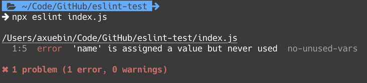
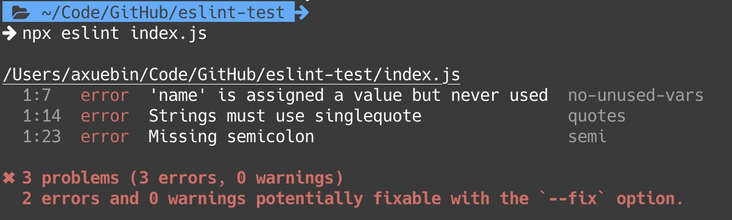
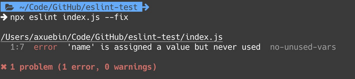
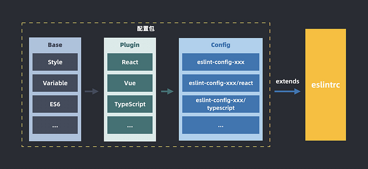
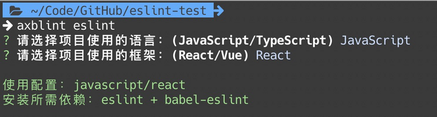
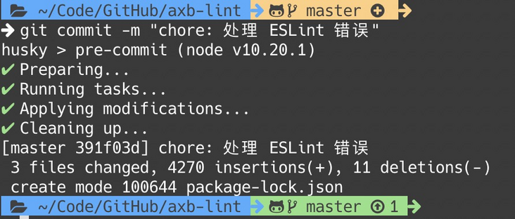
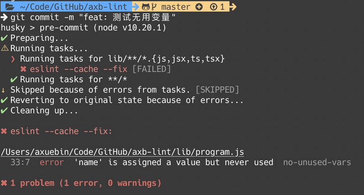
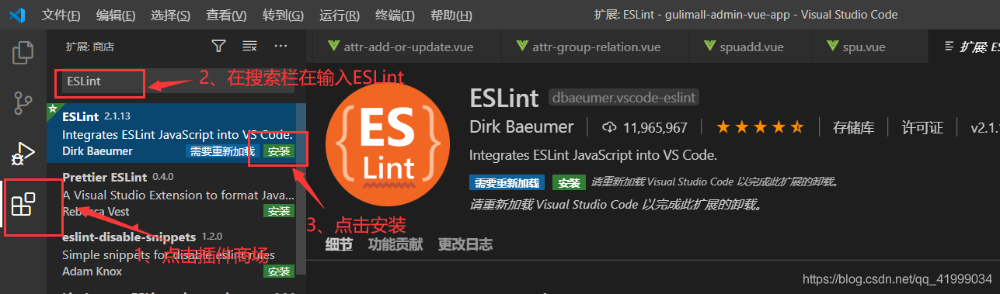
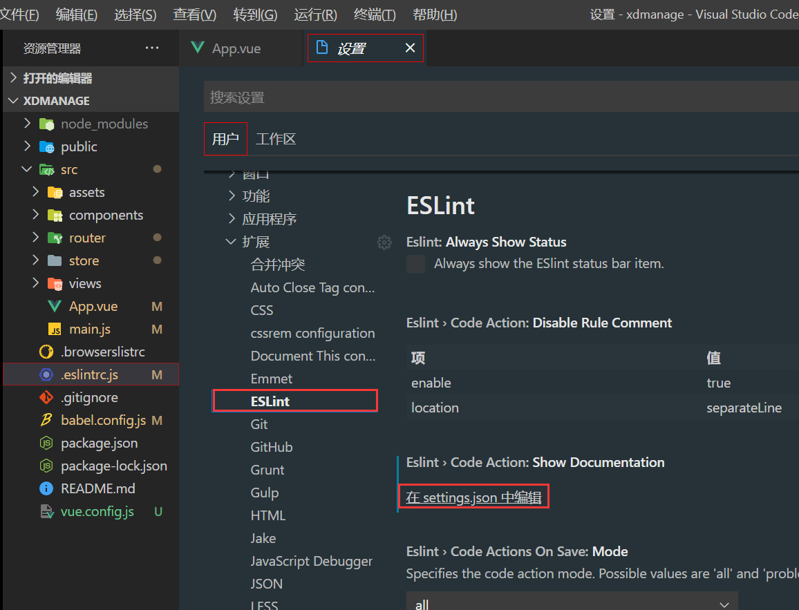

# ESLint

> There are a thousand Hamlets in a thousand people's eyes.

一千个程序员，就有一千种代码风格。在前端开发中，有几个至今还在争论的代码风格差异：

- 单引号还是双引号？
- 代码行结束是否需要分号？
- 两个空格还是四个空格？
- ...

这几个代码风格差异在协同开发中经常会被互相吐槽，甚至不能忍受。

除此之外，由于 JavaScript 的灵活性，往往一段代码能有多种写法，这时候也会导致协同时差异。并且，有一些写法可能会导致不易发现的 bug，或者这些写法的性能不好，开发时也应该避免。

为了解决这类静态代码问题，每个团队都需要一个统一的 JavaScript 代码规范，团队成员都遵守这份代码规范来编写代码。当然，靠人来保障代码规范是不可靠的，需要有对应的工具来保障，ESLint 就是这个工具。

有的读者看到这里，可能会说：Prettier 也可以保证代码风格一致。是的，Prettier 确实可以按照设置的规则对代码进行统一格式化，后面的文章也会有对应的介绍。但是需要明确的一点是，Prettier 只会在格式上对代码进行格式化，一些隐藏的代码质量问题 Prettier 是无法发现的，而 ESLint 可以。

## 关于 ESLint

关于 [ESLint](https://eslint.org/)，它的 Slogan 是 `Find and fix problems in your JavaScript code`。如上文所说，它可以发现并修复你 JavaScript 代码中的问题。来看一下官网上描述 ESLint 具备的三个特性：

- **Find Problems**。ESLint 通过静态代码分析可以快速发现代码中的问题。ESLint 可以运行在大多数文本编辑器中，并且也可以在工作流中接入 ESLint
- **Fix Automatically**。ESLint 发现的很多问题都可以自动修复
- **Customize**。可以定制 ESLint 检查规则

基于以上描述，我们在前端工程化中可以这样使用 ESLint：

1. 基于业界现有的 ESLint 规范和团队代码习惯定制一套统一的 ESLint 代码规则
2. 将统一代码规则封装成 ESLint 规则包接入
3. 将 ESLint 接入脚手架、编辑器以及研发工作流中

## 快速上手

**先简单介绍一下如何使用 ESLint，如果已经有所了解的同学，可以直接跳过这一节。**

新建一个包含 `package.json` 的目录（可以在空目录下执行 `npm init -y`），新建一个 `index.js`：

```javascript
// index.js
const name = 'axuebin'
```

安装 `eslint` ：

```sh
npm install eslint --save-dev
```

然后执行 `./node_modules/.bin/eslint --init` 或者 `npx eslint --init` 生成一个 ESLint 配置文件 `.eslintc.js`：

```javascript
module.exports = {
  env: {
    es2021: true,
  },
  extends: 'eslint:recommended',
  parserOptions: {
    ecmaVersion: 12,
  },
  rules: {},
};
```

生成好配置文件之后，就可以执行 `./node_modules/.bin/eslint index.js` 或者 `npx eslint index.js` 命令对文件进行检查。结果如下：

`index.js` 中的代码命中了 `no-unused-vars` 这个规则，默认情况下，这个规则是会报 `error` 的，也就是 ESLint **不允许代码中出现未被使用的变量**。这是一个好习惯，有利于代码的维护。

### 简单配置

我们来尝试配置 ESLint 的检查规则。以分号和引号举例，现在你作为团队代码规范的指定人，希望团队成员开发的代码，都是**单引号**和**带分号**的。

打开 `.eslintrc.js` 配置文件，在 `rules` 中添加相关配置项：

```javascript
module.exports = {
  env: {
    es2021: true,
  },
  extends: 'eslint:recommended',
  parserOptions: {
    ecmaVersion: 12,
  },
  rules: {
    semi: ['error', 'always'],
    quotes: ['error', 'single'],
  },
};
```

然后我们将 `index.js` 中的代码改成：

```javascript
// index.js
const name = "axuebin"
```

执行 `eslint` 命令之后：

可以看到检查结果如下：

- **[no-unused-vars]** 'name' is assigned a value but never used。定义了 name 变量却未使用。
- **[quotes]** Strings must use singlequote。字符串必须使用单引号。
- **[semi]** Missing semicolon。缺失分号。

老老实实地按照规范修改代码，使用单引号并将加上分号。当然，如果你们希望是双引号和不带分号，修改相应的配置即可。

具体各个规则如何配置可以查看：https://eslint.org/docs/rules

### 自动修复

执行 `eslint xxx --fix` 可以自动修复一些代码中的问题，将无法自动修复的问题暴露出来。比如上文中提到的引号和分号的问题，就可以通过 `--fix` 自动修复，而 `no-unused-vars` 变量未使用的问题，ESLint 就无法自动修复。


### 使用配置包

在 `init` 生成的配置文件中，我们看到包含这一行代码：

```javascript
module.exports = {
  extends: "eslint:recommended"
}
```

这一行代码的意思是，使用 ESLint 的推荐配置。 `extends: 'xxx'` 就是 **继承**，当前的配置继承于 `xxx` 的配置，在此基础上进行扩展。

因此，我们也可以使用任意封装好的配置，可以在 [NPM](https://www.npmjs.com/search?q=eslint-config) 上或者 [GItHub](https://github.com/search?q=eslint-config) 上搜索 `eslint-config` 关键词获取，本文我们将这类封装好的配置称作 “配置集”。比较常见的配置包有以下几个：

- **eslint-config-airbnb**: Airbnb 公司提供的配置集
- **eslint-config-prettier**: 使用这个配置集，会关闭一些可能与 Prettier 冲突的规则
- **eslint-config-react**: create react app 使用的配置集
- **eslint-config-vue**: vuejs 使用的配置集
- ...

## 最佳实践

简单了解完 ESLint 之后，对于 ESLint 的更多使用细节以及原理，在本篇文章就不展开了，感兴趣的朋友可以在官网详细了解。本文重点还是在于**如何在团队工程化体系中落地 ESLint**，这里提几个最佳实践。

### 抽象配置集

对于独立开发者以及业务场景比较简单的小型团队而言，使用现成、完备的第三方配置集是非常高效的，可以较低成本低接入 ESLint 代码检查。

但是，对于中大型团队而言，在实际代码规范落地的过程中我们会发现，不可能存在一个能够完全符合团队风格的三方配置包，我们还是会在 `extends` 三方配置集的基础上，再手动在 `rules` 配置里加一些自定义的规则。时间长了，有可能 A 应用和 B 应用里的 `rules` 就不一样了，就很难达到统一的目的。

这时候，就需要一个中心化的方式来管理配置包：**根据团队代码风格整理（或者基于现有的三方配置集）发布一个配置集，团队统一使用这个包，就可以做到中心化管理和更新**。

除此之外，从技术层面考虑，目前一个前端团队的面对的场景可能比较复杂。比如：

- **技术选型不一致**：框架上 PC 使用 React，H5 使用 Vue；是否使用 TypeScript
- **跨端场景多**：Web 端和小程序端，还有 Node
- ...

以上问题在真实开发中都是存在的，所以在代码规范的工程化方案落地时，一个单一功能的配置集是不够用的，这时候还需要考虑这个配置集如何抽象。

为了解决以上问题，这里提供一种解决方案的思路：

具体拆解来看，就是有一个类似 eslint-config-standard 的基础规则集（包括代码风格、变量相关、ES6 语法等），在此基础之上集成社区的一些插件（Vue/React）等，封装成统一的一个 NPM Package 发布，消费时根据当前应用类型通过不同路径来 extends 对应的配置集。

这里有一个 Demo，感兴趣的朋友可以看一下：[eslint-config-axuebin](http://github.com/axuebin/eslint-config-axuebin)

### 开发插件

ESLint 提供了丰富的配置供开发者选择，但是在复杂的业务场景和特定的技术栈下，这些通用规则是不够用的。ESLint 通过插件的形式赋予了扩展性，开发者可以自定义任意的检查规则，比如 eslint-plugin-vue / eslint-plugin-react 就是 Vue / React 框架中使用的扩展插件，官网也提供了[相关文档](https://eslint.org/docs/developer-guide/working-with-plugins)引导开发者开发一个插件。

一般来说，我们也不需要开发插件，但我们至少需要了解有这么个东西。在做一些团队代码质量检查的时候，我们可能会有一些特殊的业务逻辑，这时候 ESLint 插件是可以帮助我们做一些事情。

这里就不展开了，主要就是一些 AST 的用法，照着官方文档就可以上手，或者可以参考现有的一些插件写法。

### 脚手架 / CLI 工具

当有了团队的统一 ESLint 配置集和插件之后，我们会将它们集成到脚手架中，方便新项目集成和开箱即用。但是对于一些老项目，如果需要手动改造还是会有一些麻烦的，这时候就可以借助于 CLI 来完成一键升级。

本文结合上文的 Demo [eslint-config-axuebin](http://github.com/axuebin/eslint-config-axuebin)，设计一个简单的 CLI Demo。由于当前配置也比较简单，所以 CLI 只需要做几件简单的事情即可：

- 询问用户当前项目的类型（是 JavaScript 还是 TypeScript、是 React 还是 Vue）
- 根据项目类型写 `.eslintrc.js` 文件
- 根据项目类型安装所需依赖（比如 vue 需要 eslint-plugin-vue）
- 在 `package.json` 的 `scripts` 中写入 `"lint": "eslint src test --fix"` 

核心代码如下：

```javascript
const path = require('path');
const fs = require('fs');
const chalk = require('chalk');
const spawn = require('cross-spawn');

const { askForLanguage, askForFrame } = require('./ask');
const { eslintrcConfig, needDeps } = require('./config');

module.exports = async () => {
  const language = await askForLanguage();
  const frame = await askForFrame();

  let type = language;
  if (frame) {
    type += `/${frame}`;
  }

  fs.writeFileSync(
    path.join(process.cwd(), '.eslintrc.js'),
    `// Documentation\n// https://github.com/axuebin/eslint-config-axuebin\nmodule.exports = ${JSON.stringify(
      eslintrcConfig(type),
      null,
      2
    )}`
  );

  const deps = needDeps.javascript;
  if (language === 'typescript') {
    deps.concat(needDeps.typescript);
  }
  if (frame) {
    deps.concat(needDeps[frame]);
  }

  spawn.sync('npm', ['install', ...deps, '--save'], { stdio: 'inherit' });
};
```

可运行的 CLI Demo 代码见：[axb-lint](https://github.com/axuebin/axb-lint)，在项目目录下执行：`axblint eslint` 即可，如图：


### 自动化

配置了 ESLint 之后，我们需要让开发者感知到 ESLint 的约束。开发者可以自己运行 eslint 命令来跑代码检查，这不够高效，所以我们需要一些自动化手段来做这个事情。当然 在开发时，编辑器也有提供相应的功能可以根据当前工作区下的 ESLint 配置文件来检查当前正在编辑的文件，这个不是我们关心的重点。

一般我们会在有以下几种方式做 ESLint 检查：

- **开发时**：依赖编辑器的能力
- **手动运行**：在终端中手动执行 eslint 命令
- **pre-commit**：在提交 git 前自动执行 eslint 命令
- **ci**：依赖 git 的持续集成，可以将检查结果输出文件上传到服务器

这里提一下 pre-commit 的方案，在每一次本地开发完成提交代码前就做 ESLint 检查，保证云端的代码是统一规范的。

这种方式非常简单，只需要在项目中依赖 [husky](https://www.npmjs.com/package/husky) 和 [lint-staged](https://www.npmjs.com/package/lint-staged) 即可完成。安装好依赖之后，在 package.json 文件加入以下配置即可：

```json
{
  "lint-staged": {
    "*.{js,jsx,ts,tsx}": "eslint --cache --fix"
  },
  "husky": {
    "hooks": {
      "pre-commit": "lint-staged"
    }
  }
}
```

效果如图所示：

如果代码跑 ESLint 检查抛了 Error 错误，则会中断 commit 流程：

这样就可以确保提交到 GitHub 仓库上的代码是统一规范的。（当然，如果认为将这些配置文件都删了，那也是没办法的）

## 新版vsCode配置eslint方法

不同的 vsCode 版本配置 eslint 会有所不同，下面记录 eslint 的配置。

### 配置步骤

1. 下载 eslint 和 Prettier - Code formatter 插件



2. 找到设置 -> 用户 -> 扩展 -> eslint，选择在 settings.json 中编辑配置项



3. 配置项中添加如下代码

```json
// 每次保存时将代码按eslint格式进行保存
"editor.codeActionsOnSave": {
  "source.fixAll.eslint": true
},
// 添加vue支持
"eslint.validate": ["javascript", "vue", "html"],
```

4. 在 .eslintrc.js 文件中配置 `rules` 中添加

```js
rules: {
  ...
  'prettier/prettier': [
    // eslint校验不成功后，error或2则报错，warn或1则警告，off或0则无提示
    'error',
    {
      // 不要分号
      semi: false,
      // 设置单引号
      singleQuote: true,
      // 设置换行长度
      printWidth: 160
    }
  ]
}
```

### eslint插件注意要点

* 优先在工作目录查找eslint版本（配套插件工作目录也要安装）
* 工作目录必须有.eslintrc

> Integrates [ESLint](http://eslint.org/) into VS Code. If you are new to ESLint check the [documentation](http://eslint.org/).
>
> The extension uses the ESLint library installed in the opened workspace folder. If the folder doesn't provide one the extension looks for a global install version. If you haven't installed ESLint either locally or globally do so by running `npm install eslint` in the workspace folder for a local install or `npm install -g eslint` for a global install.
>
> On new folders you might also need to create a `.eslintrc` configuration file. You can do this by either using the VS Code command `Create ESLint configuration` or by running the `eslint` command in a terminal. If you have installed ESLint globally (see above) then run [`eslint --init`](http://eslint.org/docs/user-guide/command-line-interface) in a terminal. If you have installed ESLint locally then run [`.\node_modules\.bin\eslint --init`](http://eslint.org/docs/user-guide/command-line-interface) under Windows and [`./node_modules/.bin/eslint --init`](http://eslint.org/docs/user-guide/command-line-interface) under Linux and Mac.