# Gitee AI实现自然语言操作数据库

数据库是企业离不开的基础设施，但是数据库在使用过程中存在一定的门槛，因为使用者需要具备相当的专业知识，随着大模型技术的完善，使用自然语言操作数据库也变得越来越容易。

使用自然语言操作数据库可以广泛应用于以下场景：

* **公司非技术部门**：公司非技术部门查询数据，往往需要通过技术部门，而技术部门很繁忙，难以应对日益增多的查询需求，使用了自然语言查询数据库技术后，非技术部门也能轻易查询自己想要的数据，并可以通过大模型技术实现可视化。
* **技术部门**：
  * 员工入职新项目，一般都会从数据库结构来了解新项目，现在可以结合公司数据库文档，利用了自然语言查询数据库技术深度了解数据库结构，边看边练，快速了解一个新项目。
  * 数据库优化对项目的至关重要，即使是资深程序员，也可能写出不尽人意的SQL语句，通过大模型的加持，AI能够分析SQL并给出合理的解决方案。
* **学校**：学校的数据库教学偏重于理论，学生可能觉得很枯燥，入门也比较困难，通过自然语言操作数据库，使得学生能够快速学习并应用数据库知识，降低了学习门槛，提升了学习的兴趣。

## 技术方法

自然语言操作数据库主要是**文本生成**模型和**特征抽取**模型的组合运用，也就是现在流行的RAG技术的具体应用，我们经过测试，选用了Gitee AI的这2个模型作为黄金搭档，实测效果非常好：

* **特征抽取**：[BAAI/bge-large-zh-v1.5 - Gitee AI](https://ai.gitee.com/hf-models/bge-large-zh-v1.5)

* **文本生成**：[Qwen/Qwen2.5-72B-Instruct - Gitee AI](https://ai.gitee.com/hf-models/Qwen2.5-72B-Instruct)

我们首先通过**bge-large-zh-v1.5**对数据库进行特征抽取，结合全文索引形成混合索引，然后使用**Qwen2.5-72B-Instruct**基于混合索引实现自然语言操作数据库。

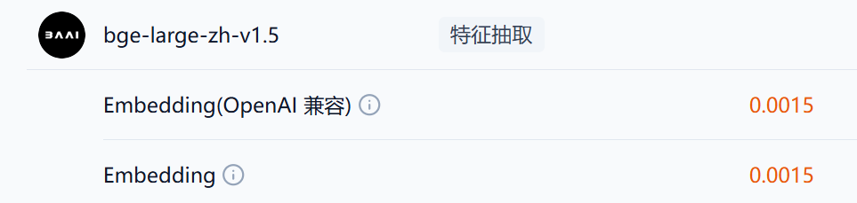

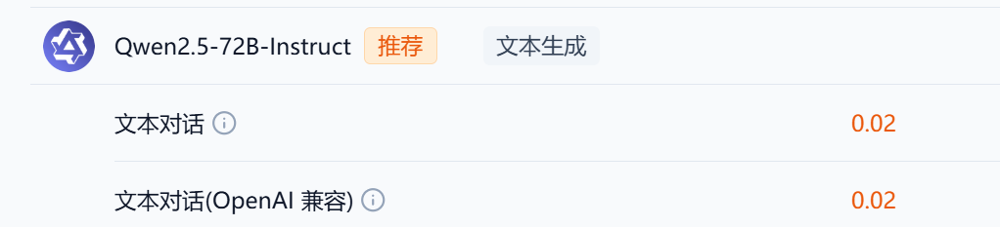

## 结果展示

### 特征抽取

设定为Gitee AI的bge-large-zh-v1.5，特征抽取成本非常低，数据库表的数量也不会很大，可以放心使用。

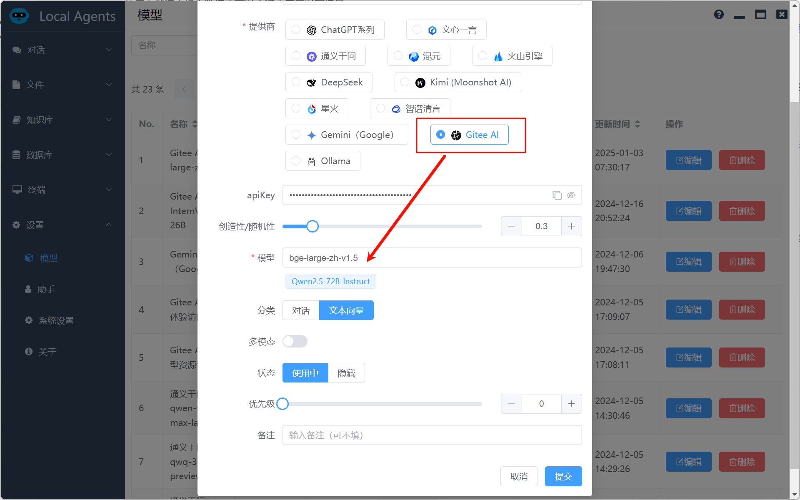

配置好数据库参数后，通过bge-large-zh-v1.5对数据库表结构（DDL）进行特征抽取，这里为了效果更好，我再做了一个全文索引，形成了**向量+全文索引**的混合索引，提升了匹配的成功率

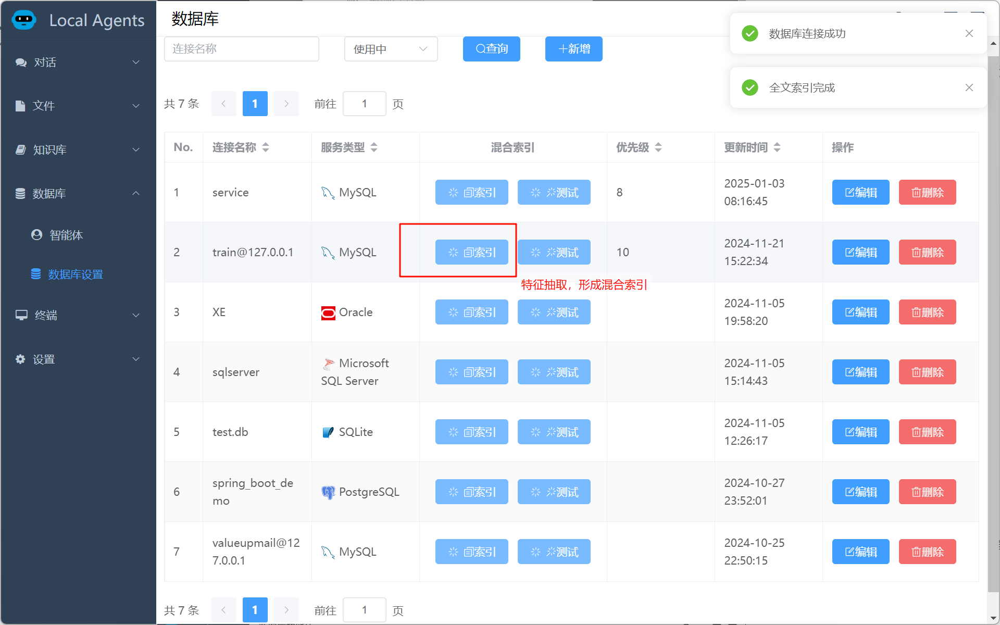

### 自然语言查询

这里是非技术部门经常会遇到的问题，想查一个基础数据，技术部门腾不出手来帮忙，只能望洋兴叹，现在来看看自然语言查询的效果，使用自然语言查询，比如：`请问如何统计各个大区的点击数`

这里我们使用了Qwen2.5-72B-Instruct来完成这一任务。可以看到大模型准确的识别了用户意图并完成了查询

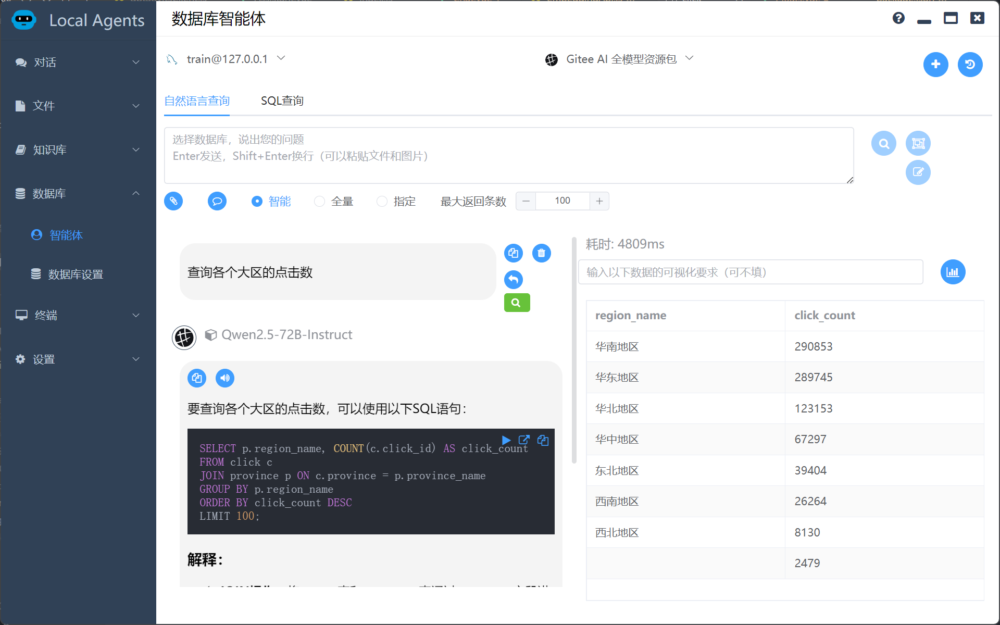

我们还可以通过大模型自动生成可视化图表，让数据更直观。还可以使用专属Prompt对可视化进行详细要求（比如是饼图还是折线图），来看看效果

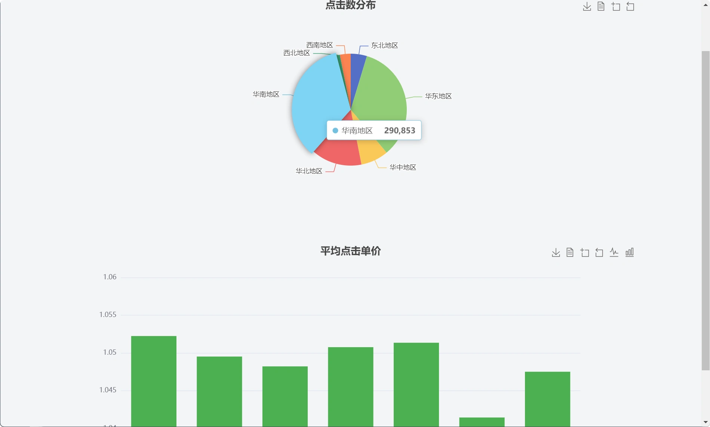

对查询结果不满意，有的表总是命中不了，还可以指定全部表或者特定表，毕竟特征抽取和大模型技术也不是万能的

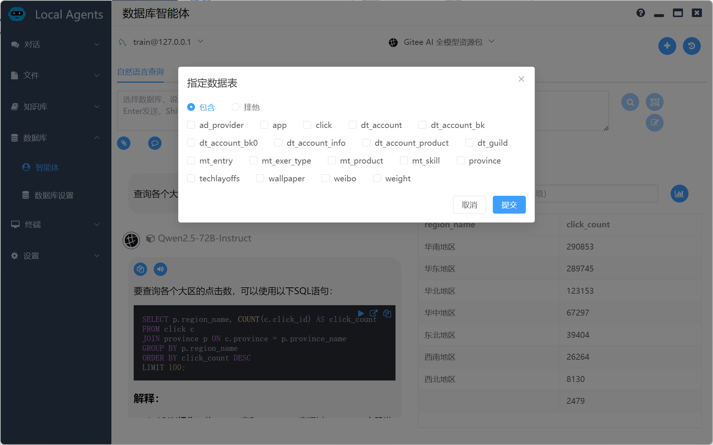

### 数据库优化

细心的朋友一定发现，这个数据库查询SQL太慢了，居然耗时4809ms，那么如何优化呢，如果不熟悉数据库结构，可能就一筹莫展了，那么我们还是可以用bge-large-zh-v1.5 + Qwen2.5-72B-Instruct来帮助我们。

我们只要将数据库的explain信息和DDL一起提交给大模型，大模型就会分析问题并给出我们答案，如下所示，Qwen2.5-72B-Instruct很快找到了问题，并给出了方案，我们根据方案添加了一个索引。

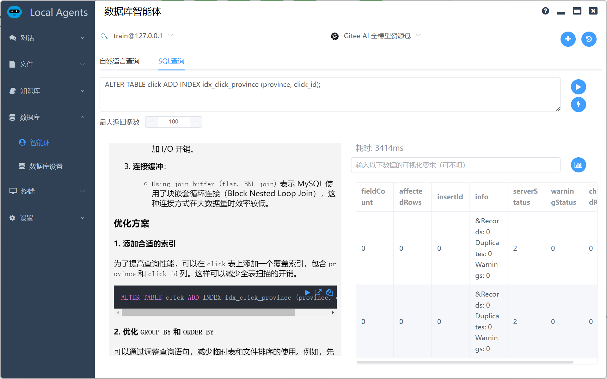

再次执行SQL来看看效果，同样的SQL，现在仅仅耗时321ms，优化成功了

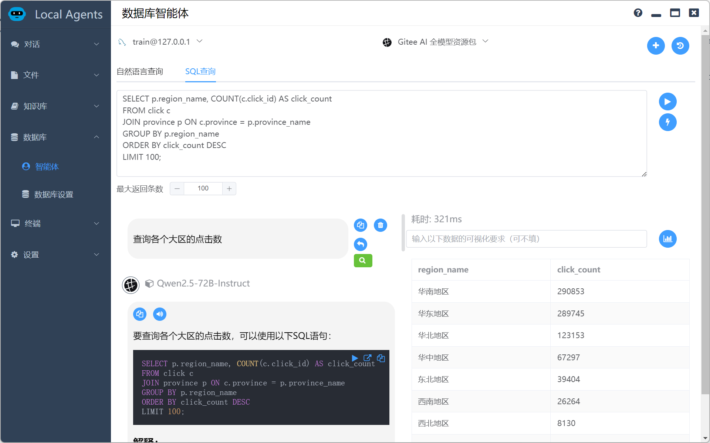

### SQL debug

再优秀的程序员都会犯错，我们如果写入SQL时不小心出现了错误，大模型这时候也可以大显身手，如下图所示， Qwen2.5-72B-Instruct准确的找到了SQL的问题并给出了修正方案。

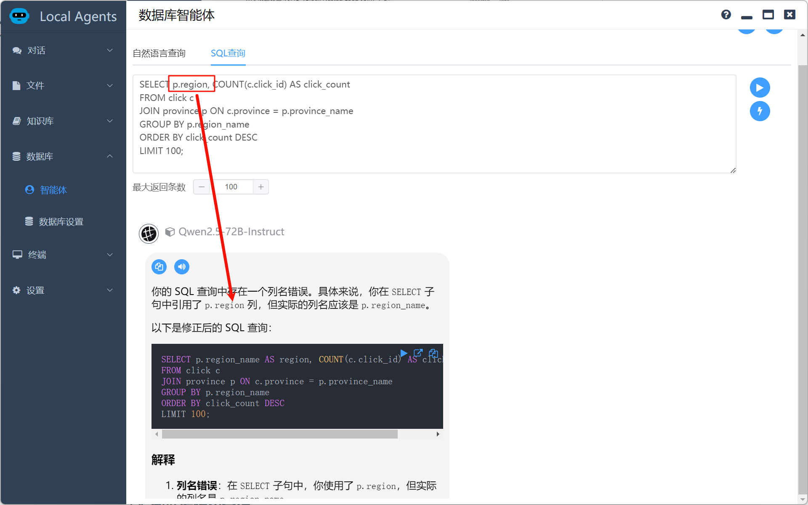

### 数据库结构分析

员工入职新项目，往往对数据库结构一无所知，看数据库文档当然是一个好办法，但是也很枯燥。有没有好的办法能够让数据库理解更加简单方便呢，自然语言操作数据库就能帮忙。

看看这个例子，用户想了解哪些表和用户密切相关，那么他可以输入：`找到和客户相关的表`

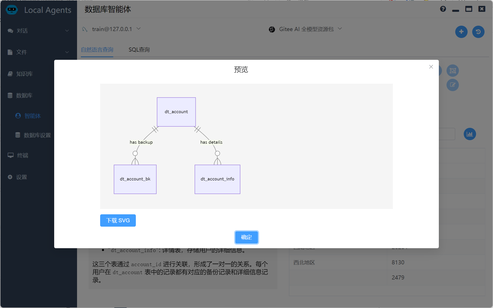

如上图所示，通过对特征抽取后的数据库结构的分析，大模型得到了结论，并通过mermaid技术生成了ER图。

如果设计数据库时，有些注释遗漏了，大模型也是一个好帮手，他可以自动帮你生成数据库注释，例如我们输入：

`大区和点击数相关的表补充相关表注释并生成相关的修改语句`

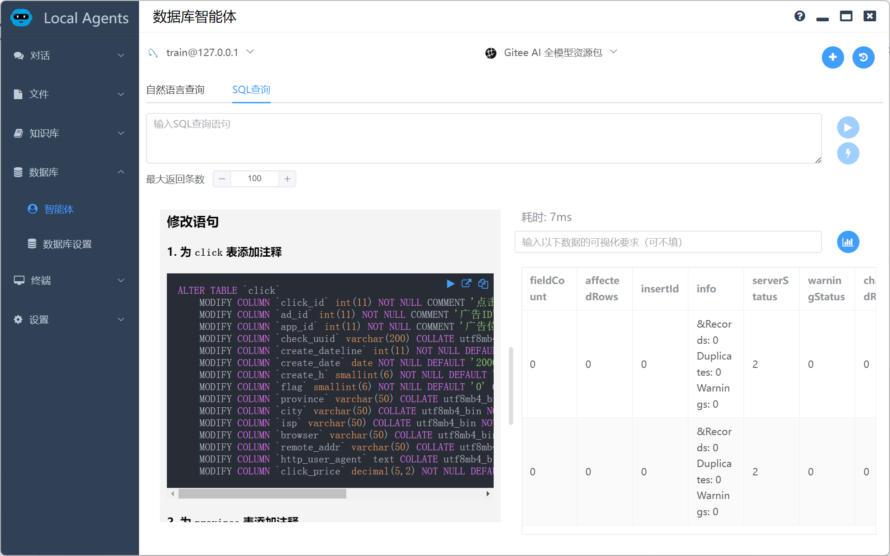

如上图所示，可以看到效果相当的不错，大模型对数据库理解非常的透彻和准确（当然取决于数据库字段命名的规范）

## 结论

从上面的例子可以看出，使用用Gitee AI提供的bge-large-zh-v1.5 + Qwen2.5-72B-Instruct组合很好的完成了自然语言操作数据库的任务，能够涵盖数据库查询、数据可视化、数据库优化、数据库分析与设计等一系列的问题。我在实际使用过程中，感觉效果还是不错的。

但是现实使用中也有一些问题需要注意。

* 数据库设计时命名要规范。

* 使用自然语言查询时，对一些术语还是要有个约定，比如公司的销售部门最开始使用“用户”这个关键字，由于数据库结构定义中使用的是“客户”，导致效果不佳，完善了数据库注释和术语约定后效果就很好。
* 不推荐直接在生产环境下面使用，也无法做到很细致的权限控制，推荐将和部门相关的数据同步到一个专有库进行查询操作。

