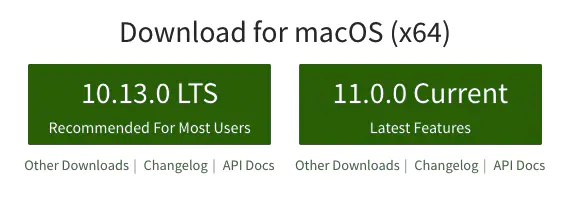
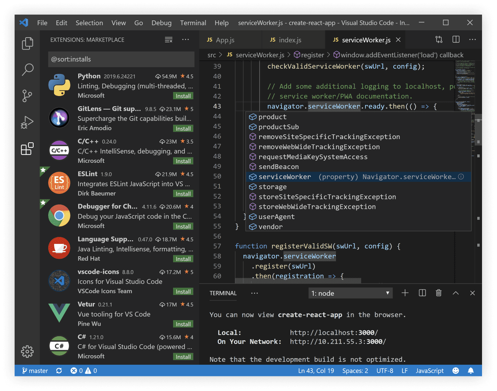
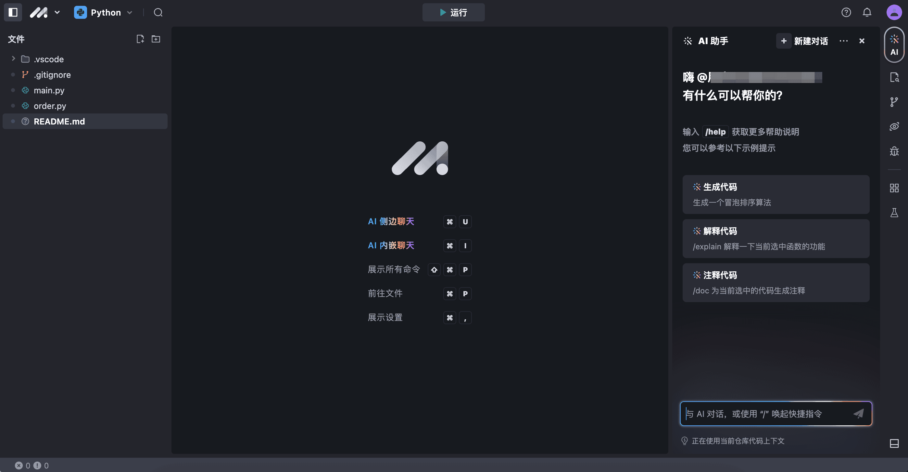

# Node.js 环境配置

## 前置知识

为了顺利配置和使用 Node.js 环境，你需要掌握以下基础知识：

* **Git:**  Git 是一个分布式版本控制系统，用于跟踪代码更改、协作开发和版本管理。你需要了解 Git 的基本概念，例如：
    * **仓库 (Repository):** 存储代码及其历史记录的地方。
    * **克隆 (Clone):** 将远程仓库复制到本地。
    * **提交 (Commit):** 保存代码更改的快照。
    * **分支 (Branch):**  并行开发不同的功能或版本。
    * **推送 (Push):** 将本地提交上传到远程仓库。
    * **拉取 (Pull):** 将远程仓库的更改下载到本地。

    学习资源推荐：
    * [Git 官方网站](https://git-scm.com/)


* **Markdown:** Markdown 是一种轻量级标记语言，用于格式化文本。它易于阅读和编写，常用于编写文档、README 文件等。你需要了解 Markdown 的基本语法，例如：
    * **标题:** 使用 `#` 表示不同级别的标题。
    * **列表:** 使用 `*` 或 `-` 创建无序列表，使用数字加点创建有序列表。
    * **链接:** 使用 `[链接文本](链接地址)` 创建链接。
    * **图片:** 使用 `` 插入图片。
    * **代码块:** 使用反引号 `` ` ``  或三个反引号 ``` ```  创建代码块。

    学习资源推荐：
    * [Markdown 指南](https://www.markdownguide.org/)


* **终端 (Terminal/Command Line/Console):** 终端是与计算机交互的文本界面。你需要了解基本的终端命令，例如：
    * **导航:** `cd` (切换目录), `pwd` (显示当前目录), `ls` (列出文件和目录)。
    * **文件操作:** `touch` (创建文件), `cat` (查看文件内容), `rm` (删除文件), `mkdir` (创建目录), `cp` (复制文件), `mv` (移动或重命名文件)。
    * **权限管理:** `chmod` (更改文件权限)。
    * **进程管理:** `ps` (查看进程), `kill` (终止进程)。
    * **网络操作:** `ping` (测试网络连接), `curl` (发送网络请求)。

    学习资源推荐：
    * 对于 Windows 用户:  学习 PowerShell 或 Git Bash。
    * 对于 macOS/Linux 用户: 学习 Bash 或 Zsh。  网上有很多关于这些 shell 的教程。


掌握以上这些前置知识，将帮助你更好地理解和操作 Node.js 环境，更高效地进行开发工作。

## 依赖工具

### Node.js

在构建一个 Vue 项目前，我们先要确保你本地安装了 `Node` 环境以及包管理工具 `npm`，打开终端运行：

```sh
# 查看 node 版本
node -v

# 查看 npm 版本
npm -v
```

如果成功打印出版本号，说明你本地具备了 node 的运行环境，我们可以使用 npm 来安装管理项目的依赖，而如果没有或报错，则你需要去[ node 官网](https://nodejs.org/en/)进行 node 的下载及安装，如图：





左边的版本是推荐安装的稳定版本，也就是目前已经被正式列入标准的版本，而右边的版本是当前最新的版本，该版本包含了一些新的特性，还未被完全列入标准，可能以后会有所变动。这里建议大家安装最新的 node 稳定版进行开发。

> Node.js为必装，下面的fnm、nvm、volta（3选1，个人推荐fnm）和pnpm为选装

### 多Node.js 版本管理

在 Node.js 开发时，经常会遇到一个问题，我们可能需要根据项目需求选择不同的 Node.js 版本。

#### fnm

fnm（Fast Node Manager）是一款用 Rust 编写的跨平台 Node.js 版本管理器。它支持 .nvmrc 文件和 Fish shell。它可在 Linux 和 Mac 上运行，以单个可执行文件的形式发布。

主要特性

- 跨平台支持（macOS、Windows、Linux）
- ✨ 单个文件，安装简单，即时启动
- 以速度为本
- 适用于 .node-version 和 .nvmrc 文件

fnm官网: [Schniz/fnm: 🚀 Fast and simple Node.js version manager, built in Rust (github.com)](https://github.com/Schniz/fnm)

下载安装：[Releases · Schniz/fnm (github.com)](https://github.com/Schniz/fnm/releases)

```sh
# 安装 LTS 版本
$ fnm install --lts

# 安装指定大版本的最新版本
$ fnm install 18

# 安装指定版本
$ fnm install 18.21.1

# 使用系统版本
$ fnm use system

# 使用 fnm 所安装，且版本号为 18.21.1 的 Node 程序
$ fnm use 18.21.1

# 使用 fnm 所安装，且主版本号为 18 的最新版本的 Node 程序
$ fnm use 18

# 指定默认版本
$ fnm default 18.21.1
```

可以通过在项目根目录下添加 `.node-version` 或 `.nvmrc` 文件，并在其中指定版本。比如：

```shell
$ echo '18' > .node-version
```

但是要前置配置终端，比如在PowerShell中

```sh
fnm env --use-on-cd --shell powershell | Out-String | Invoke-Expression
```

- macOS/Linux配置文件在 `~/.config/powershell/Microsoft.PowerShell_profile.ps1`

- Windows敲以下命令打开配置文件

  ```sh
  notepad $profile
  ```

#### nvm

nvm (Node Version Manager) 是一个用于管理多个 Node.js 版本的命令行工具。它允许你在同一台机器上轻松安装、切换和使用不同的 Node.js 版本，方便开发和测试需要不同 Node.js 版本的项目。

**nvm 的主要功能：**

* **安装多个 Node.js 版本：** nvm 可以从 Node.js 官方网站下载并安装任意版本的 Node.js，包括稳定版和开发版。
* **切换 Node.js 版本：** nvm 可以轻松地在已安装的 Node.js 版本之间切换，只需一个简单的命令即可。
* **设置默认 Node.js 版本：** nvm 可以设置一个默认的 Node.js 版本，以便在没有指定版本的情况下使用。
* **管理 npm 版本：** nvm 也会自动安装对应 Node.js 版本的 npm，并允许你切换 npm 版本。
* **.nvmrc 文件支持：** nvm 可以读取项目根目录下的 `.nvmrc` 文件，自动切换到指定版本的 Node.js，方便团队协作。

nvm官网: https://github.com/nvm-sh/nvm

下载安装：https://github.com/coreybutler/nvm-windows

```sh
# 安装 nvm
curl -o- https://raw.githubusercontent.com/nvm-sh/nvm/v0.39.3/install.sh | bash

# 安装 Node.js
nvm install 16.18.1  # 安装指定版本
nvm install node      # 安装最新版本
nvm install --lts    # 安装最新 LTS 版本

# 查看已安装版本
nvm ls

# 切换 Node.js 版本
nvm use 16.18.1

# 查看当前版本
nvm current

# 卸载 Node.js 版本
nvm uninstall 16.18.1
```

> nvm的Windows版本比较落后，Windows环境下更推荐 **Fast Node Manager (`fnm`)**

#### volta

Volta 是一个 JavaScript 工具管理器，旨在简化 Node.js、npm、Yarn 等工具的安装和版本切换，让开发者可以更专注于代码而不是环境配置。

Volta 与 nvm、n 等工具管理器相比，具有更快的速度、更简单的使用方式和更好的跨平台支持。更主要的是他可以在每个项目中使用独立的版本，避免了版本冲突和全局污染。

* Volta 官网: https://volta.sh/
* 下载安装：[Releases · volta-cli/volta (github.com)](https://github.com/volta-cli/volta/releases)

Volta 常用命令：

* `volta install node`：安装指定版本的 Node.js，例如 `volta install node@16`。如果不指定版本，则安装最新的 LTS 版本。
* `volta list node`：列出已安装的 Node.js 版本。
* `volta pin node@16`：将当前项目的 Node.js 版本固定为 16。

示例：在项目中使用 Node.js 14：

* 进入项目目录：cd my-project
* 固定 Node.js 版本：volta pin node@14

### pnpm

pnpm 是一款现代化的 JavaScript 包管理器，旨在解决 npm 和 Yarn 在性能和磁盘空间占用方面的不足。它通过内容寻址文件系统和符号链接的方式，高效地管理依赖项，并显著提升安装速度和节省磁盘空间。

* pnpm 官网：https://pnpm.io/
* 下载安装：[Installation | pnpm](https://pnpm.io/installation)

### 注意点

* volta可以根据每个项目设定不同的node版本，但是全局安装的软件（例如serverless）不能和指定版本绑定
* fnm、nvm也能按项目设定不同的node版本（和volta原理不同，依赖于使用的终端的配置），但是全局安装的软件可以和指定版本绑定，例如node16环境安装serverless@3，node16环境安装serverless@4

## 脚手架

当我们安装完 node 后便可以开始进行后续的构建工作了，那么这里我主要给大家介绍下最便捷的脚手架构建。

### 什么是脚手架

很多人可能经常会听到“脚手架”三个字，无论是前端还是后台，其实它在生活中的含义是为了保证各施工过程顺利进行而搭设的工作平台。因此作为一个工作平台，前端的脚手架可以理解为能够帮助我们快速构建前端项目的一个工具或平台。

### vue-cli

其实说到脚手架，目前很多主流的前端框架都提供了各自官方的脚手架工具，以帮助开发者快速构建起自己的项目，比如 `Vue`、`React` 等，这里我们就来介绍下 Vue 的脚手架工具 `vue-cli`。

vue-cli 经历了几个版本的迭代，目前最新的版本是 5.x：

```sh
# 安装vue-cli
npm install -g @vue/cli
# 使用vue-cli创建项目
vue create my-project
```

### express-generator

通过应用生成器工具 `express-generator` 可以快速创建一个应用的骨架。

`express-generator` 包含了 `express` 命令行工具。通过如下命令即可安装：

```sh
$ npm install express-generator -g
```

`-h` 参数可以列出所有可用的命令行参数：

```sh
$ express -h

  Usage: express [options] [dir]

  Options:

    -h, --help          输出使用方法
        --version       输出版本号
    -e, --ejs           添加对 ejs 模板引擎的支持
        --hbs           添加对 handlebars 模板引擎的支持
        --pug           添加对 pug 模板引擎的支持
    -H, --hogan         添加对 hogan.js 模板引擎的支持
        --no-view       创建不带视图引擎的项目
    -v, --view <engine> 添加对视图引擎（view） <engine> 的支持 (ejs|hbs|hjs|jade|pug|twig|vash) （默认是 jade 模板引擎）
    -c, --css <engine>  添加样式表引擎 <engine> 的支持 (less|stylus|compass|sass) （默认是普通的 css 文件）
        --git           添加 .gitignore
    -f, --force         强制在非空目录下创建
```

例如，如下命令创建了一个名称为 *expressjs* 的 Express 应用。此应用将在当前目录下的 *myapp* 目录中创建，并且设置为使用 [Pug](https://pugjs.org/) 模板引擎（view engine）：

```sh
$ express --view=ejs expressjs
```

然后安装所有依赖包：

```sh
$ cd expressjs
$ npm install
```

在 MacOS 或 Linux 中，通过如下命令启动此应用：

```sh
$ DEBUG=expressjs:* npm start
```

在 Windows 中，通过如下命令启动此应用：

```sh
> set DEBUG=expressjs:* & npm start
```

然后在浏览器中打开 `http://localhost:3000/` 网址就可以看到这个应用了。

通过生成器创建的应用一般都有如下目录结构：

```sh
.
├── app.js
├── bin
│   └── www
├── package.json
├── public
│   ├── images
│   ├── javascripts
│   └── stylesheets
│       └── style.css
├── routes
│   ├── index.js
│   └── users.js
└── views
    ├── error.pug
    ├── index.pug
    └── layout.pug

7 directories, 9 files
```

## 开发环境

### 本地IDE

这里我们推荐使用来自微软的IDE： Visual Studio Code

* 功能支持完善
* 安装简单
* 无需付费
* 插件丰富可定制

大家只需去[Visual Studio Code - Code Editing. Redefined](https://code.visualstudio.com/)下载安装即可



推荐的几个插件：

1. **Vue - Official**：Vue官方出品的识别`.vue`语法的插件。
2. **ESLint:** JavaScript 代码检查工具，可以帮助你发现代码中的潜在问题和错误，并强制执行代码风格规范。
3. **通义灵码**：AI编程助手类产品，或其他类似产品

### 云端环境

云端环境，无需安装，即开即用：[豆包 MarsCode - 工作台](https://www.marscode.cn/dashboard)




