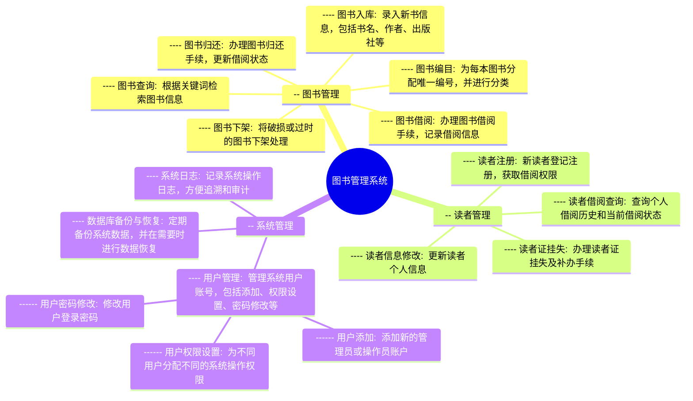
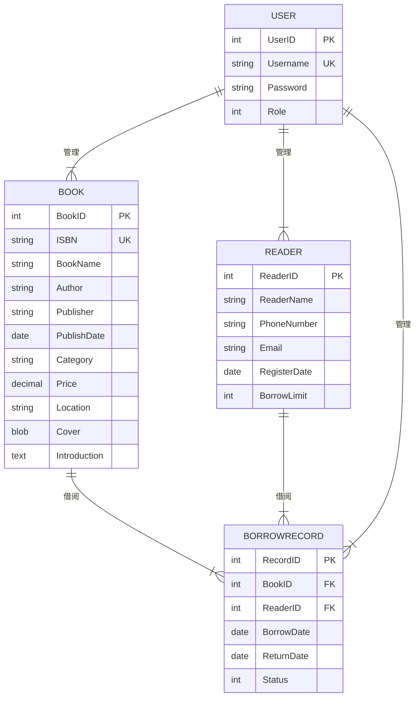

# SQLite 

SQLite 是一款轻量级的嵌入式关系型数据库管理系统，它无需独立的服务器进程，直接读写数据库文件，因此非常适合于嵌入式设备、移动应用以及小型项目。本文将介绍 SQLite 的基本概念，并演示如何通过命令行和 Node.js 操作 SQLite 数据库。

## SQLite 简介

SQLite 将整个数据库（包括定义、表、索引和数据）存储在一个单一的文件中。它的特点包括：

* **零配置:** 无需安装或配置服务器。
* **跨平台:** 支持各种操作系统，包括 Windows、Linux、macOS、iOS 和 Android。
* **事务性:** 支持 ACID 事务，保证数据完整性。
* **轻量级:** 数据库引擎非常小巧，占用资源少。
* **自包含:** 所有功能都包含在单个库文件中。

## 命令行操作 SQLite

SQLite 提供了一个名为 `sqlite3` 的命令行工具，用于与数据库交互。

1. **打开数据库:**

   ```bash
   sqlite3 mydatabase.db  # 创建或打开名为 mydatabase.db 的数据库
   ```

   如果文件不存在，则会创建一个新的数据库文件。

2. **创建表:**

   ```sql
   CREATE TABLE users (
       id INTEGER PRIMARY KEY AUTOINCREMENT,
       name TEXT NOT NULL,
       email TEXT UNIQUE
   );
   ```

3. **插入数据:**

   ```sql
   INSERT INTO users (name, email) VALUES ('John Doe', 'john.doe@example.com');
   ```

4. **查询数据:**

   ```sql
   SELECT * FROM users;
   ```

5. **更新数据:**

   ```sql
   UPDATE users SET email = 'john.updated@example.com' WHERE id = 1;
   ```

6. **删除数据:**

   ```sql
   DELETE FROM users WHERE id = 1;
   ```

7. **退出 sqlite3:**

   ```sql
   .exit
   ```

更多命令行操作，请参考 SQLite 官方文档。

## 使用 Node.js 操作 SQLite

Node.js 可以通过 `sqlite3` 模块来操作 SQLite 数据库。

1. **安装 sqlite3 模块:**

   ```bash
   npm install sqlite3
   ```

2. **连接数据库:**

   ```javascript
   const sqlite3 = require('sqlite3').verbose();
   const db = new sqlite3.Database('mydb.db');
   ```

3. **创建表:**

   ```javascript
   db.run(`CREATE TABLE IF NOT EXISTS langs (
       id INTEGER PRIMARY KEY AUTOINCREMENT,
       name TEXT
   )`);
   ```

4. **插入数据:**

   ```javascript
   db.run(`INSERT INTO langs(name) VALUES(?)`, ['C++'], function(err) {
       if (err) {
           return console.log(err.message);
       }
       console.log(`A row has been inserted with rowid ${this.lastID}`);
   });
   ```

5. **查询数据:**

   ```javascript
   db.all(`SELECT * FROM langs`, [], (err, rows) => {
       if (err) {
           throw err;
       }
       rows.forEach((row) => {
           console.log(row.id + ": " + row.name);
       });
   });
   ```

6. **关闭数据库连接:**

   ```javascript
   db.close();
   ```

> 这段代码如果连续运行会遇到一个问题，就是他们都是异步执行的，连续执行时，由于CREATE TABLE还未完成就执行了INSERT INTO，会导致报错
>
> `SQLITE_ERROR: no such table: langs`

交给AI来处理，写题词


```
这段代码是异步执行的，通过await改写成同步执行的
```


```js
const sqlite3 = require('sqlite3').verbose();
const db = new sqlite3.Database('mydb.db');

function runQuery(query, params = []) {
  return new Promise((resolve, reject) => {
    db.run(query, params, function (err) {
      if (err) {
        reject(err);
      } else {
        resolve(this); // Resolve with the statement object (for lastID)
      }
    });
  });
}

function getAllRows(query, params = []) {
  return new Promise((resolve, reject) => {
    db.all(query, params, (err, rows) => {
      if (err) {
        reject(err);
      } else {
        resolve(rows);
      }
    });
  });
}


async function run() {
  try {
    await runQuery(`CREATE TABLE IF NOT EXISTS langs (
        id INTEGER PRIMARY KEY AUTOINCREMENT,
        name TEXT
    )`);

    const insertResult = await runQuery(`INSERT INTO langs(name) VALUES(?)`, ['C++']);
    console.log(`A row has been inserted with rowid ${insertResult.lastID}`);

    const rows = await getAllRows(`SELECT * FROM langs`);
    rows.forEach(row => {
      console.log(row.id + ': ' + row.name);
    });

  } finally {
    db.close();
  }
}

run().catch(console.error);
```

执行成功

```sh
A row has been inserted with rowid 1
1: C++
```

## 总结

SQLite 是一款功能强大且易于使用的数据库，非常适合各种应用场景。本文介绍了 SQLite 的基本概念以及通过命令行和 Node.js 操作 SQLite 数据库的方法。希望这篇文章能帮助你快速入门 SQLite。  更深入的学习可以参考 SQLite 官方文档，探索更多高级特性，例如索引、视图、触发器等。

## AI辅助设计

> 以下除题词外均由AI生成

###  功能分解

```
📝设计一个图书管理系统，他有哪些子功能，用Mermaid绘制mindmap
同时生成每个子功能的简要功能解释
```



###  数据库设计

```
📝设计sqlite数据库结构，并使用mermaid绘制er关系图
```

以下是图书管理系统 SQLite 数据库结构设计，包含创建表的 SQL 语句：



**关系说明：**

- **图书 - 借阅记录 (1:N)：** 一本书可以被多个读者借阅，产生多条借阅记录。
- **读者 - 借阅记录 (1:N)：** 一个读者可以借阅多本书，产生多条借阅记录。
- **用户 - 图书 (1:N)：** 管理员可以管理多本书籍信息。
- **用户 - 读者 (1:N)：** 管理员可以管理多个读者信息。
- **用户 - 借阅记录 (1:N)：** 管理员可以管理多条借阅记录。

```sql
-- 图书表
CREATE TABLE Book (
    BookID INTEGER PRIMARY KEY AUTOINCREMENT, -- 图书ID，主键，自增
    ISBN TEXT UNIQUE NOT NULL, -- ISBN，唯一，非空
    BookName TEXT NOT NULL, -- 书名，非空
    Author TEXT NOT NULL, -- 作者，非空
    Publisher TEXT NOT NULL, -- 出版社，非空
    PublishDate DATE, -- 出版日期
    Category TEXT, -- 图书分类
    Price REAL, -- 价格
    Location TEXT, -- 存放位置
    Cover BLOB, -- 封面图片，二进制数据
    Introduction TEXT -- 内容简介
);

-- 读者表
CREATE TABLE Reader (
    ReaderID INTEGER PRIMARY KEY AUTOINCREMENT, -- 读者ID，主键，自增
    ReaderName TEXT NOT NULL, -- 读者姓名，非空
    PhoneNumber TEXT, -- 联系电话
    Email TEXT, -- 电子邮箱
    RegisterDate DATE DEFAULT (date('now')), -- 注册日期，默认为当前日期
    BorrowLimit INTEGER DEFAULT 3 -- 借阅上限，默认为3本
);

-- 借阅记录表
CREATE TABLE BorrowRecord (
    RecordID INTEGER PRIMARY KEY AUTOINCREMENT, -- 借阅记录ID，主键，自增
    BookID INTEGER NOT NULL, -- 图书ID，外键关联图书表
    ReaderID INTEGER NOT NULL, -- 读者ID，外键关联读者表
    BorrowDate DATE DEFAULT (date('now')), -- 借阅日期，默认为当前日期
    ReturnDate DATE, -- 归还日期
    Status INTEGER DEFAULT 0, -- 借阅状态，0: 未归还，1: 已归还，2: 逾期
    FOREIGN KEY (BookID) REFERENCES Book(BookID),
    FOREIGN KEY (ReaderID) REFERENCES Reader(ReaderID)
);

-- 用户表
CREATE TABLE User (
    UserID INTEGER PRIMARY KEY AUTOINCREMENT, -- 用户ID，主键，自增
    Username TEXT UNIQUE NOT NULL, -- 用户名，唯一，非空
    Password TEXT NOT NULL, -- 密码，非空
    Role INTEGER DEFAULT 0 -- 角色，0: 管理员，1: 普通用户
);
```

**表结构说明：**

**1. 图书表 (Book):**

*   `BookID`: 图书的唯一标识符，主键，自动递增。
*   `ISBN`: 国际标准书号，用于唯一标识一本书，非空且唯一。
*   `BookName`: 书名，非空。
*   `Author`: 作者，非空。
*   `Publisher`: 出版社，非空。
*   `PublishDate`: 出版日期。
*   `Category`: 图书分类，例如：文学、科技、艺术等。
*   `Price`: 图书价格。
*   `Location`: 图书存放位置，例如：图书馆的具体书架号。
*   `Cover`: 图书封面图片，以二进制数据存储。
*   `Introduction`: 图书内容简介。

**2. 读者表 (Reader):**

*   `ReaderID`: 读者的唯一标识符，主键，自动递增。
*   `ReaderName`: 读者姓名，非空。
*   `PhoneNumber`: 读者联系电话。
*   `Email`: 读者电子邮箱地址。
*   `RegisterDate`: 读者注册日期，默认为当前日期。
*   `BorrowLimit`: 读者可借阅图书的最大数量，默认为 3 本。

**3. 借阅记录表 (BorrowRecord):**

*   `RecordID`: 借阅记录的唯一标识符，主键，自动递增。
*   `BookID`: 借阅图书的 ID，外键关联到图书表 (Book)。
*   `ReaderID`: 借阅者的 ID，外键关联到读者表 (Reader)。
*   `BorrowDate`: 借阅日期，默认为当前日期。
*   `ReturnDate`: 归还日期，初始值为 NULL，归还时更新。
*   `Status`: 借阅状态，0 表示未归还，1 表示已归还，2 表示逾期。

**4. 用户表 (User):**

*   `UserID`: 用户的唯一标识符，主键，自动递增。
*   `Username`: 用户名，用于登录系统，非空且唯一。
*   `Password`: 用户密码，非空。
*   `Role`: 用户角色，0 表示管理员，拥有所有权限，1 表示普通用户，权限受限。

**关系：**

*   图书表和读者表之间是多对多关系，通过借阅记录表关联。
*   每条借阅记录关联一本图书和一个读者。

**其他说明：**

*   可以根据实际需求添加或修改字段。
*   可以使用 SQLiteStudio 等工具创建和管理数据库。
*   在应用程序中，可以使用 SQL 语句或 ORM 框架来操作数据库。