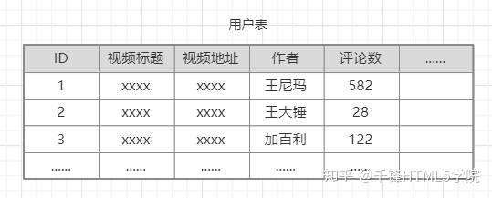

# Sequelize

Sequelize 是一个基于 promise 的 Node.js [ORM](https://en.wikipedia.org/wiki/Object-relational_mapping), 目前支持 [Postgres](https://en.wikipedia.org/wiki/PostgreSQL), [MySQL](https://en.wikipedia.org/wiki/MySQL), [MariaDB](https://en.wikipedia.org/wiki/MariaDB), [SQLite](https://en.wikipedia.org/wiki/SQLite) 以及 [Microsoft SQL Server](https://en.wikipedia.org/wiki/Microsoft_SQL_Server). 它具有强大的事务支持, 关联关系, 预读和延迟加载,读取复制等功能。

Sequelize 遵从 [语义版本控制](http://semver.org/)。 支持 Node v10 及更高版本以便使用 ES6 功能。

## ORM

### ORM简介

**ORM :**对象关系映射(英语:Object Relational Mapping，简称ORM，或O/RM，或O/R mapping)，用于实现面向对象编程语言里不同类型系统的数据之间的转换。

> O(面向对象) **<----->** ORMapping **<----->** R(面向关系)

在数据库层面, 尤其是关系型数据库. 是没有对象概念的.

有的只是表格, 和数据记录



想象一下, 如果你在某个视频网站, 为某个视频写了一条评论，接下来会发生什么呢？我们要更改用户表的记录, 增加评论数。用SQL语句进行操作：

```sql
update t_user set .......
```

可是我们平时都是面向对象编程的，从逻辑上讲，我们的代码应该是这样写的：

```java
video.cmmt_cnt++;
```

**这样就够了吗? 当然不够**

**我们还需要增加评论表**


**还不止这些**

* 如果这条评论被置顶了呢
* 如果这条评论对其他人不可见呢?
* 如果这条评论@了其他人呢
* 如果这条评论被人点赞了呢

只要稍微增加一点功能, 逻辑都会变得复杂很多，一个看似简单的添加评论, 其实背后并不简单。显然操作数据库, 跟实现业务逻辑采用的思维方式是不同的。

* 一个是面向关系, 处理好每张表的变化, 以及表之间的关联
* 一个是面向对象思维, 将每一条记录看做一个对象去操作

> 在没有ORMapping之前, 程序员必须要自己搞定这二者复杂的关系转换

而有了ORMapping框架之后

程序员的代码, 大概就会变成这样

```java
video.addComment(new Comment(......));
```

这样就够了, 面向对象的代码, 将自动转换成对应的SQL语句

### ORM中的关系

常见的有hasOne、belongsTo、hasMany、belongsToMany

* user表为主表，video表为关联表；一个用户有一条video（1：1）
  * user表为主表，需要向下找关联表的字段用hasOne，`User.hasOne(Video)`
  * video表为关联表，需要向上找关联表的字段用belongsTo，`Video.belongsTo(User);`
* user表为主表，video表为关联表；一个用户有多条video（1：N）
  * user表为主表，需要向下找关联表的字段用hasMany，`User.hasMany(Video)`
  * video表为关联表，需要向上找关联表的字段用belongsTo，`Video.belongsTo(User);`

* user表为主表，video表为关联表；一个用户点赞多条video，一条video被多用户点赞（N：N）
  * 一般你会建立一个点赞表like(user_id,video_id,time)
  * user表为主表，需要向下找关联表like的字段用hasMany
  * video表为主表，需要向下找关联表like的字段用hasMany
  * like表为关联表，需要向上找关联表user、video的字段用belongsTo
  * 或者使用belongsToMany：`Video.belongsToMany(User, { through: 'Like' });`

#### hasMany

```javascript
const Player = sequelize.define('Player', { name: DataTypes.STRING });
const Team = sequelize.define('Team', { name: DataTypes.STRING });
Team.hasMany(Player);
Player.belongsTo(Team);
```

#### belongsToMany

```javascript
const Movie = sequelize.define('Movie', { name: DataTypes.STRING });
const Actor = sequelize.define('Actor', { name: DataTypes.STRING });
Movie.belongsToMany(Actor, { through: 'ActorMovies' });
Actor.belongsToMany(Movie, { through: 'ActorMovies' });
```

## 安装

Sequelize 的使用可以通过 [npm](https://www.npmjs.com/package/sequelize) (或 [yarn](https://yarnpkg.com/package/sequelize)).

```sh
npm install --save sequelize
```

你还必须手动为所选数据库安装驱动程序：

```sh
# 选择以下之一:

$ npm install --save pg pg-hstore # Postgres

$ npm install --save mysql2

$ npm install --save mariadb

$ npm install --save sqlite3

$ npm install --save tedious # Microsoft SQL Server
```

## 使用Sequelize

### 访问MySQL

当我们安装好MySQL后，Node.js程序如何访问MySQL数据库呢？

访问MySQL数据库只有一种方法，就是通过网络发送SQL命令，然后，MySQL服务器执行后返回结果。

我们可以在命令行窗口输入`mysql -u root -p`，然后输入root口令后，就连接到了MySQL服务器。因为没有指定`--host`参数，所以我们连接到的是`localhost`，也就是本机的MySQL服务器。

在命令行窗口下，我们可以输入命令，操作MySQL服务器：

```sh
mysql> show databases;
+--------------------+
| Database           |
+--------------------+
| information_schema |
| mysql              |
| performance_schema |
| test               |
+--------------------+
4 rows in set (0.05 sec)
```

输入`exit`退出MySQL命令行模式。

对于Node.js程序，访问MySQL也是通过网络发送SQL命令给MySQL服务器。这个访问MySQL服务器的软件包通常称为MySQL驱动程序。不同的编程语言需要实现自己的驱动，MySQL官方提供了Java、.Net、Python、Node.js、C++和C的驱动程序，官方的Node.js驱动目前仅支持5.7以上版本，而我们上面使用的命令行程序实际上用的就是C驱动。

目前使用最广泛的MySQL Node.js驱动程序是开源的`mysql`，可以直接使用npm安装。

### ORM

如果直接使用`mysql`包提供的接口，我们编写的代码就比较底层，例如，查询代码：

```javascript
connection.query('SELECT * FROM users WHERE id = ?', ['123'], function(err, rows) {
    if (err) {
        // error
    } else {
        for (let row in rows) {
            processRow(row);
        }
    }
});
```

考虑到数据库表是一个二维表，包含多行多列，例如一个`pets`的表：

```sh
mysql> select * from pets;
+----+--------+------------+
| id | name   | birth      |
+----+--------+------------+
|  1 | Gaffey | 2007-07-07 |
|  2 | Odie   | 2008-08-08 |
+----+--------+------------+
2 rows in set (0.00 sec)
```

每一行可以用一个JavaScript对象表示，例如第一行：

```javascript
{
    "id": 1,
    "name": "Gaffey",
    "birth": "2007-07-07"
}
```

这就是传说中的ORM技术：Object-Relational Mapping，把关系数据库的表结构映射到对象上。是不是很简单？

但是由谁来做这个转换呢？所以ORM框架应运而生。

我们选择Node的ORM框架Sequelize来操作数据库。这样，我们读写的都是JavaScript对象，Sequelize帮我们把对象变成数据库中的行。

用Sequelize查询`pets`表，代码像这样：

```javascript
Pet.findAll()
   .then(function (pets) {
       for (let pet in pets) {
           console.log(`${pet.id}: ${pet.name}`);
       }
   }).catch(function (err) {
       // error
   });
```

因为Sequelize返回的对象是Promise，所以我们可以用`then()`和`catch()`分别异步响应成功和失败。

但是用`then()`和`catch()`仍然比较麻烦。有没有更简单的方法呢？

可以用ES7的await来调用任何一个Promise对象，这样我们写出来的代码就变成了：

```javascript
var pets = await Pet.findAll();
```

真的就是这么简单！

await只有一个限制，就是必须在async函数中调用。上面的代码直接运行还差一点，我们可以改成：

```javascript
(async () => {
    var pets = await Pet.findAll();
})();
```

考虑到koa的处理函数都是async函数，所以我们实际上将来在koa的async函数中直接写await访问数据库就可以了！

这也是为什么我们选择Sequelize的原因：只要API返回Promise，就可以用await调用，写代码就非常简单！

### 实战

在使用Sequlize操作数据库之前，我们先在MySQL中创建一个表来测试。我们可以在`test`数据库中创建一个`pets`表。`test`数据库是MySQL安装后自动创建的用于测试的数据库。在MySQL命令行执行下列命令：

```sql
grant all privileges on test.* to 'www'@'%' identified by 'www';

use test;

create table pets (
    id varchar(50) not null,
    name varchar(100) not null,
    gender bool not null,
    birth varchar(10) not null,
    createdAt bigint not null,
    updatedAt bigint not null,
    version bigint not null,
    primary key (id)
) engine=innodb;
```

第一条`grant`命令是创建MySQL的用户名和口令，均为`www`，并赋予操作`test`数据库的所有权限。

第二条`use`命令把当前数据库切换为`test`。

第三条命令创建了`pets`表。

然后，我们根据前面的工程结构创建`hello-sequelize`工程，结构如下：

```sh
hello-sequelize/
|
+- .vscode/
|  |
|  +- launch.json <-- VSCode 配置文件
|
+- init.txt <-- 初始化SQL命令
|
+- config.js <-- MySQL配置文件
|
+- app.js <-- 使用koa的js
|
+- package.json <-- 项目描述文件
|
+- node_modules/ <-- npm安装的所有依赖包
```

然后，添加如下依赖包：

```
"sequelize": "3.24.1",
"mysql": "2.11.1"
```

注意`mysql`是驱动，我们不直接使用，但是`sequelize`会用。

用`npm install`安装。

`config.js`实际上是一个简单的配置文件：

```js
var config = {
    database: 'test', // 使用哪个数据库
    username: 'www', // 用户名
    password: 'www', // 口令
    host: 'localhost', // 主机名
    port: 3306 // 端口号，MySQL默认3306
};

module.exports = config;
```

下面，我们就可以在`app.js`中操作数据库了。使用Sequelize操作MySQL需要先做两件准备工作：

第一步，创建一个sequelize对象实例：

```js
const Sequelize = require('sequelize');
const config = require('./config');

var sequelize = new Sequelize(config.database, config.username, config.password, {
    host: config.host,
    dialect: 'mysql',
    pool: {
        max: 5,
        min: 0,
        idle: 30000
    }
});
```

第二步，定义模型Pet，告诉Sequelize如何映射数据库表：

```javascript
var Pet = sequelize.define('pet', {
    id: {
        type: Sequelize.STRING(50),
        primaryKey: true
    },
    name: Sequelize.STRING(100),
    gender: Sequelize.BOOLEAN,
    birth: Sequelize.STRING(10),
    createdAt: Sequelize.BIGINT,
    updatedAt: Sequelize.BIGINT,
    version: Sequelize.BIGINT
}, {
        timestamps: false
    });
```

用`sequelize.define()`定义Model时，传入名称`pet`，默认的表名就是`pets`。第二个参数指定列名和数据类型，如果是主键，需要更详细地指定。第三个参数是额外的配置，我们传入`{ timestamps: false }`是为了关闭Sequelize的自动添加timestamp的功能。所有的ORM框架都有一种很不好的风气，总是自作聪明地加上所谓“自动化”的功能，但是会让人感到完全摸不着头脑。

接下来，我们就可以往数据库中塞一些数据了。我们可以用Promise的方式写：

```javascript
var now = Date.now();

Pet.create({
    id: 'g-' + now,
    name: 'Gaffey',
    gender: false,
    birth: '2007-07-07',
    createdAt: now,
    updatedAt: now,
    version: 0
}).then(function (p) {
    console.log('created.' + JSON.stringify(p));
}).catch(function (err) {
    console.log('failed: ' + err);
});
```

也可以用await写：

```javascript
(async () => {
    var dog = await Pet.create({
        id: 'd-' + now,
        name: 'Odie',
        gender: false,
        birth: '2008-08-08',
        createdAt: now,
        updatedAt: now,
        version: 0
    });
    console.log('created: ' + JSON.stringify(dog));
})();
```

显然await代码更胜一筹。

查询数据时，用await写法如下：

```javascript
(async () => {
    var pets = await Pet.findAll({
        where: {
            name: 'Gaffey'
        }
    });
    console.log(`find ${pets.length} pets:`);
    for (let p of pets) {
        console.log(JSON.stringify(p));
    }
})();
```

如果要更新数据，可以对查询到的实例调用`save()`方法：

```javascript
(async () => {
    var p = await queryFromSomewhere();
    p.gender = true;
    p.updatedAt = Date.now();
    p.version ++;
    await p.save();
})();
```

如果要删除数据，可以对查询到的实例调用`destroy()`方法：

```javascript
(async () => {
    var p = await queryFromSomewhere();
    await p.destroy();
})();
```

运行代码，可以看到Sequelize打印出的每一个SQL语句，便于我们查看：

```sh
Executing (default): INSERT INTO `pets` (`id`,`name`,`gender`,`birth`,`createdAt`,`updatedAt`,`version`) VALUES ('g-1471961204219','Gaffey',false,'2007-07-07',1471961204219,1471961204219,0);
```

### Model

我们把通过`sequelize.define()`返回的`Pet`称为Model，它表示一个数据模型。

我们把通过`Pet.findAll()`返回的一个或一组对象称为Model实例，每个实例都可以直接通过`JSON.stringify`序列化为JSON字符串。但是它们和普通JSON对象相比，多了一些由Sequelize添加的方法，比如`save()`和`destroy()`。调用这些方法我们可以执行更新或者删除操作。

所以，使用Sequelize操作数据库的一般步骤就是：

首先，通过某个Model对象的`findAll()`方法获取实例；

如果要更新实例，先对实例属性赋新值，再调用`save()`方法；

如果要删除实例，直接调用`destroy()`方法。

注意`findAll()`方法可以接收`where`、`order`这些参数，这和将要生成的SQL语句是对应的。

### 文档

Sequelize的API可以参考[官方文档](http://docs.sequelizejs.com/)。

### 相关工具

#### Sequelize-Automate

连接数据库后，第一步就需要建立对应的Model，很多文档教手写model，但是每个字段就要定义类型、默认值、是否为NULL、字段名等，表中字段越多就越麻烦，我还是偏好自动生成model，而sequelize-automate所作正是连接数据库，并从数据库中读出所有表，生成对应的模型文件。

> * 支持 MySQL / PostgreSQL / Sqlite / MariaDB / Microsoft SQL Server 等 Sequelize 支持的所有数据库
> * 支持生成 JavaScript / TypeScript / Egg.js / Midway.js 等不同风格的 Models，并且可扩展
> * 支持主键、外键、自增、字段注释等属性
>
> * 支持自定义变量命名、文件名风格

```sh
npm install sequelize 
npm install mysql2
npm install sequelize-automate --save-dev
```

新建配置文件`sequelize-automate.config.json`

```json
{
  "dbOptions": {
    "database": "pmall",
    "username": "root",
    "password": "",
    "dialect": "mysql",
    "host": "localhost",
    "port": 3306,
    "logging": false
  },
  "options": {
    "type": "js",
    "dir": "models"
  }
}
```

执行创建

```sh
npx sequelize-automate -c "./sequelize-automate.config.json"
```

#### sequelize/cli

The Sequelize Command Line Interface (CLI)，用于ORM常见的init、migrate、seed等

```sh
npm install --save-dev sequelize-cli
```

```sh
Sequelize CLI [Node: 10.21.0, CLI: 6.0.0, ORM: 6.1.0]

sequelize <command>

Commands:
  sequelize db:migrate                        Run pending migrations
  sequelize db:migrate:schema:timestamps:add  Update migration table to have timestamps
  sequelize db:migrate:status                 List the status of all migrations
  sequelize db:migrate:undo                   Reverts a migration
  sequelize db:migrate:undo:all               Revert all migrations ran
  sequelize db:seed                           Run specified seeder
  sequelize db:seed:undo                      Deletes data from the database
  sequelize db:seed:all                       Run every seeder
  sequelize db:seed:undo:all                  Deletes data from the database
  sequelize db:create                         Create database specified by configuration
  sequelize db:drop                           Drop database specified by configuration
  sequelize init                              Initializes project
  sequelize init:config                       Initializes configuration
  sequelize init:migrations                   Initializes migrations
  sequelize init:models                       Initializes models
  sequelize init:seeders                      Initializes seeders
  sequelize migration:generate                Generates a new migration file      [aliases: migration:create]
  sequelize model:generate                    Generates a model and its migration [aliases: model:create]
  sequelize seed:generate                     Generates a new seed file           [aliases: seed:create]

Options:
  --version  Show version number                                                  [boolean]
  --help     Show help                                                            [boolean]

Please specify a command
```

## 案例

运用sequelize之后数据库设计可以遵循以下流程：

1. 添加model，在model中详细定义表结构和表之间的关系
2. 使用sync生成针对不同数据库的sql，直接创建表，部分ORMapping 框架还能生成表变更的sql（自动完成）
3. 通过pdman之类的工具逆向数据库（自动完成）
4. 生成ER图和文档（自动完成）

> :zap: 使用以上设计流程，只要完成model的详细定义，后续的步骤都是自动化完成，大大提升生产力

以下是代码示例，感受一下, 有了ORMapping框架之后, 操作数据库有多简单。

映射各个表的模型如**model/User.js**

```javascript
// 要定义模型和表之间的映射，请使用define方法。 随后Sequelize将自动添加createdAt和updatedAt属性。
// 因此，您将能够知道数据库条目何时进入数据库以及最后一次更新时。
var Sequelize = require('sequelize')
var DB = require('../DB')

var User = DB.define(
    'user', //模型名
    {
        userId: {
            field: 'user_id',
            primaryKey: true,
            type: Sequelize.BIGINT,
            allowNull: false,
		    comment: '用户编号'
        },
        userName: {
            field: 'user_name',
            type: Sequelize.STRING,
            allowNull: false,
		    comment: '用户名'
        }
    },
    {
        // 如果为 true 则表的名称和 model 相同，即 user
        // 为 false MySQL创建的表名称会是复数 users
        // 如果指定的表名称本就是复数形式则不变
        freezeTableName: false
    }
)
// 创建表
// User.sync() 会创建表并且返回一个Promise对象
// 如果 force = true 则会把存在的表（如果users表已存在）先销毁再创建表
// 默认情况下 forse = false
User.sync({
    force: false
})
// 添加新用户
module.exports = User
```

根目录下创建**serve.js**文件，在此文件中操作user表

```javascript
var User = require('./model/User')
//添加（创建）用户（直接添加）
function create() {
    // 添加用户（直接添加）
    User.create({
        userId: 38,
        userName: '老王2'
    })
        .then(function (user) {
            console.log('****************************')
            console.log('添加结果为：', user._options.isNewRecord)
        })
        .catch(function (err) {
            console.log('出错了：', err)
        })
}
// 添加（创建）用户 （先查询在添加）
function findOrCreate() {
    // 添加用户：此方法会先查询，如果查询到有此条数据相同的就不会新增，返回created:false，得到查询结果
    User.findOrCreate({
        where: {
            userId: 38,
            userName: '老王9'
        }
    })
        .spread((test, created) => {
            if (created == false) {
                //说明数据已存在，添加失败
                console.log('-------------数据已存在，添加失败--------------')
                var data = test.get({
                    plain: true
                })
                console.log('已存在的数据为：', data)
            } else {
                console.log('添加成功...')
            }
        })
        .catch(function (err) {
            console.log('出错了：', err)
        })
}
//查询单条数据(根据任意字段)
function find() {
    User.findOne({
        where: {
            userId: 38
        }
    }).then(function (user) {
        console.log('****************************')
        console.log('查询的数据为：', user.dataValues)
        console.log('****************************')
        console.log('user userName: ', user.userName)
        console.log('user userName: ', user.userId)
    })
}
//查询所有数据
function findAll() {
    //查询所有数据
    User.findAll().then(data => {
        // 从结果集中取出所有数据
        var users = []
        data.forEach(function (ele) {
            users.push(ele.dataValues)
        })
        console.log('所有的数据为：', users)
    })
}
//删除数据
function destroy() {
    User.destroy({
        where: {
            userId: 38
        }
    }).then(function (result) {
        //表示删除的数据的条数
        console.log('共删除数据条数为：', result)
    })
}
//修改数据
function update() {
    User.update(
        {
            userName: '张三'
        },
        {
            where: {
                userId: 36
            }
        }
    ).then(function (result) {
        console.log('共修改数据条数为：', result)
    })
}
//调用相关方法
update()
```

