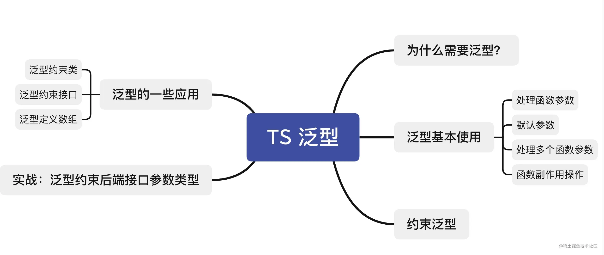

# TypeScript

## 什么是 TypeScript

TypeScript 是一种由微软开发的自由和开源的编程语言。它是 JavaScript 的一个超集，而且本质上向这个语言添加了可选的静态类型和基于类的面向对象编程。

> 简而言之，TypeScript是JavaScript的超集，具有可选的类型并可以编译为纯JavaScript。从技术上讲TypeScript就是具有静态类型的 JavaScript 。

## TypeScript优缺点

### 优点

- 增强代码的可维护性，尤其在大型项目的时候效果显著
- 友好地在编辑器里提示错误，编译阶段就能检查类型发现大部分错误
- 支持最新的JavaScript新特性
- 周边生态繁荣，vue3已全面支持 typescript

### 缺点

- 需要一定的学习成本
- 和一些插件库的兼容并不是特别完美，如以前在 vue2 项目里使用 typescript就并不是那么顺畅
- 增加前期开发的成本，毕竟你需要写更多的代码（但是便于后期的维护）

## 案例

这里是一个真实发生的编码错误，由于其他代码的影响，让我百思不得其解，耗费了大量时间。最终在AI的帮助下发现是由于简单的拼写错误造成的，如果使用了TypeScript技术，就不会发生类似的低级错误。

### AI debug

```js
export const getChatAssistants = async(state) => {
  window.electron.ipcRenderer.send('get-chat-assistants')
  window.electron.ipcRenderer.once('get-chat-assistants-return', (event, response) => {
    if (response.code !== 200) {
      ElNotification({
        title: '错误',
        message: response.message,
        type: 'error'
      })
    } else {
      state.chatAssistants = response.items
      if (state?.currentAssistant?.id) {
        state.currentAssistan = state.chatAssistants.find(
          (item) => item.id === state.currentAssistant.id
        )
      } else if (state.chatAssistants.length > 0) {
        state.currentAssistant = state.chatAssistants[0]
      }
      // 防止默认的currentAssistant为空（比如选中的currentAssistant被删除了）
      if (!state?.currentAssistant?.id) {
        state.currentAssistant = { id: '', prompt: '你是一个工作和学习中的助理。', mode: 'multi-turn' }
      }
    }
  })
}
```

这个函数有什么错误，为什么我的Assistant发生变化后没有刷新

### AI回答

这段代码有几个潜在的问题，导致 Assistant 改变后可能无法正确刷新：

1. **`currentAssistan` 拼写错误:**  `state.currentAssistan = state.chatAssistants.find(...)` 这里拼写错误，应该是 `state.currentAssistant`。这个错误会导致赋值失败，`state.currentAssistant` 的值不会更新，界面自然也不会刷新。

> 其它内容略……

### TypeScript解决方案

使用 TypeScript 可以帮助你在编译时就发现这种拼写错误，从而避免运行时出现问题。

如果使用 TypeScript，可以这样定义 `state` 的类型：

```typescript
interface ChatAssistant {
  id: string;
  prompt: string;
  mode: string;
}

interface State {
  chatAssistants: ChatAssistant[];
  currentAssistant: ChatAssistant | null; // 允许为空
}

export const getChatAssistants = async (state: State) => {
  // ... (其余代码与之前的修正版本类似)
  if (response.code !== 200) {
    // ...
    state.currentAssistant = { id: 'default', prompt: '你是一个工作和学习中的助理。', mode: 'multi-turn' };
  } else {
    state.chatAssistants = response.items;

    if (state?.currentAssistant?.id) {
      state.currentAssistant = state.chatAssistants.find(
        (item) => item.id === state.currentAssistant.id // TypeScript 会在这里检查 currentAssistant 的类型
      );
      // ... (其余逻辑)
    }
    // ...
  }
};

```

**由此可见TypeScript 的优势：**

* **静态类型检查:** TypeScript 会在编译时检查 `state.currentAssistan` 和 `state.currentAssistant` 的拼写，如果出现错误，会立即报错，避免运行时才发现问题。
* **代码提示和自动补全:**  IDE 会根据类型定义提供代码提示和自动补全，减少拼写错误的可能性。
* **更好的代码可读性和可维护性:**  明确的类型定义使代码更易于理解和维护。

## 安装环境

首先，我们可以新建一个空文件夹，用来学习 ts，例如我在文件夹下新建了个 `helloworld.ts`

```shell
#全局安装 ts
npm install -g  typescript 
```

不记得自己是否已经安装过 typescript 的，可以使用以下命令来验证：

```shell
tsc -v
```

如果出现版本，则说明已经安装成功

```shell
Version 4.6.3
```

生成 tsconfig.json 配置文件

```shell
tsc --init
```

执行命令后我们就可以看到生成了一个 tsconfig.json 文件，里面有一些配置信息，我们暂时先按下不表

在我们`helloworld.ts`文件中,随便写点什么

```typescript
const s:string = "helloworld";
console.log(s);
```

控制台执行 `tsc helloworld.ts` 命令，目录下生成了一个同名的 helloworld.js 文件，代码如下

```js
var s = "helloworld";
console.log(s);
```

通过tsc命令，发现我们的typescript代码被转换成了熟悉的js代码

我们接着执行即可看到输出结果

```shell
node helloworld.js
```

## 安装 ts-node

那么通过我们上面的一通操作，我们知道了运行tsc命令就可以编译生成一个js文件，但是如果每次改动我们都要手动去执行编译，然后再通过 node命令才能查看运行结果岂不是太麻烦了。

而 ts-node 正是来解决这个问题的

```shell
# 全局安装ts-node
npm i -g ts-node
```

有了这个插件，我们就可以直接运行.ts文件了

```shell
ts-node helloworld.ts
```

可以看到我们的打印结果已经输出

## TypeScript 基础类型

### Boolean 类型

```typescript
const flag: boolean = true;
```

### Number 类型

```typescript
const count: number = 10;
```

### String 类型

```typescript
let name: string = "张三";
```

### Enum 类型

枚举类型用于定义数值集合，使用枚举我们可以定义一些带名字的常量。 使用枚举可以清晰地表达意图或创建一组有区别的用例。

#### 普通枚举

初始值默认为 0 其余的成员会会按顺序自动增长 可以理解为数组下标

```ts
enum Color {
  RED,
  PINK,
  BLUE,
}

const red: Color = Color.RED;
console.log(red); // 0
```

#### 设置初始值

```ts
enum Color {
  RED = 2,
  PINK,
  BLUE,
}
const pink: Color = Color.PINK;
console.log(pink); // 3
```

#### 字符串枚举

```ts
enum Color {
  RED = "红色",
  PINK = "粉色",
  BLUE = "蓝色",
}

const pink: Color = Color.PINK;
console.log(pink); // 粉色
```

#### 常量枚举

使用 const 关键字修饰的枚举，常量枚举与普通枚举的区别是，整个枚举会在编译阶段被删除 我们可以看下编译之后的效果

```ts
const enum Color {
  RED,
  PINK,
  BLUE,
}

const color: Color[] = [Color.RED, Color.PINK, Color.BLUE];
console.log(color); //[0, 1, 2]

//编译之后的js如下：
var color = [0 /* RED */, 1 /* PINK */, 2 /* BLUE */];
// 可以看到我们的枚举并没有被编译成js代码 只是把color这个数组变量编译出来了
```

### Array 类型

对数组类型的定义有两种方式:

```typescript
const arr: number[] = [1,2,3];
const arr2: Array<number> = [1,2,3];
```

### 元组（tuple）类型

上面数组类型的方式，只能定义出内部全为同种类型的数组。对于内部不同类型的数组可以使用元组类型来定义

元组（ Tuple ）表示一个已知数量和类型的数组,可以理解为他是一种特殊的数组

```typescript
const tuple: [number, string] = [1, "张三"];
```

> 需要注意的是，元组类型只能表示一个已知元素数量和类型的数组，长度已指定，越界访问会提示错误。例如，一个数组中可能有多种类型，数量和类型都不确定，那就直接any[]。

### undefined和null

默认情况下 null 和 undefined 是所有类型的子类型。 也就是说你可以把 null 和 undefined 赋值给其他类型。

```typescript
let a: undefined = undefined;
let b: null = null;

let str: string = '张三';
str = null; // 编译正确
str = undefined; // 编译正确
```

如果你在tsconfig.json指定了"strictNullChecks":true ，即开启严格模式后， ~~null 和 undefined 只能赋值给 void 和它们各自的类型。~~  null 和 undefined 只能给它们自己的类型赋值

```typescript
// 启用 --strictNullChecks
let x: number;
x = 1; // 编译正确
x = undefined;    // 编译错误
x = null;    // 编译错误
```

**但是 undefined 可以给 void 赋值**

```ts
let c:void = undefined // 编译正确
let d:void = null // 编译错误
```

### any 类型

any会跳过类型检查器对值的检查，任何值都可以赋值给any类型

```typescript
let value: any = 1;
value = "张三"; // 编译正确
value = []; // 编译正确
value = {}; // 编译正确
```

### void 类型

void 意思就是无效的, 一般只用在函数上，告诉别人这个函数没有返回值。

```typescript
function sayHello(): void {
	console.log("hello 啊，张三！");
}
```

### never 类型

never 类型表示的是那些永不存在的值的类型。 例如never 类型是那些总是会抛出异常或根本就不会有返回值的函数表达式或箭头函数表达式的返回值类型

值会永不存在的两种情况：

- 如果一个函数执行时抛出了异常，那么这个函数永远不存在返回值（因为抛出异常会直接中断程序运行，这使得程序运行不到返回值那一步，即具有不可达的终点，也就永不存在返回了）
- 函数中执行无限循环的代码（死循环），使得程序永远无法运行到函数返回值那一步，永不存在返回。

```typescript
// 异常
function error(msg: string): never { // 编译正确
  throw new Error(msg); 
}

// 死循环
function loopForever(): never { // 编译正确
  while (true) {};
}
```

### Unknown 类型

unknown与any一样，所有类型都可以分配给unknown:

```typescript
let value: unknown = 1;
value = "张三"; // 编译正确
value = false; // 编译正确
```

unknown与any的最大区别是：

> 任何类型的值可以赋值给any，同时any类型的值也可以赋值给任何类型。unknown 任何类型的值都可以赋值给它，但它只能赋值给unknown和any

## 对象类型

这里所说的对象类型，就是我们常说的`函数、{}、数组、类`

### object, Object 和 {} 类型

#### object 

object 类型用于表示所有的非原始类型，即我们不能把 number、string、boolean、symbol等 原始类型赋值给 object。在严格模式下，null 和 undefined 类型也不能赋给 object。

```ts
let object: object;
object = 1; // 报错
object = "a"; // 报错
object = true; // 报错
object = null; // 报错
object = undefined; // 报错
object = {}; // 编译正确
```

#### Object

大Object代表所有拥有 toString、hasOwnProperty 方法的类型。所以所有原始类型、非原始类型都可以赋给 Object（严格模式下 null 和 undefined 不可以）

```ts
let bigObject: Object;
object = 1; // 编译正确
object = "a"; // 编译正确
object = true; // 编译正确
object = null; // 报错
ObjectCase = undefined; // 报错
ObjectCase = {}; // ok
```

#### {}

`{}`空对象类型和大Object 一样，也是表示原始类型和非原始类型的集合

### 类

在 TypeScript 中，我们通过 Class 关键字来定义一个类

```ts
class Person {
  name: string;
  age: number;
  constructor(name: string, age: number) {
    this.name = name;
    this.age = age;
  }
  sayHi(): void {
    console.log(`Hi, ${this.name}`);
  }
}
```

### 数组

```ts
const flag1: number[] = [1, 2, 3];
const flag2: Array<number> = [1, 2, 3];
```

### 函数

#### 函数声明

```ts
function add(x: number, y: number): number {
  return x + y;
}
```

#### 函数表达式

```ts
const add = function(x: number, y: number): number {
  return x + y;
}
```

#### 接口定义函数

```ts
interface Add {
  (x: number, y: number): number;
}
```

#### 可选参数

```ts
function add(x: number, y?: number): number {
  return y ? x + y : x;
}
```

#### 默认参数

```ts
function add(x: number, y: number = 0): number {
  return x + y;
}
```

#### 剩余参数

> js中定义函数之后，并不确定调用时会传递多少参数，可以使用剩余参数来获取参数。

```ts
function add(...numbers: number[]): number {
  let sum = 0;
  for (let i = 0; i < numbers.length; i++) {
    sum += numbers[i];
  }
  return sum;
}
```

#### 函数重载

函数重载或方法重载是使用相同名称和不同参数数量或类型创建多个方法的一种能力。

```ts
function add(x: number, y: number): number;
function add(x: string, y: string): string;
function add(x: any, y: any): any {
  return x + y;
}
```

上面示例中，我们给同一个函数提供多个函数类型定义，从而实现函数的重载

需要注意的是:

> 函数重载真正执行的是同名函数最后定义的函数体 在最后一个函数体定义之前全都属于函数类型定义 不能写具体的函数实现方法 只能定义类型

[TypeScript基础之函数重载 - 个人文章 - SegmentFault 思否](https://segmentfault.com/a/1190000042004610)

## 类型推论

如果没有明确的指定类型，那么 TypeScript 会依照类型推论的规则推断出一个类型。

```ts
let x = 1;
x = true; // 报错
```

上面的代码等价于

```ts
let x: number = 1;
x = true; // 报错
```

通过上述示例我们可以看出，我们没有给 x 指定明确类型的时候，typescript 会推断出 x 的类型是 number。

而如果定义的时候没有赋值，不管之后有没有赋值，都会被推断成 any 类型而完全不被类型检查：

```ts
let x;
x = 1; // 编译正确
x = true; // 编译正确
```

## 类型断言

某些情况下，我们可能比typescript更加清楚的知道某个变量的类型，所以我们可能希望手动指定一个值的类型

类型断言有两种方式

- 尖括号写法

```ts
let str: any = "to be or not to be";
let strLength: number = (<string>str).length;
```

- as 写法

```ts
let str: any = "to be or not to be";
let strLength: number = (str as string).length;
```

### 非空断言

在上下文中当类型检查器无法断定类型时，可以使用缀表达式操作符 `!` 进行断言操作对象是非 null 和非 undefined 的类型，**即x!的值不会为 null 或 undefined**

```ts
let user: string | null | undefined;
console.log(user!.toUpperCase()); // 编译正确
console.log(user.toUpperCase()); // 错误
```

### 确定赋值断言

```ts
let value:number
console.log(value); // Variable 'value' is used before being assigned.
```

我们定义了变量, 没有赋值就使用，则会报错

通过 `let x!: number;` 确定赋值断言，TypeScript 编译器就会知道该属性会被明确地赋值。

```ts
let value!:number
console.log(value); // undefined 编译正确
```

## 联合类型

联合类型用`|`分隔，表示取值可以为多种类型中的一种

```ts
let status:string|number
status='to be or not to be'
status=1
```

## 类型别名

类型别名用来给一个类型起个新名字。它只是起了一个新名字，并没有创建新类型。类型别名常用于联合类型。

```ts
type count = number | number[];
function hello(value: count) {}
```

## 交叉类型

交叉类型就是跟联合类型相反，用`&`操作符表示，交叉类型就是两个类型必须存在

```ts
interface IpersonA{
  name: string,
  age: number
}
interface IpersonB {
  name: string,
  gender: string
}

let person: IpersonA & IpersonB = { 
    name: "李四",
    age: 18,
    gender: "男"
};
```

person 即是 IpersonA 类型，又是 IpersonB 类型

> 注意：交叉类型取的多个类型的并集，但是如果key相同但是类型不同，则该key为never类型

```ts
interface IpersonA {
    name: string
}

interface IpersonB {
    name: number
}

function testAndFn(params: IpersonA & IpersonB) {
    console.log(params)
}

testAndFn({name: "王五"}) // error TS2322: Type 'string' is not assignable to type 'never'.
```

## 类型守卫

**类型保护是可执行运行时检查的一种表达式，用于确保该类型在一定的范围内**。 换句话说，类型保护可以保证一个字符串是一个字符串，尽管它的值也可以是一个数值。类型保护与特性检测并不是完全不同，其主要思想是尝试检测属性、方法或原型，以确定如何处理值。

换句话说：**类型守卫是运行时检查，确保一个值在所要类型的范围内**

目前主要有四种的方式来实现类型保护：

### in 关键字

```ts
interface InObj1 {
    a: number,
    x: string
}
interface InObj2 {
    a: number,
    y: string
}
function isIn(arg: InObj1 | InObj2) {
    // x 在 arg 打印 x
    if ('x' in arg) console.log('x')
    // y 在 arg 打印 y
    if ('y' in arg) console.log('y')
}
isIn({a:1, x:'xxx'});
isIn({a:1, y:'yyy'});
```

### typeof 关键字

```ts
function isTypeof( val: string | number) {
  if (typeof val === "number") return 'number'
  if (typeof val === "string") return 'string'
  return '啥也不是'
}
```

> typeof 只支持：typeof 'x' === 'typeName' 和 typeof 'x' !== 'typeName'，x 必须是  'number', 'string', 'boolean', 'symbol'。

### instanceof

```ts
function creatDate(date: Date | string){
    console.log(date)
    if(date instanceof Date){
        date.getDate()
    }else {
        return new Date(date)
    }
}
```

### 自定义类型保护的类型谓词

```ts
function isNumber(num: any): num is number {
    return typeof num === 'number';
}
function isString(str: any): str is string{
    return typeof str=== 'string';
}
```

## 接口

我们使用接口来定义对象的类型。接口是对象的状态(属性)和行为(方法)的抽象(描述)

简单理解就是：**为我们的代码提供一种约定**

我们使用关键字interface来声明接口

```ts
interface IPerson {
    name: string;
    age: number;
}
let tom: IPerson = {
    name: 'Tom',
    age: 25
};
```

我们定义了一个接口 Person，接着定义了一个变量 tom，它的类型是 Person。这样，我们就约束了 tom 的形状必须和接口 Person 一致。

接口一般首字母大写。(当然挺多人也习惯 I 大写字母开头，用来表示这是一个接口)

### 设置接口可选|只读

```ts
interface IPerson {
  readonly name: string;
  age?: number;
}
```

- 可选属性，我们最常见的使用情况是，不确定这个参数是否会传，或者存在。
- 只读属性用于限制只能在对象刚刚创建的时候修改其值。此外 TypeScript 还提供了 ReadonlyArray 类型，它与 Array 相似，只是把所有可变方法去掉了，因此可以确保数组创建后再也不能被修改。

### 索引签名

有时候我们希望一个接口中除了包含必选和可选属性之外，还允许有其他的任意属性，这时我们可以使用 **索引签名** 的形式来满足上述要求。

> 需要注意的是，一旦定义了任意属性，那么确定属性和可选属性的类型都必须是它的类型的子集

```ts
interface IPerson {
  name: string;
  age?: number;
  [prop: string]: any; //  prop字段必须是 string类型 or number类型。 值是any类型，也就是任意的
}

const p1:IPerson = { name: "张三" };
const p2:IPerson = { name: "李四", age: 28 };
const p3:IPerson = { name: "王五", sex: 1 }
```

我们规定 以 string 类型的值来索引，索引到的是一个 any 类型的值

### 接口与类型别名的区别

实际上，在大多数的情况下使用接口类型和类型别名的效果等价，但是在某些特定的场景下这两者还是存在很大区别。

> TypeScript 的核心原则之一是对值所具有的结构进行类型检查。 而接口的作用就是为这些类型命名和为你的代码或第三方代码定义数据模型。

> type(类型别名)会给一个类型起个新名字。 type 有时和 interface 很像，但是可以作用于原始值（基本类型），联合类型，元组以及其它任何你需要手写的类型。起别名不会新建一个类型 - 它创建了一个新名字来引用那个类型。给基本类型起别名通常没什么用，尽管可以做为文档的一种形式使用。

**接口和类型别名都可以用来描述对象或函数的类型，只是语法不同**

```ts
type MyTYpe = {
  name: string;
  say(): void;
}

interface MyInterface {
  name: string;
  say(): void;
}
```

**都允许扩展**

- interface 用 `extends` 来实现扩展

```ts
interface MyInterface {
  name: string;
  say(): void;
}

interface MyInterface2 extends MyInterface {
  sex: string;
}

let person:MyInterface2 = {
  name:'张三',
  sex:'男',
  say(): void {
    console.log("hello张三！");
  }
}
```

- type 使用 `&` 实现扩展

```ts
type MyType = {
  name:string;
  say(): void;
}
type MyType2 = MyType & {
  sex:string;
}
let value: MyType2 = {
  name:'张三',
  sex:'男',
  say(): void {
    console.log("hello张三！");
  }
}
```

### 不同点

- type可以声明基本数据类型别名/联合类型/元组等，而interface不行

```ts
// 基本类型别名
type UserName = string;
type UserName = string | number;
// 联合类型
type Animal = Pig | Dog | Cat;
type List = [string, boolean, number];
```

- interface能够合并声明，而type不行

```ts
interface Person {
  name: string
}
interface Person {
  age: number
}
// 此时Person同时具有name和age属性
```

## 泛型

泛型是指在定义函数、接口或类的时候，不预先指定具体的类型，而在使用的时候再指定类型的一种特性。



举个例子，比如我们现在有个这样的需求，我们要实现一个这样的函数，函数的参数可以是任何值，返回值就是将参数原样返回，并且参数的类型是 string，函数返回类型就为 string？

你很容易写下：

```ts
function getValue(arg:string):string  {
  return arg;
}
```

现在需求有变，需要返回一个 number 类型的值，你会说，联合类型就完事了：

```ts
function getValue(arg:string | number):string | number  {
  return arg;
}
```

但是这样又有一个问题，就是如果我们需要返回一个 boolean 类型，string 数组甚至任意类型呢，难道有多少个就写多少个联合类型？

是的，我们直接用 any 就行了！

```ts
function getValue(arg:any):any  {
  return arg;
}
```

尽管 any 大法好，很多时候 any 也确实能够解决不少问题，但是这样也不符合我们的需求了，传入和返回都是 any 类型，**传入和返回并没有统一**

这个时候就要祭出我们的泛型了

### 基本使用

泛型是指在定义函数、接口或类的时候，不预先指定具体的类型，而在使用的时候再指定类型的一种特性

上面的需求，我们如果用泛型来解决的话：

```ts
function getValue<T>(arg:T):T  {
  return arg;
}
```

泛型的语法是尖括号 `<>` 里面写类型参数，一般用 `T` 来表示第一个类型变量名称，其实它可以用任何有效名称来代替,比如我们用`NIUBI`也是编译正常的

> 泛型就像一个占位符一个变量，在使用的时候我们可以将定义好的类型像参数一样传入，原封不动的输出

**使用**

我们有两种方式来使用：

- 定义要使用的类型，比如：

```ts
getValue<string>('张三'); // 定义 T 为 string 类型
```

- 利用 typescript 的类型推断，比如：

```ts
getValue('张三') // 自动推导类型为 string
```

### 多个参数

其实并不是只能定义一个类型变量，我们可以引入希望定义的任何数量的类型变量。比如我们引入一个新的类型变量 U

```ts
function getValue<T, U>(arg:[T,U]):[T,U] {
  return arg;
}

// 使用
const str = getValue(['张三', 18]);
```

> 在IDE中typescript 给我们自动推断出getValue的输入、返回的类型：`function getValue<string, number>(arg: [string, number]): [string, number]`

### 泛型约束

在函数内部使用泛型变量的时候，由于事先不知道它是哪种类型，所以不能随意的操作它的属性或方法：

```ts
function getLength<T>(arg:T):T  {
  console.log(arg.length); // 报错，不能调用 length 属性
}
```

因为泛型 T 不一定包含属性 length，那么我想 getLength 这个函数只允许传入包含 length 属性的变量，该怎么做呢

这时，我们可以使用`extends`关键字来对泛型进行约束

```ts
interface Lengthwise {
  length: number;
}

function getLength<T extends Lengthwise>(arg:T):T  {
  console.log(arg.length); 
  return arg;
}
```

使用：

```ts
const str = getLength('张三')
const arr = getLength([1,2,3])
const obj = getLength({ length: 5 })
```

> 这里可以看出，不管你是 str，arr 还是obj，只要具有 length 属性，都可以

具体参考[轻松拿下 TS 泛型](https://juejin.cn/post/7064351631072526350)

### 泛型接口

在定义接口的时候指定泛型

```ts
interface KeyValue<T,U> {
  key: T;
  value: U;
}

const person1:KeyValue<string,number> = {
  key: '张三',
  value: 18
}
const person2:KeyValue<number,string> = {
  key: 20,
  value: '李四'
}
```

### 泛型类

```ts
class Test<T> {
  value: T;
  add: (x: T, y: T) => T;
}

let myTest = new Test<number>();
myTest.value = 0;
myTest.add = function (x, y) {
  return x + y;
};
```

### 泛型类型别名

```ts
type Cart<T> = { list: T[] } | T[];
let c1: Cart<string> = { list: ["1"] };
let c2: Cart<number> = [1];
```

### 泛型参数的默认类型

我们可以为泛型中的类型参数指定默认类型。当使用泛型时没有在代码中直接指定类型参数，从实际值参数中也无法推测出时，这个默认类型就会起作用。有点 js 里函数默认参数的意思。

```ts
function createArray<T = string>(length: number, value: T): Array<T> {
  let result: T[] = [];
  for (let i = 0; i < length; i++) {
    result[i] = value;
  }
  return result;
}
```

### 泛型工具类型

#### typeof

关键词除了做类型保护，还可以从实现推出类型，

```ts
//先定义变量，再定义类型
let p1 = {
  name: "张三",
  age: 18,
  gender: "male",
};
type People = typeof p1;
function getName(p: People): string {
  return p.name;
}
getName(p1);
```

#### keyof

可以用来获取一个对象接口中的所有 key 值

```ts
interface Person {
  name: string;
  age: number;
  gender: "male" | "female";
}

type PersonKey = keyof Person; //type PersonKey = 'name'|'age'|'gender';

function getValueByKey(p: Person, key: PersonKey) {
  return p[key];
}
let val = getValueByKey({ name: "张三", age: 18, gender: "male" }, "name");
console.log(val); // 张三
```

#### in

用来遍历枚举类型：

```ts
type Keys = "a" | "b" | "c"

type Obj =  {
  [p in Keys]: any
} // -> { a: any, b: any, c: any }
```

#### infer

在条件类型语句中，可以用 infer 声明一个类型变量并且对它进行使用。

```ts
type ReturnType<T> = T extends (
  ...args: any[]
) => infer R ? R : any;
```

infer R 就是声明一个变量来承载传入函数签名的返回值类型，简单说就是用它取到函数返回值的类型方便之后使用。

#### extends

有时候我们定义的泛型不想过于灵活或者说想继承某些类等，可以通过 extends 关键字添加泛型约束。

```ts
interface Lengthwise {
  length: number;
}

function loggingIdentity<T extends Lengthwise>(arg: T): T {
  console.log(arg.length);
  return arg;
}
```

现在这个泛型函数被定义了约束，因此它不再是适用于任意类型：

```ts
loggingIdentity(3);  // Error, number doesn't have a .length property
```

当我们传入合法的类型的值，即包含 length 属性的值时：

```ts
loggingIdentity({length: 10, name: '张麻子'}); // 编译正确
```

#### 索引访问操作符

使用 `[]` 操作符可以进行索引访问：

```ts
interface Person {
  name: string;
  age: number;
}

type x = Person["name"]; // x is string
```

### 内置工具类型

#### Required

将类型的属性变成必选

```ts
interface Person {
    name?: string,
    age?: number,
    hobby?: string[]
}

const user: Required<Person> = {
    name: "张三",
    age: 18,
    hobby: ["code"]
}
```

#### Partial

与 Required 相反，将所有属性转换为可选属性

```ts
interface Person {
    name: string,
    age: number,
}

const zhangsan:Person = {
  name:'张三'
} // error  Property 'age' is missing in type '{ name: string; }' but required in type 'Person'.
```

从上面知道，如果必传而我们少穿传了的话，就会报错

我们使用 Partial 将其变为可选

```ts
type User = Partial<Person>

const zhangsan: User={
  name:'张三'
} // 编译正确
```

#### Exclude

`Exclude<T, U>` 的作用是将某个类型中属于另一个的类型移除掉,剩余的属性构成新的类型

```ts
type T0 = Exclude<"a" | "b" | "c", "a">; // "b" | "c"
type T1 = Exclude<"a" | "b" | "c", "a" | "b">; // "c"
type T2 = Exclude<string | number | (() => void), Function>; // string | number
```

#### Extract

和 Exclude 相反，`Extract<T,U>` 从  T 中提取出 U。

```ts
type T0 = Extract<"a" | "b" | "c", "a" | "f">; // "a"
type T1 = Extract<string | number | (() => void), Function>; // () =>void
```

> 适用于：并集类型

#### Readonly

把数组或对象的所有属性值转换为只读的，这就意味着这些属性不能被重新赋值。

```ts
interface Person {
  name: string;
  age: number;
  gender?: "male" | "female";
}

let p: Readonly<Person> = {
  name: "hello",
  age: 10,
  gender: "male",
};
p.age = 11; // error  Cannot assign to 'age' because it is a read-only property.
```

#### Record

`Record<K extends keyof any, T>` 的作用是将 K 中所有的属性的值转化为 T 类型。

```ts
type Property = 'key1'|'key2'
type Person = Record<Property, string>;

const p: Person = {
  key1: "hello",
  key2: "张三",
};
```

#### Pick

从某个类型中挑出一些属性出来

```ts
type Person = {
  name: string;
  age:number;
  gender:string
}

type P1 = Pick<Person, "name" | "age">; // { name: string; age: number; }

const user:P1={
  name:'张三',
  age:18
}
```

#### Omit

与Pick相反，`Omit<T,K>` 从T中取出除去K的其他所有属性。

```ts
interface Person {
  name: string,
  age: number,
  gender: string
}
type P1 = Omit<Person, "age" | "gender">
const user:P1  = {
  name: '张三'
}
```

#### NonNullable

去除类型中的 `null` 和 `undefined`

```ts
type P1 = NonNullable<string | number | undefined>; // string | number
type P2 = NonNullable<string[] | null | undefined>; // string[]
```

#### ReturnType

用来得到一个函数的返回值类型

```ts
type Func = (value: string) => string;
const test: ReturnType<Func> = "1";
```

#### Parameters

用于获得函数的参数类型所组成的元组类型。

```ts
type P1 = Parameters<(a: number, b: string) => void>; // [number, string]
```

#### InstanceType

返回构造函数类型T的实例类型

```ts
class C {
  x = 0;
  y = 0;
}

type D = InstanceType<typeof C>;  // C
```

## 使用 infer 实现类型推断

[infer ](https://www.typescriptlang.org/docs/handbook/release-notes/typescript-2-8.html#type-inference-in-conditional-types)是在 typescript 2.8中新增的关键字。

infer 可以在 extends 条件类型的字句中，在真实分支中引用此推断类型变量，推断待推断的类型。

例如：用infer推断函数的返回值类型

```typescript
type ReturnType<T> = T extends (...args: any[]) => infer R ? R : any;

type fn = () => number
type fnReturnType = ReturnType<fn> // number
```

在这个例子中，

`T extends U ? X : Y`的形式为条件类型。

infer R代表待推断的返回值类型，如果T是一个函数(...args: any[]) => infer R，则返回函数的返回值R，否则返回any

### 案例

首先从一个问题引入，下面有一个模拟发送请求的方法，返回内容被包裹在 `Promise` 里面返回，我们怎样拿到 `Promise` 里面包裹的类型呢？

```js
type ResponseEntity<T> = {
    success: boolean;
    result: T | null;
    message: string;
}

function request<T>(req: T, timeout: number) {
    return Promise.race([
        new Promise<ResponseEntity<T>>(resolve => setTimeout(() => resolve({
            success: true,
            result: req,
            message: ""
        }), 3000)),
        new Promise<ResponseEntity<T>>((_, reject) => setTimeout(() => reject({
            success: false,
            result: null,
            message: "请求超时"
        }), timeout))
    ])
}
```

可以用 `typeof` 和 `ReturnType` 

```js
type Request = typeof request; // type Request = <T>(req: T, timeout: number) => Promise<ResponseEntity<T>>
type ReturnRequest = ReturnType<Request>; // type ReturnRequest = Promise<ResponseEntity<unknown>>
```

这样搞了之后最终只能拿到返回类型 `Promise<ResponseEntity<unknown>>` ，对于 `Promise` 里面的泛型参数就无能为力了。这个时候就要用到 `infer` 关键字进行类型推断。

所谓推断，就是你不用预先指定在泛型列表中，在运行时会自动判断，不过你得先预定义好整体的结构。举个例子

```js
type Foo<T> = T extends {t: infer Test} ? Test: string
```

首选看 extends 后面的内容，`{t: infer Test}` 可以看成是一个包含 t 属性的类型定义，这个 t 属性的 value 类型通过 infer 进行推断后会赋值给 Test 类型，如果泛型实际参数符合 `{t: infer Test}` 的定义那么返回的就是 Test 类型，否则默认给缺省的 string 类型。

举个例子加深下理解

```js
type One = Foo<number>  // string，因为number不是一个包含t的对象类型
type Two = Foo<{t: boolean}>  // boolean，因为泛型参数匹配上了，使用了infer对应的type
type Three = Foo<{a: number, t: () => void}> // () => void，泛型定义是参数的子集，同样适配
```

使用 `infer` 实际上就是定义了一个泛型函数，通过传入类型参数，然后返回指定的类型。`infer` 用来对满足的泛型类型进行子类型的抽取，有很多高级的泛型工具也巧妙的使用了这个方法。

回到最开始的问题，我们定义一个 `infer` 结构：

```js
type Awaited<T> = T extends Promise<infer U> ? U : T;
```

然后给这个结构传入实际参数：

```js
type Res = Awaited<ReturnRequest>;
/**
 * type Res = {
 *  success: boolean;
 *  result: unknown;
 *  message: string;
 * }
 */
```

这样我们就拿到了 `Promise` 内部的泛型参数。

## tsconfig.json

在文章开头环境安装部分，记得我们有生成一个 tsconfig.json 文件，那么这个文件究竟有什么用呢

tsconfig.json 是 TypeScript 项目的配置文件。

tsconfig.json 包含 TypeScript 编译的相关配置，通过更改编译配置项，我们可以让 TypeScript 编译出 ES6、ES5、node 的代码。

### 重要字段

- files - 设置要编译的文件的名称；
- include - 设置需要进行编译的文件，支持路径模式匹配；
- exclude - 设置无需进行编译的文件，支持路径模式匹配；
- compilerOptions - 设置与编译流程相关的选项。

### compilerOptions 选项

```json
{
  "compilerOptions": {

    /* 基本选项 */
    "target": "es5",                       // 指定 ECMAScript 目标版本: 'ES3' (default), 'ES5', 'ES6'/'ES2015', 'ES2016', 'ES2017', or 'ESNEXT'
    "module": "commonjs",                  // 指定使用模块: 'commonjs', 'amd', 'system', 'umd' or 'es2015'
    "lib": [],                             // 指定要包含在编译中的库文件
    "allowJs": true,                       // 允许编译 javascript 文件
    "checkJs": true,                       // 报告 javascript 文件中的错误
    "jsx": "preserve",                     // 指定 jsx 代码的生成: 'preserve', 'react-native', or 'react'
    "declaration": true,                   // 生成相应的 '.d.ts' 文件
    "sourceMap": true,                     // 生成相应的 '.map' 文件
    "outFile": "./",                       // 将输出文件合并为一个文件
    "outDir": "./",                        // 指定输出目录
    "rootDir": "./",                       // 用来控制输出目录结构 --outDir.
    "removeComments": true,                // 删除编译后的所有的注释
    "noEmit": true,                        // 不生成输出文件
    "importHelpers": true,                 // 从 tslib 导入辅助工具函数
    "isolatedModules": true,               // 将每个文件做为单独的模块 （与 'ts.transpileModule' 类似）.

    /* 严格的类型检查选项 */
    "strict": true,                        // 启用所有严格类型检查选项
    "noImplicitAny": true,                 // 在表达式和声明上有隐含的 any类型时报错
    "strictNullChecks": true,              // 启用严格的 null 检查
    "noImplicitThis": true,                // 当 this 表达式值为 any 类型的时候，生成一个错误
    "alwaysStrict": true,                  // 以严格模式检查每个模块，并在每个文件里加入 'use strict'

    /* 额外的检查 */
    "noUnusedLocals": true,                // 有未使用的变量时，抛出错误
    "noUnusedParameters": true,            // 有未使用的参数时，抛出错误
    "noImplicitReturns": true,             // 并不是所有函数里的代码都有返回值时，抛出错误
    "noFallthroughCasesInSwitch": true,    // 报告 switch 语句的 fallthrough 错误。（即，不允许 switch 的 case 语句贯穿）

    /* 模块解析选项 */
    "moduleResolution": "node",            // 选择模块解析策略： 'node' (Node.js) or 'classic' (TypeScript pre-1.6)
    "baseUrl": "./",                       // 用于解析非相对模块名称的基目录
    "paths": {},                           // 模块名到基于 baseUrl 的路径映射的列表
    "rootDirs": [],                        // 根文件夹列表，其组合内容表示项目运行时的结构内容
    "typeRoots": [],                       // 包含类型声明的文件列表
    "types": [],                           // 需要包含的类型声明文件名列表
    "allowSyntheticDefaultImports": true,  // 允许从没有设置默认导出的模块中默认导入。

    /* Source Map Options */
    "sourceRoot": "./",                    // 指定调试器应该找到 TypeScript 文件而不是源文件的位置
    "mapRoot": "./",                       // 指定调试器应该找到映射文件而不是生成文件的位置
    "inlineSourceMap": true,               // 生成单个 soucemaps 文件，而不是将 sourcemaps 生成不同的文件
    "inlineSources": true,                 // 将代码与 sourcemaps 生成到一个文件中，要求同时设置了 --inlineSourceMap 或 --sourceMap 属性

    /* 其他选项 */
    "experimentalDecorators": true,        // 启用装饰器
    "emitDecoratorMetadata": true          // 为装饰器提供元数据的支持
  }
}
复制代码
```

## 使用案例

### 集成 ESlint

代码检查是项目的重要组成部分，TypeScript 自身的约束相对简单只可以发现一些代码错误并不会帮助我们统一代码风格，当项目越来越庞大，开发人员越来越多时，代码风格的约束还是必不可少的。我们可以借助 ESLint 对代码风格进行约束，为了让 eslint 来解析 TypeScript 代码我们需要安装解析器 @typescript-eslint/parser 和 插件 @typescript-eslint/eslint-plugin：

```sh
npm install --save-dev @typescript-eslint/parser @typescript-eslint/eslint-plugin
```

注意： @typescript-eslint/parser 和 @typescript-eslint/eslint-plugin 必须使用相同的版本
在 .eslintrc.js 配置文件中添加选项：

```javascript
module.exports = {
  root: true,
  env: {
    node: true
  },
  'parser': '@typescript-eslint/parser',
  'plugins': ['@typescript-eslint'],
  extends: [
    // https://github.com/vuejs/eslint-plugin-vue
    'plugin:vue/vue3-essential',
    'plugin:@typescript-eslint/recommended',
    'eslint:recommended'
  ],
  // add your custom rules here
  // it is base on https://github.com/vuejs/eslint-config-vue
  rules: {
    '@typescript-eslint/no-use-before-define': 'error'
  }
}
```

### TypeScript 演练场

TypeScript 开发团队提供了一款非常实用的在线代码编辑工具 ——TypeScript 演练场

地址：https://www.typescriptlang.org/zh/play

- 左侧编写 TS 代码，右侧自动生成编译后的代码；
- 可以自主选择 TypeScript 编译版本；
- 版本列表最后一项是一个特殊版本 “Nightly” 即 “每日构建版本”，想尝试最新功能可以试试；
- 支持 TypeScript 大部分配置项和编译选项，可以模拟本地环境，查看代码片段的输出结果；

### JSDoc Generator 插件

如果使用的是 vscode 编辑器直接搜索（ JSDoc Generator 插件）

插件地址：https://marketplace.visualstudio.com/items?itemName=crystal-spider.jsdoc-generator 安装成功后，使用 Ctrl + Shift + P 打开命令面板，可以进行如下操作可以自动生成带有 TypeScript 声明类型的文档注释：

- 选择 Generate JSDoc 为当前光标处代码生成文档注释；
- 选择 Generate JSDoc for the current file 为当前文件生成文档注释；

### *.d.ts

.ts 是标准的 TypeScript 文件。其内容将被编译为 JavaScript。

*.d.ts 是允许在 TypeScript 中使用现有 JavaScript 代码的类型定义文件。

例如，我们有一个简单的 JavaScript 函数，用于计算两个数字的总和：

```js
// math.js
const sum = (a, b) => a + b
export { sum }
```

TypeScript 没有关于函数的任何信息，包括名称、参数类型。为了在 TypeScript 文件中使用该函数，我们在 d.ts 文件中提供其定义：

```typescript
// math.d.ts
declare function sum(a: number, b: number): number
```


现在，我们可以在 TypeScript 中使用该函数，而不会出现任何编译错误。

> d.ts 文件不包含任何实现，并且根本不编译为 JavaScript。

TypeScript 提供了一个名为 allowJs 的选项，允许在 TypeScript 中使用普通 JavaScript 代码。

```json
// tsconfig.json
{
  "compilerOptions": {
    "allowJs": true,
    ...
  }
}
```

当我们想要将现有的代码库从普通 JavaScript 迁移到 TypeScript 时，它非常有用。因此，我们可以将每个 JavaScript 文件逐个转换为 TypeScript，而不必完全转换整个代码。
### ts+axios 定义接口返回值的类型

我尝试去定义 Promise<自定义>里的自定义的类型，希望与数据接口返回的类型一致。目的是希望类型定义好之后可以不用去看文档也能知道这个接口返回的是哪些数据

接口实例：

> 接口：http://127.0.0.1/GetData

参数：

| 参数       | 类型     |
| ---------- | -------- |
| statusCode | number   |
| message    | string   |
| value      | Array< > |

```typescript
//类型
type ID = string;

interface ResponseOriginal<T> {
    statusCode?: number;
    message?: string;
    value: T;
}
type Response<T> = ResponseOriginal<T> | undefined;

//value
interface Value {
    item1: { name: string | null, num: number };
    item2: ArrayValueItem3[];
    item3: any[];  //或any一步到位....
}
interface ArrayValueItem3 {
    key: number | string,
    id: string,
    label: string
}

//接口
export const GetData = (
    id: ID
): Promise<Response<Value>> =>   //或Promise<Response<any>>不过这样未知value里面的数据
    get({
        url: 'http://127.0.0.1/GetData',
        config: { params: { id } },
    });
```

## 其他参考

* [还没用熟 TypeScript 社区已经开始抛弃了😭 - 掘金 (juejin.cn)](https://juejin.cn/post/7218117377052377143)
