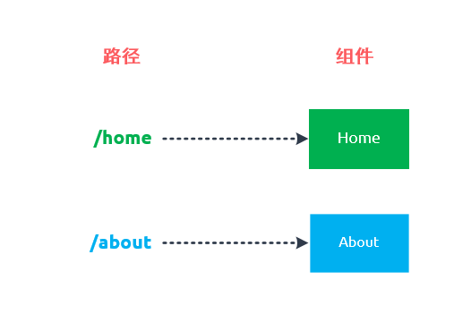
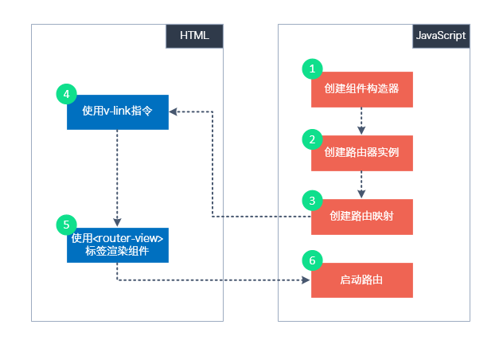
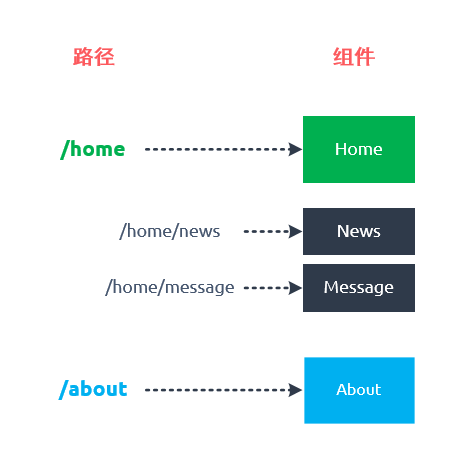
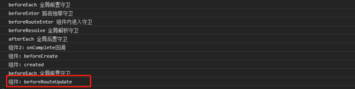
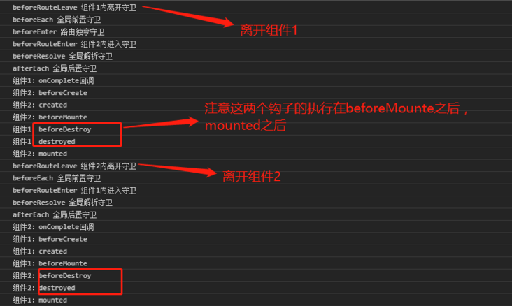

# Vue Router

Vue Router 是 [Vue.js](http://cn.vuejs.org/) 官方的路由管理器。它和 Vue.js 的核心深度集成，让构建单页面应用变得易如反掌。包含的功能有：

- 嵌套的路由/视图表
- 模块化的、基于组件的路由配置
- 路由参数、查询、通配符
- 基于 Vue.js 过渡系统的视图过渡效果
- 细粒度的导航控制
- 带有自动激活的 CSS class 的链接
- HTML5 历史模式或 hash 模式，在 IE9 中自动降级
- 自定义的滚动条行为

## 安装

### CDN

https://unpkg.com/vue-router@3

[Unpkg.com](https://unpkg.com/) 提供了基于 NPM 的 CDN 链接。上面的链接会一直指向在 NPM 发布的最新版本。你也可以像 `https://unpkg.com/vue-router@2.0.0/dist/vue-router.js` 这样指定 版本号 或者 Tag。

在 Vue 后面加载 `vue-router`，它会自动安装的：

```html
<script src="https://unpkg.com/vue@2"></script>
<script src="https://unpkg.com/vue-router@3"></script>
```

### NPM

```bash
npm install vue-router@3
```

如果在一个模块化工程中使用它，必须要通过 `Vue.use()` 明确地安装路由功能：

```js
import Vue from 'vue'
import VueRouter from 'vue-router'

Vue.use(VueRouter)
```

如果使用全局的 script 标签，则无须如此 (手动安装)。

### Vue CLI

如果你有一个正在使用 [Vue CLI](https://cli.vuejs.org/zh/) 的项目，你可以以项目插件的形式添加 Vue Router。CLI 可以生成上述代码及两个示例路由。**它也会覆盖你的 `App.vue`**，因此请确保在项目中运行以下命令之前备份这个文件：

```sh
vue add router
```

### 构建开发版

如果你想使用最新的开发版，就得从 GitHub 上直接 clone，然后自己 build 一个 `vue-router`。

```bash
git clone https://github.com/vuejs/vue-router.git node_modules/vue-router
cd node_modules/vue-router
npm install
npm run build
```

## 起步

用 Vue.js + Vue Router 创建单页应用，感觉很自然：使用 Vue.js ，我们已经可以通过组合组件来组成应用程序，当你要把 Vue Router 添加进来，我们需要做的是，将组件 (components) 映射到路由 (routes)，然后告诉 Vue Router 在哪里渲染它们。下面是个基本例子：

### HTML

```html
<script src="https://unpkg.com/vue@2"></script>
<script src="https://unpkg.com/vue-router@3"></script>

<div id="app">
  <h1>Hello App!</h1>
  <p>
    <!-- 使用 router-link 组件来导航. -->
    <!-- 通过传入 `to` 属性指定链接. -->
    <!-- <router-link> 默认会被渲染成一个 `<a>` 标签 -->
    <router-link to="/foo">Go to Foo</router-link>
    <router-link to="/bar">Go to Bar</router-link>
  </p>
  <!-- 路由出口 -->
  <!-- 路由匹配到的组件将渲染在这里 -->
  <router-view></router-view>
</div>
```

### JavaScript

```js
// 0. 如果使用模块化机制编程，导入Vue和VueRouter，要调用 Vue.use(VueRouter)

// 1. 定义 (路由) 组件。
// 可以从其他文件 import 进来
const Foo = { template: '<div>foo</div>' }
const Bar = { template: '<div>bar</div>' }

// 2. 定义路由
// 每个路由应该映射一个组件。 其中"component" 可以是
// 通过 Vue.extend() 创建的组件构造器，
// 或者，只是一个组件配置对象。
// 我们晚点再讨论嵌套路由。
const routes = [
  { path: '/foo', component: Foo },
  { path: '/bar', component: Bar }
]

// 3. 创建 router 实例，然后传 `routes` 配置
// 你还可以传别的配置参数, 不过先这么简单着吧。
const router = new VueRouter({
  routes // (缩写) 相当于 routes: routes
})

// 4. 创建和挂载根实例。
// 记得要通过 router 配置参数注入路由，
// 从而让整个应用都有路由功能
const app = new Vue({
  router
}).$mount('#app')

// 现在，应用已经启动了！
```

通过注入路由器，我们可以在任何组件内通过 `this.$router` 访问路由器，也可以通过 `this.$route` 访问当前路由：

```js
// Home.vue
export default {
  computed: {
    username() {
      // 我们很快就会看到 `params` 是什么
      return this.$route.params.username
    }
  },
  methods: {
    goBack() {
      window.history.length > 1 ? this.$router.go(-1) : this.$router.push('/')
    }
  }
}
```

该文档通篇都常使用 `router` 实例。留意一下 `this.$router` 和 `router` 使用起来完全一样。我们使用 `this.$router` 的原因是我们并不想在每个独立需要封装路由的组件中都导入路由。

### 完整示例

```html
<!DOCTYPE html>
<html>

<head>
  <meta charset="UTF-8">
</head>

<body>
  <div id="app">
    <h1>Hello App!</h1>
    <p>
      <!-- 使用 router-link 组件来导航. -->
      <!-- 通过传入 `to` 属性指定链接. -->
      <!-- <router-link> 默认会被渲染成一个 `<a>` 标签 -->
      <router-link to="/foo">Go to Foo</router-link>
      <router-link to="/bar">Go to Bar</router-link>
    </p>
    <!-- 路由出口 -->
    <!-- 路由匹配到的组件将渲染在这里 -->
    <router-view></router-view>
  </div>
</body>
<script src="https://unpkg.com/vue@2"></script>
<script src="https://unpkg.com/vue-router@3"></script>
<script>
  // 0. If using a module system, call Vue.use(VueRouter)

  // 1. Define route components.
  // These can be imported from other files
  const Foo = {
    template: '<div>foo</div>'
  }
  const Bar = {
    template: '<div>bar</div>'
  }

  // 2. Define some routes
  // Each route should map to a component. The "component" can
  // either be an actual component constructor created via
  // Vue.extend(), or just a component options object.
  // We'll talk about nested routes later.
  const routes = [{
      path: '/foo',
      component: Foo
    },
    {
      path: '/bar',
      component: Bar
    }
  ]

  // 3. Create the router instance and pass the `routes` option
  // You can pass in additional options here, but let's
  // keep it simple for now.
  const router = new VueRouter({
    routes
  })

  // 4. Create and mount the root instance.
  // Make sure to inject the router with the router option to make the
  // whole app router-aware.
  const app = new Vue({
    router
  }).$mount('#app')

  // Now the app has started!
</script>
<style type="text/css">
  .router-link-active {
    color: red;
  }
</style>

</html>
```

## 参考文档

* [Vue Router (vuejs.org)](https://router.vuejs.org/zh/)
* [Vue.js——vue-router 60分钟快速入门 - keepfool - 博客园 (cnblogs.com)](https://www.cnblogs.com/keepfool/p/5690366.html)

## 单页面应用

### 单页面应用案例

现在我们以一个简单的单页面应用开启vue-router之旅，这个单页面应用有两个路径：`/home`和`/about`，与这两个路径对应的是两个组件Home和About。




1. 引入vue、vue-router、bootstrap
2. 创建组件Home、About
3. 创建Router
4. 设定router-link
5. 使用`<router-view>`标签
6. 启动路由



> :warning: 2.0出来之后，v-link指令就被新组件`<router-link>`代替了

```html
<!DOCTYPE html>
<html>

<head>
    <meta charset="UTF-8">
    <link rel="stylesheet" href="https://cdn.bootcdn.net/ajax/libs/twitter-bootstrap/3.4.1/css/bootstrap.min.css" />
</head>

<body>
    <div id="app">
        <div class="row">
            <div class="col-xs-offset-2 col-xs-8">
                <div class="page-header">
                    <h2>Router Basic - 01</h2>
                </div>
            </div>
        </div>
        <div class="row">
            <div class="col-xs-2 col-xs-offset-2">
                <div class="list-group">
                    <!--router-link默认会被渲染成一个 `<a>` 标签-->
                    <router-link class="list-group-item" to="/home">Go to Home</router-link>
                    <router-link class="list-group-item" to="/about">Go to About</router-link>
                </div>
            </div>
            <div class="col-xs-6">
                <div class="panel">
                    <div class="panel-body">
                        <!--用于渲染匹配的组件-->
                        <router-view></router-view>
                    </div>
                </div>
            </div>
        </div>
    </div>
    <template id="home">
        <div>
            <h1>Home</h1>
            <p>{{msg}}</p>
        </div>
    </template>
    <template id="about">
        <div>
            <h1>About</h1>
            <p>This is the tutorial about vue-router.</p>
        </div>
    </template>
</body>
<script src="https://unpkg.com/vue@2"></script>
<script src="https://unpkg.com/vue-router@3"></script>
<script>
    /* 创建组件构造器  */
    var Home = Vue.extend({
        template: '<div><h1>Home</h1><p>{{msg}}</p></div>',
        data: function () {
            return {
                msg: 'Hello, vue router!'
            }
        }
    })

    var About = Vue.extend({
        template: '<div><h1>About</h1><p>This is the tutorial about vue-router.</p></div>'
    })
    // 创建Router
    const routes = [{
            path: '/home',
            component: Home
        },
        {
            path: '/about',
            component: About
        }
    ]
    const router = new VueRouter({
        routes
    })

    router.push("/home")
    // 启动路由
    const app = new Vue({
        router
    }).$mount('#app')
</script>

</html>
```

### router-link详解

路由定义如下

```js
const router = new VueRouter({
  routes: [
    {
      path: '/apple',
      // path: '/apple/:color',
      name: 'applename',
      component: User
    }
  ]
})
```

```html
<!-- 字符串 -->
<router-link to="apple"> to apple</router-link>
<!-- 对象 -->
<router-link :to="{path:'apple'}"> to apple</router-link>
<!-- 命名路由 -->
<router-link :to="{name: 'applename'}"> to apple</router-link>
<!-- 直接路由带查询参数query，地址栏变成 /apple?color=red -->
<router-link :to="{path: 'apple', query: {color: 'red' }}"> to apple</router-link>
<!-- 命名路由带查询参数query，地址栏变成/apple?color=red -->
<router-link :to="{name: 'applename', query: {color: 'red' }}"> to apple</router-link>
<!-- 直接路由带路由参数params，params 不生效，如果提供了 path，params 会被忽略 -->
<router-link :to="{path: 'apple', params: { color: 'red' }}"> to apple</router-link>
<!-- 命名路由带路由参数params，地址栏是/apple/red -->
<router-link :to="{name: 'applename', params: { color: 'red' }}"> to apple</router-link>
```

**replace**

设置 replace 属性的话，当点击时，会调用 router.replace() 而不是 router.push()，导航后不会留下 history 记录。

```html
<router-link :to="{ path: '/abc'}" replace></router-link>
```

**append**

设置 append 属性后，则在当前 (相对) 路径前添加基路径。例如，我们从 /a 导航到一个相对路径 b，如果没有配置 append，则路径为 /b，如果配了，则为 /a/b

```html
<router-link :to="{ path: 'relative/path'}" append></router-link>
```

**tag**

有时候想要 渲染成某种标签，例如li，于是我们使用 tag prop类指定何种标签，同样它还是会监听点击，触发导航。

```html
<router-link to="/foo" tag="li">foo</router-link>
<!-- 渲染结果 -->
<li>foo</li>
```

**active-class**

设置 链接激活时使用的 CSS 类名。可以通过以下代码来替代。 

```html
<style>
 ._active{
  background-color : red;
 }
</style>
<p>
 <router-link v-bind:to = "{ path: '/route1'}" active-class = "_active">Router Link 1</router-link>
 <router-link v-bind:to = "{ path: '/route2'}" tag = "span">Router Link 2</router-link>
</p>
注意这里 class 使用 active_class="_active"。

```

**exact-active-class**

配置当链接被精确匹配的时候应该激活的 class。可以通过以下代码来替代。

```html
<p>
 <router-link v-bind:to = "{ path: '/route1'}" exact-active-class = "_active">Router Link 1</router-link>
 <router-link v-bind:to = "{ path: '/route2'}" tag = "span">Router Link 2</router-link>
</p>
```

**event**

声明可以用来触发导航的事件。可以是一个字符串或是一个包含字符串的数组。

```html
<router-link v-bind:to = "{ path: '/route1'}" event = "mouseover">Router Link 1</router-link>
```

以上代码设置了 event 为 mouseover ，及在鼠标移动到 Router Link 1 上时导航的 HTML 内容会发生改变。

### router.push详解

```javascript
// 字符串
router.push('apple')
// 对象
router.push({path:'apple'})
// 命名路由
router.push({name: 'applename'})
//直接路由带查询参数query，地址栏变成 /apple?color=red
router.push({path: 'apple', query: {color: 'red' }})
// 命名路由带查询参数query，地址栏变成/apple?color=red
router.push({name: 'applename', query: {color: 'red' }})
// 直接路由带路由参数params，params 不生效，如果提供了 path，params 会被忽略
router.push({path:'applename', params:{ color: 'red' }})
// 命名路由带路由参数params，地址栏是/apple/red
router.push({name:'applename', params:{ color: 'red' }})
```

### 注意点

1. 关于带参数的路由总结如下：

> 无论是直接路由“path”还是命名路由“name”，带查询参数query，地址栏会变成“/url?查询参数名=查询参数值”;
>
> 直接路由“path”带路由参数params，params不生效;
>
> 命名路由“name”带路由参数params 地址栏保持是“/url/路由参数值”;

2. 设置路由map里的path值：

>  带路由参数params时，路由map里的path应该写成: `path:'/apple/:color' ;`
>
>  带查询参数query时，路由map里的path应该写成: `path:'/apple' ；`

3. 获取参数方法：

> 在组件中： `{{$route.params.color}}`、`{{$route.query.color}}`
>
> 在js里： `this.$route.params.color`、`this.$route.query.color`

## 嵌套路由

嵌套路由是个常见的需求，假设用户能够通过路径`/home/news`和`/home/message`访问一些内容，一个路径映射一个组件，访问这两个路径也会分别渲染两个组件。




```html
<!DOCTYPE html>
<html>

<head>
    <meta charset="UTF-8">
    <link rel="stylesheet" href="https://cdn.bootcdn.net/ajax/libs/twitter-bootstrap/3.4.1/css/bootstrap.min.css" />
</head>

<body>
    <div id="app">
        <div class="row">
            <div class="col-xs-offset-2 col-xs-8">
                <div class="page-header">
                    <h2>Router Basic - 02</h2>
                </div>
            </div>
        </div>
        <div class="row">
            <div class="col-xs-2 col-xs-offset-2">
                <div class="list-group">
                    <!--router-link默认会被渲染成一个 `<a>` 标签-->
                    <router-link class="list-group-item" to="/home">Go to Home</router-link>
                    <router-link class="list-group-item" to="/about">Go to About</router-link>
                </div>
            </div>
            <div class="col-xs-6">
                <div class="panel">
                    <div class="panel-body">
                        <!--用于渲染匹配的组件-->
                        <router-view></router-view>
                    </div>
                </div>
            </div>
        </div>
    </div>
    <template id="home">
        <div>
            <div>
                <h1>Home</h1>
                <p>{{msg}}</p>
            </div>
            <div>
                <ul class="nav nav-tabs">
                    <li>
                        <router-link class="list-group-item" to="/home/news">News</router-link>
                    </li>
                    <li>
                        <router-link class="list-group-item" to="/home/message">Messages</router-link>
                    </li>
                </ul>
                <p>
                    <router-view></router-view>
                </p>
            </div>
        </div>
    </template>

    <template id="news">
        <ul>
            <li>News 01</li>
            <li>News 02</li>
            <li>News 03</li>
        </ul>
    </template>
    <template id="message">
        <ul>
            <li>Message 01</li>
            <li>Message 02</li>
            <li>Message 03</li>
        </ul>
    </template>
</body>
<script src="https://unpkg.com/vue@2"></script>
<script src="https://unpkg.com/vue-router@3"></script>
<script>
    /* 创建组件构造器  */
    var Home = Vue.extend({
        template: '#home',
        data: function () {
            return {
                msg: 'Hello, vue router!'
            }
        }
    })

    var About = Vue.extend({
        template: '<div><h1>About</h1><p>This is the tutorial about vue-router.</p></div>'
    })

    var News = Vue.extend({
        template: '#news'
    })

    var Message = Vue.extend({
        template: '#message'
    })
    // 创建Router
    const routes = [{
            path: '/home',
            component: Home,
            children: [{
                    path: 'news',
                    component: News
                },
                {
                    path: 'message',
                    component: Message
                }
            ]
        },
        {
            path: '/about',
            component: About
        }
    ]
    const router = new VueRouter({
        routes
    })

    router.push("/home")
    // 启动路由
    const app = new Vue({
        router
    }).$mount('#app')
</script>

</html>
```

> :warning: **注意：**这里有一个概念要区分一下，`/home/news`和`/home/message`是`/home`路由的子路由，与之对应的News和Message组件并不是Home的子组件。

## HTML5 History 模式

`vue-router` 默认 hash 模式 —— 使用 URL 的 hash 来模拟一个完整的 URL，于是当 URL 改变时，页面不会重新加载。

如果不想要很丑的 hash，我们可以用路由的 **history 模式**，这种模式充分利用 `history.pushState` API 来完成 URL 跳转而无须重新加载页面。

```js
const router = new VueRouter({
  mode: 'history',
  routes: [...]
})
```

当你使用 history 模式时，URL 就像正常的 url，例如 `http://yoursite.com/user/id`，也好看！

不过这种模式要玩好，还需要后台配置支持。因为我们的应用是个单页客户端应用，如果后台没有正确的配置，当用户在浏览器直接访问 `http://oursite.com/user/id` 就会返回 404，这就不好看了。

所以呢，你要在服务端增加一个覆盖所有情况的候选资源：如果 URL 匹配不到任何静态资源，则应该返回同一个 `index.html` 页面，这个页面就是你 app 依赖的页面。

### 后端配置例子

> **注意**：下列示例假设你在根目录服务这个应用。如果想部署到一个子目录，你需要使用 [Vue CLI 的 `publicPath` 选项 (opens new window)](https://cli.vuejs.org/zh/config/#publicpath)和相关的 [router `base` property (opens new window)](https://router.vuejs.org/zh/api/#base)。你还需要把下列示例中的根目录调整成为子目录 (例如用 `RewriteBase /name-of-your-subfolder/` 替换掉 `RewriteBase /`)。

#### Apache

```xml
<IfModule mod_rewrite.c>
  RewriteEngine On
  RewriteBase /
  RewriteRule ^index\.html$ - [L]
  RewriteCond %{REQUEST_FILENAME} !-f
  RewriteCond %{REQUEST_FILENAME} !-d
  RewriteRule . /index.html [L]
</IfModule>
```

除了 `mod_rewrite`，你也可以使用 [`FallbackResource` (opens new window)](https://httpd.apache.org/docs/2.2/mod/mod_dir.html#fallbackresource)。

#### nginx

```nginx
location / {
  try_files $uri $uri/ /index.html;
}
```

#### 原生Node.js

```js
const http = require('http')
const fs = require('fs')
const httpPort = 80

http.createServer((req, res) => {
  fs.readFile('index.html', 'utf-8', (err, content) => {
    if (err) {
      console.log('We cannot open "index.html" file.')
    }

    res.writeHead(200, {
      'Content-Type': 'text/html; charset=utf-8'
    })

    res.end(content)
  })
}).listen(httpPort, () => {
  console.log('Server listening on: http://localhost:%s', httpPort)
})
```

#### 基于 Node.js 的 Express

对于 Node.js/Express，请考虑使用 [connect-history-api-fallback 中间件 (opens new window)](https://github.com/bripkens/connect-history-api-fallback)。

#### Internet Information Services (IIS)

1. 安装 [IIS UrlRewrite(opens new window)](https://www.iis.net/downloads/microsoft/url-rewrite)
2. 在你的网站根目录中创建一个 `web.config` 文件，内容如下：

```xml
<?xml version="1.0" encoding="UTF-8"?>
<configuration>
  <system.webServer>
    <rewrite>
      <rules>
        <rule name="Handle History Mode and custom 404/500" stopProcessing="true">
          <match url="(.*)" />
          <conditions logicalGrouping="MatchAll">
            <add input="{REQUEST_FILENAME}" matchType="IsFile" negate="true" />
            <add input="{REQUEST_FILENAME}" matchType="IsDirectory" negate="true" />
          </conditions>
          <action type="Rewrite" url="/" />
        </rule>
      </rules>
    </rewrite>
  </system.webServer>
</configuration>
```

## 高级技巧

### 响应路由参数变化

针对复用组件（只是路由参数发生改变），生命周期函数钩子不会被调用，如何能刷新组件

- watch监听

  ```javascript
  watch: {
    '$route' (to, from) {
    	// 对路由变化作出响应...
    }
  }
  ```

- beforeRouteUpdate

  ```javascript
  beforeRouteUpdate (to, from, next) {
  	// react to route changes...
  	// don't forget to call next()
  }
  ```

### 路由匹配

```javascript
{
    // 会匹配所有路径
    path: '*'
},
{
    // 会匹配以 `/user-` 开头的任意路径
    path: '/user-*'
}
```

> 注意：当使用通配符路由时，请确保路由的顺序是正确的，也就是说含有通配符的路由应该放在最后。路由 { path: '*' } 通常用于客户端 404 错误。

当使用一个通配符时，$route.params 内会自动添加一个名为 pathMatch 参数。

它包含了 URL 通过通配符被匹配的部分：

```javascript
// 给出一个路由 { path: '/user-*' }
this.$router.push('/user-admin')
this.$route.params.pathMatch // 'admin'
// 给出一个路由 { path: '*' }
this.$router.push('/non-existing')
this.$route.params.pathMatch // '/non-existing'
```

### 高级匹配模式

```html
<!-- 命名参数必须有"单个字符"[A-Za-z09]组成
?可选参数{ path: '/optional-params/:foo?' }
路由跳转是可以设置或者不设置foo参数，可选
-->
<router-link to="/optional-params">/optional-params</router-link>
<router-link to="/optional-params/foo">/optional-params/foo</router-link>
 
<!--  零个或多个参数
{ path: '/optional-params/*' }
-->
<router-link to="/number">没有参数</router-link>
<router-link to="/number/foo000">一个参数</router-link>
<router-link to="/number/foo111/fff222">多个参数</router-link>
 
<!--   一个或多个参数
{ path: '/optional-params/:foo+' }
-->
<router-link to="/number/foo">一个参数</router-link>
<router-link to="/number/foo/foo111/fff222">多个参数</router-link>
 
<!--  自定义匹配参数
可以为所有参数提供一个自定义的regexp，它将覆盖默认值（[^\/]+）
{ path: '/optional-params/:id(\\d+)' }
{ path: '/optional-params/(foo/)?bar' }
-->
```

### 匹配优先级

有时候一个路径可能匹配多个路由。

此时，匹配的优先级就是按照路由的定义顺序：先定义，优先级最高。

### 路由视图

有时候想同时 (同级) 展示多个视图，而不是嵌套展示，例如创建一个布局，有 sidebar (侧导航) 和 main (主内容) 两个视图，这个时候命名视图就派上用场了。

你可以在界面中拥有多个单独命名的视图，而不是只有一个单独的出口。

如果 router-view 没有设置名字，那么默认为 default。

```html
<router-view class="view one"></router-view>
<router-view class="view two" name="a"></router-view>
<router-view class="view three" name="b"></router-view>
```

一个视图使用一个组件渲染，因此对于同个路由，多个视图就需要多个组件。

确保正确使用 components 配置 (带上 s)：

```javascript
const router = new VueRouter({
routes: [
  {
    path: '/',
    components: {
        default: Foo,
        a: Bar,
        b: Baz
    }
    }
  ]
});
```

### 重定向

```javascript
{ path: '/a', redirect: '/b' }
{ path: '/a', redirect: { name: 'foo' }}
{ path: '/a', redirect: to => {
  // 方法接收 目标路由 作为参数
  // return 重定向的 字符串路径/路径对象
}}
```

### 导航守卫

#### 三种全局守卫

- router.beforeEach 全局前置守卫 进入路由之前。
- router.beforeResolve 全局解析守卫2.5.0新增。在beforeRouteEnter调用之后调用。
- router.afterEach 全局后置钩子 进入路由之后

```javascript
// 入口文件
import router from './router'
 
// 全局前置守卫
router.beforeEach((to, from, next) => {
	console.log('beforeEach 全局前置守卫');
	next();
});
// 全局解析守卫
router.beforeResolve((to, from, next) => {
	console.log('beforeResolve 全局解析守卫');
	next();
});
// 全局后置守卫
router.afterEach((to, from) => {
	console.log('afterEach 全局后置守卫');
});
```

#### 路由独享守卫

- beforeEnter全局前置守卫进入路由之前。

```javascript
{
  path: '/number/:name',
  props: true,
  name: 'number',
  // 路由独享守卫
  beforeEnter: (to, from, next) => {
      console.log('beforeEnter 路由独享守卫');
      next();
  },
  component: () => import( /* webpackChunkName: "number" */ './views/Number.vue')
}
```

#### 组件内守卫
- beforeRouteEnter
- beforeRouteUpdate
- beforeRouteLeave

```javascript
beforeRouteEnter(to, from, next) {
  // 在渲染该组件的对应路由被 confirm 前调用
  // 不！能！获取组件实例 `this`
  // 因为当守卫执行前，组件实例还没被创建
  console.log('beforeRouteEnter 组件内进入守卫');
  next();
},
beforeRouteUpdate(to, from, next) {
  // 在当前路由改变，但是该组件被复用时调用
  // 举例来说，对于一个带有动态参数的路径 /foo/:id，在 /foo/1 和 /foo/2 之间跳转的时候，
  // 由于会渲染同样的 Foo 组件，因此组件实例会被复用。而这个钩子就会在这个情况下被调用。
  // 可以访问组件实例 `this`
  console.log('beforeRouteUpdate 组件内更新守卫');
  next();
},
beforeRouteLeave(to, from, next) {
  // 导航离开该组件的对应路由时调用
  // 可以访问组件实例 `this`
  console.log('beforeRouteLeave 组件内离开守卫');
  next();
}
```

- 组件1跳转到组件2，然后组件2跳转组件2本身
  
- 组件1跳转到组件2，然后组件2跳转组件1
  

#### 案例

使用案例，利用beforeEach判断是否有user信息，没有则跳转到登录页面。

```javascript
router.beforeEach((to, from, next) => {
  if (to.path === '/login') {
    sessionStorage.removeItem('user')
  }
  const user = JSON.parse(sessionStorage.getItem('user'))
  console.log(user)
  if (
    !user &&
    to.path !== '/login' &&
    !to.path.startsWith('/share') &&
    !to.path.startsWith('/public_cad_view') &&
    !to.path.startsWith('/public_view')
  ) {
    next({
      path: '/login'
    })
  } else {
    next()
  }
})
```

### 守卫的 next 方法

next: 调用该方法 resolve 钩子。

- ==`next()`==: 进行管道中的下一个钩子。如果全部钩子执行完了，则导航的状态就是 confirmed (确认的)。
- ==`next(false)`==: 中断当前的导航。如果浏览器的 URL 改变了 (可能是用户手动或者浏览器后退按钮)，那么 URL 地址会重置到 from 路由对应的地址。
- ==`next('/') 或者 next({ path: '/' })`==: 跳转到一个不同的地址。当前的导航被中断，然后进行一个新的导航。你可以向 next 传递任意位置对象，且允许设置诸如 replace: true、name: 'home' 之类的选项以及任何用在 router-link 的 to prop 或 router.push 中的选项。
- ==`next(error)`==: (2.4.0+) 如果传入 next 的参数是一个 Error 实例，则导航会被终止且该错误会被传递给 router.onError() 注册过的回调。

## Vue Router 3 和 4 的主要区别

Vue Router 4 是 Vue Router 的一个破坏性更新版本，带来了许多新功能和改进，同时也进行了一些 API 的调整。

> **Vue Router 版本:** Vue 2 项目使用 Vue Router 3，而 Vue 3 项目使用 Vue Router 4。

### 主要区别

#### Vue 2 项目示例 (使用 Vue Router 3)

```javascript
// src/router/index.js
import Vue from 'vue'
import VueRouter from 'vue-router'
import Home from '../views/Home.vue'

Vue.use(VueRouter)

const routes = [
  {
    path: '/',
    name: 'Home',
    component: Home
  },
  {
    path: '/about',
    name: 'About',
    component: () => import(/* webpackChunkName: "about" */ '../views/About.vue')
  }
]

const router = new VueRouter({
  mode: 'history',
  base: process.env.BASE_URL,
  routes
})

export default router

// src/main.js
import Vue from 'vue'
import App from './App.vue'
import router from './router'

Vue.config.productionTip = false

new Vue({
  router,
  render: h => h(App)
}).$mount('#app')
```

#### Vue 3 项目示例 (使用 Vue Router 4)

```javascript
// src/router/index.js
import { createRouter, createWebHistory } from 'vue-router'
import Home from '../views/Home.vue'

const routes = [
  {
    path: '/',
    name: 'Home',
    component: Home
  },
  {
    path: '/about',
    name: 'About',
    component: () => import(/* webpackChunkName: "about" */ '../views/About.vue')
  }
]

const router = createRouter({
  history: createWebHistory(process.env.BASE_URL),
  routes
})

export default router

// src/main.js
import { createApp } from 'vue'
import App from './App.vue'
import router from './router'

const app = createApp(App)

app.use(router)

app.mount('#app')
```

* **Vue Router 版本:** Vue 2 项目使用 Vue Router 3，而 Vue 3 项目使用 Vue Router 4。
* **安装方式:** Vue Router 4 不需要手动调用 `Vue.use(VueRouter)`。
* **路由实例化:** Vue Router 4 使用 `createRouter` 创建路由实例。
* **路由模式:** Vue Router 4 使用 `createWebHistory` 指定路由模式。
* **Vue 实例化:** Vue 3 使用 `createApp` 创建应用实例，并使用 `app.use(router)` 注册路由。

### 区别详解

**1. 安装和使用方式:**

* **Vue Router 3:** 需要分别安装 `vue-router` 包，并在 Vue 应用中手动实例化和配置路由器。
* **Vue Router 4:**  与 Vue 3 核心库更加紧密地集成，可以通过 `createRouter` API 创建路由实例。

**2. 路由定义方式:**

* **Vue Router 3:** 使用 `routes` 数组定义路由，每个路由对象包含 `path`、`component` 等属性。
* **Vue Router 4:**  继续使用 `routes` 数组定义路由，但路由对象的结构更加灵活，可以定义多个组件视图，并支持嵌套路由。

**3. 导航守卫:**

* **Vue Router 3:**  使用 `beforeEach`、`afterEach` 等全局守卫，以及路由独享的守卫。
* **Vue Router 4:**  继续支持全局守卫和路由独享守卫，但 API 更加简洁，并引入了新的 `beforeRouteUpdate` 守卫，用于监听当前路由变化。

**4.  路由模式:**

* **Vue Router 3:**  支持 `hash` 和 `history` 两种路由模式。
* **Vue Router 4:**  继续支持 `hash` 和 `history` 两种路由模式，并新增了 `abstract` 模式，用于服务端渲染和测试。

**5.  其他变化:**

* **Vue Router 4:**  移除了 `mode` 选项，默认使用 `history` 模式。
* **Vue Router 4:**  新增了 `scrollBehavior` 函数，用于控制页面滚动行为。
* **Vue Router 4:**  优化了性能和代码结构。

### 代码示例

为了更直观地展示 Vue Router 3 和 4 的区别，我们来看一些代码示例：

**1. 路由定义：**

**Vue Router 3:**

```javascript
import Vue from 'vue'
import VueRouter from 'vue-router'
import Home from '../views/Home.vue'

Vue.use(VueRouter)

const routes = [
  {
    path: '/',
    name: 'Home',
    component: Home
  },
  {
    path: '/about',
    name: 'About',
    // 路由懒加载
    component: () => import(/* webpackChunkName: "about" */ '../views/About.vue')
  }
]

const router = new VueRouter({
  mode: 'history',
  base: process.env.BASE_URL,
  routes
})

export default router
```

**Vue Router 4:**

```javascript
import { createRouter, createWebHistory } from 'vue-router'
import Home from '../views/Home.vue'

const routes = [
  {
    path: '/',
    name: 'Home',
    component: Home
  },
  {
    path: '/about',
    name: 'About',
    component: () => import(/* webpackChunkName: "about" */ '../views/About.vue')
  }
]

const router = createRouter({
  history: createWebHistory(process.env.BASE_URL),
  routes
})

export default router
```

**区别:**

* Vue Router 4 使用 `createRouter` 创建路由实例，并使用 `createWebHistory` 指定路由模式。
* Vue Router 4 不再需要手动调用 `Vue.use(VueRouter)`。

**2. 导航守卫:**

**Vue Router 3:**

```javascript
router.beforeEach((to, from, next) => {
  // ... 导航守卫逻辑
  next()
})
```

**Vue Router 4:**

```javascript
router.beforeEach((to, from) => {
  // ... 导航守卫逻辑
  return true // 允许导航
})
```

**区别:**

* Vue Router 4 的 `beforeEach` 守卫不再需要调用 `next()` 函数，而是直接返回一个布尔值或 Promise 来控制导航行为。

**3. 页面滚动行为:**

**Vue Router 4:**

```javascript
const router = createRouter({
  // ...
  scrollBehavior(to, from, savedPosition) {
    // ... 自定义页面滚动行为
  }
})
```

**区别:**

* Vue Router 4 新增了 `scrollBehavior` 函数，用于控制页面滚动行为，例如滚动到页面顶部或特定位置。

总而言之，Vue Router 4 在保持核心功能的基础上，对 API 进行了优化和调整，使得路由管理更加简洁和灵活。建议开发者参考官方文档，学习和使用 Vue Router 4 的新特性。
