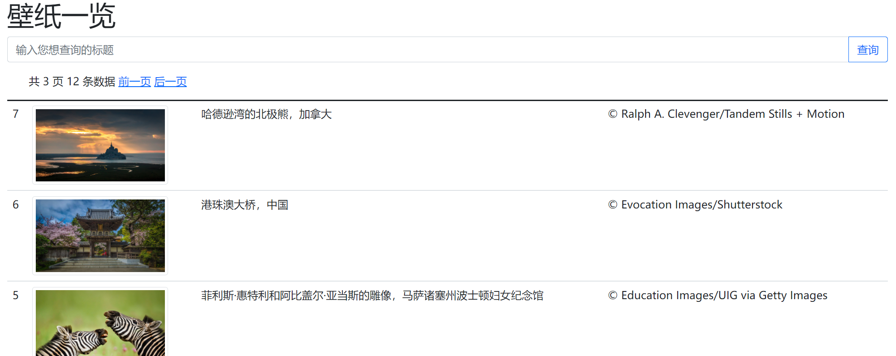
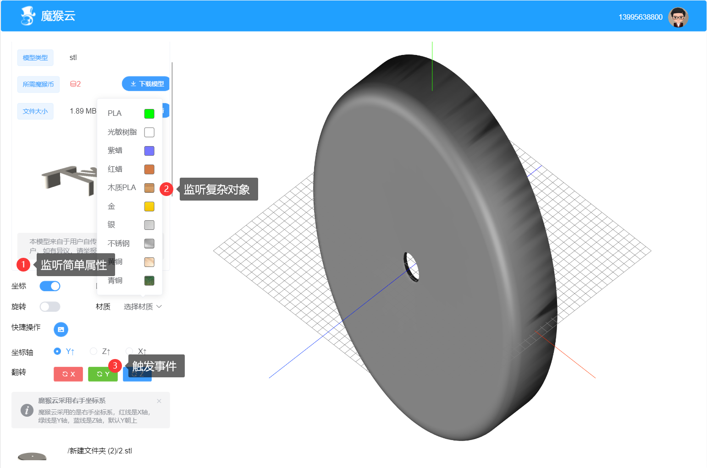
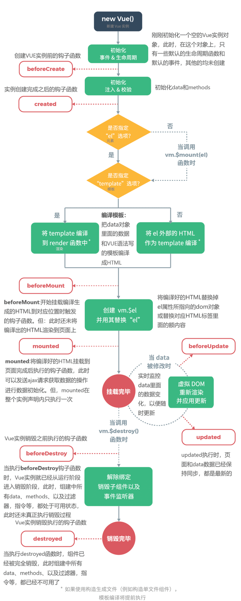
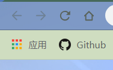
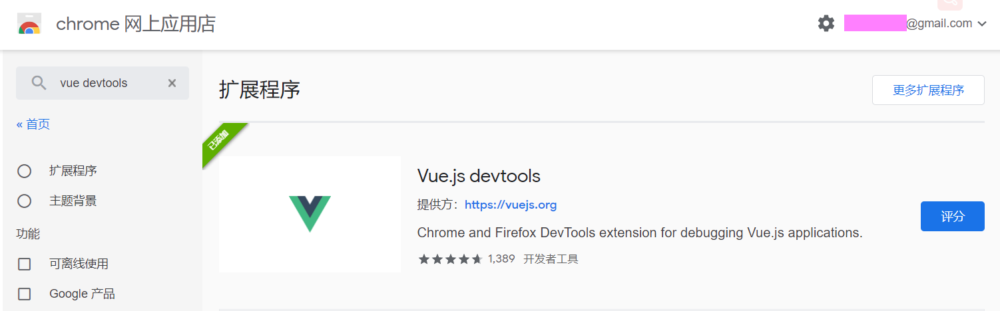
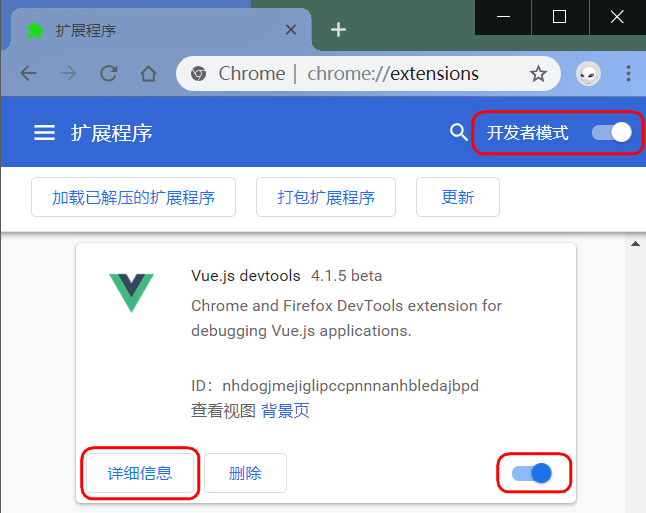
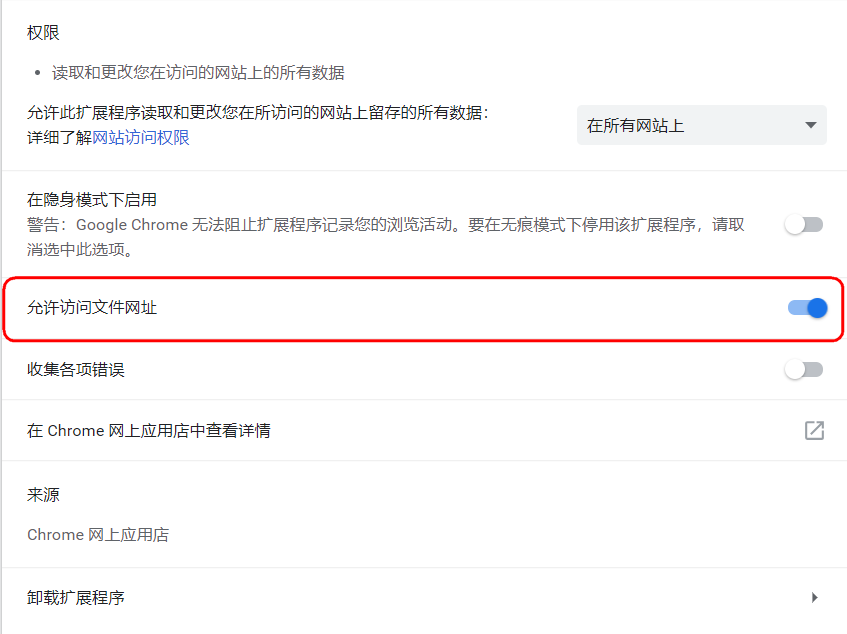
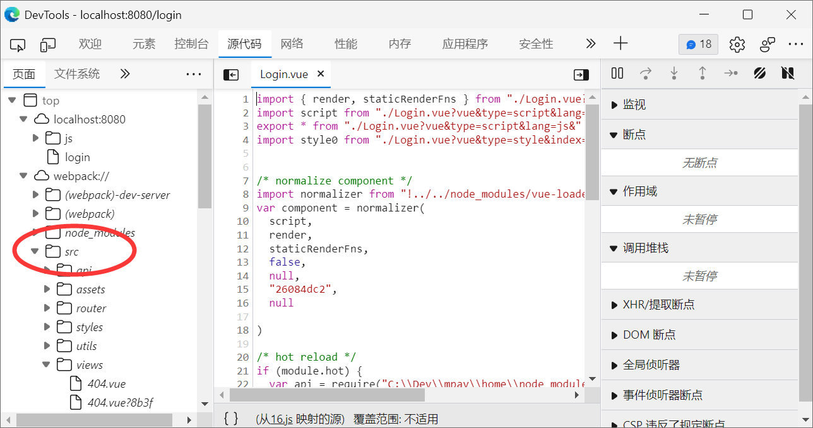
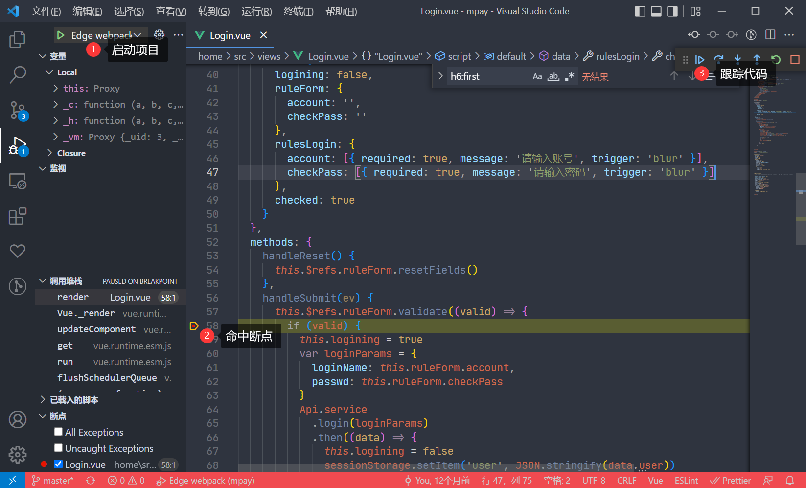

# Vue.js

* Vue简介与起步
* Vue的特性
  * 声明式渲染
  * 条件与循环
  * 处理用户输入
  * 计算属性和侦听器
  * 组件化应用构建
* VsCode配置Vue开发环境
* vue.js devtools

## Vue.js 是什么

`{Vue}(/vjuː/)`(读音类似于 **view**) 是一套用于构建用户界面的**渐进式框架**。与其它大型框架不同的是，Vue 被设计为可以自底向上逐层应用。`Vue 的核心库只关注视图层`，不仅易于上手，还便于与第三方库或既有项目整合。

另一方面，当与现代化的工具链以及各种支持类库结合使用时，Vue 也完全能够为复杂的单页应用提供驱动。

### 尤雨溪


尤雨溪大学专业并非是计算机专业，在大学期间他学习专业是室内艺术和艺术史，后来读了美术设计和技术的硕士，正是在读硕士期间，他偶然接触到了JavaScript ，从此被这门编程语言深深吸引，开启了自己的前端生涯。

2014年2月，开发了一个前端开发库Vue.js。Vue.js 是构建 Web 界面的 JavaScript 库，是一个通过简洁的API提供高效的数据绑定和灵活的组件系统。

### 三大框架

- Vue
- React
- Angular 

*==三大框架比较==*

| 比对     | Vue.js      | React        | Angular     |
| -------- | ----------- | ------------ | ----------- |
| 出现年月 | 2013-7      | 2013-3       | 2010-1      |
| 框架类型 | MVVM        | MVC          | MVW         |
| 开源许可 | MIT license | BSD3-license | MIT license |

> `#💡|MVVM#(orange)`
>
> MVVM是`Model-View-ViewModel`的简写。它本质上就是MVC 的改进版。MVVM 就是将其中的View 的状态和行为抽象化，`让我们将视图 UI 和业务逻辑分开`。当然这些事 ViewModel 已经帮我们做了，它可以取出 Model 的数据同时帮忙处理 View 中由于需要展示内容而涉及的业务逻辑。

#### Vue

Vue框架诞生于2014年，其作者为中国人——尤雨溪，也是新人最容易入手的框架之一，不同于React和Angular,其中文文档也便于大家阅读和学习。

#### React

React起源于Facebook的内部项目，因为该公司对市场上所有JavaScript MVC框架，都不满意，就决定自己写一套，用来架设Instagram的网站。做出来以后，发现这套东西很好用，就在2013年5月开源了。

#### Angular

Angular是谷歌开发的 Web 框架，具有优越的性能和绝佳的跨平台性。通常结合TypeScript开发，也可以使用JavaScript或Dart，提供了无缝升级的过渡方案。于2016年9月正式发布。

### MVVM框架的优势

#### Servlet 

```java
public void doGet(HttpServletRequest request,HttpServletResponse)
   throws IOException,ServletException
{
    response.setContentType("text/html;charset=gb2312");
    PrintWriter out = response.getWriter();
    out.println("<html>");
    out.println("<head><title>Hello World！</title></head>");
    out.println("<body>");
    out.println("<p>Hello World！</p>");
    out.println("</body></html>");
}
```

#### JSP

```jsp
<html>

   <head><title>测试</title></head>

   <body>
     显示的内容是：<% String s = “hello” ; out.println(s); %>
    </body>
</html>
```

#### 从AJAX到jQuery 



```html
<!DOCTYPE html>
<html lang="zh-CN">
   <head>
      <meta charset="utf-8" />
      <meta http-equiv="X-UA-Compatible" content="IE=edge" />
      <meta name="viewport" content="width=device-width, initial-scale=1" />
      <!-- 上述3个meta标签*必须*放在最前面，任何其他内容都*必须*跟随其后！ -->
      <title>壁纸一览</title>

      <!-- Bootstrap -->
      <link rel="stylesheet" href="https://cdn.jsdelivr.net/npm/bootstrap@5.1.3/dist/css/bootstrap.min.css" />

      <!-- HTML5 shim 和 Respond.js 是为了让 IE8 支持 HTML5 元素和媒体查询（media queries）功能 -->
      <!-- 警告：通过 file:// 协议（就是直接将 html 页面拖拽到浏览器中）访问页面时 Respond.js 不起作用 -->
      <!--[if lt IE 9]>
         <script src="https://cdn.jsdelivr.net/npm/html5shiv@3.7.3/dist/html5shiv.min.js"></script>
         <script src="https://cdn.jsdelivr.net/npm/respond.js@1.4.2/dest/respond.min.js"></script>
      <![endif]-->
   </head>

   <body>
      <div class="container">
         <h1>壁纸一览</h1>
         <form>
            <div class="input-group mb-3">
               <input
                  id="filters-title"
                  type="text"
                  class="form-control"
                  placeholder="输入您想查询的标题"
                  aria-label="输入您想查询的标题"
                  aria-describedby="button-search"
               />
               <button class="btn btn-outline-primary" type="button" id="button-search" onclick="getSearchList()">
                  查询
               </button>
            </div>
         </form>
         <ul class="pager">
            <li id="li-pager-info"></li>
            <li id="li-previous"><a href="javascript:gotoPrevious()">前一页</a></li>
            <li id="li-next"><a href="javascript:gotoNext()">后一页</a></li>
         </ul>
         <table class="table">
            <thead>
               <tr>
                  <th scope="col">#</th>
                  <th scope="col">图片</th>
                  <th scope="col">标题</th>
                  <th scope="col">版权</th>
               </tr>
            </thead>
            <tbody></tbody>
         </table>
      </div>

      <!-- jQuery (Bootstrap 的所有 JavaScript 插件都依赖 jQuery，所以必须放在前边) -->
      <script src="https://cdn.jsdelivr.net/npm/jquery@1.12.4/dist/jquery.min.js"></script>
      <!-- 加载 Bootstrap 的所有 JavaScript 插件。你也可以根据需要只加载单个插件。 -->
      <script src="https://cdn.jsdelivr.net/npm/bootstrap@5.1.3/dist/js/bootstrap.min.js"></script>

      <script>
         var nowPage = 1
         var totalPage = 1
         var totalRows = 0

         function getSearchList() {
            // 搜索时把当前页重置成第一页
            nowPage = 1
            getList()
         }

         function getList() {
            let params = {
               page: nowPage,
               size: 5,
               title: $('#filters-title').val()
            }
            $.ajax({
               type: 'GET',
               url: '/wallpapers',
               data: Object.assign(params),
               success: function (result) {
                  if (result.status === 200) {
                     totalPage = result.total
                     totalRows = result.records
                     if (nowPage >= totalPage) {
                        $('#li-next').hide()
                     } else {
                        $('#li-next').show()
                     }
                     if (nowPage <= 1) {
                        $('#li-previous').hide()
                     } else {
                        $('#li-previous').show()
                     }
                     $('#li-pager-info').text(`共 ${totalPage} 页 ${totalRows} 条数据`)
                     let table = $('.table')
                     $('.table tr').empty()
                     for (let index = 0; index < result.rows.length; index++) {
                        const item = result.rows[index]
                        let tr = $(`<tr>
                            <td>${item.id}</td>
                            <td></td>
                            <td>${item.title}</td>
                            <td>${item.copyright}</td>
                            </tr>`)
                        table.append(tr)
                     }
                  }
               },
               complete: function (XMLHttpRequest, textStatus) {},
               error: function () {}
            })
         }

         function gotoPrevious() {
            nowPage = nowPage - 1
            if (nowPage < 1) {
               nowPage = 1
            }
            getList()
         }

         function gotoNext() {
            nowPage = nowPage + 1
            if (nowPage > totalPage) {
               nowPage = totalPage
            }
            getList()
         }

         $(document).ready(function () {
            getList()
         })
      </script>
   </body>
   <style>
      td img {
         width: 200px;
      }

      ul li {
         display: inline-block;
      }
   </style>
</html>
```

#### VUE

```vue
<!DOCTYPE html>
<html>
   <head>
      <meta charset="UTF-8" />
      <title>壁纸一览</title>
      <!-- import CSS -->
      <link rel="stylesheet" href="https://unpkg.com/element-ui/lib/theme-chalk/index.css" />
   </head>

   <body>
      <div id="app">
         <el-container>
            <el-header>
               <h1>壁纸一览</h1>
            </el-header>
            <el-main>
               <el-form>
                  <el-form-item label="">
                     <el-input v-model="filters.title" placeholder="输入您想查询的标题">
                        <el-button
                           :loading="listLoading"
                           slot="append"
                           icon="el-icon-search"
                           @click="handleCurrentChange(1)"
                        ></el-button>
                     </el-input>
                  </el-form-item>
               </el-form>
               <div class="block">
                  <el-pagination
                     @size-change="handleSizeChange"
                     @current-change="handleCurrentChange"
                     :current-page.sync="page"
                     :page-sizes="[5, 10, 20]"
                     :page-size="pageSize"
                     layout="total, sizes, prev, pager, next, jumper"
                     :total="total"
                  >
                  </el-pagination>
               </div>
               <el-table :data="items" style="width: 100%" v-loading="listLoading">
                  <el-table-column prop="url" label="图片" width="180">
                     <template slot-scope="scope">
                        <el-image :src="'https://cn.bing.com' + scope.row.url"></el-image>
                     </template>
                  </el-table-column>
                  <el-table-column prop="title" label="标题" width="180"> </el-table-column>
                  <el-table-column prop="copyright" label="版权"> </el-table-column>
               </el-table>
            </el-main>
         </el-container>
      </div>
   </body>
   <!-- import Vue before Element -->
   <script src="https://unpkg.com/vue/dist/vue.js"></script>
   <!-- import JavaScript -->
   <script src="https://unpkg.com/element-ui/lib/index.js"></script>
   <script src="https://unpkg.com/qs/dist/qs.js"></script>
   <script>
      new Vue({
         el: '#app',
         data: function () {
            return {
               filters: {
                  title: ''
               },
               items: [],
               total: 0,
               page: 1,
               pageSize: 5,
               sels: [],
               listLoading: false
            }
         },
         mounted() {
            this.getList()
         },
         methods: {
            handleCurrentChange(val) {
               this.page = val
               this.getList()
            },
            handleSizeChange(val) {
               this.pageSize = val
               this.getList()
            },
            selsChange: function (sels) {
               this.sels = sels
            },
            sortChange(column) {
               const vue = this
            },
            // 获取用户列表
            getList() {
               const vue = this
               let params = {
                  page: vue.page,
                  size: vue.pageSize,
                  title: vue.filters.title
               }
               vue.listLoading = true
               fetch(`/wallpapers?${Qs.stringify(params)}`)
                  .then(data => data.json())
                  .then(data => {
                     vue.listLoading = false
                     if (data.status === 200) {
                        vue.total = data.records
                        vue.items = data.rows
                     }
                  })
            }
         }
      })
   </script>
</html>
```

> VUE强迫你使用组件、不给你将界面元素拼接到JS代码中的机会，强制将数据和UI分离
>
> jQuery的表格组件和VUE表格组件的区别，VUE在数据源变化后，UI自动更新，jQuery的表格组件大多需要通过事件重新刷新绑定

## 起步

尝试 Vue.js 最简单的方法是使用 Hello World 例子。你可以在浏览器新标签页中打开它，跟着例子学习一些基础用法。或者你也可以创建一个 `.html` 文件，然后通过如下方式引入 Vue：

```html
<!-- 开发环境版本，包含了有帮助的命令行警告 -->
<script src="https://cdn.jsdelivr.net/npm/vue/dist/vue.js"></script>
<!-- 指定使用VUE2 -->
<script src="https://cdn.jsdelivr.net/npm/vue@2/dist/vue.js"></script>
```

或者：

```html
<!-- 生产环境版本，优化了尺寸和速度 -->
<script src="https://cdn.jsdelivr.net/npm/vue"></script>
<!-- 指定使用VUE2 -->
<script src="https://cdn.jsdelivr.net/npm/vue@2"></script>
```

> :zap: 注意，由于VUE目前CDN默认版本都升级为VUE3，所以请强行指定使用VUE2版本，否则会导致代码不能运行

Hello World

```html
<!DOCTYPE html>
<html>
<head>
  <title>My first Vue app</title>
  <script src="https://unpkg.com/vue@2"></script>
</head>
<body>
  <div id="app">
    {{ message }}
  </div>

  <script>
    var app = new Vue({
      el: '#app',
      data: {
        message: 'Hello Vue!'
      }
    })
  </script>
</body>
</html>
```

## 声明式渲染

Vue.js 的核心是一个允许采用简洁的模板语法来声明式地将数据渲染进 DOM 的系统：

```html
<div id="app">
  {{ message }}
</div>
```

```javascript
var app = new Vue({
  el: '#app',
  data: {
    message: 'Hello Vue!'
  }
})
```

> Hello Vue!

我们已经成功创建了第一个 Vue 应用！看起来这跟渲染一个字符串模板非常类似，但是 Vue 在背后做了大量工作。现在数据和 DOM 已经被建立了关联，所有东西都是**响应式的**。我们要怎么确认呢？打开你的浏览器的 JavaScript 控制台 (就在这个页面打开)，并修改 `app.message` 的值，你将看到上例相应地更新。

注意我们不再和 HTML 直接交互了。一个 Vue 应用会将其挂载到一个 DOM 元素上 (对于这个例子是 `#app`) 然后对其进行完全控制。那个 HTML 是我们的入口，但其余都会发生在新创建的 Vue 实例内部。

## 条件与循环

控制切换一个元素是否显示也相当简单：

```html
<div id="app-3">
  <p v-if="seen">现在你看到我了</p>
</div>
```

```javascript
var app3 = new Vue({
  el: '#app-3',
  data: {
    seen: true
  }
})
```

> 现在你看到我了

继续在控制台输入 `app3.seen = false`，你会发现之前显示的消息消失了。

这个例子演示了我们不仅可以把数据绑定到 DOM 文本或 attribute，还可以绑定到 DOM **结构**。此外，Vue 也提供一个强大的过渡效果系统，可以在 Vue 插入/更新/移除元素时自动应用[过渡效果](https://cn.vuejs.org/v2/guide/transitions.html)。

还有其它很多指令，每个都有特殊的功能。例如，`v-for` 指令可以绑定数组的数据来渲染一个项目列表：

```html
<div id="app-4">
  <ol>
    <li v-for="todo in todos">
      {{ todo.text }}
    </li>
  </ol>
</div>
```

```javascript
var app4 = new Vue({
  el: '#app-4',
  data: {
    todos: [
      { text: '学习 JavaScript' },
      { text: '学习 Vue' },
      { text: '整个牛项目' }
    ]
  }
})
```

> 1. 学习 JavaScript
> 2. 学习 Vue
> 3. 整个牛项目

在控制台里，输入 `app4.todos.push({ text: '新项目' })`，你会发现列表最后添加了一个新项目。

## 处理用户输入

### 事件监听器

为了让用户和你的应用进行交互，我们可以用 `v-on` 指令添加一个事件监听器，通过它调用在 Vue 实例中定义的方法：

```html
<div id="app-5">
  <p>{{ message }}</p>
  <button v-on:click="reverseMessage">反转消息</button>
</div>
```

```javascript
var app5 = new Vue({
  el: '#app-5',
  data: {
    message: 'Hello Vue.js!'
  },
  methods: {
    reverseMessage: function () {
      this.message = this.message.split('').reverse().join('')
    }
  }
})
```

> Hello Vue.js!
>
> <kbd>反转消息</kbd>

注意在 `reverseMessage` 方法中，我们更新了应用的状态，但没有触碰 DOM——所有的 DOM 操作都由 Vue 来处理，你编写的代码只需要关注逻辑层面即可。

> Hello Vue!
>
> !sj.euV olleH

### 双向绑定

Vue 还提供了 `v-model` 指令，它能轻松实现表单输入和应用状态之间的双向绑定。

```html
<!DOCTYPE html>
<html>
<head>
  <title>My first Vue app</title>
  <script src="https://unpkg.com/vue@2"></script>
</head>
<body>
  <div id="app">
    <p>{{ message }}</p>
    <input v-model="message">
  </div>

  <script>
    var app = new Vue({
      el: '#app',
      data: {
        message: 'Hello Vue!'
      }
    })
  </script>
</body>
</html>
```

## 计算属性和侦听器

### 计算属性和侦听器的比较

计算属性computer和侦听器watch都是用作监听某些变量使用的

* **computed**：是计算**属性**，实际上和data对象里的数据属性是差不多的。
* **watch**：类似于监听机制+事件机制。(监听某个变量，里面可以运行事件)

> * **watch**擅长处理的场景：一个数据影响多个数据
> * **computed**擅长处理的场景：一个数据受多个数据影响

#### computed举例

```html
<!DOCTYPE html>
<html>
  <head>
    <title>My first Vue app</title>
    <script src="https://unpkg.com/vue@2"></script>
  </head>

  <body>
    <div id="app">
      <div id="demo">{{ fullName }}</div>
    </div>
    <script>
      var vm = new Vue({
        el: '#demo',
        data: {
          firstName: 'Foo',
          lastName: 'Bar',
          fullName: 'Foo Bar'
        },
        computed: {
          fullName: function () {
            return this.firstName + ' ' + this.lastName
          }
        }
      })
    </script>
  </body>
</html>
```

#### watch举例

```html
<!DOCTYPE html>
<html>

<head>
    <title>My first Vue app</title>
    <script src="https://unpkg.com/vue@2"></script>
</head>

<body>
    <div id="app">
        <div id="demo">{{ fullName }}</div>
    </div>
    <script>
    var vm = new Vue({
        el: '#demo',
        data: {
            firstName: 'Foo',
            lastName: 'Bar',
            fullName: 'Foo Bar'
        },
        watch: {
            firstName: function(val) {
                this.fullName = val + ' ' + this.lastName
            },
            lastName: function(val) {
                this.fullName = this.firstName + ' ' + val
            }
        }
    })
    </script>
</body>

</html>
```

> 可以看到fullName案例用watch也能实现，但是明显使用computed更加合理，因为这属于一个数据fullName受多个数据影响

### watch详解

由上面的定义可以看出，watch的运用范围更广，下面代码是watch的几种简单的用法




> :fire:**应用场景**
>
> 1. 监听是否显示坐标轴（单个bool变量值）
> 2. 监听使用什么材质渲染模型（需要颜色、亮度、材质、纹理多个参数）
> 3. 监听沿XYZ轴不断翻转（监听的值可能变也可能不变，比如沿Y轴不断翻转每次都会传Y）

#### 监听简单数据变化

直接写一个监听处理函数，当每次监听到 cityName 值发生改变时，执行函数。

```html
<!DOCTYPE html>
<html>
  <head>
    <title>My first Vue app</title>
    <script src="https://unpkg.com/vue@2"></script>
  </head>

  <body>
    <div id="app">
      <input v-model="cityName" />
    </div>
    <script>
      new Vue({
        el: '#app',
        data: {
          cityName: 'shanghai'
        },
        watch: {
          cityName(newName, oldName) {
            console.log(oldName)
            console.log(newName)
          }
        }
      })
    </script>
  </body>
</html>
```

##### immediate和handler

这样使用watch时有一个特点，就是当值第一次绑定的时候，不会执行监听函数，只有值发生改变才会执行。如果我们需要在最初绑定值的时候也执行函数，则就需要用到immediate属性。

比如当父组件向子组件动态传值时，子组件props首次获取到父组件传来的默认值时，也需要执行函数，此时就需要将immediate设为true。

监听的数据后面写成对象形式，包含handler方法和immediate，之前我们写的函数其实就是在写这个handler方法；

immediate表示在watch中首次绑定的时候，是否执行handler，值为true则表示在watch中声明的时候，就立即执行handler方法，值为false，则和一般使用watch一样，在数据发生变化的时候才执行handler。

```html
<!DOCTYPE html>
<html>
  <head>
    <title>My first Vue app</title>
    <script src="https://unpkg.com/vue@2"></script>
  </head>

  <body>
    <div id="app">
      <input v-model="cityName" />
    </div>
    <script>
      new Vue({
        el: '#app',
        data: {
          cityName: 'shanghai'
        },
        watch: {
          cityName: {
            handler(newName, oldName) {
              console.log(oldName)
              console.log(newName)
            },
            immediate: true
          }
        }
      })
    </script>
  </body>
</html>
```

#### 监听复杂数据变化

##### deep

当需要监听一个对象的改变时，普通的watch方法无法监听到对象内部属性的改变，只有data中的数据才能够监听到变化，此时就需要deep属性对对象进行深度监听。

```html
<!DOCTYPE html>
<html>
  <head>
    <title>My first Vue app</title>
    <script src="https://unpkg.com/vue@2"></script>
  </head>

  <body>
    <div id="app">
      <input v-model="city.id" />
      <input v-model="city.name" />
    </div>
    <script>
      new Vue({
        el: '#app',
        data: {
          city: { id: 1, name: 'shanghai' }
        },
        watch: {
          city: {
            handler(newName, oldName) {
              console.log(oldName)
              console.log(newName)
            },
            deep: true,
            immediate: false
          }
        }
      })
    </script>
  </body>
</html>
```

> 注意：数组的变化不需要深度监听

##### 监听对象单个属性变化

```html
<!DOCTYPE html>
<html>
  <head>
    <title>My first Vue app</title>
    <script src="https://unpkg.com/vue@2"></script>
  </head>

  <body>
    <div id="app">
      <input v-model="city.id" />
      <input v-model="city.name" />
    </div>
    <script>
      new Vue({
        el: '#app',
        data: {
          city: { id: 1, name: 'shanghai' }
        },
        watch: {
          'city.id': {
            handler(newName, oldName) {
              console.log(oldName)
              console.log(newName)
            },
            immediate: false
          }
        }
      })
    </script>
  </body>
</html>
```

##### 监听对象的部分属性变化

当然可以在对象deep监控中写逻辑，这里介绍使用computed作为中间件的方法

比如下面的例子：城市的SN由ID+区号组成，我们监控SN的变化

```html
<!DOCTYPE html>
<html>
  <head>
    <title>My first Vue app</title>
    <script src="https://unpkg.com/vue@2"></script>
  </head>

  <body>
    <div id="app">
      <input v-model="city.id" />
      <input v-model="city.zoneno" />
      <input v-model="city.name" />
    </div>
    <script>
      new Vue({
        el: '#app',
        data: {
          city: { id: 1, zoneno: '021', name: 'shanghai' }
        },
        computed: {
          citySN() {
            return this.city.id + '-' + this.city.zoneno
          }
        },
        watch: {
          citySN: {
            handler(newName, oldName) {
              console.log(oldName)
              console.log(newName)
            },
            immediate: false
          }
        }
      })
    </script>
  </body>
</html>
```

##### Watch方法不能监听到数组或对象值的处理

数组

```html
<!DOCTYPE html>
<html>
  <head>
    <title>My first Vue app</title>
    <script src="https://unpkg.com/vue@2"></script>
  </head>

  <body>
    <div id="app">
      <button v-on:click="changeArr()">改变数组</button>
    </div>
    <script>
      new Vue({
        el: '#app',
        data: {
          arr: [1, 2, 3]
        },
        watch: {
          arr: {
            handler(newName, oldName) {
              console.log(newName)
            },
            deep: true
          }
        },
        methods: {
          changeArr: function () {
            this.arr[0] = 100
          }
        }
      })
    </script>
  </body>
</html>
```

> 这写法，只能触发数组中某个值的修改（引用没变），并不能触发watch，可以改成：
>
> * `this.arr = [100, 2, 3]`
> * `this.$set(this.arr, 0, 100)`
>
> **总结：如果操作对象是数组，改变数组的值用Vue的$set方法，改变数组的长度用数组的splice方法使数组变化变成可监听的。**

对象

```html
<!DOCTYPE html>
<html>
  <head>
    <title>My first Vue app</title>
    <script src="https://unpkg.com/vue@2"></script>
  </head>

  <body>
    <div id="app">
      <button v-on:click="zoom('out', 1)">缩小</button>
      <button v-on:click="zoom('in', 1)">放大</button>
    </div>
    <script>
      new Vue({
        el: '#app',
        data: {
          actionObj: { action: 'zoom', type: '', val: 1 }
        },
        watch: {
          actionObj: {
            handler(newName, oldName) {
              console.log(newName)
            },
            deep: true
          }
        },
        methods: {
          zoom: function (type, val) {
            // 为actionObj修正属性
            this.actionObj = Object.assign(this.actionObj, { type: type, val: val })
          }
        }
      })
    </script>
  </body>
</html>

```

> 这写法，只能触发对象的属性更新响应，并不能触发watch，可以改成：
>
> * `this.actionObj = Object.assign({}, this.actionObj, { type: type, val: val })`
> * `this.actionObj = JSON.parse(JSON.stringify(Object.assign(this.actionObj, { type: type, val: val })))` 

## 生命周期

* beforeCreate(创建前)
* created(创建后)
* beforeMount(载入前)
* mounted(载入后)
* beforeUpdate(更新前)
* updated(更新后)
* beforeDestroy(销毁前)
* destroyed(销毁后)

Vue第一次页面加载会触发beforeCreate、created、beforeMount、mounted四个钩子函数

DOM渲染在mounted这个周期就已经完成



## 组件化应用构建

组件系统是 Vue 的另一个重要概念，因为它是一种抽象，允许我们使用小型、独立和通常可复用的组件构建大型应用。仔细想想，几乎任意类型的应用界面都可以抽象为一个组件树：


在 Vue 里，一个组件本质上是一个拥有预定义选项的一个 Vue 实例。在 Vue 中注册组件很简单：

```javascript
// 定义名为 todo-item 的新组件
Vue.component('todo-item', {
  template: '<li>这是个待办项</li>'
})

var app = new Vue(...)
```

现在你可以用它构建另一个组件模板：

```html
<ol>
  <!-- 创建一个 todo-item 组件的实例 -->
  <todo-item></todo-item>
</ol>
```

但是这样会为每个待办项渲染同样的文本，这看起来并不炫酷。我们应该能从父作用域将数据传到子组件才对。让我们来修改一下组件的定义，使之能够接受一个 [prop](https://cn.vuejs.org/v2/guide/components.html#通过-Prop-向子组件传递数据)：

```javascript
Vue.component('todo-item', {
  // todo-item 组件现在接受一个
  // "prop"，类似于一个自定义 attribute。
  // 这个 prop 名为 todo。
  props: ['todo'],
  template: '<li>{{ todo.text }}</li>'
})
```

现在，我们可以使用 `v-bind` 指令将待办项传到循环输出的每个组件中：

```html
<div id="app-7">
  <ol>
    <!--
      现在我们为每个 todo-item 提供 todo 对象
      todo 对象是变量，即其内容可以是动态的。
      我们也需要为每个组件提供一个“key”，稍后再
      作详细解释。
    -->
    <todo-item
      v-for="item in groceryList"
      v-bind:todo="item"
      v-bind:key="item.id"
    ></todo-item>
  </ol>
</div>
```

```javascript
Vue.component('todo-item', {
  props: ['todo'],
  template: '<li>{{ todo.text }}</li>'
})

var app7 = new Vue({
  el: '#app-7',
  data: {
    groceryList: [
      { id: 0, text: '蔬菜' },
      { id: 1, text: '奶酪' },
      { id: 2, text: '随便其它什么人吃的东西' }
    ]
  }
})
```

> 1. 蔬菜
> 2. 奶酪
> 3. 随便其它什么人吃的东西

尽管这只是一个刻意设计的例子，但是我们已经设法将应用分割成了两个更小的单元。子单元通过 prop 接口与父单元进行了良好的解耦。我们现在可以进一步改进 `<todo-item>` 组件，提供更为复杂的模板和逻辑，而不会影响到父单元。

在一个大型应用中，有必要将整个应用程序划分为组件，以使开发更易管理。

## 使用UI库

```html
<!DOCTYPE html>
<html>
<head>
  <meta charset="UTF-8">
  <!-- import CSS -->
  <link rel="stylesheet" href="https://unpkg.com/element-ui/lib/theme-chalk/index.css">
</head>
<body>
  <div id="app">
    <el-button @click="visible = true">Button</el-button>
    <el-dialog :visible.sync="visible" title="Hello world">
      <p>Try Element</p>
    </el-dialog>
  </div>
</body>
  <!-- import Vue before Element -->
  <script src="https://unpkg.com/vue@2"></script>
  <!-- import JavaScript -->
  <script src="https://unpkg.com/element-ui/lib/index.js"></script>
  <script>
    new Vue({
      el: '#app',
      data: function() {
        return { visible: false }
      }
    })
  </script>
</html>
```


## Vue.js教程

由于官方教程非常详细，涵盖源码，视频，讲解，可以直接浏览学习

https://cn.vuejs.org/v2/guide/

## VsCode配置Vue开发环境

VsCode算是比较热门的一个代码编辑器了，全名Visual Studio Code，微软出品，下载地址：[点我去下载](https://code.visualstudio.com/download)
插件众多，功能齐全，平常开发过程中都是用的它，整理了下日常使用的插件及配置供大家参考，废话就不多说了，直接进入正题。

### 相关插件

#### Vetur

插件文档地址：https://marketplace.visualstudio.com/items?itemName=octref.vetur
Vetur不用说了吧，开发Vue必装的一个插件

#### ESLint

插件文档地址：https://marketplace.visualstudio.com/items?itemName=dbaeumer.vscode-eslint
这个不用多说了，规范代码格式的。

### 相关配置

```json
{
    "editor.codeActionsOnSave": {
        "source.fixAll": true,
        "source.fixAll.eslint": true
    },
    "eslint.validate": ["javascript", "vue", "html"],
    "eslint.options": {
        "plugins": [
            "html"
        ]
    },
    "vetur.format.defaultFormatter.js": "prettier",
    "vetur.ignoreProjectWarning": true,
}
```

### .eslintrc.js

```js
module.exports = {
  root: true,
  parserOptions: {
    parser: 'babel-eslint',
    sourceType: 'module'
  },
  env: {
    browser: true,
    node: true,
    es6: true
  },

  extends: ['plugin:vue/recommended', 'eslint:recommended'],

  // add your custom rules here
  //it is base on https://github.com/vuejs/eslint-config-vue
  rules: {
    'vue/max-attributes-per-line': [
      2,
      {
        singleline: 10,
        multiline: {
          max: 1,
          allowFirstLine: false
        }
      }
    ],
    "vue/attribute-hyphenation": ["error", "always"],
    'vue/singleline-html-element-content-newline': 'off',
    'vue/multiline-html-element-content-newline': 'off',
    'vue/name-property-casing': 'off',
    'vue/no-v-html': 'off',
    'accessor-pairs': 2,
    'arrow-spacing': [
      2,
      {
        before: true,
        after: true
      }
    ],
    'block-spacing': [2, 'always'],
    'brace-style': [
      2,
      '1tbs',
      {
        allowSingleLine: true
      }
    ],
    camelcase: [
      0,
      {
        properties: 'always'
      }
    ],
    'comma-dangle': [2, 'never'],
    'comma-spacing': [
      2,
      {
        before: false,
        after: true
      }
    ],
    'comma-style': [2, 'last'],
    'constructor-super': 2,
    curly: [2, 'multi-line'],
    'dot-location': [2, 'property'],
    'eol-last': 2,
    eqeqeq: ['error', 'always', { null: 'ignore' }],
    'generator-star-spacing': [
      2,
      {
        before: true,
        after: true
      }
    ],
    'handle-callback-err': [2, '^(err|error)$'],
    indent: [
      2,
      2,
      {
        SwitchCase: 1
      }
    ],
    'jsx-quotes': [2, 'prefer-single'],
    'key-spacing': [
      2,
      {
        beforeColon: false,
        afterColon: true
      }
    ],
    'keyword-spacing': [
      2,
      {
        before: true,
        after: true
      }
    ],
    'new-cap': [
      2,
      {
        newIsCap: true,
        capIsNew: false
      }
    ],
    'new-parens': 2,
    'no-array-constructor': 2,
    'no-caller': 2,
    'no-console': 'off',
    'no-class-assign': 2,
    'no-cond-assign': 2,
    'no-const-assign': 2,
    'no-control-regex': 0,
    'no-delete-var': 2,
    'no-dupe-args': 2,
    'no-dupe-class-members': 2,
    'no-dupe-keys': 2,
    'no-duplicate-case': 2,
    'no-empty-character-class': 2,
    'no-empty-pattern': 2,
    'no-eval': 2,
    'no-ex-assign': 2,
    'no-extend-native': 2,
    'no-extra-bind': 2,
    'no-extra-boolean-cast': 2,
    'no-extra-parens': [2, 'functions'],
    'no-fallthrough': 2,
    'no-floating-decimal': 2,
    'no-func-assign': 2,
    'no-implied-eval': 2,
    'no-inner-declarations': [2, 'functions'],
    'no-invalid-regexp': 2,
    'no-irregular-whitespace': 2,
    'no-iterator': 2,
    'no-label-var': 2,
    'no-labels': [
      2,
      {
        allowLoop: false,
        allowSwitch: false
      }
    ],
    'no-lone-blocks': 2,
    'no-mixed-spaces-and-tabs': 2,
    'no-multi-spaces': 2,
    'no-multi-str': 2,
    'no-multiple-empty-lines': [
      2,
      {
        max: 1
      }
    ],
    'no-native-reassign': 2,
    'no-negated-in-lhs': 2,
    'no-new-object': 2,
    'no-new-require': 2,
    'no-new-symbol': 2,
    'no-new-wrappers': 2,
    'no-obj-calls': 2,
    'no-octal': 2,
    'no-octal-escape': 2,
    'no-path-concat': 2,
    'no-proto': 2,
    'no-redeclare': 2,
    'no-regex-spaces': 2,
    'no-return-assign': [2, 'except-parens'],
    'no-self-assign': 2,
    'no-self-compare': 2,
    'no-sequences': 2,
    'no-shadow-restricted-names': 2,
    'no-spaced-func': 2,
    'no-sparse-arrays': 2,
    'no-this-before-super': 2,
    'no-throw-literal': 2,
    'no-trailing-spaces': 2,
    'no-undef': 2,
    'no-undef-init': 2,
    'no-unexpected-multiline': 2,
    'no-unmodified-loop-condition': 2,
    'no-unneeded-ternary': [
      2,
      {
        defaultAssignment: false
      }
    ],
    'no-unreachable': 2,
    'no-unsafe-finally': 2,
    'no-unused-vars': [
      1,
      {
        vars: 'all',
        args: 'none'
      }
    ],
    'no-useless-call': 2,
    'no-useless-computed-key': 2,
    'no-useless-constructor': 2,
    'no-useless-escape': 0,
    'no-whitespace-before-property': 2,
    'no-with': 2,
    'one-var': [
      2,
      {
        initialized: 'never'
      }
    ],
    'operator-linebreak': [
      2,
      'after',
      {
        overrides: {
          '?': 'before',
          ':': 'before'
        }
      }
    ],
    'padded-blocks': [2, 'never'],
    quotes: [
      2,
      'single',
      {
        avoidEscape: true,
        allowTemplateLiterals: true
      }
    ],
    semi: [2, 'never'],
    'semi-spacing': [
      2,
      {
        before: false,
        after: true
      }
    ],
    'space-before-blocks': [2, 'always'],
    'space-before-function-paren': [2, 'never'],
    'space-in-parens': [2, 'never'],
    'space-infix-ops': 2,
    'space-unary-ops': [
      2,
      {
        words: true,
        nonwords: false
      }
    ],
    'spaced-comment': [
      2,
      'always',
      {
        markers: ['global', 'globals', 'eslint', 'eslint-disable', '*package', '!', ',']
      }
    ],
    'template-curly-spacing': [2, 'never'],
    'use-isnan': 2,
    'valid-typeof': 2,
    'wrap-iife': [2, 'any'],
    'yield-star-spacing': [2, 'both'],
    yoda: [2, 'never'],
    'prefer-const': 2,
    'no-debugger': process.env.NODE_ENV === 'production' ? 2 : 0,
    'object-curly-spacing': [
      2,
      'always',
      {
        objectsInObjects: false
      }
    ],
    'array-bracket-spacing': [2, 'never']
  }
}
```

### vue.config.js

```js
module.exports = {
  pages: {
    index: {
      entry: 'src/main.js',
      template: 'public/index.html',
      title: 'XXXXX'
    }
  },
  devServer: {
    disableHostCheck: true
  },
  productionSourceMap: false,
  lintOnSave: true
}
```

## 代码调试

### vue.js devtools 安装

**能上外网的情况下直接安装**打开谷歌浏览器，点击左上角应用，打开 chrome 网上应用商店

 



 

在左侧直接搜索，就可以看到这个插件了



 安装后在浏览器右上角会显示 vue 的图标，安装好的界面如下，`要注意打开开发者模式以及工具的开关按钮`



由于很多时候是打开本地文件进行开发测试，所以还需要配置一项内容才行

点击上图中所示的详细信息按钮，打开界面如下，勾选红框圈出来的内容，允许它访问文件地址，否则看到的图标是灰色的，点击它会提示 vue.js not detected 



> :fire:**引入的 vue 文件 必须 是开发版本的文件，不能是生产版本**

### 在 VS Code 中调试

#### 在浏览器中展示源代码

在可以从 VS Code 调试你的 Vue 组件之前，你需要更新 webpack 配置以构建 source map。做了这件事之后，我们的调试器就有机会将一个被压缩的文件中的代码对应回其源文件相应的位置。这会确保你可以在一个应用中调试，即便你的资源已经被 webpack 优化过了也没关系。

打开 `config/index.js` 并找到 `devtool` property。将其更新为：

如果你使用的是 Vue CLI 2，请设置并更新 `config/index.js` 内的 `devtool` property：

```
devtool: 'source-map',
```

如果你使用的是 Vue CLI 3，请设置并更新 `vue.config.js` 内的 `devtool` property：

```javascript
module.exports = {
  configureWebpack: {
    devtool: 'source-map'
  }
}
```

#### 从 VS Code 启动应用

点击在 Activity Bar 里的 Debugger 图标来到 Debug 视图，然后点击那个齿轮图标来配置一个 `launch.json` 的文件，选择 **Chrome/Firefox：Launch** 环境。然后将生成的 `launch.json` 的内容替换成为相应的配置：

```json
{
    "version": "0.2.0",
    "configurations": [
        {
            "type": "edge",
            "version": "stable",
            "request": "launch",
            "name": "Edge webpack",
            "url": "http://localhost:8080",
            "webRoot": "${workspaceFolder}/home",
            "sourceMapPathOverrides": {
                "webpack:///src/*": "${webRoot}/src/*"
            }
        }
    ]
}
```

> 这里尤其要注意的是sourceMapPathOverrides的设定，这是将webpack中启动的代码和本地的源码映射起来
>
> webpack的路径可以在这里右键拷贝出来，即：`webpack:///src/*`
>
> 

#### 开始调试代码

通过以上的设置，就可以开始调试代码了



> 但是此办法有时候乱跳，不是很好掌控。个人还是推荐vue.js devtools+console.log，官方的想法应该和我一致，你用这种办法在VS Code中调试时会显示
>
> > Download the Vue Devtools extension for a better development experience:
> > https://github.com/vuejs/vue-devtools

### 高端调试


* [如何在 Vue 项目中，通过点击 DOM 自动定位VSCode中的代码行？ - vivo互联网技术 - OSCHINA - 中文开源技术交流社区](https://my.oschina.net/vivotech/blog/5539307)

## 使用Vue-cli项目初始化

```sh
# Vue-cli 2（已经淘汰）
npm install vue-cli -g
# Vue-cli 2创建项目
vue init airyland/vux2 color_tasks

# Vue-cli 3+，和上面的不能共存
npm install -g @vue/cli
# Vue-cli 3创建项目（我们后面的案例主要讲解Vue-cli 3+）
vue create color_tasks
cd color_tasks
npm i vuex --save
npm install vue-resource --save-dev 
```
