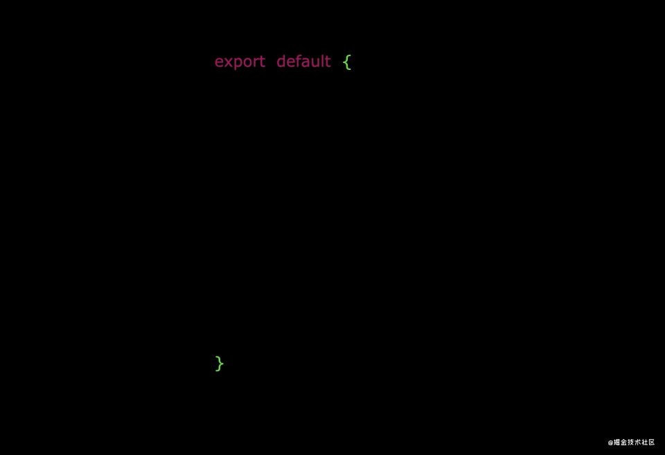
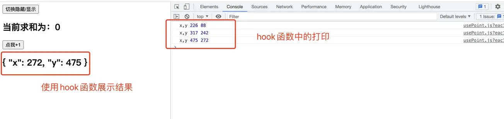
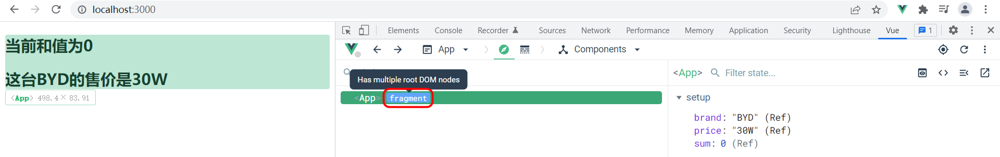
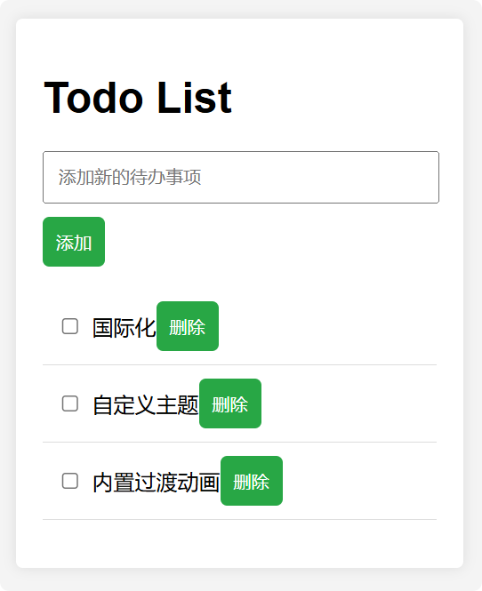
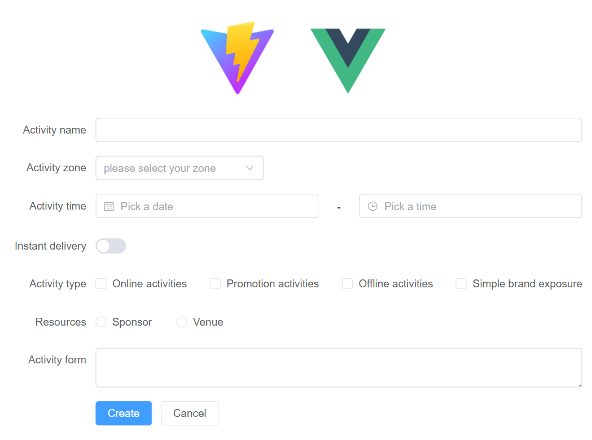
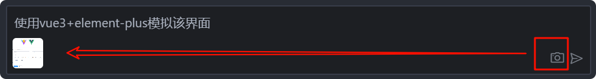
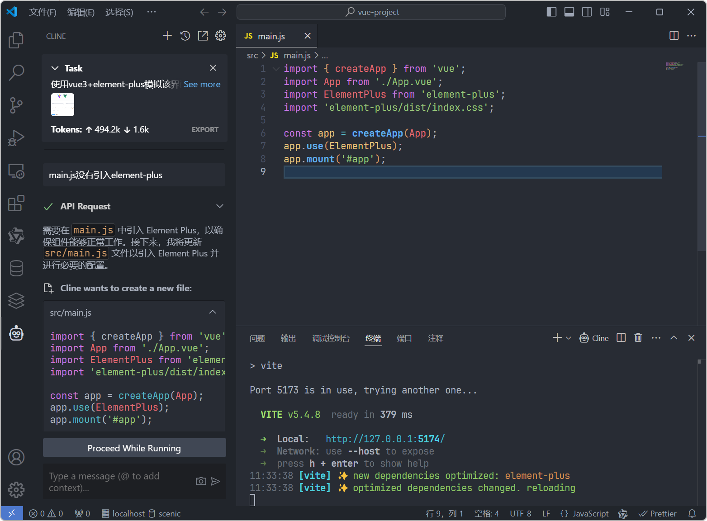
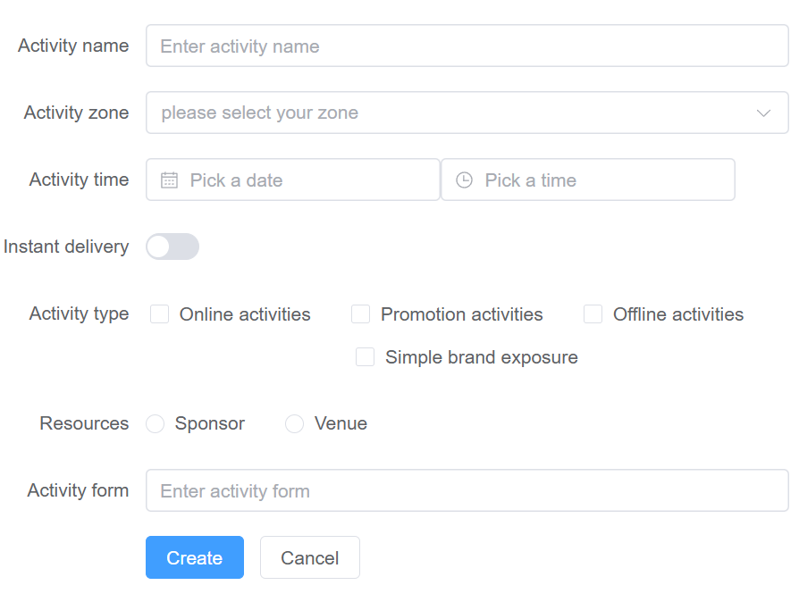

# Vue3

## Vue3特性

### 性能的提升

- 打包大小减少41%
- 初次渲染快55%，更新渲染快133%
- 内存减少54%

### 源码的提升

- 使用Proxy代替defineProperty实现响应式
- 重写虚拟DOM的实现和Tree-Shaking ……

### 拥抱TypeScript

- Vue3可以更好的支持TypeScript

### 新的特征

#### Composition API（组合API）

- setup配置
- ref与reactive
- watch与watchEffect
- provide与inject ……

#### 新的内置组件

- Fragment
- Teleport
- Suspense

#### 其他改变

- 新的生命周期钩子
- data选项应始终被声明为一个函数
- 移除keyCode支持作为v-on的修饰符
- ……

## 创建Vue3工程

### 使用vue-cli创建

```sh
## 查看@vue/cli版本,确保@vue/cli版本在4.5.0以上
vue --version
## 安装或升级@vue/cli版本
npm install -g @vue/cli
## 创建（记得选择VUE3）
vue create vue3-test
## 启动
cd vue3-test
npm run serve
```

### 使用vite创建

Vite（法语意为 "快速的"，发音 `/vit/`，发音同 "veet"）是一种新型前端构建工具，能够显著提升前端开发体验。它主要由两部分组成：

- 一个开发服务器，它基于 原生 ES 模块 提供了 丰富的内建功能，如速度快到惊人的 模块热更新（HMR）。
- 一套构建指令，它使用 Rollup 打包你的代码，并且它是预配置的，可输出用于生产环境的高度优化过的静态资源。

官网：[Vite | 下一代的前端工具链 (vitejs.dev)](https://cn.vitejs.dev/)

> :warning:Vite 需要 Node.js 版本 14.18+，16+。然而，有些模板需要依赖更高的 Node 版本才能正常运行，当你的包管理器发出警告时，请注意升级你的 Node 版本。

```sh
## 创建工程
npm init vite-app <project-name>
## 进入工程目录
cd <project-name>
## 安装依赖
npm install
## 运行
npm run dev
```

## Composition API

### Composition API的优势

官方文档: https://v3.cn.vuejs.org/guide/composition-api-introduction.html

使用传统Options API中，新增或者修改一个需求，就需要分别在data，methods，computed里修改 。使用Composition API我们可以更加优雅的组织我们的代码，函数。让相关功能的代码更加有序的组织在一起。

**Options API是这样组织代码的**



**Options API是这样新增功能的**


**Options API -> Composition API组织代码**


**Composition API基于函数功能组织代码**


> 讲白了就是Options API强制你把分开写，Composition API更灵活可以写在一起（定义、逻辑、监控……）

- 在逻辑组织和逻辑复用方面，Composition API是优于Options API。
- Composition API对 tree-shaking 友好，代码也更容易压缩。
- Composition API中见不到this的使用，减少了this指向不明的情况。
- 如果是小型组件，可以继续使用Options API，也是十分友好的。

> Tree-shaking是webpack内置的一个优化，主要功能就是去除没有用到代码。因为JavaScript大多数是要通过加载的，加载的文件越小，性能越好，所以Tree-shaking对于优化JavaScript很有意义。

### setup

1. Vue3中一个新的配置项，值为一个函数。
2. setup是所有**Composition API（组合API）**“ 表演的舞台 ”。
3. 组件中所用到的：数据、方法等等，均要配置在setup中。
4. setup函数的两种返回值：
   1. 若返回一个对象，则对象中的属性、方法在模板中均可以直接使用。（重点关注！）
   2. 若返回一个渲染函数：则可以自定义渲染内容。（了解）
5. 注意点：
   1. 尽量不要与Vue2.x配置混用
      - Vue2.x配置（data、methos、computed...）中**可以访问到**setup中的属性、方法。
      - 但在setup中**不能访问到**Vue2.x配置（data、methos、computed...）。
      - 如果有重名, setup优先。
   2. setup不能是一个async函数，因为返回值不再是return的对象, 而是promise, 模板看不到return对象中的属性。（后期也可以返回一个Promise实例，但需要Suspense和异步组件的配合）

> - setup执行的时机
>   - 在beforeCreate之前执行一次，this是undefined。
> - setup的参数
>   - props：值为对象，包含：组件外部传递过来，且组件内部声明接收了的属性。
>   - context：上下文对象
>     - attrs：值为对象，包含：组件外部传递过来，但没有在props配置中声明的属性, 相当于 `this.$attrs`。
>     - slots：收到的插槽内容, 相当于 `this.$slots`。
>     - emit：分发自定义事件的函数, 相当于 `this.$emit`。

### ref函数

- 作用：定义一个响应式的数据
- 语法：`const xxx = ref(initValue)`
  - 创建一个包含响应式数据的**引用对象（reference对象，简称ref对象）**。
  - JS中操作数据： `xxx.value`
  - 模板中读取数据: 不需要.value，直接：`<div>{{xxx}}</div>`
- 备注：
  - 接收的数据可以是：基本类型、也可以是对象类型。
  - 基本类型的数据：响应式依然是靠`Object.defineProperty()`的`get`与`set`完成的。
  - 对象类型的数据：内部 *“ 求助 ”* 了Vue3中的一个新函数—— `reactive`函数。

将值封装在一个对象中，看似没有必要，但为了保持 JavaScript 中不同数据类型的行为统一，这是必须的。这是因为在 JavaScript 中，`Number` 或 `String` 等基本类型是通过值而非引用传递的：


> 在任何值周围都有一个封装对象，这样我们就可以在整个应用中安全地传递它，而不必担心在某个地方失去它的响应性。

```vue
<template>
  <h2>{{Str}}</h2>
</template>

<script>
import {ref} from 'vue'
export default {
  setup(){
    const Str = ref('hello')
    return{
      Str
    }
  }
}
```

### reactive函数

- 作用: 定义一个**对象类型**的响应式数据（基本类型不要用它，要用`ref`函数）
- 语法：`const 代理对象= reactive(源对象)`接收一个对象（或数组），返回一个代理对象（Proxy的实例对象，简称proxy对象）
- reactive定义的响应式数据是“深层次的”。
- 内部基于 ES6 的Proxy实现，通过代理对象操作源对象内部数据进行操作。

```vue
<template>
  <h2>姓名：{{Person.name}}</h2>
  <h2>薪水：{{Person.job.salary}}</h2>
</template>

<script>
import {reactive} from 'vue'
export default {
  setup(){
    const p ={
      name:'Ben',
      job:{
        salary:'30k'
      }
    }
    const Person = reactive(p)
    return{
      Person
    }
  }
}
```

### ref和reactive

#### 总结

ref和reactive都可以做响应式

* ref：一般用在定义基本类型和引用类型，如果是引用类型底层会借助reactive形成proxy代理对象，可以直接复制整个对象，如table的数据请求回来，需要将数据整体赋值个响应对象这时如果使用的是reactive就无法进行响应。
* reactive：一般用在引用类型，如{}等，**不能一次性修改整个对象**，如我们后端请求table的数据数据，如果想一次性赋值的整个数组的话，就行不通，此时建议使用ref来定义数组。

#### 区别

1. **存储类型**：`ref`对象可以接受基本数据类型得数据也可以接受对象类型的数据，而`reactive`只可以接受对象类型的数据；
2. **响应式**：相比于`ref`对象`reactive`函数是更深层次的，`ref`函数参数为对象类型时依赖的也是reactive函数；
3. **用法**：`Proxy`代理对象的数据键值对是和原数据对象的键值对一一对应的，在使用时可以直接使用 对象(接受返回值的对象).键名 的形式，`ref`对象会把数据参数对应到自己；
   - ref定义的数据：操作数据**需要**`.value`，读取数据时模板中直接读取**不需要**`.value`。
   - reactive定义的数据：操作数据与读取数据：**均不需要**`.value`。
4. **响应式原理**：`ref`的响应式原理是依赖于`Object.defineProperty()`的`get()`和`set()`，而`reactive`的响应式原理是依赖于ES6中的`Proxy`。

#### ref和reactive建议使用

**一种写法：除了对象都用ref来定义**

```javascript
let switchKG = ref(false)
console.log(switchKG.value)

let arr = ref([])
arr.value = [1, 2, 3, 4, 5]
console.log(arr.value)

let Obj = reactive({
  arr: []
})
Obj.arr = [1, 2, 3, 4, 5]
```

**第二种写法：都用reactive来定义，然后用toRefs进行导出到页面使用**

```vue
<template>
  <div>{{arr}}</div>
  <div>{{obj}}</div>
  <div>{{swithKW}}</div>
</template>
<script setup>
import {reactive, toRefs} from "vue";

let state = reactive({
  swithKW: false,
  arr: [],
  obj: {}
})
console.log(state.arr)
console.log(state.obj)
//导出到页面使用
const {swithKW, arr, obj } = toRefs(state)
</script>
```

> :warning:**toRef**
>
> - 作用：创建一个 ref 对象，其value值指向另一个对象中的某个属性。
> - 语法：`const name = toRef(person,'name')`
> - 应用：要将响应式对象中的某个属性单独提供给外部使用时。
>
> - 扩展：`toRefs` 与`toRef`功能一致，但可以批量创建多个 ref 对象，语法：`toRefs(person)`

### 计算属性与监视

#### computed函数

与Vue2.x中computed配置功能一致

```javascript
import {computed} from 'vue'

setup(){
    ...
  	//计算属性——简写
    let fullName = computed(()=>{
        return person.firstName + '-' + person.lastName
    })
    //计算属性——完整
    let fullName = computed({
        get(){
            return person.firstName + '-' + person.lastName
        },
        set(value){
            const nameArr = value.split('-')
            person.firstName = nameArr[0]
            person.lastName = nameArr[1]
        }
    })
}
```

#### 2.watch函数

与Vue2.x中watch配置功能一致

两个小“坑”：

- 监视reactive定义的响应式数据时：oldValue无法正确获取、强制开启了深度监视（deep配置失效）。
- 监视reactive定义的响应式数据中某个属性时：deep配置有效。

```javascript
//情况一：监视ref定义的响应式数据
watch(sum,(newValue,oldValue)=>{
  console.log('sum变化了',newValue,oldValue)
},{immediate:true})

//情况二：监视多个ref定义的响应式数据
watch([sum,msg],(newValue,oldValue)=>{
  console.log('sum或msg变化了',newValue,oldValue)
}) 

/* 情况三：监视reactive定义的响应式数据
      若watch监视的是reactive定义的响应式数据，则无法正确获得oldValue！！
      若watch监视的是reactive定义的响应式数据，则强制开启了深度监视 
*/
watch(person,(newValue,oldValue)=>{
  console.log('person变化了',newValue,oldValue)
},{immediate:true,deep:false}) //此处的deep配置不再奏效

//情况四：监视reactive定义的响应式数据中的某个属性
watch(()=>person.job,(newValue,oldValue)=>{
  console.log('person的job变化了',newValue,oldValue)
},{immediate:true,deep:true}) 

//情况五：监视reactive定义的响应式数据中的某些属性
watch([()=>person.job,()=>person.name],(newValue,oldValue)=>{
  console.log('person的job变化了',newValue,oldValue)
},{immediate:true,deep:true})

//特殊情况
watch(()=>person.job,(newValue,oldValue)=>{
    console.log('person的job变化了',newValue,oldValue)
},{deep:true}) //此处由于监视的是reactive素定义的对象中的某个属性，所以deep配置有效
```

#### 3.watchEffect函数

- watch的套路是：既要指明监视的属性，也要指明监视的回调。

- watchEffect的套路是：不用指明监视哪个属性，监视的回调中用到哪个属性，那就监视哪个属性。

- watchEffect有点像computed：

  - 但computed注重的计算出来的值（回调函数的返回值），所以必须要写返回值。
  - 而watchEffect更注重的是过程（回调函数的函数体），所以不用写返回值。

  ```javascript
  //watchEffect所指定的回调中用到的数据只要发生变化，则直接重新执行回调。
  watchEffect(()=>{
      const x1 = sum.value
      const x2 = person.age
      console.log('watchEffect配置的回调执行了')
  })
  ```

### 生命周期

#### vue2.x的生命周期


#### vue3.0的生命周期


- Vue3.0中可以继续使用Vue2.x中的生命周期钩子，但有有两个被更名：
  - `beforeDestroy`改名为 `beforeUnmount`
  - `destroyed`改名为 `unmounted`
- Vue3.0也提供了 Composition API 形式的生命周期钩子，与Vue2.x中钩子对应关系如下：
  - `beforeCreate`===>`setup()`
  - `created`===>`setup()`
  - `beforeMount` ===>`onBeforeMount`
  - `mounted`===>`onMounted`
  - `beforeUpdate`===>`onBeforeUpdate`
  - `updated`===>`onUpdated`
  - `beforeUnmount`==>`onBeforeUnmount`
  - `unmounted`===>`onUnmounted`

代码举例

```javascript
setup() {
    onMounted(() => {
      console.log('mounted')
    })
}
```

### 自定义hook函数

- 什么是hook？—— 本质是一个函数，把setup函数中使用的Composition API进行了封装。
- 类似于vue2.x中的mixin。
- 自定义hook的优势：复用代码, 让setup中的逻辑更清楚易懂。
  - 注意1：hook函数可以使用Vue3中的组合式API
  - 注意2：hook函数在组件中使用时，相当于函数中的API方法都移动到相关组件中

通过以下例子进行简单分析：

1. 在`src`目录下创建一个`hooks`目录，专门放相关的hook函数方法，我在此处放了一个`usePoint.js`文件

2. 在`usePoint.js`文件中写相应公共函数方法，比如点击鼠标查看相关坐标值，注意要将函数暴露出去，外部才能使用

```javascript
import {onBeforeMount, onBeforeUnmount, reactive} from 'vue'
export default function () {
    const point = reactive({
        x:0,
        y:0
    })
    function savePoint (event) {
        point.y = event.pageY
        point.x = event.pageX
        console.log('x,y', point.y, point.x)
    }
    onBeforeMount(() => {
        // 监听click事件
        window.addEventListener('click', savePoint)
    })
    onBeforeUnmount(() => {
        window.removeEventListener('click', savePoint)
    })
    return point
}
```

3. 在要使用的组件中引入并使用即可，相关组合式API方法都可对应引入到组件中

```vue
<template>
    <h2>当前求和为：{{sum}}</h2>
    <button @click="sum++">点我+1</button>
    <h2>{{point}}</h2>
</template>
<script>
    import {ref} from 'vue'
    import usePoint from '../hooks/usePoint'
    export default {
        name: 'Demo',
        setup(){
            //数据
            let sum = ref(0)
            // 引用公共hook函数
            let point = usePoint()
            return {
                sum,
                point
            }
        },
    }
</script>
```

> 这样所有需要获取鼠标坐标值的组件都能够引入hooks/usePoint



### Ref 获取DOM

由于`V3`中不在存在`this`，所以`ref`的获取调整了

#### 单个ref

```JavaScript
<div ref="Qrcode" class="qr_codeode_url" />

import { ref } from 'vue'

export default {
  setup() {
    const Qrcode = ref(null)
    // 挂载后
	onMounted(() => {
		console.log(Qrcode.value)
	})
    return {
      Qrcode
    }
  }
}
```

#### 循环中的ref

`V3`中在`for`循环元素上绑定`ref`将不再自动创建`$ref`数组。要从单个绑定获取多个`ref`，请将`ref`绑定到一个更灵活的函数上

```JavaScript
<div v-for="item in list" :ref="setItemRef"></div>

import { onBeforeUpdate, onUpdated } from 'vue'

export default {
  setup() {
    let itemRefs = []
    const setItemRef = el => {
      if (el) {
        itemRefs.push(el)
      }
    }
    onBeforeUpdate(() => {
      itemRefs = []
    })
    onUpdated(() => {
      console.log(itemRefs)
    })
    return {
      setItemRef
    }
  }
}
```

- `itemRefs`不必是数组：它也可以是一个对象，其`ref`可以通过迭代的`key`被设置
- 如有需要，`itemRef`也可以是响应式的，且可以被侦听

### 小工具

* [vue2-to-composition-api: Vue2 Opitons api to Vue 3 Composition api (gitee.com)](https://gitee.com/wd3322/vue2-to-composition-api)
* [Vue2 Opitons api to Vue 3 Composition api (gitee.io)](http://wd3322.gitee.io/to-vue3/)

## 新的组件

### Fragment

- 在Vue2中：组件必须有一个根标签
- 在Vue3中：组件可以没有根标签, 内部会将多个标签包含在一个Fragment虚拟元素中
- 好处：减少标签层级, 减小内存占用

```vue
<template>
  <h2>当前和值为{{sum}}</h2>
  <h2>这台{{brand}}的售价是{{price}}</h2>
</template>

<script>
import { ref,reactive,toRefs} from 'vue';

export default {
  name:"App",
  setup(){
    let sum = ref(0);
    let car = reactive({
      brand:"BYD",
      price:"30W"
    })
    
    return {
      sum,
      ...toRefs(car)
    }
  }

}
</script>
```

> 在Vue2中以上代码是会报错的：组件必须有一个根标签



### Teleport

- 什么是Teleport？—— `Teleport` 是一种能够将我们的**组件html结构**移动到指定位置的技术。

  ```vue
  <teleport to="移动位置">
    <div v-if="isShow" class="mask">
      <div class="dialog">
        <h3>我是一个弹窗</h3>
        <button @click="isShow = false">关闭弹窗</button>
      </div>
    </div>
  </teleport>
  ```

### Suspense

- 等待异步组件时渲染一些额外内容，让应用有更好的用户体验

- 使用步骤：

  - 异步引入组件

    ```javascript
    import {defineAsyncComponent} from 'vue'
    const Child = defineAsyncComponent(()=>import('./components/Child.vue'))
    ```

  - 使用`Suspense`包裹组件，并配置好`default` 与 `fallback`

    ```vue
    <template>
      <div class="app">
        <h3>我是App组件</h3>
        <Suspense>
          <template v-slot:default>
            <Child/>
          </template>
          <template v-slot:fallback>
            <h3>加载中.....</h3>
          </template>
        </Suspense>
      </div>
    </template>
    ```

## 其他

### 全局API的转移

Vue 2.x 有许多全局 API 和配置。

- 例如：注册全局组件、注册全局指令等。

  ```javascript
  //注册全局组件
  Vue.component('MyButton', {
    data: () => ({
      count: 0
    }),
    template: '<button @click="count++">Clicked {{ count }} times.</button>'
  })
  
  //注册全局指令
  Vue.directive('focus', {
    inserted: el => el.focus()
  }
  ```

Vue3.0中对这些API做出了调整：

- 将全局的API，即：`Vue.xxx`调整到应用实例（`app`）上

  | 2.x 全局 API（`Vue`）    | 3.x 实例 API (`app`)        |
  | ------------------------ | --------------------------- |
  | Vue.config.xxxx          | app.config.xxxx             |
  | Vue.config.productionTip | **移除**                    |
  | Vue.component            | app.component               |
  | Vue.directive            | app.directive               |
  | Vue.mixin                | app.mixin                   |
  | Vue.use                  | app.use                     |
  | Vue.prototype            | app.config.globalProperties |

### 其他改变

- data选项应始终被声明为一个函数。

- 过度类名的更改：

  - Vue2.x写法

    ```css
    .v-enter,
    .v-leave-to {
      opacity: 0;
    }
    .v-leave,
    .v-enter-to {
      opacity: 1;
    }
    ```

  - Vue3.x写法

    ```css
    .v-enter-from,
    .v-leave-to {
      opacity: 0;
    }
    
    .v-leave-from,
    .v-enter-to {
      opacity: 1;
    }
    ```

- **移除**keyCode作为 v-on 的修饰符，同时也不再支持`config.keyCodes`

- **移除**`v-on.native`修饰符

  - 父组件中绑定事件

    ```vue
    <my-component
      v-on:close="handleComponentEvent"
      v-on:click="handleNativeClickEvent"
    />
    ```

  - 子组件中声明自定义事件

    ```vue
    <script>
      export default {
        emits: ['close']
      }
    </script>
    ```

- **移除**过滤器（filter）

  > 过滤器虽然这看起来很方便，但它需要一个自定义语法，打破大括号内表达式是 “只是 JavaScript” 的假设，这不仅有学习成本，而且有实现成本！建议用方法调用或计算属性去替换过滤器。

## 案例 - 使用CDN引入vue3开发Todo List



```vue
<!DOCTYPE html>
<html lang="zh">
<head>
    <meta charset="UTF-8">
    <meta name="viewport" content="width=device-width, initial-scale=1.0">
    <title>Todo List</title>
    <script src="https://unpkg.com/vue@3"></script>
    <style>
        body {
            font-family: Arial, sans-serif;
            background-color: #f4f4f4;
            margin: 0;
            padding: 20px;
        }
        .todo-app {
            max-width: 600px;
            margin: auto;
            background: white;
            padding: 20px;
            border-radius: 5px;
            box-shadow: 0 0 10px rgba(0, 0, 0, 0.1);
        }
        input[type="text"] {
            width: calc(100% - 22px);
            padding: 10px;
            margin-bottom: 10px;
        }
        button {
            padding: 10px;
            background-color: #28a745;
            color: white;
            border: none;
            border-radius: 5px;
            cursor: pointer;
        }
        button:hover {
            background-color: #218838;
        }
        ul {
            list-style-type: none;
            padding: 0;
        }
        li {
            padding: 10px;
            border-bottom: 1px solid #ddd;
            display: flex;
            align-items: center;
        }
        input[type="checkbox"] {
            margin-right: 10px;
        }
        .completed {
            text-decoration: line-through;
            color: gray;
        }
    </style>
</head>
<body>
    <div id="app" class="todo-app">
        <h1>Todo List</h1>
        <input type="text" v-model="newTodo" @keyup.enter="addTodo" placeholder="添加新的待办事项" />
        <button @click="addTodo">添加</button>
        <ul>
            <li v-for="(todo, index) in todos" :key="index">
                <input type="checkbox" v-model="todo.completed" @change="saveTodos" />
                <span :class="{ completed: todo.completed }">{{ todo.text }}</span>
                <button @click="removeTodo(index)">删除</button>
            </li>
        </ul>
    </div>

    <script>
        const app = Vue.createApp({
            data() {
                return {
                    newTodo: '',
                    todos: JSON.parse(localStorage.getItem('todos')) || []
                };
            },
            methods: {
                addTodo() {
                    if (this.newTodo.trim()) {
                        this.todos.push({ text: this.newTodo.trim(), completed: false });
                        this.newTodo = '';
                        this.saveTodos();
                    }
                },
                removeTodo(index) {
                    this.todos.splice(index, 1);
                    this.saveTodos();
                },
                saveTodos() {
                    localStorage.setItem('todos', JSON.stringify(this.todos));
                }
            }
        });

        app.mount('#app');
    </script>
</body>
</html>
```

## 案例 - 使用构建工具开发vue3项目

使用构建工具初始化项目，并引入界面库：[一个 Vue 3 UI 框架 | Element Plus (element-plus.org)](https://element-plus.org/zh-CN/)  

```sh
npm init vite@latest vue3-test --template vue
cd .\vue3-test\
npm install
npm install element-plus --save
npm run dev
```

看到vite的结果

```sh
PS C:\Dev\vue3-test> npm run dev  
npm WARN config global `--global`, `--local` are deprecated. Use `--location=global` instead.

> vue3-test@0.0.0 dev
> vite


  VITE v3.0.3  ready in 1356 ms

  ➜  Local:   http://127.0.0.1:5173/                                                                                                     
  ➜  Network: use --host to expose
```

src\main.js

```javascript
import { createApp } from 'vue'
import './style.css'
import ElementPlus from 'element-plus'
import 'element-plus/dist/index.css'
import App from './App.vue'
const app = createApp(App)

app.use(ElementPlus)
app.mount('#app')
```

src\components\HelloWorld.vue

```vue
<template>
  <el-form :model="form" label-width="120px">
    <el-form-item label="Activity name">
      <el-input v-model="form.name" />
    </el-form-item>
    <el-form-item label="Activity zone">
      <el-select v-model="form.region" placeholder="please select your zone">
        <el-option label="Zone one" value="shanghai" />
        <el-option label="Zone two" value="beijing" />
      </el-select>
    </el-form-item>
    <el-form-item label="Activity time">
      <el-col :span="11">
        <el-date-picker v-model="form.date1" type="date" placeholder="Pick a date" style="width: 100%" />
      </el-col>
      <el-col :span="2" class="text-center">
        <span class="text-gray-500">-</span>
      </el-col>
      <el-col :span="11">
        <el-time-picker v-model="form.date2" placeholder="Pick a time" style="width: 100%" />
      </el-col>
    </el-form-item>
    <el-form-item label="Instant delivery">
      <el-switch v-model="form.delivery" />
    </el-form-item>
    <el-form-item label="Activity type">
      <el-checkbox-group v-model="form.type">
        <el-checkbox v-for="(type, i) in types" :label="type" name="type" v-bind:key="i" />
      </el-checkbox-group>
    </el-form-item>
    <el-form-item label="Resources">
      <el-radio-group v-model="form.resource">
        <el-radio label="Sponsor" />
        <el-radio label="Venue" />
      </el-radio-group>
    </el-form-item>
    <el-form-item label="Activity form">
      <el-input v-model="form.desc" type="textarea" />
    </el-form-item>
    <el-form-item>
      <el-button type="primary" @click="onSubmit">Create</el-button>
      <el-button>Cancel</el-button>
    </el-form-item>
  </el-form>
</template>

<script setup>
import { onBeforeMount, ref, reactive } from 'vue'
let types = ref([])
// do not use same name with ref
const form = reactive({
  name: '',
  region: '',
  date1: '',
  date2: '',
  delivery: false,
  type: [],
  resource: '',
  desc: ''
})
onBeforeMount(async () => {
  console.log('onMounted!')
  types.value = ['Online activities', 'Promotion activities', 'Offline activities', 'Simple brand exposure']
})
const onSubmit = () => {
  console.log('submit!')
}
</script>
```



## 案例 - 使用AI开发

使用AI开发，复刻刚才的界面。

使用Cline + 多模态的gpt-4o-mini（deepseek-coder不支持多模态），输入题词

```sh
使用vue3+element-plus模拟该界面
```

并上传上面的界面截图



> 注意AI有时会犯傻，因为会使用脚手架（比如：`npm init vue@latest`）新建一个项目目录，由于这个新目录名字是用户自己在终端中**手动输入**的。AI有时候会搞错项目根目录，这时可以提醒他一下。

中间追加了一次题词，因为生成的界面与预想的不符

```
main.js没有引入element-plus
```



得到结果，对比可以看到复刻相当成功

| 参考界面                                         | AI复刻界面                                                   |
| ------------------------------------------------ | ------------------------------------------------------------ |
|  |  |

